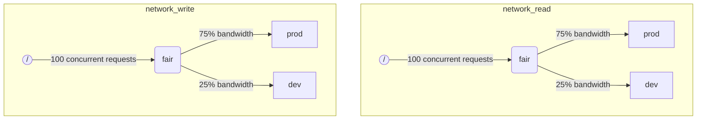

عندما ينفّذ ClickHouse عدة استعلامات في الوقت نفسه، فقد تستهلك موارد مشتركة (مثل الأقراص وأنوية CPU). ويمكن تطبيق قيود وسياسات الجدولة لتنظيم كيفية استخدام الموارد ومشاركتها بين أعباء العمل المختلفة. كما يمكن تهيئة تسلسل هرمي موحّد للجدولة لجميع الموارد. ويمثّل جذر هذا التسلسل الهرمي الموارد المشتركة، بينما تمثّل العقد الطرفية أعباء عمل محددة تحتفظ بالطلبات التي تتجاوز سعة الموارد.

<Note>
  حاليًا يمكن جدولة [إدخال/إخراج الأقراص البعيدة](#disk_config) و[CPU](#cpu_scheduling) باستخدام الطريقة الموضحة. وللاطلاع على حدود الذاكرة المرنة، راجع [الالتزام الزائد بالذاكرة](/ar/concepts/features/configuration/settings/memory-overcommit)
</Note>

<div id="disk_config">
  ## تهيئة القرص
</div>

لتمكين جدولة أحمال IO لقرص معيّن، يجب إنشاء موارد للقراءة والكتابة من أجل وصول WRITE وREAD:

```sql
CREATE RESOURCE resource_name (WRITE DISK disk_name, READ DISK disk_name)
-- or
CREATE RESOURCE read_resource_name (WRITE DISK write_disk_name)
CREATE RESOURCE write_resource_name (READ DISK read_disk_name)
```

يمكن استخدام المورد مع أي عدد من أقراص التخزين لعمليات READ أو WRITE أو لكليهما معًا (READ وWRITE). وتوجد صياغة تسمح باستخدام مورد واحد لجميع أقراص التخزين:

```sql
CREATE RESOURCE all_io (READ ANY DISK, WRITE ANY DISK);
```

هناك طريقة بديلة لتحديد الأقراص التي يستخدمها مورد ما، وذلك من خلال `storage_configuration` الخاصة بالخادم:

<Warning>
  جدولة أعباء العمل باستخدام إعدادات ClickHouse مهملة. ويجب استخدام صياغة SQL بدلًا من ذلك.
</Warning>

لتمكين جدولة IO لقرص معيّن، يجب تحديد `read_resource` و/أو `write_resource` في إعدادات التخزين. يحدّد ذلك لـ ClickHouse المورد الذي يجب استخدامه لكل طلب قراءة وكتابة على القرص المحدد. ويمكن أن يشير مورد القراءة ومورد الكتابة إلى اسم المورد نفسه، وهو ما يفيد مع أقراص Local SSD أو HDD. كما يمكن أن تشير عدة أقراص مختلفة إلى المورد نفسه، وهو ما يفيد مع الأقراص البعيدة إذا كنت تريد إتاحة تقسيم عادل لعرض نطاق الشبكة بين أعباء العمل مثلًا &quot;الإنتاج&quot; و&quot;التطوير&quot;.

مثال:

```xml
<clickhouse>
    <storage_configuration>
        ...
        <disks>
            <s3>
                <type>s3</type>
                <endpoint>https://clickhouse-public-datasets.s3.amazonaws.com/my-bucket/root-path/</endpoint>
                <access_key_id>your_access_key_id</access_key_id>
                <secret_access_key>your_secret_access_key</secret_access_key>
                <read_resource>network_read</read_resource>
                <write_resource>network_write</write_resource>
            </s3>
        </disks>
        <policies>
            <s3_main>
                <volumes>
                    <main>
                        <disk>s3</disk>
                    </main>
                </volumes>
            </s3_main>
        </policies>
    </storage_configuration>
</clickhouse>
```

لاحظ أن خيارات إعدادات الخادم لها أولوية على أسلوب SQL في تعريف الموارد.

<div id="workload_markup">
  ## وسم عبء العمل
</div>

يمكن وسم الاستعلامات بالإعداد `workload` لتمييز أعباء العمل المختلفة. وإذا لم يتم تعيين `workload`، فستُستخدم القيمة &quot;default&quot;. لاحظ أنه يمكنك أيضًا تحديد قيمة أخرى باستخدام ملفات تعريف الإعدادات. ويمكن استخدام قيود الإعداد لجعل `workload` ثابتًا إذا كنت تريد وسم جميع استعلامات المستخدم بقيمة ثابتة لإعداد `workload`.

يمكن تعيين الإعداد `workload` لعمليات الخلفية. وتستخدم عمليات الدمج والطفرات إعدادَي الخادم `merge_workload` و`mutation_workload` على الترتيب. ويمكن أيضًا تجاوز هذه القيم لجداول محددة باستخدام إعدادَي MergeTree ‏`merge_workload` و`mutation_workload`

لننظر في مثال لنظام يحتوي على عبئي عمل مختلفين: &quot;production&quot; و&quot;development&quot;.

```sql
SELECT count() FROM my_table WHERE value = 42 SETTINGS workload = 'production'
SELECT count() FROM my_table WHERE value = 13 SETTINGS workload = 'development'
```

<div id="hierarchy">
  ## التسلسل الهرمي لجدولة الموارد
</div>

من منظور النظام الفرعي للجدولة، يمثّل المورد بنيةً هرمية من عُقد الجدولة.



<Warning>
  تم إهمال جدولة أعباء العمل باستخدام إعدادات ClickHouse. ينبغي استخدام صياغة SQL بدلًا من ذلك. تُنشئ صياغة SQL جميع عُقد الجدولة اللازمة تلقائيًا، وينبغي اعتبار وصف عُقد الجدولة التالي من تفاصيل التنفيذ منخفضة المستوى، ويمكن الوصول إليه عبر جدول [system.scheduler](/ar/reference/system-tables/scheduler).
</Warning>

**أنواع العُقد الممكنة:**

* `inflight_limit` (constraint) - يحظر التنفيذ إذا تجاوز عدد الطلبات المتزامنة قيد التنفيذ `max_requests`، أو إذا تجاوزت تكلفتها الإجمالية `max_cost`؛ ويجب أن يكون له child واحد.
* `bandwidth_limit` (constraint) - يحظر التنفيذ إذا تجاوز عرض النطاق الحالي `max_speed` (0 تعني غير محدود) أو إذا تجاوزت الدفقة `max_burst` (وتساوي `max_speed` افتراضيًا)؛ ويجب أن يكون له child واحد.
* `fair` (policy) - يختار الطلب التالي الذي ستتم خدمته من إحدى عُقده الأبناء وفقًا لعدالة max-min؛ ويمكن للعُقد الأبناء تحديد `weight` (القيمة الافتراضية هي 1).
* `priority` (policy) - يختار الطلب التالي الذي ستتم خدمته من إحدى عُقده الأبناء وفقًا للأولويات الثابتة (القيمة الأقل تعني أولوية أعلى)؛ ويمكن للعُقد الأبناء تحديد `priority` (القيمة الافتراضية هي 0).
* `fifo` (queue) - عقدة طرفية في التسلسل الهرمي يمكنها الاحتفاظ بالطلبات التي تتجاوز سعة المورد.

لكي تتمكن من استخدام السعة الكاملة للمورد الأساسي، ينبغي استخدام `inflight_limit`. لاحظ أن العدد المنخفض لـ `max_requests` أو `max_cost` قد يؤدي إلى عدم الاستفادة الكاملة من المورد، بينما قد تؤدي القيم المرتفعة جدًا إلى وجود طوابير فارغة داخل المُجدول، ما يؤدي بدوره إلى تجاهل السياسات (مثل غياب العدالة أو تجاهل الأولويات) في الشجرة الفرعية. من ناحية أخرى، إذا كنت تريد حماية الموارد من الاستغلال المفرط، فينبغي استخدام `bandwidth_limit`. فهو يحدّ المعدل عندما تتجاوز كمية المورد المستهلكة خلال `duration` ثانية مقدار `max_burst + max_speed * duration` بايت. ويمكن استخدام عقدتي `bandwidth_limit` على المورد نفسه للحد من ذروة عرض النطاق خلال الفترات القصيرة ومتوسط عرض النطاق خلال الفترات الأطول.

يوضح المثال التالي كيفية تعريف البنى الهرمية لجدولة IO الظاهرة في الصورة:

```xml
<clickhouse>
    <resources>
        <network_read>
            <node path="/">
                <type>inflight_limit</type>
                <max_requests>100</max_requests>
            </node>
            <node path="/fair">
                <type>fair</type>
            </node>
            <node path="/fair/prod">
                <type>fifo</type>
                <weight>3</weight>
            </node>
            <node path="/fair/dev">
                <type>fifo</type>
            </node>
        </network_read>
        <network_write>
            <node path="/">
                <type>inflight_limit</type>
                <max_requests>100</max_requests>
            </node>
            <node path="/fair">
                <type>fair</type>
            </node>
            <node path="/fair/prod">
                <type>fifo</type>
                <weight>3</weight>
            </node>
            <node path="/fair/dev">
                <type>fifo</type>
            </node>
        </network_write>
    </resources>
</clickhouse>
```

<div id="workload_classifiers">
  ## مُصنِّفات أعباء العمل
</div>

<Warning>
  أصبحت جدولة أعباء العمل باستخدام إعدادات ClickHouse مهجورة. ويجب استخدام صياغة SQL بدلًا من ذلك. تُنشأ المُصنِّفات تلقائيًا عند استخدام صياغة SQL.
</Warning>

تُستخدم مُصنِّفات أعباء العمل لتحديد تعيين قيمة `workload` المحددة بواسطة query إلى قوائم الانتظار النهائية التي ينبغي استخدامها لموارد معيّنة. في الوقت الحالي، يكون تصنيف أعباء العمل بسيطًا: لا يتوفر سوى التعيين الثابت.

مثال:

```xml
<clickhouse>
    <workload_classifiers>
        <production>
            <network_read>/fair/prod</network_read>
            <network_write>/fair/prod</network_write>
        </production>
        <development>
            <network_read>/fair/dev</network_read>
            <network_write>/fair/dev</network_write>
        </development>
        <default>
            <network_read>/fair/dev</network_read>
            <network_write>/fair/dev</network_write>
        </default>
    </workload_classifiers>
</clickhouse>
```

<div id="workloads">
  ## التسلسل الهرمي لأحمال العمل
</div>

يوفّر ClickHouse صياغة SQL مناسبة لتعريف التسلسل الهرمي للجدولة. تشترك جميع الموارد التي أُنشئت باستخدام `CREATE RESOURCE` في البنية نفسها لهذا التسلسل الهرمي، لكنها قد تختلف في بعض الجوانب. ويتضمن كل عبء عمل أُنشئ باستخدام `CREATE WORKLOAD` عددًا قليلًا من عُقد الجدولة التي تُنشأ تلقائيًا لكل مورد. ويمكن إنشاء عبء عمل فرعي داخل عبء عمل رئيسي آخر. في ما يلي مثال يعرّف التسلسل الهرمي نفسه تمامًا كما في تهيئة XML أعلاه:

```sql
CREATE RESOURCE network_write (WRITE DISK s3)
CREATE RESOURCE network_read (READ DISK s3)
CREATE WORKLOAD all SETTINGS max_io_requests = 100
CREATE WORKLOAD development IN all
CREATE WORKLOAD production IN all SETTINGS weight = 3
```

يمكن استخدام اسم عبء عمل طرفي لا يحتوي على عناصر فرعية في إعدادات الاستعلام `SETTINGS workload = 'name'`.

لتخصيص عبء العمل، يمكن استخدام الإعدادات التالية:

* `priority` - تتم خدمة أعباء العمل الشقيقة وفقًا لقيم أولوية ثابتة (القيمة الأقل تعني أولوية أعلى).
* `weight` - تتشارك أعباء العمل الشقيقة ذات الأولوية الثابتة نفسها الموارد وفقًا للأوزان.
* `max_io_requests` - الحد الأقصى لعدد طلبات IO المتزامنة في عبء العمل هذا.
* `max_bytes_inflight` - الحد الأقصى لإجمالي البايتات قيد التنفيذ للطلبات المتزامنة في عبء العمل هذا.
* `max_bytes_per_second` - الحد الأقصى لمعدل قراءة أو كتابة البايتات في عبء العمل هذا.
* `max_burst_bytes` - الحد الأقصى لعدد البايتات التي يمكن أن يعالجها عبء العمل من دون تقييد المعدل (لكل مورد على حدة).
* `max_concurrent_threads` - الحد الأقصى لعدد خيوط التنفيذ الخاصة بالاستعلامات في عبء العمل هذا.
* `max_concurrent_threads_ratio_to_cores` - مثل `max_concurrent_threads`، ولكن محسوب نسبةً إلى عدد أنوية CPU المتاحة.
* `max_cpus` - الحد الأقصى لعدد أنوية CPU المستخدمة لخدمة الاستعلامات في عبء العمل هذا.
* `max_cpu_share` - مثل `max_cpus`، ولكن محسوب نسبةً إلى عدد أنوية CPU المتاحة.
* `max_burst_cpu_seconds` - الحد الأقصى لعدد ثواني CPU التي يمكن أن يستهلكها عبء العمل من دون تقييد المعدل بسبب `max_cpus`.

جميع الحدود المحددة عبر إعدادات عبء العمل مستقلة لكل مورد. على سبيل المثال، فإن عبء العمل الذي له `max_bytes_per_second = 10485760` ستكون له سعة نطاق قدرها 10 MB/s لكل مورد قراءة ومورد كتابة على حدة. إذا كان مطلوبًا حدٌّ مشترك للقراءة والكتابة، ففكّر في استخدام المورد نفسه لوصول READ وWRITE.

لا توجد طريقة لتحديد هياكل هرمية مختلفة لأعباء العمل لموارد مختلفة. ولكن توجد طريقة لتحديد قيمة مختلفة لإعداد عبء العمل لمورد معيّن:

```sql
CREATE OR REPLACE WORKLOAD all SETTINGS max_io_requests = 100, max_bytes_per_second = 1000000 FOR network_read, max_bytes_per_second = 2000000 FOR network_write
```

لاحظ أيضًا أنه لا يمكن حذف عبء العمل أو المورد إذا كان يُشار إلى أيٍّ منهما من عبء العمل آخر. ولتحديث تعريف عبء العمل، استخدم استعلام `CREATE OR REPLACE WORKLOAD`.

<Note>
  تُترجم إعدادات عبء العمل إلى مجموعة مناسبة من عُقَد الجدولة. ولمزيد من التفاصيل ذات المستوى الأدنى، راجع وصف [أنواع عُقَد الجدولة وخياراتها](#hierarchy).
</Note>

<div id="cpu_scheduling">
  ## جدولة CPU
</div>

لتمكين جدولة CPU لأحمال العمل، أنشئ مورد CPU وحدّد حدًا أقصى لعدد خيوط التنفيذ المتزامنة:

```sql
CREATE RESOURCE cpu (MASTER THREAD, WORKER THREAD)
CREATE WORKLOAD all SETTINGS max_concurrent_threads = 100
```

عندما ينفّذ خادم ClickHouse العديد من الاستعلامات المتزامنة باستخدام [عدّة خيوط](/ar/reference/settings/session-settings#max_threads)، وتكون جميع فتحات CPU قيد الاستخدام، يتم الوصول إلى حالة التحميل الزائد. في حالة التحميل الزائد، يُعاد جدولة كل فتحة CPU يتم تحريرها إلى عبء العمل المناسب وفقًا لسياسات الجدولة. وبالنسبة إلى الاستعلامات التي تشترك في عبء العمل نفسه، تُخصَّص الفتحات باستخدام أسلوب التناوب الدوري. أمّا الاستعلامات الموجودة في أعباء عمل منفصلة، فتُخصَّص لها الفتحات وفقًا للأوزان والأولويات والحدود المحددة لأعباء العمل.

يُستهلك وقت CPU بواسطة الخيوط عندما لا تكون متوقفة وتعمل على مهام كثيفة الاستهلاك للمعالج. ولأغراض الجدولة، يُميَّز بين نوعين من الخيوط:

* الخيط الرئيسي — أول خيط يبدأ العمل على استعلام أو نشاط في الخلفية مثل عملية دمج أو عملية mutation.
* خيط العامل — الخيوط الإضافية التي يمكن للخيط الرئيسي إنشاؤها للعمل على المهام كثيفة الاستهلاك للمعالج.

قد يكون من المرغوب استخدام موارد منفصلة للخيط الرئيسي وخيوط العامل لتحقيق استجابة أفضل. إذ يمكن لعدد كبير من خيوط العامل أن يحتكر موارد CPU بسهولة عند استخدام قيم مرتفعة لإعداد الاستعلام `max_threads`. وعندئذٍ ينبغي أن تُحجب الاستعلامات الواردة وتنتظر توفّر فتحة CPU حتى يتمكن خيطها الرئيسي من بدء التنفيذ. ولتجنّب ذلك، يمكن استخدام الإعداد التالي:

```sql
CREATE RESOURCE worker_cpu (WORKER THREAD)
CREATE RESOURCE master_cpu (MASTER THREAD)
CREATE WORKLOAD all SETTINGS max_concurrent_threads = 100 FOR worker_cpu, max_concurrent_threads = 1000 FOR master_cpu
```

سيؤدي ذلك إلى إنشاء حدود منفصلة لخيوط التنفيذ الرئيسية وخيوط التنفيذ العاملة. وحتى إذا كانت جميع فتحات CPU العاملة البالغ عددها 100 مشغولة، فلن تُحجَب الاستعلامات الجديدة ما دامت فتحات CPU الرئيسية متاحة. وستبدأ هذه الاستعلامات التنفيذ بخيط تنفيذ واحد. لاحقًا، إذا أصبحت فتحات CPU العاملة متاحة، فيمكن لهذه الاستعلامات أن تتوسع وتُنشئ خيوط التنفيذ العاملة الخاصة بها. ومن ناحية أخرى، فإن هذا النهج لا يقيّد العدد الإجمالي للفتحات بعدد معالجات CPU، كما أن تشغيل عدد كبير جدًا من خيوط التنفيذ المتزامنة سيؤثر في الأداء.

إن تقييد تزامن خيوط التنفيذ الرئيسية لن يقيّد عدد الاستعلامات المتزامنة. فقد تُحرَّر فتحات CPU أثناء تنفيذ الاستعلام ثم تستحوذ عليها خيوط تنفيذ أخرى من جديد. على سبيل المثال، يمكن تنفيذ 4 استعلامات متزامنة مع فرض حدّ قدره خيطان رئيسيان متزامنان، كلها بالتوازي. في هذه الحالة، سيحصل كل استعلام على 50% من معالج CPU. ينبغي استخدام منطق منفصل لتقييد عدد الاستعلامات المتزامنة، وهذا غير مدعوم حاليًا لأحمال العمل.

يمكن استخدام حدود تزامن منفصلة لخيوط التنفيذ لأحمال العمل:

```sql
CREATE RESOURCE cpu (MASTER THREAD, WORKER THREAD)
CREATE WORKLOAD all
CREATE WORKLOAD admin IN all SETTINGS max_concurrent_threads = 10
CREATE WORKLOAD production IN all SETTINGS max_concurrent_threads = 100
CREATE WORKLOAD analytics IN production SETTINGS max_concurrent_threads = 60, weight = 9
CREATE WORKLOAD ingestion IN production
```

يوفّر مثال على التهيئة هذا تجمعات مستقلة لفتحات CPU لكلٍّ من المسؤول وبيئة الإنتاج. ويكون تجمع بيئة الإنتاج مشتركًا بين التحليلات والإدخال. علاوة على ذلك، إذا كان تجمع بيئة الإنتاج مثقلاً، فستُعاد جدولة 9 من كل 10 فتحات يتم تحريرها إلى الاستعلامات التحليلية عند الحاجة. ولن تحصل استعلامات الإدخال إلا على فتحة واحدة من كل 10 فتحات خلال فترات الحمل الزائد. وقد يساعد ذلك في تحسين زمن الاستجابة للاستعلامات الموجّهة للمستخدم. وللتحليلات حدّ خاص بها يبلغ 60 خيط تنفيذ متزامنًا، ما يترك دائمًا 40 خيطًا على الأقل لدعم الإدخال. وعندما لا يكون هناك حمل زائد، يمكن للإدخال استخدام الخيوط المئة كلها.

لاستبعاد استعلام من جدولة CPU، اضبط إعداد الاستعلام [use&#95;concurrency&#95;control](/ar/reference/settings/session-settings#use_concurrency_control) على 0.

لا تدعم جدولة CPU عمليات الدمج والطفرات بعد.

ولتوفير تخصيصات عادلة لعبء العمل، من الضروري تنفيذ الاستباق والتقليص أثناء تنفيذ الاستعلام. يُفعَّل الاستباق باستخدام إعداد الخادم `cpu_slot_preemption`. وإذا كان مفعّلًا، يجدّد كل خيط تنفيذ فتحة CPU الخاصة به دوريًا (وفقًا لإعداد الخادم `cpu_slot_quantum_ns`). وقد يؤدي هذا التجديد إلى حظر التنفيذ إذا كان CPU مثقلاً. وعندما يُحظر التنفيذ لفترة طويلة (راجع إعداد الخادم `cpu_slot_preemption_timeout_ms`)، يُقلَّص الاستعلام وينخفض عدد خيوط التنفيذ المتزامنة العاملة ديناميكيًا. لاحظ أن عدالة وقت CPU مضمونة بين أعباء العمل، لكنها قد لا تتحقق بين الاستعلامات داخل عبء العمل نفسه في بعض الحالات الطرفية.

<Warning>
  توفّر جدولة الفتحات وسيلة للتحكم في [تزامن الاستعلامات](/ar/reference/settings/session-settings#max_threads)، لكنها لا تضمن تخصيصًا عادلًا لوقت CPU ما لم يكن إعداد الخادم `cpu_slot_preemption` مضبوطًا على `true`؛ وإلا فستُوفَّر العدالة استنادًا إلى عدد تخصيصات فتحات CPU بين أعباء العمل المتنافسة. وهذا لا يعني تساوي مقدار ثواني CPU، لأنه من دون الاستباق قد تبقى فتحة CPU محجوزة إلى أجل غير مسمى. يحصل خيط التنفيذ على فتحة في البداية ويحررها عند اكتمال العمل.
</Warning>

<Note>
  يؤدي تعريف مورد CPU إلى إبطال مفعول الإعدادين [`concurrent_threads_soft_limit_num`](/ar/reference/settings/server-settings/settings#concurrent_threads_soft_limit_num) و[`concurrent_threads_soft_limit_ratio_to_cores`](/ar/reference/settings/server-settings/settings#concurrent_threads_soft_limit_ratio_to_cores). وبدلاً من ذلك، يُستخدم إعداد عبء العمل `max_concurrent_threads` لتقييد عدد وحدات CPU المخصّصة لعبء عمل معيّن. وللحصول على السلوك السابق، أنشئ فقط مورد WORKER THREAD، واضبط `max_concurrent_threads` لعبء العمل `all` على القيمة نفسها لـ `concurrent_threads_soft_limit_num`، واستخدم إعداد الاستعلام `workload = "all"`. ويتوافق هذا الضبط مع تعيين الإعداد [`concurrent_threads_scheduler`](/ar/reference/settings/server-settings/settings#concurrent_threads_scheduler) إلى القيمة &quot;fair&#95;round&#95;robin&quot;.
</Note>

<div id="threads_vs_cpus">
  ## الخيوط مقابل وحدات CPU
</div>

هناك طريقتان للتحكم في استهلاك CPU لعبء العمل:

* حد عدد الخيوط: `max_concurrent_threads` و `max_concurrent_threads_ratio_to_cores`
* خنق CPU: `max_cpus` و `max_cpu_share` و `max_burst_cpu_seconds`

تتيح الطريقة الأولى التحكم ديناميكيًا في عدد الخيوط التي يتم إنشاؤها للاستعلام، وذلك بحسب الحمل الحالي على الخادم. وهي تقلّل فعليًا مما تفرضه إعدادات الاستعلام `max_threads`. أما الطريقة الثانية فتقوم بخنق استهلاك CPU لعبء العمل باستخدام خوارزمية token bucket. وهي لا تؤثر مباشرةً في عدد الخيوط، لكنها تحدّ من إجمالي استهلاك CPU لجميع الخيوط في عبء العمل.

يعني خنق token bucket باستخدام `max_cpus` و `max_burst_cpu_seconds` ما يلي: خلال أي interval مقداره `delta` ثانية، لا يُسمح بأن يزيد إجمالي استهلاك CPU لجميع الاستعلامات في عبء العمل على `max_cpus * delta + max_burst_cpu_seconds` ثانية CPU. وهو يقيّد متوسط الاستهلاك عند `max_cpus` على المدى الطويل، لكن قد يتم تجاوز هذا الحد على المدى القصير. على سبيل المثال، إذا كانت `max_burst_cpu_seconds = 60` و `max_cpus=0.001`، فيُسمح بتشغيل خيط واحد لمدة 60 ثانية، أو خيطين لمدة 30 ثانية، أو 60 خيطًا لمدة ثانية واحدة، من دون خنق. القيمة الافتراضية لـ `max_burst_cpu_seconds` هي ثانية واحدة. وقد تؤدي القيم الأقل إلى عدم الاستفادة الكاملة من الأنوية المسموح بها في `max_cpus` عند وجود عدد كبير من الخيوط المتزامنة.

<Warning>
  لا تكون إعدادات خنق CPU فعّالة إلا إذا كان إعداد الخادم `cpu_slot_preemption` مُمكّنًا، وإلا فسيتم تجاهلها.
</Warning>

أثناء احتفاظ خيط بفتحة CPU، يمكن أن يكون في واحدة من هذه الحالات الرئيسية الثلاث:

* **Running:** يستهلك مورد CPU فعليًا. ويُحتسب الوقت المقضي في هذه الحالة ضمن خنق CPU.
* **Ready:** ينتظر حتى تصبح وحدة CPU متاحة. لا يُحتسب ضمن خنق CPU.
* **Blocked:** ينفّذ عمليات IO أو استدعاءات نظام حاجبة أخرى (مثل انتظار mutex). لا يُحتسب ضمن خنق CPU.

لننظر إلى مثال على configuration يجمع بين خنق CPU وحدود عدد الخيوط:

```sql
CREATE RESOURCE cpu (MASTER THREAD, WORKER THREAD)
CREATE WORKLOAD all SETTINGS max_concurrent_threads_ratio_to_cores = 2
CREATE WORKLOAD admin IN all SETTINGS max_concurrent_threads = 2, priority = -1
CREATE WORKLOAD production IN all SETTINGS weight = 4
CREATE WORKLOAD analytics IN production SETTINGS max_cpu_share = 0.7, weight = 3
CREATE WORKLOAD ingestion IN production
CREATE WORKLOAD development IN all SETTINGS max_cpu_share = 0.3
```

نقيّد هنا العدد الإجمالي للخيوط لجميع الاستعلامات ليكون ضعف عدد وحدات CPU المتاحة. ويُقيَّد عبء العمل Admin بخيطين كحد أقصى، بغضّ النظر عن عدد وحدات CPU المتاحة. وتكون أولوية Admin هي ‎-1‎ (أقل من `default` ذي القيمة 0)، ويحصل أولًا على أي حصة CPU عند الحاجة. وعندما لا يُشغّل Admin أي استعلامات، تُوزَّع موارد CPU بين أعباء عمل الإنتاج والتطوير. وتعتمد الحصص المضمونة من وقت CPU على الأوزان (4 إلى 1): يذهب ما لا يقل عن 80% إلى الإنتاج (عند الحاجة)، ويذهب ما لا يقل عن 20% إلى التطوير (عند الحاجة). وبينما توفّر الأوزان هذه الضمانات، يفرض تقييد CPU حدودًا: فالإنتاج غير مقيَّد ويمكنه استهلاك 100%، بينما للتطوير حدّ قدره 30%، ويُطبَّق هذا الحد حتى إذا لم تكن هناك استعلامات من أعباء عمل أخرى. وعبء عمل الإنتاج ليس عقدة طرفية، لذا تُقسَّم موارده بين التحليلات والاستيعاب وفقًا للأوزان (3 إلى 1). وهذا يعني أن التحليلات لها حصة مضمونة لا تقل عن ‎0.8 * 0.75 = 60%‎، وبالاستناد إلى `max_cpu_share`، فلها حد أقصى يبلغ 70% من إجمالي موارد CPU. أما الاستيعاب، فرغم أن حصته المضمونة لا تقل عن ‎0.8 * 0.25 = 20%‎، فلا يوجد له حد أعلى.

<Note>
  إذا كنت تريد زيادة استخدام CPU إلى أقصى حد على ClickHouse server، فتجنّب استخدام `max_cpus` و`max_cpu_share` لعبء العمل الجذر `all`. وبدلًا من ذلك، اضبط قيمة أعلى لـ `max_concurrent_threads`. على سبيل المثال، في نظام يحتوي على 8 وحدات CPU، اضبط `max_concurrent_threads = 16`. يتيح ذلك تشغيل 8 خيوط لمهام CPU، بينما يمكن لـ 8 خيوط أخرى التعامل مع عمليات I/O. وستُحدِث الخيوط الإضافية ضغطًا على CPU، ما يضمن تطبيق قواعد الجدولة. وعلى النقيض من ذلك، فإن ضبط `max_cpus = 8` لن يُحدِث أبدًا ضغطًا على CPU لأن الخادم لا يمكنه تجاوز وحدات CPU الثماني المتاحة.
</Note>

<div id="query_scheduling">
  ## جدولة حصص الاستعلام
</div>

لتمكين جدولة حصص الاستعلام لأعباء العمل، أنشئ مورد QUERY وحدّد حدًا لعدد الاستعلامات المتزامنة أو عدد الاستعلامات في الثانية:

```sql
CREATE RESOURCE query (QUERY)
CREATE WORKLOAD all SETTINGS max_concurrent_queries = 100, max_queries_per_second = 10, max_burst_queries = 20
```

يحدّ إعداد عبء العمل `max_concurrent_queries` من عدد الاستعلامات المتزامنة التي يمكن تشغيلها في الوقت نفسه لعبء عمل معيّن. وهو مماثل لإعداد الاستعلام [`max_concurrent_queries_for_all_users`](/ar/reference/settings/session-settings#max_concurrent_queries_for_all_users) وإعداد الخادم [max&#95;concurrent&#95;queries](/ar/reference/settings/server-settings/settings#max_concurrent_queries). ولا تُحتسب استعلامات async insert وبعض الاستعلامات المحددة، مثل KILL، ضمن هذا الحد.

يحدّ إعدادا عبء العمل `max_queries_per_second` و`max_burst_queries` عدد الاستعلامات لعبء العمل باستخدام مُقيِّد من نوع token bucket. ويضمن ذلك أنه خلال أي فترة زمنية `T` لن يبدأ تنفيذ أكثر من `max_queries_per_second * T + max_burst_queries` من الاستعلامات الجديدة.

يحدّ إعداد عبء العمل `max_waiting_queries` من عدد الاستعلامات المنتظرة لعبء العمل. وعند بلوغ هذا الحد، يعيد الخادم الخطأ `SERVER_OVERLOADED`.

<Note>
  ستنتظر الاستعلامات المحجوبة إلى أجل غير مسمّى، ولن تظهر في `SHOW PROCESSLIST` حتى تُستوفى جميع القيود.
</Note>

<div id="workload_entity_storage">
  ## تخزين أحمال العمل والموارد
</div>

تُخزَّن تعريفات جميع أحمال العمل والموارد، بصيغة استعلامات `CREATE WORKLOAD` و`CREATE RESOURCE`، تخزينًا دائمًا إما على القرص في `workload_path` أو في ZooKeeper عند `workload_zookeeper_path`. ويُوصى باستخدام التخزين في ZooKeeper لتحقيق الاتساق بين العُقد. وبدلًا من ذلك، يمكن استخدام البند `ON CLUSTER` إلى جانب التخزين على القرص.

<div id="config_based_workloads">
  ## أحمال العمل والموارد المستندة إلى التهيئة
</div>

إضافةً إلى التعريفات المستندة إلى SQL، يمكن أيضًا تعريف أحمال العمل والموارد مسبقًا في ملف تهيئة الخادم. ويكون ذلك مفيدًا في البيئات السحابية، حيث تفرض البنية التحتية بعض القيود، بينما يمكن للعملاء تغيير حدود أخرى. وتكون الكيانات المستندة إلى التهيئة ذات أولوية على تلك المعرَّفة باستخدام SQL، ولا يمكن تعديلها أو حذفها باستخدام أوامر SQL.

<div id="config_based_workloads_format">
  ### تنسيق التهيئة
</div>

```xml
<clickhouse>
    <resources_and_workloads>
        CREATE RESOURCE s3disk_read (READ DISK s3);
        CREATE RESOURCE s3disk_write (WRITE DISK s3);
        CREATE WORKLOAD all SETTINGS max_io_requests = 500 FOR s3disk_read, max_io_requests = 1000 FOR s3disk_write, max_bytes_per_second = 1342177280 FOR s3disk_read, max_bytes_per_second = 3355443200 FOR s3disk_write;
        CREATE WORKLOAD production IN all SETTINGS weight = 3;
    </resources_and_workloads>
</clickhouse>
```

تستخدم هذه التهيئة صياغة SQL نفسها المستخدمة في عبارتي `CREATE WORKLOAD` و`CREATE RESOURCE`. يجب أن تكون جميع الاستعلامات صحيحة.

<div id="config_based_workloads_usage_recommendations">
  ### توصيات الاستخدام
</div>

في البيئات السحابية، قد تتضمن التهيئة النموذجية ما يلي:

1. حدِّد عبء العمل الجذري وموارد IO للشبكة في التهيئة لوضع حدود البنية التحتية
2. اضبط `throw_on_unknown_workload` لفرض هذه الحدود
3. أنشئ `CREATE WORKLOAD default IN all` لتطبيق الحدود تلقائيًا على جميع الاستعلامات (لأن القيمة الافتراضية لإعداد الاستعلام `workload` هي &#39;default&#39;)
4. اسمح للمستخدمين بإنشاء أعباء عمل إضافية ضمن التسلسل الهرمي المُعدّ

يضمن ذلك أن تلتزم جميع الأنشطة التي تعمل في الخلفية وجميع الاستعلامات بقيود البنية التحتية، مع إتاحة المرونة لسياسات الجدولة الخاصة بالمستخدمين.

ومن حالات الاستخدام الأخرى وجود تهيئات مختلفة لعُقد مختلفة في عنقود غير متجانس.

<div id="strict_resource_access">
  ## الوصول المقيّد إلى الموارد
</div>

لفرض التزام جميع الاستعلامات بسياسات جدولة الموارد، يوجد إعداد على مستوى الخادم باسم `throw_on_unknown_workload`. إذا ضُبط على `true`، فسيُطلب من كل استعلام استخدام إعداد `workload` صالح، وإلا فسيُرفع الاستثناء `RESOURCE_ACCESS_DENIED`. وإذا ضُبط على `false`، فلن يستخدم هذا الاستعلام مجدول الموارد، أي سيحصل على وصول غير محدود إلى أي `RESOURCE`. يتيح إعداد الاستعلام &#39;use&#95;concurrency&#95;control = 0&#39; للاستعلام تجاوز مجدول CPU والحصول على وصول غير محدود إلى CPU. ولفرض جدولة CPU، أنشئ قيدًا على الإعداد للإبقاء على &#39;use&#95;concurrency&#95;control&#39; كقيمة ثابتة للقراءة فقط.

<Note>
  لا تضبط `throw_on_unknown_workload` على `true` ما لم يكن `CREATE WORKLOAD default` قد نُفِّذ. فقد يؤدي ذلك إلى مشكلات في بدء تشغيل الخادم إذا نُفِّذ أثناء بدء التشغيل استعلام بدون إعداد `workload` صريح.
</Note>

<div id="see-also">
  ## راجع أيضًا
</div>

* [system.scheduler](/ar/reference/system-tables/scheduler)
* [system.workloads](/ar/reference/system-tables/workloads)
* [system.resources](/ar/reference/system-tables/resources)
* [merge&#95;workload](/ar/reference/settings/merge-tree-settings#merge_workload) إعداد MergeTree
* [merge&#95;workload](/ar/reference/settings/server-settings/settings#merge_workload) إعداد عام على مستوى الخادم
* [mutation&#95;workload](/ar/reference/settings/merge-tree-settings#mutation_workload) إعداد MergeTree
* [mutation&#95;workload](/ar/reference/settings/server-settings/settings#mutation_workload) إعداد عام على مستوى الخادم
* [workload&#95;path](/ar/reference/settings/server-settings/settings#workload_path) إعداد عام على مستوى الخادم
* [workload&#95;zookeeper&#95;path](/ar/reference/settings/server-settings/settings#workload_zookeeper_path) إعداد عام على مستوى الخادم
* [cpu&#95;slot&#95;preemption](/ar/reference/settings/server-settings/settings#cpu_slot_preemption) إعداد عام على مستوى الخادم
* [cpu&#95;slot&#95;quantum&#95;ns](/ar/reference/settings/server-settings/settings#cpu_slot_quantum_ns) إعداد عام على مستوى الخادم
* [cpu&#95;slot&#95;preemption&#95;timeout&#95;ms](/ar/reference/settings/server-settings/settings#cpu_slot_preemption_timeout_ms) إعداد عام على مستوى الخادم