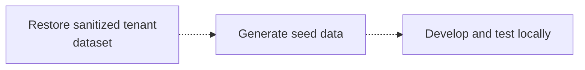

يعتمد Managed Postgres على PostgreSQL القياسي، ويتكامل مع منظومة PostgreSQL الحالية. وبالنسبة إلى معظم مهام التطوير، يمكنك التطوير والاختبار بالاعتماد على مثيل PostgreSQL محلي يعمل داخل Docker بدلًا من النشر على السحابة.

يوفّر هذا النهج دورة ملاحظات سريعة، ويُبسّط عملية الإعداد، ويقلّل الاعتماد على البنية التحتية المشتركة، ويتيح لك التجربة بأمان من دون التأثير في أنظمة الإنتاج.

ليس الهدف هو محاكاة بيئة الإنتاج بدقة تامة. بدلًا من ذلك، أنشئ بيئة محلية قابلة لإعادة الإنتاج بحيث:

* تستخدم الإصدار الرئيسي نفسه من PostgreSQL المستخدم في الإنتاج.
* تطبّق تعريفات المخطط نفسها المستخدمة في الإنتاج.
* تحتوي على بيانات تطوير ممثّلة.
* تدعم سير عمل تطوير التطبيقات واختبارها بشكل طبيعي.

وبما أن Managed Postgres يستند إلى PostgreSQL القياسي، فإن أطر الترحيل الحالية، وأدوات إدارة المخطط، وأساليب تهيئة البيانات تعمل من دون أي تعديل.

<div id="example-development-flow">
  ## مثال على سير العمل في التطوير
</div>

يكون سير العمل المعتاد للتطوير المحلي على النحو التالي:




ينسجم Managed Postgres مع سير عمل تطوير PostgreSQL الحالية. ومن خلال التطوير باستخدام مثيل PostgreSQL محلي، يمكن للفرق إجراء التعديلات بسرعة، والحفاظ على بيئات قابلة لإعادة الإنشاء، واكتساب الثقة بأن التطبيقات ستعمل بشكل متسق عند نشرها على Managed Postgres.

<div id="run-postgresql-locally-with-docker">
  ## شغّل PostgreSQL محليًا باستخدام Docker
</div>

أسهل طريقة لإنشاء بيئة تطوير محلية هي تشغيل PostgreSQL داخل Docker.

اختر إصدار PostgreSQL الذي يطابق نشر Managed Postgres لديك:

```yaml title="docker-compose.yml"
services:
  postgres:
    image: postgres:18
    container_name: local-postgres
    restart: unless-stopped

    environment:
      POSTGRES_USER: postgres
      POSTGRES_PASSWORD: postgres
      POSTGRES_DB: app

    ports:
      - "15432:5432"

    volumes:
      - postgres_data:/var/lib/postgresql

volumes:
  postgres_data:
```

ابدأ تشغيل PostgreSQL:

```bash
docker compose up -d
```

تحقّق من إمكانية الاتصال:

```bash
psql -h localhost -U postgres -p 15432 -d app
```

في هذه المرحلة، يعمل PostgreSQL محليًا، لكنه لا يتضمن بعد مخطط التطبيق أو أي بيانات خاصة ببيئة التطوير.

<div id="apply-the-application-schema">
  ## تطبيق مخطط بيانات التطبيق
</div>

لا توجد طريقة موحّدة إلزامية لإنشاء المخطط في بيئة محلية. لدى معظم المؤسسات بالفعل سير عمل راسخ لإدارة المخطط يمكن إعادة استخدامه كما هو.

<div id="application-migrations">
  ### ترحيلات التطبيق
</div>

تستخدم فرق كثيرة إطار الترحيل نفسه الذي يعمل في بيئتَي ما قبل الإنتاج والإنتاج — مثل أدوات Flyway وLiquibase وRails migrations وDjango migrations وPrisma migrations وAlembic.

يضمن تطبيق الترحيلات محليًا اختبار تطور المخطط باستمرار ضمن سير التطوير المعتاد:

```bash
./migrate up
# or
npm run migrate
# or
rails db:migrate
```

<div id="schema-only-postgresql-dumps">
  ### تفريغات PostgreSQL الخاصة بالمخطط فقط
</div>

يمكن لتصدير PostgreSQL الخاص بالمخطط فقط إعادة إنشاء بنية قاعدة بيانات موجودة. ويكون ذلك مفيدًا في الإعداد الموجّه، وفهم سلوك المخطط، والتحقق من التوافق، أو الإعداد السريع الأولي لبيئات التطوير.

صدّر المخطط:

```bash
pg_dump \
  --schema-only \
  --no-owner \
  --no-privileges \
  -h <host> \
  -U <user> \
  -d <database> \
  > schema.sql
```

استعد محليًا:

```bash
psql \
  -h localhost \
  -U postgres \
  -p 15432    \
  -d app \
  -f schema.sql
```

<div id="checked-in-sql-definitions">
  ### تعريفات SQL المحفوظة في المستودع
</div>

تحتفظ بعض الفرق بتعريفات المخطط مباشرةً ضمن نظام التحكم في الإصدارات على شكل ملفات SQL. ويمكن تطبيق هذه الملفات مباشرةً على مثيل PostgreSQL محلي أثناء إعداد البيئة.

وبصرف النظر عن النهج المتّبع، فالنتيجة الأهم هي أن إنشاء المخطط يتم تلقائيًا، ويمكن إعادة إنتاجه، ويستند إلى تعريفات خاضعة للتحكم في الإصدارات.

<div id="populate-representative-development-data">
  ## ملء بيانات تطويرية تمثيلية
</div>

بمجرد إنشاء المخطط، املأ قاعدة البيانات ببيانات تطويرية تمثيلية.

في معظم سير عمل التطوير، تكون مجموعات البيانات الاصطناعية التي تُنشأ بواسطة برامج نصية أولية كافية. إذ يسهل إعادة إنشائها، وهي آمنة للتوزيع، كما أنها تتجنب اعتبارات الامتثال والأمان المرتبطة ببيانات بيئة الإنتاج.

ومن الأساليب الشائعة في تطبيقات SaaS إنشاء بيانات لعدد صغير من المستأجرين النموذجيين، وبناء علاقات واقعية بين المستخدمين والمنتجات والطلبات وغيرها من كيانات الأعمال.

<div id="example-multi-tenant-schema">
  ### مثال على مخطط متعدد المستأجرين
</div>

يوضح المخطط التالي تطبيق SaaS مبسطًا متعدد المستأجرين:

```sql
CREATE TABLE tenants (
    id UUID PRIMARY KEY,
    name TEXT NOT NULL
);

CREATE TABLE users (
    id UUID PRIMARY KEY,
    tenant_id UUID NOT NULL REFERENCES tenants(id),
    email TEXT NOT NULL,
    first_name TEXT,
    last_name TEXT,
    created_at TIMESTAMP DEFAULT now()
);

CREATE TABLE products (
    id UUID PRIMARY KEY,
    tenant_id UUID NOT NULL REFERENCES tenants(id),
    name TEXT NOT NULL,
    price NUMERIC(10,2)
);

CREATE TABLE orders (
    id UUID PRIMARY KEY,
    tenant_id UUID NOT NULL REFERENCES tenants(id),
    user_id UUID NOT NULL REFERENCES users(id),
    status TEXT,
    created_at TIMESTAMP DEFAULT now()
);

CREATE TABLE order_items (
    id UUID PRIMARY KEY,
    order_id UUID NOT NULL REFERENCES orders(id),
    product_id UUID NOT NULL REFERENCES products(id),
    quantity INTEGER
);

CREATE TABLE audit_logs (
    id UUID PRIMARY KEY,
    tenant_id UUID NOT NULL REFERENCES tenants(id),
    entity_type TEXT,
    entity_id UUID,
    action TEXT,
    created_at TIMESTAMP DEFAULT now()
);
```

<div id="generate-sample-data">
  ### إنشاء بيانات تجريبية
</div>

ثبّت التبعيات:

```bash
pip install faker psycopg2-binary
```

أنشئ ملفًا باسم `seed.py`:

```python title="seed.py"
import random
import uuid

import psycopg2
from faker import Faker

fake = Faker()

conn = psycopg2.connect(
    host="localhost",
    port=15432,
    dbname="app",
    user="postgres",
    password="postgres"
)

cur = conn.cursor()

tenant_ids = []

for tenant_name in [
    "Tenant A",
    "Tenant B",
    "Tenant C"
]:
    tenant_id = str(uuid.uuid4())
    tenant_ids.append(tenant_id)

    cur.execute(
        """
        INSERT INTO tenants(id, name)
        VALUES (%s, %s)
        """,
        (tenant_id, tenant_name)
    )

for tenant_id in tenant_ids:

    users = []
    products = []

    for _ in range(20):
        user_id = str(uuid.uuid4())
        users.append(user_id)

        cur.execute(
            """
            INSERT INTO users(
                id,
                tenant_id,
                email,
                first_name,
                last_name
            )
            VALUES (%s,%s,%s,%s,%s)
            """,
            (
                user_id,
                tenant_id,
                fake.email(),
                fake.first_name(),
                fake.last_name()
            )
        )

    for _ in range(15):
        product_id = str(uuid.uuid4())
        products.append(product_id)

        cur.execute(
            """
            INSERT INTO products(
                id,
                tenant_id,
                name,
                price
            )
            VALUES (%s,%s,%s,%s)
            """,
            (
                product_id,
                tenant_id,
                fake.word(),
                round(random.uniform(10, 500), 2)
            )
        )

    for _ in range(50):

        order_id = str(uuid.uuid4())

        cur.execute(
            """
            INSERT INTO orders(
                id,
                tenant_id,
                user_id,
                status
            )
            VALUES (%s,%s,%s,%s)
            """,
            (
                order_id,
                tenant_id,
                random.choice(users),
                random.choice([
                    "pending",
                    "completed",
                    "cancelled"
                ])
            )
        )

        for _ in range(random.randint(1, 5)):
            cur.execute(
                """
                INSERT INTO order_items(
                    id,
                    order_id,
                    product_id,
                    quantity
                )
                VALUES (%s,%s,%s,%s)
                """,
                (
                    str(uuid.uuid4()),
                    order_id,
                    random.choice(products),
                    random.randint(1, 10)
                )
            )

        cur.execute(
            """
            INSERT INTO audit_logs(
                id,
                tenant_id,
                entity_type,
                entity_id,
                action
            )
            VALUES (%s,%s,%s,%s,%s)
            """,
            (
                str(uuid.uuid4()),
                tenant_id,
                "order",
                order_id,
                "created"
            )
        )

conn.commit()
conn.close()
```

نفِّذ البرنامج النصي:

```bash
python seed.py
```

تحتوي مجموعة البيانات الناتجة على:

| الجدول          | السجلات |
| --------------- | ------- |
| tenants         | 3       |
| users           | 60      |
| products        | 45      |
| orders          | 150     |
| order&#95;items | 400+    |
| audit&#95;logs  | 150+    |

هذه المجموعة من البيانات كبيرة بما يكفي لتجربة سير عمل التطبيقات الشائعة، ومنطق عزل المستأجرين، واستعلامات التقارير، وفحوصات سلامة العلاقات، مع بقائها خفيفة بما يكفي للتطوير والاختبار محليًا.

<div id="postgresql-clickhouse-development-environment">
  ## بيئة تطوير PostgreSQL + ClickHouse
</div>

تركّز الأمثلة أعلاه على تطوير PostgreSQL محليًا. إذا كنت تريد اختبار معمارية PostgreSQL-to-ClickHouse الكاملة محليًا، يمكنك تشغيل مكدس PostgreSQL + ClickHouse مفتوح المصدر.

يجمع هذا المكدس بين PostgreSQL لأحمال عمل المعاملات، وClickHouse للتحليلات، وPeerDB لالتقاط بيانات التغيير (CDC) الأصلي. ويتيح لك التطوير على PostgreSQL مع تكرار البيانات باستمرار إلى ClickHouse، مما يتيح اختبار التحليلات التشغيلية، وأحمال عمل التقارير، ومسارات البيانات الآنية مباشرةً من حاسوبك المحمول.

يمكن تشغيل هذا المكدس بأمر واحد، وهو يتضمن جميع الخدمات المطلوبة معدّة مسبقًا:

```bash
git clone https://github.com/ClickHouse/postgres-clickhouse-stack.git
cd postgres-clickhouse-stack

./run.sh start
```

يتضمن المكدس:

* PostgreSQL
* ClickHouse
* PeerDB لالتقاط بيانات التغيير (CDC) في PostgreSQL
* خدمات مساندة وتطبيقات تجريبية

للحصول على إرشادات الإعداد، وتفاصيل المعمارية، وشرح عملي للمكدس الكامل، راجع:

* [المدونة: PostgreSQL + ClickHouse OSS](https://clickhouse.com/blog/postgres-clickhouse-oss)
* [GitHub: postgres-clickhouse-stack](https://github.com/ClickHouse/postgres-clickhouse-stack)

تُعد هذه خطوة تالية مفيدة بعد تشغيل تطبيقك محليًا على PostgreSQL، وعندما تريد التحقق من المزامنة من PostgreSQL إلى ClickHouse، والتحليلات في الوقت الفعلي، وسلوك التطبيق من طرف إلى طرف.