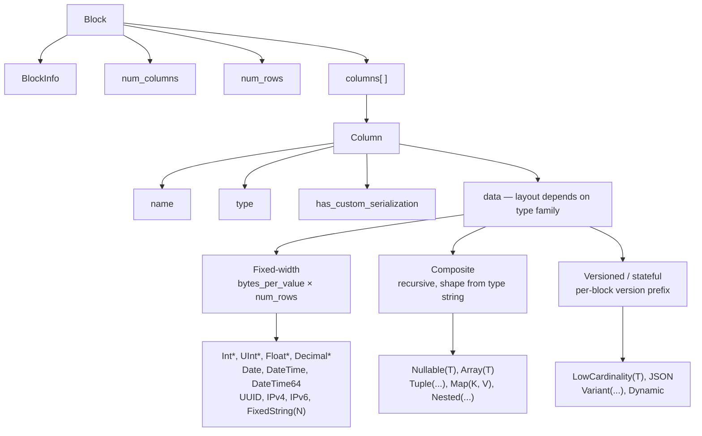
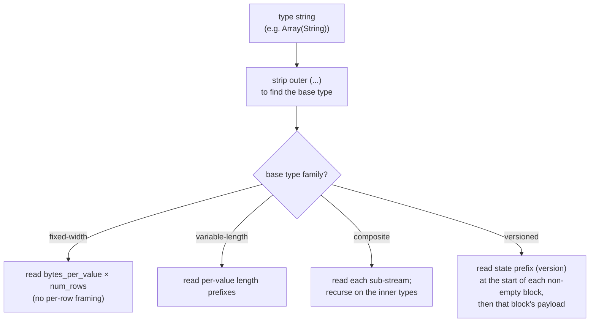
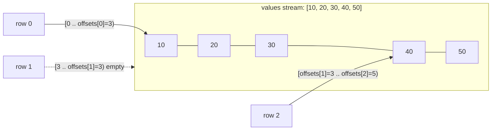
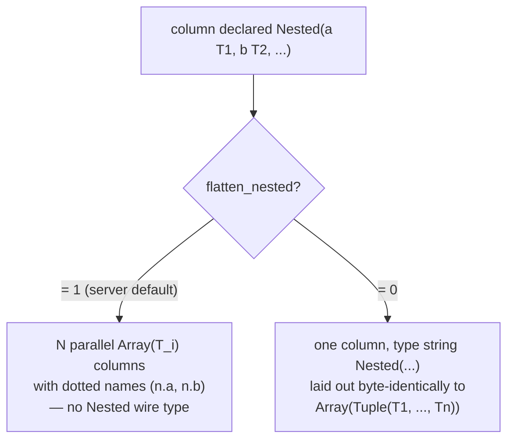
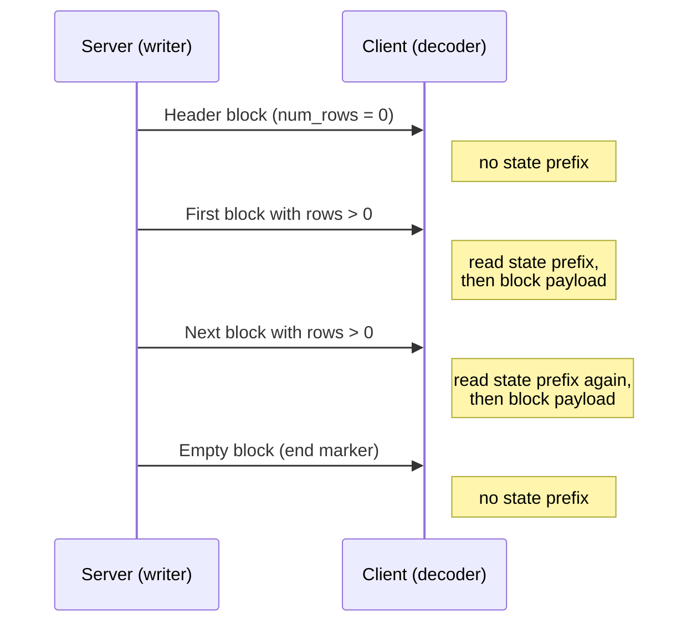
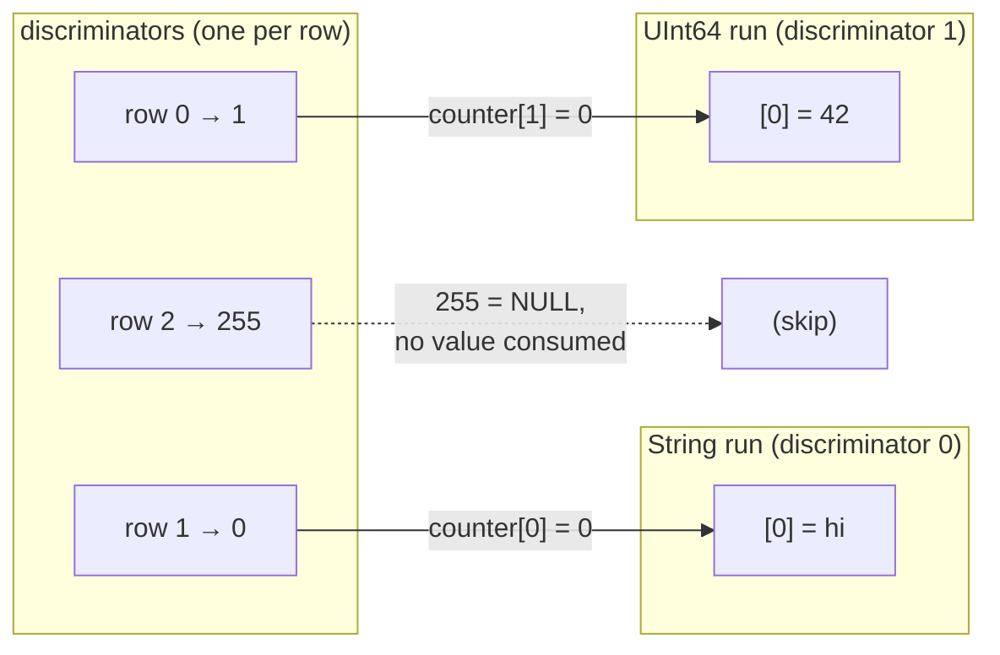
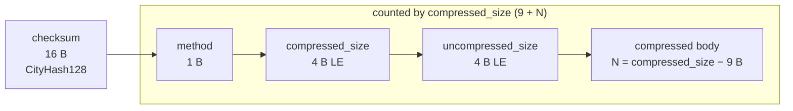

تنسيق Native هو التنسيق العمودي على مستوى wire الذي يستخدمه ClickHouse لنقل البيانات الجدولية. ويظهر في عدة مواضع:

* `body` الخاص بحزم `Data` و`Totals` و`Extremes` و`Log` و`ProfileEvents` في [بروتوكول native TCP](/ar/reference/interfaces/specs/NativeProtocol) (حزمة `TableColumns` **ليست** كتلة Native — إذ تحمل سلسلتين ثنائيتين، لذا يندرج تخطيطها ضمن [مواصفات native protocol](/ar/reference/interfaces/specs/NativeProtocol))؛
* ناتج `SELECT ... FORMAT Native` عبر HTTP؛
* تصديرات الملفات المكتوبة باستخدام `INTO OUTFILE ... FORMAT Native`؛
* حمولات النسخ المتماثل بين الخوادم.

تصف هذه الصفحة البايتات داخل Block — أي الحمولة العمودية — وترميزات الأنواع الخاصة بكل عمود التي تُشكّله. أما تأطير الحزم، وحالة connection، والتفاوض على version، فتندرج ضمن [مواصفات native protocol](/ar/reference/interfaces/specs/NativeProtocol).

جميع حقول الأعداد الصحيحة متعددة البايتات تستخدم little-endian. وتستخدم الأعداد الصحيحة الموقعة متمم الاثنين.

<Tip>
  للاطلاع على مقدمة موجّهة للمستخدم حول تنسيق `Native` (مع أمثلة `curl`)، راجع [صفحة تنسيق Native](/ar/reference/formats/Native). وهذه المواصفات هي المرجع الأدنى مستوى على مستوى wire.
</Tip>

<div id="overview">
  ## نظرة عامة
</div>

كل ما ينقل صفوفًا عبر الشبكة هو **كتلة**: جزء ذاتي الوصف من الصفوف، مخزَّن عمودًا بعمود. تأتي جميع قيم العمود 1 أولًا، ثم جميع قيم العمود 2، وهكذا. ولا تحمل الكتلة إلا الأعمدة التي يشير إليها الاستعلام، وليس الجدول كاملًا مطلقًا.

يُرتَّب `data` الخاص بالعمود وفقًا لـ *العائلة* التي ينتمي إليها نوعه. والعائلات، بترتيب تصاعدي من حيث تعقيد فك الترميز، هي:



* الأنواع **Fixed-width** ترتّب `data` على شكل بايتات خام بحجم `bytes_per_value × num_rows`، من دون أي تأطير لكل صف.
* الأنواع **المركّبة** (`Nullable`, `Array`, `Tuple`, `Map`, `Nested`) لها بنية متكررة يمكن اشتقاقها بالكامل من سلسلة النوع، من دون بادئة إصدار ومن دون حالة ممتدة عبر الكتل.
* الأنواع **المُرقَّمة بالإصدار / ذات الحالة** (`LowCardinality`, `JSON`, `Variant`, `Dynamic`) تبدأ كل كتلة غير فارغة ببادئة إصدار/حالة للتسلسل. وعبر بنية `Native` على السلك، تكون هذه البادئة وأي قاموس **لكل block** — إذ لا تحمل الصيغة أي حالة *عبر* الكتل (تنشئ جهة الكتابة حالة تسلسل جديدة لكل block وتضبط `low_cardinality_max_dictionary_size = 0`). أما الحالة عبر الكتل فهي مسألة تخص تخزين MergeTree على القرص، وليست جزءًا من البنية على السلك في Native.

<div id="wire-primitives">
  ## البدائيات على مستوى التمثيل الثنائي
</div>

يستند تنسيق Native إلى أربعة ترميزات أساسية.

| البدائية            | الحجم                | الوصف                                                |
| ------------------- | -------------------- | ---------------------------------------------------- |
| VarUInt             | 1–10 B               | عدد صحيح غير موقّع بطول متغيّر بترميز LEB-128        |
| عدد صحيح ثابت العرض | 1, 2, 4, 8, 16, 32 B | بترتيب little-endian، وبمتمّم الاثنين للقيم الموقّعة |
| String              | متغير                | بادئة طول VarUInt + بايتات خام                       |
| Bool                | 1 B                  | `0x00` = خطأ، وغير الصفر = صواب                      |

<div id="varuint">
  ### VarUInt
</div>

عدد صحيح غير موقّع بطول متغيّر يستخدم ترميز LEB-128. يحمل كل بايت 7 بتات بيانات في المواضع 0–6 وبت استمرارية واحدًا في الموضع 7. تكون بت الاستمرارية `1` عندما تتبعها بايتات أخرى و`0` في البايت الأخير.

| نطاق القيمة             | البايتات |
| ----------------------- | -------- |
| 0 – 127                 | 1        |
| 128 – 16383             | 2        |
| 16384 – 2097151         | 3        |
| حتى قيمة UInt64 الكاملة | حتى 10   |

ترميز القيمة `300`:

```text
300 = 0b100101100

Byte 0: 0xAC = 0b10101100   (data: 0101100, continuation: 1)
Byte 1: 0x02 = 0b00000010   (data: 0000010, continuation: 0)
```

فك ترميز البايتين `0xAC 0x02`:

```text
Byte 0: data = 0x2C, continuation = 1 → accumulator = 0x2C, shift = 7
Byte 1: data = 0x02, continuation = 0 → accumulator = (0x02 << 7) | 0x2C = 300
```

<div id="fixed-width-integers">
  ### الأعداد الصحيحة ثابتة العرض
</div>

| النوع   | البايتات | الترميز                             |
| ------- | -------- | ----------------------------------- |
| UInt8   | 1        | بايت خام                            |
| UInt16  | 2        | Little-endian                       |
| UInt32  | 4        | Little-endian                       |
| UInt64  | 8        | Little-endian                       |
| UInt128 | 16       | Little-endian                       |
| UInt256 | 32       | Little-endian                       |
| Int8    | 1        | بايت خام، المتممة الثنائية          |
| Int16   | 2        | Little-endian، المتممة الثنائية     |
| Int32   | 4        | Little-endian، المتممة الثنائية     |
| Int64   | 8        | Little-endian، المتممة الثنائية     |
| Int128  | 16       | Little-endian، المتممة الثنائية     |
| Int256  | 32       | Little-endian، المتممة الثنائية     |
| Float32 | 4        | IEEE 754 أحادي الدقة، Little-endian |
| Float64 | 8        | IEEE 754 مزدوج الدقة، Little-endian |

على سبيل المثال، تُرمَّز القيمة UInt32 `1` على الشكل `01 00 00 00`، وتُرمَّز القيمة Int32 `-1` على الشكل `FF FF FF FF`.

<div id="string">
  ### String
</div>

تسلسل من البايتات يسبقه الطول:

```text
[VarUInt: byte_length] [byte_length bytes: raw value]
```

ليس من الضروري أن يكون تسلسل البايتات صالحًا بترميز UTF-8. تُرمَّز السلسلة الفارغة على شكل بايت واحد `0x00`، وقد تحتوي السلاسل على أي قيم بايت، بما في ذلك NUL المضمَّن. تُرمَّز السلسلة `"ab"` على شكل `02 61 62`؛ ولفك ترميزها، اقرأ طول VarUInt (`2`)، ثم اقرأ هذا العدد من البايتات.

<div id="bool">
  ### Bool
</div>

بايت واحد. تشير القيمة `0x00` إلى false؛ وأي قيمة غير صفرية تشير إلى true (وقياسيًا `0x01`).

<div id="block-and-column-structure">
  ## بنية Block والعمود
</div>

<div id="block-wire-layout">
  ### البنية السلكية لـ Block
</div>

```text
[BlockInfo]               metadata (only on the TCP Data-packet path; see below)
[VarUInt: num_columns]    number of columns in this block
[VarUInt: num_rows]       number of rows in this block
[Column × num_columns]    column entries, omitted when num_columns = 0
```

يعتمد وجود البادئة `BlockInfo` على القناة، لأن الـ writer مُعامَل وسيطيًا وفق *revision*:

* في **native TCP protocol**، يكتب الخادم blocks وفق الـ revision المتفاوض عليه للاتصال (وهي قيمة كبيرة — إذ إن `DBMS_TCP_PROTOCOL_VERSION` تساوي `54485` في هذا الإصدار). وتُكتب `BlockInfo` كلما كانت هذه الـ revision أكبر من صفر، وهذا ما يحدث دائمًا في الاتصال الفعلي. كما يُكتب البايت `has_custom_serialization` في كل column (انظر [wire layout للأعمدة](#column-wire-layout)) عند revision `54454` فما فوق.
* إن *output format* `Native` — ‏`SELECT ... FORMAT Native` عبر HTTP، و`INTO OUTFILE ... FORMAT Native`، وformat `Native` الذي ينتجه `clickhouse-client` — يُسلسِل عند revision `0` *افتراضيًا*. وعند revision `0` تُحذف كلٌّ من البادئة `BlockInfo` والبايت `has_custom_serialization`، لذا تكون block مجرد `num_columns` و`num_rows` والأعمدة.

  عبر HTTP، لا تكون هذه الـ revision ثابتة: إذ يمكن للعميل رفعها باستخدام query parameter ‏`?client_protocol_version=<n>`، ويستخدم الخادم تلك القيمة بوصفها revision التسلسل للاستجابة.

  ومع قيمة مرتفعة بما يكفي، يتضمن خرج HTTP البادئة `BlockInfo` (تُكتب كلما كانت الـ revision أكبر من `0`) والبايت `has_custom_serialization` (يُكتب عند revision `54454` فما فوق)، تمامًا كما في مسار TCP. لذلك يجب ألا يفترض العملاء أن كل payload من `FORMAT Native` عبر HTTP تكون عند revision `0`.

بعبارة أخرى، فإن أمثلة البايتات في هذا القسم التي تبدأ ببادئة `BlockInfo` تصف payload لحزمة Data عبر TCP. أما query نفسها عند تنفيذها عبر `FORMAT Native` فتنتج الصيغة الأقصر المعروضة إلى جانبها.

<div id="blockinfo">
  ### BlockInfo
</div>

يتكوّن BlockInfo من تسلسل من الحقول، يسبق كلًّا منها معرّف حقل من نوع VarUInt، وينتهي بمعرّف الحقل `0`. إن **wire format** **ليس** ذاتي الوصف: فمعرّف الحقل لا يشفّر طول قيمته ولا نوعها، لذلك يجب أن يعرف القارئ مسبقًا نوع كل معرّف حقل قد يصادفه. ويعتبر قارئ ClickHouse نفسه أي معرّف حقل غير معروف تلفًا، ويُطلق استثناء (`UNKNOWN_BLOCK_INFO_FIELD`). أما التوافق الأمامي فيُعالَج بدلًا من ذلك عبر مراجعة البروتوكول: إذ لا يكتب المرسِل حقلًا إلا إذا كانت المراجعة المتفاوض عليها تساوي على الأقل الحد الأدنى لمراجعة ذلك الحقل، وبذلك لا يرى المستقبِل الأقدم حقلًا لا يعرفه.

| Field ID | Field                            | Type          | Min revision | Description                                                                                             |
| -------- | -------------------------------- | ------------- | ------------ | ------------------------------------------------------------------------------------------------------- |
| 1        | is&#95;overflows                 | UInt8         | 0            | كتلة فائض من GROUP BY. القيمة `0` للكتل غير الفائضة.                                                    |
| 2        | bucket&#95;number                | Int32         | 0            | bucket التجميع. القيمة `-1` للكتل غير الموزعة على buckets.                                              |
| 3        | out&#95;of&#95;order&#95;buckets | List of Int32 | 54480        | buckets تأخرت أثناء التجميع الموزّع. تُرمَّز على شكل عدد من نوع VarUInt يتبعه ذلك العدد من قيم `Int32`. |
| 0        | (terminator)                     | —             | —            | نهاية BlockInfo. مطلوبة دائمًا.                                                                         |

للحقليْن `1` و`2` حد أدنى للمراجعة مقداره `0`، لذا فهما موجودان كلما كُتب `BlockInfo` أصلًا. ولا يُكتب الحقل `3` إلا عند المراجعة `54480` فما فوق. تخطيط wire layout للحالة الشائعة (عندما تكون المراجعة أقل من `54480`):

```text
[VarUInt: 1] [UInt8: is_overflows]
[VarUInt: 2] [Int32: bucket_number]
[VarUInt: 0]
```

<div id="column-wire-layout">
  ### بنية العمود على مستوى wire
</div>

يظهر العمود `num_columns` مرة داخل Block.

| # | الحقل                            | Type                             | الشرط                                   | الوصف                                                                                                                                                                                                                                                                                                                           |
| - | -------------------------------- | -------------------------------- | --------------------------------------- | ------------------------------------------------------------------------------------------------------------------------------------------------------------------------------------------------------------------------------------------------------------------------------------------------------------------------------- |
| 1 | name                             | String                           | دائمًا                                  | اسم العمود                                                                                                                                                                                                                                                                                                                      |
| 2 | type                             | String *أو* binary type encoding | دائمًا                                  | سلسلة نوع ClickHouse (مثل `"UInt64"` و`"Array(String)"`) افتراضيًا؛ أو ترميز نوع ثنائي عندما يكون `output_format_native_encode_types_in_binary_format = 1` (انظر الملاحظة أدناه)                                                                                                                                                |
| 3 | has&#95;custom&#95;serialization | UInt8                            | feature `CUSTOM_SERIALIZATION` (v54454) | `0` = افتراضي، `1` = مخصص (يتبعه kind&#95;stack)                                                                                                                                                                                                                                                                                |
| 4 | kind&#95;stack                   | bytes                            | عندما يكون الحقل 3 = `1`                | بايت enum واحد من نوع UInt8 (انظر أدناه) يصف `serialization` غير الافتراضي (مثل sparse وغيرها). وبالنسبة إلى القيمة `COMBINATION`، يتبعه عدد VarUInt ثم هذا العدد من بايتات kind الإضافية. أما في `Tuple` (وغيره من الأنواع المركبة التي تتضمن معلومات `serialization` على مستوى العنصر)، فتكون الحمولة recursive — انظر أدناه. |
| 5 | data                             | bytes                            | دائمًا                                  | قيم العمود لجميع صفوف `num_rows`. ويعتمد التخطيط على النوع — انظر [أنواع البيانات](#data-types). أما الأعمدة sparse، فانظر أدناه.                                                                                                                                                                                               |

يعتمد مفكِّك الترميز على سلسلة `type`. وغالبًا ما تتضمن سلاسل الأنواع معاملات بين قوسين؛ لذا يزيل مفكِّك الترميز اللاحقة `(...)` لتحديد النوع الأساسي، ثم يحلّل المعاملات لاتخاذ قرارات تتعلق بالحجم أو scale أو النوع الداخلي. ويتطلب parsing قائمة معاملات تحتوي على أنواع متداخلة (مثل `Tuple` داخل `Array`) مقسِّمًا للفواصل يراعي العمق ويتتبع تداخل الأقواس، بدلًا من تقسيم بسيط عند `,`.

<Info>
  **ترميز النوع الثنائي**

  يكون الحقل `type` عبارة عن `String` نصية فقط في الوضع الافتراضي. وعند ضبط إعداد query `output_format_native_encode_types_in_binary_format = 1`، يصبح هذا الحقل بدلًا من ذلك **ترميز نوع ثنائي** — وهو الترميز نفسه القائم على الوسوم والمُوثَّق في [الترميز الثنائي لأنواع البيانات](/ar/reference/data-types/data-types-binary-encoding) — كما تستخدم قوائم نوع `Dynamic` المسطحة الترميز الثنائي نفسه لأسماء الأنواع الخاصة بها لكل نوع. وإذا كان مفكِّك الترميز يقرأ الحقل 2 دائمًا على أنه سلسلة مسبوقة بالطول، فسيتعامل مع أول وسم نوع ثنائي كما لو كان طول سلسلة، ويفقد التزامن؛ لذا يجب أن يعرف أي وضع يستخدمه stream.
</Info>



<div id="kind-stack-and-sparse-encoding">
  #### kind_stack والترميز المتناثر
</div>

يعدِّد البايت `kind_stack` تسلسلًا غير افتراضي خاصًا بكل عمود:

| Byte   | Name                         | Meaning                                                                   | Wire impact on `data`                                                                    |
| ------ | ---------------------------- | ------------------------------------------------------------------------- | ---------------------------------------------------------------------------------------- |
| `0x00` | DEFAULT                      | التسلسل الافتراضي                                                         | مطابق تمامًا لـ `has_custom = 0`                                                         |
| `0x01` | SPARSE                       | تسلسل متناثر (v54465+)                                                    | تيار الإزاحات + القيم غير الافتراضية؛ انظر أدناه                                         |
| `0x02` | DETACHED                     | عمود مُغلَّف داخل `ColumnBLOB` عبر `parallel block marshalling` (v54478+) | blob مُجهَّز مسبقًا: `VarUInt size` + هذا العدد من البايتات؛ انظر أدناه                  |
| `0x03` | DETACHED&#95;OVER&#95;SPARSE | عمود متناثر مُغلَّف داخل `ColumnBLOB`                                     | حمولة blob نفسها كما في `DETACHED`؛ انظر أدناه                                           |
| `0x04` | REPLICATED                   | صيغة قاموس للقيم المتكررة (v54482+)                                       | تيار الفهارس + قيم عناصر كثيفة؛ انظر أدناه                                               |
| `0x05` | COMBINATION                  | مكدس متعدد الأنواع                                                        | يتبعه `count` من نوع `VarUInt` ثم `count` من بايتات النوع الإضافية — انظر الملاحظة أدناه |

**تستخدم حمولة `COMBINATION` تعدادًا مختلفًا.** الصفوف الخمسة أعلاه هي رموز مضغوطة من بايت واحد. ويمثّل `COMBINATION` (`0x05`) آلية الهروب العامة لأي مكدس لا تغطيه هذه الرموز: إذ يتبعه `count` من نوع `VarUInt` ثم `count` من الإدخالات ذات البايت الواحد. وهذه الإدخالات **ليست** الرموز المضغوطة الواردة في الجدول، بل هي قيم `ISerialization::Kind` الخام:

| Byte   | Nested `Kind` |
| ------ | ------------- |
| `0x00` | DEFAULT       |
| `0x01` | SPARSE        |
| `0x02` | DETACHED      |
| `0x03` | REPLICATED    |

تختلف قيم البايت عن الرموز المضغوطة: إذ تكون `REPLICATED` هي `0x03` في هذا التعداد المتداخل، لكنها `0x04` كرمز مضغوط، ولا يوجد إدخال `DETACHED_OVER_SPARSE` — بل يظهر هذا التركيب على هيئة الإدخالين المتتاليين `SPARSE` و`DETACHED`. وأي `decoder` يواصل استخدام الجدول المضغوط للبايتات المتداخلة سيُسنِد `0x03`/`0x04` على نحو خاطئ ويفقد التزامنه.

إن `count` هو طول المكدس الكامل **بما في ذلك الإدخال `DEFAULT` الأول** الذي تبدأ به كل المكدسات. وتغطي الرموز المضغوطة بالفعل كل مكدس مكوَّن من إدخال واحد أو إدخالين، لذا يكون لدى `COMBINATION` دائمًا `count` لا يقل عن ثلاثة.

**`kind_stack` تكراري لأعمدة `Tuple`.** تمثل حمولة `kind_stack` أعلاه البايت (أو تسلسل `COMBINATION`) الخاص بمعلومات التسلسل الذاتية لعمود واحد. ويحمل `Tuple` كائن `SerializationInfoTuple`، الذي يكتب أولًا حمولة مكدس النوع *الخاصة بالـ tuple نفسه* ثم يكتب حمولة مكدس نوع كاملة لكل عنصر، بالترتيب؛ ويقرأ `decoder` البنية التكرارية نفسها عند الاسترجاع. لذلك، بالنسبة إلى `Tuple(A, B, C)` تكون بايتات الحقل 4 هي `[tuple_kind][A_kind][B_kind][C_kind]`، وتكون حمولة كل عنصر تكرارية بدورها إذا كان ذلك العنصر مركبًا أيضًا. ويُضبط البايت `has_custom_serialization` (الحقل 3) كلما كانت معلومات الـ tuple نفسه *أو معلومات أي عنصر فيه* غير افتراضية، لذلك فإن `Tuple` الذي يكون عنصره الخاص الوحيد متناثرًا أو replicated أو detached سيؤدي أيضًا إلى تضمين حمولة مكدس النوع. وأي `decoder` يقرأ فقط بايت التعداد الأحادي الأول لـ `Tuple` سيتوقف مبكرًا جدًا وسيقرأ بايتات نوع العناصر المتبقية على أنها بيانات عمود.

**تنسيق wire المتناثر.** عندما تكون `kind_stack = 0x01`، تكون `data` الخاصة بالعمود عبارة عن تيارين مكتوبين الواحد تلو الآخر ضمن تيار TCP مشترك واحد:

1. **تيار الإزاحات** — سلسلة من قيم `VarUInt`. وتكون كل قيمة `v` إحدى الحالتين:
   * القيمة `v` مع كون البت العالي عند الموضع 62 غير مضبوط: `(v & 0x3FFFFFFFFFFFFFFF)` = عدد المواضع الافتراضية قبل القيمة غير الافتراضية الصريحة التالية. ويكون هذا الموضع غير الافتراضي هو `cursor + group_size`، حيث `cursor` هو الموضع الجاري؛ وبعد ذلك يتقدم `cursor` بمقدار `group_size + 1`.
   * القيمة `v` مع ضبط البت 62 (`END_OF_GRANULE_FLAG`): تكون القيمة بعد إزالة العلامة هي عدد المواضع الافتراضية اللاحقة بعد آخر قيمة غير افتراضية. ويشير ذلك إلى نهاية تيار الإزاحات للـ block.
2. **تيار القيم** — `count` من القيم غير الافتراضية مرمّزة بكثافة في النوع الداخلي، حيث إن `count` هو عدد قيم `VarUInt` غير EOG المقروءة أعلاه.

يعيد مفكّك الترميز بناء عمود كثيف من إدخالات `num_rows`، وذلك بملء كل موضع غير مصرّح به بالقيمة الافتراضية للنوع الداخلي (`0` للأعداد الصحيحة وأعداد الفاصلة العائمة، و`""` لـ `String`، و`0` يومًا لـ `Date`، وهكذا).

يُعد العمود المتناثر `Nullable(T)` حالة خاصة، لأن القيمة الافتراضية لـ `Nullable(T)` هي **NULL**. ويحذف الترميز المتناثر بالكامل تدفق خريطة القيم الخالية المعتاد لـ `Nullable`: إذ يحدّد تدفق الإزاحة المواضع غير الافتراضية — أي المواضع غير NULL — بينما لا يحتوي تدفق القيم إلا على تلك القيم غير NULL بشكل كثيف في `T`، ويُعاد بناء كل موضع غير مصرّح به على أنه NULL. لذلك يجب على مفكّك الترميز *ألا* يبحث عن خريطة null في تدفق القيم، ويجب *ألا* يملأ الفجوات بقيمة `0` فعلية؛ بل يملؤها بـ NULL.

**wire format لـ Replicated.** عندما تكون `kind_stack = 0x04`، يكون العمود `data` قاموسًا: قائمة بقيم عناصر مميّزة، بالإضافة إلى فهرس لكل صف ضمن تلك القائمة (وهو نفس نمط lookup المستخدم في `LowCardinality`). وعندما يكون النوع الداخلي نفسه ذا إصدار — مثل `LowCardinality(T)` — تُكتب state prefix الخاصة به **أولًا**، قبل تدفق الفهرس: إذ يفوّض التسلسل Replicated مرحلة prefix phase إلى النوع الداخلي قبل كتابة `num_rows`. أما الأنواع الداخلية ذات البادئة الفارغة (الأنواع الطرفية والمركّبات العادية) فلا تضيف أي بايتات هنا.

```text
[inner type's state prefix]              empty for leaf inners; e.g. LowCardinality version (Int64 = 1)
[VarUInt num_rows]
[UInt8  size_of_indexes_type]            width of each index: 1, 2, 4, or 8 bytes
[indexes: num_rows × size_of_indexes_type bytes]
[VarUInt num_elements]
[elements: num_elements dense inner-type values]
```

تعيد وحدة فك الترميز إنشاء عمود كثيف باختيار `elements[indexes[i]]` لكل صف إخراج `i`. وتُعالَج الأنواع الداخلية المركبة بشكل تكراري: تُنشأ قائمة العناصر في النوع الداخلي أولاً، ثم تُفهرَس. وتشمل الأنواع الداخلية المدعومة الأنواع الطرفية، و`Nullable(T)`، و`Array(T)`، و`Tuple(...)`، و`Map(K, V)`، و`Nested(...)` (مع توسيع كل حقل كما في `Array`)، و`LowCardinality(T)` (يُحتفَظ بالقاموس المشترك؛ ولا تُفهرَس إلا المفاتيح الخاصة بكل عنصر).

**تنسيق wire المنفصل.** يظهر كلٌّ من `DETACHED` (`0x02`) و`DETACHED_OVER_SPARSE` (`0x03`) *فعلاً* على wire — فهما ليسا داخليَّين بحتًا. في مسار TCP، عندما يكون الضغط ممكّنًا ويكون `revision` المتفاوض عليه على الأقل `DBMS_MIN_REVISON_WITH_PARALLEL_BLOCK_MARSHALLING` ‏(v54478)، يمر العمود بثلاث خطوات:

1. يُغلَّف كل عمود مؤهَّل (غير `const`، وغير `Tuple`، وفي block يحتوي على أكثر من صف واحد) داخل `ColumnBLOB`، الذي يحتفظ بالعمود بعد أن جرت له عملية marshalling وضغطه مسبقًا خارج thread الرئيسي.
2. يُضاف `DETACHED` إلى مكدس kind للعمود المُغلَّف.
3. تُكتَب `data` الخاصة بالعمود على هيئة حجم blob من نوع `VarUInt`، متبوعًا بعدد مطابق تمامًا من بايتات blob.

إذا كان العمود المُغلَّف sparse، فسيكون مكدسه هو `{DEFAULT, SPARSE, DETACHED}`، ويُسلسَل على هيئة `DETACHED_OVER_SPARSE`. ويقرأ client الذي يفك ترميز مثل هذا العمود طول blob وبايتاته، ثم يفك ضغط blob لاستعادة payload العمود الداخلي (راجع [`ملاحظة ColumnBLOB`](#compression-negotiation) ضمن الضغط).

<div id="block-variants">
  ### متغيرات الكتلة
</div>

تشترك جميع الحزم من فئة Data في تنسيق wire نفسه للكتلة. وتختلف المتغيرات فقط في عدد الأعمدة والصفوف:

| المتغير       | num&#95;columns | num&#95;rows | الغرض                                                               |
| ------------- | --------------- | ------------ | ------------------------------------------------------------------- |
| كتلة الترويسة | N &gt; 0        | 0            | تعلن عن مخطط النتيجة (أسماء الأعمدة + الأنواع).                     |
| كتلة النتيجة  | N &gt; 0        | M &gt; 0     | صفوف النتيجة الفعلية.                                               |
| كتلة فارغة    | 0               | 0            | علامة حارسة — نهاية الإدخال من جهة العميل؛ وسم حدودي من جهة الخادم. |

<div id="byte-level-examples">
  ### أمثلة على مستوى البايت
</div>

جميع الأمثلة في هذا القسم مأخوذة من **مسار حزمة Data في TCP**، لذا فهي تتضمن البادئة `BlockInfo` والبايت `has_custom_serialization`. أما في `FORMAT Native` فتكون الكتل نفسها أقصر — ويُذكر الشكل المختصر المكافئ حيثما كان ذلك مفيدًا.

كتلة فارغة (مع BlockInfo)، بإجمالي 8 بايت:

```text
01 00                   BlockInfo: field_id=1, is_overflows=0
02 FF FF FF FF          BlockInfo: field_id=2, bucket_number=-1
00                      BlockInfo terminator
00                      num_columns = 0
00                      num_rows = 0
```

تُعلن كتلة الترويسة الخاصة بـ `SELECT 1` عن عمود واحد باسم `"1"` من النوع `UInt8`، وبعدد صفوف يساوي صفرًا. في البروتوكول ≥ 54454، يُضمَّن البايت `has_custom_serialization`:

```text
01 00                   BlockInfo: is_overflows = 0
02 FF FF FF FF          BlockInfo: bucket_number = -1
00                      BlockInfo terminator
01                      num_columns = 1
00                      num_rows = 0
01 "1"                  Column[0].name = "1"
05 "UInt8"              Column[0].type = "UInt8"
00                      Column[0].has_custom_serialization = 0
                        Column[0].data: no bytes (num_rows = 0)
```

كتلة النتائج لنفس الاستعلام، وتضم صفًا واحدًا:

```text
01 00                   BlockInfo: is_overflows = 0
02 FF FF FF FF          BlockInfo: bucket_number = -1
00                      BlockInfo terminator
01                      num_columns = 1
01                      num_rows = 1
01 "1"                  Column[0].name = "1"
05 "UInt8"              Column[0].type = "UInt8"
00                      Column[0].has_custom_serialization = 0
01                      Column[0].data: one UInt8 byte = 1
```

عبر `FORMAT Native` (المراجعة `0`)، لا تتضمن كتلة النتيجة نفسها `BlockInfo` ولا البايت `has_custom_serialization` — ويبلغ حجم `SELECT 1 FORMAT Native` ‏11 بايت:

```text
01                      num_columns = 1
01                      num_rows = 1
01 "1"                  Column[0].name = "1"
05 "UInt8"              Column[0].type = "UInt8"
01                      Column[0].data: one UInt8 byte = 1
```

(النتيجة الخالية من الصفوف، مثل كتلة تحتوي على ترويسة فقط، لا تُنتج أي بايتات على الإطلاق عبر `FORMAT Native`: إذ إن تنسيق الإخراج لا يُصدر كتلًا فارغة.)

<div id="data-types">
  ## أنواع البيانات
</div>

يوثّق هذا القسم ترميز wire للأنواع التي يمكن لتنسيق Native حملها ضمن `data` الخاصة بالعمود، وهي مُجمَّعة في أربع عائلات تتزايد فيها درجة تعقيد وحدة فك الترميز. وهناك نوعان — `AggregateFunction(func, ...)` و `QBit(T, N)` — صالحان كأنواع أعمدة `Native`، لكن لهما حمولات خاصة بالدالة أو بالنوع تخرج عن نطاق هذا القسم؛ ويُشار إليهما أدناه في المواضع التي قد يُلتبس فيها أمرهما ويُظن أنهما أسماء مستعارة.

| العائلة                      | القسم                                          | التدفقات لكل عمود | الحالة عبر الكتل                                                           |
| ---------------------------- | ---------------------------------------------- | ----------------- | -------------------------------------------------------------------------- |
| ثابتة العرض                  | [الأنواع ثابتة العرض](#fixed-width-types)      | واحد              | لا يوجد                                                                    |
| متغيرة الطول                 | [الأنواع متغيرة الطول](#variable-length-types) | واحد              | لا يوجد                                                                    |
| مركبة (بنية ثابتة)           | [الأنواع المركبة](#composite-types)            | متعددة            | لا يوجد                                                                    |
| ذات إصدارات / محتفظة بالحالة | [الأنواع ذات الإصدارات](#versioned-types)      | متعددة            | لا يوجد على Native wire — توجد بادئة حالة لكل كتلة، وتكون جديدة مع كل كتلة |

<div id="fixed-width-types">
  ### الأنواع ذات العرض الثابت
</div>

تشغل كل قيمة عددًا ثابتًا من البايتات. ويشغل عمود مكوّن من `M` صفًا مقدار `bytes_per_row × M` بايتًا بالضبط على السلك، متسلسلةً من دون فواصل أو حشو.

| سلسلة النوع         | البايتات لكل قيمة | القيمة المنطقية                                                                                 | ترميز النقل                                               |
| ------------------- | ----------------- | ----------------------------------------------------------------------------------------------- | --------------------------------------------------------- |
| `UInt8`             | 1                 | عدد صحيح غير موقّع من 8 بتات                                                                    | بايت خام                                                  |
| `UInt16`            | 2                 | عدد صحيح غير موقّع من 16 بتًا                                                                   | Little-endian                                             |
| `UInt32`            | 4                 | عدد صحيح غير موقّع من 32 بتًا                                                                   | Little-endian                                             |
| `UInt64`            | 8                 | عدد صحيح غير موقّع من 64 بتًا                                                                   | Little-endian                                             |
| `UInt128`           | 16                | عدد صحيح غير موقّع من 128 بتًا                                                                  | Little-endian                                             |
| `UInt256`           | 32                | عدد صحيح غير موقّع من 256 بتًا                                                                  | Little-endian                                             |
| `Int8`              | 1                 | عدد صحيح موقّع من 8 بتات، بمتمم اثنين                                                           | بايت خام                                                  |
| `Int16`             | 2                 | عدد صحيح موقّع من 16 بتًا، بمتمم اثنين                                                          | Little-endian                                             |
| `Int32`             | 4                 | عدد صحيح موقّع من 32 بتًا، بمتمم اثنين                                                          | Little-endian                                             |
| `Int64`             | 8                 | عدد صحيح موقّع من 64 بتًا، بمتمم اثنين                                                          | Little-endian                                             |
| `Int128`            | 16                | عدد صحيح موقّع من 128 بتًا، بمتمم اثنين                                                         | Little-endian                                             |
| `Int256`            | 32                | عدد صحيح موقّع من 256 بتًا، بمتمم اثنين                                                         | Little-endian                                             |
| `Float32`           | 4                 | IEEE 754 أحادي الدقة                                                                            | Little-endian                                             |
| `Float64`           | 8                 | IEEE 754 مزدوج الدقة                                                                            | Little-endian                                             |
| `BFloat16`          | 2                 | أعلى 16 بتًا من `Float32` وفق IEEE 754                                                          | Little-endian                                             |
| `Bool`              | 1                 | `0x00` = false، `0x01` = true                                                                   | بايت خام                                                  |
| `Date`              | 2                 | عدد الأيام منذ `1970-01-01`                                                                     | Little-endian UInt16                                      |
| `Date32`            | 4                 | عدد الأيام منذ `1970-01-01` (موقّع؛ القيم السابقة لعام 1970 مقبولة)                             | Little-endian Int32                                       |
| `DateTime`          | 4                 | Unix timestamp بالثواني                                                                         | Little-endian UInt32                                      |
| `DateTime(tz)`      | 4                 | مثل `DateTime`؛ المنطقة الزمنية عبارة عن بيانات وصفية                                           | Little-endian UInt32                                      |
| `DateTime64(s)`     | 8                 | وحدات tick عند المقياس `s` (10^-s ثانية منذ epoch)                                              | Little-endian Int64                                       |
| `DateTime64(s, tz)` | 8                 | مثل `DateTime64(s)`؛ المنطقة الزمنية عبارة عن بيانات وصفية                                      | Little-endian Int64                                       |
| `Time`              | 4                 | مدة زمنية موقّعة للساعة بالثواني                                                                | Little-endian Int32                                       |
| `Time64(s)`         | 8                 | مدة زمنية موقّعة للساعة بوحدات tick عند المقياس `s`                                             | Little-endian Int64                                       |
| `Interval<Unit>`    | 8                 | عدد موقّع؛ والوحدة موجودة في سلسلة النوع                                                        | Little-endian Int64                                       |
| `UUID`              | 16                | معرّف من 128 بتًا                                                                               | نصفان من LE UInt64 مع تبديل البايتات (راجع [UUID](#uuid)) |
| `IPv4`              | 4                 | عنوان IPv4                                                                                      | Little-endian UInt32                                      |
| `IPv6`              | 16                | عنوان IPv6                                                                                      | Network byte order، من دون swap                           |
| `Enum8`             | 1                 | عدد صحيح موقّع من 8 بتات (فهرس variant)                                                         | بايت خام                                                  |
| `Enum16`            | 2                 | عدد صحيح موقّع من 16 بتًا (فهرس variant)                                                        | Little-endian                                             |
| `Decimal(P, S)`     | 4 / 8 / 16 / 32   | `value × 10^S` كعدد صحيح موقّع؛ يعتمد العرض على P (≤9 → 4 B, ≤18 → 8 B, ≤38 → 16 B, ≤76 → 32 B) | عدد صحيح موقّع Little-endian                              |

<div id="integer-types">
  #### أنواع الأعداد الصحيحة
</div>

يمثّل `UInt8`–`UInt256` و`Int8`–`Int256` ترميزًا ثنائيًا مباشرًا لقيم الأعداد الصحيحة. تقرأ وحدة فك الترميز `bytes_per_row × num_rows` بايتًا وتفسّرها وفقًا للنوع.

عمود `UInt32` يحتوي على `[1, 256, 65536]`:

```text
01 00 00 00              row 0: 1
00 01 00 00              row 1: 256
00 00 01 00              row 2: 65536
```

عمود من النوع `Int32` يحتوي على `[-1, 42]`:

```text
FF FF FF FF              row 0: -1
2A 00 00 00              row 1: 42
```

<div id="float32-and-float64">
  #### Float32 وFloat64
</div>

أعداد فاصلة ثنائية قياسية وفق معيار IEEE 754: 4 بايتات بدقة مفردة (`binary32`) و8 بايتات بدقة مزدوجة (`binary64`)، وكلٌّ منها بترتيب little-endian. وتُحفَظ NaN و±Infinity و±0.0 والقيم دون المعيارية وتُستعاد كما هي دون تطبيع.

قيمة `Float32` ‏`1.5` ‏(`0x3FC00000`):

```text
00 00 C0 3F              little-endian IEEE 754
```

قيمة `Float64` ‏`1.5` (`0x3FF8000000000000`):

```text
00 00 00 00 00 00 F8 3F  little-endian IEEE 754
```

<div id="bfloat16">
  #### BFloat16
</div>

صيغة الفاصلة العائمة من نوع brain-float: أعلى 16 بت من `Float32` وفق معيار IEEE 754 — بت إشارة واحد، و8 بتات للأسّ، و7 بتات للمانتيسا. حجم كل قيمة 2 بايت، بترتيب little-endian، وتحتفظ بالنمط الخام المكوَّن من 16 بتًا. لاستعادة القيمة الرقمية، وسِّعها مرة أخرى إلى `Float32` بوضع النمط في النصف العلوي وتصفير النصف السفلي (أي إعادة تفسير `bits << 16` على أنه `Float32`)؛ وعندها تستخدم القيمة الموسَّعة التنسيق النصي نفسه الخاص بـ `Float32`.

قيمة `BFloat16` وهي `1.5` (النمط `0x3FC0`، وهو النصف العلوي من `Float32` `0x3FC00000`):

```text
C0 3F                    little-endian, widens to Float32 1.5
```

<div id="bool-type">
  #### Bool
</div>

متوافق ثنائيًا على مستوى النقل مع `UInt8`: بايت واحد لكل صف، `0x00` = false، `0x01` = true. وسلسلة النوع على مستوى النقل هي حرفيًا `Bool` (وليست `UInt8`)، لذلك يجب أن يتعرّف عليها `decoder` الذي يوجّه المعالجة بناءً على سلسلة النوع بشكل منفصل.

عمود `Bool`‏ `[true, false, true]`:

```text
01 00 01
```

<div id="date-and-date32">
  #### Date و Date32
</div>

يرمّز كلاهما التواريخ على هيئة عدد صحيح لعدد الأيام بالنسبة إلى حقبة Unix `1970-01-01`. ولا يتضمن أيٌّ منهما مكوّنًا للوقت.

| النوع    | البايتات | الترميز                     | النطاق                                  |
| -------- | -------- | --------------------------- | --------------------------------------- |
| `Date`   | 2        | UInt16 بترتيب little-endian | `1970-01-01` إلى `2149-06-06`           |
| `Date32` | 4        | Int32 بترتيب little-endian  | نطاق موقّع واسع، والقيم قبل 1970 مقبولة |

قيمة `Date` ‏`1970-01-02` (يوم واحد):

```text
01 00                    UInt16 LE = 1
```

قيمة `Date32` وهي `1900-01-01` (-25567 يومًا):

```text
21 9C FF FF              Int32 LE = -25567
```

<div id="datetime">
  #### DateTime
</div>

متوافق ثنائيًا مع `UInt32`: طابع زمني Unix بالثواني، 4 بايتات بترتيب little-endian. قد يظهر النوع بالشكل `DateTime` أو `DateTime('Timezone')`؛ وتؤثر المنطقة الزمنية في العرض فقط، وليست جزءًا من القيمة الثنائية. يُنتج عمودا `DateTime` ذوا معامِلَي منطقة زمنية مختلفين بايتات متطابقة لنفس اللحظة. تزيل وحدة فك الترميز لاحقة المعامل `(...)` وتعالج العمود على أنه `UInt32`.

قيمة `DateTime('UTC')` ‏`2024-03-15 14:30:00 UTC` (الطابع الزمني `1710513000`):

```text
68 5B F4 65              UInt32 LE = 1710513000
```

<div id="datetime64">
  #### DateTime64(scale[, timezone])
</div>

8 بايت، `Int64` بترتيب little-endian يمثّل وحدات tick بمقياس `10^-scale` ثانية منذ حقبة Unix. تكون المَعلمة `scale` ‏(0–9) ضمن سلسلة النوع وتحدّد وحدة الوقت:

| المقياس | حجم tick     | الاسم الشائع |
| ------- | ------------ | ------------ |
| 0       | 1 ثانية      | seconds      |
| 3       | 1 مللي ثانية | ms           |
| 6       | 1 ميكروثانية | µs           |
| 9       | 1 نانوثانية  | ns           |

يظهر النوع بالشكل `DateTime64(s)` (المنطقة الزمنية الافتراضية الضمنية للخادم) أو `DateTime64(s, 'TimezoneName')` (منطقة زمنية صريحة، للعرض فقط). وتمثّل القيم السالبة وحدات tick التي تسبق الحقبة.

قيمة `DateTime64(3, 'UTC')` هي `2024-01-15 12:30:45.123 UTC` ‏(1705321845123 ms):

```text
83 51 1A 0D 8D 01 00 00  Int64 LE = 1705321845123
```

قيمة `DateTime64(0)` هي `2024-01-15 12:30:45 UTC` (1705321845 s):

```text
75 25 A5 65 00 00 00 00  Int64 LE = 1705321845
```

<div id="time-and-time64">
  #### Time و Time64(scale)
</div>

مدة زمنية وليست نقطةً على الخط الزمني. `Time` هو عدد ثوانٍ موقَّع، 4 بايت من نوع Int32 وبترتيب little-endian؛ أما `Time64(scale)` فهو عدد ticks موقَّع وفق المقياس العشري المحدد (0–9)، 8 بايت من نوع Int64 وبترتيب little-endian — وله نفس بنية wire مثل `DateTime64`.

الصيغة النصية هي `[-]HH:MM:SS[.fraction]`، ولكن بخلاف `DateTime` فإن حقل الساعات **لا** يلتف ضمن يوم من 24 ساعة: بل يمثل إجمالي عدد الساعات، وقد يتجاوز 23. ويُحدَّد المقدار المعروض بحد أقصى قدره `999:59:59` (`3599999` ثانية)؛ وأي مقدار أكبر يُعرَض عند هذا الحد مع تصفير الجزء الكسري (`999:59:59.000`). كما يقيِّد `CAST` القيمة المخزَّنة بهذا النطاق أيضًا، رغم أن العمليات الحسابية قد تنتج قيمًا خارج النطاق لا تُقيَّد إلا عند العرض. ولا يؤثر أيٌّ من ذلك في بايتات wire، إذ تكون مجرد عدد صحيح موقَّع عادي.

قيمة `Time` وهي `45296` (`12:34:56`):

```text
F0 B0 00 00              Int32 LE = 45296
```

`Time64(3)` بالقيمة `45296789` وحدة زمن (`12:34:56.789`):

```text
95 2C B3 02 00 00 00 00  Int64 LE = 45296789
```

<Note>
  `Time` و`Time64` تجريبيتان، ويتطلبان تفعيل `allow_experimental_time_time64_type = 1` على الخادم.
</Note>

<div id="interval">
  #### Interval
</div>

`Interval<Unit>` — ‏`IntervalSecond` و`IntervalMinute` و`IntervalHour` و`IntervalDay` و`IntervalWeek` و`IntervalMonth` و`IntervalQuarter` و`IntervalYear` و`IntervalNanosecond` وما إلى ذلك. تشترك جميع الوحدات في ترميز wire واحد: العدد على شكل `Int64` موقّع من 8 بايتات بترتيب little-endian. تكون الوحدة موجودة **فقط** في سلسلة النوع — فهي لا تغيّر بايتات wire ولا الصيغة النصية، التي تكون مجرد عدد صحيح. ويتولى مسار فك ترميز واحد التعامل مع جميع الوحدات.

قيمة `IntervalDay` ‏`5`:

```text
05 00 00 00 00 00 00 00  Int64 LE = 5
```

<div id="uuid">
  #### UUID
</div>

16 بايت لكل قيمة. ترميز wire **ليس** التمثيل القياسي لـ16 بايت بتنسيق big-endian — بل يُعكس ترتيب البايتات في كل نصف مكوَّن من 8 بايتات بشكل مستقل.

النموذج المنطقي هو معرّف بطول 128 bit بصيغة نصية قياسية `xxxxxxxx-xxxx-xxxx-xxxx-xxxxxxxxxxxx`، حيث تُكتب البايتات تقليديًا بتنسيق big-endian. يأخذ نموذج wire هذه البايتات القياسية الستة عشر، ويقسّمها إلى نصفين من 8 بايتات، ثم يكتب كل نصف بتنسيق little-endian:

* بايتات Wire من 0..7 = البايتات القياسية من 0..7 بعد عكس ترتيبها.
* بايتات Wire من 8..15 = البايتات القياسية من 8..15 بعد عكس ترتيبها.

UUID `550e8400-e29b-41d4-a716-446655440000`:

```text
Canonical bytes (16):    55 0E 84 00 E2 9B 41 D4  A7 16 44 66 55 44 00 00

Wire bytes:
D4 41 9B E2 00 84 0E 55  high half byte-reversed
00 00 44 55 66 44 16 A7  low half byte-reversed
```

يظهر UUID الصفري (المكوّن بالكامل من أصفار) بالشكل نفسه في كلا التمثيلين.

<div id="ipv4-and-ipv6">
  #### IPv4 وIPv6
</div>

نوعان مترابطان من العناوين، لكن يختلف ترميز كلٍّ منهما.

`IPv4` حجمه 4 بايتات، ويُرمَّز كقيمة `UInt32` بترتيب little-endian تحمل العنوان المعياري ذي 32 بت (القيمة `(a << 24) | (b << 16) | (c << 8) | d` المشتقة من `a.b.c.d`). أما بايتات `wire` فهي بايتات ترتيب الشبكة ولكن معكوسة.

`192.168.1.10` (القيمة المعيارية ذات 32 بت `0xC0A8010A`):

```text
0A 01 A8 C0              Little-endian UInt32
```

`IPv6` طوله 16 بايتًا، ويُكتب **كما هو بترتيب البايتات على الشبكة** من دون أي تبديل — وهو نفس ترتيب البايتات المستخدم في `inet_pton(AF_INET6, ...)`.

`2001:db8::1`:

```text
20 01 0D B8 00 00 00 00  network bytes 0..7
00 00 00 00 00 00 00 01  network bytes 8..15
```

هذا عدم التناظر مقصود عمدًا: يُخزَّن IPv4 بصيغة `u32` لإجراء العمليات الحسابية وتنفيذ استعلامات النطاق بكفاءة، بينما يحتفظ IPv6 بتنسيق ترتيب الشبكة الشائع في معظم واجهات برمجة تطبيقات الشبكات.

<div id="enum8-and-enum16">
  #### Enum8 and Enum16
</div>

متوافقان على مستوى التمثيل الثنائي المنقول مع `Int8` و`Int16` على الترتيب: 1 أو 2 بايت لكل صف، وبترتيب بايتات little-endian وفق متممة الاثنين للمتغير ذي 16 بت. يوجد التعيين الكامل للقيم في سلسلة النوع:

```text
Enum8('active' = 1, 'inactive' = 2, 'banned' = -1)
Enum16('a' = 1, 'b' = 30000)
```

قد تزيل وحدة فك الترميز لاحقة المعلَمة `(...)` وتتعامل معها على أنها `Int8` / `Int16` — إذ إن بايتات wire ليست سوى فهرس عدد صحيح. أما العميل الذي يعرض التسمية فيحلّل خريطة `'name' = value` من سلسلة النوع ويحتفظ بها إلى جانب العمود: فالعدد الصحيح وحده لا يكفي لاستعادة التسمية. وتعرض المخرجات النصية التسمية (`active`) بدلًا من الفهرس، وتكون بين علامتَي اقتباس مفردتَين (`'active'`) عندما يكون enum متداخلًا داخل نوع مركّب. ولأن الخريطة لا يمكن استعادتها من عمود العدد الصحيح، فيجب الاحتفاظ بها مع قيم enum المتداخلة مثل `Array(Enum8(...))` أو `Map(Enum16(...), V)`.

عمود `Enum8('active' = 1, 'inactive' = 2)` بالقيم `[active, inactive, active]`:

```text
01 02 01
```

القيمة `30000` من النوع `Enum16(...)`:

```text
30 75                    Int16 LE = 30000
```

<div id="decimal">
  #### Decimal(P, S)
</div>

عدد صحيح موقّع مُقاس بقوة للعدد 10. يُستدل على عدد بايتات العدد الصحيح من **الدقة** `P`؛ أما **المقياس** `S` فهو الأس السالب (أي عدد الخانات بعد الفاصلة العشرية). وكلاهما موجود في سلسلة النوع.

| Precision (P) | Backing integer | Bytes |
| ------------- | --------------- | ----- |
| 1 ≤ P ≤ 9     | Int32           | 4     |
| 10 ≤ P ≤ 18   | Int64           | 8     |
| 19 ≤ P ≤ 38   | Int128          | 16    |
| 39 ≤ P ≤ 76   | Int256          | 32    |

ترميز `wire` هو العدد الصحيح الأساسي بترتيب little-endian وبصيغة مكمّل اثنين، وتكون القيمة العشرية المنطقية هي `wire_integer × 10^(-S)`.

يُخرج ClickHouse دائمًا `Decimal(P, S)` بغضّ النظر عن كيفية التصريح عن النوع. فجميع الصيغ مثل `Decimal32(S)` و`Decimal64(S)` وما إلى ذلك تُحوَّل إلى `Decimal(P, S)` على `wire` (مع ضبط `P` على الحد الأقصى الطبيعي لذلك العرض: 9 و18 و38 و76). وأي decoder يتعرّف فقط على `Decimal(P, S)` سيغطي جميع الصيغ التي يُخرجها الخادم.

القيمة `123.4567` من النوع `Decimal(9, 4)` → العدد الصحيح الأساسي `1234567`:

```text
87 D6 12 00              Int32 LE = 1234567
```

قيمة `-1.5` من النوع `Decimal(18, 1)` → العدد الصحيح المساند `-15`:

```text
F1 FF FF FF FF FF FF FF  Int64 LE = -15
```

`Decimal(38, 4)` بقيمة `123.4567` (إجمالي 16 بايت):

```text
87 D6 12 00 00 00 00 00 00 00 00 00 00 00 00 00
```

<div id="nothing">
  #### Nothing
</div>

النوع `Nothing` لا يحمل أي قيم. وعمليًا، لا يظهر إلا بوصفه النوع الداخلي لـ `Nullable(Nothing)` — وهو ما يعيده الخادم لتعبير مثل `SELECT NULL`، حيث تكون القيمة الصحيحة الوحيدة هي غياب القيمة. ومن الناحية المفاهيمية، يُعدّ نوع وحدة.

على مستوى النقل، يشغل **بايتًا نائبًا واحدًا لكل صف** تمامًا. ويُخرج الخادم المحرف ASCII `'0'` (`0x30`)، لكن أداة فك التسلسل تتجاهل هذه البايتات — فالمحتوى غير معرّف، ويجب ألا تعتمد أدوات فك الترميز على أي قيمة محددة. وعدد البايتات المكتوبة هو `num_rows × 1`، لذا يحدد `num_rows` في ترويسة العمود بالكامل مقدار ما يجب استهلاكه.

ويبقي هذا البايت لكل صف على ثبات `Block`: فلكل عمود طول يمكن اشتقاقه من `num_rows`، لذلك تفحص أدوات فك الترميز البيانات إلى الأمام من دون بادئات طول لكل خلية. ويُبلغ `Nullable` المحيط دائمًا عن كل موضع على أنه NULL، لذا لا تُفحص هذه البايتات النائبة أبدًا.

عمود `Nullable(Nothing)` يحتوي على 3 صفوف (كلها NULL):

```text
01 01 01                 null map: 1, 1, 1 (three NULLs)
30 30 30                 Nothing placeholder bytes (one per row)
```

بادئة خريطة null هي التغليف القياسي لـ `Nullable` (راجع [Nullable](#nullable))؛ أما البايتات الثلاثة الداخلية فهي حمولة `Nothing` التي يتجاوزها مفكِّك الترميز.

<div id="variable-length-types">
  ### الأنواع ذات الطول المتغير
</div>

تحمل كل قيمة طولها الخاص في التمثيل الثنائي المنقول.

<div id="string-type">
  #### String
</div>

سلسلة النوع: `String`. عمود `String` هو تتابع من `num_rows` من تسلسلات البايت المسبوقة بطولها:

```text
[VarUInt: byte_length] [byte_length bytes: raw value]
[VarUInt: byte_length] [byte_length bytes: raw value]
...
```

لا توجد فواصل بين الصفوف سوى بادئات الطول، ولا توجد حالة على مستوى الصف. السلسلة الفارغة هي بايت واحد `0x00`. تكون `String` في ClickHouse موجَّهة للبايتات لا للنص: فلا يُفرض التحقق من صحة UTF-8، وقد تحتوي القيمة على أي بايتات، بما في ذلك NUL المضمَّن. وأداة فك الترميز التي تستهدف نوع سلسلة UTF-8 إمّا أن تتحقق من الصحة عند القراءة أو تتيح البايتات الخام للمستدعي. إجمالي البايتات التي يستهلكها العمود هو `Σ (varuint_size(len_i) + len_i)` على امتداد جميع الصفوف.

عمود يضم 3 سلاسل `["ab", "", "c"]` (إجمالي 6 بايتات):

```text
02 61 62                 row 0: length 2, "ab"
00                       row 1: length 0, empty
01 63                    row 2: length 1, "c"
```

<div id="fixedstring">
  #### FixedString(N)
</div>

سلسلة النوع: `FixedString(N)`، حيث إن `N` عدد صحيح موجب (على سبيل المثال، `FixedString(16)`). يكون العمود عبارة عن `N × num_rows` من البايتات الخام بالضبط، من دون بادئات طول ومن دون فواصل. ويستخرج مفكِّك الترميز القيمة `N` من سلسلة النوع ويستهلك هذا العدد من البايتات لكل صف.

عندما تُدرِج عبارة SQL قيمة أقصر من `N` بايتًا (على سبيل المثال، `CAST('abc' AS FixedString(5))`)، يُجري الخادم حشوًا إلى اليمين ببايتات NUL (`0x00`) حتى الطول المُعلَن. وتُعد بايتات الحشو هذه جزءًا من القيمة المخزَّنة وتُرسَل على الـ wire كما هي؛ أما إزالة هذا الحشو فهي من اختصاص جهة العميل. وكما هو الحال مع `String`، فإن `FixedString(N)` أقرب إلى مصفوفة بايتات منه إلى نص — ويُستخدم عادةً للمعرّفات ثابتة العرض، أو بايتات العناوين، أو بصمات hash.

القيمتان التاليتان من `FixedString(3)` هما `["abc", "de\0"]` (إجمالي 6 بايتات):

```text
61 62 63                 row 0: 3 bytes, "abc"
64 65 00                 row 1: 3 bytes, "de" + NUL padding
```

نوعا السلاسل النصية محلّ المقارنة:

| الخاصية              | `String`           | `FixedString(N)`             |
| -------------------- | ------------------ | ---------------------------- |
| بادئة الطول لكل صف   | نعم (VarUInt)      | لا                           |
| حجم الصف             | متغيّر             | `N` بايت بالضبط              |
| إجمالي بايتات العمود | متغيّر             | `N × num_rows`               |
| حشو بايتات NUL       | لا ينطبق           | يضيف الخادم حشوًا من اليمين  |
| توقُّع UTF-8         | عادةً (من دون فرض) | لا (يُتعامل معه كبايتات خام) |
| معلَمة النوع         | لا يوجد            | العدد الصحيح `N` مطلوب       |

<div id="composite-types">
  ### الأنواع المركبة
</div>

تغلّف الأنواع المركبة نوعًا داخليًا واحدًا أو أكثر، وتشترك في نموذج wire موحّد: **تدفّقات متعددة لكل عمود**. ويُشفَّر عمود منطقي واحد على شكل تسلسلين أو أكثر من البايتات تُقرأ بصورة مستقلة ثم تُوصَل معًا.

وهي تشترك في ثلاث خصائص بنيوية:

* **بنية ثابتة لكل schema.** يتحدد التركيب بالكامل بواسطة type string وقت فك الترميز. ويكون لـ `Array(UInt32)` دائمًا تخطيط التدفّقات نفسه من block إلى آخر.
* **لا تملك version prefix خاصًا بها.** فالغلاف المركب نفسه لا يضيف أي بايت إصدار؛ كما أن framing الخاص به (`offsets` و`null-map` وتدفّقات العناصر) ثابت عبر إصدارات ClickHouse. وينطبق ذلك على *الغلاف* فقط — راجع ملاحظة prefix phase أدناه بشأن الأنواع الداخلية ذات الإصدارات.
* **لا تملك cross-block state خاصًا بها.** يكون framing الخاص بالغلاف self-describing بالكامل على مستوى كل block؛ وأي مسألة تتعلق بـ cross-block state تأتي من نوع داخلي ذي إصدار، لا من الغلاف.

الأنواع المركبة recursive — فقد يكون النوع الداخلي نفسه نوعًا مركبًا.

**مرحلة prefix قبل تدفّقات البيانات.** تمر قراءة العمود بمرحلتين، بهذا الترتيب: **state-prefix phase** ثم **data-stream phase**. لا يملك الغلاف المركب أي prefix bytes خاصة به، لكنه *يفوّض* prefix phase إلى serialization الداخلي قبل كتابة أيٍّ من تدفّقات بياناته: إذ يشغّل `SerializationArray` prefix phase الخاصة بنوعه الداخلي قبل كتابة array offsets، ويفعل `Tuple` و`Map` و`Nested` و`Nullable` الشيء نفسه عبر serializations العناصر الخاصة بها (ويشغّل `Nullable` الـ prefix الداخلي قبل null map الخاصة به).

لذلك، عندما يغلّف نوع مركب [نوعًا ذا إصدار/يحافظ على الحالة](#versioned-types) (`LowCardinality` و`Variant` و`Dynamic` و`JSON`)، فإن version/state prefix لذلك النوع الداخلي تُخرَج *أولًا* قبل offsets الخاصة بالغلاف وelement payload. فعلى سبيل المثال، يكون تخطيط `Array(LowCardinality(String))` على النحو `[LowCardinality state prefix]` → `[array offsets]` → `[flattened LowCardinality element payload]`، وليس offsets-first.

وأي decoder يقرأ offsets قبل تشغيل inner prefix phase سيفقد التزامن عند التعامل مع أي نوع مركب يحتوي على `LowCardinality` أو `Variant` أو `Dynamic` أو `JSON`. وعندما يكون كل نوع داخلي مجرد leaf عادي أو نوع مركب آخر غير ذي إصدار، فلن تُخرِج prefix phase أي بايتات، وعندها ينطبق الوصف القائم على offsets-first أدناه حرفيًا.

<div id="nullable">
  #### Nullable(T)
</div>

السلسلة النصية للنوع: `Nullable(InnerType)`. أمثلة: `Nullable(UInt32)`, `Nullable(String)`, `Nullable(FixedString(16))`, `Nullable(DateTime('UTC'))`.

مثل الأنواع المركّبة الأخرى، يفوِّض `Nullable` [مرحلة البادئة](#composite-types) إلى التسلسل الداخلي الخاص به قبل كتابة خريطة القيم NULL: فعندما يكون النوع الداخلي ذا إصدار، يُرسَل **أولًا** بادئة الحالة الخاصة بالنوع الداخلي. لذلك يبدأ `Nullable(Tuple(LowCardinality(String)))` ببادئة الحالة لـ `LowCardinality`، وليس بخريطة القيم NULL. وعندما يكون النوع الداخلي نوعًا طرفيًا أو نوعًا آخر غير ذي إصدار، لا تُنتج مرحلة البادئة أي بايتات.

يكون تخطيط wire عبارة عن مرحلة البادئة الداخلية (وهي فارغة ما لم يكن النوع الداخلي ذا إصدار)، يتبعها تدفقان متصلان، وتأتي خريطة NULL أولًا:

```text
[inner type's state prefix]   empty for leaf/non-versioned inners; emitted first when the inner is versioned
[null-map stream]             num_rows × UInt8
[values stream]               inner type's encoding for num_rows values
```

تتكوّن خريطة القيم الفارغة (`null-map`) من `num_rows` بايتًا بالضبط، بايت واحد لكل صف:

| قيمة البايت                        | المعنى                                                              |
| ---------------------------------- | ------------------------------------------------------------------- |
| `0x00`                             | القيمة موجودة في هذا الصف.                                          |
| غير صفرية (الصيغة القياسية `0x01`) | القيمة هي NULL. البايتات المقابلة في مجرى القيم تكون عنصرًا نائبًا. |

يحتوي مجرى القيم على الترميز القياسي للنوع الداخلي لجميع صفوف `num_rows` **كلها**، بما في ذلك مواضع القيم الفارغة. ويجب على أداة فك الترميز مع ذلك قراءة بايتات العنصر النائب عند مواضع القيم الفارغة لمتابعة التقدّم في المجرى، لكنها يجب أن ترجع إلى خريطة القيم الفارغة قبل تفسير أي قيمة منفردة. ويجوز للمرسلين كتابة أي بايتات عند مواضع القيم الفارغة، لذلك يجب ألا تعتمد أدوات فك الترميز على قيمة محددة للعنصر النائب.

قيم العنصر النائب حسب فئة النوع الداخلي:

| فئة النوع الداخلي                              | العنصر النائب عند موضع القيمة الفارغة     |
| ---------------------------------------------- | ----------------------------------------- |
| ثابت العرض (UInt/Int/Float/DateTime/UUID/etc.) | بايتات مهيّأة بالصفر بعرض النوع           |
| `String`                                       | سلسلة فارغة — بايت `0x00` واحد            |
| `FixedString(N)`                               | `N` بايتات صفرية                          |
| `Array(T)`                                     | مصفوفة فارغة — تتقدّم الإزاحات بمقدار صفر |
| `Tuple(T1, T2, ...)`                           | لكل عنصر عنصره النائب الخاص به            |

يمكن أن يظهر `Nullable(T)` داخل `Array` و`Tuple` و`Map` و`Nested` — ويشيع استخدام `Array(Nullable(T))` و`Tuple(Nullable(T1), T2)`. ولا تقبل القابلية للقيم الفارغة التركيب مع نفسها: يرفض الخادم `Nullable(Nullable(T))`.

قيمة من النوع `Nullable(UInt8)` بثلاثة صفوف `[5, NULL, 9]` (6 بايتات إجمالًا):

```text
00 01 00                 null-map: present, null, present
05 00 09                 values:   5, placeholder, 9
```

قيمة من النوع `Nullable(String)` تضم ثلاثة صفوف `["hello", NULL, "world"]` (15 بايت إجمالًا):

```text
00 01 00                 null-map
05 'h' 'e' 'l' 'l' 'o'   row 0: "hello"
00                       row 1: placeholder (empty string)
05 'w' 'o' 'r' 'l' 'd'   row 2: "world"
```

<div id="array">
  #### Array(T)
</div>

سلسلة النوع: `Array(InnerType)`. أمثلة: `Array(UInt32)`, `Array(String)`, `Array(Nullable(UInt32))`, `Array(Array(UInt8))`.

بنية wire هي [مرحلة البادئة](#composite-types) للنوع الداخلي (وتكون فارغة ما لم يكن النوع الداخلي ذا إصدار)، تليها سلسلتا تدفق متصلتان، مع الإزاحات أولًا:

```text
[inner type's state prefix]   empty for leaf/non-versioned inners; emitted first when the inner is versioned
[offsets stream]              num_rows × UInt64 LE
[values stream]               inner type's encoding for offsets[num_rows - 1] values
```

يتكوّن دفق الإزاحات من `num_rows` قيمة `UInt64` بترتيب little-endian تمامًا، وتمثّل كل قيمة منها **موضع النهاية التراكمي** في دفق القيم بعد عناصر ذلك الصف:

* فهرس بداية العناصر للصف `N` = `offsets[N - 1]` (أو `0` عندما `N == 0`).
* فهرس نهاية العناصر (حصري) للصف `N` = `offsets[N]`.
* عدد عناصر الصف `N` = `offsets[N] - offsets[N - 1]`.

وبالتالي، فإن `offsets[num_rows - 1]` هو إجمالي عدد العناصر عبر جميع الصفوف، ويحتوي دفق القيم على هذا العدد من القيم الداخلية متسلسلةً واحدةً تلو الأخرى.

تكون الإزاحات **رتيبة غير متناقصة**؛ فالإزاحات المتساوية المتتالية تعني صفًا فارغًا، ويجب على مفكِّك الترميز رفض الإزاحات غير الرتيبة باعتبارها تلفًا. أما العمود الفارغ (`num_rows == 0`) فيكتب صفر بايت — فلا يوجد دفق إزاحات ولا دفق قيم. ويمكن أن تكون الأنواع الداخلية أي نوع، بما في ذلك الأنواع المركبة الأخرى: فجميع `Array(Array(T))` و `Array(Tuple(...))` و `Array(Nullable(T))` صيغ صالحة.

`Array(UInt32)` مع الصفوف `[[10, 20, 30], [], [40, 50]]` (44 بايت إجمالًا):

```text
Offsets (3 × UInt64 LE = 24 bytes):
03 00 00 00 00 00 00 00      offsets[0] = 3
03 00 00 00 00 00 00 00      offsets[1] = 3 (empty row)
05 00 00 00 00 00 00 00      offsets[2] = 5

Values (5 × UInt32 LE = 20 bytes):
0A 00 00 00                  10
14 00 00 00                  20
1E 00 00 00                  30
28 00 00 00                  40
32 00 00 00                  50
```

تمثل كل إزاحة *النهاية* التراكمية للجزء الخاص بصفٍ ما من دفق القيم المشتركة؛ أما البداية فهي الإزاحة السابقة (أو `0` للصف 0). وتدل الإزاحتان المتساويتان المتتاليتان على صف فارغ:



`Array(String)` بالصفوف `[["a", "bb"], []]` (إجمالي 20 بايتًا):

```text
Offsets (2 × UInt64 LE = 16 bytes):
02 00 00 00 00 00 00 00      offsets[0] = 2
02 00 00 00 00 00 00 00      offsets[1] = 2 (empty row)

Values (2 strings, 4 bytes total):
01 'a'                       row's first string: "a"
02 'b' 'b'                   row's second string: "bb"
```

`Array(Array(UInt32))` مع الصفوف `[[[1,2]], [], [[3], [4,5]]]` يحتوي على البنية المتداخلة نفسها:

* الإزاحات الخارجية: `[1, 1, 3]` — الصف 0 يحتوي على مصفوفة داخلية واحدة، والصف 1 لا يحتوي على أي مصفوفة داخلية، والصف 2 يحتوي على 2.
* يفك `Array(UInt32)` الأوسط ترميز 3 صفوف بإزاحات `[2, 3, 5]`.
* يفك `UInt32` الأعمق ترميز 5 قيم: `[1, 2, 3, 4, 5]`.

وبذلك يصبح المجموع 24 (الإزاحات الخارجية) + 24 (الإزاحات الوسطى) + 20 (القيم) = 68 بايتًا.

<div id="tuple">
  #### Tuple(T1, T2, ...)
</div>

سلسلة النوع: `Tuple(T1, T2, ..., Tn)`. أمثلة: `Tuple(UInt32, String)`, `Tuple(Int32)`, `Tuple(Array(UInt32), String)`, `Tuple(UInt8, Tuple(Int32, String))`. يدعم ClickHouse أيضًا **named tuples** عبر `Tuple(a UInt32, b String)`؛ الأسماء هي metadata فقط ولا تؤثر في wire format.

يتكوّن wire layout من [prefix phase](#composite-types) الخاصة بالعناصر (يساهم كل عنصر ذي إصدار في state prefix الخاص به، وفق ترتيب التعريف؛ وتكون فارغة للعناصر غير ذات الإصدار)، ثم *N* streams متسلسلة، stream واحدة لكل element type، وفق ترتيب التعريف:

```text
[element state prefixes]   in declaration order; empty unless an element type is versioned
[stream for T1]    inner T1's encoding for num_rows values
[stream for T2]    inner T2's encoding for num_rows values
 ...
[stream for Tn]    inner Tn's encoding for num_rows values
```

يُشفِّر كل تدفّق عددًا من القيم يساوي تمامًا `num_rows`. لا توجد بادئة طول، ولا تدفّق إزاحات، ولا فواصل بين التدفقات. يكتب العمود الفارغ (`num_rows == 0`) صفر بايت لكل تدفّق. ويمكن أن تكون أنواع العناصر من أي نوع، بما في ذلك الأنواع المركبة الأخرى — فجميع الصيغ `Tuple(Tuple(...), ...)` و`Tuple(Array(...), ...)` و`Tuple(Nullable(T1), T2)` صالحة.

كما أن الـ tuple الخالي من العناصر `Tuple()` صالح أيضًا — وينشأ من تعبيرات مثل `SELECT tuple()` أو `CAST(x AS Tuple())`. وبما أنه لا يحتوي على أي تدفقات للعناصر، فإنه يُسلسَل بدلًا من ذلك مثل [Nothing](#nothing): **بايت عنصر نائب واحد (`0x30`، ASCII `'0'`) لكل صف**، وتتجاهله عملية إلغاء التسلسل. ويأتي عدد الصفوف من ترويسة الكتلة، تمامًا كما هو الحال مع `Nothing`.

`Tuple(UInt8, UInt8)` مع 3 صفوف `(1,4), (2,5), (3,6)`:

```text
Element 0 stream (3 × UInt8 = 3 bytes):
01 02 03

Element 1 stream (3 × UInt8 = 3 bytes):
04 05 06
```

التخطيط **ليس** بترتيب الصفوف: فعند قراءة البايتات الخام مجددًا تكون النتيجة `[1, 2, 3]` للعنصر 0 و`[4, 5, 6]` للعنصر 1.

`Tuple(UInt32, String)` مع صفَّين `(10, "a")`، `(20, "bb")` (13 بايتًا إجمالًا):

```text
Element 0 stream (2 × UInt32 LE = 8 bytes):
0A 00 00 00                  10
14 00 00 00                  20

Element 1 stream (2 strings, 5 bytes total):
01 'a'                       "a"
02 'b' 'b'                   "bb"
```

<div id="map">
  #### Map(K, V)
</div>

سلسلة النوع: `Map(KeyType, ValueType)`. أمثلة: `Map(String, UInt32)`, `Map(String, Array(UInt32))`, `Map(UInt8, Tuple(Int32, String))`, `Map(Array(String), Int8)`. لا يفرض تنسيق wire أي قيود على أيٍّ من النوعين — إذ يمكن أن يكون كلٌّ من `K` و`V` أيَّ نوع مدعوم، بما في ذلك الأنواع المركّبة. (اختلفت قواعد ClickHouse على مستوى SQL بشأن أنواع المفاتيح المقبولة عبر الإصدارات؛ راجع وثائق SQL الخاصة بإصدار الخادم المستهدف.)

يتطابق تخطيط wire بايتًا لبايت مع `Array(Tuple(K, V))`، لذا يبدأ بمرحلة البادئة الداخلية [prefix phase](#composite-types) (وتكون فارغة ما لم يكن `K` أو `V` ذا إصدار):

```text
[K/V state prefixes]   from the inner Tuple's prefix phase; empty unless K or V is versioned
[offsets stream]    num_rows × UInt64 LE                   ← from Array
[keys stream]       K's encoding for total_pairs values    ┐ from Tuple's
[values stream]     V's encoding for total_pairs values    ┘ per-element streams
```

حيث `total_pairs = offsets[num_rows - 1]` (أو `0` عندما `num_rows == 0`). ويملك تدفّق offsets الدلالات نفسها كما في [Array](#array). تكون المفاتيح مصطفّة موضعيًا مع القيم: الزوج `i` هو `(keys[i], values[i])`.

التمثيل داخل الذاكرة في ClickHouse لعمود من النوع Map هو مصفوفة من Tuple؛ لكن نظام الأنواع يقدّمه كنوع مستقل لتسهيل الاستخدام في SQL (`m['key']`, `mapKeys`, `mapValues`). ويكون wire format عبارة عن serialization مباشر لذلك التخزين، لذا فإن `Map` و `Array(Tuple(K, V))` متكافئان تمامًا على مستوى البايتات.

تكون offsets رتيبة غير متناقصة، ويحتوي كلٌّ من تدفّقي المفاتيح والقيم على `total_pairs` قيمة بالضبط. لا يكتب العمود الفارغ أي بايتات. وداخل الصف الواحد تكون المفاتيح عادةً فريدة، لكن هذه قاعدة دلالية وليست قاعدة يفرضها wire: إذ يتيح wire format تمرير المفاتيح المكررة ذهابًا وإيابًا كما هي، ولا تُحسم التكرارات وفق دلالات جهة الخادوم إلا عندما يستهلك الصفَّ تابعٌ مدركٌ لـ Map.

`Map(UInt8, UInt8)` مع صفّين `{1:10, 2:20}`، `{3:30}` (22 بايتًا إجمالًا):

```text
Offsets (2 × UInt64 LE = 16 bytes):
02 00 00 00 00 00 00 00      offsets[0] = 2
03 00 00 00 00 00 00 00      offsets[1] = 3

Keys (3 × UInt8 = 3 bytes):
01 02 03                     keys: 1, 2, 3

Values (3 × UInt8 = 3 bytes):
0A 14 1E                     values: 10, 20, 30
```

تُخزَّن المفاتيح والقيم في تدفقات منفصلة، لا بشكل متداخل — ويُعاد بناء الزوج `i` بقراءة `keys[i]` و`values[i]` معًا.

`Map(String, UInt32)` مع صف واحد `{'a':1, 'b':2}` (20 بايت إجمالًا):

```text
Offsets (1 × UInt64 LE = 8 bytes):
02 00 00 00 00 00 00 00      offsets[0] = 2

Keys (2 strings, 4 bytes total):
01 'a'                       "a"
01 'b'                       "b"

Values (2 × UInt32 LE = 8 bytes):
01 00 00 00                  1
02 00 00 00                  2
```

<div id="nested">
  #### Nested(name1 T1, name2 T2, ...)
</div>

يعتمد التمثيل المنقول لـ `Nested` على إعداد `flatten_nested` على جهة الخادم، ما يؤدي إلى حالتين مختلفتين.



**الحالة A: `flatten_nested = 1` (إعداد الخادم `default`).** عندما يُنشأ الجدول بالإعدادات الافتراضية، فإن `Nested` **ليس نوعًا على مستوى wire**. يخزّن الخادم العمود ويعرضه على شكل N من الأعمدة المتوازية من النوع `Array(T_i)` ذات **الأسماء المنقوطة** (`outer.field1` و`outer.field2` وما إلى ذلك). وعلى مستوى طبقة format، لا يوجد ما هو جديد — فكل عمود منقوط ليس إلا [Array](#array) عاديًا:

```text
DESCRIBE TABLE t   -- t has column n Nested(a UInt8, b String)
id     UInt8
n.a    Array(UInt8)
n.b    Array(String)
```

**الحالة B: `flatten_nested = 0`.** عند إنشاء الجدول باستخدام `flatten_nested = 0`، يظهر العمود في التمثيل المنقول كعمود واحد ذي سلسلة نوع `Nested(name1 T1, name2 T2, ...)`، ويكون تخطيطه بعد سلسلة النوع **مطابقًا على مستوى البايت لـ `Array(Tuple(T1, T2, ..., Tn))`** — بما في ذلك [مرحلة البادئة](#composite-types) الداخلية، لذا فإن أي حقل مُزوَّد بإصدار `T_i` يُخرِج بادئة حالته أولًا، قبل الإزاحات. ويستخدم المثال أدناه حقولًا بلا إصدار، لذا تكون مرحلة البادئة فارغة:

```text
Nested(a UInt8, b String) bytes (after type string):
  02 00 00 00 00 00 00 00       offsets[0] = 2
  03 00 00 00 00 00 00 00       offsets[1] = 3
  0A 14 1E                       UInt8 stream
  01 'x' 01 'y' 01 'z'           String stream

Array(Tuple(a UInt8, b String)) bytes (after type string):
  02 00 00 00 00 00 00 00       offsets[0] = 2
  03 00 00 00 00 00 00 00       offsets[1] = 3
  0A 14 1E                       UInt8 stream
  01 'x' 01 'y' 01 'z'           String stream
```

الاختلاف الوحيد هو نص سلسلة النوع: إذ يحتفظ `Nested` بأسماء الحقول (`a`, `b`)، بينما لا يحتفظ `Array(Tuple)` بهذه الأسماء على شكل خانات مسماة.

سلسلة النوع للحالة B هي قائمة من أزواج (الاسم، النوع) مفصولة بفواصل. ويفصل أول فراغ بين الاسم ونوعه؛ وقد يحتوي النوع نفسه على فراغات إضافية وفواصل وأقواس، لذا يحتاج التحليل إلى أداة التقسيم نفسها المراعية للعمق والمستخدمة مع `Tuple`. بنية wire:

```text
[offsets stream]    num_rows × UInt64 LE                       ← from Array
[field1 stream]     T1's encoding for total_elements values    ┐ from Tuple's
[field2 stream]     T2's encoding for total_elements values    │ per-element
 ...                                                            │ streams
[fieldn stream]     Tn's encoding for total_elements values    ┘
```

حيث `total_elements = offsets[num_rows - 1]` (أو `0` عندما `num_rows == 0`). الإزاحات رتيبة غير متناقصة، ويحتوي كل تدفق حقل على `total_elements` قيمة بالضبط. يفرض الخادم، في وقت INSERT، أنه ضمن صف واحد يجب أن تحتوي جميع الحقول على العدد نفسه من العناصر. يكتب العمود الفارغ صفر بايت.

`Nested(a UInt8, b String)` مع صفَّين `[(10,'x'),(20,'y')]` و `[(30,'z')]` (25 بايت بعد سلسلة النوع):

```text
Offsets (2 × UInt64 LE = 16 bytes):
02 00 00 00 00 00 00 00      offsets[0] = 2
03 00 00 00 00 00 00 00      offsets[1] = 3

Field 'a' stream (3 × UInt8 = 3 bytes):
0A 14 1E                     10, 20, 30

Field 'b' stream (3 strings, 6 bytes):
01 'x' 01 'y' 01 'z'         "x", "y", "z"
```

<div id="type-aliases">
  ### الأسماء المستعارة للأنواع
</div>

بعض الأنواع ليست سوى أسماء مستعارة بحتة: إذ يرسل الخادم اسم الاسم المستعار في ترويسة العمود، لكن البايتات التالية تكون بايتات نوع أساسي فعلي. ويقوم مفكّك الترميز بربط الاسم المستعار بذلك النوع وإعادة استخدام الـ codec الخاص به — من دون أي wire format جديد.

الأنواع الجغرافية هي أسماء مستعارة لمصفوفات وTuples متداخلة:

| سلسلة النوع                  | نوع wire الأساسي          |
| ---------------------------- | ------------------------- |
| `Point`                      | `Tuple(Float64, Float64)` |
| `Ring`, `LineString`         | `Array(Point)`            |
| `Polygon`, `MultiLineString` | `Array(Ring)`             |
| `MultiPolygon`               | `Array(Polygon)`          |

لذلك يُفك ترميز عمود `Point` تمامًا مثل `Tuple(Float64, Float64)` (ويُعرض بالشكل `(1,2)`)، ويُفك ترميز `Ring` مثل `Array(Tuple(Float64, Float64))` (`[(0,0),(1,1)]`)، وهكذا صعودًا عبر التسلسل الهرمي.

ويُعد `Geometry` أيضًا اسمًا مستعارًا، لكنه يشير إلى [`Variant`](#variant) لا إلى مصفوفة متداخلة: إذ تكون الـ payload الخاصة به هي variant للأنواع الجغرافية الستة المذكورة أعلاه. ولا تحمل ترويسة العمود سوى سلسلة النوع `Geometry` — فهي **لا** تذكر الـ variant صراحةً — لذلك يجب على مفكّك الترميز توسيعه بنفسه. وكما هو الحال مع أي `Variant`، تتبع discriminators الترتيب القانوني المرتّب أبجديًا لأسماء geo المستعارة: `0` = `LineString`، `1` = `MultiLineString`، `2` = `MultiPolygon`، `3` = `Point`، `4` = `Polygon`، `5` = `Ring`. بعد ذلك، يُفك ترميز كل قيمة محددة عبر اسمها الجغرافي المستعار أعلاه (`NULL` يستخدم discriminator الخاص بـ `Variant` للقيمة `NULL` وهو `255`).

`SimpleAggregateFunction(func, T)` هو اسم مستعار لنوع القيمة `T`. فهو يخزّن قيمة aggregate نهائية بالفعل، لذا فإن تمثيله على wire وطريقة عرضه يطابقان تمامًا ما لدى `T` (فمثلًا يُفك ترميز `SimpleAggregateFunction(sum, UInt64)` على أنه `UInt64`). ولا ينطبق ذلك إلا على الصيغة ذات نوع القيمة الواحد؛ أما النوع الأساسي نفسه فقد يكون مركبًا.

<Note>
  هناك نوعان مرتبطان **ليسا** اسمين مستعارين. وهما نوعا أعمدة صالحان في `Native` — فبإمكان client، على سبيل المثال، تلقّي عمود `AggregateFunction` من combinator ‏`-State` أو من aggregation موزعة — لكن لكلٍّ منهما payload متخصصة خاصة به، وهو ما يخرج عن نطاق هذه الصفحة:

  * `AggregateFunction(func, ...)` يحتفظ بحالة aggregation *وسيطة* (وليس قيمة نهائية)؛ ويكون تخطيطه الثنائي خاصًا بدالة aggregate والإصدار.
  * `QBit(T, N)` يخزّن متجهًا مع bit planes منقولة لأعباء عمل البحث المتجهي.
</Note>

<div id="versioned-types">
  ### الأنواع ذات الإصدارات
</div>

تحمل الأنواع ذات الإصدارات بادئة لإصدار التسلسل على مستوى on-wire تُحدِّد صيغة الترميز التي تليها. وقد تستخدم أيضًا عدة تدفّقات (مثل الأنواع المركّبة). في تمثيل `Native` على مستوى wire، تكون البادئة وأي Dictionary خاصة بكل block — ولا تحتفظ هذه الأنواع بأي حالة مشتركة بين الـ block (انظر [ملاحظة البادئة لكل block](#serialization-version-concept) أدناه)؛ ولا توجد حالة تسلسل مشتركة بين الـ block إلا في تدفّق MergeTree المخزَّن على القرص.

هذه الأنواع أكثر تعقيدًا بكثير من الأنواع المركّبة ذات البنية الثابتة، ويمكن للعميل الذي يستهدف استعلامات تحليلية بسيطة تأجيل التعامل معها.

<div id="serialization-version-concept">
  #### إصدار التسلسل: المفهوم
</div>

**إصدار التسلسل** هو رقم إصدار on-wire لكل نوع ولكل عمود، يحدد أي صيغة من ترميز النوع يستخدمها المُرسِل. وهو أول ما يظهر في state prefix الخاص بالعمود، لذلك يقرؤه decoder ثم يوجّه المعالجة إلى parser المناسب لبقية العمود.

وهو يختلف عن إصدار البروتوكول:

| البعد             | إصدار البروتوكول            | إصدار التسلسل (هذا القسم)           |
| ----------------- | --------------------------- | ----------------------------------- |
| النطاق            | على مستوى الاتصال بالكامل   | لكل نوع ولكل عمود                   |
| التفاوض           | نعم، عند handshake          | لا — المُرسِل يكتبه، والمتلقي يقرؤه |
| ما الذي يتحكم فيه | ميزات مستوى الحزمة المفعّلة | صيغة wire لنوع واحد                 |
| إلزامية القراءة   | نعم                         | نعم، لكل عمود ذي إصدار              |

تكتب معظم الأنواع ذات الإصدار هذا الإصدار بصيغة `UInt64` وبترتيب `little-endian` مباشرةً قبل أي بيانات أخرى في state prefix؛ فيما يستخدم عدد قليل منها `VarUInt` أو `UInt8`. يقرأ decoder الإصدار أولًا ويرفض القيم غير المعروفة — فالإصدار الأعلى يعني أن المُرسِل يستخدم تنسيقًا أحدث لا يفهمه decoder، وقراءته بصورة خاطئة تُفسد كل بايت لاحق.

يُصدَر state prefix في بداية **كل block يزيد عدد صفوفه على صفر**، مباشرةً قبل payload الخاص بذلك block.

لا يحتفظ `Native` writer وreader **بحالة التسلسل عبر الـ blocks**: إذ ينشئ `NativeWriter` حالة `serialize` جديدة ويكتب state prefix لكل block عمود غير فارغ يكتبه، كما ينشئ `NativeReader` حالة `deserialize` جديدة ويقرؤها لكل block غير فارغ يقرؤه (ويتجاوز كلاهما البادئة بالكامل عندما يكون `rows == 0`).

لذلك، لا تُنتِج `header blocks` (rows = 0) والـ blocks الفارغة أي شيء، ويجب على decoder أن يقرأ state prefix مرة أخرى في بداية كل block غير فارغ. أما decoder الذي يقرأ البادئة مرة واحدة فقط ويتعامل مع الـ blocks اللاحقة على أنها payload فقط، فسيقرأ بادئة block التالي على أنها بيانات ويفقد التزامن:



<div id="serialization-version-reference">
  #### مرجع إصدار التسلسل
</div>

| النوع                                                                                            | عرض الحقل | القيمة | الاسم                                  | المعنى                                                                                                 |
| ------------------------------------------------------------------------------------------------ | --------- | ------ | -------------------------------------- | ------------------------------------------------------------------------------------------------------ |
| **Object** (الأساس لـ JSON)                                                                      | UInt64 LE | `0`    | `V1`                                   | الترميز الأصلي. يتضمّن المعلَمة `max_dynamic_paths` وقائمة بالمسارات الديناميكية.                      |
|                                                                                                  |           | `1`    | `STRING`                               | وضع التوافق مع التنسيق الأصلي — يُرسَل Object كعمود `String` واحد يحتوي على نص JSON.                   |
|                                                                                                  |           | `2`    | `V2`                                   | بنية V1 من دون المعلَمة `max_dynamic_paths`.                                                           |
|                                                                                                  |           | `3`    | `FLATTENED`                            | وضع التوافق مع التنسيق الأصلي — تمثيل مسارات مسطّح.                                                    |
|                                                                                                  |           | `4`    | `V3`                                   | V2 مع حقل فرعي إضافي لإصدار تسلسل البيانات المشتركة وعَلم للإحصاءات.                                   |
| **البيانات المشتركة لـ Object** (تيار فرعي يُستخدم في Object `V3`)                               | VarUInt   | `0`    | `MAP`                                  | تُرمَّز البيانات المشتركة بصيغة `Map(String, String)`.                                                 |
|                                                                                                  |           | `1`    | `MAP_WITH_BUCKETS`                     | مثل `MAP`، ولكنها مقسّمة إلى N حاويات لتحسين كفاءة المسح.                                              |
|                                                                                                  |           | `2`    | `ADVANCED`                             | تنسيق `granule` مضغوط مع تيارات منفصلة للمسارات / العلامات / البيانات الوصفية.                         |
| **Dynamic**                                                                                      | UInt64 LE | `1`    | `V1`                                   | الترميز الأصلي. يتضمّن `max_dynamic_types` وقائمة بأنواع Variant وقت التشغيل.                          |
|                                                                                                  |           | `2`    | `V2`                                   | V1 من دون المعلَمة `max_dynamic_types`.                                                                |
|                                                                                                  |           | `3`    | `FLATTENED`                            | وضع التوافق مع التنسيق الأصلي.                                                                         |
|                                                                                                  |           | `4`    | `V3`                                   | V2 مع أسماء أنواع Variant مرمّزة ثنائيًا ودعم الإحصاءات الفارغة.                                       |
| **Variant** وضع discriminators                                                                   | UInt64 LE | `0`    | `BASIC`                                | يُكتب discriminator الخاص بكل صف حرفيًا.                                                               |
|                                                                                                  |           | `1`    | `COMPACT`                              | إذا كانت كل الصفوف في `granule` تشترك في discriminator واحد، فلا تُكتب إلا قيمة واحدة + وسم `granule`. |
| **Variant** تنسيق `granule` (عندما يكون الوضع `COMPACT`)                                         | UInt8     | `0`    | `PLAIN`                                | يحتوي `granule` على discriminators غير متجانسة.                                                        |
|                                                                                                  |           | `1`    | `COMPACT`                              | يحتوي `granule` على discriminator واحد لجميع الصفوف.                                                   |
| **LowCardinality** تسلسل المفتاح                                                                 | Int64     | `1`    | `sharedDictionariesWithAdditionalKeys` | الإصدار الوحيد المعرّف حاليًا.                                                                         |
| **JSON-as-String** وضع fallback (عندما يكون `output_format_native_write_json_as_string` مفعّلًا) | UInt64 LE | `1`    | `JSONStringSerializationVersion`       | يصل عمود JSON كعمود `String` تسبقه هذه البادئة.                                                        |

هناك بعض الأمور الجديرة بالملاحظة حول الجدول:

* **القيم ليست متتالية.** يستخدم `Dynamic` القيم `1` و`2` و`3` و`4`، حيث تأتي `V3` عند `4` و`FLATTENED` عند `3`. وليس الرقم الأعلى بالضرورة أحدث.
* **بعض القيم خاصة بالتنسيق الأصلي فقط.** توجد `Object::STRING` و`Object::FLATTENED` و`Dynamic::FLATTENED` من أجل التوافق مع البروتوكول الأصلي للعملاء الذين لا يطبّقون Object/Dynamic بالكامل. وهي لا تظهر في تخزين MergeTree على القرص.
* **`V3` مخصّص أساسًا للتخزين على القرص.** عادةً ما يرى العملاء الذين يستخدمون native TCP protocol القيمة `FLATTENED` (القيمة `3`) بدلًا من `V3` (القيمة `4`).

<div id="lowcardinality">
  #### LowCardinality(T)
</div>

أبسط نوع مُدار بالإصدارات. يستبدل عمودًا يحتوي على `N` من القيم الداخلية بقاموس صغير للقيم الفريدة، بالإضافة إلى `N` من الفهارس التي تشير إلى هذا القاموس.

سلسلة النوع: `LowCardinality(InnerType)`. أمثلة: `LowCardinality(String)`, `LowCardinality(FixedString(4))`, `LowCardinality(Nullable(String))`.

```text
[per block with rows > 0]:
  [8 bytes:  Int64 LE state prefix = 1]             ← repeated at the start of every non-empty block
  [8 bytes:  UInt64 LE metadata]                    ← key type code (low byte) + flag bits
  [8 bytes:  UInt64 LE dict_size]                   ← number of dict entries (incl. placeholder slot)
  [N bytes:  dict values]                           ← inner type's encoding for dict_size values
  [8 bytes:  UInt64 LE keys_count]                  ← number of values at this recursive level (see below)
  [K bytes:  keys]                                  ← (1 << key_type_code) bytes per key
```

بادئة الحالة (Int64 LE = 1) هي الإصدار الوحيد المعرَّف، `sharedDictionariesWithAdditionalKeys`؛ أما القيم الأخرى فمحجوزة.

البيانات الوصفية لكل كتلة من نوع UInt64 هي حقل بتات:

| Bit range    | المعنى                                                                                                                                                                                                                                                                                                                                               |
| ------------ | ---------------------------------------------------------------------------------------------------------------------------------------------------------------------------------------------------------------------------------------------------------------------------------------------------------------------------------------------------- |
| 0..7         | رمز نوع المفتاح: `0` = UInt8، `1` = UInt16، `2` = UInt32، `3` = UInt64. يُختار أصغر نوع يمكنه فهرسة إدخالات `dict_size`.                                                                                                                                                                                                                             |
| 8 (`0x100`)  | `NeedGlobalDictionaryBit` — قاموس واحد مشترك بين الكتل. **لا يُضبط مطلقًا في تنسيق `Native`**: إذ يستخدم كاتب Native القيمة `low_cardinality_max_dictionary_size = 0`، ويرفض قارئ Native هذا البت (`native_format` يطلق `INCORRECT_DATA` — &quot;cannot use global dictionary&quot;). وهو يخص تدفق MergeTree على القرص، لا التمثيل المنقول عبر wire. |
| 9 (`0x200`)  | `HasAdditionalKeysBit` — يُضبط عندما تحمل الكتلة مفاتيح قاموس إضافية (تُكتب قبل الفهارس). ويُضبط دائمًا لكتلة `Native` غير الفارغة.                                                                                                                                                                                                                  |
| 10 (`0x400`) | `NeedUpdateDictionary` — يُضبط عندما تحمل الكتلة تحديثًا للقاموس. ويُضبط دائمًا لكتلة `Native` غير الفارغة، لأن كل كتلة ترسل قاموسها المستقل الكامل.                                                                                                                                                                                                 |

في استجابة query نموذجية تحتوي على data block واحدة لكل عمود، تكون البيانات الوصفية `0x600` ‏(HasAdditionalKeys + NeedUpdateDictionary).

قيم dict هي `dict_size` قيمة مُرمَّزة باستخدام النوع الداخلي T. ويحجز القاموس خانات أولية لقيم خاصة: فالعمود غير القابل لأن يكون NULL يحجز خانة واحدة (`dict[0]` تحتوي على القيمة الافتراضية للنوع الداخلي، مثل `""` لـ `String`)؛ وتبدأ القيم المميزة الفعلية من `dict[1]`.

بالنسبة إلى `LowCardinality(Nullable(T))`، يظل dict مُرمَّزًا على أنه T عادي (من دون تدفق null-map)، ولكن تُحجز **خانتان**: `dict[0]` هي وسم NULL و`dict[1]` هي القيمة الافتراضية للنوع الداخلي (مثل `""` لـ `String`)؛ وتبدأ القيم المميزة الفعلية من `dict[2]`. ويشير مفتاح صف NULL إلى `dict[0]`، وتُكتب تلك الخانة على wire على شكل بايتات القيمة الافتراضية للنوع الداخلي.

المفاتيح هي فهارس داخل dict؛ وحجم كل فهرس هو `1 << key_type_code` بايت (1 أو 2 أو 4 أو 8)، وتُعاد القيمة `N` على أنها `dict[keys[N]]`.

`keys_count` هو عدد قيم `LowCardinality` عند **المستوى التكراري الحالي**، وليس بالضرورة عدد صفوف الكتلة. ففي عمود `LowCardinality` من المستوى الأعلى يتطابق العددان. ولكن عندما تكون `LowCardinality` ضمن نوع مركّب، يكون العدد هو عدد القيم المُسطَّحة الذي يمرّره النوع المركّب إلى المستوى الأدنى: ففي `Array(LowCardinality(String))` الذي يحتوي على ثلاثة صفوف بإجمالي خمسة عناصر، تكون `keys_count` هي `5` لا `3`؛ وفي `Map(K, LowCardinality(V))` تكون هي العدد الإجمالي للأزواج، وهكذا. يجب على decoder أن يأخذ `keys_count` من هذا الحقل بدلًا من افتراض عدد صفوف الكتلة. وعندما يكون هذا العدد المُسطَّح صفرًا — على سبيل المثال، في كتلة تكون كل المصفوفات فيها فارغة — فإن مرحلة بيانات `LowCardinality` لا تكتب **أي شيء على الإطلاق**: فلا يوجد سوى بادئة الحالة (المُصدَرة في [مرحلة بادئة الأنواع المركّبة](#composite-types))، من دون أي بيانات وصفية أو قاموس أو `keys_count` بعدها.

تُقرأ بادئة الحالة في بداية كل كتلة يزيد عدد الصفوف فيها على الصفر — أما كتل الترويسة (`rows = 0`) والكتل الفارغة فلا تُخرج شيئًا. وداخل الكتلة، تكون `keys_count` مساوية لعدد الصفوف، وتكون `dict_size` مساوية لعدد القيم في تدفق القاموس، ويشغل كل مفتاح `1 << key_type_code` بايت.

<Note>
  في تنسيق `Native`، ترسل كل كتلة **قاموسًا مستقلًا ومحليًا خاصًا بها** — ولا توجد حالة قاموس مشتركة بين الكتل. يضبط الكاتب في Native القيمة `low_cardinality_max_dictionary_size = 0`، لذلك لا ينشئ `SerializationLowCardinality` مطلقًا قاموسًا مشتركًا: إذ تكتب كل كتلة غير فارغة مفاتيحها كمفاتيح إضافية محلية على مستوى الكتلة مع عدم تعيين `NeedGlobalDictionaryBit` (البيانات الوصفية `0x600`)، كما يرفض قارئ Native القيمة `NeedGlobalDictionaryBit` عندما تكون `native_format` هي `true`. لذلك يجب على أداة فك الترميز إعادة تعيين القاموس عند كل كتلة وقراءة إدخالات `dict_size` الموجودة في تلك الكتلة؛ لأن الاحتفاظ بقاموس من كتلة سابقة سيؤدي إلى قراءة مفاتيح الكتلة التالية على نحو خاطئ. (إن الإبقاء على قاموس LC عبر الكتل يتعلق بالتخزين على القرص في MergeTree، وليس ببنية Native على مستوى النقل.)
</Note>

`LowCardinality(String)` بالقيم `['a', 'b', 'a', 'c', 'b']`:

```text
01 00 00 00 00 00 00 00      state prefix Int64 = 1
00 06 00 00 00 00 00 00      metadata UInt64 = 0x600
04 00 00 00 00 00 00 00      dict_size = 4
00                           dict[0] = "" (placeholder)
01 'a'                       dict[1] = "a"
01 'b'                       dict[2] = "b"
01 'c'                       dict[3] = "c"
05 00 00 00 00 00 00 00      keys_count = 5
01 02 01 03 02               keys (UInt8): 1, 2, 1, 3, 2
```

بعد إعادة البناء: `dict[1], dict[2], dict[1], dict[3], dict[2]` = `["a", "b", "a", "c", "b"]`.

يُظهر `LowCardinality(Nullable(String))` بالقيم `['a', NULL, '', 'b']` كلتا الخانتين المحجوزتين — `dict[0]` لـ NULL و`dict[1]` للقيمة الافتراضية المتمثلة في السلسلة الفارغة:

```text
01 00 00 00 00 00 00 00      state prefix Int64 = 1
00 06 00 00 00 00 00 00      metadata UInt64 = 0x600
04 00 00 00 00 00 00 00      dict_size = 4
00                           dict[0] = "" → NULL marker
00                           dict[1] = "" → inner default value
01 'a'                       dict[2] = "a"
01 'b'                       dict[3] = "b"
04 00 00 00 00 00 00 00      keys_count = 4
02 00 01 03                  keys (UInt8): 2, 0, 1, 3
```

بعد إعادة التكوين: `dict[2]` = `"a"`، و`dict[0]` = `NULL`، و`dict[1]` = `""`، و`dict[3]` = `"b"`، أي `["a", NULL, "", "b"]`. كلٌّ من `dict[0]` و`dict[1]` عبارة عن بايتات فارغة على الـwire؛ وكون القيمة `NULL` ناتج عن أن المفتاح يشير إلى الخانة `0`، لا عن البايتات نفسها.

<div id="json-tier-1-string-fallback">
  #### JSON (المستوى 1: استخدام String كخيار احتياطي)
</div>

يحتوي النوع `JSON` في ClickHouse على عدة ترميزات سلكية (راجع [مرجع إصدار التسلسل](#serialization-version-reference)). ويُعد المستوى 1 الأبسط: فعند ضبط الإعداد الخاص بكل استعلام `output_format_native_write_json_as_string = 1`، يقوم الخادوم بتسطيح كل قيمة JSON إلى نصها المتسلسل، ويُخرج العمود على هيئة `String` مع وسم ببادئة الحالة.

سلسلة النوع: `JSON`.

```text
[8 bytes:  Int64 LE state prefix = 1]        ← JSONStringSerializationVersion
[per block with rows > 0]:
  [N bytes: String column encoding for num_rows JSON text values]
```

قيمة بادئة الحالة هي `1` في هذا `String fallback`. وتشير القيم الأخرى إلى ترميزات `JSON`/`Object` مختلفة: `0` = V1، `2` = V2 (وهو الافتراضي عبر بروتوكول native TCP)، `3` = FLATTENED، `4` = V3 (انظر [مرجع إصدار التسلسل](#serialization-version-reference)). وأي مفكِّك ترميز يرى هنا قيمة غير `1` لا يكون بصدد `String fallback`. وتُقرأ البادئة في بداية كل كتلة تحتوي على صفوف &gt; 0، ويكون دفق القيم عمود [String](#string-type) قياسيًا لعدد `num_rows` من الصفوف.

قيمة `JSON` ‏`'{"a":1}'` (صف واحد):

```text
01 00 00 00 00 00 00 00      state prefix Int64 = 1
07 7B 22 61 22 3A 31 7D      String: 7 bytes {"a":1}
```

تُرسَل القيمة كنص JSON مضغوط بصيغتها نفسها — `{"a":1}`، مع إبقاء العدد الصحيح كعدد صحيح. وهذا النص ليس إلا قيمة `String`، لذا يتلقى العميل JSON كبيانات معتمة للنقل، لكنه لا يستعيد المسارات الفردية ولا أنواعها في ClickHouse؛ وللحفاظ على دقة الأنواع لكل مسار، يلزم استخدام ترميز المستوى 2 الموضح أدناه.

<div id="variant">
  #### Variant(T1, T2, ...)
</div>

اتحاد مميَّز: يحتوي كل صف على قيمة من نوع واحد فقط من الأنواع البديلة، أو `NULL`. ويحمل كل صف **مميِّزًا عامًا** بحجم بايت واحد يحدّد نوعه، ثم تُخزَّن القيم الخاصة بكل نوع بشكل متراص، في مقطع متصل واحد لكل نوع بديل.

سلسلة النوع: `Variant(T1, T2, ...)`. يوحِّد الخادم الترتيب إلى الصيغة القياسية (تُرتَّب الأنواع البديلة حسب الاسم)، لذا فإن سلسلة النوع كما تُستقبَل تسرد الأنواع بالفعل وفق **ترتيب المميِّز العام**: يختار المميِّز `0` أول نوع مُدرج، و`1` الثاني، وهكذا. وتعني `255` (`NULL_DISCRIMINATOR`) أن الصف هو `NULL`. ولا تكون عناصر Variant من النوع `Nullable` مطلقًا — فالمميِّز هو المسؤول عن `NULL`. أمثلة: `Variant(String, UInt64)`, `Variant(Array(UInt8), String)`.

تحمل بادئة الحالة وضع المميِّزات `UInt64 LE`: ‏`0` = BASIC (يُكتب مميِّز كل صف كقيمة حرفية)، و`1` = COMPACT (ترميز `granule` بأسلوب طول التشغيل). يستخدم الخادم BASIC عبر `native protocol` افتراضيًا (`use_compact_variant_discriminators_serialization = false`)؛ ولا يُحدَّد هنا إلا BASIC.

```text
[per block with rows > 0]:
  [8 bytes:  UInt64 LE discriminators mode = 0]    ← state prefix, repeated at the start of every non-empty block;
                                                     followed by each variant element's own state prefix
                                                     (empty for leaf types)
  [num_rows bytes: UInt8 discriminators]           ← one global discriminator per row; 255 = NULL
  [for each variant type i, in declared order]:
    [values for the rows whose discriminator == i] ← dense encoding in type i; count = #rows selecting i
```

لإعادة البناء، تتبَّع المميِّزات من اليسار إلى اليمين مع الاحتفاظ بعدّاد تراكمي لكل نوع. الصف `r` ذو المميِّز `d` (≠ 255) يأخذ القيمة عند الفهرس `counter[d]` من مسار قيم النوع المتغيّر `d`، ثم تُزاد `counter[d]`. أما الصفوف ذات المميِّز `255` فهي NULL ولا تستهلك أي قيمة من أي مسار، لذا فإن مجموع العدّادات لكل نوع يساوي عدد الصفوف غير NULL.

تُقرأ بادئة الحالة (النمط `UInt64`) في بداية كل كتلة تحتوي على صفوف &gt; 0؛ ولا تُخرج الترويسة والكتل الفارغة أي شيء. وكل مميِّز غير NULL يكون أصغر من عدد الأنواع المتغيّرة، ويُفك ترميز النوع المتغيّر `i` لعدد `count[i]` من الصفوف بالضبط.

<Note>
  عناصر Variant التي تكون Stateful بحد ذاتها (`LowCardinality`, `Variant`, `Dynamic`, `JSON`) تُخرج بادئة الحالة الخاصة بها في مرحلة بادئة الحالة لكل عنصر، بعد النمط `UInt64`. أما الأنواع الورقية والتركيبات البسيطة (`Array`, `Tuple`, `Map` لأنواع ورقية) فبادئات حالتها فارغة ويمكن تركيبها بحرية.
</Note>

`Variant(String, UInt64)` بالقيم `[42, 'hi', NULL]` (يرتّب الترتيب canonical `String` قبل `UInt64`، لذا يكون المميِّز 0 = String و1 = UInt64):

```text
00 00 00 00 00 00 00 00      state prefix: UInt64 discriminators mode = 0 (BASIC)
01 00 FF                     discriminators (3 rows): 1 (UInt64), 0 (String), 255 (NULL)
02 68 69                     String run (1 value): len=2 "hi"
2A 00 00 00 00 00 00 00      UInt64 run (1 value): 42
```

أُعيد تكوينها كما يلي: row 0 = UInt64 run[0] = `42`; row 1 = String run[0] = `"hi"`; row 2 = NULL.

يمثّل تدفّق discriminator الفهرس؛ إذ يسحب كل discriminator غير NULL القيمة التالية من التسلسل الكثيف الخاص بنوعه، بينما لا يستهلك `255` (NULL) شيئًا. ويُعيد هذا المرور نفسه أيضًا تكوين [Dynamic](#dynamic)، الذي يختلف فقط في كيفية ترميز NULL:



<div id="dynamic">
  #### Dynamic
</div>

عمود يُكتشَف نوع قيمته أثناء وقت التشغيل: يحمل كل صف قيمة من إحدى مجموعة الأنواع التي تُحدَّد أثناء وقت التشغيل، أو NULL. وعلى خلاف `Variant`، فإن مجموعة الأنواع **لا** تظهر في type string الخاص بالعمود، بل تُحمَل في state prefix.

سلسلة النوع: `Dynamic` أو `Dynamic(max_types=N)`. يقيّد المعلَمة `max_types` عدد الأنواع المميّزة التي يتتبّعها العمود، لكنه لا يؤثر في wire format الموضَّح أدناه.

يحتوي `Dynamic` على أربعة ترميزات: `V1 = 1`، و`V2 = 2`، و`FLATTENED = 3`، و`V3 = 4`. ويعتمد الترميز الذي يرسله server على القناة وإعدادات query:

* عبر `clickhouse-client` وHTTP `FORMAT Native` تكون revision الخاصة بـ writer هي `0` (ما لم تُرفَع باستخدام `client_protocol_version`)، لذا يكون الترميز الافتراضي هو **V1**.
* عبر native TCP protocol عند revision المتفاوض عليها، يكون الترميز الافتراضي هو **V2**. ويُبقي writer الخاص بـ `Native` الإحصاءات معطّلة، لذلك لا تتضمن حمولة **V2** الافتراضية أي إحصاءات لكل variant — إذ تأتي بعد قائمة الأنواع مباشرةً بادئة `Variant` المتداخلة والبيانات. (الإحصاءات لكل variant تتعلق بتخزين MergeTree على disk، وليست جزءًا من Native wire.)
* يتجاوز إعداد query `output_format_native_use_flattened_dynamic_and_json_serialization = 1` كليهما ويُخرج **FLATTENED (version 3)** بغضّ النظر عن revision.

<Info>
  **النطاق**

  تحدد هذه الصفحة تخطيط **`FLATTENED`** فقط. أما التخطيطات الثنائية غير المسطّحة `V1`/`V2`/`V3` فهي التمثيل الداخلي/المخزَّن على disk (قوائم أنواع مرمّزة ثنائيًا، وإحصاءات لكل variant)، وهي **غير** محددة هنا. ويجب على client الذي يريد فك ترميز `Dynamic` باستخدام هذه الصفحة أن يطلب `FLATTENED` عبر تعيين `output_format_native_use_flattened_dynamic_and_json_serialization = 1`؛ ويفترض التخطيط أدناه هذا الإعداد. ونظرًا إلى أن بايت version يأتي في بداية البادئة، يمكن لـ decoder اكتشاف الترميز الفعلي الذي استلمه ورفض `V1`/`V2`/`V3` إذا كان لا يطبّق سوى `FLATTENED`.
</Info>

تخطيط **FLATTENED (version 3)** الذي يحدده ذلك الإعداد:

```text
[per block with rows > 0]:
  [8 bytes:  UInt64 LE version = 3]                ← state prefix, repeated at the start of every non-empty block
  [VarUInt num_types]                              ← number of runtime types
  [num_types × type]                               ← type names, in wire order; each a String, or a binary
                                                     type encoding when output_format_native_encode_types_in_binary_format = 1
  [per type: its own state prefix]                 ← empty for leaf types; + indexes-type prefix (empty, integer)
  [num_rows × discriminator]                       ← width by num_types (UInt8 if ≤ 255, else UInt16/32/64);
                                                     NULL discriminator = num_types (one past the last type)
  [for each type i, in wire order]:
    [values for the rows whose discriminator == i] ← dense encoding in type i
```

عرض `discriminator` هو أصغر عدد صحيح غير موقّع يمكنه فهرسة `num_types` من الأنواع بالإضافة إلى خانة NULL — أي `UInt8` عندما يكون `num_types ≤ 255`، ثم `UInt16` و`UInt32` و`UInt64`. وتكون NULL هي قيمة `discriminator` التي تساوي `num_types` نفسها، وهذا يختلف عن `Variant`، حيث تكون NULL هي القيمة الثابتة `255`. وتتم إعادة البناء بالطريقة الكثيفة نفسها كما في `Variant`: احتفِظ بعدّاد لكل نوع، ويأخذ الصف `r` ذو `discriminator` `d` (≠ `num_types`) القيمة `counter[d]` من سلسلة النوع `d`.

تُقرأ بادئة الحالة (الإصدار + قائمة الأنواع) في بداية كل كتلة تحتوي على عدد صفوف &gt; 0؛ أما الترويسة والكتل الفارغة فلا تُصدران شيئًا.

<Note>
  أنواع وقت التشغيل التي يكون `serialization` الخاص بها محافظًا على الحالة (`LowCardinality` و`Variant` و`Dynamic` و`JSON`) تحمل بادئات حالة متداخلة بعد قائمة أسماء الأنواع.
</Note>

عادةً ما تتبع قائمة الأنواع في وقت التشغيل الصيغة القياسية لـ `Variant` — إذ تُكتَب خانات المتغيّر العادية وفق ترتيب `DataTypeVariant` (اسم النوع)، لذا فإن ترتيب الإرسال لا يتبع ترتيب الإدراج. لكنها **ليست دائمًا** مرتبةً ترتيبًا عامًا، مع ذلك: فالأنواع التي فاضت إلى المتغيّر المشترك (على سبيل المثال ضمن `Dynamic(max_types=N)`) تُلحَق بعد الخانات العادية بحسب ترتيب ظهورها أول مرة، لذا قد يخرج ذيل القائمة عن ترتيب أسماء الأنواع. لذلك يجب على مفكِّك الترميز أن يتعامل مع قائمة الأنواع المُرسلة باعتبارها المرجع المعتمد لتعيين المميِّزات، وألا يعيد ترتيبها بنفسه. بالنسبة إلى الصفوف `[42::UInt64, "hi", NULL]` فالنوعان هما `String` و `UInt64`، وبما أن `"String"` يُرتَّب قبل `"UInt64"`، فإن المميِّزات تكون `0` = String، و`1` = UInt64، و`2` = NULL:

```text
03 00 00 00 00 00 00 00      state prefix: UInt64 version = 3 (FLATTENED)
02                           VarUInt num_types = 2
06 53 74 72 69 6E 67         type[0] = "String"
06 55 49 6E 74 36 34         type[1] = "UInt64"
01 00 02                     discriminators (3 rows): 1 (UInt64), 0 (String), 2 (NULL)
02 68 69                     String run (type[0], 1 value): len=2 "hi"
2A 00 00 00 00 00 00 00      UInt64 run (type[1], 1 value): 42
```

أُعيد بناؤه: الصف 0 = UInt64 run[0] = `42`; الصف 1 = String run[0] = `"hi"`; الصف 2 = NULL. تتبع قيم run لكل نوع ترتيب wire نفسه كما في قائمة الأنواع (`String` قبل `UInt64`).

<div id="json-tier-2-flattened-object">
  #### JSON (المستوى 2: FLATTENED Object)
</div>

ترميز JSON الأكثر ثراءً: فبدلاً من تسطيح كل قيمة إلى نص (المستوى 1)، يُقسَّم العمود إلى عمود فرعي واحد لكل JSON path. ويُختار هذا عبر **عدم** طلب fallback الخاص بالمستوى 1 (`output_format_native_write_json_as_string = 0`) مع تفعيل flag الخاص بالتسلسل flattened (`output_format_native_use_flattened_dynamic_and_json_serialization = 1`)؛ وعندها يُصدر server **الإصدار 3** من serialization.

يوجد نوعان من المسارات:

* **المسارات ذات النوع المعرَّف** يُصرَّح بها في `type string`، على سبيل المثال `JSON(a UInt32, b String)`، ويُفك ترميزها وفق النوع المصرَّح به. وإذا احتوى اسم المسار على نقاط، فيُكتب بين backticks في `type string`.
* **المسارات الديناميكية** تُكتشف أثناء runtime، ويُفك ترميز كل منها كعمود [Dynamic](#dynamic).

في وضع FLATTENED، لا يوجد **عمود بيانات مشتركة** (فمخزن overflow هذا يخص ترميزات Object غير المسطحة V2/V3). وكل مسار هو full column يتألف من `num_rows` من القيم.

```text
[per block with rows > 0]:
  -- prefix phase (repeated at the start of every non-empty block):
  [8 bytes:  UInt64 LE version = 3]                ← state prefix
  [VarUInt num_dynamic_paths]
  [num_dynamic_paths × String]                     ← dynamic path names, in wire order
  [per typed path: its column's state prefix]      ← empty for leaf types
  [per dynamic path: a Dynamic state prefix]       ← version + type list (see Dynamic)
  -- data phase:
  [for each typed path:   its column's data]       ← num_rows values in the declared type
  [for each dynamic path: its Dynamic data]        ← num_rows values (discriminators + runs)
```

لاحظ البنية ذات المرحلتين: تأتي **جميع** بادئات حالة المسارات أولًا، ثم **جميع** بيانات المسارات. لذلك تكون بادئة `Dynamic` الخاصة بالمسار الديناميكي (في مرحلة البادئات) منفصلة عن بياناته (في مرحلة البيانات). تُقرأ بادئة الحالة في بداية كل كتلة تحتوي على صفوف &gt; 0، ويحتوي كل عمود مسار (سواء كان مُحدَّد النوع أو ديناميكيًا) على `num_rows` قيمة بالضبط. ويُركَّب كائن الصف `r` بقراءة قيمة كل مسار عند الفهرس `r`؛ أما المسار الديناميكي الذي يكون فيه المميِّز `Dynamic` هو NULL لذلك الصف، فلا يضيف أي مفتاح.

قيمة `JSON` ‏`{"a": 42, "b": "hi"}` (صف واحد، وكلا المسارين ديناميكيان). يُستدل على العدد الصحيح في JSON على أنه `Int64`:

```text
03 00 00 00 00 00 00 00      version = 3 (Object)
02                           num_dynamic_paths = 2
01 61                        path "a"
01 62                        path "b"
03 00 00 00 00 00 00 00 01 05 49 6E 74 36 34      "a" Dynamic prefix: version 3, 1 type, "Int64"
03 00 00 00 00 00 00 00 01 06 53 74 72 69 6E 67   "b" Dynamic prefix: version 3, 1 type, "String"
00 2A 00 00 00 00 00 00 00   "a" data: discriminator 0, Int64 42
00 02 68 69                  "b" data: discriminator 0, String "hi"
```

<div id="json-non-flat">
  #### JSON غير المسطّح (V2/V3)
</div>

تُستخدم ترميزات `Object` غير المسطّحة (`V1`/`V2`/`V3`) في تخزين MergeTree على القرص، وهي ما يرسله الخادم عبر القناة الثنائية عندما يكون خيار التسطيح معطّلًا — `V1` عبر `clickhouse-client` / HTTP `FORMAT Native` (المراجعة `0`)، و`V2` عبر بروتوكول TCP الأصلي. وهي تتضمن عمود shared-data، لكنها **غير** موصوفة في هذه الصفحة. لاحظ أيضًا أنها **لا** تتضمن إحصاءات لكل مسار عبر قناة Native الثنائية: إذ يترك `NativeWriter` الإحصاءات معطّلة، لذلك لا تحتوي بادئة بنية `Object` على قسم للإحصاءات، وتأتي البايتات التي تليها مباشرة كبوادئ وبيانات typed/dynamic/shared-data. ولا تظهر الإحصاءات إلا في مسارات MergeTree على القرص التي تفعّلها. ولفك ترميز عمود `JSON` باستخدام هذه الصفحة، يجب على العميل اختيار أحد المستويات الموثّقة: اضبط `output_format_native_write_json_as_string = 1` لاستخدام [String fallback](#json-tier-1-string-fallback)، أو اضبط `output_format_native_use_flattened_dynamic_and_json_serialization = 1` (مع `output_format_native_write_json_as_string = 0`) لاستخدام تخطيط [FLATTENED Object](#json-tier-2-flattened-object).

<div id="compression-frame">
  ## إطار الضغط
</div>

يمكن لـ ClickHouse ضغط column data لتدفّق `Native` باستخدام تنسيق إطارات داخلي. إن [بنية الإطار](#frame-format) أدناه **مستقلة عن طبقة النقل** — فالإطارات نفسها تظهر سواء في native TCP protocol أو عبر HTTP — لكن طريقة طلب الضغط، وما يحيط بهذه الإطارات، يختلف باختلاف وسيلة النقل.

* **بروتوكول TCP الأصلي.** يكون الضغط اختياريًا لكل query على حدة عبر العلامة `compression` في [حزمة الاستعلام](/ar/reference/interfaces/specs/NativeProtocol#query). عند تفعيله، يُغلَّف body كل حزمة `Data` و`Totals` و`Extremes` و`Log` و`ProfileEvents` — أي البايتات التي تأتي بعد السلسلة `table_name` — ضمن تنسيق الإطار هذا. أما غلاف الحزمة نفسه، ورمز نوع الحزمة، والسلسلة `table_name`، فلا تُضغط؛ إذ يكتبها server إلى التدفّق الخام. وكل ما يخرجه `NativeWriter` يذهب إلى التدفّق المضغوط، لذا تكون بادئة `BlockInfo` أول ما يظهر داخل الإطار، إلى جانب الأبعاد والأعمدة. لذلك يجب على client فك ضغط الإطار قبل أن يتمكن من قراءة `BlockInfo`.
* **HTTP.** يقوم `SELECT ... FORMAT Native&compress=1` بتغليف تدفّق بايتات `FORMAT Native` بالكامل داخل الإطارات نفسها (إذ يستخدم server نفس `CompressedWriteBuffer` الداخلي)، بينما يتوقع `?decompress=1` الإطارات نفسها في *body الإدخال* من نوع `Native`، مع فك ترميزها عبر `CompressedReadBuffer` المطابق. لا يوجد في هذا المسار نوع حزمة TCP أو `table_name` أو غلاف حزمة؛ فالحمولة المضغوطة بالكامل ليست سوى blocks مؤطرة من `Native` (وتظهر بادئة `BlockInfo` فقط إذا كانت `revision` المتفاوض عليها أكبر من `0`، تمامًا كما في البنية غير المضغوطة أعلاه). يختلف هذا التأطير الداخلي `compress`/`decompress` عن ضغط نقل HTTP (`Content-Encoding: gzip`/`zstd`، الذي يُفعَّل بواسطة `enable_http_compression`)؛ إذ يغلّف الأخير الاستجابة على طبقة HTTP، وليس باستخدام تنسيق الإطار الموضّح أدناه.

لذلك، فإن client الذي يطبّق فقط بنية `FORMAT Native` غير المضغوطة لا يزال بحاجة إلى إضافة طبقة الإطار هذه لقراءة استجابة HTTP مضغوطة من نوع `Native` أو لإرسال request body لـ `decompress=1`.

<div id="frame-format">
  ### تنسيق الإطار
</div>

```text
[16 bytes: CityHash128 checksum over the 9-byte header + compressed body]
[1 byte:   method]                 ← 0x82 = LZ4, 0x90 = ZSTD, 0x02 = NONE
[4 bytes:  compressed_size LE u32] ← INCLUDES the 9-byte header, EXCLUDES the 16-byte checksum
[4 bytes:  uncompressed_size LE u32]
[N bytes:  compressed body]        ← N = compressed_size - 9
```

الحجم الإجمالي للإطار هو `16 + compressed_size` = `16 + 9 + body_size` = `25 + body_size`. لاحظ النطاقين: يشمل `checksum` الترويسة ذات الـ9 بايتات بالإضافة إلى المتن، بينما يحسب `compressed_size` الترويسة والمتن ولكن **لا** يشمل `checksum` نفسه:



<div id="method-byte-values">
  ### قيم بايتات الطريقة
</div>

| بايت   | الطريقة | ترميز المتن                                                                                            |
| ------ | ------- | ------------------------------------------------------------------------------------------------------ |
| `0x02` | NONE    | المتن عبارة عن بايتات خام (من دون ضغط). ومع ذلك، يظل الإطار مُرسَلًا؛ ويتحقق المستقبِل من قيمة التحقق. |
| `0x82` | LZ4     | المتن هو **تنسيق كتلة LZ4** — *وليس* تنسيق إطار LZ4. لا يوجد رقم سحري.                                 |
| `0x90` | ZSTD    | المتن هو دفق zstd خام أحادي الإطار (رقم zstd السحري القياسي جزء من المتن).                             |

<div id="checksum">
  ### قيمة التحقق
</div>

يستخدم ClickHouse ‏CityHash v1.0.2 (النسخة التاريخية)، **وليس** Google CityHash الحديث؛ فالاثنان ينتجان مخرجات مختلفة.

تُحسب قيمة التحقق على 9 بايتات الترويسة (method + compressed&#95;size + uncompressed&#95;size) إضافةً إلى N بايتًا من الحمولة — أي كل ما يقع بين قيمة التحقق ونهاية الإطار. تمثل أول 8 بايتات من ناتج CityHash128 ذي الـ16 بايتًا النصف الأدنى (LE)، وتمثل البايتات الثمانية التالية النصف الأعلى (LE). يعيد مفكِّك الترميز حساب CityHash128 على الترويسة والحمولة المستلمتين ويقارنه بأول 16 بايتًا؛ وإذا وُجد عدم تطابق، فهذا يعني وجود تلف ويفشل مفكِّك الترميز.

<div id="per-block-boundaries">
  ### حدود كل كتلة
</div>

الحمولة المضغوطة الخاصة بـ Block هي **تدفّق من إطار واحد أو أكثر**، وليست بالضرورة إطارًا واحدًا. يكتب المُرسِل الكتلة المُسلسلة عبر `CompressedWriteBuffer`، الذي يُصدر إطارًا كلما امتلأ مخزنه المؤقت الداخلي (≈1 ميغابايت، `DBMS_DEFAULT_BUFFER_SIZE`)، ثم يُصدر إطارًا أخيرًا عند تفريغ الكتلة. لذلك تكون الكتلة الصغيرة إطارًا واحدًا، بينما تكون الكتلة الكبيرة عدة إطارات متتالية.

تسري هذه القاعدة في اتجاه واحد فقط: لأن المُرسِل يفرّغ المخزن المؤقت المضغوط في نهاية كل كتلة، فإن **كل نهاية كتلة تتطابق مع حد إطار** — لكن العكس غير صحيح. فحد الإطار الوسيط، الذي يُصدر عند امتلاء المخزن المؤقت في منتصف الكتلة، يقع في *منتصف* الكتلة وليس حدًا لها. لذلك يجب على وحدة فك الترميز استخدام أبعاد الكتلة نفسها (`num_columns`/`num_rows`) لتحديد موضع انتهائها؛ ويجب ألا تفترض أن كل إطار يمثل كتلة كاملة واحدة.

يعالج المستقبِل الإطارات كتدفّق: يقرأ 16 + 9 بايتًا، ثم يقرأ بالضبط `compressed_size - 9` بايتًا من المتن، ويفك الضغط إلى `uncompressed_size` بايتًا بالضبط، ثم يمرّر هذه البايتات إلى وحدة فك ترميز الكتلة؛ وعندما تحتاج وحدة فك الترميز إلى أكثر مما يحتويه الإطار الحالي، تسحب الإطار التالي. وبما أن المُرسِل يفرّغ المخزن المؤقت لكل كتلة، فإنه بعد فك ترميز كتلة كاملة يصبح مخزن الإطار المؤقت فارغًا، وتبدأ الكتلة التالية عند إطار جديد.

في بروتوكول native TCP، يُكتب غلاف الحزمة — أي VarUInt الخاص بنوع الحزمة والسلسلة `table_name` — إلى التدفّق **الخام**، خارج الحمولة المضغوطة؛ ولا يُؤطَّر إلا متن الكتلة (BlockInfo + الأعمدة). أما مسار HTTP `compress`/`decompress` فلا يحتوي على مثل هذا الغلاف: فالتدفّق بأكمله يتكوّن من كتل مؤطَّرة.

<div id="compression-negotiation">
  ### التفاوض
</div>

في البروتوكول الأصلي عبر TCP، يكون الضغط على مستوى كل query، لا على مستوى كل connection. يطلب حقل `compression: bool` في Query packet تفعيل ذلك لهذا الـ query وحده. ويلتزم server بهذا الطلب، فيرسل أجسام `Data`/`Totals`/`Extremes`/`Log`/`ProfileEvents` مضغوطة طوال مدة الـ query (`Log`/`ProfileEvents` فقط في v54481+). كما يتوقع أيضًا أن تكون data blocks *الصادرة* من client — أي external tables، ووسم نهاية البيانات الفارغ، وصفوف INSERT — مؤطرة بالطريقة نفسها. وقد تختلف الـ queries اللاحقة على الـ connection نفسها.

عبر HTTP، لا توجد Query packet: إذ يحدد query parameter ‏`compress=1` إخراجًا مؤطرًا لذلك الطلب، بينما يصرّح `decompress=1` بأن request body مؤطر. ويُكتب خرج `compress=1` باستخدام codec الافتراضي لدى server (`LZ4`) بدلًا من `network_compression_method`؛ أما قارئ `decompress=1` فيأخذ الـ codec من بايت method في كل frame، لذا يُقبل أي codec عند الإدخال.

<Note>
  عند تفعيل الضغط، قد يمرّر server أيضًا columns عبر مسار ترتيب الكتل المتوازي / `ColumnBLOB` (`PARALLEL_BLOCK_MARSHALLING`، v54478) للـ blocks التي تحتوي على أكثر من row واحدة. لذلك يجب أن يكون أي تنفيذ يضغط بيانات INSERT مهيأً للتعامل مع هذا المسار (أو تعطيله صراحةً) لتجنّب stream غير متزامن.
</Note>

<div id="glossary">
  ## المسرد
</div>

**Block** — وحدة تبادل البيانات في Native format. وهي chunk ذاتي الوصف من rows مخزّنة بصيغة columnar. راجع [بنية block وcolumn](#block-and-column-structure).

**BlockInfo** — ترويسة metadata التي تسبق Block على مسار حزمة Data عبر TCP (وتُكتب كلما كانت revision الخاصة بالاتصال أكبر من صفر). وهي sequence من fields موسومة بمعرّفات fields ومقيّدة بحسب revision. ولا يتضمنها output format `Native`، الذي يُجري serialization عند revision `0`. راجع [BlockInfo](#blockinfo).

**Column body** — البايتات في Column التي تحتوي على values الفعلية، بعد ترويسة column (الاسم والنوع والبايت has&#95;custom&#95;serialization). ويكون layout خاصًا بكل type. راجع [column wire layout](#column-wire-layout).

**Composite type** — type مبني من type داخلي واحد أو أكثر، ويُرمَّز على شكل streams متعددة لكل column. ويكون wire format ثابتًا وغير مُرقّم بالإصدارات. راجع [composite types](#composite-types).

**Dictionary (LowCardinality)** — مصفوفة القيم الفريدة التي يشير إليها column من النوع `LowCardinality(T)` عبر فهارس صحيحة. راجع [LowCardinality](#lowcardinality).

**Empty block** — Block تكون فيه `num_columns = 0` و`num_rows = 0`. ويُستخدم كقيمة sentinel: وسم client-side لنهاية الإدخال، ووسم server-side لحدود stream. راجع [block variants](#block-variants).

**Header block** — Block تكون فيه `num_columns > 0` و`num_rows = 0`، ويرسله server كأول حزمة Data في استجابة query. ويُعلن schema الخاصة بالنتيجة. راجع [block variants](#block-variants).

**Inner type** — النوع الذي يغلّفه composite. فـ `Array(UInt32)` له inner type هو `UInt32`، أما `Nullable(T)` فالـ inner type فيه هو `T`.

**Offsets stream** — مصفوفة UInt64 الخاصة بمواضع النهاية التراكمية التي تستخدمها `Array` و`Map` و`Nested` لتحديد حدود العناصر لكل row. راجع [Array](#array).

**Placeholder value** — البايتات المكتوبة في مواضع null ضمن values stream الخاصة بـ column من النوع `Nullable(T)`. يقرأها decoder لتقديم stream، لكنه يتجاهل محتواها. راجع [Nullable](#nullable).

**Result block** — Block تكون فيه `num_rows > 0` وتحمل rows الفعلية الخاصة بـ query result. راجع [block variants](#block-variants).

**Schema block** — مرادف لـ header block، ويُستخدم عند وصف phase الخاصة بـ INSERT، حيث يوضّح schema block للعميل أشكال columns المتوقعة.

**Serialization version** — رقم version على مستوى on-wire لكل type، تستخدمه الأنواع المُرقّمة بالإصدارات للتصريح بمتغيّر encoding الذي يلي ذلك. وهو يختلف عن protocol version. راجع [serialization version: concept](#serialization-version-concept).

**State prefix** — البايتات التي تسبق payload الخاصة بكل block لنوع مُرقّم بالإصدارات. وتحمل serialization version وmetadata الخاصة بالقاموس لكل block (في حالة LowCardinality). وتُصدر في بداية كل block فيه rows &gt; 0، ولا يُحتفَظ بها عبر blocks.

**Stream** — امتداد متصل من البايتات داخل Column body، يرمّز مكوّنًا فرعيًا منطقيًا واحدًا (null-map، أو offsets array، أو values stream). وتجمع الأنواع متعددة الـ streams بين streamين أو أكثر لكل column.