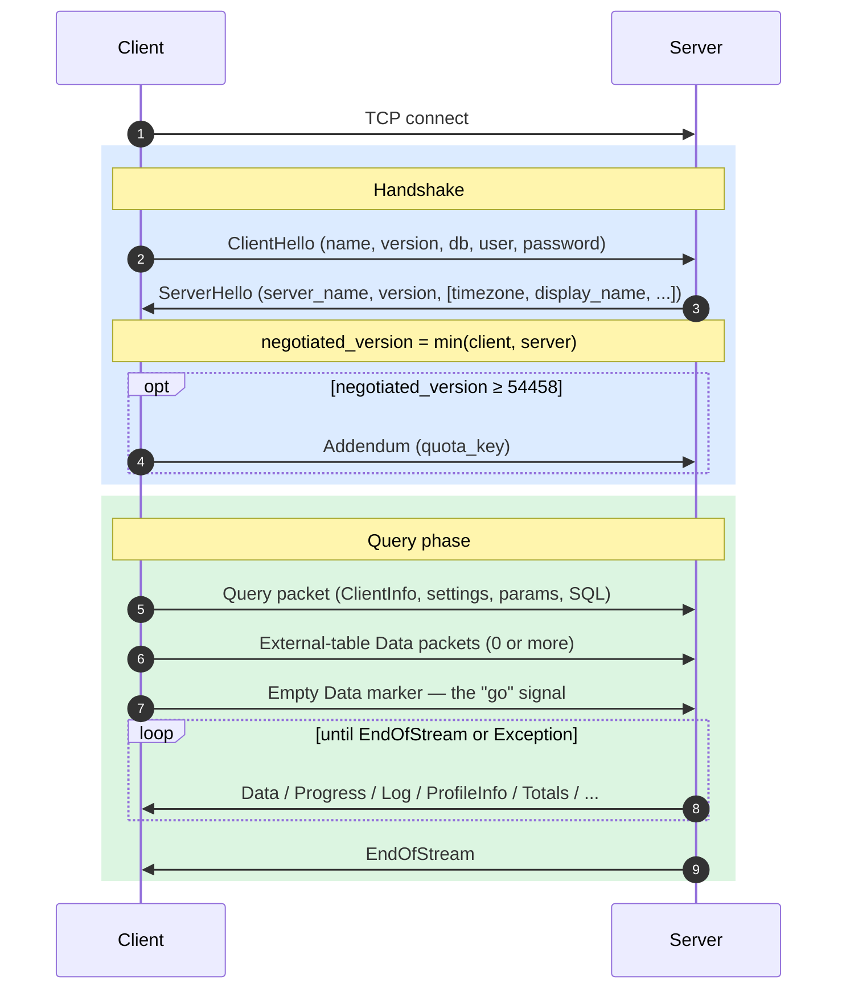
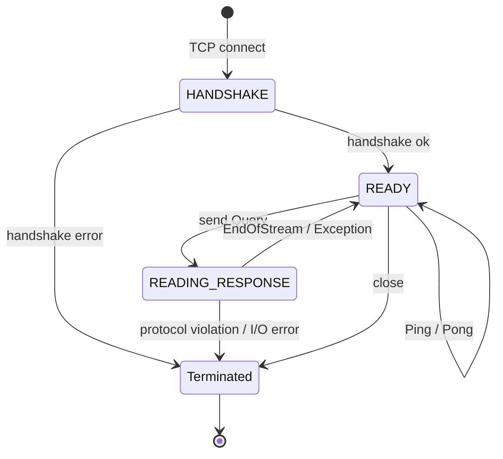
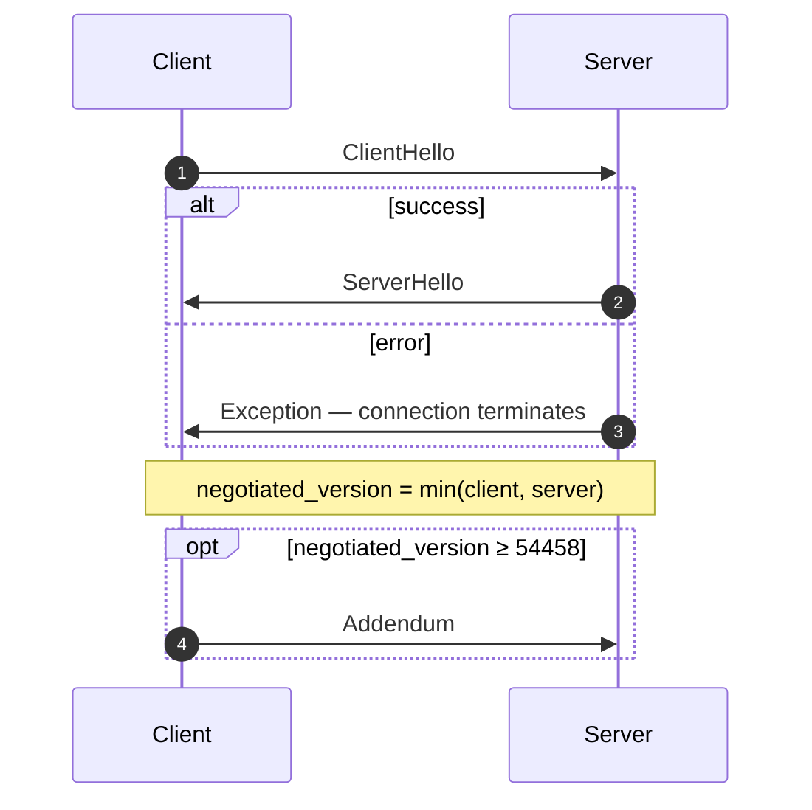
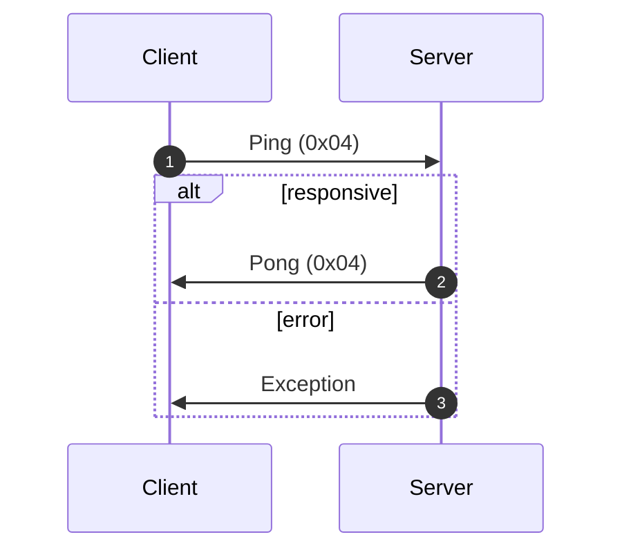
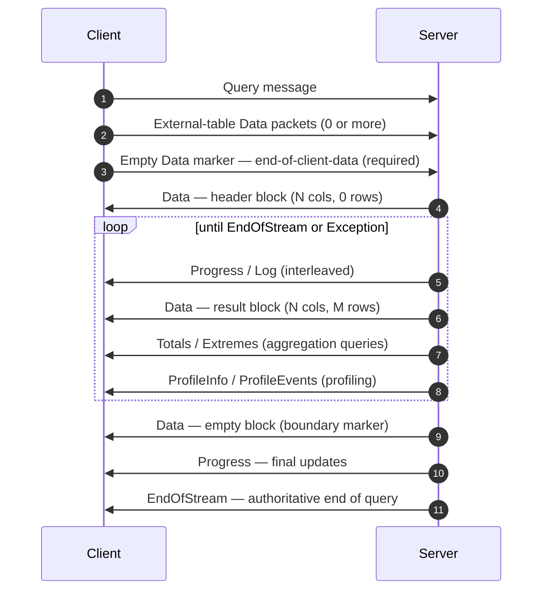
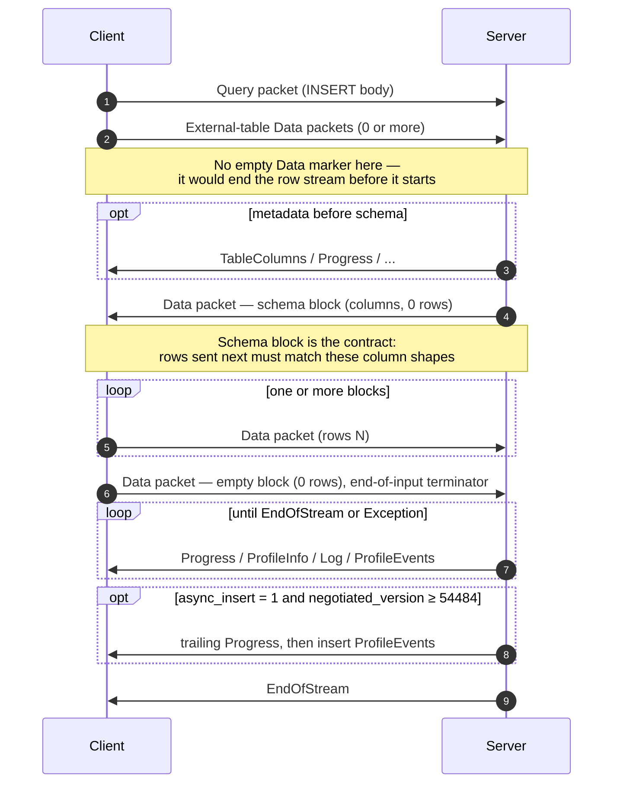
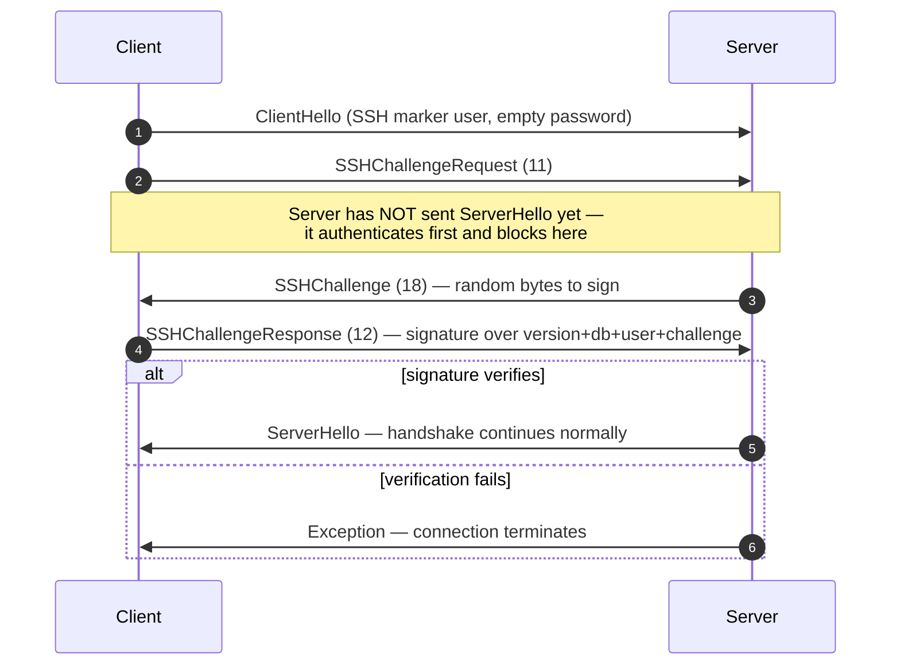

البروتوكول الأصلي هو بروتوكول ثنائي موجَّه بالاتصال تتخاطب به عملاء وخوادم ClickHouse عبر TCP. وهو ينقل استعلامات SQL، وبيانات النتائج، وحمولات `INSERT`، وبيانات القياس عن بُعد الخاصة بالتنفيذ، وإشارات الأخطاء. وهو البروتوكول الذي يستند إليه عميل سطر الأوامر وC++ ومعظم برامج التشغيل الأصلية من جهات خارجية.

تغطي هذه الصفحة البروتوكول نفسه: تأطير الحزم، وآلة حالات الاتصال، والتفاوض على الإصدار، وجسم كل رسالة لا تنتمي إلى `Block`. أما البايتات داخل حزم عائلة `Data` (أي `Block`، وأعمدته، وترميزات كل نوع) فهي موضوع منفصل، موثَّق في مواصفة [Native Format](/ar/reference/interfaces/specs/NativeFormat).

<Info>
  **مواصفة مرافقة**

  تمثل هذه الصفحة أحد جزأَي هذه المجموعة، وتُنشر مع المواصفة المرافقة [Native Format](/ar/reference/interfaces/specs/NativeFormat). وتقسم المواصفتان العمل بوضوح: تختص هذه الصفحة بطبقة الحزم والنقل، بينما تختص مواصفة Native Format بالبايتات داخل حزم عائلة `Data`.
</Info>

هناك بعض الخصائص التي تنطبق على امتداد البروتوكول. فالبروتوكول ثنائي وموضعي: لا توجد وسوم للحقول إلا داخل `BlockInfo`، لذا فإن أي بايت يوضع في غير موضعه يفقد المزامنة مع كل ما يليه. وهو بروتوكول ذو حالة، ويعالج كل اتصال TCP استعلامًا واحدًا في كل مرة — ولا توجد فيه آلية تعدد الإرسال. أما الأعداد الصحيحة ثابتة العرض فتُخزَّن بترتيب little-endian.

<div id="overview">
  ## نظرة عامة
</div>

| الخاصية        | القيمة                                                                            |
| -------------- | --------------------------------------------------------------------------------- |
| النقل          | TCP، مع إمكانية تغليفه باستخدام TLS                                               |
| ترتيب البايتات | الأقل أهمية أولًا للأعداد الصحيحة ثابتة العرض                                     |
| الترميز        | ثنائي وموضعي (من دون وسوم حقول باستثناء `BlockInfo`)                              |
| نموذج الاتصال  | ذو حالة، واستعلام واحد في كل مرة، من دون تعدد الإرسال                             |
| الإصدار        | يُتفاوض عليه عند المصافحة؛ وتُقيَّد الميزات الفردية بحسب الإصدار                  |
| تنسيق البيانات | [Native Format](/ar/reference/interfaces/specs/NativeFormat) لجميع البيانات الجدولية |

تبدأ كل رسالة برمز نوع حزمة `VarUInt`، يتبعه جسم يعتمد شكله على ذلك الرمز وعلى إصدار البروتوكول المتفاوض عليه.

يمر الاتصال عبر ثلاث مراحل — مصافحة لمرة واحدة، ثم أي عدد من عمليات تبادل `Ping` أو `Query`، ثم الإغلاق:



ينقل بروتوكول TCP الأصلي دائمًا البيانات الجدولية بتنسيق Native، بغضّ النظر عن أي عبارة `FORMAT` في SQL. أمّا إعادة تنسيقها إلى `RowBinary` و`CSV` و`JSON` وما إلى ذلك، فهي من مهام العميل، وتتم بعد فك ترميز كتل Native. (أمّا واجهة HTTP فلها مسار برمجي مختلف *يلتزم فعلًا* بعبارة `FORMAT`؛ لكن HTTP خارج نطاق هذا المحتوى هنا.)

<div id="security">
  ## الأمان
</div>

<div id="transport-security">
  ### أمان النقل (TLS)
</div>

يقع TLS في طبقة النقل، أسفل البروتوكول. وعند تفعيله، يُشفَّر تيار TCP بالكامل، وتظل رسائل البروتوكول متطابقة تمامًا، بايتًا ببايت، سواء استُخدم TLS أم لا.

<div id="authentication">
  ### المصادقة
</div>

تحدث المصادقة أثناء المصافحة، في رسالة [`ClientHello`](#clienthello). يُنقل الحقلان `user` و`password` كسلاسل نصية غير مشفّرة، لذا فإن التشفير على مستوى النقل (TLS) هو ما يحمي بيانات الاعتماد أثناء انتقالها.

تتوفر مصادقة التحدي والاستجابة عبر SSH بدءًا من إصدار البروتوكول 54466 — راجع [مصادقة التحدي والاستجابة عبر SSH](#ssh-authentication).

<div id="inter-server-secret">
  ### السر بين الخوادم
</div>

لتنفيذ الاستعلامات الموزعة، تتحقق الخوادم من هوية بعضها بعضًا عبر إثبات معرفة سر مشترك — من دون إرسال السر نفسه عبر الشبكة. تتضمن كل `Query` قيمة `auth_hash` بطول 32 بايت من نوع SHA-256 في الحقل 4 من [`Query`](#query)، وتُحتسب استنادًا إلى salt وnonce والسر المُعدّ والاستعلام، ثم يعيد الخادم المستقبِل احتسابها ويقارنها. ولا يُفعَّل ذلك إلا مع الميزة `INTERSERVER_SECRET` ‏(v54441). وترسل البرامج العميلة الخارجية دائمًا سلسلة فارغة هنا. راجع [المصادقة بين الخوادم](#inter-server-authentication).

<div id="versioning-and-feature-gates">
  ## الإصدارات وبوابات الميزات
</div>

<div id="version-negotiation">
  ### التفاوض على الإصدار
</div>

يُعلن كلٌّ من العميل والخادم عن الحد الأقصى لإصدار البروتوكول الذي يدعمه أثناء المصافحة. ويكون **الإصدار المتفَق عليه** هو الأصغر بين الاثنين:

```text
negotiated_version = min(client_version, server_version)
```

تستخدم كل رسالة بعد ذلك الإصدار المتفق عليه لتحديد الحقول الموجودة في البيانات المنقولة.

<div id="feature-gates">
  ### بوابات الميزات
</div>

تُحدَّد كل ميزة بإصدار البروتوكول الذي أدخلها، وتكون **مفعّلة** عندما يكون الإصدار المتفاوض عليه أكبر من هذا الرقم أو مساويًا له.

<Warning>
  عندما تكون الميزة مفعّلة، **يجب** أن تكون حقولها موجودة في التمثيل الثنائي المنقول. يعتمد البروتوكول ترتيبًا موضعيًا صارمًا، لذا فإن حذف حقل خاضع لبوابات الميزات يفسد تدفق البايتات لكل حقل يليه.
</Warning>

<div id="feature-table">
  ### جدول الميزات
</div>

| الميزة                                                  | الإصدار | يؤثر على                         | الأثر على صيغة النقل                                                                                                                                                                                                                                                                                                                                                                                                                                                                                                                                                    |
| ------------------------------------------------------- | ------- | -------------------------------- | ----------------------------------------------------------------------------------------------------------------------------------------------------------------------------------------------------------------------------------------------------------------------------------------------------------------------------------------------------------------------------------------------------------------------------------------------------------------------------------------------------------------------------------------------------------------------- |
| BLOCK&#95;INFO                                          | all     | Block                            | يضيف البادئة BlockInfo (`is_overflows`, `bucket_number`) إلى كل Block.                                                                                                                                                                                                                                                                                                                                                                                                                                                                                                  |
| CLIENT&#95;INFO                                         | 54032   | Query                            | يضيف كتلة ClientInfo إلى body الخاص بـ Query.                                                                                                                                                                                                                                                                                                                                                                                                                                                                                                                           |
| TIMEZONE                                                | 54058   | ServerHello                      | يضيف الحقل `timezone` إلى ServerHello.                                                                                                                                                                                                                                                                                                                                                                                                                                                                                                                                  |
| QUOTA&#95;KEY&#95;IN&#95;CLIENT&#95;INFO                | 54060   | ClientInfo                       | يضيف الحقل `quota_key` إلى ClientInfo.                                                                                                                                                                                                                                                                                                                                                                                                                                                                                                                                  |
| DISPLAY&#95;NAME                                        | 54372   | ServerHello                      | يضيف الحقل `display_name` إلى ServerHello.                                                                                                                                                                                                                                                                                                                                                                                                                                                                                                                              |
| VERSION&#95;PATCH                                       | 54401   | ServerHello, ClientInfo          | يضيف الحقل `version_patch` إلى كليهما.                                                                                                                                                                                                                                                                                                                                                                                                                                                                                                                                  |
| SERVER&#95;LOGS                                         | 54406   | Log                              | يُرسل Server حزم Log عندما يكون `send_logs_level` مضبوطًا.                                                                                                                                                                                                                                                                                                                                                                                                                                                                                                              |
| COLUMN&#95;DEFAULTS&#95;METADATA                        | 54410   | TableColumns                     | قد يرسل Server الحزمة [`TableColumns`](#tablecolumns) (النوع 11) مع البيانات الوصفية للقيم الافتراضية للأعمدة قبل كتلة schema الخاصة بـ INSERT/input. لا تُرسل هذه الحزمة إلا إذا كان الإصدار المتفاوض عليه ≥ 54410 **و** كان `input_format_defaults_for_omitted_fields` مفعّلًا. وأدنى من هذا الإصدار، لا تُرسل الحزمة مطلقًا؛ ويجب ألا ينتظرها clients.                                                                                                                                                                                                               |
| WRITE&#95;CLIENT&#95;INFO                               | 54420   | Progress                         | يضيف `wrote_rows` و`wrote_bytes` إلى Progress. (على الرغم من الاسم، فإن هذا **لا** يتحكم في كتلة ClientInfo — فهذا هو `CLIENT_INFO` (v54032).)                                                                                                                                                                                                                                                                                                                                                                                                                          |
| SETTINGS&#95;SERIALIZED&#95;AS&#95;STRINGS              | 54429   | Query (settings encoding)        | يغيّر **كيفية** ترميز settings list الموجودة دائمًا؛ ولا **يتحكم** في ما إذا كانت settings تُرسل أم لا. في v54429+ تُكتب كل setting بالشكل `(name, flags, value-as-string)`؛ أما الأقران الأقدم فيكتبون `(name, type-specific-binary-value)` بدون flags. انظر [Setting](#setting).                                                                                                                                                                                                                                                                                      |
| INTERSERVER&#95;SECRET                                  | 54441   | Query                            | يضيف الحقل `auth_hash` بين الخوادم إلى Query — وهو SHA-256 مملّح على secret الخاص بالعنقود، وليس secret الخام. يرسل clients الخارجيون سلسلة فارغة. انظر [Inter-server authentication](#inter-server-authentication).                                                                                                                                                                                                                                                                                                                                                    |
| OPEN&#95;TELEMETRY                                      | 54442   | ClientInfo                       | يضيف trace context الخاص بـ OpenTelemetry إلى ClientInfo.                                                                                                                                                                                                                                                                                                                                                                                                                                                                                                               |
| DISTRIBUTED&#95;DEPTH                                   | 54448   | ClientInfo                       | يضيف الحقل `distributed_depth` إلى ClientInfo.                                                                                                                                                                                                                                                                                                                                                                                                                                                                                                                          |
| INITIAL&#95;QUERY&#95;START&#95;TIME                    | 54449   | ClientInfo                       | يضيف الحقل `initial_time` (Int64، Fixed-width).                                                                                                                                                                                                                                                                                                                                                                                                                                                                                                                         |
| PROFILE&#95;EVENTS                                      | 54451   | ProfileEvents                    | يُرسل Server حزم ProfileEvents أثناء تنفيذ query.                                                                                                                                                                                                                                                                                                                                                                                                                                                                                                                       |
| PARALLEL&#95;REPLICAS                                   | 54453   | ClientInfo                       | يضيف حقول تنسيق replicas المتوازية إلى ClientInfo.                                                                                                                                                                                                                                                                                                                                                                                                                                                                                                                      |
| CUSTOM&#95;SERIALIZATION                                | 54454   | Block (Column)                   | يضيف البايت `has_custom_serialization` بعد type string الخاص بكل عمود.                                                                                                                                                                                                                                                                                                                                                                                                                                                                                                  |
| ADDENDUM                                                | 54458   | Handshake                        | يرسل Client ملحقًا (`quota_key`) بعد تبادل handshake.                                                                                                                                                                                                                                                                                                                                                                                                                                                                                                                   |
| PARAMETERS                                              | 54459   | Query                            | يضيف قائمة Parameters إلى body الخاص بـ Query.                                                                                                                                                                                                                                                                                                                                                                                                                                                                                                                          |
| SERVER&#95;QUERY&#95;TIME&#95;IN&#95;PROGRESS           | 54460   | Progress                         | يضيف الحقل `elapsed_ns` إلى Progress.                                                                                                                                                                                                                                                                                                                                                                                                                                                                                                                                   |
| PASSWORD&#95;COMPLEXITY&#95;RULES                       | 54461   | ServerHello                      | يضيف قائمة بأنماط regex الخاصة بسياسة password ورسائل human-readable إلى ServerHello.                                                                                                                                                                                                                                                                                                                                                                                                                                                                                   |
| INTERSERVER&#95;SECRET&#95;V2                           | 54462   | ServerHello                      | يضيف قيمة nonce من النوع `UInt64` بطول 8 بايت إلى ServerHello. تُستخدم لتوقيع query بين الخوادم؛ أما clients الخارجيون فيفكون ترميزها ويتجاهلونها.                                                                                                                                                                                                                                                                                                                                                                                                                      |
| TOTAL&#95;BYTES&#95;IN&#95;PROGRESS                     | 54463   | Progress                         | يضيف الحقل `total_bytes_to_read` (VarUInt) إلى Progress، بين `total_rows` و`wrote_rows`.                                                                                                                                                                                                                                                                                                                                                                                                                                                                                |
| TIMEZONE&#95;UPDATES                                    | 54464   | TimezoneUpdate                   | يضيف حزمة Server باسم `TimezoneUpdate` (النوع 17). الـ Body: قيمة `String` واحدة تحمل session timezone. لا تُرسل إلا من مهيّئ table function `input`، مباشرة بعد كتلة schema الخاصة بالإدخال، لكي يحلل client الصفوف التي يرسلها باستخدام `session_timezone` الخاص بـ Server. انظر [TimezoneUpdate](#timezoneupdate).                                                                                                                                                                                                                                                   |
| SPARSE&#95;SERIALIZATION                                | 54465   | Block (Column)                   | قد يضبط Server القيمة `has_custom_serialization = 1` ويُرسل عمودًا مُرمّزًا بترميز sparse. صيغة النقل: نوع بطول 1 بايت (0x01 = SPARSE)، ثم stream من الإزاحات VarUInt ينتهي بـ EOG، ثم القيم غير الافتراضية مُرمّزة بكثافة في النوع الداخلي. انظر [kind&#95;stack and sparse encoding](/ar/reference/interfaces/specs/NativeFormat#kind-stack-and-sparse-encoding).                                                                                                                                                                                                        |
| SSH&#95;AUTHENTICATION                                  | 54466   | Auth flow                        | يضيف authentication بأسلوب challenge-response عبر SSH. التفعيل اختياري: يرسل client قيمة `user` بالشكل `" SSH KEY AUTHENTICATION " + <real_user>` مع password فارغ لتفعيله. انظر [SSH challenge-response authentication](#ssh-authentication).                                                                                                                                                                                                                                                                                                                          |
| TABLE&#95;READ&#95;ONLY&#95;CHECK                       | 54467   | TablesStatusResponse             | يضيف العلامة `is_readonly` إلى row الخاصة بكل table في TablesStatusResponse. لا يرى clients الخارجيون الذين لا يرسلون `TablesStatusRequest` أي تغيير في صيغة النقل.                                                                                                                                                                                                                                                                                                                                                                                                     |
| SYSTEM&#95;KEYWORDS&#95;TABLE                           | 54468   | system tables                    | يملأ Server الجدول `system.keywords` لكي يتمكن `clickhouse-client` الرسمي من الإكمال التلقائي للكلمات المفتاحية. لا يوجد أي تغيير في صيغة النقل الخاصة بـ native protocol.                                                                                                                                                                                                                                                                                                                                                                                              |
| ROWS&#95;BEFORE&#95;AGGREGATION                         | 54469   | ProfileInfo                      | يضيف `applied_aggregation` (Bool) و`rows_before_aggregation` (VarUInt) إلى ProfileInfo، بهذا الترتيب في النهاية.                                                                                                                                                                                                                                                                                                                                                                                                                                                        |
| CHUNKED&#95;PROTOCOL                                    | 54470   | Connection framing               | يغلّف chunk framing لكل حزمة كل packet body. يتم التفاوض عليه في Addendum. يحمل ServerHello تفضيل Server لكل اتجاه، بينما يحمل Addendum الاختيار النهائي للـ client. انظر [chunked framing](#chunked-framing).                                                                                                                                                                                                                                                                                                                                                          |
| VERSIONED&#95;PARALLEL&#95;REPLICAS&#95;PROTOCOL        | 54471   | ServerHello, Addendum            | يتبادل الطرفان إصدار بروتوكول تنسيق النسخ المتماثلة المتوازية من نوع `VarUInt`. يقع حقل ServerHello **مباشرة بعد `protocol_version`** (قبل `timezone`). ويُلحَق حقل Addendum بعد سلاسل بروتوكول التجزئة. القيمة الحالية: `7` (`DBMS_PARALLEL_REPLICAS_PROTOCOL_VERSION`).                                                                                                                                                                                                                                                                                               |
| INTERSERVER&#95;EXTERNALLY&#95;GRANTED&#95;ROLES        | 54472   | Query                            | يضيف الحقل `String external_roles` إلى body الخاص بـ Query، بين مُنهِي settings وتجزئة السر بين الخوادم. ترسل clients الخارجية قائمة roles فارغة (بايت واحد `0x00`، أي VarUInt 0 داخل غلاف String).                                                                                                                                                                                                                                                                                                                                                                     |
| V2&#95;DYNAMIC&#95;AND&#95;JSON&#95;SERIALIZATION       | 54473   | Column body                      | قد يُخرج server تسلسل V2 لأنواع الأعمدة `Dynamic` و`JSON` — ما يحدد إصدار `state_prefix` المستخدم. راجع [الأنواع المُصدّرة حسب الإصدار](/ar/reference/interfaces/specs/NativeFormat#versioned-types).                                                                                                                                                                                                                                                                                                                                                                      |
| SERVER&#95;SETTINGS                                     | 54474   | ServerHello                      | يبث server إعداداته غير الافتراضية في صورة قائمة في ذيل ServerHello، بعد `nonce`. الصيغة: ثلاثيات `(key, flags, value)` تنتهي بمفتاح فارغ — وهي نفسها settings list في Query packet.                                                                                                                                                                                                                                                                                                                                                                                    |
| QUERY&#95;AND&#95;LINE&#95;NUMBERS                      | 54475   | ClientInfo                       | يضيف `script_query_number` (VarUInt) و`script_line_number` (VarUInt) في ذيل ClientInfo. يستخدمه clickhouse-client لإسناد أخطاء البرنامج النصي متعدد العبارات؛ وترسل clients الخارجية `0, 0`.                                                                                                                                                                                                                                                                                                                                                                            |
| JWT&#95;IN&#95;INTERSERVER                              | 54476   | ClientInfo                       | يضيف مؤشر وجود JWT من نوع UInt8 مع `String jwt` اختياري في ذيل ClientInfo. ترسل clients الخارجية (من دون JWT) البايت `0x00`. (يُكتب `DBMS_MIN_REVISON_WITH_JWT_IN_INTERSERVER` في C++ — لاحظ الخطأ الإملائي في اسم الثابت.)                                                                                                                                                                                                                                                                                                                                             |
| QUERY&#95;PLAN&#95;SERIALIZATION                        | 54477   | ServerHello, QueryPlan packet    | يُلحِق ServerHello القيمة `VarUInt query_plan_serialization_version` بعد server settings. ويُقدّم أيضًا `ClientPacket::QueryPlan` (الرمز `13`) لتسليم خطط query المبنية مسبقًا بين الخوادم — ولا ترسلها clients الخارجية مطلقًا.                                                                                                                                                                                                                                                                                                                                        |
| PARALLEL&#95;BLOCK&#95;MARSHALLING                      | 54478   | Block (Column)                   | قد يغلّف server الأعمدة داخل `ColumnBLOB` (مضغوطة ضمنيًا) للمعالجة المتوازية. ويُشترط لذلك أن يكون الضغط مفعّلًا في query وأن يكون `rows > 1`؛ وإلا فتُستخدم صيغة column wire العادية. clients التي لا تفعّل الضغط مطلقًا على Query packets الصادرة لا ترى أي تغيير في wire.                                                                                                                                                                                                                                                                                            |
| VERSIONED&#95;CLUSTER&#95;FUNCTION&#95;PROTOCOL         | 54479   | ServerHello                      | يضيف `VarUInt cluster_function_protocol_version` في ذيل ServerHello. يُستخدم مع `*Cluster` table functions (`s3Cluster`، إلخ). تفك clients الخارجية ترميزه ثم تتجاهله.                                                                                                                                                                                                                                                                                                                                                                                                  |
| OUT&#95;OF&#95;ORDER&#95;BUCKETS&#95;IN&#95;AGGREGATION | 54480   | BlockInfo                        | يضيف الحقل 3 (`out_of_order_buckets: Vec<Int32>`) إلى stream الموسوم بالحقول في BlockInfo. ويُفك ترميزه بالشكل `[VarUInt count][Int32]*count`. لا تُصدر clients الخارجية هذا بنفسها؛ ويقرأ مفكك الترميز أي قائمة غير فارغة يرسلها server.                                                                                                                                                                                                                                                                                                                               |
| COMPRESSED&#95;LOGS&#95;PROFILE&#95;EVENTS&#95;COLUMNS  | 54481   | Log, ProfileEvents, TableColumns | قد يغلّف server أجسام حزم [`Log`](#log) و[`ProfileEvents`](#profileevents) و[`TableColumns`](#tablecolumns) داخل [إطار الضغط](/ar/reference/interfaces/specs/NativeFormat#compression-frame). في هذا الإصدار تمر الأجسام الثلاثة كلها عبر مسار الإخراج الاختياري المضغوط نفسه، ولا يصبح إطار ضغط فعليًا إلا عندما تكون قيمة `compression = true` في query. clients التي لا تفعّل الضغط مطلقًا على Query packets الصادرة لا ترى أي تغيير في wire.                                                                                                                           |
| REPLICATED&#95;SERIALIZATION                            | 54482   | Block (Column)                   | قد يُخرج server أعمدة ذات kind&#95;stack `0x04 = REPLICATED` — وهي صيغة مدمجة على نمط القاموس للقيم المتكررة — راجع [kind&#95;stack والترميز المتناثر](/ar/reference/interfaces/specs/NativeFormat#kind-stack-and-sparse-encoding). قبل هذا الإصدار كان الكاتب يوسّع هذه الأعمدة قبل الإرسال. ويُفك الترميز عبر lookup على الفهرس (`elements[indexes[i]]` لكل row)؛ مع دعم الأنواع الورقية بالإضافة إلى القيم الداخلية لـ `Nullable`/`Array`/`Tuple`/`Map`/`Nested`/`LowCardinality`.                                                                                      |
| NULLABLE&#95;SPARSE&#95;SERIALIZATION                   | 54483   | Block (Column)                   | يدمج التسلسل المتناثر مع `Nullable(T)`. قبل هذا الإصدار كان الكاتب يوسّع sparse لأعمدة Nullable قبل الإرسال؛ أما في v54483+ فتصير بيانات wire sparse-over-Nullable. راجع [kind&#95;stack والترميز المتناثر](/ar/reference/interfaces/specs/NativeFormat#kind-stack-and-sparse-encoding).                                                                                                                                                                                                                                                                                   |
| PROGRESS&#95;IN&#95;ASYNC&#95;INSERT                    | 54484   | Progress (INSERT)                | في INSERT **غير متزامن** (`async_insert = 1`)، بعد تفريغ الإدراج يرسل server حزمة [`Progress`](#progress) إضافية، ثم `ProfileEvents` الخاصة بالإدراج، قبل `EndOfStream`. ويعتمد ذلك على أن يكون الإصدار *المتفاوض عليه* ≥ 54484؛ وأدنى من ذلك لا يرسل server هذا Progress اللاحق. تظل صيغة wire الخاصة بـ Progress بلا تغيير — والجديد هو الإرسال فقط. عمليًا، تحمل هذه الزيادة الزمن المنقضي؛ وتُبلَّغ عدادات الصفوف المكتوبة عبر ProfileEvents المصاحبة. ولا يحتاج client الذي يستنزف بالفعل Progress المتداخلة إلى أي تغيير في الصيغة، بل فقط إلى تقبّل حزمة إضافية. |
| CLIENT&#95;AGENT&#95;IN&#95;CLIENT&#95;INFO             | 54485   | ClientInfo                       | يضيف `client_agent` من النوع `String` في نهاية ClientInfo. يكتشف client القياسي تلقائيًا معرّف agent من بيئته (مثل `claude-code` أو `cursor` أو `gemini-cli` أو قيمة المتغير `AGENT`)؛ أما client الخارجي الذي لا يكتشف شيئًا فيرسل سلسلة فارغة. ويصبح هذا مطلوبًا عندما يكون الإصدار المتفاوض عليه ≥ 54485 — إذ يؤدي حذفه إلى فقدان تزامن بقية Query packet.                                                                                                                                                                                                           |

<div id="packet-envelope">
  ## غلاف الحزمة
</div>

تشترك كل رسالة متبادلة عبر الشبكة في البنية الخارجية نفسها، في كلا الاتجاهين:

```text
[VarUInt: packet_type_code]    always encoded as VarUInt
[message body]                 format depends on packet_type_code
```

توجد جداول أنواع الحزم الكاملة في [مرجع نوع الحزمة](#packet-type-reference).

نوع الحزمة هو `VarUInt`، وليس بايتًا ثابت العرض. بالنسبة إلى القيم الأقل من 128، ينتج `VarUInt` البايت المفرد نفسه، لكن يجب على التطبيقات استخدام ترميز `VarUInt` حتى تظل متوافقة إذا وصلت أنواع الحزم المستقبلية إلى 128 أو أكثر.

يوثّق [مرجع الرسائل](#message-reference) **جسم** كل حزمة فقط — أي البايتات التي تأتي بعد رمز نوع الحزمة. يبدأ ترقيم الحقول من 1 مع أول حقل في الجسم.

<div id="chunked-framing">
  ### التأطير المُجزّأ (v54470+)
</div>

عند **التفاوض على** الميزة `CHUNKED_PROTOCOL` (راجع [المصافحة](#handshake-phase))، تُغلَّف كل حزمة على مستوى النقل بتأطير مُجزّأ. ويكون هذا التغليف **منفصلًا لكل اتجاه**: إذ يجري التفاوض على client→server و server→client كلٌّ على حدة، وقد ينتهي كل منهما إلى وضع مختلف (مُجزّأ أو غير مؤطَّر).

البنية على مستوى النقل لكل حزمة:

```text
<chunk>...   one or more chunks; their payloads concatenated form the whole packet
[u32 LE = 0] zero-size terminator marking end of packet
```

تنسيق wire لكل chunk:

```text
[u32 LE: chunk_size]   chunk_size in [1, UINT32_MAX]
[chunk_size bytes]     packet bytes (see note below)
```

نوع الحزمة `VarUInt` يكون **داخل** التدفق المُجزّأ: فهو البايت الأول من حمولة الحزمة (أي البايت الأول من أول جزء)، وليس بايتًا منفصلًا يُرسَل مسبقًا قبل التأطير. حمولة الجزء لكل حزمة هي `[VarUInt packet_type_code][message body]` كاملةً كما ترد في [غلاف الحزمة](#packet-envelope). وأي عميل يترك نوع الحزمة خارج التدفق المُجزّأ يجعل الطرف الآخر يقرأ بايت النوع هذا على أنه البايت الأول من حجم الجزء `u32`، ما يؤدي إلى فقدان تزامن الاتصال.

قد تُقسَّم الحزمة الواحدة على عدة أجزاء إذا امتلأ المخزن المؤقت الخاص بالكاتب أثناء كتابة الحزمة؛ ويمكن أن يقع هذا الانقسام في أي موضع، بما في ذلك داخل `VarUInt` الخاص بنوع الحزمة. يقوم القارئ بضم حمولات الأجزاء، ويتعامل مع الصفر اللاحق المكوَّن من 4 بايتات على أنه حد شفاف للحزمة — فيستهلكه، لكنه لا يمرّره إلى أي مكوّن يقرأ أجسام الحزم.

الحزم التي لا تحتوي على جسم تُغلَّف أيضًا: فالحزمة أحادية البايت مثل `Ping` أو `Pong` تصبح `[u32 size = 1][0x04][u32 0]` بمجرد الاتفاق على التجزئة. وأي وصف من نوع &quot;بايت واحد على مستوى النقل&quot; في موضع آخر من هذه الصفحة يشير إلى الصيغة السابقة للتجزئة.

**التفاوض.** يحمل كلٌّ من ServerHello وAddendum حقلي `String`، واحدًا لكل اتجاه، بقيم مأخوذة من `{"chunked", "notchunked", "chunked_optional", "notchunked_optional"}`:

* `chunked` / `notchunked` وضعان صارمان: ذلك الجانب يشترط هذا الوضع تحديدًا.
* صيغ `_optional` مرنة: فهي تقبل أيًّا من الوضعين الذي يختاره الطرف الآخر.

تُحتسب القيمة المتفق عليها لكل اتجاه على أساس ثنائي:

| تفضيل الخادم        | تفضيل العميل        | المتفق عليه                                          |
| ------------------- | ------------------- | ---------------------------------------------------- |
| `*_optional`        | أي شيء              | اتبع CLIENT (وفق قيمة `starts_with("chunked")` لديه) |
| أي شيء              | `*_optional`        | اتبع SERVER                                          |
| `chunked` strict    | `chunked` strict    | `chunked`                                            |
| `notchunked` strict | `notchunked` strict | `notchunked`                                         |
| strict mismatch     | strict mismatch     | **خطأ في البروتوكول** — يجب قطع الاتصال              |

على جانب العميل، يُفاوَض تفضيل SEND الخاص بالعميل مع تفضيل RECV الخاص بالخادم، والعكس صحيح.

**التوقيت.** تنتقل سلاسل التفاوض عبر قناة غير مؤطَّرة: ClientHello → ServerHello (تفضيلات الخادم) → Addendum (القيم التي تفاوض عليها العميل). ويُطبَّق التحول إلى التأطير على كل بايت يُرسَل *بعد* تفريغ Addendum. أما Addendum نفسه وClientHello وServerHello فتبقى دائمًا غير مؤطَّرة.

<div id="connection-lifecycle">
  ## دورة حياة الاتصال
</div>

في أي وقت، يكون الاتصال في واحدة فقط من أربع حالات: `HANDSHAKE` أو `READY` أو `READING_RESPONSE` أو يكون قد انتهى. وبما أن البروتوكول لا يدعم تعدد الإرسال، فإن العميل الذي يرسل طلبًا جديدًا قبل قراءة الاستجابة السابقة بالكامل سيتسبب في تداخل البايتات أثناء النقل وإفساد التدفق.

<div id="states">
  ### الحالات
</div>



يسير المسار المثالي مباشرةً إلى الأسفل — `HANDSHAKE → READY → READING_RESPONSE → READY` — مع الحلقة الذاتية لـ `Ping`/`Pong`، فيما تصبّ جميع حواف الفشل في المصب الوحيد `Terminated`.

| State              | Description                                                                                                                                                                                                          |
| ------------------ | -------------------------------------------------------------------------------------------------------------------------------------------------------------------------------------------------------------------- |
| `HANDSHAKE`        | الحالة الأولية بعد فتح اتصال TCP. لا تكون صالحة في هذه المرحلة إلا رسائل [المصافحة](#handshake-phase). تنتقل إلى `READY` عند النجاح، أو تُنهى عند الفشل.                                                             |
| `READY`            | خامل. يمكن للعميل إرسال [Ping](#ping-phase) أو [استعلام](#query-phase) أو إغلاق الاتصال. وقد يبقى الاتصال في `READY` إلى أجل غير مسمى (وفقًا لـ `idle_connection_timeout`، انظر [حدود الاتصال](#connection-limits)). |
| `READING_RESPONSE` | يُنتقل إلى هذه الحالة عندما يرسل العميل استعلامًا. ويجب على العميل استنفاد تدفق استجابة الخادم بالكامل قبل العودة إلى `READY`. وحزمة العميل→الخادم الوحيدة المسموح بها هنا هي Cancel (غير موضحة في هذه الصفحة).      |
| Terminated         | لم تعد قابلة للاستخدام. يجب على العميل فتح اتصال TCP جديد وبدء المصافحة من جديد.                                                                                                                                     |

<div id="handshake-phase">
  ### مرحلة المصافحة
</div>

تتم المصادقة والتفاوض على إصدار البروتوكول. يحدث ذلك مرة واحدة فقط لكل اتصال، قبل أي شيء آخر.

فُتح اتصال TCP للتو، ولم تُتبادل أي رسائل بعد. ويكون التسلسل كالتالي:



1. يرسل العميل [`ClientHello`](#clienthello) مع أعلى إصدار بروتوكول يدعمه.

2. يقرأ العميل الاستجابة ويعالجها وفقًا لنوع الحزمة:

   | نوع الحزمة      | الإجراء                                                                                                                 |
   | --------------- | ----------------------------------------------------------------------------------------------------------------------- |
   | `Hello` (0)     | فك ترميز [`ServerHello`](#serverhello). احسب `negotiated_version = min(client_ver, server_ver)`. ثم انتقل إلى الخطوة 3. |
   | `Exception` (2) | فك ترميز [`Exception`](#exception). أعده كخطأ وأنهِ الاتصال.                                                            |
   | anything else   | انتهاك للبروتوكول. أنهِ الاتصال.                                                                                        |

3. إذا كانت قيمة `negotiated_version ≥ 54458` (ميزة `ADDENDUM`)، يرسل العميل [`Addendum`](#addendum). يستند هذا القرار إلى الإصدار **المتفق عليه**، لا إلى الإصدار الذي أعلنه العميل.

عند النجاح، ينتقل الاتصال إلى `READY`؛ وعند حدوث أي خطأ، ينتهي.

<div id="ping-phase">
  ### مرحلة Ping
</div>

فحص حيوية على مستوى التطبيق، مستقل عن `TCP keepalive`. تؤكد دورة Ping/Pong الناجحة ذهابًا وإيابًا أن اتصال TCP حيّ في كلا الاتجاهين وأن الخادم يستجيب. تكون Ping عديمة الحالة وغير مرتبطة بأي استعلام، لذا فإن عمليات Ping المتتالية مستقلة بعضها عن بعض.

بدءًا من `جاهز`، يكون التدفق كما يلي:



1. يرسل العميل [`Ping`](#ping).
2. يقرأ العميل الاستجابة:

   | نوع الحزمة      | الإجراء                                            |
   | --------------- | -------------------------------------------------- |
   | `Pong` (4)      | تم تأكيد أن الاتصال ما يزال حيًا. عُد إلى `جاهز`. |
   | `Exception` (2) | فك ترميز [`Exception`](#exception) وأرجِعه كخطأ.   |
   | أي شيء آخر      | مخالفة للبروتوكول.                                 |

<div id="query-phase">
  ### مرحلة الاستعلام
</div>

يرسل العميل عبارة SQL، ثم يعيد الخادم بث كتل النتائج وبيانات القياس عن بُعد الخاصة بالتنفيذ. وتكون الاستجابة تسلسلاً من الحزم ينتهي بحزمة واحدة فقط، إما `EndOfStream` أو `Exception`.

بدءًا من `جاهز`، يكون التدفق كما يلي:



عند حدوث خطأ في أي مرحلة، يرسل الخادم `Exception` بدلًا من `EndOfStream`، مما يُنهي الاستعلام.

1. يرسل العميل [`Query`](#query) مع `query_id` فريد (عادةً ما يكون UUID).
2. يرسل العميل أي جداول خارجية، ثم وسم Data فارغًا. تحتوي حزمة Data الفارغة على `table_name = ""` و `num_columns = 0` و `num_rows = 0`. ولا يبدأ الخادم تنفيذ الاستعلام حتى يتلقى هذا الوسم.
3. ينتقل العميل إلى `READING_RESPONSE` ويُفرغ مخزن الكتابة المؤقت لديه.
4. يقرأ العميل حزم الاستجابة في حلقة، ويوجّه المعالجة حسب النوع:

   | Packet type          | الإجراء                                                                                                                                                                            |
   | -------------------- | ---------------------------------------------------------------------------------------------------------------------------------------------------------------------------------- |
   | `Data` (1)           | فك ترميز block. تمثل أول حزمة Data ترويسة schema، أما الحزم اللاحقة فهي blocks نتائج (تُجمَّع)، ويمثل block الفارغ وسمًا فاصلًا. لا يعني `num_rows == 0` **عدم** انتهاء الاستعلام. |
   | `Progress` (3)       | مقاييس التنفيذ. كل حزمة تمثل **زيادة** منذ الحزمة السابقة — وتُجمَّع محليًا.                                                                                                       |
   | `EndOfStream` (5)    | اكتمل الاستعلام. اخرج من الحلقة وارجع إلى `جاهز`.                                                                                                                                 |
   | `ProfileInfo` (6)    | بيانات profiling بعد التنفيذ.                                                                                                                                                      |
   | `Totals` (7)         | block إجماليات التجميع (بنفس wire format الخاص بـ Data).                                                                                                                           |
   | `Extremes` (8)       | block القيم الدنيا/العظمى (بنفس wire format الخاص بـ Data).                                                                                                                        |
   | `Log` (10)           | سطر من server log.                                                                                                                                                                 |
   | `TableColumns` (11)  | metadata القيم الافتراضية للأعمدة.                                                                                                                                                 |
   | `ProfileEvents` (14) | عدادات الأداء.                                                                                                                                                                     |
   | `Exception` (2)      | فك الترميز وإرجاعه كخطأ. اخرج من الحلقة وارجع إلى `جاهز`.                                                                                                                         |
   | anything else        | غير متوقع أثناء Query phase. أنهِ connection.                                                                                                                                      |

عند `EndOfStream` أو `Exception` تمت معالجته، تعود connection إلى `جاهز`. أما مخالفة protocol أو خطأ I/O فيُنهيانها.

<Note>
  غالبًا ما تُربك حالة `num_rows == 0` عمليات التنفيذ الجديدة. فالـ block ذو الصفوف الصفرية هو وسم فاصل أو ترويسة schema، وليس إشارة إلى نهاية التدفق. ولا يُنهي الاستجابة إلا `EndOfStream` أو `Exception`.
</Note>

<div id="insert-phase">
  ### مرحلة INSERT
</div>

مرحلة INSERT هي [مرحلة الاستعلام](#query-phase) مع تبادلين إضافيين. يرسل العميل عبارة `INSERT`؛ ويرد الخادم بـ **كتلة مخطط** تصف الجدول الهدف؛ ثم يرسل العميل حزم Data التي تحتوي على الصفوف، ثم وسم Data الفارغ؛ ويُنهي الخادم العملية بـ `EndOfStream` أو `Exception`.

بدءًا من الحالة `جاهز`، تكون SQL عبارة `INSERT` بالصيغة `INSERT INTO <table> [(<cols>)] VALUES` — من دون قيمة حرفية مضمنة من الشكل `VALUES (...)`، لأن بيانات الصفوف تتدفق عبر حزم Data. التدفق:



1. يرسل العميل [`Query`](#query) مع ضبط `body` على عبارة INSERT في SQL.
2. يرسل العميل أي external tables إن وُجدت (وهذا نادر مع INSERT). وعلى خلاف [مرحلة الاستعلام](#query-phase)، فهو **لا** يرسل هنا وسم Data فارغًا. تُرسَل حزمة `INSERT` `Query` مع وجود بيانات قيد الانتظار، لذلك يُؤجَّل block الفارغ الذي يدل على نهاية البيانات إلى الخطوة 5؛ لأن إرساله قبل schema block سيجعل الخادم يقرأه على أنه نهاية تدفق الصفوف، فيُنهي INSERT بلا أي rows، ثم يُحلّل أول حزمة صفوف فعلية على أنها حزمة شاردة على المستوى الأعلى.
3. يستنزف العميل حزم metadata ‏(TableColumns وProgress وProfileInfo وLog وProfileEvents) إلى أن يقرأ حزمة schema Data — وهي Block تضم 0 rows ولكن ببنية columns كاملة (الأسماء والأنواع). ويُعد schema block بمثابة العقد: يجب أن تطابق rows التي يرسلها العميل بعد ذلك بنية هذه columns.
4. يرسل العميل data block واحدة أو أكثر. ولكل block يكتب `VarUInt(ClientPacket::Data = 2)`، ثم `String("")` لاسم external-table الفارغ، ثم الـ Block. يجب أن تتوافق column types مع columns الخاصة بـ schema block بحسب الموضع.
5. يرسل العميل محدِّد نهاية الإدخال: حزمة Data تحتوي على Block فارغ (0 columns, 0 rows).
6. يستنزف العميل تدفق الاستجابة إلى أن يصل إلى `EndOfStream` (نجاح) أو `Exception` (فشل).

**INSERT غير المتزامن (v54484+).** عندما يحمل الاستعلام `async_insert = 1`، يضع الخادم rows في queue ثم ينفّذ flush لها كجزء من batch. وعند الإصدار المتفاوض عليه ≥ 54484 (`PROGRESS_IN_ASYNC_INSERT`)، ما إن يكتمل flush حتى يُصدر الخادم حزمة [`Progress`](#progress) إضافية، تتبعها مباشرة `ProfileEvents` الخاصة بعملية insert، ثم `EndOfStream`. أما في الإصدارات الأقدم من 54484، فيتجاوز الخادم حزمة Progress اللاحقة هذه. وهذه الحزمة هي `Progress` عادية؛ ولأن الخادم يعيد ضبط query pipeline قبل احتساب counts الخاصة بالكتابة، فإن الزيادة لا تتضمن عمليًا سوى الزمن المنقضي، بينما تصل إلى العميل إحصاءات rows والبايتات المكتوبة عبر `ProfileEvents` المصاحبة. وأي عميل يستنزف بالفعل حزم Progress المتداخلة في الخطوة 6 لا يحتاج إلا إلى قبول حزمة إضافية واحدة.

يعود connection إلى `جاهز` عند `EndOfStream` أو عند `Exception` تمت معالجته. أما مخالفات protocol وأخطاء I/O فتُنهيه.

<div id="message-reference">
  ## مرجع الرسائل
</div>

تُدرج الحقول وفق ترتيبها على wire. ويستخدم العمود `Type` ما يلي:

* `VarUInt` — عدد صحيح غير موقّع بطول متغيّر (انظر [VarUInt](/ar/reference/interfaces/specs/NativeFormat#varuint)).
* `String` — بايتات مسبوقة بـ `VarUInt` (انظر [String](/ar/reference/interfaces/specs/NativeFormat#string)).
* `UInt8` و`Int32` وما إلى ذلك — أعداد صحيحة ثابتة العرض بترتيب little-endian.
* `Bool` — بايت واحد، `0x00` أو `0x01`.

يوضح العمود `Role` الجهة التي تستخدم كل حقل:

* **client** — يضبطه العملاء الخارجيون.
* **inter-server** — يكون ذا معنى فقط في الاتصال بين الخوادم؛ ويكتب العملاء الخارجيون قيمة افتراضية.
* **universal** — يستخدمه الطرفان.

توثّق هذه الجداول جزء body من كل حزمة فقط، بعد رمز نوع الحزمة.

<div id="clienthello">
  ### ClientHello (نوع الحزمة 0)
</div>

العميل → الخادم. أول رسالة بعد فتح اتصال TCP.

| # | الحقل                | النوع   | الدور     | الوصف                                    |
| - | -------------------- | ------- | --------- | ---------------------------------------- |
| 1 | client&#95;name      | String  | مشترك | معرّف العميل (مثل `"clickhouse-client"`) |
| 2 | version&#95;major    | VarUInt | مشترك | الإصدار الرئيسي للعميل                   |
| 3 | version&#95;minor    | VarUInt | مشترك | الإصدار الثانوي للعميل                   |
| 4 | protocol&#95;version | VarUInt | مشترك | أعلى إصدار بروتوكول يدعمه العميل         |
| 5 | database             | String  | مشترك | اسم قاعدة البيانات الافتراضية            |
| 6 | user                 | String  | مشترك | اسم المستخدم للمصادقة                    |
| 7 | password             | String  | مشترك | كلمة المرور (بنص صريح)                   |

<div id="serverhello">
  ### ServerHello (نوع الحزمة 0)
</div>

Server → Client. الرد على ClientHello عند نجاح المصادقة.

| #  | Field                                          | Type      | Role         | Condition                                                 | Description                                                                                                                                                                                                                                                              |
| -- | ---------------------------------------------- | --------- | ------------ | --------------------------------------------------------- | ------------------------------------------------------------------------------------------------------------------------------------------------------------------------------------------------------------------------------------------------------------------------ |
| 1  | server&#95;name                                | String    | مشترك    | دائمًا                                                    | معرّف الخادم                                                                                                                                                                                                                                                             |
| 2  | version&#95;major                              | VarUInt   | مشترك    | دائمًا                                                    | الإصدار الرئيسي للخادم                                                                                                                                                                                                                                                   |
| 3  | version&#95;minor                              | VarUInt   | مشترك    | دائمًا                                                    | الإصدار الثانوي للخادم                                                                                                                                                                                                                                                   |
| 4  | protocol&#95;version                           | VarUInt   | مشترك    | دائمًا                                                    | إصدار البروتوكول الخاص بالخادم                                                                                                                                                                                                                                           |
| 4a | parallel&#95;replicas&#95;protocol&#95;version | VarUInt   | مشترك    | VERSIONED&#95;PARALLEL&#95;REPLICAS&#95;PROTOCOL (v54471) | إصدار بروتوكول coordination للنسخ المتماثلة المتوازية في الخادم. **موضعه على wire: مباشرة بعد `protocol_version`**، وقبل `timezone`. القيمة الحالية: `7`.                                                                                                                |
| 5  | timezone                                       | String    | مشترك    | TIMEZONE (v54058)                                         | timezone الخاص بالخادم (على سبيل المثال، `"UTC"`)                                                                                                                                                                                                                        |
| 6  | display&#95;name                               | String    | مشترك    | DISPLAY&#95;NAME (v54372)                                 | اسم الخادم بصيغة human-readable                                                                                                                                                                                                                                          |
| 7  | version&#95;patch                              | VarUInt   | مشترك    | VERSION&#95;PATCH (v54401)                                | إصدار التصحيح للخادم                                                                                                                                                                                                                                                     |
| 8  | proto&#95;send&#95;chunked&#95;srv             | String    | مشترك    | CHUNKED&#95;PROTOCOL (v54470)                             | تفضيل الخادم لـ chunking الصادر. إحدى القيم التالية: `"chunked"` أو `"notchunked"` أو `"chunked_optional"` أو `"notchunked_optional"`. راجع [التأطير المُجزّأ](#chunked-framing). **يوضع على wire قبل `password_complexity_rules` رغم أن بوابة الإصدار الخاصة به أعلى.** |
| 9  | proto&#95;recv&#95;chunked&#95;srv             | String    | مشترك    | CHUNKED&#95;PROTOCOL (v54470)                             | تفضيل الخادم لـ chunking الوارد. نفس مجموعة القيم كما في الحقل 8.                                                                                                                                                                                                        |
| 10 | password&#95;complexity&#95;rules              | Rule[]    | مشترك    | PASSWORD&#95;COMPLEXITY&#95;RULES (v54461)                | سياسة password الخاصة بالخادم. `VarUInt count` متبوعًا بـ `count × Rule`. انظر أدناه.                                                                                                                                                                                    |
| 11 | nonce                                          | UInt64    | بين الخوادم | INTERSERVER&#95;SECRET&#95;V2 (v54462)                    | قيمة nonce عشوائية بطول 8 بايت بتنسيق LE. تستخدمها آلية الخادم لتوقيع query بين الخوادم. يجب على clients الخارجيين فك ترميزها (للحفاظ على محاذاة stream) ويُستحسن تجاهل القيمة.                                                                                          |
| 12 | server&#95;settings                            | Setting[] | مشترك    | SERVER&#95;SETTINGS (v54474)                              | بث settings غير الافتراضية من الخادم. التنسيق: صفر أو أكثر من الثلاثيات `(String key, VarUInt flags, String value)`، وتنتهي بـ key فارغ. مماثلة لـ [قائمة الإعدادات في حزمة Query](#setting).                                                                            |
| 13 | query&#95;plan&#95;serialization&#95;version   | VarUInt   | مشترك    | QUERY&#95;PLAN&#95;SERIALIZATION (v54477)                 | serialization version لخطة query التي يدعمها الخادم. يفك clients الخارجيون ترميزه ويتجاهلونه.                                                                                                                                                                            |
| 14 | cluster&#95;function&#95;protocol&#95;version  | VarUInt   | مشترك    | VERSIONED&#95;CLUSTER&#95;FUNCTION&#95;PROTOCOL (v54479)  | إصدار البروتوكول لدالة table‏ `*Cluster` في الخادم. يفك clients الخارجيون ترميزه ويتجاهلونه.                                                                                                                                                                             |

**Rule** — عنصر من `password_complexity_rules`:

| # | Field   | Type   | Description                                                                |
| - | ------- | ------ | -------------------------------------------------------------------------- |
| 1 | pattern | String | pattern للتعبير النمطي الذي يجب أن تطابقه password المتوافقة.              |
| 2 | message | String | شرح بصيغة human-readable يُعرض عندما تفشل password في استيفاء هذه القاعدة. |

تعكس القائمة configuration الخاصة بمشغّل الخادم لسياسة password، وهي استرشادية بحتة — إذ لا يفرض الخادم هذه القواعد أثناء handshake. يمكن لـ client الذي يوفّر وظيفة تغيير/تعيين password استخدام هذه القواعد للإشارة إلى الأخطاء قبل إرسال password غير متوافقة إلى الخادم.

<Note>
  للحد من استخدام الموارد في مواجهة خادم عدائي أو سيئ الإعداد، اجعل الحد الأقصى للقيمة المفكوك ترميزها `count` هو 256 إدخالًا، ولكل من `pattern` و`message` من نوع String هو 4096 بايت. وتُعد قيمة `count` البالغة `0` (من دون أزواج تالية) الحالة الشائعة للخوادم التي لم تُضبط لها سياسة password.
</Note>

<div id="addendum">
  ### ملحق (من دون نوع حزمة)
</div>

العميل → الخادم، ويكون مفعّلًا بواسطة `ADDENDUM` ‏(v54458). يُرسل مباشرةً بعد اكتمال تبادل المصافحة. وليس نوع حزمة مستقلًا — إذ تُرسل الحقول على الـ wire كما هي، من دون بايت بادئة لنوع الحزمة.

| # | الحقل                                          | النوع   | الدور     | الشرط                                                     | الوصف                                                                                                                                                                                                                     |
| - | ---------------------------------------------- | ------- | --------- | --------------------------------------------------------- | ------------------------------------------------------------------------------------------------------------------------------------------------------------------------------------------------------------------------- |
| 1 | quota&#95;key                                  | String  | مشترك     | دائمًا                                                    | مفتاح QUOTA للموارد لآليات QUOTA المقيّدة بمفتاح على جانب الخادم. يرسل العملاء الذين لا يستخدمون QUOTA مقيّدة بمفتاح سلسلة فارغة.                                                                                         |
| 2 | proto&#95;send&#95;chunked                     | String  | مشترك     | CHUNKED&#95;PROTOCOL (v54470)                             | إعداد chunking الصادر المتفاوض عليه من العميل: `"chunked"` أو `"notchunked"`. يُحتسب بالاستناد إلى `proto_recv_chunked_srv` من ServerHello.                                                                               |
| 3 | proto&#95;recv&#95;chunked                     | String  | مشترك     | CHUNKED&#95;PROTOCOL (v54470)                             | إعداد chunking الوارد المتفاوض عليه من العميل. يُحتسب بالاستناد إلى `proto_send_chunked_srv`.                                                                                                                             |
| 4 | parallel&#95;replicas&#95;protocol&#95;version | VarUInt | مشترك     | VERSIONED&#95;PARALLEL&#95;REPLICAS&#95;PROTOCOL (v54471) | إصدار protocol الخاص بـ coordination لـ parallel-replicas الذي يدعمه العميل. ينبغي للعملاء الخارجيين الذين لا يشاركون في distributed queries أن يرسلوا مع ذلك إصدارًا صالحًا (الحالي `7`) لكي ينجح فحص التوافق في الخادم. |

يُطبَّق التحول إلى التأطير المقطّع *بعد* flush هذا الملحق — أما الملحق نفسه فغير مؤطَّر.

<div id="ping">
  ### Ping (نوع الحزمة 4)
</div>

العميل → الخادم. بلا متن — تتكوّن الحزمة من بايت واحد `0x04` قبل التأطير بالمقاطع؛ وعند التفاوض على استخدام التقسيم إلى مقاطع، يصبح هذا البايت حمولةً من بايت واحد لمقطع واحد (انظر [التأطير المُجزّأ](#chunked-framing)).

<div id="pong">
  ### Pong (نوع الحزمة 4)
</div>

الخادم → العميل. من دون محتوى — تتكوّن الحزمة من بايت واحد `0x04` قبل التأطير المُجزّأ؛ وعند الاتفاق على استخدام التجزئة، يصبح هذا البايت حمولةً من بايت واحد لجزء واحد (انظر [التأطير المُجزّأ](#chunked-framing)).

<div id="exception">
  ### Exception (نوع الحزمة 2)
</div>

الخادم → العميل. تُرسل عندما يصادف الخادم خطأً أثناء أي مرحلة.

| # | الحقل                     | النوع  | الدور | الوصف                                                |
| - | ------------------------- | ------ | ----- | ---------------------------------------------------- |
| 1 | code                      | Int32  | مشترك | رمز الخطأ                                            |
| 2 | name                      | String | مشترك | فئة Exception (مثل `"DB::Exception"`)                |
| 3 | message                   | String | مشترك | رسالة خطأ مقروءة للبشر                               |
| 4 | stack&#95;trace           | String | مشترك | تتبّع المكدس على جهة الخادم                          |
| 5 | has&#95;nested (obsolete) | Bool   | مشترك | بايت توافق قديم. يكتبه الخادم دائمًا بالقيمة `false` |

<div id="query">
  ### Query (نوع الحزمة 1)
</div>

العميل → الخادم.

| #  | الحقل              | النوع       | الدور       | الشرط                                                     | الوصف                                                                                                                                                                                                                                                                                                                     |
| -- | ------------------ | ----------- | ----------- | --------------------------------------------------------- | ------------------------------------------------------------------------------------------------------------------------------------------------------------------------------------------------------------------------------------------------------------------------------------------------------------------------- |
| 1  | query&#95;id       | String      | مشترك       | دائمًا                                                    | معرّف استعلام فريد (UUID)                                                                                                                                                                                                                                                                                                 |
| 2  | client&#95;info    | ClientInfo  | مشترك       | CLIENT&#95;INFO (v54032)                                  | انظر [ClientInfo](#clientinfo)                                                                                                                                                                                                                                                                                            |
| 3  | settings           | Setting[]   | مشترك       | دائمًا                                                    | انظر [Setting](#setting). **موجود دائمًا** (وينتهي بمفتاح فارغ)؛ وما يخضع لتقييد الإصدار هو *الترميز* الخاص بكل إعداد فقط — راجع ملاحظة الترميز في [Setting](#setting). يجب على العميل ألّا يحذف هذا الحقل للإصدارات المتفاوض عليها الأقل من `54429`.                                                                     |
| 3a | external&#95;roles | String      | مشترك       | INTERSERVER&#95;EXTERNALLY&#95;GRANTED&#95;ROLES (v54472) | قائمة مُسلسلة بأسماء الأدوار الممنوحة خارجيًا. القائمة الفارغة = البايت `0x00` (VarUInt 0) داخل غلاف String (`[VarUInt 1][0x00]` في التمثيل المنقول). يرسل العملاء الخارجيون دائمًا قائمة فارغة.                                                                                                                          |
| 4  | auth&#95;hash      | String      | بين الخوادم | INTERSERVER&#95;SECRET (v54441)                           | تجزئة المصادقة بين الخوادم — **وليست** قيمة secret الخام الخاصة بالـ cluster. انظر [المصادقة بين الخوادم](#inter-server-authentication) أدناه. يرسل العملاء الخارجيون (وأي `InitialQuery`) سلسلة فارغة.                                                                                                                   |
| 5  | stage              | VarUInt     | مشترك       | دائمًا                                                    | مرحلة معالجة الاستعلام. `0` = FetchColumns، `1` = WithMergeableState، `2` = Complete، `3` = WithMergeableStateAfterAggregation، `4` = WithMergeableStateAfterAggregationAndLimit، `7` = QueryPlan. تظهر القيمتان `3`/`4` في distributed queries؛ وترافق القيمة `7` خطة استعلام مُسلسلة. يرسل العملاء الخارجيون عادةً `2`. |
| 6  | compression        | VarUInt     | مشترك       | دائمًا                                                    | 0 = معطّل، 1 = مفعّل                                                                                                                                                                                                                                                                                                      |
| 7  | query&#95;body     | String      | مشترك       | دائمًا                                                    | نص SQL                                                                                                                                                                                                                                                                                                                    |
| 8  | parameters         | Parameter[] | client      | PARAMETERS (v54459)                                       | انظر [Parameter](#parameter). وينتهي بمفتاح فارغ.                                                                                                                                                                                                                                                                         |

<div id="clientinfo">
  ### ClientInfo (مضمّن في Query)
</div>

Client → Server، وهو مضمّن في جسم Query (الحقل 2). ومقيّد بـ `CLIENT_INFO` ‏(v54032). (بعض الحقول داخل ClientInfo مقيّدة بإصدارات أحدث، كما هو مذكور لكل حقل أدناه.)

| #  | الحقل                                 | النوع   | الدور        | الشرط                                                     | الوصف                                                                                                                                                                                                                                                                                                                               |
| -- | ------------------------------------- | ------- | ------------ | --------------------------------------------------------- | ----------------------------------------------------------------------------------------------------------------------------------------------------------------------------------------------------------------------------------------------------------------------------------------------------------------------------------- |
| 1  | query&#95;kind                        | UInt8   | مشترك        | دائمًا                                                    | 0 = NoQuery، 1 = InitialQuery، 2 = SecondaryQuery. يرسل العملاء الخارجيون `1`.                                                                                                                                                                                                                                                      |
| 2  | initial&#95;user                      | String  | مشترك        | دائمًا                                                    | المستخدم الذي بدأ الاستعلام                                                                                                                                                                                                                                                                                                         |
| 3  | initial&#95;query&#95;id              | String  | مشترك        | دائمًا                                                    | معرّف الاستعلام الأصلي                                                                                                                                                                                                                                                                                                              |
| 4  | initial&#95;address                   | String  | مشترك        | دائمًا                                                    | عنوان socket للعميل المصدر بصيغة `host:port`                                                                                                                                                                                                                                                                                        |
| 5  | initial&#95;time                      | Int64   | client       | INITIAL&#95;QUERY&#95;START&#95;TIME (v54449)             | وقت بدء الاستعلام (بالميكروثانية). Fixed-width بحجم 8 بايت، وليس VarUInt                                                                                                                                                                                                                                                            |
| 6  | query&#95;interface                   | UInt8   | مشترك        | دائمًا                                                    | 1 = TCP، 2 = HTTP                                                                                                                                                                                                                                                                                                                   |
| 7  | os&#95;user                           | String  | client       | إذا كانت interface = TCP                                  | اسم مستخدم نظام التشغيل                                                                                                                                                                                                                                                                                                             |
| 8  | client&#95;hostname                   | String  | client       | إذا كانت interface = TCP                                  | hostname لجهاز العميل                                                                                                                                                                                                                                                                                                               |
| 9  | client&#95;name                       | String  | client       | إذا كانت interface = TCP                                  | اسم تطبيق العميل                                                                                                                                                                                                                                                                                                                    |
| 10 | version&#95;major                     | VarUInt | مشترك        | إذا كانت interface = TCP                                  | Client major version                                                                                                                                                                                                                                                                                                                |
| 11 | version&#95;minor                     | VarUInt | مشترك        | إذا كانت interface = TCP                                  | Client minor version                                                                                                                                                                                                                                                                                                                |
| 12 | protocol&#95;version                  | VarUInt | مشترك        | إذا كانت interface = TCP                                  | إصدار protocol الخاص بـ TCP للعميل المصدر نفسه (`DBMS_TCP_PROTOCOL_VERSION`)، **وليس** الإصدار الذي جرى التفاوض عليه. يحدد revision الخاص بالنظير فقط الحقول الموجودة؛ أما هذه القيمة فهي الإصدار المضمَّن وقت الترجمة لدى initiator، لذلك عند استخدام عميل أحدث للتواصل مع server أقدم قد تكون أعلى من negotiated/server revision. |
| 13 | quota&#95;key                         | String  | مشترك        | QUOTA&#95;KEY&#95;IN&#95;CLIENT&#95;INFO (v54060)         | quota key للموارد من أجل server-side keyed quotas. يرسل العملاء الذين لا يستخدمون حصة مقيّدة بمفتاح سلسلة فارغة.                                                                                                                                                                                                                    |
| 14 | distributed&#95;depth                 | VarUInt | بين الخوادم | DISTRIBUTED&#95;DEPTH (v54448)                            | عمق تداخل distributed query. يرسل العملاء الخارجيون `0`.                                                                                                                                                                                                                                                                            |
| 15 | version&#95;patch                     | VarUInt | مشترك        | VERSION&#95;PATCH (v54401), TCP only                      | إصدار التصحيح للعميل                                                                                                                                                                                                                                                                                                                |
| 16 | open&#95;telemetry                    | (below) | client       | OPEN&#95;TELEMETRY (v54442)                               | سياق التتبّع. يرسل العملاء الذين لا يستخدمون tracing القيمة `0`.                                                                                                                                                                                                                                                                    |
| 17 | collaborate&#95;with&#95;initiator    | VarUInt | بين الخوادم | PARALLEL&#95;REPLICAS (v54453)                            | Bool بصيغة VarUInt. يرسل العملاء الخارجيون `0`.                                                                                                                                                                                                                                                                                     |
| 18 | count&#95;participating&#95;replicas  | VarUInt | بين الخوادم | PARALLEL&#95;REPLICAS (v54453)                            | يرسل العملاء الخارجيون `0`.                                                                                                                                                                                                                                                                                                         |
| 19 | number&#95;of&#95;current&#95;replica | VarUInt | بين الخوادم | PARALLEL&#95;REPLICAS (v54453)                            | يرسل العملاء الخارجيون `0`.                                                                                                                                                                                                                                                                                                         |
| 20 | script&#95;query&#95;number           | VarUInt | client       | QUERY&#95;AND&#95;LINE&#95;NUMBERS (v54475)               | موضع statement مفهرس بدءًا من 1 داخل برنامج نصي متعدد العبارات. يرسل العملاء الخارجيون `0`.                                                                                                                                                                                                                                         |
| 21 | script&#95;line&#95;number            | VarUInt | client       | QUERY&#95;AND&#95;LINE&#95;NUMBERS (v54475)               | رقم السطر مفهرسًا بدءًا من 1 داخل برنامج نصي المصدر. يرسل العملاء الخارجيون `0`.                                                                                                                                                                                                                                                    |
| 22 | jwt&#95;present                       | UInt8   | بين الخوادم | JWT&#95;IN&#95;INTERSERVER (v54476)                       | `0` = لا يوجد JWT؛ `1` = يتبع ذلك JWT. يرسل العملاء الخارجيون الذين لا يستخدمون مصادقة JWT القيمة `0`.                                                                                                                                                                                                                              |
| 23 | jwt                                   | String  | بين الخوادم | JWT&#95;IN&#95;INTERSERVER (v54476), if jwt&#95;present=1 | Bearer token لـ JWT، ولا يكون موجودًا إلا عندما تكون قيمة الحقل 22 هي `1`.                                                                                                                                                                                                                                                          |
| 24 | client&#95;agent                      | String  | client       | CLIENT&#95;AGENT&#95;IN&#95;CLIENT&#95;INFO (v54485)      | حقل ختامي. معرّف أداة/agent العميل، ويُكتشف تلقائيًا من البيئة (مثل `claude-code` أو `cursor` أو `gemini-cli` أو متغير البيئة `AGENT`). يرسل العملاء الخارجيون الذين لم يُكتشف لهم agent سلسلة فارغة. يوجد في مسار Query العادي بمجرد أن يكون الإصدار المتفاوض عليه ≥ 54485 (ويُرسل على جميع interfaces، وليس على TCP فقط).         |

<Info>
  **التخطيط المعتمد على الواجهة (الحقول 7–12)**

  الحقول 7–12 أعلاه تمثّل فرع **TCP**. عندما لا تكون قيمة `query_interface` (الحقل 6) هي **TCP**، تُستبدل هذه الحقول بتخطيط wire مختلف — وليست مجرد حقول اختيارية محذوفة، لذا يجب على وحدة فك الترميز أن تتفرع بناءً على الحقل 6.

  * `query_interface = 2` (**HTTP**): تُكتب بدلًا من ذلك معلومات طلب HTTP المُمرَّر من الخادم — `http_method` (`UInt8`)، و`http_user_agent` (`String`)، ثم `forwarded_for` (`String`، ويخضع لـ `X_FORWARDED_FOR_IN_CLIENT_INFO` v54443) و`http_referer` (`String`، ويخضع لـ `REFERER_IN_CLIENT_INFO` v54447). ولا تظهر حقول `os_user`/`client_hostname`/`client_name`/`version_*`/`protocol_version`.
  * أي واجهة أخرى: لا تُكتب أي من حقول TCP (7–12)، ولا أي من حقول HTTP؛ ويستمر التدفّق مباشرةً مع `quota_key`.

  بعد هذا التفرع، يعود التخطيط ليلتقي مجددًا: يأتي `quota_key` (الحقل 13) و`distributed_depth` (الحقل 14) في جميع الواجهات، ثم يُكتب `version_patch` (الحقل 15) فقط في حالة TCP.

  تبرز أهمية هذا التفرع أساسًا في حركة المرور بين الخوادم، حيث يمرّر الخادم المُبادِر استعلامًا وصل أصلًا عبر HTTP. وأي وحدة فك ترميز تقرأ دائمًا حقول TCP ستُسيء تفسير مثل هذه الحزم — فتتعامل مع `http_method` أو `http_user_agent` على أنه `quota_key`.
</Info>

ترميز OpenTelemetry (الحقل 16):

```text
[UInt8: has_trace]              0 = no trace data follows, 1 = trace data follows
If has_trace == 1:
  [16 bytes: trace_id]          byte-swapped per-8-bytes
  [8 bytes:  span_id]           byte-swapped
  [String:   trace_state]       W3C trace state
  [UInt8:    trace_flags]       W3C trace flags
```

<div id="inter-server-authentication">
  ### المصادقة بين الخوادم
</div>

الحقل 4 من الاستعلام (`auth_hash`) **ليس** السر المشترك للعنقود على مستوى النقل. إذ إن إرسال السر بصيغته الخام سيؤدي إلى فشل المصادقة وكشفه في الوقت نفسه. وبدلًا من ذلك، يثبت الخادم الذي يعمل كعميل بين الخوادم أنه يعرف السر باستخدام تجزئة SHA-256 مملّحة:

1. **الدخول إلى وضع inter-server.** يشير الخادم المتصل إلى ذلك داخل `ClientHello`: تكون قيمة الحقل `user` هي وسم inter-server ويكون `password` فارغًا. ثم يُلحق سلسلتين إضافيتين — اسم العنقود و`salt` مُولَّد حديثًا بطول 32 بايت (`encodeSHA256` لقيمة عشوائية) — مباشرة بعد حقلي `user`/`password`، ضمن حزمة `ClientHello` نفسها. يقرأ الخادم هاتين السلسلتين **قبل** أن يرسل `ServerHello`، لذلك يجب على العميل كتابتهما مسبقًا؛ إذ إن انتظار `ServerHello` أولًا يسبب حالة deadlock، لأن الخادم يكون متوقفًا أثناء قراءتهما.
2. **الحصول على nonce.** يحمل `ServerHello` قيمة nonce من النوع `UInt64` بطول 8 بايت عند التفاوض على `INTERSERVER_SECRET_V2` (v54462).
3. **حساب قيمة التجزئة.** لكل حزمة Query غير `InitialQuery`، يكتب العميل `encodeSHA256(salt + nonce + cluster_secret + query + query_id + initial_user + external_roles)` في الحقل 4 — أي ناتج digest بطول 32 بايت. (تكون `nonce` بصيغة سلسلة عشرية، ولا تكون موجودة إلا عند التفاوض على إصدار ≥ v54462؛ ولا يُلحَق `external_roles` إلا عند التفاوض على `INTERSERVER_EXTERNALLY_GRANTED_ROLES` (v54472).) أما في حالة `InitialQuery`، أو عند عدم تهيئة أي سر للعنقود، فيكتب العميل سلسلة فارغة بدلًا من ذلك.
4. **التحقق.** يقرأ الخادم الحقل 4 بحد أقصى 32 بايت ويعيد حساب عملية الربط نفسها باستخدام نسخته الخاصة من السر المشترك للعنقود؛ ويُرفض الاتصال إذا اختلفت قيمتا digest.

العملاء الخارجيون (غير العاملين بين الخوادم) لا يدخلون هذا الوضع مطلقًا، ويرسلون دائمًا `auth_hash` فارغًا.

<div id="setting">
  ### الإعداد
</div>

يُرمَّز هذا مضمّنًا داخل قائمة الإعدادات في جسم Query (حزمة [Query](#query)، الحقل 3). تكون القائمة **موجودة دائمًا**، بغضّ النظر عن الإصدار المتفاوض عليه، وتنتهي بإعداد ذي مفتاح فارغ — أي `VarUInt 0` واحد، من دون أي flags أو قيمة بعده. ويعتمد ترميز كل إعداد فقط على الإصدار المتفاوض عليه، وتتحكم فيه `SETTINGS_SERIALIZED_AS_STRINGS` ‏(v54429).

**v54429+ (`STRINGS_WITH_FLAGS`)** — يكون كل إعداد هو الثلاثي الموضّح هنا:

| # | الحقل | النوع   | الدور | الوصف                                  |
| - | ----- | ------- | ----- | -------------------------------------- |
| 1 | key   | String  | مشترك | اسم الإعداد. الفارغ = نهاية القائمة.   |
| 2 | flags | VarUInt | مشترك | علامات بت لبيانات التعريف؛ انظر أدناه. |
| 3 | value | String  | مشترك | قيمة الإعداد كسلسلة نصية               |

يغيب الحقلان 2 و3 عندما يكون `key` فارغًا.

**قبل 54429 (`BINARY`)** — يكون كل إعداد بالشكل `[String key][type-specific binary value]`: لا يُكتب الحقل `flags` **إطلاقًا**، وتُرمَّز القيمة بصيغتها الثنائية الأصلية الخاصة بالإعداد (على سبيل المثال، عدد صحيح ثابت العرض أو سلسلة مسبوقة بالطول) بدلًا من سلسلة عشرية/نصية. وتظل القائمة منتهيةً بـ `key` فارغ. يجب على العميل الذي يستهدف إصدارًا متفاوضًا عليه أقل من `54429` أن يقرأ هذه الصيغة الثنائية ويكتبها، لا الثلاثي أعلاه. (الإعدادات المخصّصة المعرّفة من قبل المستخدم هي الاستثناء: فهي تتضمن دائمًا `flags` وقيمة نصية، في كلا الترميزين.)

يحتوي الحقل `flags` على:

* `0x01` — **مهم**: يؤثر الإعداد في نتائج الاستعلام، ويجب ألا تتجاهله النظراء الأقدم بصمت.
* `0x02` — **مخصّص**: إعداد مخصّص معرّف من قبل المستخدم.
* `0x0c` — حقل **tier** من **2 بت**، وليس علامة مستقلة: `0x00` = Production، `0x04` = Obsolete، `0x08` = Experimental، `0x0c` = Beta. اقرأ البتين معًا (`flags & 0x0c`) — لأن اختبارًا ساذجًا مثل `flags & 0x04` سيُصنّف Beta (`0x0c`) خطأً على أنها Obsolete.
* `0x80` — **HotReload** (إعادة تحميل config من دون إعادة تشغيل؛ معرّف في تعداد العلامات، ويظهر أساسًا في إعدادات coordination).

<div id="parameter">
  ### المعلَمة
</div>

معلمات الاستعلام، للاستعلامات ذات المعلَمات مثل `SELECT {x:UInt64}`. تُرمَّز بالطريقة نفسها تمامًا مثل [إعداد](#setting) مع ضبط العلامة `Custom` (`0x02`)، وتُنهى بمفتاح فارغ بالطريقة نفسها.

| # | الحقل | النوع   | الدور  | الوصف                                                           |
| - | ----- | ------- | ------ | --------------------------------------------------------------- |
| 1 | key   | String  | العميل | اسم المعلَمة. فارغ = نهاية القائمة.                             |
| 2 | flags | VarUInt | العميل | دائمًا `0x02` (Custom)                                          |
| 3 | value | String  | العميل | قيمة المعلَمة كسلسلة. راجع الملاحظة أدناه بشأن علامات الاقتباس. |

<Note>
  قيمة المعلَمة هي تمثيل SQL للقيمة، وليست قيمة حرفية خام. يجب تمرير المعلَمات من النوع String بعد إحاطتها مسبقًا بعلامات اقتباس مفردة (على سبيل المثال، القيمة لـ `{name:String}` هي `'Alice'` وليست `Alice`)؛ وإلا فسيرفض محلل القيم في الخادم تحليلها.
</Note>

<div id="data">
  ### Data (نوع الحزمة 1 server→client، ونوع الحزمة 2 client→server)
</div>

في كلا الاتجاهين. تحمل كتل النتائج، وبيانات INSERT، والجداول الخارجية، وعلامات نهاية البيانات.

تنسيق النقل متماثلة — إذ يتضمن كلا الاتجاهين بادئة `table_name` قبل Block. والاختلاف الوحيد هو بايت نوع الحزمة.

```text
[VarUInt: packet_type]     1 (server→client) or 2 (client→server)
[String:  table_name]      External table name; empty in most cases
[Block]                    See the Native Format spec for the Block layout
```

| الحقل          | النوع  | الدور | الوصف                                                                                                                                                                                                                                       |
| -------------- | ------ | ----- | ------------------------------------------------------------------------------------------------------------------------------------------------------------------------------------------------------------------------------------------- |
| table&#95;name | String | مشترك | اسم الجدول الخارجي. وتكون القيمة الفارغة (`""`) هي الحالة الشائعة — للجدول الرئيسي، ونتائج الاستعلام، وتدفق صفوف INSERT. ولا تُعد القيمة الفارغة `table_name` وحدها **وسم** نهاية البيانات (إذ إن حزم صفوف INSERT العادية تحمل أيضًا `""`). |
| جسم Block      | —      | —     | راجع [بنية Block والعمود](/ar/reference/interfaces/specs/NativeFormat#block-and-column-structure).                                                                                                                                             |

**وسم نهاية البيانات** هو حزمة يكون فيها Block فارغًا — `0` أعمدة و`0` صفوف — بغض النظر عن `table_name`. ويتعامل الخادم مع حزمة `Data` من العميل على أنها المُنهِي فقط عندما تكون كتلة البيانات المفككة فارغة (`block.empty()`)؛ أما الحزمة التي فيها `table_name = ""` وBlock غير فارغ، فهي حزمة صفوف عادية وليست مُنهِيًا. لذا فإن تدفق صفوف INSERT هو تسلسل من كتل `Data` غير الفارغة، تتبعها كتلة `Data` فارغة واحدة تُنهيه.

تُوثَّق متغيرات Block وما تعنيه ضمن [متغيرات Block](/ar/reference/interfaces/specs/NativeFormat#block-variants).

<div id="progress">
  ### Progress (نوع الحزمة 3)
</div>

الخادم → العميل. تُرسَل دوريًا أثناء تنفيذ الاستعلام. جميع الحقول من نوع VarUInt، وتحمل كل حزمة **الزيادات منذ حزمة `Progress` السابقة**، لا الإجماليات التراكمية. قبل الإرسال، يقرأ الخادم عدّاداته ويُعيد ضبطها ذريًا إلى الصفر، ويحسب `elapsed_ns` على أنه فرق الزمن منذ آخر إرسال. لذلك **يجب على العميل تجميع** الحزم المتعاقبة محليًا للحصول على الإجماليات الجارية — فالتعامل مع الحزمة على أنها قيمة مطلقة يجعل عرض التقدّم يرتد إلى الخلف أو يقلّل العدد عند وصول أكثر من حزمة واحدة.

| # | الحقل           | النوع   | الدور | الشرط                                                  | الوصف                                                                                                                        |
| - | --------------- | ------- | ----- | ------------------------------------------------------ | ---------------------------------------------------------------------------------------------------------------------------- |
| 1 | rows            | VarUInt | مشترك | دائمًا                                                 | الصفوف المقروءة منذ الحزمة السابقة (أضِفها إلى الإجمالي الجاري)                                                              |
| 2 | bytes           | VarUInt | مشترك | دائمًا                                                 | البايتات المقروءة منذ الحزمة السابقة (أضِفها إلى الإجمالي الجاري)                                                            |
| 3 | total&#95;rows  | VarUInt | مشترك | دائمًا                                                 | زيادة في العدد الإجمالي التقديري للصفوف المطلوب قراءتها؛ تُجمَّع تراكميًا (وقد تكون 0 في حزمة معيّنة)                        |
| 4 | total&#95;bytes | VarUInt | مشترك | TOTAL&#95;BYTES&#95;IN&#95;PROGRESS (v54463)           | زيادة في العدد الإجمالي التقديري للبايتات المطلوب قراءتها؛ تُجمَّع تراكميًا. وتأتي على السلك بين `total_rows` و`wrote_rows`. |
| 5 | wrote&#95;rows  | VarUInt | مشترك | WRITE&#95;CLIENT&#95;INFO (v54420)                     | الصفوف المكتوبة منذ الحزمة السابقة (لأجل INSERT)؛ تُجمَّع تراكميًا                                                           |
| 6 | wrote&#95;bytes | VarUInt | مشترك | WRITE&#95;CLIENT&#95;INFO (v54420)                     | البايتات المكتوبة منذ الحزمة السابقة (لأجل INSERT)؛ تُجمَّع تراكميًا                                                         |
| 7 | elapsed&#95;ns  | VarUInt | مشترك | SERVER&#95;QUERY&#95;TIME&#95;IN&#95;PROGRESS (v54460) | عدد النانوثواني المنقضي منذ الحزمة السابقة (فرق زمني، وليس زمن الاستعلام الإجمالي)؛ يُجمَّع تراكميًا                         |

<div id="profileinfo">
  ### ProfileInfo (نوع الحزمة 6)
</div>

الخادم → العميل. يُرسل مرة واحدة لكل استعلام، قرب نهاية التنفيذ.

| # | الحقل                           | النوع   | الدور | الشرط                                    | الوصف                                                                                                                                                                                                                               |
| - | ------------------------------- | ------- | ----- | ---------------------------------------- | ----------------------------------------------------------------------------------------------------------------------------------------------------------------------------------------------------------------------------------- |
| 1 | rows                            | VarUInt | مشترك | دائمًا                                   | إجمالي الصفوف المُعالجة                                                                                                                                                                                                             |
| 2 | blocks                          | VarUInt | مشترك | دائمًا                                   | إجمالي الكتل المُعالجة                                                                                                                                                                                                              |
| 3 | bytes                           | VarUInt | مشترك | دائمًا                                   | إجمالي البايتات المُعالجة                                                                                                                                                                                                           |
| 4 | applied&#95;limit               | Bool    | مشترك | دائمًا                                   | ما إذا كانت عبارة LIMIT قد طُبِّقت                                                                                                                                                                                                  |
| 5 | rows&#95;before&#95;limit       | VarUInt | مشترك | دائمًا                                   | عدد الصفوف قبل LIMIT                                                                                                                                                                                                                |
| 6 | *obsolete*                      | Bool    | مشترك | دائمًا                                   | بايت توافقية متقادم. يكتب الخادم دائمًا `true` هنا، ويتجاهله العميل عند القراءة؛ وهو **ليس** علامةً على أنه تم احتساب &quot;`rows_before_limit`&quot;. حالة الحد ذات المعنى هي الحقل 4 (`applied_limit`) مع الحقل 5. اقرأه وتجاهله. |
| 7 | applied&#95;aggregation         | Bool    | مشترك | ROWS&#95;BEFORE&#95;AGGREGATION (v54469) | ما إذا كان GROUP BY قد طُبِّق                                                                                                                                                                                                       |
| 8 | rows&#95;before&#95;aggregation | VarUInt | مشترك | ROWS&#95;BEFORE&#95;AGGREGATION (v54469) | عدد الصفوف قبل التجميع                                                                                                                                                                                                              |

<div id="totals">
  ### الإجماليات (نوع الحزمة 7)
</div>

الخادوم → العميل. يُرسَل للاستعلامات التي تتضمن `WITH TOTALS`. تنسيق النقل على مستوى النقل مطابق تمامًا لـ [Data](#data): سلسلة `table_name` (وتكون فارغة دائمًا) تليها كتلة. والاختلاف الوحيد هو بايت نوع الحزمة.

```text
[VarUInt: 7]                packet type
[String:  table_name]       always empty
[Block]                     see the Native Format spec
```

<div id="extremes">
  ### القيم القصوى (نوع الحزمة 8)
</div>

الخادم → العميل. تُرسَل عندما يكون الإعداد `extremes` مفعّلًا. تنسيق النقل مطابق تمامًا لـ [Data](#data). تحتوي الكتلة على صفّين بالضبط: يحتوي الصف 0 على الحد الأدنى لكل عمود، ويحتوي الصف 1 على الحد الأقصى.

```text
[VarUInt: 8]                packet type
[String:  table_name]       always empty
[Block]                     num_rows = 2
```

<div id="log">
  ### Log (نوع الحزمة 10)
</div>

الخادم → العميل. تُرسَل هذه الحزمة عندما تكون للاستعلام قائمة انتظار سجلات نشطة (إعداد `send_logs_level`؛ راجع [بث السجلات](#log-streaming)).

تنسيق الغلاف والمحتوى مطابق لتنسيق [Data](#data). تحتوي الكتلة على قيمة ثابتة `num_columns = 8` ومخطط مُعرّف مسبقًا. ويمثّل كل سطر سجل صفًا واحدًا عبر الأعمدة الثمانية جميعها، وقد تتضمن حزمة Log واحدة صفوفًا عديدة.

```text
[VarUInt: 10]               packet type
[String:  table_name]       always empty
[Block]                     num_columns = 8, num_rows = number of log lines
```

الأعمدة الثمانية، بهذا الترتيب تمامًا:

| # | Name                            | Type     | Description                                       |
| - | ------------------------------- | -------- | ------------------------------------------------- |
| 1 | event&#95;time                  | DateTime | الطابع الزمني للحدث (بالثواني منذ epoch)          |
| 2 | event&#95;time&#95;microseconds | UInt32   | مكوّن الميكروثانية                                |
| 3 | host&#95;name                   | String   | اسم مضيف الخادم الذي يُصدر السجل                  |
| 4 | query&#95;id                    | String   | معرّف الاستعلام الذي ينتمي إليه السجل             |
| 5 | thread&#95;id                   | UInt64   | معرّف خيط نظام التشغيل                            |
| 6 | priority                        | Int8     | مستوى السجل (أولوية Poco: 1 = Fatal، … 8 = Trace) |
| 7 | source                          | String   | اسم المُسجِّل                                     |
| 8 | text                            | String   | نص رسالة السجل                                    |

<div id="profileevents">
  ### ProfileEvents (نوع الحزمة 14)
</div>

الخادم → العميل. يحمل عدّادات أداء لكل استعلام.

له نفس تنسيق الغلاف والمحتوى كما في [Data](#data). تحتوي الكتلة على قيمة ثابتة لـ `num_columns = 6` ومخطط محدد مسبقًا. ويمثل كل حدث صفًا واحدًا.

```text
[VarUInt: 14]               packet type
[String:  table_name]       always empty
[Block]                     num_columns = 6, num_rows = number of events
```

الأعمدة الستة:

| # | الاسم            | النوع    | الوصف                                                                                   |
| - | ---------------- | -------- | --------------------------------------------------------------------------------------- |
| 1 | host&#95;name    | String   | اسم مضيف الخادم                                                                         |
| 2 | current&#95;time | DateTime | الطابع الزمني للحدث                                                                     |
| 3 | thread&#95;id    | UInt64   | معرّف الخيط                                                                             |
| 4 | type             | Enum8    | نوع الحدث: 1 = زيادة (counter)، 2 = Gauge. ويكون التخزين الأساسي بايتًا موقّعًا واحدًا. |
| 5 | name             | String   | اسم الحدث (مثل: `"Query"`، `"NetworkReceiveBytes"`)                                     |
| 6 | value            | Int64    | قيمة العداد أو قراءة Gauge                                                              |

<Note>
  نوع العنصر في العمود `value` ليس ثابتًا عبر الحزم — إذ ترسل الخوادم الأقدم `UInt64`، بينما ترسل الأحدث `Int64`. اقرأ سلسلة نوع العمود من ترويسة block بدلًا من افتراض عرض واحد.
</Note>

<div id="tablecolumns">
  ### TableColumns (نوع الحزمة 11)
</div>

الخادم → العميل، ويكون إرسالها مشروطًا بـ `COLUMN_DEFAULTS_METADATA` ‏(v54410). يرسلها الخادم قبل كتلة المخطط الخاصة بـ `INSERT` لنقل البيانات الوصفية للقيم الافتراضية للأعمدة، ولكن فقط عندما يكون الإصدار المتفاوض عليه ≥ 54410 **و** يكون الإعداد `input_format_defaults_for_omitted_fields` مفعّلًا. في الإصدارات الأقدم من 54410، لا تُرسل هذه الحزمة مطلقًا، لذلك يجب على العميل الأقدم **ألا** ينتظرها — إذ تأتي كتلة المخطط `Data` مباشرةً. ينبغي أن يكون عميل v54410+ مستعدًا لأيٍّ من الترتيبين: `TableColumns` اختيارية، ثم كتلة المخطط.

| # | Field                   | Type   | Role      | Description                                                                                   |
| - | ----------------------- | ------ | --------- | --------------------------------------------------------------------------------------------- |
| 1 | external&#95;table      | String | universal | اسم الجدول الخارجي. فارغ = الجدول الرئيسي.                                                    |
| 2 | columns&#95;description | String | universal | تعريفات الأعمدة النصية، مثل `"id Int32, name String DEFAULT ''"`. نص حرّ — حلّله كسلسلة نصية. |

<Info>
  **جسم مضغوط عند v54481+**

  عند الإصدار المتفاوض عليه ≥ 54481 (`COMPRESSED_LOGS_PROFILE_EVENTS_COLUMNS`)، يكتب الخادم **كلا** الحقلين عبر مسار الإخراج نفسه القابل للضغط اختياريًا، لذا عندما يكون `compression = true` في query، يكون جسم `TableColumns` بالكامل (`external_table` + `columns_description`) داخل [إطار الضغط](/ar/reference/interfaces/specs/NativeFormat#compression-frame)؛ ويقرأه العميل عبر stream فك الضغط المطابقة. وعندما لا تكون هناك عملية ضغط في query، يكون الجسم على wire غير مضغوط تمامًا كما يوضحه الجدول أعلاه. وهذا مهم لاستجابات كتلة المخطط الخاصة بـ `INSERT`: فالعميل الذي يبدّل معالجة الضغط لكل من `Log` و`ProfileEvents` دون `TableColumns` سيُسيء قراءة الاستجابة عند تفعيل ضغط query.
</Info>

<div id="timezoneupdate">
  ### TimezoneUpdate (نوع الحزمة 17)
</div>

الخادم → العميل، ويخضع لـ `TIMEZONE_UPDATES` ‏(v54464). تُرسَل في موضع واحد فقط: مُهيِّئ دالة الجدول `input` (استعلام بالصيغة `INSERT INTO <table> SELECT ... FROM input('<structure>')`، حيث تتدفق الصفوف من العميل). مباشرةً بعد أن يرسل الخادم كتلة `Data` الخاصة بمخطط الإدخال (انظر [مرحلة INSERT](#insert-phase))، يُرسل `TimezoneUpdate` حاملةً قيمة `session_timezone` الحالية في سياق الاستعلام، لكي يفسِّر العميل الصفوف التي يوشك على إرسالها باستخدام المنطقة الزمنية نفسها. **لا** يرسل الخادم هذه الحزمة عند أي تغييرات لاحقة على `SET session_timezone` أثناء الاستعلام، ولا لإبلاغ العميل بكيفية تنسيق كتل النتائج اللاحقة.

| # | Field    | Type   | Role  | Description                                                                 |
| - | -------- | ------ | ----- | --------------------------------------------------------------------------- |
| 1 | timezone | String | مشترك | المنطقة الزمنية الافتراضية الجديدة للجلسة (مثل `"UTC"` و`"Europe/Berlin"`). |

تصل الحزمة مرة واحدة، مباشرةً بعد كتلة مخطط الإدخال وقبل أن يبدأ العميل في إرسال كتل الصفوف. ويجب على decoder الذي يتجاهل `TimezoneUpdate` أن يستهلك أيضًا قيمة `String` اللاحقة للحفاظ على محاذاة wire.

<div id="ssh-authentication">
  ### مصادقة SSH بالتحدي والاستجابة (أنواع الحزم 11 و12 و18)
</div>

تخضع لـ `SSH_AUTHENTICATION` ‏(v54466)، ولا تُفعَّل إلا عند الاختيار الصريح. يدخل الاتصال في مسار SSH عندما يرسل `ClientHello` القيمة `user = " SSH KEY AUTHENTICATION " + <real_user>` (مع المسافات البادئة واللاحقة) و`password = ""`. يقرأ الخادم البادئة، ويزيلها لاستعادة اسم المستخدم الحقيقي، ثم ينتقل إلى نمط التحدي والاستجابة.

| Packet               | Code | Direction       | Body                                                                                    |
| -------------------- | ---- | --------------- | --------------------------------------------------------------------------------------- |
| SSHChallengeRequest  | 11   | Client → Server | (لا يوجد جسم)                                                                           |
| SSHChallenge         | 18   | Server → Client | `String challenge` — بايتات عشوائية؛ أحد مكوّنات السلسلة التي يجري توقيعها (انظر أدناه) |
| SSHChallengeResponse | 12   | Client → Server | `String signature` — توقيع SSH على الربط المعرّف أدناه، **وليس** على `challenge` الخام  |

يعمل هذا المسار بدلًا من password authentication، ويحدث تبادل التحدي والاستجابة **قبل** `ServerHello` — إذ يؤجل الخادم رد `Hello` الخاص به حتى تنجح المصادقة:

1. يرسل العميل `ClientHello` مع بادئة وسم SSH وكلمة مرور فارغة.

2. يرسل العميل `SSHChallengeRequest` (الحزمة 11). لم يرسل الخادم `ServerHello` **بعد** — إذ يعالج المصادقة أولًا ويتوقف هنا منتظرًا هذه الحزمة.

3. يرد الخادم بـ `SSHChallenge` متضمنةً بايتات عشوائية (الحزمة 18).

4. ينشئ العميل السلسلة المطلوب توقيعها ويوقّع **هذه السلسلة**، لا `challenge` الخام، ثم يرسل `SSHChallengeResponse` (الحزمة 12) مع التوقيع. الرسالة الموقَّعة هي ربط بايت-ببايت، من دون فواصل، لأربعة أجزاء بهذا الترتيب الدقيق:

   ```text
   to_sign = decimal(protocol_version) + default_database + user + challenge
   ```

   | Part                        | Source                                                                                                                                                                                                                   |
   | --------------------------- | ------------------------------------------------------------------------------------------------------------------------------------------------------------------------------------------------------------------------ |
   | `decimal(protocol_version)` | إصدار البروتوكول الخاص بالعميل على هيئة **سلسلة ASCII عشرية** (مثل `"54466"`) — رقم الإصدار كسلسلة، وليس `VarUInt` أو عددًا صحيحًا ثابت العرض. يتحقق الخادم باستخدام إصدار البروتوكول نفسه الذي استلمه في `ClientHello`. |
   | `default_database`          | الحقل `database` من `ClientHello` (سلسلة فارغة إذا لم تكن هناك قيمة).                                                                                                                                                    |
   | `user`                      | اسم المستخدم الحقيقي **بعد إزالة بادئة الوسم `" SSH KEY AUTHENTICATION "`** — وهو الاسم نفسه الذي يستعيده الخادم بعد إزالة البادئة.                                                                                      |
   | `challenge`                 | بايتات `challenge` الخام من حزمة `SSHChallenge`.                                                                                                                                                                         |

5. يتحقق الخادم من التوقيع باستخدام public key المسجل للمستخدم، مع إعادة تكوين السلسلة نفسها `decimal(protocol_version) + default_database + user + challenge`. عند النجاح، يرسل `ServerHello` — وهو الرد نفسه كما في مسار كلمة المرور — وتستمر المصافحة بشكل طبيعي (Addendum، إلخ)؛ وعند الفشل، يعيد `Exception` وينهي الاتصال. سيفشل العميل الذي يوقّع بايتات التحدي الخام فقط في المصادقة.



<Note>
  هذا عكس ما يحدث في مصافحة كلمة المرور، إذ يأتي `ServerHello` مباشرةً بعد `ClientHello`. أما في مصادقة SSH، فيُحجب `ServerHello` إلى ما بعد التحقق من التوقيع، لذا يتداخل تبادل التحدي والاستجابة الخاص بـ SSH ضمن المصافحة قبل ظهور أي `ServerHello`.
</Note>

العملاء الخارجيون الذين لا يستخدمون مصادقة SSH لا يرون الحزم 11 أو 12 أو 18 مطلقًا — إذ لا تظهر على `wire` إلا إذا اختار المستخدم ذلك صراحةً عبر بادئة اسم المستخدم.

<div id="packet-type-reference">
  ## مرجع أنواع الحزم
</div>

<div id="client-to-server">
  ### العميل → الخادم
</div>

| Code | Name                      | Body format                       | Description                                                         |
| ---- | ------------------------- | --------------------------------- | ------------------------------------------------------------------- |
| 0    | Hello                     | [ClientHello](#clienthello)       | بدء المصافحة                                                        |
| 1    | Query                     | [Query](#query)                   | طلب تنفيذ الاستعلام                                                 |
| 2    | Data                      | [Data](#data)                     | كتلة بيانات (بيانات INSERT، والجداول الخارجية، ووسم نهاية البيانات) |
| 3    | Cancel                    | (من دون محتوى)                    | إلغاء الاستعلام الجاري                                              |
| 4    | Ping                      | [Ping](#ping)                     | فحص الحيوية                                                         |
| 5    | TablesStatusRequest       | غير محدد                          | التحقق من حالة الجدول                                               |
| 6    | KeepAlive                 | غير محدد                          | إبقاء الاتصال حيًّا                                                 |
| 7    | Scalar                    | غير محدد                          | كتلة بيانات scalar                                                  |
| 8    | IgnoredPartUUIDs          | غير محدد                          | الأجزاء المطلوب استبعادها من الاستعلام                              |
| 9    | ReadTaskResponse          | غير محدد                          | استجابة مهمة قراءة cluster في S3                                    |
| 10   | MergeTreeReadTaskResponse | غير محدد                          | استجابة مهمة القراءة المتوازية                                      |
| 11   | SSHChallengeRequest       | [مصادقة SSH](#ssh-authentication) | طلب challenge لمصادقة SSH                                           |
| 12   | SSHChallengeResponse      | [مصادقة SSH](#ssh-authentication) | استجابة challenge لمصادقة SSH                                       |
| 13   | QueryPlan                 | غير محدد                          | خطة الاستعلام                                                       |

<div id="server-to-client">
  ### الخادم → العميل
</div>

| الرمز | الاسم                          | تنسيق المحتوى                     | الوصف                               |
| ----- | ------------------------------ | --------------------------------- | ----------------------------------- |
| 0     | Hello                          | [ServerHello](#serverhello)       | استجابة المصافحة                    |
| 1     | Data                           | [Data](#data)                     | كتلة بيانات النتيجة                 |
| 2     | Exception                      | [Exception](#exception)           | خطأ                                 |
| 3     | Progress                       | [Progress](#progress)             | تقدّم تنفيذ الاستعلام               |
| 4     | Pong                           | [Pong](#pong)                     | استجابة فحص الحيوية                 |
| 5     | EndOfStream                    | (بدون محتوى)                      | اكتمل الاستعلام                     |
| 6     | ProfileInfo                    | [ProfileInfo](#profileinfo)       | بيانات توصيف الأداء بعد التنفيذ     |
| 7     | Totals                         | [Totals](#totals)                 | صف GROUP BY WITH TOTALS             |
| 8     | Extremes                       | [Extremes](#extremes)             | القيم الصغرى/الكبرى (كتلة من صفّين) |
| 9     | TablesStatusResponse           | غير محدد                          | استجابة حالة الجدول                 |
| 10    | Log                            | [Log](#log)                       | أسطر سجل تنفيذ الاستعلام            |
| 11    | TableColumns                   | [TableColumns](#tablecolumns)     | أوصاف الأعمدة للقيم الافتراضية      |
| 12    | PartUUIDs                      | غير محدد                          | معرّفات الأجزاء الفريدة             |
| 13    | ReadTaskRequest                | غير محدد                          | طلب مهمة قراءة للعنقود              |
| 14    | ProfileEvents                  | [ProfileEvents](#profileevents)   | عدّادات الأداء                      |
| 15    | MergeTreeAllRangesAnnouncement | غير محدد                          | تهيئة القراءة المتوازية             |
| 16    | MergeTreeReadTaskRequest       | غير محدد                          | إسناد مهمة القراءة المتوازية        |
| 17    | TimezoneUpdate                 | [TimezoneUpdate](#timezoneupdate) | تحديث المنطقة الزمنية للخادم        |
| 18    | SSHChallenge                   | [SSH auth](#ssh-authentication)   | تحدّي مصادقة SSH                    |

<div id="configuration">
  ## التهيئة
</div>

يغطي هذا القسم الإعدادات القابلة للضبط التي تُحدِّد سلوك اتصالات البروتوكول الأصلي:

* [إعدادات طبقة النقل](#transport-layer-settings) — خيارات مقبس TCP والمهلات الزمنية التي تؤثر في كيفية عمل اتصال TCP نفسه.
* [إعدادات طبقة التطبيق](#application-layer-settings) — إعدادات خاصة بكل استعلام تُنقَل ضمن [قائمة إعدادات حزمة Query](#setting)، وتؤثر في ما يرسله الخادم عبر الاتصال أو في كيفية تأطيره.
* [إعدادات خارج النطاق](#settings-out-of-scope) — إعدادات يكثر الخلط بينها وبين إعدادات البروتوكول، لكنها تتحكم فعليًا في تنفيذ SQL أو التخزين.

تعكس القيم الافتراضية أدناه إصدارًا حديثًا من الخادم؛ وقد تختلف بين الإصدارات وعمليات النشر.

<div id="transport-layer-settings">
  ### إعدادات طبقة النقل
</div>

<div id="socket-options">
  #### خيارات المقبس
</div>

| الخيار                    | القيمة الافتراضية                                        | الجهة       | الوصف                                                                                                                                                               |
| ------------------------- | -------------------------------------------------------- | ----------- | ------------------------------------------------------------------------------------------------------------------------------------------------------------------- |
| `TCP_NODELAY`             | مفعّل                                                    | كلا الطرفين | خوارزمية Nagle معطّلة. تُرسَل الحزم الصغيرة فورًا.                                                                                                                  |
| `SO_KEEPALIVE`            | مفعّل (العميل)، الإعداد الافتراضي لنظام التشغيل (الخادم) | غير متماثل  | فحوصات keepalive لـ TCP على مستوى النواة. يفعّل العميل هذا الخيار صراحةً عندما تكون قيمة `tcp_keep_alive_timeout > 0`. ويرث الخادم الإعداد الافتراضي لنظام التشغيل. |
| `SO_RCVBUF` / `SO_SNDBUF` | الإعدادات الافتراضية لنظام التشغيل                       | —           | أحجام المخزن المؤقت للمقبس. لا يضبط البروتوكول هذه القيم.                                                                                                           |

<div id="timeouts">
  #### المهلات الزمنية
</div>

| Setting                                   | Default | Unit       | Side   | Description                                                        |
| ----------------------------------------- | ------- | ---------- | ------ | ------------------------------------------------------------------ |
| `connect_timeout`                         | 10      | ثوانٍ      | العميل | مهلة إنشاء اتصال TCP الأولي.                                       |
| `handshake_timeout_ms`                    | 10000   | مللي ثانية | العميل | مهلة استلام `ServerHello` أثناء المصافحة.                          |
| `send_timeout`                            | 300     | ثوانٍ      | كلاهما | إذا تعذر إرسال أي بايتات خلال هذه المدة، فسيُطلق الاتصال استثناءً. |
| `receive_timeout`                         | 300     | ثوانٍ      | كلاهما | إذا تعذر قراءة أي بايتات خلال هذه المدة، فسيُطلق الاتصال استثناءً. |
| `tcp_keep_alive_timeout`                  | 290     | ثوانٍ      | العميل | مدة الخمول قبل أن يرسل نظام التشغيل أول مسبار TCP keepalive.       |
| `receive_data_timeout_ms`                 | 2000    | مللي ثانية | العميل | مهلة استلام أول حزمة Data من نسخة متماثلة.                         |
| `connect_timeout_with_failover_ms`        | 1000    | مللي ثانية | العميل | مهلة الاتصال لكل محاولة عند التكرار على النسخ المتماثلة.           |
| `connect_timeout_with_failover_secure_ms` | 1000    | مللي ثانية | العميل | مهلة الاتصال لكل محاولة عند التكرار على النسخ المتماثلة عبر TLS.   |
| `hedged_connection_timeout_ms`            | 50      | مللي ثانية | العميل | مهلة الاتصال لكل محاولة للطلبات الاحتياطية.                        |
| `poll_interval`                           | 10      | ثوانٍ      | الخادم | معدل حلقة تحقّق الخادم من الاتصالات الخاملة وعمليات الإيقاف.       |

تتداخل المهلات الزمنية على النحو التالي:

```text
tcp_keep_alive_timeout (290s)
      < receive_timeout (300s)
      < idle_connection_timeout (3600s)
      < tcp_close_connection_after_queries_seconds (0 = unlimited by default)
```

تعمل آلية keepalive في نظام التشغيل أولًا، وقد تكتشف الأطراف النظيرة المتوقفة بصمت على مستوى النواة. وتُعد مهلة الاستقبال في التطبيق خط الدفاع التالي. أما مهلة الخمول فهي الملاذ الأخير للتخلص من الاتصالات غير المستخدمة منذ وقت طويل.

<div id="connection-limits">
  #### حدود الاتصالات
</div>

| الإعداد                                      | الافتراضي     | الوحدة | الجانب | الوصف                                                           |
| -------------------------------------------- | ------------- | ------ | ------ | --------------------------------------------------------------- |
| `max_connections`                            | 4096          | عدد    | الخادم | الحد الأقصى لعدد اتصالات TCP المتزامنة.                         |
| `idle_connection_timeout`                    | 3600          | ثوانٍ  | الخادم | الحد الأقصى للمدة التي يمكن أن يظل فيها الاتصال الخامل مفتوحًا. |
| `tcp_close_connection_after_queries_num`     | 0 (غير محدود) | عدد    | الخادم | الحد الأقصى لعدد الاستعلامات لكل اتصال قبل إغلاقه قسرًا.        |
| `tcp_close_connection_after_queries_seconds` | 0 (غير محدود) | ثوانٍ  | الخادم | الحد الأقصى لإجمالي عمر الاتصال بغض النظر عن النشاط.            |

يمكن للاتصال الذي يرسل استعلامات بانتظام أن يبقى مفتوحًا إلى أجل غير مسمى. ولا تُغلق بعد ساعة إلا الاتصالات الخاملة، ولا يوجد حد أقصى افتراضي لمدة الاتصال.

<div id="application-layer-settings">
  ### إعدادات طبقة التطبيق
</div>

تُنقل هذه الإعدادات مع كل استعلام ضمن [قائمة إعدادات حزمة Query](#setting). وهي تغيّر ما يرسله الخادم على الـwire، أو كيفية تأطيره.

<div id="compression-settings">
  #### الضغط
</div>

| الإعداد                          | الافتراضي | الوحدة     | الوصف                                                                                                            |
| -------------------------------- | --------- | ---------- | ---------------------------------------------------------------------------------------------------------------- |
| `network_compression_method`     | `"LZ4"`   | سلسلة نصية | ترميز الضغط المستخدم عند ضبط العلامة `compression` في حزمة Query. القيم: `"LZ4"`, `"LZ4HC"`, `"ZSTD"`, `"NONE"`. |
| `network_zstd_compression_level` | 1         | 1–15       | مستوى ZSTD عندما يكون `network_compression_method == "ZSTD"`.                                                    |

تؤدي العلامة `compression` في [حزمة Query](#query) (الحقل 6) إلى تفعيل الضغط أو تعطيله؛ وتحدد هذه الإعدادات ترميز الضغط المستخدم عند تفعيله.

<div id="log-streaming">
  #### بث السجلات
</div>

| الإعداد                   | الافتراضي | الوحدة | الوصف                                                                                                                |
| ------------------------- | --------- | ------ | -------------------------------------------------------------------------------------------------------------------- |
| `send_logs_level`         | `"fatal"` | string | الحد الأدنى لمستوى السجل. القيم: `"none"`، `"fatal"`، `"error"`، `"warning"`، `"information"`، `"debug"`، `"trace"`. |
| `send_logs_source_regexp` | `""`      | string | مرشح Regex على مصدر المُسجِّل. فارغ = تمرّ جميع المصادر.                                                             |

يؤدي ضبط `send_logs_level` على أي قيمة غير `"none"` إلى جعل الخادم يرسل حزم [Log](#log) أثناء تنفيذ الاستعلام.

<div id="progress-reporting">
  #### الإبلاغ عن التقدّم
</div>

| الإعداد             | الافتراضي | الوحدة     | الوصف                                                          |
| ------------------- | --------- | ---------- | -------------------------------------------------------------- |
| `interactive_delay` | 100000    | ميكروثانية | الحد الأدنى المستهدف للفاصل الزمني بين حزم Progress المتعاقبة. |

هذا حد أدنى مستهدف، وليس حدًا أقصى صارمًا: قد يرسل الخادوم حزم Progress بوتيرة أبطأ عندما لا يولّد الاستعلام عملاً بالسرعة الكافية.

<div id="result-envelope">
  #### غلاف النتيجة
</div>

| الإعداد                | الافتراضي     | الوحدة             | الوصف                                                                                                      |
| ---------------------- | ------------- | ------------------ | ---------------------------------------------------------------------------------------------------------- |
| `extremes`             | false         | bool               | عندما تكون القيمة true، يرسل الخادم حزمة [Extremes](#extremes) تتضمن قيم الحد الأدنى/الحد الأقصى لكل عمود. |
| `max_result_rows`      | 0 (غير محدود) | count              | حد أقصى لعدد الصفوف المرسلة. يتحكم `result_overflow_mode` في هذا السلوك.                                   |
| `max_result_bytes`     | 0 (غير محدود) | uncompressed bytes | حد أقصى لحجم البيانات غير المضغوطة بالبايت. يتحكم `result_overflow_mode` في هذا السلوك.                    |
| `result_overflow_mode` | `"throw"`     | string             | تنهي `"throw"` الدفق مع Exception؛ بينما ترسل `"break"` نتائج جزئية ثم EndOfStream.                        |

<div id="async-insert">
  #### INSERT غير المتزامن
</div>

| الإعداد                         | الافتراضي | الوحدة | الوصف                                                                                                                     |
| ------------------------------- | --------- | ------ | ------------------------------------------------------------------------------------------------------------------------- |
| `async_insert`                  | true      | منطقي  | عندما تكون القيمة true، تُوضَع بيانات INSERT في قائمة انتظار على الخادم وتُجمَّع على دفعات.                               |
| `wait_for_async_insert`         | true      | منطقي  | عندما تكون القيمة true (مع تفعيل `async_insert`)، يؤخّر الخادم الاستجابة حتى تُفرَّغ البيانات الموجودة في قائمة الانتظار. |
| `wait_for_async_insert_timeout` | 120       | ثانية  | الحد الأقصى للوقت الذي ينتظره الخادم لإتمام التفريغ قبل إرجاع الاستجابة.                                                  |

<div id="distributed-tracing">
  #### التتبّع الموزّع
</div>

| الإعداد                                 | الافتراضي | الوحدة     | الوصف                                                                                  |
| --------------------------------------- | --------- | ---------- | -------------------------------------------------------------------------------------- |
| `opentelemetry_start_trace_probability` | 0.0       | احتمال 0–1 | احتمال قيام الخادم بإرفاق سياق OpenTelemetry ببيانات القياس عن بُعد الخاصة بالاستجابة. |

<div id="settings-out-of-scope">
  ### إعدادات خارج النطاق
</div>

يُظَنّ أحيانًا، خطأً، أن هذه الإعدادات تخص مستوى البروتوكول، لكنها تتحكم في تنفيذ SQL أو التخزين أو استخدام CPU، لا في السلوك على مستوى النقل عبر السلك. لذلك لا يحتاج تنفيذ البروتوكول إلى التعامل معها بشكل خاص.

* `max_threads` — التوازي داخل تنفيذ الاستعلام.
* `max_memory_usage` — الحد الأقصى للذاكرة لكل استعلام.
* `max_block_size`, `preferred_block_size_bytes` — تحديد حجم الكتل داخليًا أثناء معالجة الاستعلام؛ أما كتل النقل عبر السلك فهي مستقلة عن هذه الإعدادات.
* `compile_expressions` — الترجمة الفورية JIT؛ تخص CPU فقط.
* `async_insert_max_data_size` — مخزن queue المؤقت على جهة الخادم.
* جميع إعدادات `input_format_*` و`output_format_*` **باستثناء** مجموعة `input_format_native_*` / `output_format_native_*` — الإعدادات غير `native` تختار تنسيقات أخرى أو تضبطها (على سبيل المثال عبر HTTP) ولا تغيّر كتل `Data` في البروتوكول الأصلي.

تمثل إعدادات `*_native_*` الاستثناء: فهي تغيّر البايتات داخل كتل `Data` في native TCP، لذا يجب على أي تنفيذ للبروتوكول أن يراعيها. يبدّل `output_format_native_encode_types_in_binary_format` حقل `type` في العمود من سلسلة نصية إلى ترميز نوع ثنائي، ويُخرج `output_format_native_write_json_as_string` أعمدة `JSON` على هيئة `String`، ويختار `output_format_native_use_flattened_dynamic_and_json_serialization` تخطيط `Dynamic`/`JSON` من نوع FLATTENED. ولأن هذه الإعدادات تؤثر في جسم الكتلة لا في غلاف الحزمة، فهي محددة في مواصفة [Native Format](/ar/reference/interfaces/specs/NativeFormat) — راجع [بنية الأعمدة على السلك](/ar/reference/interfaces/specs/NativeFormat#column-wire-layout) و[الأنواع ذات الإصدارات](/ar/reference/interfaces/specs/NativeFormat#versioned-types).

<div id="glossary">
  ## المسرد
</div>

**Cancel** — حزمة يبدأها العميل (النوع 3) لإلغاء query قيد التنفيذ. لا تُعرض تفاصيلها في هذه الصفحة.

**وسم نهاية بيانات العميل** — حزمة Data فارغة (0 columns, 0 rows) يرسلها العميل لإغلاق stream الإدخال. يختلف موضعها بحسب نوع query:

* **query عادي (`SELECT`, etc.):** تُرسل بعد حزمة Query وأي حزم Data للجداول الخارجية للإشارة إلى &quot;لا مزيد من البيانات الخارجية&quot;. بعدها يبدأ server التنفيذ.
* **`INSERT`:** لا يرسل العميل **وسمًا** قبل schema. يرسل server أولًا كتلة المخطط، ثم يبث العميل data blocks الخاصة بالصفوف، وبعد ذلك فقط يرسل حزمة Data الفارغة لإنهاء stream الصفوف. إن إرسال وسم فارغ قبل كتلة المخطط سيُفسَّر على أنه نهاية فورية للصفوف، ما يؤدي إلى فقدان البيانات.

**Feature** — تغيير في تنسيق النقل أُدخل في إصدار محدد من protocol. تكون الميزة نشطة عندما تكون protocol version المتفاوض عليها مساوية لإصدار الميزة أو أعلى منه. راجع [الإصدار وبوابات الميزات](#versioning-and-feature-gates).

**Inter-server** — تسمية دور لحقل لا يكون ذا معنى إلا في distributed queries بين الخوادم. ويكتب العملاء الخارجيون default value (عادةً سلسلة فارغة أو 0 أو false).

**الإصدار المتفاوض عليه** — `min(client_version, server_version)`، ويُحتسب أثناء المصافحة. ويحدد الميزات النشطة طوال lifetime الخاص بالاتصال.

**Packet** — رسالة wire: رمز packet type من نوع VarUInt يتبعه body يعتمد تنسيقه على النوع. راجع [غلاف الحزمة](#packet-envelope).

**رمز نوع الحزمة** — قيمة VarUInt الأولى في الحزمة، وهي التي تحدد تنسيقها. القيم من 0 إلى 18 مخصَّصة حاليًا. راجع [مرجع أنواع الحزم](#packet-type-reference).

**تدفق الاستجابة** — تسلسل الحزم التي يصدرها server أثناء query. وهو مفتوح الطول، وينتهي بـ `EndOfStream` واحد فقط (نجاح) أو `Exception` (فشل). راجع [مرحلة query](#query-phase).

**كتلة المخطط** — header block (أي Block يحتوي على columns لكن 0 rows) يرسله server أثناء مرحلة INSERT للإعلان عن أشكال columns المتوقعة قبل أن يرسل العميل البيانات.

**قائمة الإعدادات** — تسلسل من tuples بالشكل `(key, flags, value)` داخل body الخاص بـ Query، وينتهي بمفتاح فارغ. يحمل configuration على مستوى التطبيق لكل query. راجع [Setting](#setting).

**Stage** — حقل VarUInt في حزمة [Query](#query) (الحقل 5) يحدد إلى أي مدى ينفّذ server الـ query. يرسل العملاء الخارجيون عادةً `2` (Complete)، بينما تستخدم distributed queries وquery plans المُسلسلة القيم الأعلى. راجع الحقل 5 في [Query](#query) للاطلاع على المجموعة الكاملة من قيم wire.

**Terminator** — حزمة تُنهي stream. تنتهي استجابة Query عند `EndOfStream` (نجاح) أو `Exception` (فشل). وينتهي stream الإدخال الخاص بالعميل عند وسم Data الفارغ.