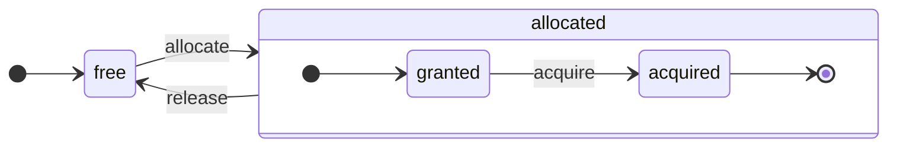

ClickHouse هو بحق نظام إدارة قواعد بيانات موجّه بالأعمدة. تُخزَّن البيانات بحسب الأعمدة، وأثناء التنفيذ تُعالَج أيضًا على هيئة مصفوفات (متجهات أو دفعات من الأعمدة).
وكلما أمكن، تُنفَّذ العمليات على المصفوفات بدلًا من القيم الفردية.
ويُسمّى ذلك &quot;التنفيذ المتجهي للاستعلامات&quot;، وهو يساعد على خفض تكلفة معالجة البيانات الفعلية.

هذه الفكرة ليست جديدة.
فهي تعود إلى `APL` (لغة برمجة، 1957) وما تفرّع عنها: `A +` (لهجة APL)، و`J` (1990)، و`K` (1993)، و`Q` (لغة برمجة من Kx Systems، 2003).
تُستخدم برمجة المصفوفات في معالجة البيانات العلمية. كما أن هذه الفكرة ليست جديدة في قواعد البيانات العلائقية أيضًا. فعلى سبيل المثال، تُستخدم في نظام `VectorWise` (المعروف أيضًا باسم Actian Vector Analytic Database من Actian Corporation).

هناك نهجان مختلفان لتسريع معالجة الاستعلامات: التنفيذ المتجهي للاستعلامات وتوليد الشيفرة وقت التشغيل. أما الثاني فيزيل كل أشكال الإحالة غير المباشرة والتوجيه الديناميكي. وليس أيٌّ من هذين النهجين أفضل من الآخر على نحوٍ مطلق. قد يكون توليد الشيفرة وقت التشغيل أفضل عندما يدمج عددًا كبيرًا من العمليات، وبذلك يستفيد استفادة كاملة من وحدات تنفيذ CPU وخط المعالجة. وقد يكون التنفيذ المتجهي للاستعلامات أقل عملية لأنه يتضمن متجهات مؤقتة يجب كتابتها إلى الذاكرة المخبئية ثم قراءتها مجددًا. وإذا لم تتسع الذاكرة المخبئية L2 للبيانات المؤقتة، فإن ذلك يصبح مشكلة. لكن التنفيذ المتجهي للاستعلامات يستفيد بسهولة أكبر من إمكانات SIMD في CPU. وتُظهر [ورقة بحثية](http://15721.courses.cs.cmu.edu/spring2016/papers/p5-sompolski.pdf) كتبها أصدقاؤنا أنه من الأفضل الجمع بين النهجين. يستخدم ClickHouse التنفيذ المتجهي للاستعلامات، ويقدّم دعمًا أوليًا ومحدودًا لتوليد الشيفرة وقت التشغيل.

  ## الأعمدة

تُستخدم الواجهة `IColumn` لتمثيل الأعمدة في الذاكرة (أي عمليًا كتلًا من الأعمدة). وتوفّر هذه الواجهة أساليب مساعدة لتنفيذ مختلف المعاملات العلائقية. وجميع العمليات تقريبًا غير قابلة للتغيير: فهي لا تعدّل العمود الأصلي، بل تنشئ عمودًا جديدًا معدّلًا. على سبيل المثال، تقبل الطريقة `IColumn :: filter` قناع بايت للتصفية. وتُستخدم مع المعاملين العلائقيين `WHERE` و`HAVING`. ومن الأمثلة الإضافية: الطريقة `IColumn :: permute` لدعم `ORDER BY`، والطريقة `IColumn :: cut` لدعم `LIMIT`.

تتولى تطبيقات `IColumn` المختلفة (`ColumnUInt8` و`ColumnString` وما إلى ذلك) مسؤولية تخطيط الذاكرة للأعمدة. وعادةً ما يكون تخطيط الذاكرة عبارة عن مصفوفة متجاورة. وبالنسبة إلى الأعمدة ذات النوع الصحيح، يكون الأمر مجرد مصفوفة متجاورة واحدة، مثل `std :: vector`. أما أعمدة `String` و`Array`، فتتكوّن من متجهين: أحدهما لجميع عناصر المصفوفة، مرتبةً بشكل متجاور، والثاني للإزاحات إلى بداية كل مصفوفة. وهناك أيضًا `ColumnConst` الذي يخزّن قيمة واحدة فقط في الذاكرة، لكنه يبدو كأنه عمود.

  ## الحقل

ومع ذلك، يمكن أيضًا العمل مع القيم المفردة. ولتمثيل قيمة مفردة، يُستخدَم `Field`. و`Field` ليس سوى union مميّز من `UInt64` و`Int64` و`Float64` و`String` و`Array`. يوفّر `IColumn` الطريقة `operator []` للحصول على القيمة رقم n على هيئة `Field`، والطريقة `insert` لإلحاق `Field` بنهاية عمود. وهذه الطرق ليست عالية الكفاءة، لأنها تتطلب التعامل مع كائنات `Field` مؤقتة تمثل قيمة مفردة. وهناك طرق أكثر كفاءة، مثل `insertFrom` و`insertRangeFrom` وما إلى ذلك.

لا يحتوي `Field` على معلومات كافية عن نوع البيانات المحدد في جدول. فعلى سبيل المثال، تُمثَّل الأنواع `UInt8` و`UInt16` و`UInt32` و`UInt64` جميعها على أنها `UInt64` داخل `Field`.

  ## التجريدات المسرِّبة

يحتوي `IColumn` على أساليب للتحويلات العلائقية الشائعة للبيانات، لكنها لا تلبّي جميع الاحتياجات. على سبيل المثال، لا يوفّر `ColumnUInt64` أسلوبًا لحساب مجموع عمودين، ولا يوفّر `ColumnString` أسلوبًا لإجراء بحث عن سلسلة فرعية. تُنفَّذ هذه الإجراءات الكثيرة خارج `IColumn`.

يمكن تنفيذ وظائف مختلفة على الأعمدة بأسلوب عام لكنه غير فعّال باستخدام أساليب `IColumn` لاستخراج قيم `Field`، أو بأسلوب متخصص يعتمد على معرفة تخطيط الذاكرة الداخلي للبيانات في تنفيذ معيّن لـ `IColumn`. ويتم ذلك عبر التحويل إلى نوع `IColumn` محدد والتعامل مباشرةً مع التمثيل الداخلي. فعلى سبيل المثال، يوفّر `ColumnUInt64` الأسلوب `getData` الذي يعيد مرجعًا إلى مصفوفة داخلية، ثم يقرأ إجراء منفصل هذه المصفوفة مباشرةً أو يملؤها. لدينا &quot;تجريدات مسرِّبة&quot; لإتاحة تخصيصات فعّالة لمختلف الإجراءات.

  ## أنواع البيانات

تتولى `IDataType` عمليتَي التسلسل وإلغاء التسلسل: قراءة وكتابة دفعات من الأعمدة أو القيم الفردية بصيغة ثنائية أو نصية. وتقابل `IDataType` أنواع البيانات في الجداول مباشرةً. على سبيل المثال، هناك `DataTypeUInt32` و`DataTypeDateTime` و`DataTypeString` وما إلى ذلك.

يرتبط `IDataType` و`IColumn` ببعضهما ارتباطًا غير وثيق فحسب. إذ يمكن تمثيل أنواع بيانات مختلفة في الذاكرة باستخدام تطبيقات `IColumn` نفسها. فعلى سبيل المثال، يُمثَّل كلٌّ من `DataTypeUInt32` و`DataTypeDateTime` بواسطة `ColumnUInt32` أو `ColumnConstUInt32`. بالإضافة إلى ذلك، يمكن تمثيل نوع البيانات نفسه بواسطة تطبيقات `IColumn` مختلفة. فعلى سبيل المثال، يمكن تمثيل `DataTypeUInt8` بواسطة `ColumnUInt8` أو `ColumnConstUInt8`.

لا تخزّن `IDataType` سوى البيانات الوصفية. فعلى سبيل المثال، لا يخزّن `DataTypeUInt8` أي شيء على الإطلاق (باستثناء المؤشر الافتراضي `vptr`)، بينما لا يخزّن `DataTypeFixedString` سوى `N` (أي حجم السلاسل النصية ذات الطول الثابت).

تتضمن `IDataType` أساليب مساعدة لمختلف تنسيقات البيانات. ومن أمثلتها أساليب لتسلسل قيمة مع احتمال إحاطتها بعلامتَي اقتباس، أو لتسلسل قيمة لأجل JSON، أو لتسلسل قيمة كجزء من تنسيق XML. ولا يوجد تطابق مباشر مع تنسيقات البيانات. فعلى سبيل المثال، يمكن لتنسيقَي البيانات المختلفين `Pretty` و`TabSeparated` استخدام أسلوب المساعدة نفسه `serializeTextEscaped` من الواجهة `IDataType`.

  ## الكتلة

تمثّل `Block` حاويةً تصف مجموعة فرعية (جزءًا) من جدول في الذاكرة. وهي ببساطة مجموعة من الثلاثيات: `(IColumn, IDataType, column name)`. أثناء تنفيذ الاستعلام، تُعالَج البيانات بواسطة كائنات `Block`. فإذا كان لدينا `Block`، فهذا يعني أن لدينا البيانات (في الكائن `IColumn`)، ولدينا معلومات عن نوعها (في `IDataType`) توضّح كيفية التعامل مع ذلك العمود، ولدينا اسم العمود. وقد يكون هذا الاسم هو اسم العمود الأصلي من الجدول، أو اسمًا اصطناعيًا أُسنِد للحصول على نتائج مؤقتة للحسابات.

عندما نحسب دالةً ما على أعمدة داخل كتلة، نضيف عمودًا آخر بنتيجتها إلى الكتلة، ولا نمسّ أعمدة وسيطات الدالة لأن العمليات غير قابلة للتغيير. لاحقًا، يمكن إزالة الأعمدة غير اللازمة من الكتلة، لكن لا يمكن تعديلها. وهذا مفيد للتخلّص من التعبيرات الفرعية المشتركة.

تُنشأ الكتل لكل جزء مُعالَج من البيانات. لاحظ أنه بالنسبة إلى النوع نفسه من الحسابات، تظل أسماء الأعمدة وأنواعها كما هي عبر الكتل المختلفة، ولا تتغير إلا بيانات الأعمدة. ومن الأفضل فصل بيانات الكتلة عن ترويسة الكتلة لأن أحجام الكتل الصغيرة تفرض كلفة إضافية مرتفعة بسبب السلاسل النصية المؤقتة عند نسخ `shared_ptr` وأسماء الأعمدة.

  ## المعالجات

اطّلع على الوصف في [https://github.com/ClickHouse/ClickHouse/blob/master/src/Processors/IProcessor.h](https://github.com/ClickHouse/ClickHouse/blob/master/src/Processors/IProcessor.h).

  ## التنسيقات

تُنفَّذ تنسيقات البيانات عبر المعالجات.

  ## الإدخال/الإخراج

بالنسبة إلى الإدخال/الإخراج المعتمد على البايتات، توجد الفئتان المجرّدتان `ReadBuffer` و`WriteBuffer`. تُستخدمان بدلًا من `iostream`s في C++. لا تقلق: فكل مشروع C++ ناضج يستخدم شيئًا آخر غير `iostream`s لأسباب وجيهة.

`ReadBuffer` و`WriteBuffer` ليسا سوى مخزن مؤقت متصل ومؤشر يشير إلى موضع داخل هذا المخزن المؤقت. وقد تمتلك التطبيقات الذاكرة الخاصة بالمخزن المؤقت أو لا تمتلكها. توجد دالة افتراضية لملء المخزن المؤقت بالبيانات التالية (في `ReadBuffer`) أو لتفريغ المخزن المؤقت إلى جهة ما (في `WriteBuffer`). ونادرًا ما تُستدعى هذه الدوال الافتراضية.

تُستخدم تطبيقات `ReadBuffer`/`WriteBuffer` للعمل مع الملفات وواصفات الملفات ومقابس الشبكة، ولتنفيذ الضغط (يُهيَّأ `CompressedWriteBuffer` باستخدام `WriteBuffer` آخر ويُجري الضغط قبل كتابة البيانات إليه)، ولأغراض أخرى — فأسماء `ConcatReadBuffer` و`LimitReadBuffer` و`HashingWriteBuffer` توضّح نفسها بنفسها.

لا تتعامل Read/WriteBuffers إلا مع البايتات. وتوجد دوال في ملفَي الترويسات `ReadHelpers` و`WriteHelpers` للمساعدة في تنسيق الإدخال/الإخراج. على سبيل المثال، توجد أدوات مساعدة لكتابة رقم بتنسيق عشري.

لنستعرض ما يحدث عندما تريد كتابة مجموعة نتائج بتنسيق `JSON` إلى stdout.
لديك مجموعة نتائج جاهزة للجلب من `QueryPipeline` يعمل بنمط السحب.
أولًا، تنشئ `WriteBufferFromFileDescriptor(STDOUT_FILENO)` لكتابة البايتات إلى stdout.
بعد ذلك، تربط ناتج مسار تنفيذ الاستعلام بـ `JSONRowOutputFormat`، الذي جرى تهيئته باستخدام `WriteBuffer` هذا، لكتابة الصفوف بتنسيق `JSON` إلى stdout.
يمكن تنفيذ ذلك عبر الدالة `complete`، التي تحوّل `QueryPipeline` يعمل بنمط السحب إلى `QueryPipeline` مكتمل.
داخليًا، سيكتب `JSONRowOutputFormat` فواصل JSON متنوعة ويستدعي الدالة `IDataType::serializeTextJSON` مع مرجع إلى `IColumn` ورقم الصف بوصفهما وسيطين. ونتيجة لذلك، ستستدعي `IDataType::serializeTextJSON` دالة من `WriteHelpers.h`: مثلًا، `writeText` للأنواع الرقمية و`writeJSONString` في حالة `DataTypeString`.

  ## الجداول

تمثل واجهة `IStorage` الجداول. وتمثل التطبيقات المختلفة لهذه الواجهة محركات جداول مختلفة. ومن أمثلتها `StorageMergeTree` و`StorageMemory` وغير ذلك. أما مثيلات هذه الأصناف فهي ببساطة جداول.

الطريقتان الرئيسيتان في `IStorage` هما `read` و`write`، إلى جانب طرق أخرى مثل `alter` و`rename` و`drop`. تقبل الطريقة `read` الوسيطات التالية: مجموعة الأعمدة المطلوب قراءتها من جدول، واستعلام `AST` الذي يجب أخذه في الاعتبار، والعدد المطلوب من التدفقات. وتُرجع `Pipe`.

في معظم الحالات، لا تكون الطريقة `read` مسؤولة إلا عن قراءة الأعمدة المحددة من جدول، وليس عن أي معالجة إضافية للبيانات.
أما جميع عمليات معالجة البيانات اللاحقة فتتولاها جهة أخرى في pipeline، وهذا خارج نطاق مسؤولية `IStorage`.

لكن توجد استثناءات مهمة:

* يُمرَّر استعلام `AST` إلى الطريقة `read`، ويمكن لمحرك الجدول استخدامه لاستنتاج كيفية استخدام الفهرس وقراءة كمية أقل من البيانات من الجدول.
* في بعض الحالات، يمكن لمحرك الجدول معالجة البيانات بنفسه حتى مرحلة معينة. فعلى سبيل المثال، يمكن لـ `StorageDistributed` إرسال استعلام إلى خوادم بعيدة، وطلب منها معالجة البيانات حتى مرحلة يمكن فيها دمج البيانات القادمة من خوادم بعيدة مختلفة، ثم إرجاع تلك البيانات المُعالجة مسبقًا. بعد ذلك، يُكمل مفسر الاستعلام معالجة البيانات.

يمكن للطريقة `read` الخاصة بالجدول أن تُرجع `Pipe` يتكون من عدة `Processors`. ويمكن لهذه `Processors` القراءة من الجدول بالتوازي.
بعد ذلك، يمكنك ربط هذه المعالجات بتحويلات أخرى متنوعة (مثل تقييم التعبيرات أو التصفية)، والتي يمكن حسابها بصورة مستقلة.
ثم يمكنك إنشاء `QueryPipeline` فوقها وتنفيذه عبر `PipelineExecutor`.

توجد أيضًا `TableFunction`s. وهي دوال تُرجع كائن `IStorage` مؤقتًا لاستخدامه في عبارة `FROM` ضمن query.

للحصول على فكرة سريعة عن كيفية تنفيذ محرك جدول خاص بك، انظر إلى شيء بسيط مثل `StorageMemory` أو `StorageTinyLog`.

> كنتيجة للطريقة `read`، تُرجع `IStorage` قيمة `QueryProcessingStage` — وهي معلومات حول الأجزاء من query التي حُسبت بالفعل داخل التخزين.

  ## المحللات

يُحلَّل الاستعلام باستخدام محلل نزولي عودي مكتوب يدويًا. على سبيل المثال، لا يقوم `ParserSelectQuery` إلا باستدعاء المحللات الفرعية المختلفة لأجزاء الاستعلام المختلفة على نحو عودي. تُنشئ المحللات `AST`. وتُمثَّل `AST` بعُقد، وهي مثيلات من `IAST`.

> لا تُستخدم مولدات المحللات لأسباب تاريخية.

  ## المفسرات

تتولى المفسرات مسؤولية إنشاء مسار تنفيذ الاستعلام انطلاقًا من `AST`. وهناك مفسرات بسيطة، مثل `InterpreterExistsQuery` و`InterpreterDropQuery`، إلى جانب `InterpreterSelectQuery` الأكثر تعقيدًا.

يمثل مسار تنفيذ الاستعلام مجموعة من المعالجات التي يمكنها استهلاك وإنتاج chunks (مجموعات من الأعمدة ذات أنواع محددة).
ويتواصل المعالج عبر المنافذ، ويمكن أن تكون له عدة منافذ إدخال وعدة منافذ إخراج.
ويمكن العثور على وصف أكثر تفصيلًا في [src/Processors/IProcessor.h](https://github.com/ClickHouse/ClickHouse/blob/master/src/Processors/IProcessor.h).

فعلى سبيل المثال، تكون نتيجة تفسير استعلام `SELECT` هي `QueryPipeline` من نوع &quot;pulling&quot;، يحتوي على منفذ إخراج خاص لقراءة مجموعة النتائج منه.
وتكون نتيجة استعلام `INSERT` هي `QueryPipeline` من نوع &quot;pushing&quot;، مع منفذ إدخال لكتابة البيانات من أجل الإدراج.
أما نتيجة تفسير استعلام `INSERT SELECT` فهي `QueryPipeline` من نوع &quot;completed&quot; لا يحتوي على أي مدخلات أو مخرجات، لكنه ينسخ البيانات من `SELECT` إلى `INSERT` في الوقت نفسه.

يستخدم `InterpreterSelectQuery` آليات `ExpressionAnalyzer` و`ExpressionActions` لتحليل الاستعلام وإجراء التحويلات. وهنا تُنفَّذ معظم عمليات تحسين الاستعلام القائمة على القواعد. ويُعَد `ExpressionAnalyzer` غير منظم إلى حد كبير، وينبغي إعادة كتابته: إذ يجب استخراج مختلف تحويلات الاستعلام وعمليات تحسينه إلى فئات منفصلة للسماح بإجراء تحويلات معيارية على الاستعلام.

ولمعالجة المشكلات الموجودة في المفسرات، جرى تطوير `InterpreterSelectQueryAnalyzer` جديد. وهو إصدار جديد من `InterpreterSelectQuery` لا يستخدم `ExpressionAnalyzer`، ويُدخل طبقة تجريد إضافية بين `AST` و`QueryPipeline` تُسمى `QueryTree`. وهو جاهز تمامًا للاستخدام في بيئات production، ولكن كإجراء احترازي يمكن تعطيله بضبط قيمة الإعداد `enable_analyzer` على `false`.

  ## الدوال

توجد دوال عادية ودوال تجميعية. أما الدوال التجميعية، فانظر القسم التالي.

الدوال العادية لا تغيّر عدد الصفوف، فهي تعمل كما لو كانت تعالج كل صف على نحو مستقل. لكن في الواقع، لا تُستدعى الدوال لكل صف على حدة، بل على كتل `Block` من البيانات لتنفيذ التنفيذ المتجهي للاستعلامات.

وهناك بعض الدوال المتنوعة، مثل [blockSize](/ar/reference/functions/regular-functions/other-functions#blockSize) و[rowNumberInBlock](/ar/reference/functions/regular-functions/other-functions#rowNumberInBlock) و[runningAccumulate](/ar/reference/functions/regular-functions/other-functions#runningAccumulate)، التي تستفيد من معالجة الكتل وتكسر استقلالية الصفوف.

يتميّز ClickHouse بنظام أنواع صارم، لذا لا يوجد تحويل ضمني للأنواع. وإذا كانت الدالة لا تدعم تركيبة معيّنة من الأنواع، فإنها تُطلق استثناءً. لكن يمكن للدوال أن تعمل (عبر التحميل الزائد) مع كثير من التركيبات المختلفة للأنواع. على سبيل المثال، تعمل الدالة `plus` (لتنفيذ المعامل `+`) مع أي تركيبة من الأنواع الرقمية: `UInt8` + `Float32` و`UInt16` + `Int8` وما إلى ذلك. كذلك، يمكن لبعض الدوال متغيرة الوسائط قبول أي عدد من الوسائط، مثل الدالة `concat`.

قد يكون تنفيذ الدالة غير مريح قليلًا، لأن عليها أن تُفرِّع صراحةً بحسب أنواع البيانات المدعومة و`IColumns` المدعومة. على سبيل المثال، تحتوي الدالة `plus` على شيفرة مُولَّدة عبر إنشاء قالب C++ لكل تركيبة من الأنواع الرقمية، ولكل احتمال من احتمالات كون الوسيطين الأيسر والأيمن ثابتين أو غير ثابتين.

وهذا موضع ممتاز لتطبيق توليد الشيفرة وقت التشغيل لتجنّب تضخّم شيفرة القوالب. كما يتيح ذلك إضافة دوال مدمجة مثل fused multiply-add أو إجراء مقارنات متعددة ضمن تكرار واحد للحلقة.

وبسبب التنفيذ المتجهي للاستعلامات، لا تُطبَّق على الدوال آلية التقييم القصير. على سبيل المثال، إذا كتبت `WHERE f(x) AND g(y)`، فسيُحسَب الطرفان معًا، حتى في الصفوف التي تكون فيها `f(x)` مساوية للصفر (إلا إذا كانت `f(x)` تعبيرًا ثابتًا يساوي الصفر). ولكن إذا كانت انتقائية الشرط `f(x)` مرتفعة، وكان حساب `f(x)` أقل كلفة بكثير من `g(y)`، فمن الأفضل تنفيذ الحساب على عدة مراحل. إذ يُحسَب `f(x)` أولًا، ثم تُرشَّح الأعمدة وفقًا للنتيجة، ثم يُحسَب `g(y)` فقط على الأجزاء الأصغر والمُرشَّحة من البيانات.

  ## الدوال التجميعية

الدوال التجميعية هي دوال ذات حالة. فهي تراكم القيم المُمرَّرة في حالةٍ ما، وتتيح لك استخراج النتائج من تلك الحالة. وتُدار عبر الواجهة `IAggregateFunction`. وقد تكون الحالات بسيطة نسبيًا (فحالة `AggregateFunctionCount` ليست سوى قيمة `UInt64` واحدة)، أو معقدة جدًا (فحالة `AggregateFunctionUniqCombined` هي مزيج من Array خطية، وجدول hash، وبنية بيانات احتمالية `HyperLogLog`).

تُخصَّص الحالات في `Arena` (مجمع ذاكرة) للتعامل مع حالات متعددة أثناء تنفيذ استعلام `GROUP BY` عالي الكاردينالية. وقد يكون لهذه الحالات مُنشئ وdestructor غير بسيطين؛ فعلى سبيل المثال، يمكن لحالات التجميع المعقدة أن تخصِّص بنفسها ذاكرة إضافية. وهذا يتطلب قدرًا من الانتباه عند إنشاء الحالات وتدميرها، وكذلك عند نقل ملكيتها وترتيب تدميرها بشكل صحيح.

يمكن تسلسل حالات التجميع وفك تسلسلها لتمريرها عبر الشبكة أثناء تنفيذ الاستعلامات الموزعة، أو لكتابتها على القرص عندما لا تكون ذاكرة `RAM` كافية. ويمكن حتى تخزينها في جدول باستخدام `DataTypeAggregateFunction` للسماح بالتجميع التدريجي للبيانات.

> تنسيق البيانات المُتسلسلة لحالات الدوال التجميعية غير مرتبط بإصدارات حاليًا. ولا بأس بذلك إذا كانت حالات التجميع تُخزَّن مؤقتًا فقط. لكن لدينا محرك جدول `AggregatingMergeTree` للتجميع التدريجي، والناس يستخدمونه بالفعل في بيئة production. ولهذا السبب يجب الحفاظ على backward compatibility عند تغيير التنسيق المُتسلسل لأي دالة تجميعية في المستقبل.

  ## الخادم

يدعم الخادم عدة واجهات مختلفة:

* واجهة HTTP لأي عميل خارجي.
* واجهة TCP لعميل ClickHouse الأصلي وللاتصال بين الخوادم أثناء تنفيذ الاستعلامات الموزعة.
* واجهة لنقل البيانات لأغراض النسخ المتماثل.

داخليًا، هو مجرد خادم أولي متعدد الخيوط من دون coroutines أو fibers. ونظرًا إلى أن الخادم غير مصمم لمعالجة معدل مرتفع من الاستعلامات البسيطة، بل لمعالجة معدل منخفض نسبيًا من الاستعلامات المعقدة، فإن كل استعلام منها يمكنه معالجة كم هائل من البيانات لأغراض التحليلات.

يهيّئ الخادم الصنف `Context` بالبيئة اللازمة لتنفيذ الاستعلامات: قائمة قواعد البيانات المتاحة، والمستخدمين وحقوق الوصول، والإعدادات، والمجموعات العنقودية، وقائمة العمليات، وسجل الاستعلامات، وما إلى ذلك. وتستخدم Interpreters هذه البيئة.

نحافظ على توافق كامل مع الإصدارات السابقة واللاحقة لبروتوكول TCP الخاص بالخادم: إذ يمكن للعملاء القدامى التواصل مع الخوادم الجديدة، ويمكن للعملاء الجدد التواصل مع الخوادم القديمة. لكننا لا نريد الاستمرار في دعمه إلى الأبد، لذا نزيل دعم الإصدارات القديمة بعد نحو عام.

<Note>
  بالنسبة إلى معظم التطبيقات الخارجية، نوصي باستخدام واجهة HTTP لأنها بسيطة وسهلة الاستخدام. ويرتبط بروتوكول TCP ارتباطًا أوثق ببُنى البيانات الداخلية: فهو يستخدم تنسيقًا داخليًا لتمرير كتل البيانات، كما يستخدم تأطيرًا مخصصًا للبيانات المضغوطة.
</Note>

  ## التهيئة

يعتمد ClickHouse Server على مكتبات POCO C++ ويستخدم `Poco::Util::AbstractConfiguration` لتمثيل التهيئة. وتحتفظ الفئة `Poco::Util::ServerApplication` بالتهيئة، وهي فئة ترثها `DaemonBase`، التي ترثها بدورها `DB::Server`، وهي الفئة التي تنفّذ `clickhouse-server` نفسه. لذلك يمكن الوصول إلى التهيئة باستخدام الدالة `ServerApplication::config()`.

تُقرأ التهيئة من عدة ملفات (بتنسيق XML أو YAML) وتُدمج في كائن `AbstractConfiguration` واحد بواسطة الفئة `ConfigProcessor`. تُحمَّل التهيئة عند بدء تشغيل الخادم، ويمكن إعادة تحميلها لاحقًا إذا جرى تحديث أحد ملفات التهيئة أو حذفه أو إضافته. وتتولى الفئة `ConfigReloader` أيضًا المراقبة الدورية لهذه التغييرات وإجراءات إعادة التحميل. كما يؤدي الاستعلام `SYSTEM RELOAD CONFIG` أيضًا إلى إعادة تحميل التهيئة.

بالنسبة إلى الاستعلامات والأنظمة الفرعية بخلاف `Server`، يمكن الوصول إلى التهيئة باستخدام الدالة `Context::getConfigRef()`. ويجب على كل نظام فرعي قادر على إعادة تحميل تهيئته من دون إعادة تشغيل الخادم أن يسجّل نفسه في دالة رد النداء الخاصة بإعادة التحميل ضمن الدالة `Server::main()`. لاحظ أنه إذا كانت التهيئة الأحدث تحتوي على خطأ، فستتجاهل معظم الأنظمة الفرعية التهيئة الجديدة، وتسجّل رسائل تحذير، وتواصل العمل بالتهيئة التي سبق تحميلها. ونظرًا إلى طبيعة `AbstractConfiguration`، لا يمكن تمرير مرجع إلى قسم محدد، لذلك يُستخدم عادةً `String config_prefix` بدلًا من ذلك.

  ### السياق

يدير ClickHouse الإعدادات عبر التسلسل الهرمي للسياقات:

* **السياق العام** - إعدادات على مستوى الخادم بأكمله، تُحدَّد عبر ملفات التهيئة
* **سياق الجلسة** - إعدادات جلسة المستخدم من ملفات التعريف وتهيئة المستخدم وأوامر SET
* **سياق الاستعلام** - إعدادات على مستوى الاستعلام من عبارة SETTINGS
* **السياق الخلفي** - إعدادات على مستوى الخادم بأكمله للعمليات الخلفية (Mutate, Merge)، تُحدَّد عبر ملف التعريف &#39;background&#39;

عند جدولة عملية (مثل الاستعلامات وmutations وغيرها)، ينشئ الخادم السياق المحدد من خلال دمج الإعدادات بالترتيب التالي (حيث تتجاوز الأقسام اللاحقة الأقسام السابقة):

1. القيم الافتراضية العامة
2. التهيئة العامة
3. إعدادات ملف التعريف (من قسم `<profiles>`)
4. إعدادات المستخدم (من قسم `<users>`)
5. إعدادات الجلسة (من أمر SET)
6. إعدادات الاستعلام (من عبارة SETTINGS)

<Note>
  يمكن تهيئة العمليات الخلفية عبر الإعدادات العامة وإعدادات ملف التعريف &#39;background&#39;؛ ولا يكون لإعدادات الجلسة والاستعلام أي تأثير في هذه الحالة. وإذا لم يتم تحديد تهيئة صريحة، فسترث التهيئة من السياق العام. اسم ملف التعريف الافتراضي لمثل هذه العمليات هو &#39;background&#39;، ويمكن تجاوزه عبر إعداد `background_profile` على مستوى الخادم.
</Note>

  ## الخيوط والمهام

لتنفيذ الاستعلامات والقيام بالأنشطة الجانبية، يخصّص ClickHouse خيوطًا من أحد تجمعات الخيوط لتجنّب إنشاء الخيوط وإتلافها بشكل متكرر. توجد عدة تجمعات خيوط، ويُختار بينها بحسب الغرض من المهمة وبنيتها:

* تجمع الخادم لجلسات العميل الواردة.
* Global thread pool للمهام العامة، والأنشطة الخلفية، والخيوط المستقلة.
* IO thread pool للمهام التي تكون محجوبة في الغالب على بعض عمليات IO وليست كثيفة الاستهلاك لـ CPU.
* تجمعات Background للمهام الدورية.
* تجمعات للمهام القابلة للمقاطعة التي يمكن تقسيمها إلى خطوات.

تجمع الخادم هو مثيل من الفئة `Poco::ThreadPool` مُعرَّف في الدالة `Server::main()`. ويمكن أن يحتوي على `max_connection` خيطًا كحد أقصى. ويُخصَّص كل خيط لاتصال نشط واحد.

Global thread pool هو الفئة الوحيدة `GlobalThreadPool`. ولتخصيص خيط منه، يُستخدم `ThreadFromGlobalPool`. وله واجهة مشابهة لـ `std::thread`، لكنه يسحب خيطًا من التجمع العام ويجري كل التهيئة اللازمة. ويُضبط بالإعدادات التالية:

* `max_thread_pool_size` - حدّ عدد الخيوط في التجمع.
* `max_thread_pool_free_size` - حدّ عدد الخيوط الخاملة المنتظرة لمهام جديدة.
* `thread_pool_queue_size` - حدّ عدد المهام المجدولة.

التجمع العام شامل، وجميع التجمعات الموصوفة أدناه مبنية فوقه. ويمكن النظر إلى ذلك على أنه تسلسل هرمي من التجمعات. فأي تجمع متخصص يأخذ خيوطه من التجمع العام باستخدام الفئة `ThreadPool`. لذا فإن الغرض الرئيسي لأي تجمع متخصص هو فرض حد على عدد المهام المتزامنة وجدولة المهام. إذا كان عدد المهام المجدولة أكبر من عدد الخيوط في التجمع، فإن `ThreadPool` يكدّس المهام في queue ذات أولويات. ولكل مهمة أولوية عددية صحيحة. والأولوية الافتراضية هي صفر. وتُبدأ جميع المهام ذات قيم الأولوية الأعلى قبل أي مهمة ذات قيمة أولوية أقل. لكن لا يوجد فرق بين المهام التي يجري تنفيذها بالفعل، لذا لا تكون للأولوية أهمية إلا عندما يكون التجمع مثقلاً.

يُنَفَّذ IO thread pool على هيئة `ThreadPool` عادي يمكن الوصول إليه عبر الدالة `IOThreadPool::get()`. ويُضبط بالطريقة نفسها التي يُضبط بها التجمع العام باستخدام الإعدادات `max_io_thread_pool_size` و`max_io_thread_pool_free_size` و`io_thread_pool_queue_size`. والغرض الرئيسي من IO thread pool هو تجنّب استنزاف التجمع العام بمهام IO، وهو ما قد يمنع الاستعلامات من الاستفادة الكاملة من CPU. وتُجري عملية النسخ الاحتياطي إلى S3 قدرًا كبيرًا من عمليات IO، ولتجنّب التأثير في الاستعلامات التفاعلية، يوجد `BackupsIOThreadPool` منفصل يُضبط بالإعدادات `max_backups_io_thread_pool_size` و`max_backups_io_thread_pool_free_size` و`backups_io_thread_pool_queue_size`.

لتنفيذ المهام الدورية، توجد الفئة `BackgroundSchedulePool`. يمكنك تسجيل المهام باستخدام كائنات `BackgroundSchedulePool::TaskHolder`، ويضمن التجمع ألا تُشغِّل أي مهمة مهمتين في الوقت نفسه. كما يتيح لك تأجيل تنفيذ المهمة إلى وقت محدد في المستقبل أو تعطيلها مؤقتًا. يوفّر `Context` العام عدة مثيلات من هذه الفئة لأغراض مختلفة. وبالنسبة إلى المهام العامة، يُستخدم `Context::getSchedulePool()`.

توجد أيضًا تجمعات خيوط متخصصة للمهام القابلة للمقاطعة. يمكن تقسيم مهمة `IExecutableTask` هذه إلى sequence مرتبة من المهام، تُسمى خطوات. ولجدولة هذه المهام بطريقة تسمح بإعطاء أولوية للمهام القصيرة على الطويلة، يُستخدم `MergeTreeBackgroundExecutor`. وكما يوحي الاسم، فإنه يُستخدم لعمليات MergeTree الخلفية ذات الصلة مثل merges وmutations وfetches وmoves. ويمكن الوصول إلى مثيلات التجمع عبر `Context::getCommonExecutor()` ودوال مشابهة أخرى.

بغض النظر عن التجمع المستخدم للمهمة، يُنشأ مثيل `ThreadStatus` لهذه المهمة عند البدء. وهو يغلّف جميع المعلومات الخاصة بكل خيط: معرّف الخيط، ومعرّف query، وعدادات الأداء، واستهلاك الموارد، والعديد من البيانات المفيدة الأخرى. ويمكن للمهمة الوصول إليه عبر مؤشر محلي للخيط من خلال الاستدعاء `CurrentThread::get()`، ولذلك لا نحتاج إلى تمريره إلى كل دالة.

إذا كان الخيط مرتبطًا بتنفيذ query، فإن أهم ما يكون attached بـ `ThreadStatus` هو سياق query `ContextPtr`. لكل query خيطه الرئيسي في تجمع الخادم. ويقوم الخيط الرئيسي بعملية Attach هذه من خلال الاحتفاظ بكائن `ThreadStatus::QueryScope query_scope(query_context)`. كما ينشئ الخيط الرئيسي مجموعة خيوط يمثّلها الكائن `ThreadGroupStatus`. وكل خيط إضافي يُخصَّص أثناء تنفيذ هذا الاستعلام يُربط بمجموعة خيوطه عبر الاستدعاء `CurrentThread::attachTo(thread_group)`. وتُستخدم مجموعات الخيوط لتجميع عدادات أحداث profile وتتبع استهلاك الذاكرة بواسطة جميع الخيوط المخصصة لمهمة واحدة (انظر الفئتَين `MemoryTracker` و`ProfileEvents::Counters` لمزيد من المعلومات).

  ## التحكم في التزامن

يستخدم الاستعلام القابل للتنفيذ على التوازي الإعداد `max_threads` لتقييد نفسه. وتُختار القيمة الافتراضية لهذا الإعداد بطريقة تسمح لاستعلام واحد بالاستفادة المثلى من جميع أنوية CPU. لكن ماذا لو وُجدت عدة استعلامات متزامنة وكان كلٌّ منها يستخدم القيمة الافتراضية للإعداد `max_threads`؟ عندئذٍ ستتقاسم الاستعلامات موارد CPU. وسيضمن نظام التشغيل العدالة من خلال التبديل المستمر بين خيوط التنفيذ، ما يفرض كلفةً إضافية على الأداء. تساعد `ConcurrencyControl` في التعامل مع هذه الكلفة وتجنّب تخصيص عدد كبير من خيوط التنفيذ. ويُستخدم إعداد التهيئة `concurrent_threads_soft_limit_num` لتقييد عدد خيوط التنفيذ المتزامنة التي يمكن تخصيصها قبل تطبيق نوع من ضغط CPU.

يُقدَّم مفهوم `slot` في CPU. وتمثل الـ `slot` وحدةً للتزامن: فلكي يشغّل الاستعلام خيط تنفيذ، يجب أن يحصل مسبقًا على `slot` ثم يحررها عند توقف الخيط. ويكون عدد الـ `slots` محدودًا على مستوى الخادم ككل. وتتنافس الاستعلامات المتزامنة المتعددة على `CPU slots` إذا تجاوز إجمالي الطلب العدد الإجمالي للـ `slots`. وتتولى `ConcurrencyControl` حل هذا التنافس من خلال جدولة `CPU slots` بطريقة عادلة.

يمكن النظر إلى كل `slot` على أنها آلة حالات مستقلة لها الحالات التالية:

* `free`: الـ `slot` متاحة لتُخصَّص لأي استعلام.
* `granted`: الـ `slot` `allocated` لاستعلام محدد، ولكن لم يكتسبها أي خيط تنفيذ بعد.
* `acquired`: الـ `slot` `allocated` لاستعلام محدد وقد اكتسبها خيط تنفيذ.

لاحظ أن الـ `slot` التي تكون `allocated` يمكن أن تكون في حالتين مختلفتين: `granted` و`acquired`. الأولى حالة انتقالية، ويُفترض عمليًا أن تكون قصيرة (من اللحظة التي تُخصَّص فيها `slot` لاستعلام إلى اللحظة التي يُشغَّل فيها إجراء التوسعة التصاعدية بواسطة أي خيط تنفيذ لذلك الاستعلام).

تتكوّن واجهة برمجة تطبيقات `ConcurrencyControl` من الدوال التالية:

1. أنشئ تخصيص موارد لاستعلام: `auto slots = ConcurrencyControl::instance().allocate(1, max_threads);`. سيُخصِّص ما لا يقل عن فتحة واحدة وما لا يزيد عن `max_threads` من الفتحات. لاحظ أن الفتحة الأولى تُمنَح فورًا، لكن قد تُمنَح الفتحات المتبقية لاحقًا. لذا فالحدّ مرن، لأن كل استعلام سيحصل على خيط تنفيذ واحد على الأقل.
2. لكل خيط تنفيذ، يجب الحصول على فتحة من التخصيص: `while (auto slot = slots->tryAcquire()) spawnThread([slot = std::move(slot)] { ... });`.
3. حدِّث العدد الإجمالي للفتحات: `ConcurrencyControl::setMaxConcurrency(concurrent_threads_soft_limit_num)`. يمكن تنفيذ ذلك أثناء التشغيل، من دون إعادة تشغيل الخادم.

تتيح واجهة برمجة التطبيقات هذه للاستعلامات أن تبدأ بخيط تنفيذ واحد على الأقل (عند وجود ضغط على CPU)، ثم تتوسع لاحقًا حتى `max_threads`.

  ## تنفيذ الاستعلامات الموزعة

تكون الخوادم في إعداد العنقود مستقلةً إلى حد كبير. يمكنك إنشاء جدول `Distributed` على خادم واحد أو على جميع خوادم العنقود. ولا يخزّن جدول `Distributed` البيانات بنفسه، بل يوفّر فقط &quot;عرضًا&quot; لجميع الجداول المحلية على عدة عقد في العنقود. وعند تنفيذ SELECT من جدول `Distributed`، يعيد كتابة ذلك الاستعلام، ويختار العقد البعيدة وفقًا لإعدادات موازنة التحميل، ثم يرسل الاستعلام إليها. ويطلب جدول `Distributed` من الخوادم البعيدة معالجة الاستعلام إلى المرحلة التي يمكن عندها دمج النتائج الوسيطة القادمة من خوادم مختلفة. ثم يستقبل هذه النتائج الوسيطة ويقوم بدمجها. ويحاول الجدول الموزع إسناد أكبر قدر ممكن من العمل إلى الخوادم البعيدة، بحيث لا يرسل الكثير من البيانات الوسيطة عبر الشبكة.

تصبح الأمور أكثر تعقيدًا عندما تكون لديك استعلامات فرعية داخل عبارات IN أو JOIN، ويستخدم كلٌّ منها جدول `Distributed`. ولدينا استراتيجيات مختلفة لتنفيذ هذه الاستعلامات.

لا توجد خطة تنفيذ استعلام عامة لتنفيذ الاستعلامات الموزعة. فلكل عقدة خطة تنفيذ استعلام محلية خاصة بها للجزء الذي تنفذه من المهمة. وما لدينا هو فقط تنفيذ موزع بسيط من مرور واحد: نرسل الاستعلامات إلى العقد البعيدة ثم ندمج النتائج. لكن هذا غير عملي للاستعلامات المعقدة ذات `GROUP BY` عالي الكاردينالية أو التي تتضمن قدرًا كبيرًا من البيانات المؤقتة اللازمة لعمليات JOIN. وفي مثل هذه الحالات، نحتاج إلى &quot;إعادة توزيع&quot; البيانات بين الخوادم، وهو ما يتطلب تنسيقًا إضافيًا. ولا يدعم ClickHouse هذا النوع من تنفيذ الاستعلامات، ونحتاج إلى العمل عليه.

  ## MergeTree

`MergeTree` هي عائلة من محركات التخزين التي تدعم الفهرسة باستخدام المفتاح الأساسي. ويمكن أن يكون المفتاح الأساسي Tuple اعتباطيًا من الأعمدة أو التعبيرات. وتُخزَّن البيانات في جدول `MergeTree` على شكل &quot;أجزاء&quot;. ويخزّن كل جزء البيانات بترتيب المفتاح الأساسي، لذا تكون البيانات مرتبة ترتيبًا معجميًا وفق Tuple المفتاح الأساسي. وتُخزَّن جميع أعمدة الجدول في ملفات `column.bin` منفصلة داخل هذه الأجزاء. وتتكوّن الملفات من blocks مضغوطة. ويكون كل block عادةً بين 64 كيلوبايت و1 ميغابايت من البيانات غير المضغوطة، وذلك بحسب متوسط حجم القيم. وتتكوّن الـ blocks من قيم الأعمدة الموضوعة بشكل متجاور، واحدة تلو الأخرى. وتكون قيم الأعمدة بالترتيب نفسه في كل عمود (إذ يحدد المفتاح الأساسي هذا الترتيب)، لذلك عندما تمر عبر عدة أعمدة، تحصل على قيم الصفوف المقابلة.

والمفتاح الأساسي نفسه &quot;sparse&quot;. فهو لا يشير إلى كل row على حدة، بل إلى بعض ranges من البيانات فقط. ويحتوي ملف `primary.idx` منفصل على قيمة المفتاح الأساسي لكل صف رقم N، حيث يُسمّى N بـ `index_granularity` (وعادةً ما تكون N = 8192). كذلك، يوجد لكل عمود ملفات `column.mrk` تحتوي على &quot;marks&quot;، وهي offsets لكل صف رقم N داخل ملف البيانات. وكل mark عبارة عن زوج: offset في الملف إلى بداية الـ block المضغوط، وoffset في الـ block غير المضغوط إلى بداية البيانات. وعادةً ما تكون الـ blocks المضغوطة محاذيةً وفق marks، ويكون offset في الـ block غير المضغوط صفرًا. وتقيم بيانات `primary.idx` دائمًا في الذاكرة، بينما تكون بيانات ملفات `column.mrk` مخزنة مؤقتًا.

عندما نريد قراءة شيء من جزء في `MergeTree`، ننظر إلى بيانات `primary.idx` ونحدّد ranges التي قد تحتوي على البيانات المطلوبة، ثم ننظر إلى بيانات `column.mrk` ونحسب offsets الخاصة بموضع بدء قراءة تلك ranges. وبسبب هذه الخاصية المتفرقة، قد تُقرأ بيانات زائدة. لا يُعد ClickHouse مناسبًا للأحمال العالية من الاستعلامات النقطية البسيطة، لأنه يجب قراءة النطاق الكامل الذي يحتوي على `index_granularity` من rows لكل مفتاح، كما يجب فك ضغط الـ block المضغوط بالكامل لكل عمود. وقد جعلنا الفهرس sparse لأننا نحتاج إلى القدرة على إدارة تريليونات من rows على server واحد من دون استهلاك ملحوظ للذاكرة من أجل الفهرس. كذلك، وبما أن المفتاح الأساسي sparse، فهو ليس فريدًا: إذ لا يمكنه التحقق من وجود المفتاح في الجدول وقت `INSERT`. ويمكن أن يحتوي الجدول على العديد من rows بالمفتاح نفسه.

عندما تقوم بـ `INSERT` لمجموعة من البيانات إلى `MergeTree`، تُرتَّب تلك المجموعة وفق ترتيب المفتاح الأساسي وتشكّل جزء جديدًا. وتوجد threads تعمل في الخلفية تختار دوريًا بعض أجزاء وتدمجها في جزء واحد مرتب للحفاظ على عدد أجزاء منخفضًا نسبيًا. ولهذا سُمّي `MergeTree`. وبالطبع، يؤدي الدمج إلى &quot;write amplification&quot;. فجميع أجزاء غير قابلة للتغيير: فهي تُنشأ وتُحذف فقط، ولا تُعدَّل. وعند تنفيذ SELECT، فإنه يحتفظ بـ snapshot للجدول (أي مجموعة من أجزاء). وبعد الدمج، نحتفظ أيضًا بالأجزاء القديمة لبعض الوقت لتسهيل recovery بعد الفشل، لذلك إذا رأينا أن merged جزء ما قد يكون معطوبًا، فيمكننا استبداله بـ source أجزاء الخاصة به.

`MergeTree` ليس شجرة LSM لأنه لا يحتوي على MEMTABLE وLOG: إذ تُكتب البيانات المُدرجة مباشرةً إلى filesystem. ويجعل هذا السلوك MergeTree أكثر ملاءمة بكثير لإدراج البيانات على شكل batches. لذلك، فإن إدراج كميات صغيرة من rows بشكل متكرر ليس مثاليًا لـ MergeTree. فعلى سبيل المثال، إدراج صفين كل ثانية أمر مقبول، لكن القيام بذلك ألف مرة في الثانية ليس أمثل لـ MergeTree. ومع ذلك، يوجد وضع async insert لعمليات الإدراج الصغيرة لتجاوز هذا القيد. وقد صممناه بهذه الطريقة حرصًا على البساطة، ولأننا نُدرج البيانات أصلًا على شكل batches في تطبيقاتنا

توجد محركات MergeTree تنفّذ عملًا إضافيًا أثناء merges التي تجري في الخلفية. ومن أمثلتها `CollapsingMergeTree` و`AggregatingMergeTree`. ويمكن اعتبار هذا دعمًا خاصًا للتحديثات. ضع في حسبانك أن هذه ليست تحديثات حقيقية، لأن المستخدمين عادةً لا يملكون أي تحكم في وقت تنفيذ background merges، ولأن البيانات في جدول `MergeTree` تُخزَّن غالبًا في أكثر من جزء واحد، وليس في صورة مدمجة بالكامل.

  ## النسخ المتماثل

يمكن تهيئة النسخ المتماثل في ClickHouse على مستوى كل جدول على حدة. فيمكن أن يكون لديك بعض الجداول المتماثلة وأخرى غير متماثلة على الخادم نفسه. كما يمكن أيضًا أن تُنسخ الجداول بطرق مختلفة، مثل جدول بنسخ متماثل ثنائي وآخر ثلاثي.

يُنفَّذ النسخ المتماثل في محرك التخزين `ReplicatedMergeTree`. ويُحدَّد المسار في `ZooKeeper` كمعامل لمحرك التخزين. وتصبح جميع الجداول التي لها المسار نفسه في `ZooKeeper` نُسخًا متماثلة لبعضها: فهي تزامن بياناتها وتحافظ على الاتساق. ويمكن إضافة النُسخ المتماثلة وإزالتها ديناميكيًا بمجرد إنشاء جدول أو حذفه.

يستخدم النسخ المتماثل مخططًا غير متزامن متعدد الجهات الرئيسية. يمكنك إدراج البيانات في أي نسخة متماثلة لديها session مع `ZooKeeper`، وتُنسخ البيانات إلى جميع النسخ المتماثلة الأخرى بصورة غير متزامنة. ونظرًا إلى أن ClickHouse لا يدعم UPDATEs، فإن النسخ المتماثل خالٍ من التعارضات. وبما أنه لا يوجد، افتراضيًا، إقرار quorum لعمليات الإدراج، فقد تُفقَد البيانات المُدرجة حديثًا إذا تعطلت إحدى العُقد. ويمكن تمكين quorum الإدراج باستخدام الإعداد `insert_quorum`.

تُخزَّن البيانات الوصفية الخاصة بالنسخ المتماثل في ZooKeeper. ويوجد سجل للنسخ المتماثل يسرد الإجراءات المطلوب تنفيذها. وتشمل هذه الإجراءات: جلب جزء، ودمج أجزاء، وحذف partition، وما إلى ذلك. وتنسخ كل نسخة متماثلة سجل النسخ المتماثل إلى queue الخاصة بها، ثم تنفّذ الإجراءات منها. فعلى سبيل المثال، عند الإدراج، يُنشأ في السجل إجراء &quot;get the جزء&quot;، ثم تقوم كل نسخة متماثلة بتنزيل ذلك الجزء. وتُنسَّق عمليات الدمج بين النسخ المتماثلة للحصول على نتائج متطابقة على مستوى البايت. وتُدمج جميع أجزاء بالطريقة نفسها على جميع النسخ المتماثلة. ويبدأ أحد القادة أولًا عملية دمج جديدة ويكتب إجراءات &quot;merge أجزاء&quot; في السجل. ويمكن أن تكون عدة نسخ متماثلة (أو جميعها) قادة في الوقت نفسه. ويمكن منع نسخة متماثلة من أن تصبح قائدًا باستخدام إعداد `merge_tree` ‏`replicated_can_become_leader`. ويتولى القادة مسؤولية جدولة عمليات الدمج في الخلفية.

النسخ المتماثل فيزيائي: إذ لا تُنقل بين العُقد إلا أجزاء المضغوطة، وليس queries. وتُعالَج عمليات الدمج على كل نسخة متماثلة بصورة مستقلة في معظم الحالات لخفض تكاليف الشبكة من خلال تجنب تضخيم حركة الشبكة. ولا تُرسل أجزاء المدمجة الكبيرة عبر الشبكة إلا في حالات تأخر النسخ المتماثل الكبير.

إضافة إلى ذلك، تخزّن كل نسخة متماثلة حالتها في ZooKeeper على شكل مجموعة من أجزاء وقيم checksums الخاصة بها. وعندما تنحرف الحالة على local filesystem عن الحالة المرجعية في ZooKeeper، تستعيد النسخة المتماثلة اتساقها بتنزيل أجزاء المفقودة والتالفة من النسخ المتماثلة الأخرى. وعندما توجد بيانات غير متوقعة أو تالفة في local filesystem، فإن ClickHouse لا يزيلها، بل ينقلها إلى directory منفصل ويتجاهلها.

<Note>
  تتكوّن مجموعة ClickHouse من shards مستقلة، ويتكوّن كل shard من replicas. وهذه المجموعة **غير مرنة**، لذلك بعد إضافة shard جديدة، لا يُعاد توازن البيانات بين shards تلقائيًا. وبدلًا من ذلك، يُفترض ضبط حمل المجموعة بحيث يكون غير متساوٍ. يمنحك هذا التنفيذ قدرًا أكبر من التحكم، وهو مناسب للمجموعات الصغيرة نسبيًا، مثل تلك التي تضم عشرات العُقد. لكن بالنسبة إلى المجموعات التي تضم مئات العُقد التي نستخدمها في production، يصبح هذا النهج عيبًا كبيرًا. ينبغي أن ننفّذ محرك جدول يمتد عبر المجموعة مع مناطق متماثلة ديناميكيًا يمكن تقسيمها وموازنتها بين clusters تلقائيًا.
</Note>