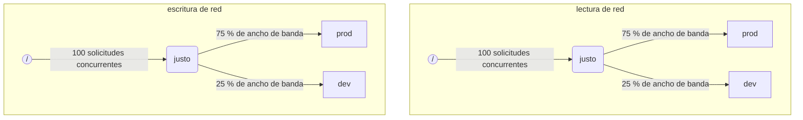

Cuando ClickHouse ejecuta varias consultas simultáneamente, estas pueden estar utilizando recursos compartidos (p. ej., discos y núcleos de CPU). Se pueden aplicar restricciones y políticas de planificación para regular cómo se utilizan y comparten los recursos entre distintas cargas de trabajo. Para todos los recursos, se puede configurar una jerarquía de planificación común. La raíz de la jerarquía representa los recursos compartidos, mientras que las hojas corresponden a cargas de trabajo específicas, donde se mantienen las solicitudes que superan la capacidad de los recursos.

<Note>
  Actualmente, la [E/S de disco remota](#disk_config) y la [CPU](#cpu_scheduling) pueden planificarse con el método descrito. Para límites de memoria flexibles, consulte [memory overcommit](/es/concepts/features/configuration/settings/memory-overcommit)
</Note>

<div id="disk_config">
  ## Configuración del disco
</div>

Para habilitar la planificación de cargas de trabajo de E/S para un disco específico, debe crear recursos de lectura y escritura para los accesos WRITE y READ:

```sql
CREATE RESOURCE resource_name (WRITE DISK disk_name, READ DISK disk_name)
-- o
CREATE RESOURCE read_resource_name (WRITE DISK write_disk_name)
CREATE RESOURCE write_resource_name (READ DISK read_disk_name)
```

El recurso puede usarse con cualquier número de discos para READ, WRITE o ambos. Existe una sintaxis que permite usar un recurso para todos los discos:

```sql
CREATE RESOURCE all_io (READ ANY DISK, WRITE ANY DISK);
```

Una forma alternativa de indicar qué discos usa un recurso es el `storage_configuration` del servidor:

<Warning>
  La planificación de cargas de trabajo mediante la configuración de ClickHouse está en desuso. En su lugar, debe usarse la sintaxis SQL.
</Warning>

Para habilitar la planificación de E/S para un disco específico, debe especificar `read_resource` y/o `write_resource` en la configuración de almacenamiento. Esto le indica a ClickHouse qué recurso debe usar para cada solicitud de lectura y escritura de ese disco. El recurso de lectura y el de escritura pueden referirse al mismo nombre de recurso, lo que resulta útil para Local SSD o HDD. Varios discos distintos también pueden referirse al mismo recurso, lo que resulta útil para discos remotos si desea permitir un reparto equitativo del ancho de banda de red entre, por ejemplo, las cargas de trabajo de &quot;producción&quot; y &quot;desarrollo&quot;.

Ejemplo:

```xml
<clickhouse>
    <storage_configuration>
        ...
        <disks>
            <s3>
                <type>s3</type>
                <endpoint>https://clickhouse-public-datasets.s3.amazonaws.com/my-bucket/root-path/</endpoint>
                <access_key_id>your_access_key_id</access_key_id>
                <secret_access_key>your_secret_access_key</secret_access_key>
                <read_resource>network_read</read_resource>
                <write_resource>network_write</write_resource>
            </s3>
        </disks>
        <policies>
            <s3_main>
                <volumes>
                    <main>
                        <disk>s3</disk>
                    </main>
                </volumes>
            </s3_main>
        </policies>
    </storage_configuration>
</clickhouse>
```

Tenga en cuenta que las opciones de configuración del servidor prevalecen sobre la forma de definir recursos mediante SQL.

<div id="workload_markup">
  ## Marcado de carga de trabajo
</div>

Las consultas pueden marcarse con la configuración `workload` para distinguir distintas cargas de trabajo. Si no se establece `workload`, se usa el valor &quot;default&quot;. Tenga en cuenta que también puede especificar otro valor mediante perfiles de configuración. Las restricciones de configuración pueden usarse para hacer que `workload` sea constante si desea que todas las consultas de un usuario se marquen con un valor fijo para la configuración `workload`.

Es posible asignar una configuración `workload` a las actividades en segundo plano. Las fusiones y mutaciones usan las configuraciones del servidor `merge_workload` y `mutation_workload`, respectivamente. Estos valores también pueden anularse para tablas específicas mediante las configuraciones de MergeTree `merge_workload` y `mutation_workload`

Consideremos un ejemplo de un sistema con dos cargas de trabajo diferentes: &quot;production&quot; y &quot;development&quot;.

```sql
SELECT count() FROM my_table WHERE value = 42 SETTINGS workload = 'production'
SELECT count() FROM my_table WHERE value = 13 SETTINGS workload = 'development'
```

<div id="hierarchy">
  ## Jerarquía de planificación de recursos
</div>

Desde el punto de vista del subsistema de planificación, un recurso representa una jerarquía de nodos de planificación.



<Warning>
  La planificación de cargas de trabajo mediante la configuración de ClickHouse está obsoleta. En su lugar, se debe usar la sintaxis SQL. La sintaxis SQL crea automáticamente todos los nodos de programación necesarios, y la siguiente descripción de los nodos de programación debe considerarse un detalle de implementación de nivel inferior, accesible a través de la tabla [system.scheduler](/es/reference/system-tables/scheduler).
</Warning>

**Tipos de nodos posibles:**

* `inflight_limit` (restricción) - bloquea si el número de solicitudes simultáneas en curso supera `max_requests` o si su coste total supera `max_cost`; debe tener un único hijo.
* `bandwidth_limit` (restricción) - bloquea si el ancho de banda actual supera `max_speed` (0 significa ilimitado) o si la ráfaga supera `max_burst` (de forma predeterminada, es igual a `max_speed`); debe tener un único hijo.
* `fair` (política) - selecciona la siguiente solicitud que se atenderá de uno de sus nodos hijos según la equidad max-min; los nodos hijos pueden especificar `weight` (el valor predeterminado es 1).
* `priority` (política) - selecciona la siguiente solicitud que se atenderá de uno de sus nodos hijos según prioridades estáticas (un valor menor significa una prioridad más alta); los nodos hijos pueden especificar `priority` (el valor predeterminado es 0).
* `fifo` (cola) - hoja de la jerarquía capaz de contener solicitudes que superan la capacidad del recurso.

Para poder aprovechar toda la capacidad del recurso subyacente, debe usar `inflight_limit`. Tenga en cuenta que un valor bajo de `max_requests` o `max_cost` podría hacer que el recurso no se utilice por completo, mientras que valores demasiado altos podrían dejar colas vacías dentro del planificador, lo que a su vez hará que se ignoren las políticas (falta de equidad o de prioridad) en el subárbol. Por otro lado, si desea proteger los recursos frente a una utilización excesiva, debe usar `bandwidth_limit`. Este limita el uso cuando la cantidad de recurso consumido en `duration` segundos supera `max_burst + max_speed * duration` bytes. Se pueden usar dos nodos `bandwidth_limit` sobre el mismo recurso para limitar el ancho de banda pico durante intervalos cortos y el ancho de banda medio durante intervalos más largos.

El siguiente ejemplo muestra cómo definir las jerarquías de programación de E/S que se muestran en la imagen:

```xml
<clickhouse>
    <resources>
        <network_read>
            <node path="/">
                <type>inflight_limit</type>
                <max_requests>100</max_requests>
            </node>
            <node path="/fair">
                <type>fair</type>
            </node>
            <node path="/fair/prod">
                <type>fifo</type>
                <weight>3</weight>
            </node>
            <node path="/fair/dev">
                <type>fifo</type>
            </node>
        </network_read>
        <network_write>
            <node path="/">
                <type>inflight_limit</type>
                <max_requests>100</max_requests>
            </node>
            <node path="/fair">
                <type>fair</type>
            </node>
            <node path="/fair/prod">
                <type>fifo</type>
                <weight>3</weight>
            </node>
            <node path="/fair/dev">
                <type>fifo</type>
            </node>
        </network_write>
    </resources>
</clickhouse>
```

<div id="workload_classifiers">
  ## Clasificadores de cargas de trabajo
</div>

<Warning>
  La planificación de cargas de trabajo mediante la configuración de ClickHouse está obsoleta. En su lugar, debe usarse la sintaxis SQL. Los clasificadores se crean automáticamente al usar la sintaxis SQL.
</Warning>

Los clasificadores de cargas de trabajo se usan para definir cómo se asigna la `workload` especificada por una consulta a las colas hoja que deben usarse para recursos específicos. Por el momento, la clasificación de cargas de trabajo es sencilla: solo está disponible la asignación estática.

Ejemplo:

```xml
<clickhouse>
    <workload_classifiers>
        <production>
            <network_read>/fair/prod</network_read>
            <network_write>/fair/prod</network_write>
        </production>
        <development>
            <network_read>/fair/dev</network_read>
            <network_write>/fair/dev</network_write>
        </development>
        <default>
            <network_read>/fair/dev</network_read>
            <network_write>/fair/dev</network_write>
        </default>
    </workload_classifiers>
</clickhouse>
```

<div id="workloads">
  ## Jerarquía de cargas de trabajo
</div>

ClickHouse proporciona una sintaxis SQL práctica para definir la jerarquía de planificación. Todos los recursos creados con `CREATE RESOURCE` comparten la misma estructura jerárquica, aunque pueden diferir en algunos aspectos. Cada carga de trabajo creada con `CREATE WORKLOAD` mantiene varios nodos de planificación creados automáticamente para cada recurso. Se puede crear una carga de trabajo hija dentro de otra carga de trabajo padre. A continuación se muestra el ejemplo que define exactamente la misma jerarquía que la configuración XML anterior:

```sql
CREATE RESOURCE network_write (WRITE DISK s3)
CREATE RESOURCE network_read (READ DISK s3)
CREATE WORKLOAD all SETTINGS max_io_requests = 100
CREATE WORKLOAD development IN all
CREATE WORKLOAD production IN all SETTINGS weight = 3
```

El nombre de una carga de trabajo hoja sin cargas hijas se puede usar en la configuración de la consulta `SETTINGS workload = 'name'`.

Para personalizar la carga de trabajo, se pueden usar las siguientes opciones de configuración:

* `priority` - las cargas de trabajo hermanas se atienden según valores de prioridad estáticos (un valor menor significa una prioridad más alta).
* `weight` - las cargas de trabajo hermanas con la misma prioridad estática comparten los recursos según sus pesos.
* `max_io_requests` - el límite del número de solicitudes de E/S concurrentes en esta carga de trabajo.
* `max_bytes_inflight` - el límite del total de bytes en curso para las solicitudes concurrentes en esta carga de trabajo.
* `max_bytes_per_second` - el límite de la tasa de lectura o escritura de bytes de esta carga de trabajo.
* `max_burst_bytes` - el número máximo de bytes que la carga de trabajo puede procesar sin que se limite su tasa (para cada recurso de forma independiente).
* `max_concurrent_threads` - el límite del número de hilos para las consultas de esta carga de trabajo.
* `max_concurrent_threads_ratio_to_cores` - lo mismo que `max_concurrent_threads`, pero normalizado según el número de núcleos de CPU disponibles.
* `max_cpus` - el límite del número de núcleos de CPU para atender consultas en esta carga de trabajo.
* `max_cpu_share` - lo mismo que `max_cpus`, pero normalizado según el número de núcleos de CPU disponibles.
* `max_burst_cpu_seconds` - el número máximo de segundos de CPU que la carga de trabajo puede consumir sin que se limite su tasa debido a `max_cpus`.

Todos los límites especificados mediante la configuración de la carga de trabajo son independientes para cada recurso. Por ejemplo, una carga de trabajo con `max_bytes_per_second = 10485760` tendrá un límite de ancho de banda de 10 MB/s para cada recurso de lectura y escritura, de forma independiente. Si se requiere un límite común para lectura y escritura, considere usar el mismo recurso para el acceso READ y WRITE.

No hay forma de especificar distintas jerarquías de cargas de trabajo para diferentes recursos. Pero sí hay una manera de especificar un valor distinto de configuración de la carga de trabajo para un recurso específico:

```sql
CREATE OR REPLACE WORKLOAD all SETTINGS max_io_requests = 100, max_bytes_per_second = 1000000 FOR network_read, max_bytes_per_second = 2000000 FOR network_write
```

Ten en cuenta también que una carga de trabajo o recurso no puede eliminarse si otra carga de trabajo hace referencia a él. Para actualizar la definición de una carga de trabajo, usa la consulta `CREATE OR REPLACE WORKLOAD`.

<Note>
  La configuración de la carga de trabajo se convierte en un conjunto adecuado de nodos de planificación. Para obtener más detalles, consulta la descripción de los [tipos y opciones](#hierarchy) de los nodos de planificación.
</Note>

<div id="cpu_scheduling">
  ## Planificación de la CPU
</div>

Para habilitar la planificación de la CPU para las cargas de trabajo, cree un recurso de CPU y establezca un límite para la cantidad de hilos concurrentes:

```sql
CREATE RESOURCE cpu (MASTER THREAD, WORKER THREAD)
CREATE WORKLOAD all SETTINGS max_concurrent_threads = 100
```

Cuando el servidor ClickHouse ejecuta muchas consultas concurrentes con [varios hilos](/es/reference/settings/session-settings#max_threads) y todos los slots de CPU están en uso, se alcanza el estado de sobrecarga. En ese estado, cada slot de CPU que se libera se reasigna a la carga de trabajo correspondiente según las políticas de planificación. En las consultas que comparten la misma carga de trabajo, los slots se asignan mediante round robin. En las consultas de cargas de trabajo distintas, los slots se asignan según los pesos, las prioridades y los límites especificados para cada carga de trabajo.

Los hilos consumen tiempo de CPU cuando no están bloqueados y ejecutan tareas intensivas en CPU. A efectos de planificación, se distinguen dos tipos de hilos:

* Hilo maestro — el primer hilo que empieza a trabajar en una consulta o en una actividad en segundo plano, como una fusión o una mutación.
* Hilo de trabajo — los hilos adicionales que el maestro puede generar para trabajar en tareas intensivas en CPU.

Puede ser conveniente usar recursos separados para los hilos maestro y de trabajo a fin de lograr una mejor capacidad de respuesta. Un número elevado de hilos de trabajo puede monopolizar fácilmente los recursos de CPU cuando se usan valores altos del ajuste de consulta `max_threads`. En ese caso, las consultas entrantes tendrán que bloquearse y esperar a que haya un slot de CPU para que su hilo maestro pueda empezar a ejecutarse. Para evitarlo, podría usarse la siguiente configuración:

```sql
CREATE RESOURCE worker_cpu (WORKER THREAD)
CREATE RESOURCE master_cpu (MASTER THREAD)
CREATE WORKLOAD all SETTINGS max_concurrent_threads = 100 FOR worker_cpu, max_concurrent_threads = 1000 FOR master_cpu
```

Esto creará límites independientes para los hilos master y worker. Aunque los 100 slots de CPU worker estén ocupados, las consultas nuevas no se bloquearán mientras haya slots de CPU master disponibles. Comenzarán a ejecutarse con un solo hilo. Más adelante, si quedan disponibles slots de CPU worker, esas consultas podrían ampliarse y generar sus hilos worker. Por otro lado, este enfoque no vincula el número total de slots al número de procesadores de CPU, y ejecutar demasiados hilos concurrentes afectará al rendimiento.

Limitar la concurrencia de los hilos master no limitará el número de consultas concurrentes. Los slots de CPU podrían liberarse a mitad de la ejecución de la consulta y volver a ser asignados a otros hilos. Por ejemplo, 4 consultas concurrentes con un límite de 2 hilos master concurrentes podrían ejecutarse todas en paralelo. En este caso, cada consulta recibirá el 50 % de un procesador de CPU. Debe usarse una lógica independiente para limitar el número de consultas concurrentes y actualmente no es compatible con las cargas de trabajo.

Se podrían usar límites independientes de concurrencia de hilos para las cargas de trabajo:

```sql
CREATE RESOURCE cpu (MASTER THREAD, WORKER THREAD)
CREATE WORKLOAD all
CREATE WORKLOAD admin IN all SETTINGS max_concurrent_threads = 10
CREATE WORKLOAD production IN all SETTINGS max_concurrent_threads = 100
CREATE WORKLOAD analytics IN production SETTINGS max_concurrent_threads = 60, weight = 9
CREATE WORKLOAD ingestion IN production
```

Este ejemplo de configuración proporciona grupos independientes de slots de CPU para administración y producción. El grupo de producción se comparte entre analítica e ingestión. Además, si el grupo de producción está sobrecargado, 9 de cada 10 slots liberados se reasignarán a las consultas analíticas, si es necesario. Las consultas de ingestión solo recibirían 1 de cada 10 slots durante los periodos de sobrecarga. Esto podría mejorar la latencia de las consultas de cara al usuario. La analítica tiene su propio límite de 60 hilos concurrentes, lo que deja siempre al menos 40 hilos para la ingestión. Cuando no hay sobrecarga, la ingestión podría usar los 100 hilos.

Para excluir una consulta de la programación de CPU, establezca la configuración de consulta [use&#95;concurrency&#95;control](/es/reference/settings/session-settings#use_concurrency_control) en 0.

La programación de CPU aún no es compatible con las fusiones ni las mutaciones.

Para proporcionar asignaciones justas entre cargas de trabajo, es necesario realizar preempción y reducción de escala durante la ejecución de las consultas. La preempción se habilita con la configuración del servidor `cpu_slot_preemption`. Si está habilitada, cada hilo renueva su slot de CPU periódicamente (según la configuración del servidor `cpu_slot_quantum_ns`). Esa renovación puede bloquear la ejecución si la CPU está sobrecargada. Cuando la ejecución permanece bloqueada durante un tiempo prolongado (consulte la configuración del servidor `cpu_slot_preemption_timeout_ms`), la consulta reduce dinámicamente el número de hilos en ejecución concurrente. Tenga en cuenta que la equidad en el tiempo de CPU está garantizada entre cargas de trabajo, pero entre consultas dentro de la misma carga de trabajo podría no cumplirse en algunos casos extremos.

<Warning>
  La programación de slots ofrece una forma de controlar la [concurrencia de consultas](/es/reference/settings/session-settings#max_threads), pero no garantiza una asignación justa del tiempo de CPU a menos que la configuración del servidor `cpu_slot_preemption` esté establecida en `true`; de lo contrario, la equidad se basa en el número de asignaciones de slots de CPU entre las cargas de trabajo en competencia. Esto no implica una cantidad igual de segundos de CPU porque, sin preempción, un slot de CPU puede mantenerse indefinidamente. Un hilo adquiere un slot al principio y lo libera cuando termina el trabajo.
</Warning>

<Note>
  La declaración del recurso de CPU desactiva el efecto de los ajustes [`concurrent_threads_soft_limit_num`](/es/reference/settings/server-settings/settings#concurrent_threads_soft_limit_num) y [`concurrent_threads_soft_limit_ratio_to_cores`](/es/reference/settings/server-settings/settings#concurrent_threads_soft_limit_ratio_to_cores). En su lugar, se usa el ajuste de carga de trabajo `max_concurrent_threads` para limitar el número de CPU asignadas a una carga de trabajo específica. Para lograr el comportamiento anterior, cree únicamente el recurso WORKER THREAD, establezca `max_concurrent_threads` para la carga de trabajo `all` con el mismo valor que `concurrent_threads_soft_limit_num` y use el ajuste de consulta `workload = "all"`. Esta configuración corresponde al ajuste [`concurrent_threads_scheduler`](/es/reference/settings/server-settings/settings#concurrent_threads_scheduler) establecido con el valor &quot;fair&#95;round&#95;robin&quot;.
</Note>

<div id="threads_vs_cpus">
  ## Hilos vs. CPU
</div>

Hay dos formas de controlar el consumo de CPU de una carga de trabajo:

* Límite del número de hilos: `max_concurrent_threads` y `max_concurrent_threads_ratio_to_cores`
* Limitación de CPU: `max_cpus`, `max_cpu_share` y `max_burst_cpu_seconds`

La primera permite controlar dinámicamente cuántos hilos se crean para una consulta, en función de la carga actual del servidor. En la práctica, reduce lo que establece la configuración de consulta `max_threads`. La segunda limita el consumo de CPU de la carga de trabajo mediante el algoritmo de cubo de tokens. No afecta directamente al número de hilos, pero sí limita el consumo total de CPU de todos los hilos de la carga de trabajo.

La limitación mediante cubo de tokens con `max_cpus` y `max_burst_cpu_seconds` significa lo siguiente. Durante cualquier intervalo de `delta` segundos, no se permite que el consumo total de CPU de todas las consultas de la carga de trabajo supere `max_cpus * delta + max_burst_cpu_seconds` segundos de CPU. Limita el consumo medio a `max_cpus` a largo plazo, pero este límite puede superarse a corto plazo. Por ejemplo, dado `max_burst_cpu_seconds = 60` y `max_cpus=0.001`, se permite ejecutar 1 hilo durante 60 segundos, o 2 hilos durante 30 segundos, o 60 hilos durante 1 segundo, sin que se aplique limitación. El valor predeterminado de `max_burst_cpu_seconds` es 1 segundo. Valores más bajos pueden provocar un infraaprovechamiento de los núcleos permitidos por `max_cpus` cuando hay muchos hilos concurrentes.

<Warning>
  La configuración de limitación de CPU solo está activa si la configuración del servidor `cpu_slot_preemption` está habilitada; de lo contrario, se ignora.
</Warning>

Mientras mantiene un slot de CPU, un hilo puede estar en uno de estos tres estados principales:

* **En ejecución:** Consume efectivamente recursos de CPU. El tiempo que pasa en este estado se contabiliza en la limitación de CPU.
* **Listo:** Esperando a que una CPU esté disponible. No se contabiliza en la limitación de CPU.
* **Bloqueado:** Realizando operaciones de E/S u otras llamadas al sistema bloqueantes (por ejemplo, esperando un mutex). No se contabiliza en la limitación de CPU.

Consideremos un ejemplo de configuración que combina tanto la limitación de CPU como los límites del número de hilos:

```sql
CREATE RESOURCE cpu (MASTER THREAD, WORKER THREAD)
CREATE WORKLOAD all SETTINGS max_concurrent_threads_ratio_to_cores = 2
CREATE WORKLOAD admin IN all SETTINGS max_concurrent_threads = 2, priority = -1
CREATE WORKLOAD production IN all SETTINGS weight = 4
CREATE WORKLOAD analytics IN production SETTINGS max_cpu_share = 0.7, weight = 3
CREATE WORKLOAD ingestion IN production
CREATE WORKLOAD development IN all SETTINGS max_cpu_share = 0.3
```

Aquí limitamos el número total de hilos para todas las consultas a 2 veces el número de CPU disponibles. La carga de trabajo Admin está limitada a un máximo de dos hilos, independientemente del número de CPU disponibles. Admin tiene prioridad -1 (inferior a la predeterminada, 0) y obtiene primero cualquier slot de CPU si es necesario. Cuando Admin no ejecuta consultas, los recursos de CPU se reparten entre las cargas de trabajo de producción y desarrollo. Las cuotas garantizadas de tiempo de CPU se basan en ponderaciones (4 a 1): al menos el 80% se destina a producción (si es necesario) y al menos el 20% a desarrollo (si es necesario). Mientras que las ponderaciones establecen garantías, la limitación de CPU establece límites: producción no tiene límite y puede consumir el 100%, mientras que desarrollo tiene un límite del 30%, que se aplica incluso si no hay consultas de otras cargas de trabajo. La carga de trabajo de producción no es una hoja, por lo que sus recursos se reparten entre analytics e ingestión según las ponderaciones (3 a 1). Esto significa que analytics tiene una garantía de al menos 0.8 * 0.75 = 60% y, en función de `max_cpu_share`, tiene un límite del 70% de los recursos totales de CPU. Por su parte, aunque la ingestión se queda con una garantía de al menos 0.8 * 0.25 = 20%, no tiene límite superior.

<Note>
  Si desea maximizar el uso de CPU en su servidor ClickHouse, evite usar `max_cpus` y `max_cpu_share` para la carga de trabajo raíz `all`. En su lugar, establezca un valor más alto para `max_concurrent_threads`. Por ejemplo, en un sistema con 8 CPU, establezca `max_concurrent_threads = 16`. Esto permite que 8 hilos ejecuten tareas de CPU mientras otros 8 pueden encargarse de operaciones de E/S. Los hilos adicionales generarán presión sobre la CPU, lo que garantiza que se apliquen las reglas de planificación. En cambio, establecer `max_cpus = 8` nunca generará presión sobre la CPU porque el servidor no puede superar las 8 CPU disponibles.
</Note>

<div id="query_scheduling">
  ## Planificación de slots de consulta
</div>

Para habilitar la planificación de slots de consulta para las cargas de trabajo, cree el recurso QUERY y establezca un límite para el número de consultas simultáneas o de consultas por segundo:

```sql
CREATE RESOURCE query (QUERY)
CREATE WORKLOAD all SETTINGS max_concurrent_queries = 100, max_queries_per_second = 10, max_burst_queries = 20
```

La configuración de carga de trabajo `max_concurrent_queries` limita la cantidad de consultas concurrentes que pueden ejecutarse simultáneamente para una carga de trabajo determinada. Es análoga a la configuración de consulta [`max_concurrent_queries_for_all_users`](/es/reference/settings/session-settings#max_concurrent_queries_for_all_users) y a la configuración del servidor [max&#95;concurrent&#95;queries](/es/reference/settings/server-settings/settings#max_concurrent_queries). Las consultas con async insert y algunas consultas específicas, como KILL, no cuentan para este límite.

Las configuraciones de carga de trabajo `max_queries_per_second` y `max_burst_queries` limitan la cantidad de consultas de la carga de trabajo mediante un limitador de tasa de tipo token bucket. Esto garantiza que, durante cualquier intervalo de tiempo `T`, no se iniciará la ejecución de más de `max_queries_per_second * T + max_burst_queries` consultas nuevas.

La configuración de carga de trabajo `max_waiting_queries` limita la cantidad de consultas en espera para la carga de trabajo. Cuando se alcanza el límite, el servidor devuelve un error `SERVER_OVERLOADED`.

<Note>
  Las consultas bloqueadas esperarán indefinidamente y no aparecerán en `SHOW PROCESSLIST` hasta que se cumplan todas las restricciones.
</Note>

<div id="workload_entity_storage">
  ## Almacenamiento de cargas de trabajo y recursos
</div>

Las definiciones de todas las cargas de trabajo y recursos, en forma de sentencias `CREATE WORKLOAD` y `CREATE RESOURCE`, se almacenan de forma persistente, ya sea en disco, en `workload_path`, o en ZooKeeper, en `workload_zookeeper_path`. Se recomienda el almacenamiento en ZooKeeper para garantizar la consistencia entre los nodos. Como alternativa, se puede usar la cláusula `ON CLUSTER` junto con el almacenamiento en disco.

<div id="config_based_workloads">
  ## Cargas de trabajo y recursos basados en la configuración
</div>

Además de las definiciones basadas en SQL, las cargas de trabajo y los recursos pueden predefinirse en el archivo de configuración del servidor. Esto resulta útil en entornos de nube en los que algunas limitaciones vienen impuestas por la infraestructura, mientras que los clientes pueden modificar otros límites. Las entidades basadas en la configuración tienen prioridad sobre las definidas mediante SQL y no pueden modificarse ni eliminarse mediante comandos SQL.

<div id="config_based_workloads_format">
  ### Formato de la configuración
</div>

```xml
<clickhouse>
    <resources_and_workloads>
        CREATE RESOURCE s3disk_read (READ DISK s3);
        CREATE RESOURCE s3disk_write (WRITE DISK s3);
        CREATE WORKLOAD all SETTINGS max_io_requests = 500 FOR s3disk_read, max_io_requests = 1000 FOR s3disk_write, max_bytes_per_second = 1342177280 FOR s3disk_read, max_bytes_per_second = 3355443200 FOR s3disk_write;
        CREATE WORKLOAD production IN all SETTINGS weight = 3;
    </resources_and_workloads>
</clickhouse>
```

La configuración usa la misma sintaxis SQL que las sentencias `CREATE WORKLOAD` y `CREATE RESOURCE`. Todas las consultas deben ser válidas.

<div id="config_based_workloads_usage_recommendations">
  ### Recomendaciones de uso
</div>

Para entornos en la nube, una configuración típica podría incluir:

1. Definir la carga de trabajo raíz y los recursos de E/S de red en la configuración para establecer los límites de la infraestructura
2. Configurar `throw_on_unknown_workload` para hacer cumplir estos límites
3. Crear `CREATE WORKLOAD default IN all` para aplicar automáticamente los límites a todas las consultas (ya que el valor predeterminado de la configuración de consulta `workload` es &#39;default&#39;)
4. Permitir que los usuarios creen cargas de trabajo adicionales dentro de la jerarquía configurada

Esto garantiza que todas las actividades en segundo plano y las consultas respeten las limitaciones de la infraestructura, sin dejar de permitir flexibilidad para políticas de planificación específicas de cada usuario.

Otro caso de uso es definir una configuración distinta para diferentes nodos de un clúster heterogéneo.

<div id="strict_resource_access">
  ## Acceso estricto a los recursos
</div>

Para garantizar que todas las consultas cumplan las políticas de planificación de recursos, existe una configuración del servidor llamada `throw_on_unknown_workload`. Si se establece en `true`, cada consulta deberá usar una configuración de consulta `workload` válida; de lo contrario, se lanzará la excepción `RESOURCE_ACCESS_DENIED`. Si se establece en `false`, esa consulta no usará el planificador de recursos; es decir, tendrá acceso ilimitado a cualquier `RESOURCE`. La configuración de consulta `use_concurrency_control = 0` permite que la consulta omita el planificador de CPU y obtenga acceso ilimitado a la CPU. Para imponer la planificación de CPU, cree una restricción de configuración que mantenga `use_concurrency_control` como un valor constante de solo lectura.

<Note>
  No establezca `throw_on_unknown_workload` en `true` a menos que se haya ejecutado `CREATE WORKLOAD default`. Esto podría causar problemas durante el inicio del servidor si, en ese momento, se ejecuta una consulta sin la configuración explícita `workload`.
</Note>

<div id="see-also">
  ## Véase también
</div>

* [system.scheduler](/es/reference/system-tables/scheduler)
* [system.workloads](/es/reference/system-tables/workloads)
* [system.resources](/es/reference/system-tables/resources)
* [merge&#95;workload](/es/reference/settings/merge-tree-settings#merge_workload) configuración de MergeTree
* [merge&#95;workload](/es/reference/settings/server-settings/settings#merge_workload) configuración global del servidor
* [mutation&#95;workload](/es/reference/settings/merge-tree-settings#mutation_workload) configuración de MergeTree
* [mutation&#95;workload](/es/reference/settings/server-settings/settings#mutation_workload) configuración global del servidor
* [workload&#95;path](/es/reference/settings/server-settings/settings#workload_path) configuración global del servidor
* [workload&#95;zookeeper&#95;path](/es/reference/settings/server-settings/settings#workload_zookeeper_path) configuración global del servidor
* [cpu&#95;slot&#95;preemption](/es/reference/settings/server-settings/settings#cpu_slot_preemption) configuración global del servidor
* [cpu&#95;slot&#95;quantum&#95;ns](/es/reference/settings/server-settings/settings#cpu_slot_quantum_ns) configuración global del servidor
* [cpu&#95;slot&#95;preemption&#95;timeout&#95;ms](/es/reference/settings/server-settings/settings#cpu_slot_preemption_timeout_ms) configuración global del servidor