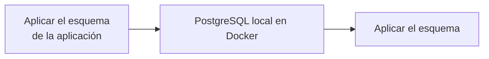
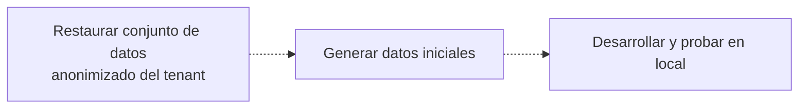

Managed Postgres se basa en PostgreSQL estándar y funciona con el ecosistema existente de PostgreSQL. Para la mayoría de las tareas de desarrollo, puedes desarrollar y hacer pruebas con una instancia local de PostgreSQL que se ejecute en Docker en lugar de un despliegue en la nube.

Este enfoque proporciona un ciclo de retroalimentación rápido, simplifica la configuración inicial, reduce las dependencias de la infraestructura compartida y te permite experimentar de forma segura sin afectar a los sistemas de producción.

El objetivo no es reproducir exactamente el entorno de producción. En su lugar, crea un entorno local reproducible que:

* Use la misma versión principal de PostgreSQL que en producción.
* Aplique las mismas definiciones de esquema que en producción.
* Contenga datos de desarrollo representativos.
* Admita flujos de trabajo habituales de desarrollo y pruebas de aplicaciones.

Como Managed Postgres es PostgreSQL estándar, los frameworks de migración existentes, las herramientas de gestión de esquemas y los enfoques de inicialización de datos funcionan sin modificaciones.

<div id="example-development-flow">
  ## Ejemplo de flujo de desarrollo
</div>

Un flujo de trabajo típico de desarrollo local es así:





Managed Postgres se integra en los flujos de trabajo de desarrollo de PostgreSQL ya existentes. Al desarrollar con una instancia local de PostgreSQL, los equipos pueden iterar con rapidez, mantener entornos reproducibles y tener la certeza de que las aplicaciones se comportarán de forma coherente al implementarse en Managed Postgres.

<div id="run-postgresql-locally-with-docker">
  ## Ejecuta PostgreSQL en local con Docker
</div>

La forma más sencilla de crear un entorno de desarrollo local es ejecutar PostgreSQL en Docker.

Elige una versión de PostgreSQL que coincida con tu instancia de Managed Postgres:

```yaml title="docker-compose.yml"
services:
  postgres:
    image: postgres:18
    container_name: local-postgres
    restart: unless-stopped

    environment:
      POSTGRES_USER: postgres
      POSTGRES_PASSWORD: postgres
      POSTGRES_DB: app

    ports:
      - "15432:5432"

    volumes:
      - postgres_data:/var/lib/postgresql

volumes:
  postgres_data:
```

Inicie PostgreSQL:

```bash
docker compose up -d
```

Verifique la conectividad:

```bash
psql -h localhost -U postgres -p 15432 -d app
```

En este punto, PostgreSQL se está ejecutando en local, pero todavía no contiene el esquema de la aplicación ni datos de desarrollo.

<div id="apply-the-application-schema">
  ## Aplica el esquema de la aplicación
</div>

No hay un único enfoque obligatorio para crear el esquema en un entorno local. La mayoría de las organizaciones ya cuentan con un flujo de trabajo establecido para la gestión de esquemas que puede reutilizarse sin cambios.

<div id="application-migrations">
  ### Migraciones de la aplicación
</div>

Muchos equipos usan el mismo framework de migraciones en los entornos de staging y producción: herramientas como Flyway, Liquibase, Rails migrations, Django migrations, Prisma migrations o Alembic.

Aplicar las migraciones localmente garantiza que la evolución del esquema se pruebe de forma continua como parte del desarrollo habitual:

```bash
./migrate up
# o
npm run migrate
# o
rails db:migrate
```

<div id="schema-only-postgresql-dumps">
  ### Volcados de PostgreSQL solo del esquema
</div>

Una exportación de PostgreSQL solo del esquema puede reproducir la estructura de una base de datos existente. Esto resulta útil para la puesta en marcha, investigar el comportamiento del esquema, validar la compatibilidad o preparar rápidamente entornos de desarrollo.

Exporte el esquema:

```bash
pg_dump \
  --schema-only \
  --no-owner \
  --no-privileges \
  -h <host> \
  -U <user> \
  -d <database> \
  > schema.sql
```

Restaurar localmente:

```bash
psql \
  -h localhost \
  -U postgres \
  -p 15432    \
  -d app \
  -f schema.sql
```

<div id="checked-in-sql-definitions">
  ### Definiciones SQL incluidas en el repositorio
</div>

Algunos equipos mantienen las definiciones de esquema directamente en el control de versiones como archivos SQL. Estos pueden aplicarse directamente a una instancia local de PostgreSQL durante la configuración del entorno.

Independientemente del enfoque, lo importante es que la creación del esquema esté automatizada, sea reproducible y parta de definiciones versionadas.

<div id="populate-representative-development-data">
  ## Poblar con datos representativos para desarrollo
</div>

Una vez creado el esquema, pueble la base de datos con datos representativos para desarrollo.

Para la mayoría de los flujos de trabajo de desarrollo, los conjuntos de datos sintéticos generados mediante scripts de inicialización son suficientes. Son fáciles de recrear, seguros de distribuir y evitan las consideraciones de cumplimiento normativo y seguridad asociadas a los datos de producción.

Un enfoque habitual para las aplicaciones SaaS consiste en generar datos para un pequeño número de tenants de ejemplo y crear relaciones realistas entre usuarios, productos, pedidos y otras entidades de negocio.

<div id="example-multi-tenant-schema">
  ### Ejemplo de esquema multitenant
</div>

El siguiente esquema representa una aplicación SaaS multitenant simplificada:

```sql
CREATE TABLE tenants (
    id UUID PRIMARY KEY,
    name TEXT NOT NULL
);

CREATE TABLE users (
    id UUID PRIMARY KEY,
    tenant_id UUID NOT NULL REFERENCES tenants(id),
    email TEXT NOT NULL,
    first_name TEXT,
    last_name TEXT,
    created_at TIMESTAMP DEFAULT now()
);

CREATE TABLE products (
    id UUID PRIMARY KEY,
    tenant_id UUID NOT NULL REFERENCES tenants(id),
    name TEXT NOT NULL,
    price NUMERIC(10,2)
);

CREATE TABLE orders (
    id UUID PRIMARY KEY,
    tenant_id UUID NOT NULL REFERENCES tenants(id),
    user_id UUID NOT NULL REFERENCES users(id),
    status TEXT,
    created_at TIMESTAMP DEFAULT now()
);

CREATE TABLE order_items (
    id UUID PRIMARY KEY,
    order_id UUID NOT NULL REFERENCES orders(id),
    product_id UUID NOT NULL REFERENCES products(id),
    quantity INTEGER
);

CREATE TABLE audit_logs (
    id UUID PRIMARY KEY,
    tenant_id UUID NOT NULL REFERENCES tenants(id),
    entity_type TEXT,
    entity_id UUID,
    action TEXT,
    created_at TIMESTAMP DEFAULT now()
);
```

<div id="generate-sample-data">
  ### Generar datos de ejemplo
</div>

Instala las dependencias:

```bash
pip install faker psycopg2-binary
```

Crea un archivo llamado `seed.py`:

```python title="seed.py"
import random
import uuid

import psycopg2
from faker import Faker

fake = Faker()

conn = psycopg2.connect(
    host="localhost",
    port=15432,
    dbname="app",
    user="postgres",
    password="postgres"
)

cur = conn.cursor()

tenant_ids = []

for tenant_name in [
    "Tenant A",
    "Tenant B",
    "Tenant C"
]:
    tenant_id = str(uuid.uuid4())
    tenant_ids.append(tenant_id)

    cur.execute(
        """
        INSERT INTO tenants(id, name)
        VALUES (%s, %s)
        """,
        (tenant_id, tenant_name)
    )

for tenant_id in tenant_ids:

    users = []
    products = []

    for _ in range(20):
        user_id = str(uuid.uuid4())
        users.append(user_id)

        cur.execute(
            """
            INSERT INTO users(
                id,
                tenant_id,
                email,
                first_name,
                last_name
            )
            VALUES (%s,%s,%s,%s,%s)
            """,
            (
                user_id,
                tenant_id,
                fake.email(),
                fake.first_name(),
                fake.last_name()
            )
        )

    for _ in range(15):
        product_id = str(uuid.uuid4())
        products.append(product_id)

        cur.execute(
            """
            INSERT INTO products(
                id,
                tenant_id,
                name,
                price
            )
            VALUES (%s,%s,%s,%s)
            """,
            (
                product_id,
                tenant_id,
                fake.word(),
                round(random.uniform(10, 500), 2)
            )
        )

    for _ in range(50):

        order_id = str(uuid.uuid4())

        cur.execute(
            """
            INSERT INTO orders(
                id,
                tenant_id,
                user_id,
                status
            )
            VALUES (%s,%s,%s,%s)
            """,
            (
                order_id,
                tenant_id,
                random.choice(users),
                random.choice([
                    "pending",
                    "completed",
                    "cancelled"
                ])
            )
        )

        for _ in range(random.randint(1, 5)):
            cur.execute(
                """
                INSERT INTO order_items(
                    id,
                    order_id,
                    product_id,
                    quantity
                )
                VALUES (%s,%s,%s,%s)
                """,
                (
                    str(uuid.uuid4()),
                    order_id,
                    random.choice(products),
                    random.randint(1, 10)
                )
            )

        cur.execute(
            """
            INSERT INTO audit_logs(
                id,
                tenant_id,
                entity_type,
                entity_id,
                action
            )
            VALUES (%s,%s,%s,%s,%s)
            """,
            (
                str(uuid.uuid4()),
                tenant_id,
                "order",
                order_id,
                "created"
            )
        )

conn.commit()
conn.close()
```

Ejecuta el script:

```bash
python seed.py
```

El conjunto de datos resultante contiene:

| Table           | Registros |
| --------------- | --------- |
| tenants         | 3         |
| users           | 60        |
| products        | 45        |
| orders          | 150       |
| order&#95;items | 400+      |
| audit&#95;logs  | 150+      |

Este conjunto de datos es lo bastante grande como para cubrir flujos de trabajo habituales de la aplicación, la lógica de aislamiento de tenants, las consultas de informes y las comprobaciones de integridad relacional, sin dejar de ser ligero para el desarrollo y las pruebas locales.

<div id="postgresql-clickhouse-development-environment">
  ## Entorno de desarrollo de PostgreSQL + ClickHouse
</div>

Los ejemplos anteriores se centran en el desarrollo local con PostgreSQL. Si desea probar localmente la arquitectura completa de PostgreSQL a ClickHouse, puede ejecutar la pila de código abierto PostgreSQL + ClickHouse.

Esta pila combina PostgreSQL para cargas de trabajo transaccionales, ClickHouse para analítica y PeerDB para la captura de cambios de datos (CDC) nativa. Le permite desarrollar con PostgreSQL mientras replica datos continuamente en ClickHouse, lo que hace posible probar analítica operativa, cargas de trabajo de generación de informes y canalizaciones de datos en tiempo real directamente desde su portátil.

La pila puede iniciarse con un solo comando e incluye todos los servicios necesarios preconfigurados:

```bash
git clone https://github.com/ClickHouse/postgres-clickhouse-stack.git
cd postgres-clickhouse-stack

./run.sh start
```

La pila incluye:

* PostgreSQL
* ClickHouse
* PeerDB para CDC de PostgreSQL
* Servicios auxiliares y aplicaciones de ejemplo

Para ver instrucciones de configuración, detalles de la arquitectura y un recorrido completo de la pila, consulta:

* [Blog: PostgreSQL + ClickHouse OSS](https://clickhouse.com/blog/postgres-clickhouse-oss)
* [GitHub: postgres-clickhouse-stack](https://github.com/ClickHouse/postgres-clickhouse-stack)

Este es un buen siguiente paso cuando tu aplicación ya se ejecuta localmente sobre PostgreSQL y quieres validar la sincronización de PostgreSQL con ClickHouse, la analítica en tiempo real y el comportamiento integral de la aplicación.