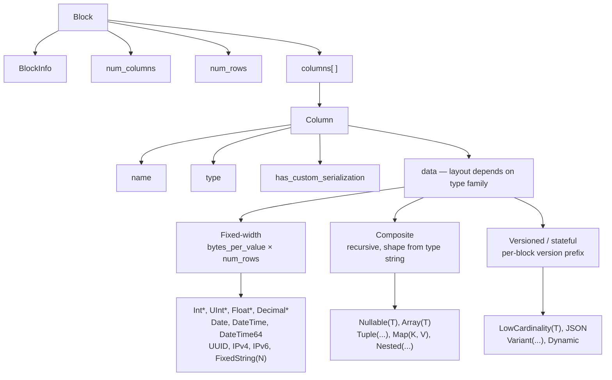
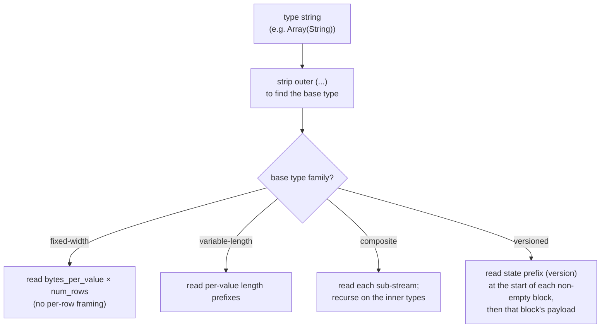
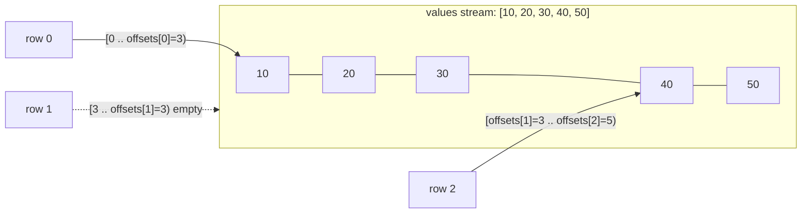
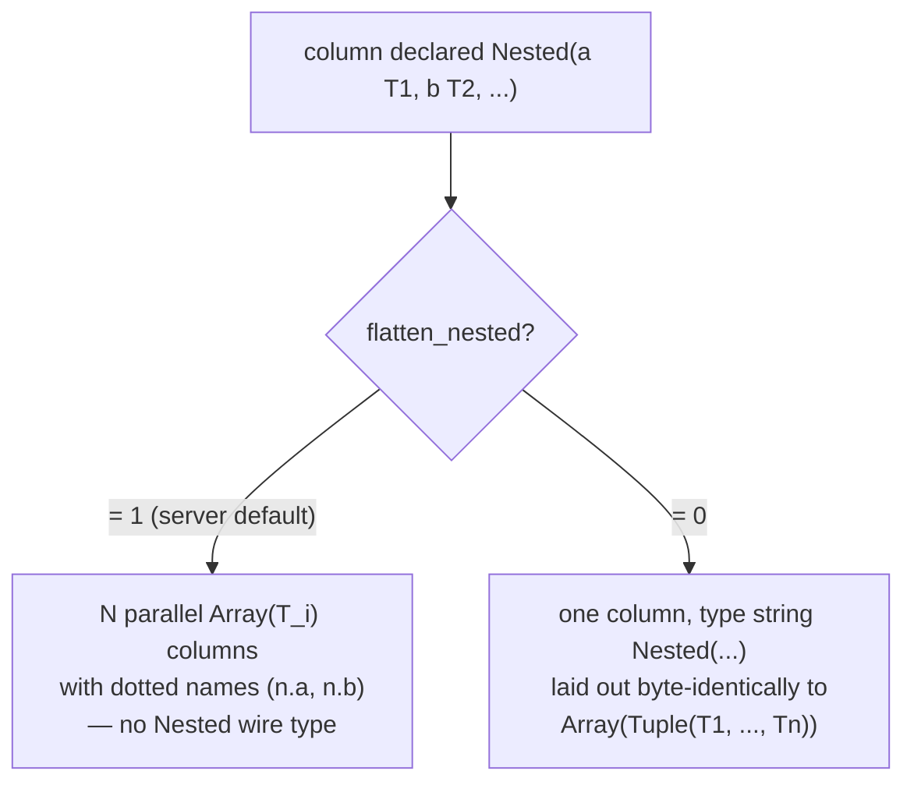
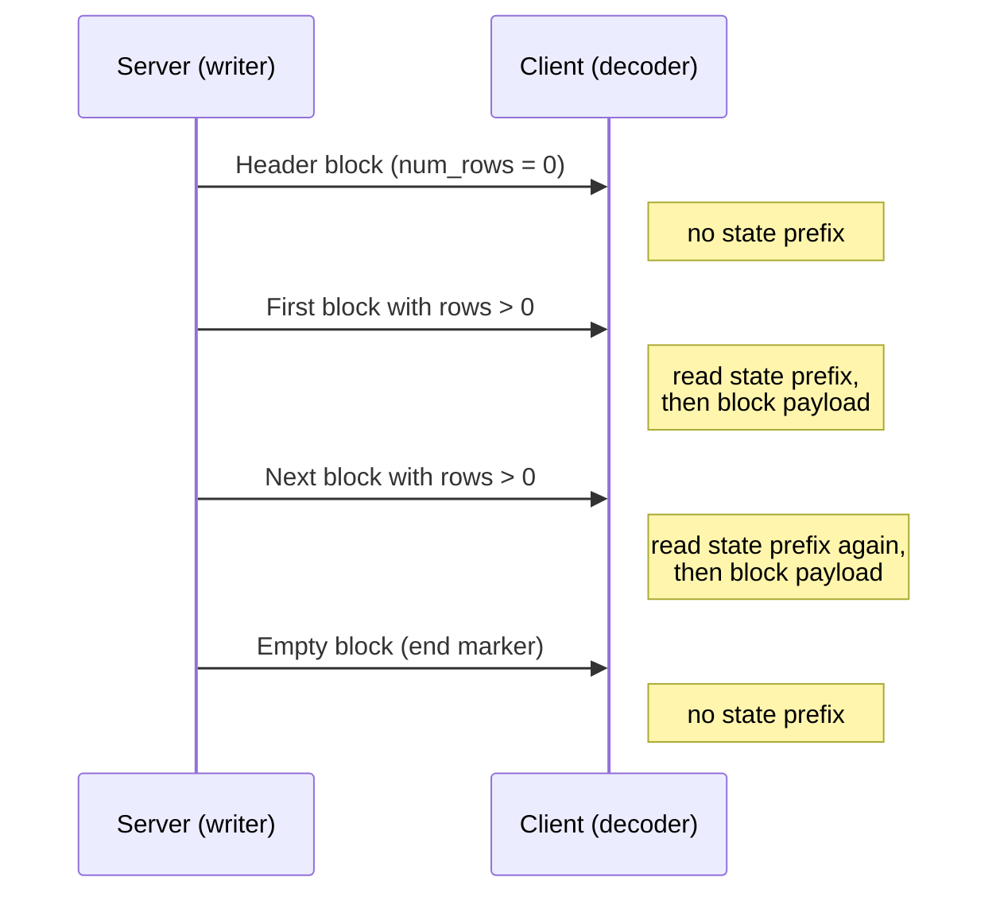
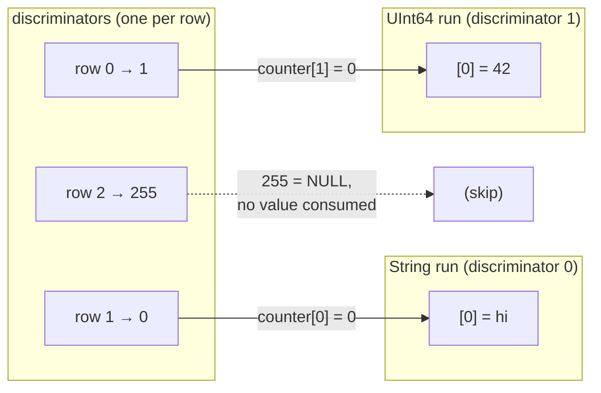
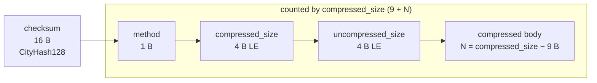

El formato nativo es el formato wire columnar que ClickHouse usa para transportar datos tabulares. Aparece en varios lugares:

* el cuerpo de los paquetes `Data`, `Totals`, `Extremes`, `Log` y `ProfileEvents` en el [native TCP protocol](/es/reference/interfaces/specs/NativeProtocol) (el paquete `TableColumns` **no** es un bloque Native: transporta dos binary strings, por lo que su layout pertenece a la [especificación del native protocol](/es/reference/interfaces/specs/NativeProtocol));
* la salida de `SELECT ... FORMAT Native` a través de HTTP;
* exportaciones a archivo escritas con `INTO OUTFILE ... FORMAT Native`;
* cargas útiles de replicación entre servidores.

Esta página describe los bytes dentro de un Block —la carga útil columnar— y las codificaciones de tipo por columna que lo componen. El encapsulado de paquetes, el estado de la conexión y la negociación de versión pertenecen a la [especificación del native protocol](/es/reference/interfaces/specs/NativeProtocol).

Todos los campos enteros de varios bytes son little-endian. Los enteros con signo usan complemento a dos.

<Tip>
  Para una introducción orientada al usuario al formato `Native` (con ejemplos de `curl`), consulta la [página del formato Native](/es/reference/formats/Native). Esta especificación es la referencia wire de más bajo nivel.
</Tip>

<div id="overview">
  ## Descripción general
</div>

Todo lo que transporta filas a través del wire es un **Block**: un fragmento autodescriptivo de filas almacenadas columna por columna. Primero van todos los valores de la columna 1, luego todos los de la columna 2, y así sucesivamente. Un Block transporta solo las columnas a las que hace referencia la consulta, nunca la tabla completa.

El `data` de una columna se organiza según la *familia* a la que pertenece su tipo. Las familias, en orden creciente de complejidad del decodificador, son:



* Los tipos de **ancho fijo** disponen `data` como `bytes_per_value × num_rows` bytes sin procesar, sin ningún encapsulado por fila.
* Los tipos **compuestos** (`Nullable`, `Array`, `Tuple`, `Map`, `Nested`) tienen una estructura recursiva completamente derivable de la cadena de tipo, sin prefijo de versión ni estado entre bloques.
* Los tipos **versionados / con estado** (`LowCardinality`, `JSON`, `Variant`, `Dynamic`) comienzan cada bloque no vacío con un prefijo de versión/estado de serialización. En el protocolo `Native`, este prefijo y cualquier diccionario son **por bloque**: el formato no mantiene estado *entre* bloques (el escritor crea un estado de serialización nuevo para cada bloque y establece `low_cardinality_max_dictionary_size = 0`). El estado entre bloques es una cuestión del almacenamiento en disco de MergeTree, no del formato transmitido por el protocolo Native.

<div id="wire-primitives">
  ## Primitivas wire
</div>

El formato Native se basa en cuatro codificaciones primitivas.

| Primitiva       | Tamaño               | Descripción                                             |
| --------------- | -------------------- | ------------------------------------------------------- |
| VarUInt         | 1–10 B               | entero sin signo de longitud variable LEB-128           |
| Fixed-width int | 1, 2, 4, 8, 16, 32 B | little-endian, complemento a dos para enteros con signo |
| String          | variable             | prefijo de longitud VarUInt + bytes sin procesar        |
| Bool            | 1 B                  | `0x00` = falso, distinto de cero = verdadero            |

<div id="varuint">
  ### VarUInt
</div>

Un entero sin signo de longitud variable que utiliza la codificación LEB-128. Cada byte contiene 7 bits de datos en las posiciones 0–6 y 1 bit de continuación en la posición 7. El bit de continuación es `1` cuando le siguen más bytes y `0` en el byte final.

| Intervalo de valores              | Bytes    |
| --------------------------------- | -------- |
| 0 – 127                           | 1        |
| 128 – 16383                       | 2        |
| 16384 – 2097151                   | 3        |
| hasta el rango completo de UInt64 | hasta 10 |

Codificación del valor `300`:

```text
300 = 0b100101100

Byte 0: 0xAC = 0b10101100   (data: 0101100, continuation: 1)
Byte 1: 0x02 = 0b00000010   (data: 0000010, continuation: 0)
```

Decodificación de los bytes `0xAC 0x02`:

```text
Byte 0: data = 0x2C, continuation = 1 → accumulator = 0x2C, shift = 7
Byte 1: data = 0x02, continuation = 0 → accumulator = (0x02 << 7) | 0x2C = 300
```

<div id="fixed-width-integers">
  ### Enteros de tamaño fijo
</div>

| Tipo    | Bytes | Codificación                                |
| ------- | ----- | ------------------------------------------- |
| UInt8   | 1     | Byte en bruto                               |
| UInt16  | 2     | Little-endian                               |
| UInt32  | 4     | Little-endian                               |
| UInt64  | 8     | Little-endian                               |
| UInt128 | 16    | Little-endian                               |
| UInt256 | 32    | Little-endian                               |
| Int8    | 1     | Byte en bruto, complemento a dos            |
| Int16   | 2     | Little-endian, complemento a dos            |
| Int32   | 4     | Little-endian, complemento a dos            |
| Int64   | 8     | Little-endian, complemento a dos            |
| Int128  | 16    | Little-endian, complemento a dos            |
| Int256  | 32    | Little-endian, complemento a dos            |
| Float32 | 4     | IEEE 754 de precisión simple, little-endian |
| Float64 | 8     | IEEE 754 de doble precisión, little-endian  |

Por ejemplo, el valor `1` de UInt32 se codifica como `01 00 00 00`, y el valor `-1` de Int32 como `FF FF FF FF`.

<div id="string">
  ### String
</div>

Una secuencia de bytes precedida por su longitud:

```text
[VarUInt: byte_length] [byte_length bytes: raw value]
```

La secuencia de bytes no tiene por qué ser UTF-8 válida. Una cadena vacía se codifica como un único byte `0x00`, y las cadenas pueden contener cualquier valor de byte, incluido un NUL incrustado. La cadena `"ab"` se codifica como `02 61 62`; para decodificarla, lea la longitud VarUInt (`2`) y luego lea esa cantidad de bytes.

<div id="bool">
  ### Bool
</div>

Un único byte. `0x00` es falso; cualquier valor distinto de cero es verdadero (de forma canónica, `0x01`).

<div id="block-and-column-structure">
  ## Estructura de bloques y columnas
</div>

<div id="block-wire-layout">
  ### disposición en formato wire del bloque
</div>

```text
[BlockInfo]               metadata (only on the TCP Data-packet path; see below)
[VarUInt: num_columns]    number of columns in this block
[VarUInt: num_rows]       number of rows in this block
[Column × num_columns]    column entries, omitted when num_columns = 0
```

La presencia del prefijo `BlockInfo` depende del canal, porque el escritor está parametrizado por una *revisión*:

* En el **protocolo TCP nativo**, el servidor escribe bloques con la revisión negociada de la conexión (un valor grande: `DBMS_TCP_PROTOCOL_VERSION` es `54485` en esta versión). `BlockInfo` se escribe siempre que esa revisión sea mayor que cero, lo que siempre ocurre en una conexión real. El byte `has_custom_serialization` de cada columna (consulta la [disposición en formato wire de la columna](#column-wire-layout)) se escribe a partir de la revisión `54454`.
* El *formato de salida* `Native` — `SELECT ... FORMAT Native` sobre HTTP, `INTO OUTFILE ... FORMAT Native` y el formato `Native` generado por `clickhouse-client` — serializa con la revisión `0` *de forma predeterminada*. En la revisión `0`, tanto el prefijo `BlockInfo` como el byte `has_custom_serialization` se omiten, de modo que un bloque contiene solo `num_columns`, `num_rows` y las columnas.

  En HTTP, esta revisión no es fija: un client puede elevarla con el parámetro de consulta `?client_protocol_version=<n>`, y el servidor usa ese valor como revisión de serialización para la respuesta.

  Con un valor suficientemente alto, la salida HTTP incluye el prefijo `BlockInfo` (se escribe siempre que la revisión sea mayor que `0`) y el byte `has_custom_serialization` (se escribe a partir de la revisión `54454`), exactamente igual que en la vía TCP. Por lo tanto, los clientes no deben asumir que toda carga útil HTTP `FORMAT Native` está en la revisión `0`.

En otras palabras, los ejemplos de bytes de esta sección que comienzan con un prefijo `BlockInfo` describen la carga útil del paquete Data sobre TCP. La misma consulta ejecutada mediante `FORMAT Native` produce la forma más corta que se muestra junto a ellos.

<div id="blockinfo">
  ### BlockInfo
</div>

BlockInfo es una secuencia de campos, cada uno precedido por un ID de campo VarUInt, terminada con un ID de campo `0`. El formato wire **no** es autodescriptivo: un ID de campo no codifica la longitud ni el tipo de su valor, por lo que el lector debe conocer de antemano el tipo de cada ID de campo que pueda encontrar. El lector de ClickHouse trata un ID de campo no reconocido como corrupción y lanza una excepción (`UNKNOWN_BLOCK_INFO_FIELD`). En su lugar, la compatibilidad con versiones anteriores se gestiona mediante la revisión del protocolo: el emisor solo escribe un campo si la revisión negociada es, como mínimo, la revisión mínima de ese campo, por lo que un receptor más antiguo nunca ve un campo que no conoce.

| Field ID | Field                            | Type          | Min revision | Description                                                                                                                          |
| -------- | -------------------------------- | ------------- | ------------ | ------------------------------------------------------------------------------------------------------------------------------------ |
| 1        | is&#95;overflows                 | UInt8         | 0            | Bloque de desbordamiento de GROUP BY. `0` para bloques sin desbordamiento.                                                           |
| 2        | bucket&#95;number                | Int32         | 0            | Bucket de agregación. `-1` para bloques sin bucket.                                                                                  |
| 3        | out&#95;of&#95;order&#95;buckets | List of Int32 | 54480        | Buckets retrasados durante la agregación distribuida. Se codifica como un conteo VarUInt seguido de esa cantidad de valores `Int32`. |
| 0        | (terminator)                     | —             | —            | Fin de BlockInfo. Siempre obligatorio.                                                                                               |

Los campos `1` y `2` tienen una revisión mínima de `0`, por lo que están presentes siempre que se escriba un `BlockInfo`. El campo `3` solo se escribe a partir de la revisión `54480`. Disposición del formato wire para el caso habitual (revisión inferior a `54480`):

```text
[VarUInt: 1] [UInt8: is_overflows]
[VarUInt: 2] [Int32: bucket_number]
[VarUInt: 0]
```

<div id="column-wire-layout">
  ### Disposición de la columna en formato wire
</div>

Una columna aparece `num_columns` veces dentro de un Block.

| # | Campo                            | Tipo                                    | Condición                               | Descripción                                                                                                                                                                                                                                                                                                                                             |
| - | -------------------------------- | --------------------------------------- | --------------------------------------- | ------------------------------------------------------------------------------------------------------------------------------------------------------------------------------------------------------------------------------------------------------------------------------------------------------------------------------------------------------- |
| 1 | name                             | String                                  | siempre                                 | Nombre de la columna                                                                                                                                                                                                                                                                                                                                    |
| 2 | type                             | String *o* codificación binaria de tipo | siempre                                 | Cadena de tipo de ClickHouse (p. ej., `"UInt64"`, `"Array(String)"`) de forma predeterminada; una codificación binaria de tipo cuando `output_format_native_encode_types_in_binary_format = 1` (vea la nota más abajo)                                                                                                                                  |
| 3 | has&#95;custom&#95;serialization | UInt8                                   | feature `CUSTOM_SERIALIZATION` (v54454) | `0` = predeterminado, `1` = personalizado (kind&#95;stack aparece a continuación)                                                                                                                                                                                                                                                                       |
| 4 | kind&#95;stack                   | bytes                                   | cuando el campo 3 = `1`                 | Un byte UInt8 de enumeración (vea abajo) que describe la serialización no predeterminada (dispersa, etc.). Para el valor `COMBINATION`, va seguido de un recuento VarUInt más esa cantidad de bytes kind adicionales. Para un `Tuple` (y otros compuestos con información de serialización a nivel de elemento), la carga útil es recursiva; vea abajo. |
| 5 | data                             | bytes                                   | siempre                                 | Valores de la columna para las `num_rows` filas. Disposición según el tipo; vea [data types](#data-types). Para columnas dispersas, vea abajo.                                                                                                                                                                                                          |

Un decodificador decide cómo procesar según la cadena `type`. Las cadenas de tipo suelen llevar parámetros entre paréntesis; el decodificador elimina el sufijo `(...)` para encontrar el tipo base y luego analiza los parámetros para decidir el tamaño, la escala o el tipo interno. Analizar una lista de parámetros con tipos anidados (un `Tuple` dentro de un `Array`, por ejemplo) requiere un separador de comas que tenga en cuenta la profundidad y siga el anidamiento de paréntesis, en lugar de una simple división por `,`.

<Info>
  **Codificación binaria de tipo**

  El campo `type` es un `String` textual solo en el modo predeterminado. Cuando se establece el ajuste de la consulta `output_format_native_encode_types_in_binary_format = 1`, este campo pasa a ser una **codificación binaria de tipo** —la misma codificación basada en etiquetas documentada en [data type binary encoding](/es/reference/data-types/data-types-binary-encoding)— y las listas aplanadas de tipos `Dynamic` usan la misma codificación binaria para sus nombres de tipo individuales. Un decodificador que siempre lea el campo 2 como una cadena con prefijo de longitud interpretaría la primera etiqueta de tipo binario como una longitud de cadena y se desincronizaría, por lo que debe saber qué modo usa el stream.
</Info>



<div id="kind-stack-and-sparse-encoding">
  #### kind_stack y codificación dispersa
</div>

El byte `kind_stack` enumera una serialización no predeterminada por columna:

| Byte   | Nombre                       | Significado                                                                                  | Impacto en el wire de `data`                                                                     |
| ------ | ---------------------------- | -------------------------------------------------------------------------------------------- | ------------------------------------------------------------------------------------------------ |
| `0x00` | DEFAULT                      | Serialización predeterminada                                                                 | Idéntico a `has_custom = 0`                                                                      |
| `0x01` | SPARSE                       | Serialización dispersa (v54465+)                                                             | Flujo de offsets + valores no predeterminados; véase más abajo                                   |
| `0x02` | DETACHED                     | Columna encapsulada en un `ColumnBLOB` mediante el marshalling paralelo de bloques (v54478+) | Blob premarshalled: `VarUInt size` + esa cantidad de bytes; véase más abajo                      |
| `0x03` | DETACHED&#95;OVER&#95;SPARSE | Una columna dispersa encapsulada en un `ColumnBLOB`                                          | La misma carga útil de blob que `DETACHED`; véase más abajo                                      |
| `0x04` | REPLICATED                   | Forma de diccionario para valores repetidos (v54482+)                                        | Flujo de índices + valores de elementos codificados de forma densa; véase más abajo              |
| `0x05` | COMBINATION                  | Pila de varios tipos                                                                         | Seguido de `count` como `VarUInt` y de `count` bytes `kind` adicionales; véase la nota más abajo |

**La carga útil de `COMBINATION` usa un enum diferente.** Las cinco filas anteriores son códigos compactos de un byte. `COMBINATION` (`0x05`) es la secuencia de escape general para cualquier pila no cubierta por ellos: va seguida de un `VarUInt` `count` y luego de `count` entradas de un byte. Esas entradas **no** son los códigos compactos de la tabla, sino los valores sin procesar de `ISerialization::Kind`:

| Byte   | `Kind` anidado |
| ------ | -------------- |
| `0x00` | DEFAULT        |
| `0x01` | SPARSE         |
| `0x02` | DETACHED       |
| `0x03` | REPLICATED     |

Los valores de byte difieren de los códigos compactos: `REPLICATED` es `0x03` en este enum anidado, pero `0x04` como código compacto, y no hay ninguna entrada `DETACHED_OVER_SPARSE`: esa combinación aparece como las dos entradas consecutivas `SPARSE`, `DETACHED`. Un decodificador que siga usando la tabla compacta para los bytes anidados asignará mal `0x03`/`0x04` y perderá la sincronización.

`count` es la longitud completa de la pila, **incluida la entrada inicial `DEFAULT`** con la que comienza cada pila. Los códigos compactos ya cubren todas las pilas de una y dos entradas, por lo que una `COMBINATION` siempre tiene un `count` de al menos tres.

**`kind_stack` recursivo para columnas `Tuple`.** La carga útil de `kind_stack` anterior es el byte (o la secuencia `COMBINATION`) correspondiente a la información de serialización propia de una columna. Un `Tuple` lleva un `SerializationInfoTuple`, que primero escribe la carga útil de la pila de tipos *propia* de la tupla y luego escribe una carga útil completa de pila de tipos para *cada* elemento, en orden; un decodificador vuelve a leer esa misma estructura recursiva. Así, para `Tuple(A, B, C)`, los bytes del campo 4 son `[tuple_kind][A_kind][B_kind][C_kind]`, y la carga útil de cada elemento es a su vez recursiva si ese elemento también es compuesto. El byte `has_custom_serialization` (campo 3) se establece siempre que la información propia de la tupla *o la de cualquiera de sus elementos* no sea la predeterminada, por lo que un `Tuple` cuyo único elemento especial sea disperso, replicado o detached sigue activando la carga útil de la pila de tipos. Un decodificador que lea solo el byte enum inicial de un `Tuple` se detendrá demasiado pronto y leerá incorrectamente los bytes restantes de tipo de elemento como datos de la columna.

**Formato wire disperso.** Cuando `kind_stack = 0x01`, los `data` de la columna se escriben como dos flujos consecutivos en el único flujo TCP compartido:

1. **Flujo de offsets** — una secuencia de `VarUInt`. Cada valor `v` es:
   * `v` con el bit alto en la posición 62 desactivado: `(v & 0x3FFFFFFFFFFFFFFF)` = el número de posiciones predeterminadas antes del siguiente valor explícito no predeterminado. Esa posición no predeterminada es `cursor + group_size`, donde `cursor` es la posición acumulada; después, `cursor` avanza en `group_size + 1`.
   * `v` con el bit 62 activado (`END_OF_GRANULE_FLAG`): el valor con el indicador desactivado = el número de posiciones predeterminadas finales después del último valor no predeterminado. Esto marca el final del flujo de offsets para el bloque.
2. **Flujo de valores** — `count` valores no predeterminados codificados densamente en el tipo interno, donde `count` es el número de `VarUInt` distintos de EOG leídos arriba.

Un decodificador reconstruye una columna densa con `num_rows` entradas, rellenando cada posición no explícita con el valor predeterminado del tipo interno (`0` para enteros y flotantes, `""` para `String`, `0` días para `Date`, etc.).

Una columna dispersa `Nullable(T)` es un caso especial, porque el valor predeterminado de `Nullable(T)` es **NULL**. La codificación dispersa elimina por completo el flujo habitual del mapa de nulos de `Nullable`: el flujo de offsets identifica las posiciones distintas del valor predeterminado, es decir, las que no son **NULL**; el flujo de valores contiene solo esos valores no **NULL** en formato denso como `T`, y cada posición no explícita se reconstruye como NULL. Por lo tanto, un decodificador *no* debe buscar un mapa de nulos en el flujo de valores, y *no* debe rellenar los huecos con un `0` presente; debe rellenarlos con NULL.

**Wire format de Replicated.** Cuando `kind_stack = 0x04`, la columna `data` es un diccionario: una lista de valores de elemento distintos más un índice por fila en esa lista (el mismo esquema de búsqueda que `LowCardinality`). Cuando el tipo interno está versionado —por ejemplo, `LowCardinality(T)`—, su prefijo de estado se escribe **primero**, antes del flujo de índices: la serialización replicada delega en el tipo interno la fase del prefijo antes de escribir `num_rows`. Los tipos internos con un prefijo vacío (los tipos hoja y los compuestos simples) no aportan ningún byte aquí.

```text
[inner type's state prefix]              empty for leaf inners; e.g. LowCardinality version (Int64 = 1)
[VarUInt num_rows]
[UInt8  size_of_indexes_type]            width of each index: 1, 2, 4, or 8 bytes
[indexes: num_rows × size_of_indexes_type bytes]
[VarUInt num_elements]
[elements: num_elements dense inner-type values]
```

Un decodificador reconstruye una columna densa seleccionando `elements[indexes[i]]` para cada fila de salida `i`. Los tipos internos compuestos se procesan de forma recursiva: la lista de elementos se materializa en el tipo interno y luego se indexa. Los tipos internos compatibles incluyen los tipos hoja, `Nullable(T)`, `Array(T)`, `Tuple(...)`, `Map(K, V)`, `Nested(...)` (cada campo expandido como un `Array`) y `LowCardinality(T)` (el diccionario compartido se conserva; solo se indexan las claves por elemento).

**Formato detached en el wire.** `DETACHED` (`0x02`) y `DETACHED_OVER_SPARSE` (`0x03`) *sí* aparecen en el wire; no son puramente internos. En la ruta TCP, cuando la compresión está habilitada y la revisión negociada es al menos `DBMS_MIN_REVISON_WITH_PARALLEL_BLOCK_MARSHALLING` (v54478), la columna pasa por tres pasos:

1. Cada columna elegible (no `const`, no `Tuple`, en un bloque con más de una fila) se envuelve en un `ColumnBLOB` que contiene la columna ya serializada y comprimida fuera del hilo principal.
2. `DETACHED` se añade a la pila de kind de la columna envuelta.
3. El campo `data` de la columna se escribe como un tamaño de blob `VarUInt` seguido de exactamente esa cantidad de bytes del blob.

Si la columna envuelta era dispersa, su pila es `{DEFAULT, SPARSE, DETACHED}`, que se serializa como `DETACHED_OVER_SPARSE`. Un cliente que decodifica una columna de este tipo lee la longitud y los bytes del blob, y luego descomprime el blob para recuperar la carga útil de la columna interna (consulta la [nota de `ColumnBLOB`](#compression-negotiation) en la sección sobre compresión).

<div id="block-variants">
  ### Variantes de Block
</div>

Todos los paquetes de la familia Data comparten el mismo formato wire de Block. Las variantes solo difieren en la cantidad de columnas y filas:

| Variante             | num&#95;columns | num&#95;rows | Propósito                                                                                     |
| -------------------- | --------------- | ------------ | --------------------------------------------------------------------------------------------- |
| Bloque de encabezado   | N &gt; 0        | 0            | Anuncia el esquema del resultado (nombres de las columnas + tipos).                           |
| Bloque de resultados | N &gt; 0        | M &gt; 0     | Filas reales del resultado.                                                                   |
| Bloque vacío         | 0               | 0            | Centinela — fin de entrada en el lado del client; marcador de límite en el lado del servidor. |

<div id="byte-level-examples">
  ### Ejemplos a nivel de bytes
</div>

Todos los ejemplos de esta sección están tomados de la **ruta del paquete Data por TCP**, por lo que incluyen el prefijo `BlockInfo` y el byte `has_custom_serialization`. En `FORMAT Native`, esos mismos bloques son más cortos; se incluye la forma corta equivalente cuando resulta útil.

Un bloque vacío (con BlockInfo), 8 bytes en total:

```text
01 00                   BlockInfo: field_id=1, is_overflows=0
02 FF FF FF FF          BlockInfo: field_id=2, bucket_number=-1
00                      BlockInfo terminator
00                      num_columns = 0
00                      num_rows = 0
```

Un bloque de encabezado de `SELECT 1` indica una columna llamada `"1"` de tipo `UInt8`, con cero filas. En el protocolo ≥ 54454, se incluye el byte `has_custom_serialization`:

```text
01 00                   BlockInfo: is_overflows = 0
02 FF FF FF FF          BlockInfo: bucket_number = -1
00                      BlockInfo terminator
01                      num_columns = 1
00                      num_rows = 0
01 "1"                  Column[0].name = "1"
05 "UInt8"              Column[0].type = "UInt8"
00                      Column[0].has_custom_serialization = 0
                        Column[0].data: no bytes (num_rows = 0)
```

El bloque de resultados para la misma consulta, con una fila:

```text
01 00                   BlockInfo: is_overflows = 0
02 FF FF FF FF          BlockInfo: bucket_number = -1
00                      BlockInfo terminator
01                      num_columns = 1
01                      num_rows = 1
01 "1"                  Column[0].name = "1"
05 "UInt8"              Column[0].type = "UInt8"
00                      Column[0].has_custom_serialization = 0
01                      Column[0].data: one UInt8 byte = 1
```

A través de `FORMAT Native` (revisión `0`), el mismo bloque de resultados no incluye `BlockInfo` ni el byte `has_custom_serialization` — `SELECT 1 FORMAT Native` ocupa 11 bytes:

```text
01                      num_columns = 1
01                      num_rows = 1
01 "1"                  Column[0].name = "1"
05 "UInt8"              Column[0].type = "UInt8"
01                      Column[0].data: one UInt8 byte = 1
```

(Un resultado de cero filas, como un bloque que solo contiene el encabezado, no produce ningún byte con `FORMAT Native`: el formato de salida no emite bloques vacíos.)

<div id="data-types">
  ## Tipos de datos
</div>

Esta sección documenta la codificación en el wire de los tipos que el formato Native puede transportar dentro del `data` de una columna, agrupados en cuatro familias de complejidad creciente de decodificación. Dos tipos — `AggregateFunction(func, ...)` y `QBit(T, N)` — son tipos de columna `Native` válidos, pero tienen payloads específicos de la función o del tipo que quedan fuera del alcance de esta sección; se indican más abajo en los casos en que, de otro modo, podrían confundirse con alias.

| Familia                  | Sección                                              | Flujos por columna | Estado entre bloques                                                              |
| ------------------------ | ---------------------------------------------------- | ------------------- | --------------------------------------------------------------------------------- |
| Ancho fijo               | [Tipos de ancho fijo](#fixed-width-types)            | Uno                 | Ninguno                                                                           |
| Longitud variable        | [Tipos de longitud variable](#variable-length-types) | Uno                 | Ninguno                                                                           |
| Compuestos (forma fija)  | [Tipos compuestos](#composite-types)                 | Múltiples           | Ninguno                                                                           |
| Versionados / con estado | [Tipos versionados](#versioned-types)                | Múltiples           | Ninguno en el wire de Native — prefijo de estado por bloque, nuevo en cada bloque |

<div id="fixed-width-types">
  ### Tipos de ancho fijo
</div>

Cada valor ocupa un número constante de bytes. Una columna de `M` filas ocupa exactamente `bytes_per_row × M` bytes en el wire, concatenados sin separadores ni relleno.

| Cadena de tipo      | Bytes por valor | Valor lógico                                                                                              | Codificación wire                                                 |
| ------------------- | --------------- | --------------------------------------------------------------------------------------------------------- | ----------------------------------------------------------------------- |
| `UInt8`             | 1               | Entero sin signo de 8 bits                                                                                | Byte sin procesar                                                       |
| `UInt16`            | 2               | Entero sin signo de 16 bits                                                                               | Little-endian                                                           |
| `UInt32`            | 4               | Entero sin signo de 32 bits                                                                               | Little-endian                                                           |
| `UInt64`            | 8               | Entero sin signo de 64 bits                                                                               | Little-endian                                                           |
| `UInt128`           | 16              | Entero sin signo de 128 bits                                                                              | Little-endian                                                           |
| `UInt256`           | 32              | Entero sin signo de 256 bits                                                                              | Little-endian                                                           |
| `Int8`              | 1               | Entero con signo de 8 bits, complemento a dos                                                             | Byte sin procesar                                                       |
| `Int16`             | 2               | Entero con signo de 16 bits, complemento a dos                                                            | Little-endian                                                           |
| `Int32`             | 4               | Entero con signo de 32 bits, complemento a dos                                                            | Little-endian                                                           |
| `Int64`             | 8               | Entero con signo de 64 bits, complemento a dos                                                            | Little-endian                                                           |
| `Int128`            | 16              | Entero con signo de 128 bits, complemento a dos                                                           | Little-endian                                                           |
| `Int256`            | 32              | Entero con signo de 256 bits, complemento a dos                                                           | Little-endian                                                           |
| `Float32`           | 4               | IEEE 754 de precisión simple                                                                              | Little-endian                                                           |
| `Float64`           | 8               | IEEE 754 de doble precisión                                                                               | Little-endian                                                           |
| `BFloat16`          | 2               | 16 bits más altos de un IEEE 754 `Float32`                                                                | Little-endian                                                           |
| `Bool`              | 1               | `0x00` = false, `0x01` = true                                                                             | Byte sin procesar                                                       |
| `Date`              | 2               | Días desde `1970-01-01`                                                                                   | Little-endian UInt16                                                    |
| `Date32`            | 4               | Días desde `1970-01-01` (con signo; se admite antes de 1970)                                              | Little-endian Int32                                                     |
| `DateTime`          | 4               | Unix timestamp en segundos                                                                                | Little-endian UInt32                                                    |
| `DateTime(tz)`      | 4               | Igual que `DateTime`; la zona horaria forma parte de los metadatos                                        | Little-endian UInt32                                                    |
| `DateTime64(s)`     | 8               | Ticks en la escala `s` (10^-s segundos desde la época)                                                    | Little-endian Int64                                                     |
| `DateTime64(s, tz)` | 8               | Igual que `DateTime64(s)`; la zona horaria forma parte de los metadatos                                   | Little-endian Int64                                                     |
| `Time`              | 4               | Duración de reloj con signo en segundos                                                                   | Little-endian Int32                                                     |
| `Time64(s)`         | 8               | Duración de reloj con signo en ticks en la escala `s`                                                     | Little-endian Int64                                                     |
| `Interval<Unit>`    | 8               | Recuento con signo; la unidad está en la cadena de tipo                                                   | Little-endian Int64                                                     |
| `UUID`              | 16              | Identificador de 128 bits                                                                                 | Dos mitades LE UInt64 con bytes intercambiados (consulte [UUID](#uuid)) |
| `IPv4`              | 4               | Dirección IPv4                                                                                            | Little-endian UInt32                                                    |
| `IPv6`              | 16              | Dirección IPv6                                                                                            | Orden de bytes de red, sin swap                                         |
| `Enum8`             | 1               | Entero con signo de 8 bits (índice de variante)                                                           | Byte sin procesar                                                       |
| `Enum16`            | 2               | Entero con signo de 16 bits (índice de variante)                                                          | Little-endian                                                           |
| `Decimal(P, S)`     | 4 / 8 / 16 / 32 | `value × 10^S` como entero con signo; el ancho depende de P (≤9 → 4 B, ≤18 → 8 B, ≤38 → 16 B, ≤76 → 32 B) | Entero con signo little-endian                                          |

<div id="integer-types">
  #### Tipos enteros
</div>

`UInt8`–`UInt256` y `Int8`–`Int256` son codificaciones binarias directas de valores enteros. Un decodificador lee `bytes_per_row × num_rows` bytes y los interpreta según el tipo.

Una columna `UInt32` que contiene `[1, 256, 65536]`:

```text
01 00 00 00              row 0: 1
00 01 00 00              row 1: 256
00 00 01 00              row 2: 65536
```

Una columna `Int32` con `[-1, 42]`:

```text
FF FF FF FF              row 0: -1
2A 00 00 00              row 1: 42
```

<div id="float32-and-float64">
  #### Float32 y Float64
</div>

Floats binarios estándar IEEE 754: 4 bytes de precisión simple (`binary32`) y 8 bytes de precisión doble (`binary64`), ambos en formato little-endian. NaN, ±Infinity, ±0.0 y los subnormales se conservan intactos al convertir de ida y vuelta, sin normalización.

Valor `Float32` `1.5` (`0x3FC00000`):

```text
00 00 C0 3F              little-endian IEEE 754
```

Valor `1.5` de tipo `Float64` (`0x3FF8000000000000`):

```text
00 00 00 00 00 00 F8 3F  little-endian IEEE 754
```

<div id="bfloat16">
  #### BFloat16
</div>

El formato de coma flotante brain-float: los 16 bits más altos de un `Float32` IEEE 754 — 1 bit de signo, 8 bits de exponente y 7 bits de mantissa. Cada valor ocupa 2 bytes, en orden little-endian, y almacena el patrón sin procesar de 16 bits. Para recuperar el valor numérico, vuelva a expandirlo a `Float32` colocando el patrón en la mitad superior y poniendo en cero la mitad inferior (`bits << 16` reinterpretado como `Float32`); el valor expandido comparte entonces el formato de texto de `Float32`.

Valor `1.5` de `BFloat16` (patrón `0x3FC0`, la mitad superior de `Float32` `0x3FC00000`):

```text
C0 3F                    little-endian, widens to Float32 1.5
```

<div id="bool-type">
  #### Bool
</div>

Compatible con `UInt8` a nivel de wire: 1 byte por fila, `0x00` = false, `0x01` = true. La cadena de tipo en el wire es literalmente `Bool` (no `UInt8`), por lo que un decodificador que se base en la cadena de tipo para despachar debe reconocerlo por separado.

Una columna `Bool` `[true, false, true]`:

```text
01 00 01
```

<div id="date-and-date32">
  #### Date y Date32
</div>

Ambos codifican fechas como recuentos enteros de días relativos a la época Unix `1970-01-01`. Ninguno incluye un componente de tiempo.

| Tipo     | Bytes | Codificación         | Rango                                   |
| -------- | ----- | -------------------- | --------------------------------------- |
| `Date`   | 2     | Little-endian UInt16 | `1970-01-01` a `2149-06-06`             |
| `Date32` | 4     | Little-endian Int32  | amplio rango con signo; admite pre-1970 |

Valor `Date` `1970-01-02` (1 día):

```text
01 00                    UInt16 LE = 1
```

valor `Date32` `1900-01-01` (-25567 días):

```text
21 9C FF FF              Int32 LE = -25567
```

<div id="datetime">
  #### DateTime
</div>

Compatible a nivel de wire con `UInt32`: un timestamp de Unix en segundos, 4 bytes little-endian. El tipo puede aparecer como `DateTime` o `DateTime('Timezone')`; la zona horaria afecta solo a la visualización y no forma parte del valor en el wire. Dos columnas `DateTime` con distintos parámetros de zona horaria producen bytes idénticos para el mismo instante. Un decodificador elimina el sufijo de parámetro `(...)` y procesa la columna como `UInt32`.

Valor de `DateTime('UTC')` `2024-03-15 14:30:00 UTC` (timestamp `1710513000`):

```text
68 5B F4 65              UInt32 LE = 1710513000
```

<div id="datetime64">
  #### DateTime64(scale[, timezone])
</div>

8 bytes, Int64 en formato `little-endian` que representa ticks con una escala de `10^-scale` segundos desde la época Unix. El parámetro `scale` (0–9) forma parte de la cadena de tipo y establece la unidad de tiempo:

| Escala | Tamaño del tick | Nombre común |
| ------ | --------------- | ------------ |
| 0      | 1 segundo       | segundos     |
| 3      | 1 milisegundo   | ms           |
| 6      | 1 microsegundo  | µs           |
| 9      | 1 nanosegundo   | ns           |

El tipo aparece como `DateTime64(s)` (zona horaria predeterminada implícita del servidor) o `DateTime64(s, 'TimezoneName')` (zona horaria explícita, solo para visualización). Los valores negativos representan ticks anteriores a la época.

Valor `DateTime64(3, 'UTC')` `2024-01-15 12:30:45.123 UTC` (1705321845123 ms):

```text
83 51 1A 0D 8D 01 00 00  Int64 LE = 1705321845123
```

`DateTime64(0)` con valor `2024-01-15 12:30:45 UTC` (1705321845 s):

```text
75 25 A5 65 00 00 00 00  Int64 LE = 1705321845
```

<div id="time-and-time64">
  #### Time y Time64(scale)
</div>

Una duración, no un instante en el tiempo. `Time` es un recuento con signo de segundos, 4 bytes Int32 little-endian; `Time64(scale)` es un recuento con signo de ticks en la escala decimal indicada (0–9), 8 bytes Int64 little-endian: la misma representación wire que `DateTime64`.

La forma textual es `[-]HH:MM:SS[.fraction]`, pero, a diferencia de `DateTime`, el campo de hora **no** se ajusta a un día de 24 horas: es el recuento total de horas y puede superar 23. La magnitud mostrada está limitada a `999:59:59` (`3599999` segundos); una magnitud mayor se muestra en ese límite con la fracción en cero (`999:59:59.000`). `CAST` también limita el valor almacenado a este rango, aunque las operaciones aritméticas pueden producir valores fuera de rango que solo se limitan al mostrarse. Nada de esto afecta a los bytes wire, que no son más que el entero con signo.

Valor `Time` `45296` (`12:34:56`):

```text
F0 B0 00 00              Int32 LE = 45296
```

Valor de `Time64(3)` `45296789` ticks (`12:34:56.789`):

```text
95 2C B3 02 00 00 00 00  Int64 LE = 45296789
```

<Note>
  `Time` y `Time64` son experimentales y requieren `allow_experimental_time_time64_type = 1` en el servidor.
</Note>

<div id="interval">
  #### Interval
</div>

`Interval<Unit>` — `IntervalSecond`, `IntervalMinute`, `IntervalHour`, `IntervalDay`, `IntervalWeek`, `IntervalMonth`, `IntervalQuarter`, `IntervalYear`, `IntervalNanosecond`, etc. Todas las unidades comparten una única codificación wire: el recuento como un Int64 little-endian con signo de 8 bytes. La unidad existe **solo** en la cadena de tipo: no cambia ni los bytes wire ni la forma textual, que es el entero sin más. Una sola ruta de decodificación maneja todas las unidades.

Valor `5` de `IntervalDay`:

```text
05 00 00 00 00 00 00 00  Int64 LE = 5
```

<div id="uuid">
  #### UUID
</div>

16 bytes por valor. La codificación wire **no** corresponde a los 16 bytes canónicos en big-endian; en su lugar, cada mitad de 8 bytes invierte sus bytes de forma independiente.

El modelo lógico es un identificador de 128 bits en formato de texto canónico `xxxxxxxx-xxxx-xxxx-xxxx-xxxxxxxxxxxx`, donde los bytes se escriben convencionalmente en big-endian. El modelo wire toma esos 16 bytes canónicos, los divide en dos mitades de 8 bytes y escribe cada mitad en little-endian:

* Bytes wire 0..7 = bytes canónicos 0..7 invertidos.
* Bytes wire 8..15 = bytes canónicos 8..15 invertidos.

UUID `550e8400-e29b-41d4-a716-446655440000`:

```text
Canonical bytes (16):    55 0E 84 00 E2 9B 41 D4  A7 16 44 66 55 44 00 00

Wire bytes:
D4 41 9B E2 00 84 0E 55  high half byte-reversed
00 00 44 55 66 44 16 A7  low half byte-reversed
```

El UUID nulo (todo en ceros) aparece de forma idéntica en ambas representaciones.

<div id="ipv4-and-ipv6">
  #### IPv4 e IPv6
</div>

Dos tipos de direcciones relacionados, pero codificados de forma diferente.

`IPv4` tiene 4 bytes, codificados como un UInt32 little-endian que contiene la dirección canónica de 32 bits (el valor `(a << 24) | (b << 16) | (c << 8) | d` de `a.b.c.d`). Los bytes en la representación wire son los bytes en orden de red invertidos.

`192.168.1.10` (valor canónico de 32 bits `0xC0A8010A`):

```text
0A 01 A8 C0              Little-endian UInt32
```

`IPv6` ocupa 16 bytes y se escribe **literalmente en orden de bytes de red** sin intercambio; es el mismo orden de bytes que `inet_pton(AF_INET6, ...)`.

`2001:db8::1`:

```text
20 01 0D B8 00 00 00 00  network bytes 0..7
00 00 00 00 00 00 00 01  network bytes 8..15
```

La asimetría es deliberada: IPv4 se almacena como un `u32` para realizar operaciones aritméticas y consultas de rango compactas, mientras que IPv6 conserva la disposición en orden de red habitual en la mayoría de las API de red.

<div id="enum8-and-enum16">
  #### Enum8 and Enum16
</div>

Compatibles con `Int8` y `Int16` a nivel de wire, respectivamente: 1 o 2 bytes por fila, complemento a dos little-endian para la variante de 16 bits. La correspondencia completa de las variantes está en la cadena de tipo:

```text
Enum8('active' = 1, 'inactive' = 2, 'banned' = -1)
Enum16('a' = 1, 'b' = 30000)
```

Un decodificador puede eliminar el sufijo de parámetro `(...)` y despacharlo como `Int8` / `Int16`: los bytes en el wire son simplemente el índice entero. Un client que muestra la etiqueta analiza el mapa `'name' = value` a partir de la cadena de tipo y lo conserva junto a la columna: el entero por sí solo no permite recuperar la etiqueta. La salida orientada a texto muestra la etiqueta (`active`) en lugar del índice, entre comillas simples (`'active'`) cuando el enum está anidado dentro de un tipo compuesto. Como el mapa no puede recuperarse a partir de la columna de enteros, debe conservarse para enums anidados como `Array(Enum8(...))` o `Map(Enum16(...), V)`.

Una columna `Enum8('active' = 1, 'inactive' = 2)` `[active, inactive, active]`:

```text
01 02 01
```

El valor `30000` de `Enum16(...)`:

```text
30 75                    Int16 LE = 30000
```

<div id="decimal">
  #### Decimal(P, S)
</div>

Un entero con signo escalado por una potencia de 10. El ancho en bytes del entero viene implícito por la **precisión** `P`; la **escala** `S` es el exponente negativo (la cantidad de dígitos después del punto decimal). Ambos se indican en la cadena de tipo.

| Precisión (P) | Entero subyacente | Bytes |
| ------------- | ----------------- | ----- |
| 1 ≤ P ≤ 9     | Int32             | 4     |
| 10 ≤ P ≤ 18   | Int64             | 8     |
| 19 ≤ P ≤ 38   | Int128            | 16    |
| 39 ≤ P ≤ 76   | Int256            | 32    |

La codificación wire es el entero subyacente en complemento a dos little-endian, y el valor decimal lógico es `wire_integer × 10^(-S)`.

ClickHouse siempre emite `Decimal(P, S)` independientemente de cómo se haya declarado el tipo. `Decimal32(S)`, `Decimal64(S)` y así sucesivamente se normalizan a `Decimal(P, S)` en el wire (con `P` establecido en el máximo natural para ese ancho: 9, 18, 38, 76). Un decodificador que reconozca solo `Decimal(P, S)` cubre todas las formas que emite el servidor.

Valor `Decimal(9, 4)` `123.4567` → entero subyacente `1234567`:

```text
87 D6 12 00              Int32 LE = 1234567
```

Valor `-1.5` de `Decimal(18, 1)` → entero subyacente `-15`:

```text
F1 FF FF FF FF FF FF FF  Int64 LE = -15
```

`Decimal(38, 4)` con valor `123.4567` (16 bytes en total):

```text
87 D6 12 00 00 00 00 00 00 00 00 00 00 00 00 00
```

<div id="nothing">
  #### Nothing
</div>

El tipo `Nothing` no contiene valores. En la práctica, aparece solo como tipo interno de `Nullable(Nothing)` — lo que devuelve el servidor para una expresión como `SELECT NULL`, cuyo único valor válido es la ausencia de uno. Conceptualmente, es un tipo unitario.

A nivel de wire, ocupa exactamente **un byte de marcador de posición por fila**. El servidor emite el carácter ASCII `'0'` (`0x30`), pero el deserializador ignora esos bytes: el contenido no está definido y los decodificadores no deben depender de ningún valor específico. El número de bytes escritos es `num_rows × 1`, por lo que el `num_rows` del encabezado de la columna determina por completo cuánto se debe consumir.

Ese byte por fila mantiene intacta la invariante del block: cada columna abarca una longitud que puede derivarse de `num_rows`, por lo que los decodificadores avanzan sin prefijos de longitud por celda. El `Nullable` circundante siempre informa cada posición como NULL, por lo que los marcadores de posición nunca se inspeccionan.

Una columna `Nullable(Nothing)` con 3 filas (todas NULL):

```text
01 01 01                 null map: 1, 1, 1 (three NULLs)
30 30 30                 Nothing placeholder bytes (one per row)
```

El prefijo null-map es el encapsulado estándar de `Nullable` (véase [Nullable](#nullable)); los tres bytes internos son la carga útil de `Nothing`, que el decodificador omite.

<div id="variable-length-types">
  ### Tipos de longitud variable
</div>

Cada valor incluye su propia longitud en la representación binaria transmitida.

<div id="string-type">
  #### String
</div>

Cadena de tipo: `String`. Una columna `String` es una secuencia de `num_rows` secuencias de bytes con prefijo de longitud:

```text
[VarUInt: byte_length] [byte_length bytes: raw value]
[VarUInt: byte_length] [byte_length bytes: raw value]
...
```

No hay separadores entre filas aparte de los prefijos de longitud, ni estado por fila. Una cadena vacía es un único byte `0x00`. ClickHouse `String` está orientado a bytes, no a texto: no se exige la validez de UTF-8, y un valor puede contener cualquier byte, incluido un NUL incrustado. Un decodificador orientado a un tipo de cadena UTF-8 valida al leer o expone bytes sin procesar al código llamante. El total de bytes consumidos por la columna es `Σ (varuint_size(len_i) + len_i)` para todas las filas.

Una columna de 3 cadenas `["ab", "", "c"]` (6 bytes en total):

```text
02 61 62                 row 0: length 2, "ab"
00                       row 1: length 0, empty
01 63                    row 2: length 1, "c"
```

<div id="fixedstring">
  #### FixedString(N)
</div>

Cadena de tipo: `FixedString(N)`, donde `N` es un entero positivo (por ejemplo, `FixedString(16)`). La columna contiene exactamente `N × num_rows` bytes sin procesar, sin prefijos de longitud ni separadores. Un decodificador extrae `N` de la cadena del tipo y consume esa cantidad de bytes por fila.

Cuando el SQL inserta un valor de menos de `N` bytes (por ejemplo, `CAST('abc' AS FixedString(5))`), el server lo rellena por la derecha con bytes NUL (`0x00`) hasta alcanzar la longitud declarada. Estos bytes de relleno forman parte del valor almacenado y se envían por el wire tal cual; eliminarlos es responsabilidad del client. Al igual que `String`, `FixedString(N)` se parece más a un array de bytes que a texto; normalmente se usa para identificadores de ancho fijo, bytes de direcciones o resúmenes hash.

Dos valores `FixedString(3)` `["abc", "de\0"]` (6 bytes en total):

```text
61 62 63                 row 0: 3 bytes, "abc"
64 65 00                 row 1: 3 bytes, "de" + NUL padding
```

Los dos tipos de cadenas comparados:

| Propiedad                    | `String`                  | `FixedString(N)`                       |
| ---------------------------- | ------------------------- | -------------------------------------- |
| Prefijo de longitud por fila | Sí (VarUInt)              | No                                     |
| Tamaño de fila               | Variable                  | Exactamente `N` bytes                  |
| Bytes totales de la columna  | Variable                  | `N × num_rows`                         |
| Relleno con bytes NUL        | n/a                       | Rellenado a la derecha por el servidor |
| Se espera UTF-8              | Normalmente (no se exige) | No (se trata como bytes sin procesar)  |
| Parámetro de tipo            | Ninguno                   | Entero `N` obligatorio                 |

<div id="composite-types">
  ### Tipos compuestos
</div>

Los tipos compuestos envuelven uno o más tipos internos y comparten un modelo wire común: **múltiples streams por columna**. Una sola columna lógica se codifica como dos o más secuencias de bytes leídas de forma independiente y concatenadas.

Comparten tres propiedades estructurales:

* **Forma fija por esquema.** La estructura queda determinada por completo por la cadena de tipo en el momento de la decodificación. `Array(UInt32)` siempre tiene la misma disposición de streams, de bloque a bloque.
* **Sin prefijo de versión propio.** El envoltorio compuesto no añade ningún byte de versión; su estructura (`offsets`, null-map, streams de elementos) es estable entre releases de ClickHouse. Esto se aplica solo al *envoltorio*; consulta la nota sobre la fase de prefijo más abajo para los tipos internos versionados.
* **Sin estado propio entre bloques.** La estructura del envoltorio es completamente autodescriptiva en cada bloque; cualquier consideración sobre el estado entre bloques proviene de un tipo interno versionado, no del envoltorio.

Los compuestos son recursivos: un tipo interno puede ser a su vez un compuesto.

**Fase de prefijo antes de los streams de datos.** La lectura de una columna consta de dos fases, en este orden: una **fase de prefijo de estado** y luego la **fase de streams de datos**. Un envoltorio compuesto no tiene bytes de prefijo propios, pero *delegates* la fase de prefijo a su serialización interna antes de escribir cualquiera de sus propios streams de datos: `SerializationArray` ejecuta la fase de prefijo de su tipo interno antes de que se escriban los offsets del array, y `Tuple`, `Map`, `Nested` y `Nullable` hacen lo mismo a través de sus serializaciones de elementos (`Nullable` ejecuta el prefijo interno antes de su mapa de nulos).

Así, cuando un compuesto envuelve un [tipo versionado/con estado](#versioned-types) (`LowCardinality`, `Variant`, `Dynamic`, `JSON`), el prefijo de versión/estado de ese tipo interno se emite *primero*, antes de los offsets y del payload de elementos del envoltorio. Por ejemplo, `Array(LowCardinality(String))` se dispone como `[prefijo de estado de LowCardinality]` → `[offsets del array]` → `[payload aplanado de elementos de LowCardinality]`, no con los offsets primero.

Un decodificador que lea los offsets antes de ejecutar la fase de prefijo interno perderá la sincronización en cualquier compuesto que contenga `LowCardinality`, `Variant`, `Dynamic` o `JSON`. Cuando todos los tipos internos son una hoja simple u otro compuesto no versionado, la fase de prefijo no emite bytes y la descripción de offsets primero que aparece a continuación se aplica literalmente.

<div id="nullable">
  #### Nullable(T)
</div>

Cadena de tipo: `Nullable(InnerType)`. Ejemplos: `Nullable(UInt32)`, `Nullable(String)`, `Nullable(FixedString(16))`, `Nullable(DateTime('UTC'))`.

Al igual que los demás tipos compuestos, `Nullable` delega la [fase de prefijo](#composite-types) en su serialización interna antes de escribir el mapa de nulos: cuando el tipo interno está versionado, el prefijo de estado interno se emite **primero**. Por tanto, `Nullable(Tuple(LowCardinality(String)))` comienza con el prefijo de estado de `LowCardinality`, no con el mapa de nulos. Cuando el tipo interno es un tipo hoja u otro tipo no versionado, la fase de prefijo no emite ningún byte.

La disposición wire consiste en la fase de prefijo interna (vacía salvo que el tipo interno esté versionado), seguida de dos streams concatenados, primero el mapa de nulos:

```text
[inner type's state prefix]   empty for leaf/non-versioned inners; emitted first when the inner is versioned
[null-map stream]             num_rows × UInt8
[values stream]               inner type's encoding for num_rows values
```

El mapa de nulos tiene exactamente `num_rows` bytes, uno por fila:

| Valor del byte                     | Significado                                                                                      |
| ---------------------------------- | ------------------------------------------------------------------------------------------------ |
| `0x00`                             | El valor está presente en esta fila.                                                             |
| distinto de cero (canónico `0x01`) | El valor es NULL. Los bytes correspondientes en el flujo de valores son un marcador de posición. |

El flujo de valores contiene la codificación estándar del tipo interno para **todas** las `num_rows` filas, incluidas las posiciones nulas. Un decodificador debe seguir leyendo los bytes de marcador de posición en las posiciones nulas para avanzar en el flujo, pero debe consultar el mapa de nulos antes de interpretar cualquier valor individual. Los emisores pueden escribir cualquier byte en las posiciones nulas, por lo que los decodificadores no deben depender de un valor de marcador de posición específico.

Valores de marcador de posición por familia de tipo interno:

| Familia de tipo interno                           | Marcador de posición en la posición nula          |
| ------------------------------------------------- | ------------------------------------------------- |
| De ancho fijo (UInt/Int/Float/DateTime/UUID/etc.) | Bytes inicializados a cero del ancho del tipo     |
| `String`                                          | Cadena vacía — un solo byte `0x00`                |
| `FixedString(N)`                                  | `N` bytes en cero                                 |
| `Array(T)`                                        | Array vacío — los desplazamientos avanzan en cero |
| `Tuple(T1, T2, ...)`                              | Cada elemento usa su propio marcador de posición  |

`Nullable(T)` puede aparecer dentro de `Array`, `Tuple`, `Map` y `Nested` — `Array(Nullable(T))` y `Tuple(Nullable(T1), T2)` son habituales. La nulabilidad no se compone consigo misma: `Nullable(Nullable(T))` es rechazado por el server.

Un `Nullable(UInt8)` con tres filas `[5, NULL, 9]` (6 bytes en total):

```text
00 01 00                 null-map: present, null, present
05 00 09                 values:   5, placeholder, 9
```

Un `Nullable(String)` de tres filas: `["hello", NULL, "world"]` (15 bytes en total)

```text
00 01 00                 null-map
05 'h' 'e' 'l' 'l' 'o'   row 0: "hello"
00                       row 1: placeholder (empty string)
05 'w' 'o' 'r' 'l' 'd'   row 2: "world"
```

<div id="array">
  #### Array(T)
</div>

Cadena de tipo: `Array(InnerType)`. Ejemplos: `Array(UInt32)`, `Array(String)`, `Array(Nullable(UInt32))`, `Array(Array(UInt8))`.

La representación wire consiste en la [fase de prefijo interna](#composite-types) (vacía, a menos que el tipo interno esté versionado), seguida de dos streams concatenados, primero los desplazamientos:

```text
[inner type's state prefix]   empty for leaf/non-versioned inners; emitted first when the inner is versioned
[offsets stream]              num_rows × UInt64 LE
[values stream]               inner type's encoding for offsets[num_rows - 1] values
```

El flujo de desplazamientos consta exactamente de `num_rows` valores UInt64 en formato little-endian, cada uno de los cuales representa la **posición final acumulada** en el flujo de valores después de los elementos de esa fila:

* Índice de inicio de los elementos para la fila `N` = `offsets[N - 1]` (o `0` cuando `N == 0`).
* Índice de fin de los elementos (exclusivo) para la fila `N` = `offsets[N]`.
* Número de elementos de la fila `N` = `offsets[N] - offsets[N - 1]`.

Por lo tanto, `offsets[num_rows - 1]` es el número total de elementos en todas las filas, y el flujo de valores contiene esa cantidad de valores internos concatenados uno tras otro.

Los desplazamientos son **monótonos no decrecientes**; desplazamientos consecutivos iguales indican una fila vacía, y un decodificador debe rechazar desplazamientos no monótonos por corrupción. Una columna vacía (`num_rows == 0`) escribe cero bytes: no hay flujo de desplazamientos ni flujo de valores. Los tipos internos pueden ser de cualquier tipo, incluidos otros tipos compuestos: `Array(Array(T))`, `Array(Tuple(...))` y `Array(Nullable(T))` son todos válidos.

`Array(UInt32)` con filas `[[10, 20, 30], [], [40, 50]]` (44 bytes en total):

```text
Offsets (3 × UInt64 LE = 24 bytes):
03 00 00 00 00 00 00 00      offsets[0] = 3
03 00 00 00 00 00 00 00      offsets[1] = 3 (empty row)
05 00 00 00 00 00 00 00      offsets[2] = 5

Values (5 × UInt32 LE = 20 bytes):
0A 00 00 00                  10
14 00 00 00                  20
1E 00 00 00                  30
28 00 00 00                  40
32 00 00 00                  50
```

Cada desplazamiento es el *final* acumulado del segmento de una fila en el flujo compartido de valores; el inicio es el desplazamiento anterior (o `0` para la fila 0). Los desplazamientos consecutivos iguales corresponden a una fila vacía:



`Array(String)` con filas `[["a", "bb"], []]` (20 bytes en total):

```text
Offsets (2 × UInt64 LE = 16 bytes):
02 00 00 00 00 00 00 00      offsets[0] = 2
02 00 00 00 00 00 00 00      offsets[1] = 2 (empty row)

Values (2 strings, 4 bytes total):
01 'a'                       row's first string: "a"
02 'b' 'b'                   row's second string: "bb"
```

`Array(Array(UInt32))` con filas `[[[1,2]], [], [[3], [4,5]]]` presenta la misma estructura anidada:

* Desplazamientos externos: `[1, 1, 3]` — la fila 0 tiene 1 Array interno, la fila 1 tiene 0 y la fila 2 tiene 2.
* El `Array(UInt32)` intermedio decodifica 3 filas con desplazamientos `[2, 3, 5]`.
* El `UInt32` más interno decodifica 5 valores: `[1, 2, 3, 4, 5]`.

Eso da un total de 24 (desplazamientos externos) + 24 (desplazamientos intermedios) + 20 (valores) = 68 bytes.

<div id="tuple">
  #### Tuple(T1, T2, ...)
</div>

Cadena de tipo: `Tuple(T1, T2, ..., Tn)`. Ejemplos: `Tuple(UInt32, String)`, `Tuple(Int32)`, `Tuple(Array(UInt32), String)`, `Tuple(UInt8, Tuple(Int32, String))`. ClickHouse también admite **Tuple con nombre** mediante `Tuple(a UInt32, b String)`; los nombres son solo metadatos y no afectan al formato wire.

La disposición en el formato wire es la [fase de prefijo](#composite-types) de los elementos (cada elemento versionado aporta su prefijo de estado, en el orden de declaración; vacía para los elementos no versionados), seguida de *N* streams concatenados, uno por tipo de elemento, en el orden de declaración:

```text
[element state prefixes]   in declaration order; empty unless an element type is versioned
[stream for T1]    inner T1's encoding for num_rows values
[stream for T2]    inner T2's encoding for num_rows values
 ...
[stream for Tn]    inner Tn's encoding for num_rows values
```

Cada flujo codifica exactamente `num_rows` valores. No hay prefijo de longitud, ni flujo de desplazamientos, ni separadores entre flujos. Una columna vacía (`num_rows == 0`) escribe cero bytes por flujo. Los tipos de elemento pueden ser de cualquier tipo, incluidos otros tipos compuestos: `Tuple(Tuple(...), ...)`, `Tuple(Array(...), ...)` y `Tuple(Nullable(T1), T2)` son todos válidos.

La tupla de cero elementos `Tuple()` también es válida: surge de expresiones como `SELECT tuple()` o `CAST(x AS Tuple())`. Como no tiene flujos de elementos, se serializa como [Nothing](#nothing): **un byte de marcador de posición (`0x30`, ASCII `'0'`) por fila**, que el deserializador descarta. El recuento de filas proviene del encabezado del bloque, exactamente igual que para `Nothing`.

`Tuple(UInt8, UInt8)` con 3 filas `(1,4), (2,5), (3,6)`:

```text
Element 0 stream (3 × UInt8 = 3 bytes):
01 02 03

Element 1 stream (3 × UInt8 = 3 bytes):
04 05 06
```

La disposición **no** es por filas: al volver a leer los bytes sin procesar, se obtiene `[1, 2, 3]` para el elemento 0 y `[4, 5, 6]` para el elemento 1.

`Tuple(UInt32, String)` con 2 filas `(10, "a")`, `(20, "bb")` (13 bytes en total):

```text
Element 0 stream (2 × UInt32 LE = 8 bytes):
0A 00 00 00                  10
14 00 00 00                  20

Element 1 stream (2 strings, 5 bytes total):
01 'a'                       "a"
02 'b' 'b'                   "bb"
```

<div id="map">
  #### Map(K, V)
</div>

Cadena de tipo: `Map(KeyType, ValueType)`. Ejemplos: `Map(String, UInt32)`, `Map(String, Array(UInt32))`, `Map(UInt8, Tuple(Int32, String))`, `Map(Array(String), Int8)`. El formato wire no impone ninguna restricción sobre ninguno de los dos tipos: tanto `K` como `V` pueden ser cualquier tipo admitido, incluidos los compuestos. (Las reglas de ClickHouse a nivel de SQL sobre los tipos de clave aceptados han variado entre versiones; consulta la documentación SQL de la versión del servidor de destino).

La disposición en el wire es idéntica, byte por byte, a `Array(Tuple(K, V))`, por lo que comienza con la [fase de prefijo](#composite-types) interna (vacía salvo que `K` o `V` tenga versión):

```text
[K/V state prefixes]   from the inner Tuple's prefix phase; empty unless K or V is versioned
[offsets stream]    num_rows × UInt64 LE                   ← from Array
[keys stream]       K's encoding for total_pairs values    ┐ from Tuple's
[values stream]     V's encoding for total_pairs values    ┘ per-element streams
```

donde `total_pairs = offsets[num_rows - 1]` (o `0` cuando `num_rows == 0`). El flujo de desplazamientos tiene la misma semántica que [Array](#array). Las claves están alineadas posicionalmente con los valores: el par `i` es `(keys[i], values[i])`.

La representación en memoria de ClickHouse de una columna Map es un array de tuplas; el sistema de tipos la presenta como un tipo distinto para facilitar su uso en SQL (`m['key']`, `mapKeys`, `mapValues`). El wire format es una serialización directa de ese almacenamiento, por lo que `Map` y `Array(Tuple(K, V))` son intercambiables byte por byte.

Los desplazamientos son monótonos no decrecientes, y tanto el flujo de claves como el de valores contienen exactamente `total_pairs` valores. Una columna vacía escribe cero bytes. Dentro de una misma fila, las claves suelen ser únicas, pero esta es una regla semántica, no algo impuesto por el wire format: el wire format permite conservar claves duplicadas ida y vuelta, y la semántica del lado del servidor resuelve los duplicados solo cuando una función compatible con Map consume la fila.

`Map(UInt8, UInt8)` con 2 filas `{1:10, 2:20}`, `{3:30}` (22 bytes en total):

```text
Offsets (2 × UInt64 LE = 16 bytes):
02 00 00 00 00 00 00 00      offsets[0] = 2
03 00 00 00 00 00 00 00      offsets[1] = 3

Keys (3 × UInt8 = 3 bytes):
01 02 03                     keys: 1, 2, 3

Values (3 × UInt8 = 3 bytes):
0A 14 1E                     values: 10, 20, 30
```

Las claves y los valores se almacenan en flujos separados, no intercalados: el par `i` se reconstruye leyendo conjuntamente `keys[i]` y `values[i]`.

`Map(String, UInt32)` con 1 fila `{'a':1, 'b':2}` (20 bytes en total):

```text
Offsets (1 × UInt64 LE = 8 bytes):
02 00 00 00 00 00 00 00      offsets[0] = 2

Keys (2 strings, 4 bytes total):
01 'a'                       "a"
01 'b'                       "b"

Values (2 × UInt32 LE = 8 bytes):
01 00 00 00                  1
02 00 00 00                  2
```

<div id="nested">
  #### Nested(name1 T1, name2 T2, ...)
</div>

La representación wire de `Nested` depende de la configuración `flatten_nested` del servidor, lo que da lugar a dos casos distintos.



**Caso A: `flatten_nested = 1` (valor predeterminado del servidor).** Cuando la tabla se creó con la configuración predeterminada, `Nested` **no es un tipo de wire**. El servidor almacena y presenta la columna como N columnas paralelas `Array(T_i)` con **nombres con puntos** (`outer.field1`, `outer.field2`, etc.). En la capa de formato no hay nada nuevo: cada columna con puntos es un [Array](#array) normal:

```text
DESCRIBE TABLE t   -- t has column n Nested(a UInt8, b String)
id     UInt8
n.a    Array(UInt8)
n.b    Array(String)
```

**Caso B: `flatten_nested = 0`.** Cuando la tabla se creó con `flatten_nested = 0`, la columna aparece en el wire como una sola columna con la cadena de tipo `Nested(name1 T1, name2 T2, ...)`, y su estructura después de la cadena de tipo es **idéntica byte a byte a `Array(Tuple(T1, T2, ..., Tn))`** — incluida la [fase de prefijo](#composite-types) interna, por lo que cualquier campo versionado `T_i` emite primero su prefijo de estado, antes de los desplazamientos. El ejemplo siguiente usa campos no versionados, por lo que la fase de prefijo está vacía:

```text
Nested(a UInt8, b String) bytes (after type string):
  02 00 00 00 00 00 00 00       offsets[0] = 2
  03 00 00 00 00 00 00 00       offsets[1] = 3
  0A 14 1E                       UInt8 stream
  01 'x' 01 'y' 01 'z'           String stream

Array(Tuple(a UInt8, b String)) bytes (after type string):
  02 00 00 00 00 00 00 00       offsets[0] = 2
  03 00 00 00 00 00 00 00       offsets[1] = 3
  0A 14 1E                       UInt8 stream
  01 'x' 01 'y' 01 'z'           String stream
```

La única diferencia está en el texto de la cadena de tipo: `Nested` conserva los nombres de los campos (`a`, `b`), mientras que `Array(Tuple)` no los mantiene como posiciones con nombre.

La cadena de tipo del Caso B es una lista de pares (nombre, tipo) separados por comas. El primer espacio en blanco separa un nombre de su tipo; el propio tipo puede contener espacios en blanco adicionales, comas y paréntesis, por lo que el análisis requiere el mismo separador con reconocimiento de profundidad que se usa para `Tuple`. La disposición en wire:

```text
[offsets stream]    num_rows × UInt64 LE                       ← from Array
[field1 stream]     T1's encoding for total_elements values    ┐ from Tuple's
[field2 stream]     T2's encoding for total_elements values    │ per-element
 ...                                                            │ streams
[fieldn stream]     Tn's encoding for total_elements values    ┘
```

donde `total_elements = offsets[num_rows - 1]` (o `0` cuando `num_rows == 0`). Los desplazamientos son monótonos no decrecientes, y el flujo de cada campo contiene exactamente `total_elements` valores. El servidor exige, en el momento del INSERT, que dentro de una misma fila todos los campos tengan el mismo número de elementos. Una columna vacía escribe cero bytes.

`Nested(a UInt8, b String)` con 2 filas `[(10,'x'),(20,'y')]` y `[(30,'z')]` (25 bytes después de la cadena de tipo):

```text
Offsets (2 × UInt64 LE = 16 bytes):
02 00 00 00 00 00 00 00      offsets[0] = 2
03 00 00 00 00 00 00 00      offsets[1] = 3

Field 'a' stream (3 × UInt8 = 3 bytes):
0A 14 1E                     10, 20, 30

Field 'b' stream (3 strings, 6 bytes):
01 'x' 01 'y' 01 'z'         "x", "y", "z"
```

<div id="type-aliases">
  ### Alias de tipos
</div>

Varios tipos son alias puros: el server envía el nombre del alias en el encabezado de la columna, pero los bytes que siguen son los de un tipo subyacente. Un decodificador asigna el alias a ese tipo y reutiliza su codec; no interviene ningún formato wire nuevo.

Los tipos geográficos son alias de arrays y tuples anidados:

| Cadena de tipo               | Tipo wire subyacente      |
| ---------------------------- | ------------------------- |
| `Point`                      | `Tuple(Float64, Float64)` |
| `Ring`, `LineString`         | `Array(Point)`            |
| `Polygon`, `MultiLineString` | `Array(Ring)`             |
| `MultiPolygon`               | `Array(Polygon)`          |

Así, una columna `Point` se decodifica exactamente como `Tuple(Float64, Float64)` (mostrándose como `(1,2)`), un `Ring` como `Array(Tuple(Float64, Float64))` (`[(0,0),(1,1)]`) y así sucesivamente en la jerarquía.

`Geometry` también es un alias, pero de un [`Variant`](#variant) en lugar de un array anidado: su payload es el `Variant` de los seis tipos geo anteriores. El encabezado de la columna solo contiene la cadena de tipo `Geometry`; **no** detalla el variant, por lo que un decodificador debe expandirlo por su cuenta. Como con cualquier `Variant`, los discriminadores siguen el orden canónico de los alias geo ordenados por nombre: `0` = `LineString`, `1` = `MultiLineString`, `2` = `MultiPolygon`, `3` = `Point`, `4` = `Polygon`, `5` = `Ring`. Luego, cada valor seleccionado se decodifica mediante su alias geo correspondiente (`NULL` usa el discriminador `NULL` de `Variant`, `255`).

`SimpleAggregateFunction(func, T)` es un alias de su tipo de valor `T`. Almacena un valor de agregación ya finalizado, por lo que su forma wire y su representación son exactamente las de `T` (`SimpleAggregateFunction(sum, UInt64)` se decodifica como `UInt64`). Solo la forma de tipo de valor único es un alias de este modo; el tipo subyacente puede ser a su vez compuesto.

<Note>
  Dos tipos relacionados **no** son alias. Son tipos de columna `Native` válidos —un client puede recibir una columna `AggregateFunction` desde un combinador `-State` o una agregación distribuida, por ejemplo—, pero cada uno lleva su propio payload especializado, que queda fuera del alcance de esta página:

  * `AggregateFunction(func, ...)` contiene un estado de agregación *intermedio* (no un valor finalizado); su disposición binaria es específica de la función de agregación y de la versión.
  * `QBit(T, N)` almacena un vector con sus bit planes transpuestos para workloads de búsqueda vectorial.
</Note>

<div id="versioned-types">
  ### Tipos versionados
</div>

Los tipos versionados llevan un prefijo en wire de versión de serialización que indica qué variante de la codificación viene a continuación. También pueden usar múltiples flujos (como los compuestos). En el wire `Native`, el prefijo y cualquier diccionario son por bloque; estos tipos no mantienen estado entre bloques (consulta [la nota sobre el prefijo por bloque](#serialization-version-concept) más abajo); el estado de serialización entre bloques existe solo en el flujo en disco de MergeTree.

Estos tipos son bastante más complejos que los compuestos de forma fija, y un client orientado a consultas analíticas sencillas puede dejarlos para más adelante.

<div id="serialization-version-concept">
  #### Versión de serialización: concepto
</div>

Una **versión de serialización** es un número de versión, por tipo y por columna, de la representación en wire que indica qué variante de la codificación de un tipo está usando el remitente. Es lo primero que aparece en el prefijo de estado de la columna, por lo que el decodificador la lee y deriva al parser correcto para el resto de la columna.

Es distinta de la versión del protocolo:

| Dimensión             | Versión del protocolo                      | Versión de serialización (esta sección)    |
| --------------------- | ------------------------------------------ | ------------------------------------------ |
| Alcance               | En toda la connection                      | Por tipo y por columna                     |
| Negociada             | Sí, en el handshake                        | No — el remitente escribe, el receptor lee |
| Controla              | Qué feature a nivel de paquete está activa | Qué variante en wire usa un tipo           |
| Obligatoria para leer | Sí                                         | Sí, para cada columna versionada           |

La mayoría de los tipos versionados escriben la versión como un UInt64 little-endian inmediatamente antes de cualquier otro dato del prefijo de estado; algunos usan VarUInt o UInt8. Un decodificador lee primero la versión y rechaza los valores desconocidos: una versión superior implica un formato del remitente más reciente que el decodificador no entiende, e interpretarlo mal corrompe todos los bytes posteriores.

El prefijo de estado se emite al inicio de **cada block cuyo número de filas es mayor que cero**, inmediatamente antes del payload de ese block.

El escritor y el lector de Native **no** conservan el estado de serialización entre blocks: `NativeWriter` crea un estado de serialización nuevo y escribe un prefijo de estado para cada block de columna no vacío que escribe, y `NativeReader` crea un estado de deserialización nuevo y lo lee para cada block no vacío que lee (ambos omiten por completo el prefijo cuando `rows == 0`).

Por lo tanto, los header blocks (rows = 0) y los blocks vacíos no emiten nada, y un decodificador debe volver a leer el prefijo de estado al inicio de cada block no vacío. Un decodificador que lea el prefijo solo una vez y trate los blocks posteriores como si solo fueran payload leerá el prefijo del siguiente block como datos y se desincronizará:



<div id="serialization-version-reference">
  #### Referencia de la versión de serialización
</div>

| Tipo                                                                                                | Ancho del campo | Valor | Nombre                                 | Significado                                                                                                              |
| --------------------------------------------------------------------------------------------------- | --------------- | ----- | -------------------------------------- | ------------------------------------------------------------------------------------------------------------------------ |
| **Object** (base para JSON)                                                                         | UInt64 LE       | `0`   | `V1`                                   | Codificación original. Incluye el parámetro `max_dynamic_paths` y una lista de rutas dinámicas.                          |
|                                                                                                     |                 | `1`   | `STRING`                               | Modo de compatibilidad de formato nativo: Object se transmite como una única columna `String` que contiene texto JSON.   |
|                                                                                                     |                 | `2`   | `V2`                                   | Diseño de V1 sin el parámetro `max_dynamic_paths`.                                                                       |
|                                                                                                     |                 | `3`   | `FLATTENED`                            | Modo de compatibilidad de formato nativo: representación aplanada de rutas.                                              |
|                                                                                                     |                 | `4`   | `V3`                                   | V2 más un subcampo para la versión de serialización de datos compartidos y un indicador de estadísticas.                 |
| **Datos compartidos de Object** (subflujo usado en Object `V3`)                                     | VarUInt         | `0`   | `MAP`                                  | Datos compartidos codificados como `Map(String, String)`.                                                                |
|                                                                                                     |                 | `1`   | `MAP_WITH_BUCKETS`                     | Igual que `MAP`, pero dividido en N buckets para mejorar la eficiencia del escaneo.                                      |
|                                                                                                     |                 | `2`   | `ADVANCED`                             | Formato de gránulo compacto con streams separados para rutas / marks / metadata.                                         |
| **Dynamic**                                                                                         | UInt64 LE       | `1`   | `V1`                                   | Codificación original. Incluye `max_dynamic_types` y una lista de tipos Variant en tiempo de ejecución.                  |
|                                                                                                     |                 | `2`   | `V2`                                   | V1 sin el parámetro `max_dynamic_types`.                                                                                 |
|                                                                                                     |                 | `3`   | `FLATTENED`                            | Modo de compatibilidad de formato nativo.                                                                                |
|                                                                                                     |                 | `4`   | `V3`                                   | V2 más nombres de tipo Variant codificados en binario y compatibilidad con estadísticas vacías.                          |
| **Variant** modo de discriminadores                                                                 | UInt64 LE       | `0`   | `BASIC`                                | El discriminador de cada fila se escribe literalmente.                                                                   |
|                                                                                                     |                 | `1`   | `COMPACT`                              | Si todas las filas de un gránulo comparten un mismo discriminador, solo se escribe un único valor + marcador de gránulo. |
| **Variant** formato de gránulo (cuando el modo es `COMPACT`)                                        | UInt8           | `0`   | `PLAIN`                                | El gránulo tiene discriminadores heterogéneos.                                                                           |
|                                                                                                     |                 | `1`   | `COMPACT`                              | El gránulo tiene un único discriminador para todas las filas.                                                            |
| **LowCardinality** serialización de claves                                                          | Int64           | `1`   | `sharedDictionariesWithAdditionalKeys` | Única versión definida actualmente.                                                                                      |
| **Fallback de JSON-as-String** (cuando `output_format_native_write_json_as_string` está habilitado) | UInt64 LE       | `1`   | `JSONStringSerializationVersion`       | La JSON column llega como una columna `String` precedida por este prefijo.                                               |

Algunas observaciones importantes sobre la tabla:

* **Los valores no son contiguos.** `Dynamic` usa `1`, `2`, `3` y `4`, con `V3` en `4` y `FLATTENED` en `3`. Un número mayor no es necesariamente más reciente.
* **Algunos valores solo se usan en formato nativo.** `Object::STRING`, `Object::FLATTENED` y `Dynamic::FLATTENED` existen para la compatibilidad del protocolo nativo con clients que no implementan completamente Object/Dynamic. No aparecen en el almacenamiento en disco de MergeTree.
* **`V3` se usa principalmente en disco.** Los clients que consumen el protocolo native TCP normalmente ven `FLATTENED` (valor `3`) en lugar de `V3` (valor `4`).

<div id="lowcardinality">
  #### LowCardinality(T)
</div>

El tipo versionado más sencillo. Reemplaza una columna de `N` valores subyacentes por un pequeño diccionario de valores únicos más `N` índices a ese diccionario.

Cadena de tipo: `LowCardinality(InnerType)`. Ejemplos: `LowCardinality(String)`, `LowCardinality(FixedString(4))`, `LowCardinality(Nullable(String))`.

```text
[per block with rows > 0]:
  [8 bytes:  Int64 LE state prefix = 1]             ← repeated at the start of every non-empty block
  [8 bytes:  UInt64 LE metadata]                    ← key type code (low byte) + flag bits
  [8 bytes:  UInt64 LE dict_size]                   ← number of dict entries (incl. placeholder slot)
  [N bytes:  dict values]                           ← inner type's encoding for dict_size values
  [8 bytes:  UInt64 LE keys_count]                  ← number of values at this recursive level (see below)
  [K bytes:  keys]                                  ← (1 << key_type_code) bytes per key
```

El prefijo de estado (Int64 LE = 1) es la única versión definida, `sharedDictionariesWithAdditionalKeys`; los demás valores están reservados.

Los metadatos UInt64 por bloque son un campo de bits:

| Rango de bits | Significado                                                                                                                                                                                                                                                                                                                                                                       |
| ------------- | --------------------------------------------------------------------------------------------------------------------------------------------------------------------------------------------------------------------------------------------------------------------------------------------------------------------------------------------------------------------------------- |
| 0..7          | Código del tipo de clave: `0` = UInt8, `1` = UInt16, `2` = UInt32, `3` = UInt64. Se elige el tipo más pequeño que pueda indexar `dict_size` entradas.                                                                                                                                                                                                                             |
| 8 (`0x100`)   | `NeedGlobalDictionaryBit` — un único diccionario compartido entre bloques. **Nunca se establece en el formato `Native`**: el escritor de Native usa `low_cardinality_max_dictionary_size = 0`, y el lector de Native rechaza este bit (`native_format` genera `INCORRECT_DATA` — &quot;cannot use global dictionary&quot;). Pertenece al flujo en disco de MergeTree, no al wire. |
| 9 (`0x200`)   | `HasAdditionalKeysBit` — se establece cuando el bloque contiene claves de diccionario adicionales (escritas antes de los índices). Siempre se establece en un bloque `Native` no vacío.                                                                                                                                                                                           |
| 10 (`0x400`)  | `NeedUpdateDictionary` — se establece cuando el bloque contiene una actualización del diccionario. Siempre se establece en un bloque `Native` no vacío, ya que cada bloque lleva su propio diccionario autocontenido.                                                                                                                                                             |

Para una respuesta de consulta típica con un único bloque de datos por columna, los metadatos son `0x600` (HasAdditionalKeys + NeedUpdateDictionary).

Los valores de dict son `dict_size` valores codificados con el tipo interno T. El diccionario reserva posiciones iniciales para valores especiales: una columna no anulable reserva una (`dict[0]` contiene el valor predeterminado del tipo interno, por ejemplo `""` para `String`), y los valores distintos reales comienzan en `dict[1]`.

Para `LowCardinality(Nullable(T))`, dict sigue codificándose como T simple (sin flujo de mapa de nulos), pero se reservan **dos** posiciones: `dict[0]` es el marcador NULL y `dict[1]` es el valor predeterminado del tipo interno (por ejemplo `""` para `String`); los valores distintos reales comienzan en `dict[2]`. La clave de una fila NULL apunta a `dict[0]`, y esa posición se escribe en el wire como los bytes predeterminados del tipo interno.

Las claves son índices dentro de dict; cada índice ocupa `1 << key_type_code` bytes (1, 2, 4 u 8), y el valor `N` se reconstruye como `dict[keys[N]]`.

`keys_count` es el número de valores `LowCardinality` en el **nivel recursivo actual**, no necesariamente el número de filas del bloque. En una columna `LowCardinality` de nivel superior, ambos coinciden. Pero cuando `LowCardinality` está dentro de un tipo compuesto, el conteo es el número de valores aplanado que el compuesto pasa hacia abajo: para `Array(LowCardinality(String))` con tres filas que contienen cinco elementos en total, `keys_count` es `5`, no `3`; para `Map(K, LowCardinality(V))` es el número total de pares, y así sucesivamente. Un decodificador debe tomar `keys_count` de este campo en lugar de asumir el número de filas del bloque. Cuando ese conteo aplanado es cero —por ejemplo, en un bloque cuyas arrays están todas vacías— la fase de datos de `LowCardinality` no escribe **nada en absoluto**: solo está presente el prefijo de estado (emitido en la [fase de prefijo compuesto](#composite-types)), sin metadatos, diccionario ni `keys_count` a continuación.

El prefijo de estado se lee al comienzo de cada bloque cuyo número de filas es mayor que cero — los bloques de cabecera (rows = 0) y los bloques vacíos no emiten nada. Dentro de un bloque, `keys_count` equivale al número de filas, `dict_size` equivale al número de valores en el flujo del diccionario, y cada clave cabe en `1 << key_type_code` bytes.

<Note>
  En el formato `Native`, cada bloque envía un **diccionario autocontenido y local al bloque** — no hay estado de diccionario compartido entre bloques. El escritor de Native establece `low_cardinality_max_dictionary_size = 0`, por lo que `SerializationLowCardinality` nunca crea un diccionario compartido: cada bloque no vacío escribe sus claves como claves adicionales locales al bloque con `NeedGlobalDictionaryBit` sin activar (metadata `0x600`), y el lector de Native rechaza `NeedGlobalDictionaryBit` cuando `native_format` es true. Por lo tanto, un decodificador debe restablecer el diccionario en cada bloque y leer las entradas `dict_size` presentes en ese bloque; arrastrar un diccionario de un bloque anterior haría que las claves del siguiente bloque se interpretaran incorrectamente. (Persistir un diccionario LC entre bloques es una cuestión del almacenamiento en disco de MergeTree, no de la representación wire de Native).
</Note>

`LowCardinality(String)` con los valores `['a', 'b', 'a', 'c', 'b']`:

```text
01 00 00 00 00 00 00 00      state prefix Int64 = 1
00 06 00 00 00 00 00 00      metadata UInt64 = 0x600
04 00 00 00 00 00 00 00      dict_size = 4
00                           dict[0] = "" (placeholder)
01 'a'                       dict[1] = "a"
01 'b'                       dict[2] = "b"
01 'c'                       dict[3] = "c"
05 00 00 00 00 00 00 00      keys_count = 5
01 02 01 03 02               keys (UInt8): 1, 2, 1, 3, 2
```

Reconstruido: `dict[1], dict[2], dict[1], dict[3], dict[2]` = `["a", "b", "a", "c", "b"]`.

`LowCardinality(Nullable(String))` con valores `['a', NULL, '', 'b']` muestra ambas posiciones reservadas: `dict[0]` para NULL y `dict[1]` para el valor predeterminado de la cadena vacía:

```text
01 00 00 00 00 00 00 00      state prefix Int64 = 1
00 06 00 00 00 00 00 00      metadata UInt64 = 0x600
04 00 00 00 00 00 00 00      dict_size = 4
00                           dict[0] = "" → NULL marker
00                           dict[1] = "" → inner default value
01 'a'                       dict[2] = "a"
01 'b'                       dict[3] = "b"
04 00 00 00 00 00 00 00      keys_count = 4
02 00 01 03                  keys (UInt8): 2, 0, 1, 3
```

Reconstruido: `dict[2]` = `"a"`, `dict[0]` = `NULL`, `dict[1]` = `""`, `dict[3]` = `"b"`, es decir, `["a", NULL, "", "b"]`. Tanto `dict[0]` como `dict[1]` son bytes vacíos en la representación binaria; que sea nulo se debe a que la clave apunta al índice `0`, no a los bytes.

<div id="json-tier-1-string-fallback">
  #### JSON (Nivel 1: fallback de String)
</div>

El tipo `JSON` de ClickHouse tiene varias codificaciones wire (consulta [la referencia de la versión de serialización](#serialization-version-reference)). El Nivel 1 es el más simple: cuando se establece la configuración por consulta `output_format_native_write_json_as_string = 1`, el servidor convierte cada valor JSON en su texto serializado y emite la columna como un `String` con un marcador de prefijo de estado.

Cadena de tipo: `JSON`.

```text
[8 bytes:  Int64 LE state prefix = 1]        ← JSONStringSerializationVersion
[per block with rows > 0]:
  [N bytes: String column encoding for num_rows JSON text values]
```

El valor del prefijo de estado es `1` para este fallback de `String`. Los demás valores indican distintas codificaciones de `JSON`/`Object`: `0` = V1, `2` = V2 (la predeterminada en el protocolo TCP nativo), `3` = FLATTENED, `4` = V3 (véase [la referencia de la versión de serialización](#serialization-version-reference)). Un decodificador que vea aquí un valor distinto de `1` no está interpretando el fallback de `String`. El prefijo se lee al inicio de cada bloque con filas &gt; 0, y el flujo de valores es una columna [String](#string-type) estándar para `num_rows` filas.

Valor `JSON` `'{"a":1}'` (una fila):

```text
01 00 00 00 00 00 00 00      state prefix Int64 = 1
07 7B 22 61 22 3A 31 7D      String: 7 bytes {"a":1}
```

El valor se emite como texto JSON compacto — `{"a":1}`—, manteniendo el entero como tal. El texto es solo un valor `String`, por lo que el client recibe el JSON como un contenido opaco en tránsito, pero no recupera las rutas individuales ni sus tipos de ClickHouse; la tipificación fiel por ruta requiere la codificación de nivel 2 que se muestra a continuación.

<div id="variant">
  #### Variant(T1, T2, ...)
</div>

Una unión discriminada: cada fila contiene un valor de exactamente uno de los tipos de variante, o NULL. Cada fila lleva un **discriminador global** de un byte que selecciona su tipo, y los valores de cada tipo se almacenan después de forma densa, en un bloque contiguo por cada tipo de variante.

Cadena de tipo: `Variant(T1, T2, ...)`. El servidor establece un orden canónico (los tipos de variante se ordenan por nombre), por lo que la cadena de tipo recibida ya enumera los tipos en **orden de discriminador global**: el discriminador `0` selecciona el primer tipo de la lista, `1` el segundo, y así sucesivamente. `255` (`NULL_DISCRIMINATOR`) significa que la fila es NULL. Los elementos de Variant nunca son `Nullable`: de NULL se encarga el discriminador. Ejemplos: `Variant(String, UInt64)`, `Variant(Array(UInt8), String)`.

El prefijo de estado contiene un modo de discriminadores `UInt64 LE`: `0` = BASIC (el discriminador de cada fila se escribe literalmente), `1` = COMPACT (codificación de gránulos por longitud de ejecución). El servidor usa BASIC sobre el protocolo nativo de forma predeterminada (`use_compact_variant_discriminators_serialization = false`); aquí solo se especifica BASIC.

```text
[per block with rows > 0]:
  [8 bytes:  UInt64 LE discriminators mode = 0]    ← state prefix, repeated at the start of every non-empty block;
                                                     followed by each variant element's own state prefix
                                                     (empty for leaf types)
  [num_rows bytes: UInt8 discriminators]           ← one global discriminator per row; 255 = NULL
  [for each variant type i, in declared order]:
    [values for the rows whose discriminator == i] ← dense encoding in type i; count = #rows selecting i
```

Para reconstruirlo, recorra los discriminadores de izquierda a derecha manteniendo un contador acumulado por tipo. La fila `r` con discriminador `d` (≠ 255) toma el valor en el índice `counter[d]` de la secuencia de valores del tipo Variant `d`; después, `counter[d]` se incrementa. Las filas con discriminador `255` son NULL y no consumen ningún valor de ninguna secuencia, por lo que la suma de los contadores por tipo es igual al número de filas no NULL.

El prefijo de estado (el modo `UInt64`) se lee al inicio de cada bloque con filas &gt; 0; el encabezado y los bloques vacíos no emiten nada. Cada discriminador no NULL es menor que el número de tipos Variant, y el tipo Variant `i` se decodifica para exactamente `count[i]` filas.

<Note>
  Los elementos de Variant que a su vez tienen estado (`LowCardinality`, `Variant`, `Dynamic`, `JSON`) emiten su propio prefijo de estado en la fase de prefijo de estado por elemento, después del modo `UInt64`. Los tipos hoja y los compuestos simples (`Array`, `Tuple`, `Map` de tipos hoja) tienen prefijos de estado vacíos y se componen libremente.
</Note>

`Variant(String, UInt64)` con valores `[42, 'hi', NULL]` (el orden canónico sitúa `String` antes de `UInt64`, así que el discriminador 0 = String, 1 = UInt64):

```text
00 00 00 00 00 00 00 00      state prefix: UInt64 discriminators mode = 0 (BASIC)
01 00 FF                     discriminators (3 rows): 1 (UInt64), 0 (String), 255 (NULL)
02 68 69                     String run (1 value): len=2 "hi"
2A 00 00 00 00 00 00 00      UInt64 run (1 value): 42
```

Reconstruido: fila 0 = UInt64 run[0] = `42`; fila 1 = String run[0] = `"hi"`; fila 2 = NULL.

La secuencia de discriminadores es el índice; cada discriminador no NULL extrae el siguiente valor de la secuencia densa de su tipo, mientras que `255` (NULL) no consume nada. Este mismo recorrido reconstruye [Dynamic](#dynamic), que solo difiere en cómo se codifica NULL:



<div id="dynamic">
  #### Dynamic
</div>

Una columna cuyo tipo de valor se descubre en tiempo de ejecución: cada fila contiene un valor de uno de los tipos de un conjunto determinado en tiempo de ejecución, o `NULL`. A diferencia de `Variant`, el conjunto de tipos **no** aparece en la cadena de tipo de la columna, sino que va en el prefijo de estado.

Cadena de tipo: `Dynamic` o `Dynamic(max_types=N)`. El parámetro `max_types` limita cuántos tipos distintos registra la columna, pero no afecta al wire format que se describe a continuación.

`Dynamic` tiene cuatro codificaciones: `V1 = 1`, `V2 = 2`, `FLATTENED = 3`, `V3 = 4`. La que emite el servidor depende del canal y de la configuración de la consulta:

* En `clickhouse-client` y HTTP `FORMAT Native`, la revisión del escritor es `0` (salvo que se aumente con `client_protocol_version`), por lo que el valor predeterminado es **V1**.
* En el protocolo TCP nativo, con la revisión negociada, el valor predeterminado es **V2**. El escritor `Native` deja las estadísticas deshabilitadas, por lo que un payload `V2` predeterminado no incluye estadísticas por variante: después de la lista de tipos vienen directamente el prefijo y los datos del `Variant` anidado. (Las estadísticas por variante son un aspecto del almacenamiento en disco de MergeTree, no forman parte del wire nativo).
* La configuración de consulta `output_format_native_use_flattened_dynamic_and_json_serialization = 1` sobrescribe ambos comportamientos y emite **FLATTENED (versión 3)** independientemente de la revisión.

<Info>
  **Alcance**

  Esta página especifica únicamente el diseño **`FLATTENED`**. Los diseños binarios no planos `V1`/`V2`/`V3` son la representación interna/en disco (listas de tipos codificadas en binario, estadísticas por variante) y **no** se especifican aquí. Un client que quiera decodificar `Dynamic` usando esta página debe solicitar `FLATTENED` estableciendo `output_format_native_use_flattened_dynamic_and_json_serialization = 1`; el diseño de abajo asume esa configuración. Dado que el byte de versión encabeza el prefijo, un decodificador puede detectar la codificación real que recibió y rechazar `V1`/`V2`/`V3` si solo implementa `FLATTENED`.
</Info>

El diseño **FLATTENED (versión 3)** seleccionado por esa configuración:

```text
[per block with rows > 0]:
  [8 bytes:  UInt64 LE version = 3]                ← state prefix, repeated at the start of every non-empty block
  [VarUInt num_types]                              ← number of runtime types
  [num_types × type]                               ← type names, in wire order; each a String, or a binary
                                                     type encoding when output_format_native_encode_types_in_binary_format = 1
  [per type: its own state prefix]                 ← empty for leaf types; + indexes-type prefix (empty, integer)
  [num_rows × discriminator]                       ← width by num_types (UInt8 if ≤ 255, else UInt16/32/64);
                                                     NULL discriminator = num_types (one past the last type)
  [for each type i, in wire order]:
    [values for the rows whose discriminator == i] ← dense encoding in type i
```

El ancho del discriminador es el entero sin signo más pequeño que puede indexar `num_types` tipos más el slot NULL: `UInt8` para `num_types ≤ 255`, luego `UInt16`, `UInt32`, `UInt64`. NULL es el propio valor de discriminador `num_types`, a diferencia de `Variant`, donde NULL es el valor fijo `255`. La reconstrucción sigue el mismo recorrido denso que en `Variant`: se mantiene un contador por tipo, y la fila `r` con discriminador `d` (≠ `num_types`) toma el valor `counter[d]` de la secuencia del tipo `d`.

El prefijo de estado (versión + lista de tipos) se lee al inicio de cada bloque con filas &gt; 0; el encabezado y los bloques vacíos no emiten nada.

<Note>
  Los tipos de tiempo de ejecución cuya serialización es con estado (`LowCardinality`, `Variant`, `Dynamic`, `JSON`) llevan prefijos de estado anidados después de la lista de nombres de tipo.
</Note>

La lista de tipos en runtime normalmente sigue la canonicalización de `Variant`: los slots de variant normales se escriben en el orden de `DataTypeVariant` (nombre de tipo), por lo que el orden en el wire no sigue el orden de inserción. Sin embargo, **no siempre** está ordenada globalmente: los tipos que desbordaron a la variant compartida (por ejemplo, con `Dynamic(max_types=N)`) se agregan después de los slots normales en el orden en que aparecieron por primera vez, por lo que la cola de la lista puede romper el orden por nombre de tipo. Por lo tanto, un decodificador debe tratar la lista de tipos transmitida como la referencia autoritativa para la asignación de discriminadores y no debe reordenarla por su cuenta. Para las filas `[42::UInt64, "hi", NULL]`, los dos tipos son `String` y `UInt64`, y `"String"` va antes que `"UInt64"`, por lo que los discriminadores son `0` = String, `1` = UInt64, `2` = NULL:

```text
03 00 00 00 00 00 00 00      state prefix: UInt64 version = 3 (FLATTENED)
02                           VarUInt num_types = 2
06 53 74 72 69 6E 67         type[0] = "String"
06 55 49 6E 74 36 34         type[1] = "UInt64"
01 00 02                     discriminators (3 rows): 1 (UInt64), 0 (String), 2 (NULL)
02 68 69                     String run (type[0], 1 value): len=2 "hi"
2A 00 00 00 00 00 00 00      UInt64 run (type[1], 1 value): 42
```

Reconstruido: fila 0 = UInt64 run[0] = `42`; fila 1 = String run[0] = `"hi"`; fila 2 = NULL. Las secuencias por tipo siguen el mismo orden wire que la lista de tipos (`String` antes de `UInt64`).

<div id="json-tier-2-flattened-object">
  #### JSON (Nivel 2: FLATTENED Object)
</div>

La codificación JSON más completa: en lugar de aplanar cada valor a texto (Nivel 1), la columna se divide en una subcolumna por cada ruta JSON. Se selecciona al **no** solicitar el fallback de Nivel 1 (`output_format_native_write_json_as_string = 0`) mientras está activado el indicador de serialización aplanada (`output_format_native_use_flattened_dynamic_and_json_serialization = 1`); el servidor emite entonces la **versión 3** de serialización.

Hay dos tipos de rutas:

* Las **rutas tipadas** se declaran en la cadena de tipo, por ejemplo `JSON(a UInt32, b String)`, y se decodifican con el tipo declarado. Un nombre de ruta que contiene puntos se encierra entre acentos graves en la cadena de tipo.
* Las **rutas dinámicas** se descubren en tiempo de ejecución y cada una se decodifica como una columna [Dynamic](#dynamic).

En modo FLATTENED **no hay columna de datos compartidos** (ese almacenamiento de overflow pertenece a las codificaciones Object no planas V2/V3). Cada ruta es una columna completa de valores `num_rows`.

```text
[per block with rows > 0]:
  -- prefix phase (repeated at the start of every non-empty block):
  [8 bytes:  UInt64 LE version = 3]                ← state prefix
  [VarUInt num_dynamic_paths]
  [num_dynamic_paths × String]                     ← dynamic path names, in wire order
  [per typed path: its column's state prefix]      ← empty for leaf types
  [per dynamic path: a Dynamic state prefix]       ← version + type list (see Dynamic)
  -- data phase:
  [for each typed path:   its column's data]       ← num_rows values in the declared type
  [for each dynamic path: its Dynamic data]        ← num_rows values (discriminators + runs)
```

Observe la estructura en dos fases: **todos** los prefijos de estado de las rutas van primero y luego **todos** los datos de las rutas. Por tanto, el prefijo `Dynamic` de una ruta dinámica (en la fase de prefijos) queda separado de sus datos (en la fase de datos). El prefijo de estado se lee al inicio de cada bloque con filas &gt; 0, y cada columna de ruta (tipada o dinámica) contiene exactamente `num_rows` valores. El objeto de la fila `r` se reconstruye leyendo el valor de cada ruta en el índice `r`; una ruta dinámica cuyo discriminador `Dynamic` es NULL para esa fila no aporta ninguna clave.

Valor `JSON` `{"a": 42, "b": "hi"}` (una fila, ambas rutas dinámicas). Un entero de JSON se infiere como `Int64`:

```text
03 00 00 00 00 00 00 00      version = 3 (Object)
02                           num_dynamic_paths = 2
01 61                        path "a"
01 62                        path "b"
03 00 00 00 00 00 00 00 01 05 49 6E 74 36 34      "a" Dynamic prefix: version 3, 1 type, "Int64"
03 00 00 00 00 00 00 00 01 06 53 74 72 69 6E 67   "b" Dynamic prefix: version 3, 1 type, "String"
00 2A 00 00 00 00 00 00 00   "a" data: discriminator 0, Int64 42
00 02 68 69                  "b" data: discriminator 0, String "hi"
```

<div id="json-non-flat">
  #### JSON no aplanado (V2/V3)
</div>

Las codificaciones `Object` no aplanadas (`V1`/`V2`/`V3`) se usan en el almacenamiento en disco de MergeTree y son las que el servidor emite por wire cuando el indicador `flattened` está desactivado: `V1` a través de `clickhouse-client` / HTTP `FORMAT Native` (revisión `0`), `V2` a través del protocolo TCP nativo. Incluyen una columna de datos compartidos y **no** se especifican en esta página. Tenga en cuenta que **no** incluyen estadísticas por path en el wire Native: `NativeWriter` deja las estadísticas deshabilitadas, por lo que el prefijo de estructura `Object` no tiene sección de estadísticas y los bytes que le siguen son directamente los prefijos y datos de typed/dynamic/shared-data. Las estadísticas solo aparecen en los paths en disco de MergeTree que las habilitan. Para decodificar una columna `JSON` con esta página, un client debe seleccionar uno de los niveles documentados: establezca `output_format_native_write_json_as_string = 1` para el [fallback de String](#json-tier-1-string-fallback), o `output_format_native_use_flattened_dynamic_and_json_serialization = 1` (con `output_format_native_write_json_as_string = 0`) para el diseño [Object APLANADO](#json-tier-2-flattened-object).

<div id="compression-frame">
  ## Trama de compresión
</div>

ClickHouse puede comprimir los datos de columna de un flujo `Native` con un formato de trama interno. La [estructura de la trama](#frame-format) que aparece a continuación es **independiente del transporte**: las mismas tramas aparecen tanto en el protocolo TCP nativo como sobre HTTP, pero la forma en que se solicita la compresión y lo que rodea a las tramas varía según el transporte.

* **Protocolo TCP nativo.** La compresión se habilita de forma opcional para cada consulta mediante el indicador `compression` del [paquete Query](/es/reference/interfaces/specs/NativeProtocol#query). Cuando está activa, el cuerpo de cada paquete `Data`, `Totals`, `Extremes`, `Log` y `ProfileEvents` —los bytes después de la cadena `table_name`— se encapsula en el formato de trama. La envoltura del propio paquete, el código de tipo de paquete y la cadena `table_name` **no** se comprimen; el servidor los escribe en el flujo sin comprimir. Todo lo que emite `NativeWriter` va al flujo comprimido, por lo que el prefijo `BlockInfo` es lo primero que aparece dentro de la trama, junto con las dimensiones y las columnas. Por lo tanto, un client debe descomprimir la trama antes de poder leer `BlockInfo`.
* **HTTP.** `SELECT ... FORMAT Native&compress=1` encapsula todo el flujo de bytes de `FORMAT Native` en las mismas tramas (el servidor usa el mismo `CompressedWriteBuffer` interno), y `?decompress=1` espera esas mismas tramas en un cuerpo de *entrada* `Native`, decodificándolas mediante el `CompressedReadBuffer` correspondiente. En esta ruta no hay tipo de paquete TCP, `table_name` ni envoltura de paquete: toda la carga útil comprimida son simplemente bloques `Native` enmarcados (hay un prefijo `BlockInfo` solo si la revisión negociada es mayor que `0`, exactamente igual que en la estructura sin comprimir anterior). Este enmarcado interno de `compress`/`decompress` es distinto de la compresión de transporte HTTP (`Content-Encoding: gzip`/`zstd`, habilitada por `enable_http_compression`), que encapsula la respuesta en la capa HTTP y no corresponde al formato de trama que aparece a continuación.

Por lo tanto, un client que solo haya implementado la estructura sin comprimir de `FORMAT Native` aún debe añadir esta capa de trama para leer una respuesta HTTP `Native` comprimida o para enviar un cuerpo de solicitud `decompress=1`.

<div id="frame-format">
  ### Formato de la trama
</div>

```text
[16 bytes: CityHash128 checksum over the 9-byte header + compressed body]
[1 byte:   method]                 ← 0x82 = LZ4, 0x90 = ZSTD, 0x02 = NONE
[4 bytes:  compressed_size LE u32] ← INCLUDES the 9-byte header, EXCLUDES the 16-byte checksum
[4 bytes:  uncompressed_size LE u32]
[N bytes:  compressed body]        ← N = compressed_size - 9
```

El tamaño total de la trama es `16 + compressed_size` = `16 + 9 + body_size` = `25 + body_size`. Tenga en cuenta estos dos tramos: la suma de comprobación cubre la cabecera de 9 bytes más el cuerpo, mientras que `compressed_size` incluye la cabecera más el cuerpo, pero **no** la propia suma de comprobación:



<div id="method-byte-values">
  ### Valores de byte del método
</div>

| Byte   | Método | Codificación del cuerpo                                                                                                            |
| ------ | ------ | ---------------------------------------------------------------------------------------------------------------------------------- |
| `0x02` | NONE   | El cuerpo contiene bytes sin procesar (sin compresión). La trama se sigue emitiendo; el receptor verifica la suma de comprobación. |
| `0x82` | LZ4    | El cuerpo está en el **formato de bloque LZ4** — *no* en el formato de trama LZ4. No incluye número mágico.                        |
| `0x90` | ZSTD   | El cuerpo es un flujo zstd sin procesar de una sola trama (el número mágico estándar de zstd forma parte del cuerpo).              |

<div id="checksum">
  ### Suma de comprobación
</div>

ClickHouse usa CityHash v1.0.2 (la variante histórica), **no** el CityHash moderno de Google; ambos producen resultados diferentes.

La suma de comprobación se calcula sobre los 9 bytes de la cabecera (method + compressed&#95;size + uncompressed&#95;size) más los N bytes del cuerpo: todo lo que hay entre la suma de comprobación y el final de la trama. Los primeros 8 bytes de la salida de 16 bytes de CityHash128 corresponden a la mitad baja (LE), y los 8 bytes siguientes a la mitad alta (LE). Un decodificador vuelve a calcular CityHash128 sobre la cabecera y el cuerpo recibidos y lo compara con los 16 bytes iniciales; si no coinciden, hay corrupción y el decodificador falla.

<div id="per-block-boundaries">
  ### Límites por bloque
</div>

La carga útil comprimida de un Block es un **flujo de una o más tramas**, no necesariamente una sola. El emisor escribe el bloque serializado mediante un `CompressedWriteBuffer` que emite una trama cada vez que su búfer interno se llena (≈1 MB, `DBMS_DEFAULT_BUFFER_SIZE`) y una trama final cuando se vacía el bloque. Así, un bloque pequeño ocupa una trama; un bloque grande, varias tramas consecutivas.

La invariante solo funciona en un sentido: como el emisor vacía el búfer comprimido al final de cada bloque, **cada final de bloque coincide con un límite de trama** — pero no al revés. Un límite de trama intermedio, emitido cuando el búfer se llenó a mitad de bloque, cae en la *mitad* de un bloque y no es un límite de bloque. Por lo tanto, un decodificador debe usar las dimensiones propias del bloque (`num_columns`/`num_rows`) para determinar dónde termina un bloque; no debe asumir que cada trama corresponde a un bloque completo.

Un receptor procesa las tramas en flujo: lee 16 + 9 bytes, lee exactamente `compressed_size - 9` bytes del body, descomprime hasta obtener exactamente `uncompressed_size` bytes y entrega esos bytes al decodificador de bloques; cuando el decodificador necesita más bytes de los que contiene la trama actual, toma la siguiente trama. Como el emisor vacía por bloque, una vez que un bloque se ha decodificado por completo, el búfer de tramas queda vacío y el siguiente bloque comienza en una trama nueva.

En el protocolo native TCP, la envoltura del paquete — el VarUInt de tipo de paquete y la cadena `table_name` — se escribe en el flujo **en bruto**, fuera de la carga útil comprimida; solo el cuerpo del bloque (BlockInfo + columnas) se divide en tramas. La ruta HTTP `compress`/`decompress` no tiene esa envoltura: todo el flujo está dividido en bloques con tramas.

<div id="compression-negotiation">
  ### Negociación
</div>

En el protocolo TCP nativo, la compresión se aplica por consulta, no por conexión. El campo `compression: bool` del paquete Query la solicita para esa única consulta. El servidor atiende la solicitud y emite cuerpos comprimidos de `Data`/`Totals`/`Extremes`/`Log`/`ProfileEvents` durante toda la consulta (`Log`/`ProfileEvents` solo en v54481+). También espera que los bloques de Data *salientes* del client —las tablas externas, el marcador vacío de fin de datos y las filas de INSERT— estén encapsulados de la misma forma. Las consultas posteriores en la misma conexión pueden comportarse de manera distinta.

En HTTP no existe ningún paquete Query: el parámetro de consulta `compress=1` selecciona una salida encapsulada para esa solicitud, y `decompress=1` indica que el cuerpo de la solicitud está encapsulado. La salida de `compress=1` se escribe con el codec predeterminado del servidor (`LZ4`) en lugar de `network_compression_method`; el lector de `decompress=1` toma el codec del byte de método de cada trama, por lo que acepta cualquier codec en la entrada.

<Note>
  Con la compresión activada, el servidor también puede enrutar columnas a través de la ruta paralela de serialización de bloques / `ColumnBLOB` (`PARALLEL_BLOCK_MARSHALLING`, v54478) para bloques con más de una fila. Una implementación que comprima datos de INSERT debe estar preparada para manejar esa ruta (o excluirse explícitamente de ella) para evitar que el flujo se desincronice.
</Note>

<div id="glossary">
  ## Glosario
</div>

**Block** — la unidad de intercambio de datos en el formato Native. Un fragmento autodescriptivo de filas almacenadas en formato columnar. Véase [estructura de block y columna](#block-and-column-structure).

**BlockInfo** — el encabezado de metadatos que precede a un Block en la ruta del paquete Data sobre TCP (se escribe siempre que la revisión de la conexión sea mayor que cero). Una secuencia de campos etiquetados con ID de campo y condicionados por revisión. El formato de salida `Native` lo omite, ya que serializa con la revisión `0`. Véase [BlockInfo](#blockinfo).

**Column body** — los bytes de una columna que contienen los valores reales, después del encabezado de la columna (nombre, tipo, byte has&#95;custom&#95;serialization). La disposición depende del tipo. Véase [estructura wire de columnas](#column-wire-layout).

**Composite type** — un tipo construido a partir de uno o más tipos internos, codificado como múltiples flujos por columna. El wire format es estable y no está versionado. Véase [tipos compuestos](#composite-types).

**Dictionary (LowCardinality)** — el array de valores únicos al que una columna `LowCardinality(T)` hace referencia mediante índices enteros. Véase [LowCardinality](#lowcardinality).

**Empty block** — un Block con `num_columns = 0` y `num_rows = 0`. Se usa como centinela: un marcador de fin de entrada del lado del client y un marcador de límite de flujo del lado del server. Véase [variantes de block](#block-variants).

**Header block** — un Block con `num_columns > 0` y `num_rows = 0`, enviado por el server como el primer paquete Data de una respuesta de consulta. Anuncia el schema del resultado. Véase [variantes de block](#block-variants).

**Inner type** — el tipo que envuelve un tipo compuesto. `Array(UInt32)` tiene como tipo interno `UInt32`; el tipo interno de `Nullable(T)` es `T`.

**Offsets stream** — el array UInt64 de posiciones finales acumuladas que `Array`, `Map` y `Nested` usan para delimitar los límites de los elementos por fila. Véase [Array](#array).

**Placeholder value** — los bytes escritos en posiciones nulas en el flujo de values de una columna `Nullable(T)`. El decodificador los lee para avanzar en el flujo, pero ignora su contenido. Véase [Nullable](#nullable).

**Result block** — un Block con `num_rows > 0` que contiene las filas reales del resultado de la consulta. Véase [variantes de block](#block-variants).

**Schema block** — un sinónimo de header block, usado al describir la fase INSERT, donde el schema block indica al client las estructuras de columna esperadas.

**Serialization version** — un número de versión por tipo en el wire que los tipos versionados usan para indicar qué variante de la codificación viene a continuación. Es distinto de la protocol version. Véase [versión de serialización: concepto](#serialization-version-concept).

**State prefix** — los bytes que preceden a la carga útil por block de un tipo versionado. Contiene la versión de serialización y, en el caso de LowCardinality, metadatos del diccionario por block. Se emite al inicio de cada block con filas &gt; 0; no se conserva entre blocks.

**Stream** — una secuencia contigua de bytes dentro de un column body que codifica un subcomponente lógico (un mapa de nulos, un array de offsets, un flujo de values). Los tipos con múltiples flujos concatenan dos o más flujos por columna.