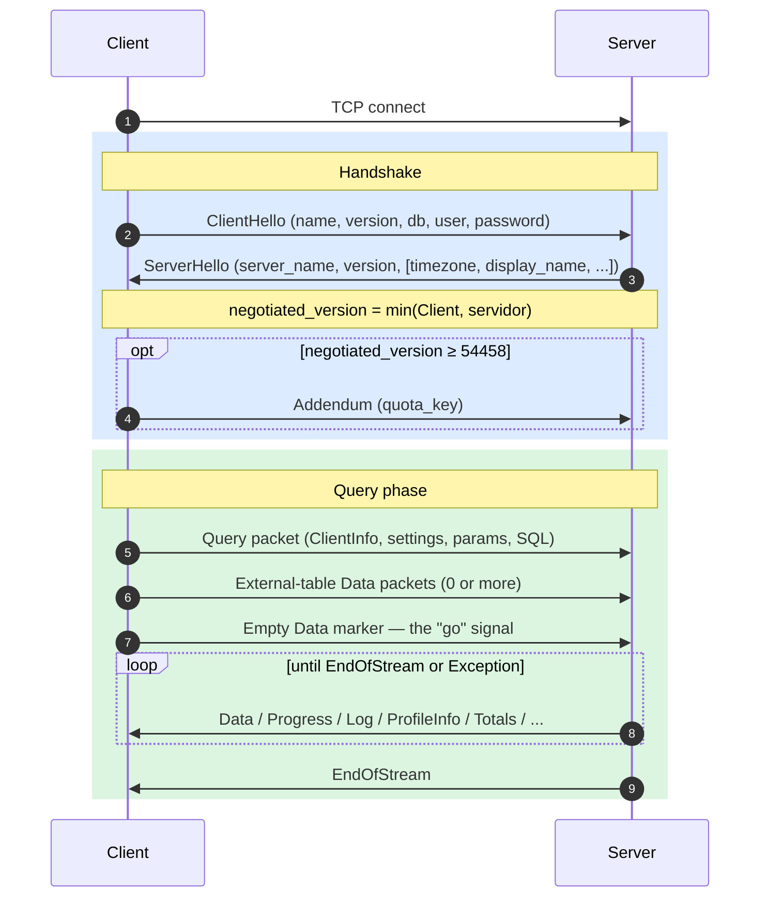
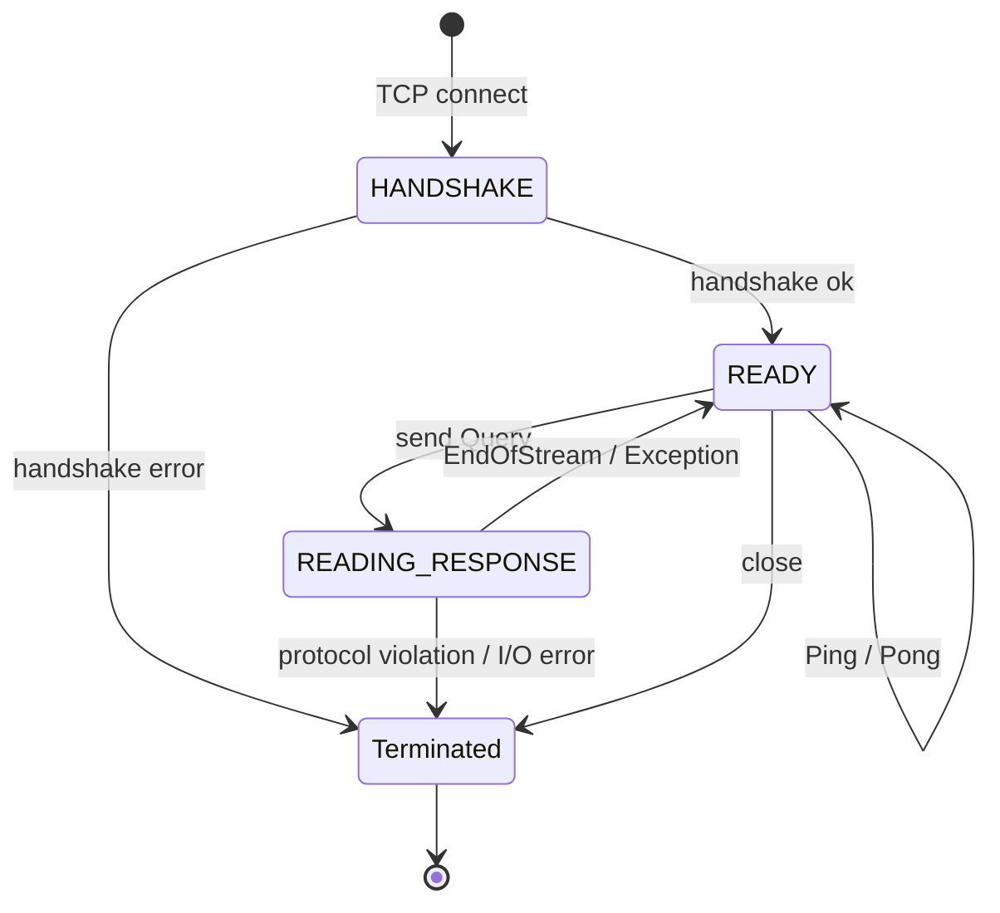
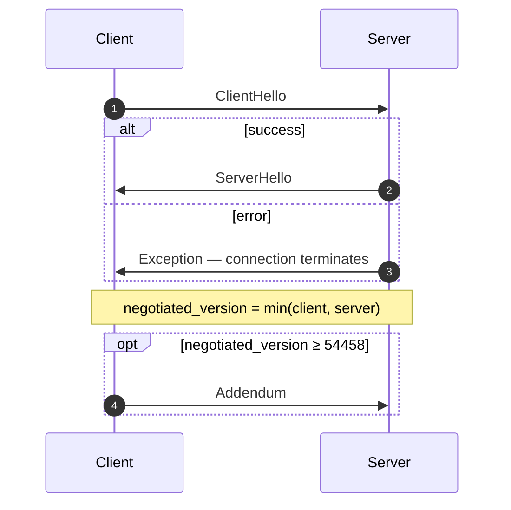
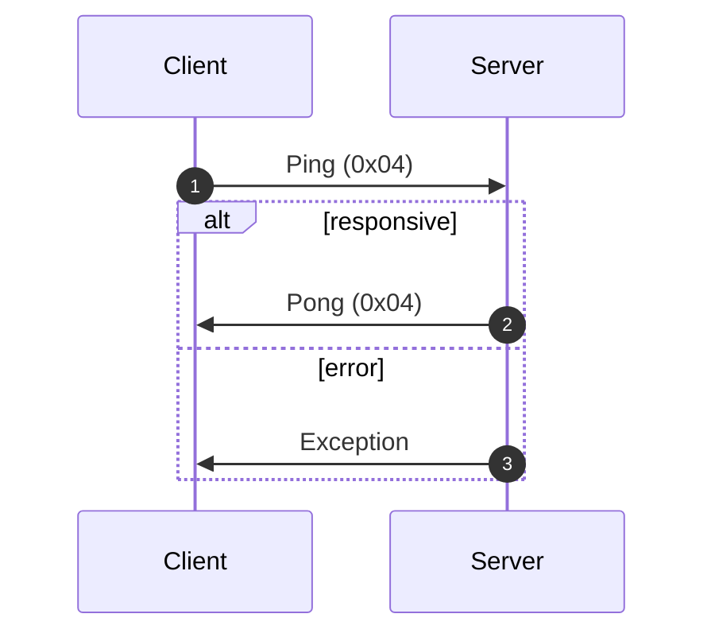
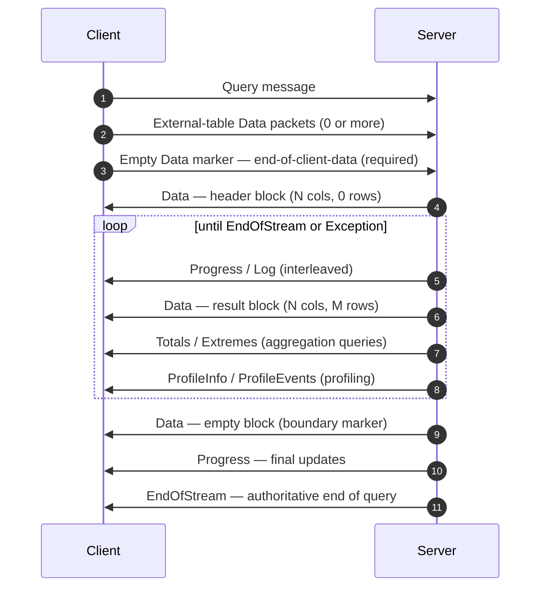
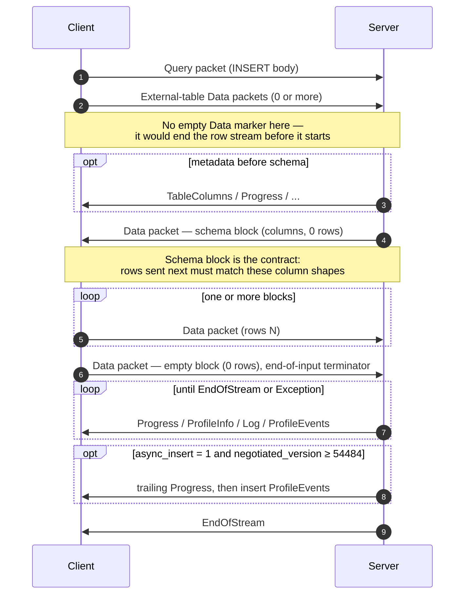
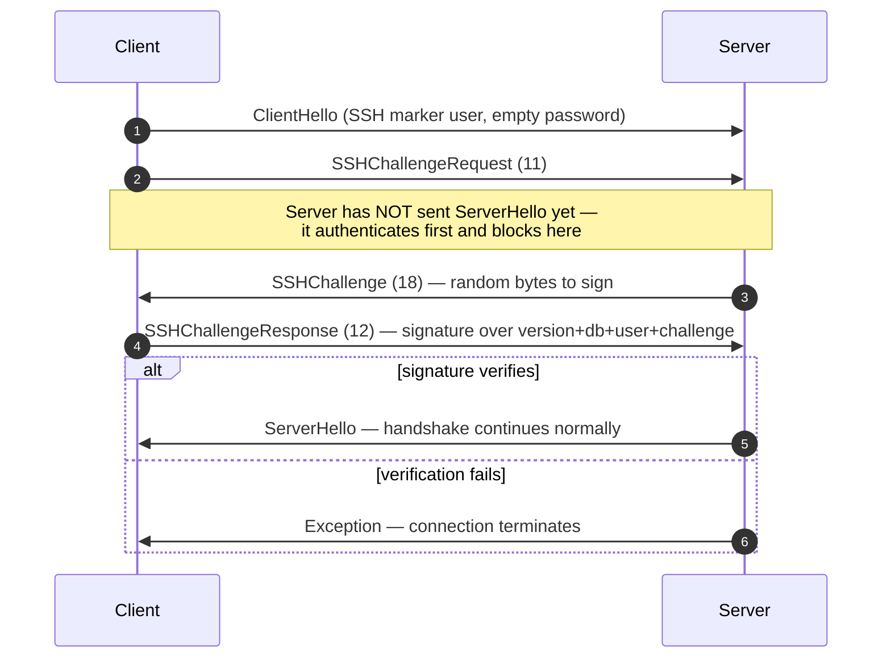

El protocolo nativo es el protocolo binario orientado a conexión que los clientes y servidores de ClickHouse usan sobre TCP. Transporta consultas SQL, datos de resultados, payloads de `INSERT`, telemetría de ejecución y señales de error. Es el protocolo en el que se basan el Client de línea de comandos, el driver nativo de C++ y la mayoría de los drivers nativos de terceros.

Esta página describe el protocolo en sí: el encapsulado de paquetes, la máquina de estados de la conexión, la negociación de versiones y el cuerpo de todos los mensajes que no son `Block`. Los bytes dentro de los paquetes de la familia `Data` (el `Block`, sus columnas y las codificaciones de cada tipo) son un aspecto aparte, documentado en la especificación de [Formato nativo](/es/reference/interfaces/specs/NativeFormat).

<Info>
  **Especificación complementaria**

  Esta página es una de las dos partes de un conjunto y se publica junto con la especificación complementaria de [Formato nativo](/es/reference/interfaces/specs/NativeFormat). Ambas especificaciones reparten claramente el trabajo: esta página cubre la capa de paquetes y transporte; la especificación de Formato nativo cubre los bytes dentro de los paquetes de la familia `Data`.
</Info>

Hay varias propiedades que se mantienen en todo el protocolo. Es binario y posicional: no hay etiquetas de campo salvo dentro de `BlockInfo`, así que un solo byte fuera de lugar desincroniza todo lo que viene después. Tiene estado, y cada conexión TCP procesa una consulta cada vez; no hay multiplexación. Los enteros de ancho fijo están en formato little-endian.

<div id="overview">
  ## Descripción general
</div>

| Propiedad            | Valor                                                                                        |
| -------------------- | -------------------------------------------------------------------------------------------- |
| Transporte           | TCP, opcionalmente protegido con TLS                                                         |
| Orden de bytes       | little-endian para enteros de ancho fijo                                                     |
| Codificación         | Binaria y posicional (sin etiquetas de campo excepto en `BlockInfo`)                         |
| Modelo de conexión   | Con estado, una consulta a la vez, sin multiplexación                                        |
| Control de versiones | Se negocia en el handshake; las funcionalidades individuales se habilitan según la versión         |
| Formato de datos     | El [Formato nativo](/es/reference/interfaces/specs/NativeFormat) para todos los datos tabulares |

Cada mensaje en el wire comienza con un código de tipo de paquete `VarUInt`, seguido de un cuerpo cuya estructura depende de ese código y de la versión del protocolo negociada.

Una conexión pasa por tres fases: un handshake único, luego cualquier cantidad de intercambios `Ping` o `Query`, y por último el cierre:



El protocolo TCP nativo siempre transporta datos tabulares en el formato Native, independientemente de cualquier cláusula `FORMAT` en SQL. Volver a formatear en `RowBinary`, `CSV`, `JSON`, etc. es tarea del Client, y se hace después de decodificar los bloques Native. (La interfaz HTTP sigue una ruta de código distinta que *sí* respeta la cláusula `FORMAT`; HTTP queda fuera del alcance de esta explicación.)

<div id="security">
  ## Seguridad
</div>

<div id="transport-security">
  ### Seguridad de transporte (TLS)
</div>

TLS opera en la capa de transporte, por debajo del protocolo. Cuando está habilitado, se cifra todo el flujo TCP, y los mensajes del protocolo son idénticos byte por byte, tanto si se usa TLS como si no.

<div id="authentication">
  ### Autenticación
</div>

La autenticación se realiza durante el handshake, en el mensaje [`ClientHello`](#clienthello). Los campos `user` y `password` se transmiten como cadenas de texto en claro, por lo que el cifrado a nivel de transporte (TLS) es lo que protege las credenciales durante el tránsito.

La autenticación SSH de desafío-respuesta está disponible a partir de la versión 54466 del protocolo; consulta [Autenticación SSH de desafío-respuesta](#ssh-authentication).

<div id="inter-server-secret">
  ### Secreto entre servidores
</div>

Para la ejecución distribuida de consultas, los servidores se autentican entre sí demostrando que conocen un secreto compartido, sin transmitir el secreto por la red. Cada Query incluye un `auth_hash` SHA-256 de 32 bytes en el campo 4 de [`Query`](#query), calculado a partir de una sal, un nonce, el secreto configurado y la consulta; el servidor receptor lo vuelve a calcular y lo compara. Esto está controlado por la funcionalidad `INTERSERVER_SECRET` (v54441). Los Clients externos siempre envían aquí una cadena vacía. Consulte [Autenticación entre servidores](#inter-server-authentication).

<div id="versioning-and-feature-gates">
  ## Versionado y control de funcionalidad
</div>

<div id="version-negotiation">
  ### Negociación de versiones
</div>

Tanto el Client como el servidor indican la versión máxima del protocolo que admiten durante el handshake. La **versión negociada** es la menor de las dos:

```text
negotiated_version = min(client_version, server_version)
```

Cada mensaje posterior usa la versión negociada para determinar qué campos están presentes en el wire.

<div id="feature-gates">
  ### Controles de funcionalidad
</div>

Una funcionalidad se identifica por la versión del protocolo en la que se introdujo y está **activa** cuando la versión negociada es mayor o igual a ese número.

<Warning>
  Cuando una funcionalidad está activa, sus campos **deben** estar presentes en la representación binaria transmitida. El protocolo es estrictamente posicional, por lo que omitir un campo protegido por un control de funcionalidad corrompe el flujo de bytes de todos los campos posteriores.
</Warning>

<div id="feature-table">
  ### Tabla de funcionalidades
</div>

| Funcionalidad                                           | Versión | Afecta a                         | Impacto a nivel wire                                                                                                                                                                                                                                                                                                                                                                                                                                                                                                                                                                                                                                          |
| ------------------------------------------------------- | ------- | -------------------------------- | ------------------------------------------------------------------------------------------------------------------------------------------------------------------------------------------------------------------------------------------------------------------------------------------------------------------------------------------------------------------------------------------------------------------------------------------------------------------------------------------------------------------------------------------------------------------------------------------------------------------------------------------------------------- |
| BLOCK&#95;INFO                                          | all     | Block                            | Añade el prefijo BlockInfo (`is_overflows`, `bucket_number`) a cada Block.                                                                                                                                                                                                                                                                                                                                                                                                                                                                                                                                                                                    |
| CLIENT&#95;INFO                                         | 54032   | Query                            | Añade el bloque ClientInfo al cuerpo de Query.                                                                                                                                                                                                                                                                                                                                                                                                                                                                                                                                                                                                                |
| TIMEZONE                                                | 54058   | ServerHello                      | Añade el campo `timezone` a ServerHello.                                                                                                                                                                                                                                                                                                                                                                                                                                                                                                                                                                                                                      |
| QUOTA&#95;KEY&#95;IN&#95;CLIENT&#95;INFO                | 54060   | ClientInfo                       | Añade el campo `quota_key` a ClientInfo.                                                                                                                                                                                                                                                                                                                                                                                                                                                                                                                                                                                                                      |
| DISPLAY&#95;NAME                                        | 54372   | ServerHello                      | Añade el campo `display_name` a ServerHello.                                                                                                                                                                                                                                                                                                                                                                                                                                                                                                                                                                                                                  |
| VERSION&#95;PATCH                                       | 54401   | ServerHello, ClientInfo          | Añade el campo `version_patch` a ambos.                                                                                                                                                                                                                                                                                                                                                                                                                                                                                                                                                                                                                       |
| SERVER&#95;LOGS                                         | 54406   | Log                              | El servidor emite paquetes Log cuando se configura `send_logs_level`.                                                                                                                                                                                                                                                                                                                                                                                                                                                                                                                                                                                         |
| COLUMN&#95;DEFAULTS&#95;METADATA                        | 54410   | TableColumns                     | El servidor puede enviar el paquete [`TableColumns`](#tablecolumns) (tipo 11) con metadatos de valores predeterminados de columnas antes del bloque de esquema de INSERT/input. Solo se envía cuando la versión negociada es ≥ 54410 **y** `input_format_defaults_for_omitted_fields` está habilitado. Por debajo de esta versión, el paquete no se envía nunca; los client no deben esperarlo.                                                                                                                                                                                                                                                               |
| WRITE&#95;CLIENT&#95;INFO                               | 54420   | Progress                         | Añade `wrote_rows` y `wrote_bytes` a Progress. (A pesar del nombre, esto **no** controla el bloque ClientInfo; eso lo hace `CLIENT_INFO` (v54032).)                                                                                                                                                                                                                                                                                                                                                                                                                                                                                                           |
| SETTINGS&#95;SERIALIZED&#95;AS&#95;STRINGS              | 54429   | Query (settings encoding)        | Cambia **cómo** se codifica la lista de settings, que siempre está presente; **no** controla si se envían settings. v54429+ escribe cada setting como `(name, flags, value-as-string)`; los peers anteriores escriben `(name, type-specific-binary-value)` sin flags. Consulta [Setting](#setting).                                                                                                                                                                                                                                                                                                                                                           |
| INTERSERVER&#95;SECRET                                  | 54441   | Query                            | Añade a Query el campo `auth_hash` entre servidores: un SHA-256 con salt del secreto del clúster, no el secreto sin procesar. Los client externos envían una cadena vacía. Consulta [Inter-server authentication](#inter-server-authentication).                                                                                                                                                                                                                                                                                                                                                                                                              |
| OPEN&#95;TELEMETRY                                      | 54442   | ClientInfo                       | Añade el trace context de OpenTelemetry a ClientInfo.                                                                                                                                                                                                                                                                                                                                                                                                                                                                                                                                                                                                         |
| DISTRIBUTED&#95;DEPTH                                   | 54448   | ClientInfo                       | Añade el campo `distributed_depth` a ClientInfo.                                                                                                                                                                                                                                                                                                                                                                                                                                                                                                                                                                                                              |
| INITIAL&#95;QUERY&#95;START&#95;TIME                    | 54449   | ClientInfo                       | Añade el campo `initial_time` (Int64, de ancho fijo).                                                                                                                                                                                                                                                                                                                                                                                                                                                                                                                                                                                                         |
| PROFILE&#95;EVENTS                                      | 54451   | ProfileEvents                    | El servidor emite paquetes ProfileEvents durante la ejecución de la consulta.                                                                                                                                                                                                                                                                                                                                                                                                                                                                                                                                                                                 |
| PARALLEL&#95;REPLICAS                                   | 54453   | ClientInfo                       | Añade campos de coordinación de réplicas paralelas a ClientInfo.                                                                                                                                                                                                                                                                                                                                                                                                                                                                                                                                                                                              |
| CUSTOM&#95;SERIALIZATION                                | 54454   | Block (Column)                   | Añade el byte `has_custom_serialization` después de la cadena de tipo de cada columna.                                                                                                                                                                                                                                                                                                                                                                                                                                                                                                                                                                        |
| ADDENDUM                                                | 54458   | Handshake                        | El client envía un addendum (`quota_key`) después del intercambio de handshake.                                                                                                                                                                                                                                                                                                                                                                                                                                                                                                                                                                               |
| PARAMETERS                                              | 54459   | Query                            | Añade la lista de parámetros al cuerpo de Query.                                                                                                                                                                                                                                                                                                                                                                                                                                                                                                                                                                                                              |
| SERVER&#95;QUERY&#95;TIME&#95;IN&#95;PROGRESS           | 54460   | Progress                         | Añade el campo `elapsed_ns` a Progress.                                                                                                                                                                                                                                                                                                                                                                                                                                                                                                                                                                                                                       |
| PASSWORD&#95;COMPLEXITY&#95;RULES                       | 54461   | ServerHello                      | Añade a ServerHello una lista de patrones regex de políticas de contraseñas y mensajes legibles para humanos.                                                                                                                                                                                                                                                                                                                                                                                                                                                                                                                                                 |
| INTERSERVER&#95;SECRET&#95;V2                           | 54462   | ServerHello                      | Añade un nonce `UInt64` de 8 bytes a ServerHello. Se usa para la firma de consultas entre servidores; los client externos lo decodifican y lo ignoran.                                                                                                                                                                                                                                                                                                                                                                                                                                                                                                        |
| TOTAL&#95;BYTES&#95;IN&#95;PROGRESS                     | 54463   | Progress                         | Añade el campo `total_bytes_to_read` (VarUInt) a Progress, entre `total_rows` y `wrote_rows`.                                                                                                                                                                                                                                                                                                                                                                                                                                                                                                                                                                 |
| TIMEZONE&#95;UPDATES                                    | 54464   | TimezoneUpdate                   | Añade el paquete de servidor `TimezoneUpdate` (tipo 17). Cuerpo: un único `String` que transporta la session timezone. Solo lo envía el inicializador de la table function `input`, justo después del bloque de esquema de entrada, para que el client analice las filas que envía con la `session_timezone` del servidor. Consulta [TimezoneUpdate](#timezoneupdate).                                                                                                                                                                                                                                                                                        |
| SPARSE&#95;SERIALIZATION                                | 54465   | Block (Column)                   | El servidor puede establecer `has_custom_serialization = 1` y emitir una columna codificada de forma dispersa. Wire format: kind de 1 byte (0x01 = SPARSE), seguido de un flujo de offsets VarUInt terminado por EOG, y luego los valores no predeterminados codificados densamente en el tipo interno. Consulta [kind&#95;stack and sparse encoding](/es/reference/interfaces/specs/NativeFormat#kind-stack-and-sparse-encoding).                                                                                                                                                                                                                               |
| SSH&#95;AUTHENTICATION                                  | 54466   | Auth flow                        | Añade autenticación SSH de challenge-response. Participación voluntaria: el client envía un `user` con la forma `" SSH KEY AUTHENTICATION " + <real_user>` con contraseña vacía para activarla. Consulta [SSH challenge-response authentication](#ssh-authentication).                                                                                                                                                                                                                                                                                                                                                                                        |
| TABLE&#95;READ&#95;ONLY&#95;CHECK                       | 54467   | TablesStatusResponse             | Añade un indicador `is_readonly` a la fila de cada table en TablesStatusResponse. Los client externos que no envían `TablesStatusRequest` no ven ningún cambio a nivel wire.                                                                                                                                                                                                                                                                                                                                                                                                                                                                                  |
| SYSTEM&#95;KEYWORDS&#95;TABLE                           | 54468   | system tables                    | El servidor puebla `system.keywords` para que el `clickhouse-client` canónico pueda autocompletar keywords. No hay cambios a nivel wire en el protocolo nativo.                                                                                                                                                                                                                                                                                                                                                                                                                                                                                               |
| ROWS&#95;BEFORE&#95;AGGREGATION                         | 54469   | ProfileInfo                      | Añade `applied_aggregation` (Bool) y `rows_before_aggregation` (VarUInt) a ProfileInfo, en ese orden, al final.                                                                                                                                                                                                                                                                                                                                                                                                                                                                                                                                               |
| CHUNKED&#95;PROTOCOL                                    | 54470   | Connection framing               | El framing por fragmentos por paquete envuelve cada cuerpo de paquete. Se negocia en Addendum. ServerHello transporta la preferencia del servidor para cada dirección; Addendum transporta la elección final del client. Consulta [chunked framing](#chunked-framing).                                                                                                                                                                                                                                                                                                                                                                                        |
| VERSIONED&#95;PARALLEL&#95;REPLICAS&#95;PROTOCOL        | 54471   | ServerHello, Addendum            | Ambos lados intercambian una versión `VarUInt` del protocolo de coordinación de réplicas paralelas. El campo de ServerHello está situado **inmediatamente después de `protocol_version`** (antes de `timezone`). El campo de Addendum se añade después de las cadenas del protocolo por fragmentos. Valor actual: `7` (`DBMS_PARALLEL_REPLICAS_PROTOCOL_VERSION`).                                                                                                                                                                                                                                                                                            |
| INTERSERVER&#95;EXTERNALLY&#95;GRANTED&#95;ROLES        | 54472   | Query                            | Añade un campo `String external_roles` al cuerpo de Query, entre el terminador de settings y el hash del secreto interserver. Los clients externos envían una lista de roles vacía (un único byte `0x00`, es decir, VarUInt 0 dentro de un String contenedor).                                                                                                                                                                                                                                                                                                                                                                                                |
| V2&#95;DYNAMIC&#95;AND&#95;JSON&#95;SERIALIZATION       | 54473   | Column body                      | El server puede emitir serialización V2 para los tipos de columna `Dynamic` y `JSON`; esto determina qué versión de `state_prefix` usan. Consulta [versioned types](/es/reference/interfaces/specs/NativeFormat#versioned-types).                                                                                                                                                                                                                                                                                                                                                                                                                                |
| SERVER&#95;SETTINGS                                     | 54474   | ServerHello                      | El server difunde sus settings distintos de los predeterminados como una lista al final de ServerHello, después de `nonce`. Formato: triples `(key, flags, value)` terminados por una key vacía, igual que la lista de settings del paquete Query.                                                                                                                                                                                                                                                                                                                                                                                                            |
| QUERY&#95;AND&#95;LINE&#95;NUMBERS                      | 54475   | ClientInfo                       | Añade `script_query_number` (VarUInt) y `script_line_number` (VarUInt) al final de ClientInfo. Lo usa clickhouse-client para atribuir errores en scripts con múltiples sentencias; los clients externos envían `0, 0`.                                                                                                                                                                                                                                                                                                                                                                                                                                        |
| JWT&#95;IN&#95;INTERSERVER                              | 54476   | ClientInfo                       | Añade un UInt8 que indica la presencia de JWT más un `String jwt` opcional al final de ClientInfo. Los clients externos (sin JWT) envían el byte `0x00`. (En C++ se escribe `DBMS_MIN_REVISON_WITH_JWT_IN_INTERSERVER`; observa la errata en el nombre de la constante).                                                                                                                                                                                                                                                                                                                                                                                      |
| QUERY&#95;PLAN&#95;SERIALIZATION                        | 54477   | ServerHello, QueryPlan packet    | ServerHello añade `VarUInt query_plan_serialization_version` después de los settings del server. También introduce `ClientPacket::QueryPlan` (código `13`) para el envío entre servers de planes de consulta preconstruidos; los clients externos nunca lo envían.                                                                                                                                                                                                                                                                                                                                                                                            |
| PARALLEL&#95;BLOCK&#95;MARSHALLING                      | 54478   | Block (Column)                   | El server puede encapsular columnas en `ColumnBLOB` (comprimido en línea) para procesamiento paralelo. Se activa solo si la consulta tiene la compresión habilitada Y `rows > 1`; de lo contrario, se aplica el formato wire normal de columna. Los clients que nunca habilitan la compresión en paquetes Query salientes no ven ningún cambio en wire.                                                                                                                                                                                                                                                                                                       |
| VERSIONED&#95;CLUSTER&#95;FUNCTION&#95;PROTOCOL         | 54479   | ServerHello                      | Añade `VarUInt cluster_function_protocol_version` al final de ServerHello. Se usa para funciones de tabla `*Cluster` (`s3Cluster`, etc.). Los clients externos lo decodifican y lo ignoran.                                                                                                                                                                                                                                                                                                                                                                                                                                                                   |
| OUT&#95;OF&#95;ORDER&#95;BUCKETS&#95;IN&#95;AGGREGATION | 54480   | BlockInfo                        | Añade el campo 3 (`out_of_order_buckets: Vec<Int32>`) al flujo etiquetado por campos de BlockInfo. Se decodifica como `[VarUInt count][Int32]*count`. Los clients externos no emiten esto por sí mismos; el decodificador lee cualquier lista no vacía que envíe el server.                                                                                                                                                                                                                                                                                                                                                                                   |
| COMPRESSED&#95;LOGS&#95;PROFILE&#95;EVENTS&#95;COLUMNS  | 54481   | Log, ProfileEvents, TableColumns | El server puede encapsular los cuerpos de los paquetes [`Log`](#log), [`ProfileEvents`](#profileevents) y [`TableColumns`](#tablecolumns) en el [compression frame](/es/reference/interfaces/specs/NativeFormat#compression-frame). En esta versión, los tres cuerpos recorren la misma ruta de salida opcionalmente comprimida, que se convierte en un compression frame real solo cuando la consulta tiene `compression = true`. Los clients que nunca habilitan la compresión en paquetes Query salientes no ven ningún cambio en wire.                                                                                                                       |
| REPLICATED&#95;SERIALIZATION                            | 54482   | Block (Column)                   | El server puede emitir columnas con kind&#95;stack `0x04 = REPLICATED`: una forma compacta de estilo diccionario para valores repetidos; consulta [kind&#95;stack and sparse encoding](/es/reference/interfaces/specs/NativeFormat#kind-stack-and-sparse-encoding). Por debajo de esta versión, el escritor expandía esas columnas antes de enviarlas. Se decodifica mediante búsqueda por índice (`elements[indexes[i]]` por fila); admite tipos hoja, además de internos `Nullable`/`Array`/`Tuple`/`Map`/`Nested`/`LowCardinality`.                                                                                                                           |
| NULLABLE&#95;SPARSE&#95;SERIALIZATION                   | 54483   | Block (Column)                   | Combina la serialización dispersa con `Nullable(T)`. Por debajo de esta versión, el escritor expandía la representación dispersa de columnas Nullable antes de enviarlas; en v54483+ los datos wire son sparse-over-Nullable. Consulta [kind&#95;stack and sparse encoding](/es/reference/interfaces/specs/NativeFormat#kind-stack-and-sparse-encoding).                                                                                                                                                                                                                                                                                                         |
| PROGRESS&#95;IN&#95;ASYNC&#95;INSERT                    | 54484   | Progress (INSERT)                | En un INSERT **asíncrono** (`async_insert = 1`), una vez volcado el insert, el server envía un paquete [`Progress`](#progress) adicional y luego los `ProfileEvents` del insert, antes de `EndOfStream`. Depende de que la versión *negociada* sea ≥ 54484; por debajo de eso, el server omite este Progress final. El formato wire de Progress no cambia; la novedad está solo en su emisión. En la práctica, el incremento transporta el tiempo transcurrido; los contadores de filas escritas se informan mediante los ProfileEvents adjuntos. Un client que ya consume Progress entrelazados no necesita cambios de formato, solo tolerar un paquete más. |
| CLIENT&#95;AGENT&#95;IN&#95;CLIENT&#95;INFO             | 54485   | ClientInfo                       | Añade un `String` `client_agent` al final de ClientInfo. El client canónico detecta automáticamente un identificador de agent a partir de su entorno (por ejemplo, `claude-code`, `cursor`, `gemini-cli` o el valor de la variable `AGENT`); un client externo sin nada detectado envía una cadena vacía. Es obligatorio una vez que la versión negociada sea ≥ 54485; omitirlo desincroniza el resto del paquete Query.                                                                                                                                                                                                                                      |

<div id="packet-envelope">
  ## Encapsulado del paquete
</div>

Todos los mensajes transmitidos comparten la misma estructura externa en ambos sentidos:

```text
[VarUInt: packet_type_code]    always encoded as VarUInt
[message body]                 format depends on packet_type_code
```

Las tablas completas de los tipos de paquetes están en la [referencia de tipos de paquetes](#packet-type-reference).

El tipo de paquete es un `VarUInt`, no un byte de ancho fijo. Para valores inferiores a 128, un `VarUInt` produce el mismo byte, pero las implementaciones deben usar la codificación `VarUInt` para seguir siendo compatibles si en el futuro los tipos de paquetes llegan a 128 o más.

La [referencia de mensajes](#message-reference) documenta solo el **cuerpo** de cada paquete: los bytes que vienen después del código de tipo de paquete. La numeración de los campos comienza en 1 con el primer campo del cuerpo.

<div id="chunked-framing">
  ### Enmarcado por fragmentos (v54470+)
</div>

Cuando se **negocia** la funcionalidad `CHUNKED_PROTOCOL` (ver [el handshake](#handshake-phase)), cada paquete en el wire se encapsula con enmarcado por fragmentos. Este encapsulado es **por dirección**: Client→servidor y servidor→Client se negocian por separado y pueden quedar en modos distintos (por fragmentos o sin enmarcar).

Formato en el wire de cada paquete:

```text
<chunk>...   one or more chunks; their payloads concatenated form the whole packet
[u32 LE = 0] zero-size terminator marking end of packet
```

Formato en el wire por fragmento:

```text
[u32 LE: chunk_size]   chunk_size in [1, UINT32_MAX]
[chunk_size bytes]     packet bytes (see note below)
```

El tipo de paquete `VarUInt` está **dentro** del flujo fragmentado: es el primer byte de la carga útil del paquete (el primer byte del primer fragmento), no un byte separado enviado por delante del enmarcado. La carga útil fragmentada de cada paquete es el `[VarUInt packet_type_code][message body]` completo de la [envoltura del paquete](#packet-envelope). Un Client que deja el tipo de paquete fuera del flujo fragmentado hace que el par lea ese byte de tipo como el primer byte del tamaño del fragmento `u32`, desincronizando la conexión.

Un solo paquete puede dividirse en varios fragmentos si el búfer del escritor se llena a mitad del paquete; la división puede caer en cualquier punto, incluso dentro del `VarUInt` del tipo de paquete. El lector concatena las cargas útiles de los fragmentos y trata el cero final de 4 bytes como un límite de paquete transparente: lo consume, pero no se lo expone a quien esté leyendo los cuerpos de los paquetes.

Los paquetes sin cuerpo siguen yendo encapsulados: un paquete de un solo byte como `Ping` o `Pong` se convierte en `[u32 size = 1][0x04][u32 0]` una vez que se negocia la fragmentación. Cualquier descripción de &quot;un solo byte en el wire&quot; en otra parte de esta página corresponde a la forma previa a la fragmentación.

**Negociación.** ServerHello y Addendum llevan cada uno dos campos `String`, uno por dirección, con valores tomados de `{"chunked", "notchunked", "chunked_optional", "notchunked_optional"}`:

* `chunked` / `notchunked` son estrictos: ese lado requiere exactamente ese modo.
* Las variantes `_optional` son flexibles: aceptan el modo que elija el otro lado.

El valor acordado para cada dirección se calcula por pares:

| Preferencia del servidor | Preferencia del Client | Acordado                                           |
| ------------------------ | ---------------------- | -------------------------------------------------- |
| `*_optional`             | cualquiera             | seguir al CLIENT (su `starts_with("chunked")`)     |
| cualquiera               | `*_optional`           | seguir al SERVER                                   |
| `chunked` estricto       | `chunked` estricto     | `chunked`                                          |
| `notchunked` estricto    | `notchunked` estricto  | `notchunked`                                       |
| desacuerdo estricto      | desacuerdo estricto    | **error de protocolo** — la conexión DEBE cerrarse |

En el lado del Client, la preferencia de ENVÍO del Client se negocia frente a la preferencia de RECEPCIÓN del servidor, y viceversa.

**Temporización.** Las cadenas de negociación viajan por el wire sin enmarcado: ClientHello → ServerHello (preferencias del servidor) → Addendum (valores negociados del Client). El cambio al enmarcado se aplica a cada byte enviado *después* de que se vacíe el Addendum. El propio Addendum, ClientHello y ServerHello siempre van sin enmarcado.

<div id="connection-lifecycle">
  ## Ciclo de vida de la conexión
</div>

En cualquier momento, una conexión está exactamente en uno de cuatro estados: `HANDSHAKE`, `READY`, `READING_RESPONSE` o terminada. Como el protocolo no multiplexa, un Client que envía una nueva solicitud antes de terminar de leer la respuesta anterior intercala bytes en tránsito y corrompe el flujo.

<div id="states">
  ### Estados
</div>



El flujo nominal sigue una línea recta — `HANDSHAKE → READY → READING_RESPONSE → READY` — con el bucle de `Ping`/`Pong` y todas las transiciones de error convergiendo en el único estado terminal `Terminated`.

| Estado             | Descripción                                                                                                                                                                                                                                                |
| ------------------ | ---------------------------------------------------------------------------------------------------------------------------------------------------------------------------------------------------------------------------------------------------------- |
| `HANDSHAKE`        | Estado inicial después de que se abre la conexión TCP. Solo son válidos los mensajes de [handshake](#handshake-phase). Pasa a `READY` si se completa correctamente o termina si falla.                                                                     |
| `READY`            | Inactivo. El Client puede enviar [Ping](#ping-phase), [consulta](#query-phase) o cerrar la conexión. La conexión puede permanecer en `READY` indefinidamente (sujeta a `idle_connection_timeout`; consulte los [límites de conexión](#connection-limits)). |
| `READING_RESPONSE` | Se entra en este estado cuando el Client envía una consulta. El Client debe consumir por completo el flujo de respuesta del servidor antes de volver a `READY`. El único paquete Client→servidor permitido aquí es Cancel (no se especifica en esta página).   |
| Terminated         | Ya no se puede usar. El Client debe abrir una nueva conexión TCP y reiniciar el handshake.                                                                                                                                                                 |

<div id="handshake-phase">
  ### Fase de handshake
</div>

En ella se autentica y se negocia la versión del protocolo. Ocurre exactamente una vez por conexión, antes de cualquier otra cosa.

La conexión TCP acaba de establecerse y aún no se ha intercambiado ningún mensaje. El flujo:



1. El Client envía [`ClientHello`](#clienthello) con la versión máxima del protocolo que admite.

2. El Client lee la respuesta y actúa según el tipo de paquete:

   | Tipo de paquete | Acción                                                                                                                        |
   | --------------- | ----------------------------------------------------------------------------------------------------------------------------- |
   | `Hello` (0)     | Decodifica [`ServerHello`](#serverhello). Calcula `negotiated_version = min(client_ver, server_ver)`. Continúa con el paso 3. |
   | `Exception` (2) | Decodifica [`Exception`](#exception). Lo devuelve como error y termina la conexión.                                           |
   | cualquier otro  | Violación del protocolo. Termina la conexión.                                                                                  |

3. Si `negotiated_version ≥ 54458` (la funcionalidad `ADDENDUM`), el Client envía un [`Addendum`](#addendum). Esta decisión se basa en la versión **negociada**, no en la versión declarada del Client.

Si la operación tiene éxito, la conexión pasa a `READY`; ante cualquier error, se termina.

<div id="ping-phase">
  ### Fase de Ping
</div>

Una comprobación de liveness a nivel de aplicación, independiente del keepalive de TCP. Un intercambio de Ping/Pong completado con éxito confirma que la conexión TCP está activa en ambas direcciones y que el servidor responde. Ping es sin estado y no está correlacionado con ninguna consulta, por lo que varios Pings secuenciales son independientes.

Partiendo de `READY`, el flujo es:



1. El Client envía [`Ping`](#ping).
2. El Client lee la respuesta:

   | Tipo de paquete      | Acción                                                         |
   | -------------------- | -------------------------------------------------------------- |
   | `Pong` (4)           | Se confirma que sigue activo. Volver a `READY`.                |
   | `Exception` (2)      | Decodificar [`Exception`](#exception) y devolverla como error. |
   | cualquier otro valor | Violación del protocolo.                                       |

<div id="query-phase">
  ### Fase de consulta
</div>

El Client envía una sentencia SQL; el servidor devuelve en streaming los bloques de resultados y la telemetría de ejecución. La respuesta es una secuencia de paquetes terminada por un único `EndOfStream` o una `Exception`.

Partiendo de `READY`, el flujo es:



Ante cualquier error, el servidor envía una `Exception` en lugar de `EndOfStream`, lo que termina la consulta.

1. El Client envía [`Query`](#query) con un `query_id` único (normalmente, un UUID).
2. El Client envía cualquier tabla externa y luego el marcador `Data` vacío. El paquete `Data` vacío tiene `table_name = ""`, `num_columns = 0`, `num_rows = 0`. El servidor no empieza a ejecutar la consulta hasta que recibe este marcador.
3. El Client pasa a `READING_RESPONSE` y vacía su búfer de escritura.
4. El Client lee los paquetes de respuesta en un bucle y los procesa según su tipo:

   | Tipo de paquete      | Acción                                                                                                                                                                                                                    |
   | -------------------- | ------------------------------------------------------------------------------------------------------------------------------------------------------------------------------------------------------------------------- |
   | `Data` (1)           | Decodifica el bloque. El primer `Data` es la cabecera del esquema; los posteriores son bloques de resultados (acumúlalos); un bloque vacío es un marcador de límite. `num_rows == 0` **no** indica el fin de la consulta. |
   | `Progress` (3)       | Métricas de ejecución. Cada paquete es un **incremento** con respecto al anterior; acumúlalo localmente.                                                                                                                  |
   | `EndOfStream` (5)    | Consulta completada. Sal del bucle y vuelve a `READY`.                                                                                                                                                                    |
   | `ProfileInfo` (6)    | Datos de profiling posteriores a la ejecución.                                                                                                                                                                            |
   | `Totals` (7)         | Bloque de totales de aggregation (mismo wire format que `Data`).                                                                                                                                                          |
   | `Extremes` (8)       | Bloque de valores mínimos/máximos (mismo wire format que `Data`).                                                                                                                                                         |
   | `Log` (10)           | Línea del server log.                                                                                                                                                                                                     |
   | `TableColumns` (11)  | Metadatos de valores predeterminados de columnas.                                                                                                                                                                         |
   | `ProfileEvents` (14) | Counters de rendimiento.                                                                                                                                                                                                  |
   | `Exception` (2)      | Decodifica y devuelve como error. Sal del bucle y vuelve a `READY`.                                                                                                                                                       |
   | anything else        | Inesperado durante la fase de consulta. Termina la conexión.                                                                                                                                                              |

Con `EndOfStream` o una `Exception` controlada, la conexión vuelve a `READY`. Una infracción del protocolo o un error de I/O la termina.

<Note>
  El caso `num_rows == 0` suele confundir a las implementaciones nuevas. Un bloque de cero filas es un marcador de límite o una cabecera de esquema, no una señal de fin de stream. Solo `EndOfStream` o `Exception` pone fin a la respuesta.
</Note>

<div id="insert-phase">
  ### Fase INSERT
</div>

La fase INSERT es la [fase de consulta](#query-phase) con dos intercambios adicionales. El Client envía una instrucción `INSERT`; el servidor responde con un **bloque de esquema** que describe la tabla de destino; el Client transmite paquetes Data con las filas y, después, el marcador Data vacío; el servidor finaliza con `EndOfStream` o `Exception`.

Partiendo de `READY`, el SQL es un `INSERT` con la forma `INSERT INTO <table> [(<cols>)] VALUES` — sin ningún literal `VALUES (...)` en línea, ya que los datos de las filas fluyen a través de paquetes Data. El flujo:



1. El Client envía [`Query`](#query) con `body` establecido en el SQL de INSERT.
2. El Client envía cualquier tabla externa (algo poco habitual en INSERT). A diferencia de la [fase consulta](#query-phase), **no** envía aquí un marcador Data vacío. El paquete `consulta` de `INSERT` se envía con datos pendientes, por lo que el bloque vacío de fin de datos se difiere hasta el paso 5; enviarlo antes del bloque de esquema haría que el servidor lo interpretara como el final del flujo de filas, completara el INSERT sin filas y luego analizara el primer paquete de fila real como un paquete suelto de nivel superior.
3. El Client consume los paquetes de metadatos (TableColumns, Progress, ProfileInfo, Log, ProfileEvents) hasta leer el paquete Data del esquema: un Block con 0 filas, pero con la estructura completa de columnas (nombres y tipos). El bloque de esquema es el contrato: las filas que el Client envíe a continuación deben coincidir con estas estructuras de columna.
4. El Client envía uno o varios bloques de datos. Para cada bloque, escribe `VarUInt(ClientPacket::Data = 2)`, luego `String("")` para el nombre vacío de la tabla externa y, después, el Block. Los tipos de columna deben alinearse por posición con las columnas del bloque de esquema.
5. El Client envía el terminador de fin de entrada: un paquete Data con un Block vacío (0 columnas, 0 filas).
6. El Client consume el flujo de respuesta hasta `EndOfStream` (éxito) o `Exception` (fallo).

**INSERT asíncrono (v54484+).** Cuando la consulta lleva `async_insert = 1`, el servidor pone las filas en cola y las vacía como parte de un lote. Con una versión negociada ≥ 54484 (`PROGRESS_IN_ASYNC_INSERT`), una vez completado el vaciado, el servidor emite un paquete adicional de [`Progress`](#progress), seguido inmediatamente por los `ProfileEvents` del insert y luego `EndOfStream`. Por debajo de 54484, el servidor omite ese Progress final. El paquete es un `Progress` normal; como el servidor restablece el query pipeline antes de incorporar los recuentos de escritura, en la práctica el incremento solo contiene el tiempo transcurrido, y las estadísticas de filas y bytes escritos llegan al Client mediante los `ProfileEvents` correspondientes. Un Client que ya consume paquetes Progress entrelazados en el paso 6 solo necesita aceptar uno más.

La conexión vuelve a `READY` en `EndOfStream` o tras una `Exception` controlada. Las infracciones del protocolo y los errores de I/O la terminan.

<div id="message-reference">
  ## Referencia de mensajes
</div>

Los campos se enumeran en el orden del wire. La columna `Type` usa:

* `VarUInt` — entero sin signo de longitud variable (consulta [VarUInt](/es/reference/interfaces/specs/NativeFormat#varuint)).
* `String` — bytes con prefijo `VarUInt` (consulta [String](/es/reference/interfaces/specs/NativeFormat#string)).
* `UInt8`, `Int32`, etcétera — enteros little-endian de ancho fijo.
* `Bool` — un único byte, `0x00` o `0x01`.

La columna `Role` indica quién usa cada campo:

* **Client** — lo establecen los clientes externos.
* **inter-server** — solo tiene sentido para la comunicación entre servidores; los clientes externos escriben un valor predeterminado.
* **universal** — lo usan ambos.

Estas tablas documentan solo el body de cada paquete, después del código de tipo de paquete.

<div id="clienthello">
  ### ClientHello (tipo de paquete 0)
</div>

Client → servidor. El primer mensaje tras abrirse la conexión TCP.

| # | Campo                | Tipo    | Rol       | Descripción                                              |
| - | -------------------- | ------- | --------- | -------------------------------------------------------- |
| 1 | client&#95;name      | String  | universal | Identificador del client (p. ej., `"clickhouse-client"`) |
| 2 | version&#95;major    | VarUInt | universal | Versión principal del client                             |
| 3 | version&#95;minor    | VarUInt | universal | Versión secundaria del client                            |
| 4 | protocol&#95;version | VarUInt | universal | Versión máxima del protocolo que admite el client        |
| 5 | database             | String  | universal | Nombre de la base de datos predeterminada                |
| 6 | user                 | String  | universal | Nombre de usuario para la autenticación                  |
| 7 | password             | String  | universal | Contraseña (en texto no cifrado)                         |

<div id="serverhello">
  ### ServerHello (tipo de paquete 0)
</div>

Servidor → Client. La respuesta a ClientHello tras una autenticación correcta.

| #  | Campo                                          | Tipo      | Rol          | Condición                                                 | Descripción                                                                                                                                                                                                                                                                           |
| -- | ---------------------------------------------- | --------- | ------------ | --------------------------------------------------------- | ------------------------------------------------------------------------------------------------------------------------------------------------------------------------------------------------------------------------------------------------------------------------------------- |
| 1  | server&#95;name                                | String    | universal    | always                                                    | Identificador del servidor                                                                                                                                                                                                                                                            |
| 2  | version&#95;major                              | VarUInt   | universal    | always                                                    | Versión principal del servidor                                                                                                                                                                                                                                                        |
| 3  | version&#95;minor                              | VarUInt   | universal    | always                                                    | Versión secundaria del servidor                                                                                                                                                                                                                                                       |
| 4  | protocol&#95;version                           | VarUInt   | universal    | always                                                    | Versión del protocolo del servidor                                                                                                                                                                                                                                                    |
| 4a | parallel&#95;replicas&#95;protocol&#95;version | VarUInt   | universal    | VERSIONED&#95;PARALLEL&#95;REPLICAS&#95;PROTOCOL (v54471) | Versión del protocolo de coordinación de réplicas paralelas del servidor. **Posición en el wire: inmediatamente después de `protocol_version`**, antes de `timezone`. Actual: `7`.                                                                                                    |
| 5  | timezone                                       | String    | universal    | TIMEZONE (v54058)                                         | Zona horaria del servidor (p. ej., `"UTC"`)                                                                                                                                                                                                                                           |
| 6  | display&#95;name                               | String    | universal    | DISPLAY&#95;NAME (v54372)                                 | Nombre del servidor legible para humanos                                                                                                                                                                                                                                              |
| 7  | version&#95;patch                              | VarUInt   | universal    | VERSION&#95;PATCH (v54401)                                | Versión de parche del servidor                                                                                                                                                                                                                                                        |
| 8  | proto&#95;send&#95;chunked&#95;srv             | String    | universal    | CHUNKED&#95;PROTOCOL (v54470)                             | Fragmentación saliente preferida del servidor. Uno de `"chunked"`, `"notchunked"`, `"chunked_optional"`, `"notchunked_optional"`. Consulte [enmarcado por fragmentos](#chunked-framing). **Va ANTES de `password_complexity_rules` en el wire aunque su versión de activación sea posterior.** |
| 9  | proto&#95;recv&#95;chunked&#95;srv             | String    | universal    | CHUNKED&#95;PROTOCOL (v54470)                             | Fragmentación entrante preferida del servidor. Mismo conjunto de valores que el campo 8.                                                                                                                                                                                              |
| 10 | password&#95;complexity&#95;rules              | Rule[]    | universal    | PASSWORD&#95;COMPLEXITY&#95;RULES (v54461)                | Política de contraseñas del servidor. `VarUInt count` seguido de `count × Rule`. Véase más abajo.                                                                                                                                                                                     |
| 11 | nonce                                          | UInt64    | inter-server | INTERSERVER&#95;SECRET&#95;V2 (v54462)                    | `nonce` aleatorio LE de 8 bytes. Lo usa el esquema de firma de consultas interservidor del servidor. Los Clients externos DEBEN decodificarlo (para mantener alineado el stream) y DEBERÍAN ignorar el valor.                                                                         |
| 12 | server&#95;settings                            | Setting[] | universal    | SERVER&#95;SETTINGS (v54474)                              | Difusión de settings no predeterminados del servidor. Formato: cero o más ternas `(String key, VarUInt flags, String value)`, terminadas por una key vacía. Igual que la [lista de settings del paquete Query](#setting).                                                             |
| 13 | query&#95;plan&#95;serialization&#95;version   | VarUInt   | universal    | QUERY&#95;PLAN&#95;SERIALIZATION (v54477)                 | Versión de serialización del plan de consulta compatible con el servidor. Los Clients externos la decodifican y la ignoran.                                                                                                                                                           |
| 14 | cluster&#95;function&#95;protocol&#95;version  | VarUInt   | universal    | VERSIONED&#95;CLUSTER&#95;FUNCTION&#95;PROTOCOL (v54479)  | Versión del protocolo de la función de tabla `*Cluster` del servidor. Los Clients externos la decodifican y la ignoran.                                                                                                                                                               |

**Rule** — un elemento de `password_complexity_rules`:

| # | Campo   | Tipo   | Descripción                                                                                 |
| - | ------- | ------ | ------------------------------------------------------------------------------------------- |
| 1 | pattern | String | Patrón de expresión regular que debe cumplir una contraseña válida.                         |
| 2 | message | String | Explicación legible para humanos que se muestra cuando una contraseña no cumple esta regla. |

La lista refleja la configuración de la política de contraseñas del operador del servidor y es puramente informativa: el servidor no aplica estas reglas durante el handshake. Un Client que exponga funcionalidad para cambiar o establecer contraseñas puede usar las reglas para señalar errores antes de enviar al servidor una contraseña no válida.

<Note>
  Para limitar el uso de recursos frente a un servidor hostil o mal configurado, limite el `count` decodificado a 256 entradas y cada String `pattern` y `message` a 4096 bytes. Un `count` de `0` (sin pares posteriores) es el caso habitual en servidores sin ninguna política de contraseñas configurada.
</Note>

<div id="addendum">
  ### Apéndice (sin tipo de paquete)
</div>

Client → Server, controlado por `ADDENDUM` (v54458). Se envía inmediatamente después de que se completa el intercambio de handshake. No es un tipo de paquete distinto: los campos van por el wire en bruto, sin prefijo de byte de tipo de paquete.

| # | Field                                          | Type    | Role      | Condition                                                 | Description                                                                                                                                                                                                                                                                                        |
| - | ---------------------------------------------- | ------- | --------- | --------------------------------------------------------- | -------------------------------------------------------------------------------------------------------------------------------------------------------------------------------------------------------------------------------------------------------------------------------------------------- |
| 1 | quota&#95;key                                  | String  | universal | siempre                                                   | Clave de cuota de recurso para QUOTA con clave del lado del server. Los Clients que no usan una quota con clave envían una cadena vacía.                                                                                                                                                           |
| 2 | proto&#95;send&#95;chunked                     | String  | universal | CHUNKED&#95;PROTOCOL (v54470)                             | Fragmentación saliente negociada del Client: `"chunked"` o `"notchunked"`. Se calcula con respecto a `proto_recv_chunked_srv` de ServerHello.                                                                                                                                                      |
| 3 | proto&#95;recv&#95;chunked                     | String  | universal | CHUNKED&#95;PROTOCOL (v54470)                             | Fragmentación entrante negociada del Client. Se calcula con respecto a `proto_send_chunked_srv`.                                                                                                                                                                                                   |
| 4 | parallel&#95;replicas&#95;protocol&#95;version | VarUInt | universal | VERSIONED&#95;PARALLEL&#95;REPLICAS&#95;PROTOCOL (v54471) | Versión del protocolo de coordinación de réplicas paralelas admitida por el Client. Los Clients externos que no participan en consultas distribuidas DEBERÍAN seguir enviando una versión válida (la actual, `7`) para que la comprobación de compatibilidad del server se complete correctamente. |

El cambio al enmarcado por fragmentos se aplica *después* de que este Apéndice se haya enviado por completo; el propio Apéndice no lleva enmarcado.

<div id="ping">
  ### Ping (tipo de paquete 4)
</div>

Client → Server. Sin cuerpo: el paquete consta de un único byte `0x04` antes del enmarcado por fragmentos; cuando se negocia la fragmentación, el byte pasa a ser el payload de un byte de un fragmento (consulte [enmarcado por fragmentos](#chunked-framing)).

<div id="pong">
  ### Pong (tipo de paquete 4)
</div>

Servidor → client. Sin body: el paquete es un solo byte `0x04` antes del enmarcado por fragmentos; cuando se negocia la fragmentación, el byte pasa a ser el payload de un byte de un fragmento (consulta el [enmarcado por fragmentos](#chunked-framing)).

<div id="exception">
  ### Exception (tipo de paquete 2)
</div>

Servidor → client. Se envía cuando el servidor detecta un error en cualquier fase.

| # | Campo                     | Tipo   | Rol       | Descripción                                                                |
| - | ------------------------- | ------ | --------- | -------------------------------------------------------------------------- |
| 1 | code                      | Int32  | universal | Código de error                                                            |
| 2 | name                      | String | universal | Clase de excepción (p. ej., `"DB::Exception"`)                             |
| 3 | message                   | String | universal | Mensaje de error legible para humanos                                      |
| 4 | stack&#95;trace           | String | universal | Stack trace del servidor                                                   |
| 5 | has&#95;nested (obsoleto) | Bool   | universal | Byte de compatibilidad obsoleto. El server siempre lo escribe como `false` |

<div id="query">
  ### Consulta (tipo de paquete 1)
</div>

Cliente → servidor.

| #  | Campo              | Tipo        | Rol              | Condición                                                 | Descripción                                                                                                                                                                                                                                                                                                                                                             |
| -- | ------------------ | ----------- | ---------------- | --------------------------------------------------------- | ----------------------------------------------------------------------------------------------------------------------------------------------------------------------------------------------------------------------------------------------------------------------------------------------------------------------------------------------------------------------- |
| 1  | query&#95;id       | String      | universal        | siempre                                                   | Identificador único de consulta (UUID)                                                                                                                                                                                                                                                                                                                                  |
| 2  | client&#95;info    | ClientInfo  | universal        | CLIENT&#95;INFO (v54032)                                  | Consulte [ClientInfo](#clientinfo)                                                                                                                                                                                                                                                                                                                                      |
| 3  | settings           | Setting[]   | universal        | siempre                                                   | Consulte [Setting](#setting). **Siempre presente** (terminado por una clave vacía); solo la *codificación* de cada configuración depende de la versión; consulte la nota sobre codificación en [Setting](#setting). Un cliente no debe omitir este campo en versiones negociadas inferiores a `54429`.                                                                  |
| 3a | external&#95;roles | String      | universal        | INTERSERVER&#95;EXTERNALLY&#95;GRANTED&#95;ROLES (v54472) | Lista serializada de nombres de roles otorgados externamente. Lista vacía = byte `0x00` (VarUInt 0) encapsulado en una cadena String (`[VarUInt 1][0x00]` en el wire). Los clientes externos siempre envían una lista vacía.                                                                                                                                            |
| 4  | auth&#95;hash      | String      | entre servidores | INTERSERVER&#95;SECRET (v54441)                           | Hash de autenticación entre servidores; **no** es el secret sin procesar del cluster. Consulte [Inter-server authentication](#inter-server-authentication) más abajo. Los clientes externos (y cualquier `InitialQuery`) envían una cadena vacía.                                                                                                                       |
| 5  | stage              | VarUInt     | universal        | siempre                                                   | Etapa de procesamiento de la consulta. `0` = FetchColumns, `1` = WithMergeableState, `2` = Complete, `3` = WithMergeableStateAfterAggregation, `4` = WithMergeableStateAfterAggregationAndLimit, `7` = QueryPlan. Los valores `3`/`4` aparecen en consultas distribuidas; `7` acompaña a un plan de consulta serializado. Los clientes externos normalmente envían `2`. |
| 6  | compression        | VarUInt     | universal        | siempre                                                   | 0 = deshabilitado, 1 = habilitado                                                                                                                                                                                                                                                                                                                                       |
| 7  | query&#95;body     | String      | universal        | siempre                                                   | Texto SQL                                                                                                                                                                                                                                                                                                                                                               |
| 8  | parameters         | Parameter[] | client           | PARAMETERS (v54459)                                       | Consulte [Parameter](#parameter). Terminado por una clave vacía.                                                                                                                                                                                                                                                                                                        |

<div id="clientinfo">
  ### ClientInfo (incluido en consulta)
</div>

Client → Server, incluido en el cuerpo de consulta (campo 2). Condicionado por `CLIENT_INFO` (v54032). (Algunos campos dentro de ClientInfo están condicionados por versiones posteriores, como se indica más abajo en cada campo.)

| #  | Campo                                 | Tipo    | Rol              | Condición                                                 | Descripción                                                                                                                                                                                                                                                                                                                                                                                                      |
| -- | ------------------------------------- | ------- | ---------------- | --------------------------------------------------------- | ---------------------------------------------------------------------------------------------------------------------------------------------------------------------------------------------------------------------------------------------------------------------------------------------------------------------------------------------------------------------------------------------------------------- |
| 1  | query&#95;kind                        | UInt8   | universal        | siempre                                                   | 0 = NoQuery, 1 = InitialQuery, 2 = SecondaryQuery. Los clientes externos envían `1`.                                                                                                                                                                                                                                                                                                                             |
| 2  | initial&#95;user                      | String  | universal        | siempre                                                   | Usuario que inició la consulta                                                                                                                                                                                                                                                                                                                                                                                   |
| 3  | initial&#95;query&#95;id              | String  | universal        | siempre                                                   | ID de la consulta original                                                                                                                                                                                                                                                                                                                                                                                       |
| 4  | initial&#95;address                   | String  | universal        | siempre                                                   | Dirección del socket del cliente de origen en formato `host:port`                                                                                                                                                                                                                                                                                                                                                |
| 5  | initial&#95;time                      | Int64   | Client           | INITIAL&#95;QUERY&#95;START&#95;TIME (v54449)             | Hora de inicio de la consulta (microsegundos). Ancho fijo de 8 bytes, no VarUInt                                                                                                                                                                                                                                                                                                                                 |
| 6  | query&#95;interface                   | UInt8   | universal        | siempre                                                   | 1 = TCP, 2 = HTTP                                                                                                                                                                                                                                                                                                                                                                                                |
| 7  | os&#95;user                           | String  | Client           | si interface = TCP                                        | `username` del SO                                                                                                                                                                                                                                                                                                                                                                                                |
| 8  | client&#95;hostname                   | String  | Client           | si interface = TCP                                        | `hostname` de la máquina cliente                                                                                                                                                                                                                                                                                                                                                                                 |
| 9  | client&#95;name                       | String  | Client           | si interface = TCP                                        | Nombre de la aplicación cliente                                                                                                                                                                                                                                                                                                                                                                                  |
| 10 | version&#95;major                     | VarUInt | universal        | si interface = TCP                                        | Versión principal del Client                                                                                                                                                                                                                                                                                                                                                                                     |
| 11 | version&#95;minor                     | VarUInt | universal        | si interface = TCP                                        | Versión secundaria del Client                                                                                                                                                                                                                                                                                                                                                                                    |
| 12 | protocol&#95;version                  | VarUInt | universal        | si interface = TCP                                        | La propia versión del protocolo TCP del cliente de origen (`DBMS_TCP_PROTOCOL_VERSION`), **no** la versión negociada. La revisión del peer solo determina qué campos están presentes; este valor es la versión compilada en el initiator, por lo que, en un cliente más nuevo que se comunica con un servidor más antiguo, puede ser superior a la revisión negociada o a la del servidor.                       |
| 13 | quota&#95;key                         | String  | universal        | QUOTA&#95;KEY&#95;IN&#95;CLIENT&#95;INFO (v54060)         | Clave de cuota de recursos para quotas con clave del lado del servidor. Los clientes que no usan una quota con clave envían una cadena vacía.                                                                                                                                                                                                                                                                    |
| 14 | distributed&#95;depth                 | VarUInt | entre servidores | DISTRIBUTED&#95;DEPTH (v54448)                            | Profundidad de anidamiento de la consulta Distributed. Los clientes externos envían `0`.                                                                                                                                                                                                                                                                                                                         |
| 15 | version&#95;patch                     | VarUInt | universal        | VERSION&#95;PATCH (v54401), solo TCP                      | Versión de parche del cliente                                                                                                                                                                                                                                                                                                                                                                                    |
| 16 | open&#95;telemetry                    | (abajo) | Client           | OPEN&#95;TELEMETRY (v54442)                               | Contexto de trace. Los clientes sin tracing envían `0`.                                                                                                                                                                                                                                                                                                                                                          |
| 17 | collaborate&#95;with&#95;initiator    | VarUInt | entre servidores | PARALLEL&#95;REPLICAS (v54453)                            | Bool como VarUInt. Los clientes externos envían `0`.                                                                                                                                                                                                                                                                                                                                                             |
| 18 | count&#95;participating&#95;replicas  | VarUInt | entre servidores | PARALLEL&#95;REPLICAS (v54453)                            | Los clientes externos envían `0`.                                                                                                                                                                                                                                                                                                                                                                                |
| 19 | number&#95;of&#95;current&#95;replica | VarUInt | entre servidores | PARALLEL&#95;REPLICAS (v54453)                            | Los clientes externos envían `0`.                                                                                                                                                                                                                                                                                                                                                                                |
| 20 | script&#95;query&#95;number           | VarUInt | Client           | QUERY&#95;AND&#95;LINE&#95;NUMBERS (v54475)               | Posición, con índice base 1, de la instrucción en un script con múltiples instrucciones. Los clientes externos envían `0`.                                                                                                                                                                                                                                                                                       |
| 21 | script&#95;line&#95;number            | VarUInt | Client           | QUERY&#95;AND&#95;LINE&#95;NUMBERS (v54475)               | Número de línea, con índice base 1, dentro del script fuente. Los clientes externos envían `0`.                                                                                                                                                                                                                                                                                                                  |
| 22 | jwt&#95;present                       | UInt8   | entre servidores | JWT&#95;IN&#95;INTERSERVER (v54476)                       | `0` = sin JWT; `1` = a continuación se incluye un JWT. Los clientes externos sin autenticación JWT envían `0`.                                                                                                                                                                                                                                                                                                   |
| 23 | jwt                                   | String  | entre servidores | JWT&#95;IN&#95;INTERSERVER (v54476), if jwt&#95;present=1 | token Bearer JWT, solo presente cuando el campo 22 = `1`.                                                                                                                                                                                                                                                                                                                                                        |
| 24 | client&#95;agent                      | String  | Client           | CLIENT&#95;AGENT&#95;IN&#95;CLIENT&#95;INFO (v54485)      | Campo final. Identificador de la herramienta o agente cliente, detectado automáticamente a partir del entorno (p. ej., `claude-code`, `cursor`, `gemini-cli` o la variable de entorno `AGENT`). Los clientes externos sin ningún agente detectado envían una cadena vacía. Está presente en la ruta normal de Query una vez que la versión negociada es ≥ 54485 (se envía en todas las interfaces, no solo TCP). |

<Info>
  **Layout dependiente de la interfaz (campos 7–12)**

  Los campos 7–12 anteriores corresponden a la rama **TCP**. Cuando `query_interface` (campo 6) **no** es TCP, estos campos se *sustituyen* por un layout wire diferente; no son simples omisiones opcionales, por lo que un decodificador debe bifurcarse en función del campo 6.

  * `query_interface = 2` (**HTTP**): en su lugar, se escribe la información de la solicitud HTTP reenviada por el servidor: `http_method` (`UInt8`), `http_user_agent` (`String`), y después `forwarded_for` (`String`, condicionado por `X_FORWARDED_FOR_IN_CLIENT_INFO` v54443) y `http_referer` (`String`, condicionado por `REFERER_IN_CLIENT_INFO` v54447). No están presentes los campos `os_user`/`client_hostname`/`client_name`/`version_*`/`protocol_version`.
  * Cualquier otra interfaz: no se escribe ninguno de los campos TCP (7–12) ni ninguno de los campos HTTP; el flujo continúa directamente con `quota_key`.

  Después de esta rama, el layout vuelve a unirse: `quota_key` (campo 13) y `distributed_depth` (campo 14) aparecen en todas las interfaces, y luego `version_patch` (campo 15) se escribe solo para TCP.

  Esta rama importa principalmente para el tráfico entre servidores, donde el servidor que inicia reenvía una consulta que originalmente llegó por HTTP. Un decodificador que siempre lea los campos TCP interpretará mal esos paquetes, tratando `http_method` o `http_user_agent` como `quota_key`.
</Info>

Codificación de OpenTelemetry (campo 16):

```text
[UInt8: has_trace]              0 = no trace data follows, 1 = trace data follows
If has_trace == 1:
  [16 bytes: trace_id]          byte-swapped per-8-bytes
  [8 bytes:  span_id]           byte-swapped
  [String:   trace_state]       W3C trace state
  [UInt8:    trace_flags]       W3C trace flags
```

<div id="inter-server-authentication">
  ### Autenticación entre servidores
</div>

El campo 4 de consulta (`auth_hash`) **no** es el secreto compartido del clúster en la representación wire. Enviar el secreto en bruto haría que la autenticación fallara y además lo expondría. En su lugar, un servidor que actúa como Client entre servidores demuestra que conoce el secreto con un hash SHA-256 con salt:

1. **Entrar en modo entre servidores.** El servidor que se conecta lo indica dentro de `ClientHello`: el campo `user` es el marcador entre servidores y `password` está vacío. A continuación, añade dos strings más —el nombre del clúster y una `salt` de 32 bytes recién generada (`encodeSHA256` de un valor aleatorio)— inmediatamente después de los campos `user`/`password`, como parte del mismo paquete `ClientHello`. El servidor lee estas dos strings **antes** de enviar `ServerHello`, por lo que un Client debe escribirlas de antemano; esperar primero a `ServerHello` provoca interbloqueos, porque el servidor queda bloqueado leyéndolas.
2. **Obtener el nonce.** `ServerHello` incluye un nonce `UInt64` de 8 bytes cuando se negocia `INTERSERVER_SECRET_V2` (v54462).
3. **Calcular el hash.** Para cada paquete consulta que no sea `InitialQuery`, el Client escribe `encodeSHA256(salt + nonce + cluster_secret + query + query_id + initial_user + external_roles)` en el campo 4: un digest de 32 bytes. (`nonce` va en su forma de string decimal, presente solo cuando se negocia ≥ v54462; `external_roles` se añade solo cuando se negocia `INTERSERVER_EXTERNALLY_GRANTED_ROLES` (v54472).) Para un `InitialQuery`, o cuando no hay ningún secreto de clúster configurado, el Client escribe en su lugar un string vacío.
4. **Verificar.** El servidor lee el campo 4 con un límite de 32 bytes y vuelve a calcular la misma concatenación usando su propia copia del secreto del clúster; la conexión se rechaza si los digests difieren.

Los clientes externos (no entre servidores) nunca entran en este modo y siempre envían un `auth_hash` vacío.

<div id="setting">
  ### Configuración
</div>

Codificada en línea en la lista de configuraciones del cuerpo de Query (el paquete [Query](#query), campo 3). La lista **siempre está presente**, independientemente de la versión negociada, y termina con una SETTING con `key` vacía: un único `VarUInt 0`, sin indicadores ni valor a continuación. Solo la codificación de cada configuración depende de la versión negociada, controlada por `SETTINGS_SERIALIZED_AS_STRINGS` (v54429).

**v54429+ (`STRINGS_WITH_FLAGS`)** — cada configuración es el triplete que se muestra aquí:

| # | Campo | Tipo    | Rol       | Descripción                                          |
| - | ----- | ------- | --------- | ---------------------------------------------------- |
| 1 | key   | String  | universal | Nombre de la configuración. Vacío = fin de la lista. |
| 2 | flags | VarUInt | universal | Indicadores de bits de metadatos; véase más abajo.   |
| 3 | value | String  | universal | Valor de la configuración como cadena                |

Los campos 2 y 3 no están presentes cuando `key` está vacía.

**Pre-54429 (`BINARY`)** — cada configuración es `[String key][type-specific binary value]`: el campo `flags` **no** se escribe, y el valor se codifica en la forma binaria nativa de la configuración (por ejemplo, un entero de ancho fijo o una cadena con prefijo de longitud) en lugar de como una cadena decimal o de texto. La lista sigue terminando con una `key` vacía. Un client que apunte a una versión negociada inferior a `54429` debe leer y escribir esta forma binaria, no el triplete anterior. (Las configuraciones personalizadas definidas por el usuario son la excepción: siempre llevan `flags` y un valor de cadena, en ambas codificaciones).

El campo `flags` contiene:

* `0x01` — **Importante**: la configuración afecta a los resultados de la consulta y no debe ser ignorada silenciosamente por pares más antiguos.
* `0x02` — **Personalizada**: una configuración personalizada definida por el usuario.
* `0x0c` — un campo **tier** de 2 bits, no un indicador independiente: `0x00` = Production, `0x04` = Obsolete, `0x08` = Experimental, `0x0c` = Beta. Lea los 2 bits completos (`flags & 0x0c`) — una comprobación ingenua de `flags & 0x04` clasificaría erróneamente Beta (`0x0c`) como Obsolete.
* `0x80` — **HotReload** (recarga de configuración sin reinicio; definido en el enum de indicadores, presente principalmente en configuraciones de coordinación).

<div id="parameter">
  ### Parámetro
</div>

Parámetros de consulta para consultas parametrizadas como `SELECT {x:UInt64}`. Se codifican de forma idéntica a un [SETTING](#setting) con el indicador `Custom` (`0x02`) activado, y terminan con una clave vacía de la misma forma.

| # | Campo | Tipo    | Rol    | Descripción                                                                     |
| - | ----- | ------- | ------ | ------------------------------------------------------------------------------- |
| 1 | key   | String  | client | Nombre del parámetro. Vacío = fin de la lista.                                  |
| 2 | flags | VarUInt | client | Siempre `0x02` (Custom)                                                         |
| 3 | value | String  | client | Valor del parámetro como cadena. Consulta la nota siguiente sobre las comillas. |

<Note>
  El valor del parámetro es la representación SQL del valor, no un literal sin procesar. Los parámetros de tipo cadena deben pasarse ya entre comillas simples (por ejemplo, el valor de `{name:String}` es `'Alice'`, no `Alice`); de lo contrario, el analizador de valores del servidor los rechazará.
</Note>

<div id="data">
  ### Data (tipo de paquete 1 servidor→client, tipo de paquete 2 client→servidor)
</div>

En ambas direcciones. Transporta bloques de resultados, datos de INSERT, tablas externas y marcadores de fin de datos.

El wire format es simétrico: ambas direcciones incluyen un prefijo `table_name` antes del Block. Solo cambia el byte del tipo de paquete.

```text
[VarUInt: packet_type]     1 (server→client) or 2 (client→server)
[String:  table_name]      External table name; empty in most cases
[Block]                    See the Native Format spec for the Block layout
```

| Campo             | Tipo   | Rol       | Descripción                                                                                                                                                                                                                                                                         |
| ----------------- | ------ | --------- | ----------------------------------------------------------------------------------------------------------------------------------------------------------------------------------------------------------------------------------------------------------------------------------- |
| table&#95;name    | String | universal | Nombre de la tabla externa. Vacío (`""`) es lo habitual: para la tabla principal, los resultados de la consulta y el flujo de filas de INSERT. `table_name` vacío por sí solo **no** es el marcador de fin de datos (los paquetes normales de filas de INSERT también llevan `""`). |
| Cuerpo del bloque | —      | —         | Véase [Block &amp; column structure](/es/reference/interfaces/specs/NativeFormat#block-and-column-structure).                                                                                                                                                                          |

El **marcador de fin de datos** es un paquete cuyo Block está vacío: `0` columnas y `0` filas, independientemente de `table_name`. El servidor trata un paquete `Data` del client como terminador solo cuando el bloque decodificado está vacío (`block.empty()`); un paquete con `table_name = ""` y un bloque no vacío es un paquete de filas normal, no un terminador. Por tanto, un flujo de filas de INSERT es una secuencia de bloques `Data` no vacíos seguida de un bloque `Data` vacío que lo finaliza.

Las variantes de bloque y su significado se documentan en [Block variants](/es/reference/interfaces/specs/NativeFormat#block-variants).

<div id="progress">
  ### Progress (tipo de paquete 3)
</div>

Servidor → Cliente. Se envía periódicamente durante la ejecución de la consulta. Todos los campos son VarUInt, y cada paquete contiene **incrementos desde el paquete `Progress` anterior**, no totales acumulados. Antes de enviarlo, el server lee sus contadores, los restablece atómicamente a cero y calcula `elapsed_ns` como la diferencia de tiempo desde el último envío. Por lo tanto, un client **debe acumular** localmente los paquetes sucesivos para obtener totales acumulados; tratar un paquete como un valor absoluto hace que la visualización del progreso retroceda o cuente de menos cuando llega más de un paquete.

| # | Campo           | Tipo    | Rol       | Condición                                              | Descripción                                                                                                        |
| - | --------------- | ------- | --------- | ------------------------------------------------------ | ------------------------------------------------------------------------------------------------------------------ |
| 1 | rows            | VarUInt | universal | siempre                                                | Filas leídas desde el paquete anterior (sumar al total acumulado)                                                  |
| 2 | bytes           | VarUInt | universal | siempre                                                | Bytes leídos desde el paquete anterior (sumar al total acumulado)                                                  |
| 3 | total&#95;rows  | VarUInt | universal | siempre                                                | Incremento del total estimado de filas por leer; acumular (puede ser 0 en un paquete determinado)                  |
| 4 | total&#95;bytes | VarUInt | universal | TOTAL&#95;BYTES&#95;IN&#95;PROGRESS (v54463)           | Incremento del total estimado de bytes por leer; acumular. Se sitúa ENTRE `total_rows` y `wrote_rows` en el wire.  |
| 5 | wrote&#95;rows  | VarUInt | universal | WRITE&#95;CLIENT&#95;INFO (v54420)                     | Filas escritas desde el paquete anterior (para INSERT); acumular                                                   |
| 6 | wrote&#95;bytes | VarUInt | universal | WRITE&#95;CLIENT&#95;INFO (v54420)                     | Bytes escritos desde el paquete anterior (para INSERT); acumular                                                   |
| 7 | elapsed&#95;ns  | VarUInt | universal | SERVER&#95;QUERY&#95;TIME&#95;IN&#95;PROGRESS (v54460) | Nanosegundos transcurridos desde el paquete anterior (una diferencia, no el tiempo total de la consulta); acumular |

<div id="profileinfo">
  ### ProfileInfo (tipo de paquete 6)
</div>

Servidor → client. Se envía una vez por consulta, hacia el final de la ejecución.

| # | Campo                           | Tipo    | Rol       | Condición                                | Descripción                                                                                                                                                                                                                                                                                             |
| - | ------------------------------- | ------- | --------- | ---------------------------------------- | ------------------------------------------------------------------------------------------------------------------------------------------------------------------------------------------------------------------------------------------------------------------------------------------------------- |
| 1 | rows                            | VarUInt | universal | siempre                                  | Total de filas procesadas                                                                                                                                                                                                                                                                               |
| 2 | blocks                          | VarUInt | universal | siempre                                  | Total de bloques procesados                                                                                                                                                                                                                                                                             |
| 3 | bytes                           | VarUInt | universal | siempre                                  | Total de bytes procesados                                                                                                                                                                                                                                                                               |
| 4 | applied&#95;limit               | Bool    | universal | siempre                                  | Indica si se aplicó una cláusula LIMIT                                                                                                                                                                                                                                                                  |
| 5 | rows&#95;before&#95;limit       | VarUInt | universal | siempre                                  | Recuento de filas antes de LIMIT                                                                                                                                                                                                                                                                        |
| 6 | *obsolete*                      | Bool    | universal | siempre                                  | Byte de compatibilidad obsoleto. El servidor siempre escribe `true` aquí y el client lo descarta al leerlo; **no** es un indicador de que se haya calculado &quot;`rows_before_limit`&quot;. El estado significativo del límite es el campo 4 (`applied_limit`) junto con el campo 5. Léalo e ignórelo. |
| 7 | applied&#95;aggregation         | Bool    | universal | ROWS&#95;BEFORE&#95;AGGREGATION (v54469) | Indica si se aplicó GROUP BY                                                                                                                                                                                                                                                                            |
| 8 | rows&#95;before&#95;aggregation | VarUInt | universal | ROWS&#95;BEFORE&#95;AGGREGATION (v54469) | Recuento de filas antes de la agregación                                                                                                                                                                                                                                                                |

<div id="totals">
  ### Totales (tipo de paquete 7)
</div>

Servidor → client. Se envía para consultas con `WITH TOTALS`. El formato de transmisión es idéntico a [Data](#data): una cadena `table_name` (siempre vacía) seguida de un Block. Solo cambia el byte del tipo de paquete.

```text
[VarUInt: 7]                packet type
[String:  table_name]       always empty
[Block]                     see the Native Format spec
```

<div id="extremes">
  ### Extremes (tipo de paquete 8)
</div>

Servidor → client. Se envía cuando la configuración `extremes` está habilitada. El formato de transmisión es idéntico a [Data](#data). El bloque tiene exactamente 2 filas: la fila 0 contiene el mínimo de cada columna y la fila 1, el máximo.

```text
[VarUInt: 8]                packet type
[String:  table_name]       always empty
[Block]                     num_rows = 2
```

<div id="log">
  ### Log (packet type 10)
</div>

Servidor → Cliente. Se envía cuando la consulta tiene una cola de logs activa (la configuración `send_logs_level`; consulte [streaming de logs](#log-streaming)).

El formato del sobre y del cuerpo es el mismo que el de [Data](#data). El bloque tiene un `num_columns = 8` fijo y un esquema predefinido. Cada línea de log ocupa una fila en las 8 columnas, y un único paquete Log puede contener muchas filas.

```text
[VarUInt: 10]               packet type
[String:  table_name]       always empty
[Block]                     num_columns = 8, num_rows = number of log lines
```

Las 8 columnas, en este orden exacto:

| # | Nombre                          | Tipo     | Descripción                                                   |
| - | ------------------------------- | -------- | ------------------------------------------------------------- |
| 1 | event&#95;time                  | DateTime | Marca temporal del evento (segundos desde la época Unix)      |
| 2 | event&#95;time&#95;microseconds | UInt32   | Componente de microsegundos                                   |
| 3 | host&#95;name                   | String   | Hostname del servidor que emite el log                        |
| 4 | query&#95;id                    | String   | ID de la consulta a la que pertenece el log                   |
| 5 | thread&#95;id                   | UInt64   | ID del hilo del SO                                            |
| 6 | priority                        | Int8     | Nivel de registro (prioridad de Poco: 1 = Fatal, … 8 = Trace) |
| 7 | source                          | String   | Nombre del logger                                             |
| 8 | text                            | String   | Texto del mensaje de log                                      |

<div id="profileevents">
  ### ProfileEvents (tipo de paquete 14)
</div>

Servidor → cliente. Contiene contadores de rendimiento por consulta.

La envoltura y el formato del cuerpo son los mismos que en [Data](#data). El bloque tiene un `num_columns = 6` fijo y un esquema predefinido. Cada evento es una fila.

```text
[VarUInt: 14]               packet type
[String:  table_name]       always empty
[Block]                     num_columns = 6, num_rows = number of events
```

Las 6 columnas:

| # | Nombre           | Tipo     | Descripción                                                                                             |
| - | ---------------- | -------- | ------------------------------------------------------------------------------------------------------- |
| 1 | host&#95;name    | String   | Hostname del servidor                                                                                   |
| 2 | current&#95;time | DateTime | Marca de tiempo del evento                                                                              |
| 3 | thread&#95;id    | UInt64   | ID del hilo                                                                                             |
| 4 | type             | Enum8    | Tipo de evento: 1 = Incremento (counter), 2 = Gauge. El almacenamiento subyacente es un byte con signo. |
| 5 | name             | String   | Nombre del evento (p. ej., `"Query"`, `"NetworkReceiveBytes"`)                                          |
| 6 | value            | Int64    | Valor del contador o lectura del gauge                                                                  |

<Note>
  El tipo de elemento de la columna `value` no es fijo entre paquetes: los servidores antiguos emiten `UInt64` y los más nuevos, `Int64`. Lee la cadena de tipo de la columna desde la cabecera del bloque en lugar de asumir un tamaño fijo.
</Note>

<div id="tablecolumns">
  ### TableColumns (tipo de paquete 11)
</div>

Server → client, condicionado por `COLUMN_DEFAULTS_METADATA` (v54410). El server lo envía antes del bloque de esquema de `INSERT` para transportar metadatos de valores predeterminados de las columnas, pero solo cuando la versión negociada es ≥ 54410 **y** la configuración `input_format_defaults_for_omitted_fields` está habilitada. Por debajo de 54410, el paquete no se envía nunca, por lo que un client más antiguo **no** debe esperarlo: el bloque de esquema `Data` llega directamente. Un client v54410+ debe estar preparado para cualquiera de estas dos secuencias: un `TableColumns` opcional y luego el bloque de esquema.

| # | Campo                   | Tipo   | Rol       | Descripción                                                                                                                       |
| - | ----------------------- | ------ | --------- | --------------------------------------------------------------------------------------------------------------------------------- |
| 1 | external&#95;table      | String | universal | Nombre de la tabla externa. Vacío = tabla principal.                                                                              |
| 2 | columns&#95;description | String | universal | Definiciones textuales de columnas; por ejemplo, `"id Int32, name String DEFAULT ''"`. Es texto libre: analízalo como una cadena. |

<Info>
  **Cuerpo comprimido a partir de v54481**

  Con una versión negociada ≥ 54481 (`COMPRESSED_LOGS_PROFILE_EVENTS_COLUMNS`), el server escribe **ambos** campos a través de la misma ruta de salida con compresión opcional, de modo que, cuando la consulta tiene `compression = true`, todo el cuerpo de `TableColumns` (`external_table` + `columns_description`) va dentro del [frame de compresión](/es/reference/interfaces/specs/NativeFormat#compression-frame); el client lo lee a través del flujo descomprimido correspondiente. Cuando la consulta no tiene compresión, el cuerpo se transmite sin comprimir, exactamente como muestra la tabla anterior. Esto es importante para las respuestas de esquema de `INSERT`: un client que cambie el manejo de la compresión para `Log` y `ProfileEvents`, pero no para `TableColumns`, interpretará mal la respuesta cuando la compresión de la consulta esté habilitada.
</Info>

<div id="timezoneupdate">
  ### TimezoneUpdate (tipo de paquete 17)
</div>

Server → Client, controlado por `TIMEZONE_UPDATES` (v54464). Se envía exactamente en un lugar: el inicializador de la table function `input` (una consulta de la forma `INSERT INTO <table> SELECT ... FROM input('<structure>')`, que transmite filas desde el client). Justo después de que el servidor envía el bloque `Data` del esquema de entrada (consulta la [fase INSERT](#insert-phase)), emite `TimezoneUpdate` con la `session_timezone` actual del contexto de la consulta para que el client procese las filas que está a punto de enviar con la misma zona horaria. El servidor **no** emite este paquete para cambios arbitrarios de `SET session_timezone` a mitad de consulta, ni para indicarle al client cómo debe dar formato a bloques de resultados posteriores.

| # | Field    | Type   | Role      | Description                                                                             |
| - | -------- | ------ | --------- | --------------------------------------------------------------------------------------- |
| 1 | timezone | String | universal | La nueva zona horaria predeterminada de la sesión (p. ej., `"UTC"`, `"Europe/Berlin"`). |

El paquete llega una sola vez, inmediatamente después del bloque del esquema de entrada y antes de que el client empiece a enviar bloques de filas. Un decodificador que ignore `TimezoneUpdate` DEBE igualmente consumir el `String` final para mantener alineado el wire.

<div id="ssh-authentication">
  ### Autenticación SSH de desafío-respuesta (tipos de paquete 11, 12, 18)
</div>

Controlada por `SSH_AUTHENTICATION` (v54466) y disponible solo mediante activación explícita. Una conexión entra en el flujo SSH cuando ClientHello envía `user = " SSH KEY AUTHENTICATION " + <real_user>` (con los espacios inicial y final) y `password = ""`. El servidor lee el prefijo, lo elimina para recuperar el usuario real y cambia al modo de desafío-respuesta.

| Packet               | Code | Direction       | Body                                                                                                            |
| -------------------- | ---- | --------------- | --------------------------------------------------------------------------------------------------------------- |
| SSHChallengeRequest  | 11   | Client → Server | (sin cuerpo)                                                                                                    |
| SSHChallenge         | 18   | Server → Client | `String challenge` — bytes aleatorios; un componente de la cadena que se firma (véase más abajo)                |
| SSHChallengeResponse | 12   | Client → Server | `String signature` — firma SSH sobre la concatenación definida a continuación, **no** sobre el desafío en bruto |

Este flujo se ejecuta en lugar de la autenticación por contraseña, y el intercambio de desafío-respuesta ocurre **antes** de ServerHello: el servidor aplaza su respuesta Hello hasta que la autenticación se complete correctamente:

1. El cliente envía ClientHello con el prefijo marcador SSH y una contraseña vacía.

2. El cliente envía `SSHChallengeRequest` (paquete 11). El servidor **todavía no** ha enviado ServerHello: primero procesa la autenticación y queda bloqueado aquí, esperando este paquete.

3. El servidor responde con `SSHChallenge`, que contiene bytes aleatorios (paquete 18).

4. El cliente construye la cadena que debe firmar y firma **esa**, no el desafío en bruto; luego envía `SSHChallengeResponse` (paquete 12) con la firma. El mensaje firmado es la concatenación byte a byte, sin separadores, de cuatro partes en este orden exacto:

   ```text
   to_sign = decimal(protocol_version) + default_database + user + challenge
   ```

   | Part                        | Source                                                                                                                                                                                                                                                      |
   | --------------------------- | ----------------------------------------------------------------------------------------------------------------------------------------------------------------------------------------------------------------------------------------------------------- |
   | `decimal(protocol_version)` | La protocol version del cliente como una **cadena ASCII decimal** (por ejemplo, `"54466"`) — el número de versión como cadena, no como VarUInt ni como entero de ancho fijo. El servidor valida con la misma protocol version que recibió en `ClientHello`. |
   | `default_database`          | El campo `database` de `ClientHello` (cadena vacía si no hay ninguna).                                                                                                                                                                                      |
   | `user`                      | El nombre del usuario real **con el prefijo marcador `" SSH KEY AUTHENTICATION "` eliminado** — el mismo nombre que el servidor recupera tras eliminar el prefijo.                                                                                          |
   | `challenge`                 | Los bytes en bruto de `challenge` del paquete `SSHChallenge`.                                                                                                                                                                                               |

5. El servidor verifica la firma con la public key registrada del usuario, reconstruyendo la misma cadena `decimal(protocol_version) + default_database + user + challenge`. Si la validación tiene éxito, envía `ServerHello` —la misma respuesta que en el flujo con contraseña— y el handshake continúa con normalidad (Addendum, etc.); si falla, devuelve una `Exception` y termina la connection. Un client que firme solo los bytes del desafío en bruto no superará la autenticación.



<Note>
  Esto es lo contrario del handshake de autenticación por contraseña, en el que ServerHello sigue inmediatamente a ClientHello. Con la autenticación SSH, ServerHello se retiene hasta que se verifica la firma, por lo que el challenge-response de SSH se intercala en el handshake antes de que aparezca cualquier ServerHello.
</Note>

Los clientes externos que no usan autenticación SSH nunca ven los paquetes 11, 12 o 18; no aparecen en el wire a menos que el usuario lo habilite explícitamente mediante el prefijo del nombre de usuario.

<div id="packet-type-reference">
  ## Referencia de tipos de paquete
</div>

<div id="client-to-server">
  ### Cliente → Servidor
</div>

| Code | Name                      | Formato del cuerpo                       | Descripción                                                                    |
| ---- | ------------------------- | ---------------------------------------- | ------------------------------------------------------------------------------ |
| 0    | Hello                     | [ClientHello](#clienthello)              | Inicio del handshake                                                           |
| 1    | Query                     | [Query](#query)                          | Solicitud de ejecución de consulta                                             |
| 2    | Data                      | [Data](#data)                            | Bloque de datos (datos de `INSERT`, tablas externas, marcador de fin de datos) |
| 3    | Cancel                    | (sin cuerpo)                             | Cancelar una consulta en ejecución                                             |
| 4    | Ping                      | [Ping](#ping)                            | Comprobación de actividad                                                      |
| 5    | TablesStatusRequest       | no especificado                          | Comprobación del estado de las tablas                                          |
| 6    | KeepAlive                 | no especificado                          | Keepalive de la conexión                                                       |
| 7    | Scalar                    | no especificado                          | Bloque de datos escalar                                                        |
| 8    | IgnoredPartUUIDs          | no especificado                          | Partes que se excluirán de la consulta                                         |
| 9    | ReadTaskResponse          | no especificado                          | Respuesta de lectura del clúster S3                                            |
| 10   | MergeTreeReadTaskResponse | no especificado                          | Respuesta de tarea de lectura paralela                                         |
| 11   | SSHChallengeRequest       | [autenticación SSH](#ssh-authentication) | Solicitud de desafío de autenticación SSH                                      |
| 12   | SSHChallengeResponse      | [autenticación SSH](#ssh-authentication) | Respuesta al desafío de autenticación SSH                                      |
| 13   | QueryPlan                 | no especificado                          | Plan de consulta                                                               |

<div id="server-to-client">
  ### Servidor → Cliente
</div>

| Code | Name                           | Formato del cuerpo                       | Descripción                                            |
| ---- | ------------------------------ | ---------------------------------------- | ------------------------------------------------------ |
| 0    | Hello                          | [ServerHello](#serverhello)              | Respuesta del handshake                                |
| 1    | Data                           | [Data](#data)                            | Bloque de datos del resultado                          |
| 2    | Exception                      | [Exception](#exception)                  | Error                                                  |
| 3    | Progress                       | [Progress](#progress)                    | Progreso de ejecución de la consulta                   |
| 4    | Pong                           | [Pong](#pong)                            | Respuesta de liveness                                  |
| 5    | EndOfStream                    | (sin cuerpo)                             | Consulta completada                                    |
| 6    | ProfileInfo                    | [ProfileInfo](#profileinfo)              | Datos de profiling posteriores a la ejecución          |
| 7    | Totals                         | [Totals](#totals)                        | Fila de GROUP BY WITH TOTALS                           |
| 8    | Extremes                       | [Extremes](#extremes)                    | Valores mín./máx. (bloque de 2 filas)                  |
| 9    | TablesStatusResponse           | no especificado                          | Respuesta de estado de la tabla                        |
| 10   | Log                            | [Log](#log)                              | Líneas de registro de ejecución de la consulta         |
| 11   | TableColumns                   | [TableColumns](#tablecolumns)            | Descripciones de columnas para valores predeterminados |
| 12   | PartUUIDs                      | no especificado                          | ID únicos de partes                                    |
| 13   | ReadTaskRequest                | no especificado                          | Solicitud de tarea de lectura del clúster              |
| 14   | ProfileEvents                  | [ProfileEvents](#profileevents)          | Contadores de rendimiento                              |
| 15   | MergeTreeAllRangesAnnouncement | no especificado                          | Inicialización de lectura en paralelo                  |
| 16   | MergeTreeReadTaskRequest       | no especificado                          | Asignación de tarea de lectura en paralelo             |
| 17   | TimezoneUpdate                 | [TimezoneUpdate](#timezoneupdate)        | Actualización de la zona horaria del servidor          |
| 18   | SSHChallenge                   | [Autenticación SSH](#ssh-authentication) | Desafío de autenticación SSH                           |

<div id="configuration">
  ## Configuración
</div>

Esta sección abarca los parámetros ajustables que definen las conexiones del protocolo nativo:

* [ajuste de la capa de transporte](#transport-layer-settings) — opciones de socket TCP y tiempos de espera, que afectan al comportamiento de la propia conexión TCP.
* [ajuste de la capa de aplicación](#application-layer-settings) — parámetros ajustables por consulta incluidos en la [lista de settings del paquete Query](#setting), que afectan a lo que el servidor envía por la red o a cómo se estructura.
* [ajuste fuera del alcance](#settings-out-of-scope) — settings que a menudo se confunden con la configuración del protocolo, pero que en realidad controlan la ejecución de SQL o el almacenamiento.

Los valores predeterminados que se muestran a continuación reflejan una versión reciente del servidor; pueden variar según la versión y el despliegue.

<div id="transport-layer-settings">
  ### Ajustes de la capa de transporte
</div>

<div id="socket-options">
  #### Opciones de socket
</div>

| Option                    | Default                                                   | Side       | Description                                                                                                                                                            |
| ------------------------- | --------------------------------------------------------- | ---------- | ---------------------------------------------------------------------------------------------------------------------------------------------------------------------- |
| `TCP_NODELAY`             | activado                                                  | ambos      | Algoritmo de Nagle desactivado. Los paquetes pequeños se envían inmediatamente.                                                                                        |
| `SO_KEEPALIVE`            | activado (client), valor predeterminado del SO (servidor) | asimétrico | Sondeos TCP keepalive a nivel del kernel. El client lo habilita explícitamente cuando `tcp_keep_alive_timeout > 0`. El servidor hereda el valor predeterminado del SO. |
| `SO_RCVBUF` / `SO_SNDBUF` | valores predeterminados del SO                            | —          | Tamaños del búfer del socket. El protocolo no los ajusta.                                                                                                              |

<div id="timeouts">
  #### Tiempos de espera
</div>

| Ajuste                                    | Predeterminado | Unidad       | Lado   | Descripción                                                                                |
| ----------------------------------------- | -------------- | ------------ | ------ | ------------------------------------------------------------------------------------------ |
| `connect_timeout`                         | 10             | segundos     | client | Tiempo de espera para establecer la conexión TCP inicial.                                  |
| `handshake_timeout_ms`                    | 10000          | milisegundos | client | Tiempo de espera para recibir ServerHello durante el handshake.                            |
| `send_timeout`                            | 300            | segundos     | ambos  | Si no se pueden escribir bytes dentro de este intervalo, la conexión genera una excepción. |
| `receive_timeout`                         | 300            | segundos     | ambos  | Si no se pueden leer bytes dentro de este intervalo, la conexión genera una excepción.     |
| `tcp_keep_alive_timeout`                  | 290            | segundos     | client | Tiempo de inactividad antes de que el SO envíe la primera sonda TCP keepalive.             |
| `receive_data_timeout_ms`                 | 2000           | milisegundos | client | Tiempo de espera para recibir el primer paquete Data de una réplica.                       |
| `connect_timeout_with_failover_ms`        | 1000           | milisegundos | client | Tiempo de espera de conexión por intento al recorrer las réplicas.                         |
| `connect_timeout_with_failover_secure_ms` | 1000           | milisegundos | client | Tiempo de espera de conexión por intento al recorrer las réplicas mediante TLS.            |
| `hedged_connection_timeout_ms`            | 50             | milisegundos | client | Tiempo de espera de conexión por intento para solicitudes especulativas.                   |
| `poll_interval`                           | 10             | segundos     | server | Granularidad del bucle de comprobación de conexiones inactivas y apagado del server.       |

Los tiempos de espera se anidan así:

```text
tcp_keep_alive_timeout (290s)
      < receive_timeout (300s)
      < idle_connection_timeout (3600s)
      < tcp_close_connection_after_queries_seconds (0 = unlimited by default)
```

El keepalive del sistema operativo se activa primero y puede detectar silenciosamente peers caídos a nivel del kernel. El tiempo de espera de recepción de la aplicación es la siguiente línea de defensa. El tiempo de espera de inactividad es el último recurso, y elimina las conexiones que llevan mucho tiempo sin usarse.

<div id="connection-limits">
  #### Límites de conexión
</div>

| Configuración                                | Predeterminado | Unidad   | Lado     | Descripción                                                                     |
| -------------------------------------------- | -------------- | -------- | -------- | ------------------------------------------------------------------------------- |
| `max_connections`                            | 4096           | cantidad | servidor | Número máximo de conexiones TCP concurrentes.                                   |
| `idle_connection_timeout`                    | 3600           | segundos | servidor | Tiempo máximo que una conexión inactiva puede permanecer abierta.               |
| `tcp_close_connection_after_queries_num`     | 0 (ilimitado)  | cantidad | servidor | Número máximo de consultas por conexión antes de forzar su cierre.              |
| `tcp_close_connection_after_queries_seconds` | 0 (ilimitado)  | segundos | servidor | Tiempo de vida total máximo de la conexión, independientemente de la actividad. |

Una conexión que ejecuta consultas con regularidad puede permanecer activa indefinidamente. Solo las conexiones inactivas se cierran al cabo de una hora, y no existe un tiempo de vida máximo predeterminado.

<div id="application-layer-settings">
  ### Ajustes de la capa de aplicación
</div>

Estos ajustes se envían con cada consulta en la [lista de ajustes del paquete Query](#setting). Cambian lo que el servidor envía por la red o cómo se estructura.

<div id="compression-settings">
  #### Compresión
</div>

| Configuración                    | Predeterminado | Unidad | Descripción                                                                                                                                   |
| -------------------------------- | -------------- | ------ | --------------------------------------------------------------------------------------------------------------------------------------------- |
| `network_compression_method`     | `"LZ4"`        | cadena | Códec de compresión utilizado cuando el campo `compression` del paquete Query está activado. Valores: `"LZ4"`, `"LZ4HC"`, `"ZSTD"`, `"NONE"`. |
| `network_zstd_compression_level` | 1              | 1–15   | Nivel de ZSTD cuando `network_compression_method == "ZSTD"`.                                                                                  |

El campo `compression` del [paquete Query](#query) (campo 6) activa o desactiva la compresión; estos ajustes seleccionan qué códec se usa cuando está activada.

<div id="log-streaming">
  #### Streaming de logs
</div>

| Setting                   | Default   | Unit   | Description                                                                                                        |
| ------------------------- | --------- | ------ | ------------------------------------------------------------------------------------------------------------------ |
| `send_logs_level`         | `"fatal"` | string | Nivel mínimo de logs. Valores: `"none"`, `"fatal"`, `"error"`, `"warning"`, `"information"`, `"debug"`, `"trace"`. |
| `send_logs_source_regexp` | `""`      | string | Filtro Regex sobre el origen del logger. Vacío = se aceptan todos los orígenes.                                    |

Establecer `send_logs_level` en cualquier valor distinto de `"none"` hace que el servidor emita paquetes [Log](#log) durante la ejecución de la consulta.

<div id="progress-reporting">
  #### Reporte de Progress
</div>

| Configuración       | Valor predeterminado | Unidad        | Descripción                                                     |
| ------------------- | -------------------- | ------------- | --------------------------------------------------------------- |
| `interactive_delay` | 100000               | microsegundos | Intervalo mínimo objetivo entre paquetes Progress consecutivos. |

Este es un mínimo objetivo, no un máximo estricto: el servidor puede enviar paquetes Progress con menor frecuencia cuando la consulta no genera trabajo con suficiente rapidez.

<div id="result-envelope">
  #### Envolvente del resultado
</div>

| Configuración          | Predeterminado | Unidad              | Descripción                                                                                                   |
| ---------------------- | -------------- | ------------------- | ------------------------------------------------------------------------------------------------------------- |
| `extremes`             | false          | bool                | Cuando es true, el servidor envía un paquete [Extremes](#extremes) con valores mínimos y máximos por columna. |
| `max_result_rows`      | 0 (ilimitado)  | cantidad            | Límite de filas transmitidas. El comportamiento se controla con `result_overflow_mode`.                       |
| `max_result_bytes`     | 0 (ilimitado)  | bytes sin comprimir | Límite del volumen de bytes sin comprimir. El comportamiento se controla con `result_overflow_mode`.          |
| `result_overflow_mode` | `"throw"`      | string              | `"throw"` finaliza el flujo con Exception; `"break"` envía resultados parciales seguidos de EndOfStream.      |

<div id="async-insert">
  #### INSERT asíncrono
</div>

| Configuración                   | Predeterminado | Unidad  | Descripción                                                                                                       |
| ------------------------------- | -------------- | ------- | ----------------------------------------------------------------------------------------------------------------- |
| `async_insert`                  | true           | bool    | Si es true, los datos de INSERT se ponen en cola en el servidor y se agrupan en lotes.                            |
| `wait_for_async_insert`         | true           | bool    | Si es true (con `async_insert` activado), el servidor retiene la respuesta hasta que se vacían los datos en cola. |
| `wait_for_async_insert_timeout` | 120            | seconds | Tiempo máximo que el servidor espera a que se vacíen los datos antes de devolver la respuesta.                    |

<div id="distributed-tracing">
  #### Trazabilidad distribuida
</div>

| Configuración                           | Predeterminado | Unidad           | Descripción                                                                                           |
| --------------------------------------- | -------------- | ---------------- | ----------------------------------------------------------------------------------------------------- |
| `opentelemetry_start_trace_probability` | 0.0            | probabilidad 0–1 | Probabilidad en el servidor de adjuntar el contexto de OpenTelemetry a la telemetría de la respuesta. |

<div id="settings-out-of-scope">
  ### Ajustes fuera del alcance
</div>

A veces estos ajustes se confunden con ajustes a nivel de protocolo, pero controlan la ejecución de SQL, el almacenamiento o el uso de CPU, en lugar del comportamiento en el wire. Una implementación del protocolo no necesita tratarlos de forma especial.

* `max_threads` — paralelismo dentro de la ejecución de la consulta.
* `max_memory_usage` — límite de memoria por consulta.
* `max_block_size`, `preferred_block_size_bytes` — dimensionamiento interno de bloques durante el procesamiento de consultas; los bloques en el wire son independientes de estos.
* `compile_expressions` — compilación JIT; solo CPU.
* `async_insert_max_data_size` — búfer de cola del lado del servidor.
* Todos los ajustes `input_format_*` y `output_format_*` **excepto** la familia `input_format_native_*` / `output_format_native_*` — los que no son `native` seleccionan o ajustan otros formatos (por ejemplo, sobre HTTP) y no cambian los bloques `Data` del protocolo nativo.

Los ajustes `*_native_*` son la excepción: cambian los bytes dentro de los bloques `Data` del TCP nativo, por lo que una implementación del protocolo debe tenerlos en cuenta. `output_format_native_encode_types_in_binary_format` cambia el campo `type` de la columna de una cadena de texto a una codificación binaria de tipos, `output_format_native_write_json_as_string` emite las columnas `JSON` como `String`, y `output_format_native_use_flattened_dynamic_and_json_serialization` selecciona el layout FLATTENED de `Dynamic`/`JSON`. Como afectan al cuerpo del bloque y no a la envoltura del paquete, se especifican en la especificación [Native Format](/es/reference/interfaces/specs/NativeFormat); consulta [column wire layout](/es/reference/interfaces/specs/NativeFormat#column-wire-layout) y [versioned types](/es/reference/interfaces/specs/NativeFormat#versioned-types).

<div id="glossary">
  ## Glosario
</div>

**Cancel** — un paquete iniciado por el client (tipo 3) que aborta una consulta en ejecución. No se detalla en esta página.

**Marcador de fin de datos del client** — un paquete Data vacío (0 columnas, 0 filas) que el client envía para cerrar un flujo de entrada. Su posición varía según el tipo de consulta:

* **Consulta normal (`SELECT`, etc.):** se envía después del paquete Query y de cualquier paquete Data de tablas externas para indicar que &quot;no hay más datos externos&quot;. El server comienza entonces la ejecución.
* **`INSERT`:** el client **no** envía un marcador previo al esquema. El server envía primero el bloque de esquema, el client transmite sus blocks Data de filas y solo después envía el paquete Data vacío para terminar el flujo de filas. Si se enviara un marcador vacío antes del bloque de esquema, se interpretaría como un final inmediato de las filas y los datos se perderían.

**Feature** — un cambio en el formato wire introducido en una versión específica del protocol. Está activa cuando la versión negociada es igual o superior a la versión de la feature. Consulta [control de versiones y puertas de feature](#versioning-and-feature-gates).

**Inter-server** — una etiqueta de rol para un field que solo tiene sentido en distributed queries de server a server. Los clients externos escriben un default value (normalmente una cadena vacía, 0 o false).

**Versión negociada** — `min(client_version, server_version)`, calculada durante el handshake. Determina qué features están activas durante el lifetime de la connection.

**Packet** — un mensaje wire: un código de tipo de paquete VarUInt seguido de un body cuyo formato depende del tipo. Consulta [envoltura de paquete](#packet-envelope).

**Código de tipo de paquete** — el VarUInt inicial de un paquete que identifica su formato. Actualmente están asignados los valores 0–18. Consulta la [referencia de tipos de paquetes](#packet-type-reference).

**Flujo de respuesta** — la secuencia de paquetes que el server emite durante una consulta. Su longitud es abierta y termina con exactamente un `EndOfStream` (éxito) o `Exception` (error). Consulta la [fase de consulta](#query-phase).

**Schema block** — el header block (un Block con columnas pero 0 filas) que el server envía durante la fase de INSERT para indicar las shapes de columna esperadas antes de que el client envíe datos.

**Lista de Settings** — una secuencia de tuples `(key, flags, value)` en el body de Query, terminada por una key vacía. Lleva la configuración por consulta de la capa de aplicación. Consulta [Setting](#setting).

**Stage** — un field VarUInt del paquete [Query](#query) (field 5) que controla hasta dónde ejecuta la consulta el server. Los clients externos suelen enviar `2` (Complete); las distributed queries y los planes de consulta serializados usan los valores más altos. Consulta el field 5 de [Query](#query) para ver el conjunto completo de valores wire.

**Terminator** — un paquete que pone fin a un flujo. La respuesta de Query termina con `EndOfStream` (éxito) o `Exception` (error). El flujo de entrada del client termina con el marcador Data vacío.