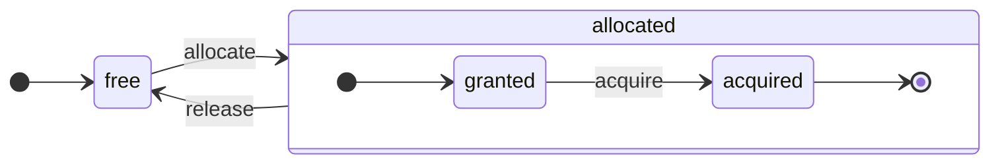

ClickHouse es un verdadero SGBD orientado a columnas. Los datos se almacenan por columnas y, durante la ejecución, se procesan en arrays (vectores o fragmentos de columnas).
Siempre que es posible, las operaciones se ejecutan sobre arrays, en lugar de sobre valores individuales.
Esto se denomina &quot;ejecución vectorizada de consultas&quot; y ayuda a reducir el coste real del procesamiento de datos.

Esta idea no es nueva.
Se remonta a `APL` (un lenguaje de programación, 1957) y a sus descendientes: `A +` (dialecto de APL), `J` (1990), `K` (1993) y `Q` (lenguaje de programación de Kx Systems, 2003).
La programación con arrays se utiliza en el procesamiento de datos científicos. Esta idea tampoco es nueva en las bases de datos relacionales. Por ejemplo, se utiliza en el sistema `VectorWise` (también conocido como Actian Vector Analytic Database de Actian Corporation).

Hay dos enfoques distintos para acelerar el procesamiento de consultas: la ejecución vectorizada de consultas y la generación de código en tiempo de ejecución. Esta última elimina toda indirección y el despacho dinámico. Ninguno de estos enfoques es estrictamente mejor que el otro. La generación de código en tiempo de ejecución puede ser mejor cuando fusiona muchas operaciones, aprovechando así por completo las unidades de ejecución de la CPU y el pipeline. La ejecución vectorizada de consultas puede ser menos práctica porque implica vectores temporales que deben escribirse en la caché y volver a leerse. Si los datos temporales no caben en la caché L2, esto se convierte en un problema. Pero la ejecución vectorizada de consultas aprovecha más fácilmente las capacidades SIMD de la CPU. Un [artículo de investigación](http://15721.courses.cs.cmu.edu/spring2016/papers/p5-sompolski.pdf) escrito por nuestros colegas muestra que es mejor combinar ambos enfoques. ClickHouse utiliza la ejecución vectorizada de consultas y ofrece un soporte inicial limitado para la generación de código en tiempo de ejecución.

  ## Columnas

La interfaz `IColumn` se utiliza para representar columnas en memoria (en realidad, fragmentos de columnas). Esta interfaz proporciona métodos auxiliares para implementar varios operadores relacionales. Casi todas las operaciones son inmutables: no modifican la columna original, sino que crean una nueva columna modificada. Por ejemplo, el método `IColumn :: filter` acepta una máscara de bytes de filtro. Se utiliza para los operadores relacionales `WHERE` y `HAVING`. Otros ejemplos: el método `IColumn :: permute` para dar soporte a `ORDER BY` y el método `IColumn :: cut` para dar soporte a `LIMIT`.

Varias implementaciones de `IColumn` (`ColumnUInt8`, `ColumnString`, etc.) son responsables de la disposición de las columnas en memoria. Esta disposición suele ser un array contiguo. En el caso de las columnas de tipo entero, es simplemente un array contiguo, como `std :: vector`. Para las columnas `String` y `Array`, se usan dos vectores: uno para todos los elementos del array, almacenados de forma contigua, y otro para los desplazamientos al inicio de cada array. También existe `ColumnConst`, que almacena un único valor en memoria, pero tiene el aspecto de una columna.

  ## Field

No obstante, también es posible trabajar con valores individuales. Para representar un valor individual, se usa `Field`. `Field` es simplemente una unión discriminada de `UInt64`, `Int64`, `Float64`, `String` y `Array`. `IColumn` tiene el método `operator []` para obtener el valor n-ésimo como un `Field`, y el método `insert` para añadir un `Field` al final de una columna. Estos métodos no son muy eficientes, porque requieren manejar objetos `Field` temporales que representan un valor individual. Hay métodos más eficientes, como `insertFrom`, `insertRangeFrom`, etc.

`Field` no contiene información suficiente sobre un tipo de dato específico de una tabla. Por ejemplo, `UInt8`, `UInt16`, `UInt32` y `UInt64` se representan todos como `UInt64` en un `Field`.

  ## Abstracciones con fugas

`IColumn` tiene métodos para transformaciones relacionales comunes de los datos, pero no cubren todas las necesidades. Por ejemplo, `ColumnUInt64` no tiene un método para calcular la suma de dos columnas, y `ColumnString` no tiene un método para realizar una búsqueda de subcadenas. Estas innumerables rutinas se implementan fuera de `IColumn`.

Diversas funciones sobre columnas pueden implementarse de forma genérica y poco eficiente usando métodos de `IColumn` para extraer valores `Field`, o de forma especializada aprovechando el conocimiento de la disposición interna en memoria de los datos en una implementación concreta de `IColumn`. Esto se hace haciendo cast de las funciones a un tipo específico de `IColumn` y trabajando directamente con la representación interna. Por ejemplo, `ColumnUInt64` tiene el método `getData`, que devuelve una referencia a un array interno; luego, una rutina independiente lee o llena ese array directamente. Tenemos &quot;abstracciones con fugas&quot; para permitir especializaciones eficientes de diversas rutinas.

  ## Tipos de datos

`IDataType` es responsable de la serialización y la deserialización: de leer y escribir fragmentos de columnas o valores individuales en formato binario o de texto. `IDataType` se corresponde directamente con los tipos de datos de las tablas. Por ejemplo, existen `DataTypeUInt32`, `DataTypeDateTime`, `DataTypeString`, etc.

`IDataType` e `IColumn` solo están relacionados de forma indirecta. Distintos tipos de datos pueden representarse en memoria mediante las mismas implementaciones de `IColumn`. Por ejemplo, `DataTypeUInt32` y `DataTypeDateTime` se representan ambos mediante `ColumnUInt32` o `ColumnConstUInt32`. Además, un mismo tipo de datos puede representarse mediante distintas implementaciones de `IColumn`. Por ejemplo, `DataTypeUInt8` puede representarse mediante `ColumnUInt8` o `ColumnConstUInt8`.

`IDataType` solo almacena metadatos. Por ejemplo, `DataTypeUInt8` no almacena nada en absoluto (excepto el puntero virtual `vptr`) y `DataTypeFixedString` almacena solo `N` (el tamaño de las cadenas de longitud fija).

`IDataType` tiene métodos auxiliares para varios formatos de datos. Algunos ejemplos son métodos para serializar un valor con posible entrecomillado, para serializar un valor para JSON y para serializar un valor como parte del formato XML. No existe una correspondencia directa con los formatos de datos. Por ejemplo, los distintos formatos de datos `Pretty` y `TabSeparated` pueden usar el mismo método auxiliar `serializeTextEscaped` de la interfaz `IDataType`.

  ## Bloque

Un `Block` es un contenedor que representa un subconjunto (fragmento) de una tabla en memoria. No es más que un conjunto de ternas: `(IColumn, IDataType, column name)`. Durante la ejecución de una consulta, los datos se procesan en `Block`s. Si tenemos un `Block`, tenemos datos (en el objeto `IColumn`), tenemos información sobre su tipo (en `IDataType`), que nos indica cómo tratar esa columna, y tenemos el nombre de la columna. Puede ser el nombre original de la columna de la tabla o algún nombre artificial asignado para obtener resultados temporales de cálculos.

Cuando calculamos alguna función sobre columnas de un bloque, añadimos otra columna con el resultado al bloque, y no tocamos las columnas que son argumentos de la función porque las operaciones son inmutables. Más adelante, las columnas innecesarias pueden eliminarse del bloque, pero no modificarse. Esto resulta conveniente para eliminar subexpresiones comunes.

Los bloques se crean para cada fragmento de datos procesado. Tenga en cuenta que, para un mismo tipo de cálculo, los nombres y tipos de las columnas se mantienen iguales en distintos bloques, y solo cambian los datos de las columnas. Es mejor separar los datos del bloque de la cabecera del bloque, porque los bloques pequeños tienen una sobrecarga alta de cadenas temporales al copiar `shared_ptr`s y nombres de columnas.

  ## Procesadores

Vea la descripción en [https://github.com/ClickHouse/ClickHouse/blob/master/src/Processors/IProcessor.h](https://github.com/ClickHouse/ClickHouse/blob/master/src/Processors/IProcessor.h).

  ## Formatos

Los formatos de datos se implementan mediante procesadores.

  ## E/S

Para la entrada/salida orientada a bytes, existen las clases abstractas `ReadBuffer` y `WriteBuffer`. Se utilizan en lugar de los `iostream` de C++. No se preocupe: cualquier proyecto maduro de C++ usa algo distinto de `iostream`, y por buenas razones.

`ReadBuffer` y `WriteBuffer` son simplemente un búfer contiguo y un cursor que apunta a una posición dentro de ese búfer. Las implementaciones pueden poseer o no la memoria del búfer. Hay un método virtual para rellenar el búfer con los datos siguientes (en `ReadBuffer`) o para vaciar el búfer en algún destino (en `WriteBuffer`). Los métodos virtuales rara vez se llaman.

Las implementaciones de `ReadBuffer`/`WriteBuffer` se usan para trabajar con archivos, descriptores de archivo y sockets de red, para implementar compresión (`CompressedWriteBuffer` se inicializa con otro WriteBuffer y realiza la compresión antes de escribir los datos en él) y para otros fines; los nombres `ConcatReadBuffer`, `LimitReadBuffer` y `HashingWriteBuffer` hablan por sí solos.

Read/WriteBuffers solo manejan bytes. Hay funciones en los archivos de cabecera `ReadHelpers` y `WriteHelpers` que ayudan con el formateo de la entrada/salida. Por ejemplo, hay funciones auxiliares para escribir un número en formato decimal.

Veamos qué ocurre cuando quiere escribir un conjunto de resultados en formato `JSON` en stdout.
Tiene un conjunto de resultados listo para recuperarse desde un `QueryPipeline` de tipo pulling.
Primero, crea un `WriteBufferFromFileDescriptor(STDOUT_FILENO)` para escribir bytes en stdout.
A continuación, conecta el resultado del query pipeline a `JSONRowOutputFormat`, que se inicializa con ese `WriteBuffer`, para escribir filas en formato `JSON` en stdout.
Esto puede hacerse mediante el método `complete`, que convierte un `QueryPipeline` de tipo pulling en un `QueryPipeline` completado.
Internamente, `JSONRowOutputFormat` escribirá varios delimitadores JSON y llamará al método `IDataType::serializeTextJSON` con una referencia a `IColumn` y el número de fila como argumentos. En consecuencia, `IDataType::serializeTextJSON` llamará a un método de `WriteHelpers.h`: por ejemplo, `writeText` para tipos numéricos y `writeJSONString` para `DataTypeString`.

  ## Tablas

La interfaz `IStorage` representa tablas. Las distintas implementaciones de esa interfaz corresponden a distintos motores de tabla. Algunos ejemplos son `StorageMergeTree`, `StorageMemory`, etcétera. Las instancias de estas clases son simplemente tablas.

Los métodos principales de `IStorage` son `read` y `write`, junto con otros como `alter`, `rename` y `drop`. El método `read` acepta los siguientes argumentos: un conjunto de columnas para leer de una tabla, la consulta `AST` que se debe tener en cuenta y el número deseado de flujos. Devuelve un `Pipe`.

En la mayoría de los casos, el método `read` solo se encarga de leer las columnas especificadas de una tabla, no de ningún procesamiento posterior de los datos.
Todo el procesamiento posterior de los datos lo gestiona otra parte de la canalización, que queda fuera de la responsabilidad de `IStorage`.

Pero hay excepciones importantes:

* La consulta `AST` se pasa al método `read`, y el motor de tabla puede usarla para determinar el uso de índices y leer menos datos de una tabla.
* A veces, el motor de tabla puede procesar los datos por sí mismo hasta una etapa concreta. Por ejemplo, `StorageDistributed` puede enviar una consulta a servidores remotos, pedirles que procesen los datos hasta una etapa en la que los datos de distintos servidores remotos puedan fusionarse y devolver esos datos preprocesados. Después, el intérprete de consultas termina de procesar los datos.

El método `read` de la tabla puede devolver un `Pipe` compuesto por varios `Processors`. Estos `Processors` pueden leer de una tabla en paralelo.
Después, puedes conectar estos procesadores con otras transformaciones diversas (como la evaluación de expresiones o el filtrado), que pueden calcularse de forma independiente.
Y luego, crear un `QueryPipeline` sobre ellos y ejecutarlo mediante `PipelineExecutor`.

También existen `TableFunction`s. Son funciones que devuelven un objeto temporal `IStorage` para usarlo en la cláusula `FROM` de una consulta.

Para hacerte una idea rápida de cómo implementar tu motor de tabla, fíjate en algo sencillo, como `StorageMemory` o `StorageTinyLog`.

> Como resultado del método `read`, `IStorage` devuelve `QueryProcessingStage`: información sobre qué partes de la consulta ya se han calculado dentro del almacenamiento.

  ## Analizadores sintácticos

Un analizador sintáctico de descenso recursivo escrito manualmente analiza una consulta. Por ejemplo, `ParserSelectQuery` simplemente llama de forma recursiva a los analizadores sintácticos subyacentes de las distintas partes de la consulta. Los analizadores sintácticos crean un `AST`. El `AST` se representa mediante nodos, que son instancias de `IAST`.

> No se usan generadores de analizadores sintácticos por razones históricas.

  ## Intérpretes

Los intérpretes se encargan de crear el query execution pipeline a partir de un AST. Hay intérpretes simples, como `InterpreterExistsQuery` e `InterpreterDropQuery`, así como otros más sofisticados, como `InterpreterSelectQuery`.

El query execution pipeline es una combinación de procesadores que pueden consumir y producir fragmentos (conjuntos de columnas con tipos específicos).
Un procesador se comunica a través de puertos y puede tener varios puertos de entrada y varios puertos de salida.
Puede encontrarse una descripción más detallada en [src/Processors/IProcessor.h](https://github.com/ClickHouse/ClickHouse/blob/master/src/Processors/IProcessor.h).

Por ejemplo, el resultado de interpretar la consulta `SELECT` es un `QueryPipeline` de tipo &quot;pulling&quot; que tiene un puerto de salida especial desde el que se puede leer el conjunto de resultados.
El resultado de la consulta `INSERT` es un `QueryPipeline` de tipo &quot;pushing&quot;, con un puerto de entrada para escribir los datos que se van a insertar.
Y el resultado de interpretar la consulta `INSERT SELECT` es un `QueryPipeline` &quot;completado&quot; que no tiene entradas ni salidas, pero copia datos de `SELECT` a `INSERT` simultáneamente.

`InterpreterSelectQuery` utiliza la maquinaria de `ExpressionAnalyzer` y `ExpressionActions` para el análisis y las transformaciones de consultas. Aquí es donde se realiza la mayor parte de las optimizaciones de consultas basadas en reglas. `ExpressionAnalyzer` es bastante desordenado y debería reescribirse: varias transformaciones y optimizaciones de consultas deberían extraerse en clases separadas para permitir transformaciones modulares de la consulta.

Para resolver los problemas existentes en los intérpretes, se ha desarrollado un nuevo `InterpreterSelectQueryAnalyzer`. Esta es una nueva versión de `InterpreterSelectQuery` que no utiliza `ExpressionAnalyzer` e introduce una capa adicional de abstracción entre `AST` y `QueryPipeline`, llamada `QueryTree`. Está totalmente listo para usarse en producción, pero, por si acaso, puede desactivarse estableciendo el valor de la configuración `enable_analyzer` en `false`.

  ## Funciones

Hay funciones ordinarias y funciones de agregación. Para las funciones de agregación, consulte la sección siguiente.

Las funciones ordinarias no cambian el número de filas: funcionan como si procesaran cada fila de forma independiente. En realidad, las funciones no se llaman para filas individuales, sino sobre `Block` de datos para implementar la ejecución vectorizada de consultas.

Hay algunas funciones diversas, como [blockSize](/es/reference/functions/regular-functions/other-functions#blockSize), [rowNumberInBlock](/es/reference/functions/regular-functions/other-functions#rowNumberInBlock) y [runningAccumulate](/es/reference/functions/regular-functions/other-functions#runningAccumulate), que aprovechan el procesamiento por bloques y rompen la independencia de las filas.

ClickHouse tiene tipado fuerte, por lo que no hay conversión implícita de tipos. Si una función no admite una combinación específica de tipos, lanza una excepción. Pero las funciones pueden funcionar (estar sobrecargadas) para muchas combinaciones distintas de tipos. Por ejemplo, la función `plus` (para implementar el operador `+`) funciona con cualquier combinación de tipos numéricos: `UInt8` + `Float32`, `UInt16` + `Int8`, etcétera. Además, algunas funciones variádicas pueden aceptar cualquier número de argumentos, como la función `concat`.

Implementar una función puede ser algo incómodo porque realiza un despacho explícito de los tipos de datos admitidos y de las `IColumns` admitidas. Por ejemplo, la función `plus` tiene código generado mediante la instanciación de una plantilla de C++ para cada combinación de tipos numéricos, y para argumentos izquierdo y derecho constantes o no constantes.

Es un lugar excelente para implementar generación de código en tiempo de ejecución y evitar así la proliferación de código de plantillas. Además, permite añadir funciones fusionadas, como fused multiply-add, o realizar varias comparaciones en una sola iteración del bucle.

Debido a la ejecución vectorizada de consultas, las funciones no usan evaluación de cortocircuito. Por ejemplo, si escribe `WHERE f(x) AND g(y)`, se calculan ambos lados, incluso en las filas en las que `f(x)` es cero (excepto cuando `f(x)` es una expresión constante cero). Pero si la selectividad de la condición `f(x)` es alta, y el cálculo de `f(x)` es mucho más barato que el de `g(y)`, es mejor implementar un cálculo en varias pasadas. Primero calcularía `f(x)`, luego filtraría las columnas según el resultado y después calcularía `g(y)` solo para fragmentos de datos más pequeños y filtrados.

  ## Funciones de agregación

Las funciones de agregación son funciones con estado. Acumulan los valores que se les pasan en un estado y permiten obtener resultados a partir de él. Se gestionan mediante la interfaz `IAggregateFunction`. Los estados pueden ser bastante simples (el estado de `AggregateFunctionCount` es solo un valor `UInt64`) o bastante complejos (el estado de `AggregateFunctionUniqCombined` es una combinación de un array lineal, una tabla hash y una estructura de datos probabilística `HyperLogLog`).

Los estados se asignan en `Arena` (un pool de memoria) para gestionar varios estados mientras se ejecuta una consulta `GROUP BY` de alta cardinalidad. Los estados pueden tener un constructor y un destructor no triviales: por ejemplo, los estados de agregación complejos pueden asignar memoria adicional por sí mismos. Esto requiere prestar cierta atención a la creación y destrucción de los estados, así como a transferir correctamente su propiedad y el orden de su destrucción.

Los estados de agregación pueden serializarse y deserializarse para transmitirse por la red durante la ejecución distribuida de consultas o para escribirse en disco cuando no hay suficiente RAM. Incluso pueden almacenarse en una tabla con `DataTypeAggregateFunction` para permitir la agregación incremental de datos.

> El formato de datos serializados para los estados de las funciones de agregación no tiene versionado por ahora. No pasa nada si los estados de agregación solo se almacenan temporalmente. Pero tenemos el motor de tabla `AggregatingMergeTree` para la agregación incremental, y ya hay usuarios que lo utilizan en producción. Por eso, en el futuro será necesario mantener la compatibilidad con versiones anteriores al cambiar el formato serializado de cualquier función de agregación.

  ## Servidor

El servidor implementa varias interfaces:

* Una interfaz HTTP para cualquier cliente externo.
* Una interfaz TCP para el cliente nativo de ClickHouse y para la comunicación entre servidores durante la ejecución distribuida de consultas.
* Una interfaz para transferir datos para la replicación.

Internamente, no es más que un servidor multihilo básico, sin corrutinas ni fibras. Como el servidor no está diseñado para procesar una alta tasa de consultas simples, sino una tasa relativamente baja de consultas complejas, cada una de ellas puede procesar una enorme cantidad de datos para análisis.

El servidor inicializa la clase `Context` con el entorno necesario para la ejecución de consultas: la lista de bases de datos disponibles, usuarios y derechos de acceso, la configuración, los clústeres, la lista de procesos, el registro de consultas, etc. Los intérpretes usan este entorno.

Mantenemos compatibilidad total hacia atrás y hacia adelante para el protocolo TCP del servidor: los clientes antiguos pueden comunicarse con servidores nuevos, y los clientes nuevos pueden comunicarse con servidores antiguos. Pero no queremos mantenerla para siempre, y retiramos el soporte para las versiones antiguas después de aproximadamente un año.

<Note>
  Para la mayoría de las aplicaciones externas, recomendamos usar la interfaz HTTP porque es simple y fácil de usar. El protocolo TCP está más estrechamente vinculado a las estructuras de datos internas: usa un formato interno para pasar bloques de datos y un esquema de enmarcado propio para datos comprimidos.
</Note>

  ## Configuración

ClickHouse Server se basa en POCO C++ Libraries y utiliza `Poco::Util::AbstractConfiguration` para representar su configuración. La configuración la almacena la clase `Poco::Util::ServerApplication`, de la que hereda la clase `DaemonBase`, y esta, a su vez, es heredada por la clase `DB::Server`, que implementa el propio clickhouse-server. Por lo tanto, se puede acceder a la configuración mediante el método `ServerApplication::config()`.

La configuración se lee desde varios archivos (en formato XML o YAML) y la clase `ConfigProcessor` la combina en una sola `AbstractConfiguration`. La configuración se carga al iniciar el servidor y puede volver a cargarse más adelante si alguno de los archivos de configuración se actualiza, elimina o agrega. La clase `ConfigReloader` es responsable de supervisar periódicamente estos cambios y también del procedimiento de recarga. La consulta `SYSTEM RELOAD CONFIG` también desencadena la recarga de la configuración.

En las consultas y subsistemas distintos de `Server`, se puede acceder a la configuración mediante el método `Context::getConfigRef()`. Todo subsistema que pueda recargar su configuración sin reiniciar el servidor debe registrarse en el callback de recarga en el método `Server::main()`. Tenga en cuenta que, si la configuración más reciente contiene un error, la mayoría de los subsistemas ignorarán la nueva configuración, registrarán mensajes de advertencia y seguirán funcionando con la configuración cargada anteriormente. Debido a la naturaleza de `AbstractConfiguration`, no es posible pasar una referencia a una sección específica, por lo que normalmente se usa `String config_prefix` en su lugar.

  ### Contexto

ClickHouse administra la configuración mediante una jerarquía de contextos:

* **Contexto global** - configuración de todo el servidor definida mediante archivos de configuración
* **Contexto de sesión** - configuración de la sesión del usuario procedente de perfiles, la configuración del usuario y comandos SET
* **Contexto de consulta** - configuración a nivel de consulta procedente de la cláusula SETTINGS
* **Contexto en segundo plano** - configuración de todo el servidor para operaciones en segundo plano (Mutate, Merge) definida mediante el perfil &#39;background&#39;

Al programar una operación (consultas, mutaciones, etc.), el servidor crea el contexto específico combinando la configuración en el siguiente orden (las secciones posteriores sobrescriben las anteriores):

1. Valores predeterminados globales
2. Configuración global
3. Configuración del perfil (de la sección `<profiles>`)
4. Configuración del usuario (de la sección `<users>`)
5. Configuración de la sesión (del comando SET)
6. Configuración de la consulta (de la cláusula SETTINGS)

<Note>
  Las operaciones en segundo plano pueden configurarse mediante la configuración global y la del perfil &#39;background&#39;; la configuración de sesión y la de consulta no tienen efecto en este caso. Si no se proporciona ninguna configuración explícita, la configuración se heredará del contexto global. El nombre de perfil predeterminado para estas operaciones es &#39;background&#39;, aunque puede sustituirse mediante la configuración del servidor `background_profile`.
</Note>

  ## Hilos y jobs

Para ejecutar consultas y realizar actividades auxiliares, ClickHouse asigna hilos desde uno de los pools de hilos para evitar crear y destruir hilos con frecuencia. Hay varios pools de hilos, que se seleccionan según el propósito y la estructura de un job:

* Pool del servidor para las sesiones de cliente entrantes.
* Pool de hilos global para jobs de propósito general, actividades en segundo plano e hilos standalone.
* Pool de hilos de IO para jobs que en su mayor parte están bloqueados por alguna operación de IO y no son intensivos en CPU.
* Background pools para tasks periódicas.
* Pools para tasks expropiables que pueden dividirse en pasos.

El pool del servidor es una instancia de la clase `Poco::ThreadPool` definida en el método `Server::main()`. Puede tener como máximo `max_connection` hilos. Cada hilo está dedicado a una única connection activa.

El pool de hilos global es la clase singleton `GlobalThreadPool`. Para asignar un hilo desde él, se usa `ThreadFromGlobalPool`. Tiene una interface similar a `std::thread`, pero toma un hilo del pool global y realiza toda la inicialización necesaria. Se configura con los siguientes settings:

* `max_thread_pool_size` - límite del número de hilos en el pool.
* `max_thread_pool_free_size` - límite del número de hilos idle en espera de nuevos jobs.
* `thread_pool_queue_size` - límite del número de jobs programados.

El pool global es universal y todos los pools descritos a continuación se implementan sobre él. Puede entenderse como una jerarquía de pools. Cualquier pool especializado toma sus hilos del pool global mediante la clase `ThreadPool`. Así, el propósito principal de cualquier pool especializado es aplicar un límite al número de jobs simultáneos y planificar jobs. Si hay más jobs programados que hilos en un pool, `ThreadPool` acumula los jobs en una queue con prioridades. Cada job tiene una prioridad entera. La prioridad predeterminada es cero. Todos los jobs con valores de prioridad más altos se inician antes que cualquier job con un valor de prioridad más bajo. Pero no hay diferencia entre los jobs que ya se están ejecutando, por lo que la prioridad solo importa cuando el pool está sobrecargado.

El pool de hilos de IO se implementa como un `ThreadPool` simple accesible mediante el método `IOThreadPool::get()`. Se configura de la misma forma que el pool global con los settings `max_io_thread_pool_size`, `max_io_thread_pool_free_size` e `io_thread_pool_queue_size`. El propósito principal del pool de hilos de IO es evitar agotar el pool global con jobs de IO, lo que podría impedir que las consultas aprovechen por completo la CPU. Backup en S3 realiza una cantidad significativa de operaciones de IO y, para evitar el impacto en las consultas interactivas, existe un `BackupsIOThreadPool` independiente configurado con los settings `max_backups_io_thread_pool_size`, `max_backups_io_thread_pool_free_size` y `backups_io_thread_pool_queue_size`.

Para la ejecución de tasks periódicas existe la clase `BackgroundSchedulePool`. Puede registrar tasks usando objetos `BackgroundSchedulePool::TaskHolder`, y el pool garantiza que ninguna task ejecute dos jobs al mismo tiempo. También permite posponer la ejecución de una task hasta un instante específico en el futuro o desactivar temporalmente la task. El `Context` global proporciona algunas instancias de esta clase para distintos propósitos. Para tasks de propósito general se usa `Context::getSchedulePool()`.

También hay pools de hilos especializados para tasks expropiables. Una task `IExecutableTask` de este tipo puede dividirse en una secuencia ordenada de jobs, llamados pasos. Para planificar estas tasks de una manera que permita priorizar las tasks cortas sobre las largas, se usa `MergeTreeBackgroundExecutor`. Como su nombre indica, se usa para operaciones en segundo plano relacionadas con MergeTree, como merges, mutations, fetches y moves. Las instancias del pool están disponibles mediante `Context::getCommonExecutor()` y otros métodos similares.

Sin importar qué pool se use para un job, al inicio se crea una instancia de `ThreadStatus` para ese job. Encapsula toda la información por hilo: id del hilo, Query id, contadores de rendimiento, consumo de recursos y muchos otros datos útiles. El job puede acceder a ella mediante el puntero local del hilo con la llamada `CurrentThread::get()`, por lo que no es necesario pasarla a cada función.

Si el hilo está relacionado con la ejecución de consultas, entonces lo más importante asociado a `ThreadStatus` es el contexto de consulta `ContextPtr`. Cada consulta tiene su hilo maestro en el pool del servidor. El hilo maestro realiza la asociación manteniendo un objeto `ThreadStatus::QueryScope query_scope(query_context)`. El hilo maestro también crea un grupo de hilos representado por el objeto `ThreadGroupStatus`. Cada hilo adicional que se asigna durante la ejecución de esta consulta se adjunta a su grupo de hilos mediante la llamada `CurrentThread::attachTo(thread_group)`. Los grupos de hilos se utilizan para agregar contadores de eventos de perfil y rastrear el consumo de memoria de todos los hilos dedicados a una sola task (consulte las clases `MemoryTracker` y `ProfileEvents::Counters` para obtener más información).

  ## Control de concurrencia

Una consulta que puede paralelizarse usa la configuración `max_threads` para autolimitarse. El valor predeterminado de esta configuración se elige de forma que una sola consulta pueda utilizar todos los núcleos de CPU de la mejor manera posible. Pero ¿qué ocurre si hay varias consultas concurrentes y cada una usa el valor predeterminado de `max_threads`? En ese caso, las consultas compartirán los recursos de CPU. El SO garantizará un reparto equitativo alternando constantemente entre hilos, lo que introduce cierta penalización en el rendimiento. `ConcurrencyControl` ayuda a mitigar esta penalización y a evitar la asignación de demasiados hilos. La configuración `concurrent_threads_soft_limit_num` se usa para limitar cuántos hilos concurrentes pueden asignarse antes de aplicar cierta presión sobre la CPU.

Se introduce la noción de `slot` de CPU. Un slot es una unidad de concurrencia: para ejecutar un hilo, una consulta tiene que adquirir previamente un slot y liberarlo cuando el hilo se detiene. El número de slots está limitado globalmente en el servidor. Varias consultas concurrentes compiten por slots de CPU si la demanda total supera el número total de slots. `ConcurrencyControl` se encarga de resolver esta competencia mediante una planificación equitativa de los slots de CPU.

Cada slot puede verse como una máquina de estados independiente con los siguientes estados:

* `free`: el slot está disponible para ser asignado a cualquier consulta.
* `granted`: el slot está `allocated` a una consulta específica, pero todavía no ha sido adquirido por ningún hilo.
* `acquired`: el slot está `allocated` a una consulta específica y ha sido adquirido por un hilo.

Tenga en cuenta que un slot `allocated` puede estar en dos estados diferentes: `granted` y `acquired`. El primero es un estado transitorio, que en realidad debería ser breve (desde el instante en que un slot se asigna a una consulta hasta el momento en que cualquier hilo de esa consulta ejecuta el procedimiento de escalado ascendente).

La API de `ConcurrencyControl` consta de las siguientes funciones:

1. Crear una asignación de recursos para una consulta: `auto slots = ConcurrencyControl::instance().allocate(1, max_threads);`. Asignará como mínimo 1 y como máximo `max_threads` slots. Tenga en cuenta que el primer slot se concede de inmediato, pero los slots restantes pueden concederse más adelante. Por lo tanto, el límite es flexible, ya que cada consulta obtendrá al menos un hilo.
2. Para cada hilo, debe adquirirse un slot de una asignación: `while (auto slot = slots->tryAcquire()) spawnThread([slot = std::move(slot)] { ... });`.
3. Actualizar la cantidad total de slots: `ConcurrencyControl::setMaxConcurrency(concurrent_threads_soft_limit_num)`. Puede hacerse en tiempo de ejecución, sin reiniciar el servidor.

Esta API permite que las consultas comiencen con al menos un hilo (cuando hay presión sobre la CPU) y luego aumenten hasta `max_threads`.

  ## Ejecución distribuida de consultas

Los servidores de una configuración en clúster son, en su mayoría, independientes. Puede crear una tabla `Distributed` en uno o en todos los servidores de un clúster. La tabla `Distributed` no almacena datos por sí sola; solo proporciona una &quot;vista&quot; de todas las tablas locales de varios nodos de un clúster. Cuando se hace un SELECT sobre una tabla `Distributed`, esta reescribe la consulta, elige nodos remotos según la configuración de balanceo de carga y les envía la consulta. La tabla `Distributed` solicita a los servidores remotos que procesen la consulta solo hasta una etapa en la que los resultados intermedios de distintos servidores puedan fusionarse. Luego recibe esos resultados intermedios y los fusiona. La tabla distribuida intenta delegar la mayor cantidad de trabajo posible en los servidores remotos y evita enviar muchos datos intermedios por la red.

La situación se complica cuando hay subconsultas en cláusulas IN o JOIN, y cada una de ellas usa una tabla `Distributed`. Tenemos distintas estrategias para ejecutar estas consultas.

No existe un plan de consulta global para la ejecución distribuida de consultas. Cada nodo tiene su plan de consulta local para la parte del trabajo que le corresponde. Solo disponemos de una ejecución distribuida de consultas simple, de una sola pasada: enviamos consultas a nodos remotos y luego fusionamos los resultados. Pero esto no es viable para consultas complejas con `GROUP BY` de alta cardinalidad o con una gran cantidad de datos temporales para JOIN. En esos casos, necesitamos &quot;redistribuir&quot; datos entre servidores, lo que requiere coordinación adicional. ClickHouse no admite ese tipo de ejecución de consultas, y debemos seguir trabajando en ello.

  ## MergeTree

`MergeTree` es una familia de motores de almacenamiento que admite indexación por clave primaria. La clave primaria puede ser una tupla arbitraria de columnas o expresiones. Los datos de una tabla `MergeTree` se almacenan en &quot;partes&quot;. Cada parte almacena los datos en el orden de la clave primaria, por lo que los datos quedan ordenados lexicográficamente según la tupla de la clave primaria. Todas las columnas de la tabla se almacenan en archivos `column.bin` separados dentro de estas partes. Los archivos constan de bloques comprimidos. Cada bloque suele contener entre 64 KB y 1 MB de datos sin comprimir, según el tamaño medio de los valores. Los bloques constan de valores de columna colocados de forma contigua, uno detrás de otro. Los valores de columna están en el mismo orden en cada columna (la clave primaria define el orden), por lo que, al recorrer varias columnas, se obtienen los valores de las filas correspondientes.

La propia clave primaria es &quot;dispersa&quot;. No apunta a cada fila individual, sino solo a algunos rangos de datos. Un archivo `primary.idx` independiente contiene el valor de la clave primaria para cada N-ésima fila, donde N se denomina `index_granularity` (normalmente, N = 8192). Además, para cada columna, hay archivos `column.mrk` con &quot;marcas&quot;, que son desplazamientos hasta cada N-ésima fila del archivo de datos. Cada marca es un par: el desplazamiento en el archivo hasta el inicio del bloque comprimido y el desplazamiento en el bloque descomprimido hasta el inicio de los datos. Normalmente, los bloques comprimidos están alineados por marcas y el desplazamiento en el bloque descomprimido es cero. Los datos de `primary.idx` siempre residen en memoria, y los datos de los archivos `column.mrk` se mantienen en caché.

Cuando vamos a leer algo de una parte en `MergeTree`, examinamos los datos de `primary.idx` y localizamos los rangos que podrían contener los datos solicitados; después examinamos los datos de `column.mrk` y calculamos los desplazamientos para determinar dónde empezar a leer esos rangos. Debido a esta naturaleza dispersa, es posible que se lean datos de más. ClickHouse no es adecuado para una carga alta de consultas puntuales simples, porque debe leerse el rango completo con `index_granularity` filas para cada clave, y debe descomprimirse el bloque comprimido completo de cada columna. Hicimos el índice disperso porque debemos poder mantener billones de filas por servidor sin un consumo de memoria apreciable para el índice. Además, como la clave primaria es dispersa, no es única: no puede comprobar la existencia de la clave en la tabla en el momento del `INSERT`. Puede haber muchas filas con la misma clave en una tabla.

Cuando se hace `INSERT` de un conjunto de datos en `MergeTree`, ese conjunto se ordena según la clave primaria y forma una nueva parte. Hay hilos en segundo plano que seleccionan periódicamente algunas partes y las fusionan en una sola parte ordenada para mantener el número de partes relativamente bajo. Por eso se llama `MergeTree`. Por supuesto, la fusión provoca &quot;amplificación de escritura&quot;. Todas las partes son inmutables: solo se crean y se eliminan, pero no se modifican. Cuando se ejecuta SELECT, se mantiene una instantánea de la tabla (un conjunto de partes). Después de la fusión, también conservamos las partes antiguas durante algún tiempo para facilitar la recuperación tras un fallo, de modo que, si vemos que alguna parte fusionada probablemente está dañada, podemos reemplazarla por sus partes de origen.

`MergeTree` no es un árbol LSM porque no contiene MEMTABLE ni LOG: los datos insertados se escriben directamente en el sistema de archivos. Este comportamiento hace que MergeTree sea mucho más adecuado para insertar datos en lotes. Por lo tanto, insertar con frecuencia pequeñas cantidades de filas no es ideal para MergeTree. Por ejemplo, un par de filas por segundo está bien, pero hacerlo mil veces por segundo no es óptimo para MergeTree. Sin embargo, existe un modo de async insert para inserciones pequeñas que permite superar esta limitación. Lo hicimos así por simplicidad y porque ya insertamos datos en lotes en nuestras aplicaciones

Hay motores MergeTree que realizan trabajo adicional durante las fusiones en segundo plano. Algunos ejemplos son `CollapsingMergeTree` y `AggregatingMergeTree`. Esto puede considerarse una compatibilidad especial para las actualizaciones. Tenga en cuenta que no se trata de actualizaciones reales porque normalmente los usuarios no tienen control sobre el momento en que se ejecutan las fusiones en segundo plano, y los datos de una tabla `MergeTree` casi siempre se almacenan en más de una parte, no en una forma completamente fusionada.

  ## Replicación

La replicación en ClickHouse puede configurarse por tabla. Puedes tener algunas tablas replicadas y otras no replicadas en el mismo servidor. También puedes tener tablas replicadas de distintas formas, por ejemplo, una tabla con replicación de dos factores y otra con replicación de tres factores.

La replicación se implementa en el motor de almacenamiento `ReplicatedMergeTree`. La ruta en `ZooKeeper` se especifica como parámetro del motor de almacenamiento. Todas las tablas con la misma ruta en `ZooKeeper` se convierten en réplicas entre sí: sincronizan sus datos y mantienen la consistencia. Las réplicas pueden añadirse y eliminarse dinámicamente simplemente creando o eliminando una tabla.

La replicación utiliza un esquema multimaestro asíncrono. Puedes insertar datos en cualquier réplica que tenga una sesión con `ZooKeeper`, y los datos se replican de forma asíncrona a todas las demás réplicas. Como ClickHouse no admite UPDATEs, la replicación no genera conflictos. Como, de forma predeterminada, no hay confirmación por quórum de las inserciones, los datos recién insertados podrían perderse si falla un nodo. El quórum de inserción puede habilitarse mediante la configuración `insert_quorum`.

Los metadatos de la replicación se almacenan en ZooKeeper. Hay un registro de replicación que enumera las acciones que deben realizarse. Las acciones son: obtener una parte, fusionar partes, eliminar una partición, etcétera. Cada réplica copia el registro de replicación en su cola y luego ejecuta las acciones de esa cola. Por ejemplo, al insertar, se crea en el registro la acción &quot;obtener la parte&quot;, y cada réplica descarga esa parte. Las fusiones se coordinan entre réplicas para obtener resultados idénticos byte a byte. Todas las partes se fusionan de la misma manera en todas las réplicas. Uno de los líderes inicia primero una nueva fusión y escribe las acciones de &quot;fusionar partes&quot; en el registro. Varias réplicas (o incluso todas) pueden ser líderes al mismo tiempo. Se puede impedir que una réplica se convierta en líder mediante la configuración `replicated_can_become_leader` de `merge_tree`. Los líderes son responsables de programar las fusiones en segundo plano.

La replicación es física: entre nodos solo se transfieren partes comprimidas, no consultas. En la mayoría de los casos, las fusiones se procesan de forma independiente en cada réplica para reducir los costes de red al evitar la amplificación de red. Las partes fusionadas de gran tamaño se envían por la red solo en casos de retraso de replicación significativo.

Además, cada réplica almacena su estado en ZooKeeper como el conjunto de partes y sus sumas de comprobación. Cuando el estado en el sistema de archivos local diverge del estado de referencia en ZooKeeper, la réplica restaura su consistencia descargando de otras réplicas las partes ausentes o dañadas. Cuando hay datos inesperados o dañados en el sistema de archivos local, ClickHouse no los elimina, sino que los mueve a un directorio independiente y se olvida de ellos.

<Note>
  El clúster de ClickHouse consta de segmentos independientes, y cada segmento consta de réplicas. El clúster **no es elástico**, por lo que, después de añadir un nuevo segmento, los datos no se reequilibran automáticamente entre segmentos. En su lugar, se asume que la carga del clúster debe ajustarse de forma desigual. Esta implementación te da más control y es adecuada para clústeres relativamente pequeños, como los de decenas de nodos. Pero para clústeres con cientos de nodos, como los que usamos en producción, este enfoque se convierte en un inconveniente importante. Deberíamos implementar un motor de tabla que abarque todo el clúster con regiones replicadas dinámicamente que puedan dividirse y equilibrarse automáticamente entre clústeres.
</Note>