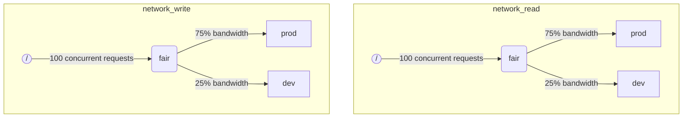

Lorsque ClickHouse exécute plusieurs requêtes simultanément, elles peuvent utiliser des ressources partagées (par exemple, les disques et les cœurs de CPU). Des contraintes et des politiques d’ordonnancement peuvent être appliquées pour réguler l’utilisation et le partage des ressources entre différentes charges de travail. Une hiérarchie d’ordonnancement commune peut être configurée pour toutes les ressources. La racine de cette hiérarchie représente les ressources partagées, tandis que les feuilles correspondent à des charges de travail spécifiques, où sont placées les requêtes qui dépassent la capacité des ressources.

<Note>
  Actuellement, les [E/S de disque distantes](#disk_config) et le [CPU](#cpu_scheduling) peuvent être ordonnancés selon la méthode décrite. Pour des limites de mémoire flexibles, voir [surallocation de mémoire](/fr/concepts/features/configuration/settings/memory-overcommit)
</Note>

<div id="disk_config">
  ## Configuration du disque
</div>

Pour activer l’ordonnancement des charges IO pour un disque donné, vous devez créer des ressources de lecture et d’écriture pour les accès WRITE et READ :

```sql
CREATE RESOURCE resource_name (WRITE DISK disk_name, READ DISK disk_name)
-- or
CREATE RESOURCE read_resource_name (WRITE DISK write_disk_name)
CREATE RESOURCE write_resource_name (READ DISK read_disk_name)
```

Une ressource peut être utilisée pour autant de disques que nécessaire, pour READ ou WRITE, ou pour READ et WRITE à la fois. Il existe une syntaxe permettant d’utiliser une ressource pour tous les disques :

```sql
CREATE RESOURCE all_io (READ ANY DISK, WRITE ANY DISK);
```

Une autre façon d’indiquer quels disques sont utilisés par une ressource consiste à utiliser le `storage_configuration` du serveur :

<Warning>
  La planification des workloads via la configuration ClickHouse est obsolète. Utilisez plutôt la syntaxe SQL.
</Warning>

Pour activer la planification des E/S pour un disque spécifique, vous devez spécifier `read_resource` et/ou `write_resource` dans la configuration de stockage. Cela indique à ClickHouse quelle ressource utiliser pour chaque requête de lecture et d’écriture sur le disque concerné. Les ressources de lecture et d’écriture peuvent faire référence au même nom de ressource, ce qui est utile pour les SSD locaux ou les HDD. Plusieurs disques différents peuvent également faire référence à la même ressource, ce qui est utile pour les disques distants si vous souhaitez permettre une répartition équitable de la bande passante réseau entre, par exemple, les workloads &quot;production&quot; et &quot;development&quot;.

Exemple :

```xml
<clickhouse>
    <storage_configuration>
        ...
        <disks>
            <s3>
                <type>s3</type>
                <endpoint>https://clickhouse-public-datasets.s3.amazonaws.com/my-bucket/root-path/</endpoint>
                <access_key_id>your_access_key_id</access_key_id>
                <secret_access_key>your_secret_access_key</secret_access_key>
                <read_resource>network_read</read_resource>
                <write_resource>network_write</write_resource>
            </s3>
        </disks>
        <policies>
            <s3_main>
                <volumes>
                    <main>
                        <disk>s3</disk>
                    </main>
                </volumes>
            </s3_main>
        </policies>
    </storage_configuration>
</clickhouse>
```

Notez que les options de configuration du serveur priment sur la méthode SQL de définition des ressources.

<div id="workload_markup">
  ## Marquage des charges de travail
</div>

Les requêtes peuvent être marquées à l’aide du paramètre `workload` pour distinguer différentes charges de travail. Si `workload` n’est pas défini, la valeur &quot;default&quot; est utilisée. Notez que vous pouvez également spécifier une autre valeur à l’aide de profils de paramètres. Des contraintes sur les paramètres peuvent être utilisées pour rendre `workload` constant si vous souhaitez que toutes les requêtes d’un utilisateur soient marquées avec une valeur fixe du paramètre `workload`.

Il est possible d’attribuer un paramètre `workload` aux activités en arrière-plan. Les merges et les mutations utilisent respectivement les paramètres serveur `merge_workload` et `mutation_workload`. Ces valeurs peuvent également être redéfinies pour des tables spécifiques à l’aide des paramètres MergeTree `merge_workload` et `mutation_workload`

Prenons l’exemple d’un système avec deux charges de travail différentes : &quot;production&quot; et &quot;développement&quot;.

```sql
SELECT count() FROM my_table WHERE value = 42 SETTINGS workload = 'production'
SELECT count() FROM my_table WHERE value = 13 SETTINGS workload = 'development'
```

<div id="hierarchy">
  ## Hiérarchie d’ordonnancement des ressources
</div>

Du point de vue du sous-système d’ordonnancement, une ressource correspond à une hiérarchie de nœuds d’ordonnancement.



<Warning>
  L’ordonnancement des workloads à l’aide de la configuration de ClickHouse est obsolète. Il faut utiliser la syntaxe SQL à la place. La syntaxe SQL crée automatiquement tous les nœuds d’ordonnancement nécessaires, et la description ci-dessous des nœuds d’ordonnancement doit être considérée comme des détails d’implémentation de bas niveau, accessibles via la table [system.scheduler](/fr/reference/system-tables/scheduler).
</Warning>

**Types de nœuds possibles :**

* `inflight_limit` (constraint) - bloque si le nombre de requêtes concurrentes en vol dépasse `max_requests`, ou si leur coût total dépasse `max_cost` ; doit avoir un seul enfant.
* `bandwidth_limit` (constraint) - bloque si la bande passante actuelle dépasse `max_speed` (0 signifie illimité) ou si le burst dépasse `max_burst` (par défaut, égal à `max_speed`) ; doit avoir un seul enfant.
* `fair` (policy) - sélectionne la prochaine requête à traiter dans l’un de ses nœuds enfants selon l’équité max-min ; les nœuds enfants peuvent spécifier `weight` (la valeur par défaut est 1).
* `priority` (policy) - sélectionne la prochaine requête à traiter dans l’un de ses nœuds enfants selon des priorités statiques (une valeur plus faible signifie une priorité plus élevée) ; les nœuds enfants peuvent spécifier `priority` (la valeur par défaut est 0).
* `fifo` (queue) - feuille de la hiérarchie capable de stocker les requêtes qui dépassent la capacité de la ressource.

Pour pouvoir utiliser toute la capacité de la ressource sous-jacente, vous devez utiliser `inflight_limit`. Notez qu’un nombre trop faible de `max_requests` ou une valeur trop faible de `max_cost` peut entraîner une utilisation incomplète de la ressource, tandis que des valeurs trop élevées peuvent entraîner des files d’attente vides dans le scheduler, ce qui fera que les policies seront ignorées (manque d’équité ou priorités ignorées) dans le sous-arbre. En revanche, si vous voulez protéger les ressources contre une utilisation excessive, vous devez utiliser `bandwidth_limit`. Il applique une limitation lorsque la quantité de ressources consommée en `duration` secondes dépasse `max_burst + max_speed * duration` octets. Deux nœuds `bandwidth_limit` sur la même ressource peuvent être utilisés pour limiter la bande passante de crête sur de courts intervalles et la bande passante moyenne sur des intervalles plus longs.

L’exemple suivant montre comment définir les hiérarchies d’ordonnancement des IO illustrées dans l’image :

```xml
<clickhouse>
    <resources>
        <network_read>
            <node path="/">
                <type>inflight_limit</type>
                <max_requests>100</max_requests>
            </node>
            <node path="/fair">
                <type>fair</type>
            </node>
            <node path="/fair/prod">
                <type>fifo</type>
                <weight>3</weight>
            </node>
            <node path="/fair/dev">
                <type>fifo</type>
            </node>
        </network_read>
        <network_write>
            <node path="/">
                <type>inflight_limit</type>
                <max_requests>100</max_requests>
            </node>
            <node path="/fair">
                <type>fair</type>
            </node>
            <node path="/fair/prod">
                <type>fifo</type>
                <weight>3</weight>
            </node>
            <node path="/fair/dev">
                <type>fifo</type>
            </node>
        </network_write>
    </resources>
</clickhouse>
```

<div id="workload_classifiers">
  ## Classificateurs de workloads
</div>

<Warning>
  Le Workload scheduling via la configuration ClickHouse est obsolète. Utilisez plutôt la syntaxe SQL. Les classificateurs sont créés automatiquement lors de l&#39;utilisation de la syntaxe SQL.
</Warning>

Les classificateurs de workloads servent à définir la correspondance entre le `workload` spécifié par une requête et les files d&#39;attente terminales à utiliser pour certaines ressources. Pour le moment, la classification des workloads reste simple : seule une correspondance statique est disponible.

Exemple :

```xml
<clickhouse>
    <workload_classifiers>
        <production>
            <network_read>/fair/prod</network_read>
            <network_write>/fair/prod</network_write>
        </production>
        <development>
            <network_read>/fair/dev</network_read>
            <network_write>/fair/dev</network_write>
        </development>
        <default>
            <network_read>/fair/dev</network_read>
            <network_write>/fair/dev</network_write>
        </default>
    </workload_classifiers>
</clickhouse>
```

<div id="workloads">
  ## Hiérarchie des charges de travail
</div>

ClickHouse fournit une syntaxe SQL pratique pour définir la hiérarchie d’ordonnancement. Toutes les ressources créées avec `CREATE RESOURCE` partagent la même structure hiérarchique, mais peuvent différer sur certains points. Chaque charge de travail créée avec `CREATE WORKLOAD` comporte quelques nœuds d’ordonnancement créés automatiquement pour chaque ressource. Une charge de travail enfant peut être créée au sein d’une autre charge de travail parente. Voici un exemple qui définit exactement la même hiérarchie que la configuration XML ci-dessus :

```sql
CREATE RESOURCE network_write (WRITE DISK s3)
CREATE RESOURCE network_read (READ DISK s3)
CREATE WORKLOAD all SETTINGS max_io_requests = 100
CREATE WORKLOAD development IN all
CREATE WORKLOAD production IN all SETTINGS weight = 3
```

Le nom d’un workload feuille sans enfants peut être utilisé dans les paramètres de requête `SETTINGS workload = 'name'`.

Pour personnaliser un workload, les paramètres suivants peuvent être utilisés :

* `priority` - les workloads frères sont servis selon des valeurs de priorité statiques (une valeur plus faible signifie une priorité plus élevée).
* `weight` - les workloads frères ayant la même priorité statique se partagent les ressources en fonction de leurs poids.
* `max_io_requests` - la limite du nombre de requêtes d’E/S concurrentes dans ce workload.
* `max_bytes_inflight` - la limite du nombre total d’octets en cours de traitement pour les requêtes concurrentes dans ce workload.
* `max_bytes_per_second` - la limite du débit en octets en lecture ou en écriture de ce workload.
* `max_burst_bytes` - le nombre maximal d’octets pouvant être traités par le workload sans être bridé (pour chaque ressource indépendamment).
* `max_concurrent_threads` - la limite du nombre de threads pour les requêtes dans ce workload.
* `max_concurrent_threads_ratio_to_cores` - identique à `max_concurrent_threads`, mais normalisé par rapport au nombre de cœurs CPU disponibles.
* `max_cpus` - la limite du nombre de cœurs CPU pour servir les requêtes dans ce workload.
* `max_cpu_share` - identique à `max_cpus`, mais normalisé par rapport au nombre de cœurs CPU disponibles.
* `max_burst_cpu_seconds` - le nombre maximal de secondes CPU pouvant être consommées par le workload sans être bridé en raison de `max_cpus`.

Toutes les limites spécifiées via les workload settings sont indépendantes pour chaque ressource. Par exemple, un workload avec `max_bytes_per_second = 10485760` aura une limite de bande passante de 10 MB/s pour chaque ressource de lecture et d’écriture, indépendamment. Si une limite commune pour la lecture et l’écriture est requise, envisagez d’utiliser la même ressource pour l’accès READ et WRITE.

Il n’existe aucun moyen de spécifier des hiérarchies de workloads différentes pour différentes ressources. Mais il existe un moyen de spécifier une valeur de workload setting différente pour une ressource spécifique :

```sql
CREATE OR REPLACE WORKLOAD all SETTINGS max_io_requests = 100, max_bytes_per_second = 1000000 FOR network_read, max_bytes_per_second = 2000000 FOR network_write
```

Notez également qu’un workload ou une ressource ne peut pas être supprimé s’il est référencé par un autre workload. Pour mettre à jour la définition d’un workload, utilisez la requête `CREATE OR REPLACE WORKLOAD`.

<Note>
  Les paramètres du workload sont convertis en un ensemble approprié de nœuds d’ordonnancement. Pour plus de détails sur les mécanismes sous-jacents, consultez la description des [types et options](#hierarchy) des nœuds d’ordonnancement.
</Note>

<div id="cpu_scheduling">
  ## Ordonnancement du CPU
</div>

Pour activer l’ordonnancement du CPU pour les charges de travail, créez une ressource CPU et définissez une limite pour le nombre de threads concurrents :

```sql
CREATE RESOURCE cpu (MASTER THREAD, WORKER THREAD)
CREATE WORKLOAD all SETTINGS max_concurrent_threads = 100
```

Lorsque le serveur ClickHouse exécute de nombreuses requêtes concurrentes avec [plusieurs threads](/fr/reference/settings/session-settings#max_threads) et que tous les slots CPU sont utilisés, l’état de surcharge est atteint. Dans cet état, chaque slot CPU libéré est réattribué à la charge de travail appropriée conformément aux politiques d’ordonnancement. Pour les requêtes partageant la même charge de travail, les slots sont alloués en round robin. Pour les requêtes appartenant à des charges de travail distinctes, les slots sont alloués selon les poids, priorités et limites spécifiés pour les charges de travail.

Le temps CPU est consommé par les threads lorsqu’ils ne sont pas bloqués et travaillent sur des tâches gourmandes en CPU. À des fins d’ordonnancement, on distingue deux types de threads :

* Master thread — le premier thread qui commence à travailler sur une requête ou une activité en arrière-plan comme une merge ou une mutation.
* Worker thread — les threads supplémentaires que le master peut créer pour travailler sur des tâches gourmandes en CPU.

Il peut être souhaitable d’utiliser des ressources distinctes pour les master threads et les worker threads afin d’obtenir une meilleure réactivité. Un grand nombre de worker threads peut facilement monopoliser les ressources CPU lorsque des valeurs élevées du paramètre de requête `max_threads` sont utilisées. Les requêtes entrantes doivent alors se bloquer et attendre qu’un slot CPU se libère pour que leur master thread puisse commencer l’exécution. Pour éviter cela, la configuration suivante peut être utilisée :

```sql
CREATE RESOURCE worker_cpu (WORKER THREAD)
CREATE RESOURCE master_cpu (MASTER THREAD)
CREATE WORKLOAD all SETTINGS max_concurrent_threads = 100 FOR worker_cpu, max_concurrent_threads = 1000 FOR master_cpu
```

Cela créera des limites distinctes pour les threads principaux et les threads workers. Même si les 100 slots CPU des workers sont tous occupés, les nouvelles requêtes ne seront pas bloquées tant qu’il restera des slots CPU principaux disponibles. Elles commenceront à s’exécuter avec un seul thread. Ensuite, si des slots CPU workers deviennent disponibles, ces requêtes pourront monter en charge et lancer leurs threads workers. En revanche, une telle approche ne lie pas le nombre total de slots au nombre de processeurs CPU, et l’exécution d’un trop grand nombre de threads concurrents dégradera les performances.

Limiter la concurrence des threads principaux ne limitera pas le nombre de requêtes concurrentes. Des slots CPU peuvent être libérés en cours d’exécution d’une requête, puis réattribués à d’autres threads. Par exemple, 4 requêtes concurrentes avec une limite de 2 threads principaux concurrents peuvent toutes s’exécuter en parallèle. Dans ce cas, chaque requête recevra 50 % d’un processeur CPU. Il faut utiliser une logique distincte pour limiter le nombre de requêtes concurrentes, et cela n’est pas actuellement pris en charge pour les workloads.

Des limites distinctes de concurrence des threads peuvent être utilisées pour les workloads :

```sql
CREATE RESOURCE cpu (MASTER THREAD, WORKER THREAD)
CREATE WORKLOAD all
CREATE WORKLOAD admin IN all SETTINGS max_concurrent_threads = 10
CREATE WORKLOAD production IN all SETTINGS max_concurrent_threads = 100
CREATE WORKLOAD analytics IN production SETTINGS max_concurrent_threads = 60, weight = 9
CREATE WORKLOAD ingestion IN production
```

Cet exemple de configuration fournit des pools de slots CPU distincts pour admin et production. Le pool de production est partagé entre l’analytics et l’ingestion. En outre, si le pool de production est surchargé, 9 slots libérés sur 10 seront réattribués aux requêtes analytiques si nécessaire. Les requêtes d’ingestion ne recevraient alors qu’1 slot sur 10 pendant les périodes de surcharge. Cela peut améliorer la latence des requêtes orientées utilisateur. L’analytics a sa propre limite de 60 threads concurrents, ce qui laisse toujours au moins 40 threads pour prendre en charge l’ingestion. En l’absence de surcharge, l’ingestion peut utiliser les 100 threads.

Pour exclure une requête de l’ordonnancement CPU, définissez le paramètre de requête [use&#95;concurrency&#95;control](/fr/reference/settings/session-settings#use_concurrency_control) sur 0.

L’ordonnancement CPU n’est pas encore pris en charge pour les fusions et les mutations.

Pour garantir des allocations équitables entre les charges de travail, il est nécessaire d’effectuer une préemption et une réduction dynamique pendant l’exécution de la requête. La préemption est activée avec le paramètre serveur `cpu_slot_preemption`. S’il est activé, chaque thread renouvelle périodiquement son slot CPU (selon le paramètre serveur `cpu_slot_quantum_ns`). Un tel renouvellement peut bloquer l’exécution si le CPU est surchargé. Lorsque l’exécution reste bloquée pendant une durée prolongée (voir le paramètre serveur `cpu_slot_preemption_timeout_ms`), la requête réduit alors sa capacité, et le nombre de threads exécutés en parallèle diminue dynamiquement. Notez que l’équité du temps CPU est garantie entre les charges de travail, mais qu’entre les requêtes d’une même charge de travail, elle peut ne pas être respectée dans certains cas limites.

<Warning>
  L’ordonnancement des slots permet de contrôler la [concurrence des requêtes](/fr/reference/settings/session-settings#max_threads), mais ne garantit pas une allocation équitable du temps CPU, sauf si le paramètre serveur `cpu_slot_preemption` est défini sur `true` ; sinon, l’équité est assurée en fonction du nombre d’allocations de slots CPU entre les charges de travail concurrentes. Cela n’implique pas une quantité égale de secondes CPU, car sans préemption, un slot CPU peut être conservé indéfiniment. Un thread acquiert un slot au début et le libère une fois le travail terminé.
</Warning>

<Note>
  La déclaration d’une ressource CPU désactive l’effet des paramètres [`concurrent_threads_soft_limit_num`](/fr/reference/settings/server-settings/settings#concurrent_threads_soft_limit_num) et [`concurrent_threads_soft_limit_ratio_to_cores`](/fr/reference/settings/server-settings/settings#concurrent_threads_soft_limit_ratio_to_cores). À la place, le workload setting `max_concurrent_threads` est utilisé pour limiter le nombre de CPU alloués à une charge de travail spécifique. Pour retrouver le comportement précédent, créez uniquement la ressource WORKER THREAD, définissez `max_concurrent_threads` pour la charge de travail `all` sur la même valeur que `concurrent_threads_soft_limit_num`, puis utilisez le paramètre de requête `workload = "all"`. Cette configuration correspond au paramètre [`concurrent_threads_scheduler`](/fr/reference/settings/server-settings/settings#concurrent_threads_scheduler) défini sur la valeur &quot;fair&#95;round&#95;robin&quot;.
</Note>

<div id="threads_vs_cpus">
  ## Threads vs. CPU
</div>

Il existe deux façons de contrôler la consommation de CPU d’une charge de travail :

* Limite du nombre de threads : `max_concurrent_threads` et `max_concurrent_threads_ratio_to_cores`
* Bridage du CPU : `max_cpus`, `max_cpu_share` et `max_burst_cpu_seconds`

La première permet de contrôler dynamiquement le nombre de threads lancés pour une query, en fonction de la charge actuelle du serveur. En pratique, elle abaisse la limite imposée par le paramètre de query `max_threads`. La seconde bride la consommation de CPU de la charge de travail à l’aide de l’algorithme du seau à jetons. Elle n’affecte pas directement le nombre de threads, mais bride la consommation totale de CPU de tous les threads de la charge de travail.

Le bridage par seau à jetons avec `max_cpus` et `max_burst_cpu_seconds` signifie ce qui suit. Sur tout intervalle de `delta` secondes, la consommation totale de CPU de toutes les queries de la charge de travail ne doit pas dépasser `max_cpus * delta + max_burst_cpu_seconds` secondes CPU. Cela limite la consommation moyenne à `max_cpus` sur le long terme, mais cette limite peut être dépassée à court terme. Par exemple, avec `max_burst_cpu_seconds = 60` et `max_cpus=0.001`, il est possible d’exécuter soit 1 thread pendant 60 secondes, soit 2 threads pendant 30 secondes, soit 60 threads pendant 1 seconde sans bridage. La valeur par défaut de `max_burst_cpu_seconds` est de 1 seconde. Des valeurs plus faibles peuvent entraîner une sous-utilisation des cœurs autorisés par `max_cpus` en présence de nombreux threads concurrents.

<Warning>
  Les paramètres de bridage du CPU ne sont actifs que si le paramètre serveur `cpu_slot_preemption` est activé, et sont ignorés sinon.
</Warning>

Lorsqu’il détient un slot CPU, un thread peut se trouver dans l’un de ces trois états principaux :

* **Running:** consomme effectivement des ressources CPU. Le temps passé dans cet état est pris en compte par le bridage du CPU.
* **Ready:** attend qu’un CPU devienne disponible. N’est pas pris en compte par le bridage du CPU.
* **Blocked:** effectue des opérations d’IO ou d’autres appels système bloquants (par exemple, en attente d’un mutex). N’est pas pris en compte par le bridage du CPU.

Considérons un exemple de configuration combinant à la fois le bridage du CPU et les limites du nombre de threads :

```sql
CREATE RESOURCE cpu (MASTER THREAD, WORKER THREAD)
CREATE WORKLOAD all SETTINGS max_concurrent_threads_ratio_to_cores = 2
CREATE WORKLOAD admin IN all SETTINGS max_concurrent_threads = 2, priority = -1
CREATE WORKLOAD production IN all SETTINGS weight = 4
CREATE WORKLOAD analytics IN production SETTINGS max_cpu_share = 0.7, weight = 3
CREATE WORKLOAD ingestion IN production
CREATE WORKLOAD development IN all SETTINGS max_cpu_share = 0.3
```

Ici, nous limitons le nombre total de threads pour toutes les requêtes à 2 fois le nombre de CPU disponibles. Le workload Admin est limité à exactement deux threads au maximum, quel que soit le nombre de CPU disponibles. Admin a une priorité de -1 (inférieure à la valeur par défaut 0) et obtient en premier un slot CPU si nécessaire. Lorsque l’admin n’exécute pas de requêtes, les ressources CPU sont réparties entre les workloads de production et de développement. Les parts garanties de temps CPU sont basées sur des poids (4 pour 1) : au moins 80 % vont à la production (si nécessaire) et au moins 20 % au développement (si nécessaire). Tandis que les poids constituent des garanties, le throttling CPU définit des limites : la production n’est pas limitée et peut consommer 100 %, tandis que le développement a une limite de 30 %, qui s’applique même s’il n’y a pas de requêtes provenant d’autres workloads. Le workload de production n’est pas une feuille ; ses ressources sont donc réparties entre analytics et ingestion selon des poids (3 pour 1). Cela signifie qu’analytics bénéficie d’une garantie d’au moins 0.8 * 0.75 = 60 % et, sur la base de `max_cpu_share`, d’une limite de 70 % des ressources CPU totales. Quant à l’ingestion, si elle conserve une garantie d’au moins 0.8 * 0.25 = 20 %, elle n’a pas de limite supérieure.

<Note>
  Si vous souhaitez maximiser l’utilisation du CPU sur votre serveur ClickHouse, évitez d’utiliser `max_cpus` et `max_cpu_share` pour le workload racine `all`. Définissez plutôt une valeur plus élevée pour `max_concurrent_threads`. Par exemple, sur un système avec 8 CPU, définissez `max_concurrent_threads = 16`. Cela permet à 8 threads d’exécuter des tâches CPU pendant que 8 autres threads peuvent gérer des opérations d’E/S. Des threads supplémentaires créeront une pression sur le CPU, ce qui garantit l’application des règles d’ordonnancement. À l’inverse, définir `max_cpus = 8` ne créera jamais de pression sur le CPU, car le serveur ne peut pas dépasser les 8 CPU disponibles.
</Note>

<div id="query_scheduling">
  ## Ordonnancement des slots de requête
</div>

Pour activer l’ordonnancement des slots de requête pour les workloads, créez la ressource QUERY et définissez une limite sur le nombre de requêtes simultanées ou de requêtes par seconde :

```sql
CREATE RESOURCE query (QUERY)
CREATE WORKLOAD all SETTINGS max_concurrent_queries = 100, max_queries_per_second = 10, max_burst_queries = 20
```

Le paramètre de workload `max_concurrent_queries` limite le nombre de requêtes concurrentes pouvant s’exécuter simultanément pour un workload donné. Il s’agit de l’équivalent du paramètre de requête [`max_concurrent_queries_for_all_users`](/fr/reference/settings/session-settings#max_concurrent_queries_for_all_users) et du paramètre du serveur [max&#95;concurrent&#95;queries](/fr/reference/settings/server-settings/settings#max_concurrent_queries). Les requêtes async insert et certaines requêtes spécifiques, comme KILL, ne sont pas comptabilisées dans cette limite.

Les paramètres de workload `max_queries_per_second` et `max_burst_queries` limitent le nombre de requêtes pour le workload à l’aide d’un mécanisme de limitation de débit de type token bucket. Cela garantit que, sur tout intervalle de temps `T`, pas plus de `max_queries_per_second * T + max_burst_queries` nouvelles requêtes ne commenceront à s’exécuter.

Le paramètre de workload `max_waiting_queries` limite le nombre de requêtes en attente pour le workload. Lorsque la limite est atteinte, le serveur renvoie une erreur `SERVER_OVERLOADED`.

<Note>
  Les requêtes bloquées attendront indéfiniment et n’apparaîtront pas dans `SHOW PROCESSLIST` tant que toutes les contraintes ne seront pas satisfaites.
</Note>

<div id="workload_entity_storage">
  ## Stockage des workloads et des ressources
</div>

Les définitions de tous les workloads et de toutes les ressources, sous la forme de requêtes `CREATE WORKLOAD` et `CREATE RESOURCE`, sont stockées de manière persistante soit sur le disque dans `workload_path`, soit dans ZooKeeper dans `workload_zookeeper_path`. Le stockage dans ZooKeeper est recommandé pour garantir la cohérence entre les nœuds. Sinon, la clause `ON CLUSTER` peut être utilisée avec le stockage sur disque.

<div id="config_based_workloads">
  ## Charges de travail et ressources définies par configuration
</div>

En plus des définitions basées sur SQL, les charges de travail et les ressources peuvent être prédéfinies dans le fichier de configuration du serveur. Cela est utile dans les environnements cloud, où certaines restrictions sont imposées par l’infrastructure, tandis que d’autres limites peuvent être modifiées par les clients. Les entités définies par configuration ont priorité sur celles définies en SQL et ne peuvent pas être modifiées ni supprimées à l’aide de commandes SQL.

<div id="config_based_workloads_format">
  ### Format de la configuration
</div>

```xml
<clickhouse>
    <resources_and_workloads>
        CREATE RESOURCE s3disk_read (READ DISK s3);
        CREATE RESOURCE s3disk_write (WRITE DISK s3);
        CREATE WORKLOAD all SETTINGS max_io_requests = 500 FOR s3disk_read, max_io_requests = 1000 FOR s3disk_write, max_bytes_per_second = 1342177280 FOR s3disk_read, max_bytes_per_second = 3355443200 FOR s3disk_write;
        CREATE WORKLOAD production IN all SETTINGS weight = 3;
    </resources_and_workloads>
</clickhouse>
```

La configuration utilise la même syntaxe SQL que les instructions `CREATE WORKLOAD` et `CREATE RESOURCE`. Toutes les requêtes doivent être valides.

<div id="config_based_workloads_usage_recommendations">
  ### Recommandations d’utilisation
</div>

Pour les environnements cloud, une configuration typique peut inclure :

1. Définir le workload racine et les ressources d’E/S réseau dans la configuration afin de fixer les limites de l’infrastructure
2. Définir `throw_on_unknown_workload` pour faire respecter ces limites
3. Créer un `CREATE WORKLOAD default IN all` pour appliquer automatiquement les limites à toutes les requêtes (puisque la valeur par défaut du paramètre de requête `workload` est &#39;default&#39;)
4. Autoriser les utilisateurs à créer des workloads supplémentaires dans la hiérarchie configurée

Cela garantit que toutes les activités d’arrière-plan et les requêtes respectent les limites de l’infrastructure, tout en laissant une certaine souplesse pour les politiques d’ordonnancement propres aux utilisateurs.

Un autre cas d’usage consiste à utiliser une configuration différente selon les nœuds d’un cluster hétérogène.

<div id="strict_resource_access">
  ## Accès strict aux ressources
</div>

Pour obliger toutes les requêtes à respecter les politiques d’ordonnancement des ressources, il existe un paramètre du serveur `throw_on_unknown_workload`. S’il est défini sur `true`, chaque requête doit utiliser un paramètre de requête `workload` valide, faute de quoi l’exception `RESOURCE_ACCESS_DENIED` est levée. S’il est défini sur `false`, une telle requête n’utilise pas l’ordonnanceur de ressources, c’est-à-dire qu’elle bénéficie d’un accès illimité à n’importe quelle `RESOURCE`. Le paramètre de requête &#39;use&#95;concurrency&#95;control = 0&#39; permet à une requête de contourner l’ordonnanceur CPU et d’obtenir un accès illimité au CPU. Pour imposer l’ordonnancement CPU, créez une contrainte de paramètre afin que &#39;use&#95;concurrency&#95;control&#39; reste une valeur constante en lecture seule.

<Note>
  Ne définissez pas `throw_on_unknown_workload` sur `true` tant que `CREATE WORKLOAD default` n’a pas été exécuté. Cela peut entraîner des problèmes au démarrage du serveur si une requête sans paramètre `workload` explicite est exécutée pendant le démarrage.
</Note>

<div id="see-also">
  ## Voir aussi
</div>

* [system.scheduler](/fr/reference/system-tables/scheduler)
* [system.workloads](/fr/reference/system-tables/workloads)
* [system.resources](/fr/reference/system-tables/resources)
* [merge&#95;workload](/fr/reference/settings/merge-tree-settings#merge_workload) paramètre de MergeTree
* [merge&#95;workload](/fr/reference/settings/server-settings/settings#merge_workload) paramètre global du serveur
* [mutation&#95;workload](/fr/reference/settings/merge-tree-settings#mutation_workload) paramètre de MergeTree
* [mutation&#95;workload](/fr/reference/settings/server-settings/settings#mutation_workload) paramètre global du serveur
* [workload&#95;path](/fr/reference/settings/server-settings/settings#workload_path) paramètre global du serveur
* [workload&#95;zookeeper&#95;path](/fr/reference/settings/server-settings/settings#workload_zookeeper_path) paramètre global du serveur
* [cpu&#95;slot&#95;preemption](/fr/reference/settings/server-settings/settings#cpu_slot_preemption) paramètre global du serveur
* [cpu&#95;slot&#95;quantum&#95;ns](/fr/reference/settings/server-settings/settings#cpu_slot_quantum_ns) paramètre global du serveur
* [cpu&#95;slot&#95;preemption&#95;timeout&#95;ms](/fr/reference/settings/server-settings/settings#cpu_slot_preemption_timeout_ms) paramètre global du serveur