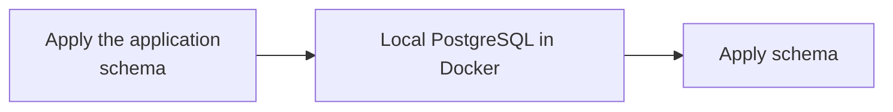
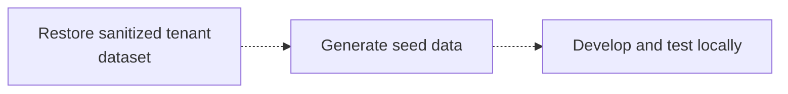

Managed Postgres repose sur PostgreSQL standard et s’intègre à l’écosystème PostgreSQL existant. Pour la plupart des tâches de développement, vous pouvez développer et tester sur une instance PostgreSQL locale exécutée dans Docker plutôt que sur un déploiement cloud.

Cette approche offre un cycle de retour rapide, simplifie la prise en main, réduit les dépendances envers une infrastructure partagée et vous permet d’expérimenter en toute sécurité sans affecter les systèmes de production.

L’objectif n’est pas de reproduire exactement l’environnement de production. Créez plutôt un environnement local reproductible qui :

* Utilise la même version majeure de PostgreSQL que celle de la production.
* Applique les mêmes définitions de schéma que la production.
* Contient des données de développement représentatives.
* Prend en charge les flux de travail habituels de développement et de test des applications.

Comme Managed Postgres est basé sur PostgreSQL standard, les frameworks de migration, les outils de gestion de schéma et les approches d’initialisation des données existants fonctionnent sans modification.

<div id="example-development-flow">
  ## Exemple de flux de travail de développement
</div>

Un flux de travail de développement local type se présente ainsi :





Managed Postgres s&#39;intègre aux flux de travail de développement PostgreSQL existants. En développant sur une instance PostgreSQL locale, les équipes peuvent itérer rapidement, maintenir des environnements reproductibles et s&#39;assurer que les applications se comportent de manière cohérente une fois déployées sur Managed Postgres.

<div id="run-postgresql-locally-with-docker">
  ## Exécuter PostgreSQL en local avec Docker
</div>

Le moyen le plus simple de créer un environnement de développement local consiste à exécuter PostgreSQL dans Docker.

Choisissez une version de PostgreSQL correspondant à votre déploiement Managed Postgres :

```yaml title="docker-compose.yml"
services:
  postgres:
    image: postgres:18
    container_name: local-postgres
    restart: unless-stopped

    environment:
      POSTGRES_USER: postgres
      POSTGRES_PASSWORD: postgres
      POSTGRES_DB: app

    ports:
      - "15432:5432"

    volumes:
      - postgres_data:/var/lib/postgresql

volumes:
  postgres_data:
```

Démarrez PostgreSQL :

```bash
docker compose up -d
```

Vérifiez la connectivité :

```bash
psql -h localhost -U postgres -p 15432 -d app
```

À ce stade, PostgreSQL fonctionne en local, mais ne contient pas encore le schéma de l’application ni de données de développement.

<div id="apply-the-application-schema">
  ## Appliquer le schéma de l&#39;application
</div>

Il n&#39;existe pas de méthode unique imposée pour créer le schéma dans un environnement local. La plupart des organisations disposent déjà d&#39;un flux de travail de gestion des schémas bien établi, qui peut être réutilisé tel quel.

<div id="application-migrations">
  ### Migrations d&#39;application
</div>

De nombreuses équipes utilisent le même framework de migration dans les environnements de staging et de production — des outils comme Flyway, Liquibase, les migrations Rails, les migrations Django, les migrations Prisma ou Alembic.

Appliquer les migrations localement permet de tester en continu l&#39;évolution du schéma dans le cadre du développement habituel :

```bash
./migrate up
# or
npm run migrate
# or
rails db:migrate
```

<div id="schema-only-postgresql-dumps">
  ### Dumps PostgreSQL du schéma uniquement
</div>

Une exportation PostgreSQL limitée au schéma permet de reproduire la structure d’une base de données existante. C’est utile pour l’onboarding, l’étude du comportement du schéma, la validation de la compatibilité ou l’initialisation rapide d’environnements de développement.

Exportez le schéma :

```bash
pg_dump \
  --schema-only \
  --no-owner \
  --no-privileges \
  -h <host> \
  -U <user> \
  -d <database> \
  > schema.sql
```

Restaurer localement :

```bash
psql \
  -h localhost \
  -U postgres \
  -p 15432    \
  -d app \
  -f schema.sql
```

<div id="checked-in-sql-definitions">
  ### Définitions SQL enregistrées dans le contrôle de version
</div>

Certaines équipes conservent les définitions de schéma directement dans le contrôle de version, sous forme de fichiers SQL. Celles-ci peuvent être appliquées directement à une instance PostgreSQL locale lors de la configuration de l’environnement.

Quelle que soit l’approche retenue, l’important est que la création du schéma soit automatisée, reproductible et basée sur des définitions versionnées.

<div id="populate-representative-development-data">
  ## Alimenter la base de données de développement avec des données représentatives
</div>

Une fois le schéma en place, alimentez la base de données avec des données de développement représentatives.

Pour la plupart des flux de travail de développement, des jeux de données synthétiques générés à l’aide de scripts suffisent. Ils sont faciles à recréer, peuvent être distribués sans risque et évitent les contraintes de conformité et de sécurité associées aux données de production.

Une approche courante pour les applications SaaS consiste à générer des données pour un petit nombre de tenants d’exemple et à créer des relations réalistes entre utilisateurs, produits, commandes et autres entités métier.

<div id="example-multi-tenant-schema">
  ### Exemple de schéma multi-tenant
</div>

Le schéma suivant représente une application SaaS multi-tenant simplifiée :

```sql
CREATE TABLE tenants (
    id UUID PRIMARY KEY,
    name TEXT NOT NULL
);

CREATE TABLE users (
    id UUID PRIMARY KEY,
    tenant_id UUID NOT NULL REFERENCES tenants(id),
    email TEXT NOT NULL,
    first_name TEXT,
    last_name TEXT,
    created_at TIMESTAMP DEFAULT now()
);

CREATE TABLE products (
    id UUID PRIMARY KEY,
    tenant_id UUID NOT NULL REFERENCES tenants(id),
    name TEXT NOT NULL,
    price NUMERIC(10,2)
);

CREATE TABLE orders (
    id UUID PRIMARY KEY,
    tenant_id UUID NOT NULL REFERENCES tenants(id),
    user_id UUID NOT NULL REFERENCES users(id),
    status TEXT,
    created_at TIMESTAMP DEFAULT now()
);

CREATE TABLE order_items (
    id UUID PRIMARY KEY,
    order_id UUID NOT NULL REFERENCES orders(id),
    product_id UUID NOT NULL REFERENCES products(id),
    quantity INTEGER
);

CREATE TABLE audit_logs (
    id UUID PRIMARY KEY,
    tenant_id UUID NOT NULL REFERENCES tenants(id),
    entity_type TEXT,
    entity_id UUID,
    action TEXT,
    created_at TIMESTAMP DEFAULT now()
);
```

<div id="generate-sample-data">
  ### Générer des données d’exemple
</div>

Installez les dépendances :

```bash
pip install faker psycopg2-binary
```

Créez un fichier nommé `seed.py` :

```python title="seed.py"
import random
import uuid

import psycopg2
from faker import Faker

fake = Faker()

conn = psycopg2.connect(
    host="localhost",
    port=15432,
    dbname="app",
    user="postgres",
    password="postgres"
)

cur = conn.cursor()

tenant_ids = []

for tenant_name in [
    "Tenant A",
    "Tenant B",
    "Tenant C"
]:
    tenant_id = str(uuid.uuid4())
    tenant_ids.append(tenant_id)

    cur.execute(
        """
        INSERT INTO tenants(id, name)
        VALUES (%s, %s)
        """,
        (tenant_id, tenant_name)
    )

for tenant_id in tenant_ids:

    users = []
    products = []

    for _ in range(20):
        user_id = str(uuid.uuid4())
        users.append(user_id)

        cur.execute(
            """
            INSERT INTO users(
                id,
                tenant_id,
                email,
                first_name,
                last_name
            )
            VALUES (%s,%s,%s,%s,%s)
            """,
            (
                user_id,
                tenant_id,
                fake.email(),
                fake.first_name(),
                fake.last_name()
            )
        )

    for _ in range(15):
        product_id = str(uuid.uuid4())
        products.append(product_id)

        cur.execute(
            """
            INSERT INTO products(
                id,
                tenant_id,
                name,
                price
            )
            VALUES (%s,%s,%s,%s)
            """,
            (
                product_id,
                tenant_id,
                fake.word(),
                round(random.uniform(10, 500), 2)
            )
        )

    for _ in range(50):

        order_id = str(uuid.uuid4())

        cur.execute(
            """
            INSERT INTO orders(
                id,
                tenant_id,
                user_id,
                status
            )
            VALUES (%s,%s,%s,%s)
            """,
            (
                order_id,
                tenant_id,
                random.choice(users),
                random.choice([
                    "pending",
                    "completed",
                    "cancelled"
                ])
            )
        )

        for _ in range(random.randint(1, 5)):
            cur.execute(
                """
                INSERT INTO order_items(
                    id,
                    order_id,
                    product_id,
                    quantity
                )
                VALUES (%s,%s,%s,%s)
                """,
                (
                    str(uuid.uuid4()),
                    order_id,
                    random.choice(products),
                    random.randint(1, 10)
                )
            )

        cur.execute(
            """
            INSERT INTO audit_logs(
                id,
                tenant_id,
                entity_type,
                entity_id,
                action
            )
            VALUES (%s,%s,%s,%s,%s)
            """,
            (
                str(uuid.uuid4()),
                tenant_id,
                "order",
                order_id,
                "created"
            )
        )

conn.commit()
conn.close()
```

Exécutez le script :

```bash
python seed.py
```

Le jeu de données obtenu contient :

| Table           | Enregistrements |
| --------------- | --------------- |
| tenants         | 3               |
| users           | 60              |
| products        | 45              |
| orders          | 150             |
| order&#95;items | 400+            |
| audit&#95;logs  | 150+            |

Ce jeu de données est suffisamment volumineux pour couvrir les workflows applicatifs courants, la logique d’isolation des tenants, les requêtes de reporting et les contrôles d’intégrité relationnelle, tout en restant léger pour le développement et les tests en local.

<div id="postgresql-clickhouse-development-environment">
  ## Environnement de développement PostgreSQL + ClickHouse
</div>

Les exemples ci-dessus portent sur le développement local avec PostgreSQL. Si vous souhaitez tester localement l’architecture complète PostgreSQL-to-ClickHouse, vous pouvez exécuter la stack open source PostgreSQL + ClickHouse.

Cette stack associe PostgreSQL pour les workloads transactionnels, ClickHouse pour l’analytics, et PeerDB pour la capture native des changements de données (CDC). Elle vous permet de développer avec PostgreSQL tout en répliquant en continu les données vers ClickHouse, ce qui permet de tester directement depuis votre ordinateur portable l’analytics opérationnelle, les workloads de reporting et les pipelines de données en temps réel.

La stack peut être lancée avec une seule commande et inclut tous les services requis préconfigurés :

```bash
git clone https://github.com/ClickHouse/postgres-clickhouse-stack.git
cd postgres-clickhouse-stack

./run.sh start
```

La stack comprend :

* PostgreSQL
* ClickHouse
* PeerDB pour la CDC de PostgreSQL
* Des services auxiliaires et des applications d’exemple

Pour les instructions de configuration, les détails d’architecture et un guide pas à pas de la stack complète, consultez :

* [Blog : PostgreSQL + ClickHouse OSS](https://clickhouse.com/blog/postgres-clickhouse-oss)
* [GitHub : postgres-clickhouse-stack](https://github.com/ClickHouse/postgres-clickhouse-stack)

C’est une étape utile une fois que votre application s’exécute localement avec PostgreSQL et que vous souhaitez valider la synchronisation PostgreSQL-to-ClickHouse, l’analyse en temps réel et le comportement de l’application de bout en bout.