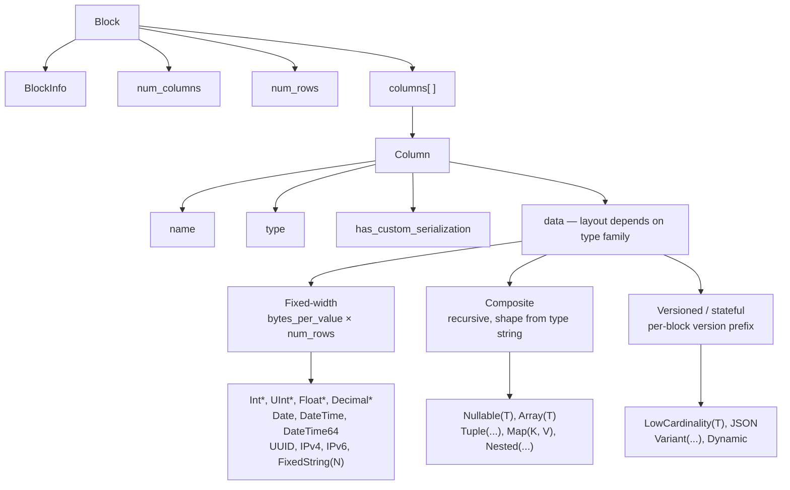
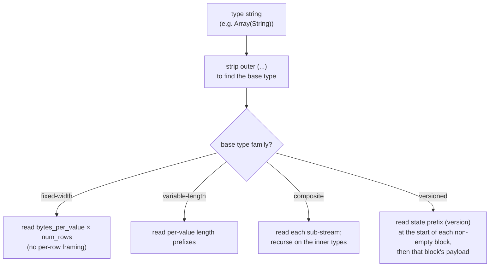
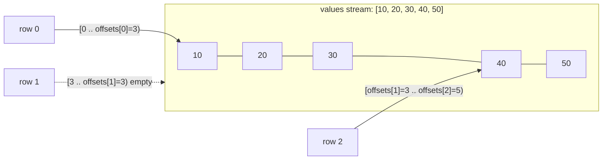
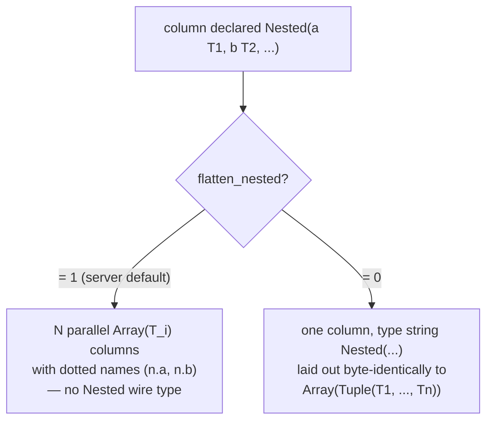
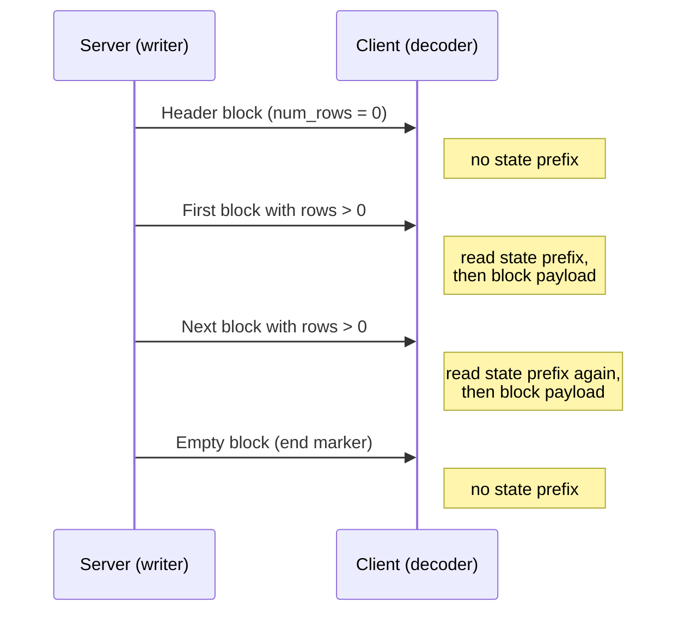
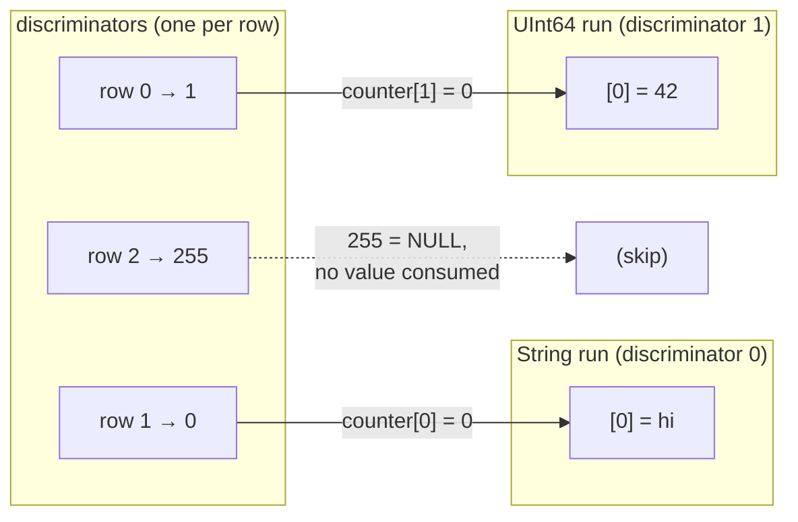
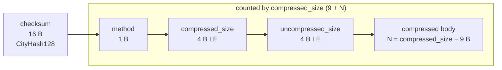

Le format Native est le format binaire en colonnes que ClickHouse utilise pour transporter des données tabulaires. Il apparaît à plusieurs endroits :

* dans le corps des paquets `Data`, `Totals`, `Extremes`, `Log` et `ProfileEvents` du [protocole TCP natif](/fr/reference/interfaces/specs/NativeProtocol) (le paquet `TableColumns` n&#39;est **pas** un bloc Native — il transporte deux chaînes binaires, sa structure relève donc de la [spécification du protocole natif](/fr/reference/interfaces/specs/NativeProtocol)) ;
* dans la sortie de `SELECT ... FORMAT Native` via HTTP ;
* dans les exports de fichiers écrits avec `INTO OUTFILE ... FORMAT Native` ;
* dans les charges utiles de réplication inter-serveurs.

Cette page décrit les octets à l&#39;intérieur d&#39;un Block — la charge utile en colonnes — ainsi que l&#39;encodage des types, colonne par colonne, qui le constituent. L&#39;encapsulation des paquets, l&#39;état de la connexion et la négociation de version relèvent de la [spécification du protocole natif](/fr/reference/interfaces/specs/NativeProtocol).

Tous les champs entiers sur plusieurs octets sont en little-endian. Les entiers signés utilisent le complément à deux.

<Tip>
  Pour une introduction orientée utilisateur au format `Native` (avec des exemples `curl`), consultez la [page du format Native](/fr/reference/formats/Native). Cette spécification est la référence wire de bas niveau.
</Tip>

<div id="overview">
  ## Vue d’ensemble
</div>

Tout ce qui transporte des lignes sur le réseau est un **Block** : un fragment auto-descriptif de lignes stockées colonne par colonne. Toutes les valeurs de la colonne 1 viennent d’abord, puis toutes celles de la colonne 2, et ainsi de suite. Un Block ne transporte que les colonnes auxquelles la requête fait référence, jamais la table entière.

Le `data` d’une colonne est organisé selon la *famille* à laquelle appartient son type. Les familles, par complexité croissante du décodeur, sont :



* Les types **à largeur fixe** présentent `data` sous la forme de `bytes_per_value × num_rows` octets bruts, sans encapsulation par ligne.
* Les types **composites** (`Nullable`, `Array`, `Tuple`, `Map`, `Nested`) ont une structure récursive entièrement dérivable de la chaîne de type, sans préfixe de version ni état d&#39;un bloc à l&#39;autre.
* Les types **versionnés / avec état** (`LowCardinality`, `JSON`, `Variant`, `Dynamic`) commencent chaque bloc non vide par un préfixe de version de sérialisation/état. Sur le wire `Native`, ce préfixe et tout dictionnaire sont **propres à chaque bloc** — le format ne transporte aucun état *d&#39;un bloc à l&#39;autre* (l&#39;émetteur crée un nouvel état de sérialisation pour chaque bloc et définit `low_cardinality_max_dictionary_size = 0`). L&#39;état entre blocs relève du stockage sur disque de MergeTree, pas du wire layout `Native`.

<div id="wire-primitives">
  ## Primitifs wire
</div>

Le format Native repose sur quatre encodages primitifs.

| Primitif              | Taille               | Description                                              |
| --------------------- | -------------------- | -------------------------------------------------------- |
| VarUInt               | 1–10 B               | Entier non signé à longueur variable LEB-128             |
| entier à largeur fixe | 1, 2, 4, 8, 16, 32 B | little-endian, complément à deux pour les entiers signés |
| String                | variable             | Préfixe de longueur VarUInt + octets bruts               |
| Bool                  | 1 B                  | `0x00` = false, valeur non nulle = true                  |

<div id="varuint">
  ### VarUInt
</div>

Un entier non signé à longueur variable utilisant l’encodage LEB-128. Chaque octet contient 7 bits de données aux positions 0–6 et 1 bit de continuation à la position 7. Le bit de continuation vaut `1` lorsque d’autres octets suivent et `0` dans l’octet final.

| Plage de valeurs                 | Octets     |
| -------------------------------- | ---------- |
| 0 – 127                          | 1          |
| 128 – 16383                      | 2          |
| 16384 – 2097151                  | 3          |
| jusqu’à la valeur max. de UInt64 | jusqu’à 10 |

Encodage de la valeur `300` :

```text
300 = 0b100101100

Byte 0: 0xAC = 0b10101100   (data: 0101100, continuation: 1)
Byte 1: 0x02 = 0b00000010   (data: 0000010, continuation: 0)
```

Décodage des octets `0xAC 0x02` :

```text
Byte 0: data = 0x2C, continuation = 1 → accumulator = 0x2C, shift = 7
Byte 1: data = 0x02, continuation = 0 → accumulator = (0x02 << 7) | 0x2C = 300
```

<div id="fixed-width-integers">
  ### Entiers de taille fixe
</div>

| Type    | Bytes | Encodage                                 |
| ------- | ----- | ---------------------------------------- |
| UInt8   | 1     | Octet brut                               |
| UInt16  | 2     | Little-endian                            |
| UInt32  | 4     | Little-endian                            |
| UInt64  | 8     | Little-endian                            |
| UInt128 | 16    | Little-endian                            |
| UInt256 | 32    | Little-endian                            |
| Int8    | 1     | Octet brut, complément à deux            |
| Int16   | 2     | Little-endian, complément à deux         |
| Int32   | 4     | Little-endian, complément à deux         |
| Int64   | 8     | Little-endian, complément à deux         |
| Int128  | 16    | Little-endian, complément à deux         |
| Int256  | 32    | Little-endian, complément à deux         |
| Float32 | 4     | IEEE 754 simple précision, little-endian |
| Float64 | 8     | IEEE 754 double précision, little-endian |

Par exemple, la valeur UInt32 `1` est encodée sous la forme `01 00 00 00`, et la valeur Int32 `-1` sous la forme `FF FF FF FF`.

<div id="string">
  ### String
</div>

Une séquence d’octets précédée de sa longueur :

```text
[VarUInt: byte_length] [byte_length bytes: raw value]
```

La séquence d’octets n’a pas besoin d’être du UTF-8 valide. Une chaîne vide s’encode en un seul octet `0x00`, et les chaînes peuvent contenir n’importe quelle valeur d’octet, y compris un NUL intégré. La chaîne `"ab"` s’encode en `02 61 62` ; pour la décoder, lisez la longueur VarUInt (`2`), puis lisez ce nombre d’octets.

<div id="bool">
  ### Bool
</div>

Un seul octet. `0x00` correspond à false ; toute valeur non nulle correspond à true (sous sa forme canonique, `0x01`).

<div id="block-and-column-structure">
  ## Structure des blocs et des colonnes
</div>

<div id="block-wire-layout">
  ### Structure binaire du bloc
</div>

```text
[BlockInfo]               metadata (only on the TCP Data-packet path; see below)
[VarUInt: num_columns]    number of columns in this block
[VarUInt: num_rows]       number of rows in this block
[Column × num_columns]    column entries, omitted when num_columns = 0
```

La présence du préfixe `BlockInfo` dépend du canal, car l’écriture est paramétrée par une *révision* :

* Sur le **protocole TCP natif**, le serveur écrit les blocs à la révision négociée de la connexion (une valeur élevée — `DBMS_TCP_PROTOCOL_VERSION` vaut `54485` dans cette version). `BlockInfo` est écrit dès que cette révision est supérieure à zéro, ce qui est toujours le cas pour une connexion réelle. L’octet `has_custom_serialization` dans chaque colonne (voir la [représentation binaire des colonnes](#column-wire-layout)) est écrit à partir de la révision `54454`.
* Le *format de sortie* `Native` — `SELECT ... FORMAT Native` sur HTTP, `INTO OUTFILE ... FORMAT Native`, ainsi que le format `Native` produit par `clickhouse-client` — sérialise à la révision `0` *par défaut*. À la révision `0`, le préfixe `BlockInfo` et l’octet `has_custom_serialization` sont tous deux omis, de sorte qu’un bloc se résume à `num_columns`, `num_rows` et aux colonnes.

  Sur HTTP, cette révision n’est pas fixe : un client peut l’augmenter avec le paramètre de requête `?client_protocol_version=<n>`, et le serveur utilise cette valeur comme révision de sérialisation pour la réponse.

  Avec une valeur suffisamment élevée, la sortie HTTP inclut le préfixe `BlockInfo` (écrit dès que la révision est supérieure à `0`) et l’octet `has_custom_serialization` (écrit à partir de la révision `54454`), exactement comme sur le chemin TCP. Les clients ne doivent donc pas supposer que chaque payload HTTP `FORMAT Native` est en révision `0`.

En d’autres termes, les exemples d’octets de cette section qui commencent par un préfixe `BlockInfo` décrivent la charge utile du paquet Data en TCP. La même requête exécutée via `FORMAT Native` produit la forme plus courte affichée à côté.

<div id="blockinfo">
  ### BlockInfo
</div>

BlockInfo est une séquence de champs, chacun précédé d’un ID de champ VarUInt, terminée par un ID de champ égal à `0`. Le wire format n’est **pas** auto-descriptif : un ID de champ n’encode ni la longueur ni le type de sa valeur, donc le lecteur doit déjà connaître le type de chaque ID de champ qu’il peut rencontrer. Le lecteur natif de ClickHouse traite un ID de champ non reconnu comme une corruption et lève une exception (`UNKNOWN_BLOCK_INFO_FIELD`). La compatibilité ascendante est assurée par la révision du protocole : l’émetteur n’écrit un champ que si la révision négociée est au moins égale à la révision minimale de ce champ, de sorte qu’un récepteur plus ancien ne voie jamais un champ qu’il ne connaît pas.

| ID de champ | Champ                            | Type          | Révision min | Description                                                                                                                      |
| ----------- | -------------------------------- | ------------- | ------------ | -------------------------------------------------------------------------------------------------------------------------------- |
| 1           | is&#95;overflows                 | UInt8         | 0            | Bloc d’overflow issu de GROUP BY. `0` pour les blocs sans overflow.                                                              |
| 2           | bucket&#95;number                | Int32         | 0            | Bucket d’agrégation. `-1` pour les blocs sans bucket.                                                                            |
| 3           | out&#95;of&#95;order&#95;buckets | Liste d’Int32 | 54480        | Buckets différés pendant l’agrégation distribuée. Encodés sous la forme d’un compteur VarUInt suivi d’autant de valeurs `Int32`. |
| 0           | (terminateur)                    | —             | —            | Fin de BlockInfo. Toujours requis.                                                                                               |

Les champs `1` et `2` ont une révision minimale de `0` ; ils sont donc présents dès qu’un `BlockInfo` est écrit. Le champ `3` n’est écrit qu’à partir de la révision `54480`. Wire layout pour le cas le plus courant (révision inférieure à `54480`) :

```text
[VarUInt: 1] [UInt8: is_overflows]
[VarUInt: 2] [Int32: bucket_number]
[VarUInt: 0]
```

<div id="column-wire-layout">
  ### Wire layout d’une colonne
</div>

Une colonne apparaît `num_columns` fois dans un Block.

| # | Champ                            | Type                                 | Condition                                      | Description                                                                                                                                                                                                                                                                                                                                                                    |
| - | -------------------------------- | ------------------------------------ | ---------------------------------------------- | ------------------------------------------------------------------------------------------------------------------------------------------------------------------------------------------------------------------------------------------------------------------------------------------------------------------------------------------------------------------------------ |
| 1 | name                             | String                               | toujours                                       | Nom de la colonne                                                                                                                                                                                                                                                                                                                                                              |
| 2 | type                             | String *ou* encodage binaire de type | toujours                                       | Chaîne de type ClickHouse (par ex., `"UInt64"`, `"Array(String)"`) par défaut ; un encodage binaire de type lorsque `output_format_native_encode_types_in_binary_format = 1` (voir la note ci-dessous)                                                                                                                                                                         |
| 3 | has&#95;custom&#95;serialization | UInt8                                | fonctionnalité `CUSTOM_SERIALIZATION` (v54454) | `0` = par défaut, `1` = personnalisé (`kind&#95;stack` suit)                                                                                                                                                                                                                                                                                                                   |
| 4 | kind&#95;stack                   | octets                               | lorsque le champ 3 = `1`                       | Un octet d’enum UInt8 (voir ci-dessous) décrivant la sérialisation non par défaut (sparse, etc.). Pour la valeur `COMBINATION`, il est suivi d’un compteur VarUInt puis d’autant d’octets kind supplémentaires. Pour un `Tuple` (et d’autres types composites avec des informations de sérialisation au niveau des éléments), la charge utile est récursive — voir ci-dessous. |
| 5 | data                             | octets                               | toujours                                       | Valeurs de la colonne pour les `num_rows` lignes. Disposition selon le type — voir [types de données](#data-types). Pour les colonnes sparse, voir ci-dessous.                                                                                                                                                                                                                 |

Un décodeur s’appuie sur la chaîne `type`. Les chaînes de type contiennent souvent des paramètres entre parenthèses ; le décodeur supprime le suffixe `(...)` pour trouver le type de base, puis analyse les paramètres afin de déterminer la taille, l’échelle ou le type interne. L’analyse d’une liste de paramètres avec des types imbriqués (un `Tuple` à l’intérieur d’un `Array`, par exemple) nécessite un séparateur de virgules tenant compte de la profondeur, qui suit l’imbrication des parenthèses plutôt qu’un simple découpage sur `,`.

<Info>
  **Encodage binaire de type**

  Le champ `type` n’est une `String` textuelle qu’en mode par défaut. Lorsque le paramètre de requête `output_format_native_encode_types_in_binary_format = 1` est défini, ce champ contient à la place un **encodage binaire de type** — le même encodage à base de tags documenté dans [encodage binaire des types de données](/fr/reference/data-types/data-types-binary-encoding) — et les listes de types `Dynamic` aplaties utilisent le même encodage binaire pour leurs noms de type individuels. Un décodeur qui lirait toujours le champ 2 comme une chaîne préfixée par sa longueur interpréterait le premier tag binaire de type comme une longueur de chaîne et se désynchroniserait ; il doit donc savoir quel mode le flux utilise.
</Info>



<div id="kind-stack-and-sparse-encoding">
  #### kind_stack et encodage sparse
</div>

L’octet `kind_stack` énumère une sérialisation non standard par colonne :

| Byte   | Name                         | Meaning                                                                                 | Wire impact on `data`                                                                              |
| ------ | ---------------------------- | --------------------------------------------------------------------------------------- | -------------------------------------------------------------------------------------------------- |
| `0x00` | DEFAULT                      | Sérialisation par défaut                                                                | Identique à `has_custom = 0`                                                                       |
| `0x01` | SPARSE                       | Sérialisation sparse (v54465+)                                                          | Flux d’offsets + valeurs non standard ; voir ci-dessous                                            |
| `0x02` | DETACHED                     | Colonne encapsulée dans un `ColumnBLOB` par le marshalling parallèle de block (v54478+) | Blob prémarshallé : `VarUInt size` + ce nombre d’octets ; voir ci-dessous                          |
| `0x03` | DETACHED&#95;OVER&#95;SPARSE | Colonne sparse encapsulée dans un `ColumnBLOB`                                          | Même charge utile de blob que `DETACHED` ; voir ci-dessous                                         |
| `0x04` | REPLICATED                   | Représentation dictionnaire pour les valeurs répétées (v54482+)                         | Flux d’index + valeurs d’éléments encodées densément ; voir ci-dessous                             |
| `0x05` | COMBINATION                  | Pile multi-kind                                                                         | Suivi d’un `VarUInt` `count` puis de `count` octets kind supplémentaires — voir la note ci-dessous |

**La charge utile de `COMBINATION` utilise une énumération différente.** Les cinq lignes ci-dessus sont des codes compacts sur un octet. `COMBINATION` (`0x05`) est l’échappement générique pour toute pile non couverte par ces codes : il est suivi d’un `VarUInt` `count`, puis de `count` entrées sur un octet. Ces entrées ne sont **pas** les codes compacts du tableau — ce sont les valeurs brutes de `ISerialization::Kind` :

| Byte   | Nested `Kind` |
| ------ | ------------- |
| `0x00` | DEFAULT       |
| `0x01` | SPARSE        |
| `0x02` | DETACHED      |
| `0x03` | REPLICATED    |

Les valeurs d’octet diffèrent des codes compacts : `REPLICATED` vaut `0x03` dans cette énumération imbriquée, mais `0x04` comme code compact, et il n’existe pas d’entrée `DETACHED_OVER_SPARSE` — cette combinaison apparaît comme deux entrées consécutives, `SPARSE` puis `DETACHED`. Un décodeur qui continue d’utiliser le tableau compact pour les octets imbriqués fera une correspondance incorrecte de `0x03`/`0x04` et se désynchronisera.

Le `count` est la longueur complète de la pile, **y compris l’entrée initiale `DEFAULT`** qui commence chaque pile. Les codes compacts couvrent déjà toutes les piles à une et deux entrées, donc un `COMBINATION` a toujours un `count` d’au moins trois.

**`kind_stack` récursif pour les colonnes `Tuple`.** La charge utile `kind_stack` ci-dessus correspond à l’octet (ou à la séquence `COMBINATION`) des informations de sérialisation propres à une colonne. Un `Tuple` transporte un `SerializationInfoTuple`, qui écrit d’abord la charge utile kind-stack propre au tuple, puis une charge utile kind-stack complète pour *chaque* élément, dans l’ordre ; un décodeur relit ensuite cette même structure récursive. Ainsi, pour `Tuple(A, B, C)`, les octets du champ 4 sont `[tuple_kind][A_kind][B_kind][C_kind]`, et la charge utile de chaque élément est elle-même récursive si cet élément est à nouveau composite. L’octet `has_custom_serialization` (champ 3) est défini dès que les informations propres au tuple *ou celles de l’un de ses éléments* sont non standard ; ainsi, un `Tuple` dont le seul élément spécial est sparse, replicated ou detached déclenche quand même la charge utile kind-stack. Un décodeur qui ne lit que le seul octet d’énumération initial d’un `Tuple` s’arrêtera trop tôt et interprétera à tort les octets kind des éléments restants comme des données de colonne.

**Format sparse sur le wire.** Quand `kind_stack = 0x01`, les `data` de la colonne sont constituées de deux flux écrits l’un à la suite de l’autre dans l’unique flux TCP partagé :

1. **Flux d’offsets** — une séquence de `VarUInt`. Chaque valeur `v` est soit :
   * `v` avec le bit de poids fort à la position 62 non défini : `(v & 0x3FFFFFFFFFFFFFFF)` = le nombre de positions par défaut avant la prochaine valeur explicite non standard. Cette position non standard est `cursor + group_size`, où `cursor` est la position courante ; ensuite, `cursor` avance de `group_size + 1`.
   * `v` avec le bit 62 défini (`END_OF_GRANULE_FLAG`) : la valeur avec le flag effacé = le nombre de positions par défaut de fin après la dernière valeur non standard. Cela marque la fin du flux d’offsets pour le block.
2. **Flux de valeurs** — `count` valeurs non standard encodées densément dans le type interne, où `count` est le nombre de `VarUInt` non EOG lus ci-dessus.

Un décodeur reconstruit une colonne dense de `num_rows` entrées en remplissant chaque position non explicite avec la valeur par défaut du type interne (`0` pour les entiers et les nombres à virgule flottante, `""` pour `String`, `0` jour pour `Date`, etc.).

Une colonne `Nullable(T)` sparse est un cas particulier, car la valeur par défaut de `Nullable(T)` est **NULL**. L’encodage sparse supprime entièrement le flux de null map habituel de `Nullable` : le flux d’offsets identifie les positions non par défaut — c’est-à-dire non NULL —, le flux de valeurs ne contient que ces valeurs non NULL, stockées de manière dense dans `T`, et chaque position non explicite est reconstruite comme NULL. Un décodeur ne doit donc *pas* chercher de null map dans le flux de valeurs, et ne doit *pas* combler les lacunes avec un `0` présent ; il les remplit avec NULL.

**Wire format répliqué.** Quand `kind_stack = 0x04`, la colonne `data` est un dictionnaire : une liste de valeurs d’élément distinctes, plus un index par ligne dans cette liste (le même schéma de lookup que `LowCardinality`). Quand le type interne est lui-même versionné — par exemple `LowCardinality(T)` —, son state prefix est écrit **en premier**, avant le flux d’index : la sérialisation répliquée délègue la prefix phase au type interne avant d’écrire `num_rows`. Les types internes dont le préfixe est vide (les types feuille et les composites simples) n’ajoutent ici aucun octet.

```text
[inner type's state prefix]              empty for leaf inners; e.g. LowCardinality version (Int64 = 1)
[VarUInt num_rows]
[UInt8  size_of_indexes_type]            width of each index: 1, 2, 4, or 8 bytes
[indexes: num_rows × size_of_indexes_type bytes]
[VarUInt num_elements]
[elements: num_elements dense inner-type values]
```

Un décodeur reconstruit une colonne dense en sélectionnant `elements[indexes[i]]` pour chaque ligne de sortie `i`. Les types internes composites sont traités récursivement : la liste des éléments est matérialisée dans le type interne, puis indexée. Les types internes pris en charge incluent les types feuille, `Nullable(T)`, `Array(T)`, `Tuple(...)`, `Map(K, V)`, `Nested(...)` (chaque champ étant développé comme un `Array`) et `LowCardinality(T)` (le dictionnaire partagé est conservé ; seules les clés par élément sont indexées).

**Wire format detached.** `DETACHED` (`0x02`) et `DETACHED_OVER_SPARSE` (`0x03`) apparaissent *bien* sur le wire — ils ne sont pas purement internes. Sur le chemin TCP, lorsque la compression est activée et que la révision négociée est au moins `DBMS_MIN_REVISON_WITH_PARALLEL_BLOCK_MARSHALLING` (v54478), la colonne passe par trois étapes :

1. Chaque colonne éligible (non-`const`, non-`Tuple`, dans un bloc contenant plus d’une ligne) est encapsulée dans un `ColumnBLOB` qui contient la colonne déjà sérialisée et compressée hors du thread principal.
2. `DETACHED` est ajouté à la pile des kinds de la colonne encapsulée.
3. Le `data` de la colonne est écrit sous la forme d’une taille de blob `VarUInt`, suivie d’exactement ce nombre d’octets du blob.

Si la colonne encapsulée était sparse, sa pile est `{DEFAULT, SPARSE, DETACHED}`, ce qui se sérialise en `DETACHED_OVER_SPARSE`. Un client qui décode une telle colonne lit la longueur du blob et ses octets, puis décompresse le blob pour récupérer la charge utile de la colonne interne (voir la [note `ColumnBLOB`](#compression-negotiation) dans la section sur la compression).

<div id="block-variants">
  ### Variantes de bloc
</div>

Tous les paquets de la famille Data partagent le même wire format Block. Les variantes ne diffèrent que par leur nombre de colonnes et de lignes :

| Variante         | num&#95;columns | num&#95;rows | Rôle                                                                     |
| ---------------- | --------------- | ------------ | ------------------------------------------------------------------------ |
| Bloc d’en-tête   | N &gt; 0        | 0            | Annonce le schéma de résultat (noms de colonnes + types).                |
| Bloc de résultat | N &gt; 0        | M &gt; 0     | Lignes de résultat proprement dites.                                     |
| Bloc vide        | 0               | 0            | Sentinelle — fin d’entrée côté client ; marqueur de limite côté serveur. |

<div id="byte-level-examples">
  ### Exemples à l’échelle de l’octet
</div>

Tous les exemples de cette section sont tirés du **chemin des paquets TCP Data** ; ils incluent donc le préfixe `BlockInfo` et l’octet `has_custom_serialization`. Avec `FORMAT Native`, les mêmes blocs sont plus courts — la forme courte équivalente est indiquée lorsque c’est utile.

Un bloc vide (avec BlockInfo), 8 octets au total :

```text
01 00                   BlockInfo: field_id=1, is_overflows=0
02 FF FF FF FF          BlockInfo: field_id=2, bucket_number=-1
00                      BlockInfo terminator
00                      num_columns = 0
00                      num_rows = 0
```

Un bloc d’en-tête pour `SELECT 1` annonce une colonne nommée `"1"` de type `UInt8`, avec zéro ligne. À partir du protocole ≥ 54454, l’octet `has_custom_serialization` est inclus :

```text
01 00                   BlockInfo: is_overflows = 0
02 FF FF FF FF          BlockInfo: bucket_number = -1
00                      BlockInfo terminator
01                      num_columns = 1
00                      num_rows = 0
01 "1"                  Column[0].name = "1"
05 "UInt8"              Column[0].type = "UInt8"
00                      Column[0].has_custom_serialization = 0
                        Column[0].data: no bytes (num_rows = 0)
```

Le bloc de résultats de la même requête, avec une ligne :

```text
01 00                   BlockInfo: is_overflows = 0
02 FF FF FF FF          BlockInfo: bucket_number = -1
00                      BlockInfo terminator
01                      num_columns = 1
01                      num_rows = 1
01 "1"                  Column[0].name = "1"
05 "UInt8"              Column[0].type = "UInt8"
00                      Column[0].has_custom_serialization = 0
01                      Column[0].data: one UInt8 byte = 1
```

Avec `FORMAT Native` (révision `0`), le même bloc de résultats ne comporte ni `BlockInfo` ni l’octet `has_custom_serialization` — `SELECT 1 FORMAT Native` fait 11 octets :

```text
01                      num_columns = 1
01                      num_rows = 1
01 "1"                  Column[0].name = "1"
05 "UInt8"              Column[0].type = "UInt8"
01                      Column[0].data: one UInt8 byte = 1
```

(Un résultat sans aucune ligne, comme un bloc contenant uniquement un en-tête, ne produit aucun octet avec `FORMAT Native` : le format de sortie n’émet pas de blocs vides.)

<div id="data-types">
  ## Types de données
</div>

Cette section documente l’encodage wire des types que le format Native peut transporter dans le `data` d’une colonne, répartis en quatre familles selon une complexité croissante du décodeur. Deux types — `AggregateFunction(func, ...)` et `QBit(T, N)` — sont des types de colonne `Native` valides, mais leurs payloads spécifiques à la fonction ou au type ne sont pas couverts ici ; ils sont signalés ci-dessous aux endroits où ils pourraient sinon être confondus avec des alias.

| Famille                | Section                                             | Flux par colonne | État inter-blocs                                                                  |
| ---------------------- | --------------------------------------------------- | ---------------- | --------------------------------------------------------------------------------- |
| À largeur fixe         | [Types à largeur fixe](#fixed-width-types)          | Un               | Aucun                                                                             |
| À longueur variable    | [Types à longueur variable](#variable-length-types) | Un               | Aucun                                                                             |
| Composite (forme fixe) | [Types composites](#composite-types)                | Plusieurs        | Aucun                                                                             |
| Versionnés / avec état | [Types versionnés](#versioned-types)                | Plusieurs        | Aucun sur le wire Native — préfixe d’état par bloc, réinitialisé pour chaque bloc |

<div id="fixed-width-types">
  ### Types à largeur fixe
</div>

Chaque valeur occupe un nombre constant d’octets. Une colonne de `M` lignes occupe exactement `bytes_per_row × M` octets dans le flux binaire, concaténés sans séparateurs ni remplissage.

| Chaîne de type      | Octets par valeur | Valeur logique                                                                                                  | Encodage binaire                                                        |
| ------------------- | ----------------- | --------------------------------------------------------------------------------------------------------------- | ----------------------------------------------------------------------- |
| `UInt8`             | 1                 | Entier non signé sur 8 bits                                                                                     | Octet brut                                                              |
| `UInt16`            | 2                 | Entier non signé sur 16 bits                                                                                    | Little-endian                                                           |
| `UInt32`            | 4                 | Entier non signé sur 32 bits                                                                                    | Little-endian                                                           |
| `UInt64`            | 8                 | Entier non signé sur 64 bits                                                                                    | Little-endian                                                           |
| `UInt128`           | 16                | Entier non signé sur 128 bits                                                                                   | Little-endian                                                           |
| `UInt256`           | 32                | Entier non signé sur 256 bits                                                                                   | Little-endian                                                           |
| `Int8`              | 1                 | Entier signé sur 8 bits, complément à deux                                                                      | Octet brut                                                              |
| `Int16`             | 2                 | Entier signé sur 16 bits, complément à deux                                                                     | Little-endian                                                           |
| `Int32`             | 4                 | Entier signé sur 32 bits, complément à deux                                                                     | Little-endian                                                           |
| `Int64`             | 8                 | Entier signé sur 64 bits, complément à deux                                                                     | Little-endian                                                           |
| `Int128`            | 16                | Entier signé sur 128 bits, complément à deux                                                                    | Little-endian                                                           |
| `Int256`            | 32                | Entier signé sur 256 bits, complément à deux                                                                    | Little-endian                                                           |
| `Float32`           | 4                 | IEEE 754 simple précision                                                                                       | Little-endian                                                           |
| `Float64`           | 8                 | IEEE 754 double précision                                                                                       | Little-endian                                                           |
| `BFloat16`          | 2                 | 16 bits de poids fort d’un `Float32` IEEE 754                                                                   | Little-endian                                                           |
| `Bool`              | 1                 | `0x00` = false, `0x01` = true                                                                                   | Octet brut                                                              |
| `Date`              | 2                 | Jours depuis le `1970-01-01`                                                                                    | Little-endian UInt16                                                    |
| `Date32`            | 4                 | Jours depuis le `1970-01-01` (signé ; dates antérieures à 1970 acceptées)                                       | Little-endian Int32                                                     |
| `DateTime`          | 4                 | Unix timestamp en secondes                                                                                      | Little-endian UInt32                                                    |
| `DateTime(tz)`      | 4                 | Identique à `DateTime` ; le fuseau horaire est une métadonnée                                                   | Little-endian UInt32                                                    |
| `DateTime64(s)`     | 8                 | Ticks à l’échelle `s` (10^-s secondes depuis l’epoch)                                                           | Little-endian Int64                                                     |
| `DateTime64(s, tz)` | 8                 | Identique à `DateTime64(s)` ; le fuseau horaire est une métadonnée                                              | Little-endian Int64                                                     |
| `Time`              | 4                 | Durée horodatée signée en secondes                                                                              | Little-endian Int32                                                     |
| `Time64(s)`         | 8                 | Durée horodatée signée en ticks à l’échelle `s`                                                                 | Little-endian Int64                                                     |
| `Interval<Unit>`    | 8                 | Compte signé ; l’unité figure dans la chaîne de type                                                            | Little-endian Int64                                                     |
| `UUID`              | 16                | Identifiant sur 128 bits                                                                                        | Deux moitiés LE UInt64 avec permutation des octets (voir [UUID](#uuid)) |
| `IPv4`              | 4                 | Adresse IPv4                                                                                                    | Little-endian UInt32                                                    |
| `IPv6`              | 16                | Adresse IPv6                                                                                                    | Ordre des octets réseau, sans permutation                               |
| `Enum8`             | 1                 | Signé sur 8 bits (index de variant)                                                                             | Octet brut                                                              |
| `Enum16`            | 2                 | Signé sur 16 bits (index de variant)                                                                            | Little-endian                                                           |
| `Decimal(P, S)`     | 4 / 8 / 16 / 32   | `value × 10^S` sous forme d’entier signé ; la largeur dépend de P (≤9 → 4 B, ≤18 → 8 B, ≤38 → 16 B, ≤76 → 32 B) | Entier signé little-endian                                              |

<div id="integer-types">
  #### Types entiers
</div>

`UInt8`–`UInt256` et `Int8`–`Int256` sont des encodages binaires directs de valeurs entières. Un décodeur lit `bytes_per_row × num_rows` octets et les interprète selon le type.

Une colonne `UInt32` contenant `[1, 256, 65536]` :

```text
01 00 00 00              row 0: 1
00 01 00 00              row 1: 256
00 00 01 00              row 2: 65536
```

Une colonne `Int32` contenant `[-1, 42]` :

```text
FF FF FF FF              row 0: -1
2A 00 00 00              row 1: 42
```

<div id="float32-and-float64">
  #### Float32 et Float64
</div>

Nombres à virgule flottante binaires IEEE 754 standard : 4 octets en simple précision (`binary32`) et 8 octets en double précision (`binary64`), tous deux en little-endian. NaN, ±Infinity, ±0.0 et les nombres subnormaux sont tous préservés à l’aller-retour, sans normalisation.

Valeur `1.5` de `Float32` (`0x3FC00000`) :

```text
00 00 C0 3F              little-endian IEEE 754
```

`Float64`, valeur `1.5` (`0x3FF8000000000000`) :

```text
00 00 00 00 00 00 F8 3F  little-endian IEEE 754
```

<div id="bfloat16">
  #### BFloat16
</div>

Le format en virgule flottante brain-float : les 16 bits de poids fort d’un `Float32` IEEE 754 — 1 bit de signe, 8 bits d’exposant, 7 bits de mantisse. Chaque valeur occupe 2 octets, en little-endian, et contient le motif binaire brut sur 16 bits. Pour retrouver la valeur numérique, il faut l’élargir de nouveau en `Float32` en plaçant le motif dans la moitié haute et en mettant à zéro la moitié basse (`bits << 16` réinterprété en `Float32`) ; la valeur élargie utilise alors la même représentation textuelle que `Float32`.

Valeur `BFloat16` `1.5` (motif `0x3FC0`, moitié haute de `Float32` `0x3FC00000`) :

```text
C0 3F                    little-endian, widens to Float32 1.5
```

<div id="bool-type">
  #### Bool
</div>

Compatible au niveau binaire avec `UInt8` : 1 octet par ligne, `0x00` = false, `0x01` = true. La chaîne de type sur le wire est littéralement `Bool` (et non `UInt8`) ; un décodeur qui se base sur la chaîne de type doit donc le reconnaître séparément.

Une colonne `Bool` `[true, false, true]` :

```text
01 00 01
```

<div id="date-and-date32">
  #### Date et Date32
</div>

Tous deux encodent les dates sous forme d’un nombre entier de jours par rapport à l’époque Unix `1970-01-01`. Aucun ne comporte de composante horaire.

| Type     | Octets | Encodage             | Plage                                                         |
| -------- | ------ | -------------------- | ------------------------------------------------------------- |
| `Date`   | 2      | UInt16 little-endian | `1970-01-01` à `2149-06-06`                                   |
| `Date32` | 4      | Int32 little-endian  | large plage signée, dates antérieures à 1970 prises en charge |

Valeur `Date` `1970-01-02` (1 jour) :

```text
01 00                    UInt16 LE = 1
```

Valeur `1900-01-01` de `Date32` (-25567 jours) :

```text
21 9C FF FF              Int32 LE = -25567
```

<div id="datetime">
  #### DateTime
</div>

Compatible au niveau du format binaire avec `UInt32` : un horodatage Unix en secondes, sur 4 octets little-endian. Le type peut apparaître sous la forme `DateTime` ou `DateTime('Timezone')` ; le fuseau horaire n’affecte que l’affichage et ne fait pas partie de la valeur transmise sur le wire. Deux colonnes `DateTime` avec des paramètres de fuseau horaire différents produisent des octets identiques pour le même instant. Un décodeur supprime le suffixe de paramètre `(...)` et traite la colonne comme `UInt32`.

Valeur `DateTime('UTC')` : `2024-03-15 14:30:00 UTC` (timestamp `1710513000`) :

```text
68 5B F4 65              UInt32 LE = 1710513000
```

<div id="datetime64">
  #### DateTime64(scale[, timezone])
</div>

8 octets, Int64 little-endian représentant des ticks de `10^-scale` seconde depuis l’époque Unix. Le paramètre `scale` (0–9) figure dans la chaîne de type et définit l’unité de temps :

| Scale | Taille du tick | Nom usuel |
| ----- | -------------- | --------- |
| 0     | 1 seconde      | secondes  |
| 3     | 1 milliseconde | ms        |
| 6     | 1 microseconde | µs        |
| 9     | 1 nanoseconde  | ns        |

Le type se présente sous la forme `DateTime64(s)` (timezone implicite par défaut du serveur) ou `DateTime64(s, 'TimezoneName')` (timezone explicite, pour l’affichage uniquement). Les valeurs négatives représentent des ticks antérieurs à l’époque.

Valeur `DateTime64(3, 'UTC')` : `2024-01-15 12:30:45.123 UTC` (1705321845123 ms)

```text
83 51 1A 0D 8D 01 00 00  Int64 LE = 1705321845123
```

`DateTime64(0)` de valeur `2024-01-15 12:30:45 UTC` (1705321845 s) :

```text
75 25 A5 65 00 00 00 00  Int64 LE = 1705321845
```

<div id="time-and-time64">
  #### Time et Time64(scale)
</div>

Une durée plutôt qu&#39;un point dans le temps. `Time` est un décompte signé de secondes, un Int32 little-endian sur 4 octets ; `Time64(scale)` est un décompte signé de ticks à l&#39;échelle décimale indiquée (0–9), un Int64 little-endian sur 8 octets — avec la même représentation sur le wire que `DateTime64`.

La forme textuelle est `[-]HH:MM:SS[.fraction]`, mais contrairement à `DateTime`, le champ des heures n&#39;est **pas** ramené à une journée de 24 heures : il correspond au nombre total d&#39;heures et peut dépasser 23. La valeur absolue affichée est plafonnée à `999:59:59` (`3599999` secondes) ; au-delà, elle est affichée à cette limite avec une fraction mise à zéro (`999:59:59.000`). `CAST` borne également la valeur stockée à cette plage, même si les opérations arithmétiques peuvent produire des valeurs hors plage qui ne sont bornées qu&#39;à l&#39;affichage. Rien de tout cela n&#39;affecte les octets sur le wire, qui ne sont que l&#39;entier signé brut.

Valeur `Time` `45296` (`12:34:56`) :

```text
F0 B0 00 00              Int32 LE = 45296
```

Valeur `45296789` en ticks de `Time64(3)` (`12:34:56.789`) :

```text
95 2C B3 02 00 00 00 00  Int64 LE = 45296789
```

<Note>
  `Time` et `Time64` sont expérimentaux et nécessitent l’activation de `allow_experimental_time_time64_type = 1` sur le serveur.
</Note>

<div id="interval">
  #### Interval
</div>

`Interval<Unit>` — `IntervalSecond`, `IntervalMinute`, `IntervalHour`, `IntervalDay`, `IntervalWeek`, `IntervalMonth`, `IntervalQuarter`, `IntervalYear`, `IntervalNanosecond`, etc. Toutes les unités partagent le même encodage binaire : le nombre est représenté par un Int64 signé de 8 octets en little-endian. L&#39;unité n&#39;existe **que** dans la chaîne de type — elle ne modifie ni les octets sur le wire ni la forme textuelle, qui est l&#39;entier brut. Un seul chemin de décodage gère toutes les unités.

Valeur `IntervalDay` `5` :

```text
05 00 00 00 00 00 00 00  Int64 LE = 5
```

<div id="uuid">
  #### UUID
</div>

16 octets par valeur. L’encodage binaire **n’est pas** constitué des 16 octets canoniques en big-endian : chaque moitié de 8 octets est inversée indépendamment, octet par octet.

Le modèle logique est un identifiant de 128 bits sous forme textuelle canonique `xxxxxxxx-xxxx-xxxx-xxxx-xxxxxxxxxxxx`, où les octets sont conventionnellement écrits en big-endian. Le modèle sur le fil prend ces 16 octets canoniques, les divise en deux moitiés de 8 octets et écrit chaque moitié en little-endian :

* Octets sur le fil 0..7 = octets canoniques 0..7 inversés.
* Octets sur le fil 8..15 = octets canoniques 8..15 inversés.

UUID `550e8400-e29b-41d4-a716-446655440000` :

```text
Canonical bytes (16):    55 0E 84 00 E2 9B 41 D4  A7 16 44 66 55 44 00 00

Wire bytes:
D4 41 9B E2 00 84 0E 55  high half byte-reversed
00 00 44 55 66 44 16 A7  low half byte-reversed
```

L’UUID nul (entièrement composé de zéros) s’écrit de la même façon dans les deux représentations.

<div id="ipv4-and-ipv6">
  #### IPv4 et IPv6
</div>

Deux types d’adresses apparentés, mais encodés différemment.

`IPv4` occupe 4 octets et est encodé sous forme d’un UInt32 little-endian contenant l’adresse canonique sur 32 bits (la valeur `(a << 24) | (b << 16) | (c << 8) | d` dérivée de `a.b.c.d`). Les octets sur le wire correspondent aux octets en ordre réseau, mais inversés.

`192.168.1.10` (valeur canonique sur 32 bits `0xC0A8010A`) :

```text
0A 01 A8 C0              Little-endian UInt32
```

`IPv6` fait 16 octets, écrits **tels quels en ordre des octets réseau** sans swap — dans le même ordre d’octets que `inet_pton(AF_INET6, ...)`.

`2001:db8::1`:

```text
20 01 0D B8 00 00 00 00  network bytes 0..7
00 00 00 00 00 00 00 01  network bytes 8..15
```

L&#39;asymétrie est délibérée : IPv4 est stocké sous forme de `u32` pour les opérations arithmétiques et les requêtes compactes sur des plages, tandis qu&#39;IPv6 conserve la disposition en ordre réseau courante dans la plupart des API réseau.

<div id="enum8-and-enum16">
  #### Enum8 and Enum16
</div>

Compatibles au niveau binaire avec `Int8` et `Int16` respectivement : 1 ou 2 octets par ligne, complément à deux en little-endian pour la variante sur 16 bits. La correspondance complète des variantes se trouve dans la chaîne de type :

```text
Enum8('active' = 1, 'inactive' = 2, 'banned' = -1)
Enum16('a' = 1, 'b' = 30000)
```

Un décodeur peut supprimer le suffixe de paramètre `(...)` et traiter le type comme `Int8` / `Int16` — les octets transmis ne contiennent que l’index entier. Un client qui expose le libellé analyse la correspondance `'name' = value` à partir de la chaîne de type et la conserve avec la colonne : l’entier seul ne permet pas de retrouver le libellé. Une sortie textuelle affiche le libellé (`active`) plutôt que l’index, entre apostrophes (`'active'`) lorsque l’enum est imbriqué dans un type composite. Comme cette correspondance ne peut pas être reconstituée à partir de la colonne entière, elle doit être conservée pour les enums imbriqués tels que `Array(Enum8(...))` ou `Map(Enum16(...), V)`.

Une colonne `Enum8('active' = 1, 'inactive' = 2)` `[active, inactive, active]` :

```text
01 02 01
```

Une valeur `30000` de `Enum16(...)` :

```text
30 75                    Int16 LE = 30000
```

<div id="decimal">
  #### Decimal(P, S)
</div>

Un entier signé mis à l’échelle par une puissance de 10. La taille en octets de l’entier est implicitement déterminée par la **précision** `P` ; l’**échelle** `S` correspond à l’exposant négatif (le nombre de chiffres après le séparateur décimal). Les deux figurent dans la chaîne de type.

| Précision (P) | Entier sous-jacent | Octets |
| ------------- | ------------------ | ------ |
| 1 ≤ P ≤ 9     | Int32              | 4      |
| 10 ≤ P ≤ 18   | Int64              | 8      |
| 19 ≤ P ≤ 38   | Int128             | 16     |
| 39 ≤ P ≤ 76   | Int256             | 32     |

L’encodage wire est l’entier sous-jacent en complément à deux little-endian, et la valeur décimale logique est `wire_integer × 10^(-S)`.

ClickHouse émet toujours `Decimal(P, S)`, quelle que soit la façon dont le type a été déclaré. `Decimal32(S)`, `Decimal64(S)`, etc. sont tous normalisés en `Decimal(P, S)` sur le wire (avec `P` fixé au maximum naturel pour cette largeur : 9, 18, 38, 76). Un décodeur qui reconnaît uniquement `Decimal(P, S)` couvre toutes les variantes émises par le serveur.

Valeur `123.4567` de `Decimal(9, 4)` → entier sous-jacent `1234567` :

```text
87 D6 12 00              Int32 LE = 1234567
```

`Decimal(18, 1)` avec la valeur `-1.5` → entier sous-jacent `-15` :

```text
F1 FF FF FF FF FF FF FF  Int64 LE = -15
```

`Decimal(38, 4)` valeur `123.4567` (16 octets au total) :

```text
87 D6 12 00 00 00 00 00 00 00 00 00 00 00 00 00
```

<div id="nothing">
  #### Nothing
</div>

Le type `Nothing` ne contient aucune valeur. En pratique, il n’apparaît que comme type interne de `Nullable(Nothing)` — c’est ce que le serveur renvoie pour une expression comme `SELECT NULL`, dont la seule valeur possible est l’absence de valeur. Conceptuellement, il s’agit d’un type unitaire.

Dans le format binaire transmis, il occupe exactement **un octet de remplissage par ligne**. Le serveur émet le caractère ASCII `'0'` (`0x30`), mais le désérialiseur ignore ces octets — leur contenu n’est pas défini et les décodeurs ne doivent supposer aucune valeur particulière. Le nombre d’octets écrits est `num_rows × 1`, donc le `num_rows` de l’en-tête de colonne détermine entièrement la quantité à lire.

Cet octet par ligne préserve l’invariant du Block : chaque colonne a une longueur déductible de `num_rows`, ce qui permet aux décodeurs d’avancer sans préfixe de longueur pour chaque cellule. Le `Nullable` englobant indique toujours NULL pour chaque position, de sorte que ces octets de remplissage ne sont jamais examinés.

Une colonne `Nullable(Nothing)` avec 3 lignes (toutes NULL) :

```text
01 01 01                 null map: 1, 1, 1 (three NULLs)
30 30 30                 Nothing placeholder bytes (one per row)
```

Le préfixe de la null-map correspond à l&#39;encodage standard de `Nullable` (voir [Nullable](#nullable)) ; les trois octets internes forment le `payload` de `Nothing`, que le décodeur saute.

<div id="variable-length-types">
  ### Types à longueur variable
</div>

Chaque valeur inclut sa propre longueur dans le format binaire transmis.

<div id="string-type">
  #### String
</div>

Type de chaîne : `String`. Une colonne `String` est une séquence de `num_rows` séquences d’octets préfixées par leur longueur :

```text
[VarUInt: byte_length] [byte_length bytes: raw value]
[VarUInt: byte_length] [byte_length bytes: raw value]
...
```

Il n’y a pas de séparateurs entre les lignes au-delà des préfixes de longueur, et il n’existe pas d’état row-level. Une chaîne vide correspond à un seul octet `0x00`. Le type ClickHouse `String` est orienté octets plutôt que texte : la validité de l’UTF-8 n’est pas vérifiée, et une valeur peut contenir n’importe quels octets, y compris un NUL incorporé. Un décodeur visant un type de chaîne UTF-8 valide soit les données à la lecture, soit expose les raw bytes à l’appelant. Le nombre total d’octets consommés par la colonne est `Σ (varuint_size(len_i) + len_i)` sur l’ensemble des lignes.

Une colonne de 3 chaînes `["ab", "", "c"]` (6 octets au total) :

```text
02 61 62                 row 0: length 2, "ab"
00                       row 1: length 0, empty
01 63                    row 2: length 1, "c"
```

<div id="fixedstring">
  #### FixedString(N)
</div>

Chaîne de type : `FixedString(N)`, où `N` est un entier positif (par exemple, `FixedString(16)`). La colonne contient exactement `N × num_rows` octets bruts, sans préfixe de longueur ni séparateur. Un décodeur analyse `N` à partir de la chaîne de type et consomme ce nombre d’octets par ligne.

Lorsqu’une instruction SQL insère une valeur plus courte que `N` octets (par exemple, `CAST('abc' AS FixedString(5))`), le serveur la complète à droite avec des octets NUL (`0x00`) jusqu’à la longueur déclarée. Ces octets de remplissage font partie de la valeur stockée et sont transmis tels quels sur le réseau ; leur suppression relève du client. Comme `String`, `FixedString(N)` s’apparente davantage à un tableau d’octets qu’à du texte : il est généralement utilisé pour des identifiants à largeur fixe, des octets d’adresse ou des condensats de hachage.

Deux valeurs `FixedString(3)` `["abc", "de\0"]` (6 octets au total) :

```text
61 62 63                 row 0: 3 bytes, "abc"
64 65 00                 row 1: 3 bytes, "de" + NUL padding
```

Comparaison des deux types de chaînes :

| Propriété                           | `String`                  | `FixedString(N)`                    |
| ----------------------------------- | ------------------------- | ----------------------------------- |
| Préfixe de longueur par ligne       | Oui (VarUInt)             | Non                                 |
| Taille d’une ligne                  | Variable                  | Exactement `N` octets               |
| Nombre total d’octets de la colonne | Variable                  | `N × num_rows`                      |
| Remplissage par octets NUL          | s.o.                      | Complété à droite par le serveur    |
| UTF-8 attendu                       | Généralement (non imposé) | Non (traité comme des octets bruts) |
| Paramètre de type                   | None                      | Entier `N` obligatoire              |

<div id="composite-types">
  ### Types composites
</div>

Les types composites encapsulent un ou plusieurs types internes et partagent un modèle binaire commun sur le wire : **plusieurs flux par colonne**. Une même colonne logique est encodée sous la forme de deux séquences d’octets ou plus, lues indépendamment puis concaténées.

Ils partagent trois propriétés structurelles :

* **Forme fixe par schéma.** La structure est entièrement déterminée par la chaîne de type au moment du décodage. `Array(UInt32)` a toujours la même organisation de flux, d’un bloc à l’autre.
* **Aucun préfixe de version propre.** Le wrapper composite lui-même n’ajoute aucun octet de version ; son encapsulation (offsets, null-map, flux d’éléments) reste stable d’une version de ClickHouse à l’autre. Cela s’applique uniquement au *wrapper* — voir la note ci-dessous sur la phase de préfixe pour les types internes versionnés.
* **Aucun état inter-blocs propre.** L’encapsulation du wrapper est entièrement auto-descriptive pour chaque bloc ; toute problématique d’état inter-blocs provient d’un type interne versionné, et non du wrapper.

Les composites sont récursifs — un type interne peut lui-même être un composite.

**Phase de préfixe avant les flux de données.** La lecture d’une colonne se déroule en deux phases, dans cet ordre : une **phase de préfixe d’état**, puis la **phase des flux de données**. Un wrapper composite n’a pas d’octets de préfixe qui lui soient propres, mais il *délègue* la phase de préfixe à sa sérialisation interne avant d’écrire le moindre de ses propres flux de données : `SerializationArray` exécute la phase de préfixe de son type interne avant d’écrire les offsets du tableau, et `Tuple`, `Map`, `Nested` et `Nullable` font de même via leurs sérialisations d’éléments (`Nullable` exécute le préfixe interne avant sa null map).

Ainsi, lorsqu’un composite encapsule un [type versionné/avec état](#versioned-types) (`LowCardinality`, `Variant`, `Dynamic`, `JSON`), le préfixe de version/d’état de ce type interne est émis *en premier*, avant les offsets du wrapper et le payload des éléments. Par exemple, `Array(LowCardinality(String))` se présente ainsi : `[LowCardinality state prefix]` → `[array offsets]` → `[flattened LowCardinality element payload]`, et non avec les offsets en premier.

Un décodeur qui lit les offsets avant d’exécuter la phase de préfixe interne se désynchronisera sur tout composite contenant `LowCardinality`, `Variant`, `Dynamic` ou `JSON`. Lorsque tous les types internes sont soit des types feuilles simples, soit d’autres composites non versionnés, la phase de préfixe n’émet aucun octet et la description « offsets d’abord » ci-dessous s’applique telle quelle.

<div id="nullable">
  #### Nullable(T)
</div>

Chaîne de type : `Nullable(InnerType)`. Exemples : `Nullable(UInt32)`, `Nullable(String)`, `Nullable(FixedString(16))`, `Nullable(DateTime('UTC'))`.

Comme les autres types composites, `Nullable` délègue la [phase de préfixe](#composite-types) à sa sérialisation interne avant d’écrire la null-map : lorsque le type interne est versionné, son préfixe d’état est émis **en premier**. Ainsi, `Nullable(Tuple(LowCardinality(String)))` commence par le préfixe d’état de `LowCardinality`, et non par la null-map. Lorsque le type interne est un type feuille ou un autre type non versionné, la phase de préfixe n’émet aucun octet.

La disposition sur le wire correspond à la phase de préfixe interne (vide sauf si le type interne est versionné), suivie de deux flux concaténés, en commençant par la null-map :

```text
[inner type's state prefix]   empty for leaf/non-versioned inners; emitted first when the inner is versioned
[null-map stream]             num_rows × UInt8
[values stream]               inner type's encoding for num_rows values
```

La null-map comporte exactement `num_rows` octets, un par ligne :

| Valeur d’octet               | Signification                                                                                         |
| ---------------------------- | ----------------------------------------------------------------------------------------------------- |
| `0x00`                       | Une valeur est présente sur cette ligne.                                                              |
| non nulle (canonique `0x01`) | La valeur est NULL. Les octets correspondants dans le flux de valeurs sont une valeur de remplissage. |

Le flux de valeurs contient l’encodage standard du type interne pour **l’ensemble des** `num_rows` lignes, y compris aux positions nulles. Un décodeur doit tout de même lire les octets de remplissage aux positions nulles pour avancer dans le flux, mais il doit consulter la null-map avant d’interpréter une quelconque valeur individuelle. Les émetteurs peuvent écrire n’importe quels octets aux positions nulles ; les décodeurs ne doivent donc pas s’appuyer sur une valeur de remplissage spécifique.

Valeurs de remplissage par famille de types internes :

| Famille de types internes                       | Valeur de remplissage à la position nulle              |
| ----------------------------------------------- | ------------------------------------------------------ |
| Fixed-width (UInt/Int/Float/DateTime/UUID/etc.) | Octets initialisés à zéro sur toute la largeur du type |
| `String`                                        | Chaîne vide — un seul octet `0x00`                     |
| `FixedString(N)`                                | `N` octets à zéro                                      |
| `Array(T)`                                      | Tableau vide — les offsets n’avancent pas              |
| `Tuple(T1, T2, ...)`                            | Chaque élément utilise sa propre valeur de remplissage |

`Nullable(T)` peut apparaître dans `Array`, `Tuple`, `Map` et `Nested` — `Array(Nullable(T))` et `Tuple(Nullable(T1), T2)` sont courants. La nullabilité ne se compose pas avec elle-même : `Nullable(Nullable(T))` est rejeté par le serveur.

Un `Nullable(UInt8)` avec trois lignes `[5, NULL, 9]` (6 octets au total) :

```text
00 01 00                 null-map: present, null, present
05 00 09                 values:   5, placeholder, 9
```

Un `Nullable(String)` comportant trois lignes `["hello", NULL, "world"]` (15 octets au total) :

```text
00 01 00                 null-map
05 'h' 'e' 'l' 'l' 'o'   row 0: "hello"
00                       row 1: placeholder (empty string)
05 'w' 'o' 'r' 'l' 'd'   row 2: "world"
```

<div id="array">
  #### Array(T)
</div>

Chaîne de type : `Array(InnerType)`. Exemples : `Array(UInt32)`, `Array(String)`, `Array(Nullable(UInt32))`, `Array(Array(UInt8))`.

La disposition sur le wire correspond à la [phase de préfixe](#composite-types) interne (vide sauf si le type interne est versionné), suivie de deux flux concaténés, avec les offsets en premier :

```text
[inner type's state prefix]   empty for leaf/non-versioned inners; emitted first when the inner is versioned
[offsets stream]              num_rows × UInt64 LE
[values stream]               inner type's encoding for offsets[num_rows - 1] values
```

Le flux d’offsets est composé exactement de `num_rows` valeurs UInt64 en little-endian, chacune représentant la **position de fin cumulée** dans le flux de valeurs après les éléments de cette ligne :

* L’indice de début des éléments pour la ligne `N` = `offsets[N - 1]` (ou `0` lorsque `N == 0`).
* L’indice de fin des éléments (exclusif) pour la ligne `N` = `offsets[N]`.
* Le nombre d’éléments de la ligne `N` = `offsets[N] - offsets[N - 1]`.

`offsets[num_rows - 1]` correspond donc au nombre total d’éléments sur l’ensemble des lignes, et le flux de valeurs contient ce nombre de valeurs internes concaténées bout à bout.

Les offsets sont **monotones non décroissants** ; des offsets consécutifs identiques indiquent une ligne vide, et un décodeur doit rejeter les offsets non monotones comme corrompus. Une colonne vide (`num_rows == 0`) écrit zéro octet — aucun flux d’offsets ni flux de valeurs. Les types internes peuvent être de tout type, y compris d’autres types composites : `Array(Array(T))`, `Array(Tuple(...))` et `Array(Nullable(T))` sont tous valides.

`Array(UInt32)` avec les lignes `[[10, 20, 30], [], [40, 50]]` (44 octets au total) :

```text
Offsets (3 × UInt64 LE = 24 bytes):
03 00 00 00 00 00 00 00      offsets[0] = 3
03 00 00 00 00 00 00 00      offsets[1] = 3 (empty row)
05 00 00 00 00 00 00 00      offsets[2] = 5

Values (5 × UInt32 LE = 20 bytes):
0A 00 00 00                  10
14 00 00 00                  20
1E 00 00 00                  30
28 00 00 00                  40
32 00 00 00                  50
```

Chaque offset correspond à la *fin* cumulée de la portion du flux partagé des valeurs associée à une ligne ; le début est l’offset précédent (ou `0` pour la ligne 0). Deux offsets consécutifs identiques correspondent à une ligne vide :



`Array(String)` avec les lignes `[["a", "bb"], []]` (20 octets au total) :

```text
Offsets (2 × UInt64 LE = 16 bytes):
02 00 00 00 00 00 00 00      offsets[0] = 2
02 00 00 00 00 00 00 00      offsets[1] = 2 (empty row)

Values (2 strings, 4 bytes total):
01 'a'                       row's first string: "a"
02 'b' 'b'                   row's second string: "bb"
```

`Array(Array(UInt32))` avec les lignes `[[[1,2]], [], [[3], [4,5]]]` présente la même structure imbriquée :

* Offsets externes : `[1, 1, 3]` — la ligne 0 contient 1 tableau interne, la ligne 1 n’en contient aucun, la ligne 2 en contient 2.
* Le `Array(UInt32)` intermédiaire décode 3 lignes avec les offsets `[2, 3, 5]`.
* Le `UInt32` le plus interne décode 5 valeurs : `[1, 2, 3, 4, 5]`.

Cela donne 24 (offsets externes) + 24 (offsets intermédiaires) + 20 (valeurs) = 68 octets.

<div id="tuple">
  #### Tuple(T1, T2, ...)
</div>

Chaîne de type : `Tuple(T1, T2, ..., Tn)`. Exemples : `Tuple(UInt32, String)`, `Tuple(Int32)`, `Tuple(Array(UInt32), String)`, `Tuple(UInt8, Tuple(Int32, String))`. ClickHouse prend également en charge les **tuples nommés** via `Tuple(a UInt32, b String)` ; les noms ne sont que des métadonnées et n’affectent pas le wire format.

La disposition sur le wire correspond à la [phase de préfixe](#composite-types) des éléments (chaque élément versionné apporte son préfixe d’état, dans l’ordre de déclaration ; elle est vide pour les éléments non versionnés), suivie de *N* flux concaténés, un par type d’élément, dans l’ordre de déclaration :

```text
[element state prefixes]   in declaration order; empty unless an element type is versioned
[stream for T1]    inner T1's encoding for num_rows values
[stream for T2]    inner T2's encoding for num_rows values
 ...
[stream for Tn]    inner Tn's encoding for num_rows values
```

Chaque flux encode exactement `num_rows` valeurs. Il n’y a pas de préfixe de longueur, pas de flux d’offsets, ni de séparateurs entre les flux. Une colonne vide (`num_rows == 0`) écrit zéro octet par flux. Les types d’éléments peuvent être de tout type, y compris d’autres types composites — `Tuple(Tuple(...), ...)`, `Tuple(Array(...), ...)` et `Tuple(Nullable(T1), T2)` sont tous valides.

Le tuple sans élément `Tuple()` est lui aussi valide — il résulte d’expressions comme `SELECT tuple()` ou `CAST(x AS Tuple())`. Comme il n’a pas de flux d’éléments, il se sérialise comme [Nothing](#nothing) : **un octet factice (`0x30`, ASCII `'0'`) par ligne**, que le désérialiseur ignore. Le nombre de lignes provient de l’en-tête du block, exactement comme pour `Nothing`.

`Tuple(UInt8, UInt8)` avec 3 lignes `(1,4), (2,5), (3,6)` :

```text
Element 0 stream (3 × UInt8 = 3 bytes):
01 02 03

Element 1 stream (3 × UInt8 = 3 bytes):
04 05 06
```

La disposition n’est **pas** organisée par lignes : la relecture des octets bruts renvoie `[1, 2, 3]` pour l’élément 0 et `[4, 5, 6]` pour l’élément 1.

`Tuple(UInt32, String)` avec 2 lignes `(10, "a")`, `(20, "bb")` (13 octets au total) :

```text
Element 0 stream (2 × UInt32 LE = 8 bytes):
0A 00 00 00                  10
14 00 00 00                  20

Element 1 stream (2 strings, 5 bytes total):
01 'a'                       "a"
02 'b' 'b'                   "bb"
```

<div id="map">
  #### Map(K, V)
</div>

Chaîne de type : `Map(KeyType, ValueType)`. Exemples : `Map(String, UInt32)`, `Map(String, Array(UInt32))`, `Map(UInt8, Tuple(Int32, String))`, `Map(Array(String), Int8)`. Le format wire n’impose aucune restriction à l’un ou l’autre type : `K` et `V` peuvent tous deux être de n’importe quel type pris en charge, y compris des types composites. (Les règles de ClickHouse au niveau SQL concernant les types de clé acceptés ont varié selon les versions ; consultez la documentation SQL correspondant à la version ciblée du serveur.)

La disposition sur le wire est identique, octet pour octet, à `Array(Tuple(K, V))` ; elle commence donc par la [phase de préfixe](#composite-types) interne (vide, sauf si `K` ou `V` est versionné) :

```text
[K/V state prefixes]   from the inner Tuple's prefix phase; empty unless K or V is versioned
[offsets stream]    num_rows × UInt64 LE                   ← from Array
[keys stream]       K's encoding for total_pairs values    ┐ from Tuple's
[values stream]     V's encoding for total_pairs values    ┘ per-element streams
```

où `total_pairs = offsets[num_rows - 1]` (ou `0` lorsque `num_rows == 0`). Le flux d’offsets a la même sémantique que [Array](#array). Les clés sont alignées positionnellement avec les valeurs : la paire `i` est `(keys[i], values[i])`.

La représentation en mémoire d’une colonne Map dans ClickHouse est un tableau de tuples ; le système de types l’expose comme un type distinct pour plus d’ergonomie en SQL (`m['key']`, `mapKeys`, `mapValues`). Le format wire est une sérialisation directe de ce stockage ; `Map` et `Array(Tuple(K, V))` sont donc interchangeables octet pour octet.

Les offsets sont monotones et non décroissants, et les flux de clés et de valeurs contiennent tous deux exactement `total_pairs` valeurs. Une colonne vide n’écrit aucun octet. Au sein d’une même ligne, les clés sont généralement uniques, mais il s’agit d’une règle sémantique, non imposée par le format wire : le format wire permet de préserver des clés dupliquées à l’aller comme au retour, et la sémantique côté serveur ne résout les doublons que lorsqu’une fonction compatible avec Map consomme la ligne.

`Map(UInt8, UInt8)` avec 2 lignes `{1:10, 2:20}`, `{3:30}` (22 octets au total) :

```text
Offsets (2 × UInt64 LE = 16 bytes):
02 00 00 00 00 00 00 00      offsets[0] = 2
03 00 00 00 00 00 00 00      offsets[1] = 3

Keys (3 × UInt8 = 3 bytes):
01 02 03                     keys: 1, 2, 3

Values (3 × UInt8 = 3 bytes):
0A 14 1E                     values: 10, 20, 30
```

Les clés et les valeurs sont stockées dans des flux distincts, et non entrelacés — la paire `i` est reconstituée en lisant ensemble `keys[i]` et `values[i]`.

`Map(String, UInt32)` avec 1 ligne `{'a':1, 'b':2}` (20 octets au total) :

```text
Offsets (1 × UInt64 LE = 8 bytes):
02 00 00 00 00 00 00 00      offsets[0] = 2

Keys (2 strings, 4 bytes total):
01 'a'                       "a"
01 'b'                       "b"

Values (2 × UInt32 LE = 8 bytes):
01 00 00 00                  1
02 00 00 00                  2
```

<div id="nested">
  #### Nested(name1 T1, name2 T2, ...)
</div>

La représentation sur le wire de `Nested` dépend du paramètre `flatten_nested` côté serveur, ce qui donne lieu à deux cas distincts.



**Cas A : `flatten_nested = 1` (valeur par défaut du serveur).** Lorsque la table a été créée avec les paramètres par défaut, `Nested` **n&#39;est pas un type wire**. Le serveur stocke et présente la colonne sous la forme de N colonnes `Array(T_i)` parallèles avec des **noms en notation pointée** (`outer.field1`, `outer.field2`, etc.). Au niveau du format, il n&#39;y a rien de nouveau — chaque colonne en notation pointée est un [Array](#array) classique :

```text
DESCRIBE TABLE t   -- t has column n Nested(a UInt8, b String)
id     UInt8
n.a    Array(UInt8)
n.b    Array(String)
```

**Cas B : `flatten_nested = 0`.** Lorsque la table a été créée avec `flatten_nested = 0`, la colonne apparaît dans la représentation binaire comme une seule colonne avec la chaîne de type `Nested(name1 T1, name2 T2, ...)`, et sa structure après la chaîne de type est **strictement identique, octet pour octet, à `Array(Tuple(T1, T2, ..., Tn))`** — y compris la [phase de préfixe](#composite-types) interne, de sorte que tout champ versionné `T_i` émet d&#39;abord son préfixe d&#39;état, avant les offsets. L&#39;exemple ci-dessous utilise des champs non versionnés ; la phase de préfixe est donc vide :

```text
Nested(a UInt8, b String) bytes (after type string):
  02 00 00 00 00 00 00 00       offsets[0] = 2
  03 00 00 00 00 00 00 00       offsets[1] = 3
  0A 14 1E                       UInt8 stream
  01 'x' 01 'y' 01 'z'           String stream

Array(Tuple(a UInt8, b String)) bytes (after type string):
  02 00 00 00 00 00 00 00       offsets[0] = 2
  03 00 00 00 00 00 00 00       offsets[1] = 3
  0A 14 1E                       UInt8 stream
  01 'x' 01 'y' 01 'z'           String stream
```

La seule différence réside dans la chaîne de type : `Nested` préserve les noms de champ (`a`, `b`), alors que `Array(Tuple)` ne les conserve pas sous forme de positions nommées.

La chaîne de type du cas B est une liste de paires (nom, type) séparées par des virgules. Le premier espace sépare un nom de son type ; le type lui-même peut contenir d&#39;autres espaces, virgules et parenthèses. L&#39;analyse nécessite donc le même découpeur tenant compte de la profondeur que celui utilisé pour `Tuple`. La représentation sur le wire :

```text
[offsets stream]    num_rows × UInt64 LE                       ← from Array
[field1 stream]     T1's encoding for total_elements values    ┐ from Tuple's
[field2 stream]     T2's encoding for total_elements values    │ per-element
 ...                                                            │ streams
[fieldn stream]     Tn's encoding for total_elements values    ┘
```

où `total_elements = offsets[num_rows - 1]` (ou `0` lorsque `num_rows == 0`). Les offsets sont monotones et non décroissants, et chaque flux de champ contient exactement `total_elements` valeurs. Le serveur impose lors de `INSERT` que, dans une même ligne, tous les champs contiennent le même nombre d’éléments. Une colonne vide n’écrit aucun octet.

`Nested(a UInt8, b String)` avec 2 lignes `[(10,'x'),(20,'y')]` et `[(30,'z')]` (25 octets après la chaîne de type) :

```text
Offsets (2 × UInt64 LE = 16 bytes):
02 00 00 00 00 00 00 00      offsets[0] = 2
03 00 00 00 00 00 00 00      offsets[1] = 3

Field 'a' stream (3 × UInt8 = 3 bytes):
0A 14 1E                     10, 20, 30

Field 'b' stream (3 strings, 6 bytes):
01 'x' 01 'y' 01 'z'         "x", "y", "z"
```

<div id="type-aliases">
  ### Alias de type
</div>

Plusieurs types sont de simples alias : le serveur envoie le nom de l&#39;alias dans l&#39;en-tête de colonne, mais les octets qui suivent sont ceux d&#39;un type sous-jacent. Un décodeur associe l&#39;alias à ce type et réutilise son codec — aucun nouveau format wire n&#39;entre en jeu.

Les types géographiques sont des alias de tableaux et de tuples imbriqués :

| Chaîne de type               | Type wire sous-jacent     |
| ---------------------------- | ------------------------- |
| `Point`                      | `Tuple(Float64, Float64)` |
| `Ring`, `LineString`         | `Array(Point)`            |
| `Polygon`, `MultiLineString` | `Array(Ring)`             |
| `MultiPolygon`               | `Array(Polygon)`          |

Ainsi, une colonne `Point` est décodée exactement comme `Tuple(Float64, Float64)` (affichée sous la forme `(1,2)`), un `Ring` comme `Array(Tuple(Float64, Float64))` (`[(0,0),(1,1)]`), et ainsi de suite dans la hiérarchie.

`Geometry` est également un alias, mais d&#39;un [`Variant`](#variant) plutôt que d&#39;un tableau imbriqué : son payload est la variante des six types geo ci-dessus. L&#39;en-tête de colonne ne contient que la chaîne de type `Geometry` — il **ne détaille pas** la variante — donc un décodeur doit l&#39;étendre lui-même. Comme pour tout `Variant`, les discriminants suivent l&#39;ordre canonique des alias geo triés par nom : `0` = `LineString`, `1` = `MultiLineString`, `2` = `MultiPolygon`, `3` = `Point`, `4` = `Polygon`, `5` = `Ring`. Chaque valeur sélectionnée est ensuite décodée via l&#39;alias geo correspondant ci-dessus (`NULL` utilise le discriminant `NULL` `255` de `Variant`).

`SimpleAggregateFunction(func, T)` est un alias de son type de valeur `T`. Il stocke une valeur d&#39;agrégation déjà finalisée, donc sa représentation wire et son affichage sont exactement ceux de `T` (`SimpleAggregateFunction(sum, UInt64)` est décodé comme `UInt64`). Seule la forme à type de valeur unique est un alias de cette manière ; le type sous-jacent peut lui-même être composite.

<Note>
  Deux types apparentés ne sont **pas** des alias. Ce sont des column types `Native` valides — un client peut recevoir une colonne `AggregateFunction` depuis un combinator `-State` ou une agrégation distribuée, par exemple — mais chacun transporte son propre payload spécialisé, qui sort du cadre de cette page :

  * `AggregateFunction(func, ...)` contient un état d&#39;aggregation *intermédiaire* (et non une valeur finalisée) ; sa disposition binaire est spécifique à l&#39;aggregate function et à la version.
  * `QBit(T, N)` stocke un vecteur dont les bit planes sont transposés pour des workloads de recherche vectorielle.
</Note>

<div id="versioned-types">
  ### Types versionnés
</div>

Les types versionnés comportent un préfixe de version de sérialisation on-wire qui indique quelle variante de l’encodage suit. Ils peuvent aussi utiliser plusieurs flux (comme les composites). Avec le format `Native`, le préfixe et tout dictionnaire sont définis par bloc — ces types ne conservent aucun état d’un bloc à l’autre (voir [la note sur le préfixe par bloc](#serialization-version-concept) ci-dessous) ; un état de sérialisation entre les blocs n’existe que dans le flux sur disque de MergeTree.

Ces types sont nettement plus complexes que les composites à structure fixe, et un client visant de simples requêtes analytiques peut en remettre la prise en charge à plus tard.

<div id="serialization-version-concept">
  #### Version de sérialisation : concept
</div>

Une **version de sérialisation** est un numéro de version on-wire, propre à chaque type et à chaque colonne, qui indique quelle variante de l’encodage d’un type l’expéditeur utilise. C’est le premier élément du préfixe d’état de la colonne ; le décodeur le lit donc en premier et l’aiguille vers le parseur approprié pour le reste de la colonne.

Elle est distincte de la version du protocole :

| Dimension           | Version du protocole                                       | Version de sérialisation (cette section)   |
| ------------------- | ---------------------------------------------------------- | ------------------------------------------ |
| Portée              | À l’échelle de la connexion                                | Par type, par colonne                      |
| Négociée            | Oui, lors du handshake                                     | Non — l’expéditeur écrit, le récepteur lit |
| Contrôle            | Quelles fonctionnalités au niveau des paquets sont actives | Quelle variante on-wire d’un type          |
| Lecture obligatoire | Oui                                                        | Oui, pour chaque colonne versionnée        |

La plupart des types versionnés écrivent la version sous forme de UInt64 little-endian, immédiatement avant toute autre donnée du préfixe d’état ; quelques-uns utilisent VarUInt ou UInt8. Le décodeur lit d’abord la version et rejette les valeurs inconnues — une version plus élevée implique un format d’expéditeur plus récent que le décodeur ne comprend pas, et une mauvaise analyse corrompt chaque octet suivant.

Le préfixe d’état est émis au début de **chaque bloc dont le nombre de lignes est supérieur à zéro**, immédiatement avant le payload de ce bloc.

Le writer et le reader Native ne conservent **pas** l’état de sérialisation d’un bloc à l’autre : `NativeWriter` crée un nouvel état de sérialisation et écrit un préfixe d’état pour chaque bloc de colonne non vide qu’il écrit, et `NativeReader` crée un nouvel état de désérialisation et le lit pour chaque bloc non vide qu’il lit (tous deux omettent entièrement le préfixe lorsque `rows == 0`).

Les header blocks (`rows = 0`) et les blocs vides n’émettent donc rien, et un décodeur doit relire le préfixe d’état au début de chaque bloc non vide. Un décodeur qui ne lit le préfixe qu’une seule fois et traite les blocs suivants comme ne contenant que le payload lira le préfixe du bloc suivant comme des données et se désynchronisera :



<div id="serialization-version-reference">
  #### Référence des versions de sérialisation
</div>

| Type                                                                                         | Largeur du champ | Valeur | Nom                                    | Signification                                                                                                                          |
| -------------------------------------------------------------------------------------------- | ---------------- | ------ | -------------------------------------- | -------------------------------------------------------------------------------------------------------------------------------------- |
| **Object** (base du JSON)                                                                    | UInt64 LE        | `0`    | `V1`                                   | Encodage d&#39;origine. Inclut le paramètre `max_dynamic_paths` et une liste de chemins dynamiques.                                    |
|                                                                                              |                  | `1`    | `STRING`                               | Mode de compatibilité du format natif — `Object` est transmis sous la forme d&#39;une seule colonne `String` contenant du texte JSON.  |
|                                                                                              |                  | `2`    | `V2`                                   | Disposition V1 sans le paramètre `max_dynamic_paths`.                                                                                  |
|                                                                                              |                  | `3`    | `FLATTENED`                            | Mode de compatibilité du format natif — représentation aplatie des chemins.                                                            |
|                                                                                              |                  | `4`    | `V3`                                   | V2 avec, en plus, un sous-champ de version de sérialisation des données partagées et un indicateur de statistiques.                    |
| **Données partagées d&#39;Object** (sous-flux utilisé dans Object `V3`)                      | VarUInt          | `0`    | `MAP`                                  | Données partagées encodées sous la forme de `Map(String, String)`.                                                                     |
|                                                                                              |                  | `1`    | `MAP_WITH_BUCKETS`                     | Identique à `MAP`, mais réparti en N buckets pour améliorer l&#39;efficacité du scan.                                                  |
|                                                                                              |                  | `2`    | `ADVANCED`                             | Format de granule compact avec des flux séparés pour les chemins / marks / métadonnées.                                                |
| **Dynamic**                                                                                  | UInt64 LE        | `1`    | `V1`                                   | Encodage d&#39;origine. Inclut `max_dynamic_types` et une liste de types Variant au runtime.                                           |
|                                                                                              |                  | `2`    | `V2`                                   | V1 sans le paramètre `max_dynamic_types`.                                                                                              |
|                                                                                              |                  | `3`    | `FLATTENED`                            | Mode de compatibilité du format natif.                                                                                                 |
|                                                                                              |                  | `4`    | `V3`                                   | V2 avec, en plus, des noms de types Variant encodés en binaire et la prise en charge de statistiques vides.                            |
| **Variant** mode des discriminateurs                                                         | UInt64 LE        | `0`    | `BASIC`                                | Le discriminateur de chaque ligne est écrit littéralement.                                                                             |
|                                                                                              |                  | `1`    | `COMPACT`                              | Si toutes les lignes d&#39;une granule partagent le même discriminateur, seule une valeur unique + un marqueur de granule sont écrits. |
| **Variant** format de granule (lorsque le mode est `COMPACT`)                                | UInt8            | `0`    | `PLAIN`                                | La granule contient des discriminateurs hétérogènes.                                                                                   |
|                                                                                              |                  | `1`    | `COMPACT`                              | La granule a un seul discriminateur pour toutes les lignes.                                                                            |
| **LowCardinality** sérialisation des clés                                                    | Int64            | `1`    | `sharedDictionariesWithAdditionalKeys` | Seule version actuellement définie.                                                                                                    |
| **JSON-as-String** fallback (lorsque `output_format_native_write_json_as_string` est activé) | UInt64 LE        | `1`    | `JSONStringSerializationVersion`       | La colonne JSON arrive sous la forme d&#39;une colonne `String` précédée de ce préfixe.                                                |

Quelques points à noter à propos du tableau :

* **Les valeurs ne sont pas contiguës.** `Dynamic` utilise `1`, `2`, `3`, `4`, avec `V3` à `4` et `FLATTENED` à `3`. Un nombre plus élevé n&#39;est pas nécessairement plus récent.
* **Certaines valeurs sont propres au format natif.** `Object::STRING`, `Object::FLATTENED` et `Dynamic::FLATTENED` existent pour assurer la compatibilité du protocole natif avec les clients qui n&#39;implémentent pas entièrement Object/Dynamic. Elles n&#39;apparaissent pas dans le stockage sur disque de MergeTree.
* **`V3` est principalement utilisé sur disque.** Les clients qui utilisent le protocole TCP natif voient généralement `FLATTENED` (valeur `3`) plutôt que `V3` (valeur `4`).

<div id="lowcardinality">
  #### LowCardinality(T)
</div>

Le type versionné le plus simple. Il remplace une colonne de `N` valeurs sous-jacentes par un petit dictionnaire de valeurs uniques, ainsi que `N` indices dans ce dictionnaire.

Chaîne de type : `LowCardinality(InnerType)`. Exemples : `LowCardinality(String)`, `LowCardinality(FixedString(4))`, `LowCardinality(Nullable(String))`.

```text
[per block with rows > 0]:
  [8 bytes:  Int64 LE state prefix = 1]             ← repeated at the start of every non-empty block
  [8 bytes:  UInt64 LE metadata]                    ← key type code (low byte) + flag bits
  [8 bytes:  UInt64 LE dict_size]                   ← number of dict entries (incl. placeholder slot)
  [N bytes:  dict values]                           ← inner type's encoding for dict_size values
  [8 bytes:  UInt64 LE keys_count]                  ← number of values at this recursive level (see below)
  [K bytes:  keys]                                  ← (1 << key_type_code) bytes per key
```

Le préfixe d’état (Int64 LE = 1) est l’unique version définie, `sharedDictionariesWithAdditionalKeys` ; toutes les autres valeurs sont réservées.

Les métadonnées UInt64 par bloc forment un champ de bits :

| Bit range    | Meaning                                                                                                                                                                                                                                                                                                                                                                                |
| ------------ | -------------------------------------------------------------------------------------------------------------------------------------------------------------------------------------------------------------------------------------------------------------------------------------------------------------------------------------------------------------------------------------- |
| 0..7         | Code du type de clé : `0` = UInt8, `1` = UInt16, `2` = UInt32, `3` = UInt64. Le plus petit type capable d’indexer `dict_size` entrées est choisi.                                                                                                                                                                                                                                      |
| 8 (`0x100`)  | `NeedGlobalDictionaryBit` — un dictionnaire unique partagé entre les blocs. **Jamais défini dans le format `Native`** : le writer Native utilise `low_cardinality_max_dictionary_size = 0`, et le reader Native rejette ce bit (`native_format` lève `INCORRECT_DATA` — &quot;cannot use global dictionary&quot;). Il appartient au flux sur disque de MergeTree, pas au flux binaire. |
| 9 (`0x200`)  | `HasAdditionalKeysBit` — défini lorsque le bloc transporte des clés de dictionnaire supplémentaires (écrites avant les index). Toujours défini pour un bloc `Native` non vide.                                                                                                                                                                                                         |
| 10 (`0x400`) | `NeedUpdateDictionary` — défini lorsque le bloc transporte une mise à jour du dictionnaire. Toujours défini pour un bloc `Native` non vide, puisque chaque bloc transporte son propre dictionnaire autonome.                                                                                                                                                                           |

Pour une réponse de query typique avec un seul bloc de données par colonne, les métadonnées valent `0x600` (HasAdditionalKeys + NeedUpdateDictionary).

Les valeurs du dict sont `dict_size` valeurs encodées à l’aide du type interne T. Le dictionnaire réserve des emplacements initiaux pour des valeurs spéciales : une colonne non nullable en réserve un (`dict[0]` contient la valeur par défaut du type interne, par exemple `""` pour `String`), et les véritables valeurs distinctes commencent à `dict[1]`.

Pour `LowCardinality(Nullable(T))`, le dict est toujours encodé comme un T simple (sans flux null-map), mais **deux** emplacements sont réservés : `dict[0]` est le marqueur NULL et `dict[1]` est la valeur par défaut du type interne (par exemple `""` pour `String`) ; les véritables valeurs distinctes commencent à `dict[2]`. La clé d’une ligne NULL pointe vers `dict[0]`, et cet emplacement est écrit dans le flux binaire sous la forme des octets par défaut du type interne.

Les clés sont des index dans le dict ; chaque index occupe `1 << key_type_code` octets (1, 2, 4 ou 8), et la valeur `N` est reconstruite comme `dict[keys[N]]`.

`keys_count` est le nombre de valeurs `LowCardinality` au **niveau récursif courant**, et pas nécessairement le nombre de lignes du bloc. Pour une colonne `LowCardinality` de niveau supérieur, les deux coïncident. Mais lorsque `LowCardinality` se trouve dans un type composite, le compte correspond au nombre de valeurs aplaties transmis par le type composite : pour `Array(LowCardinality(String))` avec trois lignes contenant cinq éléments au total, `keys_count` vaut `5`, pas `3` ; pour `Map(K, LowCardinality(V))`, c’est le nombre total de paires, et ainsi de suite. Un décodeur doit prendre `keys_count` dans ce champ au lieu de supposer qu’il s’agit du nombre de lignes du bloc. Lorsque ce compte aplati est nul — par exemple, pour un bloc dont les tableaux sont tous vides — la phase de données `LowCardinality` n’écrit **rien du tout** : seul le préfixe d’état (émis dans la [phase de préfixe des types composites](#composite-types)) est présent, sans métadonnées, dictionnaire ni `keys_count` à la suite.

Le préfixe d’état est lu au début de chaque bloc dont le nombre de lignes est supérieur à zéro — les blocs d’en-tête (rows = 0) et les blocs vides n’émettent rien. Dans un bloc, `keys_count` est égal au nombre de lignes, `dict_size` est égal au nombre de valeurs dans le flux du dictionnaire, et chaque clé tient dans `1 << key_type_code` octets.

<Note>
  Dans le format `Native`, chaque bloc transporte un **dictionnaire autonome, local au bloc** — il n’existe aucun état de dictionnaire entre les blocs. Le writer Native définit `low_cardinality_max_dictionary_size = 0`, donc `SerializationLowCardinality` ne construit jamais de dictionnaire partagé : chaque bloc non vide écrit ses clés comme des additional keys locales au bloc avec `NeedGlobalDictionaryBit` non défini (metadata `0x600`), et le reader Native rejette `NeedGlobalDictionaryBit` lorsque `native_format` vaut true. Un décodeur doit donc réinitialiser le dictionnaire à chaque bloc et lire les entrées `dict_size` présentes dans ce bloc ; conserver un dictionnaire du bloc précédent entraînerait une mauvaise lecture des clés du bloc suivant. (La persistance d’un dictionnaire LC entre les blocs relève du stockage sur disque de MergeTree, et non du wire layout Native.)
</Note>

`LowCardinality(String)` avec les valeurs `['a', 'b', 'a', 'c', 'b']` :

```text
01 00 00 00 00 00 00 00      state prefix Int64 = 1
00 06 00 00 00 00 00 00      metadata UInt64 = 0x600
04 00 00 00 00 00 00 00      dict_size = 4
00                           dict[0] = "" (placeholder)
01 'a'                       dict[1] = "a"
01 'b'                       dict[2] = "b"
01 'c'                       dict[3] = "c"
05 00 00 00 00 00 00 00      keys_count = 5
01 02 01 03 02               keys (UInt8): 1, 2, 1, 3, 2
```

Reconstitué : `dict[1], dict[2], dict[1], dict[3], dict[2]` = `["a", "b", "a", "c", "b"]`.

`LowCardinality(Nullable(String))` avec les valeurs `['a', NULL, '', 'b']` montre les deux emplacements réservés — `dict[0]` pour NULL et `dict[1]` pour la chaîne vide par défaut :

```text
01 00 00 00 00 00 00 00      state prefix Int64 = 1
00 06 00 00 00 00 00 00      metadata UInt64 = 0x600
04 00 00 00 00 00 00 00      dict_size = 4
00                           dict[0] = "" → NULL marker
00                           dict[1] = "" → inner default value
01 'a'                       dict[2] = "a"
01 'b'                       dict[3] = "b"
04 00 00 00 00 00 00 00      keys_count = 4
02 00 01 03                  keys (UInt8): 2, 0, 1, 3
```

Reconstitué : `dict[2]` = `"a"`, `dict[0]` = `NULL`, `dict[1]` = `""`, `dict[3]` = `"b"`, c.-à-d. `["a", NULL, "", "b"]`. `dict[0]` et `dict[1]` correspondent tous deux à des octets vides dans la représentation binaire transmise ; le fait d’être `NULL` vient de la clé qui pointe vers l’emplacement `0`, et non des octets eux-mêmes.

<div id="json-tier-1-string-fallback">
  #### JSON (Tier 1 : String fallback)
</div>

Le type `JSON` de ClickHouse possède plusieurs encodages binaires (voir [la référence sur la version de sérialisation](#serialization-version-reference)). Le Tier 1 est le plus simple : lorsque le paramètre par requête `output_format_native_write_json_as_string = 1` est défini, le serveur convertit chaque valeur JSON en son texte sérialisé et émet la colonne sous forme de `String` avec un marqueur de préfixe d’état.

Chaîne de type : `JSON`.

```text
[8 bytes:  Int64 LE state prefix = 1]        ← JSONStringSerializationVersion
[per block with rows > 0]:
  [N bytes: String column encoding for num_rows JSON text values]
```

La valeur du préfixe d’état est `1` pour ce String fallback. Les autres valeurs indiquent différents encodages `JSON`/`Object` : `0` = V1, `2` = V2 (la valeur par défaut sur le protocole TCP natif), `3` = FLATTENED, `4` = V3 (voir [la référence sur la version de sérialisation](#serialization-version-reference)). Un décodeur qui rencontre ici une valeur autre que `1` n’est pas en train de lire le String fallback. Le préfixe est lu au début de chaque bloc avec lignes &gt; 0, et le flux de valeurs est une colonne [String](#string-type) standard de `num_rows` lignes.

Valeur `JSON` `'{"a":1}'` (une ligne) :

```text
01 00 00 00 00 00 00 00      state prefix Int64 = 1
07 7B 22 61 22 3A 31 7D      String: 7 bytes {"a":1}
```

La valeur est émise sous la forme de son texte JSON compact — `{"a":1}`, l’entier étant conservé comme entier. Le texte n’est qu’une valeur `String`, donc le client reçoit le JSON comme un contenu opaque en transit, mais ne retrouve pas les chemins individuels ni leurs types ClickHouse ; pour conserver un typage fidèle par chemin, l’encodage de niveau 2 ci-dessous est nécessaire.

<div id="variant">
  #### Variant(T1, T2, ...)
</div>

Une union discriminée : chaque ligne contient une valeur d’un seul des types de variante, ou NULL. Chaque ligne porte un **discriminateur global** d’un octet qui sélectionne son type, puis les valeurs de chaque type sont stockées de manière dense, en une séquence contiguë par type de variante.

Chaîne de type : `Variant(T1, T2, ...)`. Le serveur met l’ordre sous forme canonique (les types de variante sont triés par nom), de sorte que la chaîne de type reçue énumère déjà les types dans l’**ordre des discriminateurs globaux** : le discriminateur `0` sélectionne le premier type indiqué, `1` le deuxième, et ainsi de suite. `255` (`NULL_DISCRIMINATOR`) signifie que la ligne vaut NULL. Les éléments Variant ne sont jamais `Nullable` — NULL est géré par le discriminateur. Exemples : `Variant(String, UInt64)`, `Variant(Array(UInt8), String)`.

Le préfixe d’état contient un mode de discriminateurs `UInt64 LE` : `0` = BASIC (le discriminateur de chaque ligne est écrit littéralement), `1` = COMPACT (encodage des granules par longueur de séquence). Le serveur utilise BASIC sur le protocole natif par défaut (`use_compact_variant_discriminators_serialization = false`) ; seul BASIC est spécifié ici.

```text
[per block with rows > 0]:
  [8 bytes:  UInt64 LE discriminators mode = 0]    ← state prefix, repeated at the start of every non-empty block;
                                                     followed by each variant element's own state prefix
                                                     (empty for leaf types)
  [num_rows bytes: UInt8 discriminators]           ← one global discriminator per row; 255 = NULL
  [for each variant type i, in declared order]:
    [values for the rows whose discriminator == i] ← dense encoding in type i; count = #rows selecting i
```

Pour reconstruire, parcourez les discriminateurs de gauche à droite en maintenant un compteur courant pour chaque type. La ligne `r` avec le discriminateur `d` (≠ 255) prend la valeur à l’index `counter[d]` dans la séquence de valeurs du type de variante `d`, puis `counter[d]` est incrémenté. Les lignes dont le discriminateur vaut `255` sont `NULL` et ne consomment aucune valeur d’aucune séquence, de sorte que la somme des compteurs par type est égale au nombre de lignes non-`NULL`.

Le préfixe d’état (le mode `UInt64`) est lu au début de chaque bloc contenant des lignes &gt; 0 ; l’en-tête et les blocs vides n’émettent rien. Chaque discriminateur non-`NULL` est inférieur au nombre de types de variante, et le type de variante `i` est décodé pour exactement `count[i]` lignes.

<Note>
  Les éléments de `Variant` qui conservent eux-mêmes un état (`LowCardinality`, `Variant`, `Dynamic`, `JSON`) émettent leur propre préfixe d’état dans la phase de préfixe d’état par élément, après le mode `UInt64`. Les types feuilles et les composites simples (`Array`, `Tuple`, `Map` de types feuilles) ont des préfixes d’état vides et se composent librement.
</Note>

`Variant(String, UInt64)` avec les valeurs `[42, 'hi', NULL]` (l’ordre canonique place `String` avant `UInt64`, donc discriminateur 0 = String, 1 = UInt64) :

```text
00 00 00 00 00 00 00 00      state prefix: UInt64 discriminators mode = 0 (BASIC)
01 00 FF                     discriminators (3 rows): 1 (UInt64), 0 (String), 255 (NULL)
02 68 69                     String run (1 value): len=2 "hi"
2A 00 00 00 00 00 00 00      UInt64 run (1 value): 42
```

Reconstruction : ligne 0 = UInt64 run[0] = `42`; ligne 1 = String run[0] = `"hi"`; ligne 2 = NULL.

Le flux de discriminateurs constitue l’index ; chaque discriminateur non-NULL prend la valeur suivante dans la séquence dense de son type, tandis que `255` (NULL) ne consomme rien. Ce même parcours reconstruit [Dynamic](#dynamic), qui ne diffère que par la façon dont NULL est encodé :



<div id="dynamic">
  #### Dynamic
</div>

Colonne dont le type de valeur est déterminé à l’exécution : chaque ligne contient une valeur d’un ensemble de types déterminé à l’exécution, ou `NULL`. Contrairement à `Variant`, l’ensemble des types **n’apparaît pas** dans la type string de la colonne — il est porté par le state prefix.

Type string : `Dynamic` ou `Dynamic(max_types=N)`. Le paramètre `max_types` limite le nombre de types distincts suivis par la colonne, mais n’affecte pas le wire format ci-dessous.

`Dynamic` a quatre encodages : `V1 = 1`, `V2 = 2`, `FLATTENED = 3`, `V3 = 4`. Celui émis par le server dépend du canal et des query settings :

* Avec `clickhouse-client` et HTTP `FORMAT Native`, la revision du writer est `0` (sauf si elle est augmentée avec `client_protocol_version`), donc l’encodage par défaut est **V1**.
* Avec le native TCP protocol à la revision négociée, l’encodage par défaut est **V2**. Le writer `Native` laisse les statistics désactivées ; une payload `V2` par défaut ne contient donc aucune statistique par variante — après la liste des types viennent directement le préfixe `Variant` imbriqué et les données. (Les statistiques par variante relèvent du stockage sur disk de MergeTree, et ne font pas partie du Native wire.)
* Le query setting `output_format_native_use_flattened_dynamic_and_json_serialization = 1` remplace ces deux comportements et émet **FLATTENED (version 3)** quelle que soit la revision.

<Info>
  **Portée**

  Cette page spécifie uniquement le layout **`FLATTENED`**. Les layouts binaires non aplatis `V1`/`V2`/`V3` correspondent à la représentation interne/sur disque (listes de types encodées en binaire, statistiques par variante) et **ne** sont **pas** spécifiés ici. Un client qui veut décoder `Dynamic` à l’aide de cette page doit demander `FLATTENED` en définissant `output_format_native_use_flattened_dynamic_and_json_serialization = 1` ; le layout ci-dessous suppose ce réglage. Comme l’octet de version se trouve en tête du préfixe, un decoder peut détecter l’encodage réellement reçu et rejeter `V1`/`V2`/`V3` s’il n’implémente que `FLATTENED`.
</Info>

Le layout **FLATTENED (version 3)** sélectionné par ce réglage :

```text
[per block with rows > 0]:
  [8 bytes:  UInt64 LE version = 3]                ← state prefix, repeated at the start of every non-empty block
  [VarUInt num_types]                              ← number of runtime types
  [num_types × type]                               ← type names, in wire order; each a String, or a binary
                                                     type encoding when output_format_native_encode_types_in_binary_format = 1
  [per type: its own state prefix]                 ← empty for leaf types; + indexes-type prefix (empty, integer)
  [num_rows × discriminator]                       ← width by num_types (UInt8 if ≤ 255, else UInt16/32/64);
                                                     NULL discriminator = num_types (one past the last type)
  [for each type i, in wire order]:
    [values for the rows whose discriminator == i] ← dense encoding in type i
```

La largeur du discriminant correspond au plus petit entier non signé pouvant indexer `num_types` types plus l’emplacement NULL — `UInt8` pour `num_types ≤ 255`, puis `UInt16`, `UInt32`, `UInt64`. NULL est la valeur de discriminant `num_types` elle-même, ce qui diffère de `Variant`, où NULL est la valeur fixe `255`. La reconstruction suit le même parcours dense que `Variant` : conservez un compteur par type, et la ligne `r` dont le discriminant est `d` (≠ `num_types`) prend la valeur `counter[d]` dans la série du type `d`.

Le préfixe d’état (version + liste des types) est lu au début de chaque bloc contenant des lignes &gt; 0 ; l’en-tête et les blocs vides n’émettent rien.

<Note>
  Les types d’exécution dont la sérialisation conserve un état (`LowCardinality`, `Variant`, `Dynamic`, `JSON`) comportent des préfixes d’état imbriqués après la liste des noms de types.
</Note>

La liste des types au runtime suit normalement la canonicalisation de `Variant` — les slots de variant ordinaires sont écrits dans l’ordre `DataTypeVariant` (nom de type), de sorte que l’ordre de transmission ne suit pas l’ordre d’insertion. Elle n’est cependant **pas toujours** triée globalement : les types qui ont débordé dans le variant partagé (par exemple avec `Dynamic(max_types=N)`) sont ajoutés après les slots ordinaires dans l’ordre de première apparition, de sorte que la fin de la liste peut ne plus respecter l’ordre des noms de type. Un décodeur doit donc traiter la liste de types transmise comme faisant autorité pour l’attribution du discriminateur et ne doit pas la retrier lui-même. Pour les lignes `[42::UInt64, "hi", NULL]`, les deux types sont `String` et `UInt64`, et `"String"` se trie avant `"UInt64"` ; les discriminateurs sont donc `0` = String, `1` = UInt64, `2` = NULL :

```text
03 00 00 00 00 00 00 00      state prefix: UInt64 version = 3 (FLATTENED)
02                           VarUInt num_types = 2
06 53 74 72 69 6E 67         type[0] = "String"
06 55 49 6E 74 36 34         type[1] = "UInt64"
01 00 02                     discriminators (3 rows): 1 (UInt64), 0 (String), 2 (NULL)
02 68 69                     String run (type[0], 1 value): len=2 "hi"
2A 00 00 00 00 00 00 00      UInt64 run (type[1], 1 value): 42
```

Reconstitué : ligne 0 = UInt64 run[0] = `42`; ligne 1 = String run[0] = `"hi"`; ligne 2 = NULL. Les séquences par type suivent le même ordre de transmission que la liste des types (`String` avant `UInt64`).

<div id="json-tier-2-flattened-object">
  #### JSON (Tier 2 : Object FLATTENED)
</div>

L’encodage JSON le plus riche : au lieu de ramener chaque valeur à du texte (Tier 1), la colonne est scindée en une sous-colonne par chemin JSON. Ce mode est sélectionné si l’on **ne** demande **pas** le mécanisme de repli Tier 1 (`output_format_native_write_json_as_string = 0`) tout en activant l’indicateur de sérialisation aplatie (`output_format_native_use_flattened_dynamic_and_json_serialization = 1`) ; le server émet alors la **version 3** de sérialisation.

Il existe deux types de chemins :

* Les **chemins typés** sont déclarés dans la chaîne de type, par exemple `JSON(a UInt32, b String)`, et décodés selon leur type déclaré. Un nom de chemin contenant des points est placé entre accents graves dans la chaîne de type.
* Les **chemins dynamiques** sont découverts à l’exécution et chacun est décodé comme une colonne [Dynamic](#dynamic).

En mode FLATTENED, il n’y a **pas de colonne de données partagées** (cette zone de débordement appartient aux encodages Object non plats V2/V3). Chaque chemin est une colonne complète de `num_rows` valeurs.

```text
[per block with rows > 0]:
  -- prefix phase (repeated at the start of every non-empty block):
  [8 bytes:  UInt64 LE version = 3]                ← state prefix
  [VarUInt num_dynamic_paths]
  [num_dynamic_paths × String]                     ← dynamic path names, in wire order
  [per typed path: its column's state prefix]      ← empty for leaf types
  [per dynamic path: a Dynamic state prefix]       ← version + type list (see Dynamic)
  -- data phase:
  [for each typed path:   its column's data]       ← num_rows values in the declared type
  [for each dynamic path: its Dynamic data]        ← num_rows values (discriminators + runs)
```

Notez la structure en deux phases : **tous** les préfixes d’état des chemins apparaissent d’abord, puis **toutes** les données des chemins. Le préfixe `Dynamic` d’un chemin dynamique (dans la phase de préfixe) est donc séparé de ses données (dans la phase de données). Le préfixe d’état est lu au début de chaque bloc avec un nombre de lignes &gt; 0, et chaque colonne de chemin (typée ou dynamique) contient exactement `num_rows` valeurs. L’objet de la ligne `r` est reconstitué en lisant la valeur de chaque chemin à l’index `r` ; un chemin dynamique dont le discriminateur `Dynamic` vaut NULL pour cette ligne n’apporte aucune clé.

Valeur `JSON` `{"a": 42, "b": "hi"}` (une ligne, les deux chemins étant dynamiques). Un entier JSON est inféré comme `Int64` :

```text
03 00 00 00 00 00 00 00      version = 3 (Object)
02                           num_dynamic_paths = 2
01 61                        path "a"
01 62                        path "b"
03 00 00 00 00 00 00 00 01 05 49 6E 74 36 34      "a" Dynamic prefix: version 3, 1 type, "Int64"
03 00 00 00 00 00 00 00 01 06 53 74 72 69 6E 67   "b" Dynamic prefix: version 3, 1 type, "String"
00 2A 00 00 00 00 00 00 00   "a" data: discriminator 0, Int64 42
00 02 68 69                  "b" data: discriminator 0, String "hi"
```

<div id="json-non-flat">
  #### JSON non aplati (V2/V3)
</div>

Les encodages `Object` non aplatis (`V1`/`V2`/`V3`) sont utilisés par le stockage sur disque de MergeTree et correspondent à ce que le serveur émet sur le wire lorsque l’indicateur flattened est désactivé — `V1` via `clickhouse-client` / HTTP `FORMAT Native` (revision `0`), `V2` via le native TCP protocol. Ils incluent une colonne de données partagées et ne sont **pas** spécifiés sur cette page. Notez qu’ils n’incluent **pas** de statistiques par chemin sur le wire Native : `NativeWriter` laisse les statistiques désactivées, de sorte que le préfixe de structure `Object` ne contient pas de section de statistiques, et les octets qui suivent sont directement les préfixes typed/dynamic/données partagées et les données. Les statistiques n’apparaissent que sur les chemins sur disque de MergeTree où elles sont activées. Pour décoder une colonne `JSON` à l’aide de cette page, un client doit sélectionner l’un des tiers documentés : définissez `output_format_native_write_json_as_string = 1` pour le [String fallback](#json-tier-1-string-fallback), ou `output_format_native_use_flattened_dynamic_and_json_serialization = 1` (avec `output_format_native_write_json_as_string = 0`) pour la disposition [FLATTENED Object](#json-tier-2-flattened-object).

<div id="compression-frame">
  ## Trame de compression
</div>

ClickHouse peut compresser les données de colonnes d’un flux `Native` à l’aide d’un format de trame interne. La [structure de la trame](#frame-format) ci-dessous est **indépendante du transport** — les mêmes trames apparaissent aussi bien avec le protocole TCP natif que sur HTTP — mais la façon dont la compression est demandée, ainsi que ce qui entoure les trames, diffère selon le transport.

* **Protocole TCP natif.** La compression s’active explicitement pour chaque requête via le flag `compression` dans le [Query packet](/fr/reference/interfaces/specs/NativeProtocol#query). Lorsqu’elle est active, le body de chaque paquet `Data`, `Totals`, `Extremes`, `Log` et `ProfileEvents` — les octets après la chaîne `table_name` — est encapsulé dans le format de trame. L’enveloppe du paquet elle-même, le code de type du paquet et la chaîne `table_name` ne sont **pas** compressés ; le server les écrit dans le flux brut. Tout ce que `NativeWriter` émet entre dans le flux compressé ; le préfixe `BlockInfo` est donc le premier élément à l’intérieur de la trame, avec les dimensions et les colonnes. Un client doit donc décompresser la trame avant de pouvoir lire `BlockInfo`.
* **HTTP.** `SELECT ... FORMAT Native&compress=1` encapsule l’intégralité du flux d’octets `FORMAT Native` dans les mêmes trames (le server utilise le même `CompressedWriteBuffer` interne), et `?decompress=1` attend les mêmes trames dans un body d’entrée `Native`, qu’il décode via le `CompressedReadBuffer` correspondant. Sur ce chemin, il n’y a ni type de paquet TCP, ni `table_name`, ni enveloppe de paquet : toute la payload compressée n’est constituée que de blocks `Native` encapsulés (un préfixe `BlockInfo` n’est présent que si la revision négociée est supérieure à `0`, exactement comme dans la structure non compressée ci-dessus). Cette encapsulation interne `compress`/`decompress` se distingue de la compression du transport HTTP (`Content-Encoding: gzip`/`zstd`, activée par `enable_http_compression`), qui encapsule la réponse au niveau HTTP et ne correspond pas au format de trame ci-dessous.

Ainsi, un client qui n’implémente que la structure non compressée `FORMAT Native` doit quand même ajouter cette couche de trame pour lire une réponse HTTP `Native` compressée ou pour envoyer un body de requête `decompress=1`.

<div id="frame-format">
  ### Format de la trame
</div>

```text
[16 bytes: CityHash128 checksum over the 9-byte header + compressed body]
[1 byte:   method]                 ← 0x82 = LZ4, 0x90 = ZSTD, 0x02 = NONE
[4 bytes:  compressed_size LE u32] ← INCLUDES the 9-byte header, EXCLUDES the 16-byte checksum
[4 bytes:  uncompressed_size LE u32]
[N bytes:  compressed body]        ← N = compressed_size - 9
```

La taille totale de la trame est `16 + compressed_size` = `16 + 9 + body_size` = `25 + body_size`. Notez bien la distinction suivante : la somme de contrôle couvre l’en-tête de 9 octets ainsi que le corps, tandis que `compressed_size` inclut l’en-tête et le corps, mais **pas** la somme de contrôle elle-même :



<div id="method-byte-values">
  ### Valeurs d’octet de méthode
</div>

| Octet  | Méthode | Encodage du corps                                                                                                                |
| ------ | ------- | -------------------------------------------------------------------------------------------------------------------------------- |
| `0x02` | NONE    | Le corps contient les octets bruts (sans compression). La trame est quand même émise ; le receiver vérifie la somme de contrôle. |
| `0x82` | LZ4     | Le corps utilise le **format de bloc LZ4** — *et non* le format de trame LZ4. Aucun nombre magique.                              |
| `0x90` | ZSTD    | Le corps est un flux zstd brut à une seule trame (le nombre magique zstd standard fait partie du corps).                         |

<div id="checksum">
  ### Somme de contrôle
</div>

ClickHouse utilise CityHash v1.0.2 (la variante historique), **et non** la version moderne de Google CityHash ; les deux produisent des résultats différents.

La somme de contrôle est calculée sur les 9 octets d’en-tête (method + compressed&#95;size + uncompressed&#95;size) plus les N octets du corps — c’est-à-dire tout ce qui se trouve entre la somme de contrôle et la fin de la trame. Dans la sortie de 16 octets de CityHash128, les 8 premiers octets correspondent à la moitié basse (LE) et les 8 suivants à la moitié haute (LE). Un décodeur recalcule CityHash128 sur l’en-tête et le corps reçus, puis compare le résultat aux 16 octets de tête ; en cas de non-correspondance, les données sont corrompues et le décodeur échoue.

<div id="per-block-boundaries">
  ### Limites par bloc
</div>

La charge utile compressée d’un Block est un **flux d’une ou plusieurs trames**, et pas nécessairement d’une seule trame. L’émetteur écrit le bloc sérialisé via un `CompressedWriteBuffer`, qui émet une trame chaque fois que son tampon interne se remplit (≈ 1 MB, `DBMS_DEFAULT_BUFFER_SIZE`), puis une trame finale lorsque le bloc est vidé. Ainsi, un petit bloc tient dans une seule trame ; un grand bloc s’étend sur plusieurs trames consécutives.

L’invariant ne vaut que dans un seul sens : puisque l’émetteur vide le tampon compressé à la fin de chaque bloc, **chaque fin de bloc coïncide avec une limite de trame** — mais l’inverse n’est pas vrai. Une limite de trame intermédiaire, émise lorsque le tampon s’est rempli au milieu d’un bloc, tombe au *milieu* d’un bloc et ne constitue pas une limite de bloc. Un décodeur doit donc utiliser les dimensions propres au bloc (`num_columns`/`num_rows`) pour déterminer où se termine un bloc ; il ne doit pas supposer que chaque trame correspond à un bloc complet.

Un récepteur lit les trames en flux : lire 16 + 9 octets, lire exactement `compressed_size - 9` octets de corps, décompresser en exactement `uncompressed_size` octets, puis fournir ces octets au décodeur de bloc ; lorsque le décodeur a besoin de plus de données que n’en contient la trame courante, il récupère la trame suivante. Comme l’émetteur vide le tampon pour chaque bloc, une fois un bloc entièrement décodé, le tampon de trame est vide et le bloc suivant commence sur une nouvelle trame.

Sur le protocole TCP natif, l’enveloppe de paquet — le VarUInt du type de paquet et la chaîne `table_name` — est écrite dans le flux **brut**, hors de la charge utile compressée ; seul le corps du bloc (BlockInfo + colonnes) est découpé en trames. Le chemin HTTP `compress`/`decompress` n’a pas une telle enveloppe : l’ensemble du flux est constitué de blocs découpés en trames.

<div id="compression-negotiation">
  ### Négociation
</div>

Avec le protocole TCP natif, la compression s’applique par requête, et non par connexion. Le champ `compression: bool` du paquet Query l’active pour cette requête uniquement. Le serveur respecte cette demande et émet des corps `Data`/`Totals`/`Extremes`/`Log`/`ProfileEvents` compressés pendant toute la durée de vie de la requête (`Log`/`ProfileEvents` uniquement à partir de v54481+). Il attend également que les blocs de Data *envoyés* par le client — tables externes, marqueur vide de fin de données et lignes INSERT — soient encapsulés de la même façon. Les requêtes suivantes sur la même connexion peuvent utiliser un réglage différent.

En HTTP, il n’y a pas de paquet Query : le paramètre de requête `compress=1` sélectionne une sortie encapsulée pour cette requête, et `decompress=1` indique que le corps de la requête est encapsulé. La sortie `compress=1` est écrite avec le codec par défaut du serveur (`LZ4`) plutôt qu’avec `network_compression_method` ; le lecteur `decompress=1` détermine le codec à partir de l’octet de méthode de chaque trame, de sorte que n’importe quel codec est accepté en entrée.

<Note>
  Lorsque la compression est activée, le serveur peut également faire passer les colonnes par le chemin parallèle de sérialisation des blocs / `ColumnBLOB` (`PARALLEL_BLOCK_MARSHALLING`, v54478) pour les blocs de plus d’une ligne. Une implémentation qui compresse les données INSERT doit être capable de gérer ce chemin (ou de le désactiver explicitement) afin d’éviter une désynchronisation du flux.
</Note>

<div id="glossary">
  ## Glossaire
</div>

**Bloc** — l’unité d’échange de données du format Native. Un bloc auto-descriptif de lignes stockées en format colonnaire. Voir [structure des blocks et des colonnes](#block-and-column-structure).

**BlockInfo** — l’en-tête de métadonnées qui précède un Bloc sur le chemin des paquets TCP Data (écrit chaque fois que la révision de la connexion est supérieure à zéro). Une séquence de champs, conditionnés par la révision et balisés par un ID de champ. Omis par le format de sortie `Native`, qui sérialise à la révision `0`. Voir [BlockInfo](#blockinfo).

**Corps de colonne** — les octets d’une Column qui contiennent les valeurs proprement dites, après l’en-tête de colonne (nom, type, octet has&#95;custom&#95;serialization). L’agencement dépend du type. Voir [organisation on-wire des colonnes](#column-wire-layout).

**Type composite** — un type construit à partir d’un ou de plusieurs types internes, encodé sous forme de plusieurs flux par colonne. Le wire format est stable et non versionné. Voir [types composites](#composite-types).

**Dictionnaire (LowCardinality)** — le tableau de valeurs uniques auquel une colonne `LowCardinality(T)` fait référence via des indices entiers. Voir [LowCardinality](#lowcardinality).

**Bloc vide** — un Bloc avec `num_columns = 0` et `num_rows = 0`. Utilisé comme sentinelle : un marqueur client-side de fin d’entrée et un marqueur server-side de limite de flux. Voir [variantes de bloc](#block-variants).

**Bloc d’en-tête** — un Bloc avec `num_columns > 0` et `num_rows = 0`, envoyé par le server comme premier paquet Data d’une réponse à une query. Il annonce le schéma du résultat. Voir [variantes de bloc](#block-variants).

**Type interne** — le type qu’un type composite encapsule. `Array(UInt32)` a pour type interne `UInt32` ; le type interne de `Nullable(T)` est `T`.

**Flux d’offsets** — le tableau UInt64 des positions de fin cumulées que `Array`, `Map` et `Nested` utilisent pour délimiter les frontières des éléments ligne par ligne. Voir [Array](#array).

**Valeur d’espace réservé** — les octets écrits aux positions nulles dans le flux de valeurs d’une colonne `Nullable(T)`. Le décodeur les lit pour faire avancer le flux, mais ignore leur contenu. Voir [Nullable](#nullable).

**Bloc de résultat** — un Bloc avec `num_rows > 0` contenant les lignes réelles du résultat de la requête. Voir [variantes de bloc](#block-variants).

**Bloc de schéma** — synonyme de bloc d’en-tête, utilisé lors de la description de la phase INSERT, où le bloc de schéma indique au client les structures de colonnes attendues.

**Version de sérialisation** — un numéro de version on-wire par type, que les types versionnés utilisent pour déclarer quelle variante de l’encodage suit. À distinguer de la version du protocole. Voir [version de sérialisation : concept](#serialization-version-concept).

**Préfixe d’état** — les octets qui précèdent la payload par bloc d’un type versionné. Transporte la version de sérialisation et (pour LowCardinality) les métadonnées du dictionnaire par bloc. Émis au début de chaque bloc avec rows &gt; 0 ; non conservé d’un bloc à l’autre.

**Stream** — une séquence contiguë d’octets dans le corps d’une colonne, encodant un sous-composant logique (une null-map, un tableau d’offsets, un flux de valeurs). Les types à plusieurs flux concatènent deux flux ou plus par colonne.