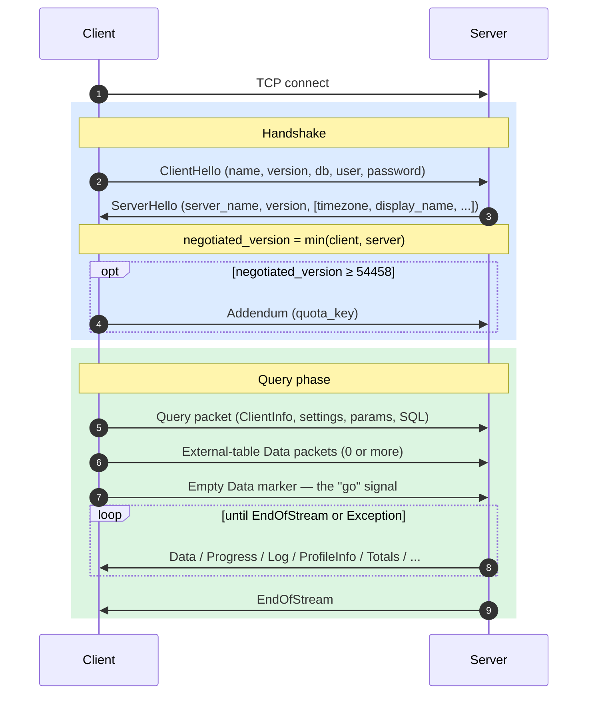
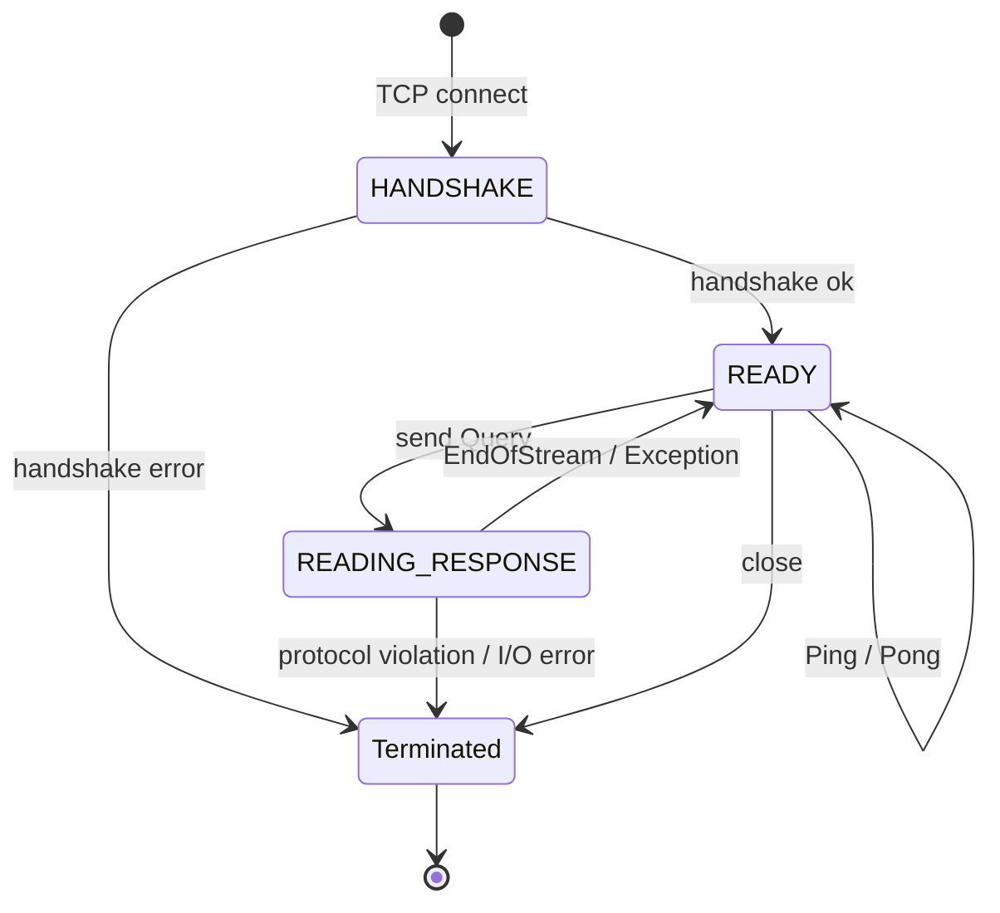
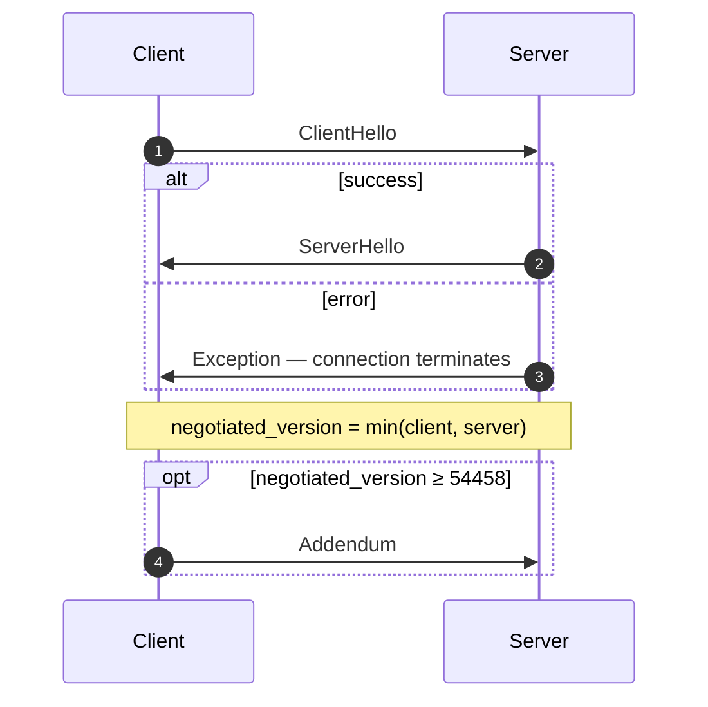
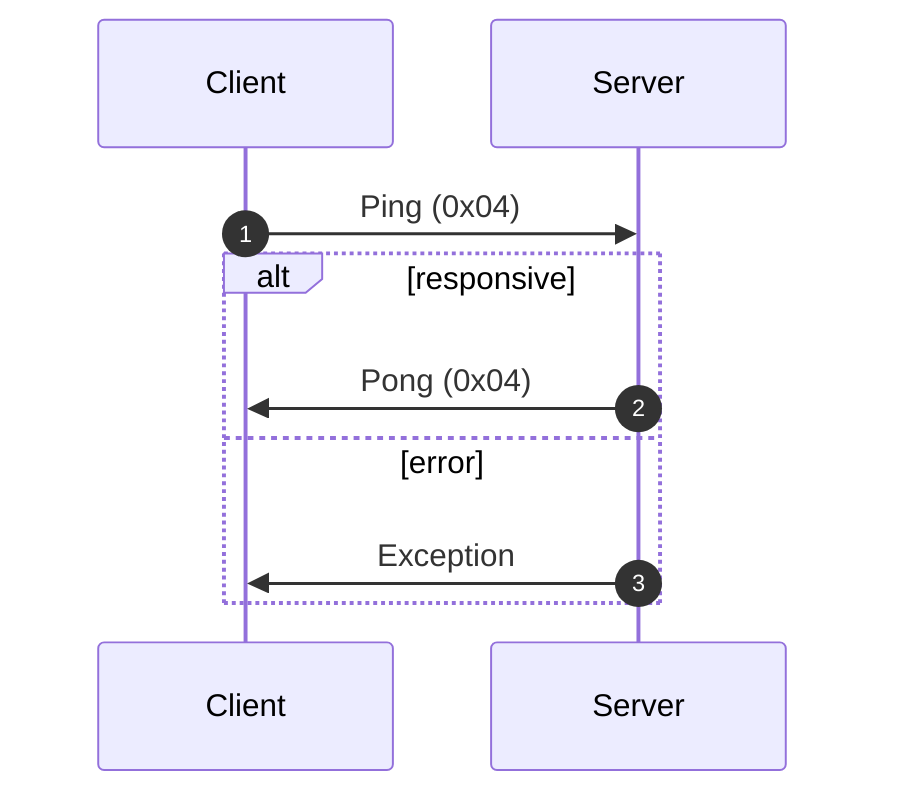
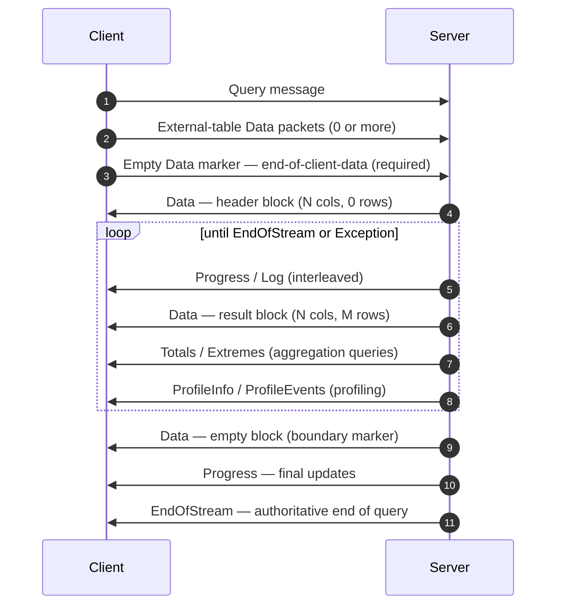
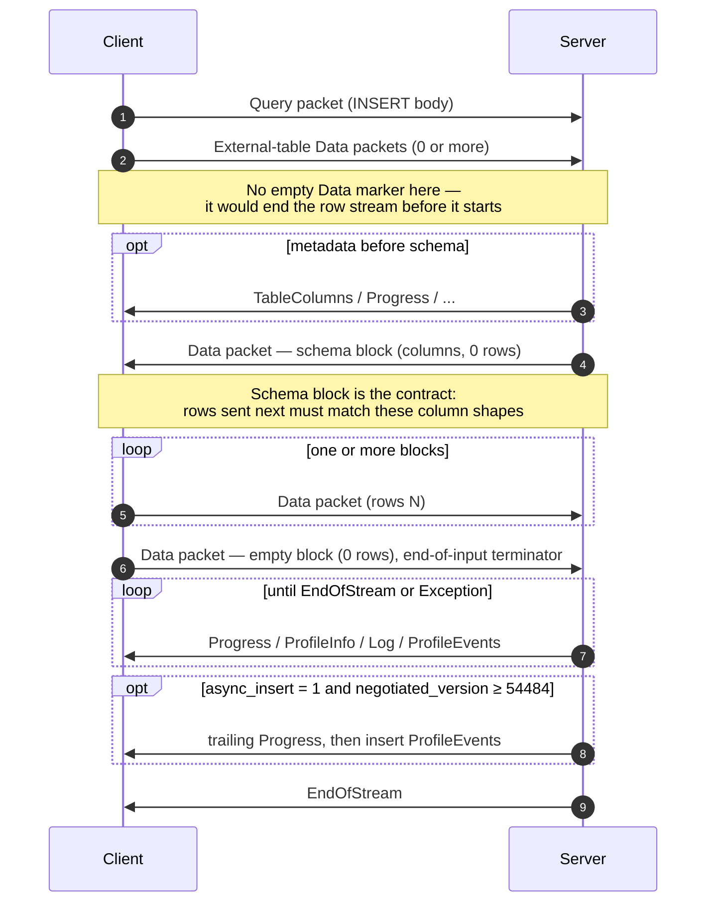
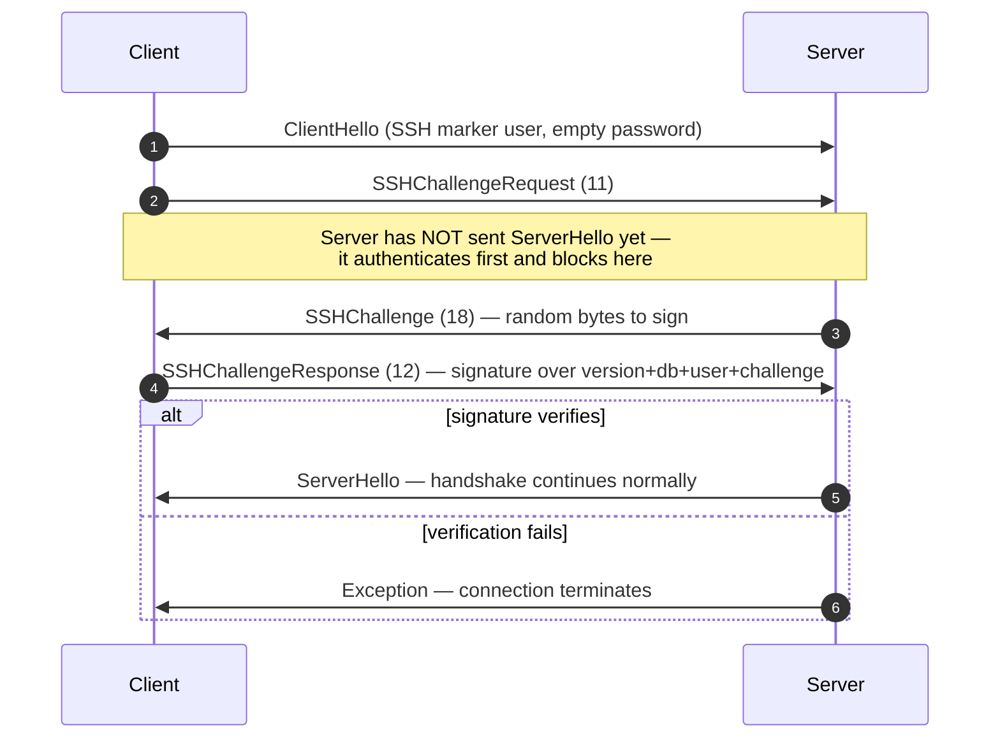

Le protocole natif est le protocole binaire orienté connexion utilisé par les clients et serveurs ClickHouse sur TCP. Il transporte les requêtes SQL, les données de résultat, les charges utiles `INSERT`, la télémétrie d&#39;exécution et les signaux d&#39;erreur. C&#39;est le protocole sous-jacent au client en ligne de commande, au client C++ et à la plupart des drivers natifs tiers.

Cette page couvre le protocole lui-même : tramage des paquets, machine à états de la connexion, négociation de version et corps de chaque message autre que `Block`. Les octets à l&#39;intérieur des paquets de la famille `Data` (le `Block`, ses colonnes et les encodages propres à chaque type) relèvent d&#39;un sujet distinct, documenté dans la spécification [Native Format](/fr/reference/interfaces/specs/NativeFormat).

<Info>
  **Spécification complémentaire**

  Cette page est l&#39;un des deux volets de cet ensemble et est publiée avec la spécification complémentaire [Native Format](/fr/reference/interfaces/specs/NativeFormat). Les deux spécifications se répartissent clairement les rôles : cette page couvre la couche des paquets et du transport ; la spécification Native Format couvre les octets à l&#39;intérieur des paquets de la famille `Data`.
</Info>

Quelques propriétés restent vraies dans l&#39;ensemble du protocole. Le protocole est binaire et positionnel : il n&#39;y a pas de balises de champ, sauf dans `BlockInfo`, donc un seul octet mal placé désynchronise tout ce qui suit. Il est avec état, et chaque connexion TCP traite une requête à la fois — il n&#39;y a pas de multiplexage. Les entiers à largeur fixe sont en little-endian.

<div id="overview">
  ## Vue d’ensemble
</div>

| Propriété           | Valeur                                                                                         |
| ------------------- | ---------------------------------------------------------------------------------------------- |
| Transport           | TCP, éventuellement encapsulé dans TLS                                                         |
| Ordre des octets    | Little-endian pour les entiers à largeur fixe                                                  |
| Encodage            | Binaire et positionnel (sans balises de champ, sauf dans `BlockInfo`)                          |
| Modèle de connexion | Avec état, une requête à la fois, sans multiplexage                                            |
| Versionnement       | Négocié lors du handshake ; certaines fonctionnalités dépendent de la version                  |
| Format de données   | Le [Native Format](/fr/reference/interfaces/specs/NativeFormat) pour toutes les données tabulaires |

Chaque message transmis commence par un code de type de paquet `VarUInt`, suivi d’un corps dont la structure dépend de ce code et de la version du protocole négociée.

Une connexion se déroule en trois phases — un handshake initial unique, puis un nombre quelconque d’échanges `Ping` ou `Query`, puis la fermeture :



Le protocole TCP natif transporte toujours des données tabulaires au format Native, quelle que soit la clause `FORMAT` dans la requête SQL. Le reformatage en `RowBinary`, `CSV`, `JSON`, etc. relève du client et s’effectue après le décodage des blocs Native. (L’interface HTTP suit un chemin de code différent qui, lui, *respecte bien* la clause `FORMAT` ; HTTP n’est pas traité ici.)

<div id="security">
  ## Sécurité
</div>

<div id="transport-security">
  ### Sécurité de transport (TLS)
</div>

TLS se situe à la couche de transport, en dessous du protocole. Lorsqu’il est activé, l’ensemble du flux TCP est chiffré, et les messages du protocole sont rigoureusement identiques octet pour octet, que TLS soit utilisé ou non.

<div id="authentication">
  ### Authentification
</div>

L’authentification a lieu lors du handshake, dans le message [`ClientHello`](#clienthello). Les champs `user` et `password` sont transmis sous forme de chaînes en clair ; la protection des credentials en transit repose donc sur le chiffrement au niveau du transport (TLS).

L’authentification SSH par challenge-response est disponible à partir de la version 54466 du protocole — voir [Authentification SSH par challenge-response](#ssh-authentication).

<div id="inter-server-secret">
  ### Secret inter-serveurs
</div>

Pour l’exécution de requêtes distribuées, les serveurs s’authentifient mutuellement en prouvant qu’ils connaissent un secret partagé, sans transmettre ce secret sur le réseau. Chaque `Query` contient un `auth_hash` SHA-256 de 32 octets dans le champ 4 de [`Query`](#query), calculé à partir d’un salt, d’un nonce, du secret configuré et de la requête, puis recalculé et comparé par le serveur destinataire. Ce mécanisme est conditionné par la fonctionnalité `INTERSERVER_SECRET` (v54441). Les clients externes envoient toujours ici une chaîne vide. Voir [Authentification inter-serveurs](#inter-server-authentication).

<div id="versioning-and-feature-gates">
  ## Gestion des versions et feature gates
</div>

<div id="version-negotiation">
  ### Négociation de la version
</div>

Le client et le serveur indiquent tous deux la version maximale du protocole qu’ils prennent en charge lors de l’établissement de la connexion. La **version négociée** est la plus petite des deux :

```text
negotiated_version = min(client_version, server_version)
```

Chaque message ultérieur utilise la version négociée pour déterminer quels champs sont présents dans les données binaires sérialisées transmises.

<div id="feature-gates">
  ### Feature gates
</div>

Une fonctionnalité est définie par la version du protocole qui l’a introduite, et elle est **active** lorsque la version négociée est supérieure ou égale à ce numéro.

<Warning>
  Lorsqu’une fonctionnalité est active, ses champs **doivent** être présents dans le flux binaire. Le protocole étant strictement positionnel, l’omission d’un champ soumis à un feature gate corrompt le flux d’octets de tous les champs suivants.
</Warning>

<div id="feature-table">
  ### Tableau des fonctionnalités
</div>

| Fonctionnalité                                          | Version | Affecte                          | Impact sur le format binaire                                                                                                                                                                                                                                                                                                                                                                                                                                                                                                                                                                                                                                              |
| ------------------------------------------------------- | ------- | -------------------------------- | ------------------------------------------------------------------------------------------------------------------------------------------------------------------------------------------------------------------------------------------------------------------------------------------------------------------------------------------------------------------------------------------------------------------------------------------------------------------------------------------------------------------------------------------------------------------------------------------------------------------------------------------------------------------------- |
| BLOCK&#95;INFO                                          | all     | Block                            | Ajoute le préfixe BlockInfo (`is_overflows`, `bucket_number`) à chaque Block.                                                                                                                                                                                                                                                                                                                                                                                                                                                                                                                                                                                             |
| CLIENT&#95;INFO                                         | 54032   | Query                            | Ajoute le bloc ClientInfo au corps de Query.                                                                                                                                                                                                                                                                                                                                                                                                                                                                                                                                                                                                                              |
| TIMEZONE                                                | 54058   | ServerHello                      | Ajoute le champ `timezone` à ServerHello.                                                                                                                                                                                                                                                                                                                                                                                                                                                                                                                                                                                                                                 |
| QUOTA&#95;KEY&#95;IN&#95;CLIENT&#95;INFO                | 54060   | ClientInfo                       | Ajoute le champ `quota_key` à ClientInfo.                                                                                                                                                                                                                                                                                                                                                                                                                                                                                                                                                                                                                                 |
| DISPLAY&#95;NAME                                        | 54372   | ServerHello                      | Ajoute le champ `display_name` à ServerHello.                                                                                                                                                                                                                                                                                                                                                                                                                                                                                                                                                                                                                             |
| VERSION&#95;PATCH                                       | 54401   | ServerHello, ClientInfo          | Ajoute le champ `version_patch` aux deux.                                                                                                                                                                                                                                                                                                                                                                                                                                                                                                                                                                                                                                 |
| SERVER&#95;LOGS                                         | 54406   | Log                              | Le serveur émet des paquets Log lorsque `send_logs_level` est défini.                                                                                                                                                                                                                                                                                                                                                                                                                                                                                                                                                                                                     |
| COLUMN&#95;DEFAULTS&#95;METADATA                        | 54410   | TableColumns                     | Le serveur peut envoyer le paquet [`TableColumns`](#tablecolumns) (type 11) avec les métadonnées des valeurs par défaut des colonnes avant le bloc de schéma d’entrée/INSERT. Envoyé uniquement lorsque la version négociée ≥ 54410 **et** que `input_format_defaults_for_omitted_fields` est activé. En dessous de cette version, le paquet n’est jamais envoyé ; les clients ne doivent pas l’attendre.                                                                                                                                                                                                                                                                 |
| WRITE&#95;CLIENT&#95;INFO                               | 54420   | Progress                         | Ajoute `wrote_rows` et `wrote_bytes` à Progress. (Malgré son nom, cela ne contrôle **pas** le bloc ClientInfo — c’est le rôle de `CLIENT_INFO` (v54032).)                                                                                                                                                                                                                                                                                                                                                                                                                                                                                                                 |
| SETTINGS&#95;SERIALIZED&#95;AS&#95;STRINGS              | 54429   | Query (encodage des settings)    | Modifie **la manière dont** la liste des settings, toujours présente, est encodée ; ne contrôle **pas** si les settings sont envoyés. v54429+ écrit chaque setting sous la forme `(name, flags, value-as-string)` ; les pairs plus anciens écrivent `(name, type-specific-binary-value)` sans indicateurs. Voir [Setting](#setting).                                                                                                                                                                                                                                                                                                                                      |
| INTERSERVER&#95;SECRET                                  | 54441   | Query                            | Ajoute à Query le champ inter-serveur `auth_hash` — un SHA-256 salé du secret du cluster, et non le secret brut. Les clients externes envoient une chaîne vide. Voir [Inter-server authentication](#inter-server-authentication).                                                                                                                                                                                                                                                                                                                                                                                                                                         |
| OPEN&#95;TELEMETRY                                      | 54442   | ClientInfo                       | Ajoute le trace context OpenTelemetry à ClientInfo.                                                                                                                                                                                                                                                                                                                                                                                                                                                                                                                                                                                                                       |
| DISTRIBUTED&#95;DEPTH                                   | 54448   | ClientInfo                       | Ajoute le champ `distributed_depth` à ClientInfo.                                                                                                                                                                                                                                                                                                                                                                                                                                                                                                                                                                                                                         |
| INITIAL&#95;QUERY&#95;START&#95;TIME                    | 54449   | ClientInfo                       | Ajoute le champ `initial_time` (Int64, largeur fixe).                                                                                                                                                                                                                                                                                                                                                                                                                                                                                                                                                                                                                     |
| PROFILE&#95;EVENTS                                      | 54451   | ProfileEvents                    | Le serveur émet des paquets ProfileEvents pendant l’exécution de la requête.                                                                                                                                                                                                                                                                                                                                                                                                                                                                                                                                                                                              |
| PARALLEL&#95;REPLICAS                                   | 54453   | ClientInfo                       | Ajoute à ClientInfo des champs de coordination des replicas parallèles.                                                                                                                                                                                                                                                                                                                                                                                                                                                                                                                                                                                                   |
| CUSTOM&#95;SERIALIZATION                                | 54454   | Block (Column)                   | Ajoute l’octet `has_custom_serialization` après la type string de chaque colonne.                                                                                                                                                                                                                                                                                                                                                                                                                                                                                                                                                                                         |
| ADDENDUM                                                | 54458   | Handshake                        | Le client envoie un addendum (`quota_key`) après l’échange de handshake.                                                                                                                                                                                                                                                                                                                                                                                                                                                                                                                                                                                                  |
| PARAMETERS                                              | 54459   | Query                            | Ajoute la liste des paramètres au corps de Query.                                                                                                                                                                                                                                                                                                                                                                                                                                                                                                                                                                                                                         |
| SERVER&#95;QUERY&#95;TIME&#95;IN&#95;PROGRESS           | 54460   | Progress                         | Ajoute le champ `elapsed_ns` à Progress.                                                                                                                                                                                                                                                                                                                                                                                                                                                                                                                                                                                                                                  |
| PASSWORD&#95;COMPLEXITY&#95;RULES                       | 54461   | ServerHello                      | Ajoute à ServerHello une liste de motifs regex de politique de mot de passe et de messages lisibles par l’utilisateur.                                                                                                                                                                                                                                                                                                                                                                                                                                                                                                                                                    |
| INTERSERVER&#95;SECRET&#95;V2                           | 54462   | ServerHello                      | Ajoute à ServerHello un nonce `UInt64` de 8 octets. Utilisé pour la signature des requêtes inter-serveurs ; les clients externes le décodent et l’ignorent.                                                                                                                                                                                                                                                                                                                                                                                                                                                                                                               |
| TOTAL&#95;BYTES&#95;IN&#95;PROGRESS                     | 54463   | Progress                         | Ajoute à Progress le champ `total_bytes_to_read` (VarUInt), entre `total_rows` et `wrote_rows`.                                                                                                                                                                                                                                                                                                                                                                                                                                                                                                                                                                           |
| TIMEZONE&#95;UPDATES                                    | 54464   | TimezoneUpdate                   | Ajoute le paquet serveur `TimezoneUpdate` (type 17). Corps : un seul `String` contenant le timezone de la session. Envoyé uniquement par l’initialiseur de la table function `input`, juste après le bloc de schéma d’entrée, afin que le client analyse les lignes qu’il envoie avec la `session_timezone` du serveur. Voir [TimezoneUpdate](#timezoneupdate).                                                                                                                                                                                                                                                                                                           |
| SPARSE&#95;SERIALIZATION                                | 54465   | Block (Column)                   | Le serveur peut définir `has_custom_serialization = 1` et émettre une colonne encodée en sparse. Wire format : type sur 1 octet (0x01 = SPARSE), puis flux de décalages VarUInt terminé par EOG, puis les valeurs non par défaut encodées de manière dense dans le type interne. Voir [kind&#95;stack and sparse encoding](/fr/reference/interfaces/specs/NativeFormat#kind-stack-and-sparse-encoding).                                                                                                                                                                                                                                                                      |
| SSH&#95;AUTHENTICATION                                  | 54466   | Flux d’authentification          | Ajoute l’authentification SSH par challenge-response. Opt-in : le client envoie un `user` de la forme `" SSH KEY AUTHENTICATION " + <real_user>` avec un mot de passe vide pour la déclencher. Voir [SSH challenge-response authentication](#ssh-authentication).                                                                                                                                                                                                                                                                                                                                                                                                         |
| TABLE&#95;READ&#95;ONLY&#95;CHECK                       | 54467   | TablesStatusResponse             | Ajoute un indicateur `is_readonly` à la ligne de chaque table dans TablesStatusResponse. Les clients externes qui n’émettent pas `TablesStatusRequest` ne voient aucun changement du wire format.                                                                                                                                                                                                                                                                                                                                                                                                                                                                         |
| SYSTEM&#95;KEYWORDS&#95;TABLE                           | 54468   | tables système                   | Le serveur renseigne `system.keywords` afin que le `clickhouse-client` canonique puisse autocompléter les keywords. Aucun changement du wire format du protocole natif.                                                                                                                                                                                                                                                                                                                                                                                                                                                                                                   |
| ROWS&#95;BEFORE&#95;AGGREGATION                         | 54469   | ProfileInfo                      | Ajoute `applied_aggregation` (Bool) et `rows_before_aggregation` (VarUInt) à ProfileInfo, dans cet ordre à la fin.                                                                                                                                                                                                                                                                                                                                                                                                                                                                                                                                                        |
| CHUNKED&#95;PROTOCOL                                    | 54470   | Tramage de connexion             | Le tramage par fragments de chaque paquet encapsule chaque corps de paquet. Négocié dans Addendum. ServerHello contient la préférence du serveur pour chaque direction ; Addendum contient le choix final du client. Voir [chunked framing](#chunked-framing).                                                                                                                                                                                                                                                                                                                                                                                                            |
| VERSIONED&#95;PARALLEL&#95;REPLICAS&#95;PROTOCOL        | 54471   | ServerHello, Addendum            | Les deux côtés échangent une version `VarUInt` du protocole de coordination des répliques parallèles. Le champ de ServerHello est placé **immédiatement après `protocol_version`** (avant `timezone`). Le champ d’Addendum est ajouté après les chaînes du protocole fragmenté. Valeur actuelle : `7` (`DBMS_PARALLEL_REPLICAS_PROTOCOL_VERSION`).                                                                                                                                                                                                                                                                                                                        |
| INTERSERVER&#95;EXTERNALLY&#95;GRANTED&#95;ROLES        | 54472   | Query                            | Ajoute un champ `String external_roles` au corps de Query, entre le terminateur des settings et le hachage du secret inter-server. Les clients externes envoient une liste de rôles vide (un seul octet `0x00`, c.-à-d. VarUInt 0 dans une enveloppe String).                                                                                                                                                                                                                                                                                                                                                                                                             |
| V2&#95;DYNAMIC&#95;AND&#95;JSON&#95;SERIALIZATION       | 54473   | Column body                      | Le serveur peut émettre la sérialisation V2 pour les types de colonnes `Dynamic` et `JSON` — cela détermine la version de `state_prefix` utilisée. Voir [versioned types](/fr/reference/interfaces/specs/NativeFormat#versioned-types).                                                                                                                                                                                                                                                                                                                                                                                                                                      |
| SERVER&#95;SETTINGS                                     | 54474   | ServerHello                      | Le serveur diffuse ses server settings non par défaut sous forme de liste à la fin de ServerHello, après `nonce`. Format : triplets `(key, flags, value)` terminés par une clé vide — identique à la settings list du Query packet.                                                                                                                                                                                                                                                                                                                                                                                                                                       |
| QUERY&#95;AND&#95;LINE&#95;NUMBERS                      | 54475   | ClientInfo                       | Ajoute `script_query_number` (VarUInt) et `script_line_number` (VarUInt) à la fin de ClientInfo. Utilisé par clickhouse-client pour attribuer les erreurs dans les scripts multi-instructions ; les clients externes envoient `0, 0`.                                                                                                                                                                                                                                                                                                                                                                                                                                     |
| JWT&#95;IN&#95;INTERSERVER                              | 54476   | ClientInfo                       | Ajoute un indicateur de présence JWT de type UInt8 ainsi qu’un `String jwt` optionnel à la fin de ClientInfo. Les clients externes (sans JWT) envoient l’octet `0x00`. (Écrit `DBMS_MIN_REVISON_WITH_JWT_IN_INTERSERVER` en C++ — notez la faute de frappe dans le nom de la constante.)                                                                                                                                                                                                                                                                                                                                                                                  |
| QUERY&#95;PLAN&#95;SERIALIZATION                        | 54477   | ServerHello, QueryPlan packet    | ServerHello ajoute `VarUInt query_plan_serialization_version` après les server settings. Introduit également `ClientPacket::QueryPlan` (code `13`) pour le transport inter-server de plans de requête préconstruits — les clients externes ne l’envoient jamais.                                                                                                                                                                                                                                                                                                                                                                                                          |
| PARALLEL&#95;BLOCK&#95;MARSHALLING                      | 54478   | Block (Column)                   | Le serveur peut encapsuler les colonnes dans `ColumnBLOB` (compressé inline) pour le traitement parallèle. Dépend du fait que la requête ait la compression activée ET `rows > 1` ; sinon, le format binaire habituel des colonnes s’applique. Les clients qui n’activent jamais la compression sur les Query packets sortants ne voient aucun changement sur le wire.                                                                                                                                                                                                                                                                                                    |
| VERSIONED&#95;CLUSTER&#95;FUNCTION&#95;PROTOCOL         | 54479   | ServerHello                      | Ajoute `VarUInt cluster_function_protocol_version` à la fin de ServerHello. Utilisé pour les table functions `*Cluster` (`s3Cluster`, etc.). Les clients externes le décodent et l’ignorent.                                                                                                                                                                                                                                                                                                                                                                                                                                                                              |
| OUT&#95;OF&#95;ORDER&#95;BUCKETS&#95;IN&#95;AGGREGATION | 54480   | BlockInfo                        | Ajoute le champ 3 (`out_of_order_buckets: Vec<Int32>`) au flux de BlockInfo balisé par champs. Décodé comme `[VarUInt count][Int32]*count`. Les clients externes ne l’émettent pas eux-mêmes ; le décodeur lit toute liste non vide envoyée par le serveur.                                                                                                                                                                                                                                                                                                                                                                                                               |
| COMPRESSED&#95;LOGS&#95;PROFILE&#95;EVENTS&#95;COLUMNS  | 54481   | Log, ProfileEvents, TableColumns | Le serveur peut encapsuler les corps des paquets [`Log`](#log), [`ProfileEvents`](#profileevents) et [`TableColumns`](#tablecolumns) dans la [trame de compression](/fr/reference/interfaces/specs/NativeFormat#compression-frame). À cette version, les trois corps passent par le même chemin de sortie éventuellement compressé, qui ne devient une véritable trame de compression que lorsque la requête a `compression = true`. Les clients qui n’activent jamais la compression sur les Query packets sortants ne voient aucun changement sur le wire.                                                                                                                 |
| REPLICATED&#95;SERIALIZATION                            | 54482   | Block (Column)                   | Le serveur peut émettre des colonnes avec `kind&#95;stack 0x04 = REPLICATED` — une forme compacte de type dictionnaire pour les valeurs répétées — voir [kind&#95;stack and sparse encoding](/fr/reference/interfaces/specs/NativeFormat#kind-stack-and-sparse-encoding). En dessous de cette version, l’émetteur développait ces colonnes avant l’envoi. Décodé via recherche d’index (`elements[indexes[i]]` par row) ; types feuille et types internes `Nullable`/`Array`/`Tuple`/`Map`/`Nested`/`LowCardinality` pris en charge.                                                                                                                                         |
| NULLABLE&#95;SPARSE&#95;SERIALIZATION                   | 54483   | Block (Column)                   | Compose la sérialisation sparse avec `Nullable(T)`. En dessous de cette version, l’émetteur développait sparse pour les colonnes Nullable avant l’envoi ; à partir de v54483, les données sur le wire sont sparse-over-Nullable. Voir [kind&#95;stack and sparse encoding](/fr/reference/interfaces/specs/NativeFormat#kind-stack-and-sparse-encoding).                                                                                                                                                                                                                                                                                                                      |
| PROGRESS&#95;IN&#95;ASYNC&#95;INSERT                    | 54484   | Progress (INSERT)                | Lors d’un INSERT **asynchrone** (`async_insert = 1`), une fois l’insert flushé, le serveur envoie un paquet [`Progress`](#progress) supplémentaire, puis les `ProfileEvents` de l’insert, avant `EndOfStream`. Dépend de la version *négociée* ≥ 54484 ; en dessous, le serveur omet ce Progress final. Le format binaire de Progress est inchangé — seule son émission est nouvelle. En pratique, l’incrément transporte le temps écoulé ; les compteurs de rows écrites sont signalés via les ProfileEvents associés. Un client qui draine déjà les paquets Progress entrelacés n’a besoin d’aucun changement de format, seulement de tolérer un paquet supplémentaire. |
| CLIENT&#95;AGENT&#95;IN&#95;CLIENT&#95;INFO             | 54485   | ClientInfo                       | Ajoute un `String` `client_agent` final à ClientInfo. Le client canonique détecte automatiquement un identifiant d’agent dans son environnement (par exemple `claude-code`, `cursor`, `gemini-cli` ou la valeur de la variable `AGENT`) ; un client externe pour lequel rien n’est détecté envoie une chaîne vide. Obligatoire dès lors que la version négociée est ≥ 54485 — l’omettre désynchronise le reste du Query packet.                                                                                                                                                                                                                                           |

<div id="packet-envelope">
  ## Enveloppe de paquet
</div>

Tous les messages transmis sur le réseau ont la même structure externe, dans les deux sens :

```text
[VarUInt: packet_type_code]    always encoded as VarUInt
[message body]                 format depends on packet_type_code
```

Les tableaux complets des types de paquets se trouvent dans la [référence des types de paquets](#packet-type-reference).

Le type de paquet est un `VarUInt`, et non un octet de largeur fixe. Pour les valeurs inférieures à 128, un `VarUInt` produit le même octet, mais les implémentations doivent utiliser l&#39;encodage `VarUInt` afin de rester compatibles si de futurs types de paquets devaient atteindre 128 ou plus.

La [référence des messages](#message-reference) documente uniquement la **charge utile** de chaque paquet — les octets situés après le code du type de paquet. La numérotation des champs commence à 1 avec le premier champ de la charge utile.

<div id="chunked-framing">
  ### Tramage par fragments (v54470+)
</div>

Lorsque la fonctionnalité `CHUNKED_PROTOCOL` est **négociée** (voir [le handshake](#handshake-phase)), chaque paquet sur le wire est tramé par fragments. Ce tramage est **propre à chaque sens** : client→serveur et serveur→client sont négociés séparément et peuvent au final utiliser des modes différents (avec fragments ou sans encapsulation).

Format binaire par paquet :

```text
<chunk>...   one or more chunks; their payloads concatenated form the whole packet
[u32 LE = 0] zero-size terminator marking end of packet
```

Format binaire par fragment :

```text
[u32 LE: chunk_size]   chunk_size in [1, UINT32_MAX]
[chunk_size bytes]     packet bytes (see note below)
```

Le type de paquet `VarUInt` se trouve **dans** le flux découpé en fragments : c’est le premier octet de la charge utile du paquet (le premier octet du premier fragment), et non un octet distinct envoyé avant le tramage. La charge utile fragmentée de chaque paquet correspond à l’intégralité de `[VarUInt packet_type_code][message body]` de l’[enveloppe de paquet](#packet-envelope). Un client qui laisse le type de paquet en dehors du flux découpé en fragments amène le pair à lire cet octet de type comme le premier octet de la taille de fragment `u32`, ce qui désynchronise la connexion.

Un même paquet peut être réparti sur plusieurs fragments si le tampon d’écriture se remplit en plein milieu du paquet ; la coupure peut se produire n’importe où, y compris au milieu du `VarUInt` du type de paquet. Le lecteur concatène les charges utiles des fragments et traite le zéro final sur 4 octets comme une limite de paquet transparente — il le consomme, mais ne le transmet pas à ce qui lit les corps de paquet.

Les paquets sans corps restent enveloppés : un paquet d’un seul octet comme `Ping` ou `Pong` devient `[u32 size = 1][0x04][u32 0]` une fois le découpage en fragments négocié. Toute mention ailleurs sur cette page d’un « octet unique sur le réseau » correspond à la forme antérieure au découpage en fragments.

**Négociation.** `ServerHello` et `Addendum` transportent chacun deux champs `String`, un par direction, avec des valeurs tirées de `{"chunked", "notchunked", "chunked_optional", "notchunked_optional"}` :

* `chunked` / `notchunked` sont stricts : ce côté exige exactement ce mode.
* Les variantes `_optional` sont souples : elles acceptent le mode choisi par l’autre côté.

La valeur retenue pour chaque direction est calculée par paire :

| Préférence serveur      | Préférence client       | Valeur retenue                                               |
| ----------------------- | ----------------------- | ------------------------------------------------------------ |
| `*_optional`            | n’importe laquelle      | suivre le CLIENT (son `starts_with("chunked")`)              |
| n’importe laquelle      | `*_optional`            | suivre le SERVEUR                                            |
| `chunked` strict        | `chunked` strict        | `chunked`                                                    |
| `notchunked` strict     | `notchunked` strict     | `notchunked`                                                 |
| incompatibilité stricte | incompatibilité stricte | **erreur de protocole** — la connexion DOIT être interrompue |

Côté client, la préférence d’ENVOI du client est négociée avec la préférence de RÉCEPTION du serveur, et inversement.

**Temporalité.** Les chaînes de négociation transitent sur le réseau sans tramage : `ClientHello` → `ServerHello` (préférences du serveur) → `Addendum` (valeurs négociées du client). Le basculement vers le tramage s’applique à chaque octet envoyé *après* l’écriture de l’`Addendum`. L’`Addendum` lui-même, le `ClientHello` et le `ServerHello` sont toujours envoyés sans tramage.

<div id="connection-lifecycle">
  ## Cycle de vie de la connexion
</div>

À tout moment, une connexion se trouve dans un seul des quatre états suivants : `HANDSHAKE`, `READY`, `READING_RESPONSE`, ou terminée. Comme le protocole ne prend pas en charge le multiplexage, un client qui envoie une nouvelle requête avant d’avoir entièrement lu la réponse précédente entrelace les octets dans le flux de données transmis et corrompt le flux.

<div id="states">
  ### États
</div>



Le scénario nominal suit un chemin direct — `HANDSHAKE → READY → READING_RESPONSE → READY` — avec la boucle `Ping`/`Pong` sur elle-même, et toutes les transitions d’échec convergent vers l’unique sink `Terminated`.

| State              | Description                                                                                                                                                                                                                                             |
| ------------------ | ------------------------------------------------------------------------------------------------------------------------------------------------------------------------------------------------------------------------------------------------------- |
| `HANDSHAKE`        | État initial après l’ouverture de la connexion TCP. Seuls les messages de [handshake](#handshake-phase) sont valides. Passe à `READY` en cas de succès ou se termine en cas d’échec.                                                                  |
| `READY`            | Au repos. Le client peut envoyer [Ping](#ping-phase), [Query](#query-phase), ou fermer la connexion. La connexion peut rester en `READY` indéfiniment (sous réserve de `idle_connection_timeout`, voir les [limites de connexion](#connection-limits)). |
| `READING_RESPONSE` | État atteint lorsque le client envoie une Query. Le client doit vider intégralement le flux de réponse du serveur avant de revenir à `READY`. Le seul paquet client→serveur autorisé ici est Cancel (non décrit sur cette page).                        |
| Terminated         | N’est plus utilisable. Le client doit ouvrir une nouvelle connexion TCP et relancer le handshake.                                                                                                                                                     |

<div id="handshake-phase">
  ### Phase de handshake
</div>

Authentification et négociation de la version du protocole. Cette phase ne se produit qu’une seule fois par connexion, avant toute autre opération.

La connexion TCP vient de s’ouvrir et aucun message n’a encore été échangé. Le déroulement :



1. Le client envoie [`ClientHello`](#clienthello) avec la version maximale du protocole qu’il prend en charge.

2. Le client lit la réponse et la traite selon le type de paquet :

   | Type de paquet  | Action                                                                                                               |
   | --------------- | -------------------------------------------------------------------------------------------------------------------- |
   | `Hello` (0)     | Décode [`ServerHello`](#serverhello). Calcule `negotiated_version = min(client_ver, server_ver)`. Passe à l’étape 3. |
   | `Exception` (2) | Décode [`Exception`](#exception). Le retourne comme erreur et termine la connexion.                                  |
   | anything else   | Violation du protocole. Termine la connexion.                                                                        |

3. Si `negotiated_version ≥ 54458` (la fonctionnalité `ADDENDUM`), le client envoie un [`Addendum`](#addendum). Cette décision repose sur la version **négociée**, et non sur la version déclarée du client.

En cas de succès, la connexion passe à `READY` ; en cas d’erreur, elle est interrompue.

<div id="ping-phase">
  ### Phase Ping
</div>

Une vérification de vivacité au niveau de l’application, indépendante du keepalive TCP. Un aller-retour Ping/Pong réussi confirme que la connexion TCP est active dans les deux sens et que le serveur répond. Ping est sans état et n’est corrélé à aucune requête, de sorte que plusieurs Pings successifs sont indépendants.

À partir de `READY`, le flux est :



1. Le client envoie [`Ping`](#ping).
2. Le client lit la réponse :

   | Type de paquet  | Action                                                      |
   | --------------- | ----------------------------------------------------------- |
   | `Pong` (4)      | Disponibilité confirmée. Revenir à `READY`.                 |
   | `Exception` (2) | Décoder [`Exception`](#exception) et la renvoyer en erreur. |
   | tout autre cas  | Violation du protocole.                                     |

<div id="query-phase">
  ### Phase de requête
</div>

Le client soumet une instruction SQL ; le serveur renvoie en continu des blocs de résultats et la télémétrie d’exécution. La réponse est une séquence de paquets qui se termine par exactement un `EndOfStream` ou une `Exception`.

À partir de `READY`, le flux est :



En cas d’erreur à n’importe quelle étape, le serveur envoie une `Exception` au lieu de `EndOfStream`, ce qui met fin à la requête.

1. Le client envoie [`Query`](#query) avec un `query_id` unique (généralement un UUID).
2. Le client envoie les tables externes éventuelles, puis le marqueur Data vide. Le paquet Data vide a `table_name = ""`, `num_columns = 0`, `num_rows = 0`. Le serveur ne commence pas à exécuter la requête tant qu’il n’a pas reçu ce marqueur.
3. Le client passe à `READING_RESPONSE` et vide son tampon d’écriture.
4. Le client lit les paquets de réponse en boucle et les traite selon leur type :

   | Type de paquet       | Action                                                                                                                                                                                                                     |
   | -------------------- | -------------------------------------------------------------------------------------------------------------------------------------------------------------------------------------------------------------------------- |
   | `Data` (1)           | Décode le bloc. Le premier paquet Data est l’en-tête de schéma ; les suivants sont des blocs de résultat (à accumuler) ; un bloc vide est un marqueur de délimitation. `num_rows == 0` n’est **pas** la fin de la requête. |
   | `Progress` (3)       | Métriques d’exécution. Chaque paquet est un **incrément** par rapport au précédent — à accumuler localement.                                                                                                               |
   | `EndOfStream` (5)    | Requête terminée. Quitter la boucle et revenir à `READY`.                                                                                                                                                                  |
   | `ProfileInfo` (6)    | Données de profiling post-exécution.                                                                                                                                                                                       |
   | `Totals` (7)         | Bloc des totaux d’agrégation (même format binaire que Data).                                                                                                                                                               |
   | `Extremes` (8)       | Bloc des valeurs min/max (même format binaire que Data).                                                                                                                                                                   |
   | `Log` (10)           | Ligne du journal du serveur.                                                                                                                                                                                               |
   | `TableColumns` (11)  | Métadonnées des valeurs par défaut des colonnes.                                                                                                                                                                           |
   | `ProfileEvents` (14) | Compteurs de performance.                                                                                                                                                                                                  |
   | `Exception` (2)      | Décode et renvoie comme erreur. Quitter la boucle et revenir à `READY`.                                                                                                                                                    |
   | tout autre type      | Inattendu pendant la phase de requête. Mettre fin à la connexion.                                                                                                                                                          |

À la réception de `EndOfStream` ou d’une `Exception` gérée, la connexion revient à `READY`. Une violation du protocole ou une erreur d’E/S y met fin.

<Note>
  Le cas `num_rows == 0` piège souvent les nouvelles implémentations. Un bloc de zéro ligne est un marqueur de délimitation ou un en-tête de schéma, pas un signal de fin de flux. Seuls `EndOfStream` ou `Exception` mettent fin à la réponse.
</Note>

<div id="insert-phase">
  ### Phase INSERT
</div>

La phase INSERT correspond à la [phase de requête](#query-phase), avec deux échanges supplémentaires. Le client soumet une instruction `INSERT` ; le serveur répond avec un **bloc de schéma** décrivant la table cible ; le client envoie des paquets Data contenant les lignes, puis le marqueur Data vide ; le serveur termine avec `EndOfStream` ou `Exception`.

À partir de `READY`, la requête SQL est un `INSERT` de la forme `INSERT INTO <table> [(<cols>)] VALUES` — sans littéral `VALUES (...)` intégré à la requête, puisque les données des lignes transitent via des paquets Data. Le flux :



1. Le client envoie [`Query`](#query) avec `body` contenant la requête SQL INSERT.
2. Le client envoie les éventuelles tables externes (cas rare pour INSERT). Contrairement à la [phase de requête](#query-phase), il n’envoie **pas** ici de marqueur Data vide. Le paquet `Query` de `INSERT` est envoyé avec des données en attente ; le bloc vide de fin de données est donc reporté à l’étape 5. L’envoyer avant le bloc de schéma amènerait le serveur à l’interpréter comme la fin du flux de lignes, à terminer l’INSERT sans aucune ligne, puis à analyser le premier vrai paquet de lignes comme un paquet de niveau supérieur parasite.
3. Le client consomme les paquets de métadonnées (TableColumns, Progress, ProfileInfo, Log, ProfileEvents) jusqu’à lire le paquet Data de schéma — un Block avec 0 ligne, mais la structure complète des colonnes (noms et types). Le bloc de schéma fait foi : les lignes envoyées ensuite par le client doivent correspondre à cette structure de colonnes.
4. Le client envoie un ou plusieurs blocs de données. Pour chaque bloc, il écrit `VarUInt(ClientPacket::Data = 2)`, puis `String("")` pour le nom vide de la table externe, puis le Block. Les types de colonnes doivent correspondre, par position, à ceux des colonnes du bloc de schéma.
5. Le client envoie le terminateur de fin d’entrée : un paquet Data avec un Block vide (0 colonne, 0 ligne).
6. Le client consomme le flux de réponse jusqu’à `EndOfStream` (succès) ou `Exception` (échec).

**INSERT asynchrone (v54484+).** Lorsque la requête contient `async_insert = 1`, le serveur place les lignes en file d’attente et les écrit dans le cadre d’un lot. À la version négociée ≥ 54484 (`PROGRESS_IN_ASYNC_INSERT`), une fois l’écriture terminée, le serveur émet un paquet [`Progress`](#progress) supplémentaire, immédiatement suivi des `ProfileEvents` de l’INSERT, puis de `EndOfStream`. En dessous de 54484, le serveur omet ce `Progress` final. Ce paquet est un `Progress` ordinaire ; comme le serveur réinitialise le pipeline de requête avant d’y intégrer les compteurs d’écriture, l’incrément ne contient en pratique que le temps écoulé, et les statistiques sur les lignes et octets écrits parviennent au client via les `ProfileEvents` associés. Un client qui consomme déjà les paquets `Progress` entrelacés à l’étape 6 n’a qu’à accepter un paquet de plus.

La connexion revient à l’état `READY` à la réception de `EndOfStream` ou d’une `Exception` gérée. Les violations du protocole et les erreurs d’E/S y mettent fin.

<div id="message-reference">
  ## Référence des messages
</div>

Les champs sont listés dans l&#39;ordre du format wire. La colonne `Type` utilise :

* `VarUInt` — entier non signé à longueur variable (voir [VarUInt](/fr/reference/interfaces/specs/NativeFormat#varuint)).
* `String` — octets préfixés par un VarUInt (voir [String](/fr/reference/interfaces/specs/NativeFormat#string)).
* `UInt8`, `Int32`, etc. — entiers little-endian à largeur fixe.
* `Bool` — un seul octet, `0x00` ou `0x01`.

La colonne `Role` indique qui utilise chaque champ :

* **client** — défini par les clients externes.
* **inter-serveur** — n&#39;a de sens que pour la communication de serveur à serveur ; les clients externes écrivent une valeur par défaut.
* **universal** — utilisé par les deux.

Ces tableaux documentent uniquement le corps de chaque paquet, après le code de type de paquet.

<div id="clienthello">
  ### ClientHello (type de paquet 0)
</div>

Client → Server. Le premier message après l’établissement de la connexion TCP.

| # | Champ                | Type    | Rôle      | Description                                                 |
| - | -------------------- | ------- | --------- | ----------------------------------------------------------- |
| 1 | client&#95;name      | String  | universel | Identifiant du client (p. ex., `"clickhouse-client"`)       |
| 2 | version&#95;major    | VarUInt | universel | Version majeure du client                                   |
| 3 | version&#95;minor    | VarUInt | universel | Version mineure du client                                   |
| 4 | protocol&#95;version | VarUInt | universel | Version maximale du protocole prise en charge par le client |
| 5 | database             | String  | universel | Nom de la base de données par défaut                        |
| 6 | user                 | String  | universel | Nom d’utilisateur pour l’authentification                   |
| 7 | password             | String  | universel | Mot de passe (en texte brut)                                |

<div id="serverhello">
  ### ServerHello (type de paquet 0)
</div>

Serveur → Client. Réponse à ClientHello lorsque l&#39;authentification réussit.

| #  | Champ                                          | Type      | Rôle         | Condition                                                 | Description                                                                                                                                                                                                                                                                                                                 |
| -- | ---------------------------------------------- | --------- | ------------ | --------------------------------------------------------- | --------------------------------------------------------------------------------------------------------------------------------------------------------------------------------------------------------------------------------------------------------------------------------------------------------------------------- |
| 1  | server&#95;name                                | String    | universel    | toujours                                                  | Identifiant du serveur                                                                                                                                                                                                                                                                                                      |
| 2  | version&#95;major                              | VarUInt   | universel    | toujours                                                  | Version majeure du serveur                                                                                                                                                                                                                                                                                                  |
| 3  | version&#95;minor                              | VarUInt   | universel    | toujours                                                  | Version mineure du serveur                                                                                                                                                                                                                                                                                                  |
| 4  | protocol&#95;version                           | VarUInt   | universel    | toujours                                                  | Version du protocole du serveur                                                                                                                                                                                                                                                                                             |
| 4a | parallel&#95;replicas&#95;protocol&#95;version | VarUInt   | universel    | VERSIONED&#95;PARALLEL&#95;REPLICAS&#95;PROTOCOL (v54471) | Version du protocole de coordination des répliques parallèles du serveur. **Position sur le wire : immédiatement après `protocol_version`**, avant `timezone`. Valeur actuelle : `7`.                                                                                                                                       |
| 5  | timezone                                       | String    | universel    | TIMEZONE (v54058)                                         | Fuseau horaire du serveur (par ex. : `"UTC"`)                                                                                                                                                                                                                                                                               |
| 6  | display&#95;name                               | String    | universel    | DISPLAY&#95;NAME (v54372)                                 | Nom du serveur lisible par l&#39;humain                                                                                                                                                                                                                                                                                     |
| 7  | version&#95;patch                              | VarUInt   | universel    | VERSION&#95;PATCH (v54401)                                | Version corrective du serveur                                                                                                                                                                                                                                                                                               |
| 8  | proto&#95;send&#95;chunked&#95;srv             | String    | universel    | CHUNKED&#95;PROTOCOL (v54470)                             | Mode de fragmentation sortante préféré du serveur. L&#39;une des valeurs suivantes : `"chunked"`, `"notchunked"`, `"chunked_optional"`, `"notchunked_optional"`. Voir [tramage par fragments](#chunked-framing). **Se trouve AVANT `password_complexity_rules` sur le wire même si sa version d&#39;activation est plus élevée.** |
| 9  | proto&#95;recv&#95;chunked&#95;srv             | String    | universel    | CHUNKED&#95;PROTOCOL (v54470)                             | Mode de fragmentation entrante préféré du serveur. Même ensemble de valeurs que le champ 8.                                                                                                                                                                                                                                 |
| 10 | password&#95;complexity&#95;rules              | Rule[]    | universel    | PASSWORD&#95;COMPLEXITY&#95;RULES (v54461)                | Politique de mot de passe du serveur. `VarUInt count` suivi de `count × Rule`. Voir ci-dessous.                                                                                                                                                                                                                             |
| 11 | nonce                                          | UInt64    | inter-serveur | INTERSERVER&#95;SECRET&#95;V2 (v54462)                    | Nonce aléatoire LE de 8 octets. Le schéma de signature des query inter-serveurs du serveur l&#39;utilise. Les clients externes DOIVENT le décoder (pour conserver l&#39;alignement du flux) et DEVRAIENT ignorer sa valeur.                                                                                                 |
| 12 | server&#95;settings                            | Setting[] | universel    | SERVER&#95;SETTINGS (v54474)                              | Diffusion des settings non par défaut du serveur. Format : zéro, un ou plusieurs triplets `(String key, VarUInt flags, String value)`, terminés par une clé vide. Identique à la [liste des settings du paquet Query](#setting).                                                                                            |
| 13 | query&#95;plan&#95;serialization&#95;version   | VarUInt   | universel    | QUERY&#95;PLAN&#95;SERIALIZATION (v54477)                 | Version de sérialisation du plan de query prise en charge par le serveur. Les clients externes la décodent puis l&#39;ignorent.                                                                                                                                                                                             |
| 14 | cluster&#95;function&#95;protocol&#95;version  | VarUInt   | universel    | VERSIONED&#95;CLUSTER&#95;FUNCTION&#95;PROTOCOL (v54479)  | Version du protocole de fonction de table `*Cluster` du serveur. Les clients externes la décodent puis l&#39;ignorent.                                                                                                                                                                                                      |

**Rule** — élément de `password_complexity_rules` :

| # | Champ   | Type   | Description                                                                                           |
| - | ------- | ------ | ----------------------------------------------------------------------------------------------------- |
| 1 | pattern | String | Expression régulière à laquelle un mot de passe conforme doit correspondre.                           |
| 2 | message | String | Explication lisible par l&#39;humain affichée lorsqu&#39;un mot de passe ne respecte pas cette règle. |

Cette liste reflète la configuration de politique de mot de passe définie par l&#39;opérateur du serveur et reste purement indicative : le serveur n&#39;applique pas ces règles pendant le handshake. Un client qui propose une fonctionnalité de changement ou de définition de mot de passe peut s&#39;en servir pour signaler les erreurs avant d&#39;envoyer au serveur un mot de passe non conforme.

<Note>
  Pour borner l&#39;utilisation des ressources face à un serveur hostile ou mal configuré, plafonnez la valeur décodée de `count` à 256 entrées et limitez chaque String `pattern` et `message` à 4096 octets. Une valeur `count` de `0` (aucune paire ensuite) est le cas le plus courant sur les serveurs sans politique de mot de passe configurée.
</Note>

<div id="addendum">
  ### Addendum (sans type de paquet)
</div>

Client → Server, activé par `ADDENDUM` (v54458). Envoyé immédiatement après la fin du handshake. Il ne s&#39;agit pas d&#39;un type de paquet distinct — les champs sont transmis bruts sur le wire, sans octet de préfixe de type de paquet.

| # | Champ                                          | Type    | Rôle      | Condition                                                 | Description                                                                                                                                                                                                                                                                                        |
| - | ---------------------------------------------- | ------- | --------- | --------------------------------------------------------- | -------------------------------------------------------------------------------------------------------------------------------------------------------------------------------------------------------------------------------------------------------------------------------------------------- |
| 1 | quota&#95;key                                  | String  | universel | toujours                                                  | Clé de quota de ressource pour les quotas à clé côté serveur. Les clients qui n&#39;utilisent pas de quota à clé envoient une chaîne vide.                                                                                                                                                         |
| 2 | proto&#95;send&#95;chunked                     | String  | universel | CHUNKED&#95;PROTOCOL (v54470)                             | Fragmentation sortante négociée du client : `"chunked"` ou `"notchunked"`. Calculée à partir de `proto_recv_chunked_srv` de ServerHello.                                                                                                                                                           |
| 3 | proto&#95;recv&#95;chunked                     | String  | universel | CHUNKED&#95;PROTOCOL (v54470)                             | Fragmentation entrante négociée du client. Calculée à partir de `proto_send_chunked_srv`.                                                                                                                                                                                                          |
| 4 | parallel&#95;replicas&#95;protocol&#95;version | VarUInt | universel | VERSIONED&#95;PARALLEL&#95;REPLICAS&#95;PROTOCOL (v54471) | Version du protocole de coordination des répliques parallèles prise en charge par le client. Les clients externes ne participant pas aux requêtes distribuées DEVRAIENT tout de même envoyer une version valide (actuellement `7`) afin que la vérification de compatibilité du serveur réussisse. |

Le basculement vers le tramage par fragments s&#39;applique *après* l&#39;envoi de cet Addendum — l&#39;Addendum lui-même n&#39;est pas tramé.

<div id="ping">
  ### Ping (type de paquet 4)
</div>

Client → Serveur. Pas de corps — le paquet se compose d’un seul octet `0x04` avant le tramage par fragments ; lorsque le découpage en fragments est négocié, l’octet devient la charge utile d’un fragment d’un octet (voir [tramage par fragments](#chunked-framing)).

<div id="pong">
  ### Pong (type de paquet 4)
</div>

Serveur → Client. Sans corps — le paquet se compose d’un unique octet `0x04` avant le tramage par fragments ; lorsque le découpage en blocs est négocié, cet octet devient la charge utile d’un octet d’un bloc (voir [le tramage par fragments](#chunked-framing)).

<div id="exception">
  ### Exception (type de paquet 2)
</div>

Serveur → client. Envoyé lorsque le serveur rencontre une erreur à n’importe quelle étape.

| # | Champ                     | Type   | Rôle      | Description                                                                          |
| - | ------------------------- | ------ | --------- | ------------------------------------------------------------------------------------ |
| 1 | code                      | Int32  | universel | Code d’erreur                                                                        |
| 2 | name                      | String | universel | Classe d’exception (par ex. `"DB::Exception"`)                                       |
| 3 | message                   | String | universel | Message d’erreur lisible par un humain                                               |
| 4 | stack&#95;trace           | String | universel | Stack trace côté serveur                                                             |
| 5 | has&#95;nested (obsolète) | Bool   | universel | Octet de compatibilité obsolète. Toujours écrit sous la forme `false` par le serveur |

<div id="query">
  ### Query (type de paquet 1)
</div>

Client → serveur.

| #  | Champ              | Type        | Rôle          | Condition                                                 | Description                                                                                                                                                                                                                                                                                                                                                                |
| -- | ------------------ | ----------- | ------------- | --------------------------------------------------------- | -------------------------------------------------------------------------------------------------------------------------------------------------------------------------------------------------------------------------------------------------------------------------------------------------------------------------------------------------------------------------- |
| 1  | query&#95;id       | String      | universel     | toujours                                                  | Identifiant unique de la requête (UUID)                                                                                                                                                                                                                                                                                                                                    |
| 2  | client&#95;info    | ClientInfo  | universel     | CLIENT&#95;INFO (v54032)                                  | Voir [ClientInfo](#clientinfo)                                                                                                                                                                                                                                                                                                                                             |
| 3  | settings           | Setting[]   | universel     | toujours                                                  | Voir [Setting](#setting). **Toujours présent** (terminé par une clé vide) ; seul l’*encodage* propre à chaque setting dépend de la version — voir la note sur l’encodage dans [Setting](#setting). Un client ne doit pas omettre ce champ pour les versions négociées inférieures à `54429`.                                                                               |
| 3a | external&#95;roles | String      | universel     | INTERSERVER&#95;EXTERNALLY&#95;GRANTED&#95;ROLES (v54472) | Liste sérialisée des noms de rôles accordés par une source externe. Liste vide = octet `0x00` (VarUInt 0) encapsulé dans une String (`[VarUInt 1][0x00]` sur le wire). Les clients externes envoient toujours une liste vide.                                                                                                                                              |
| 4  | auth&#95;hash      | String      | inter-serveur | INTERSERVER&#95;SECRET (v54441)                           | Hash d’authentification inter-serveur — **pas** la valeur brute du secret de cluster. Voir [Inter-server authentication](#inter-server-authentication) ci-dessous. Les clients externes (et toute `InitialQuery`) envoient une chaîne vide.                                                                                                                                |
| 5  | stage              | VarUInt     | universel     | toujours                                                  | Étape du traitement de la requête. `0` = FetchColumns, `1` = WithMergeableState, `2` = Complete, `3` = WithMergeableStateAfterAggregation, `4` = WithMergeableStateAfterAggregationAndLimit, `7` = QueryPlan. Les valeurs `3`/`4` apparaissent dans les requêtes distribuées ; `7` accompagne un plan de requête sérialisé. Les clients externes envoient normalement `2`. |
| 6  | compression        | VarUInt     | universel     | toujours                                                  | 0 = désactivé, 1 = activé                                                                                                                                                                                                                                                                                                                                                  |
| 7  | query&#95;body     | String      | universel     | toujours                                                  | Texte SQL                                                                                                                                                                                                                                                                                                                                                                  |
| 8  | parameters         | Parameter[] | client        | PARAMETERS (v54459)                                       | Voir [Parameter](#parameter). Terminé par une clé vide.                                                                                                                                                                                                                                                                                                                    |

<div id="clientinfo">
  ### ClientInfo (intégré à Query)
</div>

Client → Server, intégré au corps de Query (champ 2). Conditionné par `CLIENT_INFO` (v54032). (Certains champs de ClientInfo sont conditionnés par des versions ultérieures, comme indiqué champ par champ ci-dessous.)

| #  | Champ                                 | Type         | Rôle         | Condition                                                 | Description                                                                                                                                                                                                                                                                                                                                                                                                                              |
| -- | ------------------------------------- | ------------ | ------------ | --------------------------------------------------------- | ---------------------------------------------------------------------------------------------------------------------------------------------------------------------------------------------------------------------------------------------------------------------------------------------------------------------------------------------------------------------------------------------------------------------------------------- |
| 1  | query&#95;kind                        | UInt8        | universel    | toujours                                                  | 0 = NoQuery, 1 = InitialQuery, 2 = SecondaryQuery. Les clients externes envoient `1`.                                                                                                                                                                                                                                                                                                                                                    |
| 2  | initial&#95;user                      | String       | universel    | toujours                                                  | Utilisateur ayant initié la requête                                                                                                                                                                                                                                                                                                                                                                                                      |
| 3  | initial&#95;query&#95;id              | String       | universel    | toujours                                                  | ID de la requête d&#39;origine                                                                                                                                                                                                                                                                                                                                                                                                           |
| 4  | initial&#95;address                   | String       | universel    | toujours                                                  | Adresse du socket du client à l&#39;origine, au format `host:port`                                                                                                                                                                                                                                                                                                                                                                       |
| 5  | initial&#95;time                      | Int64        | client       | INITIAL&#95;QUERY&#95;START&#95;TIME (v54449)             | Heure de début de la requête (en microsecondes). Encodage sur 8 octets à largeur fixe, et non en VarUInt                                                                                                                                                                                                                                                                                                                                 |
| 6  | query&#95;interface                   | UInt8        | universel    | toujours                                                  | 1 = TCP, 2 = HTTP                                                                                                                                                                                                                                                                                                                                                                                                                        |
| 7  | os&#95;user                           | String       | client       | si interface = TCP                                        | Nom d&#39;utilisateur de l&#39;OS                                                                                                                                                                                                                                                                                                                                                                                                        |
| 8  | client&#95;hostname                   | String       | client       | si interface = TCP                                        | Nom d&#39;hôte de la machine cliente                                                                                                                                                                                                                                                                                                                                                                                                     |
| 9  | client&#95;name                       | String       | client       | si interface = TCP                                        | Nom de l&#39;application cliente                                                                                                                                                                                                                                                                                                                                                                                                         |
| 10 | version&#95;major                     | VarUInt      | universel    | si interface = TCP                                        | Version majeure du client                                                                                                                                                                                                                                                                                                                                                                                                                |
| 11 | version&#95;minor                     | VarUInt      | universel    | si interface = TCP                                        | Version mineure du client                                                                                                                                                                                                                                                                                                                                                                                                                |
| 12 | protocol&#95;version                  | VarUInt      | universel    | si interface = TCP                                        | Version propre du protocole TCP du client d&#39;origine (`DBMS_TCP_PROTOCOL_VERSION`), **et non** la version négociée. La révision du pair détermine uniquement quels champs sont présents ; cette valeur correspond à la version intégrée à la compilation de l&#39;initiateur. Ainsi, lorsqu&#39;un client plus récent communique avec un serveur plus ancien, elle peut être supérieure à la révision négociée ou à celle du serveur. |
| 13 | quota&#95;key                         | String       | universel    | QUOTA&#95;KEY&#95;IN&#95;CLIENT&#95;INFO (v54060)         | Clé de quota de ressources pour les quotas à clé côté serveur. Les clients qui n&#39;utilisent pas de quota à clé envoient une chaîne vide.                                                                                                                                                                                                                                                                                              |
| 14 | distributed&#95;depth                 | VarUInt      | inter-server | DISTRIBUTED&#95;DEPTH (v54448)                            | Profondeur d&#39;imbrication de la requête distribuée. Les clients externes envoient `0`.                                                                                                                                                                                                                                                                                                                                                |
| 15 | version&#95;patch                     | VarUInt      | universel    | VERSION&#95;PATCH (v54401), TCP uniquement                | Version de correctif du client                                                                                                                                                                                                                                                                                                                                                                                                           |
| 16 | open&#95;telemetry                    | (ci-dessous) | client       | OPEN&#95;TELEMETRY (v54442)                               | Contexte de trace. Les clients sans tracing envoient `0`.                                                                                                                                                                                                                                                                                                                                                                                |
| 17 | collaborate&#95;with&#95;initiator    | VarUInt      | inter-server | PARALLEL&#95;REPLICAS (v54453)                            | Bool encodé en VarUInt. Les clients externes envoient `0`.                                                                                                                                                                                                                                                                                                                                                                               |
| 18 | count&#95;participating&#95;replicas  | VarUInt      | inter-server | PARALLEL&#95;REPLICAS (v54453)                            | Les clients externes envoient `0`.                                                                                                                                                                                                                                                                                                                                                                                                       |
| 19 | number&#95;of&#95;current&#95;replica | VarUInt      | inter-server | PARALLEL&#95;REPLICAS (v54453)                            | Les clients externes envoient `0`.                                                                                                                                                                                                                                                                                                                                                                                                       |
| 20 | script&#95;query&#95;number           | VarUInt      | client       | QUERY&#95;AND&#95;LINE&#95;NUMBERS (v54475)               | Position de l&#39;instruction dans un script multi-instruction, indexée à partir de 1. Les clients externes envoient `0`.                                                                                                                                                                                                                                                                                                                |
| 21 | script&#95;line&#95;number            | VarUInt      | client       | QUERY&#95;AND&#95;LINE&#95;NUMBERS (v54475)               | Numéro de ligne dans le script source, indexé à partir de 1. Les clients externes envoient `0`.                                                                                                                                                                                                                                                                                                                                          |
| 22 | jwt&#95;present                       | UInt8        | inter-server | JWT&#95;IN&#95;INTERSERVER (v54476)                       | `0` = aucun JWT ; `1` = un JWT suit. Les clients externes sans authentification JWT envoient `0`.                                                                                                                                                                                                                                                                                                                                        |
| 23 | jwt                                   | String       | inter-server | JWT&#95;IN&#95;INTERSERVER (v54476), si jwt&#95;present=1 | Bearer token JWT, présent uniquement lorsque le champ 22 = `1`.                                                                                                                                                                                                                                                                                                                                                                          |
| 24 | client&#95;agent                      | String       | client       | CLIENT&#95;AGENT&#95;IN&#95;CLIENT&#95;INFO (v54485)      | Champ final. Identifiant de l&#39;outil/agent client, détecté automatiquement à partir de l&#39;environnement (par ex. `claude-code`, `cursor`, `gemini-cli` ou la variable d&#39;environnement `AGENT`). Les clients externes sans agent détecté envoient une chaîne vide. Présent sur le chemin Query normal dès que la version négociée est ≥ 54485 (envoyé sur toutes les interfaces, pas uniquement TCP).                           |

<Info>
  **Disposition dépendante de l’interface (champs 7–12)**

  Les champs 7 à 12 ci-dessus correspondent à la branche **TCP**. Lorsque `query_interface` (champ 6) n’est **pas** TCP, ces champs sont *remplacés* par une autre disposition sur le wire — il ne s’agit pas simplement de champs omis de façon facultative ; un décodeur doit donc bifurquer selon la valeur du champ 6.

  * `query_interface = 2` (**HTTP**) : les informations de requête HTTP relayée par le server sont écrites à la place — `http_method` (`UInt8`), `http_user_agent` (`String`), puis `forwarded_for` (`String`, conditionné par `X_FORWARDED_FOR_IN_CLIENT_INFO` v54443) et `http_referer` (`String`, conditionné par `REFERER_IN_CLIENT_INFO` v54447). Les champs `os_user`/`client_hostname`/`client_name`/`version_*`/`protocol_version` ne sont pas présents.
  * Toute autre interface : aucun des champs TCP (7–12) ni aucun des champs HTTP n’est écrit ; le stream continue directement avec `quota_key`.

  Après cette bifurcation, la disposition redevient commune : `quota_key` (champ 13) et `distributed_depth` (champ 14) suivent pour toutes les interfaces, puis `version_patch` (champ 15) n’est écrit que pour TCP.

  Cette bifurcation concerne surtout le trafic inter-serveurs, où le server initiateur relaie une query arrivée initialement via HTTP. Un décodeur qui lit systématiquement les champs TCP interprétera mal ces paquets — en traitant `http_method` ou `http_user_agent` comme `quota_key`.
</Info>

Encodage OpenTelemetry (champ 16) :

```text
[UInt8: has_trace]              0 = no trace data follows, 1 = trace data follows
If has_trace == 1:
  [16 bytes: trace_id]          byte-swapped per-8-bytes
  [8 bytes:  span_id]           byte-swapped
  [String:   trace_state]       W3C trace state
  [UInt8:    trace_flags]       W3C trace flags
```

<div id="inter-server-authentication">
  ### Authentification inter-serveur
</div>

Le champ 4 de Query (`auth_hash`) n’est **pas** le secret partagé du cluster transmis sur le réseau. Envoyer le secret brut ferait à la fois échouer l’authentification et le divulguerait. À la place, un serveur agissant comme client inter-serveur prouve qu’il connaît le secret à l’aide d’un hachage SHA-256 salé :

1. **Entrer en mode inter-serveur.** Le serveur qui se connecte l’indique dans `ClientHello` : le champ `user` contient le marqueur inter-serveur et `password` est vide. Il ajoute ensuite deux chaînes supplémentaires — le nom du cluster et un `salt` de 32 octets nouvellement généré (`encodeSHA256` d’une valeur aléatoire) — immédiatement après les champs `user`/`password`, dans le même paquet `ClientHello`. Le serveur lit ces deux chaînes **avant** d’envoyer `ServerHello`, donc un client doit les écrire d’emblée ; attendre `ServerHello` d’abord provoque un interblocage, car le serveur reste bloqué à les lire.
2. **Obtenir le nonce.** `ServerHello` contient un nonce `UInt64` de 8 octets lorsque `INTERSERVER_SECRET_V2` (v54462) est négocié.
3. **Calculer le hachage.** Pour chaque paquet Query autre que `InitialQuery`, le client écrit `encodeSHA256(salt + nonce + cluster_secret + query + query_id + initial_user + external_roles)` dans le champ 4 — un condensat de 32 octets. (`nonce` est sous forme de chaîne décimale et n’est présent que si une version ≥ v54462 a été négociée ; `external_roles` n’est ajouté que lorsque `INTERSERVER_EXTERNALLY_GRANTED_ROLES` (v54472) est négocié.) Pour un `InitialQuery`, ou lorsqu’aucun secret de cluster n’est configuré, le client écrit à la place une chaîne vide.
4. **Vérifier.** Le serveur lit le champ 4 avec une limite de 32 octets et recalcule la même concaténation à l’aide de sa propre copie du secret du cluster ; la connexion est rejetée si les condensats diffèrent.

Les clients externes (non inter-serveur) n’entrent jamais dans ce mode et envoient toujours un `auth_hash` vide.

<div id="setting">
  ### Paramètre
</div>

Encodé directement dans la liste des paramètres du corps de Query (le paquet [Query](#query), champ 3). La liste est **toujours présente**, quelle que soit la version négociée, et se termine par un Setting avec une clé vide — un simple `VarUInt 0`, sans indicateurs ni valeur après. Seul l&#39;encodage de chaque paramètre dépend de la version négociée, selon `SETTINGS_SERIALIZED_AS_STRINGS` (v54429).

**v54429+ (`STRINGS_WITH_FLAGS`)** — chaque paramètre est le triplet présenté ici :

| # | Champ | Type    | Rôle      | Description                                           |
| - | ----- | ------- | --------- | ----------------------------------------------------- |
| 1 | key   | String  | universel | Nom du paramètre. Vide = fin de la liste.             |
| 2 | flags | VarUInt | universel | Indicateurs de bits de métadonnées ; voir ci-dessous. |
| 3 | value | String  | universel | Valeur du paramètre sous forme de chaîne              |

Les champs 2 et 3 sont absents lorsque `key` est vide.

**Avant 54429 (`BINARY`)** — chaque paramètre est `[String key][type-specific binary value]` : le champ `flags` n&#39;est **pas** écrit, et la valeur est encodée dans la forme binaire native du paramètre (par exemple, un entier de largeur fixe ou une chaîne préfixée par sa longueur) plutôt que comme chaîne décimale/texte. La liste se termine toujours par un `key` vide. Un client ciblant une version négociée inférieure à `54429` doit lire et écrire cette forme binaire, et non le triplet ci-dessus. (Les paramètres personnalisés définis par l&#39;utilisateur font exception : ils comportent toujours `flags` et une valeur de chaîne, dans les deux encodages.)

Le champ `flags` regroupe :

* `0x01` — **Important** : le paramètre affecte les résultats de la requête et ne doit pas être ignoré silencieusement par des pairs plus anciens.
* `0x02` — **Custom** : un paramètre personnalisé défini par l&#39;utilisateur.
* `0x0c` — un champ de **tier sur 2 bits**, et non un indicateur indépendant : `0x00` = Production, `0x04` = Obsolete, `0x08` = Experimental, `0x0c` = Beta. Lisez bien les 2 bits (`flags & 0x0c`) — un test naïf `flags & 0x04` classerait à tort Beta (`0x0c`) comme Obsolete.
* `0x80` — **HotReload** (rechargement de la config sans redémarrage ; défini dans l&#39;enum des indicateurs, rencontré principalement pour les paramètres de coordination).

<div id="setting">
  ### Paramètre
</div>

Paramètres de requête, pour les requêtes paramétrées telles que `SELECT {x:UInt64}`. Ils sont encodés de façon identique à un [Setting](#setting) avec l&#39;indicateur `Custom` (`0x02`) activé, et se terminent de la même manière par une clé vide.

| # | Champ | Type    | Rôle   | Description                                                                                  |
| - | ----- | ------- | ------ | -------------------------------------------------------------------------------------------- |
| 1 | key   | String  | client | Nom du paramètre. Vide = fin de la liste.                                                    |
| 2 | flags | VarUInt | client | Toujours `0x02` (Custom)                                                                     |
| 3 | value | String  | client | Valeur du paramètre sous forme de chaîne. Voir la note ci-dessous concernant les guillemets. |

<Note>
  La valeur du paramètre est la représentation SQL de la valeur, et non un littéral brut. Les paramètres de type chaîne doivent être transmis déjà entre guillemets simples (par exemple, la valeur de `{name:String}` est `'Alice'`, et non `Alice`) ; sinon, l&#39;analyseur de valeurs du serveur les rejette.
</Note>

<div id="data">
  ### Data (type de paquet 1 serveur→client, type de paquet 2 client→serveur)
</div>

Dans les deux sens. Transporte des blocs de résultats, des données INSERT, des tables externes et des marqueurs de fin des données.

Le format binaire transmis est symétrique — dans les deux sens, un préfixe `table_name` est inclus avant le Block. Seul l’octet du type de paquet diffère.

```text
[VarUInt: packet_type]     1 (server→client) or 2 (client→server)
[String:  table_name]      External table name; empty in most cases
[Block]                    See the Native Format spec for the Block layout
```

| Champ          | Type   | Rôle      | Description                                                                                                                                                                                                                                                                                                  |
| -------------- | ------ | --------- | ------------------------------------------------------------------------------------------------------------------------------------------------------------------------------------------------------------------------------------------------------------------------------------------------------------ |
| table&#95;name | String | universel | Nom de la table externe. La valeur vide (`""`) est le cas le plus courant — pour la table principale, le résultat de la requête et le flux de lignes INSERT. Un `table_name` vide à lui seul n’est **pas** le marqueur de fin des données (les paquets de lignes INSERT normaux contiennent eux aussi `""`). |
| Corps du bloc  | —      | —         | Voir [Structure des blocs et des colonnes](/fr/reference/interfaces/specs/NativeFormat#block-and-column-structure).                                                                                                                                                                                             |

Le **marqueur de fin des données** est un paquet dont le Block est vide — `0` colonnes et `0` lignes — quelle que soit la valeur de `table_name`. Le serveur traite un paquet client `Data` comme terminateur uniquement lorsque le bloc décodé est vide (`block.empty()`) ; un paquet avec `table_name = ""` et un bloc non vide est un paquet de lignes ordinaire, pas un terminateur. Ainsi, un flux de lignes INSERT est une séquence de blocs `Data` non vides suivie d’un bloc `Data` vide qui y met fin.

Les variantes de bloc et leur signification sont décrites dans [Variantes de bloc](/fr/reference/interfaces/specs/NativeFormat#block-variants).

<div id="progress">
  ### Progress (type de paquet 3)
</div>

Serveur → Client. Envoyé périodiquement pendant l’exécution d’une requête. Tous les champs sont des VarUInt, et chaque paquet contient **les incréments depuis le paquet `Progress` précédent**, et non des totaux cumulés. Avant l’envoi, le serveur lit ses compteurs et les réinitialise atomiquement à zéro, puis calcule `elapsed_ns` comme le temps écoulé depuis le dernier envoi. Un client **doit donc accumuler** localement les paquets successifs pour obtenir des totaux cumulés — traiter un paquet comme une valeur absolue fait reculer l’affichage de progression ou provoque un sous-comptage dès que plusieurs paquets arrivent.

| # | Champ           | Type    | Rôle      | Condition                                              | Description                                                                                                                        |
| - | --------------- | ------- | --------- | ------------------------------------------------------ | ---------------------------------------------------------------------------------------------------------------------------------- |
| 1 | rows            | VarUInt | universel | toujours                                               | Lignes lues depuis le paquet précédent (à ajouter au total cumulé)                                                                 |
| 2 | bytes           | VarUInt | universel | toujours                                               | Octets lus depuis le paquet précédent (à ajouter au total cumulé)                                                                  |
| 3 | total&#95;rows  | VarUInt | universel | toujours                                               | Incrément du nombre total estimé de lignes à lire ; à cumuler (peut valoir 0 dans un paquet donné)                                 |
| 4 | total&#95;bytes | VarUInt | universel | TOTAL&#95;BYTES&#95;IN&#95;PROGRESS (v54463)           | Incrément du nombre total estimé d’octets à lire ; à cumuler. Se situe ENTRE `total_rows` et `wrote_rows` dans l’encodage binaire. |
| 5 | wrote&#95;rows  | VarUInt | universel | WRITE&#95;CLIENT&#95;INFO (v54420)                     | Lignes écrites depuis le paquet précédent (pour INSERT) ; à cumuler                                                                |
| 6 | wrote&#95;bytes | VarUInt | universel | WRITE&#95;CLIENT&#95;INFO (v54420)                     | Octets écrits depuis le paquet précédent (pour INSERT) ; à cumuler                                                                 |
| 7 | elapsed&#95;ns  | VarUInt | universel | SERVER&#95;QUERY&#95;TIME&#95;IN&#95;PROGRESS (v54460) | Nanosecondes écoulées depuis le paquet précédent (un delta, pas le temps total de la requête) ; à cumuler                          |

<div id="profileinfo">
  ### ProfileInfo (type de paquet 6)
</div>

Serveur → Client. Envoyé une fois par requête, vers la fin de l’exécution.

| # | Champ                           | Type    | Rôle      | Condition                                | Description                                                                                                                                                                                                                                                                                                               |
| - | ------------------------------- | ------- | --------- | ---------------------------------------- | ------------------------------------------------------------------------------------------------------------------------------------------------------------------------------------------------------------------------------------------------------------------------------------------------------------------------- |
| 1 | rows                            | VarUInt | universel | toujours                                 | Nombre total de lignes traitées                                                                                                                                                                                                                                                                                           |
| 2 | blocks                          | VarUInt | universel | toujours                                 | Nombre total de blocs traités                                                                                                                                                                                                                                                                                             |
| 3 | bytes                           | VarUInt | universel | toujours                                 | Nombre total d’octets traités                                                                                                                                                                                                                                                                                             |
| 4 | applied&#95;limit               | Bool    | universel | toujours                                 | Indique si une clause LIMIT a été appliquée                                                                                                                                                                                                                                                                               |
| 5 | rows&#95;before&#95;limit       | VarUInt | universel | toujours                                 | Nombre de lignes avant LIMIT                                                                                                                                                                                                                                                                                              |
| 6 | *obsolete*                      | Bool    | universel | toujours                                 | Octet de compatibilité obsolète. Le serveur écrit toujours `true` ici et le client l’ignore à la lecture ; ce n’est **pas** un indicateur signifiant que « `rows_before_limit` a été calculé ». L’état significatif de la limite correspond au champ 4 (`applied_limit`) conjointement au champ 5. À lire puis à ignorer. |
| 7 | applied&#95;aggregation         | Bool    | universel | ROWS&#95;BEFORE&#95;AGGREGATION (v54469) | Indique si GROUP BY a été appliqué                                                                                                                                                                                                                                                                                        |
| 8 | rows&#95;before&#95;aggregation | VarUInt | universel | ROWS&#95;BEFORE&#95;AGGREGATION (v54469) | Nombre de lignes avant agrégation                                                                                                                                                                                                                                                                                         |

<div id="totals">
  ### Totaux (type de paquet 7)
</div>

Serveur → client. Envoyé pour les requêtes avec `WITH TOTALS`. Le format binaire est identique à [Data](#data) : une chaîne `table_name` (toujours vide), suivie d’un bloc. Seul l’octet indiquant le type de paquet diffère.

```text
[VarUInt: 7]                packet type
[String:  table_name]       always empty
[Block]                     see the Native Format spec
```

<div id="extremes">
  ### Extremes (type de paquet 8)
</div>

Serveur → Client. Envoyé lorsque le paramètre `extremes` est activé. Le format binaire de transmission est identique à [Data](#data). Le bloc contient exactement 2 lignes : la ligne 0 contient le minimum de chaque colonne, la ligne 1 contient le maximum.

```text
[VarUInt: 8]                packet type
[String:  table_name]       always empty
[Block]                     num_rows = 2
```

<div id="log">
  ### Log (type de paquet 10)
</div>

Serveur → Client. Envoyé lorsque la requête dispose d’une file d’attente de logs active (paramètre `send_logs_level` ; voir la [transmission des logs en continu](#log-streaming)).

Même format d’enveloppe et de corps que [Data](#data). Le bloc a un `num_columns = 8` fixe et un schéma prédéfini. Chaque ligne de log constitue une ligne sur les 8 colonnes, et un paquet Log peut contenir de nombreuses lignes.

```text
[VarUInt: 10]               packet type
[String:  table_name]       always empty
[Block]                     num_columns = 8, num_rows = number of log lines
```

Les 8 colonnes, dans cet ordre exact :

| # | Nom                             | Type     | Description                                               |
| - | ------------------------------- | -------- | --------------------------------------------------------- |
| 1 | event&#95;time                  | DateTime | Horodatage de l’événement (secondes depuis l’époque Unix) |
| 2 | event&#95;time&#95;microseconds | UInt32   | Composante en microsecondes                               |
| 3 | host&#95;name                   | String   | Nom d’hôte du serveur qui émet le log                     |
| 4 | query&#95;id                    | String   | ID de la requête à laquelle le log appartient             |
| 5 | thread&#95;id                   | UInt64   | ID du thread du système d’exploitation                    |
| 6 | priority                        | Int8     | Niveau de log (priorité Poco : 1 = Fatal, … 8 = Trace)    |
| 7 | source                          | String   | Nom du logger                                             |
| 8 | text                            | String   | Texte du message de log                                   |

<div id="profileevents">
  ### ProfileEvents (type de paquet 14)
</div>

Serveur → Client. Transporte les compteurs de performances de chaque requête.

Même format d’enveloppe et de corps que [Data](#data). Le bloc a un `num_columns = 6` fixe et un schéma prédéfini. Chaque événement constitue une ligne.

```text
[VarUInt: 14]               packet type
[String:  table_name]       always empty
[Block]                     num_columns = 6, num_rows = number of events
```

Les 6 colonnes :

| # | Nom              | Type     | Description                                                                                             |
| - | ---------------- | -------- | ------------------------------------------------------------------------------------------------------- |
| 1 | host&#95;name    | String   | Nom d’hôte du serveur                                                                                   |
| 2 | current&#95;time | DateTime | Horodatage de l’événement                                                                               |
| 3 | thread&#95;id    | UInt64   | ID du thread                                                                                            |
| 4 | type             | Enum8    | Type d’événement : 1 = incrément (compteur), 2 = jauge. Le stockage sous-jacent utilise un octet signé. |
| 5 | name             | String   | Nom de l’événement (p. ex., `"Query"`, `"NetworkReceiveBytes"`)                                         |
| 6 | value            | Int64    | Valeur du compteur ou mesure de la jauge                                                                |

<Note>
  Le type d’élément de la colonne `value` n’est pas fixe d’un paquet à l’autre — les anciens serveurs émettent `UInt64`, les plus récents `Int64`. Lisez la chaîne de type de la colonne dans l’en-tête du bloc plutôt que de supposer une taille donnée.
</Note>

<div id="tablecolumns">
  ### TableColumns (type de paquet 11)
</div>

Serveur → Client, conditionné par `COLUMN_DEFAULTS_METADATA` (v54410). Le serveur l’envoie avant le bloc de schéma `INSERT` pour transmettre les métadonnées des valeurs par défaut des colonnes, mais uniquement lorsque la version négociée est ≥ 54410 **et** que le paramètre `input_format_defaults_for_omitted_fields` est activé. En dessous de 54410, le paquet n’est jamais envoyé ; un ancien client ne doit donc **pas** l’attendre — le bloc de schéma `Data` arrive directement. Un client v54410+ doit être prêt à l’un ou l’autre ordre : un `TableColumns` facultatif, puis le bloc de schéma.

| # | Champ                   | Type   | Rôle      | Description                                                                                                                   |
| - | ----------------------- | ------ | --------- | ----------------------------------------------------------------------------------------------------------------------------- |
| 1 | external&#95;table      | String | universal | Nom de la table externe. Vide = table principale.                                                                             |
| 2 | columns&#95;description | String | universal | Définitions textuelles des colonnes, par ex. `"id Int32, name String DEFAULT ''"`. Texte libre — à analyser comme une chaîne. |

<Info>
  **Corps compressé à partir de v54481+**

  À partir d’une version négociée ≥ 54481 (`COMPRESSED_LOGS_PROFILE_EVENTS_COLUMNS`), le serveur écrit **les deux** champs via le même flux de sortie avec compression éventuelle ; lorsque la requête a `compression = true`, l’intégralité du corps `TableColumns` (`external_table` + `columns_description`) se trouve dans la [trame de compression](/fr/reference/interfaces/specs/NativeFormat#compression-frame), et le client la lit via le flux décompressé correspondant. Lorsque la requête n’utilise pas de compression, le corps est transmis sans compression, exactement comme indiqué dans le tableau ci-dessus. C’est important pour les réponses de schéma `INSERT` : un client qui gère la compression pour `Log` et `ProfileEvents`, mais pas pour `TableColumns`, lira mal la réponse lorsque la compression de la requête est activée.
</Info>

<div id="timezoneupdate">
  ### TimezoneUpdate (type de paquet 17)
</div>

Serveur → Client, conditionné par `TIMEZONE_UPDATES` (v54464). Envoyé à un seul endroit : l’initialiseur de la table function `input` (une query de la forme `INSERT INTO <table> SELECT ... FROM input('<structure>')`, qui transmet des lignes depuis le client). Juste après que le serveur a envoyé le bloc `Data` du schéma d’entrée (voir la [phase INSERT](#insert-phase)), il émet `TimezoneUpdate` avec la valeur courante de `session_timezone` du contexte de la query, afin que le client interprète les lignes qu’il s’apprête à envoyer avec le même fuseau horaire. Le serveur **n’émet pas** ce paquet pour des changements arbitraires de `SET session_timezone` au milieu d’une query, ni pour indiquer au client comment formater les blocs de résultats envoyés ensuite.

| # | Champ    | Type   | Rôle      | Description                                                                              |
| - | -------- | ------ | --------- | ---------------------------------------------------------------------------------------- |
| 1 | timezone | String | universel | Le nouveau fuseau horaire par défaut de la session (par ex. `"UTC"`, `"Europe/Berlin"`). |

Le paquet arrive une seule fois, immédiatement après le bloc du schéma d’entrée et avant que le client ne commence à envoyer des blocs de lignes. Un décodeur qui ignore `TimezoneUpdate` DOIT quand même consommer le `String` final pour conserver l’alignement sur le wire.

<div id="ssh-authentication">
  ### Authentification SSH par défi-réponse (types de paquets 11, 12 et 18)
</div>

Soumise à `SSH_AUTHENTICATION` (v54466) et disponible uniquement sur activation explicite. Une connexion entre dans le flux SSH lorsque `ClientHello` envoie `user = " SSH KEY AUTHENTICATION " + <real_user>` (avec les espaces au début et à la fin) et `password = ""`. Le serveur lit le préfixe, le supprime pour retrouver l’utilisateur réel, puis bascule vers le mécanisme de défi-réponse.

| Packet               | Code | Direction       | Body                                                                                                    |
| -------------------- | ---- | --------------- | ------------------------------------------------------------------------------------------------------- |
| SSHChallengeRequest  | 11   | Client → Server | (aucun corps)                                                                                           |
| SSHChallenge         | 18   | Server → Client | `String challenge` — octets aléatoires ; l’un des composants de la chaîne signée (voir ci-dessous)      |
| SSHChallengeResponse | 12   | Client → Server | `String signature` — signature SSH sur la concaténation définie ci-dessous, **et non** sur le défi brut |

Ce flux remplace l’authentification par mot de passe, et l’échange de défi-réponse a lieu **avant** `ServerHello` — le serveur diffère sa réponse `Hello` jusqu’à ce que l’authentification réussisse :

1. Le client envoie `ClientHello` avec le préfixe marqueur SSH et un mot de passe vide.

2. Le client envoie `SSHChallengeRequest` (paquet 11). Le serveur n’a **pas encore** envoyé `ServerHello` — il traite d’abord l’authentification et reste bloqué ici en attendant ce paquet.

3. Le serveur répond avec `SSHChallenge`, contenant des octets aléatoires (paquet 18).

4. Le client construit la chaîne à signer et signe **celle-ci**, et non le défi brut, puis envoie `SSHChallengeResponse` (paquet 12) avec la signature. Le message signé est la concaténation, octet par octet et sans séparateurs, de quatre parties dans cet ordre exact :

   ```text
   to_sign = decimal(protocol_version) + default_database + user + challenge
   ```

   | Part                        | Source                                                                                                                                                                                                                                                                                       |
   | --------------------------- | -------------------------------------------------------------------------------------------------------------------------------------------------------------------------------------------------------------------------------------------------------------------------------------------- |
   | `decimal(protocol_version)` | La version du protocole du client sous forme de **chaîne ASCII décimale** (par ex. `"54466"`) — le numéro de version sous forme de chaîne, et non d’un VarUInt ou d’un entier à largeur fixe. Le serveur valide à l’aide de la même version du protocole que celle reçue dans `ClientHello`. |
   | `default_database`          | Le champ `database` de `ClientHello` (chaîne vide s’il n’y en a pas).                                                                                                                                                                                                                        |
   | `user`                      | Le nom de l’utilisateur réel **une fois le préfixe marqueur `" SSH KEY AUTHENTICATION "` supprimé** — le même nom que le serveur retrouve après suppression du préfixe.                                                                                                                      |
   | `challenge`                 | Les octets bruts de `challenge` provenant du paquet `SSHChallenge`.                                                                                                                                                                                                                          |

5. Le serveur vérifie la signature à l’aide de la clé publique enregistrée de l’utilisateur, en reconstruisant la même chaîne `decimal(protocol_version) + default_database + user + challenge`. En cas de succès, il envoie `ServerHello` — la même réponse que dans le flux par mot de passe — et la négociation initiale se poursuit normalement (Addendum, etc.) ; en cas d’échec, il renvoie une `Exception` et met fin à la connexion. Un client qui signe uniquement les octets bruts du défi échouera à l’authentification.



<Note>
  C&#39;est l&#39;inverse de la négociation initiale par mot de passe, où `ServerHello` suit immédiatement `ClientHello`. Avec l&#39;authentification SSH, `ServerHello` n&#39;est envoyé qu&#39;après vérification de la signature, de sorte que le challenge-réponse SSH s&#39;intercale dans la négociation initiale avant tout `ServerHello`.
</Note>

Les clients externes qui n&#39;utilisent pas l&#39;authentification SSH ne voient jamais les paquets 11, 12 ou 18 — ils ne transitent pas sur le réseau, sauf si l&#39;utilisateur choisit explicitement de les activer via le préfixe du nom d&#39;utilisateur.

<div id="packet-type-reference">
  ## Référence des types de paquets
</div>

<div id="client-to-server">
  ### Client → serveur
</div>

| Code | Nom                       | Format du corps                             | Description                                                                    |
| ---- | ------------------------- | ------------------------------------------- | ------------------------------------------------------------------------------ |
| 0    | Hello                     | [ClientHello](#clienthello)                 | Initialisation de la négociation                                               |
| 1    | Query                     | [Query](#query)                             | Demande d&#39;exécution de requête                                             |
| 2    | Data                      | [Data](#data)                               | Bloc de données (données INSERT, tables externes, marqueur de fin des données) |
| 3    | Cancel                    | (aucun corps)                               | Annuler la requête en cours                                                    |
| 4    | Ping                      | [Ping](#ping)                               | Vérification de disponibilité                                                  |
| 5    | TablesStatusRequest       | non spécifié                                | Vérification de l&#39;état des tables                                          |
| 6    | KeepAlive                 | non spécifié                                | Maintien de la connexion active                                                |
| 7    | Scalar                    | non spécifié                                | Bloc de données scalaire                                                       |
| 8    | IgnoredPartUUIDs          | non spécifié                                | Parts à exclure de la requête                                                  |
| 9    | ReadTaskResponse          | non spécifié                                | Réponse de lecture du cluster S3                                               |
| 10   | MergeTreeReadTaskResponse | non spécifié                                | Réponse de tâche de lecture parallèle                                          |
| 11   | SSHChallengeRequest       | [Authentification SSH](#ssh-authentication) | Demande de challenge d&#39;authentification SSH                                |
| 12   | SSHChallengeResponse      | [Authentification SSH](#ssh-authentication) | Réponse au challenge d&#39;authentification SSH                                |
| 13   | QueryPlan                 | non spécifié                                | Plan de requête                                                                |

<div id="server-to-client">
  ### Serveur → Client
</div>

| Code | Nom                            | Format du corps                   | Description                                          |
| ---- | ------------------------------ | --------------------------------- | ---------------------------------------------------- |
| 0    | Hello                          | [ServerHello](#serverhello)       | Réponse de négociation initiale                      |
| 1    | Data                           | [Data](#data)                     | Bloc de données de résultat                          |
| 2    | Exception                      | [Exception](#exception)           | Erreur                                               |
| 3    | Progress                       | [Progress](#progress)             | Progression de l&#39;exécution de la requête         |
| 4    | Pong                           | [Pong](#pong)                     | Réponse de vérification de disponibilité             |
| 5    | EndOfStream                    | (aucun corps)                     | Exécution de la requête terminée                     |
| 6    | ProfileInfo                    | [ProfileInfo](#profileinfo)       | Données de profilage post-exécution                  |
| 7    | Totals                         | [Totals](#totals)                 | Ligne GROUP BY WITH TOTALS                           |
| 8    | Extremes                       | [Extremes](#extremes)             | Valeurs min/max (bloc de 2 lignes)                   |
| 9    | TablesStatusResponse           | non spécifié                      | Réponse d’état des tables                            |
| 10   | Log                            | [Log](#log)                       | Lignes de journal d’exécution de la requête          |
| 11   | TableColumns                   | [TableColumns](#tablecolumns)     | Descriptions de colonnes pour les valeurs par défaut |
| 12   | PartUUIDs                      | non spécifié                      | ID uniques de parts                                  |
| 13   | ReadTaskRequest                | non spécifié                      | Demande de tâche de lecture du cluster               |
| 14   | ProfileEvents                  | [ProfileEvents](#profileevents)   | Compteurs de performances                            |
| 15   | MergeTreeAllRangesAnnouncement | non spécifié                      | Initialisation de la lecture parallèle               |
| 16   | MergeTreeReadTaskRequest       | non spécifié                      | Attribution de tâche de lecture parallèle            |
| 17   | TimezoneUpdate                 | [TimezoneUpdate](#timezoneupdate) | Mise à jour du fuseau horaire du serveur             |
| 18   | SSHChallenge                   | [SSH auth](#ssh-authentication)   | Challenge d’authentification SSH                     |

<div id="configuration">
  ## Configuration
</div>

Cette section présente les paramètres réglables qui influent sur les connexions du protocole natif :

* [Paramètres de la couche de transport](#transport-layer-settings) — options de socket TCP et délais d’expiration, qui affectent le comportement de la connexion TCP elle-même.
* [Paramètres de la couche applicative](#application-layer-settings) — paramètres réglables par requête transmis dans la [liste des paramètres du paquet Query](#setting), qui influent sur ce que le serveur envoie sur le réseau ou sur la façon dont ces données sont encapsulées.
* [Paramètres hors périmètre](#settings-out-of-scope) — paramètres souvent confondus avec les paramètres du protocole, mais qui contrôlent en réalité l’exécution SQL ou le stockage.

Les valeurs par défaut ci-dessous reflètent une version récente du serveur ; elles peuvent varier selon les versions et les déploiements.

<div id="transport-layer-settings">
  ### Paramètres de la couche transport
</div>

<div id="socket-options">
  #### Options de socket
</div>

| Option                    | Par défaut                                           | Côté        | Description                                                                                                                                                        |
| ------------------------- | ---------------------------------------------------- | ----------- | ------------------------------------------------------------------------------------------------------------------------------------------------------------------ |
| `TCP_NODELAY`             | activé                                               | les deux    | Algorithme de Nagle désactivé. Les petits paquets sont envoyés immédiatement.                                                                                      |
| `SO_KEEPALIVE`            | activé (client), valeur par défaut de l’OS (serveur) | asymétrique | Sondes TCP keepalive au niveau du noyau. Le client l’active explicitement lorsque `tcp_keep_alive_timeout > 0`. Le serveur hérite de la valeur par défaut de l’OS. |
| `SO_RCVBUF` / `SO_SNDBUF` | valeurs par défaut de l’OS                           | —           | Taille des tampons de socket. Non ajustée par le protocole.                                                                                                        |

<div id="timeouts">
  #### Délais d’attente
</div>

| Setting                                   | Default | Unit          | Side     | Description                                                                                 |
| ----------------------------------------- | ------- | ------------- | -------- | ------------------------------------------------------------------------------------------- |
| `connect_timeout`                         | 10      | secondes      | client   | Délai d’attente pour établir la connexion TCP initiale.                                     |
| `handshake_timeout_ms`                    | 10000   | millisecondes | client   | Délai d’attente pour recevoir ServerHello pendant la négociation initiale.                  |
| `send_timeout`                            | 300     | secondes      | les deux | Si aucun octet ne peut être écrit pendant cet intervalle, la connexion lève une exception.  |
| `receive_timeout`                         | 300     | secondes      | les deux | Si aucun octet ne peut être lu pendant cet intervalle, la connexion lève une exception.     |
| `tcp_keep_alive_timeout`                  | 290     | secondes      | client   | Durée d’inactivité avant que l’OS n’envoie la première sonde TCP keepalive.                 |
| `receive_data_timeout_ms`                 | 2000    | millisecondes | client   | Délai d’attente pour recevoir le premier paquet Data d’une réplique.                        |
| `connect_timeout_with_failover_ms`        | 1000    | millisecondes | client   | Délai d’attente de connexion par tentative lors du parcours des répliques.                  |
| `connect_timeout_with_failover_secure_ms` | 1000    | millisecondes | client   | Délai d’attente de connexion par tentative lors du parcours des répliques via TLS.          |
| `hedged_connection_timeout_ms`            | 50      | millisecondes | client   | Délai d’attente de connexion par tentative pour les requêtes hedgées.                       |
| `poll_interval`                           | 10      | secondes      | serveur  | Granularité de la boucle de vérification des connexions inactives et de l’arrêt du serveur. |

Les délais d’attente s’imbriquent ainsi :

```text
tcp_keep_alive_timeout (290s)
      < receive_timeout (300s)
      < idle_connection_timeout (3600s)
      < tcp_close_connection_after_queries_seconds (0 = unlimited by default)
```

Le keepalive du système d’exploitation se déclenche en premier et peut détecter de manière transparente les pairs défaillants au niveau du noyau. Le délai d’attente de réception de l’application constitue la ligne de défense suivante. Le délai d’inactivité est le dernier recours, qui nettoie les connexions restées inutilisées pendant longtemps.

<div id="connection-limits">
  #### Limites de connexion
</div>

| Paramètre                                    | Défaut       | Unité    | Côté    | Description                                                                       |
| -------------------------------------------- | ------------ | -------- | ------- | --------------------------------------------------------------------------------- |
| `max_connections`                            | 4096         | nombre   | serveur | Nombre maximal de connexions TCP concurrentes.                                    |
| `idle_connection_timeout`                    | 3600         | secondes | serveur | Durée maximale pendant laquelle une connexion inactive peut rester ouverte.       |
| `tcp_close_connection_after_queries_num`     | 0 (illimité) | nombre   | serveur | Nombre maximal de requêtes par connexion avant fermeture forcée.                  |
| `tcp_close_connection_after_queries_seconds` | 0 (illimité) | secondes | serveur | Durée de vie totale maximale d&#39;une connexion, quelle que soit l&#39;activité. |

Une connexion qui exécute régulièrement des requêtes peut rester active indéfiniment. Seules les connexions inactives sont fermées au bout d&#39;une heure, et il n&#39;existe pas de durée de vie maximale par défaut.

<div id="application-layer-settings">
  ### Paramètres de la couche applicative
</div>

Ces paramètres sont transmis avec chaque requête dans la [liste des paramètres du paquet Query](#setting). Ils modifient ce que le serveur envoie sur la connexion, ou la façon dont ces données sont mises en trame.

<div id="compression-settings">
  #### Compression
</div>

| Paramètre                        | Par défaut | Unité  | Description                                                                                                                                       |
| -------------------------------- | ---------- | ------ | ------------------------------------------------------------------------------------------------------------------------------------------------- |
| `network_compression_method`     | `"LZ4"`    | chaîne | Codec de compression utilisé lorsque l&#39;indicateur `compression` du paquet Query est activé. Valeurs : `"LZ4"`, `"LZ4HC"`, `"ZSTD"`, `"NONE"`. |
| `network_zstd_compression_level` | 1          | 1–15   | Niveau ZSTD lorsque `network_compression_method == "ZSTD"`.                                                                                       |

L&#39;indicateur `compression` du [paquet Query](#query) (champ 6) active ou désactive la compression ; ces paramètres sélectionnent le codec utilisé lorsqu&#39;elle est activée.

<div id="log-streaming">
  #### Transmission des logs
</div>

| Paramètre                 | Par défaut | Unité  | Description                                                                                                          |
| ------------------------- | ---------- | ------ | -------------------------------------------------------------------------------------------------------------------- |
| `send_logs_level`         | `"fatal"`  | string | Niveau de log minimum. Valeurs : `"none"`, `"fatal"`, `"error"`, `"warning"`, `"information"`, `"debug"`, `"trace"`. |
| `send_logs_source_regexp` | `""`       | string | Filtre Regex appliqué à la source du logger. Vide = toutes les sources sont acceptées.                               |

Si `send_logs_level` est défini sur une valeur autre que `"none"`, le serveur émet des paquets [Log](#log) pendant l’exécution de la requête.

<div id="progress-reporting">
  #### Rapport de progression
</div>

| Paramètre           | Valeur par défaut | Unité         | Description                                                      |
| ------------------- | ----------------- | ------------- | ---------------------------------------------------------------- |
| `interactive_delay` | 100000            | microsecondes | Intervalle minimal visé entre deux paquets Progress consécutifs. |

Il s&#39;agit d&#39;un minimum visé, et non d&#39;un maximum strict : le server peut envoyer des paquets Progress moins fréquemment si la query ne produit pas suffisamment de travail assez vite.

<div id="result-envelope">
  #### Enveloppe de résultat
</div>

| Paramètre              | Par défaut   | Unité                 | Description                                                                                                                 |
| ---------------------- | ------------ | --------------------- | --------------------------------------------------------------------------------------------------------------------------- |
| `extremes`             | false        | bool                  | Lorsque la valeur est true, le serveur envoie un paquet [Extremes](#extremes) avec les valeurs min/max pour chaque colonne. |
| `max_result_rows`      | 0 (illimité) | nombre                | Limite du nombre de lignes transmises. Le comportement est contrôlé par `result_overflow_mode`.                             |
| `max_result_bytes`     | 0 (illimité) | octets non compressés | Limite du volume d&#39;octets non compressés. Le comportement est contrôlé par `result_overflow_mode`.                      |
| `result_overflow_mode` | `"throw"`    | string                | `"throw"` met fin au flux avec Exception ; `"break"` envoie des résultats partiels suivis de EndOfStream.                   |

<div id="async-insert">
  #### INSERT asynchrone
</div>

| Setting                         | Default | Unit     | Description                                                                                                                                         |
| ------------------------------- | ------- | -------- | --------------------------------------------------------------------------------------------------------------------------------------------------- |
| `async_insert`                  | true    | bool     | Si `true`, les données INSERT sont mises en file d&#39;attente côté serveur, puis regroupées par lots.                                              |
| `wait_for_async_insert`         | true    | bool     | Si `true` (avec `async_insert` activé), le serveur ne renvoie la réponse qu&#39;une fois les données en file d&#39;attente écrites sur le stockage. |
| `wait_for_async_insert_timeout` | 120     | secondes | Durée maximale pendant laquelle le serveur attend un flush avant de renvoyer la réponse.                                                            |

<div id="distributed-tracing">
  #### Traçage distribué
</div>

| Paramètre                               | Par défaut | Unité                | Description                                                                                     |
| --------------------------------------- | ---------- | -------------------- | ----------------------------------------------------------------------------------------------- |
| `opentelemetry_start_trace_probability` | 0.0        | probabilité de 0 à 1 | Probabilité, côté serveur, d&#39;associer le contexte OpenTelemetry à la télémétrie de réponse. |

<div id="settings-out-of-scope">
  ### Paramètres hors du périmètre
</div>

Ces paramètres sont parfois pris à tort pour des paramètres de protocole, mais ils contrôlent l&#39;exécution SQL, le stockage ou l&#39;utilisation du CPU, et non le comportement sur le réseau. Une implémentation du protocole n&#39;a pas besoin de les traiter de manière particulière.

* `max_threads` — parallélisme lors de l&#39;exécution de la requête.
* `max_memory_usage` — limite de mémoire par requête.
* `max_block_size`, `preferred_block_size_bytes` — dimensionnement interne des blocs pendant le query processing ; les blocs transmis sur le réseau en sont indépendants.
* `compile_expressions` — compilation JIT ; CPU uniquement.
* `async_insert_max_data_size` — buffer de file d&#39;attente côté serveur.
* Tous les paramètres `input_format_*` et `output_format_*` **à l&#39;exception** de la famille `input_format_native_*` / `output_format_native_*` — les paramètres non-`native` sélectionnent ou ajustent d&#39;autres formats (par exemple via HTTP) et ne modifient pas les blocs `Data` du protocole natif.

Les paramètres `*_native_*` font exception : ils modifient les octets à l&#39;intérieur des blocs `Data` en native TCP ; une implémentation du protocole doit donc en tenir compte. `output_format_native_encode_types_in_binary_format` fait passer le champ `type` de la colonne d&#39;une chaîne textuelle à un encodage binaire du type, `output_format_native_write_json_as_string` émet les colonnes `JSON` comme une `String`, et `output_format_native_use_flattened_dynamic_and_json_serialization` sélectionne le layout FLATTENED `Dynamic`/`JSON`. Comme ces paramètres affectent le body du bloc plutôt que le packet envelope, ils sont décrits dans la spécification [Native Format](/fr/reference/interfaces/specs/NativeFormat) — voir [column wire layout](/fr/reference/interfaces/specs/NativeFormat#column-wire-layout) et [types versionnés](/fr/reference/interfaces/specs/NativeFormat#versioned-types).

<div id="glossary">
  ## Glossaire
</div>

**Cancel** — un paquet initié par le client (type 3) qui interrompt une requête en cours. Il n&#39;est pas décrit en détail sur cette page.

**Marqueur de fin des données client** — un paquet Data vide (0 colonnes, 0 lignes) que le client envoie pour fermer un flux d&#39;entrée. Son emplacement diffère selon le type de requête :

* **Requête normale (`SELECT`, etc.) :** envoyé après le paquet Query et les éventuels paquets Data de table externe pour signaler « plus de données externes ». Le serveur commence alors l&#39;exécution.
* **`INSERT` :** le client n&#39;envoie **pas** de marqueur avant le schéma. Le serveur envoie d&#39;abord le bloc de schéma, le client transmet ensuite ses blocs Data de lignes, puis envoie seulement après le paquet Data vide pour terminer le flux de lignes. Envoyer un marqueur vide avant le bloc de schéma serait interprété comme une fin immédiate des lignes et entraînerait la perte des données.

**Feature** — une modification du format sur le réseau introduite dans une version spécifique du protocole. Elle est active lorsque la version négociée est égale ou supérieure à la version de la fonctionnalité. Voir [gestion des versions et feature gates](#versioning-and-feature-gates).

**Inter-server** — une étiquette de rôle pour un champ qui n&#39;a de sens que dans les requêtes distribuées de serveur à serveur. Les clients externes écrivent une valeur par défaut (généralement une chaîne vide, `0` ou `false`).

**Version négociée** — `min(client_version, server_version)`, calculé pendant la négociation initiale. Détermine quelles fonctionnalités sont actives pendant toute la durée de vie de la connexion.

**Packet** — un message sur le réseau : un code de type de paquet VarUInt suivi d&#39;un body dont le format dépend du type. Voir [packet envelope](#packet-envelope).

**Code de type de paquet** — le VarUInt initial d&#39;un paquet qui identifie son format. Les valeurs 0–18 sont actuellement attribuées. Voir la [référence des types de paquet](#packet-type-reference).

**Flux de réponse** — la séquence de paquets émise par le serveur pendant une requête. Sa longueur est ouverte et il se termine par exactement un `EndOfStream` (succès) ou une `Exception` (échec). Voir la [phase de requête](#query-phase).

**bloc de schéma** — le header block (un Block avec des colonnes mais 0 ligne) que le serveur envoie pendant la phase INSERT pour annoncer les formes de colonnes attendues avant que le client n&#39;envoie les données.

**Settings list** — une séquence de tuples `(key, flags, value)` dans le body de Query, terminée par une key vide. Transporte une configuration de couche applicative propre à chaque requête. Voir [Setting](#setting).

**Stage** — un champ VarUInt du paquet [Query](#query) (champ 5) qui contrôle jusqu&#39;où le serveur exécute la requête. Les clients externes envoient généralement `2` (Complete) ; les requêtes distribuées et les query plans sérialisés utilisent des valeurs plus élevées. Voir le champ 5 de [Query](#query) pour l&#39;ensemble complet des valeurs sur le réseau.

**Terminator** — un paquet qui termine un flux. La réponse à Query se termine par `EndOfStream` (succès) ou `Exception` (échec). Le flux d&#39;entrée du client se termine par le marqueur Data vide.