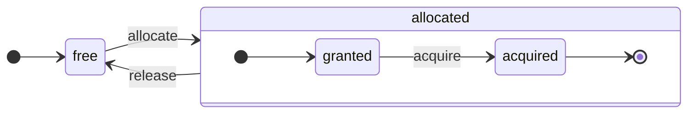

ClickHouse est un véritable SGBD orienté colonnes. Les données sont stockées par colonnes et, pendant l’exécution, traitées sous forme de tableaux (vecteurs ou fragments de colonnes).
Chaque fois que possible, les opérations sont appliquées à des tableaux plutôt qu’à des valeurs individuelles.
C’est ce qu’on appelle l’« exécution vectorisée des requêtes », et cela permet de réduire le coût réel du traitement des données.

Cette idée n’est pas nouvelle.
Elle remonte à `APL` (un langage de programmation, 1957) et à ses descendants : `A +` (dialecte d’APL), `J` (1990), `K` (1993) et `Q` (langage de programmation de Kx Systems, 2003).
La programmation par tableaux est utilisée dans le traitement des données scientifiques. Cette idée n’est pas nouvelle non plus dans les bases de données relationnelles. Par exemple, elle est utilisée dans le système `VectorWise` (également connu sous le nom d’Actian Vector Analytic Database d’Actian Corporation).

Il existe deux approches différentes pour accélérer le query processing : l’exécution vectorisée des requêtes et la génération de code à l’exécution. Cette dernière élimine toute indirection et tout dispatch dynamique. Aucune de ces approches n’est intrinsèquement supérieure à l’autre. La génération de code à l’exécution peut être plus efficace lorsqu’elle fusionne de nombreuses opérations, exploitant ainsi pleinement les unités d’exécution du CPU et le pipeline. L’exécution vectorisée des requêtes peut être moins pratique, car elle implique des vecteurs temporaires qui doivent être écrits dans le cache puis relus. Si les données temporaires ne tiennent pas dans le cache L2, cela devient problématique. En revanche, l’exécution vectorisée des requêtes exploite plus facilement les capabilities SIMD du CPU. Un [article de recherche](http://15721.courses.cs.cmu.edu/spring2016/papers/p5-sompolski.pdf) rédigé par des collègues montre qu’il est préférable de combiner les deux approches. ClickHouse utilise l’exécution vectorisée des requêtes et prend en charge, de façon encore limitée, la génération de code à l’exécution.

  ## Colonnes

L’interface `IColumn` sert à représenter les colonnes en mémoire (en réalité, des fragments de colonnes). Cette interface fournit des méthodes utilitaires pour implémenter différents opérateurs relationnels. Presque toutes les opérations sont immuables : elles ne modifient pas la colonne d’origine, mais en créent une nouvelle, modifiée. Par exemple, la méthode `IColumn :: filter` accepte un masque d’octets servant de filtre. Elle est utilisée pour les opérateurs relationnels `WHERE` et `HAVING`. Autres exemples : la méthode `IColumn :: permute` pour prendre en charge `ORDER BY`, et la méthode `IColumn :: cut` pour prendre en charge `LIMIT`.

Les différentes implémentations de `IColumn` (`ColumnUInt8`, `ColumnString`, etc.) sont responsables de la disposition en mémoire des colonnes. Cette disposition est généralement un tableau contigu. Pour les colonnes de type entier, il s’agit simplement d’un tableau contigu, comme `std :: vector`. Pour les colonnes `String` et `Array`, il y a deux vecteurs : un pour tous les éléments du tableau, stockés de manière contiguë, et un second pour les décalages jusqu’au début de chaque tableau. Il existe aussi `ColumnConst`, qui ne stocke qu’une seule valeur en mémoire, mais se présente comme une colonne.

  ## Field

Néanmoins, il est également possible de travailler avec des valeurs individuelles. Pour représenter une valeur individuelle, on utilise `Field`. `Field` est simplement une union discriminée de `UInt64`, `Int64`, `Float64`, `String` et `Array`. `IColumn` fournit la méthode `operator []` pour récupérer la n-ième valeur sous forme de `Field`, ainsi que la méthode `insert` pour ajouter un `Field` à la fin d&#39;une colonne. Ces méthodes ne sont pas très efficaces, car elles nécessitent de manipuler des objets `Field` temporaires représentant une valeur individuelle. Il existe des méthodes plus efficaces, telles que `insertFrom`, `insertRangeFrom`, etc.

`Field` ne contient pas suffisamment d&#39;informations sur le type de données spécifique d&#39;une table. Par exemple, `UInt8`, `UInt16`, `UInt32` et `UInt64` sont tous représentés sous la forme de `UInt64` dans un `Field`.

  ## Fuites d’abstraction

`IColumn` possède des méthodes pour les transformations relationnelles courantes des données, mais elles ne couvrent pas tous les besoins. Par exemple, `ColumnUInt64` n’a pas de méthode pour calculer la somme de deux colonnes, et `ColumnString` n’a pas de méthode pour effectuer une recherche de sous-chaîne. Ces innombrables routines sont implémentées en dehors de `IColumn`.

Diverses fonctions sur les colonnes peuvent être implémentées de façon générique, mais peu efficace, à l’aide des méthodes de `IColumn` pour extraire des valeurs `Field`, ou de façon spécialisée en s’appuyant sur la connaissance de l’agencement mémoire interne des données dans une implémentation `IColumn` donnée. Cela se fait en transtypant les fonctions vers un type `IColumn` spécifique et en manipulant directement la représentation interne. Par exemple, `ColumnUInt64` expose la méthode `getData`, qui renvoie une référence à un tableau interne ; une routine distincte lit alors ce tableau directement ou le remplit directement. Nous avons des « abstractions à fuites » pour permettre des spécialisations efficaces de diverses routines.

  ## Types de données

`IDataType` est responsable de la sérialisation et de la désérialisation : il lit et écrit des blocs de colonnes ou des valeurs individuelles sous forme binaire ou textuelle. `IDataType` correspond directement aux types de données des tables. Par exemple, il existe `DataTypeUInt32`, `DataTypeDateTime`, `DataTypeString`, etc.

`IDataType` et `IColumn` ne sont que faiblement liés. Différents types de données peuvent être représentés en mémoire par les mêmes implémentations de `IColumn`. Par exemple, `DataTypeUInt32` et `DataTypeDateTime` sont tous deux représentés par `ColumnUInt32` ou `ColumnConstUInt32`. De plus, un même type de données peut être représenté par différentes implémentations de `IColumn`. Par exemple, `DataTypeUInt8` peut être représenté par `ColumnUInt8` ou `ColumnConstUInt8`.

`IDataType` stocke uniquement des métadonnées. Par exemple, `DataTypeUInt8` ne stocke absolument rien (à l&#39;exception du pointeur virtuel `vptr`) et `DataTypeFixedString` stocke uniquement `N` (la taille des chaînes de longueur fixe).

`IDataType` dispose de méthodes utilitaires pour différents formats de données. Il peut s&#39;agir, par exemple, de méthodes permettant de sérialiser une valeur avec d&#39;éventuels guillemets, de sérialiser une valeur pour JSON ou de sérialiser une valeur dans le format XML. Il n&#39;existe pas de correspondance directe avec les formats de données. Par exemple, les différents formats de données `Pretty` et `TabSeparated` peuvent utiliser la même méthode utilitaire `serializeTextEscaped` de l&#39;interface `IDataType`.

  ## Block

Un `Block` est un conteneur qui représente un sous-ensemble (fragment) d’une table en mémoire. Il s’agit simplement d’un ensemble de triplets : `(IColumn, IDataType, column name)`. Lors de l’exécution d’une requête, les données sont traitées par des `Block`. Si nous avons un `Block`, nous avons des données (dans l’objet `IColumn`), des informations sur leur type (dans `IDataType`) qui indiquent comment traiter cette colonne, ainsi que le nom de la colonne. Il peut s’agir soit du nom de colonne d’origine de la table, soit d’un nom artificiel attribué pour obtenir des résultats de calcul temporaires.

Lorsque nous calculons une fonction sur des colonnes dans un block, nous ajoutons au block une autre colonne contenant son résultat, et nous ne touchons pas aux colonnes servant d’arguments à la fonction, car les opérations sont immuables. Plus tard, les colonnes inutiles peuvent être supprimées du block, mais pas modifiées. Cela facilite l’élimination des sous-expressions communes.

Des blocks sont créés pour chaque fragment de données traité. Notez que, pour un même type de calcul, les noms et les types des colonnes restent les mêmes d’un block à l’autre, et seules les données des colonnes changent. Il est préférable de séparer les données du block de son en-tête, car les blocks de petite taille entraînent un surcoût important lié aux chaînes temporaires lors de la copie des `shared_ptr` et des noms de colonnes.

  ## Processeurs

Voir la description sur [https://github.com/ClickHouse/ClickHouse/blob/master/src/Processors/IProcessor.h](https://github.com/ClickHouse/ClickHouse/blob/master/src/Processors/IProcessor.h).

  ## Formats

Les formats de données sont implémentés à l’aide de processeurs.

  ## E/S

Pour les entrées/sorties orientées octets, il existe les classes abstraites `ReadBuffer` et `WriteBuffer`. Elles sont utilisées à la place des `iostream` de C++. Ne vous inquiétez pas : tout projet C++ mature utilise autre chose que les `iostream`, et ce pour de bonnes raisons.

`ReadBuffer` et `WriteBuffer` ne sont qu’un tampon contigu et un curseur pointant sur une position dans ce tampon. Les implémentations peuvent posséder ou non la mémoire du tampon. Une méthode virtuelle permet de remplir le tampon avec les données suivantes (pour `ReadBuffer`) ou d’évacuer le contenu du tampon vers une destination (pour `WriteBuffer`). Les méthodes virtuelles sont rarement appelées.

Les implémentations de `ReadBuffer`/`WriteBuffer` servent à travailler avec des fichiers, des descripteurs de fichier et des sockets réseau, à implémenter la compression (`CompressedWriteBuffer` est initialisé avec un autre WriteBuffer et effectue la compression avant d’y écrire les données), ainsi qu’à d’autres usages — les noms `ConcatReadBuffer`, `LimitReadBuffer` et `HashingWriteBuffer` parlent d’eux-mêmes.

Les Read/WriteBuffers ne manipulent que des octets. Des fonctions des fichiers d’en-tête `ReadHelpers` et `WriteHelpers` facilitent la mise en forme des entrées/sorties. Par exemple, il existe des helpers pour écrire un nombre au format décimal.

Voyons ce qui se passe lorsque vous voulez écrire un jeu de résultats au format `JSON` sur stdout.
Vous disposez d’un jeu de résultats prêt à être récupéré depuis un `QueryPipeline` pulling.
Commencez par créer un `WriteBufferFromFileDescriptor(STDOUT_FILENO)` pour écrire des octets sur stdout.
Ensuite, vous connectez le résultat du pipeline de requête à `JSONRowOutputFormat`, qui est initialisé avec ce `WriteBuffer`, afin d’écrire les lignes au format `JSON` sur stdout.
Cela peut être fait via la méthode `complete`, qui transforme un `QueryPipeline` pulling en `QueryPipeline` complété.
En interne, `JSONRowOutputFormat` écrira différents délimiteurs JSON et appellera la méthode `IDataType::serializeTextJSON` avec une référence à `IColumn` et le numéro de ligne comme arguments. Par conséquent, `IDataType::serializeTextJSON` appellera une méthode de `WriteHelpers.h` : par exemple, `writeText` pour les types numériques et `writeJSONString` pour `DataTypeString`.

  ## Tables

L’interface `IStorage` représente les tables. Les différentes implémentations de cette interface correspondent à différents moteurs de table. `StorageMergeTree`, `StorageMemory`, etc. en sont des exemples. Les instances de ces classes ne sont rien d’autre que des tables.

Les méthodes clés de `IStorage` sont `read` et `write`, ainsi que d’autres comme `alter`, `rename` et `drop`. La méthode `read` accepte les arguments suivants : un ensemble de colonnes à lire dans une table, la requête `AST` à prendre en compte et le nombre souhaité de flux. Elle renvoie un `Pipe`.

Dans la plupart des cas, la méthode `read` est uniquement chargée de lire les colonnes spécifiées dans une table, et non d’effectuer un traitement supplémentaire des données.
Tout le traitement ultérieur des données est pris en charge par une autre partie du pipeline, qui ne relève pas de la responsabilité de `IStorage`.

Mais il existe des exceptions notables :

* La requête `AST` est transmise à la méthode `read`, et le moteur de table peut l’utiliser pour déterminer comment exploiter les index et lire moins de données dans une table.
* Parfois, le moteur de table peut lui-même traiter les données jusqu’à une étape donnée. Par exemple, `StorageDistributed` peut envoyer une requête à des serveurs distants, leur demander de traiter les données jusqu’à un stade où les données de différents serveurs distants peuvent être fusionnées, puis renvoyer ces données prétraitées. L’interpréteur de requêtes termine ensuite le traitement des données.

La méthode `read` de la table peut renvoyer un `Pipe` composé de plusieurs `Processors`. Ces `Processors` peuvent lire les données d’une table en parallèle.
Vous pouvez ensuite relier ces processeurs à diverses autres transformations (telles que l’évaluation d’expressions ou le filtrage), qui peuvent être exécutées indépendamment.
Puis créer un `QueryPipeline` par-dessus et l’exécuter via `PipelineExecutor`.

Il existe également des `TableFunction`s. Ce sont des fonctions qui renvoient un objet `IStorage` temporaire à utiliser dans la clause `FROM` d’une requête.

Pour vous faire rapidement une idée de la manière d’implémenter votre moteur de table, regardez quelque chose de simple, comme `StorageMemory` ou `StorageTinyLog`.

> En résultat de la méthode `read`, `IStorage` renvoie `QueryProcessingStage` : des informations sur les parties de la requête déjà calculées dans le stockage.

  ## Analyseurs syntaxiques

Une requête est analysée par un analyseur syntaxique récursif descendant, écrit à la main. Par exemple, `ParserSelectQuery` appelle simplement de manière récursive les analyseurs syntaxiques sous-jacents pour différentes parties de la requête. Les analyseurs syntaxiques créent un `AST`. L&#39;`AST` est représenté par des nœuds, qui sont des instances de `IAST`.

> Les générateurs d&#39;analyseurs syntaxiques ne sont pas utilisés pour des raisons historiques.

  ## Interpréteurs

Les interpréteurs sont chargés de créer le pipeline d’exécution des requêtes à partir d’un AST. Il existe des interpréteurs simples, comme `InterpreterExistsQuery` et `InterpreterDropQuery`, ainsi que l’interpréteur plus sophistiqué `InterpreterSelectQuery`.

Le pipeline d’exécution des requêtes est un ensemble de processeurs capables de consommer et de produire des fragments (ensembles de colonnes de types spécifiques).
Un processeur communique via des ports et peut avoir plusieurs ports d’entrée et plusieurs ports de sortie.
Vous trouverez une description plus détaillée dans [src/Processors/IProcessor.h](https://github.com/ClickHouse/ClickHouse/blob/master/src/Processors/IProcessor.h).

Par exemple, le résultat de l’interprétation de la requête `SELECT` est un `QueryPipeline` « pulling » doté d’un port de sortie spécial permettant de lire le jeu de résultats.
Le résultat de la requête `INSERT` est un `QueryPipeline` « pushing » avec un port d’entrée permettant d’écrire les données à insérer.
Et le résultat de l’interprétation de la requête `INSERT SELECT` est un `QueryPipeline` « complété » qui n’a ni entrée ni sortie, mais copie simultanément les données de `SELECT` vers `INSERT`.

`InterpreterSelectQuery` utilise les mécanismes `ExpressionAnalyzer` et `ExpressionActions` pour l’analyse et la transformation des requêtes. C’est à cet endroit qu’est effectuée la majorité des optimisations de requêtes fondées sur des règles. `ExpressionAnalyzer` est assez confus et devrait être réécrit : les différentes transformations et optimisations de requêtes devraient être extraites dans des classes distinctes afin de permettre des transformations modulaires de la requête.

Pour remédier aux problèmes des interpréteurs, un nouvel `InterpreterSelectQueryAnalyzer` a été développé. Il s’agit d’une nouvelle version de `InterpreterSelectQuery`, qui n’utilise pas `ExpressionAnalyzer` et introduit une couche d’abstraction supplémentaire entre `AST` et `QueryPipeline`, appelée `QueryTree`. Cette version est entièrement prête pour une utilisation en production, mais, par précaution, elle peut être désactivée en définissant la valeur du paramètre `enable_analyzer` sur `false`.

  ## Fonctions

Il existe des fonctions ordinaires et des fonctions d’agrégation. Pour les fonctions d’agrégation, voir la section suivante.

Les fonctions ordinaires ne modifient pas le nombre de lignes : elles se comportent comme si elles traitaient chaque ligne indépendamment. En réalité, les fonctions ne sont pas appelées pour chaque ligne individuellement, mais pour des `Block` de données, afin de mettre en œuvre l’exécution vectorisée des requêtes.

Il existe aussi quelques fonctions diverses, comme [blockSize](/fr/reference/functions/regular-functions/other-functions#blockSize), [rowNumberInBlock](/fr/reference/functions/regular-functions/other-functions#rowNumberInBlock) et [runningAccumulate](/fr/reference/functions/regular-functions/other-functions#runningAccumulate), qui tirent parti du traitement par blocs et rompent l’indépendance des lignes.

ClickHouse est à typage fort, il n’y a donc pas de conversion de type implicite. Si une fonction ne prend pas en charge une combinaison de types donnée, elle lève une exception. Mais les fonctions peuvent fonctionner (être surchargées) pour de nombreuses combinaisons de types différentes. Par exemple, la fonction `plus` (qui implémente l’opérateur `+`) fonctionne avec n’importe quelle combinaison de types numériques : `UInt8` + `Float32`, `UInt16` + `Int8`, etc. De plus, certaines fonctions variadiques peuvent accepter un nombre quelconque d’arguments, comme la fonction `concat`.

L’implémentation d’une fonction peut être légèrement contraignante, car une fonction doit gérer explicitement les types de données et les `IColumns` pris en charge. Par exemple, la fonction `plus` contient du code généré par l’instanciation d’un template C++ pour chaque combinaison de types numériques, ainsi que pour les arguments gauche et droit, constants ou non constants.

C’est un excellent cas d’usage pour implémenter la génération de code à l’exécution afin d’éviter l’encombrement du code généré par les templates. Cela permet également d’ajouter des fonctions fusionnées, comme fused multiply-add, ou d’effectuer plusieurs comparaisons en une seule itération de boucle.

En raison de l’exécution vectorisée des requêtes, les fonctions ne sont pas évaluées en court-circuit. Par exemple, si vous écrivez `WHERE f(x) AND g(y)`, les deux côtés sont calculés, y compris pour les lignes où `f(x)` vaut zéro (sauf lorsque `f(x)` est une expression constante nulle). Mais si la sélectivité de la condition `f(x)` est élevée et que le calcul de `f(x)` est bien moins coûteux que celui de `g(y)`, il vaut mieux implémenter un calcul en plusieurs passes. On commencerait par calculer `f(x)`, puis on filtrerait les colonnes selon le résultat, et on ne calculerait `g(y)` que pour des fragments de données plus petits et filtrés.

  ## Fonctions d&#39;agrégation

Les fonctions d&#39;agrégation sont des fonctions à état. Elles accumulent les valeurs qui leur sont transmises dans un état interne et permettent d&#39;obtenir des résultats à partir de cet état. Elles sont gérées via l&#39;interface `IAggregateFunction`. Les états peuvent être assez simples (l&#39;état de `AggregateFunctionCount` n&#39;est qu&#39;une valeur `UInt64`) ou très complexes (l&#39;état de `AggregateFunctionUniqCombined` combine un tableau linéaire, une table de hachage et une structure de données probabiliste `HyperLogLog`).

Les états sont alloués dans `Arena` (un pool mémoire) afin de gérer plusieurs états lors de l&#39;exécution d&#39;une requête `GROUP BY` à forte cardinalité. Ils peuvent avoir un constructeur et un destructeur non triviaux : par exemple, des états d&#39;agrégation complexes peuvent eux-mêmes allouer de la mémoire supplémentaire. Il faut donc prêter une attention particulière à la création et à la destruction de ces états, ainsi qu&#39;au transfert correct de leur ownership et à l&#39;ordre dans lequel ils sont détruits.

Les états d&#39;agrégation peuvent être sérialisés et désérialisés pour être transmis sur le réseau lors de l&#39;exécution distribuée des requêtes, ou pour être écrits sur disque lorsqu&#39;il n&#39;y a pas assez de RAM. Ils peuvent même être stockés dans une table avec `DataTypeAggregateFunction` afin de permettre l&#39;agrégation incrémentielle des données.

> Le format de données sérialisé des états de fonctions d&#39;agrégation n&#39;est actuellement pas versionné. Ce n&#39;est pas gênant si les états d&#39;agrégation ne sont stockés que temporairement. Mais nous disposons du moteur de table `AggregatingMergeTree` pour l&#39;agrégation incrémentielle, et il est déjà utilisé en production. C&#39;est pourquoi la rétrocompatibilité est indispensable si le format sérialisé d&#39;une fonction d&#39;agrégation doit être modifié à l&#39;avenir.

  ## Serveur

Le serveur prend en charge plusieurs interfaces :

* Une interface HTTP pour tout client externe.
* Une interface TCP pour le client natif ClickHouse et pour la communication entre serveurs lors de l&#39;exécution distribuée des requêtes.
* Une interface pour le transfert des données de réplication.

En interne, il s&#39;agit simplement d&#39;un serveur multithread rudimentaire, sans coroutines ni fibres. Comme le serveur n&#39;est pas conçu pour traiter un grand nombre de requêtes simples, mais plutôt un nombre relativement faible de requêtes complexes, chacune d&#39;elles peut traiter un volume considérable de données à des fins d&#39;analytique.

Le serveur initialise la classe `Context` avec l&#39;environnement nécessaire à l&#39;exécution des requêtes : la liste des bases de données disponibles, les utilisateurs et les droits d&#39;accès, les paramètres, les clusters, la liste des processus, le journal des requêtes, etc. Les Interpreters utilisent cet environnement.

Nous assurons une compatibilité ascendante et descendante complète pour le protocole TCP du serveur : les anciens clients peuvent communiquer avec les nouveaux serveurs, et les nouveaux clients peuvent communiquer avec les anciens serveurs. Mais nous ne souhaitons pas la maintenir indéfiniment, et nous supprimons la prise en charge des anciennes versions au bout d&#39;environ un an.

<Note>
  Pour la plupart des applications externes, nous recommandons d&#39;utiliser l&#39;interface HTTP, car elle est simple et facile à utiliser. Le protocole TCP est plus étroitement lié aux structures de données internes : il utilise un format interne pour transmettre des blocs de données, ainsi qu&#39;un mécanisme de tramage personnalisé pour les données compressées.
</Note>

  ## Configuration

Le serveur ClickHouse repose sur les bibliothèques POCO C++ et utilise `Poco::Util::AbstractConfiguration` pour représenter sa configuration. La configuration est stockée par la classe `Poco::Util::ServerApplication`, dont hérite la classe `DaemonBase`, elle-même héritée par la classe `DB::Server`, qui implémente `clickhouse-server`. La configuration est donc accessible via la méthode `ServerApplication::config()`.

La configuration est lue depuis plusieurs fichiers (au format XML ou YAML), puis fusionnée en une seule `AbstractConfiguration` par la classe `ConfigProcessor`. Elle est chargée au démarrage du serveur et peut être rechargée ultérieurement si l&#39;un des fichiers de configuration est mis à jour, supprimé ou ajouté. La classe `ConfigReloader` est également chargée de surveiller périodiquement ces changements et d&#39;exécuter la procédure de rechargement. La requête `SYSTEM RELOAD CONFIG` déclenche également le rechargement de la configuration.

Pour les requêtes et les sous-systèmes autres que `Server`, la configuration est accessible à l&#39;aide de la méthode `Context::getConfigRef()`. Chaque sous-système capable de recharger sa configuration sans redémarrer le serveur doit s&#39;enregistrer dans le callback de rechargement de la méthode `Server::main()`. Notez que si la nouvelle configuration contient une erreur, la plupart des sous-systèmes l&#39;ignoreront, consigneront des avertissements dans le journal et continueront de fonctionner avec la configuration précédemment chargée. En raison de la nature de `AbstractConfiguration`, il n&#39;est pas possible de transmettre une référence à une section spécifique ; `String config_prefix` est donc généralement utilisé à la place.

  ### Contexte

ClickHouse gère les paramètres selon une hiérarchie de contextes :

* **Contexte global** - paramètres à l’échelle du serveur définis via des fichiers de configuration
* **Contexte de session** - paramètres de session utilisateur issus des profils, de la configuration utilisateur et des commandes SET
* **Contexte de requête** - paramètres au niveau de la requête issus de la clause SETTINGS
* **Contexte d’arrière-plan** - paramètres à l’échelle du serveur pour les opérations d’arrière-plan (Mutate, Merge) définis via le profil &#39;background&#39;

Lors de la planification d’une opération (requêtes, mutations, etc.), le serveur construit le contexte correspondant en fusionnant les paramètres dans l’ordre suivant (les sections suivantes remplacent les précédentes) :

1. Valeurs globales par défaut
2. Configuration globale
3. Paramètres du profil (de la section `<profiles>`)
4. Paramètres utilisateur (de la section `<users>`)
5. Paramètres de session (de la commande SET)
6. Paramètres de requête (de la clause SETTINGS)

<Note>
  Les opérations d’arrière-plan peuvent être configurées via les paramètres globaux et ceux du profil &#39;background&#39; ; les paramètres de session et de requête n’ont aucun effet dans ce cas. Si aucune configuration explicite n’est fournie, la configuration hérite du contexte global. Le nom de profil par défaut pour ces opérations est &#39;background&#39;, mais il peut être redéfini via le paramètre serveur `background_profile`.
</Note>

  ## Threads et jobs

Pour exécuter des requêtes et effectuer des activités annexes, ClickHouse alloue des threads à partir de l’un de ses pools de threads afin d’éviter les créations et destructions fréquentes de threads. Il existe plusieurs pools de threads, sélectionnés selon le rôle et la structure d’un job :

* Pool serveur pour les sessions client entrantes.
* Pool global de threads pour les jobs d’usage général, les activités en arrière-plan et les threads autonomes.
* Pool de threads IO pour les jobs principalement bloqués sur des opérations IO et peu consommateurs de CPU.
* Pools d’arrière-plan pour les tâches périodiques.
* Pools pour les tâches préemptables pouvant être divisées en étapes.

Le pool serveur est une instance de la classe `Poco::ThreadPool` définie dans la méthode `Server::main()`. Il peut contenir au maximum `max_connection` threads. Chaque thread est dédié à une seule connexion active.

Le pool global de threads est la classe singleton `GlobalThreadPool`. Pour y allouer un thread, on utilise `ThreadFromGlobalPool`. Son interface est similaire à `std::thread`, mais il récupère un thread dans le pool global et effectue toute l’initialisation nécessaire. Il est configuré avec les settings suivants :

* `max_thread_pool_size` - limite du nombre de threads dans le pool.
* `max_thread_pool_free_size` - limite du nombre de threads inactifs en attente de nouveaux jobs.
* `thread_pool_queue_size` - limite du nombre de jobs planifiés.

Le pool global est universel, et tous les pools décrits ci-dessous sont implémentés par-dessus. On peut y voir une hiérarchie de pools. Chaque pool spécialisé récupère ses threads depuis le pool global à l’aide de la classe `ThreadPool`. Ainsi, le rôle principal de tout pool spécialisé est de limiter le nombre de jobs simultanés et d’en assurer la planification. S’il y a plus de jobs planifiés que de threads dans un pool, `ThreadPool` accumule les jobs dans une file d’attente avec priorités. Chaque job possède une priorité entière. La priorité par défaut est zéro. Tous les jobs ayant une priorité plus élevée démarrent avant ceux de priorité inférieure. En revanche, il n’y a pas de différence entre les jobs déjà en cours d’exécution : la priorité n’a donc d’importance que lorsque le pool est surchargé.

Le pool de threads IO est implémenté comme un simple `ThreadPool` accessible via la méthode `IOThreadPool::get()`. Il est configuré de la même manière que le pool global, avec les settings `max_io_thread_pool_size`, `max_io_thread_pool_free_size` et `io_thread_pool_queue_size`. Son objectif principal est d’éviter que des jobs IO n’épuisent le pool global, ce qui pourrait empêcher les requêtes d’exploiter pleinement le CPU. Backup vers S3 effectue un volume important d’opérations IO et, pour éviter tout impact sur les requêtes interactives, il existe un `BackupsIOThreadPool` distinct configuré avec les settings `max_backups_io_thread_pool_size`, `max_backups_io_thread_pool_free_size` et `backups_io_thread_pool_queue_size`.

Pour l’exécution des tâches périodiques, il existe la classe `BackgroundSchedulePool`. Vous pouvez y enregistrer des tâches à l’aide d’objets `BackgroundSchedulePool::TaskHolder`, et le pool garantit qu’aucune tâche n’exécute deux jobs en même temps. Il permet également de reporter l’exécution d’une tâche à un instant précis dans le futur ou de désactiver temporairement une tâche. Le `Context` global fournit quelques instances de cette classe pour différents usages. Pour les tâches d’usage général, on utilise `Context::getSchedulePool()`.

Il existe également des pools de threads spécialisés pour les tâches préemptables. Une tâche `IExecutableTask` de ce type peut être divisée en une séquence ordonnée de jobs, appelés étapes. Pour planifier ces tâches de manière à permettre aux tâches courtes d’être prioritaires sur les longues, `MergeTreeBackgroundExecutor` est utilisé. Comme son nom l’indique, il sert aux opérations d’arrière-plan liées à MergeTree, telles que les merges, mutations, fetches et moves. Des instances de pool sont disponibles via `Context::getCommonExecutor()` et d’autres méthodes similaires.

Quel que soit le pool utilisé pour un job, une instance `ThreadStatus` est créée au démarrage pour ce job. Elle encapsule toutes les informations propres au thread : id du thread, id de la requête, compteurs de performance, consommation de ressources et de nombreuses autres données utiles. Le job peut y accéder via un pointeur local au thread avec l’appel `CurrentThread::get()`, ce qui évite de devoir la transmettre à chaque fonction.

Si le thread est lié à l’exécution d’une requête, alors l’élément le plus important attaché à `ThreadStatus` est le contexte de requête `ContextPtr`. Chaque requête a son thread principal dans le pool serveur. Le thread principal effectue cet attachement en conservant un objet `ThreadStatus::QueryScope query_scope(query_context)`. Il crée également un groupe de threads représenté par l’objet `ThreadGroupStatus`. Chaque thread supplémentaire alloué pendant l’exécution de cette requête est attaché à son groupe de threads via l’appel `CurrentThread::attachTo(thread_group)`. Les groupes de threads servent à agréger les compteurs d’événements de profil et à suivre la consommation mémoire de tous les threads dédiés à une seule tâche (voir les classes `MemoryTracker` et `ProfileEvents::Counters` pour plus d’informations).

  ## Contrôle de la concurrence

Une requête qui peut être parallélisée utilise le paramètre `max_threads` pour limiter son parallélisme. La valeur par défaut de ce paramètre est choisie de manière à permettre à une seule requête d’exploiter au mieux tous les cœurs CPU. Mais que se passe-t-il s’il y a plusieurs requêtes concurrentes et que chacune utilise la valeur par défaut du paramètre `max_threads` ? Les requêtes se partageront alors les ressources CPU. Le système d’exploitation garantira l’équité en basculant constamment d’un thread à l’autre, ce qui entraîne une certaine pénalité en termes de performances. `ConcurrencyControl` permet de réduire cette pénalité et d’éviter d’allouer un trop grand nombre de threads. Le paramètre de configuration `concurrent_threads_soft_limit_num` sert à limiter le nombre de threads concurrents pouvant être alloués avant d’appliquer une forme de pression sur le CPU.

La notion de `slot` CPU est introduite. Un slot est une unité de concurrence : pour exécuter un thread, une requête doit d’abord acquérir un slot, puis le libérer lorsque le thread s’arrête. Le nombre de slots est limité globalement sur un serveur. Plusieurs requêtes concurrentes entrent en compétition pour les slots CPU si la demande totale dépasse le nombre total de slots. `ConcurrencyControl` est chargé de résoudre cette compétition en assurant un ordonnancement équitable des slots CPU.

Chaque slot peut être vu comme une machine à états indépendante avec les états suivants :

* `free` : le slot est disponible et peut être alloué à n’importe quelle requête.
* `granted` : le slot est `allocated` à une requête spécifique, mais n’est pas encore acquis par un thread.
* `acquired` : le slot est `allocated` à une requête spécifique et acquis par un thread.

Notez qu’un slot `allocated` peut se trouver dans deux états différents : `granted` et `acquired`. Le premier est un état transitoire, qui doit en pratique être bref (à partir du moment où un slot est alloué à une requête jusqu’au moment où la procédure de montée en charge est exécutée par l’un des threads de cette requête).

L’API de `ConcurrencyControl` se compose des fonctions suivantes :

1. Créer une allocation de ressources pour une requête : `auto slots = ConcurrencyControl::instance().allocate(1, max_threads);`. Elle allouera au moins 1 slot et au plus `max_threads` slots. Notez que le premier slot est accordé immédiatement, mais que les slots restants peuvent l’être plus tard. La limite est donc souple, car chaque requête obtiendra au moins un thread.
2. Pour chaque thread, un slot doit être obtenu à partir d’une allocation : `while (auto slot = slots->tryAcquire()) spawnThread([slot = std::move(slot)] { ... });`.
3. Mettre à jour le nombre total de slots : `ConcurrencyControl::setMaxConcurrency(concurrent_threads_soft_limit_num)`. Cela peut être fait à l’exécution, sans redémarrage du serveur.

Cette API permet aux requêtes de démarrer avec au moins un thread (en cas de pression sur le CPU), puis de monter progressivement jusqu’à `max_threads`.

  ## Exécution distribuée des requêtes

Les serveurs d’un cluster sont, dans l’ensemble, indépendants. Vous pouvez créer une table `Distributed` sur un seul serveur ou sur tous les serveurs d’un cluster. La table `Distributed` ne stocke pas elle-même les données : elle fournit uniquement une « vue » de toutes les tables locales réparties sur plusieurs nœuds du cluster. Lorsque vous effectuez un SELECT sur une table `Distributed`, celle-ci réécrit la requête, choisit les nœuds distants selon les paramètres d’équilibrage de charge, puis leur transmet la requête. La table `Distributed` demande aux serveurs distants de traiter la requête uniquement jusqu’à l’étape où les résultats intermédiaires provenant de différents serveurs peuvent être fusionnés. Elle reçoit ensuite ces résultats intermédiaires et les fusionne. La table distribuée essaie de déléguer autant de travail que possible aux serveurs distants et évite d’envoyer trop de données intermédiaires sur le réseau.

Les choses se compliquent lorsque vous avez des sous-requêtes dans des clauses IN ou JOIN, et que chacune d’elles utilise une table `Distributed`. Nous avons différentes stratégies pour exécuter ces requêtes.

Il n’existe pas de plan de requête global pour l’exécution distribuée des requêtes. Chaque nœud dispose de son propre plan de requête local pour sa part du travail. Nous ne prenons en charge qu’une exécution distribuée simple, en un seul passage : nous envoyons les requêtes aux nœuds distants, puis nous fusionnons les résultats. Mais cela n’est pas faisable pour des requêtes complexes avec des `GROUP BY` à forte cardinalité ou avec de grandes quantités de données temporaires pour JOIN. Dans ce type de cas, il faut « redistribuer » les données entre les serveurs, ce qui nécessite une coordination supplémentaire. ClickHouse ne prend pas en charge ce type d’exécution de requête, et nous devons encore travailler sur ce point.

  ## MergeTree

`MergeTree` est une famille de moteurs de stockage qui prend en charge l’indexation par clé primaire. La clé primaire peut être un tuple arbitraire de colonnes ou d’expressions. Les données d’une table `MergeTree` sont stockées dans des « parts ». Chaque part stocke les données dans l’ordre de la clé primaire, de sorte qu’elles sont ordonnées lexicographiquement selon le tuple de la clé primaire. Toutes les colonnes de la table sont stockées dans des fichiers `column.bin` distincts au sein de ces parts. Les fichiers se composent de blocs compressés. Chaque bloc contient généralement entre 64 KB et 1 MB de données non compressées, selon la taille moyenne des valeurs. Les blocs se composent de valeurs de colonnes placées de façon contiguë les unes à la suite des autres. Les valeurs sont dans le même ordre pour chaque colonne (la clé primaire définit l’ordre), de sorte que lorsque vous parcourez plusieurs colonnes, vous obtenez les valeurs des lignes correspondantes.

La clé primaire elle-même est « clairsemée ». Elle n’adresse pas chaque ligne individuellement, mais seulement certaines plages de données. Un fichier `primary.idx` distinct contient la valeur de la clé primaire pour chaque N-ième ligne, où N est appelé `index_granularity` (généralement, N = 8192). De plus, pour chaque colonne, il existe des fichiers `column.mrk` avec des « marks », c’est-à-dire des décalages vers chaque N-ième ligne dans le fichier de données. Chaque mark est une paire : le décalage dans le fichier jusqu’au début du bloc compressé, et le décalage dans le bloc décompressé jusqu’au début des données. En général, les blocs compressés sont alignés sur les marks, et le décalage dans le bloc décompressé est nul. Les données de `primary.idx` résident toujours en mémoire, et les données des fichiers `column.mrk` sont mises en cache.

Lorsque nous devons lire quelque chose à partir d’une part dans `MergeTree`, nous examinons les données de `primary.idx` et localisons les plages susceptibles de contenir les données demandées, puis nous examinons les données de `column.mrk` et calculons les décalages indiquant où commencer la lecture de ces plages. En raison de ce caractère clairsemé, des données excédentaires peuvent être lues. ClickHouse n’est pas adapté à une forte charge de requêtes ponctuelles simples, car toute la plage contenant `index_granularity` lignes doit être lue pour chaque clé, et l’intégralité du bloc compressé doit être décompressée pour chaque colonne. Nous avons rendu l’index clairsemé parce que nous devons pouvoir gérer des milliers de milliards de lignes sur un seul server sans consommation mémoire notable pour l’index. De plus, comme la clé primaire est clairsemée, elle n’est pas unique : elle ne peut pas vérifier l’existence de la clé dans la table au moment de l’INSERT. Une table peut contenir de nombreuses lignes avec la même clé.

Lorsque vous `INSERT` un lot de données dans `MergeTree`, ce lot est trié selon l’ordre de la clé primaire et forme une nouvelle part. Des threads d’arrière-plan sélectionnent périodiquement certaines parts et les fusionnent en une seule part triée afin de maintenir un nombre de parts relativement faible. C’est pourquoi cela s’appelle `MergeTree`. Bien sûr, la fusion entraîne une « amplification des écritures ». Toutes les parts sont immuables : elles sont seulement créées et supprimées, mais jamais modifiées. Lorsqu’un SELECT est exécuté, il conserve un snapshot de la table (un ensemble de parts). Après la fusion, nous conservons également les anciennes parts pendant un certain temps pour faciliter la reprise après une défaillance ; ainsi, si nous constatons qu’une part fusionnée est probablement corrompue, nous pouvons la remplacer par ses parts sources.

`MergeTree` n’est pas un arbre LSM, car il ne contient ni MEMTABLE ni LOG : les données insérées sont écrites directement dans le système de fichiers. Ce comportement rend MergeTree bien plus adapté à l’insertion de données par lots. Par conséquent, insérer fréquemment de petites quantités de lignes n’est pas idéal pour MergeTree. Par exemple, quelques lignes par seconde conviennent, mais le faire mille fois par seconde n’est pas optimal pour MergeTree. Cependant, il existe un mode async insert pour les petits inserts afin de surmonter cette limitation. Nous l’avons conçu ainsi par souci de simplicité, et parce que nous insérons déjà les données par lots dans nos applications

Il existe des moteurs MergeTree qui effectuent un travail supplémentaire pendant les fusions en arrière-plan. `CollapsingMergeTree` et `AggregatingMergeTree` en sont des exemples. Cela peut être considéré comme une prise en charge spéciale des mises à jour. Gardez à l’esprit qu’il ne s’agit pas de véritables mises à jour, car les utilisateurs n’ont généralement aucun contrôle sur le moment où les fusions en arrière-plan sont exécutées, et les données d’une table `MergeTree` sont presque toujours stockées dans plus d’une part, et non sous une forme entièrement fusionnée.

  ## Réplication

Dans ClickHouse, la réplication peut être configurée table par table. Vous pouvez avoir sur le même serveur certaines tables répliquées et d’autres non répliquées. Vous pouvez également avoir des tables répliquées de différentes façons, par exemple une table avec un facteur de réplication de deux et une autre de trois.

La réplication est implémentée dans le moteur de stockage `ReplicatedMergeTree`. Le chemin dans `ZooKeeper` est spécifié comme paramètre du moteur de stockage. Toutes les tables ayant le même chemin dans `ZooKeeper` deviennent des répliques les unes des autres : elles synchronisent leurs données et maintiennent leur cohérence. Les répliques peuvent être ajoutées ou supprimées dynamiquement, simplement en créant ou en supprimant une table.

La réplication utilise un schéma multi-maître asynchrone. Vous pouvez insérer des données dans n’importe quelle réplique disposant d’une session avec `ZooKeeper`, et les données sont répliquées de manière asynchrone vers toutes les autres répliques. Comme ClickHouse ne prend pas en charge les UPDATE, la réplication est sans conflit. Comme, par défaut, les insertions ne font pas l’objet d’une confirmation par quorum, des données tout juste insérées peuvent être perdues en cas de panne d’un nœud. Le quorum d’insertion peut être activé à l’aide du paramètre `insert_quorum`.

Les métadonnées de réplication sont stockées dans ZooKeeper. Un journal de réplication répertorie les actions à exécuter. Ces actions incluent : récupérer une part, fusionner des parts, supprimer une partition, etc. Chaque réplique copie le journal de réplication dans sa file d’attente, puis exécute les actions de cette file. Par exemple, lors d’une insertion, l’action « récupérer la part » est créée dans le journal, et chaque réplique télécharge ensuite cette part. Les fusions sont coordonnées entre les répliques afin d’obtenir des résultats identiques octet pour octet. Toutes les parts sont fusionnées de la même manière sur toutes les répliques. L’un des leaders lance d’abord une nouvelle fusion et écrit les actions « fusionner des parts » dans le journal. Plusieurs répliques (ou même toutes) peuvent être leaders en même temps. Il est possible d’empêcher une réplique de devenir leader à l’aide du paramètre `replicated_can_become_leader` de `merge_tree`. Les leaders sont responsables de la planification des fusions en arrière-plan.

La réplication est physique : seules les parts compressées sont transférées entre les nœuds, et non les requêtes. Dans la plupart des cas, les fusions sont exécutées indépendamment sur chaque réplique afin de réduire les coûts réseau en évitant l’amplification du trafic réseau. Les grandes parts fusionnées ne sont envoyées sur le réseau qu’en cas de retard de réplication important.

En outre, chaque réplique stocke son état dans ZooKeeper sous la forme de l’ensemble des parts et de leurs sommes de contrôle. Lorsque l’état du système de fichiers local diverge de l’état de référence dans ZooKeeper, la réplique rétablit sa cohérence en téléchargeant les parts manquantes ou corrompues depuis d’autres répliques. Lorsqu’il existe des données inattendues ou corrompues sur le système de fichiers local, ClickHouse ne les supprime pas, mais les déplace vers un répertoire distinct et les ignore.

<Note>
  Le cluster ClickHouse se compose de shards indépendants, et chaque shard se compose de répliques. Le cluster n’est **pas élastique** : après l’ajout d’un nouveau shard, les données ne sont pas rééquilibrées automatiquement entre les shards. On part plutôt du principe que la charge du cluster sera répartie de manière inégale. Cette implémentation vous donne davantage de contrôle, et elle convient à des clusters relativement petits, par exemple de quelques dizaines de nœuds. Mais pour les clusters de plusieurs centaines de nœuds que nous utilisons en production, cette approche devient un inconvénient important. Nous devrions implémenter un moteur de table couvrant l’ensemble du cluster, avec des régions répliquées dynamiquement, qui pourraient être scindées et équilibrées automatiquement entre les clusters.
</Note>