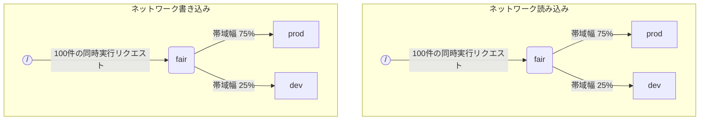

ClickHouse が複数のクエリを同時に実行する場合、それらは共有リソース (例: ディスクや CPU コア) を使用することがあります。リソースの利用方法や、異なるワークロード間での共有方法を制御するために、スケジューリングの制約とポリシーを適用できます。すべてのリソースに対して、共通のスケジューリング階層を設定できます。階層のルートは共有リソースを表し、リーフは個々のワークロードを表します。リーフには、リソース容量を超過したリクエストが保持されます。

<Note>
  現在、[リモートディスク IO](#disk_config) と [CPU](#cpu_scheduling) については、ここで説明する方法でスケジューリングできます。柔軟なメモリ制限については、[メモリオーバーコミット](/ja/concepts/features/configuration/settings/memory-overcommit) を参照してください。
</Note>

<div id="disk_config">
  ## ディスク設定
</div>

特定のディスクで I/O ワークロードスケジューリングを有効にするには、WRITE アクセス用と READ アクセス用の書き込み／読み取りリソースを作成する必要があります。

```sql
CREATE RESOURCE resource_name (WRITE DISK disk_name, READ DISK disk_name)
-- または
CREATE RESOURCE read_resource_name (WRITE DISK write_disk_name)
CREATE RESOURCE write_resource_name (READ DISK read_disk_name)
```

リソースは、READ、WRITE、またはその両方に対して、任意の数のディスクで使用できます。すべてのディスクに対してリソースを使用するための構文があります:

```sql
CREATE RESOURCE all_io (READ ANY DISK, WRITE ANY DISK);
```

リソースでどのディスクを使用するかを指定する別の方法として、server の `storage_configuration` があります。

<Warning>
  ClickHouse 設定を使ったワークロードスケジューリングは非推奨です。代わりに SQL 構文を使用してください。
</Warning>

特定のディスクで I/O スケジューリングを有効にするには、ストレージ構成で `read_resource` および/または `write_resource` を指定する必要があります。これにより ClickHouse に、そのディスクに対する各読み取りリクエストおよび書き込みリクエストでどのリソースを使うかを指定できます。読み取りリソースと書き込みリソースは同じリソース名を参照でき、これはローカルSSD や HDD で有用です。複数の異なるディスクが同じリソースを参照することもでき、これはリモートディスクで有用です。たとえば、`"production"` ワークロードと `"development"` ワークロードの間でネットワーク帯域幅を公平に分配できるようにしたい場合に役立ちます。

例:

```xml
<clickhouse>
    <storage_configuration>
        ...
        <disks>
            <s3>
                <type>s3</type>
                <endpoint>https://clickhouse-public-datasets.s3.amazonaws.com/my-bucket/root-path/</endpoint>
                <access_key_id>your_access_key_id</access_key_id>
                <secret_access_key>your_secret_access_key</secret_access_key>
                <read_resource>network_read</read_resource>
                <write_resource>network_write</write_resource>
            </s3>
        </disks>
        <policies>
            <s3_main>
                <volumes>
                    <main>
                        <disk>s3</disk>
                    </main>
                </volumes>
            </s3_main>
        </policies>
    </storage_configuration>
</clickhouse>
```

サーバー構成オプションは、SQLでリソースを定義する方法よりも優先される点に注意してください。

<div id="workload_markup">
  ## ワークロードの指定
</div>

異なるワークロードを区別するために、クエリには設定 `workload` を指定できます。`workload` が設定されていない場合は、値 &quot;default&quot; が使用されます。なお、設定プロファイルを使用して別の値を指定することもできます。ユーザーからのすべてのクエリに `workload` 設定の固定値を付与したい場合は、設定の制約を使用して `workload` を定数にできます。

バックグラウンドアクティビティに `workload` 設定を割り当てることも可能です。マージとミューテーションでは、それぞれ `merge_workload` および `mutation_workload` サーバー設定が使用されます。これらの値は、`merge_workload` および `mutation_workload` MergeTree 設定を使用して、特定のテーブルごとに上書きすることもできます。

&quot;production&quot; と &quot;development&quot; という 2 つの異なるワークロードを持つシステムの例を考えてみましょう。

```sql
SELECT count() FROM my_table WHERE value = 42 SETTINGS workload = 'production'
SELECT count() FROM my_table WHERE value = 13 SETTINGS workload = 'development'
```

<div id="hierarchy">
  ## リソーススケジューリングの階層
</div>

スケジューリングサブシステムの観点では、リソースはスケジューリングノードの階層として表されます。



<Warning>
  ClickHouse 構成を使ったワークロードスケジューリングは非推奨です。代わりに SQL 構文を使用してください。SQL 構文では必要なスケジューリングノードがすべて自動的に作成されるため、以下のスケジューリングノードの説明は、[system.scheduler](/ja/reference/system-tables/scheduler) テーブルから参照できる、より低レベルの実装の詳細と考えてください。
</Warning>

**使用可能なノードタイプ:**

* `inflight_limit` (constraint) - 同時実行中のリクエスト数が `max_requests` を超えるか、それらの合計コストが `max_cost` を超えるとブロックします。子は 1 つだけである必要があります。
* `bandwidth_limit` (constraint) - 現在の帯域幅が `max_speed` を超える場合 (0 は無制限を意味します) 、またはバーストが `max_burst` を超える場合 (デフォルトでは `max_speed` と同じ) にブロックします。子は 1 つだけである必要があります。
* `fair` (policy) - max-min fairness に従って、子ノードの 1 つから次に処理するリクエストを選択します。子ノードでは `weight` を指定できます (デフォルトは 1) 。
* `priority` (policy) - 静的な優先度に従って、子ノードの 1 つから次に処理するリクエストを選択します (値が小さいほど優先度が高くなります) 。子ノードでは `priority` を指定できます (デフォルトは 0) 。
* `fifo` (queue) - リソース容量を超えたリクエストを保持できる、階層のリーフです。

基盤となるリソースの能力を最大限に活用するには、`inflight_limit` を使用してください。`max_requests` または `max_cost` が小さすぎると、リソースを十分に使い切れない可能性があります。一方で、大きすぎると scheduler 内のキューが空になり、その結果、サブツリー内で policy が無視される (公平性が失われたり、優先度が無視されたりする) 可能性がある点に注意してください。逆に、リソースを過度な利用から保護したい場合は、`bandwidth_limit` を使用してください。これは、`duration` 秒間に消費されたリソース量が `max_burst + max_speed * duration` バイトを超えるとスロットリングを行います。同じリソースに 2 つの `bandwidth_limit` ノードを設定すると、短いインターバルでのピーク帯域幅と、より長いインターバルでの平均帯域幅をそれぞれ制限できます。

次の例は、図に示されている I/O スケジューリング階層を定義する方法を示しています:

```xml
<clickhouse>
    <resources>
        <network_read>
            <node path="/">
                <type>inflight_limit</type>
                <max_requests>100</max_requests>
            </node>
            <node path="/fair">
                <type>fair</type>
            </node>
            <node path="/fair/prod">
                <type>fifo</type>
                <weight>3</weight>
            </node>
            <node path="/fair/dev">
                <type>fifo</type>
            </node>
        </network_read>
        <network_write>
            <node path="/">
                <type>inflight_limit</type>
                <max_requests>100</max_requests>
            </node>
            <node path="/fair">
                <type>fair</type>
            </node>
            <node path="/fair/prod">
                <type>fifo</type>
                <weight>3</weight>
            </node>
            <node path="/fair/dev">
                <type>fifo</type>
            </node>
        </network_write>
    </resources>
</clickhouse>
```

<div id="workload_classifiers">
  ## ワークロード分類子
</div>

<Warning>
  ClickHouse の設定を使用したワークロードスケジューリングは非推奨です。代わりに SQL 構文を使用してください。SQL 構文を使用する場合、分類子は自動的に作成されます。
</Warning>

ワークロード分類子は、クエリで指定された `workload` を、特定のリソースで使用するリーフキューにマッピングするために使用されます。現時点で利用できるワークロード分類は単純で、静的なマッピングのみです。

例:

```xml
<clickhouse>
    <workload_classifiers>
        <production>
            <network_read>/fair/prod</network_read>
            <network_write>/fair/prod</network_write>
        </production>
        <development>
            <network_read>/fair/dev</network_read>
            <network_write>/fair/dev</network_write>
        </development>
        <default>
            <network_read>/fair/dev</network_read>
            <network_write>/fair/dev</network_write>
        </default>
    </workload_classifiers>
</clickhouse>
```

<div id="workloads">
  ## ワークロード階層
</div>

ClickHouse では、スケジューリング階層を定義するための便利な SQL 構文を利用できます。`CREATE RESOURCE` で作成されたすべてのリソースは同じ階層構造を共有しますが、一部の特性は異なる場合があります。`CREATE WORKLOAD` で作成された各ワークロードでは、すべてのリソースに対していくつかのスケジューリングノードが自動的に作成されます。子ワークロードは、別の親ワークロードの下に作成できます。以下は、上記の XML 設定とまったく同じ階層を定義する例です。

```sql
CREATE RESOURCE network_write (WRITE DISK s3)
CREATE RESOURCE network_read (READ DISK s3)
CREATE WORKLOAD all SETTINGS max_io_requests = 100
CREATE WORKLOAD development IN all
CREATE WORKLOAD production IN all SETTINGS weight = 3
```

子を持たないリーフワークロードの名前は、クエリ設定 `SETTINGS workload = 'name'` で使用できます。

ワークロードをカスタマイズするには、次の設定を使用できます。

* `priority` - 兄弟ワークロードは静的な優先度の値に従って処理されます (値が小さいほど優先度が高くなります) 。
* `weight` - 同じ静的優先度を持つ兄弟ワークロードは、重みに応じてリソースを共有します。
* `max_io_requests` - このワークロードにおける同時実行 I/O リクエスト数の上限です。
* `max_bytes_inflight` - このワークロードにおける同時実行リクエストの処理中バイト総量の上限です。
* `max_bytes_per_second` - このワークロードの読み取りまたは書き込みのバイトレートの上限です。
* `max_burst_bytes` - スロットリングされることなくこのワークロードで処理できる最大バイト数です (リソースごとに個別に適用されます) 。
* `max_concurrent_threads` - このワークロード内のクエリに対するスレッド数の上限です。
* `max_concurrent_threads_ratio_to_cores` - `max_concurrent_threads` と同じですが、使用可能な CPU コア 数に対して正規化されます。
* `max_cpus` - このワークロード内のクエリを処理する CPU コア 数の上限です。
* `max_cpu_share` - `max_cpus` と同じですが、使用可能な CPU コア 数に対して正規化されます。
* `max_burst_cpu_seconds` - `max_cpus` によってスロットリングされることなく、このワークロードが消費できる最大 CPU 秒数です。

ワークロード設定で指定されるすべての上限は、リソースごとに独立しています。たとえば、`max_bytes_per_second = 10485760` を持つワークロードには、各読み取りリソースおよび各書き込みリソースに対して、それぞれ独立した 10 MB/s の帯域幅上限が適用されます。読み取りと書き込みに共通の上限が必要な場合は、READ アクセスと WRITE アクセスに同じリソースを使用することを検討してください。

リソースごとに異なるワークロード階層を指定する方法はありません。ただし、特定のリソースに対して異なるワークロード設定値を指定する方法はあります。

```sql
CREATE OR REPLACE WORKLOAD all SETTINGS max_io_requests = 100, max_bytes_per_second = 1000000 FOR network_read, max_bytes_per_second = 2000000 FOR network_write
```

また、別のワークロードから参照されているワークロードやリソースは削除できない点にも注意してください。ワークロードの定義を更新するには、`CREATE OR REPLACE WORKLOAD`クエリを使用します。

<Note>
  ワークロード設定は、適切なスケジューリングノードのセットに変換されます。より下位レベルの詳細については、スケジューリングノードの[種類とオプション](#hierarchy)の説明を参照してください。
</Note>

<div id="cpu_scheduling">
  ## CPU スケジューリング
</div>

ワークロードの CPU スケジューリングを有効にするには、CPU リソースを作成し、同時実行するスレッド数の上限を設定します:

```sql
CREATE RESOURCE cpu (MASTER THREAD, WORKER THREAD)
CREATE WORKLOAD all SETTINGS max_concurrent_threads = 100
```

ClickHouse server が[複数スレッド](/ja/reference/settings/session-settings#max_threads)を使用する同時実行クエリを多数実行しており、すべての CPU スロット が使用中になると、過負荷状態に入ります。過負荷状態では、解放された CPU スロット はすべて、スケジューリングポリシーに従って適切なワークロードに再割り当てされます。同じワークロードを共有するクエリでは、スロットはラウンドロビン方式で割り当てられます。別々のワークロードに属するクエリでは、ワークロードに設定された重み、優先度、制限に基づいてスロットが割り当てられます。

CPU 時間は、スレッドがブロックされておらず、CPU 負荷の高いタスクを実行しているときに消費されます。スケジューリングの目的上、スレッドは次の 2 種類に区別されます。

* マスタースレッド — クエリ、または merge や mutation のようなバックグラウンド処理で最初に動作を開始するスレッド。
* ワーカースレッド — CPU 負荷の高いタスクを処理するために、マスターが追加で生成できるスレッド。

応答性を高めるために、マスタースレッドとワーカースレッドで別々のリソースを使用したい場合があります。`max_threads` クエリ設定の値が大きいと、多数のワーカースレッドが CPU リソースを容易に占有してしまいます。すると、新たに到着したクエリは、マスタースレッドが実行を開始するための CPU スロット が空くまでブロックされて待機することになります。これを避けるには、次の設定を使用できます。

```sql
CREATE RESOURCE worker_cpu (WORKER THREAD)
CREATE RESOURCE master_cpu (MASTER THREAD)
CREATE WORKLOAD all SETTINGS max_concurrent_threads = 100 FOR worker_cpu, max_concurrent_threads = 1000 FOR master_cpu
```

これにより、マスタースレッド と ワーカースレッド に個別の制限を設定できます。100 個の worker CPU スロットがすべて使用中であっても、利用可能な master CPU スロットがある限り、新しいクエリはブロックされません。そうしたクエリは 1 つの thread で実行を開始します。その後、worker CPU スロットが利用可能になれば、そのようなクエリはスケールアップして ワーカースレッド を生成できます。一方、このアプローチではスロット総数が CPUプロセッサの数に制約されないため、同時実行する thread が多すぎるとパフォーマンスに影響します。

マスタースレッド の同時実行数を制限しても、同時実行クエリ数は制限されません。CPU スロットはクエリ実行の途中で解放され、他の thread によって再取得されることがあります。たとえば、マスタースレッド の同時実行制限が 2 であっても、4 つの同時実行クエリをすべて並列に実行できます。この場合、各クエリは 1 つの CPUプロセッサの 50% を受け取ることになります。同時実行クエリ数を制限するには別のロジックが必要ですが、現時点ではワークロードではサポートされていません。

ワークロードに対しては、thread ごとに個別の同時実行制限を使用できます。

```sql
CREATE RESOURCE cpu (MASTER THREAD, WORKER THREAD)
CREATE WORKLOAD all
CREATE WORKLOAD admin IN all SETTINGS max_concurrent_threads = 10
CREATE WORKLOAD production IN all SETTINGS max_concurrent_threads = 100
CREATE WORKLOAD analytics IN production SETTINGS max_concurrent_threads = 60, weight = 9
CREATE WORKLOAD ingestion IN production
```

この設定例では、管理用と本番用に独立した CPU スロットプールを用意します。本番用プールは analytics とインジェストで共有されます。さらに、本番用プールが過負荷になると、解放された 10 個のスロットのうち 9 個は、必要に応じて分析クエリに再割り当てされます。過負荷時にインジェストクエリが受け取れるのは、10 個のスロットのうち 1 個だけです。これにより、ユーザー向けクエリのレイテンシが改善される可能性があります。analytics には同時実行スレッド数の上限が 60 という独自の制限があり、インジェストを支えるために常に少なくとも 40 スレッドが確保されます。過負荷でない場合、インジェストは 100 スレッドすべてを使用できます。

CPU スケジューリングの対象からクエリを除外するには、クエリ設定 [use&#95;concurrency&#95;control](/ja/reference/settings/session-settings#use_concurrency_control) を 0 に設定します。

CPU スケジューリングは、merges と mutations ではまだサポートされていません。

ワークロードに公平な割り当てを提供するには、クエリ実行中にプリエンプションとスケールダウンを行う必要があります。プリエンプションは `cpu_slot_preemption` サーバー設定で有効にします。これが有効な場合、各スレッドは CPU スロットを定期的に更新します (`cpu_slot_quantum_ns` サーバー設定に従います) 。この更新によって、CPU が過負荷のときは実行がブロックされることがあります。実行が長時間ブロックされると (`cpu_slot_preemption_timeout_ms` サーバー設定を参照) 、クエリはスケールダウンし、同時実行中のスレッド数が動的に減少します。CPU 時間の公平性はワークロード間では保証されますが、同じワークロード内のクエリ間では、一部の特殊なケースで損なわれる可能性があることに注意してください。

<Warning>
  スロットスケジューリングは [query concurrency](/ja/reference/settings/session-settings#max_threads) を制御する手段を提供しますが、サーバー設定 `cpu_slot_preemption` が `true` に設定されていない限り、公平な CPU 時間の割り当ては保証されません。`true` でない場合、公平性は競合するワークロード間での CPU スロット割り当て数に基づいて提供されます。これは CPU 秒数が等しくなることを意味しません。プリエンプションがないと、CPU スロットが無期限に保持される可能性があるためです。スレッドは開始時にスロットを取得し、処理が完了すると解放します。
</Warning>

<Note>
  CPU リソースを宣言すると、[`concurrent_threads_soft_limit_num`](/ja/reference/settings/server-settings/settings#concurrent_threads_soft_limit_num) および [`concurrent_threads_soft_limit_ratio_to_cores`](/ja/reference/settings/server-settings/settings#concurrent_threads_soft_limit_ratio_to_cores) 設定は効かなくなります。代わりに、特定のワークロードに割り当てる CPU 数の制限には、ワークロード設定 `max_concurrent_threads` が使用されます。従来の動作を再現するには、WORKER THREAD リソースのみを作成し、ワークロード `all` の `max_concurrent_threads` を `concurrent_threads_soft_limit_num` と同じ値に設定したうえで、クエリ設定 `workload = "all"` を使用してください。この構成は、[`concurrent_threads_scheduler`](/ja/reference/settings/server-settings/settings#concurrent_threads_scheduler) 設定を &quot;fair&#95;round&#95;robin&quot; にした場合に相当します。
</Note>

<div id="threads_vs_cpus">
  ## スレッドと CPU
</div>

ワークロードの CPU 消費を制御する方法は 2 つあります。

* スレッド数の制限: `max_concurrent_threads` と `max_concurrent_threads_ratio_to_cores`
* CPU スロットリング: `max_cpus`、`max_cpu_share`、`max_burst_cpu_seconds`

1 つ目は、現在のサーバー負荷に応じて、クエリごとに生成されるスレッド数を動的に制御できるようにするものです。実質的には、クエリ設定 `max_threads` で指定される値を引き下げます。2 つ目は、トークンバケットアルゴリズムを使ってワークロードの CPU 消費をスロットリングします。これはスレッド数自体には直接影響しませんが、ワークロード内のすべてのスレッドによる CPU の総消費量をスロットリングします。

`max_cpus` と `max_burst_cpu_seconds` によるトークンバケットスロットリングは、次のことを意味します。任意の `delta` 秒の期間において、ワークロード内のすべてのクエリによる CPU 総消費量は `max_cpus * delta + max_burst_cpu_seconds` CPU 秒を超えてはなりません。長期的には平均消費量が `max_cpus` によって制限されますが、短期的にはこの上限を超える場合があります。たとえば、`max_burst_cpu_seconds = 60` かつ `max_cpus=0.001` の場合、スロットリングされることなく、1 スレッドを 60 秒間、2 スレッドを 30 秒間、または 60 スレッドを 1 秒間実行できます。`max_burst_cpu_seconds` のデフォルト値は 1 秒です。値を小さくしすぎると、同時実行スレッドが多い場合に、許可された `max_cpus` コアを十分に使い切れないことがあります。

<Warning>
  CPU スロットリング設定は、`cpu_slot_preemption` サーバー設定が有効な場合にのみ有効で、それ以外では無視されます。
</Warning>

CPU スロットを保持している間、スレッドは次の 3 つの主要な状態のいずれかになります。

* **Running:** 実際に CPU リソースを消費している状態。この状態で費やされた時間は CPU スロットリングの対象として計上されます。
* **Ready:** CPU が利用可能になるのを待っている状態。CPU スロットリングの対象にはなりません。
* **Blocked:** I/O 操作やその他のブロッキング syscall (例: mutex の待機) を行っている状態。CPU スロットリングの対象にはなりません。

CPU スロットリングとスレッド数制限の両方を組み合わせた設定例を見てみましょう。

```sql
CREATE RESOURCE cpu (MASTER THREAD, WORKER THREAD)
CREATE WORKLOAD all SETTINGS max_concurrent_threads_ratio_to_cores = 2
CREATE WORKLOAD admin IN all SETTINGS max_concurrent_threads = 2, priority = -1
CREATE WORKLOAD production IN all SETTINGS weight = 4
CREATE WORKLOAD analytics IN production SETTINGS max_cpu_share = 0.7, weight = 3
CREATE WORKLOAD ingestion IN production
CREATE WORKLOAD development IN all SETTINGS max_cpu_share = 0.3
```

ここでは、すべてのクエリで使用できるスレッド総数を、利用可能な CPU 数の 2 倍に制限します。Admin ワークロードは、利用可能な CPU 数に関係なく、最大 2 スレッドまでに制限されます。Admin の優先度は -1 (デフォルトの 0 より低い) で、必要な場合は最優先で CPU スロット を取得します。Admin がクエリを実行していない場合、CPU リソースは production ワークロードと development ワークロードの間で分配されます。CPU 時間の保証シェアは重み (4:1) に基づきます。つまり、少なくとも 80% が production に割り当てられ (必要な場合) 、少なくとも 20% が development に割り当てられます (必要な場合) 。重みは保証を表しますが、CPU throttling は上限を定めます。production には上限がなく、100% まで使用できます。一方、development には 30% の上限があり、この上限は他のワークロードからクエリがない場合でも適用されます。Production ワークロードはリーフではないため、そのリソースは重み (3:1) に従って analytics とインジェストの間で分割されます。つまり、analytics には少なくとも 0.8 * 0.75 = 60% が保証され、`max_cpu_share` に基づく上限は CPU リソース全体の 70% です。一方、インジェストには少なくとも 0.8 * 0.25 = 20% が保証され、上限はありません。

<Note>
  ClickHouse server で CPU 使用率を最大化したい場合は、ルート workload `all` に対して `max_cpus` や `max_cpu_share` を使用しないでください。代わりに、`max_concurrent_threads` により大きな値を設定してください。たとえば、8 CPU のシステムでは、`max_concurrent_threads = 16` に設定します。これにより、8 スレッドが CPU タスクを実行している間に、別の 8 スレッドで I/O 操作を処理できます。追加のスレッドによって CPU 負荷が生じるため、スケジューリングルールが確実に適用されます。これに対して、`max_cpus = 8` を設定しても CPU 負荷は発生しません。これは、server が利用可能な 8 CPU を超えて使用できないためです。
</Note>

<div id="query_scheduling">
  ## クエリスロットのスケジューリング
</div>

ワークロードでクエリスロットのスケジューリングを有効にするには、QUERY リソースを作成し、同時実行クエリ数または 1 秒あたりのクエリ数の上限を設定します。

```sql
CREATE RESOURCE query (QUERY)
CREATE WORKLOAD all SETTINGS max_concurrent_queries = 100, max_queries_per_second = 10, max_burst_queries = 20
```

ワークロード設定 `max_concurrent_queries` は、特定のワークロードで同時に実行できるクエリ数を制限します。これは、クエリ設定 [`max_concurrent_queries_for_all_users`](/ja/reference/settings/session-settings#max_concurrent_queries_for_all_users) およびサーバー設定 [max&#95;concurrent&#95;queries](/ja/reference/settings/server-settings/settings#max_concurrent_queries) に相当します。非同期 INSERT クエリと、KILL のような一部の特殊なクエリは、この上限にはカウントされません。

ワークロード設定 `max_queries_per_second` と `max_burst_queries` は、トークンバケットスロットラーを使用して、そのワークロードのクエリ数を制限します。これにより、任意の時間間隔 `T` において、実行を開始する新規クエリ数が `max_queries_per_second * T + max_burst_queries` を超えないことが保証されます。

ワークロード設定 `max_waiting_queries` は、そのワークロードの待機中クエリ数を制限します。上限に達すると、サーバーはエラー `SERVER_OVERLOADED` を返します。

<Note>
  ブロックされたクエリは、すべての制約が満たされるまで無期限に待機し、`SHOW PROCESSLIST` には表示されません。
</Note>

<div id="workload_entity_storage">
  ## ワークロードとリソースの保存
</div>

`CREATE WORKLOAD` および `CREATE RESOURCE` クエリ形式の、すべてのワークロードとリソースの定義は、`workload_path` のディスク上、または `workload_zookeeper_path` の ZooKeeper に永続的に保存されます。ノード間の整合性を確保するには、ZooKeeper ストレージの使用を推奨します。あるいは、ディスクストレージとあわせて `ON CLUSTER` 句を使用することもできます。

<div id="config_based_workloads">
  ## 設定ベースのワークロードとリソース
</div>

SQL ベースの定義に加えて、ワークロードとリソースはサーバーの設定ファイルで事前定義することもできます。これは、Cloud 環境では一部の制限がインフラストラクチャによって規定される一方で、別の制限は顧客が変更できる場合に有用です。設定ベースのエンティティは SQL で定義されたものよりも優先され、SQL コマンドで変更または削除することはできません。

<div id="config_based_workloads_format">
  ### Configuration のフォーマット
</div>

```xml
<clickhouse>
    <resources_and_workloads>
        CREATE RESOURCE s3disk_read (READ DISK s3);
        CREATE RESOURCE s3disk_write (WRITE DISK s3);
        CREATE WORKLOAD all SETTINGS max_io_requests = 500 FOR s3disk_read, max_io_requests = 1000 FOR s3disk_write, max_bytes_per_second = 1342177280 FOR s3disk_read, max_bytes_per_second = 3355443200 FOR s3disk_write;
        CREATE WORKLOAD production IN all SETTINGS weight = 3;
    </resources_and_workloads>
</clickhouse>
```

この設定では、`CREATE WORKLOAD` 文および `CREATE RESOURCE` 文と同じ SQL 構文を使用します。すべてのクエリは有効である必要があります。

<div id="config_based_workloads_usage_recommendations">
  ### 使用時の推奨事項
</div>

Cloud 環境では、一般的な構成として次のようなものが考えられます。

1. インフラストラクチャの制限を設定するため、設定内でルートワークロードとネットワーク I/O リソースを定義します
2. これらの制限を確実に適用するため、`throw_on_unknown_workload` を設定します
3. すべてのクエリに制限を自動適用するため、`CREATE WORKLOAD default IN all` を作成します (`workload` クエリ設定のデフォルト値は &#39;default&#39; であるため)
4. 設定された階層内で、ユーザーが追加のワークロードを作成できるようにします

これにより、すべてのバックグラウンド処理とクエリがインフラストラクチャの制限を遵守しつつ、ユーザー固有のスケジューリングポリシーに対する柔軟性も確保できます。

もう 1 つのユースケースとして、異種混在クラスター内のノードごとに異なる設定を用意する方法があります。

<div id="strict_resource_access">
  ## 厳格なリソースアクセス
</div>

すべてのクエリにリソーススケジューリングポリシーを確実に適用するためのサーバー設定として、`throw_on_unknown_workload` があります。これを `true` に設定すると、すべてのクエリで有効な `workload` クエリ設定の指定が必須になり、指定しない場合は `RESOURCE_ACCESS_DENIED` 例外が発生します。これを `false` に設定すると、そのようなクエリはリソーススケジューラを使用せず、つまり任意の `RESOURCE` に無制限にアクセスできます。クエリ設定 `use_concurrency_control = 0` を指定すると、クエリは CPU スケジューラを回避し、CPU を無制限に使用できます。CPU スケジューリングを強制するには、`use_concurrency_control` を読み取り専用の定数値として維持する設定制約を作成してください。

<Note>
  `CREATE WORKLOAD default` を実行していない限り、`throw_on_unknown_workload` を `true` に設定しないでください。起動中に `workload` が明示的に設定されていないクエリが実行されると、サーバーの起動時に問題が発生する可能性があります。
</Note>

<div id="see-also">
  ## 関連項目
</div>

* [system.scheduler](/ja/reference/system-tables/scheduler)
* [system.workloads](/ja/reference/system-tables/workloads)
* [system.resources](/ja/reference/system-tables/resources)
* [merge&#95;workload](/ja/reference/settings/merge-tree-settings#merge_workload) MergeTree 設定
* [merge&#95;workload](/ja/reference/settings/server-settings/settings#merge_workload) グローバルなサーバー設定
* [mutation&#95;workload](/ja/reference/settings/merge-tree-settings#mutation_workload) MergeTree 設定
* [mutation&#95;workload](/ja/reference/settings/server-settings/settings#mutation_workload) グローバルなサーバー設定
* [workload&#95;path](/ja/reference/settings/server-settings/settings#workload_path) グローバルなサーバー設定
* [workload&#95;zookeeper&#95;path](/ja/reference/settings/server-settings/settings#workload_zookeeper_path) グローバルなサーバー設定
* [cpu&#95;slot&#95;preemption](/ja/reference/settings/server-settings/settings#cpu_slot_preemption) グローバルなサーバー設定
* [cpu&#95;slot&#95;quantum&#95;ns](/ja/reference/settings/server-settings/settings#cpu_slot_quantum_ns) グローバルなサーバー設定
* [cpu&#95;slot&#95;preemption&#95;timeout&#95;ms](/ja/reference/settings/server-settings/settings#cpu_slot_preemption_timeout_ms) グローバルなサーバー設定