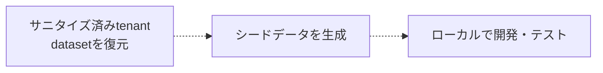

Managed Postgres は標準的な PostgreSQL をベースにしており、既存の PostgreSQL エコシステムとの互換性があります。ほとんどの開発タスクでは、クラウドにデプロイする代わりに、Docker 上で動作するローカルの PostgreSQL インスタンスを使って開発やテストを行えます。

このアプローチにより、フィードバックループを高速化し、オンボーディングを簡素化し、共有インフラストラクチャへの依存を減らし、本番システムに影響を与えることなく安全に試せます。

目的は本番環境を正確に再現することではありません。代わりに、次の条件を満たす再現可能なローカル環境を構築します。

* 本番環境と同じ PostgreSQL のメジャーバージョンを使用する。
* 本番環境と同じスキーマ定義を適用する。
* 開発に適した代表的なデータを含める。
* 通常のアプリケーション開発およびテストのワークフローをサポートする。

Managed Postgres は標準的な PostgreSQL であるため、既存の移行フレームワーク、スキーマ管理ツール、データのシーディング手法をそのまま利用できます。

<div id="example-development-flow">
  ## 一般的な開発の流れ
</div>

ローカルでの一般的な開発ワークフローは次のとおりです。




Managed Postgres は、既存の PostgreSQL 開発ワークフローに自然に組み込めます。ローカルの PostgreSQL インスタンスで開発することで、チームはすばやく反復しながら、再現可能な環境を維持し、Managed Postgres にデプロイした際もアプリケーションが一貫して動作するという確信を持てます。

<div id="run-postgresql-locally-with-docker">
  ## DockerでPostgreSQLをローカルで実行する
</div>

ローカルの開発環境を構築する最も簡単な方法は、DockerでPostgreSQLを実行することです。

Managed Postgres のデプロイに対応するPostgreSQLのバージョンを選択してください。

```yaml title="docker-compose.yml"
services:
  postgres:
    image: postgres:18
    container_name: local-postgres
    restart: unless-stopped

    environment:
      POSTGRES_USER: postgres
      POSTGRES_PASSWORD: postgres
      POSTGRES_DB: app

    ports:
      - "15432:5432"

    volumes:
      - postgres_data:/var/lib/postgresql

volumes:
  postgres_data:
```

PostgreSQLを起動します:

```bash
docker compose up -d
```

接続を確認します:

```bash
psql -h localhost -U postgres -p 15432 -d app
```

この時点では、PostgreSQL はローカルで稼働していますが、まだアプリケーションのスキーマや開発用のデータは入っていません。

<div id="apply-the-application-schema">
  ## アプリケーションのスキーマを適用する
</div>

ローカル環境でスキーマを作成する方法に、唯一の必須手順はありません。ほとんどの組織では、すでに確立されたスキーマ管理のワークフローがあり、変更せずにそのまま再利用できます。

<div id="application-migrations">
  ### アプリケーションの移行
</div>

多くのチームでは、ステージング環境や本番環境で実行するものと同じ移行フレームワーク (Flyway、Liquibase、Rails migrations、Django migrations、Prisma migrations、Alembic など) を使用しています。

ローカルで移行を適用することで、通常の開発プロセスの一環としてスキーマの変更を継続的にテストできます。

```bash
./migrate up
# または
npm run migrate
# または
rails db:migrate
```

<div id="schema-only-postgresql-dumps">
  ### スキーマのみの PostgreSQL ダンプ
</div>

スキーマのみの PostgreSQL エクスポートでは、既存のデータベース構造を再現できます。これは、オンボーディング、スキーマの挙動の調査、互換性の検証、開発環境の迅速な立ち上げに役立ちます。

スキーマをエクスポートします:

```bash
pg_dump \
  --schema-only \
  --no-owner \
  --no-privileges \
  -h <host> \
  -U <user> \
  -d <database> \
  > schema.sql
```

ローカルで復元する:

```bash
psql \
  -h localhost \
  -U postgres \
  -p 15432    \
  -d app \
  -f schema.sql
```

<div id="checked-in-sql-definitions">
  ### ソース管理されたSQL定義
</div>

チームによっては、スキーマ定義をSQLファイルとしてソース管理で直接管理しています。これらは、環境のセットアップ時にローカルのPostgresインスタンスへそのまま適用できます。

どの方法であっても、重要なのは、スキーマ作成が自動化され、再現性があり、バージョン管理された定義に基づいていることです。

<div id="populate-representative-development-data">
  ## 代表的な開発用データを投入する
</div>

スキーマを作成したら、データベースに代表的な開発用データを投入します。

ほとんどの開発ワークフローでは、シードスクリプトで生成した合成データで十分です。これらは簡単に再生成でき、安全に配布できるうえ、本番データに伴うコンプライアンスやセキュリティ上の考慮事項も避けられます。

SaaS アプリケーションでよく使われる方法として、少数のサンプル tenant 向けのデータを生成し、ユーザー、製品、注文、その他の業務エンティティの間に現実的な関係を持たせるというものがあります。

<div id="example-multi-tenant-schema">
  ### マルチテナントのスキーマ例
</div>

以下のスキーマは、簡略化したマルチテナント型 SaaS アプリケーションを表しています。

```sql
CREATE TABLE tenants (
    id UUID PRIMARY KEY,
    name TEXT NOT NULL
);

CREATE TABLE users (
    id UUID PRIMARY KEY,
    tenant_id UUID NOT NULL REFERENCES tenants(id),
    email TEXT NOT NULL,
    first_name TEXT,
    last_name TEXT,
    created_at TIMESTAMP DEFAULT now()
);

CREATE TABLE products (
    id UUID PRIMARY KEY,
    tenant_id UUID NOT NULL REFERENCES tenants(id),
    name TEXT NOT NULL,
    price NUMERIC(10,2)
);

CREATE TABLE orders (
    id UUID PRIMARY KEY,
    tenant_id UUID NOT NULL REFERENCES tenants(id),
    user_id UUID NOT NULL REFERENCES users(id),
    status TEXT,
    created_at TIMESTAMP DEFAULT now()
);

CREATE TABLE order_items (
    id UUID PRIMARY KEY,
    order_id UUID NOT NULL REFERENCES orders(id),
    product_id UUID NOT NULL REFERENCES products(id),
    quantity INTEGER
);

CREATE TABLE audit_logs (
    id UUID PRIMARY KEY,
    tenant_id UUID NOT NULL REFERENCES tenants(id),
    entity_type TEXT,
    entity_id UUID,
    action TEXT,
    created_at TIMESTAMP DEFAULT now()
);
```

<div id="generate-sample-data">
  ### サンプルデータを生成する
</div>

依存関係をインストールします。

```bash
pip install faker psycopg2-binary
```

`seed.py` という名前のファイルを作成します。

```python title="seed.py"
import random
import uuid

import psycopg2
from faker import Faker

fake = Faker()

conn = psycopg2.connect(
    host="localhost",
    port=15432,
    dbname="app",
    user="postgres",
    password="postgres"
)

cur = conn.cursor()

tenant_ids = []

for tenant_name in [
    "Tenant A",
    "Tenant B",
    "Tenant C"
]:
    tenant_id = str(uuid.uuid4())
    tenant_ids.append(tenant_id)

    cur.execute(
        """
        INSERT INTO tenants(id, name)
        VALUES (%s, %s)
        """,
        (tenant_id, tenant_name)
    )

for tenant_id in tenant_ids:

    users = []
    products = []

    for _ in range(20):
        user_id = str(uuid.uuid4())
        users.append(user_id)

        cur.execute(
            """
            INSERT INTO users(
                id,
                tenant_id,
                email,
                first_name,
                last_name
            )
            VALUES (%s,%s,%s,%s,%s)
            """,
            (
                user_id,
                tenant_id,
                fake.email(),
                fake.first_name(),
                fake.last_name()
            )
        )

    for _ in range(15):
        product_id = str(uuid.uuid4())
        products.append(product_id)

        cur.execute(
            """
            INSERT INTO products(
                id,
                tenant_id,
                name,
                price
            )
            VALUES (%s,%s,%s,%s)
            """,
            (
                product_id,
                tenant_id,
                fake.word(),
                round(random.uniform(10, 500), 2)
            )
        )

    for _ in range(50):

        order_id = str(uuid.uuid4())

        cur.execute(
            """
            INSERT INTO orders(
                id,
                tenant_id,
                user_id,
                status
            )
            VALUES (%s,%s,%s,%s)
            """,
            (
                order_id,
                tenant_id,
                random.choice(users),
                random.choice([
                    "pending",
                    "completed",
                    "cancelled"
                ])
            )
        )

        for _ in range(random.randint(1, 5)):
            cur.execute(
                """
                INSERT INTO order_items(
                    id,
                    order_id,
                    product_id,
                    quantity
                )
                VALUES (%s,%s,%s,%s)
                """,
                (
                    str(uuid.uuid4()),
                    order_id,
                    random.choice(products),
                    random.randint(1, 10)
                )
            )

        cur.execute(
            """
            INSERT INTO audit_logs(
                id,
                tenant_id,
                entity_type,
                entity_id,
                action
            )
            VALUES (%s,%s,%s,%s,%s)
            """,
            (
                str(uuid.uuid4()),
                tenant_id,
                "order",
                order_id,
                "created"
            )
        )

conn.commit()
conn.close()
```

スクリプトを実行します:

```bash
python seed.py
```

生成されるデータセットには、以下が含まれます。

| テーブル            | レコード数 |
| --------------- | ----- |
| tenants         | 3     |
| users           | 60    |
| products        | 45    |
| orders          | 150   |
| order&#95;items | 400+  |
| audit&#95;logs  | 150+  |

このデータセットは、ローカルでの開発やテストに適した軽量さを保ちつつ、一般的なアプリケーションのワークフロー、tenant の分離ロジック、レポート用クエリ、リレーショナル整合性の検証を十分に行える規模になっています。

<div id="postgresql-clickhouse-development-environment">
  ## PostgreSQL + ClickHouse 開発環境
</div>

上記の例では、ローカルの PostgreSQL 開発に重点を置いています。PostgreSQL から ClickHouse への完全なアーキテクチャをローカルでテストしたい場合は、オープンソースの PostgreSQL + ClickHouse スタックを実行できます。

このスタックは、トランザクションワークロード向けの PostgreSQL、分析向けの ClickHouse、そしてネイティブな CDC (変更データキャプチャ) 向けの PeerDB を組み合わせたものです。これにより、PostgreSQL を使って開発を進めながら、データを継続的に ClickHouse にレプリケートできます。そのため、運用分析、レポートワークロード、リアルタイムのデータパイプラインを、ローカル環境から直接テストできます。

このスタックは 1 つのコマンドで起動でき、必要なすべてのサービスがあらかじめ設定された状態で含まれています。

```bash
git clone https://github.com/ClickHouse/postgres-clickhouse-stack.git
cd postgres-clickhouse-stack

./run.sh start
```

スタックには以下が含まれます:

* PostgreSQL
* ClickHouse
* PostgreSQL 向け CDC (変更データキャプチャ) のための PeerDB
* 補助サービスとサンプルアプリケーション

セットアップ手順、アーキテクチャの詳細、スタック全体のウォークスルーについては、以下を参照してください:

* [ブログ: PostgreSQL + ClickHouse OSS](https://clickhouse.com/blog/postgres-clickhouse-oss)
* [GitHub: postgres-clickhouse-stack](https://github.com/ClickHouse/postgres-clickhouse-stack)

これは、アプリケーションが PostgreSQL に対してローカルで動作するようになった後、PostgreSQL から ClickHouse への同期、リアルタイム分析、アプリケーションのエンドツーエンドの動作を検証したい場合に、次のステップとして有用です。