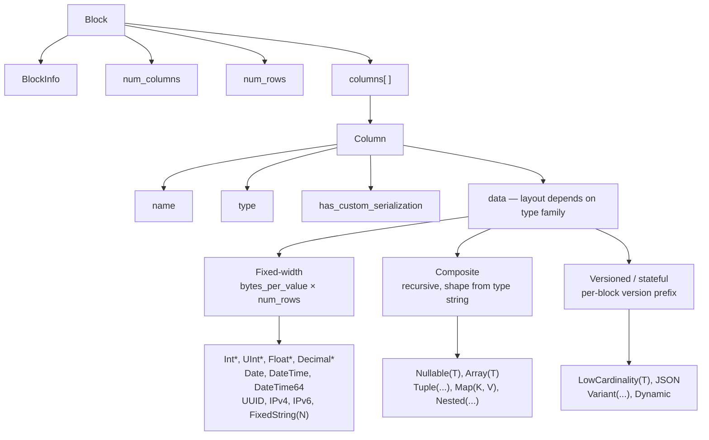
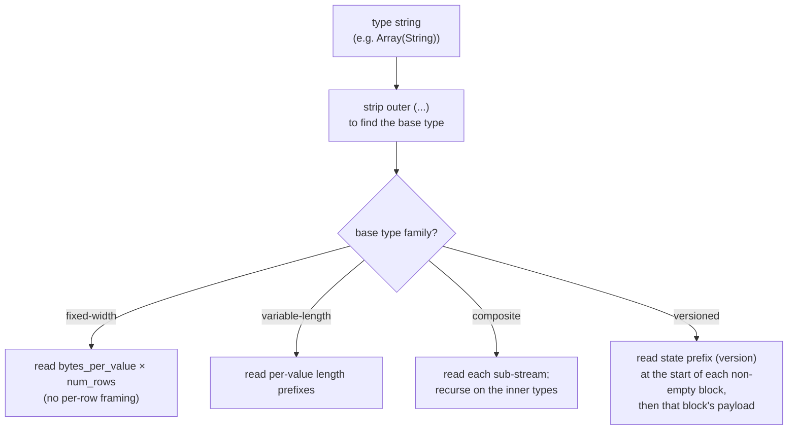
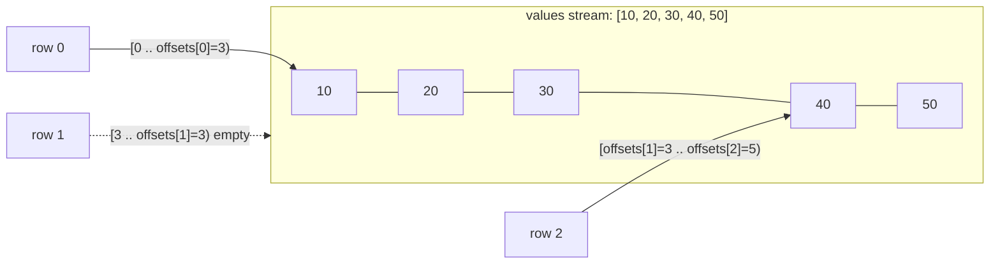
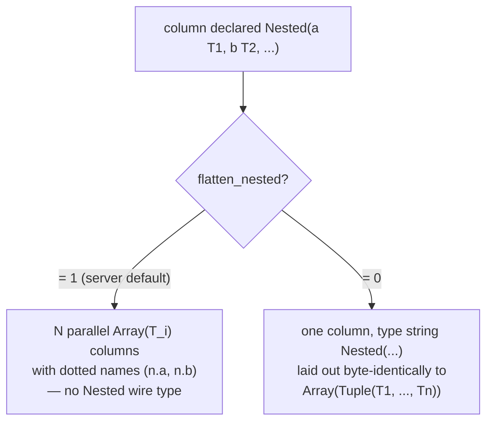
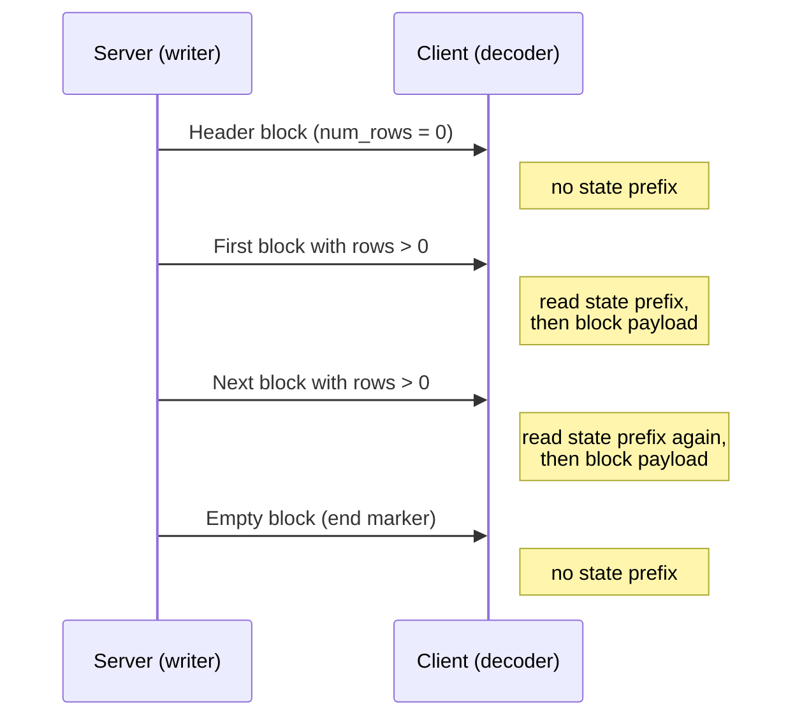
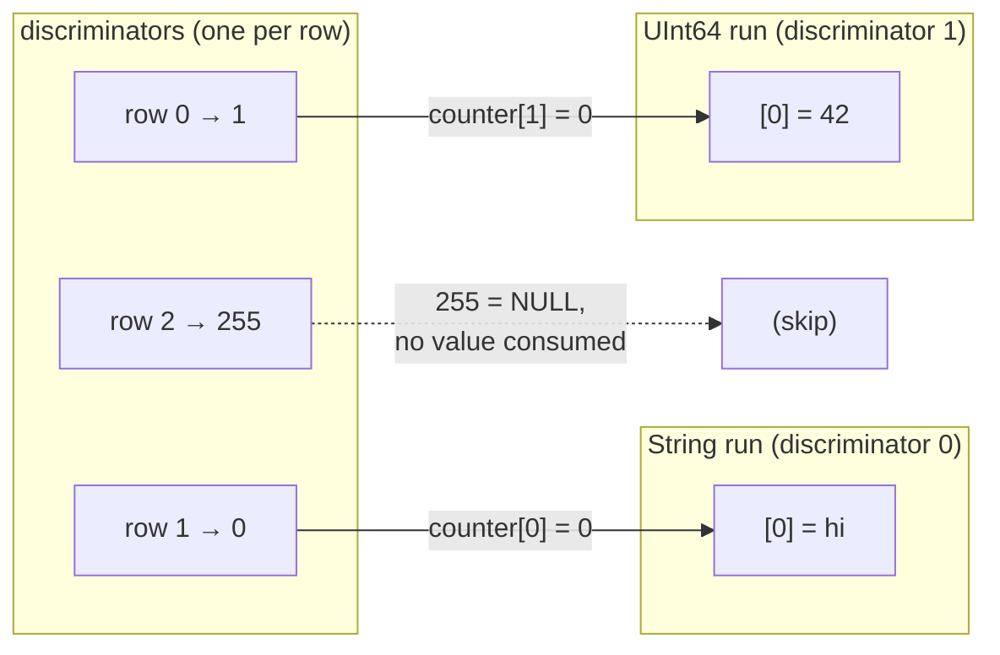
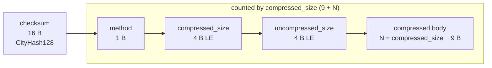

Nativeフォーマットは、ClickHouse が表形式データをやり取りするために使用する列指向のワイヤ形式です。これは次のような箇所で使われます。

* [ネイティブ TCP プロトコル](/ja/reference/interfaces/specs/NativeProtocol) における `Data`、`Totals`、`Extremes`、`Log`、`ProfileEvents` パケットのボディ (`TableColumns` パケットは Native ブロック**ではありません**。2 つのバイナリ文字列を持つため、そのレイアウトは [ネイティブプロトコル仕様](/ja/reference/interfaces/specs/NativeProtocol) に属します) ;
* HTTP 経由の `SELECT ... FORMAT Native` の出力;
* `INTO OUTFILE ... FORMAT Native` で書き出されるファイルエクスポート;
* サーバー間レプリケーションのペイロード。

このページでは、Block 内のバイト列、つまり列指向ペイロードと、それを構成する各カラムの型エンコーディングについて説明します。パケットのフレーミング、接続状態、バージョンネゴシエーションについては、[ネイティブプロトコル仕様](/ja/reference/interfaces/specs/NativeProtocol) を参照してください。

複数バイトの整数フィールドはすべてリトルエンディアンです。符号付き整数には 2 の補数を使用します。

<Tip>
  ユーザー向けの `Native` フォーマットの概要 (`curl` の例付き) については、[Native フォーマットのページ](/ja/reference/formats/Native) を参照してください。この仕様は、より低レベルのワイヤ形式リファレンスです。
</Tip>

<div id="overview">
  ## 概要
</div>

ワイヤ上で行を運ぶものはすべて **Block** です。これは、行をカラム単位で格納した、自己記述的な chunk です。最初にカラム 1 のすべての値が並び、次にカラム 2 のすべての値が続きます。Block に含まれるのは、完全なテーブルではなく、クエリが参照するカラムだけです。

カラムの `data` は、その型が属する*ファミリー*に応じて配置されます。デコーダの複雑さが低いものから高いものへ順に、次のファミリーがあります。



* **固定幅**型では、`data` は `bytes_per_value × num_rows` の生バイトとして配置され、行ごとのフレーミングはありません。
* **複合**型 (`Nullable`, `Array`, `Tuple`, `Map`, `Nested`) は、型文字列から完全に導き出せる再帰的な構造を持ち、バージョンプレフィックスもブロック間の状態もありません。
* **バージョン付き / ステートフル** 型 (`LowCardinality`, `JSON`, `Variant`, `Dynamic`) は、空でない各ブロックの先頭にシリアライゼーションのバージョン/状態プレフィックスを付加します。`Native` wire では、このプレフィックスと任意の Dictionary は**ブロックごと**です。つまり、このフォーマットはブロック*間*で状態を持ちません (writer はブロックごとに新しいシリアライゼーション状態を作成し、`low_cardinality_max_dictionary_size = 0` を設定します) 。ブロック間の状態は MergeTree のオンディスク上の話であり、Native wire layout の話ではありません。

<div id="wire-primitives">
  ## ワイヤプリミティブ
</div>

Nativeフォーマットは、4つの基本的なエンコーディングを基盤としています。

| Primitive       | Size                 | Description                 |
| --------------- | -------------------- | --------------------------- |
| VarUInt         | 1–10 B               | LEB-128 可変長符号なし整数           |
| Fixed-width int | 1, 2, 4, 8, 16, 32 B | リトルエンディアン、符号付き整数は 2 の補数     |
| String          | variable             | VarUInt の長さプレフィックス + 生のバイト列 |
| Bool            | 1 B                  | `0x00` = false、非ゼロ = true   |

<div id="varuint">
  ### VarUInt
</div>

LEB-128 エンコーディングを使用する可変長の符号なし整数です。各バイトは、0～6 ビット目に 7 ビットのデータ、7 ビット目に 1 ビットの継続ビットを持ちます。継続ビットは、後続のバイトがある場合は `1`、最後のバイトでは `0` になります。

| Value range     | Bytes |
| --------------- | ----- |
| 0 – 127         | 1     |
| 128 – 16383     | 2     |
| 16384 – 2097151 | 3     |
| UInt64 の最大値まで   | 最大 10 |

値 `300` のエンコード:

```text
300 = 0b100101100

Byte 0: 0xAC = 0b10101100   (data: 0101100, continuation: 1)
Byte 1: 0x02 = 0b00000010   (data: 0000010, continuation: 0)
```

バイト列 `0xAC 0x02` をデコードすると:

```text
Byte 0: data = 0x2C, continuation = 1 → accumulator = 0x2C, shift = 7
Byte 1: data = 0x02, continuation = 0 → accumulator = (0x02 << 7) | 0x2C = 300
```

<div id="fixed-width-integers">
  ### 固定長整数
</div>

| 型       | バイト | エンコーディング               |
| ------- | --- | ---------------------- |
| UInt8   | 1   | 生のバイト                  |
| UInt16  | 2   | リトルエンディアン              |
| UInt32  | 4   | リトルエンディアン              |
| UInt64  | 8   | リトルエンディアン              |
| UInt128 | 16  | リトルエンディアン              |
| UInt256 | 32  | リトルエンディアン              |
| Int8    | 1   | 生のバイト、2 の補数            |
| Int16   | 2   | リトルエンディアン、2 の補数        |
| Int32   | 4   | リトルエンディアン、2 の補数        |
| Int64   | 8   | リトルエンディアン、2 の補数        |
| Int128  | 16  | リトルエンディアン、2 の補数        |
| Int256  | 32  | リトルエンディアン、2 の補数        |
| Float32 | 4   | IEEE 754 単精度、リトルエンディアン |
| Float64 | 8   | IEEE 754 倍精度、リトルエンディアン |

たとえば、UInt32 の値 `1` は `01 00 00 00` にエンコードされ、Int32 の値 `-1` は `FF FF FF FF` にエンコードされます。

<div id="string">
  ### String
</div>

長さプレフィックス付きのバイト列:

```text
[VarUInt: byte_length] [byte_length bytes: raw value]
```

バイト列は、有効な UTF-8 である必要はありません。空文字列は 1 バイトの `0x00` としてエンコードされ、文字列には埋め込み NUL を含む任意のバイト値を含めることができます。文字列 `"ab"` は `02 61 62` としてエンコードされます。デコードするには、まず VarUInt の長さ (`2`) を読み取り、次にその長さ分のバイトを読み取ります。

<div id="bool">
  ### Bool
</div>

1 バイトです。`0x00` は false、`0x00` 以外の値は true (標準的には `0x01`) です。

<div id="block-and-column-structure">
  ## ブロックとカラム構造
</div>

<div id="block-wire-layout">
  ### Block のワイヤレイアウト
</div>

```text
[BlockInfo]               metadata (only on the TCP Data-packet path; see below)
[VarUInt: num_columns]    number of columns in this block
[VarUInt: num_rows]       number of rows in this block
[Column × num_columns]    column entries, omitted when num_columns = 0
```

`BlockInfo` プレフィックスの有無はチャネルによって異なります。これは、writer が *リビジョン* によってパラメータ化されているためです。

* **native TCP プロトコル** では、server は接続時にネゴシエートされた リビジョン で block を書き込みます (大きな値であり、この release では `DBMS_TCP_PROTOCOL_VERSION` は `54485` です) 。`BlockInfo` は、その リビジョン が 0 より大きい場合に書き込まれます。実際の接続では、これは常に当てはまります。各 column の `has_custom_serialization` バイト ([column wire layout](#column-wire-layout) を参照) は、リビジョン `54454` 以上で書き込まれます。
* `Native` *出力フォーマット* — HTTP 経由の `SELECT ... FORMAT Native`、`INTO OUTFILE ... FORMAT Native`、および `clickhouse-client` が生成する `Native` フォーマット — は、*デフォルトでは* リビジョン `0` でシリアライズされます。リビジョン `0` では、`BlockInfo` プレフィックスと `has_custom_serialization` バイトはどちらも省略されるため、block は単に `num_columns`、`num_rows`、および columns だけになります。

  HTTP では、この リビジョン は固定ではありません。client は `?client_protocol_version=<n>` クエリパラメータでこれを引き上げることができ、server はその値をレスポンスのシリアライゼーション リビジョン として使用します。

  十分に大きな値を指定すると、HTTP 出力には `BlockInfo` プレフィックス (リビジョン が `0` より大きい場合に書き込まれます) と `has_custom_serialization` バイト (リビジョン `54454` 以上で書き込まれます) が含まれ、TCP 経路とまったく同じになります。したがって、clients はすべての HTTP `FORMAT Native` payload が リビジョン `0` だと想定してはなりません。

つまり、この節で `BlockInfo` プレフィックスで始まるバイト例は、TCP Data-packet payload を示しています。同じクエリを `FORMAT Native` 経由で取得した場合は、それに対応する短い形式になります。

<div id="blockinfo">
  ### BlockInfo
</div>

BlockInfo はフィールドの列であり、各フィールドの前に VarUInt のフィールド ID が付き、フィールド ID `0` で終端されます。ワイヤ形式は**自己記述型**ではありません。フィールド ID 自体には値の長さや型がエンコードされていないため、読み取り側は遭遇しうる各フィールド ID の型をあらかじめ把握している必要があります。ClickHouse のリーダー実装では、認識できないフィールド ID は破損と見なされ、例外 (`UNKNOWN_BLOCK_INFO_FIELD`) が発生します。前方互換性は代わりにプロトコルのリビジョンで担保されます。送信側は、ネゴシエートされたリビジョンがそのフィールドの最小リビジョン以上である場合にのみそのフィールドを書き込むため、古い受信側が未知のフィールドを見ることはありません。

| フィールド ID | フィールド                            | 型             | 最小リビジョン | 説明                                                           |
| -------- | -------------------------------- | ------------- | ------- | ------------------------------------------------------------ |
| 1        | is&#95;overflows                 | UInt8         | 0       | GROUP BY のオーバーフローブロック。オーバーフローでないブロックの場合は `0`。                |
| 2        | bucket&#95;number                | Int32         | 0       | 集約バケット。バケット化されていないブロックの場合は `-1`。                             |
| 3        | out&#95;of&#95;order&#95;buckets | List of Int32 | 54480   | 分散集約中に遅延したバケット。VarUInt の個数に続けて、その個数分の `Int32` 値としてエンコードされます。 |
| 0        | (終端)                             | —             | —       | BlockInfo の終端。常に必須です。                                        |

フィールド `1` と `2` の最小リビジョンは `0` であるため、`BlockInfo` が書き込まれる場合は常に含まれます。フィールド `3` はリビジョン `54480` 以上でのみ書き込まれます。一般的なケース (リビジョンが `54480` 未満) でのワイヤレイアウトは次のとおりです。

```text
[VarUInt: 1] [UInt8: is_overflows]
[VarUInt: 2] [Int32: bucket_number]
[VarUInt: 0]
```

<div id="column-wire-layout">
  ### Column のワイヤレイアウト
</div>

1 つの Block 内には、Column が `num_columns` 回現れます。

| # | Field                            | Type                              | Condition                               | Description                                                                                                                                                                                           |
| - | -------------------------------- | --------------------------------- | --------------------------------------- | ----------------------------------------------------------------------------------------------------------------------------------------------------------------------------------------------------- |
| 1 | name                             | String                            | 常に                                      | カラム名                                                                                                                                                                                                  |
| 2 | type                             | String *または* binary type encoding | 常に                                      | 既定では ClickHouse の型文字列 (例: `"UInt64"`、`"Array(String)"`&quot;`）です。`output&#95;format&#95;native&#95;encode&#95;types&#95;in&#95;binary&#95;format = 1&#96; の場合は、binary type encoding になります (下の注記を参照) 。 |
| 3 | has&#95;custom&#95;serialization | UInt8                             | feature `CUSTOM_SERIALIZATION` (v54454) | `0` = 既定、`1` = カスタム (この後に kind&#95;stack が続く)                                                                                                                                                         |
| 4 | kind&#95;stack                   | bytes                             | field 3 = `1` の場合                       | 既定以外のシリアライゼーション (スパースなど) を示す UInt8 の enum バイト 1 つです (下記参照) 。値が `COMBINATION` の場合は、その後に VarUInt の個数と、その個数分の追加 kind バイトが続きます。`Tuple` (および要素レベルのシリアライゼーション情報を持つその他の複合型) の場合、ペイロードは再帰的になります。下記を参照してください。  |
| 5 | data                             | bytes                             | 常に                                      | `num_rows` の全行に対するカラム値です。レイアウトは型ごとに異なります。[data types](#data-types)を参照してください。スパースカラムについては下記を参照してください。                                                                                                  |

デコーダは `type` 文字列に基づいて処理を分岐します。型文字列には括弧付きのパラメーターが含まれることが多いため、デコーダはまず `(...)` の接尾辞を取り除いて基本型を特定し、その後でサイズ、scale、または内部型の判定に必要なパラメーターをパースします。ネストした型を含むパラメーターリスト (たとえば `Array` の中に `Tuple` がある場合) をパースするには、単純に `,` で分割するのではなく、括弧のネストを追跡する深さ対応のカンマ分割が必要です。

<Info>
  **Binary type encoding**

  `type` フィールドがテキストの `String` になるのは既定モードの場合のみです。クエリ設定 `output_format_native_encode_types_in_binary_format = 1` が設定されている場合、このフィールドは代わりに **binary type encoding** になります。これは [data type binary encoding](/ja/reference/data-types/data-types-binary-encoding) に記載されているものと同じタグベースのエンコーディングです。また、フラット化された `Dynamic` 型リストでも、型ごとの名前に同じバイナリエンコーディングが使われます。field 2 を常に長さプレフィックス付き文字列として読むデコーダは、最初のバイナリ型タグを文字列長として扱ってしまい、ストリームとの同期がずれるため、ストリームがどのモードを使用しているかを把握している必要があります。
</Info>



<div id="kind-stack-and-sparse-encoding">
  #### kind_stack とスパースエンコーディング
</div>

`kind_stack` バイトは、カラムごとの非デフォルトなシリアライゼーションを表します。

| Byte   | Name                         | Meaning                                             | Wire impact on `data`                                          |
| ------ | ---------------------------- | --------------------------------------------------- | -------------------------------------------------------------- |
| `0x00` | DEFAULT                      | デフォルトのシリアライゼーション                                    | `has_custom = 0` と同一                                           |
| `0x01` | SPARSE                       | スパースシリアライゼーション (v54465+)                            | オフセットストリーム + 非デフォルト値。詳細は下記                                     |
| `0x02` | DETACHED                     | 並列ブロックマーシャリング (v54478+) により `ColumnBLOB` でラップされたカラム | 事前にマーシャリングされたブロブ: `VarUInt size` + そのサイズ分のバイト列。詳細は下記           |
| `0x03` | DETACHED&#95;OVER&#95;SPARSE | `ColumnBLOB` でラップされたスパースカラム                         | `DETACHED` と同じブロブペイロード。詳細は下記                                   |
| `0x04` | REPLICATED                   | 繰り返し値用の Dictionary 形式 (v54482+)                     | 索引ストリーム + 密にエンコードされた要素値。詳細は下記                                  |
| `0x05` | COMBINATION                  | 複数 kind のスタック                                       | この後に VarUInt `count` と、さらに `count` 個の kind バイトが続く — 詳細は下の注記を参照 |

**`COMBINATION` ペイロードでは別の enum を使います。** 上の 5 行は *compact* な 1 バイトコードです。`COMBINATION` (`0x05`) は、それらで表せない任意のスタックに対する汎用エスケープで、後ろに `VarUInt` `count`、さらに `count` 個の 1 バイトエントリが続きます。これらのエントリは、表にある compact コード**ではなく**、生の `ISerialization::Kind` 値です。

| Byte   | Nested `Kind` |
| ------ | ------------- |
| `0x00` | DEFAULT       |
| `0x01` | SPARSE        |
| `0x02` | DETACHED      |
| `0x03` | REPLICATED    |

このネストされた enum のバイト値は compact コードとは異なります。たとえば `REPLICATED` はこの nested enum では `0x03` ですが、compact コードでは `0x04` です。また、`DETACHED_OVER_SPARSE` に対応するエントリはなく、この組み合わせは `SPARSE`, `DETACHED` という 2 つの連続したエントリとして表されます。ネストされたバイトに対しても compact テーブルを使い続けるデコーダーは、`0x03`/`0x04` の対応付けを誤り、同期がずれます。

`count` は、すべてのスタックの先頭にある `DEFAULT` エントリを**含む**スタック全体の長さです。compact コードはすでに 1 エントリおよび 2 エントリのスタックをすべてカバーしているため、`COMBINATION` の `count` は常に 3 以上になります。

**`Tuple` カラムにおける再帰的な `kind_stack`。** 上記の `kind_stack` ペイロードは、1 つのカラム自身のシリアライゼーション情報に対応するバイト (または `COMBINATION` シーケンス) です。`Tuple` は `SerializationInfoTuple` を持ち、まず tuple 自身の kind-stack ペイロードを書き出し、その後に各要素について完全な kind-stack ペイロードを順番に書き出します。デコーダーも同じ再帰構造でこれを読み戻します。したがって `Tuple(A, B, C)` では、field 4 のバイト列は `[tuple_kind][A_kind][B_kind][C_kind]` となり、ある要素がさらに複合型であれば、その要素のペイロード自体も再帰的になります。`has_custom_serialization` バイト (field 3) は、tuple 自身の情報**またはいずれかの要素**の情報が非デフォルトである場合に設定されるため、特殊な要素が sparse、replicated、detached のいずれか 1 つだけである `Tuple` でも kind-stack ペイロードが出力されます。`Tuple` に対して先頭の単一 enum バイトだけを読むデコーダーは、途中で早く止まり、残りの要素 kind バイトをカラムデータとして誤読します。

**スパースのワイヤ形式。** `kind_stack = 0x01` の場合、カラム `data` は 2 つのストリームからなり、1 本の共有 TCP ストリーム上に連続して書き込まれます。

1. **オフセットストリーム** — `VarUInt` の数列。各値 `v` は次のいずれかです。
   * 62 ビット目がクリアされた `v`: `(v & 0x3FFFFFFFFFFFFFFF)` = 次の明示的な非デフォルト値の前にあるデフォルト位置の数。その非デフォルト位置は `cursor + group_size` で、ここで `cursor` は現在位置です。その後 `cursor` は `group_size + 1` だけ進みます。
   * 62 ビット目がセットされた `v` (`END_OF_GRANULE_FLAG`): フラグをクリアした値 = 最後の非デフォルト値の後ろにある、末尾のデフォルト位置の数。これが、そのブロックにおけるオフセットストリームの終端を示します。
2. **値ストリーム** — 内部型で密にエンコードされた `count` 個の非デフォルト値。ここで `count` は、上で読み取った非 EOG の `VarUInt` の個数です。

デコーダーは、`num_rows` 個のエントリを持つ密なカラムを再構築する際、明示されていないすべての位置を内部型のデフォルト値 (整数と浮動小数点数では `0`、`String` では `""`、`Date` では `0` 日、など) で埋めます。

スパースな `Nullable(T)` カラムは特別なケースです。というのも、`Nullable(T)` のデフォルト値は **NULL** だからです。スパースエンコーディングでは、通常の `Nullable` の null-map ストリームは完全に省略されます。オフセットストリームがデフォルト値以外、つまり非 NULL の位置を示し、値ストリームにはそれらの非 NULL 値だけが `T` として密に格納され、明示されていないすべての位置は NULL として再構築されます。したがって、デコーダーは値ストリーム内に null map を探しては *ならず*、またギャップを存在する `0` で埋めて *ならず*、NULL で埋めなければなりません。

**レプリケーションされたワイヤ形式。** `kind_stack = 0x04` の場合、カラム `data` は辞書です。つまり、重複のない要素値のリストと、そのリストへの各行の索引から構成されます (`LowCardinality` と同じルックアップ構造です) 。内部型自体がバージョン化されている場合、たとえば `LowCardinality(T)` では、その状態プレフィックスがインデックスストリームより**先に**書き込まれます。つまり、このレプリケーションされたシリアライゼーションでは、`num_rows` を書き込む前に、プレフィックスのフェーズを内部型に委譲します。プレフィックスが空の内部型 (リーフ型および通常の複合型) は、ここでは何のバイト列も追加しません。

```text
[inner type's state prefix]              empty for leaf inners; e.g. LowCardinality version (Int64 = 1)
[VarUInt num_rows]
[UInt8  size_of_indexes_type]            width of each index: 1, 2, 4, or 8 bytes
[indexes: num_rows × size_of_indexes_type bytes]
[VarUInt num_elements]
[elements: num_elements dense inner-type values]
```

デコーダは、各出力行 `i` について `elements[indexes[i]]` を選択することで、密なカラムを再構築します。複合的な内側の型は再帰的に処理されます。要素リストはまず内側の型で実体化され、その後インデックス参照されます。サポートされる内側の型には、リーフ型、`Nullable(T)`、`Array(T)`、`Tuple(...)`、`Map(K, V)`、`Nested(...)` (各フィールドは `Array` と同様に展開) 、および `LowCardinality(T)` (共有 Dictionary は保持され、要素ごとのキーだけがインデックス参照される) が含まれます。

**デタッチされたワイヤ形式。** `DETACHED` (`0x02`) と `DETACHED_OVER_SPARSE` (`0x03`) は、ワイヤ上に*実際に*現れます。つまり、純粋な内部表現ではありません。TCP パスでは、圧縮が有効で、ネゴシエートされたリビジョンが少なくとも `DBMS_MIN_REVISON_WITH_PARALLEL_BLOCK_MARSHALLING` (v54478) である場合、カラムは次の 3 段階を経ます。

1. 対象となる各カラム (`const` でも `Tuple` でもなく、かつ複数行を含むブロック内にあるもの) は、メインスレッドとは別で、すでにマーシャリングおよび圧縮済みのカラムを保持する `ColumnBLOB` でラップされます。
2. `DETACHED` が、ラップされたカラムの kind スタックに追加されます。
3. カラムの `data` は、`VarUInt` のブロブサイズに続けて、そのサイズちょうどのブロブのバイト列として書き込まれます。

ラップされたカラムがスパースだった場合、そのスタックは `{DEFAULT, SPARSE, DETACHED}` となり、`DETACHED_OVER_SPARSE` としてシリアライズされます。そのようなカラムをデコードするクライアントは、ブロブの長さとバイト列を読み取った後、ブロブを解凍して内側のカラムのペイロードを復元します (圧縮の節にある [`ColumnBLOB` の注記](#compression-negotiation) を参照) 。

<div id="block-variants">
  ### Block のバリアント
</div>

Data ファミリーのすべてのパケットは、同じ Block ワイヤ形式を共有します。バリアントごとの差異は、カラム数と行数のみです。

| Variant      | num&#95;columns | num&#95;rows | Purpose                                 |
| ------------ | --------------- | ------------ | --------------------------------------- |
| Header block | N &gt; 0        | 0            | 結果スキーマ (カラム名 + 型) を通知します。               |
| Result block | N &gt; 0        | M &gt; 0     | 実際の結果の行です。                              |
| Empty block  | 0               | 0            | センチネル — クライアント側では入力の終端、サーバー側では境界マーカーです。 |

<div id="byte-level-examples">
  ### バイトレベルの例
</div>

このセクションのすべての例は **TCP Data-packet path** から取っているため、`BlockInfo` プレフィックスと `has_custom_serialization` バイトが含まれています。`FORMAT Native` では同じブロックはより短くなり、参考になる場合は対応する短縮形式も示します。

空のブロック (BlockInfo あり) 、合計 8 バイト:

```text
01 00                   BlockInfo: field_id=1, is_overflows=0
02 FF FF FF FF          BlockInfo: field_id=2, bucket_number=-1
00                      BlockInfo terminator
00                      num_columns = 0
00                      num_rows = 0
```

`SELECT 1` のヘッダーブロックは、型 `UInt8` の `"1"` という名前のカラムが 1 つあり、行数は 0 であることを示します。プロトコル ≥ 54454 では、`has_custom_serialization` バイトが含まれます。

```text
01 00                   BlockInfo: is_overflows = 0
02 FF FF FF FF          BlockInfo: bucket_number = -1
00                      BlockInfo terminator
01                      num_columns = 1
00                      num_rows = 0
01 "1"                  Column[0].name = "1"
05 "UInt8"              Column[0].type = "UInt8"
00                      Column[0].has_custom_serialization = 0
                        Column[0].data: no bytes (num_rows = 0)
```

同じクエリの結果ブロック (1行) :

```text
01 00                   BlockInfo: is_overflows = 0
02 FF FF FF FF          BlockInfo: bucket_number = -1
00                      BlockInfo terminator
01                      num_columns = 1
01                      num_rows = 1
01 "1"                  Column[0].name = "1"
05 "UInt8"              Column[0].type = "UInt8"
00                      Column[0].has_custom_serialization = 0
01                      Column[0].data: one UInt8 byte = 1
```

`FORMAT Native` (リビジョン `0`) では、同じ結果ブロックに `BlockInfo` も `has_custom_serialization` バイトも含まれず、`SELECT 1 FORMAT Native` は 11 バイトです:

```text
01                      num_columns = 1
01                      num_rows = 1
01 "1"                  Column[0].name = "1"
05 "UInt8"              Column[0].type = "UInt8"
01                      Column[0].data: one UInt8 byte = 1
```

(ヘッダーのみのブロックのような0行の結果は、`FORMAT Native` では一切バイトを出力しません。出力フォーマットは空のブロックを出力しないためです。)

<div id="data-types">
  ## データ型
</div>

このセクションでは、Nativeフォーマットでカラムの `data` に格納できる型のワイヤエンコーディングについて説明します。型は、デコーダの複雑さが増す順に 4 つのファミリーに分類されています。`AggregateFunction(func, ...)` と `QBit(T, N)` の 2 つは有効な `Native` のカラム型ですが、関数固有または型固有のペイロードを持つため、ここでの対象外です。これらについては、別名と誤解される可能性がある箇所で、その旨を以下に示しています。

| ファミリー            | セクション                          | 1 カラムあたりのストリーム数 | ブロック間の状態                                         |
| ---------------- | ------------------------------ | --------------- | ------------------------------------------------ |
| 固定幅              | [固定幅型](#fixed-width-types)     | 1               | なし                                               |
| 可変長              | [可変長型](#variable-length-types) | 1               | なし                                               |
| 複合 (固定構造)        | [複合型](#composite-types)        | 複数              | なし                                               |
| バージョン付き / ステートフル | [バージョン付き型](#versioned-types)   | 複数              | Native wire 上ではなし — ブロックごとの状態プレフィックスで、各ブロックごとに新規 |

<div id="fixed-width-types">
  ### 固定幅型
</div>

各値は固定のバイト数を占有します。`M` 行のカラムは、ワイヤ上で厳密に `bytes_per_row × M` バイトを占有し、区切りやパディングなしで連結されます。

| 型文字列                | 値ごとのバイト数        | 論理値                                                                              | ワイヤ形式                                               |
| ------------------- | --------------- | -------------------------------------------------------------------------------- | --------------------------------------------------- |
| `UInt8`             | 1               | 符号なし 8 ビット整数                                                                     | 生バイト                                                |
| `UInt16`            | 2               | 符号なし 16 ビット整数                                                                    | リトルエンディアン                                           |
| `UInt32`            | 4               | 符号なし 32 ビット整数                                                                    | リトルエンディアン                                           |
| `UInt64`            | 8               | 符号なし 64 ビット整数                                                                    | リトルエンディアン                                           |
| `UInt128`           | 16              | 符号なし 128 ビット整数                                                                   | リトルエンディアン                                           |
| `UInt256`           | 32              | 符号なし 256 ビット整数                                                                   | リトルエンディアン                                           |
| `Int8`              | 1               | 符号付き 8 ビット整数、2 の補数                                                               | 生バイト                                                |
| `Int16`             | 2               | 符号付き 16 ビット整数、2 の補数                                                              | リトルエンディアン                                           |
| `Int32`             | 4               | 符号付き 32 ビット整数、2 の補数                                                              | リトルエンディアン                                           |
| `Int64`             | 8               | 符号付き 64 ビット整数、2 の補数                                                              | リトルエンディアン                                           |
| `Int128`            | 16              | 符号付き 128 ビット整数、2 の補数                                                             | リトルエンディアン                                           |
| `Int256`            | 32              | 符号付き 256 ビット整数、2 の補数                                                             | リトルエンディアン                                           |
| `Float32`           | 4               | IEEE 754 単精度                                                                     | リトルエンディアン                                           |
| `Float64`           | 8               | IEEE 754 倍精度                                                                     | リトルエンディアン                                           |
| `BFloat16`          | 2               | IEEE 754 `Float32` の上位 16 ビット                                                    | リトルエンディアン                                           |
| `Bool`              | 1               | `0x00` = false、`0x01` = true                                                     | 生バイト                                                |
| `Date`              | 2               | `1970-01-01` からの日数                                                               | リトルエンディアン UInt16                                    |
| `Date32`            | 4               | `1970-01-01` からの日数 (符号付き。1970 年以前も可)                                             | リトルエンディアン Int32                                     |
| `DateTime`          | 4               | 秒単位の Unixタイムスタンプ                                                              | リトルエンディアン UInt32                                    |
| `DateTime(tz)`      | 4               | `DateTime` と同じ。timezone はメタデータ                                                   | リトルエンディアン UInt32                                    |
| `DateTime64(s)`     | 8               | スケール `s` のティック (epoch からの 10^-s 秒)                                               | リトルエンディアン Int64                                     |
| `DateTime64(s, tz)` | 8               | `DateTime64(s)` と同じ。timezone はメタデータ                                              | リトルエンディアン Int64                                     |
| `Time`              | 4               | 秒単位の符号付き経過時間                                                                     | リトルエンディアン Int32                                     |
| `Time64(s)`         | 8               | スケール `s` のティック単位の符号付き経過時間                                                        | リトルエンディアン Int64                                     |
| `Interval<Unit>`    | 8               | 符号付きの個数。単位は型文字列で表されます                                                            | リトルエンディアン Int64                                     |
| `UUID`              | 16              | 128 ビット識別子                                                                       | バイトスワップした LE UInt64 を 2 つ並べたもの ([UUID](#uuid) を参照)  |
| `IPv4`              | 4               | IPv4アドレス                                                                         | リトルエンディアン UInt32                                    |
| `IPv6`              | 16              | IPv6アドレス                                                                         | ネットワークバイトオーダー、スワップなし                                |
| `Enum8`             | 1               | 符号付き 8 ビット整数 (バリアント索引)                                                           | 生バイト                                                |
| `Enum16`            | 2               | 符号付き 16 ビット整数 (バリアント索引)                                                          | リトルエンディアン                                           |
| `Decimal(P, S)`     | 4 / 8 / 16 / 32 | `value × 10^S` を符号付き整数として表現。幅は P に依存 (≤9 → 4 B、≤18 → 8 B、≤38 → 16 B、≤76 → 32 B)  | リトルエンディアンの符号付き整数                                    |

<div id="integer-types">
  #### 整数型
</div>

`UInt8`–`UInt256` と `Int8`–`Int256` は、整数値を直接バイナリでエンコードしたものです。デコーダーは `bytes_per_row × num_rows` バイトを読み取り、その型に従って解釈します。

`[1, 256, 65536]` を保持する `UInt32` カラム:

```text
01 00 00 00              row 0: 1
00 01 00 00              row 1: 256
00 00 01 00              row 2: 65536
```

`[-1, 42]` の値を持つ `Int32` カラム:

```text
FF FF FF FF              row 0: -1
2A 00 00 00              row 1: 42
```

<div id="float32-and-float64">
  #### Float32 and Float64
</div>

標準的な IEEE 754 バイナリ浮動小数点数です。4 バイトの単精度 (`binary32`) と 8 バイトの倍精度 (`binary64`) があり、いずれもリトルエンディアンです。NaN、±Infinity、±0.0、非正規化数はいずれも、正規化されることなくそのまま往復変換されます。

`Float32` の値 `1.5` (`0x3FC00000`):

```text
00 00 C0 3F              little-endian IEEE 754
```

`Float64` の値 `1.5` (`0x3FF8000000000000`):

```text
00 00 00 00 00 00 F8 3F  little-endian IEEE 754
```

<div id="bfloat16">
  #### BFloat16
</div>

brain-floating-point 形式です。IEEE 754 `Float32` の上位 16 ビットで、1 ビットの符号、8 ビットの指数、7 ビットの仮数から構成されます。各値は 2 バイトで、リトルエンディアンの生の 16 ビットパターンを保持します。数値として復元するには、そのパターンを上位半分に配置し、下位半分を 0 にして `Float32` に拡張します (`bits << 16` を `Float32` として reinterpret したもの) 。このように拡張した値のテキストフォーマットは、`Float32` と同じです。

`BFloat16` の値 `1.5` (パターン `0x3FC0`、`Float32` `0x3FC00000` の上位半分) :

```text
C0 3F                    little-endian, widens to Float32 1.5
```

<div id="bool-type">
  #### Bool
</div>

`UInt8` とワイヤ形式で互換性があるで、1行あたり 1 バイトです。`0x00` = false、`0x01` = true。wire 上の型文字列は文字どおり `Bool` (`UInt8` ではなく) なので、型文字列に基づいて振り分けるデコーダーでは、これを別個の型として認識する必要があります。

`Bool` カラム `[true, false, true]`:

```text
01 00 01
```

<div id="date-and-date32">
  #### Date と Date32
</div>

どちらも、Unix エポック `1970-01-01` からの経過日数を整数としてエンコードします。どちらにも時刻の部分は含まれません。

| 型        | バイト | エンコーディング             | 範囲                           |
| -------- | --- | -------------------- | ---------------------------- |
| `Date`   | 2   | リトルエンディアン UInt16 | `1970-01-01` から `2149-06-06` |
| `Date32` | 4   | リトルエンディアン Int32  | 広い符号付き範囲、1970年以前も可           |

`Date` の値 `1970-01-02` (1日) :

```text
01 00                    UInt16 LE = 1
```

`Date32` の値 `1900-01-01` (-25567日) :

```text
21 9C FF FF              Int32 LE = -25567
```

<div id="datetime">
  #### DateTime
</div>

ワイヤ形式で `UInt32` と互換性があります。秒単位の Unixタイムスタンプで、4 バイトのリトルエンディアンです。この型は `DateTime` または `DateTime('Timezone')` として現れることがあり、タイムゾーンは表示にのみ影響し、ワイヤ上の値には含まれません。タイムゾーンのパラメータが異なる 2 つの `DateTime` カラムでも、同じ時点に対しては同一のバイト列を生成します。デコーダーは `(...)` のパラメータ接尾辞を取り除き、そのカラムを `UInt32` として処理します。

`DateTime('UTC')` の値 `2024-03-15 14:30:00 UTC` (タイムスタンプ `1710513000`) :

```text
68 5B F4 65              UInt32 LE = 1710513000
```

<div id="datetime64">
  #### DateTime64(scale[, timezone])
</div>

8 バイトのリトルエンディアン Int64 で、Unix epoch からの `10^-scale` 秒単位のティックを表します。`scale` パラメーター (0～9) は型文字列に含まれ、時間の単位を設定します。

| Scale | Tick size     | Common name |
| ----- | ------------- | ----------- |
| 0     | 1 second      | seconds     |
| 3     | 1 millisecond | ms          |
| 6     | 1 microsecond | µs          |
| 9     | 1 nanosecond  | ns          |

この型は、`DateTime64(s)` (暗黙的に server のデフォルトタイムゾーンを使用) または `DateTime64(s, 'TimezoneName')` (明示的なタイムゾーン。表示のみに使用) として表されます。負の値は、epoch より前のティックを表します。

`DateTime64(3, 'UTC')` の値 `2024-01-15 12:30:45.123 UTC` (1705321845123 ms) :

```text
83 51 1A 0D 8D 01 00 00  Int64 LE = 1705321845123
```

`DateTime64(0)` の値 `2024-01-15 12:30:45 UTC` (1705321845 秒) :

```text
75 25 A5 65 00 00 00 00  Int64 LE = 1705321845
```

<div id="time-and-time64">
  #### Time と Time64(scale)
</div>

ある時点ではなく、時計上の継続時間を表します。`Time` は符号付きの秒数で、4 バイトの リトルエンディアン Int32 です。`Time64(scale)` は、指定した小数スケール (0～9) における符号付き tick 数で、8 バイトの リトルエンディアン Int64 です。つまり、`DateTime64` と同じ wire 形式です。

テキスト形式は `[-]HH:MM:SS[.fraction]` ですが、`DateTime` とは異なり、時のフィールドは 24 時間単位で**折り返されません**。これは総時間数を表すため、23 を超える場合があります。表示される値の絶対値の上限は `999:59:59` (`3599999` seconds) で、これを超える値は小数部を 0 にした上限値 (`999:59:59.000`) として表示されます。`CAST` でも格納値はこの範囲にクランプされますが、演算によって範囲外の値が生成されることがあり、その場合にクランプされるのは表示時だけです。これらはいずれも wire bytes には影響せず、そこには単なる符号付き整数が入ります。

`Time` の値 `45296` (`12:34:56`):

```text
F0 B0 00 00              Int32 LE = 45296
```

`Time64(3)` の値 `45296789` ティック (`12:34:56.789`) :

```text
95 2C B3 02 00 00 00 00  Int64 LE = 45296789
```

<Note>
  `Time` と `Time64` は実験的な機能であり、サーバーで `allow_experimental_time_time64_type = 1` を有効にする必要があります。
</Note>

<div id="interval">
  #### Interval
</div>

`Interval<Unit>` — `IntervalSecond`, `IntervalMinute`, `IntervalHour`, `IntervalDay`, `IntervalWeek`, `IntervalMonth`, `IntervalQuarter`, `IntervalYear`, `IntervalNanosecond` など。すべての単位で wire エンコーディングは共通で、値は符号付き 8 バイトのリトルエンディアン Int64 として表現されます。単位は型文字列に**のみ**含まれ、wire バイト列にも、単なる整数で表されるテキスト形式にも影響しません。すべての単位は 1 つのデコーダーパスで処理できます。

`IntervalDay` の値 `5`:

```text
05 00 00 00 00 00 00 00  Int64 LE = 5
```

<div id="uuid">
  #### UUID
</div>

値ごとに16バイトです。wire形式のエンコーディングは、標準的な16バイトのビッグエンディアン表現**ではありません**。8バイトごとの各半分について、それぞれ独立にバイト順が反転されます。

論理モデルは、標準的なテキスト形式 `xxxxxxxx-xxxx-xxxx-xxxx-xxxxxxxxxxxx` で表される128ビットの識別子で、バイトは慣例的にビッグエンディアンで記述されます。wireモデルでは、この標準的な16バイトを2つの8バイト単位に分割し、それぞれをリトルエンディアンで書き込みます。

* wireバイト 0..7 = 標準バイト 0..7 を逆順にしたもの。
* wireバイト 8..15 = 標準バイト 8..15 を逆順にしたもの。

UUID `550e8400-e29b-41d4-a716-446655440000`:

```text
Canonical bytes (16):    55 0E 84 00 E2 9B 41 D4  A7 16 44 66 55 44 00 00

Wire bytes:
D4 41 9B E2 00 84 0E 55  high half byte-reversed
00 00 44 55 66 44 16 A7  low half byte-reversed
```

nil UUID (すべて 0) は、どちらの表現でも同じです。

<div id="ipv4-and-ipv6">
  #### IPv4 と IPv6
</div>

相互に関連していますが、エンコード方式が異なる 2 つのアドレス型です。

`IPv4` は 4 バイトで、正規の 32 ビットアドレス (`a.b.c.d` から得られる値 `(a << 24) | (b << 16) | (c << 8) | d`) を保持するリトルエンディアンの UInt32 としてエンコードされます。wire 上のバイト列は、ネットワークバイトオーダーのバイト列を逆順にしたものです。

`192.168.1.10` (正規の 32 ビット値 `0xC0A8010A`) :

```text
0A 01 A8 C0              Little-endian UInt32
```

`IPv6` は 16 バイトで、**ネットワークバイトオーダーでそのまま**、スワップせずに書き込まれます。バイト順は `inet_pton(AF_INET6, ...)` と同じです。

`2001:db8::1`:

```text
20 01 0D B8 00 00 00 00  network bytes 0..7
00 00 00 00 00 00 00 01  network bytes 8..15
```

この非対称性は意図的なものです。IPv4 は算術演算や効率的な範囲クエリのために `u32` として格納される一方、IPv6 は大半のネットワーキング API で一般的なネットワークバイトオーダーのレイアウトを維持します。

<div id="enum8-and-enum16">
  #### Enum8 と Enum16
</div>

それぞれ `Int8` および `Int16` とワイヤ形式で互換性があります。1 行あたり 1 バイトまたは 2 バイトで、16 ビットのバリアントは 2 の補数のリトルエンディアンです。各バリアントの完全な対応関係は型文字列に含まれます:

```text
Enum8('active' = 1, 'inactive' = 2, 'banned' = -1)
Enum16('a' = 1, 'b' = 30000)
```

デコーダーは `(...)` のパラメータ接尾辞を取り除き、`Int8` / `Int16` として処理することがあります。wire上のバイト列は単なる整数インデックスです。ラベルを扱うクライアントは、型文字列から `'name' = value` の map を解析して取り出し、カラムと一緒に保持します。整数だけではラベルを復元できません。テキスト指向の出力では、インデックスではなくラベル (`active`) が表示され、enum が複合型の中にネストされている場合はシングルクォート付き (`'active'`) で表示されます。map は整数カラムからは復元できないため、`Array(Enum8(...))` や `Map(Enum16(...), V)` のようなネストされた enum では保持しておく必要があります。

`Enum8('active' = 1, 'inactive' = 2)` のカラム `[active, inactive, active]`:

```text
01 02 01
```

`Enum16(...)` の値 `30000`:

```text
30 75                    Int16 LE = 30000
```

<div id="decimal">
  #### Decimal(P, S)
</div>

10 のべき乗でスケーリングされた符号付き整数です。整数のバイト幅は **精度** `P` によって暗黙的に決まり、**スケール** `S` は負の **指数** (小数点以下の桁数) です。どちらも型文字列に含まれます。

| 精度 (P)      | 基になる整数 | バイト |
| ----------- | ------ | --- |
| 1 ≤ P ≤ 9   | Int32  | 4   |
| 10 ≤ P ≤ 18 | Int64  | 8   |
| 19 ≤ P ≤ 38 | Int128 | 16  |
| 39 ≤ P ≤ 76 | Int256 | 32  |

wire エンコーディングでは、基になる整数がリトルエンディアンの 2 の補数で表現され、論理的な 10 進値は `wire_integer × 10^(-S)` になります。

ClickHouse は、型の宣言方法にかかわらず、常に `Decimal(P, S)` を出力します。`Decimal32(S)`、`Decimal64(S)` なども、wire 上ではすべて `Decimal(P, S)` に正規化されます (`P` には、その幅で自然な最大値である 9、18、38、76 が設定されます) 。`Decimal(P, S)` のみを認識するデコーダーであれば、サーバーが出力するあらゆる表記を扱えます。

`Decimal(9, 4)` の値 `123.4567` → 基になる整数 `1234567`:

```text
87 D6 12 00              Int32 LE = 1234567
```

`Decimal(18, 1)` の値 `-1.5` → 内部整数 `-15`:

```text
F1 FF FF FF FF FF FF FF  Int64 LE = -15
```

`Decimal(38, 4)`の値 `123.4567` (合計16バイト) :

```text
87 D6 12 00 00 00 00 00 00 00 00 00 00 00 00 00
```

<div id="nothing">
  #### Nothing
</div>

`Nothing` 型は値を一切持ちません。実際には、`Nullable(Nothing)` の内部型としてのみ現れます。つまり、取り得る有効な値が「値が存在しないこと」だけである `SELECT NULL` のような式に対して、server が返す型です。概念的にはユニット型に相当します。

wire 上では、これは**1行あたり正確に1バイトのプレースホルダー**を占有します。server は ASCII 文字 `'0'` (`0x30`) を出力しますが、デシリアライザーはそのバイトを無視します。内容は未定義であり、デコーダーは特定の値に依存してはいけません。書き込まれるバイト数は `num_rows × 1` なので、カラムヘッダーの `num_rows` によって読み取るべき量が完全に決まります。

この 1 行 1 バイトという方式により、Block の不変条件は保たれます。すべてのカラムの長さは `num_rows` から導き出せるため、デコーダーは各 cell の長さプレフィックスなしで前方にスキャンできます。外側の `Nullable` は常にすべての位置を NULL として報告するため、プレースホルダーが参照されることはありません。

3 行 (すべて NULL) の `Nullable(Nothing)` カラム:

```text
01 01 01                 null map: 1, 1, 1 (three NULLs)
30 30 30                 Nothing placeholder bytes (one per row)
```

null-map のプレフィックスは標準的な `Nullable` のフレーミングです ([Nullable](#nullable) を参照) 。内側の 3 バイトは `Nothing` のペイロードで、デコーダーはこれを読み飛ばします。

<div id="variable-length-types">
  ### 可変長型
</div>

各値には、ワイヤ形式でそれぞれの長さが含まれます。

<div id="string-type">
  #### String
</div>

文字列型: `String`。`String` カラムは、長さプレフィックス付きのバイト列が `num_rows` 個並んだものです:

```text
[VarUInt: byte_length] [byte_length bytes: raw value]
[VarUInt: byte_length] [byte_length bytes: raw value]
...
```

長さプレフィックス以外に行同士を区切るものはなく、行レベルの状態もありません。空文字列は単一の `0x00` バイトです。ClickHouse の `String` はテキスト指向ではなく、バイト指向です。つまり、UTF-8 の妥当性は保証されず、値には埋め込み NUL を含む任意のバイトを含めることができます。UTF-8文字列型を対象とするデコーダでは、読み取り時に妥当性を検証するか、生のバイト列を呼び出し元に渡します。カラムが消費する総バイト数は、すべての行についての `Σ (varuint_size(len_i) + len_i)` です。

3 つの文字列 `["ab", "", "c"]` からなるカラム (合計 6 バイト) :

```text
02 61 62                 row 0: length 2, "ab"
00                       row 1: length 0, empty
01 63                    row 2: length 1, "c"
```

<div id="fixedstring">
  #### FixedString(N)
</div>

型文字列は `FixedString(N)` で、`N` は正の整数です (例: `FixedString(16)`) 。このカラムは長さプレフィックスや区切りを持たず、サイズは常に `N × num_rows` raw bytes です。デコーダーは型文字列から `N` を解析し、1行あたりそのバイト数を読み取ります。

SQL が `N` バイトより短い値を insert した場合 (例: `CAST('abc' AS FixedString(5))`) 、server は宣言された長さになるまで右側を NUL バイト (`0x00`) で埋めます。これらのパディングバイトは格納される値の一部であり、そのまま wire 上に送信されます。トリミングは client 側で対処します。`String` と同様に、`FixedString(N)` はテキストというよりバイト配列に近く、通常は固定幅の識別子、アドレスバイト、または hash ダイジェストに使用されます。

2 つの `FixedString(3)` の値 `["abc", "de\0"]` (合計 6 バイト) :

```text
61 62 63                 row 0: 3 bytes, "abc"
64 65 00                 row 1: 3 bytes, "de" + NUL padding
```

比較する 2 つの文字列型:

| プロパティ            | `String`           | `FixedString(N)`        |
| ---------------- | ------------------ | ----------------------- |
| 1 行あたりの長さプレフィックス | あり (`VarUInt`)     | なし                      |
| 行サイズ             | 可変                 | 常に `N` バイト              |
| カラムの合計バイト数       | 可変                 | `N × num_rows`          |
| NUL バイトのパディング    | 該当なし               | server により右側が埋められる      |
| UTF-8 を想定        | 通常は想定される (強制ではない)  | なし (raw bytes として扱われる)  |
| 型パラメータ           | None               | 整数 `N` が必須              |

<div id="composite-types">
  ### 複合型
</div>

複合型は1つ以上の内部型を包み、共通の wire モデル、つまり **1つのカラムにつき複数のストリーム** を共有します。1つの論理カラムは、独立して読み取られる2つ以上のバイト列としてエンコードされ、それらを連結した形になります。

これらには、共通する3つの構造的な性質があります。

* **スキーマごとに形状が固定される。** 構造はデコード時に型文字列だけで完全に決まります。`Array(UInt32)` は常に同じストリームレイアウトを持ち、block が変わっても変わりません。
* **独自のバージョンプレフィックスを持たない。** 複合ラッパー自体はバージョンバイトを追加せず、そのフレーミング (offsets、null-map、要素ストリーム) は ClickHouse の releases をまたいでも安定しています。これは *wrapper* 自体にのみ当てはまります。内部のバージョン付き型については、以下のプレフィックスフェーズの注記を参照してください。
* **独自の block 間 state を持たない。** ラッパーのフレーミングは block ごとに完全に self-describing です。block 間 state に関する問題は、ラッパーではなく内部のバージョン付き型に起因します。

複合型は再帰的です。内部型自体が複合型であることもあります。

**データストリームの前にあるプレフィックスフェーズ。** カラムの読み取りは、次の順序で2段階に分かれます。まず **state prefix フェーズ**、次に **data-stream 段階** です。複合ラッパー自体は独自のプレフィックスバイトを持ちませんが、自身のデータストリームを書き込む前に、内部のシリアライゼーションにプレフィックスフェーズを *委譲* します。`SerializationArray` は array offsets が書き込まれる前に内部型のプレフィックスフェーズを実行し、`Tuple`、`Map`、`Nested`、`Nullable` も要素のシリアライゼーションを通じて同様に動作します (`Nullable` は null map の前に内部プレフィックスを実行します) 。

そのため、複合型が [versioned/stateful type](#versioned-types) (`LowCardinality`、`Variant`、`Dynamic`、`JSON`) を包む場合、その内部型の version/state prefix が *最初に* 出力され、ラッパーの offsets や要素 ペイロード より前に置かれます。たとえば、`Array(LowCardinality(String))` のレイアウトは `[LowCardinality state prefix]` → `[array offsets]` → `[flattened LowCardinality element payload]` であり、offsets-first にはなりません。

内部プレフィックスフェーズを実行する前に offsets を読み取るデコーダーは、`LowCardinality`、`Variant`、`Dynamic`、または `JSON` を含む複合型では同期がずれます。すべての内部型が通常のリーフ型、または別の非バージョン付き複合型である場合、プレフィックスフェーズはバイトを出力せず、以下の offsets-first の説明がそのまま当てはまります。

<div id="nullable">
  #### Nullable(T)
</div>

型文字列: `Nullable(InnerType)`。例: `Nullable(UInt32)`、`Nullable(String)`、`Nullable(FixedString(16))`、`Nullable(DateTime('UTC'))`。

他の複合型と同様に、`Nullable` は null マップを書き込む前に、[プレフィックスフェーズ](#composite-types) を内部のシリアライゼーションに委譲します。内部型がバージョン付きの場合は、内部の state prefix が**最初に**出力されます。したがって、`Nullable(Tuple(LowCardinality(String)))` は null マップではなく、`LowCardinality` の state prefix で始まります。内部型がリーフ型またはその他の非バージョン型である場合、プレフィックスフェーズ ではバイトは出力されません。

ワイヤレイアウト は、内部のプレフィックスフェーズ (内部型がバージョン付きでない限り空) に続いて、2 つの stream を連結したものです。先頭は null マップです:

```text
[inner type's state prefix]   empty for leaf/non-versioned inners; emitted first when the inner is versioned
[null-map stream]             num_rows × UInt8
[values stream]               inner type's encoding for num_rows values
```

null-map は `num_rows` バイトちょうどで、各行に 1 バイトずつ対応します。

| Byte value                  | Meaning                                      |
| --------------------------- | -------------------------------------------- |
| `0x00`                      | この行には値があります。                                 |
| non-zero (canonical `0x01`) | 値は NULL です。values ストリーム内の対応するバイトはプレースホルダーです。 |

values ストリームには、NULL の位置を含む **すべての** `num_rows` 行について、内部型の標準エンコーディングが格納されます。デコーダーはストリームを先に進めるため、NULL の位置にあるプレースホルダーバイトも読み取る必要がありますが、個々の値を解釈する前に null-map を参照しなければなりません。送信側は NULL の位置に任意のバイトを書き込めるため、デコーダーは特定のプレースホルダー値を前提にしてはいけません。

内部型ファミリーごとのプレースホルダー値:

| Inner type family                               | Placeholder at null position |
| ----------------------------------------------- | ---------------------------- |
| Fixed-width (UInt/Int/Float/DateTime/UUID/etc.) | 型の幅ぶん、ゼロで初期化されたバイト           |
| `String`                                        | 空文字列 — `0x00` バイト 1 つ        |
| `FixedString(N)`                                | `N` 個のゼロバイト                  |
| `Array(T)`                                      | 空の配列 — offsets は 0 だけ進む      |
| `Tuple(T1, T2, ...)`                            | 各要素はそれぞれ自身のプレースホルダーを使う       |

`Nullable(T)` は `Array`、`Tuple`、`Map`、`Nested` の中に現れることがあります — `Array(Nullable(T))` や `Tuple(Nullable(T1), T2)` は一般的です。NULL 許容性はそれ自体とは組み合わせられません。`Nullable(Nullable(T))` は server によって拒否されます。

3 行 `[5, NULL, 9]` を持つ `Nullable(UInt8)` (合計 6 バイト) :

```text
00 01 00                 null-map: present, null, present
05 00 09                 values:   5, placeholder, 9
```

3 行からなる `["hello", NULL, "world"]` を持つ `Nullable(String)` (合計 15 バイト) :

```text
00 01 00                 null-map
05 'h' 'e' 'l' 'l' 'o'   row 0: "hello"
00                       row 1: placeholder (empty string)
05 'w' 'o' 'r' 'l' 'd'   row 2: "world"
```

<div id="array">
  #### Array(T)
</div>

型文字列: `Array(InnerType)`。例: `Array(UInt32)`、`Array(String)`、`Array(Nullable(UInt32))`、`Array(Array(UInt8))`。

ワイヤレイアウトは、内側の[プレフィックス フェーズ](#composite-types) (内側の型がバージョン付きでない限り空) の後に、2 つの連結された stream が続く構成で、最初に offsets が来ます:

```text
[inner type's state prefix]   empty for leaf/non-versioned inners; emitted first when the inner is versioned
[offsets stream]              num_rows × UInt64 LE
[values stream]               inner type's encoding for offsets[num_rows - 1] values
```

offsets ストリームは、`num_rows` 個の little-endian UInt64 値で正確に構成され、各値はその行の要素までを書き込んだ時点での values ストリーム内の**累積終端位置**を表します。

* 行 `N` の要素開始索引 = `offsets[N - 1]` (`N == 0` の場合は `0`) 。
* 行 `N` の要素終了索引 (exclusive)  = `offsets[N]`。
* 行 `N` の要素数 = `offsets[N] - offsets[N - 1]`。

したがって、`offsets[num_rows - 1]` は全行にわたる要素の総数を表し、values ストリームにはその数だけの内部値が末尾まで連結された形で格納されます。

offsets は**単調非減少**であり、連続する offsets が同じであれば空の行を意味します。また、デコーダーは単調でない offsets を破損データとして拒否する必要があります。空のカラム (`num_rows == 0`) は 0 バイトを書き込みます — offsets ストリームも values ストリームも存在しません。内部型には、他の複合型を含む任意の型を指定できます。`Array(Array(T))`、`Array(Tuple(...))`、`Array(Nullable(T))` はいずれも有効です。

行が `[[10, 20, 30], [], [40, 50]]` の `Array(UInt32)` (合計 44 バイト) :

```text
Offsets (3 × UInt64 LE = 24 bytes):
03 00 00 00 00 00 00 00      offsets[0] = 3
03 00 00 00 00 00 00 00      offsets[1] = 3 (empty row)
05 00 00 00 00 00 00 00      offsets[2] = 5

Values (5 × UInt32 LE = 20 bytes):
0A 00 00 00                  10
14 00 00 00                  20
1E 00 00 00                  30
28 00 00 00                  40
32 00 00 00                  50
```

各オフセットは、共有の値ストリーム内で各行に対応するスライスの累積的な*終端位置*を表します。始点は 1 つ前のオフセット (行 0 の場合は `0`) です。連続するオフセットが同じ場合、その行は空です:



`Array(String)` で、行 `[["a", "bb"], []]` の場合 (合計20バイト) :

```text
Offsets (2 × UInt64 LE = 16 bytes):
02 00 00 00 00 00 00 00      offsets[0] = 2
02 00 00 00 00 00 00 00      offsets[1] = 2 (empty row)

Values (2 strings, 4 bytes total):
01 'a'                       row's first string: "a"
02 'b' 'b'                   row's second string: "bb"
```

`Array(Array(UInt32))` で、行が `[[[1,2]], [], [[3], [4,5]]]` の場合、同じ形状が入れ子になっています。

* 外側の offsets: `[1, 1, 3]` — 行 0 には内側の配列が 1 つ、行 1 には 0 個、行 2 には 2 つあります。
* 中間の `Array(UInt32)` は、offsets `[2, 3, 5]` を持つ 3 行にデコードされます。
* 最も内側の `UInt32` は、5 つの値 `[1, 2, 3, 4, 5]` にデコードされます。

合計で、24 (外側のオフセット) + 24 (内側のオフセット) + 20 (値) = 68バイトです。

<div id="tuple">
  #### Tuple(T1, T2, ...)
</div>

型文字列: `Tuple(T1, T2, ..., Tn)`。例: `Tuple(UInt32, String)`、`Tuple(Int32)`、`Tuple(Array(UInt32), String)`、`Tuple(UInt8, Tuple(Int32, String))`。ClickHouse は `Tuple(a UInt32, b String)` による**名前付きTuple**もサポートしています。名前はメタデータにすぎず、ワイヤ形式には影響しません。

ワイヤ上のワイヤレイアウトは、要素の [プレフィックスフェーズ](#composite-types) (各バージョン付き要素は、その状態プレフィックスを宣言順に持ち、バージョンなし要素では空) に続き、宣言順で要素型ごとに 1 つずつ連結された *N* 個のストリームです:

```text
[element state prefixes]   in declaration order; empty unless an element type is versioned
[stream for T1]    inner T1's encoding for num_rows values
[stream for T2]    inner T2's encoding for num_rows values
 ...
[stream for Tn]    inner Tn's encoding for num_rows values
```

各ストリームは、正確に `num_rows` 個の値をエンコードします。長さのプレフィックスはなく、offsets ストリームもなく、ストリーム間の区切りもありません。空のカラム (`num_rows == 0`) では、各ストリームに 0 バイトが書き込まれます。要素型には、他の複合型を含む任意の型を使用できます — `Tuple(Tuple(...), ...)`、`Tuple(Array(...), ...)`、`Tuple(Nullable(T1), T2)` はいずれも有効です。

要素数 0 のタプル `Tuple()` も有効です — これは `SELECT tuple()` や `CAST(x AS Tuple())` のような式から生成されます。要素ストリームを持たないため、代わりに [Nothing](#nothing) と同様にシリアライズされます。つまり、**各行につき 1 バイトのプレースホルダー (`0x30`、ASCII `'0'`)&#x20;**&#x20;が書き込まれ、デシリアライザーはこれを破棄します。行数は、`Nothing` の場合とまったく同じく、block header から取得されます。

3 行の `(1,4), (2,5), (3,6)` を持つ `Tuple(UInt8, UInt8)`:

```text
Element 0 stream (3 × UInt8 = 3 bytes):
01 02 03

Element 1 stream (3 × UInt8 = 3 bytes):
04 05 06
```

レイアウトは**行優先**ではありません。raw bytes を読み戻すと、要素 0 では `[1, 2, 3]`、要素 1 では `[4, 5, 6]` になります。

`Tuple(UInt32, String)`、2行 `(10, "a")`, `(20, "bb")` (合計 13 バイト) :

```text
Element 0 stream (2 × UInt32 LE = 8 bytes):
0A 00 00 00                  10
14 00 00 00                  20

Element 1 stream (2 strings, 5 bytes total):
01 'a'                       "a"
02 'b' 'b'                   "bb"
```

<div id="map">
  #### Map(K, V)
</div>

型文字列: `Map(KeyType, ValueType)`。例: `Map(String, UInt32)`、`Map(String, Array(UInt32))`、`Map(UInt8, Tuple(Int32, String))`、`Map(Array(String), Int8)`。ワイヤ形式では、どちらの型にも制限はなく、`K` と `V` はどちらも、複合型を含む任意のサポート対象型を使用できます。 (許可されるキー型に関する ClickHouse の SQL レベルの規則はリリースによって異なるため、対象のサーバーバージョンに対応する SQL ドキュメントを参照してください。)

ワイヤレイアウトは `Array(Tuple(K, V))` とバイト単位で同一であるため、最初に内側の [プレフィックスフェーズ](#composite-types) から始まります (`K` または `V` がバージョン付きでない限り空です) :

```text
[K/V state prefixes]   from the inner Tuple's prefix phase; empty unless K or V is versioned
[offsets stream]    num_rows × UInt64 LE                   ← from Array
[keys stream]       K's encoding for total_pairs values    ┐ from Tuple's
[values stream]     V's encoding for total_pairs values    ┘ per-element streams
```

ここで `total_pairs = offsets[num_rows - 1]` (`num_rows == 0` の場合は `0`) です。offsets ストリームは [Array](#array) と同じセマンティクスを持ちます。キーは値と位置ごとに対応しており、ペア `i` は `(keys[i], values[i])` です。

ClickHouse における Map カラムのインメモリ表現はタプルの配列ですが、型システム上では SQL で扱いやすいように独立した型として表されます (`m['key']`、`mapKeys`、`mapValues`) 。ワイヤ形式はこの保存表現をそのままシリアライズしたものなので、`Map` と `Array(Tuple(K, V))` はバイト単位で完全に同一です。

offsets は単調非減少で、キーと値の両方のストリームにはちょうど `total_pairs` 個の値が含まれます。空のカラムは 0 バイトを書き込みます。1 つの行の中では通常キーは一意ですが、これはセマンティクス上の規則であり、ワイヤ形式で強制されるものではありません。ワイヤ形式では重複したキーもそのまま保持して往復でき、サーバー側のセマンティクスで重複が解決されるのは、Map 対応の関数がその行を処理するときだけです。

2 行 `{1:10, 2:20}`、`{3:30}` を持つ `Map(UInt8, UInt8)` (合計 22 バイト) :

```text
Offsets (2 × UInt64 LE = 16 bytes):
02 00 00 00 00 00 00 00      offsets[0] = 2
03 00 00 00 00 00 00 00      offsets[1] = 3

Keys (3 × UInt8 = 3 bytes):
01 02 03                     keys: 1, 2, 3

Values (3 × UInt8 = 3 bytes):
0A 14 1E                     values: 10, 20, 30
```

キーと値は交互に格納されるのではなく、別々のストリームとして保存されます。ペア `i` は `keys[i]` と `values[i]` を一緒に読み出すことで再構築されます。

1 行 `{'a':1, 'b':2}` を持つ `Map(String, UInt32)` (合計 20 バイト) :

```text
Offsets (1 × UInt64 LE = 8 bytes):
02 00 00 00 00 00 00 00      offsets[0] = 2

Keys (2 strings, 4 bytes total):
01 'a'                       "a"
01 'b'                       "b"

Values (2 × UInt32 LE = 8 bytes):
01 00 00 00                  1
02 00 00 00                  2
```

<div id="nested">
  #### Nested(name1 T1, name2 T2, ...)
</div>

`Nested` の wire 表現は、サーバー側の `flatten_nested` 設定によって決まり、2 つの異なるケースがあります。



**ケース A: `flatten_nested = 1` (サーバーのデフォルト) 。** テーブルがデフォルト設定で作成されている場合、`Nested` は**wire type ではありません**。サーバーはこのカラムを、**ドット付きの名前** (`outer.field1`、`outer.field2` など) を持つ N 本の並列な `Array(T_i)` カラムとして保存し、表示します。フォーマット層では新しい点はなく、ドット付きの各カラムは通常の [Array](#array) です:

```text
DESCRIBE TABLE t   -- t has column n Nested(a UInt8, b String)
id     UInt8
n.a    Array(UInt8)
n.b    Array(String)
```

**ケース B: `flatten_nested = 0`。** テーブルが `flatten_nested = 0` で作成されている場合、このカラムは wire 上では型文字列 `Nested(name1 T1, name2 T2, ...)` を持つ単一のカラムとして表れ、その型文字列に続くレイアウトは **`Array(Tuple(T1, T2, ..., Tn))` とバイト単位で完全に同一** です。これには内側の [プレフィックスフェーズ](#composite-types) も含まれるため、バージョン付きの各フィールド `T_i` は、offsets より前にまずその state プレフィックスを出力します。以下の例ではバージョン付きでないフィールドを使用しているため、プレフィックスフェーズは空です:

```text
Nested(a UInt8, b String) bytes (after type string):
  02 00 00 00 00 00 00 00       offsets[0] = 2
  03 00 00 00 00 00 00 00       offsets[1] = 3
  0A 14 1E                       UInt8 stream
  01 'x' 01 'y' 01 'z'           String stream

Array(Tuple(a UInt8, b String)) bytes (after type string):
  02 00 00 00 00 00 00 00       offsets[0] = 2
  03 00 00 00 00 00 00 00       offsets[1] = 3
  0A 14 1E                       UInt8 stream
  01 'x' 01 'y' 01 'z'           String stream
```

唯一の違いは、型文字列の記述です。`Nested` はフィールド名 (`a`, `b`) を保持しますが、`Array(Tuple)` ではそれらは名前付きスロットとしては保持されません。

Case B の型文字列は、(name, type) の組をカンマ区切りで並べたリストです。最初の空白で名前とその型が区切られますが、型自体にはさらに空白、カンマ、括弧が含まれる場合があるため、パースには `Tuple` で使用するのと同じ、ネストの深さを考慮した分割処理が必要です。wire レイアウト:

```text
[offsets stream]    num_rows × UInt64 LE                       ← from Array
[field1 stream]     T1's encoding for total_elements values    ┐ from Tuple's
[field2 stream]     T2's encoding for total_elements values    │ per-element
 ...                                                            │ streams
[fieldn stream]     Tn's encoding for total_elements values    ┘
```

ここで `total_elements = offsets[num_rows - 1]` です (`num_rows == 0` の場合は `0`) 。オフセットは単調非減少で、各フィールドストリームにはちょうど `total_elements` 個の値が含まれます。サーバーは INSERT 時に、1 つの行内ではすべてのフィールドの要素数が同じであることを検証します。空のカラムは 0 バイトを書き込みます。

2 行 `[(10,'x'),(20,'y')]` および `[(30,'z')]` を持つ `Nested(a UInt8, b String)` (型文字列の後に 25 バイト) :

```text
Offsets (2 × UInt64 LE = 16 bytes):
02 00 00 00 00 00 00 00      offsets[0] = 2
03 00 00 00 00 00 00 00      offsets[1] = 3

Field 'a' stream (3 × UInt8 = 3 bytes):
0A 14 1E                     10, 20, 30

Field 'b' stream (3 strings, 6 bytes):
01 'x' 01 'y' 01 'z'         "x", "y", "z"
```

<div id="type-aliases">
  ### 型の別名
</div>

いくつかの型は単なる別名です。server はカラムヘッダーでは別名を送りますが、その後に続くバイト列は実体となる型のものです。デコーダーは別名をその型に対応付け、その codec を再利用します。新しいワイヤ形式が導入されるわけではありません。

地理型は、ネストした配列やタプルの別名です。

| 型文字列                         | 基底ワイヤ型                    |
| ---------------------------- | ------------------------- |
| `Point`                      | `Tuple(Float64, Float64)` |
| `Ring`, `LineString`         | `Array(Point)`            |
| `Polygon`, `MultiLineString` | `Array(Ring)`             |
| `MultiPolygon`               | `Array(Polygon)`          |

したがって、`Point` カラムは `Tuple(Float64, Float64)` とまったく同じようにデコードされ (表示は `(1,2)`) 、`Ring` は `Array(Tuple(Float64, Float64))` (`[(0,0),(1,1)]`) としてデコードされます。以降も同様に、階層に沿って上位の型へと続きます。

`Geometry` も別名ですが、ネストした配列ではなく [`Variant`](#variant) の別名です。その payload は、上記 6 つの geo types の variant です。カラムヘッダーには型文字列 `Geometry` だけが含まれ、variant の内容までは**示されません**。そのため、デコーダーは自分でこれを展開する必要があります。ほかの `Variant` と同様に、discriminator は geo の別名の正規名を名前順にソートした順序に従います。`0` = `LineString`、`1` = `MultiLineString`、`2` = `MultiPolygon`、`3` = `Point`、`4` = `Polygon`、`5` = `Ring` です。選択された各値は、その後、上記の geo の別名に従ってデコードされます (`NULL` の場合は `Variant` の `NULL` discriminator `255` を使用します) 。

`SimpleAggregateFunction(func, T)` は、その値型 `T` の別名です。これはすでに確定済みの aggregate 値を格納するため、ワイヤ形式も表示も `T` と完全に同一です (`SimpleAggregateFunction(sum, UInt64)` は `UInt64` としてデコードされます) 。このように別名として扱われるのは単一値型の形式だけで、基底型自体は複合型である場合もあります。

<Note>
  関連する 2 つの型は**別名ではありません**。これらは有効な `Native` カラム型です。たとえば client は `-State` combinator や distributed aggregation から `AggregateFunction` カラムを受け取ることがあります。ただし、どちらもこのページの範囲外となる専用の payload を持ちます。

  * `AggregateFunction(func, ...)` は *中間* aggregation state を保持します (確定済みの値ではありません) 。そのバイナリ layout は aggregate function とバージョンに固有です。
  * `QBit(T, N)` は、vector-search workloads 向けに bit planes を転置したベクトルを格納します。
</Note>

<div id="versioned-types">
  ### バージョン付き型
</div>

バージョン付き型は、後続するエンコーディングのどの Variant が続くかを示す、ワイヤ上のシリアライゼーション バージョン プレフィックスを持ちます。これらは (複合型と同様に) 複数のストリームを使用する場合もあります。`Native` wire では、プレフィックスと任意の Dictionary はブロックごとに付与されます。つまり、これらの型はブロックをまたぐ state を保持しません (下の[ブロックごとのプレフィックスに関する注記](#serialization-version-concept)を参照) 。ブロック間のシリアライゼーション state が存在するのは、MergeTree の on-disk stream 内だけです。

これらの型は、固定 shape の複合型よりもかなり複雑なため、単純な分析クエリを対象とする client であれば後回しにできます。

<div id="serialization-version-concept">
  #### シリアル化バージョン: 概念
</div>

**シリアル化バージョン**は、型ごと・カラムごとに定義される wire 上のバージョン番号で、送信側がその型のどのエンコーディング方式を使っているかを示します。これはカラムの state prefix の先頭にある最初の情報であるため、デコーダーはまずこれを読み取り、残りのカラムに対して適切なパーサーに処理を振り分けます。

これは protocol version とは別のものです。

| Dimension         | Protocol version        | Serialization version (this section) |
| ----------------- | ----------------------- | ------------------------------------ |
| Scope             | 接続全体                    | 型ごと・カラムごと                            |
| Negotiated        | はい、handshake 時に行われる     | いいえ — 送信側が書き込み、receiver が読み取る        |
| Controls          | どのパケットレベルの feature が有効か | 1 つの型のどの wire variant か              |
| Mandatory to read | はい                      | はい、各 versioned column について           |

ほとんどの versioned type では、他の state-prefix データの直前に、little-endian の UInt64 としてバージョンが書き込まれますが、一部では VarUInt または UInt8 が使われます。デコーダーは最初にバージョンを読み取り、未知の値は拒否します。より大きいバージョン値は、デコーダーが理解できない新しい送信側フォーマットを意味し、これを誤ってパースすると、それ以降のすべてのバイトが壊れてしまいます。

state prefix は、**行数が 0 より大きいすべての block の先頭**で、その block のペイロード の直前に出力されます。

Native writer と reader は、block をまたいでシリアル化状態を**保持しません**。`NativeWriter` は毎回新しい serialize state を作成し、書き込む空でない各 column block に対して state prefix を書き込みます。`NativeReader` も毎回新しい deserialize state を作成し、読み取る空でない各 block ごとにそれを読み込みます (どちらも `rows == 0` の場合は prefix 全体を完全に省略します) 。

したがって、header block (rows = 0) と empty block では何も出力されず、デコーダーは空でない各 block の先頭で state prefix をあらためて読み取る必要があります。prefix を 1 回しか読まず、後続の block をペイロード だけだとみなすデコーダーは、次の block の prefix をデータとして読んでしまい、同期がずれます:



<div id="serialization-version-reference">
  #### シリアル化バージョンのリファレンス
</div>

| 型                                                                               | フィールド幅    | 値   | Name                                   | 意味                                                                            |
| ------------------------------------------------------------------------------- | --------- | --- | -------------------------------------- | ----------------------------------------------------------------------------- |
| **Object** (JSON のベース)                                                          | UInt64 LE | `0` | `V1`                                   | 元のエンコーディングです。`max_dynamic_paths` パラメータと dynamic path のリストを含みます。               |
|                                                                                 |           | `1` | `STRING`                               | ネイティブフォーマットの互換性モード — JSON テキストを含む単一の `String` カラムとして Object を転送します。           |
|                                                                                 |           | `2` | `V2`                                   | `max_dynamic_paths` パラメータを除いた V1 のレイアウトです。                                    |
|                                                                                 |           | `3` | `FLATTENED`                            | ネイティブフォーマットの互換性モード — flattened path 表現です。                                     |
|                                                                                 |           | `4` | `V3`                                   | V2 に、shared data のシリアル化バージョン用サブフィールドと statistics フラグを追加したものです。                |
| **Object shared data** (Object `V3` で使用されるサブストリーム)                              | VarUInt   | `0` | `MAP`                                  | shared data を `Map(String, String)` としてエンコードしたものです。                           |
|                                                                                 |           | `1` | `MAP_WITH_BUCKETS`                     | `MAP` と同じですが、スキャン効率のために N 個の bucket に分割されます。                                  |
|                                                                                 |           | `2` | `ADVANCED`                             | path / mark / メタデータごとに個別の stream を持つ compact granule フォーマットです。                |
| **Dynamic**                                                                     | UInt64 LE | `1` | `V1`                                   | 元のエンコーディングです。`max_dynamic_types` と実行時の Variant 型のリストを含みます。                    |
|                                                                                 |           | `2` | `V2`                                   | `max_dynamic_types` パラメータを除いた V1 です。                                          |
|                                                                                 |           | `3` | `FLATTENED`                            | ネイティブフォーマットの互換性モードです。                                                         |
|                                                                                 |           | `4` | `V3`                                   | V2 に、バイナリエンコードされた variant type names と empty-statistics のサポートを追加したものです。       |
| **Variant** discriminator モード                                                   | UInt64 LE | `0` | `BASIC`                                | 各行の discriminator をそのまま書き込みます。                                                |
|                                                                                 |           | `1` | `COMPACT`                              | granule 内のすべての行で discriminator が 1 つだけ共有されている場合、単一の値と granule マーカーのみが書き込まれます。 |
| **Variant** granule フォーマット (mode が `COMPACT` の場合)                               | UInt8     | `0` | `PLAIN`                                | granule は異なる discriminator を持ちます。                                             |
|                                                                                 |           | `1` | `COMPACT`                              | granule はすべての行に対して 1 つの discriminator を持ちます。                                  |
| **LowCardinality** key のシリアル化                                                   | Int64     | `1` | `sharedDictionariesWithAdditionalKeys` | 現在定義されている唯一のバージョンです。                                                          |
| **JSON-as-String** フォールバック (`output_format_native_write_json_as_string` が有効な場合) | UInt64 LE | `1` | `JSONStringSerializationVersion`       | JSON カラムは、このプレフィックスが付いた `String` カラムとして到着します。                                 |

この表について、いくつか補足があります。

* **値は連番ではありません。** `Dynamic` では `1`、`2`、`3`、`4` が使われており、`V3` は `4`、`FLATTENED` は `3` です。数値が大きいほど新しいとは限りません。
* **ネイティブフォーマット専用の値があります。** `Object::STRING`、`Object::FLATTENED`、`Dynamic::FLATTENED` は、Object/Dynamic を完全には実装していない client との native プロトコル互換性のために存在します。これらは MergeTree のオンディスクストレージには現れません。
* **`V3` は主にオンディスク向けです。** native TCP プロトコルを利用する client では、通常 `V3` (値 `4`) ではなく `FLATTENED` (値 `3`) が見えます。

<div id="lowcardinality">
  #### LowCardinality(T)
</div>

最も単純なバージョン付き型です。`N` 個の内部の値からなるカラムを、重複のない値の小さな Dictionary と、その Dictionary への `N` 個のインデックスに置き換えます。

型文字列: `LowCardinality(InnerType)`。例: `LowCardinality(String)`, `LowCardinality(FixedString(4))`, `LowCardinality(Nullable(String))`。

```text
[per block with rows > 0]:
  [8 bytes:  Int64 LE state prefix = 1]             ← repeated at the start of every non-empty block
  [8 bytes:  UInt64 LE metadata]                    ← key type code (low byte) + flag bits
  [8 bytes:  UInt64 LE dict_size]                   ← number of dict entries (incl. placeholder slot)
  [N bytes:  dict values]                           ← inner type's encoding for dict_size values
  [8 bytes:  UInt64 LE keys_count]                  ← number of values at this recursive level (see below)
  [K bytes:  keys]                                  ← (1 << key_type_code) bytes per key
```

状態プレフィックス (Int64 LE = 1) は、定義されている唯一のバージョン `sharedDictionariesWithAdditionalKeys` です。その他の値は予約されています。

ブロックごとのメタデータ UInt64 はビットフィールドです。

| Bit range    | Meaning                                                                                                                                                                                                                                                                                                    |
| ------------ | ---------------------------------------------------------------------------------------------------------------------------------------------------------------------------------------------------------------------------------------------------------------------------------------------------------- |
| 0..7         | キー型コード: `0` = UInt8、`1` = UInt16、`2` = UInt32、`3` = UInt64。`dict_size` 件のエントリに索引付けできる最小の型が選択されます。                                                                                                                                                                                                          |
| 8 (`0x100`)  | `NeedGlobalDictionaryBit` — ブロック間で共有される単一の辞書。**`Native` フォーマットでは絶対に設定しません**: Native writer は `low_cardinality_max_dictionary_size = 0` を使用し、Native reader はこのビットを拒否します (`native_format` は `INCORRECT_DATA` — &quot;cannot use global dictionary&quot; を発生させます) 。これは wire ではなく、MergeTree のオンディスクストリームに属します。 |
| 9 (`0x200`)  | `HasAdditionalKeysBit` — ブロックに追加の辞書キーが含まれる場合に設定されます (索引の前に書き込まれます) 。空でない `Native` ブロックでは常に設定されます。                                                                                                                                                                                                          |
| 10 (`0x400`) | `NeedUpdateDictionary` — ブロックに辞書の更新が含まれる場合に設定されます。空でない `Native` ブロックでは、各ブロックがそれぞれ自己完結した辞書を持つため、常に設定されます。                                                                                                                                                                                                   |

一般的なクエリ応答で、各カラムにつき単一の data block がある場合、メタデータは `0x600` (HasAdditionalKeys + NeedUpdateDictionary) です。

dict の値は、内部型 T を使ってエンコードされた `dict_size` 個の値です。辞書では特殊な値のために先頭のスロットが予約されます。非 Nullable のカラムでは 1 つ予約され (`dict[0]` には内部型のデフォルト値 (たとえば `String` なら `""`) が入る) 、実際の異なる値は `dict[1]` から始まります。

`LowCardinality(Nullable(T))` では、dict は引き続き通常の T としてエンコードされます (null-map ストリームはありません) が、予約されるスロットは **2 つ** です。`dict[0]` は NULL マーカー、`dict[1]` は内部型のデフォルト値 (たとえば `String` なら `""`) で、実際の異なる値は `dict[2]` から始まります。NULL 行のキーは `dict[0]` を指し、そのスロットは wire 上では内部型のデフォルトのバイト列として書き込まれます。

キーは dict への索引です。各索引のサイズは `1 << key_type_code` バイト (1、2、4、または 8) で、値 `N` は `dict[keys[N]]` として復元されます。

`keys_count` は、**現在の再帰レベル** における `LowCardinality` の値の数であり、必ずしもブロックの行数とは限りません。最上位の `LowCardinality` カラムでは両者は一致します。しかし、`LowCardinality` が複合型の内部にある場合、この数は複合型が下位に渡すフラット化された値の個数になります。たとえば、3 行に合計 5 要素を持つ `Array(LowCardinality(String))` では、`keys_count` は `3` ではなく `5` です。`Map(K, LowCardinality(V))` ではペアの総数になり、以下同様です。デコーダーはブロックの行数を前提にせず、このフィールドから `keys_count` を取得しなければなりません。このフラット化された個数が 0 の場合 — たとえば、配列がすべて空のブロック — `LowCardinality` の data phase では**何も書き込まれません**。存在するのは状態プレフィックス ([composite prefix phase](#composite-types) で出力される) だけで、その後にメタデータ、辞書、`keys_count` は続きません。

行数が 0 より大きいすべてのブロックでは、先頭で状態プレフィックスが読み取られます — ヘッダーブロック (rows = 0) と空ブロックは何も出力しません。ブロック内では、`keys_count` は行数と等しく、`dict_size` は dict ストリーム内の値の数と等しく、各 key は `1 << key_type_code` バイトに収まります。

<Note>
  `Native` フォーマットでは、各ブロックは **自己完結したブロックローカルな Dictionary** を送信します — ブロックをまたいで共有される Dictionary state はありません。Native writer は `low_cardinality_max_dictionary_size = 0` を設定するため、`SerializationLowCardinality` が共有 Dictionary を構築することはありません。つまり、空でない各ブロックは、その key を `NeedGlobalDictionaryBit` を設定せずに (メタデータ `0x600`) 、ブロックローカルな追加 key として書き込み、`native_format` が true の場合、Native reader は `NeedGlobalDictionaryBit` を拒否します。したがって、デコーダーはブロックごとに Dictionary をリセットし、そのブロックに含まれる `dict_size` 件のエントリを読み取る必要があります。前のブロックの Dictionary を引き継ぐと、次のブロックの key を誤って読み取ることになります。 (ブロックをまたいで LC Dictionary を永続化するのは Native wire layout ではなく、MergeTree のオンディスク上の事項です。)
</Note>

値 `['a', 'b', 'a', 'c', 'b']` を持つ `LowCardinality(String)`:

```text
01 00 00 00 00 00 00 00      state prefix Int64 = 1
00 06 00 00 00 00 00 00      metadata UInt64 = 0x600
04 00 00 00 00 00 00 00      dict_size = 4
00                           dict[0] = "" (placeholder)
01 'a'                       dict[1] = "a"
01 'b'                       dict[2] = "b"
01 'c'                       dict[3] = "c"
05 00 00 00 00 00 00 00      keys_count = 5
01 02 01 03 02               keys (UInt8): 1, 2, 1, 3, 2
```

復元結果: `dict[1], dict[2], dict[1], dict[3], dict[2]` = `["a", "b", "a", "c", "b"]`。

値 `['a', NULL, '', 'b']` を持つ `LowCardinality(Nullable(String))` では、予約済みの 2 つのスロット、つまり NULL 用の `dict[0]` と空文字列のデフォルト値用の `dict[1]` の両方が示されます:

```text
01 00 00 00 00 00 00 00      state prefix Int64 = 1
00 06 00 00 00 00 00 00      metadata UInt64 = 0x600
04 00 00 00 00 00 00 00      dict_size = 4
00                           dict[0] = "" → NULL marker
00                           dict[1] = "" → inner default value
01 'a'                       dict[2] = "a"
01 'b'                       dict[3] = "b"
04 00 00 00 00 00 00 00      keys_count = 4
02 00 01 03                  keys (UInt8): 2, 0, 1, 3
```

再構成後: `dict[2]` = `"a"`, `dict[0]` = `NULL`, `dict[1]` = `""`, `dict[3]` = `"b"`、すなわち `["a", NULL, "", "b"]` です。`dict[0]` と `dict[1]` はどちらもワイヤ上では空のバイト列です。`NULL` かどうかはバイト列ではなく、キーがスロット `0` を指していることによって決まります。

<div id="json-tier-1-string-fallback">
  #### JSON (Tier 1: String フォールバック)
</div>

ClickHouse の `JSON` 型には複数の wire エンコーディングがあります ([シリアル化バージョンのリファレンス](#serialization-version-reference)を参照) 。Tier 1 は最も単純で、クエリごとの設定 `output_format_native_write_json_as_string = 1` が有効な場合、サーバーは各 JSON 値をシリアル化されたテキストに変換し、state-prefix マーカー付きの `String` としてカラムを出力します。

型文字列: `JSON`.

```text
[8 bytes:  Int64 LE state prefix = 1]        ← JSONStringSerializationVersion
[per block with rows > 0]:
  [N bytes: String column encoding for num_rows JSON text values]
```

この String フォールバックでは、状態プレフィックスの値は `1` です。その他の値は、異なる `JSON`/`Object` エンコーディングを表します: `0` = V1、`2` = V2 (native TCP プロトコルでのデフォルト) 、`3` = FLATTENED、`4` = V3 ([シリアル化バージョンのリファレンス](#serialization-version-reference)を参照) 。ここで `1` 以外の値を見たデコーダーは、String フォールバックを見ているのではありません。プレフィックスは、行数が 0 より大きいすべてのブロックの先頭で読み取られ、values ストリームは `num_rows` 行分の標準的な [String](#string-type) カラムです。

`JSON` 値 `'{"a":1}'` (1 行) :

```text
01 00 00 00 00 00 00 00      state prefix Int64 = 1
07 7B 22 61 22 3A 31 7D      String: 7 bytes {"a":1}
```

値は `{"a":1}` のようなコンパクトな JSON テキストとして出力され、整数は整数のまま保持されます。このテキストは単なる `String` の値であるため、client は JSON をそのまま受け取るだけで、個々のパスやそれぞれの ClickHouse の型を復元することはできません。パスごとの忠実な型付けには、以下の Tier 2 エンコーディングが必要です。

<div id="variant">
  #### Variant(T1, T2, ...)
</div>

判別付きユニオンです。各行には、variant type のうちいずれか1つの値、または NULL が格納されます。各行には型を選択する 1 バイトの**グローバル 判別子**があり、その後、型ごとの値は variant type ごとに1つの連続した領域として密に格納されます。

型文字列: `Variant(T1, T2, ...)`。サーバーは順序を正規化し (variant type は名前順にソートされます) 、受信する型文字列にはすでに**グローバル 判別子 順**で型が並んでいます。判別子 `0` は最初に列挙された型を選択し、`1` は2番目の型を選択します。以下同様です。`255` (`NULL_DISCRIMINATOR`) は、その行が NULL であることを意味します。Variant の要素が `Nullable` になることはありません。NULL は 判別子 が表現します。例: `Variant(String, UInt64)`、`Variant(Array(UInt8), String)`。

状態プレフィックス には、`UInt64 LE` の 判別子 モードが含まれます。`0` = BASIC (各行の 判別子 をそのまま書き込む) 、`1` = COMPACT (granule 単位のランレングスエンコーディング) です。サーバーはデフォルトでネイティブプロトコルでは BASIC を使用します (`use_compact_variant_discriminators_serialization = false`) 。ここで規定されているのは BASIC のみです。

```text
[per block with rows > 0]:
  [8 bytes:  UInt64 LE discriminators mode = 0]    ← state prefix, repeated at the start of every non-empty block;
                                                     followed by each variant element's own state prefix
                                                     (empty for leaf types)
  [num_rows bytes: UInt8 discriminators]           ← one global discriminator per row; 255 = NULL
  [for each variant type i, in declared order]:
    [values for the rows whose discriminator == i] ← dense encoding in type i; count = #rows selecting i
```

再構築するには、型ごとに進行中のカウンターを保持しながら、判別子 を左から右へ順にたどります。判別子 `d` (≠ 255) を持つ行 `r` は、variant 型 `d` の value run の index `counter[d]` にある値を取り、その後 `counter[d]` をインクリメントします。判別子 `255` の行は NULL で、どの run からも値を消費しないため、型ごとのカウンターの合計は非 NULL の行数に等しくなります。

状態プレフィックス (mode `UInt64`) は、行数が 0 より大きいすべての block の先頭で読み取られます。header と空の block は何も出力しません。各非 NULL の 判別子 は variant 型の数より小さく、variant 型 `i` はちょうど `count[i]` 行分デコードされます。

<Note>
  要素自体が stateful な (`LowCardinality`, `Variant`, `Dynamic`, `JSON`) Variant 要素は、mode `UInt64` の後、要素ごとの state-prefix フェーズでそれぞれ独自の 状態プレフィックス を出力します。リーフ型と通常の複合型 (リーフ型の `Array`, `Tuple`, `Map`) の 状態プレフィックス は空で、自由に組み合わせられます。
</Note>

値が `[42, 'hi', NULL]` の `Variant(String, UInt64)` (canonical order では `String` が `UInt64` より前にソートされるため、判別子 0 = String、1 = UInt64) :

```text
00 00 00 00 00 00 00 00      state prefix: UInt64 discriminators mode = 0 (BASIC)
01 00 FF                     discriminators (3 rows): 1 (UInt64), 0 (String), 255 (NULL)
02 68 69                     String run (1 value): len=2 "hi"
2A 00 00 00 00 00 00 00      UInt64 run (1 value): 42
```

再構成後: 行 0 = UInt64 run[0] = `42`; 行 1 = String run[0] = `"hi"`; 行 2 = NULL。

判別子ストリームが索引であり、各非 NULL の判別子は対応する型の dense run から次の値を取り出します。一方、`255` (NULL) は何も消費しません。この同じたどり方で [Dynamic](#dynamic) も再構成できますが、異なるのは NULL のエンコード方法だけです:



<div id="dynamic">
  #### Dynamic
</div>

値の型が実行時に判明するカラムです。各行には、実行時に決定される型集合のいずれか 1 つの値、または NULL が入ります。`Variant` とは異なり、型集合はカラムの型文字列には**含まれず**、状態プレフィックス に格納されます。

型文字列: `Dynamic` または `Dynamic(max_types=N)`。`max_types` パラメータは、このカラムが追跡する異なる型の数の上限を定めますが、以下のワイヤ形式には影響しません。

`Dynamic` には 4 つのエンコーディングがあります — `V1 = 1`、`V2 = 2`、`FLATTENED = 3`、`V3 = 4`。server がどれを出力するかは、チャネルとクエリ設定によって決まります。

* `clickhouse-client` および HTTP `FORMAT Native` では、writer の revision は `0` です (`client_protocol_version` で引き上げない限り) 。そのため、デフォルトは **V1** になります。
* native TCP プロトコルでは、ネゴシエートされた revision におけるデフォルトは **V2** です。`Native` writer では statistics は無効のままのため、デフォルトの `V2` payload には variant ごとの statistics は含まれません。型リストの後には、ネストされた `Variant` prefix と data がそのまま続きます。 (variant ごとの statistics は MergeTree の on-disk に関するものであり、Native wire の一部ではありません。)
* クエリ設定 `output_format_native_use_flattened_dynamic_and_json_serialization = 1` を指定すると、この両方を上書きし、revision に関係なく **FLATTENED (version 3)** を出力します。

<Info>
  **適用範囲**

  このページでは **`FLATTENED`** レイアウトのみを規定します。フラットではない `V1`/`V2`/`V3` の binary layout は内部表現 / on-disk 表現 (binary エンコードされた型リスト、variant ごとの statistics) であり、ここでは**規定しません**。このページを使って `Dynamic` をデコードしたい client は、`output_format_native_use_flattened_dynamic_and_json_serialization = 1` を設定して `FLATTENED` を要求する必要があります。以下のレイアウトはその設定を前提としています。version byte は prefix の先頭にあるため、decoder は実際に受信したエンコーディングを検出し、`FLATTENED` のみを実装している場合は `V1`/`V2`/`V3` を拒否できます。
</Info>

その設定で選択される **FLATTENED (version 3)** レイアウト:

```text
[per block with rows > 0]:
  [8 bytes:  UInt64 LE version = 3]                ← state prefix, repeated at the start of every non-empty block
  [VarUInt num_types]                              ← number of runtime types
  [num_types × type]                               ← type names, in wire order; each a String, or a binary
                                                     type encoding when output_format_native_encode_types_in_binary_format = 1
  [per type: its own state prefix]                 ← empty for leaf types; + indexes-type prefix (empty, integer)
  [num_rows × discriminator]                       ← width by num_types (UInt8 if ≤ 255, else UInt16/32/64);
                                                     NULL discriminator = num_types (one past the last type)
  [for each type i, in wire order]:
    [values for the rows whose discriminator == i] ← dense encoding in type i
```

判別子の幅は、`num_types` 個の型に NULL スロットを加えたものを表せる最小の符号なし整数です。`num_types ≤ 255` の場合は `UInt8`、それ以降は `UInt16`、`UInt32`、`UInt64` になります。NULL は判別子の値 `num_types` そのもので、NULL が固定値 `255` である `Variant` とは異なります。復元は `Variant` と同じ密な走査で行います。型ごとのカウンターを保持し、判別子 `d` (≠ `num_types`) を持つ行 `r` は、型 `d` の並びから `counter[d]` 番目の値を取ります。

状態プレフィックス (バージョン + 型リスト) は、行数が 0 より大きいすべてのブロックの先頭で読み取られます。ヘッダーと空のブロックは何も出力しません。

<Note>
  シリアライゼーションが状態を持つ実行時の型 (`LowCardinality`、`Variant`、`Dynamic`、`JSON`) は、型名リストの後にネストされた状態プレフィックスを持ちます。
</Note>

実行時の型リストは通常、`Variant` の正規化に従います。通常の variant スロットは `DataTypeVariant` の順序 (型名順) で書き込まれるため、wire 上の順序は挿入順とは一致しません。ただし、常に全体がソートされている**わけではありません**。共有 variant にあふれた型 (たとえば `Dynamic(max_types=N)` の場合) は、通常のスロットの後に最初に現れた順で追加されるため、リストの tail では型名順が崩れることがあります。したがって、デコーダーは転送された型リストを 判別子 の割り当てにおける基準として扱う必要があり、自分で再ソートしてはいけません。行 `[42::UInt64, "hi", NULL]` では、2 つの型は `String` と `UInt64` で、`"String"` は `"UInt64"` より前にソートされるため、判別子 は `0` = String、`1` = UInt64、`2` = NULL です:

```text
03 00 00 00 00 00 00 00      state prefix: UInt64 version = 3 (FLATTENED)
02                           VarUInt num_types = 2
06 53 74 72 69 6E 67         type[0] = "String"
06 55 49 6E 74 36 34         type[1] = "UInt64"
01 00 02                     discriminators (3 rows): 1 (UInt64), 0 (String), 2 (NULL)
02 68 69                     String run (type[0], 1 value): len=2 "hi"
2A 00 00 00 00 00 00 00      UInt64 run (type[1], 1 value): 42
```

再構成すると、行 0 = UInt64 run[0] = `42`; 行 1 = String run[0] = `"hi"`; 行 2 = NULL。型ごとの run は、型リストと同じ wire 上の順序 (`String` が `UInt64` より前) に従います。

<div id="json-tier-2-flattened-object">
  #### JSON (Tier 2: FLATTENED Object)
</div>

よりリッチな JSON エンコーディングです。すべての値をテキストにフラット化する (Tier 1) のではなく、カラムは JSON パスごとに 1 つのサブカラムに分割されます。これは、フラット化シリアライゼーションのフラグがオン (`output_format_native_use_flattened_dynamic_and_json_serialization = 1`) のまま、Tier 1 へのフォールバックを**要求しない** (`output_format_native_write_json_as_string = 0`) 場合に選択されます。このとき、server はシリアライゼーション **バージョン 3** を出力します。

パスには 2 種類あります。

* **型付きパス** は型文字列で宣言されます。たとえば `JSON(a UInt32, b String)` のように指定し、宣言された型としてデコードされます。ドットを含むパス名は、型文字列内でバッククォートで囲まれます。
* **動的パス** は runtime に検出され、それぞれ [Dynamic](#dynamic) カラムとしてデコードされます。

FLATTENED モードでは **共有データカラムはありません** (このオーバーフロー格納先は、非フラットな V2/V3 Object エンコーディングに属します) 。すべてのパスは、`num_rows` 個の値を持つ完全なカラムです。

```text
[per block with rows > 0]:
  -- prefix phase (repeated at the start of every non-empty block):
  [8 bytes:  UInt64 LE version = 3]                ← state prefix
  [VarUInt num_dynamic_paths]
  [num_dynamic_paths × String]                     ← dynamic path names, in wire order
  [per typed path: its column's state prefix]      ← empty for leaf types
  [per dynamic path: a Dynamic state prefix]       ← version + type list (see Dynamic)
  -- data phase:
  [for each typed path:   its column's data]       ← num_rows values in the declared type
  [for each dynamic path: its Dynamic data]        ← num_rows values (discriminators + runs)
```

2 段階の構造になっている点に注意してください。まず **すべて** のパスの状態プレフィックスが先に現れ、その後に **すべて** のパスデータが続きます。したがって、動的パスの `Dynamic` プレフィックス (プレフィックスフェーズ) は、そのデータ (データフェーズ) とは分かれています。状態プレフィックスは、行数が 0 より大きいすべてのブロックの先頭で読み取られ、各パスカラム (型付きまたは動的) にはちょうど `num_rows` 個の値が格納されます。行 `r` のオブジェクトは、各パスのインデックス `r` にある値を読み取って組み立てられます。その行で `Dynamic` の判別子が NULL の動的パスは、キーを持ちません。

`JSON` 値 `{"a": 42, "b": "hi"}` (1 行で、両方のパスが動的) の例を示します。JSON の整数は `Int64` として推論されます:

```text
03 00 00 00 00 00 00 00      version = 3 (Object)
02                           num_dynamic_paths = 2
01 61                        path "a"
01 62                        path "b"
03 00 00 00 00 00 00 00 01 05 49 6E 74 36 34      "a" Dynamic prefix: version 3, 1 type, "Int64"
03 00 00 00 00 00 00 00 01 06 53 74 72 69 6E 67   "b" Dynamic prefix: version 3, 1 type, "String"
00 2A 00 00 00 00 00 00 00   "a" data: discriminator 0, Int64 42
00 02 68 69                  "b" data: discriminator 0, String "hi"
```

<div id="json-non-flat">
  #### JSON 非フラット (V2/V3)
</div>

非フラット化 `Object` エンコーディング (`V1`/`V2`/`V3`) は、MergeTree のオンディスクストレージで使用され、flattened フラグがオフのときにサーバーが wire 上に出力する形式です。`clickhouse-client` / HTTP `FORMAT Native` (revision `0`) では `V1`、native TCP プロトコルでは `V2` が使われます。これらは shared-data カラムを含み、このページでは**定義していません**。また、Native wire 上ではパスごとの統計情報を**含まない**点に注意してください。`NativeWriter` は統計情報を無効のままにするため、`Object` structure prefix には統計情報セクションがなく、その後のバイト列には typed/dynamic/shared-data prefixes と data がそのまま続きます。統計情報が現れるのは、それを有効にしている MergeTree のオンディスクパスだけです。このページを使って `JSON` カラムをデコードするには、client は文書化されている tiers のいずれかを選択する必要があります。[String fallback](#json-tier-1-string-fallback) を使う場合は `output_format_native_write_json_as_string = 1` を設定し、[FLATTENED Object](#json-tier-2-flattened-object) レイアウトを使う場合は `output_format_native_use_flattened_dynamic_and_json_serialization = 1` (かつ `output_format_native_write_json_as_string = 0`) を設定します。

<div id="compression-frame">
  ## 圧縮フレーム
</div>

ClickHouse では、`Native` ストリームのカラムデータを内部フレームフォーマットで圧縮できます。以下の[フレームレイアウト](#frame-format)は**トランスポート非依存**で、同じフレームが native TCP プロトコルでも HTTP 上でも使われます。ただし、圧縮の要求方法と、フレームの外側を構成するものはトランスポートによって異なります。

* **Native TCP プロトコル。** 圧縮は、[Query packet](/ja/reference/interfaces/specs/NativeProtocol#query) の `compression` flag により、クエリ単位でオプトインして有効化します。有効な場合、各 `Data`、`Totals`、`Extremes`、`Log`、`ProfileEvents` packet のボディ、つまり `table_name` string より後ろのバイト列が、このフレームフォーマットでラップされます。packet のエンベロープ自体、packet-type code、および `table_name` string は**圧縮されません**。server はそれらを生のストリームに書き込みます。`NativeWriter` が出力するものはすべて圧縮ストリームに入るため、`BlockInfo` prefix は次元やカラムとともにフレーム内の先頭に配置されます。したがって、client は `BlockInfo` を読み取る前にフレームを展開する必要があります。
* **HTTP。** `SELECT ... FORMAT Native&compress=1` は、`FORMAT Native` のバイトストリーム全体を同じフレームでラップします (server は同じ内部 `CompressedWriteBuffer` を使用します) 。また、`?decompress=1` は `Native` の*入力*ボディで同じフレームを想定し、対応する `CompressedReadBuffer` を通じてそれらをデコードします。この経路には TCP packet type、`table_name`、packet envelope はありません。圧縮された payload 全体は、単にフレーム化された `Native` block です (`BlockInfo` prefix は、ネゴシエートされた revision が `0` より大きい場合にのみ存在し、これは上記の非圧縮レイアウトとまったく同じです) 。この内部 `compress`/`decompress` フレーミングは、HTTP トランスポート圧縮 (`Content-Encoding: gzip`/`zstd`、`enable_http_compression` により有効化) とは別物です。後者は HTTP レイヤーでレスポンスをラップするものであり、以下のフレームフォーマットとは異なります。

したがって、非圧縮の `FORMAT Native` レイアウトしか実装していない client でも、圧縮された HTTP `Native` レスポンスを読み取ったり、`decompress=1` の request body を送信したりするには、このフレームレイヤーに対応する必要があります。

<div id="frame-format">
  ### フレームの形式
</div>

```text
[16 bytes: CityHash128 checksum over the 9-byte header + compressed body]
[1 byte:   method]                 ← 0x82 = LZ4, 0x90 = ZSTD, 0x02 = NONE
[4 bytes:  compressed_size LE u32] ← INCLUDES the 9-byte header, EXCLUDES the 16-byte checksum
[4 bytes:  uncompressed_size LE u32]
[N bytes:  compressed body]        ← N = compressed_size - 9
```

フレーム全体のサイズは `16 + compressed_size` = `16 + 9 + body_size` = `25 + body_size` です。ここで 2 つの対象範囲に注意してください。checksum は 9 バイトのヘッダーとボディを対象としますが、`compressed_size` はヘッダーとボディを数える一方、checksum 自体は **含みません**。



<div id="method-byte-values">
  ### メソッドのバイト値
</div>

| Byte   | Method | ボディのエンコーディング                                                            |
| ------ | ------ | ----------------------------------------------------------------------- |
| `0x02` | NONE   | ボディは生のバイト列です (圧縮なし) 。フレーム自体は引き続き出力され、receiver がチェックサムを検証します。            |
| `0x82` | LZ4    | ボディは **LZ4 block format** です。*LZ4 frame format* ではありません。マジックナンバーもありません。 |
| `0x90` | ZSTD   | ボディは生の zstd 単一フレームのストリームです (標準の zstd マジックナンバーはボディの一部です) 。               |

<div id="checksum">
  ### チェックサム
</div>

ClickHouse は CityHash v1.0.2 (旧来のバリアント) を使用しており、最新の Google CityHash は**使用していません**。この 2 つは異なる出力を生成します。

チェックサムは、9 バイトのヘッダー (method + compressed&#95;size + uncompressed&#95;size) と N バイトのボディ、つまりチェックサムから frame の末尾までのすべてのデータに対して計算されます。16 バイトの CityHash128 出力では、最初の 8 バイトが下位 половина (LE) 、次の 8 バイトが上位半分 (LE) です。デコーダーは受信したヘッダーとボディに対して CityHash128 を再計算し、その結果を先頭の 16 バイトと比較します。一致しない場合はデータ破損と見なされ、デコーダーは失敗します。

<div id="per-block-boundaries">
  ### ブロックごとの境界
</div>

Block の compressed payload は、必ずしも単一の フレーム ではなく、**1 つ以上の フレーム からなる stream** です。送信側はシリアライズされた block を `CompressedWriteBuffer` を通じて書き込み、内部 buffer がいっぱいになるたび (約 1 MB、`DBMS_DEFAULT_BUFFER_SIZE`) に フレーム を出力し、block が flush されると最後の フレーム を出力します。したがって、小さい block は 1 つの フレーム ですが、大きい block は連続する複数の フレーム になります。

この不変条件が成り立つのは一方向だけです。送信側は各 block の末尾で compressed buffer を flush するため、**すべての block の終端は フレーム 境界と一致します**。ただし、その逆は成り立ちません。block の途中で buffer がいっぱいになったときに出力される中間の フレーム 境界は、block の*途中*にあり、block 境界ではありません。したがって、デコーダーは block の終端を見つける際に、block 自身の次元 (`num_columns`/`num_rows`) を使う必要があり、各 フレーム が 1 つの完全な block だと仮定してはいけません。

受信側は フレーム を stream として処理します。16 + 9 bytes を読み取り、続いて `compressed_size - 9` bytes のボディを正確に読み取り、それを正確に `uncompressed_size` bytes に展開して、その bytes を block デコーダーに渡します。デコーダーが現在の フレーム に収まっている以上のデータを必要とする場合は、次の フレーム を取得します。送信側は block ごとに flush するため、block のデコードが完全に終わると frame buffer は空になり、次の block は新しい フレーム から始まります。

native TCP プロトコルでは、packet envelope (packet-type VarUInt と `table_name` 文字列) は compressed payload の外側にある **raw** stream に書き込まれ、フレーム 化されるのは block body (BlockInfo + columns) だけです。HTTP の `compress`/`decompress` パスにはこのような envelope はなく、stream 全体が フレーム 化された blocks になります。

<div id="compression-negotiation">
  ### ネゴシエーション
</div>

native TCP プロトコルでは、圧縮は接続単位ではなくクエリ単位です。Query パケットの `compression: bool` フィールドで、そのクエリに対してのみ圧縮を要求します。サーバーはこの要求に従い、クエリの存続期間中、圧縮された `Data`/`Totals`/`Extremes`/`Log`/`ProfileEvents` のボディを出力します (`Log`/`ProfileEvents` は v54481+ のみ) 。また、クライアントから*送信される* Data ブロック (external table、空のデータ終端マーカー、INSERT の行) についても、同じ形式でフレーム化されていることを前提とします。同じ connection 上の後続のクエリでは、設定が異なる場合があります。

HTTP では Query パケットが存在しないため、`compress=1` クエリパラメータでそのリクエストのフレーム化された出力を指定し、`decompress=1` で request body がフレーム化されていることを宣言します。`compress=1` の出力は、`network_compression_method` ではなくサーバーのデフォルト codec (`LZ4`) で書き込まれます。一方、`decompress=1` の reader は各フレームの method byte から codec を読み取るため、入力では任意の codec を受け付けます。

<Note>
  圧縮が有効な場合、サーバーは複数の行を含む blocks に対して、カラムを並列 block マーシャリング / `ColumnBLOB` パス (`PARALLEL_BLOCK_MARSHALLING`、v54478) に流すこともあります。INSERT data を圧縮する実装では、ストリームの同期ずれを避けるため、このパスを処理できるようにするか、明示的に無効化する必要があります。
</Note>

<div id="glossary">
  ## 用語集
</div>

**ブロック** — Native format におけるデータ交換の単位。列指向で格納された行からなる、自己記述型の chunk です。[block and column structure](#block-and-column-structure) を参照してください。

**BlockInfo** — TCP Data-packet path で ブロック の前に置かれるメタデータヘッダーです (connection revision が 0 より大きい場合に常に書き込まれます) 。revision に応じて制御され、field ID でタグ付けされたフィールドの列で構成されます。`Native` 出力フォーマットでは省略されます。これは revision `0` でシリアライズされるためです。[BlockInfo](#blockinfo) を参照してください。

**Column body** — Column header (name、type、has&#95;custom&#95;serialization byte) に続く、実際の値を保持する Column のバイト列です。レイアウトは type ごとに異なります。[column wire layout](#column-wire-layout) を参照してください。

**Composite type** — 1 つ以上の inner type から構成される type で、各カラムにつき複数の stream としてエンコードされます。ワイヤ形式は stable で、バージョンはありません。[composite types](#composite-types) を参照してください。

**Dictionary (LowCardinality)** — `LowCardinality(T)` カラムが整数インデックスを通じて参照する、一意な値の配列です。[LowCardinality](#lowcardinality) を参照してください。

**Empty block** — `num_columns = 0` かつ `num_rows = 0` の ブロック です。番兵として使われ、client-side の入力終端マーカーであると同時に、server-side の stream 境界マーカーでもあります。[block variants](#block-variants) を参照してください。

**Header block** — `num_columns > 0` かつ `num_rows = 0` の ブロック で、クエリ応答の最初の Data packet として server から送信されます。結果のスキーマを通知します。[block variants](#block-variants) を参照してください。

**Inner type** — composite が内包する type です。`Array(UInt32)` の inner type は `UInt32`、`Nullable(T)` の inner type は `T` です。

**Offsets stream** — `Array`、`Map`、`Nested` が行ごとの要素境界を区切るために使う、累積終端位置を表す UInt64 配列です。[Array](#array) を参照してください。

**Placeholder value** — `Nullable(T)` カラムの values stream で、null の位置に書き込まれるバイト列です。デコーダーは stream を進めるためにこれを読み取りますが、内容は無視します。[Nullable](#nullable) を参照してください。

**Result block** — 実際のクエリ結果の行を含む、`num_rows > 0` の ブロック です。[block variants](#block-variants) を参照してください。

**Schema block** — header block の同義語で、INSERT phase を説明する際に使われます。この場合、schema block は期待されるカラム形状を client に伝えます。

**Serialization version** — versioned type が、後続するエンコーディングのどの variant が使われるかを示すために用いる、type ごとの on-wire バージョン番号です。protocol version とは異なります。[serialization version: concept](#serialization-version-concept) を参照してください。

**State prefix** — versioned type のブロックごとのペイロードに先行するバイト列です。シリアル化バージョンと、 (LowCardinality の場合は) ブロック単位の dictionary メタデータを保持します。行数が 0 より大きいすべての block の先頭で出力され、block をまたいで保持されることはありません。

**Stream** — カラム body 内の連続したバイト列で、1 つの論理的な下位要素 (null-map、offsets array、values stream) をエンコードします。multi-stream type は、各カラムにつき 2 つ以上の stream を連結します。