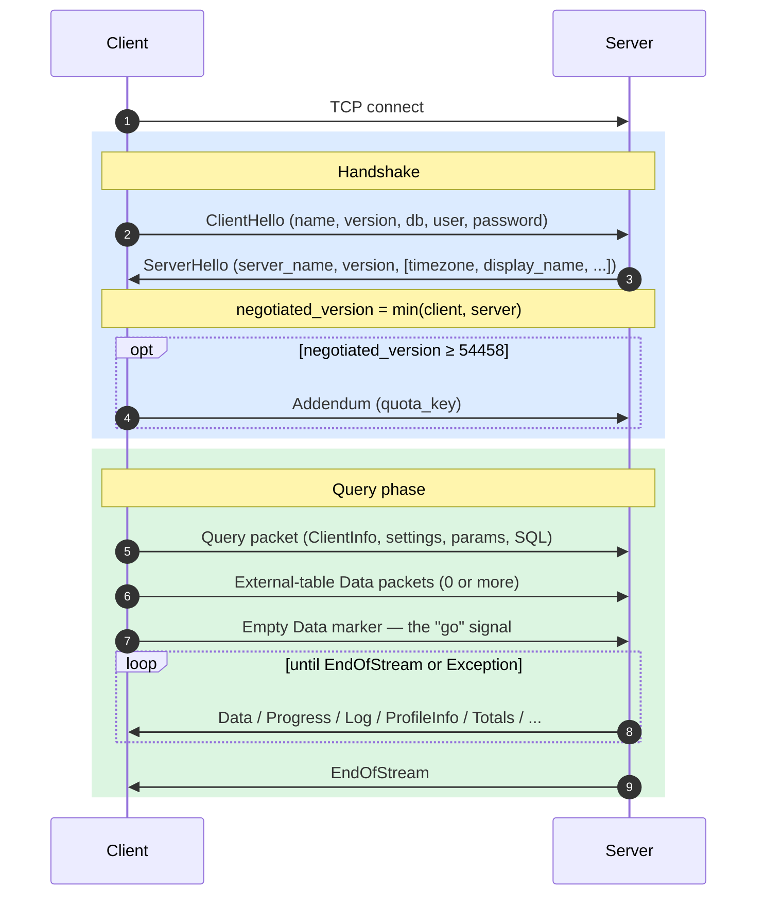
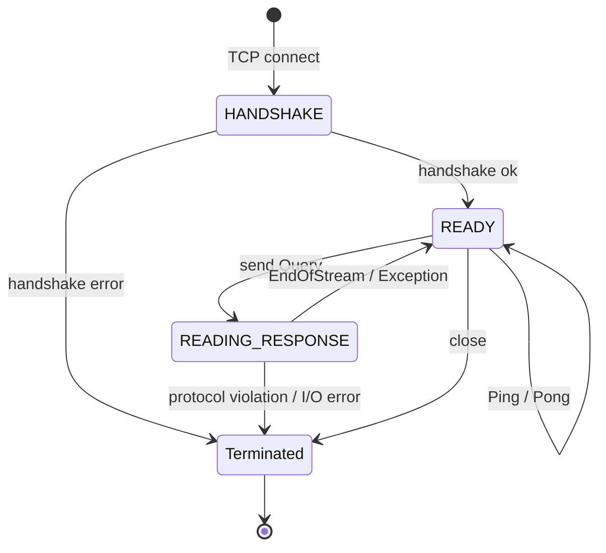
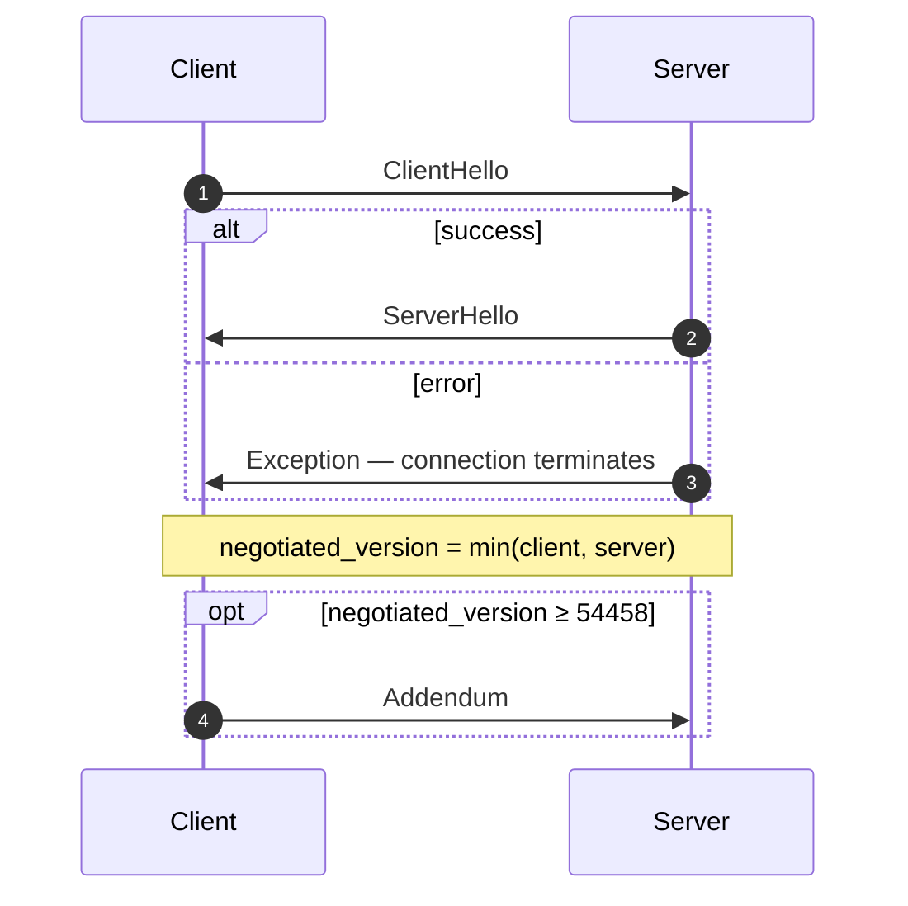
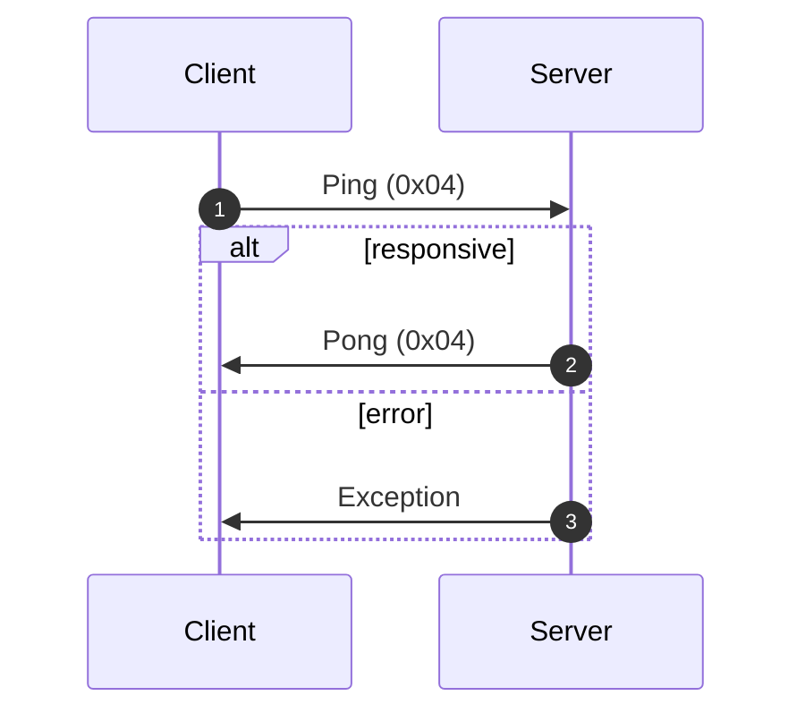
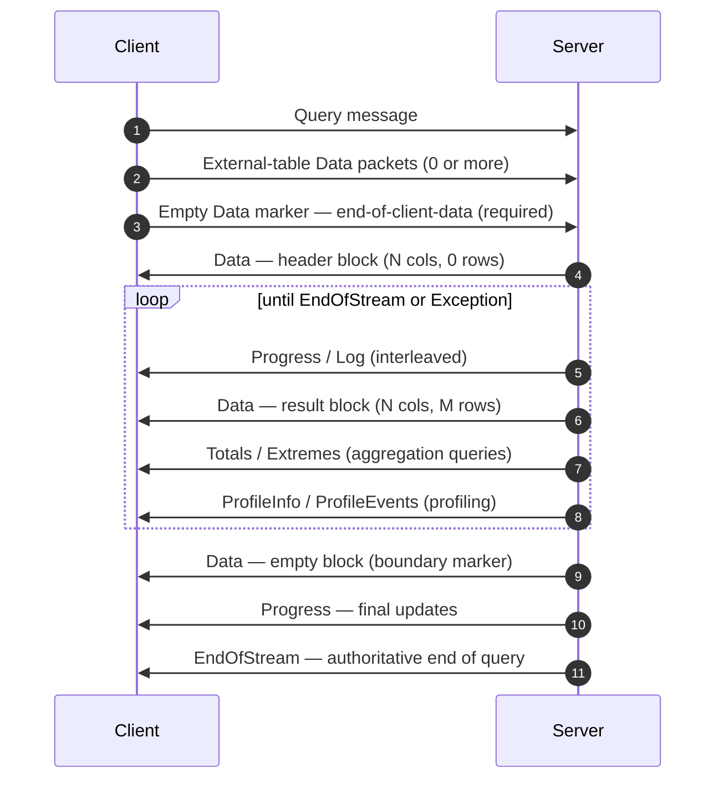
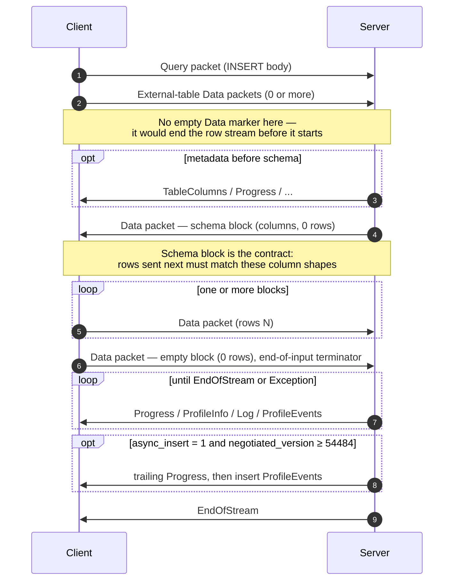
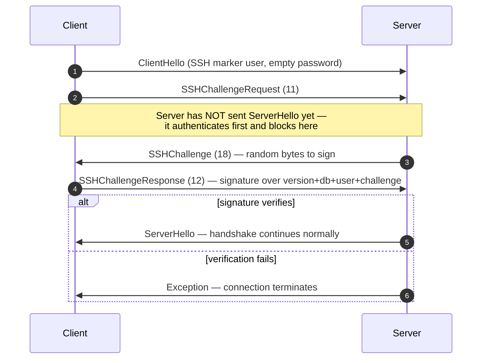

ネイティブプロトコルは、ClickHouseのクライアントとサーバーがTCP上で使用する、バイナリの接続指向プロトコルです。このプロトコルでは、SQLクエリ、結果データ、`INSERT`のペイロード、実行テレメトリー、エラー信号がやり取りされます。コマンドラインクライアントや、C++および大半のサードパーティ製ネイティブドライバーを支えるプロトコルでもあります。

このページでは、プロトコルそのもの、つまりパケットのフレーミング、接続の状態遷移、バージョンネゴシエーション、そして`Block`以外のすべてのメッセージのボディを扱います。`Data`系パケット内のバイト列 (`Block`本体、そのカラム、型ごとのエンコーディング) については別のトピックであり、[Native Format](/ja/reference/interfaces/specs/NativeFormat)仕様で説明されています。

<Info>
  **対応する仕様**

  このページは対になる仕様の一方であり、対応する[Native Format](/ja/reference/interfaces/specs/NativeFormat)仕様とあわせて公開されています。2つの仕様は役割が明確に分かれています。このページが扱うのはパケット層とトランスポート層であり、Native Format仕様が扱うのは`Data`系パケット内のバイト列です。
</Info>

いくつかの性質は全体を通して共通しています。このプロトコルはバイナリであり、位置依存です。`BlockInfo`内を除いてフィールドタグは存在しないため、1バイトでもずれると、それ以降のすべてが同期しなくなります。また、これはステートフルなプロトコルであり、各TCP接続は一度に1つのクエリだけを処理します。多重化はありません。固定幅整数はリトルエンディアンです。

<div id="overview">
  ## 概要
</div>

| プロパティ     | 値                                                                         |
| --------- | ------------------------------------------------------------------------- |
| 転送方式      | TCP (必要に応じて TLS でラップ可能)                                                   |
| バイト順      | 固定幅整数はリトルエンディアン                                                           |
| エンコーディング  | バイナリかつ位置ベース (`BlockInfo` を除きフィールドタグなし)                                    |
| 接続モデル     | Stateful、クエリは同時に 1 つのみ、マルチプレクシングなし                                        |
| バージョン管理   | ハンドシェイク時にネゴシエートされ、個々の機能はバージョンに応じて有効化される                                   |
| データフォーマット | すべての表形式データで [Native Format](/ja/reference/interfaces/specs/NativeFormat) を使用 |

wire 上のすべてのメッセージは `VarUInt` のパケットタイプコードで始まり、その後に、そのコードとネゴシエートされたプロトコルバージョンに応じて構造が決まるボディが続きます。

接続は 3 つのフェーズで進行します。最初に一回限りのハンドシェイクがあり、その後に任意回数の `Ping` または `Query` のやり取りが続き、最後に切断されます:



ネイティブTCPプロトコルでは、SQL 内の `FORMAT` 句に関係なく、表形式のデータは常に Nativeフォーマットで運ばれます。`RowBinary`、`CSV`、`JSON` などへの再フォーマットはクライアント側の役割であり、Nativeブロックをデコードした後に行われます。 (HTTPインターフェイスはこれとは別のコードパスで、`FORMAT` 句を*実際に*尊重します。HTTP はここでの対象外です。)

<div id="security">
  ## セキュリティ
</div>

<div id="transport-security">
  ### トランスポートセキュリティ (TLS)
</div>

TLS はプロトコルの下位にあるトランスポート層で動作します。有効にすると TCP ストリーム全体が暗号化され、TLS を使用するかどうかにかかわらず、プロトコルメッセージ自体はバイト単位でまったく同一です。

<div id="authentication">
  ### 認証
</div>

認証は、ハンドシェイク時の [`ClientHello`](#clienthello) メッセージで行われます。`user` フィールドと `password` フィールドは平文の文字列として送信されるため、転送中の認証情報を保護するのはトランスポート層の暗号化 (TLS) です。

SSH チャレンジレスポンス認証は、プロトコルバージョン 54466 以降で利用できます。詳しくは、[SSH チャレンジレスポンス認証](#ssh-authentication) を参照してください。

<div id="inter-server-secret">
  ### サーバー間シークレット
</div>

分散クエリ実行では、サーバー同士は共有シークレットを知っていることを証明することで相互認証を行います。この際、シークレット自体が wire 上に送られることはありません。各 Query は、salt、nonce、設定されたシークレット、およびクエリから計算される 32 バイトの SHA-256 `auth_hash` を [`Query`](#query) のフィールド 4 に含み、受信側のサーバーはこれを再計算して照合します。これは `INTERSERVER_SECRET` 機能 (v54441) によって有効化されます。外部クライアントは、ここには常に空文字列を送信します。[サーバー間認証](#inter-server-authentication)を参照してください。

<div id="versioning-and-feature-gates">
  ## バージョン管理とフィーチャーゲート
</div>

<div id="version-negotiation">
  ### バージョン交渉
</div>

client と server はどちらも、ハンドシェイク時に対応する最大の プロトコルバージョン を通知します。**交渉後のバージョン** は、その 2 つのうち小さい方です。

```text
negotiated_version = min(client_version, server_version)
```

その後の各メッセージでは、ネゴシエートされたバージョンに基づいて、wire 上にどのフィールドが含まれるかが決まります。

<div id="feature-gates">
  ### 機能ゲート
</div>

機能は、それが導入されたプロトコルバージョンによって識別され、ネゴシエートされたバージョンがその番号以上の場合に**有効**になります。

<Warning>
  機能が有効な場合、そのフィールドは wire 上に**必ず**存在していなければなりません。プロトコルは位置に厳密に依存するため、機能ゲートされたフィールドを省略すると、それ以降のすべてのフィールドのバイトストリームが破損します。
</Warning>

<div id="feature-table">
  ### 機能一覧
</div>

| 機能                                                      | バージョン | 影響範囲                             | ワイヤ形式への影響                                                                                                                                                                                                                                                                                                                                                                                                        |
| ------------------------------------------------------- | ----- | -------------------------------- | ---------------------------------------------------------------------------------------------------------------------------------------------------------------------------------------------------------------------------------------------------------------------------------------------------------------------------------------------------------------------------------------------------------------- |
| BLOCK&#95;INFO                                          | all   | Block                            | すべての Block に BlockInfo プレフィックス (`is_overflows`, `bucket_number`) を追加します。                                                                                                                                                                                                                                                                                                                                         |
| CLIENT&#95;INFO                                         | 54032 | Query                            | Query のボディに ClientInfo ブロックを追加します。                                                                                                                                                                                                                                                                                                                                                                               |
| TIMEZONE                                                | 54058 | ServerHello                      | ServerHello に `timezone` フィールドを追加します。                                                                                                                                                                                                                                                                                                                                                                            |
| QUOTA&#95;KEY&#95;IN&#95;CLIENT&#95;INFO                | 54060 | ClientInfo                       | ClientInfo に `quota_key` フィールドを追加します。                                                                                                                                                                                                                                                                                                                                                                            |
| DISPLAY&#95;NAME                                        | 54372 | ServerHello                      | ServerHello に `display_name` フィールドを追加します。                                                                                                                                                                                                                                                                                                                                                                        |
| VERSION&#95;PATCH                                       | 54401 | ServerHello, ClientInfo          | 両方に `version_patch` フィールドを追加します。                                                                                                                                                                                                                                                                                                                                                                                 |
| SERVER&#95;LOGS                                         | 54406 | Log                              | `send_logs_level` が設定されている場合、サーバーは Log パケットを送信します。                                                                                                                                                                                                                                                                                                                                                               |
| COLUMN&#95;DEFAULTS&#95;METADATA                        | 54410 | TableColumns                     | サーバーは、INSERT/入力スキーマ Block の前に、カラムのデフォルト値メタデータを含む [`TableColumns`](#tablecolumns) パケット (type 11) を送信することがあります。送信されるのは、ネゴシエートされたバージョンが 54410 以上 **かつ** `input_format_defaults_for_omitted_fields` が有効な場合のみです。このバージョン未満ではこのパケットは決して送信されないため、クライアントはこれを待機してはなりません。                                                                                                                                                   |
| WRITE&#95;CLIENT&#95;INFO                               | 54420 | Progress                         | Progress に `wrote_rows` と `wrote_bytes` を追加します。 (名前に反して、これは ClientInfo ブロックの有無を制御するもの **ではありません** — それは `CLIENT_INFO` (v54032) です。)                                                                                                                                                                                                                                                                              |
| SETTINGS&#95;SERIALIZED&#95;AS&#95;STRINGS              | 54429 | Query (settings encoding)        | 常に存在する settings リストのエンコード**方法**を変更します。settings が送信されるかどうかを制御するもの**ではありません**。v54429+ では各 setting を `(name, flags, value-as-string)` として書き込みます。古い peer は flags なしで `(name, type-specific-binary-value)` を書き込みます。[Setting](#setting) を参照してください。                                                                                                                                                                     |
| INTERSERVER&#95;SECRET                                  | 54441 | Query                            | Query にサーバー間 `auth_hash` フィールドを追加します。これは生の secret ではなく、cluster secret に対する salt 付き SHA-256 です。外部クライアントは空文字列を送信します。[Inter-server authentication](#inter-server-authentication) を参照してください。                                                                                                                                                                                                                         |
| OPEN&#95;TELEMETRY                                      | 54442 | ClientInfo                       | ClientInfo に OpenTelemetry の trace context を追加します。                                                                                                                                                                                                                                                                                                                                                               |
| DISTRIBUTED&#95;DEPTH                                   | 54448 | ClientInfo                       | ClientInfo に `distributed_depth` フィールドを追加します。                                                                                                                                                                                                                                                                                                                                                                    |
| INITIAL&#95;QUERY&#95;START&#95;TIME                    | 54449 | ClientInfo                       | `initial_time` フィールド (Int64、固定幅) を追加します。                                                                                                                                                                                                                                                                                                                                                                         |
| PROFILE&#95;EVENTS                                      | 54451 | ProfileEvents                    | サーバーはクエリ実行中に ProfileEvents パケットを送信します。                                                                                                                                                                                                                                                                                                                                                                           |
| PARALLEL&#95;REPLICAS                                   | 54453 | ClientInfo                       | ClientInfo に並列レプリカの協調フィールドを追加します。                                                                                                                                                                                                                                                                                                                                                                                |
| CUSTOM&#95;SERIALIZATION                                | 54454 | Block (Column)                   | 各カラムの型文字列の後に `has_custom_serialization` バイトを追加します。                                                                                                                                                                                                                                                                                                                                                               |
| ADDENDUM                                                | 54458 | Handshake                        | クライアントは handshake 交換の後に addendum (`quota_key`) を送信します。                                                                                                                                                                                                                                                                                                                                                           |
| PARAMETERS                                              | 54459 | Query                            | Query のボディに parameters リストを追加します。                                                                                                                                                                                                                                                                                                                                                                                |
| SERVER&#95;QUERY&#95;TIME&#95;IN&#95;PROGRESS           | 54460 | Progress                         | Progress に `elapsed_ns` フィールドを追加します。                                                                                                                                                                                                                                                                                                                                                                             |
| PASSWORD&#95;COMPLEXITY&#95;RULES                       | 54461 | ServerHello                      | ServerHello に、パスワードポリシーの regex pattern のリストと、人間が読めるメッセージを追加します。                                                                                                                                                                                                                                                                                                                                                  |
| INTERSERVER&#95;SECRET&#95;V2                           | 54462 | ServerHello                      | ServerHello に 8 バイトの `UInt64` nonce を追加します。これはサーバー間クエリ署名に使用され、外部クライアントはデコードして無視します。                                                                                                                                                                                                                                                                                                                              |
| TOTAL&#95;BYTES&#95;IN&#95;PROGRESS                     | 54463 | Progress                         | Progress に `total_bytes_to_read` (VarUInt) フィールドを `total_rows` と `wrote_rows` の間に追加します。                                                                                                                                                                                                                                                                                                                          |
| TIMEZONE&#95;UPDATES                                    | 54464 | TimezoneUpdate                   | `TimezoneUpdate` サーバーパケット (type 17) を追加します。ボディ: session timezone を保持する単一の `String`。これは `input` table function の initializer のみが、入力スキーマ Block の直後に送信するため、クライアントは送信する行をサーバーの `session_timezone` で解析します。[TimezoneUpdate](#timezoneupdate) を参照してください。                                                                                                                                                                |
| SPARSE&#95;SERIALIZATION                                | 54465 | Block (Column)                   | サーバーは `has_custom_serialization = 1` を設定し、スパースエンコードされたカラムを送信することがあります。ワイヤ形式: 1 バイトの kind (0x01 = SPARSE) 、続いて EOG で終端される VarUInt offset stream、その後に inner type で高密度にエンコードされた非デフォルト値です。[kind&#95;stack and sparse encoding](/ja/reference/interfaces/specs/NativeFormat#kind-stack-and-sparse-encoding) を参照してください。                                                                                                   |
| SSH&#95;AUTHENTICATION                                  | 54466 | Auth flow                        | SSH challenge-response authentication を追加します。オプトイン方式: クライアントはこれをトリガーするために、空の password とともに `" SSH KEY AUTHENTICATION " + <real_user>` 形式の `user` を送信します。[SSH challenge-response authentication](#ssh-authentication) を参照してください。                                                                                                                                                                                  |
| TABLE&#95;READ&#95;ONLY&#95;CHECK                       | 54467 | TablesStatusResponse             | TablesStatusResponse 内の各 table の行に `is_readonly` フラグを追加します。`TablesStatusRequest` を発行しない外部クライアントではワイヤ形式の変更はありません。                                                                                                                                                                                                                                                                                                 |
| SYSTEM&#95;KEYWORDS&#95;TABLE                           | 54468 | system tables                    | サーバーは `system.keywords` を追加し、正規の `clickhouse-client` が keyword を自動補完できるようにします。native-protocol のワイヤ形式に変更はありません。                                                                                                                                                                                                                                                                                                   |
| ROWS&#95;BEFORE&#95;AGGREGATION                         | 54469 | ProfileInfo                      | ProfileInfo の末尾に、この順序で `applied_aggregation` (Bool) と `rows_before_aggregation` (VarUInt) を追加します。                                                                                                                                                                                                                                                                                                                |
| CHUNKED&#95;PROTOCOL                                    | 54470 | Connection framing               | パケットごとの chunk フレーミングで、すべての packet body をラップします。Addendum でネゴシエートされます。ServerHello には各方向に対するサーバーの希望が含まれ、Addendum にはクライアントの最終選択が含まれます。[chunked framing](#chunked-framing) を参照してください。                                                                                                                                                                                                                                 |
| VERSIONED&#95;PARALLEL&#95;REPLICAS&#95;PROTOCOL        | 54471 | ServerHello, Addendum            | 両側で、parallel-replicas 協調プロトコルのバージョンを表す `VarUInt` を交換します。ServerHello のフィールドは **`protocol_version` の直後** (`timezone` の前) に配置されます。Addendum のフィールドは、chunked-protocol 文字列群の後ろに追加されます。現在の値: `7` (`DBMS_PARALLEL_REPLICAS_PROTOCOL_VERSION`)。                                                                                                                                                                           |
| INTERSERVER&#95;EXTERNALLY&#95;GRANTED&#95;ROLES        | 54472 | Query                            | Query ボディに `String external_roles` フィールドが追加されます。位置は settings terminator と interserver-secret hash の間です。外部クライアントは空のロール一覧を送信します (1 バイトの `0x00`、つまり String エンベロープ内の VarUInt 0) 。                                                                                                                                                                                                                                    |
| V2&#95;DYNAMIC&#95;AND&#95;JSON&#95;SERIALIZATION       | 54473 | Column body                      | サーバーは `Dynamic` および `JSON` のカラム型に対して V2 シリアライゼーションを出力する場合があります。これにより、どの `state_prefix` バージョンを使用するかが制御されます。[versioned types](/ja/reference/interfaces/specs/NativeFormat#versioned-types) を参照してください。                                                                                                                                                                                                                 |
| SERVER&#95;SETTINGS                                     | 54474 | ServerHello                      | サーバーは、デフォルト以外の settings を ServerHello の末尾、`nonce` の後ろに一覧として通知します。形式は、空の key で終端される `(key, flags, value)` の組です。Query パケットの settings 一覧と同じです。                                                                                                                                                                                                                                                                      |
| QUERY&#95;AND&#95;LINE&#95;NUMBERS                      | 54475 | ClientInfo                       | ClientInfo の末尾に `script_query_number` (VarUInt) と `script_line_number` (VarUInt) を追加します。clickhouse-client が複数ステートメントのスクリプトでエラー箇所を特定するために使用します。外部クライアントは `0, 0` を送信します。                                                                                                                                                                                                                                           |
| JWT&#95;IN&#95;INTERSERVER                              | 54476 | ClientInfo                       | ClientInfo の末尾に、JWT の有無を示す UInt8 と、省略可能な `String jwt` を追加します。外部クライアント (JWT なし) はバイト `0x00` を送信します。 (C++ では `DBMS_MIN_REVISON_WITH_JWT_IN_INTERSERVER` と綴られています。定数名のスペルミスに注意してください。)                                                                                                                                                                                                                              |
| QUERY&#95;PLAN&#95;SERIALIZATION                        | 54477 | ServerHello, QueryPlan packet    | ServerHello は server settings の後ろに `VarUInt query_plan_serialization_version` を追加します。さらに、事前構築済みのクエリプランをサーバー間で配送するための `ClientPacket::QueryPlan` (コード `13`) も導入されます。外部クライアントがこれを送信することはありません。                                                                                                                                                                                                                      |
| PARALLEL&#95;BLOCK&#95;MARSHALLING                      | 54478 | Block (Column)                   | サーバーは、並列処理のためにカラムを `ColumnBLOB` (インライン圧縮) でラップする場合があります。これは、クエリで圧縮が有効かつ `rows > 1` の場合にのみ適用されます。それ以外では通常のカラムのワイヤ形式が使われます。送信する Query パケットで圧縮を有効にしないクライアントでは、ワイヤ上の変更はありません。                                                                                                                                                                                                                                        |
| VERSIONED&#95;CLUSTER&#95;FUNCTION&#95;PROTOCOL         | 54479 | ServerHello                      | ServerHello の末尾に `VarUInt cluster_function_protocol_version` を追加します。これは `*Cluster` テーブル関数 (`s3Cluster` など) で使用されます。外部クライアントはデコードして無視します。                                                                                                                                                                                                                                                                         |
| OUT&#95;OF&#95;ORDER&#95;BUCKETS&#95;IN&#95;AGGREGATION | 54480 | BlockInfo                        | BlockInfo のフィールドタグ付きストリームに field 3 (`out_of_order_buckets: Vec<Int32>`) を追加します。デコード形式は `[VarUInt count][Int32]*count` です。外部クライアントが自らこれを出力することはありません。デコーダーは、サーバーが送る空でない任意の一覧を読み取ります。                                                                                                                                                                                                                              |
| COMPRESSED&#95;LOGS&#95;PROFILE&#95;EVENTS&#95;COLUMNS  | 54481 | Log, ProfileEvents, TableColumns | サーバーは [`Log`](#log)、[`ProfileEvents`](#profileevents)、[`TableColumns`](#tablecolumns) の各パケットボディを [compression frame](/ja/reference/interfaces/specs/NativeFormat#compression-frame) でラップする場合があります。このバージョンでは、3 つすべてのボディが同じ任意圧縮の出力経路を通りますが、実際に compression frame になるのはクエリで `compression = true` の場合だけです。送信する Query パケットで圧縮を有効にしないクライアントでは、ワイヤ上の変更はありません。                                                              |
| REPLICATED&#95;SERIALIZATION                            | 54482 | Block (Column)                   | サーバーは、kind&#95;stack `0x04 = REPLICATED` を持つカラムを出力する場合があります。これは繰り返し値向けの Dictionary 風コンパクト形式です。[kind&#95;stack and sparse encoding](/ja/reference/interfaces/specs/NativeFormat#kind-stack-and-sparse-encoding) を参照してください。このバージョン未満では、writer は送信前にそのようなカラムを展開していました。デコードは索引参照 (各行について `elements[indexes[i]]`) で行われます。leaf type と、`Nullable`/`Array`/`Tuple`/`Map`/`Nested`/`LowCardinality` の inner がサポートされます。       |
| NULLABLE&#95;SPARSE&#95;SERIALIZATION                   | 54483 | Block (Column)                   | スパースシリアライゼーションと `Nullable(T)` を組み合わせます。このバージョン未満では、writer は Nullable カラム向けの sparse を送信前に展開していました。v54483+ では、ワイヤデータは sparse-over-Nullable になります。[kind&#95;stack and sparse encoding](/ja/reference/interfaces/specs/NativeFormat#kind-stack-and-sparse-encoding) を参照してください。                                                                                                                                          |
| PROGRESS&#95;IN&#95;ASYNC&#95;INSERT                    | 54484 | Progress (INSERT)                | **非同期** INSERT (`async_insert = 1`) では、insert がフラッシュされると、サーバーは `EndOfStream` の前に追加の [`Progress`](#progress) パケットを送信し、その後にその insert の `ProfileEvents` を送信します。これは、*ネゴシエートされた*バージョンが 54484 以上の場合に有効で、それ未満ではサーバーはこの末尾の Progress を省略します。Progress のワイヤ形式自体は変わらず、変わるのは送出される点だけです。実際には、この増分は経過時間を表します。書き込まれた行数カウンターは、付随する ProfileEvents を通じて報告されます。すでに Progress の割り込み受信を処理しているクライアントでは、形式の変更は不要で、追加の 1 パケットを許容するだけで済みます。 |
| CLIENT&#95;AGENT&#95;IN&#95;CLIENT&#95;INFO             | 54485 | ClientInfo                       | ClientInfo の末尾に `client_agent` `String` を追加します。canonical client は環境から agent 識別子 (たとえば `claude-code`、`cursor`、`gemini-cli`、または `AGENT` 変数の値) を自動検出します。何も検出されなかった外部クライアントは空文字列を送信します。ネゴシエートされたバージョンが 54485 以上では必須です。これを省略すると Query パケットの残り部分との同期が崩れます。                                                                                                                                                             |

<div id="packet-envelope">
  ## パケットのエンベロープ
</div>

送受信どちらの方向でも、通信上のすべてのメッセージは同じ外側の構造を持ちます：

```text
[VarUInt: packet_type_code]    always encoded as VarUInt
[message body]                 format depends on packet_type_code
```

完全なパケット型の一覧は、[packet type reference](#packet-type-reference)にあります。

パケット型は固定幅のバイトではなく、`VarUInt` です。値が128未満の場合、`VarUInt` でも同じ1バイトになりますが、将来パケット型が128以上になっても互換性を保てるよう、実装では `VarUInt` エンコーディングを使用する必要があります。

[message reference](#message-reference)では、各パケットの**ボディ**、つまりパケット型コードの後に続くバイト列のみを記載しています。フィールド番号は、最初のボディフィールドを1として始まります。

<div id="chunked-framing">
  ### チャンク化フレーミング (v54470+)
</div>

`CHUNKED_PROTOCOL` 機能の使用が**ネゴシエート**されると ([ハンドシェイク](#handshake-phase)を参照) 、wire 上のすべてのパケットはチャンク化フレーミングで包まれます。この包み方は**方向ごと**です。つまり、client→server と server→client は個別にネゴシエートされるため、異なるモード (チャンク化または非フレーム) になる場合があります。

パケットごとの wire レイアウト:

```text
<chunk>...   one or more chunks; their payloads concatenated form the whole packet
[u32 LE = 0] zero-size terminator marking end of packet
```

chunkごとのWireレイアウト:

```text
[u32 LE: chunk_size]   chunk_size in [1, UINT32_MAX]
[chunk_size bytes]     packet bytes (see note below)
```

パケット型 `VarUInt` は chunk 化されたストリームの**内側**にあります。つまり、フレーミングの前に別個のバイトとして送られるのではなく、パケットペイロードの先頭バイト (最初の chunk の先頭バイト) です。各パケットの chunk ペイロードは、[packet envelope](#packet-envelope) の完全な `[VarUInt packet_type_code][message body]` 全体です。パケット型を chunk 化されたストリームの外側に置くクライアントは、その型バイトを `u32` の chunk サイズの先頭バイトとして相手に読ませてしまい、接続の同期が崩れます。

書き込み側のバッファがパケット途中でいっぱいになると、1 つのパケットが複数の chunk に分割されることがあります。分割位置はどこでもあり得るため、パケット型の `VarUInt` の途中で分割されることもあります。読み取り側は chunk ペイロードを連結し、末尾の 4 バイトのゼロを透過的なパケット境界として扱います。つまり、それ自体は消費しますが、パケットボディを読む側には見せません。

ボディを持たないパケットも引き続きラップされます。`Ping` や `Pong` のような 1 バイトのパケットは、chunk 化がネゴシエートされると `[u32 size = 1][0x04][u32 0]` になります。このページの他の箇所で「wire 上では単一バイト」と説明しているものは、いずれも chunk 化前の形式を指します。

**ネゴシエーション。** ServerHello と Addendum はそれぞれ、方向ごとに 1 つずつ、合計 2 つの `String` フィールドを持ち、その値は `{"chunked", "notchunked", "chunked_optional", "notchunked_optional"}` から取られます。

* `chunked` / `notchunked` は厳格です。その側はそのモードを厳密に要求します。
* `_optional` バリアントは柔軟で、相手側が選んだどちらのモードも受け入れます。

各方向で合意される値は、ペアごとに次のように計算されます。

| Server pref         | Client pref         | Agreed                                    |
| ------------------- | ------------------- | ----------------------------------------- |
| `*_optional`        | anything            | CLIENT に従う (その `starts_with("chunked")`)  |
| anything            | `*_optional`        | SERVER に従う                                |
| `chunked` strict    | `chunked` strict    | `chunked`                                 |
| `notchunked` strict | `notchunked` strict | `notchunked`                              |
| strict mismatch     | strict mismatch     | **プロトコルエラー** — 接続は MUST 切断される必要があります      |

クライアント側では、クライアントの SEND 設定がサーバーの RECV 設定とネゴシエートされ、逆方向も同様です。

**タイミング。** ネゴシエーション文字列はフレーム化されていない wire 上を流れます: ClientHello → ServerHello (server prefs) → Addendum (client のネゴシエート済みの値) 。フレーミングへの切り替えは、Addendum が flush された*後*に送信されるすべてのバイトに適用されます。Addendum 自体、ClientHello、ServerHello は常にフレーム化されません。

<div id="connection-lifecycle">
  ## 接続ライフサイクル
</div>

接続は常に、`HANDSHAKE`、`READY`、`READING_RESPONSE`、または終了済みの4つの状態のいずれか1つにあります。プロトコルは多重化を行わないため、前のレスポンスを読み切る前にクライアントが新しいリクエストを送信すると、転送中のバイト列が交錯してストリームが破損します。

<div id="states">
  ### 状態
</div>



正常系の流れはそのまま下に進みます — `HANDSHAKE → READY → READING_RESPONSE → READY` — `Ping`/`Pong` の自己ループがあり、すべての失敗エッジは単一の `Terminated` シンクに集約されます。

| State              | Description                                                                                                                                                                                                         |
| ------------------ | ------------------------------------------------------------------------------------------------------------------------------------------------------------------------------------------------------------------- |
| `HANDSHAKE`        | TCP connection が開いた直後の初期状態です。[ハンドシェイク](#handshake-phase) メッセージのみ有効です。成功すると `READY` に遷移し、失敗すると終了します。                                                                                                               |
| `READY`            | アイドル状態です。クライアントは [Ping](#ping-phase)、[クエリ](#query-phase) を送信するか、接続を閉じることができます。connection は `READY` のまま無期限に維持される場合があります (`idle_connection_timeout` の制約を受けます。詳細は [connection limits](#connection-limits) を参照してください) 。 |
| `READING_RESPONSE` | クライアントがクエリを送信したときに入る状態です。クライアントは `READY` に戻る前に、サーバーのレスポンスストリームを最後まで完全に読み切る必要があります。ここでクライアント→サーバー間で許可されるパケットは Cancel のみです (このページでは説明していません) 。                                                                        |
| Terminated         | 以後は使用できません。クライアントは新しい TCP connection を開き、ハンドシェイク をやり直す必要があります。                                                                                                                                                    |

<div id="handshake-phase">
  ### ハンドシェイクフェーズ
</div>

認証を行い、プロトコルバージョンをネゴシエートします。これは各接続で、他のどの処理よりも前に、必ず一度だけ発生します。

TCP接続は確立された直後で、まだメッセージは一切やり取りされていません。流れは次のとおりです。



1. クライアントは、サポートする最大のプロトコルバージョンを指定して [`ClientHello`](#clienthello) を送信します。

2. クライアントは応答を読み取り、パケットタイプに応じて次のように処理を振り分けます。

   | Packet type     | Action                                                                                                         |
   | --------------- | -------------------------------------------------------------------------------------------------------------- |
   | `Hello` (0)     | [`ServerHello`](#serverhello) をデコードします。`negotiated_version = min(client_ver, server_ver)` を計算します。ステップ 3 に進みます。 |
   | `Exception` (2) | [`Exception`](#exception) をデコードします。エラーとして返し、接続を終了します。                                                          |
   | anything else   | プロトコル違反です。接続を終了します。                                                                                            |

3. `negotiated_version ≥ 54458` (`ADDENDUM` 機能) の場合、クライアントは [`Addendum`](#addendum) を送信します。この判断は、クライアントが宣言したバージョンではなく、**ネゴシエートされた**バージョンに基づきます。

成功すると接続は `READY` に移行し、何らかのエラーが発生した場合は終了します。

<div id="ping-phase">
  ### Ping フェーズ
</div>

TCP keepalive とは独立した、アプリケーションレベルの生存確認です。Ping/Pong の往復が成功すれば、TCP接続が双方向で生きており、サーバーが応答可能であることを確認できます。Ping はステートレスで、どのクエリとも相関付けられていないため、連続する複数の Ping は互いに独立しています。

`READY` からのフローは次のとおりです。



1. クライアントは [`Ping`](#ping) を送信します。
2. クライアントはレスポンスを読み取ります。

   | Packet type     | Action                                       |
   | --------------- | -------------------------------------------- |
   | `Pong` (4)      | 応答可能であることを確認し、`READY` に戻ります。                 |
   | `Exception` (2) | [`Exception`](#exception) をデコードし、エラーとして返します。 |
   | anything else   | プロトコル違反。                                     |

<div id="query-phase">
  ### クエリフェーズ
</div>

クライアントは SQL ステートメントを送信し、サーバーは結果ブロックと実行テレメトリーをストリームで返します。レスポンスは一連のパケットで構成され、最後は必ず 1 つの `EndOfStream` または `Exception` で終わります。

`READY` から始まるフローは次のとおりです。



いずれかの時点でエラーが発生した場合、サーバーは `EndOfStream` の代わりに `Exception` を送信し、それによってクエリは終了します。

1. クライアントは一意の `query_id` (通常は UUID) を付けて [`Query`](#query) を送信します。
2. クライアントは任意の 外部テーブル を送信し、その後に空の Data マーカーを送信します。空の Data パケットは `table_name = ""`, `num_columns = 0`, `num_rows = 0` です。サーバーは、このマーカーを受信するまでクエリの実行を開始しません。
3. クライアントは `READING_RESPONSE` に移行し、書き込みバッファを flush します。
4. クライアントは応答パケットをループで読み取り、type ごとに処理を振り分けます。

   | Packet type          | Action                                                                                                           |
   | -------------------- | ---------------------------------------------------------------------------------------------------------------- |
   | `Data` (1)           | block をデコードします。最初の Data はスキーマヘッダーで、それ以降は結果 block (蓄積対象) です。空の block は境界マーカーです。`num_rows == 0` はクエリ終了では**ありません**。 |
   | `Progress` (3)       | 実行メトリクス。各パケットは前回からの**増分**なので、ローカルで累積します。                                                                         |
   | `EndOfStream` (5)    | クエリ完了。ループを抜けて `READY` に戻ります。                                                                                     |
   | `ProfileInfo` (6)    | 実行後の profiling データ。                                                                                              |
   | `Totals` (7)         | aggregation の totals block (Data と同じワイヤ形式) 。                                                                     |
   | `Extremes` (8)       | 最小値/最大値の block (Data と同じワイヤ形式) 。                                                                                 |
   | `Log` (10)           | server log の 1 行。                                                                                                |
   | `TableColumns` (11)  | カラムのデフォルト値に関するメタデータ。                                                                                             |
   | `ProfileEvents` (14) | パフォーマンス counters。                                                                                                |
   | `Exception` (2)      | デコードして error として返します。ループを抜けて `READY` に戻ります。                                                                      |
   | anything else        | クエリ phase 中に現れるのは想定外です。connection を終了します。                                                                        |

`EndOfStream` または処理済みの `Exception` を受け取ると、connection は `READY` に戻ります。プロトコル違反または I/O error が発生した場合は終了します。

<Note>
  `num_rows == 0` のケースは、新しい実装でよくつまずくポイントです。行数 0 の block は境界マーカーまたはスキーマヘッダーであり、ストリーム終端を示すシグナルではありません。応答を終了させるのは `EndOfStream` または `Exception` だけです。
</Note>

<div id="insert-phase">
  ### INSERT フェーズ
</div>

INSERT フェーズは、[クエリフェーズ](#query-phase)に 2 回の追加のやり取りを加えたものです。クライアントが `INSERT` ステートメントを送信すると、サーバーはターゲットテーブルを示す **スキーマブロック** を返します。続いてクライアントは行を含む Data packets をストリーミングし、その後に空の Data マーカーを送信します。最後に、サーバーは `EndOfStream` または `Exception` を返して終了します。

`READY` から開始する場合、SQL は `INSERT INTO <table> [(<cols>)] VALUES` 形式の `INSERT` です。行データは Data packets を通じて送られるため、インラインの `VALUES (...)` リテラルは含みません。フローは次のとおりです。



1. クライアントは、`body` を INSERT SQL に設定した [`Query`](#query) を送信します。
2. クライアントは、外部テーブル (INSERT ではまれ) もあれば送信します。[クエリフェーズ](#query-phase) とは異なり、ここでは空の Data マーカーは**送信しません**。`INSERT` の `Query` パケットは後続のデータを伴って送信されるため、データ終端を示す空の block は手順 5 まで送られません。これをスキーマ block より前に送ると、server はそれを行ストリームの終端として読み取り、行が 1 つもないまま INSERT を完了し、その後に到着する最初の実データの行パケットを、場違いなトップレベルパケットとして parse してしまいます。
3. クライアントは、スキーマ Data パケットを読み取るまで、メタデータ パケット (TableColumns、Progress、ProfileInfo、Log、ProfileEvents) を順に受信します。これは 0 行ですが、完全なカラム構造 (名前と型) を持つ Block です。スキーマ block は契約です。次にクライアントが送信する行は、これらのカラムの shape に一致している必要があります。
4. クライアントは data block を送信します。各 block について、`VarUInt(ClientPacket::Data = 2)`、次に空の external-table 名として `String("")`、その後に Block を書き込みます。カラム型は、スキーマ block のカラムと位置で一致している必要があります。
5. クライアントは入力終端を送信します。これは空の Block (0 カラム、0 行) を持つ Data パケットです。
6. クライアントは、`EndOfStream` (成功) または `Exception` (失敗) に達するまでレスポンスストリームを順に受信します。

**非同期 INSERT (v54484+).** クエリに `async_insert = 1` が含まれている場合、server は行をキューに入れ、バッチの一部として flush します。ネゴシエートされた バージョン が 54484 以上 (`PROGRESS_IN_ASYNC_INSERT`) では、flush が完了すると server は追加の [`Progress`](#progress) パケットを送信し、その直後にその insert の `ProfileEvents`、続いて `EndOfStream` を送信します。54484 未満では、server はこの末尾の Progress を送信しません。このパケットは通常の `Progress` です。server は書き込み件数を反映する前にクエリ パイプラインをリセットするため、実際にはこの増分には経過時間しか含まれず、書き込まれた行数とバイト数の統計は付随する `ProfileEvents` を通じてクライアントに渡されます。手順 6 ですでに Progress の割り込み受信に対応しているクライアントであれば、追加の 1 パケットを受け取れるようにするだけで十分です。

接続は、`EndOfStream` または処理済みの `Exception` を受け取ると `READY` に戻ります。プロトコル違反や I/O エラーが発生した場合、接続は終了します。

<div id="message-reference">
  ## メッセージリファレンス
</div>

フィールドは wire 順で記載しています。`Type` カラムでは次を使用します。

* `VarUInt` — 可変長の符号なし整数 ([VarUInt](/ja/reference/interfaces/specs/NativeFormat#varuint)を参照) 。
* `String` — VarUInt プレフィックス付きのバイト列 ([String](/ja/reference/interfaces/specs/NativeFormat#string)を参照) 。
* `UInt8`、`Int32` など — 固定幅の little-endian 整数。
* `Bool` — 1 バイトで、`0x00` または `0x01` です。

`Role` カラムは、各フィールドを誰が使用するかを示します。

* **client** — 外部クライアントが設定します。
* **inter-server** — サーバー間通信でのみ意味があります。外部クライアントはデフォルト値を書き込みます。
* **universal** — 両方で使用されます。

これらの表で記載しているのは、各パケットのパケット種別コードに続くボディのみです。

<div id="clienthello">
  ### ClientHello (パケットタイプ 0)
</div>

クライアント → サーバー。TCP接続の確立後に送信される最初のメッセージです。

| # | フィールド                | Type    | ロール       | 説明                                    |
| - | -------------------- | ------- | --------- | ------------------------------------- |
| 1 | client&#95;name      | String  | universal | クライアント識別子 (例: `"clickhouse-client"`)  |
| 2 | version&#95;major    | VarUInt | universal | クライアントのメジャーバージョン                      |
| 3 | version&#95;minor    | VarUInt | universal | クライアントのマイナーバージョン                      |
| 4 | protocol&#95;version | VarUInt | universal | クライアントがサポートする最大のプロトコルバージョン            |
| 5 | database             | String  | universal | デフォルトのデータベース名                         |
| 6 | user                 | String  | universal | 認証用のユーザー名                             |
| 7 | password             | String  | universal | パスワード (平文)                            |

<div id="serverhello">
  ### ServerHello (パケットタイプ 0)
</div>

Server → Client。認証に成功した場合の ClientHello への応答です。

| #  | Field                                          | Type      | Role         | Condition                                                 | Description                                                                                                                                                                                                                  |
| -- | ---------------------------------------------- | --------- | ------------ | --------------------------------------------------------- | ---------------------------------------------------------------------------------------------------------------------------------------------------------------------------------------------------------------------------- |
| 1  | server&#95;name                                | String    | universal    | always                                                    | サーバー識別子                                                                                                                                                                                                                      |
| 2  | version&#95;major                              | VarUInt   | universal    | always                                                    | サーバーのメジャーバージョン                                                                                                                                                                                                               |
| 3  | version&#95;minor                              | VarUInt   | universal    | always                                                    | サーバーのマイナーバージョン                                                                                                                                                                                                               |
| 4  | protocol&#95;version                           | VarUInt   | universal    | always                                                    | サーバーのプロトコルバージョン                                                                                                                                                                                                              |
| 4a | parallel&#95;replicas&#95;protocol&#95;version | VarUInt   | universal    | VERSIONED&#95;PARALLEL&#95;REPLICAS&#95;PROTOCOL (v54471) | サーバーの parallel-replicas 協調プロトコルバージョン。**Wire 上の位置: `protocol_version` の直後**、`timezone` の前。現在値: `7`。                                                                                                                           |
| 5  | timezone                                       | String    | universal    | TIMEZONE (v54058)                                         | サーバータイムゾーン (例: `"UTC"`)                                                                                                                                                                                                      |
| 6  | display&#95;name                               | String    | universal    | DISPLAY&#95;NAME (v54372)                                 | 人間が読めるサーバー名                                                                                                                                                                                                                  |
| 7  | version&#95;patch                              | VarUInt   | universal    | VERSION&#95;PATCH (v54401)                                | サーバーのパッチバージョン                                                                                                                                                                                                                |
| 8  | proto&#95;send&#95;chunked&#95;srv             | String    | universal    | CHUNKED&#95;PROTOCOL (v54470)                             | サーバーが優先する送信方向のチャンク化。`"chunked"`、`"notchunked"`、`"chunked_optional"`、`"notchunked_optional"` のいずれかです。[チャンク化フレーミング](#chunked-framing) を参照してください。**バージョンゲートの値はより高いにもかかわらず、wire 上では `password_complexity_rules` より前に置かれます。** |
| 9  | proto&#95;recv&#95;chunked&#95;srv             | String    | universal    | CHUNKED&#95;PROTOCOL (v54470)                             | サーバーが優先する受信方向のチャンク化。値のセットはフィールド 8 と同じです。                                                                                                                                                                                     |
| 10 | password&#95;complexity&#95;rules              | Rule[]    | universal    | PASSWORD&#95;COMPLEXITY&#95;RULES (v54461)                | サーバーのパスワードポリシーです。`VarUInt count` の後に `count × Rule` が続きます。以下を参照してください。                                                                                                                                                       |
| 11 | nonce                                          | UInt64    | inter-server | INTERSERVER&#95;SECRET&#95;V2 (v54462)                    | 8 バイト LE のランダム nonce。サーバーの inter-server クエリ署名スキームで使用されます。外部クライアントはこれをデコードし (ストリームの整合を保つため) 、値自体は無視することが推奨されます。                                                                                                               |
| 12 | server&#95;settings                            | Setting[] | universal    | SERVER&#95;SETTINGS (v54474)                              | サーバーの非デフォルト設定の通知です。フォーマットは、0 個以上の `(String key, VarUInt flags, String value)` の組で、空の key で終端します。[Query packet の settings list](#setting) と同じです。                                                                              |
| 13 | query&#95;plan&#95;serialization&#95;version   | VarUInt   | universal    | QUERY&#95;PLAN&#95;SERIALIZATION (v54477)                 | サーバーがサポートする query-plan シリアル化バージョン。外部クライアントはデコードして無視します。                                                                                                                                                                      |
| 14 | cluster&#95;function&#95;protocol&#95;version  | VarUInt   | universal    | VERSIONED&#95;CLUSTER&#95;FUNCTION&#95;PROTOCOL (v54479)  | サーバーの `*Cluster` テーブル関数プロトコルバージョン。外部クライアントはデコードして無視します。                                                                                                                                                                      |

**Rule** — `password_complexity_rules` の要素:

| # | Field   | Type   | Description                        |
| - | ------- | ------ | ---------------------------------- |
| 1 | pattern | String | 適合するパスワードが一致しなければならない正規表現パターン。     |
| 2 | message | String | パスワードがこのルールに違反したときに表示される、人間が読める説明。 |

このリストはサーバー運用者のパスワードポリシー設定を反映したもので、あくまで参考情報です。サーバーはハンドシェイク中にこれらのルールを強制しません。パスワードの変更または設定機能を提供するクライアントは、準拠していないパスワードをサーバーに送信する前に、これらのルールを使ってエラーを示すことができます。

<Note>
  悪意のある、または誤設定されたサーバーに対する resource 使用量を抑えるため、デコードする `count` は 256 エントリ、各 `pattern` と `message` の String は 4096 バイトを上限にしてください。パスワードポリシーが設定されていないサーバーでは、`count` が `0` (後続の組なし) であるのが一般的です。
</Note>

<div id="addendum">
  ### 追補 (パケットタイプなし)
</div>

クライアント → サーバー。`ADDENDUM` (v54458) によって有効化され、ハンドシェイクのやり取りが完了した直後に送信されます。これは独立したパケットタイプではなく、各フィールドはパケットタイプを示すバイト接頭辞なしで、生のまま wire に載せられます。

| # | Field                                          | Type    | Role      | Condition                                                 | Description                                                                                                                      |
| - | ---------------------------------------------- | ------- | --------- | --------------------------------------------------------- | -------------------------------------------------------------------------------------------------------------------------------- |
| 1 | quota&#95;key                                  | String  | universal | always                                                    | サーバー側のキー付きクォータに使用するリソースクォータキー。キー付きクォータを使用しないクライアントは空文字列を送信します。                                                                   |
| 2 | proto&#95;send&#95;chunked                     | String  | universal | CHUNKED&#95;PROTOCOL (v54470)                             | クライアントがネゴシエートした Outbound chunking: `"chunked"` または `"notchunked"`。ServerHello の `proto_recv_chunked_srv` を基に算出されます。              |
| 3 | proto&#95;recv&#95;chunked                     | String  | universal | CHUNKED&#95;PROTOCOL (v54470)                             | クライアントがネゴシエートした Inbound chunking。`proto_send_chunked_srv` を基に算出されます。                                                             |
| 4 | parallel&#95;replicas&#95;protocol&#95;version | VarUInt | universal | VERSIONED&#95;PARALLEL&#95;REPLICAS&#95;PROTOCOL (v54471) | クライアントがサポートする parallel-replicas 協調プロトコルのバージョン。分散クエリに参加しない外部クライアントであっても、サーバーの互換性チェックを通すために、有効なバージョン (現在は `7`) を送信することが SHOULD です。 |

chunked-framing への切り替えは、この Addendum が *flush された後* に適用されます。つまり、Addendum 自体はフレーム化されません。

<div id="ping">
  ### Ping (パケットタイプ 4)
</div>

クライアント → サーバー。ボディはありません。パケットは、チャンク化フレーミング の前では 1 バイトの `0x04` のみです。chunking がネゴシエートされると、このバイトは chunk の 1 バイトのペイロードになります ([チャンク化フレーミング](#chunked-framing) を参照) 。

<div id="pong">
  ### Pong (packet type 4)
</div>

サーバー → クライアント。ボディはありません。パケットは、チャンク化フレーミングの前は 1 バイトの `0x04` のみです。チャンク化がネゴシエートされると、このバイトは chunk の 1 バイトのペイロードになります ([chunked framing](#chunked-framing)を参照) 。

<div id="exception">
  ### Exception (packet type 2)
</div>

サーバー → クライアント。いずれかのフェーズでサーバーがエラーに遭遇した場合に送信されます。

| # | フィールド                     | 型      | ロール       | 説明                                    |
| - | ------------------------- | ------ | --------- | ------------------------------------- |
| 1 | code                      | Int32  | universal | エラーコード                                |
| 2 | name                      | String | universal | Exception クラス (例: `"DB::Exception"`)  |
| 3 | message                   | String | universal | 人間が読めるエラーメッセージ                        |
| 4 | stack&#95;trace           | String | universal | サーバー側のスタックトレース                        |
| 5 | has&#95;nested (obsolete) | Bool   | universal | 廃止された互換性用バイト。サーバーは常に `false` を書き込みます  |

<div id="query">
  ### クエリ (パケットタイプ 1)
</div>

クライアント → サーバー。

| #  | フィールド              | 型           | ロール          | 条件                                                        | 説明                                                                                                                                                                                                                                                   |
| -- | ------------------ | ----------- | ------------ | --------------------------------------------------------- | ---------------------------------------------------------------------------------------------------------------------------------------------------------------------------------------------------------------------------------------------------- |
| 1  | query&#95;id       | String      | universal    | always                                                    | 一意のクエリ識別子 (UUID)                                                                                                                                                                                                                                     |
| 2  | client&#95;info    | ClientInfo  | universal    | CLIENT&#95;INFO (v54032)                                  | [ClientInfo](#clientinfo) を参照                                                                                                                                                                                                                        |
| 3  | settings           | Setting[]   | universal    | always                                                    | [Setting](#setting) を参照。**常に存在します** (空のキーで終端) 。バージョンによる制限があるのは設定ごとの*エンコーディング*のみです。詳しくは [Setting](#setting) のエンコーディングに関する注記を参照してください。ネゴシエートされたバージョンが `54429` 未満の場合、クライアントはこのフィールドを省略してはなりません。                                                         |
| 3a | external&#95;roles | String      | universal    | INTERSERVER&#95;EXTERNALLY&#95;GRANTED&#95;ROLES (v54472) | 外部から付与されたロール名をシリアライズした一覧。空の一覧 = String エンベロープに包まれたバイト `0x00` (VarUInt 0)  (ワイヤ形式では `[VarUInt 1][0x00]`) 。外部クライアントは常に空を送信します。                                                                                                                         |
| 4  | auth&#95;hash      | String      | inter-server | INTERSERVER&#95;SECRET (v54441)                           | サーバー間認証ハッシュ。クラスターの生のシークレット **ではありません**。下記の [Inter-server authentication](#inter-server-authentication) を参照してください。外部クライアント (および任意の `InitialQuery`) は空文字列を送信します。                                                                                       |
| 5  | stage              | VarUInt     | universal    | always                                                    | クエリ処理ステージ。`0` = FetchColumns、`1` = WithMergeableState、`2` = Complete、`3` = WithMergeableStateAfterAggregation、`4` = WithMergeableStateAfterAggregationAndLimit、`7` = QueryPlan。値 `3`/`4` は分散クエリで現れ、`7` はシリアライズされたクエリプランを伴います。外部クライアントは通常 `2` を送信します。 |
| 6  | compression        | VarUInt     | universal    | always                                                    | 0 = 無効、1 = 有効                                                                                                                                                                                                                                        |
| 7  | query&#95;body     | String      | universal    | always                                                    | SQL テキスト                                                                                                                                                                                                                                             |
| 8  | parameters         | Parameter[] | client       | PARAMETERS (v54459)                                       | [Parameter](#parameter) を参照。空のキーで終端します。                                                                                                                                                                                                              |

<div id="clientinfo">
  ### ClientInfo (Query に埋め込み)
</div>

クライアント → サーバー。Query のボディ (フィールド 2) に埋め込まれます。`CLIENT_INFO` (v54032) で制御されます。 (ClientInfo 内の一部のフィールドは、以下の各フィールドの注記にあるとおり、以降のバージョンで制御されます。)

| #  | フィールド                                 | Type    | ロール          | 条件                                                        | 説明                                                                                                                                                                                                                               |
| -- | ------------------------------------- | ------- | ------------ | --------------------------------------------------------- | -------------------------------------------------------------------------------------------------------------------------------------------------------------------------------------------------------------------------------- |
| 1  | query&#95;kind                        | UInt8   | universal    | 常に                                                        | 0 = NoQuery、1 = InitialQuery、2 = SecondaryQuery。外部クライアントは `1` を送信します。                                                                                                                                                            |
| 2  | initial&#95;user                      | String  | universal    | 常に                                                        | クエリを開始したユーザー                                                                                                                                                                                                                     |
| 3  | initial&#95;query&#95;id              | String  | universal    | 常に                                                        | 元のクエリ ID                                                                                                                                                                                                                         |
| 4  | initial&#95;address                   | String  | universal    | 常に                                                        | `host:port` フォーマットの送信元クライアントのソケットアドレス                                                                                                                                                                                            |
| 5  | initial&#95;time                      | Int64   | client       | INITIAL&#95;QUERY&#95;START&#95;TIME (v54449)             | クエリの開始時刻 (マイクロ秒) 。固定長 8 バイトで、VarUInt ではありません                                                                                                                                                                                     |
| 6  | query&#95;interface                   | UInt8   | universal    | 常に                                                        | 1 = TCP、2 = HTTP                                                                                                                                                                                                                 |
| 7  | os&#95;user                           | String  | client       | interface = TCP の場合                                       | OS のユーザー名                                                                                                                                                                                                                        |
| 8  | client&#95;hostname                   | String  | client       | interface = TCP の場合                                       | クライアントマシンのホスト名                                                                                                                                                                                                                   |
| 9  | client&#95;name                       | String  | client       | interface = TCP の場合                                       | クライアントアプリケーション名                                                                                                                                                                                                                  |
| 10 | version&#95;major                     | VarUInt | universal    | interface = TCP の場合                                       | Client major version                                                                                                                                                                                                             |
| 11 | version&#95;minor                     | VarUInt | universal    | interface = TCP の場合                                       | Client minor version                                                                                                                                                                                                             |
| 12 | protocol&#95;version                  | VarUInt | universal    | interface = TCP の場合                                       | 送信元クライアント自身の TCP プロトコルバージョン (`DBMS_TCP_PROTOCOL_VERSION`) であり、ネゴシエートされたバージョンでは**ありません**。peer revision はどのフィールドが存在するかを決めるだけで、この値はイニシエーターにコンパイル時に組み込まれたバージョンです。そのため、新しいクライアントが古いサーバーと通信する場合、ネゴシエートされたサーバー revision より大きくなることがあります。 |
| 13 | quota&#95;key                         | String  | universal    | QUOTA&#95;KEY&#95;IN&#95;CLIENT&#95;INFO (v54060)         | サーバー側のキー付きクォータで使用するリソースクォータキー。キー付きクォータを使用しないクライアントは空文字列を送信します。                                                                                                                                                                   |
| 14 | distributed&#95;depth                 | VarUInt | inter-server | DISTRIBUTED&#95;DEPTH (v54448)                            | Distributed クエリのネスト深度。外部クライアントは `0` を送信します。                                                                                                                                                                                      |
| 15 | version&#95;patch                     | VarUInt | universal    | VERSION&#95;PATCH (v54401), TCP のみ                        | Client パッチバージョン                                                                                                                                                                                                                  |
| 16 | open&#95;telemetry                    | (below) | client       | OPEN&#95;TELEMETRY (v54442)                               | トレースコンテキスト。トレーシングを使用しないクライアントは `0` を送信します。                                                                                                                                                                                       |
| 17 | collaborate&#95;with&#95;initiator    | VarUInt | inter-server | PARALLEL&#95;REPLICAS (v54453)                            | Bool を VarUInt として表したものです。外部クライアントは `0` を送信します。                                                                                                                                                                                  |
| 18 | count&#95;participating&#95;replicas  | VarUInt | inter-server | PARALLEL&#95;REPLICAS (v54453)                            | 外部クライアントは `0` を送信します。                                                                                                                                                                                                            |
| 19 | number&#95;of&#95;current&#95;replica | VarUInt | inter-server | PARALLEL&#95;REPLICAS (v54453)                            | 外部クライアントは `0` を送信します。                                                                                                                                                                                                            |
| 20 | script&#95;query&#95;number           | VarUInt | client       | QUERY&#95;AND&#95;LINE&#95;NUMBERS (v54475)               | 複数ステートメントのスクリプト内における、1 始まりのステートメント位置。外部クライアントは `0` を送信します。                                                                                                                                                                       |
| 21 | script&#95;line&#95;number            | VarUInt | client       | QUERY&#95;AND&#95;LINE&#95;NUMBERS (v54475)               | ソーススクリプト内における、1 始まりの行番号。外部クライアントは `0` を送信します。                                                                                                                                                                                    |
| 22 | jwt&#95;present                       | UInt8   | inter-server | JWT&#95;IN&#95;INTERSERVER (v54476)                       | `0` = JWT なし、`1` = この後に JWT が続きます。JWT 認証を使用しない外部クライアントは `0` を送信します。                                                                                                                                                              |
| 23 | jwt                                   | String  | inter-server | JWT&#95;IN&#95;INTERSERVER (v54476), if jwt&#95;present=1 | JWT Bearer token。フィールド 22 = `1` の場合にのみ存在します。                                                                                                                                                                                     |
| 24 | client&#95;agent                      | String  | client       | CLIENT&#95;AGENT&#95;IN&#95;CLIENT&#95;INFO (v54485)      | 末尾のフィールド。環境から自動検出されたクライアントツール/エージェントの識別子 (例: `claude-code`、`cursor`、`gemini-cli`、または `AGENT` 環境変数) 。検出されたエージェントがない外部クライアントは空文字列を送信します。通常の Query パスでは、ネゴシエートされたバージョンが 54485 以上になると存在します (TCP のみでなく、すべてのインターフェイスで送信されます) 。         |

<Info>
  **インターフェイス依存のレイアウト (フィールド 7–12)&#x20;**

  上記のフィールド 7–12 は **TCP** 分岐です。`query_interface` (フィールド 6) が **TCP** **でない**場合、これらのフィールドは別の wire レイアウトに*置き換えられ*、単に省略可能なだけではありません。したがって、デコーダーはフィールド 6 に基づいて分岐する必要があります。

  * `query_interface = 2` (**HTTP**) : 代わりに、server によって転送された HTTP request の情報が書き込まれます。`http_method` (`UInt8`) 、`http_user_agent` (`String`) 、続いて `forwarded_for` (`String`、`X_FORWARDED_FOR_IN_CLIENT_INFO` v54443 で制御) および `http_referer` (`String`、`REFERER_IN_CLIENT_INFO` v54447 で制御) です。`os_user` / `client_hostname` / `client_name` / `version_*` / `protocol_version` フィールドは存在しません。
  * その他のインターフェイス: TCP フィールド (7–12) も HTTP フィールドも書き込まれず、ストリームはそのまま `quota_key` に進みます。

  この分岐の後、レイアウトは再び合流します。`quota_key` (フィールド 13) と `distributed_depth` (フィールド 14) はすべてのインターフェイスで続き、その後 `version_patch` (フィールド 15) は TCP の場合にのみ書き込まれます。

  この分岐が主に重要になるのは、開始側の server がもともと HTTP 経由で到着したクエリを転送する inter-server traffic の場合です。常に TCP フィールドを読むデコーダーは、そのようなパケットを誤って解釈し、`http_method` や `http_user_agent` を `quota_key` として扱ってしまいます。
</Info>

OpenTelemetry エンコーディング (フィールド 16) :

```text
[UInt8: has_trace]              0 = no trace data follows, 1 = trace data follows
If has_trace == 1:
  [16 bytes: trace_id]          byte-swapped per-8-bytes
  [8 bytes:  span_id]           byte-swapped
  [String:   trace_state]       W3C trace state
  [UInt8:    trace_flags]       W3C trace flags
```

<div id="inter-server-authentication">
  ### サーバー間認証
</div>

Query のフィールド 4 (`auth_hash`) は、通信上でやり取りされる共有クラスターシークレット **ではありません**。生のシークレットを送信すると、認証に失敗するだけでなく、シークレット自体も漏えいしてしまいます。代わりに、サーバー間クライアントとして動作するサーバーは、ソルト付き SHA-256 ハッシュを使ってシークレットを知っていることを証明します。

1. **サーバー間モードに入ります。** 接続するサーバーは、`ClientHello` 内でそのことを通知します。`user` フィールドにはサーバー間マーカーが入り、`password` は空です。続いて、同じ `ClientHello` パケットの一部として、`user`/`password` フィールドの直後に 2 つの文字列、つまりクラスター名と新たに生成した 32 バイトの `salt` (ランダムな値の `encodeSHA256`) を追加します。サーバーは `ServerHello` を送信する**前に**この 2 つの文字列を読み取るため、クライアントはそれらを先に書き込む必要があります。先に `ServerHello` を待つとデッドロックになります。サーバーがそれらの読み取りで待機しているためです。
2. **nonce を取得します。** `INTERSERVER_SECRET_V2` (v54462) がネゴシエートされると、`ServerHello` には 8 バイトの `UInt64` nonce が含まれます。
3. **ハッシュを計算します。** `InitialQuery` ではないすべての Query パケットについて、クライアントはフィールド 4 に `encodeSHA256(salt + nonce + cluster_secret + query + query_id + initial_user + external_roles)` を書き込みます。これは 32 バイトのダイジェストです。 (`nonce` は 10 進文字列形式で、v54462 以上がネゴシエートされた場合にのみ含まれます。`external_roles` は `INTERSERVER_EXTERNALLY_GRANTED_ROLES` (v54472) がネゴシエートされた場合にのみ追加されます。) `InitialQuery` の場合、またはクラスターシークレットが設定されていない場合、クライアントは代わりに空文字列を書き込みます。
4. **検証します。** サーバーはフィールド 4 を最大 32 バイトで読み取り、自身が保持するクラスターシークレットのコピーを使って同じ連結内容を再計算します。ダイジェストが一致しない場合、接続は拒否されます。

外部 (サーバー間ではない) クライアントはこのモードに入ることはなく、常に空の `auth_hash` を送信します。

<div id="setting">
  ### 設定
</div>

Query ボディの設定リスト ([Query](#query) パケットのフィールド 3) にインラインでエンコードされます。このリストは、ネゴシエーションされたバージョンに関係なく**常に存在し**、空の key を持つ Setting、つまり後続に flags も value も続かない単一の `VarUInt 0` で終端されます。setting ごとのエンコードだけが、`SETTINGS_SERIALIZED_AS_STRINGS` (v54429) を境に、ネゴシエーション済みバージョンに応じて変わります。

**v54429+ (`STRINGS_WITH_FLAGS`)** — 各 setting は、ここに示す 3 つ組です。

| # | フィールド | Type    | ロール       | 説明                   |
| - | ----- | ------- | --------- | -------------------- |
| 1 | key   | String  | universal | Setting 名。空ならリスト終端。  |
| 2 | flags | VarUInt | universal | メタデータのビットフラグ。以下を参照。  |
| 3 | value | String  | universal | 文字列として表した Setting の値 |

`key` が空の場合、フィールド 2 と 3 は存在しません。

**Pre-54429 (`BINARY`)** — 各 setting は `[String key][type-specific binary value]` です。`flags` フィールドは**書き込まれず**、値は 10 進数やテキスト文字列ではなく、setting 固有のネイティブなバイナリ形式 (たとえば固定幅整数や長さプレフィックス付き文字列) でエンコードされます。リストは引き続き空の `key` で終端されます。ネゴシエーションされたバージョンが `54429` 未満のクライアントは、上記の 3 つ組ではなく、このバイナリ形式を読み書きしなければなりません。 (ただし、ユーザー定義の custom setting は例外で、どちらのエンコーディングでも常に `flags` と文字列値を持ちます。)

`flags` フィールドには次が格納されます。

* `0x01` — **Important**: この setting はクエリ結果に影響するため、古い peer によって黙って無視されてはなりません。
* `0x02` — **Custom**: ユーザー定義の custom setting。
* `0x0c` — 独立したフラグではなく **2-bit tier** フィールドです: `0x00` = Production、`0x04` = 廃止された、`0x08` = Experimental、`0x0c` = ベータ。2 ビットすべて (`flags & 0x0c`) を読んでください。単純に `flags & 0x04` で判定すると、ベータ (`0x0c`) を廃止されたものと誤分類してしまいます。
* `0x80` — **HotReload** (再起動なしでの config 再読み込み。flags enum で定義されており、主に 協調 settings で見られます) 。

<div id="parameter">
  ### パラメータ
</div>

`SELECT {x:UInt64}` のようなパラメータ化クエリで使用するクエリパラメータです。`Custom` フラグ (`0x02`) が設定された [Setting](#setting) と同じ形式でエンコードされ、同様に空の key で終端されます。

| # | フィールド | 型       | 役割     | 説明                                     |
| - | ----- | ------- | ------ | -------------------------------------- |
| 1 | key   | String  | クライアント | パラメータ名。空 = リストの終端。                     |
| 2 | flags | VarUInt | クライアント | 常に `0x02` (Custom)                     |
| 3 | value | String  | クライアント | 文字列としてのパラメータ値。クォートについては以下の注記を参照してください。 |

<Note>
  パラメータ値は生のリテラルではなく、値の SQL 表現です。文字列型のパラメータは、単一引用符で囲んだ状態で渡す必要があります (たとえば、`{name:String}` の値は `Alice` ではなく `'Alice'` です) 。そうでない場合、サーバー側の値パーサーに拒否されます。
</Note>

<div id="data">
  ### Data (パケットタイプ 1 server→client、パケットタイプ 2 client→server)
</div>

双方向で使用されます。結果ブロック、INSERT データ、外部テーブル、データ終端マーカーを運びます。

ワイヤ形式は対称で、どちらの方向でも Block の前に `table_name` プレフィックスが含まれます。異なるのは パケットタイプ byte のみです。

```text
[VarUInt: packet_type]     1 (server→client) or 2 (client→server)
[String:  table_name]      External table name; empty in most cases
[Block]                    See the Native Format spec for the Block layout
```

| フィールド          | Type   | 役割 | 説明                                                                                                                                                      |
| -------------- | ------ | -- | ------------------------------------------------------------------------------------------------------------------------------------------------------- |
| table&#95;name | String | 共通 | 外部テーブル名。空 (`""`) が一般的なケースで、メインテーブル、クエリ結果、INSERT の行ストリームがこれに該当します。`table_name` が空 (`""`) であること自体は**データ終端マーカー**を意味しません (通常の INSERT 行パケットにも `""` が含まれます) 。 |
| Block body     | —      | —  | [Block とカラムの構造](/ja/reference/interfaces/specs/NativeFormat#block-and-column-structure) を参照してください。                                                         |

**データ終端マーカー**は、`table_name` に関係なく、Block が空、つまり `0` カラムかつ `0` 行のパケットです。サーバーは、デコードされたブロックが空 (`block.empty()`) の場合にのみ、クライアントの `Data` パケットを終端として扱います。`table_name = ""` でブロックが空でないパケットは、終端ではなく通常の行パケットです。したがって、INSERT の行ストリームは、空でない `Data` ブロックが連続し、その最後にストリームを終了する 1 つの空の `Data` ブロックが続く形になります。

ブロックの各種バリアントとその意味については、[Block variants](/ja/reference/interfaces/specs/NativeFormat#block-variants) を参照してください。

<div id="progress">
  ### Progress (パケットタイプ 3)
</div>

サーバー → クライアント。クエリの実行中に定期的に送信されます。すべてのフィールドは VarUInt で、各パケットに含まれるのは**直前の `Progress` パケット以降の増分**であり、累計値ではありません。送信前に、サーバーは counters を読み取ってアトミックに 0 にリセットし、`elapsed_ns` は前回送信からの経過時間の差分として計算します。したがってクライアントは、連続して届くパケットをローカルで**必ず加算していく**必要があります。パケットを絶対値として扱うと、複数のパケットが到着した時点で進捗表示が後戻りしたり、過少計上されたりします。

| # | フィールド           | 型       | ロール | 条件                                                     | 説明                                                                   |
| - | --------------- | ------- | --- | ------------------------------------------------------ | -------------------------------------------------------------------- |
| 1 | rows            | VarUInt | 共通  | 常時                                                     | 前回のパケット以降に読み取られた行数 (実行中の合計に加算)                                       |
| 2 | bytes           | VarUInt | 共通  | 常時                                                     | 前回のパケット以降に読み取られたバイト数 (実行中の合計に加算)                                     |
| 3 | total&#95;rows  | VarUInt | 共通  | 常時                                                     | 読み取る推定総行数への増分。累積すること (特定のパケットでは 0 の場合あり)                             |
| 4 | total&#95;bytes | VarUInt | 共通  | TOTAL&#95;BYTES&#95;IN&#95;PROGRESS (v54463)           | 読み取る推定総バイト数への増分。累積します。wire 上では `total_rows` と `wrote_rows` の間に置かれます。 |
| 5 | wrote&#95;rows  | VarUInt | 共通  | WRITE&#95;CLIENT&#95;INFO (v54420)                     | 前回のパケット以降に書き込まれた行数 (INSERT 用) 。累積します                                 |
| 6 | wrote&#95;bytes | VarUInt | 共通  | WRITE&#95;CLIENT&#95;INFO (v54420)                     | 前回のパケット以降に書き込まれたバイト数 (INSERT 用) 。累積します                               |
| 7 | elapsed&#95;ns  | VarUInt | 共通  | SERVER&#95;QUERY&#95;TIME&#95;IN&#95;PROGRESS (v54460) | 前回のパケット以降に経過したナノ秒数 (クエリ全体の経過時間ではなく差分) 。累積します                         |

<div id="profileinfo">
  ### ProfileInfo (パケットタイプ 6)
</div>

Server → Client。各クエリにつき1回、実行の終盤に送信されます。

| # | フィールド                           | 型       | ロール       | 条件                                       | 説明                                                                                                                                                                                           |
| - | ------------------------------- | ------- | --------- | ---------------------------------------- | -------------------------------------------------------------------------------------------------------------------------------------------------------------------------------------------- |
| 1 | rows                            | VarUInt | universal | always                                   | 処理された総行数                                                                                                                                                                                     |
| 2 | blocks                          | VarUInt | universal | always                                   | 処理された総ブロック数                                                                                                                                                                                  |
| 3 | bytes                           | VarUInt | universal | always                                   | 処理された総バイト数                                                                                                                                                                                   |
| 4 | applied&#95;limit               | Bool    | universal | always                                   | LIMIT 句が適用されたかどうか                                                                                                                                                                            |
| 5 | rows&#95;before&#95;limit       | VarUInt | universal | always                                   | LIMIT 適用前の行数                                                                                                                                                                                 |
| 6 | *obsolete*                      | Bool    | universal | always                                   | 廃止された互換性バイト。サーバーはここに常に `true` を書き込み、クライアントは読み取り時にこれを破棄します。これは **「`rows_before_limit` が計算された」**ことを示すフラグではありません。意味のある limit の状態は、フィールド 4 (`applied_limit`) とフィールド 5 を組み合わせたものです。読み取って無視してください。 |
| 7 | applied&#95;aggregation         | Bool    | universal | ROWS&#95;BEFORE&#95;AGGREGATION (v54469) | GROUP BY が適用されたかどうか                                                                                                                                                                          |
| 8 | rows&#95;before&#95;aggregation | VarUInt | universal | ROWS&#95;BEFORE&#95;AGGREGATION (v54469) | 集約前の行数                                                                                                                                                                                       |

<div id="totals">
  ### Totals (パケットタイプ 7)
</div>

サーバー → クライアント。`WITH TOTALS` を指定したクエリに対して送信されます。ワイヤ形式は [Data](#data) と同一で、`table_name` 文字列 (常に空) の後に Block が続きます。異なるのはパケットタイプのバイトだけです。

```text
[VarUInt: 7]                packet type
[String:  table_name]       always empty
[Block]                     see the Native Format spec
```

<div id="extremes">
  ### Extremes (パケットタイプ 8)
</div>

サーバー → クライアント。`extremes` 設定が有効な場合に送信されます。ワイヤ形式は [Data](#data) と同一です。ブロックにはちょうど 2 行が含まれます。行 0 には各カラムの最小値が、行 1 には最大値が入ります。

```text
[VarUInt: 8]                packet type
[String:  table_name]       always empty
[Block]                     num_rows = 2
```

<div id="log">
  ### Log (パケットタイプ 10)
</div>

サーバー → クライアント。クエリにアクティブなログキューがある場合に送信されます (`send_logs_level` 設定。詳細は[ログストリーミング](#log-streaming)を参照) 。

[Data](#data) と同じエンベロープおよびボディのフォーマットです。この block は固定の `num_columns = 8` と、あらかじめ定義されたスキーマを持ちます。各ログ行は 8 つのカラムすべてにまたがる 1 行で、1 つの Log パケットに複数の行が含まれる場合があります。

```text
[VarUInt: 10]               packet type
[String:  table_name]       always empty
[Block]                     num_columns = 8, num_rows = number of log lines
```

以下の 8 つのカラム (この順序どおり) :

| # | Name                            | Type     | Description                                      |
| - | ------------------------------- | -------- | ------------------------------------------------ |
| 1 | event&#95;time                  | DateTime | イベントのタイムスタンプ (epoch からの秒数)                       |
| 2 | event&#95;time&#95;microseconds | UInt32   | マイクロ秒部分                                          |
| 3 | host&#95;name                   | String   | ログを出力したサーバーのホスト名                                 |
| 4 | query&#95;id                    | String   | このログが属するクエリ ID                                   |
| 5 | thread&#95;id                   | UInt64   | OS スレッド ID                                       |
| 6 | priority                        | Int8     | ログレベル (Poco の priority: 1 = Fatal, … 8 = Trace)  |
| 7 | source                          | String   | ロガー名                                             |
| 8 | text                            | String   | ログメッセージ本文                                        |

<div id="profileevents">
  ### ProfileEvents (パケットタイプ 14)
</div>

サーバー → クライアント。クエリごとのパフォーマンスカウンターを格納します。

エンベロープとボディのフォーマットは [Data](#data) と同じです。ブロックは固定の `num_columns = 6` を持ち、スキーマは事前定義されています。各イベントは 1 行です。

```text
[VarUInt: 14]               packet type
[String:  table_name]       always empty
[Block]                     num_columns = 6, num_rows = number of events
```

6つのカラム:

| # | 名前               | 型        | 説明                                                                 |
| - | ---------------- | -------- | ------------------------------------------------------------------ |
| 1 | host&#95;name    | String   | サーバーのホスト名                                                          |
| 2 | current&#95;time | DateTime | イベントのタイムスタンプ                                                       |
| 3 | thread&#95;id    | UInt64   | スレッド ID                                                            |
| 4 | type             | Enum8    | イベント種別: 1 = Increment (カウンター) 、2 = Gauge。基盤となるストレージでは符号付き 1 バイトです。 |
| 5 | name             | String   | イベント名 (例: `"Query"`、`"NetworkReceiveBytes"`)                       |
| 6 | value            | Int64    | カウンター値または Gauge の値                                                 |

<Note>
  `value` カラムの要素型はパケットごとに固定ではありません。古いサーバーは `UInt64` を、新しいサーバーは `Int64` を出力します。ビット幅を決め打ちせず、block header からカラムの型文字列を読み取ってください。
</Note>

<div id="tablecolumns">
  ### TableColumns (パケットタイプ 11)
</div>

Server → Client。`COLUMN_DEFAULTS_METADATA` (v54410) によって制御されます。サーバーは、カラムのデフォルト値に関するメタデータを渡すために、INSERT のスキーマブロックの前にこれを送信します。ただし、ネゴシエートされたバージョンが 54410 以上 **かつ** `input_format_defaults_for_omitted_fields` 設定が有効な場合に限られます。54410 未満ではこのパケットは一切送信されないため、古い client はこれを待っては**なりません** — スキーマ `Data` block が直接続きます。v54410+ の client は、どちらの順序にも対応できるようにしておく必要があります。つまり、オプションの `TableColumns` があり、その後にスキーマブロックが続く場合です。

| # | フィールド                   | Type   | ロール       | 説明                                                                                     |
| - | ----------------------- | ------ | --------- | -------------------------------------------------------------------------------------- |
| 1 | external&#95;table      | String | universal | 外部 table 名。空の場合はメイン table。                                                             |
| 2 | columns&#95;description | String | universal | テキスト形式のカラム定義。例: `"id Int32, name String DEFAULT ''"`。自由形式のテキストなので、文字列として parse してください。 |

<Info>
  **v54481+ での圧縮されたボディ**

  ネゴシエートされたバージョンが 54481 以上 (`COMPRESSED_LOGS_PROFILE_EVENTS_COLUMNS`) の場合、サーバーは **両方の** フィールドを同じオプションの圧縮出力パス経由で書き込みます。そのため、クエリで `compression = true` の場合、`TableColumns` のボディ全体 (`external_table` + `columns_description`) は [compression frame](/ja/reference/interfaces/specs/NativeFormat#compression-frame) 内に含まれ、client は対応する展開済み stream を通してこれを読み取ります。クエリで圧縮が有効でない場合、ボディは上の table に示したとおり、wire 上でそのまま非圧縮で送られます。これは `INSERT` のスキーマ応答では重要です。`Log` と `ProfileEvents` では圧縮処理を切り替えていても、`TableColumns` では切り替えない client は、クエリ圧縮が有効なときに応答を誤って読み取ります。
</Info>

<div id="timezoneupdate">
  ### TimezoneUpdate (パケット型 17)
</div>

Server → Client。`TIMEZONE_UPDATES` (v54464) で有効になります。送信されるのは厳密に 1 か所だけで、`input` table function の初期化時です (`INSERT INTO <table> SELECT ... FROM input('<structure>')` 形式のクエリで、client から行をストリーミングします) 。server は入力スキーマの `Data` block ([INSERT phase](#insert-phase) を参照) を送信した直後に、クエリコンテキストにおける現在の `session_timezone` を含む `TimezoneUpdate` を送出します。これにより、client はこれから送信する行を同じ timezone で parse できます。server は、クエリの途中で任意に実行された `SET session_timezone` の変更に対してこのパケットを送出することは**なく**、後続の結果 block をどのような timezone でフォーマットすべきかを client に伝えるために送出することもありません。

| # | フィールド    | 型      | ロール | 説明                                                           |
| - | -------- | ------ | --- | ------------------------------------------------------------ |
| 1 | timezone | String | 共通  | 新しい session のデフォルト timezone (例: `"UTC"`、`"Europe/Berlin"`) 。 |

このパケットは 1 回だけ到着し、入力スキーマ block の直後、client が行 block の送信を開始する前に届きます。`TimezoneUpdate` を無視するデコーダーでも、wire の整合性を保つために末尾の `String` は必ず消費しなければなりません。

<div id="ssh-authentication">
  ### SSH チャレンジレスポンス認証 (パケットタイプ 11、12、18)
</div>

`SSH_AUTHENTICATION` (v54466) で有効になり、明示的に有効化した場合にのみ使用されます。ClientHello が `user = " SSH KEY AUTHENTICATION " + <real_user>` (先頭と末尾のスペースを含む) および `password = ""` を送信すると、接続は SSH フローに入ります。サーバーはこのプレフィックスを読み取り、取り除いて実際のユーザー名を復元し、チャレンジレスポンス方式に切り替えます。

| Packet               | Code | Direction       | Body                                                                    |
| -------------------- | ---- | --------------- | ----------------------------------------------------------------------- |
| SSHChallengeRequest  | 11   | Client → Server |  (ボディなし)                                                                |
| SSHChallenge         | 18   | Server → Client | `String challenge` — ランダムなバイト列。署名対象となる文字列を構成する要素の 1 つ (以下を参照)           |
| SSHChallengeResponse | 12   | Client → Server | `String signature` — 生の challenge に対するもの**ではなく**、以下で定義する連結結果に対する SSH 署名 |

このフローはパスワード認証の代わりに実行され、チャレンジレスポンスのやり取りは ServerHello **より前に**行われます。サーバーは認証が成功するまで Hello 応答を保留します。

1. Client は、SSH マーカープレフィックスと空の password を含む ClientHello を送信します。

2. Client は `SSHChallengeRequest` (パケット 11) を送信します。サーバーはまだ ServerHello を送信しておらず、先に認証を処理するため、このパケットを待ってここでブロックします。

3. サーバーは、ランダムなバイト列を含む `SSHChallenge` (パケット 18) を返します。

4. Client は署名対象の文字列を構築し、生の challenge ではなく**その文字列**に署名してから、署名を含む `SSHChallengeResponse` (パケット 12) を送信します。署名対象のメッセージは、次の 4 つの部分をこの厳密な順序で、区切り文字なしにバイト単位で連結したものです。

   ```text
   to_sign = decimal(protocol_version) + default_database + user + challenge
   ```

   | Part                        | Source                                                                                                                                                         |
   | --------------------------- | -------------------------------------------------------------------------------------------------------------------------------------------------------------- |
   | `decimal(protocol_version)` | Client のプロトコルバージョンを **10 進 ASCII 文字列** で表したもの (例: `"54466"`) — バージョン番号を文字列として表したものであり、VarUInt や固定幅整数ではありません。サーバーは `ClientHello` で受信したものと同じプロトコルバージョンを使って検証します。 |
   | `default_database`          | `ClientHello` の `database` フィールド (ない場合は空文字列) 。                                                                                                                 |
   | `user`                      | **`" SSH KEY AUTHENTICATION "` のマーカープレフィックスを取り除いた**実際のユーザー名 — サーバーがプレフィックスを除去して復元する名前と同じです。                                                                    |
   | `challenge`                 | `SSHChallenge` パケット内の生の `challenge` バイト列。                                                                                                                      |

5. サーバーは、ユーザーに登録された公開鍵に対して署名を検証し、同じ `decimal(protocol_version) + default_database + user + challenge` 文字列を再構築します。成功すると `ServerHello` を送信します。これはパスワードフローと同じ応答で、その後ハンドシェイクは通常どおり継続します (Addendum など) 。失敗した場合は `Exception` を返して接続を終了します。生の challenge バイト列だけに署名した Client は認証に失敗します。



<Note>
  これは password handshake とは逆で、ClientHello の直後に ServerHello が続きます。SSH 認証では、署名が検証されるまで ServerHello は返されないため、ServerHello が現れる前に SSH の challenge-response が handshake に差し挟まれます。
</Note>

SSH 認証を使用しない外部 client では、パケット 11、12、18 が現れることはありません。ユーザーが username のプレフィックスで明示的に有効化しない限り、これらが wire 上に出ることはありません。

<div id="packet-type-reference">
  ## パケットタイプ リファレンス
</div>

<div id="client-to-server">
  ### Client → Server
</div>

| Code | Name                      | ボディフォーマット                       | 説明                                     |
| ---- | ------------------------- | ------------------------------- | -------------------------------------- |
| 0    | Hello                     | [ClientHello](#clienthello)     | ハンドシェイクの開始                             |
| 1    | Query                     | [Query](#query)                 | クエリ実行リクエスト                             |
| 2    | Data                      | [Data](#data)                   | データブロック (INSERT データ、外部テーブル、データ終了マーカー)  |
| 3    | Cancel                    |  (ボディなし)                        | 実行中のクエリをキャンセル                          |
| 4    | Ping                      | [Ping](#ping)                   | 疎通確認                                   |
| 5    | TablesStatusRequest       | 未指定                             | テーブル状態の確認                              |
| 6    | KeepAlive                 | 未指定                             | 接続のキープアライブ                             |
| 7    | Scalar                    | 未指定                             | スカラーデータブロック                            |
| 8    | IgnoredPartUUIDs          | 未指定                             | クエリから除外するパーツ                           |
| 9    | ReadTaskResponse          | 未指定                             | S3 クラスターの読み取りレスポンス                     |
| 10   | MergeTreeReadTaskResponse | 未指定                             | 並列読み取りタスクのレスポンス                        |
| 11   | SSHChallengeRequest       | [SSH auth](#ssh-authentication) | SSH 認証チャレンジリクエスト                       |
| 12   | SSHChallengeResponse      | [SSH auth](#ssh-authentication) | SSH 認証チャレンジレスポンス                       |
| 13   | QueryPlan                 | 未指定                             | クエリプラン                                 |

<div id="server-to-client">
  ### サーバー → クライアント
</div>

| コード | 名前                             | ボディ形式                             | 説明                     |
| --- | ------------------------------ | --------------------------------- | ---------------------- |
| 0   | Hello                          | [ServerHello](#serverhello)       | ハンドシェイク応答              |
| 1   | Data                           | [Data](#data)                     | 結果データブロック              |
| 2   | Exception                      | [Exception](#exception)           | エラー                    |
| 3   | Progress                       | [Progress](#progress)             | クエリ実行の進行状況             |
| 4   | Pong                           | [Pong](#pong)                     | 生存確認応答                 |
| 5   | EndOfStream                    | (ボディなし)                           | クエリ完了                  |
| 6   | ProfileInfo                    | [ProfileInfo](#profileinfo)       | 実行後のプロファイリングデータ        |
| 7   | Totals                         | [Totals](#totals)                 | GROUP BY WITH TOTALS 行 |
| 8   | Extremes                       | [Extremes](#extremes)             | 最小値/最大値 (2行ブロック)       |
| 9   | TablesStatusResponse           | 未指定                               | テーブルステータス応答            |
| 10  | Log                            | [Log](#log)                       | クエリ実行時のログ行             |
| 11  | TableColumns                   | [TableColumns](#tablecolumns)     | デフォルト値用のカラム定義          |
| 12  | PartUUIDs                      | 未指定                               | 一意のパートID               |
| 13  | ReadTaskRequest                | 未指定                               | クラスター読み取りタスクのリクエスト     |
| 14  | ProfileEvents                  | [ProfileEvents](#profileevents)   | パフォーマンスカウンター           |
| 15  | MergeTreeAllRangesAnnouncement | 未指定                               | 並列読み取りの初期化             |
| 16  | MergeTreeReadTaskRequest       | 未指定                               | 並列読み取りタスクの割り当て         |
| 17  | TimezoneUpdate                 | [TimezoneUpdate](#timezoneupdate) | サーバータイムゾーンの更新          |
| 18  | SSHChallenge                   | [SSH auth](#ssh-authentication)   | SSH認証チャレンジ             |

<div id="configuration">
  ## 設定
</div>

このセクションでは、ネイティブプロトコル接続の挙動を左右する調整項目について説明します。

* [トランスポート層の設定](#transport-layer-settings) — TCP ソケットのオプションとタイムアウトで、TCP 接続自体の動作に影響します。
* [アプリケーション層の設定](#application-layer-settings) — [Query パケットの設定リスト](#setting)で渡されるクエリごとの調整項目で、サーバーが通信上で送信する内容やそのフレーミング方法に影響します。
* [対象外の設定](#settings-out-of-scope) — プロトコル設定と混同されがちですが、実際には SQL の実行やストレージを制御する設定です。

以下のデフォルト値は最近のサーバーリリースに基づいていますが、バージョンやデプロイ環境によって異なる場合があります。

<div id="transport-layer-settings">
  ### トランスポート層の設定
</div>

<div id="socket-options">
  #### ソケットオプション
</div>

| オプション                     | デフォルト                          | 適用側 | 説明                                                                                                            |
| ------------------------- | ------------------------------ | --- | ------------------------------------------------------------------------------------------------------------- |
| `TCP_NODELAY`             | on                             | 両側  | Nagle アルゴリズムを無効化します。小さなパケットは即座に送信されます。                                                                        |
| `SO_KEEPALIVE`            | on (クライアント) 、OS のデフォルト (サーバー)  | 非対称 | カーネルレベルの TCP keepalive プローブです。`tcp_keep_alive_timeout > 0` の場合、クライアントはこれを明示的に有効にします。サーバーは OS のデフォルト設定を引き継ぎます。 |
| `SO_RCVBUF` / `SO_SNDBUF` | OS のデフォルト                      | —   | ソケットバッファのサイズです。プロトコル側では調整されません。                                                                               |

<div id="timeouts">
  #### タイムアウト
</div>

| Setting                                   | Default | Unit | Side   | Description                         |
| ----------------------------------------- | ------- | ---- | ------ | ----------------------------------- |
| `connect_timeout`                         | 10      | 秒    | クライアント | 初回のTCP接続を確立するまでのタイムアウト。             |
| `handshake_timeout_ms`                    | 10000   | ミリ秒  | クライアント | ハンドシェイク中にServerHelloを受信するまでのタイムアウト。 |
| `send_timeout`                            | 300     | 秒    | 両方     | この時間内に1バイトも書き込めない場合、接続は例外を送出します。    |
| `receive_timeout`                         | 300     | 秒    | 両方     | この時間内に1バイトも読み取れない場合、接続は例外を送出します。    |
| `tcp_keep_alive_timeout`                  | 290     | 秒    | クライアント | OSが最初のTCPキープアライブプローブを送信するまでのアイドル時間。 |
| `receive_data_timeout_ms`                 | 2000    | ミリ秒  | クライアント | レプリカから最初のDataパケットを受信するまでのタイムアウト。    |
| `connect_timeout_with_failover_ms`        | 1000    | ミリ秒  | クライアント | レプリカを順番に試行する際の、試行ごとの接続タイムアウト。       |
| `connect_timeout_with_failover_secure_ms` | 1000    | ミリ秒  | クライアント | TLS経由でレプリカを順番に試行する際の、試行ごとの接続タイムアウト。 |
| `hedged_connection_timeout_ms`            | 50      | ミリ秒  | クライアント | ヘッジドリクエストにおける、試行ごとの接続タイムアウト。        |
| `poll_interval`                           | 10      | 秒    | サーバー   | サーバーのアイドル接続およびシャットダウンの確認ループの粒度。     |

タイムアウトは次のように入れ子になります:

```text
tcp_keep_alive_timeout (290s)
      < receive_timeout (300s)
      < idle_connection_timeout (3600s)
      < tcp_close_connection_after_queries_seconds (0 = unlimited by default)
```

OS の keepalive が最初に働き、カーネルレベルで切断されたピアを暗黙のうちに検出できる場合があります。次の防御策は、アプリケーションの受信タイムアウトです。最後の手段として、アイドルタイムアウトが長時間使われていない接続を回収します。

<div id="connection-limits">
  #### 接続の上限
</div>

| 設定                                           | デフォルト    | 単位 | 対象   | 説明                          |
| -------------------------------------------- | -------- | -- | ---- | --------------------------- |
| `max_connections`                            | 4096     | 件数 | サーバー | 最大同時 TCP 接続数。               |
| `idle_connection_timeout`                    | 3600     | 秒  | サーバー | アイドル接続を開いたままにできる最大時間。       |
| `tcp_close_connection_after_queries_num`     | 0 (無制限)  | 件数 | サーバー | 強制的に切断されるまでの、接続あたりの最大クエリ数。  |
| `tcp_close_connection_after_queries_seconds` | 0 (無制限)  | 秒  | サーバー | アクティビティの有無にかかわらない、接続の最大総寿命。 |

定期的にクエリを発行する接続は、無期限に維持できます。1 時間後に回収されるのはアイドル接続のみで、デフォルトでは接続の最大寿命は設定されていません。

<div id="application-layer-settings">
  ### アプリケーション層の設定
</div>

これらの設定は、クエリごとに [Query パケットの設定リスト](#setting) に含まれて送信されます。これにより、サーバーがワイヤ形式で送信する内容や、そのフレーミング方法が変わります。

<div id="compression-settings">
  #### 圧縮
</div>

| Setting                          | Default | Unit   | Description                                                                                     |
| -------------------------------- | ------- | ------ | ----------------------------------------------------------------------------------------------- |
| `network_compression_method`     | `"LZ4"` | string | Query パケットの `compression` フラグが設定されている場合に使用される圧縮コーデック。値: `"LZ4"`, `"LZ4HC"`, `"ZSTD"`, `"NONE"`。 |
| `network_zstd_compression_level` | 1       | 1–15   | `network_compression_method == "ZSTD"` の場合の ZSTD レベル。                                           |

[Query パケット](#query) (フィールド 6) の `compression` フラグは、圧縮のオン/オフを切り替えます。これらの設定では、オンのときに使用するコーデックを選択します。

<div id="log-streaming">
  #### ログストリーミング
</div>

| 設定                        | デフォルト     | 単位  | 説明                                                                                             |
| ------------------------- | --------- | --- | ---------------------------------------------------------------------------------------------- |
| `send_logs_level`         | `"fatal"` | 文字列 | 最小ログレベル。値: `"none"`, `"fatal"`, `"error"`, `"warning"`, `"information"`, `"debug"`, `"trace"`。 |
| `send_logs_source_regexp` | `""`      | 文字列 | ロガーのソースに対する正規表現フィルター。空の場合はすべてのソースに一致します。                                                       |

`send_logs_level` を `"none"` 以外に設定すると、サーバーはクエリ実行中に [Log](#log) パケットを出力します。

<div id="progress-reporting">
  #### Progress レポート
</div>

| 設定                  | デフォルト  | 単位    | 説明                          |
| ------------------- | ------ | ----- | --------------------------- |
| `interactive_delay` | 100000 | マイクロ秒 | 連続する Progress パケット間の目標最小間隔。 |

これは目標となる最小値であり、厳密な最大値ではありません。クエリの処理の進みが十分に速くない場合、サーバーは Progress パケットの送信頻度をさらに下げることがあります。

<div id="result-envelope">
  #### 結果エンベロープ
</div>

| Setting                | Default   | Unit    | Description                                                                    |
| ---------------------- | --------- | ------- | ------------------------------------------------------------------------------ |
| `extremes`             | false     | bool    | true の場合、サーバーは各カラムの最小値/最大値を含む [Extremes](#extremes) パケットを送信します。                |
| `max_result_rows`      | 0 (無制限)   | 件数      | 送信される行数の上限です。動作は `result_overflow_mode` によって制御されます。                            |
| `max_result_bytes`     | 0 (無制限)   | 非圧縮バイト数 | 非圧縮バイト数の上限です。動作は `result_overflow_mode` によって制御されます。                            |
| `result_overflow_mode` | `"throw"` | string  | `"throw"` は Exception でストリームを終了します。`"break"` は部分的な結果を送信した後、EndOfStream を送信します。 |

<div id="async-insert">
  #### 非同期 INSERT
</div>

| 設定                              | デフォルト | 単位      | 説明                                                                  |
| ------------------------------- | ----- | ------- | ------------------------------------------------------------------- |
| `async_insert`                  | true  | bool    | true の場合、INSERT データはサーバー側でキューに追加され、バッチ処理されます。                       |
| `wait_for_async_insert`         | true  | bool    | true の場合 (`async_insert` が有効なとき) 、サーバーはキュー内のデータがフラッシュされるまで応答を保留します。 |
| `wait_for_async_insert_timeout` | 120   | seconds | サーバーがフラッシュを待機してから応答を返すまでの最大時間です。                                    |

<div id="distributed-tracing">
  #### 分散トレーシング
</div>

| 設定                                      | デフォルト | 単位      | 説明                                           |
| --------------------------------------- | ----- | ------- | -------------------------------------------- |
| `opentelemetry_start_trace_probability` | 0.0   | 0～1 の確率 | サーバー側で応答テレメトリーに OpenTelemetry コンテキストを付加する確率。 |

<div id="settings-out-of-scope">
  ### 対象外の設定
</div>

これらの設定はプロトコルレベルの設定と誤解されることがありますが、ワイヤ上の挙動ではなく、SQL の実行、ストレージ、または CPU 使用量を制御するものです。プロトコル実装側でこれらを特別に扱う必要はありません。

* `max_threads` — クエリ実行時の並列度。
* `max_memory_usage` — クエリごとのメモリ上限。
* `max_block_size`, `preferred_block_size_bytes` — クエリ処理中の内部的な block サイズを指定します。ワイヤ上の block はこれらとは独立しています。
* `compile_expressions` — JIT コンパイル。CPU にのみ影響します。
* `async_insert_max_data_size` — server-side の queue バッファ。
* `input_format_*` と `output_format_*` のすべての設定 (`input_format_native_*` / `output_format_native_*` ファミリーは**除く**) — `native` 以外のものは、別のフォーマット (たとえば HTTP 経由) を選択または調整するためのものであり、ネイティブプロトコルの `Data` block は変更しません。

例外は `*_native_*` 設定です。これらはネイティブ TCP の `Data` block 内のバイト列を変更するため、プロトコル実装ではそれを考慮する必要があります。`output_format_native_encode_types_in_binary_format` は column の `type` フィールドをテキスト文字列からバイナリの型エンコーディングに切り替え、`output_format_native_write_json_as_string` は `JSON` カラムを `String` として出力し、`output_format_native_use_flattened_dynamic_and_json_serialization` は FLATTENED `Dynamic`/`JSON` レイアウトを選択します。これらはパケットのエンベロープではなく block のボディに影響するため、[Native Format](/ja/reference/interfaces/specs/NativeFormat) の仕様で規定されています。詳しくは、[column wire layout](/ja/reference/interfaces/specs/NativeFormat#column-wire-layout) と [versioned types](/ja/reference/interfaces/specs/NativeFormat#versioned-types) を参照してください。

<div id="glossary">
  ## 用語集
</div>

**キャンセル** — 実行中のクエリを中止する、クライアント起点のパケット (type 3) です。このページでは詳しく規定していません。

**クライアントデータ終端マーカー** — 入力ストリームを閉じるためにクライアントが送信する空の Data パケット (0 カラム、0 行) です。その位置はクエリの種類によって異なります。

* **通常のクエリ (`SELECT` など) :** `Query` パケットと外部テーブル用の Data パケット群の後に送信し、「外部データはこれ以上ない」ことを示します。その後、サーバーが実行を開始します。
* **`INSERT`:** クライアントはスキーマ前のマーカーを**送信しません**。最初にサーバーがスキーマブロックを送信し、次にクライアントが行の Data ブロックをストリーミングし、最後に行ストリームを終了するための空の Data パケットを送信します。スキーマブロックの前に空マーカーを送ると、行がそこで終了したものとして即座に解釈され、データが失われます。

**Feature** — 特定のプロトコルバージョンで導入されたワイヤ形式の変更です。交渉済みバージョンがその feature のバージョン以上であれば有効になります。[versioning and feature gates](#versioning-and-feature-gates) を参照してください。

**Inter-server** — サーバー間の distributed queries でのみ意味を持つフィールド用のロールラベルです。外部クライアントはデフォルト値 (通常は空文字列、0、または false) を書き込みます。

**交渉済みバージョン** — `min(client_version, server_version)` です。handshake 中に計算されます。これにより、connection の存続期間中にどの features が有効かが決まります。

**Packet** — ワイヤメッセージです。先頭に VarUInt のパケット type code があり、その後に type に応じたフォーマットのボディが続きます。[packet envelope](#packet-envelope) を参照してください。

**Packet type code** — パケット先頭の VarUInt で、そのフォーマットを識別します。現在は 0–18 の値が割り当てられています。[packet type reference](#packet-type-reference) を参照してください。

**レスポンスストリーム** — クエリ実行中にサーバーが出力するパケット列です。長さは未定で、終端は `EndOfStream` (成功) または `Exception` (失敗) のどちらか 1 つだけです。[query phase](#query-phase) を参照してください。

**スキーマブロック** — `INSERT` phase 中にサーバーが送信する header block (カラムはあるが 0 行の Block) で、クライアントがデータを送信する前に、想定されるカラム shape を通知するものです。

**設定リスト** — `Query` ボディ内の `(key, flags, value)` tuple の並びで、空の key で終端します。クエリごとのアプリケーション層 configuration を保持します。[Setting](#setting) を参照してください。

**Stage** — [Query](#query) パケット内の VarUInt フィールド (field 5) で、サーバーがクエリをどこまで実行するかを制御します。外部クライアントは通常 `2` (Complete) を送信し、distributed queries やシリアライズ済みのクエリプランではより大きい値を使用します。wire 値の完全な一覧は [Query](#query) の field 5 を参照してください。

**Terminator** — ストリームを終了するパケットです。`Query` のレスポンスは `EndOfStream` (成功) または `Exception` (失敗) で終わります。クライアントの入力ストリームは空の Data マーカーで終わります。