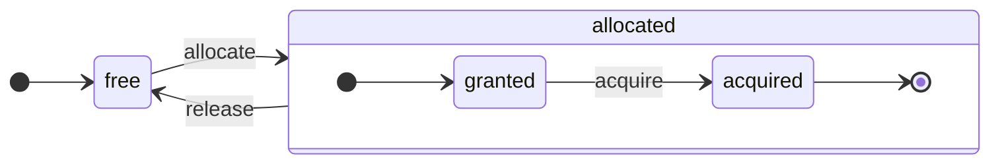

ClickHouse は真のカラム指向 DBMS です。データはカラムごとに格納され、実行時にも配列 (カラムのベクトルまたは chunk) 単位で処理されます。
可能な限り、個々の値ではなく配列に対して操作が実行されます。
これは「ベクトル化クエリ実行」と呼ばれ、実際のデータ処理コストの削減に役立ちます。

この考え方は新しいものではありません。
その起源は `APL` (プログラミング言語、1957年) と、その派生である `A +` (APL の dialect) 、`J` (1990年) 、`K` (1993年) 、`Q` (Kx Systems のプログラミング言語、2003年) にさかのぼります。
配列プログラミングは、科学データ処理で使われています。また、この考え方は関係データベースにおいても目新しいものではありません。たとえば、`VectorWise` システム (Actian Corporation の Actian Vector Analytic Database としても知られています) でも使われています。

クエリ処理を高速化する方法には、ベクトル化クエリ実行と実行時コード生成という 2 つの異なるアプローチがあります。後者は、あらゆる間接参照と動的ディスパッチを取り除きます。これらのアプローチは、どちらか一方が他方より常に優れているというものではありません。実行時コード生成は、多くの操作を融合することで、CPU の実行ユニットとパイプラインをフルに活用できる場合に有利です。一方、ベクトル化クエリ実行では、一時的なベクトルを cache に書き込み、再び読み出す必要があるため、実用上不利になることがあります。一時データが L2 cache に収まらない場合は、これが問題になります。しかし、ベクトル化クエリ実行のほうが CPU の SIMD capabilities をより活用しやすくなります。私たちの友人が執筆した [研究論文](http://15721.courses.cs.cmu.edu/spring2016/papers/p5-sompolski.pdf) では、両方のアプローチを組み合わせるのが最善であることが示されています。ClickHouse ではベクトル化クエリ実行を採用しており、実行時コード生成についても限定的ながら初期サポートがあります。

  ## カラム

`IColumn` インターフェイスは、メモリ上のカラム (実際にはカラムのchunk) を表現するために使われます。このインターフェイスは、さまざまな関係演算子を実装するための補助メソッドを提供します。ほぼすべての操作はイミュータブルで、元のカラムを変更するのではなく、変更後の新しいカラムを作成します。たとえば、`IColumn :: filter` メソッドはフィルタ用のバイトマスクを受け取ります。これは `WHERE` や `HAVING` の関係演算子で使用されます。そのほかの例としては、`ORDER BY` をサポートする `IColumn :: permute` メソッドや、`LIMIT` をサポートする `IColumn :: cut` メソッドがあります。

さまざまな `IColumn` 実装 (`ColumnUInt8`、`ColumnString` など) は、カラムのメモリレイアウトを担います。メモリレイアウトは通常、連続した配列です。整数型のカラムでは、`std :: vector` のように、単一の連続配列になります。`String` カラムおよび `Array` カラムでは、2 つのベクターで構成されます。1 つはすべての配列要素を連続して格納するもので、もう 1 つは各配列の先頭へのオフセットを保持します。また、メモリ上には 1 つの値しか格納しないものの、カラムのように見える `ColumnConst` もあります。

  ## Field

ただし、個々の値を扱うことも可能です。個々の値を表現するには、`Field` を使用します。`Field` は単に、`UInt64`、`Int64`、`Float64`、`String`、`Array` からなる判別付きユニオンです。`IColumn` には、n 番目の値を `Field` として取得するための `operator []` メソッドと、カラムの末尾に `Field` を追加する `insert` メソッドがあります。これらのメソッドは、個々の値を表す一時的な `Field` オブジェクトを扱う必要があるため、あまり効率的ではありません。より効率的なメソッドとして、`insertFrom`、`insertRangeFrom` などがあります。

`Field` には、テーブルの具体的なデータ型に関する情報が十分に含まれていません。たとえば、`UInt8`、`UInt16`、`UInt32`、`UInt64` は、いずれも `Field` では `UInt64` として表現されます。

  ## リーキーな抽象化

`IColumn` には、データに対する一般的なリレーショナル変換のためのメソッドがありますが、すべてのニーズを満たせるわけではありません。たとえば、`ColumnUInt64` には 2 つのカラムの合計を計算するメソッドがなく、`ColumnString` には部分文字列検索を行うメソッドがありません。こうした無数の処理は `IColumn` の外部で実装されています。

カラムに対するさまざまな関数は、`IColumn` のメソッドを使って `Field` の値を取り出すことで、汎用的だが非効率な方法で実装することも、特定の `IColumn` 実装におけるデータの内部メモリレイアウトに関する知識を使って、特化した方法で実装することもできます。これは、関数内で特定の `IColumn` 型にキャストし、内部表現を直接扱うことで実現されます。たとえば、`ColumnUInt64` には内部配列への参照を返す `getData` メソッドがあり、別の処理でその配列を直接読み取ったり書き込んだりできます。さまざまな処理を効率よく特化できるようにするため、ここでは「リーキーな抽象化」を採用しています。

  ## データ型

`IDataType` は、シリアライゼーションとデシリアライゼーション、つまりカラムの chunk や個々の値をバイナリ形式またはテキスト形式で読み書きする役割を担います。`IDataType` は、テーブル内のデータ型に直接対応します。たとえば、`DataTypeUInt32`、`DataTypeDateTime`、`DataTypeString` などがあります。

`IDataType` と `IColumn` の結び付きは緩やかです。異なるデータ型が、メモリ上では同じ `IColumn` 実装で表現されることがあります。たとえば、`DataTypeUInt32` と `DataTypeDateTime` は、どちらも `ColumnUInt32` または `ColumnConstUInt32` で表現されます。さらに、同じデータ型が異なる `IColumn` 実装で表現されることもあります。たとえば、`DataTypeUInt8` は `ColumnUInt8` または `ColumnConstUInt8` で表現できます。

`IDataType` が保持するのはメタデータだけです。たとえば、`DataTypeUInt8` は何も保持せず (仮想ポインタ `vptr` を除く) 、`DataTypeFixedString` は `N` (固定長文字列のサイズ) だけを保持します。

`IDataType` には、さまざまなデータフォーマット向けの補助メソッドがあります。たとえば、必要に応じて引用符付きで値をシリアライズするメソッド、JSON 用に値をシリアライズするメソッド、XML フォーマットの一部として値をシリアライズするメソッドなどです。データフォーマットと直接対応しているわけではありません。たとえば、異なるデータフォーマットである `Pretty` と `TabSeparated` でも、`IDataType` インターフェイスの同じ `serializeTextEscaped` 補助メソッドを使用できます。

  ## Block

`Block` は、メモリ内のテーブルの一部分 (chunk) を表すコンテナーです。これは単に `(IColumn, IDataType, column name)` という 3 つ組の集合です。クエリの実行中、データは `Block` 単位で処理されます。`Block` があれば、データ (`IColumn` オブジェクト内) と、そのカラムをどのように扱うかを示す型情報 (`IDataType` 内) 、そしてカラム名を持っていることになります。カラム名は、テーブルの元のカラム名である場合もあれば、計算の一時的な結果を得るために付けられた仮の名前である場合もあります。

ブロック内のカラムに対して何らかの関数を計算するときは、その結果を格納した別のカラムをブロックに追加し、操作は不変であるため、その関数の引数となるカラムには手を加えません。後で不要になったカラムはブロックから削除できますが、変更はできません。これは共通部分式の除去に便利です。

ブロックは、処理されるデータの各 chunk ごとに作成されます。同じ種類の計算では、異なるブロック間でもカラム名と型は同じままで、変わるのはカラムデータだけであることに注意してください。ブロックサイズが小さいと、shared&#95;ptr やカラム名をコピーするための一時文字列によるオーバーヘッドが大きくなるため、ブロックデータはブロックヘッダーから分離したほうが適切です。

  ## プロセッサ

説明については、[https://github.com/ClickHouse/ClickHouse/blob/master/src/Processors/IProcessor.h](https://github.com/ClickHouse/ClickHouse/blob/master/src/Processors/IProcessor.h) を参照してください。

  ## フォーマット

データのフォーマットはプロセッサによって実装されています。

  ## I/O

バイト指向の入力/出力には、抽象クラス `ReadBuffer` と `WriteBuffer` があります。これらは C++ の `iostream` の代わりに使われます。心配はいりません。十分に成熟した C++ プロジェクトであれば、もっともな理由から `iostream` 以外の仕組みを使っているものです。

`ReadBuffer` と `WriteBuffer` は、単に連続したバッファと、そのバッファ内の位置を指すカーソルから成ります。実装によっては、バッファ用メモリを所有する場合もあれば、所有しない場合もあります。後続のデータでバッファを埋めるための仮想メソッド (`ReadBuffer` の場合) や、バッファをどこかにフラッシュするための仮想メソッド (`WriteBuffer` の場合) があります。これらの仮想メソッドが呼ばれることはまれです。

`ReadBuffer`/`WriteBuffer` の実装は、ファイル、ファイルディスクリプタ、ネットワークソケットを扱うためや、圧縮を実装するため (`CompressedWriteBuffer` は別の WriteBuffer で初期化され、そこへデータを書き込む前に圧縮を行います) 、そのほかさまざまな用途で使われます。`ConcatReadBuffer`、`LimitReadBuffer`、`HashingWriteBuffer` といった名前を見れば、その役割はおおよそわかるでしょう。

Read/WriteBuffer が扱うのはバイトだけです。入力/出力のフォーマットを補助するために、`ReadHelpers` と `WriteHelpers` のヘッダーファイルには関数が用意されています。たとえば、数値を 10 進フォーマットで書き出すためのヘルパーがあります。

`JSON` フォーマットの結果セットを stdout に書き出したい場合に何が起こるかを見てみましょう。
取得可能な状態のプル型 `QueryPipeline` から結果セットを用意します。
まず、stdout にバイトを書き出すために `WriteBufferFromFileDescriptor(STDOUT_FILENO)` を作成します。
次に、その `WriteBuffer` で初期化した `JSONRowOutputFormat` にクエリパイプラインの結果を接続し、`JSON` フォーマットで行を stdout に書き出します。
これは、プル型 `QueryPipeline` を完了済みの `QueryPipeline` に変換する `complete` メソッドで行えます。
内部では、`JSONRowOutputFormat` が各種 JSON の区切り文字を書き出し、`IColumn` への参照と行番号を引数として `IDataType::serializeTextJSON` メソッドを呼び出します。これにより、`IDataType::serializeTextJSON` は `WriteHelpers.h` のメソッドを呼び出します。たとえば、数値型には `writeText`、`DataTypeString` には `writeJSONString` が使われます。

  ## テーブル

`IStorage` インターフェイスはテーブルを表します。このインターフェイスの実装ごとに、異なるテーブルエンジンが対応します。たとえば、`StorageMergeTree`、`StorageMemory` などがあります。これらのクラスのインスタンスは、そのままテーブルです。

`IStorage` の主要なメソッドは `read` と `write` で、ほかに `alter`、`rename`、`drop` などがあります。`read` メソッドは、次の引数を受け取ります。テーブルから読み取るカラムの集合、対象となる `AST` クエリ、そして必要なストリーム数です。このメソッドは `Pipe` を返します。

ほとんどの場合、`read` メソッドの責務は、テーブルから指定されたカラムを読み取ることだけで、それ以降のデータ処理は担当しません。
以降のデータ処理はすべて、`IStorage` の責務の範囲外であるパイプラインの別の部分で行われます。

ただし、重要な例外があります。

* `AST` クエリは `read` メソッドに渡され、テーブルエンジンはそれを利用して索引の使用方法を判断し、テーブルから読み取るデータ量を減らすことができます。
* テーブルエンジン自体が、特定の段階までデータを処理できる場合もあります。たとえば、`StorageDistributed` はリモートサーバーにクエリを送信し、異なるリモートサーバーからのデータをマージ可能な段階まで処理するよう依頼して、その前処理済みデータを返すことができます。その後の処理は、クエリインタープリタが完了します。

テーブルの `read` メソッドは、複数の `プロセッサ` で構成される `Pipe` を返すことがあります。これらの `プロセッサ` は、テーブルから並列にデータを読み取ることができます。
その後、これらのプロセッサを、独立して計算可能なさまざまな変換 (式の評価やフィルタリングなど) に接続できます。
そして、その上に `QueryPipeline` を作成し、`PipelineExecutor` を介して実行できます。

`TableFunction` もあります。これらは、クエリの `FROM` 句で使用する一時的な `IStorage` オブジェクトを返す関数です。

テーブルエンジンの実装方法を手早く把握したい場合は、`StorageMemory` や `StorageTinyLog` のようなシンプルなものを見るとよいでしょう。

> `read` メソッドの結果として、`IStorage` は `QueryProcessingStage` を返します。これは、クエリのどの部分がストレージ内ですでに計算済みかを示す情報です。

  ## パーサー

手書きの再帰下降パーサーがクエリを解析します。たとえば、`ParserSelectQuery` はクエリのさまざまなパーツに対応する下位のパーサーを再帰的に呼び出すだけです。パーサーは `AST` を生成します。`AST` はノードで表現され、各ノードは `IAST` のインスタンスです。

> 歴史的な理由から、パーサージェネレーターは使用していません。

  ## インタープリタ

インタープリタは、AST からクエリ実行パイプラインを構築する役割を担います。`InterpreterExistsQuery` や `InterpreterDropQuery` のようなシンプルなインタープリタもあれば、より複雑な `InterpreterSelectQuery` もあります。

クエリ実行パイプラインは、chunk (特定の型を持つカラムの集合) を消費・生成できるプロセッサを組み合わせたものです。
プロセッサはポートを介して通信し、複数の入力ポートと複数の出力ポートを持つことができます。
詳細については、[src/Processors/IProcessor.h](https://github.com/ClickHouse/ClickHouse/blob/master/src/Processors/IProcessor.h) を参照してください。

たとえば、`SELECT` クエリを解釈した結果は、結果セットを読み取るための特別な出力ポートを持つ「pulling」`QueryPipeline` です。
`INSERT` クエリを解釈した結果は、挿入するデータを書き込むための入力ポートを持つ「pushing」`QueryPipeline` です。
また、`INSERT SELECT` クエリを解釈した結果は、入力も出力も持たない一方で、`SELECT` から `INSERT` へ同時にデータをコピーする「completed」`QueryPipeline` です。

`InterpreterSelectQuery` は、クエリ分析と変換のために `ExpressionAnalyzer` と `ExpressionActions` の仕組みを使用します。ルールベースのクエリ最適化の大半はここで実行されます。`ExpressionAnalyzer` はかなり複雑で整理されておらず、書き直す必要があります。さまざまなクエリ変換や最適化は個別のクラスに切り出し、クエリをモジュール単位で変換できるようにすべきです。

インタープリタに存在する問題に対処するため、新しい `InterpreterSelectQueryAnalyzer` が開発されました。これは `InterpreterSelectQuery` の新しいバージョンで、`ExpressionAnalyzer` を使用せず、`AST` と `QueryPipeline` の間に `QueryTree` と呼ばれる追加の抽象化レイヤーを導入します。本番環境での利用に完全に対応していますが、念のため `enable_analyzer` 設定の値を `false` に設定すれば無効にできます。

  ## 関数

通常の関数と集約関数があります。集約関数については、次の節を参照してください。

通常の関数は行数を変えません。つまり、各行を独立して処理しているかのように動作します。実際には、関数は個々の行に対して呼び出されるのではなく、ベクトル化クエリ実行を実現するために、データの `Block` 単位で呼び出されます。

[blockSize](/ja/reference/functions/regular-functions/other-functions#blockSize)、[rowNumberInBlock](/ja/reference/functions/regular-functions/other-functions#rowNumberInBlock)、[runningAccumulate](/ja/reference/functions/regular-functions/other-functions#runningAccumulate) のように、block 処理を利用し、行の独立性を破る雑多な関数もいくつかあります。

ClickHouse は強い型付けを採用しているため、暗黙的な型変換は行われません。関数が特定の型の組み合わせをサポートしていない場合は、例外をスローします。ただし、関数はさまざまな型の組み合わせに対して動作できるようにオーバーロードできます。たとえば、`plus` 関数 (`+` 演算子を実装する関数) は、任意の数値型の組み合わせに対して動作します。たとえば、`UInt8` + `Float32`、`UInt16` + `Int8` などです。また、`concat` 関数のように、任意の数の引数を受け取れる可変長関数もあります。

関数の実装は、やや扱いにくいことがあります。これは、関数がサポートされるデータ型とサポートされる `IColumns` を明示的にディスパッチするためです。たとえば `plus` 関数には、数値型の各組み合わせと、左右の引数が定数か非定数かの各組み合わせごとに、C++ テンプレートのインスタンス化によって生成されたコードがあります。

ここは、テンプレートコードの肥大化を避けるために実行時コード生成を実装するのに非常に適した場所です。また、fused multiply-add のような fused 関数を追加したり、1 回のループ反復で複数の比較を行ったりすることも可能になります。

ベクトル化クエリ実行では、関数は短絡評価されません。たとえば `WHERE f(x) AND g(y)` と記述した場合、`f(x)` がゼロである行であっても両側が計算されます (`f(x)` がゼロの定数式である場合を除く) 。ただし、`f(x)` 条件の選択性が高く、`f(x)` の計算が `g(y)` よりはるかに安価な場合は、多段階の計算を実装するほうが適しています。まず `f(x)` を計算し、次にその結果でカラムをフィルタリングし、その後、より小さくフィルタリングされたデータの chunk に対してのみ `g(y)` を計算します。

  ## 集約関数

集約関数は状態を持つ関数です。渡された値をある状態に蓄積し、その状態から結果を取得できます。これらは `IAggregateFunction` インターフェイスで管理されます。状態は非常に単純なこともあれば (`AggregateFunctionCount` の状態は単一の `UInt64` 値にすぎません) 、かなり複雑なこともあります (`AggregateFunctionUniqCombined` の状態は、線形配列、ハッシュテーブル、`HyperLogLog` という確率的データ構造を組み合わせたものです) 。

状態は、高カーディナリティの `GROUP BY` クエリの実行時に複数の状態を扱うため、`Arena` (メモリプール) 内に割り当てられます。状態は、単純ではないコンストラクタやデストラクタを持つ場合があります。たとえば、複雑な集約状態は追加のメモリを自前で確保することがあります。そのため、状態の生成と破棄、さらに所有権の受け渡しや破棄順序の扱いには注意が必要です。

集約状態は、分散クエリ実行中にネットワーク経由で受け渡したり、RAM が不足している場合にディスクへ書き出したりできるよう、シリアライズおよびデシリアライズできます。さらに、データの増分集約を可能にするため、`DataTypeAggregateFunction` を使ったテーブルに格納することもできます。

> 現時点では、集約関数の状態のシリアライズ済みデータフォーマットにはバージョン管理がありません。集約状態を一時的に保存するだけであれば問題ありません。しかし、増分集約のための `AggregatingMergeTree` テーブルエンジンがあり、すでに本番環境で利用されています。そのため、今後いずれかの集約関数のシリアライズフォーマットを変更する場合は、後方互換性が必要になります。

  ## サーバー

サーバーは、いくつかの異なるインターフェイスを備えています。

* 外部クライアント向けの HTTP インターフェイス。
* ネイティブの ClickHouse クライアント用、および分散クエリ実行時のサーバー間通信のための TCP インターフェイス。
* レプリケーション用のデータ転送インターフェイス。

内部的には、コルーチンやファイバーを使わない基本的なマルチスレッドサーバーにすぎません。サーバーは、単純なクエリを高頻度で処理するのではなく、比較的低頻度の複雑なクエリを処理するよう設計されており、それぞれのクエリで分析のために膨大な量のデータを処理できます。

サーバーは、クエリ実行に必要な環境、つまり利用可能なデータベース、ユーザーとアクセス権、設定、クラスター、プロセスリスト、クエリログなどを `Context` クラスに初期化します。インタープリタ はこの環境を利用します。

サーバーの TCP プロトコルについては、完全な後方互換性と前方互換性を維持しています。古いクライアントは新しいサーバーと通信でき、新しいクライアントは古いサーバーと通信できます。ただし、これを永続的に維持するつもりはないため、古いバージョンのサポートはおよそ 1 年後に削除しています。

<Note>
  ほとんどの外部アプリケーションでは、シンプルで使いやすいため、HTTP インターフェイスの利用を推奨します。TCP プロトコルは内部データ構造とより密接に結び付いており、データの block を受け渡すために内部フォーマットを使用し、圧縮データには独自のフレーミングを使用します。
</Note>

  ## 設定

ClickHouse Server は POCO C++ Libraries をベースとしており、設定の表現には `Poco::Util::AbstractConfiguration` を使用します。設定は `DaemonBase` クラスの基底である `Poco::Util::ServerApplication` クラスによって保持され、この `DaemonBase` はさらに clickhouse-server 自体を実装する `DB::Server` クラスの基底クラスになっています。そのため、設定には `ServerApplication::config()` メソッドでアクセスできます。

設定は複数のファイル (XML または YAML フォーマット) から読み込まれ、`ConfigProcessor` クラスによって 1 つの `AbstractConfiguration` にマージされます。設定はサーバー起動時に読み込まれ、設定ファイルのいずれかが更新、削除、または追加された場合は、後から再読み込みすることもできます。これらの変更の定期的な監視と再読み込み処理は `ConfigReloader` クラスが担当します。`SYSTEM RELOAD CONFIG` クエリでも設定の再読み込みがトリガーされます。

`Server` 以外のクエリやサブシステムでは、設定には `Context::getConfigRef()` メソッドを使ってアクセスできます。サーバーを再起動せずに設定を再読み込みできる各サブシステムは、`Server::main()` メソッド内の再読み込みコールバックに自身を登録する必要があります。なお、新しい設定に error がある場合、ほとんどのサブシステムはその設定を無視し、warning messages をログに記録したうえで、以前に読み込まれた設定を使い続けます。`AbstractConfiguration` の性質上、特定のセクションへの参照を渡すことはできないため、通常は代わりに `String config_prefix` が使用されます。

  ### コンテキスト

ClickHouse は、設定を次のコンテキスト階層で管理します。

* **グローバルコンテキスト** - 設定ファイルで定義されるサーバー全体の設定
* **セッションコンテキスト** - プロファイル、ユーザー設定、`SET` コマンドによるユーザーセッション設定
* **クエリコンテキスト** - `SETTINGS` clause によるクエリレベルの設定
* **バックグラウンドコンテキスト** - `background` プロファイルで定義されるバックグラウンド処理 (Mutate、Merge) 向けのサーバー全体の設定

処理 (クエリ、ミューテーション など) をスケジュールする際、サーバーは次の順序で設定をマージして対象のコンテキストを構築します (後の項目が前の項目を上書きします) 。

1. グローバルデフォルト
2. グローバル設定
3. プロファイル設定 (`<profiles>` section から)
4. ユーザー設定 (`<users>` section から)
5. セッション設定 (`SET` command から)
6. クエリ設定 (`SETTINGS` clause から)

<Note>
  バックグラウンド処理はグローバル設定と `background` プロファイル設定で構成できます。この場合、セッション設定とクエリ設定は影響しません。明示的な設定がない場合は、グローバルコンテキストから設定を継承します。こうした処理のデフォルトのプロファイル名は `background` ですが、`background_profile` server setting で上書きできます。
</Note>

  ## スレッドとジョブ

ClickHouse は、クエリの実行や付随する処理のために、スレッドを頻繁に生成・破棄しなくて済むよう、いずれかのスレッドプールからスレッドを割り当てます。スレッドプールはいくつかあり、ジョブの目的や構造に応じて使い分けられます。

* 受信クライアントセッション用のサーバープール。
* 汎用ジョブ、バックグラウンド処理、スタンドアロンスレッド用のグローバルスレッドプール。
* 主に何らかの IO 待ちでブロックされ、CPU 集約的ではないジョブ用の IO スレッドプール。
* 定期タスク用のバックグラウンドプール。
* ステップに分割できるプリエンプト可能なタスク用のプール。

サーバープールは、`Server::main()` メソッドで定義される `Poco::ThreadPool` クラスのインスタンスです。持てるスレッド数は最大で `max_connection` です。各スレッドは 1 つのアクティブな接続専用です。

グローバルスレッドプールは `GlobalThreadPool` シングルトンクラスです。ここからスレッドを割り当てるには `ThreadFromGlobalPool` を使用します。これは `std::thread` に似たインターフェイスを持ちますが、グローバルプールからスレッドを取得し、必要な初期化をすべて行います。設定項目は次のとおりです。

* `max_thread_pool_size` - プール内のスレッド数の上限。
* `max_thread_pool_free_size` - 新しいジョブを待機するアイドルスレッド数の上限。
* `thread_pool_queue_size` - スケジュール済みジョブ数の上限。

グローバルプールは汎用的なプールであり、以下で説明するすべてのプールはその上に実装されています。これはプールの階層と考えることができます。どの特化プールも、`ThreadPool` クラスを使ってグローバルプールからスレッドを取得します。したがって、特化プールの主な役割は、同時実行できるジョブ数を制限し、ジョブをスケジューリングすることです。プール内のスレッド数を超えるジョブがスケジュールされると、`ThreadPool` はジョブを優先度付きキューに蓄積します。各ジョブは整数の優先度を持ちます。デフォルトの優先度は 0 です。優先度の値が高いジョブは、値が低いジョブより先に開始されます。ただし、すでに実行中のジョブの間では差はないため、優先度が意味を持つのはプールが過負荷になっているときだけです。

IO スレッドプールは、`IOThreadPool::get()` メソッドでアクセスできる通常の `ThreadPool` として実装されています。これはグローバルプールと同様に、`max_io_thread_pool_size`、`max_io_thread_pool_free_size`、`io_thread_pool_queue_size` の各設定で構成されます。IO スレッドプールの主な目的は、IO ジョブによってグローバルプールが枯渇し、その結果クエリが CPU を十分に活用できなくなるのを防ぐことです。S3 へのバックアップでは 상당한量の IO 操作が発生するため、対話型クエリへの影響を避ける目的で、`max_backups_io_thread_pool_size`、`max_backups_io_thread_pool_free_size`、`backups_io_thread_pool_queue_size` の各設定で構成される専用の `BackupsIOThreadPool` も用意されています。

定期タスクの実行には `BackgroundSchedulePool` クラスがあります。`BackgroundSchedulePool::TaskHolder` オブジェクトを使ってタスクを登録でき、このプールは同じタスクについて 2 つのジョブが同時に実行されないようにします。また、将来の特定時刻までタスクの実行を延期したり、一時的にタスクを無効化したりすることもできます。グローバルな `Context` は、用途ごとにこのクラスのインスタンスをいくつか提供します。汎用タスクには `Context::getSchedulePool()` を使用します。

さらに、プリエンプト可能なタスク用の特化スレッドプールもあります。このような `IExecutableTask` タスクは、ステップと呼ばれる順序付きのジョブ列に分割できます。短いタスクが長いタスクより優先される形でこれらのタスクをスケジュールするために、`MergeTreeBackgroundExecutor` が使われます。名前が示すとおり、これはマージ、ミューテーション、フェッチ、移動など、MergeTree 関連のバックグラウンド操作に使われます。プールのインスタンスは `Context::getCommonExecutor()` などの類似メソッドで利用できます。

ジョブにどのプールが使われるかに関係なく、開始時にそのジョブ用の `ThreadStatus` インスタンスが作成されます。これは、スレッド ID、クエリ ID、パフォーマンスカウンター、リソース消費量、そのほか多くの有用なデータといった、スレッドごとの情報をひとまとめにしたものです。ジョブは `CurrentThread::get()` の呼び出しによってスレッドローカルポインター経由でこれにアクセスできるため、すべての関数にこれを渡す必要はありません。

スレッドがクエリ実行に関連している場合、`ThreadStatus` に関連付けられる最も重要なものは、クエリコンテキスト `ContextPtr` です。すべてのクエリはサーバープール内にマスタースレッドを持ちます。マスタースレッドは、`ThreadStatus::QueryScope query_scope(query_context)` オブジェクトを保持することでこれを関連付けます。さらに、マスタースレッドは `ThreadGroupStatus` オブジェクトで表されるスレッドグループも作成します。このクエリ実行中に割り当てられる追加の各スレッドは、`CurrentThread::attachTo(thread_group)` の呼び出しによってそのスレッドグループに関連付けられます。スレッドグループは、単一のタスクに専用化されたすべてのスレッドについて、プロファイルイベントカウンターを集計し、メモリ消費量を追跡するために使用されます (詳細は `MemoryTracker` および `ProfileEvents::Counters` クラスを参照してください) 。

  ## 同時実行制御

並列化可能なクエリは、自身の実行を制限するために `max_threads` 設定を使用します。この設定のデフォルト値は、単一のクエリがすべての CPU コアを最も効率よく使えるように選ばれています。では、複数の同時実行クエリがあり、それぞれがデフォルトの `max_threads` 設定値を使っていたらどうなるでしょうか。その場合、クエリは CPU リソースを共有することになります。OS はスレッドを絶えず切り替えることで公平性を保ちますが、そのぶん一定の性能低下が発生します。`ConcurrencyControl` は、この性能低下に対処し、過剰な数のスレッドが割り当てられるのを防ぐのに役立ちます。設定 `concurrent_threads_soft_limit_num` は、何らかの CPU 負荷制御を適用する前に割り当て可能な同時実行スレッド数を制限するために使用されます。

CPU `slot` という概念が導入されています。slot は同時実行の単位です。スレッドを実行するには、クエリは事前に slot を取得し、スレッドの停止時にそれを解放する必要があります。slot の数はサーバー全体でグローバルに制限されています。必要な slot の合計数が slot の総数を超える場合、複数の同時実行クエリが CPU slot を奪い合うことになります。`ConcurrencyControl` は、公平な CPU slot スケジューリングを行うことで、この競合を解決します。

各 slot は、以下の状態を持つ独立した状態機械と見なせます。

* `free`: slot は利用可能で、任意のクエリに割り当てできます。
* `granted`: slot は特定のクエリに `allocated` されていますが、まだどのスレッドにも取得されていません。
* `acquired`: slot は特定のクエリに `allocated` されており、スレッドによって取得されています。

`allocated` された slot は、`granted` と `acquired` という 2 つの異なる状態を取り得ることに注意してください。前者は遷移状態で、実際には短時間しか続かないはずです (slot がクエリに割り当てられた瞬間から、そのクエリのいずれかのスレッドによってスケールアップ処理が実行される時点まで) 。

`ConcurrencyControl` の API は、次の関数で構成されています。

1. クエリのリソース割り当てを作成します: `auto slots = ConcurrencyControl::instance().allocate(1, max_threads);`。少なくとも 1 つ、最大で `max_threads` 個のスロットが割り当てられます。最初のスロットはすぐに付与されますが、残りのスロットは後から付与される場合があります。したがって、この制限はソフトです。というのも、すべてのクエリは少なくとも 1 つのスレッドを取得できるためです。
2. 各スレッドについて、割り当てからスロットを取得する必要があります: `while (auto slot = slots->tryAcquire()) spawnThread([slot = std::move(slot)] { ... });`。
3. スロットの総数を更新します: `ConcurrencyControl::setMaxConcurrency(concurrent_threads_soft_limit_num)`。サーバーを再起動せずに、実行時に変更できます。

この API により、クエリは少なくとも 1 つのスレッドで開始し (CPU 負荷が高い場合でも) 、その後 `max_threads` までスケールアップできます。

  ## 分散クエリ実行

クラスター構成では、各サーバーは基本的に独立しています。クラスター内の1台またはすべてのサーバーに `Distributed` テーブルを作成できます。`Distributed` テーブル自体はデータを保存せず、クラスター内の複数ノード上にある各ローカルテーブルへの「ビュー」を提供するだけです。`Distributed` テーブルに対して SELECT を実行すると、そのクエリが書き換えられ、ロードバランシング設定に従ってリモートノードが選択され、それらのノードにクエリが送信されます。`Distributed` テーブルは、異なるサーバーからの中間結果をマージできる段階まで、リモートサーバー側でクエリを処理させます。その後、中間結果を受け取ってマージします。分散テーブルは、できるだけ多くの処理をリモートサーバーに任せ、ネットワーク経由で送る中間データを最小限に抑えようとします。

IN 句や JOIN 句にサブクエリがあり、それぞれで `Distributed` テーブルを使用している場合は、さらに複雑になります。これらのクエリを実行するために、いくつかの異なる戦略があります。

分散クエリ実行には、グローバルなクエリプランはありません。各ノードは、自身が担当する処理部分についてローカルなクエリプランを持ちます。現在あるのは、単純な1パスの分散クエリ実行だけです。つまり、リモートノードにクエリを送信し、その後で結果をマージします。しかし、カーディナリティの高い `GROUP BY` を含む複雑なクエリや、JOIN のために大量の一時データが必要なクエリでは、この方式は現実的ではありません。そのような場合には、サーバー間でデータを「再シャッフル」する必要があり、そのためには追加の協調が必要です。ClickHouse はこの種のクエリ実行をサポートしておらず、今後対応していく必要があります。

  ## MergeTree

`MergeTree` は、主キーによる索引をサポートするストレージエンジンのファミリーです。主キーには、任意のカラムや式のタプルを使用できます。`MergeTree` テーブル内のデータは「パーツ」に格納されます。各パーツではデータが主キー順に保存されるため、主キータプルに従って辞書順に並びます。テーブルのすべてのカラムは、これらのパーツ内でそれぞれ別個の `column.bin` ファイルに格納されます。これらのファイルは圧縮ブロックで構成されます。各ブロックは通常、値の平均サイズに応じて、64 KB から 1 MB の非圧縮データになります。ブロックは、カラム値が連続して並んだ形で構成されます。各カラムの値は同じ順序になっており (順序は主キーで定義されます) 、そのため複数のカラムをたどると、対応する行の値を取得できます。

主キー自体は「スパース」です。つまり、すべての行を直接指すのではなく、一部のデータ範囲だけを指します。別個の `primary.idx` ファイルには N 行ごとの主キー値が格納されており、この N は `index_granularity` と呼ばれます (通常、N = 8192) 。また、各カラムには `column.mrk` ファイルがあり、データファイル内の N 行ごとのオフセットを示す「マーク」が格納されています。各マークは 2 つの値の組で、1 つは圧縮ブロック先頭までのファイル内オフセット、もう 1 つは展開後ブロック内でデータ先頭までのオフセットです。通常、圧縮ブロックはマーク境界に揃えられるため、展開後ブロック内のオフセットはゼロです。`primary.idx` のデータは常にメモリ上に常駐し、`column.mrk` ファイルのデータはキャッシュされます。

`MergeTree` のパーツから何かを読み取るときは、まず `primary.idx` のデータを見て、要求されたデータを含みうる範囲を特定し、その後 `column.mrk` のデータを見て、それらの範囲をどこから読み始めるかのオフセットを計算します。スパースであるため、余分なデータを読み取ることがあります。各キーについて `index_granularity` 行を含む範囲全体を読み取る必要があり、さらに各カラムについて圧縮ブロック全体を展開する必要があるため、ClickHouse は単純なポイントクエリが高負荷で発生する用途には適していません。索引をスパースにしたのは、1 台の server で数兆行を扱っても、索引のメモリ消費を目立たない水準に抑えられるようにする必要があるためです。また、主キーはスパースなので一意ではありません。`INSERT` 時に、そのキーがテーブル内に存在するかどうかを確認することはできません。同じキーを持つ行がテーブル内に多数存在しえます。

ある程度まとまったデータを `MergeTree` に `INSERT` すると、そのデータ群は主キー順にソートされ、新しいパーツになります。バックグラウンドスレッドが定期的にいくつかのパーツを選び、それらを 1 つのソート済みパーツにマージして、パーツ数を比較的少なく保ちます。これが `MergeTree` と呼ばれる理由です。もちろん、マージによって「write amplification」が発生します。すべてのパーツは不変であり、作成と削除だけが行われ、変更はされません。`SELECT` の実行時には、テーブルのスナップショット (パーツの集合) が保持されます。マージ後もしばらく古いパーツを保持するため、障害発生後の復旧が容易になります。そのため、あるマージ済みパーツが壊れている可能性があると分かった場合には、その元になったパーツ群で置き換えることができます。

`MergeTree` は LSM tree ではありません。MEMTABLE と LOG を持たず、挿入されたデータは直接 filesystem に書き込まれるためです。この動作により、MergeTree はバッチでのデータ挿入により適しています。そのため、少量の行を高頻度で挿入する使い方は MergeTree には理想的ではありません。たとえば、1 秒あたり数行であれば問題ありませんが、1 秒に 1000 回行うのは MergeTree にとって最適ではありません。ただし、この制約を克服するために、小規模な insert 向けの非同期 INSERT モードがあります。私たちがこのようにしたのは、シンプルさを保つためであり、またアプリケーション側ですでにデータをバッチで挿入しているためでもあります

バックグラウンドマージ中に追加の処理を行う MergeTree エンジンもあります。例としては `CollapsingMergeTree` や `AggregatingMergeTree` があります。これは、更新に対する特別なサポートと見なすことができます。ただし、これらは本当の更新ではないことに注意してください。通常、バックグラウンドマージがいつ実行されるかを users が制御することはできず、`MergeTree` テーブル内のデータはほとんどの場合、完全にマージされた形ではなく、複数のパーツにまたがって格納されているためです。

  ## レプリケーション

ClickHouse のレプリケーションは、テーブル単位で設定できます。同じサーバー上で、レプリケートテーブルと非レプリケートテーブルを混在させることも可能です。また、テーブルごとに異なる方式でレプリケーションを構成することもでき、たとえば、あるテーブルは 2 重レプリケーション、別のテーブルは 3 重レプリケーションにするといったこともできます。

レプリケーションは、`ReplicatedMergeTree` ストレージエンジンで実装されています。`ZooKeeper` 内のパスは、ストレージエンジンのパラメーターとして指定します。`ZooKeeper` 内で同じパスを持つすべてのテーブルは互いにレプリカとなり、データを同期して一貫性を保ちます。レプリカは、テーブルの作成や削除だけで動的に追加・削除できます。

レプリケーションには、非同期のマルチマスター方式が使われます。`ZooKeeper` とセッションを持つ任意のレプリカにデータを insert でき、そのデータは他のすべてのレプリカに非同期でレプリケートされます。ClickHouse は UPDATE をサポートしていないため、レプリケーションによる競合は発生しません。既定では insert に対するクォーラム確認がないため、いずれかのノードで障害が発生すると、insert 直後のデータが失われる可能性があります。insert クォーラムは、`insert_quorum` 設定で有効にできます。

レプリケーションのメタデータは ZooKeeper に保存されます。実行すべき操作を列挙したレプリケーションログがあり、その操作には、パーツの取得、パーツのマージ、パーティションの drop などがあります。各レプリカはレプリケーションログを自分のキューにコピーし、そのキューから操作を実行します。たとえば、INSERT 時にはログに &quot;get the part&quot; という操作が作成され、各レプリカがそのパーツをダウンロードします。マージは、バイト単位で完全に同一の結果を得るために、レプリカ間で調整されます。すべてのパーツは、すべてのレプリカで同じ方法でマージされます。リーダーの 1 つが最初に新しいマージを開始し、ログに &quot;merge parts&quot; 操作を書き込みます。複数のレプリカ (あるいはすべて) が、同時にリーダーになることもできます。レプリカがリーダーになるのを防ぐには、`merge_tree` 設定の `replicated_can_become_leader` を使用します。リーダーは、バックグラウンドマージのスケジューリングを担当します。

レプリケーションは物理レベルで行われます。ノード間で転送されるのはクエリではなく、圧縮済みのパーツだけです。多くの場合、マージはネットワーク増幅を避けてネットワークコストを抑えるため、各レプリカ上で独立して処理されます。大きなマージ済みパーツがネットワーク経由で送られるのは、レプリケーションラグが大きい場合に限られます。

さらに、各レプリカは、パーツの集合とそのチェックサムからなる自身の状態を ZooKeeper に保存します。ローカルファイルシステム上の状態が ZooKeeper 内の基準状態と食い違った場合、レプリカは不足しているパーツや破損したパーツを他のレプリカからダウンロードして整合性を復元します。ローカルファイルシステムに予期しないデータや壊れたデータがある場合でも、ClickHouse はそれを削除せず、別のディレクトリに移動して管理対象から外します。

<Note>
  ClickHouse クラスターは独立した分片で構成され、各分片はレプリカで構成されます。このクラスターは**伸縮的ではない**ため、新しい分片を追加しても、データが分片間で自動的に再配置されることはありません。代わりに、クラスターの負荷は不均一になることを前提に調整する必要があります。この実装により、比較的小規模なクラスター、たとえば数十ノード規模であれば、より細かく制御できますし問題にもなりません。しかし、私たちが本番環境で使用しているような数百ノード規模のクラスターでは、この方式は大きな欠点になります。クラスター全体にまたがり、動的にレプリケートされる領域を備え、それらをクラスター間で自動的に分割・均衡化できるテーブルエンジンを実装すべきです。
</Note>