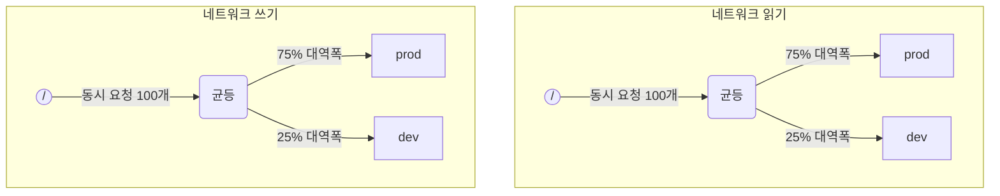

ClickHouse가 여러 쿼리를 동시에 실행할 때는 디스크와 CPU 코어 같은 공유 리소스를 사용할 수 있습니다. 서로 다른 워크로드 간에 리소스가 사용되고 공유되는 방식을 제어하기 위해 스케줄링 제약 조건과 정책을 적용할 수 있습니다. 모든 리소스에 대해 공통 스케줄링 계층을 구성할 수 있습니다. 계층의 루트는 공유 리소스를 나타내며, 리프 노드는 리소스 용량을 초과하는 요청을 보유하는 개별 워크로드를 나타냅니다.

<Note>
  현재는 이 방법을 사용해 [원격 디스크 I/O](#disk_config)와 [CPU](#cpu_scheduling)를 스케줄링할 수 있습니다. 유연한 메모리 제한에 대해서는 [Memory overcommit](/ko/concepts/features/configuration/settings/memory-overcommit)을 참조하십시오.
</Note>

<div id="disk_config">
  ## 디스크 구성
</div>

특정 디스크의 IO 워크로드 스케줄링을 활성화하려면 WRITE 및 READ 액세스용 읽기 및 쓰기 리소스를 생성해야 합니다:

```sql
CREATE RESOURCE resource_name (WRITE DISK disk_name, READ DISK disk_name)
-- 또는
CREATE RESOURCE read_resource_name (WRITE DISK write_disk_name)
CREATE RESOURCE write_resource_name (READ DISK read_disk_name)
```

리소스는 READ, WRITE 또는 READ와 WRITE 모두에 대해 여러 디스크에서 사용할 수 있습니다. 모든 디스크에 동일한 리소스를 적용할 수 있는 구문도 있습니다:

```sql
CREATE RESOURCE all_io (READ ANY DISK, WRITE ANY DISK);
```

리소스에서 어떤 디스크를 사용하는지 지정하는 또 다른 방법은 server의 `storage_configuration`입니다:

<Warning>
  ClickHouse 구성 기반 워크로드 스케줄링은 더 이상 권장되지 않습니다. 대신 SQL 구문을 사용해야 합니다.
</Warning>

특정 디스크에 대해 IO 스케줄링을 활성화하려면 storage configuration에서 `read_resource` 및/또는 `write_resource`를 지정해야 합니다. 이렇게 하면 지정된 디스크의 각 읽기 및 쓰기 요청에 어떤 리소스를 사용할지 ClickHouse에 알려줄 수 있습니다. 읽기 리소스와 쓰기 리소스는 동일한 리소스 이름을 참조할 수 있으며, 이는 로컬 SSD 또는 HDD에서 유용합니다. 여러 서로 다른 디스크가 동일한 리소스를 참조할 수도 있으며, 이는 원격 디스크에서 유용합니다. 예를 들어 &quot;production&quot; 워크로드와 &quot;development&quot; 워크로드 간에 네트워크 대역폭을 공정하게 분배하려는 경우에 유용합니다.

예시:

```xml
<clickhouse>
    <storage_configuration>
        ...
        <disks>
            <s3>
                <type>s3</type>
                <endpoint>https://clickhouse-public-datasets.s3.amazonaws.com/my-bucket/root-path/</endpoint>
                <access_key_id>your_access_key_id</access_key_id>
                <secret_access_key>your_secret_access_key</secret_access_key>
                <read_resource>network_read</read_resource>
                <write_resource>network_write</write_resource>
            </s3>
        </disks>
        <policies>
            <s3_main>
                <volumes>
                    <main>
                        <disk>s3</disk>
                    </main>
                </volumes>
            </s3_main>
        </policies>
    </storage_configuration>
</clickhouse>
```

리소스를 정의하는 SQL 방식보다 서버 구성 옵션이 우선 적용된다는 점에 유의하십시오.

<div id="workload_markup">
  ## 워크로드 마킹
</div>

서로 다른 워크로드를 구분하기 위해 쿼리에 설정 `workload`를 지정할 수 있습니다. `workload`가 설정되지 않으면 &quot;default&quot; 값이 사용됩니다. 설정 프로필을 사용하면 다른 값으로 지정할 수도 있습니다. 특정 사용자의 모든 쿼리에 `workload` 설정의 고정값이 적용되게 하려면 설정 제약 조건을 사용해 `workload`를 상수로 만들 수 있습니다.

백그라운드 작업에도 `workload` 설정을 할당할 수 있습니다. 머지와 뮤테이션은 각각 `merge_workload` 및 `mutation_workload` 서버 설정을 사용합니다. 이 값은 특정 테이블에 대해 `merge_workload` 및 `mutation_workload` MergeTree 설정으로 재정의할 수도 있습니다.

&quot;production&quot;과 &quot;development&quot;라는 두 가지 서로 다른 워크로드가 있는 시스템의 예시를 살펴보겠습니다.

```sql
SELECT count() FROM my_table WHERE value = 42 SETTINGS workload = 'production'
SELECT count() FROM my_table WHERE value = 13 SETTINGS workload = 'development'
```

<div id="hierarchy">
  ## 리소스 스케줄링 계층 구조
</div>

스케줄링 하위 시스템의 관점에서 리소스는 스케줄링 노드로 이루어진 계층 구조를 의미합니다.



<Warning>
  ClickHouse 구성을 사용하는 워크로드 스케줄링은 더 이상 권장되지 않습니다. 대신 SQL 구문을 사용해야 합니다. SQL 구문은 필요한 모든 스케줄링 노드를 자동으로 생성하며, 아래의 스케줄링 노드 설명은 하위 수준의 구현 세부 사항으로 보아야 합니다. 이러한 내용은 [system.scheduler](/ko/reference/system-tables/scheduler) 테이블을 통해 확인할 수 있습니다.
</Warning>

**가능한 노드 타입:**

* `inflight_limit` (제약) - 동시에 처리 중인 요청 수가 `max_requests`를 초과하거나 총 비용이 `max_cost`를 초과하면 차단합니다. 단일 자식만 가질 수 있습니다.
* `bandwidth_limit` (제약) - 현재 대역폭이 `max_speed`를 초과하거나(`0`은 무제한 의미), 버스트가 `max_burst`를 초과하면 차단합니다(기본값은 `max_speed`와 같음). 단일 자식만 가질 수 있습니다.
* `fair` (정책) - max-min 공정성에 따라 자식 노드 중 하나에서 다음에 처리할 요청을 선택합니다. 자식 노드는 `weight`를 지정할 수 있습니다(기본값은 1).
* `priority` (정책) - 정적 우선순위에 따라 자식 노드 중 하나에서 다음에 처리할 요청을 선택합니다(값이 낮을수록 우선순위가 높음). 자식 노드는 `priority`를 지정할 수 있습니다(기본값은 0).
* `fifo` (큐) - 리소스 용량을 초과한 요청을 보관할 수 있는 계층 구조의 리프 노드입니다.

기반 리소스의 전체 용량을 활용하려면 `inflight_limit`를 사용해야 합니다. `max_requests` 또는 `max_cost` 값이 너무 낮으면 리소스를 충분히 활용하지 못할 수 있습니다. 반대로 값이 너무 높으면 스케줄러 내부의 큐가 비게 될 수 있고, 그 결과 하위 트리에서 정책이 무시될 수 있습니다(공정성이 깨지거나 우선순위가 무시됨). 한편 리소스를 과도한 사용으로부터 보호하려면 `bandwidth_limit`를 사용해야 합니다. 이 노드는 `duration`초 동안 소비된 리소스 양이 `max_burst + max_speed * duration`바이트를 초과하면 스로틀링합니다. 동일한 리소스에 두 개의 `bandwidth_limit` 노드를 사용하면, 짧은 인터벌의 최대 대역폭과 더 긴 인터벌의 평균 대역폭을 각각 제한할 수 있습니다.

다음 예시는 그림에 표시된 IO 스케줄링 계층을 정의하는 방법을 보여줍니다:

```xml
<clickhouse>
    <resources>
        <network_read>
            <node path="/">
                <type>inflight_limit</type>
                <max_requests>100</max_requests>
            </node>
            <node path="/fair">
                <type>fair</type>
            </node>
            <node path="/fair/prod">
                <type>fifo</type>
                <weight>3</weight>
            </node>
            <node path="/fair/dev">
                <type>fifo</type>
            </node>
        </network_read>
        <network_write>
            <node path="/">
                <type>inflight_limit</type>
                <max_requests>100</max_requests>
            </node>
            <node path="/fair">
                <type>fair</type>
            </node>
            <node path="/fair/prod">
                <type>fifo</type>
                <weight>3</weight>
            </node>
            <node path="/fair/dev">
                <type>fifo</type>
            </node>
        </network_write>
    </resources>
</clickhouse>
```

<div id="workload_classifiers">
  ## 워크로드 분류기
</div>

<Warning>
  ClickHouse 구성을 사용하는 워크로드 스케줄링은 더 이상 권장되지 않습니다. 대신 SQL 구문을 사용해야 합니다. SQL 구문을 사용하면 분류기가 자동으로 생성됩니다.
</Warning>

워크로드 분류기는 쿼리에서 지정된 `workload`를 특정 리소스에 사용할 리프 큐에 매핑하는 방식을 정의하는 데 사용됩니다. 현재 워크로드 분류는 단순하며, 정적 매핑만 지원됩니다.

예시:

```xml
<clickhouse>
    <workload_classifiers>
        <production>
            <network_read>/fair/prod</network_read>
            <network_write>/fair/prod</network_write>
        </production>
        <development>
            <network_read>/fair/dev</network_read>
            <network_write>/fair/dev</network_write>
        </development>
        <default>
            <network_read>/fair/dev</network_read>
            <network_write>/fair/dev</network_write>
        </default>
    </workload_classifiers>
</clickhouse>
```

<div id="workloads">
  ## 워크로드 계층 구조
</div>

ClickHouse는 스케줄링 계층 구조를 정의할 수 있는 편리한 SQL 구문을 제공합니다. `CREATE RESOURCE`로 생성된 모든 리소스는 동일한 계층 구조를 공유하지만, 일부 측면에서는 서로 다를 수 있습니다. `CREATE WORKLOAD`로 생성된 각 워크로드에는 각 리소스마다 자동으로 생성되는 몇 개의 스케줄링 노드가 유지됩니다. 하위 워크로드는 다른 상위 워크로드 내부에 생성할 수 있습니다. 다음은 위의 XML 구성과 정확히 동일한 계층 구조를 정의하는 예시입니다:

```sql
CREATE RESOURCE network_write (WRITE DISK s3)
CREATE RESOURCE network_read (READ DISK s3)
CREATE WORKLOAD all SETTINGS max_io_requests = 100
CREATE WORKLOAD development IN all
CREATE WORKLOAD production IN all SETTINGS weight = 3
```

자식이 없는 리프 워크로드의 이름은 쿼리 설정 `SETTINGS workload = 'name'`에서 사용할 수 있습니다.

워크로드를 사용자 지정하려면 다음 설정을 사용할 수 있습니다.

* `priority` - 형제 워크로드는 정적 우선순위 값에 따라 처리됩니다(값이 낮을수록 우선순위가 높습니다).
* `weight` - 동일한 정적 우선순위를 가진 형제 워크로드는 가중치에 따라 리소스를 공유합니다.
* `max_io_requests` - 이 워크로드에서 동시 IO 요청 수의 한도입니다.
* `max_bytes_inflight` - 이 워크로드에서 동시 요청의 진행 중인 총 바이트 수 한도입니다.
* `max_bytes_per_second` - 이 워크로드의 바이트 읽기 또는 쓰기 속도 한도입니다.
* `max_burst_bytes` - 스로틀링되지 않고 워크로드가 처리할 수 있는 최대 바이트 수입니다(각 리소스별로 독립적입니다).
* `max_concurrent_threads` - 이 워크로드의 쿼리에 사용할 수 있는 동시 스레드 수 한도입니다.
* `max_concurrent_threads_ratio_to_cores` - `max_concurrent_threads`와 동일하지만, 사용 가능한 CPU 코어 수를 기준으로 정규화됩니다.
* `max_cpus` - 이 워크로드의 쿼리를 처리하는 데 사용할 수 있는 CPU 코어 수 한도입니다.
* `max_cpu_share` - `max_cpus`와 동일하지만, 사용 가능한 CPU 코어 수를 기준으로 정규화됩니다.
* `max_burst_cpu_seconds` - `max_cpus`로 인해 스로틀링되지 않고 워크로드가 소비할 수 있는 최대 CPU 초 수입니다.

워크로드 설정을 통해 지정한 모든 한도는 각 리소스별로 서로 독립적입니다. 예를 들어 `max_bytes_per_second = 10485760`인 워크로드는 각 읽기 및 쓰기 리소스에 대해 각각 10 MB/s의 대역폭 한도를 가집니다. 읽기와 쓰기에 공통 한도가 필요하다면 READ 및 WRITE 액세스에 동일한 리소스를 사용하는 것을 고려하십시오.

리소스별로 서로 다른 워크로드 계층 구조를 지정하는 방법은 없습니다. 하지만 특정 리소스에 대해서는 다른 워크로드 설정 값을 지정할 수 있습니다:

```sql
CREATE OR REPLACE WORKLOAD all SETTINGS max_io_requests = 100, max_bytes_per_second = 1000000 FOR network_read, max_bytes_per_second = 2000000 FOR network_write
```

또한 다른 워크로드에서 참조하고 있는 경우에는 워크로드나 리소스를 삭제할 수 없다는 점에 유의하십시오. 워크로드 정의를 업데이트하려면 `CREATE OR REPLACE WORKLOAD` 쿼리를 사용하십시오.

<Note>
  워크로드 설정은 적절한 스케줄링 노드 집합으로 변환됩니다. 더 하위 수준의 세부 사항은 스케줄링 노드 [타입과 옵션](#hierarchy) 설명을 참조하십시오.
</Note>

<div id="cpu_scheduling">
  ## CPU 스케줄링
</div>

워크로드에 대해 CPU 스케줄링을 활성화하려면 CPU 리소스를 생성하고 동시에 실행할 수 있는 스레드 수의 제한을 설정합니다:

```sql
CREATE RESOURCE cpu (MASTER THREAD, WORKER THREAD)
CREATE WORKLOAD all SETTINGS max_concurrent_threads = 100
```

ClickHouse 서버가 [여러 스레드](/ko/reference/settings/session-settings#max_threads)를 사용하는 동시 쿼리를 많이 실행하고 있고 모든 CPU 슬롯이 사용 중이면 과부하 상태가 됩니다. 과부하 상태에서는 해제되는 모든 CPU 슬롯이 스케줄링 정책에 따라 적절한 워크로드에 다시 할당됩니다. 동일한 워크로드를 공유하는 쿼리에는 슬롯이 round robin 방식으로 할당됩니다. 서로 다른 워크로드에 속한 쿼리에는 워크로드에 지정된 가중치, 우선순위, 제한에 따라 슬롯이 할당됩니다.

CPU 시간은 스레드가 블록되지 않은 상태에서 CPU 집약적인 작업을 수행할 때 소비됩니다. 스케줄링 관점에서 스레드는 두 종류로 구분됩니다:

* Master thread — 쿼리 또는 머지나 mutation과 같은 백그라운드 작업에서 가장 먼저 작업을 시작하는 첫 번째 스레드입니다.
* Worker thread — CPU 집약적인 작업을 수행하기 위해 master가 추가로 생성할 수 있는 스레드입니다.

더 나은 응답성을 위해 master 스레드와 worker 스레드에 별도의 리소스를 사용하는 것이 바람직할 수 있습니다. `max_threads` 쿼리 설정값을 크게 사용하면 많은 수의 worker 스레드가 CPU 리소스를 쉽게 독점할 수 있습니다. 그러면 새로 들어오는 쿼리는 블록되어 master 스레드가 실행을 시작할 CPU 슬롯을 기다려야 합니다. 이를 방지하려면 다음과 같은 구성을 사용할 수 있습니다:

```sql
CREATE RESOURCE worker_cpu (WORKER THREAD)
CREATE RESOURCE master_cpu (MASTER THREAD)
CREATE WORKLOAD all SETTINGS max_concurrent_threads = 100 FOR worker_cpu, max_concurrent_threads = 1000 FOR master_cpu
```

이렇게 하면 master 스레드와 worker 스레드에 각각 별도의 제한이 설정됩니다. 100개의 worker CPU 슬롯이 모두 사용 중이더라도, 사용 가능한 master CPU 슬롯이 있으면 새로운 쿼리는 차단되지 않습니다. 이러한 쿼리는 스레드 1개로 실행을 시작합니다. 이후 worker CPU 슬롯을 사용할 수 있게 되면 해당 쿼리는 worker 스레드를 추가로 생성하도록 확장될 수 있습니다. 반면 이런 방식은 전체 슬롯 수를 CPU 프로세서 수에 맞춰 제한하지 않으므로, 동시에 실행되는 스레드가 너무 많아지면 성능에 영향을 줄 수 있습니다.

master 스레드의 동시성을 제한해도 동시 쿼리 수는 제한되지 않습니다. CPU 슬롯은 쿼리 실행 도중에 해제되었다가 다른 스레드가 다시 획득할 수 있습니다. 예를 들어, 동시 master 스레드 제한이 2여도 4개의 동시 쿼리가 모두 병렬로 실행될 수 있습니다. 이 경우 각 쿼리는 CPU 프로세서 1개의 50%를 할당받습니다. 동시 쿼리 수를 제한하려면 별도의 로직을 사용해야 하며, 현재 워크로드에는 지원되지 않습니다.

워크로드에는 별도의 스레드 동시성 제한을 사용할 수 있습니다:

```sql
CREATE RESOURCE cpu (MASTER THREAD, WORKER THREAD)
CREATE WORKLOAD all
CREATE WORKLOAD admin IN all SETTINGS max_concurrent_threads = 10
CREATE WORKLOAD production IN all SETTINGS max_concurrent_threads = 100
CREATE WORKLOAD analytics IN production SETTINGS max_concurrent_threads = 60, weight = 9
CREATE WORKLOAD ingestion IN production
```

이 구성 예시는 관리자와 프로덕션에 서로 독립적인 CPU 슬롯 풀을 제공합니다. 프로덕션 풀은 분석과 수집이 함께 사용합니다. 또한 프로덕션 풀이 과부하 상태이면, 해제된 슬롯 10개 중 9개는 필요할 경우 분석 쿼리에 재할당됩니다. 수집 쿼리는 과부하 기간 동안 슬롯 10개 중 1개만 할당받습니다. 이렇게 하면 사용자 요청 쿼리의 지연 시간이 개선될 수 있습니다. 분석에는 동시 실행 스레드 60개의 자체 제한이 있어, 수집을 지원할 수 있도록 항상 최소 40개의 스레드를 남겨 둡니다. 과부하가 없으면 수집이 100개 스레드를 모두 사용할 수 있습니다.

쿼리를 CPU 스케줄링에서 제외하려면 쿼리 설정 [use&#95;concurrency&#95;control](/ko/reference/settings/session-settings#use_concurrency_control)을 0으로 설정하십시오.

CPU 스케줄링은 아직 머지와 뮤테이션을 지원하지 않습니다.

워크로드에 공정하게 할당하려면 쿼리 실행 중 선점과 스케일 다운이 필요합니다. 선점은 `cpu_slot_preemption` 서버 설정으로 활성화됩니다. 이 설정을 활성화하면 모든 스레드는 주기적으로 CPU 슬롯을 갱신합니다(`cpu_slot_quantum_ns` 서버 설정에 따름). 이러한 갱신은 CPU가 과부하 상태일 때 실행을 차단할 수 있습니다. 실행이 장시간 차단되면(`cpu_slot_preemption_timeout_ms` 서버 설정 참조) 쿼리가 스케일 다운되며, 동시에 실행되는 스레드 수가 동적으로 감소합니다. 워크로드 간에는 CPU 시간의 공정성이 보장되지만, 동일한 워크로드 내부의 쿼리 간에는 일부 예외적인 경우 이 공정성이 지켜지지 않을 수 있습니다.

<Warning>
  슬롯 스케줄링은 [쿼리 동시성](/ko/reference/settings/session-settings#max_threads)을 제어하는 방법을 제공하지만, 서버 설정 `cpu_slot_preemption`이 `true`로 설정되어 있지 않으면 CPU 시간을 공정하게 할당한다고 보장할 수 없습니다. 이 경우 공정성은 경쟁하는 워크로드 간 CPU 슬롯 할당 횟수를 기준으로 제공됩니다. 이는 동일한 양의 CPU 초를 의미하지는 않습니다. 선점이 없으면 CPU 슬롯을 무기한 점유할 수 있기 때문입니다. 스레드는 시작 시 슬롯을 획득하고 작업이 끝나면 해제합니다.
</Warning>

<Note>
  CPU 리소스를 선언하면 [`concurrent_threads_soft_limit_num`](/ko/reference/settings/server-settings/settings#concurrent_threads_soft_limit_num) 및 [`concurrent_threads_soft_limit_ratio_to_cores`](/ko/reference/settings/server-settings/settings#concurrent_threads_soft_limit_ratio_to_cores) 설정이 더 이상 적용되지 않습니다. 대신 특정 워크로드에 할당되는 CPU 수를 제한하는 데 워크로드 설정 `max_concurrent_threads`를 사용합니다. 이전 동작과 동일하게 하려면 WORKER THREAD 리소스만 생성하고, 워크로드 `all`의 `max_concurrent_threads`를 `concurrent_threads_soft_limit_num`과 같은 값으로 설정한 뒤, 쿼리 설정 `workload = "all"`을 사용하십시오. 이 구성은 [`concurrent_threads_scheduler`](/ko/reference/settings/server-settings/settings#concurrent_threads_scheduler) 설정 값을 &quot;fair&#95;round&#95;robin&quot;으로 지정한 것과 같습니다.
</Note>

<div id="threads_vs_cpus">
  ## 스레드와 CPU
</div>

워크로드의 CPU 활용을 제어하는 방법은 두 가지입니다.

* 스레드 수 제한: `max_concurrent_threads` 및 `max_concurrent_threads_ratio_to_cores`
* CPU 스로틀링: `max_cpus`, `max_cpu_share`, `max_burst_cpu_seconds`

첫 번째 방법은 현재 서버 부하에 따라 쿼리에 대해 생성되는 스레드 수를 동적으로 제어할 수 있게 합니다. 이는 사실상 `max_threads` 쿼리 설정이 지정하는 값을 낮추는 효과가 있습니다. 두 번째 방법은 토큰 버킷 알고리즘을 사용해 워크로드의 CPU 활용을 스로틀링합니다. 이 방법은 스레드 수에 직접 영향을 주지는 않지만, 워크로드에 속한 모든 스레드의 총 CPU 활용을 스로틀링합니다.

`max_cpus` 및 `max_burst_cpu_seconds`를 사용하는 토큰 버킷 스로틀링은 다음을 의미합니다. `delta`초의 임의의 인터벌 동안 워크로드 내 모든 쿼리의 총 CPU 사용량은 `max_cpus * delta + max_burst_cpu_seconds` CPU 초를 초과할 수 없습니다. 장기적으로는 평균 활용을 `max_cpus`로 제한하지만, 단기적으로는 이 제한을 초과할 수 있습니다. 예를 들어 `max_burst_cpu_seconds = 60` 및 `max_cpus=0.001`인 경우, 스로틀링 없이 스레드 1개를 60초 동안 실행하거나, 스레드 2개를 30초 동안 실행하거나, 스레드 60개를 1초 동안 실행할 수 있습니다. `max_burst_cpu_seconds`의 기본값은 1초입니다. 동시 실행되는 스레드가 많은 경우 값이 너무 낮으면 허용된 `max_cpus` 코어를 충분히 활용하지 못할 수 있습니다.

<Warning>
  CPU 스로틀링 설정은 `cpu_slot_preemption` 서버 설정이 활성화된 경우에만 적용되며, 그렇지 않으면 무시됩니다.
</Warning>

CPU 슬롯을 보유하는 동안 스레드는 다음 세 가지 주요 상태 중 하나에 있을 수 있습니다.

* **Running:** 실제로 CPU 리소스를 소비하는 상태입니다. 이 상태에서 소요된 시간은 CPU 스로틀링에 반영됩니다.
* **Ready:** CPU를 사용할 수 있게 되기를 기다리는 상태입니다. CPU 스로틀링에 반영되지 않습니다.
* **Blocked:** IO 작업 또는 기타 블로킹 syscall(예: 뮤텍스를 기다리는 경우)을 수행하는 상태입니다. CPU 스로틀링에 반영되지 않습니다.

이제 CPU 스로틀링과 스레드 수 제한을 함께 사용하는 구성 예시를 살펴보겠습니다.

```sql
CREATE RESOURCE cpu (MASTER THREAD, WORKER THREAD)
CREATE WORKLOAD all SETTINGS max_concurrent_threads_ratio_to_cores = 2
CREATE WORKLOAD admin IN all SETTINGS max_concurrent_threads = 2, priority = -1
CREATE WORKLOAD production IN all SETTINGS weight = 4
CREATE WORKLOAD analytics IN production SETTINGS max_cpu_share = 0.7, weight = 3
CREATE WORKLOAD ingestion IN production
CREATE WORKLOAD development IN all SETTINGS max_cpu_share = 0.3
```

여기서는 모든 쿼리의 전체 스레드 수를 사용 가능한 CPU 수의 2배로 제한합니다. 관리자 워크로드는 사용 가능한 CPU 수와 관계없이 최대 2개의 스레드만 사용할 수 있습니다. 관리자는 우선순위 -1(기본값 0보다 낮음)을 가지며, 필요할 경우 CPU 슬롯을 가장 먼저 할당받습니다. 관리자가 쿼리를 실행하지 않으면 CPU 리소스는 프로덕션 및 개발 워크로드에 분배됩니다. CPU 시간의 보장 비율은 가중치(4 대 1)를 기준으로 합니다. 즉, 프로덕션에는 최소 80%(필요한 경우), 개발에는 최소 20%(필요한 경우)가 할당됩니다. 가중치는 보장 비율을 결정하고, CPU 스로틀링은 제한을 결정합니다. 프로덕션은 제한이 없으므로 최대 100%까지 사용할 수 있지만, 개발은 30%로 제한되며 이 제한은 다른 워크로드의 쿼리가 없더라도 적용됩니다. 프로덕션 워크로드는 리프가 아니므로 해당 리소스는 가중치(3 대 1)에 따라 analytics와 수집에 분배됩니다. 즉, analytics는 최소 0.8 * 0.75 = 60%를 보장받고, `max_cpu_share` 기준으로 전체 CPU 리소스의 70%까지로 제한됩니다. 반면 수집은 최소 0.8 * 0.25 = 20%를 보장받지만 상한은 없습니다.

<Note>
  ClickHouse 서버에서 CPU 활용률을 최대화하려면 루트 워크로드 `all`에 `max_cpus`와 `max_cpu_share`를 사용하지 마십시오. 대신 `max_concurrent_threads`를 더 큰 값으로 설정하십시오. 예를 들어 CPU가 8개인 시스템에서는 `max_concurrent_threads = 16`으로 설정하십시오. 이렇게 하면 8개의 스레드는 CPU 작업을 실행하고, 나머지 8개의 스레드는 I/O 작업을 처리할 수 있습니다. 추가 스레드는 CPU 부하를 발생시켜 스케줄링 규칙이 적용되도록 합니다. 반대로 `max_cpus = 8`로 설정하면 서버가 사용 가능한 8개의 CPU를 초과할 수 없으므로 CPU 부하가 발생하지 않습니다.
</Note>

<div id="query_scheduling">
  ## 쿼리 슬롯 스케줄링
</div>

워크로드에 대한 쿼리 슬롯 스케줄링을 활성화하려면 QUERY 리소스를 생성하고 동시 쿼리 수 또는 초당 쿼리 수 제한을 설정합니다:

```sql
CREATE RESOURCE query (QUERY)
CREATE WORKLOAD all SETTINGS max_concurrent_queries = 100, max_queries_per_second = 10, max_burst_queries = 20
```

워크로드 설정 `max_concurrent_queries`는 지정된 워크로드에서 동시에 실행할 수 있는 동시 쿼리 수를 제한합니다. 이는 쿼리 [`max_concurrent_queries_for_all_users`](/ko/reference/settings/session-settings#max_concurrent_queries_for_all_users) 및 서버 [max&#95;concurrent&#95;queries](/ko/reference/settings/server-settings/settings#max_concurrent_queries) 설정에 해당합니다. async insert 쿼리와 KILL 같은 일부 특정 쿼리는 이 제한에 포함되지 않습니다.

워크로드 설정 `max_queries_per_second`와 `max_burst_queries`는 토큰 버킷 throttler를 사용해 해당 워크로드의 쿼리 수를 제한합니다. 이 설정은 임의의 시간 인터벌 `T` 동안 새로 실행을 시작하는 쿼리 수가 `max_queries_per_second * T + max_burst_queries`를 넘지 않도록 보장합니다.

워크로드 설정 `max_waiting_queries`는 해당 워크로드의 대기 중인 쿼리 수를 제한합니다. 이 한도에 도달하면 서버는 오류 `SERVER_OVERLOADED`를 반환합니다.

<Note>
  차단된 쿼리는 모든 제약 조건이 충족될 때까지 무기한 대기하며, 그전까지는 `SHOW PROCESSLIST`에 표시되지 않습니다.
</Note>

<div id="workload_entity_storage">
  ## 워크로드 및 리소스 저장
</div>

`CREATE WORKLOAD` 및 `CREATE RESOURCE` 쿼리로 정의된 모든 워크로드와 리소스는 `workload_path`의 디스크 또는 `workload_zookeeper_path`의 ZooKeeper에 영구적으로 저장됩니다. 노드 간 일관성을 확보하려면 ZooKeeper 저장소를 사용하는 것이 좋습니다. 또는 디스크 저장소와 함께 `ON CLUSTER` 절을 사용할 수도 있습니다.

<div id="config_based_workloads">
  ## 구성 기반 워크로드와 리소스
</div>

SQL 기반 정의 외에도 워크로드와 리소스는 서버 설정 파일에서 미리 정의할 수 있습니다. 이는 일부 제한은 인프라에 의해 결정되고, 다른 제한은 고객이 변경할 수 있는 클라우드 환경에서 유용합니다. 구성 기반 엔터티는 SQL로 정의된 엔터티보다 우선순위가 높으며, SQL 명령으로 수정하거나 삭제할 수 없습니다.

<div id="config_based_workloads_format">
  ### 구성 포맷
</div>

```xml
<clickhouse>
    <resources_and_workloads>
        CREATE RESOURCE s3disk_read (READ DISK s3);
        CREATE RESOURCE s3disk_write (WRITE DISK s3);
        CREATE WORKLOAD all SETTINGS max_io_requests = 500 FOR s3disk_read, max_io_requests = 1000 FOR s3disk_write, max_bytes_per_second = 1342177280 FOR s3disk_read, max_bytes_per_second = 3355443200 FOR s3disk_write;
        CREATE WORKLOAD production IN all SETTINGS weight = 3;
    </resources_and_workloads>
</clickhouse>
```

이 구성은 `CREATE WORKLOAD` 및 `CREATE RESOURCE` SQL 문과 동일한 구문을 사용합니다. 모든 쿼리는 유효해야 합니다.

<div id="config_based_workloads_usage_recommendations">
  ### 사용 권장 사항
</div>

클라우드 환경에서는 일반적으로 다음과 같이 구성합니다:

1. 인프라 한도를 설정할 수 있도록 구성에서 루트 워크로드와 네트워크 IO 리소스를 정의합니다.
2. 이러한 한도를 강제 적용하도록 `throw_on_unknown_workload`를 설정합니다.
3. 모든 쿼리에 한도가 자동으로 적용되도록 `CREATE WORKLOAD default IN all`을 생성합니다 (`workload` 쿼리 설정의 기본값이 &#39;default&#39;이기 때문입니다).
4. 사용자가 구성된 계층 구조 안에서 추가 워크로드를 생성할 수 있도록 허용합니다.

이렇게 하면 모든 백그라운드 작업과 쿼리가 인프라 제약을 준수하면서도 사용자별 스케줄링 정책에 필요한 유연성은 유지할 수 있습니다.

또 다른 사용 사례로는 이기종 클러스터에서 노드별로 서로 다른 구성을 사용하는 경우가 있습니다.

<div id="strict_resource_access">
  ## 엄격한 리소스 액세스
</div>

모든 쿼리가 리소스 스케줄링 정책을 따르도록 강제하는 서버 설정 `throw_on_unknown_workload`가 있습니다. 이 값을 `true`로 설정하면 모든 쿼리에서 유효한 `workload` 쿼리 설정을 사용해야 하며, 그렇지 않으면 `RESOURCE_ACCESS_DENIED` 예외가 발생합니다. 이 값을 `false`로 설정하면 해당 쿼리는 리소스 스케줄러를 사용하지 않으며, 즉 모든 `RESOURCE`에 무제한으로 액세스하게 됩니다. 쿼리 설정 `use_concurrency_control = 0`을 사용하면 쿼리가 CPU 스케줄러를 우회하여 CPU에 무제한으로 액세스할 수 있습니다. CPU 스케줄링을 강제하려면 `use_concurrency_control`이 읽기 전용 상수 값으로 유지되도록 setting constraint를 생성하십시오.

<Note>
  `CREATE WORKLOAD default`를 실행하지 않았다면 `throw_on_unknown_workload`를 `true`로 설정하지 마십시오. 시작 중에 `workload`를 명시적으로 설정하지 않은 쿼리가 실행되면 server 시작에 문제가 발생할 수 있습니다.
</Note>

<div id="see-also">
  ## 관련 항목
</div>

* [system.scheduler](/ko/reference/system-tables/scheduler)
* [system.workloads](/ko/reference/system-tables/workloads)
* [system.resources](/ko/reference/system-tables/resources)
* [merge&#95;workload](/ko/reference/settings/merge-tree-settings#merge_workload) MergeTree 설정
* [merge&#95;workload](/ko/reference/settings/server-settings/settings#merge_workload) 서버 전역 설정
* [mutation&#95;workload](/ko/reference/settings/merge-tree-settings#mutation_workload) MergeTree 설정
* [mutation&#95;workload](/ko/reference/settings/server-settings/settings#mutation_workload) 서버 전역 설정
* [workload&#95;path](/ko/reference/settings/server-settings/settings#workload_path) 서버 전역 설정
* [workload&#95;zookeeper&#95;path](/ko/reference/settings/server-settings/settings#workload_zookeeper_path) 서버 전역 설정
* [cpu&#95;slot&#95;preemption](/ko/reference/settings/server-settings/settings#cpu_slot_preemption) 서버 전역 설정
* [cpu&#95;slot&#95;quantum&#95;ns](/ko/reference/settings/server-settings/settings#cpu_slot_quantum_ns) 서버 전역 설정
* [cpu&#95;slot&#95;preemption&#95;timeout&#95;ms](/ko/reference/settings/server-settings/settings#cpu_slot_preemption_timeout_ms) 서버 전역 설정