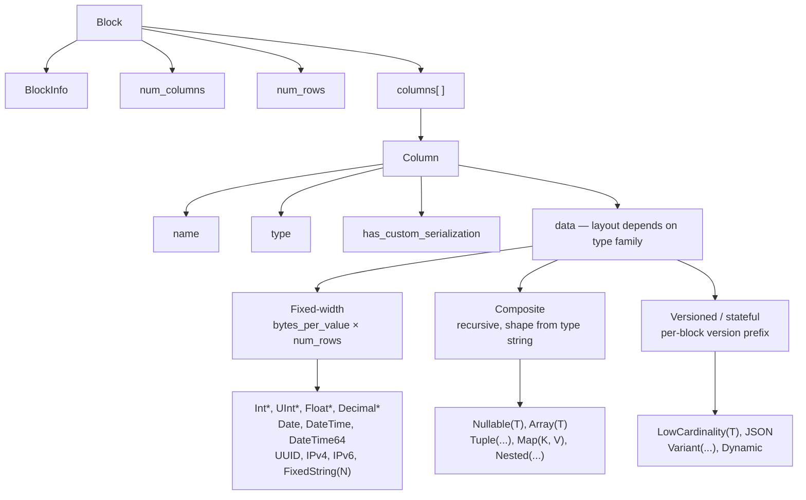
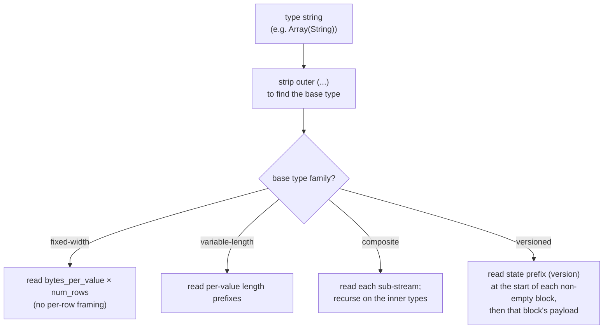
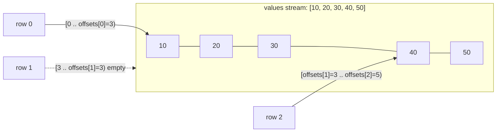
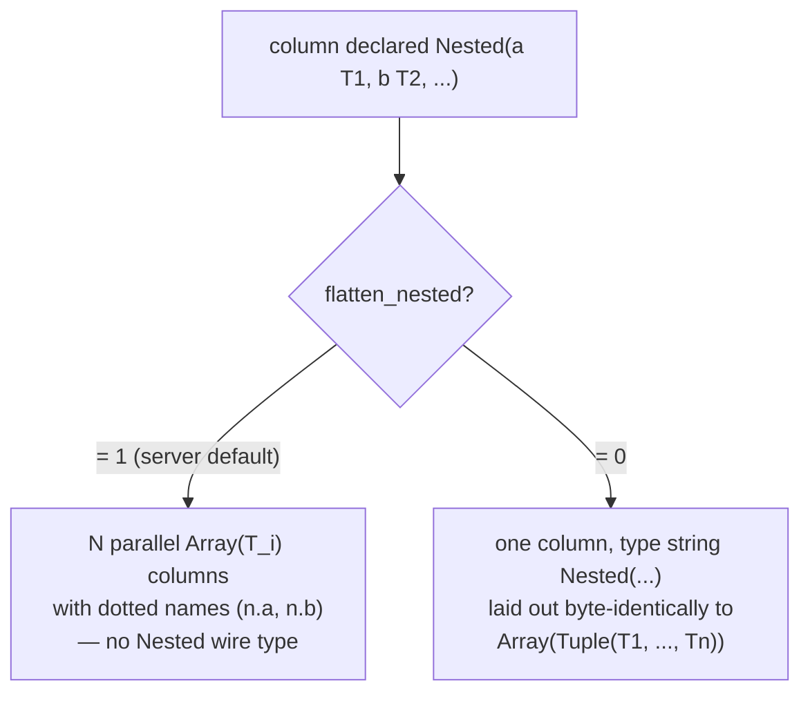
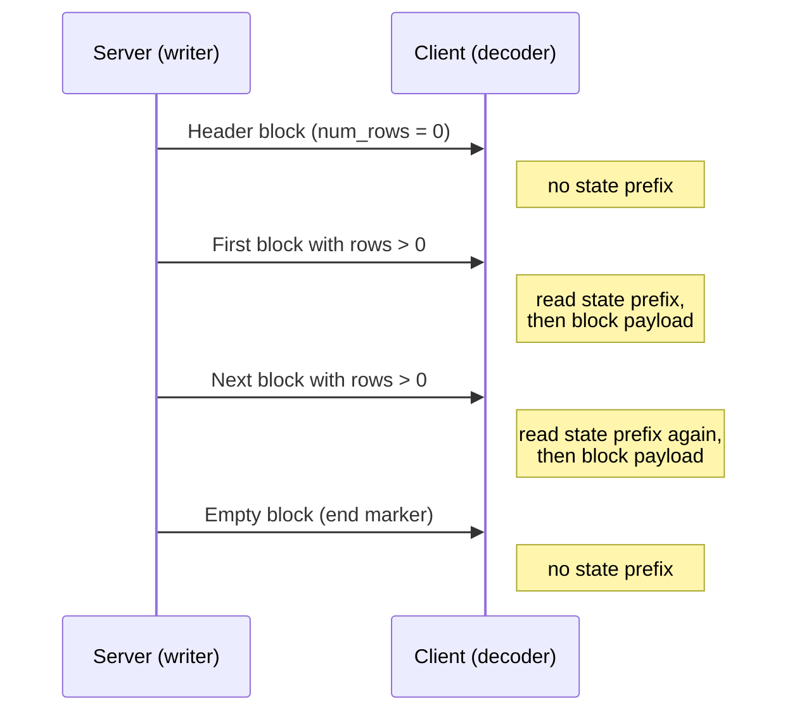
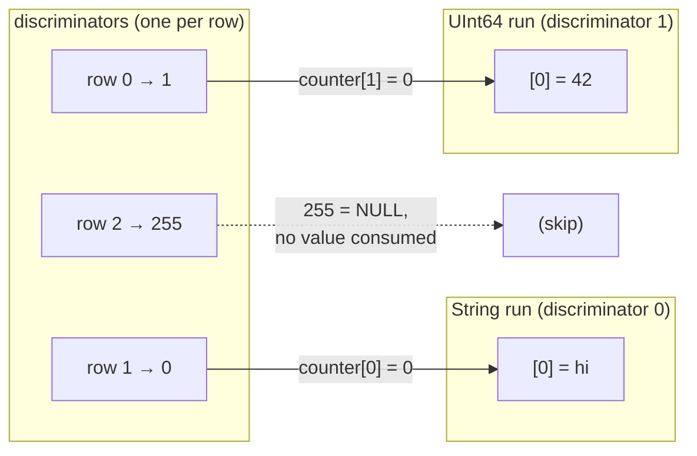
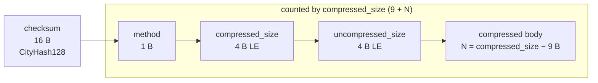

Native 형식은 ClickHouse가 표 형식 데이터를 전송할 때 사용하는 컬럼형 wire 형식입니다. 이 형식은 다음과 같은 여러 위치에서 사용됩니다.

* [native TCP protocol](/ko/reference/interfaces/specs/NativeProtocol)의 `Data`, `Totals`, `Extremes`, `Log`, `ProfileEvents` 패킷 본문에 사용됩니다 (`TableColumns` 패킷은 Native 블록이 **아닙니다**. 이 패킷은 2개의 바이너리 문자열을 전달하므로, 해당 레이아웃은 [native protocol spec](/ko/reference/interfaces/specs/NativeProtocol)에 속합니다);
* HTTP를 통한 `SELECT ... FORMAT Native`의 출력;
* `INTO OUTFILE ... FORMAT Native`로 작성한 파일 내보내기;
* 서버 간 복제 payload.

이 페이지에서는 블록 내부 바이트, 즉 컬럼형 payload와 이를 구성하는 컬럼별 데이터 타입 인코딩을 설명합니다. 패킷 프레이밍, 연결 상태, 버전 협상은 [native protocol specification](/ko/reference/interfaces/specs/NativeProtocol)에서 다룹니다.

여러 바이트로 구성된 모든 정수 필드는 리틀 엔디언입니다. 부호 있는 정수는 2의 보수 표현을 사용합니다.

<Tip>
  사용자용 `Native` 형식 소개(`curl` 예시 포함)는 [Native 형식 page](/ko/reference/formats/Native)를 참조하십시오. 이 사양은 더 저수준의 wire 참고 문서입니다.
</Tip>

<div id="overview">
  ## 개요
</div>

wire를 통해 행을 전달하는 모든 것은 **블록**입니다. **블록**은 컬럼 단위로 저장된 행으로 이루어진 자체 설명형 청크입니다. 먼저 1번 컬럼의 모든 값이 오고, 그다음 2번 컬럼의 모든 값이 오며, 이런 식으로 이어집니다. **블록**에는 쿼리에서 참조하는 컬럼만 포함되며, 전체 테이블이 담기는 일은 없습니다.

컬럼의 `data`는 해당 타입이 속한 *family*에 따라 배치됩니다. 디코더 복잡도가 낮은 것부터 높은 것 순서로, *family*는 다음과 같습니다.



* **고정 폭(Fixed-width)** 타입은 `data`를 행별 프레이밍 없이 `bytes_per_value × num_rows` 크기의 raw bytes로 배치합니다.
* **복합(Composite)** 타입(`Nullable`, `Array`, `Tuple`, `Map`, `Nested`)은 타입 문자열만으로 완전히 도출할 수 있는 재귀적 구조를 가지며, 버전 접두사도 없고 블록 간 상태도 없습니다.
* **버전 지정 / 상태 유지(Versioned / stateful)** 타입(`LowCardinality`, `JSON`, `Variant`, `Dynamic`)은 비어 있지 않은 각 블록의 시작 부분에 serialization-version/state 접두사를 둡니다. `Native` wire에서는 이 접두사와 모든 딕셔너리가 **블록별**입니다 — 즉, 이 포맷은 블록 *간* 상태를 전달하지 않습니다(작성기는 모든 블록마다 새로운 serialization state를 생성하고 `low_cardinality_max_dictionary_size = 0`으로 설정합니다). 블록 간 상태는 Native wire 레이아웃이 아니라 MergeTree의 온디스크 관련 사항입니다.

<div id="wire-primitives">
  ## Wire 기본 타입
</div>

Native 형식은 4가지 기본 인코딩을 기반으로 합니다.

| Primitive       | Size                 | Description                  |
| --------------- | -------------------- | ---------------------------- |
| VarUInt         | 1–10 B               | LEB-128 가변 길이 부호 없는 정수       |
| Fixed-width int | 1, 2, 4, 8, 16, 32 B | 리틀 엔디언, 부호 있는 정수에는 2의 보수를 사용 |
| String          | variable             | VarUInt 길이 프리픽스 + raw bytes  |
| Bool            | 1 B                  | `0x00` = false, 0이 아니면 true  |

<div id="varuint">
  ### VarUInt
</div>

LEB-128 인코딩을 사용하는 가변 길이 부호 없는 정수입니다. 각 바이트는 0–6 위치에 7개의 데이터 비트, 7 위치에 1개의 연속 비트를 포함합니다. 뒤에 바이트가 더 있으면 연속 비트는 `1`이고, 마지막 바이트에서는 `0`입니다.

| 값 범위            | 바이트   |
| --------------- | ----- |
| 0 – 127         | 1     |
| 128 – 16383     | 2     |
| 16384 – 2097151 | 3     |
| UInt64 전체 범위    | 최대 10 |

값 `300`의 인코딩:

```text
300 = 0b100101100

Byte 0: 0xAC = 0b10101100   (data: 0101100, continuation: 1)
Byte 1: 0x02 = 0b00000010   (data: 0000010, continuation: 0)
```

바이트 `0xAC 0x02`를 디코딩하면 다음과 같습니다.

```text
Byte 0: data = 0x2C, continuation = 1 → accumulator = 0x2C, shift = 7
Byte 1: data = 0x02, continuation = 0 → accumulator = (0x02 << 7) | 0x2C = 300
```

<div id="fixed-width-integers">
  ### 고정 길이 정수
</div>

| 유형      | 바이트 | 인코딩                   |
| ------- | --- | --------------------- |
| UInt8   | 1   | 원시 바이트                |
| UInt16  | 2   | 리틀 엔디언                |
| UInt32  | 4   | 리틀 엔디언                |
| UInt64  | 8   | 리틀 엔디언                |
| UInt128 | 16  | 리틀 엔디언                |
| UInt256 | 32  | 리틀 엔디언                |
| Int8    | 1   | 원시 바이트, 2의 보수         |
| Int16   | 2   | 리틀 엔디언, 2의 보수         |
| Int32   | 4   | 리틀 엔디언, 2의 보수         |
| Int64   | 8   | 리틀 엔디언, 2의 보수         |
| Int128  | 16  | 리틀 엔디언, 2의 보수         |
| Int256  | 32  | 리틀 엔디언, 2의 보수         |
| Float32 | 4   | IEEE 754 단정밀도, 리틀 엔디언 |
| Float64 | 8   | IEEE 754 배정밀도, 리틀 엔디언 |

예를 들어, UInt32 값 `1`은 `01 00 00 00`으로 인코딩되고, Int32 값 `-1`은 `FF FF FF FF`로 인코딩됩니다.

<div id="string">
  ### String
</div>

길이 정보가 앞에 붙는 바이트 시퀀스:

```text
[VarUInt: byte_length] [byte_length bytes: raw value]
```

바이트 시퀀스는 유효한 UTF-8일 필요가 없습니다. 빈 문자열은 단일 `0x00` 바이트로 인코딩되며, 문자열에는 중간에 포함된 NUL을 비롯해 어떤 바이트 값이든 들어갈 수 있습니다. 문자열 `"ab"`는 `02 61 62`로 인코딩됩니다. 디코딩하려면 먼저 VarUInt 길이(`2`)를 읽은 다음, 그 길이만큼 바이트를 읽으십시오.

<div id="bool">
  ### Bool
</div>

단일 바이트입니다. `0x00`은 false이고, 0이 아닌 값은 모두 true입니다(관례적으로 `0x01`).

<div id="block-and-column-structure">
  ## 블록 및 컬럼 구조
</div>

<div id="block-wire-layout">
  ### 블록 wire 레이아웃
</div>

```text
[BlockInfo]               metadata (only on the TCP Data-packet path; see below)
[VarUInt: num_columns]    number of columns in this block
[VarUInt: num_rows]       number of rows in this block
[Column × num_columns]    column entries, omitted when num_columns = 0
```

`BlockInfo` 접두사의 포함 여부는 채널에 따라 달라집니다. writer가 *revision*을 매개변수로 사용하기 때문입니다.

* **native TCP protocol**에서는 서버가 연결 시 협상된 revision으로 블록을 기록합니다(이 릴리스에서 `DBMS_TCP_PROTOCOL_VERSION`은 큰 값인 `54485`입니다). `BlockInfo`는 해당 revision이 0보다 큰 경우 항상 기록되며, 실제 연결에서는 언제나 이 조건이 성립합니다. 각 컬럼의 `has_custom_serialization` 바이트([column wire layout](#column-wire-layout) 참고)는 revision `54454` 이상에서 기록됩니다.
* `Native` *출력 형식* — HTTP를 통한 `SELECT ... FORMAT Native`, `INTO OUTFILE ... FORMAT Native`, 그리고 `clickhouse-client`가 생성하는 `Native` 포맷 — 은 *기본적으로* revision `0`으로 직렬화됩니다. revision `0`에서는 `BlockInfo` 접두사와 `has_custom_serialization` 바이트가 모두 생략되므로, 블록은 `num_columns`, `num_rows`, 그리고 컬럼만으로 구성됩니다.

  HTTP에서는 이 revision이 고정값이 아닙니다. 클라이언트는 `?client_protocol_version=<n>` 쿼리 매개변수로 이 값을 높일 수 있으며, 서버는 그 값을 응답의 직렬화 revision으로 사용합니다.

  값이 충분히 크면 HTTP 출력에도 TCP 경로와 마찬가지로 `BlockInfo` 접두사(revision이 `0`보다 클 때마다 기록됨)와 `has_custom_serialization` 바이트(revision `54454` 이상에서 기록됨)가 포함됩니다. 따라서 클라이언트는 모든 HTTP `FORMAT Native` payload가 revision `0`이라고 가정해서는 안 됩니다.

즉, 이 섹션에서 `BlockInfo` 접두사로 시작하는 바이트 예시는 TCP Data 패킷의 payload를 설명합니다. 동일한 쿼리를 `FORMAT Native`로 실행하면, 그 옆에 표시된 더 짧은 형식이 생성됩니다.

<div id="blockinfo">
  ### BlockInfo
</div>

BlockInfo는 여러 필드로 이루어진 시퀀스이며, 각 필드 앞에는 VarUInt 필드 ID가 오고 필드 ID가 `0`이면 종료됩니다. wire 형식은 **self-describing**하지 않습니다. 즉, 필드 ID 자체에는 값의 길이나 유형 정보가 들어 있지 않으므로, 리더는 마주칠 수 있는 각 필드 ID의 유형을 미리 알고 있어야 합니다. ClickHouse의 자체 리더는 인식할 수 없는 필드 ID를 손상으로 간주하고 예외(`UNKNOWN_BLOCK_INFO_FIELD`)를 발생시킵니다. 전방 호환성은 대신 프로토콜 revision으로 처리됩니다. 송신자는 협상된 revision이 해당 필드의 최소 revision 이상일 때만 그 필드를 기록하므로, 더 오래된 수신기는 자신이 알지 못하는 필드를 보지 않게 됩니다.

| Field ID | Field                            | 유형            | 최소 revision | 설명                                                                     |
| -------- | -------------------------------- | ------------- | ----------- | ---------------------------------------------------------------------- |
| 1        | is&#95;overflows                 | UInt8         | 0           | GROUP BY에서 생성된 오버플로우 블록입니다. 오버플로우 블록이 아니면 `0`입니다.                      |
| 2        | bucket&#95;number                | Int32         | 0           | 집계 버킷입니다. 버킷으로 구분되지 않은 블록이면 `-1`입니다.                                   |
| 3        | out&#95;of&#95;order&#95;buckets | List of Int32 | 54480       | 분산 집계 중 지연된 버킷입니다. VarUInt 개수 뒤에 해당 개수만큼의 `Int32` 값이 이어지는 방식으로 인코딩됩니다. |
| 0        | (종료자)                            | —             | —           | BlockInfo의 끝입니다. 항상 필요합니다.                                             |

필드 `1`과 `2`의 최소 revision은 `0`이므로 `BlockInfo`가 기록되는 경우 항상 포함됩니다. 필드 `3`은 revision `54480` 이상에서만 기록됩니다. 일반적인 경우(revision이 `54480` 미만일 때)의 wire 레이아웃은 다음과 같습니다.

```text
[VarUInt: 1] [UInt8: is_overflows]
[VarUInt: 2] [Int32: bucket_number]
[VarUInt: 0]
```

<div id="column-wire-layout">
  ### 컬럼 wire 레이아웃
</div>

하나의 블록 안에는 Column이 `num_columns`번 나타납니다.

| # | Field                            | Type                             | Condition                               | Description                                                                                                                                                                                                        |
| - | -------------------------------- | -------------------------------- | --------------------------------------- | ------------------------------------------------------------------------------------------------------------------------------------------------------------------------------------------------------------------ |
| 1 | name                             | String                           | always                                  | 컬럼 이름                                                                                                                                                                                                              |
| 2 | type                             | String *or* binary type encoding | always                                  | 기본적으로는 ClickHouse 타입 문자열(예: `"UInt64"`, `"Array(String)"`)입니다. `output_format_native_encode_types_in_binary_format = 1`일 때는 binary type encoding이 사용됩니다(아래 참고).                                                    |
| 3 | has&#95;custom&#95;serialization | UInt8                            | feature `CUSTOM_SERIALIZATION` (v54454) | `0` = 기본값, `1` = 사용자 정의(`kind&#95;stack`이 뒤따름)                                                                                                                                                                     |
| 4 | kind&#95;stack                   | bytes                            | when field 3 = `1`                      | 기본값이 아닌 직렬화(희소 등)을 나타내는 UInt8 enum 바이트 1개입니다(아래 참고). 값이 `COMBINATION`이면 VarUInt 개수 값 뒤에 그 수만큼 추가 kind 바이트가 이어집니다. `Tuple`(및 요소 수준 직렬화 정보가 있는 다른 복합 타입)의 경우 payload는 재귀적입니다. 자세한 내용은 아래를 참조하세요. |
| 5 | data                             | bytes                            | always                                  | 모든 `num_rows` 행의 컬럼 값입니다. 레이아웃은 타입별로 다릅니다. [데이터 타입](#data-types)을 참조하세요. 희소 컬럼은 아래를 참조하세요.                                                                                                                         |

디코더는 `type` 문자열을 기준으로 분기합니다. 타입 문자열에는 괄호 안에 매개변수가 포함되는 경우가 많으므로, 디코더는 기본 타입을 찾기 위해 `(...)` 접미사를 제거한 다음 크기, scale 또는 내부 타입 판단에 필요한 매개변수를 파싱합니다. 중첩 타입이 포함된 매개변수 목록(예: `Array` 안의 `Tuple`)을 파싱하려면 `,`를 기준으로 단순 분할해서는 안 되며, 괄호 중첩을 추적하는 깊이 인식형 쉼표 분리기가 필요합니다.

<Info>
  **바이너리 타입 인코딩**

  `type` 필드는 기본 모드에서만 텍스트 `String`입니다. 쿼리 설정 `output_format_native_encode_types_in_binary_format = 1`이 설정되면 이 필드는 대신 **binary type encoding**이 됩니다. 이는 [데이터 타입 binary encoding](/ko/reference/data-types/data-types-binary-encoding)에 문서화된 것과 동일한 태그 기반 인코딩이며, 평탄화된 `Dynamic` 타입 목록도 타입별 이름에 동일한 binary encoding을 사용합니다. 필드 2를 항상 길이 접두사가 있는 문자열로 읽는 디코더는 첫 번째 바이너리 타입 태그를 문자열 길이로 잘못 해석해 동기화가 어긋나므로, 스트림이 어떤 모드를 사용하는지 반드시 알고 있어야 합니다.
</Info>



<div id="kind-stack-and-sparse-encoding">
  #### kind_stack 및 희소 인코딩
</div>

`kind_stack` 바이트는 컬럼별 비기본 직렬화 방식을 나타냅니다.

| Byte   | Name                         | Meaning                                        | Wire impact on `data`                                        |
| ------ | ---------------------------- | ---------------------------------------------- | ------------------------------------------------------------ |
| `0x00` | DEFAULT                      | 기본 직렬화                                         | `has_custom = 0`과 동일                                         |
| `0x01` | SPARSE                       | 희소 직렬화(v54465+)                                | 오프셋 스트림 + 비기본값, 아래 참조                                        |
| `0x02` | DETACHED                     | 병렬 block 마샬링(v54478+)에 의해 `ColumnBLOB`로 감싸진 컬럼 | 사전 마샬링된 blob: `VarUInt size` + 해당 길이의 바이트, 아래 참조             |
| `0x03` | DETACHED&#95;OVER&#95;SPARSE | `ColumnBLOB`로 감싸진 희소 컬럼                        | `DETACHED`와 동일한 blob payload, 아래 참조                          |
| `0x04` | REPLICATED                   | 반복되는 값에 대한 딕셔너리 형태(v54482+)                    | 인덱스 스트림 + 조밀하게 인코딩된 요소 값, 아래 참조                              |
| `0x05` | COMBINATION                  | 다중 kind 스택                                     | 뒤에 VarUInt `count`와 `count`개의 추가 kind 바이트가 이어짐 — 아래 참고 사항 참조 |

**`COMBINATION` payload는 다른 enum을 사용합니다.** 위의 5개 행은 *compact* 1바이트 코드입니다. `COMBINATION` (`0x05`)은 여기에 해당하지 않는 모든 스택을 표현하는 일반 escape이며, 뒤에 `VarUInt` `count`와 이어서 `count`개의 1바이트 항목이 옵니다. 이 항목들은 표의 compact 코드가 **아니라** 원시 `ISerialization::Kind` 값입니다.

| Byte   | Nested `Kind` |
| ------ | ------------- |
| `0x00` | DEFAULT       |
| `0x01` | SPARSE        |
| `0x02` | DETACHED      |
| `0x03` | REPLICATED    |

바이트 값은 compact 코드와 다릅니다. `REPLICATED`는 이 중첩 enum에서는 `0x03`이지만 compact 코드에서는 `0x04`이며, `DETACHED_OVER_SPARSE` 항목은 없습니다 — 이 조합은 `SPARSE`, `DETACHED`라는 두 개의 연속된 항목으로 나타납니다. 중첩 바이트에 대해서도 compact 표를 계속 사용하는 디코더는 `0x03`/`0x04`를 잘못 매핑하여 동기화가 어긋나게 됩니다.

`count`는 모든 스택의 시작에 있는 선행 `DEFAULT` 항목을 **포함한 전체 스택 길이**입니다. compact 코드는 이미 모든 1항목 및 2항목 스택을 포괄하므로, `COMBINATION`의 `count`는 항상 최소 3입니다.

**`Tuple` 컬럼의 재귀적 `kind_stack`.** 위의 `kind_stack` payload는 한 컬럼 자체의 직렬화 정보에 해당하는 바이트(또는 `COMBINATION` 시퀀스)입니다. `Tuple`은 `SerializationInfoTuple`을 가지며, 먼저 tuple 자체의 *고유한* kind-stack payload를 기록한 뒤 각 요소에 대해 순서대로 전체 kind-stack payload를 하나씩 기록합니다. 디코더도 동일한 재귀 구조로 이를 다시 읽습니다. 따라서 `Tuple(A, B, C)`에서 field-4 바이트는 `[tuple_kind][A_kind][B_kind][C_kind]`이며, 어떤 요소가 다시 복합 타입이면 해당 요소 payload 자체도 재귀적입니다. tuple 자체의 정보 *또는 어느 요소의* 정보라도 비기본이면 `has_custom_serialization` 바이트(field 3)가 설정되므로, 특별한 요소가 희소, 복제된 또는 분리된 것뿐인 `Tuple`도 kind-stack payload를 트리거합니다. `Tuple`에 대해 맨 앞의 enum 바이트 하나만 읽는 디코더는 너무 일찍 멈추게 되며, 남아 있는 요소 kind 바이트를 컬럼 데이터로 잘못 읽게 됩니다.

**희소 wire 형식.** `kind_stack = 0x01`이면 컬럼 `data`는 하나의 공유 TCP 스트림에 연속해서 기록되는 두 개의 스트림으로 구성됩니다.

1. **오프셋 스트림** — `VarUInt` 시퀀스입니다. 각 값 `v`는 다음 중 하나입니다.
   * 위치 62의 상위 비트가 꺼져 있는 `v`: `(v & 0x3FFFFFFFFFFFFFFF)` = 다음 명시적 비기본값 앞에 있는 기본 위치의 수입니다. 해당 비기본 위치는 `cursor + group_size`이며, 여기서 `cursor`는 현재 누적 위치입니다. 이후 `cursor`는 `group_size + 1`만큼 증가합니다.
   * 비트 62가 설정된 `v` (`END_OF_GRANULE_FLAG`): 플래그를 제거한 값 = 마지막 비기본값 뒤에 있는 후행 기본 위치의 수입니다. 이는 block에 대한 오프셋 스트림의 끝을 표시합니다.
2. **값 스트림** — 내부 유형으로 조밀하게 인코딩된 `count`개의 비기본값이며, 여기서 `count`는 위에서 읽은 EOG가 아닌 `VarUInt`의 개수입니다.

디코더는 명시되지 않은 모든 위치를 내부 타입의 기본값(정수와 부동소수점은 `0`, `String`은 `""`, `Date`는 `0`일 등)으로 채워, `num_rows`개 항목으로 이루어진 조밀한 컬럼을 재구성합니다.

희소 `Nullable(T)` 컬럼은 `Nullable(T)`의 기본값이 **NULL**이므로 특수한 경우입니다. 희소 인코딩에서는 일반적인 `Nullable` null-map 스트림을 완전히 생략합니다. 오프셋 스트림은 기본값이 아닌 위치, 즉 NULL이 아닌 위치를 식별하고, values 스트림은 그 NULL이 아닌 값만 `T` 타입으로 조밀하게 저장하며, 명시되지 않은 모든 위치는 NULL로 재구성됩니다. 따라서 디코더는 values 스트림에서 null map을 *찾아서는 안 되며*, 빈 구간을 값이 존재하는 `0`으로 *채워서도 안 됩니다*. 대신 NULL로 채웁니다.

**복제된 wire 형식.** `kind_stack = 0x04`일 때 컬럼 `data`는 딕셔너리입니다. 즉, 서로 다른 요소 값의 목록과 각 행에서 그 목록을 가리키는 인덱스로 구성됩니다(`LowCardinality`와 동일한 lookup 형태). 내부 타입 자체에 버전 정보가 있는 경우(예: `LowCardinality(T)`)에는 상태 접두사가 인덱스 스트림보다 **먼저** 기록됩니다. 즉, 복제된 직렬화는 `num_rows`를 기록하기 전에 접두사 단계를 내부 타입에 먼저 위임합니다. 접두사가 비어 있는 내부 타입(리프 타입과 일반 복합 타입)은 여기에서 바이트를 추가하지 않습니다.

```text
[inner type's state prefix]              empty for leaf inners; e.g. LowCardinality version (Int64 = 1)
[VarUInt num_rows]
[UInt8  size_of_indexes_type]            width of each index: 1, 2, 4, or 8 bytes
[indexes: num_rows × size_of_indexes_type bytes]
[VarUInt num_elements]
[elements: num_elements dense inner-type values]
```

디코더는 각 출력 행 `i`에 대해 `elements[indexes[i]]`를 선택해 밀집 컬럼을 재구성합니다. 복합 내부 타입은 재귀적으로 처리됩니다. 요소 목록은 먼저 내부 타입에서 구체화된 후 인덱싱됩니다. 지원되는 내부 타입에는 리프 타입, `Nullable(T)`, `Array(T)`, `Tuple(...)`, `Map(K, V)`, `Nested(...)`(각 필드는 `Array`처럼 확장됨), `LowCardinality(T)`(공유 딕셔너리는 유지되고 각 요소별 키만 인덱싱됨)가 포함됩니다.

**분리된 wire 형식.** `DETACHED` (`0x02`)와 `DETACHED_OVER_SPARSE` (`0x03`)는 실제로 wire를 통해 전송됩니다. 즉, 순전히 내부 전용은 아닙니다. TCP 경로에서는 압축이 활성화되어 있고 협상된 리비전이 `DBMS_MIN_REVISON_WITH_PARALLEL_BLOCK_MARSHALLING`(v54478) 이상이면, 컬럼은 다음 3단계를 거칩니다.

1. 적격한 각 컬럼(`const`가 아니고, `Tuple`이 아니며, 블록에 2개 이상의 행이 있는 경우)은 메인 스레드 밖에서 이미 마샬링되고 압축된 컬럼을 담는 `ColumnBLOB`로 래핑됩니다.
2. `DETACHED`가 래핑된 컬럼의 kind stack에 추가됩니다.
3. 컬럼 `data`는 `VarUInt` blob 크기를 기록한 뒤, 바로 이어서 정확히 그 크기만큼의 blob 바이트를 기록합니다.

래핑된 컬럼이 희소 컬럼이었다면 해당 stack은 `{DEFAULT, SPARSE, DETACHED}`가 되며, 이는 `DETACHED_OVER_SPARSE`로 직렬화됩니다. 이러한 컬럼을 디코딩하는 클라이언트는 blob 길이와 바이트를 읽은 다음, blob의 압축을 해제해 내부 컬럼 payload를 복원합니다(압축에 대해서는 [`ColumnBLOB` 참고](#compression-negotiation)를 참조하십시오).

<div id="block-variants">
  ### 블록 변형
</div>

모든 Data 계열 패킷은 동일한 Block wire 형식을 사용합니다. 변형 간 차이는 컬럼 수와 행 수뿐입니다:

| 변형    | num&#95;columns | num&#95;rows | 용도                                             |
| ----- | --------------- | ------------ | ---------------------------------------------- |
| 헤더 블록 | N &gt; 0        | 0            | 결과 스키마(schema)(컬럼 이름 + 타입)를 알립니다.              |
| 결과 블록 | N &gt; 0        | M &gt; 0     | 실제 결과 행입니다.                                    |
| 빈 블록  | 0               | 0            | 센티널 — 클라이언트 측에서는 입력 종료를, 서버 측에서는 경계 마커를 나타냅니다. |

<div id="byte-level-examples">
  ### 바이트 수준 예시
</div>

이 섹션의 모든 예시는 **TCP 데이터 패킷 경로(TCP Data-packet path)** 에서 가져왔으므로 `BlockInfo` 접두사와 `has_custom_serialization` 바이트를 포함합니다. `FORMAT Native`에서는 동일한 블록이 더 짧으며, 필요할 때는 이에 대응하는 축약형도 함께 제시합니다.

빈 블록(`BlockInfo` 포함), 총 8바이트:

```text
01 00                   BlockInfo: field_id=1, is_overflows=0
02 FF FF FF FF          BlockInfo: field_id=2, bucket_number=-1
00                      BlockInfo terminator
00                      num_columns = 0
00                      num_rows = 0
```

`SELECT 1`의 header 블록은 이름이 `"1"`이고 유형이 `UInt8`인 컬럼 1개와 행 0개를 나타냅니다. 프로토콜 ≥ 54454에서는 `has_custom_serialization` 바이트가 포함됩니다:

```text
01 00                   BlockInfo: is_overflows = 0
02 FF FF FF FF          BlockInfo: bucket_number = -1
00                      BlockInfo terminator
01                      num_columns = 1
00                      num_rows = 0
01 "1"                  Column[0].name = "1"
05 "UInt8"              Column[0].type = "UInt8"
00                      Column[0].has_custom_serialization = 0
                        Column[0].data: no bytes (num_rows = 0)
```

행이 1개인 같은 쿼리의 결과 블록:

```text
01 00                   BlockInfo: is_overflows = 0
02 FF FF FF FF          BlockInfo: bucket_number = -1
00                      BlockInfo terminator
01                      num_columns = 1
01                      num_rows = 1
01 "1"                  Column[0].name = "1"
05 "UInt8"              Column[0].type = "UInt8"
00                      Column[0].has_custom_serialization = 0
01                      Column[0].data: one UInt8 byte = 1
```

`FORMAT Native`(revision `0`)에서는 동일한 결과 블록에 `BlockInfo`와 `has_custom_serialization` 바이트가 없으므로, `SELECT 1 FORMAT Native`는 11바이트입니다:

```text
01                      num_columns = 1
01                      num_rows = 1
01 "1"                  Column[0].name = "1"
05 "UInt8"              Column[0].type = "UInt8"
01                      Column[0].data: one UInt8 byte = 1
```

(헤더만 있는 블록처럼 0행 결과는 `FORMAT Native`에서는 바이트를 전혀 생성하지 않습니다. 출력 형식은 빈 블록을 내보내지 않습니다.)

<div id="data-types">
  ## 데이터 타입
</div>

이 섹션에서는 컬럼의 `data` 안에 `Native` 형식이 담을 수 있는 타입의 wire 인코딩을 설명합니다. 이러한 타입은 디코더 복잡도가 증가하는 순서에 따라 4개의 계열로 나뉩니다. `AggregateFunction(func, ...)`와 `QBit(T, N)`의 두 타입은 유효한 `Native` 컬럼 타입이지만, 여기서 다루는 범위를 벗어나는 함수별 또는 타입별 payload를 가집니다. 따라서 아래에서는 별칭으로 오해될 수 있는 위치에서 이들을 별도로 언급합니다.

| Family        | Section                            | Streams per column | Cross-block state                                    |
| ------------- | ---------------------------------- | ------------------ | ---------------------------------------------------- |
| 고정 폭          | [고정 폭 타입](#fixed-width-types)      | 하나                 | 없음                                                   |
| 가변 길이         | [가변 길이 타입](#variable-length-types) | 하나                 | 없음                                                   |
| 복합(고정 shape)  | [복합 타입](#composite-types)          | 여러 개               | 없음                                                   |
| 버전 지정 / 상태 유지 | [버전 지정 타입](#versioned-types)       | 여러 개               | Native wire에는 없음 — 블록별 상태 prefix가 있으며, 각 블록마다 새로 시작됨 |

<div id="fixed-width-types">
  ### 고정 폭 타입
</div>

각 값은 일정한 수의 바이트를 차지합니다. `M`개의 행이 있는 컬럼은 wire에서 정확히 `bytes_per_row × M`바이트를 차지하며, 구분자나 패딩 없이 그대로 이어서 저장됩니다.

| Type string         | Bytes per value | Logical value                                                                              | Wire encoding                                 |
| ------------------- | --------------- | ------------------------------------------------------------------------------------------ | --------------------------------------------- |
| `UInt8`             | 1               | 부호 없는 8비트 정수                                                                               | 원시 바이트                                        |
| `UInt16`            | 2               | 부호 없는 16비트 정수                                                                              | 리틀 엔디언                                        |
| `UInt32`            | 4               | 부호 없는 32비트 정수                                                                              | 리틀 엔디언                                        |
| `UInt64`            | 8               | 부호 없는 64비트 정수                                                                              | 리틀 엔디언                                        |
| `UInt128`           | 16              | 부호 없는 128비트 정수                                                                             | 리틀 엔디언                                        |
| `UInt256`           | 32              | 부호 없는 256비트 정수                                                                             | 리틀 엔디언                                        |
| `Int8`              | 1               | 부호 있는 8비트 정수, 2의 보수                                                                        | 원시 바이트                                        |
| `Int16`             | 2               | 부호 있는 16비트 정수, 2의 보수                                                                       | 리틀 엔디언                                        |
| `Int32`             | 4               | 부호 있는 32비트 정수, 2의 보수                                                                       | 리틀 엔디언                                        |
| `Int64`             | 8               | 부호 있는 64비트 정수, 2의 보수                                                                       | 리틀 엔디언                                        |
| `Int128`            | 16              | 부호 있는 128비트 정수, 2의 보수                                                                      | 리틀 엔디언                                        |
| `Int256`            | 32              | 부호 있는 256비트 정수, 2의 보수                                                                      | 리틀 엔디언                                        |
| `Float32`           | 4               | IEEE 754 단정밀도                                                                              | 리틀 엔디언                                        |
| `Float64`           | 8               | IEEE 754 배정밀도                                                                              | 리틀 엔디언                                        |
| `BFloat16`          | 2               | IEEE 754 `Float32`의 상위 16비트                                                                | 리틀 엔디언                                        |
| `Bool`              | 1               | `0x00` = false, `0x01` = true                                                              | 원시 바이트                                        |
| `Date`              | 2               | `1970-01-01`부터의 경과 일수                                                                      | 리틀 엔디언 UInt16                                 |
| `Date32`            | 4               | `1970-01-01`부터의 경과 일수 (부호 있음, 1970년 이전도 가능)                                                | 리틀 엔디언 Int32                                  |
| `DateTime`          | 4               | 초 단위 Unix timestamp                                                                        | 리틀 엔디언 UInt32                                 |
| `DateTime(tz)`      | 4               | `DateTime`와 동일하며, 시간대는 metadata입니다                                                         | 리틀 엔디언 UInt32                                 |
| `DateTime64(s)`     | 8               | 스케일 `s`의 틱(epoch 이후 `10^-s`초)                                                              | 리틀 엔디언 Int64                                  |
| `DateTime64(s, tz)` | 8               | `DateTime64(s)`와 동일하며, 시간대는 metadata입니다                                                    | 리틀 엔디언 Int64                                  |
| `Time`              | 4               | 초 단위의 부호 있는 시계 duration                                                                    | 리틀 엔디언 Int32                                  |
| `Time64(s)`         | 8               | 스케일 `s`의 틱 단위 부호 있는 시계 duration                                                            | 리틀 엔디언 Int64                                  |
| `Interval<Unit>`    | 8               | 부호 있는 개수이며, 단위는 타입 문자열에 포함됩니다                                                              | 리틀 엔디언 Int64                                  |
| `UUID`              | 16              | 128비트 식별자                                                                                  | 바이트 순서를 스왑한 LE UInt64 절반 2개([UUID](#uuid) 참조) |
| `IPv4`              | 4               | IPv4 주소                                                                                    | 리틀 엔디언 UInt32                                 |
| `IPv6`              | 16              | IPv6 주소                                                                                    | 네트워크 바이트 순서, 스왑 없음                            |
| `Enum8`             | 1               | 부호 있는 8비트(variant 인덱스)                                                                     | 원시 바이트                                        |
| `Enum16`            | 2               | 부호 있는 16비트(variant 인덱스)                                                                    | 리틀 엔디언                                        |
| `Decimal(P, S)`     | 4 / 8 / 16 / 32 | 부호 있는 정수로 표현한 `value × 10^S`; 폭은 P에 따라 달라집니다 (≤9 → 4 B, ≤18 → 8 B, ≤38 → 16 B, ≤76 → 32 B) | 리틀 엔디언 부호 있는 정수                               |

<div id="integer-types">
  #### 정수 타입
</div>

`UInt8`–`UInt256` 및 `Int8`–`Int256`은 정수 값을 직접 이진 형식으로 인코딩한 것입니다. 디코더는 `bytes_per_row × num_rows` 바이트를 읽어 타입에 따라 해석합니다.

`[1, 256, 65536]` 값을 담은 `UInt32` 컬럼:

```text
01 00 00 00              row 0: 1
00 01 00 00              row 1: 256
00 00 01 00              row 2: 65536
```

`[-1, 42]` 값을 가진 `Int32` 컬럼:

```text
FF FF FF FF              row 0: -1
2A 00 00 00              row 1: 42
```

<div id="float32-and-float64">
  #### Float32 및 Float64
</div>

표준 IEEE 754 이진 부동소수점 형식입니다. 4바이트 단정밀도(`binary32`)와 8바이트 배정밀도(`binary64`)이며, 각각 리틀 엔디언입니다. NaN, ±Infinity, ±0.0, 그리고 비정규수(subnormal)도 모두 정규화 없이 그대로 왕복 변환됩니다.

`Float32` 값 `1.5` (`0x3FC00000`):

```text
00 00 C0 3F              little-endian IEEE 754
```

`Float64` 값 `1.5` (`0x3FF8000000000000`):

```text
00 00 00 00 00 00 F8 3F  little-endian IEEE 754
```

<div id="bfloat16">
  #### BFloat16
</div>

브레인 부동소수점 포맷입니다. IEEE 754 `Float32`의 상위 16비트로, 부호 비트 1개, 지수 비트 8개, 가수 비트 7개로 이루어집니다. 각 값은 2바이트이며 리틀 엔디언으로 저장되고, 원시 16비트 패턴을 담고 있습니다. 수치 값을 복원하려면 패턴을 상위 절반에 배치하고 하위 절반을 0으로 채워(`bits << 16`을 `Float32`로 reinterpret) `Float32`로 다시 확장합니다. 이렇게 확장한 값은 `Float32`와 동일한 텍스트 포맷을 사용합니다.

`BFloat16` 값 `1.5`(패턴 `0x3FC0`, `Float32` `0x3FC00000`의 상위 절반):

```text
C0 3F                    little-endian, widens to Float32 1.5
```

<div id="bool-type">
  #### Bool
</div>

`UInt8`와 wire 호환됩니다. 행당 1바이트를 사용하며 `0x00` = false, `0x01` = true입니다. wire상의 타입 문자열은 문자 그대로 `Bool`(`UInt8`가 아님)이므로, 타입 문자열을 기준으로 디스패치하는 디코더는 이를 별도로 인식해야 합니다.

`Bool` 컬럼 `[true, false, true]`:

```text
01 00 01
```

<div id="date-and-date32">
  #### Date 및 Date32
</div>

둘 다 Unix epoch `1970-01-01`을 기준으로 날짜를 정수 일수로 인코딩합니다. 둘 다 시간 component는 포함하지 않습니다.

| 유형       | 바이트 | 인코딩           | 범위                            |
| -------- | --- | ------------- | ----------------------------- |
| `Date`   | 2   | 리틀 엔디언 UInt16 | `1970-01-01`부터 `2149-06-06`까지 |
| `Date32` | 4   | 리틀 엔디언 Int32  | 넓은 signed 범위, 1970년 이전도 가능    |

`Date` 값 `1970-01-02` (1일):

```text
01 00                    UInt16 LE = 1
```

`Date32` 값 `1900-01-01` (-25567일):

```text
21 9C FF FF              Int32 LE = -25567
```

<div id="datetime">
  #### DateTime
</div>

`UInt32`와 wire 호환됩니다. 즉, 초 단위 Unix timestamp를 나타내며 4바이트 리틀 엔디언입니다. 이 유형은 `DateTime` 또는 `DateTime('Timezone')`로 표시될 수 있습니다. 시간대는 표시 방식에만 영향을 미치며 wire 값 자체에는 포함되지 않습니다. 시간대 매개변수가 다른 두 `DateTime` 컬럼도 동일한 시점을 나타내면 동일한 바이트를 생성합니다. 디코더는 `(...)` 매개변수 접미사를 제거한 뒤 해당 컬럼을 `UInt32`로 처리합니다.

`DateTime('UTC')` 값 `2024-03-15 14:30:00 UTC` (timestamp `1710513000`):

```text
68 5B F4 65              UInt32 LE = 1710513000
```

<div id="datetime64">
  #### DateTime64(scale[, timezone])
</div>

8바이트 리틀 엔디언 Int64로, Unix epoch 이후 경과한 시간을 `10^-scale`초 단위의 틱으로 나타냅니다. `scale` 매개변수(0–9)는 타입 문자열에 포함되며 시간 단위를 결정합니다:

| Scale | Tick size | Common name |
| ----- | --------- | ----------- |
| 0     | 1초        | 초           |
| 3     | 1밀리초      | ms          |
| 6     | 1마이크로초    | µs          |
| 9     | 1나노초      | ns          |

이 타입은 `DateTime64(s)`(암시적으로 server 기본 시간대 사용) 또는 `DateTime64(s, 'TimezoneName')`(명시적 시간대, 표시 전용) 형태로 나타납니다. 음수 값은 epoch 이전의 틱을 나타냅니다.

`DateTime64(3, 'UTC')` 값 `2024-01-15 12:30:45.123 UTC` (1705321845123 ms):

```text
83 51 1A 0D 8D 01 00 00  Int64 LE = 1705321845123
```

`DateTime64(0)` 값 `2024-01-15 12:30:45 UTC` (1705321845 s):

```text
75 25 A5 65 00 00 00 00  Int64 LE = 1705321845
```

<div id="time-and-time64">
  #### Time 및 Time64(scale)
</div>

시점이 아니라 시계상의 지속 시간을 나타냅니다. `Time`은 부호 있는 초 단위 카운트로, 4바이트 리틀 엔디언 Int32입니다. `Time64(scale)`은 지정된 Decimal scale(0–9)에서의 부호 있는 틱 카운트로, 8바이트 리틀 엔디언 Int64이며 `DateTime64`와 동일한 wire 형식을 가집니다.

텍스트 형식은 `[-]HH:MM:SS[.fraction]`이지만, `DateTime`과 달리 시(hour) 필드는 24시간 단위로 **순환되지 않습니다**. 즉, 전체 시간 수를 나타내므로 23을 초과할 수 있습니다. 표시되는 크기는 `999:59:59`(`3599999`초)로 제한되며, 이보다 큰 값은 소수부를 0으로 채운 상한값(`999:59:59.000`)으로 표시됩니다. `CAST`도 저장된 값을 이 범위로 제한하지만, 산술 연산으로는 범위를 벗어난 값을 만들 수 있으며 이러한 값은 표시할 때만 제한됩니다. 이 어떤 동작도 wire 바이트에는 영향을 주지 않으며, wire 바이트는 일반적인 부호 있는 정수입니다.

`Time` 값 `45296` (`12:34:56`):

```text
F0 B0 00 00              Int32 LE = 45296
```

`Time64(3)` 값 `45296789`틱 (`12:34:56.789`):

```text
95 2C B3 02 00 00 00 00  Int64 LE = 45296789
```

<Note>
  `Time` 및 `Time64`는 실험적 기능이며, server에서 `allow_experimental_time_time64_type = 1`을 설정해야 합니다.
</Note>

<div id="interval">
  #### 인터벌
</div>

`Interval<Unit>` — `IntervalSecond`, `IntervalMinute`, `IntervalHour`, `IntervalDay`, `IntervalWeek`, `IntervalMonth`, `IntervalQuarter`, `IntervalYear`, `IntervalNanosecond` 등입니다. 모든 단위는 동일한 wire 인코딩을 사용합니다. 개수는 부호 있는 8바이트 리틀 엔디언 Int64로 인코딩됩니다. 단위 정보는 **오직** 타입 문자열에만 있으며, wire 바이트나 텍스트 표현에는 영향을 주지 않습니다. 텍스트 표현은 꾸밈없는 정수입니다. 모든 단위는 단일 디코더 경로로 처리됩니다.

`IntervalDay` 값 `5`:

```text
05 00 00 00 00 00 00 00  Int64 LE = 5
```

<div id="uuid">
  #### UUID
</div>

값당 16바이트입니다. wire 인코딩은 정규 16바이트 빅 엔디언 형식이 **아니며**, 각 8바이트 절반의 바이트 순서가 각각 독립적으로 뒤집힙니다.

논리적 모델은 정규 텍스트 형식 `xxxxxxxx-xxxx-xxxx-xxxx-xxxxxxxxxxxx`를 사용하는 128비트 식별자이며, 여기서 바이트는 관례적으로 빅 엔디언으로 표기됩니다. wire 모델은 이 16개의 정규 바이트를 두 개의 8바이트 절반으로 나눈 다음, 각 절반을 리틀 엔디언으로 기록합니다:

* Wire 바이트 0..7 = 정규 바이트 0..7을 역순으로 뒤집은 값
* Wire 바이트 8..15 = 정규 바이트 8..15를 역순으로 뒤집은 값

UUID `550e8400-e29b-41d4-a716-446655440000`:

```text
Canonical bytes (16):    55 0E 84 00 E2 9B 41 D4  A7 16 44 66 55 44 00 00

Wire bytes:
D4 41 9B E2 00 84 0E 55  high half byte-reversed
00 00 44 55 66 44 16 A7  low half byte-reversed
```

nil UUID(모든 값이 0인 UUID)는 두 표현에서 동일하게 나타납니다.

<div id="ipv4-and-ipv6">
  #### IPv4 및 IPv6
</div>

서로 관련되어 있지만 인코딩 방식이 다른 두 가지 주소 타입입니다.

`IPv4`는 4바이트이며, 정규 32비트 주소(`a.b.c.d`의 값 `(a << 24) | (b << 16) | (c << 8) | d`)를 담는 리틀 엔디언 UInt32로 인코딩됩니다. wire 바이트는 네트워크 바이트 순서를 뒤집은 것입니다.

`192.168.1.10` (정규 32비트 값 `0xC0A8010A`):

```text
0A 01 A8 C0              Little-endian UInt32
```

`IPv6`는 16바이트이며, 스왑 없이 **network byte order 그대로** 기록됩니다. 바이트 순서는 `inet_pton(AF_INET6, ...)`와 동일합니다.

`2001:db8::1`:

```text
20 01 0D B8 00 00 00 00  network bytes 0..7
00 00 00 00 00 00 00 01  network bytes 8..15
```

이 비대칭성은 의도된 것입니다. IPv4는 산술 연산과 간결한 범위 쿼리를 위해 `u32`로 저장되며, IPv6는 대부분의 네트워킹 API에서 일반적으로 사용하는 네트워크 바이트 순서 형식을 유지합니다.

<div id="enum8-and-enum16">
  #### Enum8 and Enum16
</div>

각각 `Int8` 및 `Int16`과 wire 호환됩니다. 행당 1바이트 또는 2바이트를 사용하며, 16비트 variant는 2의 보수 리틀 엔디언 형식을 사용합니다. 전체 variant 매핑은 타입 문자열에 포함됩니다:

```text
Enum8('active' = 1, 'inactive' = 2, 'banned' = -1)
Enum16('a' = 1, 'b' = 30000)
```

디코더는 `(...)` 매개변수 접미사를 제거한 뒤 `Int8` / `Int16`으로 디스패치할 수 있습니다. wire 바이트는 단지 정수 인덱스일 뿐입니다. 레이블을 표시하는 클라이언트는 타입 문자열에서 `'name' = value` 맵을 파싱해 컬럼과 함께 유지합니다. 정수값만으로는 레이블을 복원할 수 없습니다. 텍스트 기반 출력은 인덱스가 아니라 레이블(`active`)을 렌더링하며, enum이 복합 타입 내부에 중첩된 경우에는 작은따옴표로 감싼 형태(`'active'`)로 표시합니다. 맵은 정수 컬럼만으로 복원할 수 없으므로, `Array(Enum8(...))` 또는 `Map(Enum16(...), V)` 같은 중첩 enum의 경우 이를 유지해야 합니다.

`Enum8('active' = 1, 'inactive' = 2)` 컬럼 `[active, inactive, active]`:

```text
01 02 01
```

`30000`인 `Enum16(...)` 값:

```text
30 75                    Int16 LE = 30000
```

<div id="decimal">
  #### Decimal(P, S)
</div>

10의 거듭제곱으로 스케일링된 부호 있는 정수입니다. 정수의 바이트 폭은 **precision** `P`로 결정되며, **scale** `S`는 음의 지수(소수점 이하 자릿수)를 나타냅니다. 둘 다 타입 문자열에 포함됩니다.

| Precision (P) | Backing integer | Bytes |
| ------------- | --------------- | ----- |
| 1 ≤ P ≤ 9     | Int32           | 4     |
| 10 ≤ P ≤ 18   | Int64           | 8     |
| 19 ≤ P ≤ 38   | Int128          | 16    |
| 39 ≤ P ≤ 76   | Int256          | 32    |

wire 인코딩은 리틀 엔디언 2의 보수 형식의 backing integer이며, 논리적 십진수 값은 `wire_integer × 10^(-S)`입니다.

타입 선언 방식과 관계없이 ClickHouse는 항상 `Decimal(P, S)`를 출력합니다. `Decimal32(S)`, `Decimal64(S)` 등도 모두 wire에서는 `Decimal(P, S)`로 정규화됩니다(`P`는 해당 폭의 자연스러운 최대값인 9, 18, 38, 76으로 설정됨). `Decimal(P, S)`만 인식하는 디코더로도 서버가 출력하는 모든 표기 방식을 처리할 수 있습니다.

`Decimal(9, 4)` 값 `123.4567` → backing integer `1234567`:

```text
87 D6 12 00              Int32 LE = 1234567
```

`Decimal(18, 1)` 값 `-1.5` → 내부 정수 `-15`:

```text
F1 FF FF FF FF FF FF FF  Int64 LE = -15
```

`Decimal(38, 4)` 값 `123.4567` (총 16바이트):

```text
87 D6 12 00 00 00 00 00 00 00 00 00 00 00 00 00
```

<div id="nothing">
  #### Nothing
</div>

`Nothing` 유형은 어떤 값도 담지 않습니다. 실제로는 `Nullable(Nothing)`의 내부 유형으로만 나타납니다. 즉, 유효한 값이 값의 부재뿐인 `SELECT NULL` 같은 표현식에 대해 서버가 반환하는 유형입니다. 개념적으로는 단위 타입(unit type)입니다.

wire 상에서는 **행당 정확히 1개의 자리표시자 바이트**를 차지합니다. 서버는 ASCII 문자 `'0'` (`0x30`)를 내보내지만, 역직렬화기는 이 바이트들을 무시합니다 — 내용은 정의되어 있지 않으며 디코더는 특정 값에 의존해서는 안 됩니다. 기록되는 바이트 수는 `num_rows × 1`이므로, 컬럼 헤더의 `num_rows`만으로 얼마나 읽어야 하는지가 완전히 결정됩니다.

이 행당 1바이트 방식은 Block의 불변성을 그대로 유지합니다. 즉, 모든 컬럼의 길이는 `num_rows`로부터 도출할 수 있으므로 디코더는 셀별 길이 프리픽스 없이 앞쪽으로 스캔할 수 있습니다. 바깥쪽의 `Nullable`은 항상 모든 위치를 NULL로 보고하므로, 자리표시자는 실제로 검사되지 않습니다.

3개의 행(모두 NULL)을 가진 `Nullable(Nothing)` 컬럼:

```text
01 01 01                 null map: 1, 1, 1 (three NULLs)
30 30 30                 Nothing placeholder bytes (one per row)
```

null-map 접두사는 표준 `Nullable` 프레이밍입니다([널 허용](#nullable) 참조). 안쪽 3바이트는 `Nothing` 페이로드이며, 디코더가 이를 건너뜁니다.

<div id="variable-length-types">
  ### 가변 길이 타입
</div>

각 값은 wire 상에서 자신의 길이 정보를 함께 포함합니다.

<div id="string-type">
  #### String
</div>

유형 문자열: `String`. `String` 컬럼은 길이 접두사가 붙은 바이트 시퀀스 `num_rows`개로 이루어집니다:

```text
[VarUInt: byte_length] [byte_length bytes: raw value]
[VarUInt: byte_length] [byte_length bytes: raw value]
...
```

행 사이에는 길이 프리픽스 외에는 구분자가 없고, 행 수준 상태도 없습니다. 빈 문자열은 `0x00` 바이트 1개로 표현됩니다. ClickHouse `String`은 텍스트 지향이 아니라 바이트 지향입니다. 즉, UTF-8 유효성은 강제되지 않으며 값에는 내장 NUL을 포함해 어떤 바이트든 들어갈 수 있습니다. UTF-8 string 유형을 대상으로 하는 디코더는 읽을 때 유효성을 검사하거나 호출자에게 raw bytes를 그대로 노출합니다. 컬럼이 차지하는 총 바이트 수는 모든 행에 대해 `Σ (varuint_size(len_i) + len_i)`입니다.

3개의 문자열 `["ab", "", "c"]`로 이루어진 컬럼(총 6바이트):

```text
02 61 62                 row 0: length 2, "ab"
00                       row 1: length 0, empty
01 63                    row 2: length 1, "c"
```

<div id="fixedstring">
  #### FixedString(N)
</div>

유형 문자열은 `FixedString(N)`이며, 여기서 `N`은 양의 정수입니다(예: `FixedString(16)`). 이 컬럼은 정확히 `N × num_rows`개의 raw bytes로 구성되며, 길이 프리픽스나 구분자는 없습니다. 디코더는 유형 문자열에서 `N`을 파싱한 뒤 각 행마다 해당 바이트 수만큼 읽습니다.

SQL에서 `N`바이트보다 짧은 값을 삽입할 때(예: `CAST('abc' AS FixedString(5))`), server는 선언된 길이에 맞게 오른쪽을 NUL 바이트(`0x00`)로 채웁니다. 이 패딩 바이트는 저장된 값의 일부이며, wire로 전송될 때도 그대로 전달됩니다. 트리밍은 클라이언트 측에서 처리해야 합니다. `String`과 마찬가지로 `FixedString(N)`은 텍스트형이라기보다 바이트 배열에 가까우며, 일반적으로 고정 폭 식별자, 주소 바이트, 또는 hash 다이제스트에 사용됩니다.

두 개의 `FixedString(3)` 값 `["abc", "de\0"]` (총 6바이트):

```text
61 62 63                 row 0: 3 bytes, "abc"
64 65 00                 row 1: 3 bytes, "de" + NUL padding
```

비교 대상인 두 문자열 타입:

| 속성          | `String`           | `FixedString(N)`    |
| ----------- | ------------------ | ------------------- |
| 행별 길이 접두어   | 예 (VarUInt)        | 아니요                 |
| 행 크기        | 가변                 | 정확히 `N`바이트          |
| 컬럼 총 바이트 수  | 가변                 | `N × num_rows`      |
| NUL 바이트 패딩  | 해당 없음              | 서버에서 오른쪽으로 패딩       |
| UTF-8 사용 예상 | 일반적으로 예 (강제되지는 않음) | 아니요 (raw bytes로 처리) |
| 타입 매개변수     | None               | 정수 `N` 필수           |

<div id="composite-types">
  ### 복합 타입
</div>

복합 타입은 하나 이상의 내부 타입을 감싸며, 공통 wire 모델인 **컬럼당 여러 스트림**을 공유합니다. 하나의 논리적 컬럼은 독립적으로 읽을 수 있는 2개 이상의 바이트 시퀀스로 인코딩된 후 이어 붙여집니다.

이들은 세 가지 구조적 속성을 공유합니다:

* **스키마별로 shape가 고정됩니다.** 구조는 디코드 시점의 타입 문자열만으로 완전히 결정됩니다. `Array(UInt32)`는 block이 달라도 항상 동일한 stream layout을 가집니다.
* **자체 version prefix는 없습니다.** 복합 래퍼 자체는 version 바이트를 추가하지 않으며, 해당 프레이밍(offsets, null-map, element streams)은 ClickHouse release 전반에서 안정적입니다. 이는 *래퍼*에만 적용됩니다 — 내부 version 타입에 대해서는 아래 prefix 단계 참고 사항을 확인하십시오.
* **자체적인 cross-block state는 없습니다.** 래퍼의 프레이밍은 각 block별로 완전히 self-describing하며, block 간 state와 관련된 문제는 래퍼가 아니라 내부의 version 타입에서 발생합니다.

복합 타입은 재귀적입니다 — 내부 타입 자체가 또 다른 복합 타입일 수 있습니다.

**데이터 스트림 이전의 prefix 단계.** 컬럼 읽기는 다음 순서의 두 단계로 이루어집니다: 먼저 **state-prefix 단계**, 그다음 **data-stream 단계**입니다. 복합 래퍼 자체에는 prefix 바이트가 없지만, 자체 데이터 스트림을 쓰기 전에 내부 serialization에 prefix 단계를 *위임*합니다. 즉, `SerializationArray`는 배열 offsets를 쓰기 전에 내부 타입의 prefix 단계를 먼저 실행하고, `Tuple`, `Map`, `Nested`, `Nullable`도 element serialization을 통해 동일하게 동작합니다(`Nullable`은 null map보다 먼저 내부 prefix를 실행합니다).

따라서 복합 타입이 [versioned/stateful type](#versioned-types) (`LowCardinality`, `Variant`, `Dynamic`, `JSON`)을 감싸면, 해당 내부 타입의 version/state prefix가 래퍼의 offsets와 element payload보다 *먼저* 기록됩니다. 예를 들어 `Array(LowCardinality(String))`의 layout은 `[LowCardinality state prefix]` → `[array offsets]` → `[flattened LowCardinality element payload]`이며, offsets-first가 아닙니다.

내부 prefix 단계를 실행하기 전에 offsets를 읽는 디코더는 `LowCardinality`, `Variant`, `Dynamic`, `JSON`을 포함하는 모든 복합 타입에서 동기화가 어긋납니다. 모든 내부 타입이 일반 leaf이거나 version이 없는 또 다른 복합 타입이라면, prefix 단계는 바이트를 전혀 내보내지 않으므로 아래의 offsets-first 설명이 그대로 적용됩니다.

<div id="nullable">
  #### Nullable(T)
</div>

유형 문자열: `Nullable(InnerType)`. 예시: `Nullable(UInt32)`, `Nullable(String)`, `Nullable(FixedString(16))`, `Nullable(DateTime('UTC'))`.

다른 복합 타입과 마찬가지로 `Nullable`은 null 맵을 쓰기 전에 [prefix 단계](#composite-types)를 내부 직렬화에 위임합니다. 즉, 내부 타입에 버전 정보가 있으면 내부의 상태 접두사가 **먼저** 기록됩니다. 따라서 `Nullable(Tuple(LowCardinality(String)))`은 null 맵이 아니라 `LowCardinality` 상태 접두사로 시작합니다. 내부가 리프 타입이거나 버전 정보가 없는 다른 타입이면 prefix 단계에서는 어떤 바이트도 기록되지 않습니다.

wire 레이아웃은 내부 prefix 단계(내부 타입에 버전 정보가 없으면 비어 있음) 다음에 이어지는 2개의 연결된 스트림으로 구성되며, null 맵이 먼저 옵니다:

```text
[inner type's state prefix]   empty for leaf/non-versioned inners; emitted first when the inner is versioned
[null-map stream]             num_rows × UInt8
[values stream]               inner type's encoding for num_rows values
```

널 맵은 정확히 `num_rows`바이트이며, 각 행당 1바이트입니다:

| Byte value                  | Meaning                                    |
| --------------------------- | ------------------------------------------ |
| `0x00`                      | 이 행에는 값이 있습니다.                             |
| non-zero (canonical `0x01`) | 값이 NULL입니다. values 스트림의 해당 바이트는 플레이스홀더입니다. |

values 스트림에는 NULL 위치를 포함해 **모든** `num_rows`개 행에 대한 내부 유형의 표준 인코딩이 들어 있습니다. 디코더는 스트림 위치를 앞으로 진행시키기 위해 NULL 위치의 플레이스홀더 바이트도 읽어야 하지만, 개별 값을 해석하기 전에는 반드시 널 맵을 확인해야 합니다. 전송자는 NULL 위치에 임의의 바이트를 쓸 수 있으므로, 디코더는 특정 플레이스홀더 값에 의존해서는 안 됩니다.

내부 유형 계열별 플레이스홀더 값:

| Inner type family                               | Placeholder at null position |
| ----------------------------------------------- | ---------------------------- |
| Fixed-width (UInt/Int/Float/DateTime/UUID/etc.) | 해당 유형의 너비만큼 0으로 초기화된 바이트     |
| `String`                                        | 빈 문자열 — `0x00` 바이트 1개        |
| `FixedString(N)`                                | 0 바이트 `N`개                   |
| `Array(T)`                                      | 빈 배열 — offsets가 0만큼 증가       |
| `Tuple(T1, T2, ...)`                            | 각 요소는 자체 플레이스홀더를 사용          |

`Nullable(T)`는 `Array`, `Tuple`, `Map`, `Nested` 안에 올 수 있으며, `Array(Nullable(T))`와 `Tuple(Nullable(T1), T2)`가 일반적인 예입니다. 널 허용은 자기 자신과 중첩될 수 없습니다. `Nullable(Nullable(T))`는 서버에서 거부됩니다.

3개의 행 `[5, NULL, 9]`을 가진 `Nullable(UInt8)`(총 6바이트):

```text
00 01 00                 null-map: present, null, present
05 00 09                 values:   5, placeholder, 9
```

3개의 행 `["hello", NULL, "world"]`으로 구성된 `Nullable(String)`(총 15바이트):

```text
00 01 00                 null-map
05 'h' 'e' 'l' 'l' 'o'   row 0: "hello"
00                       row 1: placeholder (empty string)
05 'w' 'o' 'r' 'l' 'd'   row 2: "world"
```

<div id="array">
  #### Array(T)
</div>

유형 문자열: `Array(InnerType)`. 예시: `Array(UInt32)`, `Array(String)`, `Array(Nullable(UInt32))`, `Array(Array(UInt8))`.

wire 레이아웃은 내부 [prefix 단계](#composite-types)(내부 타입에 버전이 있는 경우가 아니면 비어 있음) 다음에 이어지는 2개의 연결된 스트림으로 구성되며, 먼저 offsets가 옵니다:

```text
[inner type's state prefix]   empty for leaf/non-versioned inners; emitted first when the inner is versioned
[offsets stream]              num_rows × UInt64 LE
[values stream]               inner type's encoding for offsets[num_rows - 1] values
```

오프셋 스트림은 정확히 `num_rows`개의 리틀 엔디언 UInt64 값으로 구성되며, 각 값은 해당 행의 요소까지 기록된 뒤 values 스트림에서의 **누적 끝 위치**를 나타냅니다:

* 행 `N`의 요소 시작 인덱스 = `offsets[N - 1]` (또는 `N == 0`일 때 `0`)
* 행 `N`의 요소 끝 인덱스(배타적) = `offsets[N]`
* 행 `N`의 요소 개수 = `offsets[N] - offsets[N - 1]`

따라서 `offsets[num_rows - 1]`은 모든 행에 걸친 전체 요소 수이며, values 스트림에는 그 수만큼의 내부 값이 끝과 끝이 맞닿도록 이어서 저장됩니다.

오프셋은 **단조 비감소**해야 합니다. 연속된 오프셋 값이 같으면 빈 행을 의미하며, 디코더는 단조성을 깨는 오프셋을 손상된 데이터로 간주하고 거부해야 합니다. 빈 컬럼(`num_rows == 0`)은 0바이트를 기록합니다. 즉, 오프셋 스트림도 없고 values 스트림도 없습니다. 내부 타입은 다른 복합 타입을 포함해 어떤 타입이든 될 수 있습니다. `Array(Array(T))`, `Array(Tuple(...))`, `Array(Nullable(T))`는 모두 유효합니다.

행이 `[[10, 20, 30], [], [40, 50]]`인 `Array(UInt32)`의 예(총 44바이트):

```text
Offsets (3 × UInt64 LE = 24 bytes):
03 00 00 00 00 00 00 00      offsets[0] = 3
03 00 00 00 00 00 00 00      offsets[1] = 3 (empty row)
05 00 00 00 00 00 00 00      offsets[2] = 5

Values (5 × UInt32 LE = 20 bytes):
0A 00 00 00                  10
14 00 00 00                  20
1E 00 00 00                  30
28 00 00 00                  40
32 00 00 00                  50
```

각 오프셋은 공유 값 스트림에서 해당 행의 슬라이스가 *끝나는* 누적 지점이며, 시작점은 이전 오프셋입니다(0번째 행은 `0`). 연속된 오프셋 값이 같으면 빈 행입니다:



`Array(String)`에서 행이 `[["a", "bb"], []]`인 경우(총 20바이트):

```text
Offsets (2 × UInt64 LE = 16 bytes):
02 00 00 00 00 00 00 00      offsets[0] = 2
02 00 00 00 00 00 00 00      offsets[1] = 2 (empty row)

Values (2 strings, 4 bytes total):
01 'a'                       row's first string: "a"
02 'b' 'b'                   row's second string: "bb"
```

`Array(Array(UInt32))`에서 행이 `[[[1,2]], [], [[3], [4,5]]]`인 경우에도 동일한 구조로 중첩됩니다:

* 바깥쪽 offsets: `[1, 1, 3]` — 0행에는 내부 배열이 1개, 1행에는 0개, 2행에는 2개가 있습니다.
* 가운데 `Array(UInt32)`는 offsets `[2, 3, 5]`로 3개의 행을 디코딩합니다.
* 가장 안쪽 `UInt32`는 5개의 값을 디코딩합니다: `[1, 2, 3, 4, 5]`.

즉, 24(외부 오프셋) + 24(중간 오프셋) + 20(값) = 68바이트입니다.

<div id="tuple">
  #### Tuple(T1, T2, ...)
</div>

유형 문자열: `Tuple(T1, T2, ..., Tn)`. 예시: `Tuple(UInt32, String)`, `Tuple(Int32)`, `Tuple(Array(UInt32), String)`, `Tuple(UInt8, Tuple(Int32, String))`. ClickHouse는 `Tuple(a UInt32, b String)`를 통해 **이름이 지정된 Tuple**도 지원합니다. 이름은 메타데이터일 뿐이며 wire 형식에는 영향을 주지 않습니다.

wire 레이아웃은 요소의 [prefix 단계](#composite-types)(버전이 있는 각 요소는 선언 순서대로 자신의 state prefix를 추가하고, 버전이 없는 요소는 비어 있음) 뒤에, 선언 순서대로 각 요소 타입별 stream 하나씩으로 이루어진 *N*개의 연결된 stream이 이어지는 형태입니다:

```text
[element state prefixes]   in declaration order; empty unless an element type is versioned
[stream for T1]    inner T1's encoding for num_rows values
[stream for T2]    inner T2's encoding for num_rows values
 ...
[stream for Tn]    inner Tn's encoding for num_rows values
```

각 stream은 정확히 `num_rows`개의 값을 인코딩합니다. 길이 프리픽스는 없고, offsets stream도 없으며, stream 사이의 구분자도 없습니다. 빈 컬럼(`num_rows == 0`)은 stream마다 0바이트를 씁니다. 요소 타입은 다른 복합 타입을 포함해 어떤 타입이든 될 수 있습니다 — `Tuple(Tuple(...), ...)`, `Tuple(Array(...), ...)`, `Tuple(Nullable(T1), T2)`는 모두 유효합니다.

요소가 0개인 튜플 `Tuple()`도 유효합니다 — 이는 `SELECT tuple()` 또는 `CAST(x AS Tuple())` 같은 표현식에서 생성됩니다. 요소 stream이 없으므로, 대신 [Nothing](#nothing)과 같은 방식으로 직렬화됩니다: **행마다 플레이스홀더 바이트 1개(`0x30`, ASCII `'0'`)**를 쓰며, 이는 역직렬화 과정에서 버려집니다. 행 수는 `Nothing`과 마찬가지로 정확히 block header에서 가져옵니다.

3개의 행 `(1,4), (2,5), (3,6)`을 갖는 `Tuple(UInt8, UInt8)`:

```text
Element 0 stream (3 × UInt8 = 3 bytes):
01 02 03

Element 1 stream (3 × UInt8 = 3 bytes):
04 05 06
```

레이아웃은 **행 우선(row-major)** 이 아닙니다. 원시 바이트(raw bytes)를 다시 읽으면 요소 0에서는 `[1, 2, 3]`이, 요소 1에서는 `[4, 5, 6]`이 반환됩니다.

`Tuple(UInt32, String)`에 2개 행 `(10, "a")`, `(20, "bb")`가 있는 경우(총 13바이트):

```text
Element 0 stream (2 × UInt32 LE = 8 bytes):
0A 00 00 00                  10
14 00 00 00                  20

Element 1 stream (2 strings, 5 bytes total):
01 'a'                       "a"
02 'b' 'b'                   "bb"
```

<div id="map">
  #### Map(K, V)
</div>

유형 문자열: `Map(KeyType, ValueType)`. 예시: `Map(String, UInt32)`, `Map(String, Array(UInt32))`, `Map(UInt8, Tuple(Int32, String))`, `Map(Array(String), Int8)`. wire 형식은 두 타입 모두에 아무런 제한을 두지 않으므로 `K`와 `V`는 복합 타입을 포함해 지원되는 어떤 타입이든 될 수 있습니다. (허용되는 키 타입에 대한 ClickHouse의 SQL 수준 규칙은 릴리스마다 달라져 왔으므로, 대상 서버 버전에 해당하는 SQL 문서를 참조하십시오.)

wire 레이아웃은 `Array(Tuple(K, V))`와 바이트 수준에서 동일하므로, 내부 [prefix 단계](#composite-types)로 시작합니다(`K` 또는 `V`가 버전 지정된 경우가 아니면 비어 있음):

```text
[K/V state prefixes]   from the inner Tuple's prefix phase; empty unless K or V is versioned
[offsets stream]    num_rows × UInt64 LE                   ← from Array
[keys stream]       K's encoding for total_pairs values    ┐ from Tuple's
[values stream]     V's encoding for total_pairs values    ┘ per-element streams
```

여기서 `total_pairs = offsets[num_rows - 1]`입니다(`num_rows == 0`이면 `0`). offsets 스트림은 [배열](#array)과 같은 의미를 가집니다. 키와 값은 위치별로 서로 대응됩니다. 즉, 쌍 `i`는 `(keys[i], values[i])`입니다.

ClickHouse에서 Map 컬럼의 메모리 내 표현은 튜플의 배열이며, 타입 시스템에서는 SQL 사용 편의성을 위해 이를 별도의 타입으로 노출합니다(`m['key']`, `mapKeys`, `mapValues`). wire 형식은 이 저장 표현을 그대로 직렬화한 것이므로 `Map`과 `Array(Tuple(K, V))`는 바이트 단위까지 완전히 동일하며 서로 바꿔 사용할 수 있습니다.

Offsets는 단조 비감소하고, keys 및 values 스트림에는 모두 정확히 `total_pairs`개의 값이 들어 있습니다. 빈 컬럼은 0바이트를 기록합니다. 하나의 행 안에서 키는 일반적으로 고유하지만, 이는 의미적 규칙일 뿐 wire 형식에서 강제되는 규칙은 아닙니다. wire 형식은 중복 키도 그대로 왕복 변환할 수 있게 하며, 서버 측 의미 체계는 Map을 인식하는 함수가 해당 행을 처리할 때만 중복 키를 해석합니다.

2개의 행 `{1:10, 2:20}`, `{3:30}`을 가진 `Map(UInt8, UInt8)`(총 22바이트):

```text
Offsets (2 × UInt64 LE = 16 bytes):
02 00 00 00 00 00 00 00      offsets[0] = 2
03 00 00 00 00 00 00 00      offsets[1] = 3

Keys (3 × UInt8 = 3 bytes):
01 02 03                     keys: 1, 2, 3

Values (3 × UInt8 = 3 bytes):
0A 14 1E                     values: 10, 20, 30
```

키와 값은 번갈아 섞여 저장되지 않고 별도의 스트림에 저장됩니다 — 쌍 `i`는 `keys[i]`와 `values[i]`를 함께 읽어 복원합니다.

행 1개 `{'a':1, 'b':2}`가 있는 `Map(String, UInt32)`(총 20바이트):

```text
Offsets (1 × UInt64 LE = 8 bytes):
02 00 00 00 00 00 00 00      offsets[0] = 2

Keys (2 strings, 4 bytes total):
01 'a'                       "a"
01 'b'                       "b"

Values (2 × UInt32 LE = 8 bytes):
01 00 00 00                  1
02 00 00 00                  2
```

<div id="nested">
  #### Nested(name1 T1, name2 T2, ...)
</div>

`Nested`의 wire 표현은 서버 측 `flatten_nested` 설정에 따라 달라지며, 크게 두 가지 경우로 나뉩니다.



**사례 A: `flatten_nested = 1` (서버 기본값).** 테이블이 기본 설정으로 생성된 경우 `Nested`는 **wire 타입이 아닙니다**. 서버는 해당 컬럼을 **점으로 구분된 이름**(`outer.field1`, `outer.field2` 등)을 사용하는 N개의 병렬 `Array(T_i)` 컬럼으로 저장하고 표시합니다. 포맷 계층에서는 새로운 것이 없으며, 점으로 구분된 각 컬럼은 일반적인 [배열](#array)입니다:

```text
DESCRIBE TABLE t   -- t has column n Nested(a UInt8, b String)
id     UInt8
n.a    Array(UInt8)
n.b    Array(String)
```

**Case B: `flatten_nested = 0`.** 테이블이 `flatten_nested = 0`으로 생성된 경우, 이 컬럼은 wire 상에서 타입 문자열 `Nested(name1 T1, name2 T2, ...)`을 갖는 단일 컬럼으로 나타나며, 타입 문자열 뒤에 오는 레이아웃은 내부 [prefix 단계](#composite-types)까지 포함하여 **`Array(Tuple(T1, T2, ..., Tn))`와 바이트 수준에서 동일합니다**. 따라서 버전이 있는 각 필드 `T_i`는 offsets보다 앞서 state prefix를 먼저 출력합니다. 아래 예시에서는 버전이 없는 필드를 사용하므로 prefix 단계는 비어 있습니다:

```text
Nested(a UInt8, b String) bytes (after type string):
  02 00 00 00 00 00 00 00       offsets[0] = 2
  03 00 00 00 00 00 00 00       offsets[1] = 3
  0A 14 1E                       UInt8 stream
  01 'x' 01 'y' 01 'z'           String stream

Array(Tuple(a UInt8, b String)) bytes (after type string):
  02 00 00 00 00 00 00 00       offsets[0] = 2
  03 00 00 00 00 00 00 00       offsets[1] = 3
  0A 14 1E                       UInt8 stream
  01 'x' 01 'y' 01 'z'           String stream
```

유일한 차이점은 유형 문자열(type string) 텍스트입니다. `Nested`는 필드 이름(`a`, `b`)을 유지하지만, `Array(Tuple)`는 이를 이름이 있는 슬롯으로 유지하지 않습니다.

Case B 유형 문자열은 쉼표로 구분된 (name, type) 쌍 목록입니다. 첫 번째 공백은 이름과 유형을 구분합니다. 유형 자체에는 추가 공백, 쉼표, 괄호가 포함될 수 있으므로, parsing에는 `Tuple`에 사용하는 것과 같은 깊이 인식 분할기(splitter)가 필요합니다. wire 레이아웃:

```text
[offsets stream]    num_rows × UInt64 LE                       ← from Array
[field1 stream]     T1's encoding for total_elements values    ┐ from Tuple's
[field2 stream]     T2's encoding for total_elements values    │ per-element
 ...                                                            │ streams
[fieldn stream]     Tn's encoding for total_elements values    ┘
```

이때 `total_elements = offsets[num_rows - 1]`입니다(`num_rows == 0`이면 `0`). 오프셋은 단조 비감소하며, 모든 필드 스트림은 정확히 `total_elements`개의 값을 가집니다. 서버는 `INSERT` 시점에 단일 행 내의 모든 필드가 동일한 개수의 요소를 갖도록 강제합니다. 빈 컬럼은 0바이트를 기록합니다.

2개의 행 `[(10,'x'),(20,'y')]` 및 `[(30,'z')]`가 있는 `Nested(a UInt8, b String)`(type 문자열 뒤에 25바이트):

```text
Offsets (2 × UInt64 LE = 16 bytes):
02 00 00 00 00 00 00 00      offsets[0] = 2
03 00 00 00 00 00 00 00      offsets[1] = 3

Field 'a' stream (3 × UInt8 = 3 bytes):
0A 14 1E                     10, 20, 30

Field 'b' stream (3 strings, 6 bytes):
01 'x' 01 'y' 01 'z'         "x", "y", "z"
```

<div id="type-aliases">
  ### 타입 별칭
</div>

여러 타입은 순수한 별칭입니다. 서버는 컬럼 헤더에 별칭 이름을 보내지만, 그 뒤에 오는 바이트는 기반 타입의 것입니다. 디코더는 별칭을 해당 타입에 매핑한 뒤 그 코덱을 재사용하며, 새로운 wire 형식이 추가되지는 않습니다.

지리 공간 타입은 중첩된 배열과 튜플의 별칭입니다.

| Type string                  | Underlying wire type      |
| ---------------------------- | ------------------------- |
| `Point`                      | `Tuple(Float64, Float64)` |
| `Ring`, `LineString`         | `Array(Point)`            |
| `Polygon`, `MultiLineString` | `Array(Ring)`             |
| `MultiPolygon`               | `Array(Polygon)`          |

따라서 `Point` 컬럼은 정확히 `Tuple(Float64, Float64)`로 디코딩되며(`(1,2)`로 렌더링됨), `Ring`은 `Array(Tuple(Float64, Float64))`로 디코딩되고(`[(0,0),(1,1)]`), 그 위의 상위 계층 타입도 같은 방식으로 처리됩니다.

`Geometry`도 별칭이지만, 중첩 배열이 아니라 [`Variant`](#variant)의 별칭입니다. 즉, 그 payload는 위 6개의 geo 타입으로 이루어진 variant입니다. 컬럼 헤더에는 타입 문자열 `Geometry`만 들어 있으며, variant가 **명시적으로 풀어서 표기되지는 않습니다**. 따라서 디코더가 이를 직접 확장해야 합니다. 모든 `Variant`와 마찬가지로 discriminator는 geo 별칭의 정식 이름을 기준으로 정렬한 표준 순서를 따릅니다. 즉 `0` = `LineString`, `1` = `MultiLineString`, `2` = `MultiPolygon`, `3` = `Point`, `4` = `Polygon`, `5` = `Ring`입니다. 이후 선택된 각 값은 위의 해당 geo 별칭을 통해 디코딩됩니다(`NULL`은 `Variant`의 `NULL` discriminator `255`를 사용함).

`SimpleAggregateFunction(func, T)`는 값 타입 `T`의 별칭입니다. 이미 최종화된 집계 값을 저장하므로, wire 형식과 렌더링 결과가 정확히 `T`와 같습니다(`SimpleAggregateFunction(sum, UInt64)`는 `UInt64`로 디코딩됨). 이런 방식으로 별칭이 되는 것은 단일 값 타입 형식뿐이며, 기반 타입 자체는 복합 타입일 수 있습니다.

<Note>
  관련된 두 타입은 **별칭이 아닙니다**. 이들은 유효한 `Native` 컬럼 타입입니다. 예를 들어 클라이언트는 `-State` combinator나 분산 집계에서 `AggregateFunction` 컬럼을 받을 수 있습니다. 다만 각각 이 페이지의 범위를 벗어나는 자체적인 특수 payload를 가집니다.

  * `AggregateFunction(func, ...)`는 *중간* 집계 상태를 담습니다(최종화된 값이 아님). 바이너리 레이아웃은 집계 함수와 버전에 따라 달라집니다.
  * `QBit(T, N)`는 벡터 검색 workload를 위해 비트 평면이 전치된 벡터를 저장합니다.
</Note>

<div id="versioned-types">
  ### 버전이 지정된 타입
</div>

버전이 지정된 타입은 뒤이어 오는 인코딩 변형이 무엇인지 나타내는 wire 직렬화 버전 접두사를 가집니다. 또한 (복합 타입과 마찬가지로) 여러 스트림을 사용할 수도 있습니다. `Native` wire에서는 접두사와 딕셔너리가 모두 블록별로 적용되며, 이러한 타입은 블록 간 상태를 유지하지 않습니다(아래의 [블록별 접두사 참고](#serialization-version-concept) 참조). 블록 간 직렬화 상태는 MergeTree 온디스크 스트림에만 존재합니다.

이러한 타입은 고정된 형태의 복합 타입보다 훨씬 더 복잡하므로, 단순한 분석 쿼리를 대상으로 하는 클라이언트라면 이들에 대한 지원을 나중으로 미뤄도 됩니다.

<div id="serialization-version-concept">
  #### Serialization version: 개념
</div>

**직렬화 버전(serialization version)**은 타입별, 컬럼별 wire상의 버전 번호로, 송신자가 해당 타입 인코딩의 어떤 변형을 사용하고 있는지 나타냅니다. 이는 컬럼의 상태 접두사에서 가장 먼저 오는 항목이므로, 디코더는 이를 읽은 뒤 해당 컬럼의 나머지 부분에 맞는 parser를 선택합니다.

이는 protocol version과는 별개입니다:

| 구분       | Protocol version    | Serialization version (이 섹션) |
| -------- | ------------------- | ---------------------------- |
| 범위       | 연결 전체               | 타입별, 컬럼별                     |
| 협상 여부    | 예, handshake 시      | 아니요 — 송신자가 기록하고 수신기가 읽음      |
| 제어 대상    | 어떤 패킷 수준 기능이 활성화되는지 | 한 타입의 어떤 wire 변형인지           |
| 읽기 필수 여부 | 예                   | 예, 버전이 있는 각 컬럼마다             |

버전이 있는 대부분의 타입은 다른 상태 접두사 데이터 바로 앞에 버전을 리틀 엔디언 UInt64로 기록하며, 일부는 VarUInt 또는 UInt8을 사용합니다. 디코더는 먼저 버전을 읽고 알 수 없는 값은 거부합니다. 더 높은 버전은 디코더가 이해하지 못하는 더 새로운 송신자 포맷을 뜻하며, 이를 잘못 parsing하면 이후의 모든 바이트 해석이 어긋나게 됩니다.

상태 접두사는 **행 수가 0보다 큰 모든 block의 시작 부분**에서 출력되며, 해당 block의 payload 바로 앞에 위치합니다.

Native writer와 reader는 block 간에 직렬화 상태를 유지하지 **않습니다**. `NativeWriter`는 새 serialize state를 만들고, 기록하는 각각의 비어 있지 않은 컬럼 block마다 상태 접두사를 씁니다. `NativeReader`는 새 deserialize state를 만들고, 읽는 각각의 비어 있지 않은 block마다 이를 읽습니다(둘 다 `rows == 0`일 때는 접두부를 완전히 건너뜁니다).

따라서 헤더 block(rows = 0)과 빈 block은 아무것도 출력하지 않으며, 디코더는 비어 있지 않은 각 block의 시작에서 상태 접두사를 다시 읽어야 합니다. 접두부를 한 번만 읽고 이후 block을 payload만 있는 것으로 처리하는 디코더는 다음 block의 접두부를 데이터로 읽게 되어 동기화가 어긋납니다:



<div id="serialization-version-reference">
  #### 직렬화 버전 참고
</div>

| 유형                                                                           | 필드 너비     | 값   | 이름                                     | 의미                                                               |
| ---------------------------------------------------------------------------- | --------- | --- | -------------------------------------- | ---------------------------------------------------------------- |
| **Object** (JSON의 기반)                                                        | UInt64 LE | `0` | `V1`                                   | 원래 인코딩입니다. `max_dynamic_paths` 매개변수와 동적 경로 목록을 포함합니다.            |
|                                                                              |           | `1` | `STRING`                               | 네이티브 포맷 호환 모드 — JSON 텍스트를 담은 단일 `String` 컬럼으로 Object를 전송합니다.     |
|                                                                              |           | `2` | `V2`                                   | `max_dynamic_paths` 매개변수를 제외한 V1 레이아웃입니다.                        |
|                                                                              |           | `3` | `FLATTENED`                            | 네이티브 포맷 호환 모드 — 평탄화된 경로 표현입니다.                                   |
|                                                                              |           | `4` | `V3`                                   | V2에 shared data 직렬화 버전 하위 필드와 통계 플래그를 추가한 버전입니다.                 |
| **Object shared data** (Object `V3`에서 사용되는 하위 스트림)                           | VarUInt   | `0` | `MAP`                                  | shared data를 `Map(String, String)`으로 인코딩합니다.                     |
|                                                                              |           | `1` | `MAP_WITH_BUCKETS`                     | `MAP`과 같지만 스캔 효율을 위해 N개의 버킷으로 분할합니다.                             |
|                                                                              |           | `2` | `ADVANCED`                             | 경로 / 마크 / metadata용 별도 스트림을 사용하는 compact granule 포맷입니다.          |
| **Dynamic**                                                                  | UInt64 LE | `1` | `V1`                                   | 원래 인코딩입니다. `max_dynamic_types`와 런타임 variant type 목록을 포함합니다.      |
|                                                                              |           | `2` | `V2`                                   | `max_dynamic_types` 매개변수를 제외한 V1입니다.                             |
|                                                                              |           | `3` | `FLATTENED`                            | 네이티브 포맷 호환 모드입니다.                                                |
|                                                                              |           | `4` | `V3`                                   | V2에 바이너리로 인코딩된 variant type 이름과 빈 통계 지원을 추가한 버전입니다.              |
| **Variant** discriminators mode                                              | UInt64 LE | `0` | `BASIC`                                | 모든 행의 discriminator를 그대로 기록합니다.                                  |
|                                                                              |           | `1` | `COMPACT`                              | granule의 모든 행이 하나의 discriminator를 공유하면 단일 값 + granule 마커만 기록합니다. |
| **Variant** granule format (mode가 `COMPACT`일 때)                              | UInt8     | `0` | `PLAIN`                                | granule의 discriminator가 서로 다릅니다.                                 |
|                                                                              |           | `1` | `COMPACT`                              | granule의 모든 행이 하나의 discriminator를 가집니다.                          |
| **LowCardinality** key serialization                                         | Int64     | `1` | `sharedDictionariesWithAdditionalKeys` | 현재 정의된 유일한 버전입니다.                                                |
| **JSON-as-String** 폴백 (`output_format_native_write_json_as_string`이 활성화된 경우) | UInt64 LE | `1` | `JSONStringSerializationVersion`       | JSON 컬럼은 이 접두사가 앞에 붙은 `String` 컬럼으로 전달됩니다.                       |

표와 관련해 주목할 만한 몇 가지 사항은 다음과 같습니다:

* **값은 연속적이지 않습니다.** `Dynamic`은 `1`, `2`, `3`, `4`를 사용하며 `V3`는 `4`, `FLATTENED`는 `3`입니다. 숫자가 더 크다고 해서 반드시 더 최신 버전인 것은 아닙니다.
* **일부 값은 네이티브 포맷 전용입니다.** `Object::STRING`, `Object::FLATTENED`, `Dynamic::FLATTENED`는 전체 Object/Dynamic을 구현하지 않은 클라이언트와의 네이티브 protocol 호환성을 위해 존재합니다. 이 값들은 MergeTree 온디스크 스토리지에는 나타나지 않습니다.
* **`V3`는 주로 온디스크용입니다.** 네이티브 TCP protocol을 사용하는 클라이언트는 일반적으로 `V3`(값 `4`)보다 `FLATTENED`(값 `3`)를 보게 됩니다.

<div id="lowcardinality">
  #### LowCardinality(T)
</div>

가장 단순한 버전형 데이터 타입입니다. `N`개의 내부 값을 가진 컬럼을, 고유 값으로 이루어진 작은 딕셔너리와 그 딕셔너리를 참조하는 `N`개의 인덱스로 대체합니다.

타입 문자열: `LowCardinality(InnerType)`. 예시: `LowCardinality(String)`, `LowCardinality(FixedString(4))`, `LowCardinality(Nullable(String))`.

```text
[per block with rows > 0]:
  [8 bytes:  Int64 LE state prefix = 1]             ← repeated at the start of every non-empty block
  [8 bytes:  UInt64 LE metadata]                    ← key type code (low byte) + flag bits
  [8 bytes:  UInt64 LE dict_size]                   ← number of dict entries (incl. placeholder slot)
  [N bytes:  dict values]                           ← inner type's encoding for dict_size values
  [8 bytes:  UInt64 LE keys_count]                  ← number of values at this recursive level (see below)
  [K bytes:  keys]                                  ← (1 << key_type_code) bytes per key
```

상태 접두사(Int64 LE = 1)는 현재 정의된 유일한 버전인 `sharedDictionariesWithAdditionalKeys`이며, 다른 값은 예약되어 있습니다.

블록별 메타데이터 UInt64는 비트필드입니다.

| Bit range    | Meaning                                                                                                                                                                                                                                                                                                         |
| ------------ | --------------------------------------------------------------------------------------------------------------------------------------------------------------------------------------------------------------------------------------------------------------------------------------------------------------- |
| 0..7         | 키 타입 코드: `0` = UInt8, `1` = UInt16, `2` = UInt32, `3` = UInt64. `dict_size`개의 항목을 인덱싱할 수 있는 가장 작은 타입이 선택됩니다.                                                                                                                                                                                                    |
| 8 (`0x100`)  | `NeedGlobalDictionaryBit` — 블록 전체에서 공유되는 단일 딕셔너리입니다. **`Native` 포맷에서는 절대 설정되지 않습니다**. Native writer는 `low_cardinality_max_dictionary_size = 0`을 사용하고, Native reader는 이 비트를 거부합니다(`native_format`은 `INCORRECT_DATA` — &quot;cannot use global dictionary&quot;를 발생시킵니다). 이는 wire가 아니라 MergeTree의 온디스크 스트림에 속합니다. |
| 9 (`0x200`)  | `HasAdditionalKeysBit` — 블록에 추가 딕셔너리 키가 포함될 때 설정됩니다(인덱스보다 앞에 기록됨). 비어 있지 않은 `Native` 블록에서는 항상 설정됩니다.                                                                                                                                                                                                            |
| 10 (`0x400`) | `NeedUpdateDictionary` — 블록에 딕셔너리 업데이트가 포함될 때 설정됩니다. 비어 있지 않은 `Native` 블록에서는 각 블록이 자체적으로 완결된 딕셔너리를 함께 전송하므로 항상 설정됩니다.                                                                                                                                                                                           |

일반적인 쿼리 응답에서 컬럼당 데이터 블록이 하나라면 메타데이터는 `0x600`(HasAdditionalKeys + NeedUpdateDictionary)입니다.

dict 값은 내부 타입 T로 인코딩된 `dict_size`개의 값입니다. 딕셔너리는 특수 값을 위해 앞부분 슬롯을 예약합니다. 널 비허용 컬럼은 슬롯 1개를 예약하며(`dict[0]`에는 내부 타입의 기본값이 들어갑니다. 예: `String`의 경우 `""`), 실제 고유 값은 `dict[1]`부터 시작합니다.

`LowCardinality(Nullable(T))`의 경우에도 dict는 여전히 일반 T로 인코딩됩니다(null-map 스트림 없음). 하지만 **두 개의** 슬롯이 예약됩니다. `dict[0]`은 NULL 마커이고 `dict[1]`은 내부 타입의 기본값입니다(예: `String`의 경우 `""`). 실제 고유 값은 `dict[2]`부터 시작합니다. NULL 행의 키는 `dict[0]`을 가리키며, 해당 슬롯은 wire에서 내부 타입의 기본 바이트로 기록됩니다.

키는 dict를 가리키는 인덱스이며, 각 인덱스의 크기는 `1 << key_type_code`바이트(1, 2, 4 또는 8)입니다. 값 `N`은 `dict[keys[N]]`로 복원됩니다.

`keys_count`는 반드시 블록의 행 수를 뜻하는 것이 아니라 **현재 재귀 수준**의 `LowCardinality` 값 개수입니다. 최상위 `LowCardinality` 컬럼에서는 두 값이 일치합니다. 그러나 `LowCardinality`가 복합 타입 아래에 있으면, 이 개수는 해당 복합 타입이 하위로 전달하는 평탄화된 값 개수입니다. 예를 들어 총 5개의 요소를 담은 3개 행의 `Array(LowCardinality(String))`에서는 `keys_count`가 `3`이 아니라 `5`입니다. `Map(K, LowCardinality(V))`에서는 전체 쌍의 개수이며, 다른 경우도 마찬가지입니다. 디코더는 블록 행 수를 가정하지 말고 반드시 이 필드에서 `keys_count`를 가져와야 합니다. 이 평탄화된 개수가 0이면 — 예를 들어 모든 배열이 비어 있는 블록처럼 — `LowCardinality` 데이터 단계에서는 **아무것도 기록되지 않습니다**. [복합 타입 접두사 단계](#composite-types)에서 출력된 상태 접두사만 존재하고, 그 뒤에 메타데이터, 딕셔너리, `keys_count`는 이어지지 않습니다.

상태 접두사는 행 수가 0보다 큰 모든 블록의 시작에서 읽습니다. 반면 header block(행 = 0)과 빈 블록은 아무것도 내보내지 않습니다. 블록 내부에서는 `keys_count`가 행 수와 같고, `dict_size`는 dict stream에 있는 값의 개수와 같으며, 각 키는 `1 << key_type_code`바이트에 들어갑니다.

<Note>
  `Native` 포맷에서는 각 블록이 **완전히 독립적인 블록 로컬 딕셔너리**와 함께 전송되며, 블록 간에 공유되는 딕셔너리 상태는 없습니다. Native writer는 `low_cardinality_max_dictionary_size = 0`으로 설정하므로 `SerializationLowCardinality`는 공유 딕셔너리를 빌드하지 않습니다. 따라서 비어 있지 않은 모든 블록은 `NeedGlobalDictionaryBit`가 설정되지 않은 상태(메타데이터 `0x600`)에서 키를 블록 로컬 추가 키로 기록하며, `native_format`이 true일 때 Native reader는 `NeedGlobalDictionaryBit`를 거부합니다. 따라서 디코더는 블록마다 딕셔너리를 재설정하고 해당 블록에 있는 `dict_size` 항목을 읽어야 합니다. 이전 블록의 딕셔너리를 그대로 유지하면 다음 블록의 키를 잘못 읽게 됩니다. (블록 간에 LC 딕셔너리를 유지하는 것은 Native wire 레이아웃이 아니라 MergeTree의 온디스크 관련 사항입니다.)
</Note>

값이 `['a', 'b', 'a', 'c', 'b']`인 `LowCardinality(String)`:

```text
01 00 00 00 00 00 00 00      state prefix Int64 = 1
00 06 00 00 00 00 00 00      metadata UInt64 = 0x600
04 00 00 00 00 00 00 00      dict_size = 4
00                           dict[0] = "" (placeholder)
01 'a'                       dict[1] = "a"
01 'b'                       dict[2] = "b"
01 'c'                       dict[3] = "c"
05 00 00 00 00 00 00 00      keys_count = 5
01 02 01 03 02               keys (UInt8): 1, 2, 1, 3, 2
```

재구성: `dict[1], dict[2], dict[1], dict[3], dict[2]` = `["a", "b", "a", "c", "b"]`.

값이 `['a', NULL, '', 'b']`인 `LowCardinality(Nullable(String))`은 예약된 두 슬롯을 모두 보여줍니다. 즉, NULL용 `dict[0]`과 빈 문자열 기본값용 `dict[1]`입니다:

```text
01 00 00 00 00 00 00 00      state prefix Int64 = 1
00 06 00 00 00 00 00 00      metadata UInt64 = 0x600
04 00 00 00 00 00 00 00      dict_size = 4
00                           dict[0] = "" → NULL marker
00                           dict[1] = "" → inner default value
01 'a'                       dict[2] = "a"
01 'b'                       dict[3] = "b"
04 00 00 00 00 00 00 00      keys_count = 4
02 00 01 03                  keys (UInt8): 2, 0, 1, 3
```

복원 결과: `dict[2]` = `"a"`, `dict[0]` = `NULL`, `dict[1]` = `""`, `dict[3]` = `"b"`, 즉 `["a", NULL, "", "b"]`입니다. `dict[0]`와 `dict[1]`는 모두 wire 상에서 빈 바이트이지만, NULL 여부는 바이트 때문이 아니라 키가 슬롯 `0`을 가리키기 때문에 결정됩니다.

<div id="json-tier-1-string-fallback">
  #### JSON (Tier 1: String 폴백)
</div>

ClickHouse의 `JSON` 유형에는 여러 wire 인코딩이 있습니다([serialization version 참고](#serialization-version-reference) 참조). Tier 1이 가장 단순합니다. 쿼리별 설정 `output_format_native_write_json_as_string = 1`이 설정되면 서버는 각 JSON 값을 직렬화된 텍스트로 펼친 뒤, 상태 접두사 마커가 붙은 `String` 컬럼으로 출력합니다.

타입 문자열: `JSON`.

```text
[8 bytes:  Int64 LE state prefix = 1]        ← JSONStringSerializationVersion
[per block with rows > 0]:
  [N bytes: String column encoding for num_rows JSON text values]
```

이 `String` 폴백의 상태 접두사 값은 `1`입니다. 다른 값은 서로 다른 `JSON`/`Object` 인코딩을 나타냅니다: `0` = V1, `2` = V2 (네이티브 TCP protocol의 기본값), `3` = FLATTENED, `4` = V3 ([serialization version 참고](#serialization-version-reference) 참조). 여기서 `1`이 아닌 값을 읽는 디코더는 `String` 폴백을 보고 있는 것이 아닙니다. 상태 접두사는 행 수가 0보다 큰 모든 block의 시작 부분에서 읽으며, values stream은 `num_rows`개 행에 대한 표준 [String](#string-type) 컬럼입니다.

`JSON` 값 `'{"a":1}'` (1개 행):

```text
01 00 00 00 00 00 00 00      state prefix Int64 = 1
07 7B 22 61 22 3A 31 7D      String: 7 bytes {"a":1}
```

값은 정수는 정수 그대로 유지한 간결한 JSON 텍스트 `{"a":1}` 형태로 출력됩니다. 이 텍스트는 단지 `String` 값일 뿐이므로, 클라이언트는 JSON을 불투명한 형태로 전달받지만 개별 경로와 해당 ClickHouse 타입은 복원하지 못합니다. 경로별 타입을 정확하게 보존하려면 아래의 Tier 2 인코딩이 필요합니다.

<div id="variant">
  #### Variant(T1, T2, ...)
</div>

판별자를 사용하는 유니언입니다. 각 행은 variant 타입 중 정확히 하나의 값을 가지거나 NULL입니다. 모든 행에는 타입을 선택하는 1바이트 **전역 판별자**가 있으며, 각 타입별 값은 이후 variant 타입마다 하나의 연속 구간으로 조밀하게 저장됩니다.

타입 문자열: `Variant(T1, T2, ...)`. 서버는 순서를 표준화합니다(variant 타입은 이름순으로 정렬됨). 따라서 수신된 타입 문자열에는 이미 타입이 **전역 판별자 순서**로 나열되어 있습니다. 판별자 `0`은 첫 번째로 나열된 타입을, `1`은 두 번째 타입을 선택합니다. `255` (`NULL_DISCRIMINATOR`)는 해당 행이 NULL임을 의미합니다. Variant 요소는 `Nullable`일 수 없습니다 — NULL은 판별자가 처리합니다. 예시: `Variant(String, UInt64)`, `Variant(Array(UInt8), String)`.

상태 접두사에는 `UInt64 LE` 판별자 모드가 포함됩니다. `0` = BASIC (모든 행의 판별자를 그대로 기록), `1` = COMPACT (run-length granule 인코딩). 서버는 기본적으로 네이티브 프로토콜에서 BASIC을 사용합니다(`use_compact_variant_discriminators_serialization = false`). 여기서는 BASIC만 다룹니다.

```text
[per block with rows > 0]:
  [8 bytes:  UInt64 LE discriminators mode = 0]    ← state prefix, repeated at the start of every non-empty block;
                                                     followed by each variant element's own state prefix
                                                     (empty for leaf types)
  [num_rows bytes: UInt8 discriminators]           ← one global discriminator per row; 255 = NULL
  [for each variant type i, in declared order]:
    [values for the rows whose discriminator == i] ← dense encoding in type i; count = #rows selecting i
```

재구성하려면 타입별 누적 카운터를 유지하면서 판별자를 왼쪽에서 오른쪽으로 따라가십시오. 판별자 `d`(≠ 255)를 가진 행 `r`은 variant 타입 `d`의 값 run에서 인덱스 `counter[d]`에 있는 값을 가져오고, 이후 `counter[d]`를 증가시킵니다. 판별자가 `255`인 행은 NULL이므로 어떤 run에서도 값을 소비하지 않으며, 따라서 타입별 카운터의 합은 non-NULL 행 수와 같습니다.

상태 접두사(모드 `UInt64`)는 행 수가 0보다 큰 모든 block의 시작에서 읽습니다. header와 빈 block은 아무것도 출력하지 않습니다. 각 non-NULL 판별자는 variant 타입 수보다 작고, variant 타입 `i`는 정확히 `count[i]`개의 행에 대해 디코딩됩니다.

<Note>
  자체적으로 stateful한 Variant 요소(`LowCardinality`, `Variant`, `Dynamic`, `JSON`)는 모드 `UInt64` 뒤, 요소별 상태 접두사 단계에서 자체 상태 접두사를 출력합니다. 리프 타입과 일반 복합 타입(`Array`, `Tuple`, 리프 타입으로 이루어진 `Map`)은 빈 상태 접두사를 가지며 자유롭게 조합할 수 있습니다.
</Note>

값이 `[42, 'hi', NULL]`인 `Variant(String, UInt64)`의 경우(`String`이 `UInt64`보다 앞서도록 canonical order로 정렬되므로 판별자 0 = String, 1 = UInt64):

```text
00 00 00 00 00 00 00 00      state prefix: UInt64 discriminators mode = 0 (BASIC)
01 00 FF                     discriminators (3 rows): 1 (UInt64), 0 (String), 255 (NULL)
02 68 69                     String run (1 value): len=2 "hi"
2A 00 00 00 00 00 00 00      UInt64 run (1 value): 42
```

복원 결과: 행 0 = UInt64 run[0] = `42`; 행 1 = String run[0] = `"hi"`; 행 2 = NULL.

판별자 스트림은 인덱스입니다. 각 non-NULL 판별자는 해당 유형의 조밀하게 저장된 run에서 다음 값을 가져오며, `255` (NULL)는 아무것도 소비하지 않습니다. 이와 동일한 방식으로 [Dynamic](#dynamic)도 복원되며, 차이점은 NULL이 인코딩되는 방식뿐입니다:



<div id="dynamic">
  #### Dynamic
</div>

값 타입이 런타임에 결정되는 컬럼입니다. 각 행에는 런타임에 결정된 타입 집합 중 하나에 속하는 값 또는 NULL이 저장됩니다. `Variant`와 달리 타입 집합은 컬럼의 타입 문자열에 **포함되지 않고** 상태 접두사에 담깁니다.

타입 문자열: `Dynamic` 또는 `Dynamic(max_types=N)`입니다. `max_types` 매개변수는 컬럼이 추적하는 서로 다른 타입 수의 상한을 정하지만, 아래의 wire 형식에는 영향을 주지 않습니다.

`Dynamic`에는 4가지 인코딩이 있습니다 — `V1 = 1`, `V2 = 2`, `FLATTENED = 3`, `V3 = 4`. 서버가 어떤 인코딩을 출력하는지는 채널과 쿼리 설정에 따라 달라집니다.

* `clickhouse-client` 및 HTTP `FORMAT Native`에서는 writer의 revision이 `0`이므로(`client_protocol_version`으로 높이지 않는 한) 기본값은 **V1**입니다.
* 네이티브 TCP protocol에서는 협상된 revision 기준으로 기본값이 **V2**입니다. `Native` writer는 statistics를 비활성화한 상태로 두므로, 기본 `V2` payload에는 variant별 statistics가 포함되지 않습니다. 타입 목록 뒤에는 중첩된 `Variant` 접두부와 데이터가 바로 이어집니다. (variant별 statistics는 MergeTree의 온디스크 관련 사항이며, Native wire의 일부는 아닙니다.)
* 쿼리 설정 `output_format_native_use_flattened_dynamic_and_json_serialization = 1`은 앞의 두 경우를 모두 재정의하며, revision과 관계없이 **FLATTENED (version 3)**를 출력합니다.

<Info>
  **범위**

  이 페이지에서는 **`FLATTENED`** 레이아웃만 지정합니다. 비평면 `V1`/`V2`/`V3` 바이너리 레이아웃은 내부/온디스크 표현(바이너리로 인코딩된 타입 목록, variant별 statistics)이며 여기서는 **지정하지 않습니다**. 이 페이지를 사용해 `Dynamic`을 디코드하려는 클라이언트는 `output_format_native_use_flattened_dynamic_and_json_serialization = 1`을 설정해 `FLATTENED`를 요청해야 합니다. 아래 레이아웃은 이 설정을 전제로 합니다. 버전 바이트가 접두부의 맨 앞에 오므로, 디코더는 실제로 수신한 인코딩을 감지하고 `FLATTENED`만 구현한 경우 `V1`/`V2`/`V3`를 거부할 수 있습니다.
</Info>

해당 설정으로 선택되는 **FLATTENED (version 3)** 레이아웃:

```text
[per block with rows > 0]:
  [8 bytes:  UInt64 LE version = 3]                ← state prefix, repeated at the start of every non-empty block
  [VarUInt num_types]                              ← number of runtime types
  [num_types × type]                               ← type names, in wire order; each a String, or a binary
                                                     type encoding when output_format_native_encode_types_in_binary_format = 1
  [per type: its own state prefix]                 ← empty for leaf types; + indexes-type prefix (empty, integer)
  [num_rows × discriminator]                       ← width by num_types (UInt8 if ≤ 255, else UInt16/32/64);
                                                     NULL discriminator = num_types (one past the last type)
  [for each type i, in wire order]:
    [values for the rows whose discriminator == i] ← dense encoding in type i
```

판별자 너비는 `num_types`개의 타입과 NULL 슬롯까지 인덱싱할 수 있는 가장 작은 부호 없는 정수입니다. 즉, `num_types ≤ 255`이면 `UInt8`을 사용하고, 그다음은 `UInt16`, `UInt32`, `UInt64`를 사용합니다. NULL은 판별자 값 `num_types` 자체이며, NULL이 고정값 `255`인 `Variant`와는 다릅니다. 복원은 `Variant`와 동일한 조밀 순회 방식으로 수행됩니다. 타입별 카운터를 유지하고, 판별자 `d`(≠ `num_types`)를 가진 행 `r`은 타입 `d`의 run에서 값 `counter[d]`를 가져옵니다.

상태 접두사(버전 + 타입 목록)는 행이 1개 이상인 모든 블록의 시작에서 읽습니다. 헤더와 빈 블록은 아무것도 내보내지 않습니다.

<Note>
  직렬화가 상태를 유지하는 런타임 타입(`LowCardinality`, `Variant`, `Dynamic`, `JSON`)은 타입 이름 목록 뒤에 중첩된 상태 접두사를 포함합니다.
</Note>

런타임 타입 목록은 일반적으로 `Variant` 정규화(canonicalization)를 따릅니다. 일반 `Variant` 슬롯은 `DataTypeVariant`의 (타입 이름) 순서로 기록되므로, wire 순서는 삽입 순서를 따르지 않습니다. 하지만 **항상** 전역적으로 정렬되는 것은 아닙니다. 공유 `Variant`로 오버플로우된 타입(예: `Dynamic(max_types=N)`)은 처음 나타난 순서대로 일반 슬롯 뒤에 추가되므로, 목록의 tail 부분에서는 타입 이름 순서가 깨질 수 있습니다. 따라서 디코더는 전송된 타입 목록을 판별자 할당의 기준으로 간주해야 하며, 이를 자체적으로 다시 정렬해서는 안 됩니다. 행 `[42::UInt64, "hi", NULL]`에서는 두 타입이 `String`과 `UInt64`이고, `"String"`이 `"UInt64"`보다 먼저 정렬되므로 판별자는 `0` = String, `1` = UInt64, `2` = NULL입니다:

```text
03 00 00 00 00 00 00 00      state prefix: UInt64 version = 3 (FLATTENED)
02                           VarUInt num_types = 2
06 53 74 72 69 6E 67         type[0] = "String"
06 55 49 6E 74 36 34         type[1] = "UInt64"
01 00 02                     discriminators (3 rows): 1 (UInt64), 0 (String), 2 (NULL)
02 68 69                     String run (type[0], 1 value): len=2 "hi"
2A 00 00 00 00 00 00 00      UInt64 run (type[1], 1 value): 42
```

재구성하면 다음과 같습니다: 행 0 = UInt64 run[0] = `42`; 행 1 = String run[0] = `"hi"`; 행 2 = NULL입니다. 유형별 run은 유형 목록과 동일한 wire 순서를 따릅니다(`String`이 `UInt64`보다 앞에 옴).

<div id="json-tier-2-flattened-object">
  #### JSON (Tier 2: FLATTENED Object)
</div>

더 풍부한 JSON 인코딩입니다. 모든 값을 텍스트로 평탄화하는 Tier 1 방식과 달리, 컬럼은 JSON 경로마다 하나의 하위 컬럼으로 분리됩니다. 이 방식은 평탄화 직렬화 플래그가 켜진 상태(`output_format_native_use_flattened_dynamic_and_json_serialization = 1`)에서 Tier 1 폴백을 **요청하지 않을 때**(`output_format_native_write_json_as_string = 0`) 선택되며, 그러면 서버는 직렬화 **version 3**을 출력합니다.

경로에는 두 가지 종류가 있습니다:

* **유형이 지정된 경로**는 타입 문자열에 선언됩니다. 예를 들어 `JSON(a UInt32, b String)`와 같으며, 선언된 유형으로 디코딩됩니다. 점이 포함된 경로 이름은 타입 문자열에서 백틱으로 묶습니다.
* **Dynamic 경로**는 런타임에 발견되며, 각각 [Dynamic](#dynamic) 컬럼으로 디코딩됩니다.

FLATTENED 모드에서는 **공유 데이터 컬럼이 없습니다**(해당 오버플로우 저장소는 non-flat V2/V3 Object 인코딩에 속합니다). 모든 경로는 `num_rows` 값을 갖는 완전한 컬럼입니다.

```text
[per block with rows > 0]:
  -- prefix phase (repeated at the start of every non-empty block):
  [8 bytes:  UInt64 LE version = 3]                ← state prefix
  [VarUInt num_dynamic_paths]
  [num_dynamic_paths × String]                     ← dynamic path names, in wire order
  [per typed path: its column's state prefix]      ← empty for leaf types
  [per dynamic path: a Dynamic state prefix]       ← version + type list (see Dynamic)
  -- data phase:
  [for each typed path:   its column's data]       ← num_rows values in the declared type
  [for each dynamic path: its Dynamic data]        ← num_rows values (discriminators + runs)
```

2단계 구조에 유의하십시오: **모든** 경로 상태 접두사가 먼저 오고, 그다음 **모든** 경로 데이터가 옵니다. 따라서 동적 경로의 `Dynamic` 프리픽스(프리픽스 단계)는 해당 데이터(데이터 단계)와 분리됩니다. 상태 접두사는 행 수가 0보다 큰 모든 블록의 시작에서 읽히며, 모든 경로 컬럼(타입 지정 또는 동적)은 정확히 `num_rows`개의 값을 가집니다. 행 `r`의 객체는 각 경로에서 인덱스 `r`의 값을 읽어 조합되며, 해당 행에서 `Dynamic` 판별자가 NULL인 동적 경로는 어떤 key도 추가하지 않습니다.

`JSON` 값 `{"a": 42, "b": "hi"}` (행 1개, 두 경로 모두 동적). JSON 정수는 `Int64`로 추론됩니다:

```text
03 00 00 00 00 00 00 00      version = 3 (Object)
02                           num_dynamic_paths = 2
01 61                        path "a"
01 62                        path "b"
03 00 00 00 00 00 00 00 01 05 49 6E 74 36 34      "a" Dynamic prefix: version 3, 1 type, "Int64"
03 00 00 00 00 00 00 00 01 06 53 74 72 69 6E 67   "b" Dynamic prefix: version 3, 1 type, "String"
00 2A 00 00 00 00 00 00 00   "a" data: discriminator 0, Int64 42
00 02 68 69                  "b" data: discriminator 0, String "hi"
```

<div id="json-non-flat">
  #### JSON 비평탄형 (V2/V3)
</div>

평탄화되지 않은 `Object` 인코딩(`V1`/`V2`/`V3`)은 MergeTree 온디스크 저장소에서 사용되며, flattened flag가 꺼져 있을 때 server가 wire를 통해 내보내는 형식이기도 합니다. 즉, `clickhouse-client` / HTTP `FORMAT Native`(revision `0`)에서는 `V1`이, 네이티브 TCP protocol에서는 `V2`가 사용됩니다. 이 인코딩에는 shared-data 컬럼이 포함되며, 이 페이지에서는 **정의하지 않습니다**. 또한 Native wire에서는 경로별 statistics를 **포함하지 않습니다**. `NativeWriter`는 statistics를 비활성화한 상태로 두므로 `Object` 구조체 접두사에는 statistics 섹션이 없고, 그 뒤에는 typed/dynamic/shared-data 프리픽스와 데이터 바이트가 바로 이어집니다. Statistics는 이를 활성화한 MergeTree 온디스크 경로에서만 나타납니다. 이 페이지를 사용해 `JSON` 컬럼을 디코딩하려면 클라이언트는 문서화된 tier 중 하나를 선택해야 합니다. [String 폴백](#json-tier-1-string-fallback)을 사용하려면 `output_format_native_write_json_as_string = 1`로 설정하고, [FLATTENED Object](#json-tier-2-flattened-object) layout을 사용하려면 `output_format_native_use_flattened_dynamic_and_json_serialization = 1`로 설정하십시오(`output_format_native_write_json_as_string = 0`과 함께).

<div id="compression-frame">
  ## 압축 프레임
</div>

ClickHouse는 내부 프레임 포맷을 사용해 `Native` 스트림의 컬럼 데이터를 압축할 수 있습니다. 아래의 [프레임 레이아웃](#frame-format)은 **전송 방식과 무관**합니다. 즉, 동일한 프레임이 네이티브 TCP 프로토콜과 HTTP 모두에서 사용됩니다. 다만 압축을 요청하는 방식과 프레임 바깥을 감싸는 구조는 전송 방식에 따라 다릅니다.

* **네이티브 TCP 프로토콜.** 압축은 [Query packet](/ko/reference/interfaces/specs/NativeProtocol#query)의 `compression` flag를 통해 쿼리별로 선택적으로 활성화됩니다. 활성화되면 각 `Data`, `Totals`, `Extremes`, `Log`, `ProfileEvents` packet의 body, 즉 `table_name` string 뒤의 바이트가 프레임 포맷으로 래핑됩니다. packet envelope 자체와 packet-type code, 그리고 `table_name` string은 압축되지 않으며, server는 이를 원시 스트림에 그대로 기록합니다. `NativeWriter`가 출력하는 모든 내용은 압축된 스트림에 들어가므로, `BlockInfo` prefix가 차원 및 컬럼과 함께 프레임 내부의 첫 번째 요소가 됩니다. 따라서 클라이언트는 `BlockInfo`를 읽기 전에 먼저 프레임의 압축을 해제해야 합니다.
* **HTTP.** `SELECT ... FORMAT Native&compress=1`은 전체 `FORMAT Native` 바이트 스트림을 동일한 프레임으로 래핑하며(server는 동일한 내부 `CompressedWriteBuffer`를 사용함), `?decompress=1`은 `Native` *input* body에서 동일한 프레임을 기대하고, 이에 대응하는 `CompressedReadBuffer`를 통해 이를 디코딩합니다. 이 경로에는 TCP packet type, `table_name`, packet envelope이 없습니다. 전체 압축 payload는 단순히 프레임 처리된 `Native` block 전체입니다(`BlockInfo` prefix는 협상된 revision이 `0`보다 큰 경우에만 존재하며, 이는 위의 비압축 레이아웃과 정확히 같습니다). 이 내부 `compress`/`decompress` 프레이밍은 HTTP 전송 압축(`Content-Encoding: gzip`/`zstd`, `enable_http_compression`으로 활성화됨)과는 별개이며, 이는 HTTP 계층에서 response를 감싸는 것이지 아래 설명하는 프레임 포맷이 아닙니다.

따라서 압축되지 않은 `FORMAT Native` 레이아웃만 구현한 클라이언트라도, 압축된 HTTP `Native` response를 읽거나 `decompress=1` request body를 보내려면 이 프레임 계층을 추가로 구현해야 합니다.

<div id="frame-format">
  ### 프레임 포맷
</div>

```text
[16 bytes: CityHash128 checksum over the 9-byte header + compressed body]
[1 byte:   method]                 ← 0x82 = LZ4, 0x90 = ZSTD, 0x02 = NONE
[4 bytes:  compressed_size LE u32] ← INCLUDES the 9-byte header, EXCLUDES the 16-byte checksum
[4 bytes:  uncompressed_size LE u32]
[N bytes:  compressed body]        ← N = compressed_size - 9
```

전체 프레임 크기는 `16 + compressed_size` = `16 + 9 + body_size` = `25 + body_size`입니다. 여기서 두 구간에 유의하십시오. `checksum`은 9바이트 `header`와 `body`를 포함하는 반면, `compressed_size`는 `header`와 `body`는 계산하지만 `checksum` 자체는 **포함하지 않습니다**:



<div id="method-byte-values">
  ### 메서드 바이트 값
</div>

| 바이트    | 메서드  | 본문 인코딩                                                     |
| ------ | ---- | ---------------------------------------------------------- |
| `0x02` | NONE | 본문은 raw bytes입니다(압축 없음). 프레임은 계속 전송되며, 수신기가 체크섬을 검증합니다.    |
| `0x82` | LZ4  | 본문은 **LZ4 block 포맷**이며, LZ4 frame 포맷은 *아닙니다*. 매직 넘버는 없습니다. |
| `0x90` | ZSTD | 본문은 원시 zstd 단일 프레임 스트림이며, 표준 zstd 매직 넘버는 본문의 일부입니다.        |

<div id="checksum">
  ### 체크섬
</div>

ClickHouse는 최신 Google CityHash가 아니라 CityHash v1.0.2(기존 변형)를 사용합니다. 두 구현은 서로 다른 출력을 생성합니다.

체크섬은 9바이트 헤더(`method` + `compressed_size` + `uncompressed_size`)와 N바이트 바디, 즉 체크섬과 프레임 끝 사이의 모든 바이트를 대상으로 계산됩니다. 16바이트 CityHash128 출력에서 처음 8바이트는 하위 절반(LE)이고, 다음 8바이트는 상위 절반(LE)입니다. 디코더는 수신한 헤더와 바디를 기준으로 CityHash128을 다시 계산해 앞쪽 16바이트와 비교합니다. 일치하지 않으면 데이터가 손상된 것이므로 디코더는 실패합니다.

<div id="per-block-boundaries">
  ### 블록별 경계
</div>

Block의 압축된 payload는 반드시 단일 frame이 아니라 **하나 이상의 frame으로 이루어진 stream**입니다. 송신자는 직렬화된 block을 `CompressedWriteBuffer`를 통해 기록하며, 이 버퍼는 내부 buffer가 가득 찰 때마다(≈1 MB, `DBMS_DEFAULT_BUFFER_SIZE`) frame을 내보내고, block이 플러시될 때 마지막 frame을 하나 더 내보냅니다. 따라서 작은 block은 frame 하나로, 큰 block은 여러 개의 연속된 frame으로 구성됩니다.

이 불변 조건은 한 방향으로만 성립합니다. 송신자는 각 block의 끝에서 압축 buffer를 플러시하므로 **모든 block의 끝은 frame 경계와 일치합니다**. 하지만 그 반대는 성립하지 않습니다. buffer가 block 중간에 가득 차 생성된 중간 frame 경계는 block의 *중간*에 위치하며, block 경계가 아닙니다. 따라서 디코더는 block이 끝나는 위치를 찾기 위해 block 자체의 차원(`num_columns`/`num_rows`)을 사용해야 하며, 각 frame이 완전한 block 하나라고 가정해서는 안 됩니다.

수신기는 frame을 stream 방식으로 처리합니다. 먼저 16 + 9바이트를 읽고, 이어서 정확히 `compressed_size - 9`바이트의 body를 읽은 다음, 이를 정확히 `uncompressed_size`바이트로 압축 해제하여 그 바이트를 block 디코더에 전달합니다. 디코더가 현재 frame에 들어 있는 것보다 더 많은 데이터를 필요로 하면 다음 frame을 가져옵니다. 송신자는 block별로 플러시하므로 block 하나가 완전히 디코딩되고 나면 frame buffer는 비어 있고, 다음 block은 새로운 frame에서 시작됩니다.

네이티브 TCP protocol에서는 패킷 envelope, 즉 packet-type VarUInt와 `table_name` 문자열이 압축된 payload 바깥의 **raw** stream에 기록되며, frame으로 구성되는 것은 block body(BlockInfo + columns)뿐입니다. HTTP `compress`/`decompress` 경로에는 이런 envelope가 없습니다. 전체 stream이 frame으로 구성된 block들로 이루어집니다.

<div id="compression-negotiation">
  ### 협상
</div>

네이티브 TCP 프로토콜에서는 압축이 connection 단위가 아니라 쿼리 단위로 적용됩니다. Query packet의 `compression: bool` field는 해당 단일 쿼리에 대해 압축을 요청합니다. server는 이 요청을 반영하여 쿼리의 lifetime 동안 압축된 `Data`/`Totals`/`Extremes`/`Log`/`ProfileEvents` body를 전송합니다(`Log`/`ProfileEvents`는 v54481+에서만 해당). 또한 클라이언트의 *outgoing* Data block, 즉 external table, 비어 있는 end-of-data marker, 그리고 INSERT 행도 동일한 방식으로 프레이밍되기를 기대합니다. 동일한 connection에서 이후에 실행되는 쿼리는 다르게 설정될 수 있습니다.

HTTP에는 Query packet이 없습니다. `compress=1` query parameter는 해당 request에 대해 프레이밍된 출력을 선택하고, `decompress=1`은 request body가 프레이밍된 형식임을 나타냅니다. `compress=1` 출력은 `network_compression_method`가 아니라 server의 기본 코덱(`LZ4`)으로 기록됩니다. 반면 `decompress=1` reader는 각 frame의 method byte에서 코덱을 읽어 오므로, 입력에서는 어떤 코덱이든 허용됩니다.

<Note>
  압축이 활성화되면 server는 행이 2개 이상인 block에 대해 컬럼을 병렬 block-marshalling / `ColumnBLOB` 경로(`PARALLEL_BLOCK_MARSHALLING`, v54478)로도 전달할 수 있습니다. INSERT 데이터를 압축하는 구현은 stream 비동기화를 방지하기 위해 이 경로를 처리할 수 있어야 하며, 또는 명시적으로 이 경로를 사용하지 않도록 해야 합니다.
</Note>

<div id="glossary">
  ## 용어집
</div>

**Block** — Native 형식에서 데이터 교환의 단위입니다. 열 지향으로 저장되는 행 청크이며 자체 설명형입니다. [block and column structure](#block-and-column-structure)를 참조하십시오.

**BlockInfo** — TCP Data-packet 경로에서 Block 앞에 오는 메타데이터 헤더입니다(연결 revision이 0보다 클 때마다 기록됨). revision 조건에 따라 포함되며 field ID 태그가 붙은 필드들의 시퀀스입니다. `Native` 출력 형식은 revision `0`으로 직렬화되므로 생략됩니다. [BlockInfo](#blockinfo)를 참조하십시오.

**Column body** — 컬럼 헤더(name, type, has&#95;custom&#95;serialization byte) 다음에 위치하며 실제 값을 담는 Column의 바이트입니다. 레이아웃은 타입별로 다릅니다. [column wire layout](#column-wire-layout)을 참조하십시오.

**Composite type** — 하나 이상의 내부 타입으로 구성된 타입으로, 컬럼마다 여러 stream으로 인코딩됩니다. wire 형식은 안정적이며 버전이 없습니다. [composite types](#composite-types)를 참조하십시오.

**Dictionary (LowCardinality)** — `LowCardinality(T)` 컬럼이 정수 인덱스를 통해 참조하는 고유 값 배열입니다. [LowCardinality](#lowcardinality)를 참조하십시오.

**Empty block** — `num_columns = 0` 및 `num_rows = 0`인 Block입니다. 센티널로 사용되며, 클라이언트 측 입력 종료 마커이자 서버 측 stream 경계 마커입니다. [block variants](#block-variants)를 참조하십시오.

**Header block** — `num_columns > 0` 및 `num_rows = 0`인 Block으로, 서버가 쿼리 응답의 첫 번째 Data packet으로 전송합니다. 결과 schema를 알립니다. [block variants](#block-variants)를 참조하십시오.

**Inner type** — composite가 감싸는 타입입니다. `Array(UInt32)`의 inner type은 `UInt32`이고 `Nullable(T)`의 inner type은 `T`입니다.

**Offsets stream** — `Array`, `Map`, `Nested`가 행별 요소 경계를 구분하는 데 사용하는 누적 종료 위치 UInt64 배열입니다. [Array](#array)를 참조하십시오.

**Placeholder value** — `Nullable(T)` 컬럼의 values stream에서 null 위치에 기록되는 바이트입니다. 디코더는 stream을 앞으로 진행하기 위해 이를 읽지만 내용은 무시합니다. [Nullable](#nullable)를 참조하십시오.

**Result block** — 실제 쿼리 결과 행을 담는 `num_rows > 0`인 Block입니다. [block variants](#block-variants)를 참조하십시오.

**Schema block** — header block의 동의어로, INSERT 단계를 설명할 때 사용됩니다. 이때 schema block은 예상되는 컬럼 shape를 클라이언트에 알려줍니다.

**Serialization version** — 버전이 있는 타입이 뒤따르는 인코딩 변형을 선언할 때 사용하는 타입별 on-wire 버전 번호입니다. protocol version과는 다릅니다. [serialization version: concept](#serialization-version-concept)를 참조하십시오.

**상태 접두사** — 버전이 있는 타입의 블록별 payload 앞에 오는 바이트입니다. serialization version과 (LowCardinality의 경우) 블록별 딕셔너리 메타데이터를 담습니다. `rows > 0`인 모든 block의 시작 부분에 기록되며, block 간에 유지되지는 않습니다.

**Stream** — 컬럼 body 안의 연속된 바이트 구간으로, 하나의 논리적 하위 구성 요소(null-map, offsets 배열, values stream)를 인코딩합니다. 다중 stream 타입은 컬럼마다 2개 이상의 stream을 이어 붙입니다.