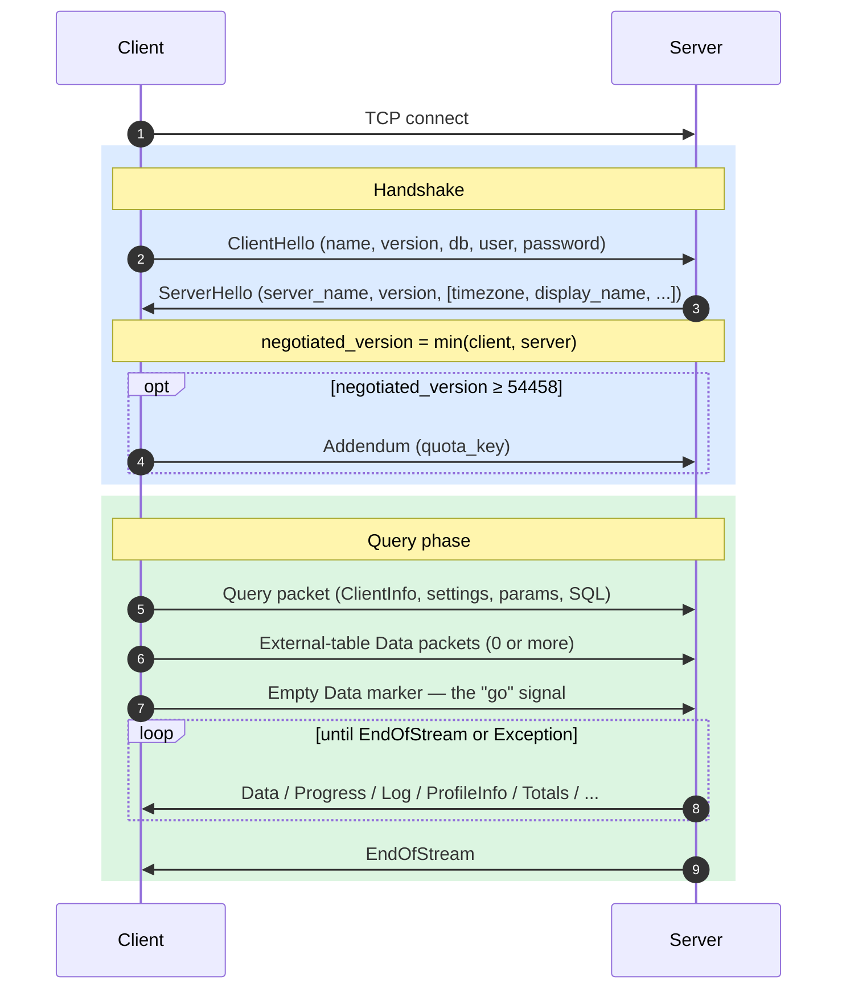
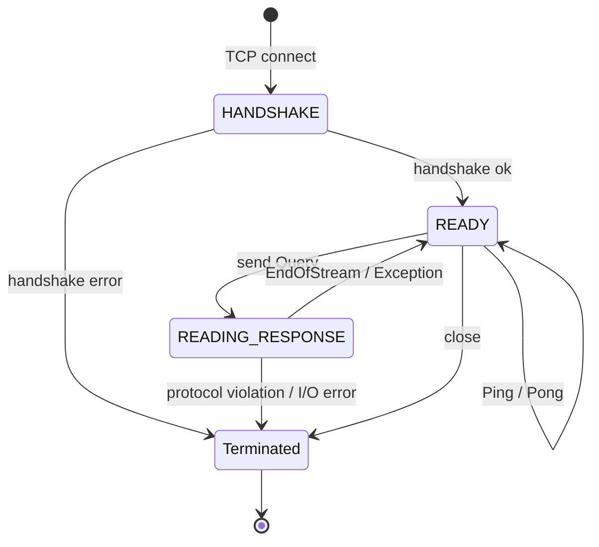
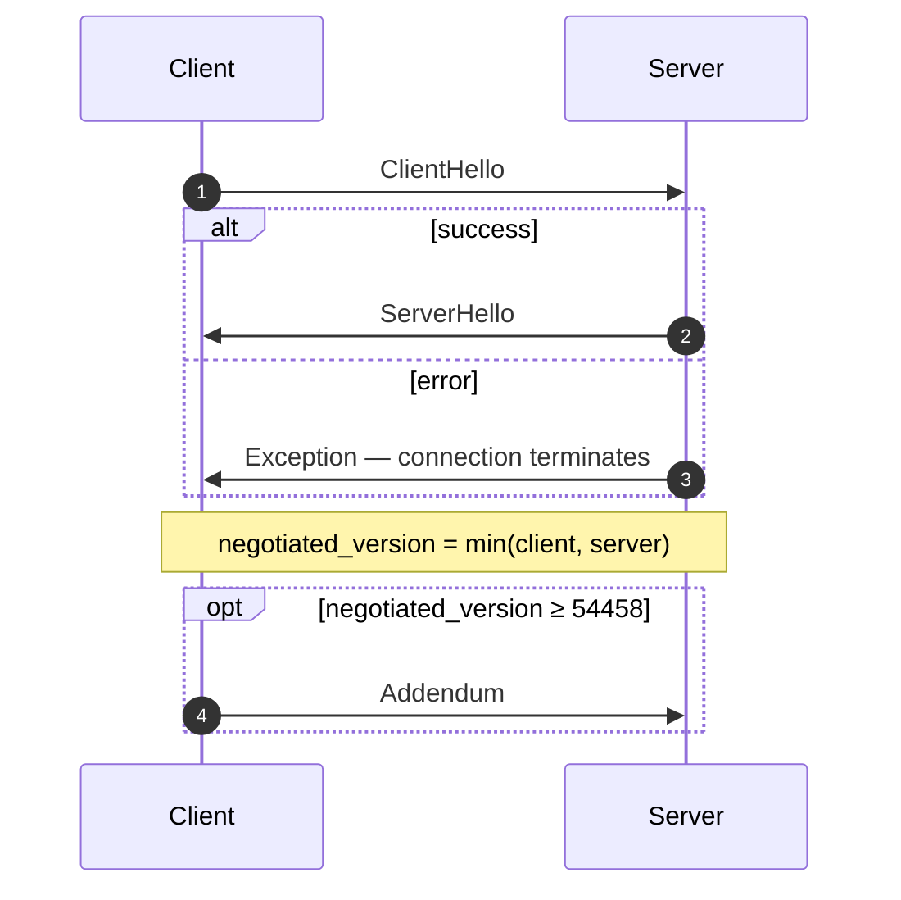
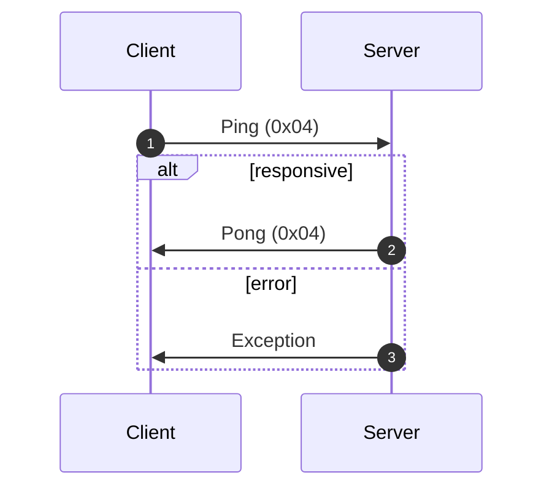
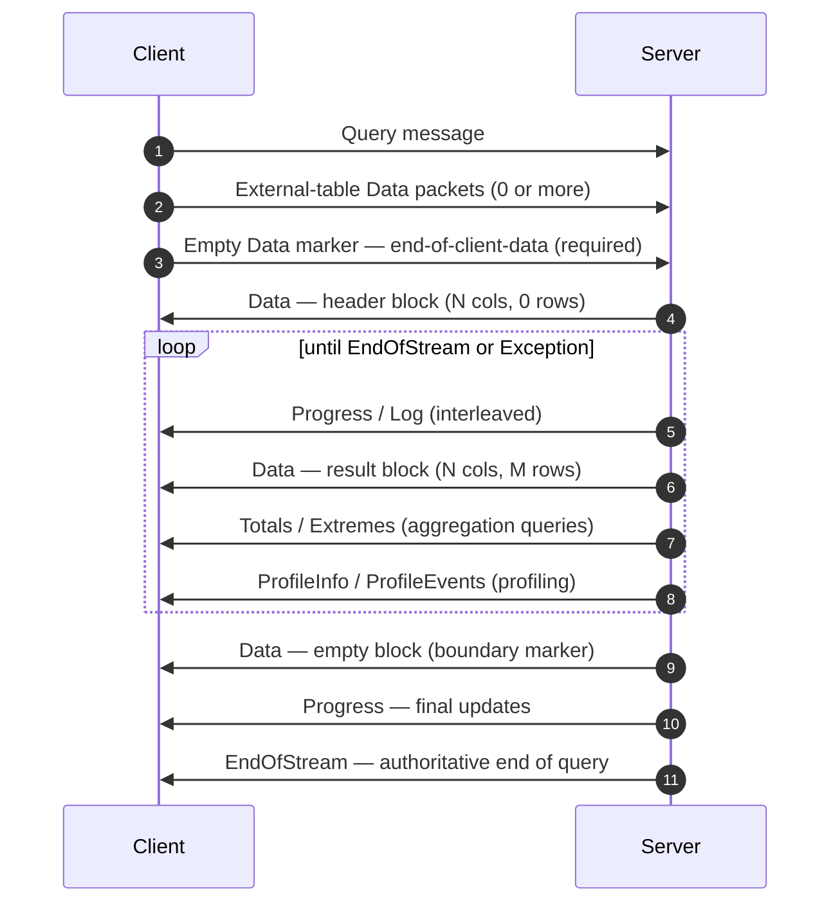
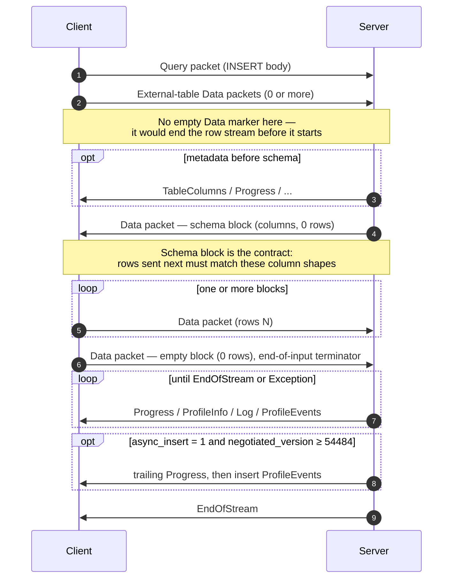
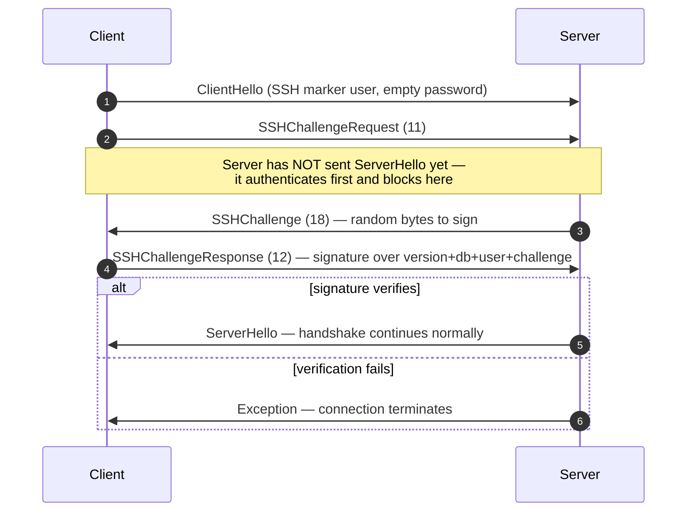

네이티브 프로토콜은 ClickHouse 클라이언트와 서버가 TCP를 통해 통신할 때 사용하는 바이너리 기반의 연결 지향 프로토콜입니다. 이 프로토콜은 SQL 쿼리, 결과 데이터, `INSERT` 페이로드, 실행 텔레메트리, 그리고 오류 신호를 전달합니다. command-line client와 C++, 그리고 대부분의 서드파티 네이티브 드라이버가 사용하는 기반 프로토콜이기도 합니다.

이 페이지에서는 프로토콜 자체를 다룹니다. 구체적으로는 패킷 프레이밍, 연결 state machine, 버전 협상, 그리고 `Block`이 아닌 모든 메시지의 본문을 설명합니다. `Data` 계열 패킷 내부의 바이트(`Block`, 그 안의 컬럼, 그리고 유형별 인코딩)는 별개의 주제이며, [Native 형식](/ko/reference/interfaces/specs/NativeFormat) 명세에서 문서화되어 있습니다.

<Info>
  **함께 읽는 명세**

  이 페이지는 한 쌍으로 제공되는 명세 중 하나이며, 함께 제공되는 [Native 형식](/ko/reference/interfaces/specs/NativeFormat) 명세와 같이 게시됩니다. 두 명세는 역할이 명확히 나뉩니다. 이 페이지는 패킷과 전송 계층을 다루고, Native 형식 명세는 `Data` 계열 패킷 내부의 바이트를 다룹니다.
</Info>

몇 가지 특성은 전체에 걸쳐 공통적으로 적용됩니다. 이 프로토콜은 바이너리이며 위치 기반입니다. `BlockInfo` 내부를 제외하면 필드 태그가 없으므로, 바이트 하나만 어긋나도 그 뒤에 오는 모든 내용의 동기화가 깨집니다. 또한 상태를 유지하는 프로토콜이며, 각 TCP 연결은 한 번에 하나의 쿼리만 처리합니다. 즉, 멀티플렉싱은 없습니다. 고정 폭 정수는 리틀 엔디언입니다.

<div id="overview">
  ## 개요
</div>

| Property | Value                                                                   |
| -------- | ----------------------------------------------------------------------- |
| 전송 방식    | TCP, 필요에 따라 TLS로 래핑 가능                                                  |
| 바이트 순서   | 고정 폭 정수에는 리틀 엔디언 사용                                                     |
| 인코딩      | 바이너리 및 위치 기반(`BlockInfo`를 제외하면 필드 태그 없음)                            |
| 연결 모델    | 상태 유지형, 한 번에 하나의 쿼리, 멀티플렉싱 없음                                           |
| 버전 관리    | 핸드셰이크에서 협상되며, 개별 기능은 버전에 따라 제한됨                                     |
| 데이터 포맷   | 모든 테이블 형식 데이터에 [Native 형식](/ko/reference/interfaces/specs/NativeFormat) 사용 |

wire를 통해 전송되는 모든 메시지는 `VarUInt` 패킷 유형 코드로 시작하며, 그 뒤에는 해당 코드와 협상된 `프로토콜 버전`에 따라 형식이 달라지는 본문이 이어집니다.

연결은 세 단계로 진행됩니다. 먼저 일회성 핸드셰이크를 수행한 다음, `Ping` 또는 `Query` 교환을 원하는 만큼 수행하고, 마지막으로 종료됩니다:



네이티브 TCP 프로토콜은 SQL의 `FORMAT` 절과 관계없이 항상 표 형식 데이터를 Native 형식으로 전달합니다. `RowBinary`, `CSV`, `JSON` 등으로 다시 포맷하는 작업은 클라이언트의 역할이며, 클라이언트가 Native 블록을 디코딩한 후 수행합니다. (HTTP 인터페이스는 `FORMAT` 절을 실제로 반영하는 별도의 코드 경로이며, 여기서는 HTTP를 다루지 않습니다.)

<div id="security">
  ## 보안
</div>

<div id="transport-security">
  ### 전송 보안(TLS)
</div>

TLS는 프로토콜 아래에 있는 전송 계층에서 동작합니다. TLS를 활성화하면 전체 TCP 스트림이 암호화되며, TLS 사용 여부와 관계없이 프로토콜 메시지는 바이트 단위까지 동일합니다.

<div id="authentication">
  ### 인증
</div>

인증은 핸드셰이크 과정에서 [`ClientHello`](#clienthello) 메시지를 통해 수행됩니다. `user` 및 `password` 필드는 평문 문자열로 전송되므로, 전송 계층 암호화(TLS)가 전송 중 자격 증명을 보호합니다.

SSH 챌린지-응답 인증은 프로토콜 버전 54466부터 지원됩니다 — 자세한 내용은 [SSH 챌린지-응답 인증](#ssh-authentication)을 참조하십시오.

<div id="inter-server-secret">
  ### 서버 간 시크릿
</div>

분산 쿼리 실행에서는 서버가 시크릿을 wire에 노출하지 않고도 공유된 시크릿을 알고 있음을 증명하여 서로 인증합니다. 각 Query의 [`Query`](#query) 필드 4에는 salt, nonce, 구성된 시크릿, 그리고 쿼리를 바탕으로 계산한 32바이트 SHA-256 `auth_hash`가 포함되며, 수신 서버는 이를 다시 계산해 비교합니다. 이 동작은 `INTERSERVER_SECRET` 기능(v54441)으로 제어됩니다. 외부 클라이언트는 이 필드에 항상 빈 문자열을 보냅니다. [서버 간 인증](#inter-server-authentication)을 참조하십시오.

<div id="versioning-and-feature-gates">
  ## 버전 관리와 기능 게이트
</div>

<div id="version-negotiation">
  ### 버전 협상
</div>

클라이언트와 서버는 핸드셰이크 중에 각각 지원하는 최대 프로토콜 버전을 선언합니다. **협상된 버전**은 두 버전 중 더 작은 값입니다:

```text
negotiated_version = min(client_version, server_version)
```

그 이후의 모든 메시지에서는 협상된 버전에 따라 wire에 어떤 필드가 포함될지가 결정됩니다.

<div id="feature-gates">
  ### 기능 게이트
</div>

기능은 해당 기능이 도입된 프로토콜 버전으로 식별되며, 협상된 버전이 그 번호와 같거나 크면 **활성** 상태가 됩니다.

<Warning>
  기능이 활성 상태이면 해당 필드는 wire에 **반드시** 포함되어야 합니다. 프로토콜은 위치에 엄격하게 의존하므로, 기능 게이트가 적용된 필드를 생략하면 그 뒤의 모든 필드에 대한 바이트 스트림이 손상됩니다.
</Warning>

<div id="feature-table">
  ### 기능 표
</div>

| 기능                                                      | 버전    | 영향 대상                            | wire 영향                                                                                                                                                                                                                                                                                                                                                                                                                         |
| ------------------------------------------------------- | ----- | -------------------------------- | ------------------------------------------------------------------------------------------------------------------------------------------------------------------------------------------------------------------------------------------------------------------------------------------------------------------------------------------------------------------------------------------------------------------------------- |
| BLOCK&#95;INFO                                          | all   | Block                            | 모든 Block에 BlockInfo 접두사(`is_overflows`, `bucket_number`)를 추가합니다.                                                                                                                                                                                                                                                                                                                                                                |
| CLIENT&#95;INFO                                         | 54032 | Query                            | Query 본문에 ClientInfo 블록을 추가합니다.                                                                                                                                                                                                                                                                                                                                                                                                 |
| TIMEZONE                                                | 54058 | ServerHello                      | ServerHello에 `timezone` 필드를 추가합니다.                                                                                                                                                                                                                                                                                                                                                                                              |
| QUOTA&#95;KEY&#95;IN&#95;CLIENT&#95;INFO                | 54060 | ClientInfo                       | ClientInfo에 `quota_key` 필드를 추가합니다.                                                                                                                                                                                                                                                                                                                                                                                              |
| DISPLAY&#95;NAME                                        | 54372 | ServerHello                      | ServerHello에 `display_name` 필드를 추가합니다.                                                                                                                                                                                                                                                                                                                                                                                          |
| VERSION&#95;PATCH                                       | 54401 | ServerHello, ClientInfo          | 두 대상 모두에 `version_patch` 필드를 추가합니다.                                                                                                                                                                                                                                                                                                                                                                                             |
| SERVER&#95;LOGS                                         | 54406 | Log                              | `send_logs_level`이 설정되면 서버가 Log 패킷을 전송합니다.                                                                                                                                                                                                                                                                                                                                                                                      |
| COLUMN&#95;DEFAULTS&#95;METADATA                        | 54410 | TableColumns                     | 서버는 INSERT/입력 schema 블록 전에 컬럼 기본값 metadata를 담은 [`TableColumns`](#tablecolumns) 패킷(유형 11)을 보낼 수 있습니다. 이 패킷은 협상된 버전이 54410 이상이고 **또한** `input_format_defaults_for_omitted_fields`가 활성화된 경우에만 전송됩니다. 이 버전보다 낮으면 패킷은 절대 전송되지 않으므로 클라이언트는 이를 기다리면 안 됩니다.                                                                                                                                                                             |
| WRITE&#95;CLIENT&#95;INFO                               | 54420 | Progress                         | Progress에 `wrote_rows`와 `wrote_bytes`를 추가합니다. (이름과 달리 이것은 ClientInfo 블록을 제어하지 **않습니다**. 이를 제어하는 것은 `CLIENT_INFO`(v54032)입니다.)                                                                                                                                                                                                                                                                                                   |
| SETTINGS&#95;SERIALIZED&#95;AS&#95;STRINGS              | 54429 | Query (settings encoding)        | 항상 존재하는 settings 목록의 인코딩 **방식**을 변경합니다. settings 전송 여부를 제어하는 것은 **아닙니다**. v54429+에서는 각 setting을 `(name, flags, value-as-string)`으로 기록하고, 이전 peer는 플래그 없이 `(name, type-specific-binary-value)`로 기록합니다. [Setting](#setting)을 참조하십시오.                                                                                                                                                                                              |
| INTERSERVER&#95;SECRET                                  | 54441 | Query                            | Query에 서버 간 `auth_hash` 필드를 추가합니다. 이는 원시 시크릿이 아니라 클러스터 시크릿에 salt를 적용한 SHA-256입니다. 외부 클라이언트는 빈 문자열을 보냅니다. [Inter-server authentication](#inter-server-authentication)을 참조하십시오.                                                                                                                                                                                                                                                   |
| OPEN&#95;TELEMETRY                                      | 54442 | ClientInfo                       | ClientInfo에 OpenTelemetry 추적 컨텍스트를 추가합니다.                                                                                                                                                                                                                                                                                                                                                                                       |
| DISTRIBUTED&#95;DEPTH                                   | 54448 | ClientInfo                       | ClientInfo에 `distributed_depth` 필드를 추가합니다.                                                                                                                                                                                                                                                                                                                                                                                      |
| INITIAL&#95;QUERY&#95;START&#95;TIME                    | 54449 | ClientInfo                       | `initial_time` 필드(Int64, 고정 폭)를 추가합니다.                                                                                                                                                                                                                                                                                                                                                                                          |
| PROFILE&#95;EVENTS                                      | 54451 | ProfileEvents                    | 서버가 쿼리 실행 중에 ProfileEvents 패킷을 전송합니다.                                                                                                                                                                                                                                                                                                                                                                                           |
| PARALLEL&#95;REPLICAS                                   | 54453 | ClientInfo                       | ClientInfo에 병렬 레플리카 coordination 필드를 추가합니다.                                                                                                                                                                                                                                                                                                                                                                                     |
| CUSTOM&#95;SERIALIZATION                                | 54454 | Block (Column)                   | 각 컬럼의 유형 문자열 뒤에 `has_custom_serialization` 바이트를 추가합니다.                                                                                                                                                                                                                                                                                                                                                                          |
| ADDENDUM                                                | 54458 | Handshake                        | 클라이언트가 handshake 교환 후 addendum(`quota_key`)을 보냅니다.                                                                                                                                                                                                                                                                                                                                                                              |
| PARAMETERS                                              | 54459 | Query                            | Query 본문에 매개변수 목록을 추가합니다.                                                                                                                                                                                                                                                                                                                                                                                                       |
| SERVER&#95;QUERY&#95;TIME&#95;IN&#95;PROGRESS           | 54460 | Progress                         | Progress에 `elapsed_ns` 필드를 추가합니다.                                                                                                                                                                                                                                                                                                                                                                                               |
| PASSWORD&#95;COMPLEXITY&#95;RULES                       | 54461 | ServerHello                      | ServerHello에 password 정책 regex 패턴 목록과 사람이 읽기 쉬운 메시지를 추가합니다.                                                                                                                                                                                                                                                                                                                                                                     |
| INTERSERVER&#95;SECRET&#95;V2                           | 54462 | ServerHello                      | ServerHello에 8바이트 `UInt64` nonce를 추가합니다. 서버 간 쿼리 서명에 사용되며, 외부 클라이언트는 이를 디코딩한 뒤 무시합니다.                                                                                                                                                                                                                                                                                                                                           |
| TOTAL&#95;BYTES&#95;IN&#95;PROGRESS                     | 54463 | Progress                         | Progress에 `total_bytes_to_read`(VarUInt) 필드를 `total_rows`와 `wrote_rows` 사이에 추가합니다.                                                                                                                                                                                                                                                                                                                                              |
| TIMEZONE&#95;UPDATES                                    | 54464 | TimezoneUpdate                   | `TimezoneUpdate` 서버 패킷(유형 17)을 추가합니다. 본문: session 시간대를 담는 단일 `String`. `input` 테이블 함수 초기화기만 이를 전송하며, 입력 schema 블록 바로 뒤에 전송되므로 클라이언트가 서버의 `session_timezone`으로 자신이 보내는 행을 파싱할 수 있습니다. [TimezoneUpdate](#timezoneupdate)를 참조하십시오.                                                                                                                                                                                                 |
| SPARSE&#95;SERIALIZATION                                | 54465 | Block (Column)                   | 서버는 `has_custom_serialization = 1`로 설정하고 희소 인코딩된 컬럼을 전송할 수 있습니다. wire 형식: 1바이트 kind(0x01 = SPARSE), 그다음 EOG로 종료되는 VarUInt 오프셋 스트림, 그리고 내부 유형으로 조밀하게 인코딩된 기본값이 아닌 값들입니다. [kind&#95;stack and sparse encoding](/ko/reference/interfaces/specs/NativeFormat#kind-stack-and-sparse-encoding)을 참조하십시오.                                                                                                                                  |
| SSH&#95;AUTHENTICATION                                  | 54466 | Auth flow                        | SSH 챌린지-응답 authentication을 추가합니다. 옵트인 방식으로 동작합니다. 이를 트리거하려면 클라이언트가 빈 password와 함께 `" SSH KEY AUTHENTICATION " + <real_user>` 형식의 `user`를 보내야 합니다. [SSH challenge-response authentication](#ssh-authentication)을 참조하십시오.                                                                                                                                                                                                         |
| TABLE&#95;READ&#95;ONLY&#95;CHECK                       | 54467 | TablesStatusResponse             | TablesStatusResponse에서 각 테이블 행에 `is_readonly` 플래그를 추가합니다. `TablesStatusRequest`를 실행하지 않는 외부 클라이언트에는 wire 변경이 없습니다.                                                                                                                                                                                                                                                                                                              |
| SYSTEM&#95;KEYWORDS&#95;TABLE                           | 54468 | system tables                    | 서버가 `system.keywords`를 채워 정식 `clickhouse-client`가 keyword 자동완성을 할 수 있게 합니다. 네이티브 protocol의 wire 변경은 없습니다.                                                                                                                                                                                                                                                                                                                       |
| ROWS&#95;BEFORE&#95;AGGREGATION                         | 54469 | ProfileInfo                      | ProfileInfo 끝부분에 `applied_aggregation`(Bool)과 `rows_before_aggregation`(VarUInt)을 이 순서대로 추가합니다.                                                                                                                                                                                                                                                                                                                                 |
| CHUNKED&#95;PROTOCOL                                    | 54470 | Connection framing               | 패킷별 청크 framing이 모든 패킷 본문을 감쌉니다. Addendum에서 협상됩니다. ServerHello는 각 방향에 대한 서버의 선호를 담고, Addendum은 클라이언트의 최종 선택을 담습니다. [chunked framing](#chunked-framing)을 참조하십시오.                                                                                                                                                                                                                                                                  |
| VERSIONED&#95;PARALLEL&#95;REPLICAS&#95;PROTOCOL        | 54471 | ServerHello, Addendum            | 양측은 병렬 레플리카 조정 프로토콜 버전을 나타내는 `VarUInt`를 교환합니다. ServerHello의 필드는 **`protocol_version` 바로 다음**(`timezone` 앞)에 위치합니다. Addendum의 필드는 청크 프로토콜 문자열 뒤에 추가됩니다. 현재 값: `7` (`DBMS_PARALLEL_REPLICAS_PROTOCOL_VERSION`).                                                                                                                                                                                                                   |
| INTERSERVER&#95;EXTERNALLY&#95;GRANTED&#95;ROLES        | 54472 | Query                            | Query 본문에 `String external_roles` 필드가 추가되며, 위치는 settings terminator와 interserver-secret hash 사이입니다. 외부 클라이언트는 빈 역할 목록을 전송합니다(단일 바이트 `0x00`, 즉 String envelope 안의 VarUInt 0).                                                                                                                                                                                                                                                    |
| V2&#95;DYNAMIC&#95;AND&#95;JSON&#95;SERIALIZATION       | 54473 | Column body                      | Server는 `Dynamic` 및 `JSON` 컬럼 타입에 대해 V2 직렬화를 내보낼 수 있으며, 어떤 `state_prefix` 버전을 사용할지 이를 기준으로 결정합니다. [versioned types](/ko/reference/interfaces/specs/NativeFormat#versioned-types)를 참조하십시오.                                                                                                                                                                                                                                          |
| SERVER&#95;SETTINGS                                     | 54474 | ServerHello                      | Server는 ServerHello의 끝부분에서 `nonce` 뒤에 기본값이 아닌 설정들을 목록으로 전송합니다. 포맷은 빈 key로 종료되는 `(key, flags, value)` 3개 항목의 반복이며, Query packet의 settings 목록과 동일합니다.                                                                                                                                                                                                                                                                             |
| QUERY&#95;AND&#95;LINE&#95;NUMBERS                      | 54475 | ClientInfo                       | ClientInfo의 끝부분에 `script_query_number` (VarUInt)와 `script_line_number` (VarUInt)가 추가됩니다. clickhouse-client가 다중 statement 스크립트의 오류 위치를 추적하는 데 사용하며, 외부 클라이언트는 `0, 0`을 전송합니다.                                                                                                                                                                                                                                                     |
| JWT&#95;IN&#95;INTERSERVER                              | 54476 | ClientInfo                       | ClientInfo의 끝부분에 JWT 존재 여부를 나타내는 UInt8과 선택적 `String jwt`가 추가됩니다. 외부 클라이언트(JWT 없음)는 바이트 `0x00`을 전송합니다. (C++에서는 `DBMS_MIN_REVISON_WITH_JWT_IN_INTERSERVER`로 표기되며, 상수 이름에 오타가 있음을 유의하십시오.)                                                                                                                                                                                                                                         |
| QUERY&#95;PLAN&#95;SERIALIZATION                        | 54477 | ServerHello, QueryPlan packet    | ServerHello는 server settings 뒤에 `VarUInt query_plan_serialization_version`를 추가합니다. 또한 사전 구축된 쿼리 계획의 서버 간 전달을 위한 `ClientPacket::QueryPlan` (code `13`)을 도입합니다. 외부 클라이언트는 이를 전송하지 않습니다.                                                                                                                                                                                                                                           |
| PARALLEL&#95;BLOCK&#95;MARSHALLING                      | 54478 | Block (Column)                   | Server는 병렬 처리를 위해 컬럼을 `ColumnBLOB`(인라인 compressed)으로 감쌀 수 있습니다. 이는 쿼리에서 compression이 활성화되어 있고 AND `rows > 1`일 때만 적용되며, 그렇지 않으면 일반 컬럼 wire 형식이 적용됩니다. 송신 Query packet에서 compression을 활성화하지 않는 클라이언트는 wire 변경이 없습니다.                                                                                                                                                                                                              |
| VERSIONED&#95;CLUSTER&#95;FUNCTION&#95;PROTOCOL         | 54479 | ServerHello                      | ServerHello의 끝부분에 `VarUInt cluster_function_protocol_version`가 추가됩니다. `*Cluster` 테이블 함수(`s3Cluster` 등)에 사용됩니다. 외부 클라이언트는 이를 디코드한 뒤 무시합니다.                                                                                                                                                                                                                                                                                       |
| OUT&#95;OF&#95;ORDER&#95;BUCKETS&#95;IN&#95;AGGREGATION | 54480 | BlockInfo                        | BlockInfo의 필드 태그 기반 스트림에 필드 3 (`out_of_order_buckets: Vec<Int32>`)이 추가됩니다. `[VarUInt count][Int32]*count`로 디코드됩니다. 외부 클라이언트는 이를 직접 내보내지 않지만, 디코더는 server가 전송한 비어 있지 않은 목록을 읽습니다.                                                                                                                                                                                                                                                |
| COMPRESSED&#95;LOGS&#95;PROFILE&#95;EVENTS&#95;COLUMNS  | 54481 | Log, ProfileEvents, TableColumns | Server는 [`Log`](#log), [`ProfileEvents`](#profileevents), [`TableColumns`](#tablecolumns) packet 본문을 [compression frame](/ko/reference/interfaces/specs/NativeFormat#compression-frame)으로 감쌀 수 있습니다. 이 버전에서는 세 본문 모두 동일한 선택적 압축 출력 경로를 통해 전송되며, 쿼리에 `compression = true`가 있을 때만 실제 compression frame이 됩니다. 송신 Query packet에서 compression을 활성화하지 않는 클라이언트는 wire 변경이 없습니다.                                                           |
| REPLICATED&#95;SERIALIZATION                            | 54482 | Block (Column)                   | Server는 kind&#95;stack `0x04 = REPLICATED`를 갖는 컬럼을 내보낼 수 있습니다. 이는 반복 값에 대한 딕셔너리 스타일의 압축 포맷이며, [kind&#95;stack and sparse encoding](/ko/reference/interfaces/specs/NativeFormat#kind-stack-and-sparse-encoding)을 참조하십시오. 이 버전보다 낮으면 writer는 전송 전에 이러한 컬럼을 펼쳐서 보냈습니다. 행마다 인덱스 조회(`elements[indexes[i]]`)로 디코드되며, leaf 타입과 `Nullable`/`Array`/`Tuple`/`Map`/`Nested`/`LowCardinality` 내부 타입을 지원합니다.                                   |
| NULLABLE&#95;SPARSE&#95;SERIALIZATION                   | 54483 | Block (Column)                   | 희소 직렬화를 `Nullable(T)`와 조합합니다. 이 버전보다 낮으면 writer는 전송 전에 Nullable 컬럼의 희소 표현을 펼쳐서 보냈으며, v54483+에서는 wire 데이터가 Nullable 위의 희소 표현입니다. [kind&#95;stack and sparse encoding](/ko/reference/interfaces/specs/NativeFormat#kind-stack-and-sparse-encoding)을 참조하십시오.                                                                                                                                                                          |
| PROGRESS&#95;IN&#95;ASYNC&#95;INSERT                    | 54484 | Progress (INSERT)                | **비동기** INSERT (`async_insert = 1`)에서는 삽입이 플러시되면 server가 `EndOfStream` 전에 추가 [`Progress`](#progress) packet 하나와 그 뒤에 삽입의 `ProfileEvents`를 전송합니다. 이는 *협상된* 버전이 54484 이상일 때만 적용되며, 그보다 낮으면 server는 이 마지막 Progress를 생략합니다. Progress wire 형식 자체는 바뀌지 않았고, 전송만 새로 추가되었습니다. 실제로는 증가분에 경과 시간이 담기며, 기록된 행 수 카운터는 함께 전송되는 ProfileEvents를 통해 보고됩니다. 이미 Progress가 중간에 섞여 들어오는 상황을 처리하는 클라이언트라면 포맷 변경은 필요 없고 packet이 하나 더 올 수 있음을 허용하면 됩니다. |
| CLIENT&#95;AGENT&#95;IN&#95;CLIENT&#95;INFO             | 54485 | ClientInfo                       | ClientInfo의 끝부분에 `client_agent` `String`이 추가됩니다. 표준 클라이언트는 환경에서 agent 식별자(예: `claude-code`, `cursor`, `gemini-cli`, 또는 `AGENT` 변수 값)를 자동 감지하며, 감지된 값이 없는 외부 클라이언트는 빈 문자열을 전송합니다. 협상된 버전이 54485 이상이면 필수이며, 이를 생략하면 Query packet의 나머지 부분과 동기화가 어긋납니다.                                                                                                                                                                             |

<div id="packet-envelope">
  ## 패킷 엔벌로프
</div>

wire로 전송되는 모든 메시지는 양방향에서 동일한 외부 구조를 가집니다:

```text
[VarUInt: packet_type_code]    always encoded as VarUInt
[message body]                 format depends on packet_type_code
```

전체 패킷 유형 표는 [패킷 유형 참고](#packet-type-reference)에 있습니다.

패킷 유형은 고정 폭 바이트가 아니라 `VarUInt`입니다. 값이 128 미만이면 `VarUInt`는 동일한 1바이트를 생성하지만, 앞으로 패킷 유형이 128 이상이 되더라도 호환성을 유지할 수 있도록 구현에서는 반드시 `VarUInt` 인코딩을 사용해야 합니다.

[메시지 참고](#message-reference)에서는 각 패킷의 **본문**만 문서화합니다. 즉, 패킷 유형 코드 뒤에 오는 바이트입니다. 필드 번호는 첫 번째 본문 필드를 1로 하여 시작합니다.

<div id="chunked-framing">
  ### 청크 프레이밍 (v54470+)
</div>

`CHUNKED_PROTOCOL` 기능이 **협상되면**([핸드셰이크](#handshake-phase) 참조), wire 상의 모든 패킷은 청크 프레이밍으로 감싸집니다. 이 래핑은 **방향별**로 적용됩니다. 즉, 클라이언트→서버와 서버→클라이언트는 각각 별도로 협상되며, 서로 다른 모드(청크 방식 또는 프레이밍 없음)로 결정될 수 있습니다.

패킷별 wire 레이아웃:

```text
<chunk>...   one or more chunks; their payloads concatenated form the whole packet
[u32 LE = 0] zero-size terminator marking end of packet
```

청크별 wire 레이아웃:

```text
[u32 LE: chunk_size]   chunk_size in [1, UINT32_MAX]
[chunk_size bytes]     packet bytes (see note below)
```

패킷 유형 `VarUInt`는 청크 처리된 스트림 **내부에** 있습니다. 즉, 프레이밍보다 앞서 별도로 전송되는 바이트가 아니라 패킷 페이로드의 첫 번째 바이트(첫 번째 청크의 첫 번째 바이트)입니다. 각 패킷의 청크 페이로드는 [패킷 엔벨로프](#packet-envelope)의 전체 `[VarUInt packet_type_code][message body]`입니다. 패킷 유형을 청크 처리된 스트림 바깥에 두는 클라이언트는 상대가 그 유형 바이트를 `u32` 청크 크기의 첫 번째 바이트로 읽게 만들어 연결 동기화가 깨지게 합니다.

쓰기 버퍼가 패킷 중간에 가득 차면 하나의 패킷이 여러 청크로 분할될 수 있으며, 분할은 패킷 유형의 `VarUInt` 내부를 포함해 어느 위치에서나 일어날 수 있습니다. 읽는 쪽은 청크 페이로드를 이어 붙이고, 마지막의 4바이트 0을 투명한 패킷 경계로 취급합니다. 즉, 이를 소비하지만 패킷 본문을 읽는 쪽에는 노출하지 않습니다.

본문이 없는 패킷도 여전히 래핑됩니다. `Ping` 또는 `Pong` 같은 1바이트 패킷은 청크 처리가 협상되면 `[u32 size = 1][0x04][u32 0]`이 됩니다. 이 페이지의 다른 곳에서 설명하는 &quot;wire 상의 단일 바이트&quot;는 모두 청크 처리 이전 형태를 의미합니다.

**협상.** ServerHello와 Addendum은 각각 방향별로 하나씩, 총 2개의 `String` 필드를 전달하며 값은 `{"chunked", "notchunked", "chunked_optional", "notchunked_optional"}` 중 하나입니다.

* `chunked` / `notchunked`는 엄격합니다. 해당 측은 정확히 그 모드를 요구합니다.
* `_optional` 변형은 유연합니다. 상대가 선택한 어느 모드든 허용합니다.

각 방향에 대한 합의 값은 쌍별로 다음과 같이 계산됩니다.

| Server pref         | Client pref         | Agreed                                     |
| ------------------- | ------------------- | ------------------------------------------ |
| `*_optional`        | anything            | 클라이언트를 따름 (해당 측의 `starts_with("chunked")`) |
| anything            | `*_optional`        | 서버를 따름                                     |
| `chunked` strict    | `chunked` strict    | `chunked`                                  |
| `notchunked` strict | `notchunked` strict | `notchunked`                               |
| strict mismatch     | strict mismatch     | **프로토콜 오류** — 연결을 반드시 종료해야 합니다             |

클라이언트 측에서는 클라이언트의 SEND 선호도가 서버의 RECV 선호도와 협상되며, 그 반대도 동일합니다.

**시점.** 협상 문자열은 프레이밍되지 않은 wire로 전송됩니다. ClientHello → ServerHello (서버 선호도) → Addendum (클라이언트의 협상된 값) 순서입니다. 프레이밍 전환은 Addendum이 플러시된 *이후* 전송되는 모든 바이트에 적용됩니다. Addendum 자체, ClientHello, ServerHello는 항상 프레이밍되지 않습니다.

<div id="connection-lifecycle">
  ## 연결 수명 주기
</div>

어느 시점이든 연결은 정확히 네 가지 상태 중 하나입니다: `HANDSHAKE`, `READY`, `READING_RESPONSE`, 또는 종료 상태입니다. 프로토콜은 멀티플렉싱을 지원하지 않으므로, 이전 응답을 모두 수신하기 전에 클라이언트가 새 요청을 보내면 wire 상에서 바이트가 뒤섞여 스트림이 손상됩니다.

<div id="states">
  ### 상태
</div>



정상 경로는 `HANDSHAKE → READY → READING_RESPONSE → READY`로 곧바로 이어지며, `Ping`/`Pong` 자체 루프와 모든 실패 경로는 하나의 `Terminated` 싱크로 수렴합니다.

| 상태                 | 설명                                                                                                                                                                               |
| ------------------ | -------------------------------------------------------------------------------------------------------------------------------------------------------------------------------- |
| `HANDSHAKE`        | TCP 연결이 열린 직후의 초기 상태입니다. [핸드셰이크](#handshake-phase) 메시지만 유효합니다. 성공하면 `READY`로 전이하고, 실패하면 종료됩니다.                                                                                   |
| `READY`            | 유휴 상태입니다. 클라이언트는 [Ping](#ping-phase), [쿼리](#query-phase)를 보내거나 연결을 닫을 수 있습니다. 연결은 `READY` 상태로 무기한 유지될 수 있습니다(`idle_connection_timeout`의 적용을 받음, [연결 제한](#connection-limits) 참고). |
| `READING_RESPONSE` | 클라이언트가 Query를 보내면 진입합니다. 클라이언트는 `READY`로 돌아가기 전에 서버의 응답 스트림을 끝까지 모두 읽어야 합니다. 여기서 클라이언트→서버로 허용되는 유일한 패킷은 Cancel입니다(이 페이지에서는 설명하지 않음).                                             |
| Terminated         | 더 이상 사용할 수 없습니다. 클라이언트는 새 TCP 연결을 열고 핸드셰이크를 다시 시작해야 합니다.                                                                                                                         |

<div id="handshake-phase">
  ### 핸드셰이크 단계
</div>

인증을 수행하고 프로토콜 버전을 협상합니다. 이 과정은 각 connection마다 다른 어떤 작업보다 먼저 정확히 한 번만 발생합니다.

TCP connection이 막 열렸고 아직 어떤 메시지도 오가지 않은 상태입니다. 흐름은 다음과 같습니다:



1. 클라이언트는 지원하는 최대 프로토콜 버전과 함께 [`ClientHello`](#clienthello)를 전송합니다.

2. 클라이언트는 응답을 읽고 패킷 유형에 따라 처리합니다:

   | 패킷 유형           | 동작                                                                                                            |
   | --------------- | ------------------------------------------------------------------------------------------------------------- |
   | `Hello` (0)     | [`ServerHello`](#serverhello)를 디코딩합니다. `negotiated_version = min(client_ver, server_ver)`를 계산합니다. 3단계로 진행합니다. |
   | `Exception` (2) | [`Exception`](#exception)을 디코딩합니다. 이를 오류로 반환하고 연결을 종료합니다.                                                     |
   | 그 밖의 경우         | 프로토콜 위반입니다. 연결을 종료합니다.                                                                                        |

3. `negotiated_version ≥ 54458`(`ADDENDUM` 기능)인 경우, 클라이언트는 [`Addendum`](#addendum)을 전송합니다. 이 결정은 클라이언트가 선언한 버전이 아니라 **협상된** 버전을 기준으로 합니다.

성공하면 연결 상태가 `READY`로 전환되며, 오류가 발생하면 연결이 종료됩니다.

<div id="ping-phase">
  ### Ping 단계
</div>

TCP keepalive와는 별도의 애플리케이션 수준 liveness 확인입니다. Ping/Pong 왕복이 성공하면 TCP 연결이 양방향 모두에서 살아 있으며 서버가 응답 가능함을 확인할 수 있습니다. Ping은 무상태(stateless)이며 어떤 쿼리와도 연관되지 않으므로 여러 번 연속으로 보내는 Ping도 서로 독립적입니다.

`READY`부터 흐름은 다음과 같습니다:



1. 클라이언트가 [`Ping`](#ping)을 보냅니다.
2. 클라이언트가 응답을 읽습니다:

   | 패킷 유형           | 동작                                          |
   | --------------- | ------------------------------------------- |
   | `Pong` (4)      | liveness가 확인됩니다. `READY`로 돌아갑니다.            |
   | `Exception` (2) | [`Exception`](#exception)을 디코딩하여 오류로 반환합니다. |
   | 그 외 모든 경우       | 프로토콜 위반입니다.                                 |

<div id="query-phase">
  ### 쿼리 단계
</div>

클라이언트가 SQL 문을 전송하면 서버는 결과 블록과 실행 텔레메트리를 스트리밍하여 반환합니다. 응답은 정확히 하나의 `EndOfStream` 또는 `Exception`으로 끝나는 패킷 시퀀스입니다.

`READY`부터 흐름은 다음과 같습니다:



어느 단계에서든 오류가 발생하면 서버는 `EndOfStream` 대신 `Exception`을 보내며, 이로써 쿼리가 종료됩니다.

1. 클라이언트는 고유한 `query_id`(일반적으로 UUID)를 포함한 [`Query`](#query)를 보냅니다.
2. 클라이언트는 외부 테이블을 모두 보낸 다음 비어 있는 Data 마커를 보냅니다. 빈 Data 패킷은 `table_name = ""`, `num_columns = 0`, `num_rows = 0`입니다. 서버는 이 마커를 받기 전까지 쿼리 실행을 시작하지 않습니다.
3. 클라이언트는 `READING_RESPONSE`로 전환하고 쓰기 버퍼를 플러시합니다.
4. 클라이언트는 루프에서 응답 패킷을 읽고, 유형에 따라 처리합니다.

   | Packet type          | Action                                                                                                         |
   | -------------------- | -------------------------------------------------------------------------------------------------------------- |
   | `Data` (1)           | 블록을 디코드합니다. 첫 번째 Data는 스키마 헤더이고, 그다음부터는 결과 블록(누적)이며, 빈 블록은 경계 마커입니다. `num_rows == 0`은 쿼리 종료를 의미하는 것이 **아닙니다**. |
   | `Progress` (3)       | 실행 메트릭입니다. 각 패킷은 이전 패킷 이후의 **증가분**이므로 로컬에서 누적합니다.                                                              |
   | `EndOfStream` (5)    | 쿼리가 완료되었습니다. 루프를 종료하고 `READY`로 돌아갑니다.                                                                          |
   | `ProfileInfo` (6)    | 실행 후 프로파일링 데이터입니다.                                                                                             |
   | `Totals` (7)         | 집계 합계 블록입니다(Data와 동일한 wire 형식).                                                                                |
   | `Extremes` (8)       | 최소/최대값 블록입니다(Data와 동일한 wire 형식).                                                                               |
   | `Log` (10)           | 서버 로그 한 줄입니다.                                                                                                  |
   | `TableColumns` (11)  | 컬럼 기본값 메타데이터입니다.                                                                                               |
   | `ProfileEvents` (14) | 성능 카운터입니다.                                                                                                     |
   | `Exception` (2)      | 디코드한 뒤 오류로 반환합니다. 루프를 종료하고 `READY`로 돌아갑니다.                                                                     |
   | anything else        | 쿼리 단계에서는 예상하지 못한 경우입니다. 연결을 종료합니다.                                                                             |

`EndOfStream` 또는 처리된 `Exception`이 발생하면 연결은 `READY` 상태로 돌아갑니다. 프로토콜 위반이나 I/O 오류가 발생하면 연결이 종료됩니다.

<Note>
  `num_rows == 0` 경우는 새 구현에서 자주 혼동을 일으킵니다. 행 수가 0인 블록은 경계 마커 또는 스키마 헤더일 뿐, 스트림 종료 신호가 아닙니다. 응답은 `EndOfStream` 또는 `Exception`이 와야만 끝납니다.
</Note>

<div id="insert-phase">
  ### INSERT 단계
</div>

INSERT 단계는 [쿼리 단계](#query-phase)에 2번의 추가 통신이 더해진 형태입니다. 클라이언트가 `INSERT` 구문을 전송하면 서버는 대상 테이블을 설명하는 **스키마 블록**으로 응답합니다. 그런 다음 클라이언트는 행이 포함된 데이터 패킷을 스트리밍하고, 이어서 비어 있는 Data 마커를 보냅니다. 마지막으로 서버는 `EndOfStream` 또는 `Exception`으로 마무리합니다.

`READY` 상태에서 시작하면 SQL은 `INSERT INTO <table> [(<cols>)] VALUES` 형태의 `INSERT`이며, 행 데이터는 Data 패킷을 통해 전달되므로 인라인 `VALUES (...)` 리터럴은 포함되지 않습니다. 흐름은 다음과 같습니다:



1. 클라이언트는 `body`를 INSERT SQL로 설정한 [`Query`](#query)를 전송합니다.
2. 클라이언트는 외부 테이블(external table)이 있으면 함께 전송합니다(INSERT에서는 드문 경우입니다). [Query 단계](#query-phase)와 달리, 여기서는 빈 Data 마커를 전송하지 **않습니다**. `INSERT` `Query` 패킷은 보류 중인 데이터와 함께 전송되므로, 빈 데이터 종료 블록은 5단계로 미뤄집니다. 이를 스키마 블록보다 먼저 전송하면 서버가 이를 행 스트림의 끝으로 해석하여 행 없이 INSERT를 완료한 뒤, 첫 번째 실제 행 패킷을 상위 수준의 잘못된 패킷으로 파싱하게 됩니다.
3. 클라이언트는 스키마 Data 패킷을 읽을 때까지 메타데이터 패킷(TableColumns, Progress, ProfileInfo, Log, ProfileEvents)을 계속 읽어들입니다. 이 패킷은 0개의 행을 가지지만 전체 컬럼 구조(이름과 타입)를 포함하는 Block입니다. 스키마 블록은 일종의 계약입니다. 즉, 다음에 클라이언트가 전송하는 행은 이 컬럼 구조와 일치해야 합니다.
4. 클라이언트는 데이터 블록을 전송합니다. 각 블록마다 `VarUInt(ClientPacket::Data = 2)`를 기록한 다음, 빈 외부 테이블 이름으로 `String("")`를 기록하고, 그다음 Block을 기록합니다. 컬럼 타입은 위치 기준으로 스키마 블록의 컬럼과 일치해야 합니다.
5. 클라이언트는 입력 종료 표시자를 전송합니다. 즉, 빈 Block(0개 컬럼, 0개 행)을 담은 Data 패킷입니다.
6. 클라이언트는 `EndOfStream`(성공) 또는 `Exception`(실패)에 도달할 때까지 응답 스트림을 계속 읽어들입니다.

**비동기 INSERT(v54484+).** 쿼리에 `async_insert = 1`이 포함되면 서버는 행을 큐에 넣고 배치의 일부로 플러시합니다. 협상된 버전이 54484 이상(`PROGRESS_IN_ASYNC_INSERT`)이면, 플러시가 완료된 후 서버는 추가 [`Progress`](#progress) 패킷을 내보내고, 그 직후 insert의 `ProfileEvents`, 그리고 `EndOfStream`을 전송합니다. 54484 미만에서는 서버가 이 마지막 Progress를 생략합니다. 이 패킷은 일반적인 `Progress`입니다. 서버는 쓰기 count를 반영하기 전에 쿼리 pipeline을 재설정하므로, 실제로 이 증가분에는 경과 시간만 포함되고, 기록된 행 수와 바이트 통계는 함께 전송되는 `ProfileEvents`를 통해 클라이언트에 전달됩니다. 이미 6단계에서 섞여 들어오는 Progress를 계속 읽어들이는 클라이언트는 패킷 하나만 더 받아들이면 됩니다.

`EndOfStream` 또는 처리된 `Exception`이 발생하면 connection은 `READY` 상태로 돌아갑니다. 프로토콜 위반과 I/O 오류가 발생하면 connection이 종료됩니다.

<div id="message-reference">
  ## 메시지 참고
</div>

필드는 wire 순서대로 나열됩니다. `유형` 컬럼은 다음 의미로 사용합니다.

* `VarUInt` — 가변 길이 부호 없는 정수([VarUInt](/ko/reference/interfaces/specs/NativeFormat#varuint) 참조)
* `String` — 앞에 VarUInt 길이 값이 붙는 바이트열([String](/ko/reference/interfaces/specs/NativeFormat#string) 참조)
* `UInt8`, `Int32` 등 — 고정 길이 리틀 엔디언 정수
* `Bool` — `0x00` 또는 `0x01`인 1바이트 값

`Role` 컬럼은 각 필드를 누가 사용하는지 나타냅니다.

* **클라이언트** — 외부 클라이언트가 설정합니다.
* **서버 간** — 서버 간 통신에서만 의미가 있으며, 외부 클라이언트는 기본값을 씁니다.
* **universal** — 둘 다에서 사용합니다.

이 표는 패킷 유형 코드 다음에 오는 각 패킷의 본문만 설명합니다.

<div id="clienthello">
  ### ClientHello (packet type 0)
</div>

클라이언트 → 서버. TCP connection이 열린 후 전송되는 첫 번째 메시지입니다.

| # | 필드                   | 유형      | 역할 | 설명                                  |
| - | -------------------- | ------- | -- | ----------------------------------- |
| 1 | client&#95;name      | String  | 공통 | 클라이언트 식별자(예: `"clickhouse-client"`) |
| 2 | version&#95;major    | VarUInt | 공통 | 클라이언트 major 버전                      |
| 3 | version&#95;minor    | VarUInt | 공통 | 클라이언트 minor 버전                      |
| 4 | protocol&#95;version | VarUInt | 공통 | 클라이언트가 지원하는 최대 프로토콜 버전              |
| 5 | database             | String  | 공통 | 기본 데이터베이스 이름                        |
| 6 | user                 | String  | 공통 | 인증에 사용할 username                    |
| 7 | password             | String  | 공통 | 비밀번호(plaintext)                     |

<div id="serverhello">
  ### ServerHello (packet type 0)
</div>

Server → Client. 인증이 성공했을 때 ClientHello에 대한 응답입니다.

| #  | Field                                          | Type      | Role         | Condition                                                 | Description                                                                                                                                                                                                                    |
| -- | ---------------------------------------------- | --------- | ------------ | --------------------------------------------------------- | ------------------------------------------------------------------------------------------------------------------------------------------------------------------------------------------------------------------------------ |
| 1  | server&#95;name                                | String    | 공통           | 항상                                                        | 서버 식별자                                                                                                                                                                                                                         |
| 2  | version&#95;major                              | VarUInt   | 공통           | 항상                                                        | 서버 메이저 버전                                                                                                                                                                                                                      |
| 3  | version&#95;minor                              | VarUInt   | 공통           | 항상                                                        | 서버 마이너 버전                                                                                                                                                                                                                      |
| 4  | protocol&#95;version                           | VarUInt   | 공통           | 항상                                                        | 서버의 프로토콜 버전                                                                                                                                                                                                                    |
| 4a | parallel&#95;replicas&#95;protocol&#95;version | VarUInt   | 공통           | VERSIONED&#95;PARALLEL&#95;REPLICAS&#95;PROTOCOL (v54471) | 서버의 병렬 레플리카 조정 프로토콜 버전입니다. **Wire position: `protocol_version` 바로 뒤**, `timezone` 앞입니다. 현재 값: `7`.                                                                                                                             |
| 5  | timezone                                       | String    | 공통           | TIMEZONE (v54058)                                         | 서버 시간대(예: `"UTC"`)                                                                                                                                                                                                             |
| 6  | display&#95;name                               | String    | 공통           | DISPLAY&#95;NAME (v54372)                                 | 사람이 읽기 쉬운 서버 이름                                                                                                                                                                                                                |
| 7  | version&#95;patch                              | VarUInt   | 공통           | VERSION&#95;PATCH (v54401)                                | 서버 패치 버전                                                                                                                                                                                                                       |
| 8  | proto&#95;send&#95;chunked&#95;srv             | String    | 공통           | CHUNKED&#95;PROTOCOL (v54470)                             | 서버가 선호하는 아웃바운드 청크 처리 방식입니다. `"chunked"`, `"notchunked"`, `"chunked_optional"`, `"notchunked_optional"` 중 하나입니다. [청크 프레이밍](#chunked-framing)을 참조하십시오. **버전 게이트는 더 높지만 wire에서는 `password_complexity_rules`보다 앞에 위치합니다.** |
| 9  | proto&#95;recv&#95;chunked&#95;srv             | String    | 공통           | CHUNKED&#95;PROTOCOL (v54470)                             | 서버가 선호하는 인바운드 청크 처리 방식입니다. 값 집합은 필드 8과 같습니다.                                                                                                                                                                                   |
| 10 | password&#95;complexity&#95;rules              | Rule[]    | 공통           | PASSWORD&#95;COMPLEXITY&#95;RULES (v54461)                | 서버의 비밀번호 정책입니다. 형식은 `VarUInt count` 다음에 `count × Rule`이 이어집니다. 아래를 참조하십시오.                                                                                                                                                     |
| 11 | nonce                                          | UInt64    | 서버 간 | INTERSERVER&#95;SECRET&#95;V2 (v54462)                    | 8바이트 LE 랜덤 nonce입니다. 서버의 서버 간 쿼리 서명 scheme에서 사용합니다. 외부 클라이언트는 스트림 정렬을 유지하기 위해 반드시 이를 디코딩해야 하며, 값은 무시하는 것이 좋습니다.                                                                                                        |
| 12 | server&#95;settings                            | Setting[] | 공통           | SERVER&#95;SETTINGS (v54474)                              | 서버의 비기본 설정 브로드캐스트입니다. 포맷: 비어 있는 key로 종료되는 0개 이상의 `(String key, VarUInt flags, String value)` 3개 항목입니다. [Query packet&#39;s settings list](#setting)와 같습니다.                                                                     |
| 13 | query&#95;plan&#95;serialization&#95;version   | VarUInt   | 공통           | QUERY&#95;PLAN&#95;SERIALIZATION (v54477)                 | 서버가 지원하는 쿼리 계획 serialization version입니다. 외부 클라이언트는 디코딩만 하고 무시합니다.                                                                                                                                                              |
| 14 | cluster&#95;function&#95;protocol&#95;version  | VarUInt   | 공통           | VERSIONED&#95;CLUSTER&#95;FUNCTION&#95;PROTOCOL (v54479)  | 서버의 `*Cluster` table-function 프로토콜 버전입니다. 외부 클라이언트는 디코딩만 하고 무시합니다.                                                                                                                                                             |

**Rule** — `password_complexity_rules`의 요소:

| # | Field   | Type   | Description                                  |
| - | ------- | ------ | -------------------------------------------- |
| 1 | pattern | String | 규정을 준수하는 비밀번호가 일치해야 하는 정규 표현식 패턴입니다.         |
| 2 | message | String | 비밀번호가 이 규칙을 충족하지 못했을 때 표시되는 사람이 읽기 쉬운 설명입니다. |

이 목록은 서버 운영자의 비밀번호 정책 구성을 반영하며, 순수한 권고 정보입니다. 서버는 핸드셰이크 중에 이 규칙을 강제하지 않습니다. 비밀번호 변경 또는 설정 기능을 제공하는 클라이언트는 규정을 준수하지 않는 비밀번호를 서버에 보내기 전에 이 규칙을 사용해 오류를 표시할 수 있습니다.

<Note>
  악의적이거나 잘못 구성된 서버에 대비해 자원 사용량을 제한하려면, 디코딩된 `count`는 최대 256개 항목으로 제한하고 각 `pattern` 및 `message` String은 최대 4096바이트로 제한하십시오. `count`가 `0`인 경우(뒤따르는 쌍이 없음)는 비밀번호 정책이 구성되지 않은 서버에서 일반적으로 나타나는 경우입니다.
</Note>

<div id="addendum">
  ### Addendum (패킷 유형 없음)
</div>

클라이언트 → 서버이며, `ADDENDUM` (v54458)일 때만 사용됩니다. 핸드셰이크 교환이 완료된 직후 전송됩니다. 별도의 패킷 유형은 아니며, 필드는 패킷 유형 바이트 접두사 없이 wire에 원시 형태 그대로 기록됩니다.

| # | Field                                          | Type    | Role | Condition                                                 | Description                                                                                                        |
| - | ---------------------------------------------- | ------- | ---- | --------------------------------------------------------- | ------------------------------------------------------------------------------------------------------------------ |
| 1 | quota&#95;key                                  | String  | 공통   | 항상                                                        | 서버 측 키 기반 쿼터에 사용하는 리소스 쿼터 키입니다. 키 기반 쿼터를 사용하지 않는 클라이언트는 빈 문자열을 보냅니다.                                               |
| 2 | proto&#95;send&#95;chunked                     | String  | 공통   | CHUNKED&#95;PROTOCOL (v54470)                             | 클라이언트가 협상한 Outbound 청크 처리 방식입니다: `"chunked"` 또는 `"notchunked"`. ServerHello의 `proto_recv_chunked_srv`를 기준으로 계산됩니다. |
| 3 | proto&#95;recv&#95;chunked                     | String  | 공통   | CHUNKED&#95;PROTOCOL (v54470)                             | 클라이언트가 협상한 Inbound 청크 처리 방식입니다. `proto_send_chunked_srv`를 기준으로 계산됩니다.                                              |
| 4 | parallel&#95;replicas&#95;protocol&#95;version | VarUInt | 공통   | VERSIONED&#95;PARALLEL&#95;REPLICAS&#95;PROTOCOL (v54471) | 클라이언트가 지원하는 병렬 레플리카 coordination 프로토콜 버전입니다. 분산 쿼리에 참여하지 않는 외부 클라이언트도 서버의 호환성 검사가 통과하도록 유효한 버전(현재 `7`)을 보내야 합니다.   |

청크 프레이밍 전환은 이 Addendum이 플러시된 *후에* 적용되며, Addendum 자체는 프레이밍되지 않습니다.

<div id="ping">
  ### Ping (패킷 유형 4)
</div>

클라이언트 → 서버. 본문은 없으며, 패킷은 청크 프레이밍 전에는 단일 바이트 `0x04`로 구성됩니다. 청킹이 협상되면 이 바이트는 청크의 1바이트 payload가 됩니다([청크 프레이밍](#chunked-framing) 참조).

<div id="pong">
  ### Pong (패킷 유형 4)
</div>

서버 → 클라이언트. 본문은 없으며, 청크 프레이밍이 적용되기 전에는 패킷이 단일 바이트 `0x04`입니다. 청크 사용이 협상되면 이 바이트는 청크의 1바이트 payload가 됩니다([청크 프레이밍](#chunked-framing) 참조).

<div id="exception">
  ### Exception (패킷 유형 2)
</div>

서버 → 클라이언트. 서버에서 어느 단계에서든 오류가 발생하면 전송됩니다.

| # | 필드                        | 유형     | 역할        | 설명                                               |
| - | ------------------------- | ------ | --------- | ------------------------------------------------ |
| 1 | code                      | Int32  | 공통 | 오류 코드                                            |
| 2 | name                      | String | 공통 | Exception 클래스(예: `"DB::Exception"`)              |
| 3 | message                   | String | 공통 | 사람이 읽을 수 있는 오류 메시지                               |
| 4 | stack&#95;trace           | String | 공통 | 서버 측 stack trace                                 |
| 5 | has&#95;nested (obsolete) | Bool   | 공통 | 더 이상 사용되지 않는 호환성용 바이트입니다. 서버는 항상 `false`를 기록합니다. |

<div id="query">
  ### Query (패킷 유형 1)
</div>

클라이언트 → 서버.

| #  | Field              | Type        | Role         | Condition                                                 | Description                                                                                                                                                                                                                                                             |
| -- | ------------------ | ----------- | ------------ | --------------------------------------------------------- | ----------------------------------------------------------------------------------------------------------------------------------------------------------------------------------------------------------------------------------------------------------------------- |
| 1  | query&#95;id       | String      | 공통    | always                                                    | 고유한 쿼리 식별자(UUID)                                                                                                                                                                                                                                                        |
| 2  | client&#95;info    | ClientInfo  | 공통    | CLIENT&#95;INFO (v54032)                                  | [ClientInfo](#clientinfo) 참조                                                                                                                                                                                                                                            |
| 3  | settings           | Setting[]   | 공통    | always                                                    | [Setting](#setting) 참조. **항상 포함됩니다**(빈 키로 종료). 설정별 *인코딩*만 버전에 따라 제한되며, 자세한 내용은 [Setting](#setting)의 인코딩 참고를 참조하십시오. 협상된 버전이 `54429` 미만이면 클라이언트는 이 필드를 생략해서는 안 됩니다.                                                                                                      |
| 3a | external&#95;roles | String      | 공통    | INTERSERVER&#95;EXTERNALLY&#95;GRANTED&#95;ROLES (v54472) | 외부에서 부여된 역할 이름 목록을 직렬화한 값입니다. 빈 목록은 String 래퍼로 감싼 바이트 `0x00`(VarUInt 0)이며, wire상에서는 `[VarUInt 1][0x00]`입니다. 외부 클라이언트는 항상 빈 값을 전송합니다.                                                                                                                                    |
| 4  | auth&#95;hash      | String      | 서버 간 | INTERSERVER&#95;SECRET (v54441)                           | 서버 간 인증 해시이며, 원시 클러스터 시크릿은 **아닙니다**. 자세한 내용은 아래의 [Inter-server authentication](#inter-server-authentication)을 참조하십시오. 외부 클라이언트(및 모든 `InitialQuery`)는 빈 문자열을 전송합니다.                                                                                                      |
| 5  | stage              | VarUInt     | 공통    | always                                                    | 쿼리 처리 단계입니다. `0` = FetchColumns, `1` = WithMergeableState, `2` = Complete, `3` = WithMergeableStateAfterAggregation, `4` = WithMergeableStateAfterAggregationAndLimit, `7` = QueryPlan. 값 `3`/`4`는 분산 쿼리에서 나타나며, `7`은 직렬화된 쿼리 계획과 함께 사용됩니다. 외부 클라이언트는 일반적으로 `2`를 전송합니다. |
| 6  | compression        | VarUInt     | 공통    | always                                                    | 0 = 비활성화, 1 = 활성화                                                                                                                                                                                                                                                       |
| 7  | query&#95;body     | String      | 공통    | always                                                    | SQL 텍스트                                                                                                                                                                                                                                                                 |
| 8  | parameters         | Parameter[] | 클라이언트       | PARAMETERS (v54459)                                       | [Parameter](#parameter) 참조. 빈 키로 종료됩니다.                                                                                                                                                                                                                                 |

<div id="clientinfo">
  ### ClientInfo (Query에 포함됨)
</div>

클라이언트 → 서버, Query 본문(field 2)에 포함됩니다. `CLIENT_INFO` (v54032)로 제어됩니다. (ClientInfo 내부의 일부 field는 아래에 각 field별로 명시된 것처럼 이후 버전에서 제어됩니다.)

| #  | Field                                 | 유형      | 역할    | 조건                                                        | 설명                                                                                                                                                                                                               |
| -- | ------------------------------------- | ------- | ----- | --------------------------------------------------------- | ---------------------------------------------------------------------------------------------------------------------------------------------------------------------------------------------------------------- |
| 1  | query&#95;kind                        | UInt8   | 공통    | 항상                                                        | 0 = NoQuery, 1 = InitialQuery, 2 = SecondaryQuery. 외부 클라이언트는 `1`을 보냅니다.                                                                                                                                          |
| 2  | initial&#95;user                      | String  | 공통    | 항상                                                        | 쿼리를 시작한 사용자                                                                                                                                                                                                      |
| 3  | initial&#95;query&#95;id              | String  | 공통    | 항상                                                        | 원본 쿼리 ID                                                                                                                                                                                                         |
| 4  | initial&#95;address                   | String  | 공통    | 항상                                                        | `host:port` 포맷의 원본 클라이언트 소켓 주소                                                                                                                                                                                   |
| 5  | initial&#95;time                      | Int64   | 클라이언트 | INITIAL&#95;QUERY&#95;START&#95;TIME (v54449)             | 쿼리 시작 시간(마이크로초)입니다. VarUInt가 아니라 고정 길이 8바이트입니다.                                                                                                                                                                  |
| 6  | query&#95;interface                   | UInt8   | 공통    | 항상                                                        | 1 = TCP, 2 = HTTP                                                                                                                                                                                                |
| 7  | os&#95;user                           | String  | 클라이언트 | 인터페이스 = TCP인 경우                                           | OS 사용자 이름                                                                                                                                                                                                        |
| 8  | client&#95;hostname                   | String  | 클라이언트 | 인터페이스 = TCP인 경우                                           | 클라이언트 머신의 호스트명                                                                                                                                                                                                   |
| 9  | client&#95;name                       | String  | 클라이언트 | 인터페이스 = TCP인 경우                                           | 클라이언트 애플리케이션 이름                                                                                                                                                                                                  |
| 10 | version&#95;major                     | VarUInt | 공통    | 인터페이스 = TCP인 경우                                           | 클라이언트 메이저 버전                                                                                                                                                                                                     |
| 11 | version&#95;minor                     | VarUInt | 공통    | 인터페이스 = TCP인 경우                                           | 클라이언트 마이너 버전                                                                                                                                                                                                     |
| 12 | protocol&#95;version                  | VarUInt | 공통    | 인터페이스 = TCP인 경우                                           | 원본 클라이언트 자체의 TCP 프로토콜 버전(`DBMS_TCP_PROTOCOL_VERSION`)이며, 협상된 버전이 **아닙니다**. 피어 리비전은 어떤 필드가 포함되는지만 결정합니다. 이 값은 initiator에 컴파일된 버전이므로, 더 최신 클라이언트가 더 오래된 server와 통신하는 경우 협상된/server 리비전보다 더 클 수 있습니다.               |
| 13 | quota&#95;key                         | String  | 공통    | QUOTA&#95;KEY&#95;IN&#95;CLIENT&#95;INFO (v54060)         | 서버 측 키 기반 쿼터에 사용하는 리소스 쿼터 키입니다. 키 기반 쿼터를 사용하지 않는 클라이언트는 빈 문자열을 보냅니다.                                                                                                                                             |
| 14 | distributed&#95;depth                 | VarUInt | 서버 간  | DISTRIBUTED&#95;DEPTH (v54448)                            | 분산 쿼리의 중첩 깊이입니다. 외부 클라이언트는 `0`을 보냅니다.                                                                                                                                                                            |
| 15 | version&#95;patch                     | VarUInt | 공통    | VERSION&#95;PATCH (v54401), TCP only                      | 클라이언트 패치 버전                                                                                                                                                                                                      |
| 16 | open&#95;telemetry                    | (below) | 클라이언트 | OPEN&#95;TELEMETRY (v54442)                               | 추적 컨텍스트입니다. tracing을 사용하지 않는 클라이언트는 `0`을 보냅니다.                                                                                                                                                                   |
| 17 | collaborate&#95;with&#95;initiator    | VarUInt | 서버 간  | PARALLEL&#95;REPLICAS (v54453)                            | Bool 값을 VarUInt로 표현합니다. 외부 클라이언트는 `0`을 보냅니다.                                                                                                                                                                     |
| 18 | count&#95;participating&#95;replicas  | VarUInt | 서버 간  | PARALLEL&#95;REPLICAS (v54453)                            | 외부 클라이언트는 `0`을 보냅니다.                                                                                                                                                                                             |
| 19 | number&#95;of&#95;current&#95;replica | VarUInt | 서버 간  | PARALLEL&#95;REPLICAS (v54453)                            | 외부 클라이언트는 `0`을 보냅니다.                                                                                                                                                                                             |
| 20 | script&#95;query&#95;number           | VarUInt | 클라이언트 | QUERY&#95;AND&#95;LINE&#95;NUMBERS (v54475)               | 여러 statement로 구성된 스크립트에서 1부터 시작하는 statement 위치입니다. 외부 클라이언트는 `0`을 보냅니다.                                                                                                                                          |
| 21 | script&#95;line&#95;number            | VarUInt | 클라이언트 | QUERY&#95;AND&#95;LINE&#95;NUMBERS (v54475)               | 소스 스크립트 내에서 1부터 시작하는 줄 번호입니다. 외부 클라이언트는 `0`을 보냅니다.                                                                                                                                                               |
| 22 | jwt&#95;present                       | UInt8   | 서버 간  | JWT&#95;IN&#95;INTERSERVER (v54476)                       | `0` = JWT 없음, `1` = 뒤이어 JWT가 옵니다. JWT 인증을 사용하지 않는 외부 클라이언트는 `0`을 보냅니다.                                                                                                                                           |
| 23 | jwt                                   | String  | 서버 간  | JWT&#95;IN&#95;INTERSERVER (v54476), if jwt&#95;present=1 | JWT Bearer token이며, 필드 22가 `1`일 때만 포함됩니다.                                                                                                                                                                        |
| 24 | client&#95;agent                      | String  | 클라이언트 | CLIENT&#95;AGENT&#95;IN&#95;CLIENT&#95;INFO (v54485)      | 마지막 필드입니다. 환경에서 자동 감지된 클라이언트 도구/agent의 식별자입니다(예: `claude-code`, `cursor`, `gemini-cli` 또는 `AGENT` env var). 감지된 agent가 없는 외부 클라이언트는 빈 문자열을 보냅니다. 협상된 버전이 54485 이상이면 일반 Query 경로에 포함됩니다(TCP뿐 아니라 모든 인터페이스에서 전송됨). |

<Info>
  **인터페이스에 따른 레이아웃(필드 7–12)**

  위의 필드 7–12는 **TCP** 브랜치입니다. `query_interface`(필드 6)가 **TCP**가 *아닌* 경우, 이 필드들은 단순히 선택적으로 생략되는 것이 아니라 다른 wire 레이아웃으로 *대체*됩니다. 따라서 디코더는 필드 6을 기준으로 분기해야 합니다.

  * `query_interface = 2` (**HTTP**): 서버가 전달한 HTTP 요청 정보가 대신 기록됩니다. 즉, `http_method` (`UInt8`), `http_user_agent` (`String`), 그리고 `forwarded_for` (`String`, `X_FORWARDED_FOR_IN_CLIENT_INFO` v54443일 때만 포함) 및 `http_referer` (`String`, `REFERER_IN_CLIENT_INFO` v54447일 때만 포함) 순서입니다. `os_user`/`client_hostname`/`client_name`/`version_*`/`protocol_version` 필드는 존재하지 않습니다.
  * 그 밖의 모든 interface: TCP 필드(7–12)도 HTTP 필드도 기록되지 않으며, 스트림은 바로 `quota_key`로 이어집니다.

  이 브랜치 이후에는 다시 동일한 레이아웃으로 합쳐집니다. `quota_key`(필드 13)와 `distributed_depth`(필드 14)는 모든 interface에 대해 뒤따르며, `version_patch`(필드 15)는 TCP에서만 기록됩니다.

  이 브랜치는 주로 서버 간 트래픽에서 중요합니다. 이 경우 시작 서버는 원래 HTTP로 들어온 쿼리를 전달합니다. TCP 필드를 항상 읽도록 구현된 디코더는 이런 패킷을 잘못 해석하여 `http_method`나 `http_user_agent`를 `quota_key`로 처리하게 됩니다.
</Info>

OpenTelemetry 인코딩(필드 16):

```text
[UInt8: has_trace]              0 = no trace data follows, 1 = trace data follows
If has_trace == 1:
  [16 bytes: trace_id]          byte-swapped per-8-bytes
  [8 bytes:  span_id]           byte-swapped
  [String:   trace_state]       W3C trace state
  [UInt8:    trace_flags]       W3C trace flags
```

<div id="inter-server-authentication">
  ### 서버 간 인증
</div>

Query 필드 4(`auth_hash`)는 wire 상에서 공유되는 클러스터 시크릿이 **아닙니다**. 원본 시크릿을 그대로 보내면 인증에 실패할 뿐 아니라 시크릿도 노출됩니다. 대신, 서버 간 클라이언트로 동작하는 서버는 솔트가 적용된 SHA-256 해시를 사용해 시크릿을 알고 있음을 증명합니다.

1. **서버 간 모드로 진입합니다.** 연결하는 서버는 `ClientHello` 안에서 이를 알립니다. `user` 필드는 서버 간 마커이고 `password`는 비어 있습니다. 그런 다음 동일한 `ClientHello` 패킷의 일부로 `user`/`password` 필드 바로 뒤에 클러스터 이름과 새로 생성한 32바이트 `salt`(임의 값의 `encodeSHA256`)라는 두 개의 문자열을 추가합니다. 서버는 `ServerHello`를 보내기 **전에** 이 두 문자열을 읽으므로 클라이언트는 이를 미리 써야 합니다. 먼저 `ServerHello`를 기다리면 교착 상태(deadlock)가 발생하는데, 서버가 이 값을 읽으려고 대기하고 있기 때문입니다.
2. **nonce를 가져옵니다.** `INTERSERVER_SECRET_V2`(v54462)가 협상되면 `ServerHello`에는 8바이트 `UInt64` nonce가 포함됩니다.
3. **해시를 계산합니다.** 모든 non-`InitialQuery` Query 패킷에 대해 클라이언트는 필드 4에 `encodeSHA256(salt + nonce + cluster_secret + query + query_id + initial_user + external_roles)`를 씁니다. 이는 32바이트 다이제스트입니다. (`nonce`는 10진수 문자열 형식이며 v54462 이상이 협상된 경우에만 포함됩니다. `external_roles`는 `INTERSERVER_EXTERNALLY_GRANTED_ROLES`(v54472)가 협상된 경우에만 추가됩니다.) `InitialQuery`이거나 클러스터 시크릿이 구성되지 않은 경우에는 대신 빈 문자열을 씁니다.
4. **검증합니다.** 서버는 필드 4를 32바이트 cap으로 읽고 자체 클러스터 시크릿 사본을 사용해 같은 연결 문자열을 다시 계산합니다. 다이제스트가 다르면 연결이 거부됩니다.

외부(비 서버 간) 클라이언트는 이 모드로 절대 진입하지 않으며 항상 빈 `auth_hash`를 보냅니다.

<div id="setting">
  ### 설정
</div>

Query 본문의 설정 목록([Query](#query) 패킷, field 3)에 인라인 인코딩됩니다. 이 목록은 협상된 버전과 관계없이 **항상 존재**하며, key가 빈 Setting으로 종료됩니다. 즉, 뒤에 flags나 value 없이 단일 `VarUInt 0`으로 끝납니다. 설정별 인코딩만 협상된 버전에 따라 달라지며, `SETTINGS_SERIALIZED_AS_STRINGS`(v54429)로 구분됩니다.

**v54429+ (`STRINGS_WITH_FLAGS`)** — 각 setting은 다음과 같은 3개 요소로 구성됩니다:

| # | Field | Type    | Role      | Description                     |
| - | ----- | ------- | --------- | ------------------------------- |
| 1 | key   | String  | universal | Setting 이름입니다. 비어 있으면 목록의 끝입니다. |
| 2 | flags | VarUInt | universal | 메타데이터 비트 플래그입니다. 아래를 참조하십시오.    |
| 3 | value | String  | universal | 문자열 형식의 Setting 값입니다.           |

`key`가 비어 있으면 field 2와 3은 존재하지 않습니다.

**Pre-54429 (`BINARY`)** — 각 setting은 `[String key][type-specific binary value]` 형식입니다. 즉, `flags` field는 **기록되지 않으며**, 값은 10진수/텍스트 문자열이 아니라 설정의 네이티브 binary form(예: 고정 폭 정수 또는 길이 접두 문자열)으로 인코딩됩니다. 목록은 여전히 빈 `key`로 종료됩니다. 협상된 버전이 `54429` 미만인 클라이언트는 위의 3개 요소 형식이 아니라 이 binary form을 읽고 써야 합니다. (사용자 정의 설정은 예외입니다. 두 인코딩 모두에서 항상 `flags`와 문자열 값을 가집니다.)

`flags` field에는 다음 정보가 담깁니다:

* `0x01` — **Important**: 이 setting은 쿼리 결과에 영향을 주므로, 오래된 peer가 이를 조용히 무시해서는 안 됩니다.
* `0x02` — **Custom**: 사용자 정의 설정입니다.
* `0x0c` — 독립적인 플래그가 아니라 **2-bit tier** field입니다: `0x00` = Production, `0x04` = Obsolete, `0x08` = Experimental, `0x0c` = Beta. 2비트 전체(`flags & 0x0c`)를 읽어야 합니다. 단순히 `flags & 0x04`로 검사하면 Beta(`0x0c`)를 Obsolete로 잘못 분류하게 됩니다.
* `0x80` — **HotReload**(재시작 없이 구성 다시 로드, flags enum에 정의되어 있으며 주로 coordination settings에서 확인됨).

<div id="parameter">
  ### 매개변수
</div>

`SELECT {x:UInt64}`와 같은 매개변수화된 쿼리에서 사용하는 쿼리 매개변수입니다. `Custom` 플래그(`0x02`)가 설정된 [Setting](#setting)과 동일한 방식으로 인코딩되며, 마찬가지로 빈 key로 종료됩니다.

| # | 필드    | 유형      | 역할    | 설명                                             |
| - | ----- | ------- | ----- | ---------------------------------------------- |
| 1 | key   | String  | 클라이언트 | 매개변수 이름입니다. 비어 있으면 목록의 끝을 의미합니다.               |
| 2 | flags | VarUInt | 클라이언트 | 항상 `0x02`(`Custom`)입니다.                        |
| 3 | value | String  | 클라이언트 | 문자열 형식의 매개변수 값입니다. 따옴표 처리에 대해서는 아래 참고를 확인하십시오. |

<Note>
  매개변수 값은 원시 리터럴이 아니라 값의 SQL 표현입니다. String 유형 매개변수는 반드시 이미 작은따옴표로 감싼 상태로 전달해야 합니다(예: `{name:String}`의 값은 `Alice`가 아니라 `'Alice'`입니다). 그렇지 않으면 server의 값 parser가 이를 거부합니다.
</Note>

<div id="data">
  ### 데이터 (패킷 유형 1 server→client, 패킷 유형 2 client→server)
</div>

양방향 모두에 사용됩니다. 결과 블록, INSERT 데이터, 외부 테이블, 그리고 데이터 종료 마커를 전달합니다.

wire 형식은 대칭적이며, 양방향 모두 Block 앞에 `table_name` 접두사가 포함됩니다. 다른 점은 패킷 유형 바이트뿐입니다.

```text
[VarUInt: packet_type]     1 (server→client) or 2 (client→server)
[String:  table_name]      External table name; empty in most cases
[Block]                    See the Native Format spec for the Block layout
```

| Field          | Type   | Role | Description                                                                                                                                                                |
| -------------- | ------ | ---- | -------------------------------------------------------------------------------------------------------------------------------------------------------------------------- |
| table&#95;name | String | 범용   | 외부 테이블(External Table) 이름입니다. 빈 값(`""`)이 일반적인 경우이며, 주 테이블, 쿼리 결과, INSERT 행 스트림에서 사용됩니다. `table_name`만 비어 있다고 해서 **데이터 종료 마커**를 의미하지는 않습니다(일반적인 INSERT 행 패킷에도 `""`가 포함됩니다). |
| Block body     | —      | —    | [Block &amp; column structure](/ko/reference/interfaces/specs/NativeFormat#block-and-column-structure)를 참조하십시오.                                                               |

**데이터 종료 마커**는 `table_name`과 관계없이 Block이 비어 있는 패킷, 즉 `0`개 컬럼과 `0`개 행을 가진 패킷입니다. 서버는 디코딩된 블록이 비어 있을 때(`block.empty()`)에만 클라이언트 `Data` 패킷을 종료자로 처리합니다. `table_name = ""`이고 비어 있지 않은 블록을 가진 패킷은 종료자가 아니라 일반적인 행 패킷입니다. 따라서 INSERT 행 스트림은 비어 있지 않은 `Data` 블록의 시퀀스로 이루어지며, 마지막은 이를 끝내는 하나의 비어 있는 `Data` 블록입니다.

블록 변형과 각 의미는 [Block variants](/ko/reference/interfaces/specs/NativeFormat#block-variants)에 설명되어 있습니다.

<div id="progress">
  ### Progress (패킷 유형 3)
</div>

서버 → 클라이언트. 쿼리 실행 중 주기적으로 전송됩니다. 모든 필드는 VarUInt이며, 각 패킷에는 **이전 `Progress` 패킷 이후의 증가분**이 담기며 누적 합계는 포함되지 않습니다. 전송 전에 서버는 카운터를 읽은 뒤 이를 원자적으로 0으로 재설정하고, 마지막 전송 이후의 시간 차이로 `elapsed_ns`를 계산합니다. 따라서 실행 중 합계를 얻으려면 클라이언트가 연속해서 도착하는 패킷을 로컬에서 **반드시 누적해야 합니다**. 패킷을 절대값으로 취급하면 패킷이 2개 이상 도착했을 때 진행률 표시가 뒤로 되돌아가거나 실제보다 적게 집계될 수 있습니다.

| # | 필드              | 유형      | 역할        | 조건                                                     | 설명                                                                                     |
| - | --------------- | ------- | --------- | ------------------------------------------------------ | -------------------------------------------------------------------------------------- |
| 1 | rows            | VarUInt | universal | always                                                 | 이전 패킷 이후 읽은 행 수(실행 중 합계에 더함)                                                           |
| 2 | bytes           | VarUInt | universal | always                                                 | 이전 패킷 이후 읽은 바이트 수(실행 중 합계에 더함)                                                         |
| 3 | total&#95;rows  | VarUInt | universal | always                                                 | 읽을 것으로 추정되는 전체 행 수의 증가분입니다. 누적해야 합니다(특정 패킷에서는 0일 수 있음)                                 |
| 4 | total&#95;bytes | VarUInt | universal | TOTAL&#95;BYTES&#95;IN&#95;PROGRESS (v54463)           | 읽을 것으로 추정되는 전체 바이트 수의 증가분입니다. 누적해야 합니다. wire 상에서 `total_rows`와 `wrote_rows` 사이에 위치합니다. |
| 5 | wrote&#95;rows  | VarUInt | universal | WRITE&#95;CLIENT&#95;INFO (v54420)                     | 이전 패킷 이후 기록된 행 수(INSERT용)이며, 누적해야 합니다                                                  |
| 6 | wrote&#95;bytes | VarUInt | universal | WRITE&#95;CLIENT&#95;INFO (v54420)                     | 이전 패킷 이후 기록된 바이트 수(INSERT용)이며, 누적해야 합니다                                                |
| 7 | elapsed&#95;ns  | VarUInt | universal | SERVER&#95;QUERY&#95;TIME&#95;IN&#95;PROGRESS (v54460) | 이전 패킷 이후 경과한 나노초 수입니다(전체 쿼리 시간이 아니라 증가분). 누적해야 합니다                                     |

<div id="profileinfo">
  ### ProfileInfo (패킷 유형 6)
</div>

Server → Client. 각 쿼리마다 한 번씩, 실행이 끝날 무렵 전송됩니다.

| # | Field                           | Type    | Role      | Condition                                | Description                                                                                                                                                                                                     |
| - | ------------------------------- | ------- | --------- | ---------------------------------------- | --------------------------------------------------------------------------------------------------------------------------------------------------------------------------------------------------------------- |
| 1 | rows                            | VarUInt | universal | always                                   | 처리된 총 행 수                                                                                                                                                                                                       |
| 2 | blocks                          | VarUInt | universal | always                                   | 처리된 총 블록 수                                                                                                                                                                                                      |
| 3 | bytes                           | VarUInt | universal | always                                   | 처리된 총 바이트 수                                                                                                                                                                                                     |
| 4 | applied&#95;limit               | Bool    | universal | always                                   | LIMIT 절이 적용되었는지 여부                                                                                                                                                                                              |
| 5 | rows&#95;before&#95;limit       | VarUInt | universal | always                                   | LIMIT 적용 전 행 수                                                                                                                                                                                                  |
| 6 | *obsolete*                      | Bool    | universal | always                                   | 사용되지 않는 호환성 바이트입니다. server는 이 위치에 항상 `true`를 기록하고 client는 읽을 때 이를 버립니다. 이는 &quot;`rows_before_limit`가 계산되었음&quot;을 나타내는 flag가 **아닙니다**. 실제로 의미가 있는 limit 상태는 필드 4(`applied_limit`)와 필드 5를 함께 봐야 합니다. 읽고 무시하십시오. |
| 7 | applied&#95;aggregation         | Bool    | universal | ROWS&#95;BEFORE&#95;AGGREGATION (v54469) | GROUP BY가 적용되었는지 여부                                                                                                                                                                                             |
| 8 | rows&#95;before&#95;aggregation | VarUInt | universal | ROWS&#95;BEFORE&#95;AGGREGATION (v54469) | 집계 전 행 수                                                                                                                                                                                                        |

<div id="totals">
  ### 합계 (패킷 유형 7)
</div>

서버 → 클라이언트. `WITH TOTALS`가 포함된 쿼리에 대해 전송됩니다. wire 형식은 [데이터](#data)와 동일합니다. 즉, `table_name` 문자열(항상 비어 있음) 다음에 Block이 옵니다. 다른 점은 패킷 유형 바이트뿐입니다.

```text
[VarUInt: 7]                packet type
[String:  table_name]       always empty
[Block]                     see the Native Format spec
```

<div id="extremes">
  ### 극값 (패킷 유형 8)
</div>

서버 → 클라이언트. `extremes` 설정이 활성화되면 전송됩니다. wire 형식은 [데이터](#data)와 동일합니다. 이 블록에는 정확히 2개의 행이 있으며, 0번 행에는 각 컬럼의 최솟값이, 1번 행에는 최댓값이 들어 있습니다.

```text
[VarUInt: 8]                packet type
[String:  table_name]       always empty
[Block]                     num_rows = 2
```

<div id="log">
  ### Log (패킷 유형 10)
</div>

서버 → 클라이언트. 쿼리에 활성화된 로그 큐가 있을 때 전송됩니다(`send_logs_level` 설정, [로그 스트리밍](#log-streaming) 참조).

[데이터](#data)와 동일한 envelope 및 body 포맷을 사용합니다. 블록은 고정된 `num_columns = 8`과 사전 정의된 스키마를 가집니다. 각 로그 라인은 8개 컬럼 전체에 걸친 하나의 행이며, 하나의 Log packet에 여러 행이 담길 수 있습니다.

```text
[VarUInt: 10]               packet type
[String:  table_name]       always empty
[Block]                     num_columns = 8, num_rows = number of log lines
```

다음은 정확히 이 순서의 8개 컬럼입니다:

| # | 이름                              | 유형       | 설명                                            |
| - | ------------------------------- | -------- | --------------------------------------------- |
| 1 | event&#95;time                  | DateTime | 이벤트 타임스탬프(epoch 이후 초)                         |
| 2 | event&#95;time&#95;microseconds | UInt32   | 마이크로초 구성 요소                                   |
| 3 | host&#95;name                   | String   | 로그를 출력하는 server의 호스트명                         |
| 4 | query&#95;id                    | String   | 해당 로그가 속한 쿼리 ID                               |
| 5 | thread&#95;id                   | UInt64   | OS thread ID                                  |
| 6 | priority                        | Int8     | 로그 레벨 (Poco priority: 1 = Fatal, … 8 = Trace) |
| 7 | source                          | String   | 로거 이름                                         |
| 8 | text                            | String   | 로그 메시지 텍스트                                    |

<div id="profileevents">
  ### ProfileEvents (패킷 유형 14)
</div>

Server → Client. 쿼리별 성능 카운터를 전달합니다.

[데이터](#data)와 동일한 엔벌로프 및 본문 포맷입니다. 블록의 `num_columns`는 6으로 고정되어 있으며, 스키마는 미리 정의되어 있습니다. 각 이벤트는 하나의 행입니다.

```text
[VarUInt: 14]               packet type
[String:  table_name]       always empty
[Block]                     num_columns = 6, num_rows = number of events
```

6개의 컬럼:

| # | Name             | 유형       | 설명                                                                   |
| - | ---------------- | -------- | -------------------------------------------------------------------- |
| 1 | host&#95;name    | String   | 서버 호스트명                                                              |
| 2 | current&#95;time | DateTime | 이벤트 타임스탬프                                                            |
| 3 | thread&#95;id    | UInt64   | 스레드 ID                                                               |
| 4 | type             | Enum8    | 이벤트 유형: 1 = Increment (counter), 2 = Gauge. 기본 저장 형식은 부호 있는 1바이트입니다. |
| 5 | name             | String   | 이벤트 이름(예: `"Query"`, `"NetworkReceiveBytes"`)                        |
| 6 | value            | Int64    | 카운터 값 또는 게이지 값                                                       |

<Note>
  `value` 컬럼의 타입은 패킷마다 고정되어 있지 않습니다 — 이전 서버는 `UInt64`를 내보내고, 최신 서버는 `Int64`를 내보냅니다. 하나의 비트 폭으로 단정하지 말고 블록 헤더에서 컬럼의 타입 문자열을 읽으십시오.
</Note>

<div id="tablecolumns">
  ### TableColumns (패킷 유형 11)
</div>

서버 → 클라이언트, `COLUMN_DEFAULTS_METADATA` (v54410) 조건에서만 전송됩니다. 서버는 컬럼 기본값 메타데이터를 전달하기 위해 `INSERT` 스키마 블록 앞에 이를 전송하지만, 협상된 버전이 54410 이상이고 **또한** `input_format_defaults_for_omitted_fields` 설정이 활성화된 경우에만 전송합니다. 54410 미만에서는 이 패킷이 전혀 전송되지 않으므로, 구버전 클라이언트는 이를 **기다리지 않아야 합니다** — 스키마 `Data` 블록이 바로 이어집니다. v54410+ 클라이언트는 어느 순서든 처리할 수 있어야 합니다. 즉, 선택적 `TableColumns` 다음에 스키마 블록이 올 수 있습니다.

| # | Field                   | 유형     | Role      | 설명                                                                                   |
| - | ----------------------- | ------ | --------- | ------------------------------------------------------------------------------------ |
| 1 | external&#95;table      | String | universal | 외부 테이블 이름입니다. 비어 있으면 기본 테이블을 의미합니다.                                                  |
| 2 | columns&#95;description | String | universal | 텍스트 형태의 컬럼 정의입니다. 예: `"id Int32, name String DEFAULT ''"`. 자유 형식 텍스트이므로 문자열로 해석하십시오. |

<Info>
  **v54481+에서 압축된 body**

  협상된 버전이 54481 이상(`COMPRESSED_LOGS_PROFILE_EVENTS_COLUMNS`)이면 서버는 **두** 필드를 동일한 선택적 압축 출력 경로를 통해 기록합니다. 따라서 쿼리에 `compression = true`가 설정된 경우 전체 `TableColumns` body(`external_table` + `columns_description`)가 [compression frame](/ko/reference/interfaces/specs/NativeFormat#compression-frame) 내부에 포함되며, 클라이언트는 이에 대응하는 압축 해제 스트림을 통해 이를 읽습니다. 쿼리에 압축이 없으면 body는 위 표와 정확히 동일한 형태로 압축되지 않은 채 wire에 기록됩니다. 이는 `INSERT` 스키마 응답에서 중요합니다. `Log`와 `ProfileEvents`에 대해서만 압축 처리를 전환하고 `TableColumns`에는 적용하지 않는 클라이언트는 쿼리 압축이 활성화된 경우 응답을 잘못 읽게 됩니다.
</Info>

<div id="timezoneupdate">
  ### TimezoneUpdate (패킷 유형 17)
</div>

Server → Client, `TIMEZONE_UPDATES`(v54464)로 제어됩니다. 이 패킷은 정확히 한 곳에서만 전송됩니다. 바로 `input` 테이블 함수의 초기화기입니다(`INSERT INTO <table> SELECT ... FROM input('<structure>')` 형태의 쿼리로, 클라이언트에서 행을 스트리밍함). 서버가 입력 스키마 `Data` 블록을 보낸 직후([INSERT 단계](#insert-phase) 참조), 쿼리 Context의 현재 `session_timezone`을 담은 `TimezoneUpdate`를 전송하여 클라이언트가 곧 보낼 행을 동일한 시간대로 parse하도록 합니다. 서버는 쿼리 도중 임의로 수행된 `SET session_timezone` 변경에 대해서는 이 패킷을 전송하지 않으며, 이후 결과 블록을 어떤 형식으로 포맷해야 하는지 클라이언트에 알리기 위해서도 전송하지 않습니다.

| # | Field    | Type   | Role      | Description                                 |
| - | -------- | ------ | --------- | ------------------------------------------- |
| 1 | timezone | String | universal | 새 세션 기본 시간대(예: `"UTC"`, `"Europe/Berlin"`). |

이 패킷은 입력 스키마 블록 바로 다음, 그리고 클라이언트가 행 블록 전송을 시작하기 전에 한 번 도착합니다. `TimezoneUpdate`를 무시하는 디코더도 wire 정렬을 유지하려면 뒤따르는 `String`은 반드시 소비해야 합니다.

<div id="ssh-authentication">
  ### SSH 챌린지-응답 인증(패킷 유형 11, 12, 18)
</div>

`SSH_AUTHENTICATION`(v54466)으로 제어되며, 명시적으로 활성화한 경우에만 사용할 수 있습니다. ClientHello가 `user = " SSH KEY AUTHENTICATION " + <real_user>`(앞뒤 공백 포함)와 `password = ""`를 보내면 연결은 SSH 흐름으로 진입합니다. 서버는 접두사를 읽고 이를 제거해 실제 사용자를 복원한 다음 챌린지-응답 방식으로 전환합니다.

| Packet               | Code | Direction       | Body                                                                              |
| -------------------- | ---- | --------------- | --------------------------------------------------------------------------------- |
| SSHChallengeRequest  | 11   | Client → Server | (본문 없음)                                                                           |
| SSHChallenge         | 18   | Server → Client | `String challenge` — 임의의 바이트이며, 서명할 문자열을 구성하는 요소 중 하나입니다(아래 참조)                   |
| SSHChallengeResponse | 12   | Client → Server | `String signature` — 아래에 정의된 연결 결과에 대한 SSH 서명이며, 원시 challenge 자체에 대한 서명은 **아닙니다** |

이 흐름은 비밀번호 인증을 대체하여 수행되며, 챌린지-응답 교환은 ServerHello **이전**에 일어납니다. 즉, 서버는 인증이 성공할 때까지 Hello 응답을 보류합니다.

1. 클라이언트는 SSH 마커 접두사와 빈 password를 포함한 ClientHello를 보냅니다.

2. 클라이언트는 `SSHChallengeRequest`(packet 11)를 보냅니다. 서버는 아직 ServerHello를 보내지 않은 상태이며, 먼저 인증을 처리한 뒤 이 packet를 기다리면서 여기서 대기합니다.

3. 서버는 임의의 바이트를 담은 `SSHChallenge`(packet 18)로 응답합니다.

4. 클라이언트는 서명할 문자열을 구성하고 원시 challenge가 아니라 **그 문자열 자체**에 서명한 다음, 서명을 담은 `SSHChallengeResponse`(packet 12)를 보냅니다. 서명되는 메시지는 아래 네 부분을 정확히 이 순서대로, 구분자 없이 바이트 단위로 이어 붙인 값입니다.

   ```text
   to_sign = decimal(protocol_version) + default_database + user + challenge
   ```

   | Part                        | Source                                                                                                                                                                      |
   | --------------------------- | --------------------------------------------------------------------------------------------------------------------------------------------------------------------------- |
   | `decimal(protocol_version)` | 클라이언트의 protocol version을 **10진수 ASCII 문자열**로 표현한 값입니다(예: `"54466"`). 즉, 버전 번호를 문자열로 나타낸 것이며 VarUInt나 고정 폭 정수가 아닙니다. 서버는 `ClientHello`에서 받은 동일한 protocol version을 사용해 검증합니다. |
   | `default_database`          | `ClientHello`의 `database` 필드입니다(없으면 빈 문자열).                                                                                                                                 |
   | `user`                      | **`" SSH KEY AUTHENTICATION "` 마커 접두사를 제거한** 실제 사용자 이름입니다. 즉, 서버가 접두사를 제거한 뒤 복원하는 것과 동일한 이름입니다.                                                                             |
   | `challenge`                 | `SSHChallenge` packet의 원시 `challenge` 바이트입니다.                                                                                                                               |

5. 서버는 사용자의 등록된 public key를 기준으로 서명을 검증하며, 동일한 `decimal(protocol_version) + default_database + user + challenge` 문자열을 다시 구성합니다. 성공하면 `ServerHello`를 보냅니다. 이는 비밀번호 흐름에서와 동일한 응답이며, 이후 핸드셰이크는 정상적으로 계속됩니다(Addendum 등). 실패하면 `Exception`을 반환하고 연결을 종료합니다. 원시 challenge 바이트에만 서명하는 클라이언트는 인증에 실패합니다.



<Note>
  이는 password 핸드셰이크와 반대로, ClientHello 직후에 ServerHello가 바로 이어집니다. SSH 인증에서는 서명이 검증될 때까지 ServerHello가 전송되지 않으므로, ServerHello가 나타나기 전에 SSH 챌린지-응답이 핸드셰이크 중간에 끼어들어 처리됩니다.
</Note>

SSH 인증을 사용하지 않는 외부 클라이언트는 패킷 11, 12, 18을 전혀 보지 않습니다 — 사용자가 username 접두사를 통해 명시적으로 선택하지 않는 한, 이러한 패킷은 wire에 나타나지 않습니다.

<div id="packet-type-reference">
  ## 패킷 유형 참고
</div>

<div id="client-to-server">
  ### 클라이언트 → 서버
</div>

| Code | Name                      | Body format                   | Description                                            |
| ---- | ------------------------- | ----------------------------- | ------------------------------------------------------ |
| 0    | Hello                     | [ClientHello](#clienthello)   | 핸드셰이크 시작                                               |
| 1    | Query                     | [Query](#query)               | 쿼리 실행 요청                                               |
| 2    | Data                      | [Data](#data)                 | 데이터 블록 (INSERT 데이터, 외부 테이블(external table), 데이터 종료 마커) |
| 3    | Cancel                    | (본문 없음)                       | 실행 중인 쿼리 취소                                            |
| 4    | Ping                      | [Ping](#ping)                 | 연결 상태 확인                                               |
| 5    | TablesStatusRequest       | 지정되지 않음                       | 테이블 상태 확인                                              |
| 6    | KeepAlive                 | 지정되지 않음                       | 연결 유지                                                  |
| 7    | Scalar                    | 지정되지 않음                       | 스칼라 데이터 블록                                             |
| 8    | IgnoredPartUUIDs          | 지정되지 않음                       | 쿼리에서 제외할 파트                                            |
| 9    | ReadTaskResponse          | 지정되지 않음                       | S3 클러스터 읽기 응답                                          |
| 10   | MergeTreeReadTaskResponse | 지정되지 않음                       | 병렬 읽기 작업 응답                                            |
| 11   | SSHChallengeRequest       | [SSH 인증](#ssh-authentication) | SSH 인증 챌린지 요청                                          |
| 12   | SSHChallengeResponse      | [SSH 인증](#ssh-authentication) | SSH 인증 챌린지 응답                                          |
| 13   | QueryPlan                 | 지정되지 않음                       | 쿼리 계획                                                  |

<div id="server-to-client">
  ### 서버 → 클라이언트
</div>

| 코드 | 이름                             | 본문 포맷                             | 설명                     |
| -- | ------------------------------ | --------------------------------- | ---------------------- |
| 0  | Hello                          | [ServerHello](#serverhello)       | 핸드셰이크 응답               |
| 1  | Data                           | [Data](#data)                     | 결과 데이터 블록              |
| 2  | Exception                      | [Exception](#exception)           | 오류                     |
| 3  | Progress                       | [Progress](#progress)             | 쿼리 실행 진행 상황            |
| 4  | Pong                           | [Pong](#pong)                     | 상태 확인 응답               |
| 5  | EndOfStream                    | (본문 없음)                           | 쿼리 완료                  |
| 6  | ProfileInfo                    | [ProfileInfo](#profileinfo)       | 실행 후 프로파일링 데이터         |
| 7  | Totals                         | [Totals](#totals)                 | GROUP BY WITH TOTALS 행 |
| 8  | Extremes                       | [Extremes](#extremes)             | 최솟값/최댓값(2행 블록)         |
| 9  | TablesStatusResponse           | 지정되지 않음                           | 테이블 상태 응답              |
| 10 | Log                            | [Log](#log)                       | 쿼리 실행 로그 라인            |
| 11 | TableColumns                   | [TableColumns](#tablecolumns)     | 기본값에 대한 컬럼 설명          |
| 12 | PartUUIDs                      | 지정되지 않음                           | 고유 파트 ID               |
| 13 | ReadTaskRequest                | 지정되지 않음                           | cluster 읽기 작업 요청       |
| 14 | ProfileEvents                  | [ProfileEvents](#profileevents)   | 성능 카운터                 |
| 15 | MergeTreeAllRangesAnnouncement | 지정되지 않음                           | 병렬 읽기 초기화              |
| 16 | MergeTreeReadTaskRequest       | 지정되지 않음                           | 병렬 읽기 작업 할당            |
| 17 | TimezoneUpdate                 | [TimezoneUpdate](#timezoneupdate) | 서버 시간대 업데이트            |
| 18 | SSHChallenge                   | [SSH 인증](#ssh-authentication)     | SSH 인증 챌린지             |

<div id="configuration">
  ## 구성
</div>

이 섹션에서는 네이티브 프로토콜 연결의 동작을 좌우하는 조정 가능한 설정을 설명합니다:

* [전송 계층 설정](#transport-layer-settings) — TCP socket 옵션과 timeout으로, TCP 연결 자체의 동작 방식에 영향을 줍니다.
* [애플리케이션 계층 설정](#application-layer-settings) — [Query packet의 설정 목록](#setting)에 포함되는 쿼리별 조정 항목으로, 서버가 wire 상으로 무엇을 보내는지 또는 데이터가 어떻게 프레이밍되는지에 영향을 줍니다.
* [범위 밖의 설정](#settings-out-of-scope) — 프로토콜 설정과 자주 혼동되지만, 실제로는 SQL 실행이나 storage를 제어하는 설정입니다.

아래 기본값은 최신 서버 release를 반영한 것이며, 버전과 배포에 따라 다를 수 있습니다.

<div id="transport-layer-settings">
  ### 전송 계층 설정
</div>

<div id="socket-options">
  #### 소켓 옵션
</div>

| Option                    | Default                 | Side | Description                                                                                            |
| ------------------------- | ----------------------- | ---- | ------------------------------------------------------------------------------------------------------ |
| `TCP_NODELAY`             | 켜짐                      | 양쪽   | Nagle 알고리즘이 비활성화됩니다. 작은 패킷이 즉시 전송됩니다.                                                                  |
| `SO_KEEPALIVE`            | 켜짐 (클라이언트), OS 기본값 (서버) | 비대칭  | 커널 수준의 TCP keepalive 프로브입니다. `tcp_keep_alive_timeout > 0`일 때 클라이언트가 이를 명시적으로 활성화합니다. 서버는 OS 기본값을 따릅니다. |
| `SO_RCVBUF` / `SO_SNDBUF` | OS 기본값                  | —    | 소켓 버퍼 크기입니다. protocol에서 별도로 조정하지 않습니다.                                                                 |

<div id="timeouts">
  #### 타임아웃
</div>

| Setting                                   | Default | Unit | Side  | Description                                      |
| ----------------------------------------- | ------- | ---- | ----- | ------------------------------------------------ |
| `connect_timeout`                         | 10      | 초    | 클라이언트 | 초기 TCP 연결을 설정하는 타임아웃입니다.                         |
| `handshake_timeout_ms`                    | 10000   | 밀리초  | 클라이언트 | 핸드셰이크 중 ServerHello를 수신하는 타임아웃입니다.               |
| `send_timeout`                            | 300     | 초    | 양측    | 이 인터벌 내에 바이트를 전혀 쓸 수 없으면 연결에서 예외가 발생합니다.         |
| `receive_timeout`                         | 300     | 초    | 양측    | 이 인터벌 내에 바이트를 전혀 읽을 수 없으면 연결에서 예외가 발생합니다.        |
| `tcp_keep_alive_timeout`                  | 290     | 초    | 클라이언트 | OS가 첫 번째 TCP keepalive probe를 보내기 전까지의 유휴 시간입니다. |
| `receive_data_timeout_ms`                 | 2000    | 밀리초  | 클라이언트 | 레플리카로부터 첫 번째 데이터 패킷을 수신하는 타임아웃입니다.               |
| `connect_timeout_with_failover_ms`        | 1000    | 밀리초  | 클라이언트 | 레플리카를 순회할 때 각 시도에 적용되는 연결 타임아웃입니다.               |
| `connect_timeout_with_failover_secure_ms` | 1000    | 밀리초  | 클라이언트 | TLS를 통해 레플리카를 순회할 때 각 시도에 적용되는 연결 타임아웃입니다.       |
| `hedged_connection_timeout_ms`            | 50      | 밀리초  | 클라이언트 | 헤지드 요청의 각 시도에 적용되는 연결 타임아웃입니다.                   |
| `poll_interval`                           | 10      | 초    | 서버    | 서버의 유휴 연결 및 종료 확인 루프의 세분화 수준입니다.                 |

타임아웃은 다음과 같이 중첩됩니다:

```text
tcp_keep_alive_timeout (290s)
      < receive_timeout (300s)
      < idle_connection_timeout (3600s)
      < tcp_close_connection_after_queries_seconds (0 = unlimited by default)
```

OS keepalive가 먼저 동작하며, 커널 수준에서 응답이 없는 피어를 조용히 감지할 수 있습니다. 애플리케이션의 receive timeout은 그다음 방어선입니다. idle timeout은 오랫동안 사용되지 않은 연결을 정리하는 최후의 수단입니다.

<div id="connection-limits">
  #### 연결 제한
</div>

| 설정                                           | 기본값     | 단위 | 측  | 설명                                   |
| -------------------------------------------- | ------- | -- | -- | ------------------------------------ |
| `max_connections`                            | 4096    | 개수 | 서버 | 최대 동시 TCP 연결 수입니다.                   |
| `idle_connection_timeout`                    | 3600    | 초  | 서버 | 유휴 연결을 열린 상태로 유지할 수 있는 최대 시간입니다.     |
| `tcp_close_connection_after_queries_num`     | 0 (무제한) | 개수 | 서버 | 강제로 종료되기 전 연결당 허용되는 최대 쿼리 수입니다.      |
| `tcp_close_connection_after_queries_seconds` | 0 (무제한) | 초  | 서버 | 활동 여부와 관계없이 연결이 유지될 수 있는 최대 총 시간입니다. |

정기적으로 쿼리를 실행하는 연결은 무기한 유지될 수 있습니다. 1시간 후 정리되는 것은 유휴 연결뿐이며, 기본 최대 연결 유지 시간은 없습니다.

<div id="application-layer-settings">
  ### 애플리케이션 계층 설정
</div>

이 설정은 [Query 패킷의 설정 목록](#setting)을 통해 쿼리별로 전달됩니다. 이 설정은 서버가 wire로 전송하는 내용이나 해당 데이터의 프레이밍 방식을 변경합니다.

<div id="compression-settings">
  #### 압축
</div>

| 설정                               | 기본값     | 단위   | 설명                                                                                            |
| -------------------------------- | ------- | ---- | --------------------------------------------------------------------------------------------- |
| `network_compression_method`     | `"LZ4"` | 문자열  | Query 패킷의 `compression` 플래그가 설정된 경우 사용하는 압축 코덱입니다. 값: `"LZ4"`, `"LZ4HC"`, `"ZSTD"`, `"NONE"`. |
| `network_zstd_compression_level` | 1       | 1–15 | `network_compression_method == "ZSTD"`일 때의 ZSTD 수준입니다.                                        |

[쿼리 패킷](#query)의 `compression` 플래그(필드 6)는 압축을 켜거나 끄며, 이 설정은 압축이 켜져 있을 때 사용할 코덱을 선택합니다.

<div id="log-streaming">
  #### 로그 스트리밍
</div>

| 설정                        | 기본값       | 단위     | 설명                                                                                                  |
| ------------------------- | --------- | ------ | --------------------------------------------------------------------------------------------------- |
| `send_logs_level`         | `"fatal"` | string | 최소 로그 레벨입니다. 값: `"none"`, `"fatal"`, `"error"`, `"warning"`, `"information"`, `"debug"`, `"trace"`. |
| `send_logs_source_regexp` | `""`      | string | 로거 소스에 적용되는 Regex 필터입니다. 빈 값이면 모든 소스가 통과합니다.                                                        |

`send_logs_level`을 `"none"` 이외의 값으로 설정하면 서버가 쿼리 실행 중 [Log](#log) 패킷을 전송합니다.

<div id="progress-reporting">
  #### Progress 보고
</div>

| Setting             | Default | Unit         | Description                       |
| ------------------- | ------- | ------------ | --------------------------------- |
| `interactive_delay` | 100000  | microseconds | 연속된 Progress 패킷 사이의 목표 최소 인터벌입니다. |

이는 엄격한 최대값이 아니라 목표 최소값입니다. 쿼리가 충분히 빠르게 처리되지 않으면 서버가 Progress 패킷을 이보다 덜 자주 보낼 수 있습니다.

<div id="result-envelope">
  #### 결과 엔벌로프
</div>

| Setting                | Default       | Unit               | Description                                                                       |
| ---------------------- | ------------- | ------------------ | --------------------------------------------------------------------------------- |
| `extremes`             | false         | bool               | true이면 서버가 컬럼별 최소/최대값이 포함된 [극값](#extremes) 패킷을 전송합니다.                             |
| `max_result_rows`      | 0 (unlimited) | count              | 전송되는 행 수 제한입니다. 동작은 `result_overflow_mode`로 제어됩니다.                                |
| `max_result_bytes`     | 0 (unlimited) | uncompressed bytes | 전송되는 비압축 바이트 양 제한입니다. 동작은 `result_overflow_mode`로 제어됩니다.                          |
| `result_overflow_mode` | `"throw"`     | string             | `"throw"`는 Exception을 발생시키며 스트림을 종료하고, `"break"`는 부분 결과를 전송한 뒤 EndOfStream을 보냅니다. |

<div id="async-insert">
  #### 비동기 INSERT
</div>

| Setting                         | Default | Unit    | Description                                                         |
| ------------------------------- | ------- | ------- | ------------------------------------------------------------------- |
| `async_insert`                  | true    | bool    | true이면 INSERT 데이터가 서버 측에서 큐에 저장되어 배치로 처리됩니다.                        |
| `wait_for_async_insert`         | true    | bool    | true이면 (`async_insert`가 활성화된 경우) 서버는 큐에 있는 데이터가 플러시될 때까지 응답을 보류합니다. |
| `wait_for_async_insert_timeout` | 120     | seconds | 서버가 반환하기 전에 플러시를 기다리는 최대 시간입니다.                                     |

<div id="distributed-tracing">
  #### 분산 추적
</div>

| 설정                                      | 기본값 | 단위     | 설명                                            |
| --------------------------------------- | --- | ------ | --------------------------------------------- |
| `opentelemetry_start_trace_probability` | 0.0 | 0–1 확률 | 응답 텔레메트리에 OpenTelemetry 컨텍스트를 연결할 서버 측 확률입니다. |

<div id="settings-out-of-scope">
  ### 범위 밖의 설정
</div>

이러한 설정은 때때로 프로토콜 수준 설정으로 오해되지만, `wire` 동작이 아니라 SQL 실행, 스토리지 또는 CPU 사용을 제어합니다. 프로토콜 구현에서 이를 특별히 처리할 필요는 없습니다.

* `max_threads` — 쿼리 실행 내 병렬성.
* `max_memory_usage` — 쿼리별 메모리 상한.
* `max_block_size`, `preferred_block_size_bytes` — 쿼리 처리 중 내부 블록 크기를 결정하며, `wire` 블록은 이들과 독립적입니다.
* `compile_expressions` — JIT 컴파일로, CPU에만 영향을 줍니다.
* `async_insert_max_data_size` — 서버 측 큐 버퍼.
* `input_format_*` 및 `output_format_*` 설정 중 `input_format_native_*` / `output_format_native_*` 계열을 **제외한** 모든 설정 — 비-`native` 설정은 다른 포맷을 선택하거나 조정하며(예: HTTP를 통해), 네이티브 프로토콜의 `Data` 블록은 변경하지 않습니다.

`*_native_*` 설정은 예외입니다. 이 설정은 네이티브 TCP `Data` 블록 내부의 바이트를 변경하므로, 프로토콜 구현에서 이를 반영해야 합니다. `output_format_native_encode_types_in_binary_format`은 컬럼 `type` 필드를 텍스트 문자열에서 바이너리 타입 인코딩으로 전환하고, `output_format_native_write_json_as_string`은 `JSON` 컬럼을 `String`으로 내보내며, `output_format_native_use_flattened_dynamic_and_json_serialization`은 FLATTENED `Dynamic`/`JSON` 레이아웃을 선택합니다. 이러한 설정은 패킷 엔벌로프가 아니라 블록 본문에 영향을 주므로, [Native 형식](/ko/reference/interfaces/specs/NativeFormat) 사양에 정의되어 있습니다. 자세한 내용은 [컬럼 wire 레이아웃](/ko/reference/interfaces/specs/NativeFormat#column-wire-layout) 및 [버전 지정 타입](/ko/reference/interfaces/specs/NativeFormat#versioned-types)을 참조하십시오.

<div id="glossary">
  ## 용어집
</div>

**Cancel** — 실행 중인 쿼리를 중단하는 클라이언트 시작 패킷(유형 3)입니다. 이 페이지에서는 자세히 설명하지 않습니다.

**클라이언트 데이터 종료 마커** — 클라이언트가 입력 스트림을 닫기 위해 보내는 빈 Data 패킷(0 컬럼, 0 행)입니다. 전송 위치는 쿼리 종류에 따라 다릅니다.

* **일반 쿼리(`SELECT` 등):** &quot;더 이상 외부 데이터가 없음&quot;을 알리기 위해 Query 패킷과 외부 테이블 Data 패킷 뒤에 전송됩니다. 그러면 서버가 실행을 시작합니다.
* **`INSERT`:** 클라이언트는 스키마 이전 마커를 **보내지 않습니다**. 먼저 서버가 스키마 블록을 보내고, 그다음 클라이언트가 행 Data 블록을 스트리밍한 뒤, 마지막에 빈 Data 패킷을 보내 행 스트림을 종료합니다. 스키마 블록보다 먼저 빈 마커를 보내면 즉시 행 종료로 해석되어 데이터가 유실됩니다.

**기능** — 특정 프로토콜 버전에서 도입된 wire 포맷 변경 사항입니다. 협상된 버전이 해당 기능의 버전 이상이면 활성화됩니다. [버전 관리와 기능 게이트](#versioning-and-feature-gates)를 참조하십시오.

**서버 간** — 서버 간 분산 쿼리에서만 의미를 갖는 필드의 역할 레이블입니다. 외부 클라이언트는 기본값(보통 빈 문자열, 0 또는 false)을 씁니다.

**협상된 버전** — 핸드셰이크 중 계산되는 `min(client_version, server_version)`입니다. 연결의 수명 주기 동안 어떤 기능이 활성화되는지 결정합니다.

**패킷** — wire 메시지입니다. VarUInt 패킷 유형 코드 뒤에, 유형에 따라 포맷이 달라지는 본문이 이어집니다. [패킷 엔벌로프](#packet-envelope)를 참조하십시오.

**패킷 유형 코드** — 패킷 포맷을 식별하는, 패킷 맨 앞의 VarUInt입니다. 현재 0–18 값이 할당되어 있습니다. [패킷 유형 참고](#packet-type-reference)를 참조하십시오.

**응답 스트림** — 쿼리 중에 서버가 내보내는 패킷 시퀀스입니다. 길이가 고정되어 있지 않으며, 정확히 하나의 `EndOfStream`(성공) 또는 `Exception`(실패)으로 종료됩니다. [쿼리 단계](#query-phase)를 참조하십시오.

**스키마 블록** — 클라이언트가 데이터를 보내기 전에 예상되는 컬럼 형태를 알리기 위해 서버가 INSERT 단계에서 보내는 헤더 블록(컬럼은 있지만 행은 0개인 Block)입니다.

**설정 목록** — Query 본문에 있는 `(key, flags, value)` 튜플의 시퀀스이며, 빈 key로 종료됩니다. 쿼리별 애플리케이션 계층 구성을 전달합니다. [Setting](#setting)을 참조하십시오.

**단계** — 서버가 쿼리를 어디까지 실행할지 제어하는 [Query](#query) 패킷의 VarUInt 필드(필드 5)입니다. 외부 클라이언트는 일반적으로 `2`(Complete)를 보내며, 분산 쿼리와 직렬화된 쿼리 계획은 더 높은 값을 사용합니다. 전체 wire 값 집합은 [Query](#query) 필드 5를 참조하십시오.

**종결자** — 스트림을 끝내는 패킷입니다. Query 응답은 `EndOfStream`(성공) 또는 `Exception`(실패)으로 끝납니다. 클라이언트의 입력 스트림은 빈 Data 마커로 끝납니다.