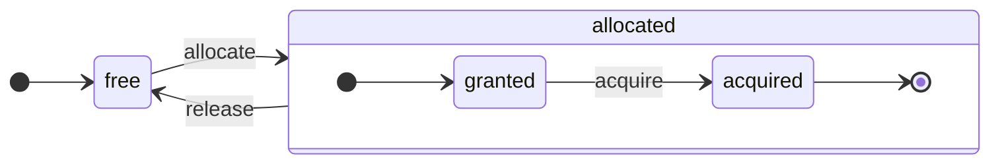

ClickHouse는 진정한 컬럼 지향 DBMS입니다. 데이터는 컬럼별로 저장되며, 실행 중에는 배열(벡터 또는 컬럼 청크) 단위로 처리됩니다.
가능한 경우 연산은 개별 값이 아니라 배열에 대해 수행됩니다.
이를 &quot;벡터화된 쿼리 실행&quot;이라고 하며, 실제 데이터 처리 비용을 낮추는 데 도움이 됩니다.

이 개념은 새로운 것이 아닙니다.
이는 `APL`(프로그래밍 언어, 1957)과 그 계열 언어인 `A +`(APL 방언), `J`(1990), `K`(1993), `Q`(Kx Systems의 프로그래밍 언어, 2003)까지 거슬러 올라갑니다.
배열 프로그래밍은 과학 데이터 처리에 사용됩니다. 또한 이 개념은 관계형 데이터베이스에서도 새로운 것이 아닙니다. 예를 들어 `VectorWise` 시스템(Actian Corporation의 Actian Vector Analytic Database라고도 함)에서도 사용됩니다.

쿼리 처리 속도를 높이는 방식에는 두 가지가 있습니다. 벡터화된 쿼리 실행과 런타임 코드 생성입니다. 후자는 모든 간접 참조와 동적 디스패치를 제거합니다. 이 두 접근 방식 중 어느 하나가 다른 하나보다 절대적으로 우수하다고 할 수는 없습니다. 런타임 코드 생성은 여러 연산을 결합해 CPU 실행 유닛과 파이프라인을 충분히 활용할 수 있을 때 더 유리할 수 있습니다. 벡터화된 쿼리 실행은 캐시에 기록했다가 다시 읽어야 하는 임시 벡터를 수반하므로 덜 실용적일 수 있습니다. 임시 데이터가 L2 캐시에 들어가지 않으면 문제가 될 수 있습니다. 하지만 벡터화된 쿼리 실행은 CPU의 SIMD capability를 더 쉽게 활용할 수 있습니다. 동료들이 작성한 [연구 논문](http://15721.courses.cs.cmu.edu/spring2016/papers/p5-sompolski.pdf)에서는 두 접근 방식을 결합하는 편이 더 낫다는 점을 보여줍니다. ClickHouse는 벡터화된 쿼리 실행을 사용하며, 런타임 코드 생성도 제한적으로 초기 지원합니다.

  ## 컬럼

메모리에서 컬럼(실제로는 컬럼 청크)을 표현하는 데 `IColumn` 인터페이스를 사용합니다. 이 인터페이스는 다양한 관계형 연산자를 구현하는 데 도움이 되는 메서드를 제공합니다. 거의 모든 연산은 불변입니다. 즉, 원본 컬럼을 수정하지 않고 수정된 새 컬럼을 만듭니다. 예를 들어 `IColumn :: filter` 메서드는 필터링 바이트 마스크를 받습니다. 이 메서드는 `WHERE` 및 `HAVING` 관계형 연산자에 사용됩니다. 추가 예시로, `ORDER BY`를 지원하는 `IColumn :: permute` 메서드와 `LIMIT`를 지원하는 `IColumn :: cut` 메서드가 있습니다.

다양한 `IColumn` 구현체(`ColumnUInt8`, `ColumnString` 등)는 컬럼의 메모리 레이아웃을 담당합니다. 메모리 레이아웃은 보통 연속된 배열입니다. 정수형 컬럼은 `std :: vector`처럼 하나의 연속된 배열만 사용합니다. `String` 및 `배열` 컬럼은 두 개의 벡터를 사용합니다. 하나는 모든 배열 요소를 연속적으로 저장하고, 다른 하나는 각 배열의 시작 위치에 대한 오프셋을 저장합니다. 메모리에는 값 하나만 저장하지만 컬럼처럼 보이는 `ColumnConst`도 있습니다.

  ## 필드

그렇더라도 개별 값 단위로 작업할 수도 있습니다. 개별 값을 표현할 때는 `Field`를 사용합니다. `Field`는 `UInt64`, `Int64`, `Float64`, `String`, 배열에 대한 판별 유니언일 뿐입니다. `IColumn`에는 n번째 값을 `Field`로 가져오는 `operator []` 메서드와, `Field`를 컬럼 끝에 추가하는 `insert` 메서드가 있습니다. 이러한 메서드는 개별 값을 나타내는 임시 `Field` 객체를 다뤄야 하므로 그다지 효율적이지 않습니다. `insertFrom`, `insertRangeFrom` 등 더 효율적인 메서드도 있습니다.

`Field`에는 테이블의 특정 데이터 타입에 관한 정보가 충분하지 않습니다. 예를 들어 `UInt8`, `UInt16`, `UInt32`, `UInt64`는 모두 `Field`에서는 `UInt64`로 표현됩니다.

  ## 새는 추상화

`IColumn`에는 데이터의 일반적인 관계형 변환을 위한 메서드가 있지만, 모든 요구 사항을 충족하지는 못합니다. 예를 들어 `ColumnUInt64`에는 두 컬럼의 합을 계산하는 메서드가 없고, `ColumnString`에는 부분 문자열을 검색하는 메서드가 없습니다. 이처럼 수많은 루틴은 `IColumn` 외부에서 구현됩니다.

컬럼에 대한 다양한 함수는 `IColumn` 메서드로 `Field` 값을 추출하는 일반적이지만 비효율적인 방식으로 구현할 수도 있고, 특정 `IColumn` 구현의 데이터 내부 메모리 레이아웃에 대한 지식을 활용하는 특화된 방식으로 구현할 수도 있습니다. 이는 함수를 특정 `IColumn` 유형으로 캐스팅한 뒤 내부 표현을 직접 다루는 방식으로 이루어집니다. 예를 들어 `ColumnUInt64`에는 내부 배열에 대한 참조를 반환하는 `getData` 메서드가 있으며, 그러면 별도의 루틴이 그 배열을 직접 읽거나 채울 수 있습니다. 다양한 루틴을 효율적으로 특화할 수 있도록 이러한 &quot;새는 추상화&quot;를 사용합니다.

  ## 데이터 타입

`IDataType`는 직렬화와 역직렬화를 담당합니다. 즉, 컬럼의 청크나 개별 값을 바이너리 또는 텍스트 형식으로 읽고 쓰는 역할을 합니다. `IDataType`는 테이블의 데이터 타입에 직접 대응합니다. 예를 들어 `DataTypeUInt32`, `DataTypeDateTime`, `DataTypeString` 등이 있습니다.

`IDataType`와 `IColumn`은 서로 느슨하게만 연결되어 있습니다. 서로 다른 데이터 타입이 메모리에서 동일한 `IColumn` 구현으로 표현될 수 있습니다. 예를 들어 `DataTypeUInt32`와 `DataTypeDateTime`는 모두 `ColumnUInt32` 또는 `ColumnConstUInt32`로 표현됩니다. 또한 같은 데이터 타입이 서로 다른 `IColumn` 구현으로 표현될 수도 있습니다. 예를 들어 `DataTypeUInt8`는 `ColumnUInt8` 또는 `ColumnConstUInt8`로 표현될 수 있습니다.

`IDataType`는 메타데이터만 저장합니다. 예를 들어 `DataTypeUInt8`는 아무것도 저장하지 않으며(`vptr` 가상 포인터는 제외), `DataTypeFixedString`는 `N`만 저장합니다(고정 길이 문자열의 크기).

`IDataType`에는 다양한 데이터 포맷을 위한 헬퍼 메서드도 있습니다. 예를 들어 값에 따옴표 처리가 필요할 수 있을 때 이를 직렬화하는 메서드, 값을 JSON용으로 직렬화하는 메서드, 값을 XML 포맷의 일부로 직렬화하는 메서드가 있습니다. 하지만 데이터 포맷과 직접 대응되지는 않습니다. 예를 들어 서로 다른 데이터 포맷인 `Pretty`와 `TabSeparated`가 `IDataType` 인터페이스의 동일한 `serializeTextEscaped` 헬퍼 메서드를 사용할 수 있습니다.

  ## Block

`Block`은 메모리에서 테이블의 일부(청크)를 나타내는 컨테이너입니다. 이는 `(IColumn, IDataType, column name)` 형태의 3개 요소 집합일 뿐입니다. 쿼리 실행 중에는 데이터가 `Block` 단위로 처리됩니다. `Block`이 있으면 데이터(`IColumn` 객체에 있음)가 있고, 해당 컬럼을 어떻게 처리해야 하는지 알려주는 타입 정보(`IDataType`에 있음)가 있으며, 컬럼 이름도 있습니다. 이 이름은 테이블의 원래 컬럼 이름일 수도 있고, 계산의 임시 결과를 얻기 위해 부여한 인위적인 이름일 수도 있습니다.

블록의 컬럼들에 대해 어떤 함수를 계산할 때는 그 결과를 담은 새 컬럼을 블록에 추가하며, 연산은 불변이므로 함수의 인수로 사용된 컬럼은 건드리지 않습니다. 이후 불필요한 컬럼은 블록에서 제거할 수 있지만 수정할 수는 없습니다. 이는 공통 부분 표현식을 제거하는 데 유용합니다.

블록은 처리되는 각 데이터 청크마다 생성됩니다. 같은 종류의 계산에서는 서로 다른 블록이라도 컬럼 이름과 타입은 동일하게 유지되고 컬럼 데이터만 변경된다는 점에 유의하십시오. 블록 크기가 작으면 `shared_ptr`와 컬럼 이름을 복사할 때 생성되는 임시 문자열로 인한 오버헤드가 크므로, 블록 데이터와 블록 헤더를 분리하는 편이 더 낫습니다.

  ## 프로세서

설명은 [https://github.com/ClickHouse/ClickHouse/blob/master/src/Processors/IProcessor.h](https://github.com/ClickHouse/ClickHouse/blob/master/src/Processors/IProcessor.h)를 참조하십시오.

  ## 포맷

데이터 포맷은 프로세서를 통해 구현됩니다.

  ## I/O

바이트 지향 입력/출력에는 `ReadBuffer` 및 `WriteBuffer` 추상 클래스가 사용됩니다. 이 클래스들은 C++ `iostream` 대신 사용됩니다. 걱정할 필요는 없습니다. 충분히 성숙한 C++ 프로젝트라면 대개 타당한 이유로 `iostream` 대신 다른 것을 사용합니다.

`ReadBuffer` 및 `WriteBuffer`는 연속된 버퍼와, 그 버퍼 내 위치를 가리키는 커서로 이루어져 있을 뿐입니다. 구현에 따라 버퍼 메모리를 소유할 수도 있고 소유하지 않을 수도 있습니다. 또한 버퍼를 다음 데이터로 채우는(`ReadBuffer`의 경우) 또는 버퍼의 내용을 어딘가로 플러시하는(`WriteBuffer`의 경우) 가상 메서드가 있습니다. 이러한 가상 메서드는 실제로는 거의 호출되지 않습니다.

`ReadBuffer`/`WriteBuffer` 구현은 파일, 파일 디스크립터, 네트워크 소켓을 다룰 때 사용되며, 압축을 구현하는 데도 쓰입니다(`CompressedWriteBuffer`는 다른 WriteBuffer로 초기화되며, 데이터를 그곳에 쓰기 전에 압축을 수행합니다). 그 밖의 용도도 있으며, `ConcatReadBuffer`, `LimitReadBuffer`, `HashingWriteBuffer`라는 이름만 봐도 역할을 짐작할 수 있습니다.

Read/WriteBuffer는 바이트만 처리합니다. 입력/출력 포매팅을 돕기 위해 `ReadHelpers` 및 `WriteHelpers` 헤더 파일에 여러 함수가 제공됩니다. 예를 들어 숫자를 10진수 포맷으로 쓰는 헬퍼가 있습니다.

이제 결과 집합을 `JSON` 포맷으로 stdout에 쓸 때 어떤 일이 일어나는지 살펴보겠습니다.
가져올 준비가 된 결과 집합이 pulling `QueryPipeline`에 있습니다.
먼저 stdout에 바이트를 쓰기 위해 `WriteBufferFromFileDescriptor(STDOUT_FILENO)`를 생성합니다.
다음으로 쿼리 파이프라인의 결과를 `JSONRowOutputFormat`에 연결합니다. 이 `JSONRowOutputFormat`은 해당 `WriteBuffer`로 초기화되며, 행을 `JSON` 포맷으로 stdout에 씁니다.
이 작업은 `complete` 메서드로 수행할 수 있으며, 이 메서드는 pulling `QueryPipeline`을 완료된 `QueryPipeline`으로 변환합니다.
내부적으로 `JSONRowOutputFormat`은 다양한 JSON 구분 기호를 쓰고, `IColumn`에 대한 참조와 행 번호를 인수로 `IDataType::serializeTextJSON` 메서드를 호출합니다. 그러면 `IDataType::serializeTextJSON`은 `WriteHelpers.h`의 메서드를 호출합니다. 예를 들어 숫자 타입에는 `writeText`, `DataTypeString`에는 `writeJSONString`를 호출합니다.

  ## 테이블

`IStorage` 인터페이스는 테이블을 나타냅니다. 이 인터페이스의 각 구현은 서로 다른 테이블 엔진에 해당합니다. 예를 들어 `StorageMergeTree`, `StorageMemory` 등이 있습니다. 이러한 클래스의 인스턴스는 곧 테이블입니다.

`IStorage`의 핵심 메서드는 `read`와 `write`이며, 이 외에도 `alter`, `rename`, `drop` 등의 메서드가 있습니다. `read` 메서드는 다음 인수를 받습니다. 테이블에서 읽을 컬럼 집합, 참조할 `AST` 쿼리, 그리고 원하는 스트림 수입니다. 이 메서드는 `Pipe`를 반환합니다.

대부분의 경우 `read` 메서드는 테이블에서 지정된 컬럼을 읽는 일만 담당하며, 그 이후의 데이터 처리까지 담당하지는 않습니다.
이후의 데이터 처리는 모두 파이프라인의 다른 부분에서 수행되며, 이는 `IStorage`의 책임 범위를 벗어납니다.

하지만 눈여겨볼 만한 예외도 있습니다:

* `AST` 쿼리는 `read` 메서드에 전달되며, 테이블 엔진은 이를 사용해 인덱스 활용 여부를 판단하고 테이블에서 더 적은 데이터를 읽을 수 있습니다.
* 경우에 따라 테이블 엔진이 직접 특정 단계까지 데이터를 처리할 수 있습니다. 예를 들어 `StorageDistributed`는 원격 서버로 쿼리를 보내고, 서로 다른 원격 서버의 데이터를 머지할 수 있는 단계까지 처리하도록 요청한 뒤, 그 전처리된 데이터를 반환할 수 있습니다. 그러면 쿼리 인터프리터가 나머지 처리를 완료합니다.

테이블의 `read` 메서드는 여러 프로세서로 구성된 `Pipe`를 반환할 수 있습니다. 이러한 프로세서는 테이블에서 데이터를 병렬로 읽을 수 있습니다.
그런 다음 이 프로세서들을 다양한 다른 변환(예: 표현식 평가 또는 필터링)과 연결할 수 있으며, 이러한 변환은 독립적으로 계산될 수 있습니다.
그리고 그 위에 `QueryPipeline`을 생성한 다음, `PipelineExecutor`를 통해 실행할 수 있습니다.

`TableFunction`도 있습니다. 이것은 쿼리의 `FROM` 절에서 사용할 임시 `IStorage` 객체를 반환하는 함수입니다.

테이블 엔진을 구현하는 방법을 빠르게 파악하려면 `StorageMemory`나 `StorageTinyLog`처럼 단순한 예제를 살펴보십시오.

> `read` 메서드의 결과로 `IStorage`는 `QueryProcessingStage`를 반환합니다. 이는 쿼리의 어떤 부분이 스토리지 내부에서 이미 계산되었는지를 나타내는 정보입니다.

  ## 파서

수작업으로 작성한 재귀 하강 파서가 쿼리를 파싱합니다. 예를 들어 `ParserSelectQuery`는 쿼리의 여러 파트에 대해 하위 파서를 재귀적으로 호출할 뿐입니다. 파서는 `AST`를 생성합니다. `AST`는 `IAST`의 인스턴스인 노드로 표현됩니다.

> 역사적인 이유로 parser generator는 사용하지 않습니다.

  ## Interpreters

Interpreters는 AST로부터 쿼리 실행 파이프라인을 생성하는 역할을 합니다. `InterpreterExistsQuery`, `InterpreterDropQuery`와 같은 단순한 인터프리터도 있고, 더 복잡한 `InterpreterSelectQuery`도 있습니다.

쿼리 실행 파이프라인은 청크(특정 타입의 컬럼 집합)를 소비하고 생성할 수 있는 processor들의 조합입니다.
processor는 port를 통해 통신하며, 여러 개의 입력 port와 출력 port를 가질 수 있습니다.
더 자세한 설명은 [src/Processors/IProcessor.h](https://github.com/ClickHouse/ClickHouse/blob/master/src/Processors/IProcessor.h)에서 확인할 수 있습니다.

예를 들어, `SELECT` 쿼리를 해석한 결과는 결과 집합을 읽기 위한 특수한 출력 port를 갖는 &quot;pulling&quot; `QueryPipeline`입니다.
`INSERT` 쿼리를 해석한 결과는 삽입할 데이터를 기록하기 위한 입력 port를 갖는 &quot;pushing&quot; `QueryPipeline`입니다.
또한 `INSERT SELECT` 쿼리를 해석한 결과는 입력이나 출력은 없지만 `SELECT`에서 `INSERT`로 데이터를 동시에 복사하는 &quot;completed&quot; `QueryPipeline`입니다.

`InterpreterSelectQuery`는 쿼리 분석과 변환을 위해 `ExpressionAnalyzer`와 `ExpressionActions` 메커니즘을 사용합니다. 대부분의 규칙 기반 쿼리 최적화는 여기에서 수행됩니다. `ExpressionAnalyzer`는 구조가 상당히 복잡하므로 다시 작성할 필요가 있습니다. 다양한 쿼리 변환과 최적화는 별도의 클래스로 분리하여 쿼리를 모듈식으로 변환할 수 있어야 합니다.

인터프리터에 존재하는 문제를 해결하기 위해 새로운 `InterpreterSelectQueryAnalyzer`가 개발되었습니다. 이는 `ExpressionAnalyzer`를 사용하지 않는 `InterpreterSelectQuery`의 새 버전이며, `AST`와 `QueryPipeline` 사이에 `QueryTree`라는 추가 추상화 계층을 도입합니다. 프로덕션 환경에서 사용하기에 충분히 준비되어 있지만, 만일에 대비해 `enable_analyzer` 설정 값을 `false`로 지정하여 비활성화할 수 있습니다.

  ## 함수

일반 함수와 집계 함수가 있습니다. 집계 함수는 다음 섹션을 참조하십시오.

일반 함수는 행 수를 변경하지 않습니다. 즉, 각 행을 서로 독립적으로 처리하는 것처럼 동작합니다. 실제로는 함수가 개별 행마다 호출되는 것이 아니라, 벡터화된 쿼리 실행을 구현하기 위해 데이터 `Block` 단위로 호출됩니다.

[blockSize](/ko/reference/functions/regular-functions/other-functions#blockSize), [rowNumberInBlock](/ko/reference/functions/regular-functions/other-functions#rowNumberInBlock), [runningAccumulate](/ko/reference/functions/regular-functions/other-functions#runningAccumulate) 같은 일부 기타 함수는 블록 처리를 활용하므로 행의 독립성을 깨뜨립니다.

ClickHouse는 강한 타입 체계를 사용하므로 암시적 타입 변환이 없습니다. 함수가 특정 타입 조합을 지원하지 않으면 예외를 발생시킵니다. 하지만 함수는 여러 서로 다른 타입 조합에 대해 동작할 수 있습니다(오버로드될 수 있습니다). 예를 들어 `plus` 함수(`+` 연산자를 구현)는 숫자 타입의 모든 조합에 대해 동작합니다. 예를 들어 `UInt8` + `Float32`, `UInt16` + `Int8` 등이 있습니다. 또한 `concat` 함수처럼 일부 가변 인수 함수는 임의 개수의 인수를 받을 수 있습니다.

함수를 구현하는 작업은 다소 번거로울 수 있는데, 함수가 지원되는 데이터 타입과 지원되는 `IColumns`를 명시적으로 디스패치해야 하기 때문입니다. 예를 들어 `plus` 함수에는 숫자 타입의 각 조합과, 왼쪽 및 오른쪽 인수가 상수인지 비상수인지에 따른 각 경우에 대해 C++ 템플릿 인스턴스화로 생성된 코드가 있습니다.

템플릿 코드 비대화를 피하기 위해 런타임 코드 생성을 구현하기에 매우 적합한 지점입니다. 또한 fused multiply-add 같은 결합 함수를 추가하거나, 한 번의 루프 반복에서 여러 비교를 수행할 수도 있습니다.

벡터화된 쿼리 실행 때문에 함수는 단락 평가되지 않습니다. 예를 들어 `WHERE f(x) AND g(y)`를 작성하면 `f(x)`가 0인 행에 대해서도 양쪽이 모두 계산됩니다(`f(x)`가 0인 상수 표현식인 경우는 제외). 하지만 `f(x)` 조건의 선택도가 높고 `f(x)` 계산 비용이 `g(y)`보다 훨씬 낮다면, 다중 패스 계산을 구현하는 편이 더 낫습니다. 먼저 `f(x)`를 계산하고, 그 결과로 컬럼을 필터링한 다음, 더 작게 필터링된 데이터 청크에 대해서만 `g(y)`를 계산합니다.

  ## 집계 함수

집계 함수는 상태를 유지하는 함수입니다. 입력된 값을 어떤 상태에 누적하고, 그 상태로부터 결과를 얻을 수 있습니다. 이러한 함수는 `IAggregateFunction` 인터페이스로 관리됩니다. 상태는 매우 단순할 수도 있고(`AggregateFunctionCount`의 상태는 단일 `UInt64` 값일 뿐입니다), 상당히 복잡할 수도 있습니다(`AggregateFunctionUniqCombined`의 상태는 선형 배열, 해시 테이블, `HyperLogLog` 확률적 데이터 구조의 조합입니다).

상태는 카디널리티가 높은 `GROUP BY` 쿼리를 실행하는 동안 여러 상태를 처리하기 위해 `Arena`(메모리 풀)에 할당됩니다. 상태에는 단순하지 않은 생성자와 소멸자가 있을 수 있습니다. 예를 들어, 복잡한 집계 상태는 자체적으로 추가 메모리를 할당할 수 있습니다. 따라서 상태를 생성하고 소멸시키는 과정과 소유권 및 소멸 순서를 올바르게 전달하는 데 주의가 필요합니다.

집계 상태는 분산 쿼리 실행 중 네트워크를 통해 전달하거나, RAM이 충분하지 않을 때 디스크에 기록할 수 있도록 직렬화 및 역직렬화할 수 있습니다. 또한 `DataTypeAggregateFunction`을 사용해 테이블에 저장하면 데이터를 점진적으로 집계할 수도 있습니다.

> 집계 함수 상태의 직렬화된 데이터 포맷에는 현재 버전 정보가 없습니다. 집계 상태를 일시적으로만 저장한다면 괜찮습니다. 하지만 점진적 집계를 위한 `AggregatingMergeTree` 테이블 엔진이 있고, 이미 이를 프로덕션 환경에서 사용하고 있습니다. 따라서 앞으로 어떤 집계 함수의 직렬화 포맷을 변경하더라도 하위 호환성이 필요합니다.

  ## 서버

서버는 여러 인터페이스를 구현합니다:

* 외부 클라이언트를 위한 HTTP 인터페이스.
* 네이티브 clickhouse client와 분산 쿼리 실행 중 서버 간 통신을 위한 TCP 인터페이스.
* 복제를 위한 데이터 전송 인터페이스.

내부적으로는 코루틴이나 파이버 없이 동작하는 기본적인 멀티스레드 서버일 뿐입니다. 서버는 단순한 쿼리를 높은 빈도로 처리하기보다, 비교적 낮은 빈도로 들어오는 복잡한 쿼리를 처리하도록 설계되었습니다. 따라서 각 쿼리는 분석을 위해 방대한 양의 데이터를 처리할 수 있습니다.

서버는 쿼리 실행에 필요한 환경으로 `Context` 클래스를 초기화합니다. 여기에는 사용 가능한 데이터베이스 목록, 사용자와 접근 권한, 설정, 클러스터, 프로세스 목록, 쿼리 로그 등이 포함됩니다. Interpreters는 이 환경을 사용합니다.

서버 TCP 프로토콜은 완전한 하위 및 상위 호환성을 유지합니다. 즉, 오래된 클라이언트는 새 서버와 통신할 수 있고, 새 클라이언트는 오래된 서버와도 통신할 수 있습니다. 하지만 이를 영구적으로 유지할 계획은 없으며, 약 1년 후에는 오래된 버전에 대한 지원을 제거합니다.

<Note>
  대부분의 외부 애플리케이션에는 HTTP 인터페이스 사용을 권장합니다. 단순하고 사용하기 쉽기 때문입니다. TCP 프로토콜은 내부 데이터 구조와 더 밀접하게 연결되어 있습니다. 데이터 블록을 전달할 때 내부 포맷을 사용하고, 압축된 데이터에는 사용자 정의 프레이밍을 사용합니다.
</Note>

  ## 구성

ClickHouse 서버는 POCO C++ Libraries를 기반으로 하며, 구성을 표현하기 위해 `Poco::Util::AbstractConfiguration`을 사용합니다. 구성은 `DaemonBase` 클래스가 상속하는 `Poco::Util::ServerApplication` 클래스에서 관리되며, `DaemonBase` 클래스는 다시 clickhouse-server 자체를 구현하는 `DB::Server` 클래스의 기반 클래스입니다. 따라서 `ServerApplication::config()` 메서드로 구성에 접근할 수 있습니다.

구성은 여러 파일(XML 또는 YAML 포맷)에서 읽어와 `ConfigProcessor` 클래스가 하나의 `AbstractConfiguration`으로 머지합니다. 구성은 서버 시작 시 로드되며, 이후 구성 파일 중 하나가 업데이트, 제거 또는 추가되면 다시 로드할 수 있습니다. `ConfigReloader` 클래스는 이러한 변경 사항을 주기적으로 모니터링하고 리로드 절차도 담당합니다. `SYSTEM RELOAD CONFIG` 쿼리로도 구성을 다시 로드할 수 있습니다.

`Server` 이외의 쿼리 및 하위 시스템에서는 `Context::getConfigRef()` 메서드로 구성에 접근할 수 있습니다. 서버를 재시작하지 않고 구성을 다시 로드할 수 있는 모든 하위 시스템은 `Server::main()` 메서드의 리로드 콜백에 자신을 등록해야 합니다. 새 구성에 오류가 있으면 대부분의 하위 시스템은 새 구성을 무시하고 경고 메시지를 기록한 뒤, 이전에 로드된 구성으로 계속 동작한다는 점에 유의하십시오. `AbstractConfiguration`의 특성상 특정 섹션에 대한 참조를 전달할 수 없으므로, 일반적으로 대신 `String config_prefix`를 사용합니다.

  ### Context

ClickHouse는 Context 계층 구조를 통해 설정을 관리합니다.

* **Global context** - 구성 파일로 정의되는 서버 전체 설정
* **Session context** - 프로필, 사용자 구성, `SET` 명령의 사용자 세션 설정
* **Query context** - `SETTINGS` 절의 쿼리 수준 설정
* **Background context** - &#39;background&#39; 프로필에 정의된 백그라운드 작업(Mutate, Merge)용 서버 전체 설정

작업(쿼리, 뮤테이션 등)을 스케줄링할 때 server는 다음 순서로 설정을 머지하여 해당 Context를 구성합니다(뒤의 항목이 앞의 항목을 덮어씁니다).

1. 전역 기본값
2. 전역 구성
3. 프로필 설정(`<profiles>` 섹션)
4. 사용자 설정(`<users>` 섹션)
5. 세션 설정(`SET` 명령)
6. 쿼리 설정(`SETTINGS` 절)

<Note>
  백그라운드 작업은 전역 설정과 &#39;background&#39; 프로필 설정으로 구성할 수 있으며, 이 경우 세션 설정과 쿼리 설정은 적용되지 않습니다. 명시적인 구성이 없으면 전역 Context의 구성을 상속합니다. 이러한 작업의 기본 프로필 이름은 &#39;background&#39;이며, `background_profile` server setting으로 재정의할 수 있습니다.
</Note>

  ## 스레드와 작업

ClickHouse는 쿼리를 실행하고 부가 작업을 수행할 때, 스레드를 자주 생성하고 종료하는 오버헤드를 피하기 위해 여러 스레드 풀 중 하나에서 스레드를 할당합니다. 스레드 풀은 몇 가지가 있으며, 작업의 목적과 구조에 따라 선택됩니다.

* 들어오는 클라이언트 세션을 위한 서버 풀.
* 범용 작업, 백그라운드 활동, standalone 스레드를 위한 Global Thread 풀.
* 주로 일부 IO로 인해 대기 상태에 있으며 CPU 집약적이지 않은 작업을 위한 IO 스레드 풀.
* 주기적 작업을 위한 백그라운드 풀.
* 여러 단계로 나눌 수 있는 선점 가능 작업을 위한 풀.

서버 풀은 `Server::main()` 메서드에 정의된 `Poco::ThreadPool` 클래스 인스턴스입니다. 이 풀은 최대 `max_connection`개의 스레드를 가질 수 있습니다. 각 스레드는 하나의 활성 connection에 전담됩니다.

Global Thread 풀은 `GlobalThreadPool` singleton 클래스입니다. 여기서 스레드를 할당할 때는 `ThreadFromGlobalPool`을 사용합니다. 이것은 `std::thread`와 유사한 interface를 제공하지만, 글로벌 풀에서 스레드를 가져오고 필요한 모든 초기화를 수행합니다. 다음 설정으로 구성됩니다.

* `max_thread_pool_size` - 풀의 스레드 수 제한.
* `max_thread_pool_free_size` - 새 작업을 기다리는 idle 스레드 수 제한.
* `thread_pool_queue_size` - 예약된 작업 수 제한.

글로벌 풀은 범용 풀이며, 아래에 설명하는 모든 풀은 이를 기반으로 구현됩니다. 이를 풀의 계층 구조로 볼 수 있습니다. 모든 특수 풀은 `ThreadPool` 클래스를 사용해 글로벌 풀에서 스레드를 가져옵니다. 따라서 특수 풀의 주된 목적은 동시에 실행되는 작업 수를 제한하고 작업 스케줄링을 수행하는 것입니다. 풀의 스레드 수보다 더 많은 작업이 예약되면 `ThreadPool`은 우선순위가 있는 큐에 작업을 쌓아 둡니다. 각 작업에는 정수 우선순위가 있습니다. 기본 우선순위는 0입니다. 우선순위 값이 더 높은 작업은 우선순위 값이 더 낮은 작업보다 먼저 시작됩니다. 하지만 이미 실행 중인 작업들 사이에는 차이가 없으므로, 우선순위는 풀이 과부하된 경우에만 의미가 있습니다.

IO 스레드 풀은 `IOThreadPool::get()` 메서드로 접근할 수 있는 일반 `ThreadPool`로 구현됩니다. 이 풀은 `max_io_thread_pool_size`, `max_io_thread_pool_free_size`, `io_thread_pool_queue_size` 설정을 사용해 글로벌 풀과 같은 방식으로 구성됩니다. IO 스레드 풀의 주된 목적은 IO 작업 때문에 글로벌 풀이 고갈되는 것을 방지하는 것입니다. 그렇지 않으면 쿼리가 CPU를 충분히 활용하지 못할 수 있습니다. S3로 Backup하는 작업은 상당한 양의 IO 작업을 수행하므로, 대화형 쿼리에 미치는 영향을 피하기 위해 `max_backups_io_thread_pool_size`, `max_backups_io_thread_pool_free_size`, `backups_io_thread_pool_queue_size` 설정으로 구성되는 별도의 `BackupsIOThreadPool`이 있습니다.

주기적 작업 실행을 위해 `BackgroundSchedulePool` 클래스가 있습니다. `BackgroundSchedulePool::TaskHolder` 객체를 사용해 작업을 등록할 수 있으며, 이 풀은 어떤 작업도 동시에 두 개의 job을 실행하지 않도록 보장합니다. 또한 작업 실행을 미래의 특정 시점으로 미루거나 작업을 일시적으로 비활성화할 수도 있습니다. 글로벌 `Context`는 서로 다른 목적을 위해 이 클래스의 몇 가지 인스턴스를 제공합니다. 범용 작업에는 `Context::getSchedulePool()`이 사용됩니다.

선점 가능 작업을 위한 특수 스레드 풀도 있습니다. 이러한 `IExecutableTask` 작업은 steps라고 하는 순서 있는 job 시퀀스로 나눌 수 있습니다. 짧은 작업이 긴 작업보다 우선되도록 이러한 작업을 스케줄링하기 위해 `MergeTreeBackgroundExecutor`가 사용됩니다. 이름에서 알 수 있듯이, 이는 머지, 뮤테이션, fetches, 이동 작업과 같은 MergeTree 관련 백그라운드 작업에 사용됩니다. 풀 인스턴스는 `Context::getCommonExecutor()` 및 이와 유사한 다른 메서드로 사용할 수 있습니다.

작업에 어떤 풀이 사용되든, 시작 시 이 작업을 위한 `ThreadStatus` 인스턴스가 생성됩니다. 여기에는 스레드 id, 쿼리 id, 성능 카운터, 리소스 활용량 등 스레드별 모든 정보와 기타 유용한 데이터가 캡슐화됩니다. 작업은 `CurrentThread::get()` 호출로 thread local 포인터를 통해 이에 접근할 수 있으므로, 이를 모든 함수에 전달할 필요가 없습니다.

스레드가 쿼리 실행과 관련되어 있다면, `ThreadStatus`에 연결되는 가장 중요한 것은 쿼리 Context인 `ContextPtr`입니다. 모든 쿼리는 서버 풀에 master 스레드를 가집니다. master 스레드는 `ThreadStatus::QueryScope query_scope(query_context)` 객체를 유지함으로써 이를 연결합니다. master 스레드는 또한 `ThreadGroupStatus` 객체로 표현되는 스레드 그룹을 생성합니다. 이 쿼리 실행 중에 할당되는 모든 추가 스레드는 `CurrentThread::attachTo(thread_group)` 호출로 해당 스레드 그룹에 연결됩니다. 스레드 그룹은 단일 작업에 전담된 모든 스레드의 프로파일 이벤트 카운터를 집계하고 메모리 사용량을 추적하는 데 사용됩니다(자세한 내용은 `MemoryTracker` 및 `ProfileEvents::Counters` 클래스를 참조하십시오).

  ## 동시성 제어

병렬화할 수 있는 쿼리는 `max_threads` 설정으로 자체 실행을 제한합니다. 이 설정의 기본값은 단일 쿼리가 모든 CPU 코어를 가장 효율적으로 활용할 수 있도록 선택됩니다. 하지만 동시에 여러 쿼리가 실행되고, 각 쿼리가 기본 `max_threads` 설정값을 사용하면 어떻게 될까요? 이 경우 쿼리들이 CPU 리소스를 서로 공유하게 됩니다. OS는 스레드를 지속적으로 전환해 공정성을 보장하지만, 이 과정에서 일정한 성능 저하가 발생합니다. `ConcurrencyControl`은 이러한 성능 저하를 완화하고 과도하게 많은 스레드가 할당되는 것을 방지하는 데 도움이 됩니다. 구성 설정 `concurrent_threads_soft_limit_num`은 일종의 CPU 부하가 적용되기 전에 할당할 수 있는 동시 스레드 수를 제한하는 데 사용됩니다.

CPU `slot`이라는 개념을 도입합니다. 슬롯은 동시성의 단위입니다. 스레드를 실행하려면 쿼리가 먼저 슬롯을 획득해야 하며, 스레드가 중지되면 이를 해제해야 합니다. 슬롯 수는 서버 전체에서 전역적으로 제한됩니다. 전체 수요가 전체 슬롯 수를 초과하면 동시에 실행되는 여러 쿼리가 CPU 슬롯을 두고 경쟁하게 됩니다. `ConcurrencyControl`은 CPU 슬롯을 공정하게 스케줄링하여 이러한 경쟁을 해결하는 역할을 합니다.

각 슬롯은 다음 상태를 갖는 독립적인 상태 머신으로 볼 수 있습니다.

* `free`: 슬롯을 어떤 쿼리든 할당받을 수 있는 상태입니다.
* `granted`: 슬롯이 특정 쿼리에 `allocated`되었지만, 아직 어떤 스레드도 이를 획득하지 않은 상태입니다.
* `acquired`: 슬롯이 특정 쿼리에 `allocated`되었고, 어떤 스레드가 이를 획득한 상태입니다.

`allocated` 슬롯은 `granted`와 `acquired`라는 두 가지 서로 다른 상태에 있을 수 있다는 점에 유의하십시오. 전자는 전이 상태이며, 실제로는 짧아야 합니다(슬롯이 쿼리에 할당되는 시점부터 해당 쿼리의 임의의 스레드가 업스케일링 절차를 실행하는 시점까지).

`ConcurrencyControl`의 API는 다음 함수로 구성됩니다:

1. 쿼리에 대한 리소스 할당을 생성합니다: `auto slots = ConcurrencyControl::instance().allocate(1, max_threads);`. 최소 1개, 최대 `max_threads`개의 슬롯을 할당합니다. 첫 번째 슬롯은 즉시 부여되지만, 나머지 슬롯은 나중에 부여될 수 있습니다. 따라서 이 제한은 소프트 제한입니다. 모든 쿼리가 최소 하나의 스레드는 확보하기 때문입니다.
2. 각 스레드마다 할당으로부터 슬롯을 획득해야 합니다: `while (auto slot = slots->tryAcquire()) spawnThread([slot = std::move(slot)] { ... });`.
3. 전체 슬롯 수를 업데이트합니다: `ConcurrencyControl::setMaxConcurrency(concurrent_threads_soft_limit_num)`. 서버를 재시작하지 않고 런타임에 수행할 수 있습니다.

이 API를 사용하면 쿼리가 최소 하나의 스레드로 시작한 뒤(CPU 압박이 있는 경우에도), 이후 `max_threads`까지 확장할 수 있습니다.

  ## 분산 쿼리 실행

클러스터를 구성하는 서버는 대부분 서로 독립적으로 동작합니다. 클러스터의 한 서버 또는 모든 서버에 `Distributed` 테이블을 생성할 수 있습니다. `Distributed` 테이블 자체는 데이터를 저장하지 않으며, 클러스터의 여러 노드에 있는 모든 로컬 테이블에 대한 &quot;뷰&quot;만 제공합니다. `Distributed` 테이블에서 SELECT를 수행하면 쿼리를 재작성하고, 로드 밸런싱 설정에 따라 원격 노드를 선택한 다음 해당 노드로 쿼리를 전송합니다. `Distributed` 테이블은 서로 다른 서버의 중간 결과를 머지할 수 있는 단계까지만 쿼리를 처리하도록 원격 서버에 요청합니다. 그런 다음 중간 결과를 받아 머지합니다. 분산 테이블은 가능한 한 많은 작업을 원격 서버로 분산하고, 네트워크를 통해 전송되는 중간 데이터의 양을 최소화하려고 합니다.

IN 또는 JOIN 절에 서브쿼리가 있고 각 서브쿼리에서 `Distributed` 테이블을 사용하는 경우, 상황은 더 복잡해집니다. 이러한 쿼리를 실행하기 위한 여러 전략이 있습니다.

분산 쿼리 실행에는 전역 쿼리 계획이 없습니다. 각 노드는 자신이 맡은 작업 부분에 대한 로컬 쿼리 계획을 가집니다. 현재는 단순한 단일 패스 분산 쿼리 실행만 지원합니다. 즉, 원격 노드에 쿼리를 보내고 결과를 머지하는 방식입니다. 하지만 이는 cardinality가 높은 `GROUP BY`가 있거나 JOIN을 위해 많은 양의 임시 데이터가 필요한 복잡한 쿼리에는 적합하지 않습니다. 이런 경우에는 서버 간에 데이터를 &quot;재분배&quot;해야 하며, 이를 위해 추가적인 조정이 필요합니다. ClickHouse는 이러한 종류의 쿼리 실행을 지원하지 않으며, 이에 대해서는 추가 작업이 필요합니다.

  ## Merge tree

`MergeTree`는 프라이머리 키(primary key) 기반 인덱싱을 지원하는 스토리지 엔진 패밀리입니다. 프라이머리 키는 임의의 컬럼이나 표현식의 튜플이 될 수 있습니다. `MergeTree` 테이블의 데이터는 &quot;파트&quot;에 저장됩니다. 각 파트는 프라이머리 키 순서로 데이터를 저장하므로, 데이터는 프라이머리 키 튜플을 기준으로 사전식 순서로 정렬됩니다. 테이블의 모든 컬럼은 각 파트 내에서 별도의 `column.bin` 파일에 저장됩니다. 파일은 압축된 블록으로 구성됩니다. 각 블록은 일반적으로 압축되지 않은 데이터 기준으로 64 KB에서 1 MB 사이이며, 평균 값 크기에 따라 달라집니다. 블록은 컬럼 값이 차례대로 연속 배치된 형태로 구성됩니다. 각 컬럼의 값은 동일한 순서로 저장되며(이 순서는 프라이머리 키가 정의함), 따라서 여러 컬럼을 순회하면 해당 행에 대응하는 값을 얻을 수 있습니다.

프라이머리 키 자체는 &quot;희소&quot;합니다. 즉, 모든 개별 행을 가리키는 것이 아니라 일부 데이터 범위만 가리킵니다. 별도의 `primary.idx` 파일에는 매 N번째 행의 프라이머리 키 값이 저장되며, 여기서 N을 `index_granularity`라고 합니다(보통 N = 8192). 또한 각 컬럼마다 &quot;마크&quot;가 들어 있는 `column.mrk` 파일이 있으며, 이는 데이터 파일에서 매 N번째 행에 대한 오프셋입니다. 각 마크는 한 쌍으로 구성됩니다. 하나는 파일에서 압축 블록 시작 위치까지의 오프셋이고, 다른 하나는 압축 해제된 블록에서 데이터 시작 위치까지의 오프셋입니다. 일반적으로 압축 블록은 마크 기준으로 정렬되며, 압축 해제된 블록 내 오프셋은 0입니다. `primary.idx`의 데이터는 항상 메모리에 상주하며, `column.mrk` 파일의 데이터는 캐시됩니다.

`MergeTree`의 파트에서 무언가를 읽으려고 할 때는 `primary.idx` 데이터를 확인해 요청한 데이터가 들어 있을 수 있는 범위를 찾고, 그다음 `column.mrk` 데이터를 확인해 해당 범위를 어디서부터 읽기 시작해야 하는지 오프셋을 계산합니다. 희소 구조이기 때문에 필요 이상의 데이터를 읽을 수 있습니다. ClickHouse는 단순한 포인트 쿼리가 매우 높은 부하로 들어오는 환경에는 적합하지 않습니다. 각 키마다 `index_granularity` 행이 포함된 전체 범위를 읽어야 하고, 각 컬럼마다 전체 압축 블록을 압축 해제해야 하기 때문입니다. 인덱스를 희소하게 만든 이유는 단일 server에서 수조 개의 행을 처리하더라도 인덱스로 인한 메모리 사용량이 눈에 띄게 늘지 않도록 하기 위해서입니다. 또한 프라이머리 키는 희소하므로 유일하지 않습니다. 즉, INSERT 시점에 테이블에 해당 키가 이미 존재하는지 확인할 수 없습니다. 하나의 테이블에 같은 키를 가진 행이 여러 개 있을 수 있습니다.

여러 데이터를 `INSERT`로 `MergeTree`에 삽입하면, 그 데이터 묶음은 프라이머리 키 순서로 정렬되어 새로운 파트를 형성합니다. 백그라운드 스레드가 주기적으로 일부 파트를 선택해 하나의 정렬된 파트로 머지하여 파트 수를 비교적 적게 유지합니다. 그래서 이름이 `MergeTree`입니다. 물론 머지는 &quot;쓰기 증폭&quot;을 유발합니다. 모든 파트는 불변입니다. 즉, 생성되거나 삭제될 뿐 수정되지는 않습니다. SELECT가 실행되면 테이블의 snapshot(파트 집합)을 유지합니다. 머지 이후에도 장애 발생 시 복구를 더 쉽게 하기 위해 한동안 이전 파트를 유지하므로, 어떤 병합된 파트가 손상된 것으로 보이면 해당 파트를 원본 파트들로 대체할 수 있습니다.

`MergeTree`는 MEMTABLE과 LOG를 포함하지 않으므로 LSM tree가 아닙니다. 삽입된 데이터는 파일 시스템에 직접 기록됩니다. 이러한 동작 방식 덕분에 MergeTree는 데이터를 batch로 삽입하는 데 훨씬 더 적합합니다. 따라서 적은 수의 행을 자주 삽입하는 방식은 MergeTree에 적합하지 않습니다. 예를 들어 초당 몇 개의 행을 삽입하는 것은 괜찮지만, 이를 초당 1,000번 수행하는 것은 MergeTree에 최적이 아닙니다. 하지만 이러한 한계를 극복하기 위해 작은 삽입을 위한 async insert 모드가 있습니다. 이렇게 설계한 이유는 단순성을 유지하기 위해서였고, 또한 애플리케이션에서 이미 데이터를 batch로 삽입하고 있기 때문입니다

일부 MergeTree 엔진은 백그라운드 머지 중에 추가 작업을 수행합니다. 예시로는 `CollapsingMergeTree`와 `AggregatingMergeTree`가 있습니다. 이는 update에 대한 특별한 지원으로 볼 수 있습니다. 다만 이것은 실제 update가 아니라는 점을 유의하십시오. 일반적으로 사용자는 백그라운드 머지가 언제 실행될지 제어할 수 없으며, `MergeTree` 테이블의 데이터는 거의 항상 완전히 머지된 형태가 아니라 둘 이상의 파트에 나뉘어 저장되기 때문입니다.

  ## 복제

ClickHouse의 복제는 테이블 단위로 구성할 수 있습니다. 동일한 서버에서 일부 테이블은 복제되고, 일부 테이블은 복제되지 않도록 설정할 수 있습니다. 또한 테이블마다 서로 다른 방식으로 복제되도록 구성할 수도 있습니다. 예를 들어 한 테이블은 2중 복제, 다른 테이블은 3중 복제로 설정할 수 있습니다.

복제는 `ReplicatedMergeTree` 스토리지 엔진에서 구현됩니다. `ZooKeeper`의 경로는 스토리지 엔진의 매개변수로 지정됩니다. `ZooKeeper`에서 동일한 경로를 사용하는 모든 테이블은 서로의 레플리카가 됩니다. 즉, 데이터를 동기화하고 일관성을 유지합니다. 레플리카는 테이블을 생성하거나 삭제하는 것만으로 동적으로 추가하거나 제거할 수 있습니다.

복제는 비동기 멀티 마스터 방식을 사용합니다. `ZooKeeper`와 세션이 있는 어느 레플리카에든 데이터를 삽입할 수 있으며, 데이터는 다른 모든 레플리카로 비동기적으로 복제됩니다. ClickHouse는 UPDATE를 지원하지 않으므로 복제 시 충돌이 발생하지 않습니다. 기본적으로 삽입에 대한 quorum 승인(acknowledgment)이 없기 때문에 노드 하나에 장애가 발생하면 방금 삽입한 데이터가 손실될 수 있습니다. 삽입 quorum은 `insert_quorum` 설정으로 활성화할 수 있습니다.

복제 메타데이터는 ZooKeeper에 저장됩니다. 수행해야 할 작업을 나열한 복제 로그가 있습니다. 작업에는 파트 가져오기, 파트 머지, 파티션 삭제 등이 있습니다. 각 레플리카는 복제 로그를 자신의 큐로 복사한 다음, 큐에 있는 작업을 실행합니다. 예를 들어 삽입 시에는 로그에 &quot;파트 가져오기&quot; 작업이 생성되고, 모든 레플리카가 해당 파트를 다운로드합니다. 머지는 바이트 단위까지 동일한 결과를 얻을 수 있도록 레플리카 간에 조정됩니다. 모든 파트는 모든 레플리카에서 동일한 방식으로 머지됩니다. 리더 중 하나가 먼저 새 머지를 시작하고 로그에 &quot;파트 머지&quot; 작업을 기록합니다. 여러 레플리카(또는 전체)가 동시에 리더가 될 수 있습니다. `merge_tree` 설정의 `replicated_can_become_leader`를 사용하면 레플리카가 리더가 되지 않도록 할 수 있습니다. 리더는 백그라운드 머지를 스케줄링하는 역할을 담당합니다.

복제는 물리적으로 수행됩니다. 즉, 노드 간에 전송되는 것은 쿼리가 아니라 압축된 파트뿐입니다. 대부분의 경우 네트워크 증폭을 피해 네트워크 비용을 줄이기 위해 머지는 각 레플리카에서 독립적으로 처리됩니다. 크게 병합된 파트는 복제 지연이 상당한 경우에만 네트워크를 통해 전송됩니다.

또한 각 레플리카는 파트 집합과 해당 체크섬 형태로 자신의 상태를 ZooKeeper에 저장합니다. 로컬 파일 시스템의 상태가 ZooKeeper의 기준 상태와 달라지면, 레플리카는 다른 레플리카에서 누락되거나 손상된 파트를 다운로드하여 일관성을 복원합니다. 로컬 파일 시스템에 예기치 않거나 손상된 데이터가 있으면 ClickHouse는 이를 제거하지 않고 별도의 디렉터리로 이동한 뒤 더 이상 관리하지 않습니다.

<Note>
  ClickHouse 클러스터는 독립적인 세그먼트로 구성되며, 각 세그먼트는 레플리카들로 이루어집니다. 이 클러스터는 **탄력적이지 않으므로**, 새 세그먼트를 추가해도 데이터가 세그먼트 간에 자동으로 리밸런싱되지 않습니다. 대신 클러스터 부하는 불균등하게 분산되는 것을 전제로 합니다. 이러한 구현은 더 많은 제어권을 제공하며, 수십 개 노드 규모의 비교적 작은 클러스터에서는 적절합니다. 그러나 실제 운영 환경에서 사용하는 수백 개 노드 규모의 클러스터에서는 이 접근 방식이 큰 단점이 됩니다. 클러스터 전체에 걸쳐 동작하면서 동적으로 복제되는 영역을 포함하고, 이를 클러스터 간에 자동으로 분할하고 균형 조정할 수 있는 테이블 엔진을 구현해야 합니다.
</Note>