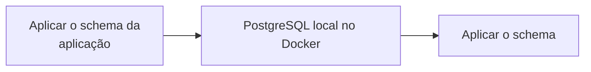
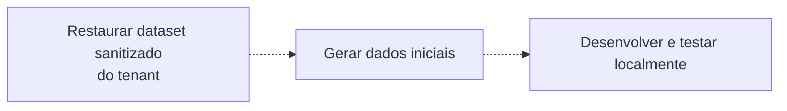

O Managed Postgres é baseado no PostgreSQL padrão e funciona com o ecossistema PostgreSQL existente. Para a maioria das tarefas de desenvolvimento, você pode desenvolver e testar em uma instância local do PostgreSQL em execução no Docker, em vez de uma implantação em nuvem.

Essa abordagem oferece um ciclo de feedback rápido, simplifica o onboarding, reduz dependências de infraestrutura compartilhada e permite experimentar com segurança sem impactar sistemas de produção.

O objetivo não é replicar a produção exatamente. Em vez disso, crie um ambiente local reproduzível que:

* Use a mesma versão principal do PostgreSQL da produção.
* Aplique as mesmas definições de schema da produção.
* Contenha dados de desenvolvimento representativos.
* Dê suporte aos fluxos normais de desenvolvimento e teste de aplicações.

Como o Managed Postgres é PostgreSQL padrão, frameworks de migração existentes, ferramentas de gerenciamento de schema e abordagens de seeding de dados funcionam sem modificações.

<div id="example-development-flow">
  ## Exemplo de fluxo de desenvolvimento
</div>

Um fluxo típico de desenvolvimento local é o seguinte:





O Managed Postgres se integra aos fluxos de trabalho de desenvolvimento com PostgreSQL já existentes. Ao desenvolver em uma instância local do PostgreSQL, as equipes podem iterar rapidamente, manter ambientes reproduzíveis e ter mais confiança de que os aplicativos se comportarão de forma consistente quando implantados no Managed Postgres.

<div id="run-postgresql-locally-with-docker">
  ## Execute o PostgreSQL localmente com Docker
</div>

A forma mais simples de criar um ambiente de desenvolvimento local é executar o PostgreSQL no Docker.

Escolha uma versão do PostgreSQL que corresponda à implantação do seu Managed Postgres:

```yaml title="docker-compose.yml"
services:
  postgres:
    image: postgres:18
    container_name: local-postgres
    restart: unless-stopped

    environment:
      POSTGRES_USER: postgres
      POSTGRES_PASSWORD: postgres
      POSTGRES_DB: app

    ports:
      - "15432:5432"

    volumes:
      - postgres_data:/var/lib/postgresql

volumes:
  postgres_data:
```

Inicie o PostgreSQL:

```bash
docker compose up -d
```

Verifique a conexão:

```bash
psql -h localhost -U postgres -p 15432 -d app
```

Neste momento, o PostgreSQL está em execução localmente, mas ainda não contém o schema da aplicação nem dados de desenvolvimento.

<div id="apply-the-application-schema">
  ## Aplique o schema da aplicação
</div>

Não há uma única abordagem obrigatória para criar o schema em um ambiente local. A maioria das organizações já tem um fluxo de gerenciamento de schema estabelecido, que pode ser reutilizado sem alterações.

<div id="application-migrations">
  ### Migrações da aplicação
</div>

Muitas equipes usam o mesmo framework de migração que roda nos ambientes de homologação e produção — ferramentas como Flyway, Liquibase, migrações do Rails, migrações do Django, migrações do Prisma ou Alembic.

Aplicar as migrações localmente garante que a evolução do schema seja testada continuamente como parte normal do desenvolvimento:

```bash
./migrate up
# ou
npm run migrate
# ou
rails db:migrate
```

<div id="schema-only-postgresql-dumps">
  ### Dumps somente de schema do PostgreSQL
</div>

Uma exportação somente de schema do PostgreSQL pode reproduzir a estrutura de um banco de dados existente. Isso é útil para onboarding, investigar o comportamento do schema, validar a compatibilidade ou preparar rapidamente ambientes de desenvolvimento.

Exporte o schema:

```bash
pg_dump \
  --schema-only \
  --no-owner \
  --no-privileges \
  -h <host> \
  -U <user> \
  -d <database> \
  > schema.sql
```

Restaure localmente:

```bash
psql \
  -h localhost \
  -U postgres \
  -p 15432    \
  -d app \
  -f schema.sql
```

<div id="checked-in-sql-definitions">
  ### Definições SQL versionadas
</div>

Algumas equipes mantêm definições de schema diretamente no controle de versão como arquivos SQL. Elas podem ser aplicadas diretamente a uma instância local do PostgreSQL durante a configuração do ambiente.

Independentemente da abordagem, o importante é que a criação do schema seja automatizada, reproduzível e derivada de definições versionadas.

<div id="populate-representative-development-data">
  ## Popule dados representativos de desenvolvimento
</div>

Quando o schema existir, popule o banco de dados com dados representativos de desenvolvimento.

Para a maioria dos fluxos de trabalho de desenvolvimento, conjuntos de dados sintéticos gerados por scripts de seed são suficientes. Eles são fáceis de recriar, seguros para distribuir e evitam as considerações de conformidade e segurança associadas aos dados de produção.

Uma abordagem comum para aplicações SaaS é gerar dados para um pequeno número de tenants de exemplo e criar relações realistas entre usuários, produtos, pedidos e outras entidades de negócios.

<div id="example-multi-tenant-schema">
  ### Exemplo de schema multi-tenant
</div>

O schema a seguir representa uma aplicação SaaS multi-tenant simplificada:

```sql
CREATE TABLE tenants (
    id UUID PRIMARY KEY,
    name TEXT NOT NULL
);

CREATE TABLE users (
    id UUID PRIMARY KEY,
    tenant_id UUID NOT NULL REFERENCES tenants(id),
    email TEXT NOT NULL,
    first_name TEXT,
    last_name TEXT,
    created_at TIMESTAMP DEFAULT now()
);

CREATE TABLE products (
    id UUID PRIMARY KEY,
    tenant_id UUID NOT NULL REFERENCES tenants(id),
    name TEXT NOT NULL,
    price NUMERIC(10,2)
);

CREATE TABLE orders (
    id UUID PRIMARY KEY,
    tenant_id UUID NOT NULL REFERENCES tenants(id),
    user_id UUID NOT NULL REFERENCES users(id),
    status TEXT,
    created_at TIMESTAMP DEFAULT now()
);

CREATE TABLE order_items (
    id UUID PRIMARY KEY,
    order_id UUID NOT NULL REFERENCES orders(id),
    product_id UUID NOT NULL REFERENCES products(id),
    quantity INTEGER
);

CREATE TABLE audit_logs (
    id UUID PRIMARY KEY,
    tenant_id UUID NOT NULL REFERENCES tenants(id),
    entity_type TEXT,
    entity_id UUID,
    action TEXT,
    created_at TIMESTAMP DEFAULT now()
);
```

<div id="generate-sample-data">
  ### Gerar dados de exemplo
</div>

Instale as dependências:

```bash
pip install faker psycopg2-binary
```

Crie um arquivo chamado `seed.py`:

```python title="seed.py"
import random
import uuid

import psycopg2
from faker import Faker

fake = Faker()

conn = psycopg2.connect(
    host="localhost",
    port=15432,
    dbname="app",
    user="postgres",
    password="postgres"
)

cur = conn.cursor()

tenant_ids = []

for tenant_name in [
    "Tenant A",
    "Tenant B",
    "Tenant C"
]:
    tenant_id = str(uuid.uuid4())
    tenant_ids.append(tenant_id)

    cur.execute(
        """
        INSERT INTO tenants(id, name)
        VALUES (%s, %s)
        """,
        (tenant_id, tenant_name)
    )

for tenant_id in tenant_ids:

    users = []
    products = []

    for _ in range(20):
        user_id = str(uuid.uuid4())
        users.append(user_id)

        cur.execute(
            """
            INSERT INTO users(
                id,
                tenant_id,
                email,
                first_name,
                last_name
            )
            VALUES (%s,%s,%s,%s,%s)
            """,
            (
                user_id,
                tenant_id,
                fake.email(),
                fake.first_name(),
                fake.last_name()
            )
        )

    for _ in range(15):
        product_id = str(uuid.uuid4())
        products.append(product_id)

        cur.execute(
            """
            INSERT INTO products(
                id,
                tenant_id,
                name,
                price
            )
            VALUES (%s,%s,%s,%s)
            """,
            (
                product_id,
                tenant_id,
                fake.word(),
                round(random.uniform(10, 500), 2)
            )
        )

    for _ in range(50):

        order_id = str(uuid.uuid4())

        cur.execute(
            """
            INSERT INTO orders(
                id,
                tenant_id,
                user_id,
                status
            )
            VALUES (%s,%s,%s,%s)
            """,
            (
                order_id,
                tenant_id,
                random.choice(users),
                random.choice([
                    "pending",
                    "completed",
                    "cancelled"
                ])
            )
        )

        for _ in range(random.randint(1, 5)):
            cur.execute(
                """
                INSERT INTO order_items(
                    id,
                    order_id,
                    product_id,
                    quantity
                )
                VALUES (%s,%s,%s,%s)
                """,
                (
                    str(uuid.uuid4()),
                    order_id,
                    random.choice(products),
                    random.randint(1, 10)
                )
            )

        cur.execute(
            """
            INSERT INTO audit_logs(
                id,
                tenant_id,
                entity_type,
                entity_id,
                action
            )
            VALUES (%s,%s,%s,%s,%s)
            """,
            (
                str(uuid.uuid4()),
                tenant_id,
                "order",
                order_id,
                "created"
            )
        )

conn.commit()
conn.close()
```

Execute o script:

```bash
python seed.py
```

O conjunto de dados resultante contém:

| Tabela          | Registros |
| --------------- | --------- |
| tenants         | 3         |
| users           | 60        |
| products        | 45        |
| orders          | 150       |
| order&#95;items | 400+      |
| audit&#95;logs  | 150+      |

Esse conjunto de dados é grande o bastante para abranger fluxos de trabalho comuns da aplicação, lógica de isolamento de tenant, consultas de relatórios e verificações de integridade relacional, mantendo-se leve para desenvolvimento e testes locais.

<div id="postgresql-clickhouse-development-environment">
  ## Ambiente de desenvolvimento PostgreSQL + ClickHouse
</div>

Os exemplos acima se concentram no desenvolvimento local com PostgreSQL. Se você quiser testar localmente a arquitetura completa entre PostgreSQL e ClickHouse, pode executar a stack open-source PostgreSQL + ClickHouse.

Essa stack combina PostgreSQL para cargas de trabalho transacionais, ClickHouse para análises e PeerDB para captura nativa de alterações de dados (CDC). Ela permite desenvolver com PostgreSQL enquanto replica continuamente os dados para o ClickHouse, tornando possível testar análises operacionais, cargas de trabalho de relatórios e pipelines de dados em tempo real diretamente no seu laptop.

A stack pode ser iniciada com um único comando e inclui todos os serviços necessários pré-configurados:

```bash
git clone https://github.com/ClickHouse/postgres-clickhouse-stack.git
cd postgres-clickhouse-stack

./run.sh start
```

A stack é composta por:

* PostgreSQL
* ClickHouse
* PeerDB para CDC do PostgreSQL
* Serviços de suporte e aplicações de exemplo

Para instruções de configuração, detalhes da arquitetura e um guia passo a passo da stack completa, consulte:

* [Blog: PostgreSQL + ClickHouse OSS](https://clickhouse.com/blog/postgres-clickhouse-oss)
* [GitHub: postgres-clickhouse-stack](https://github.com/ClickHouse/postgres-clickhouse-stack)

Este é um bom próximo passo quando sua aplicação já estiver rodando localmente no PostgreSQL e você quiser validar a sincronização do PostgreSQL com o ClickHouse, analytics em tempo real e o comportamento da aplicação de ponta a ponta.