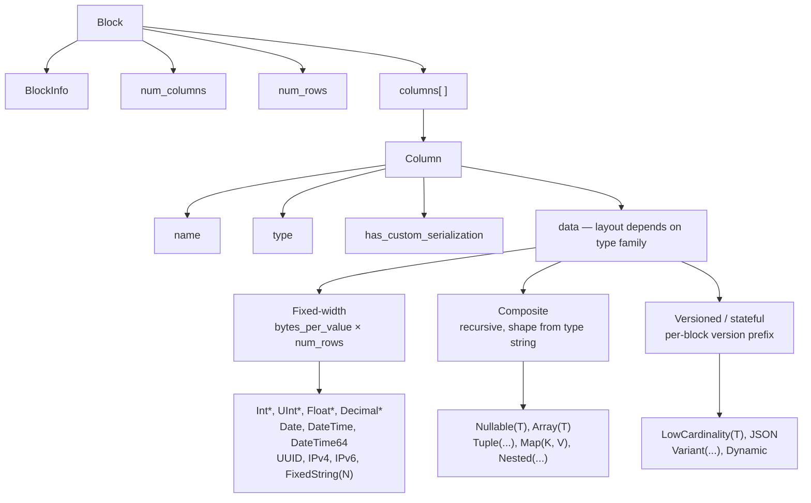
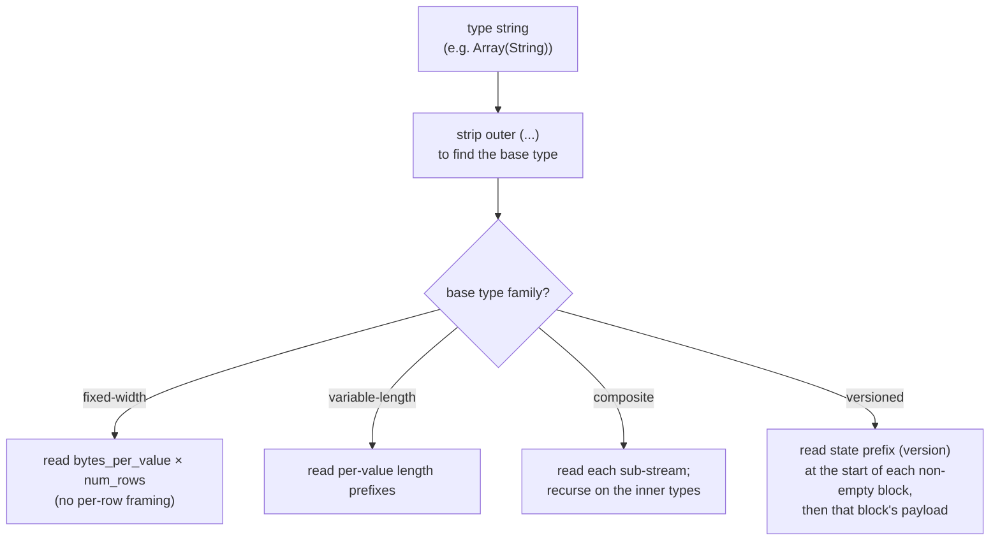
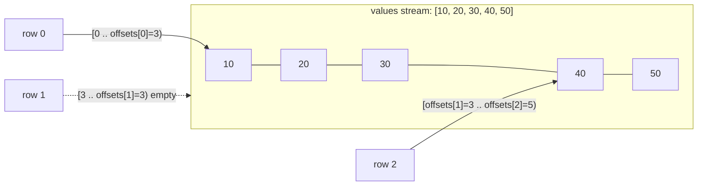
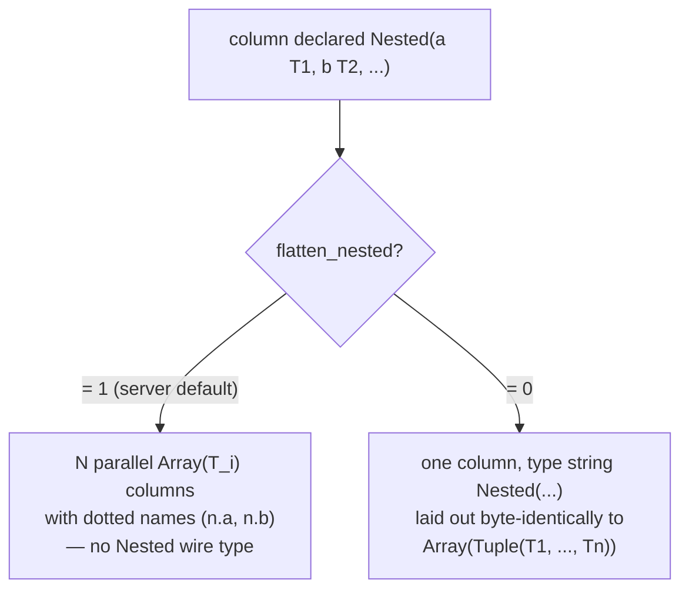
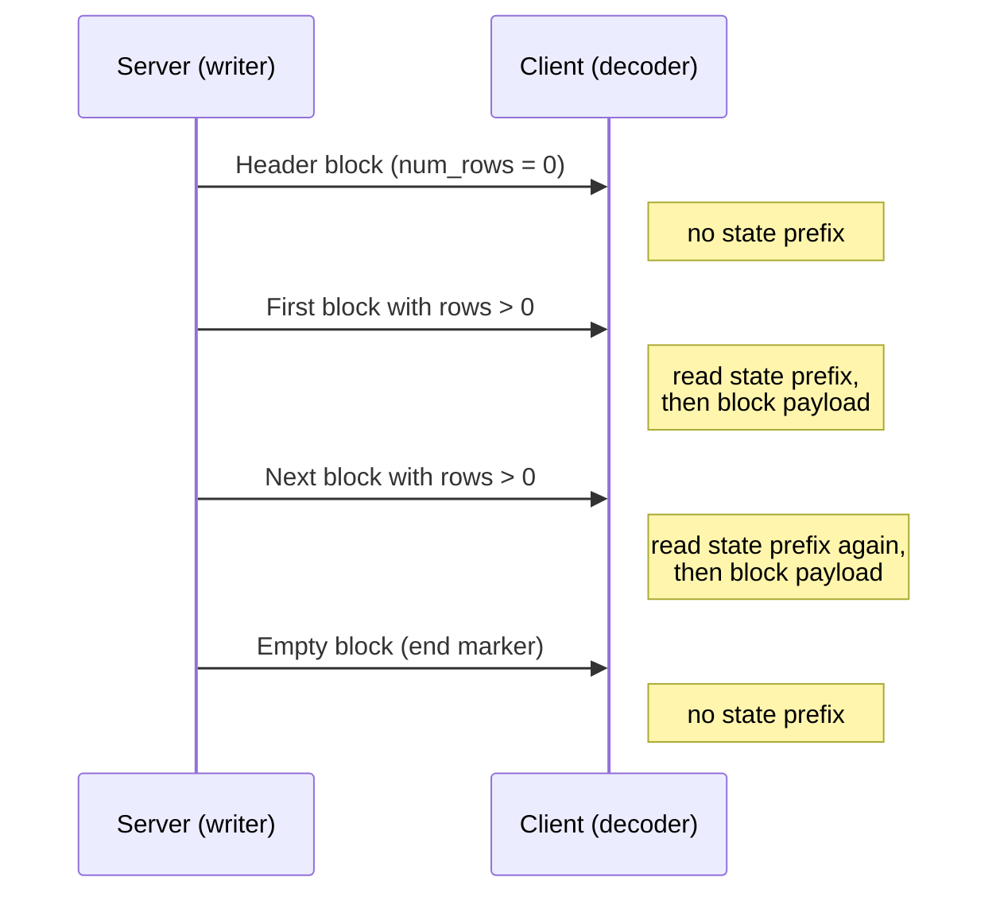
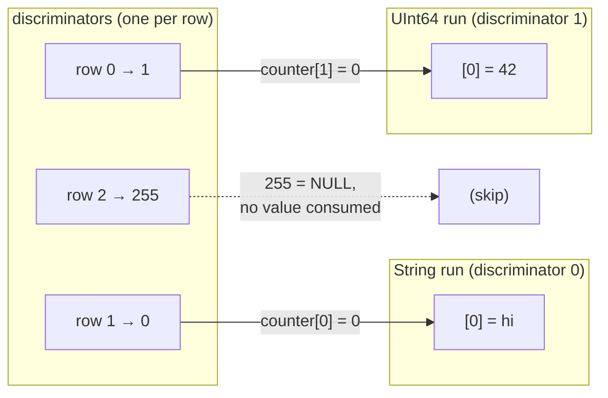
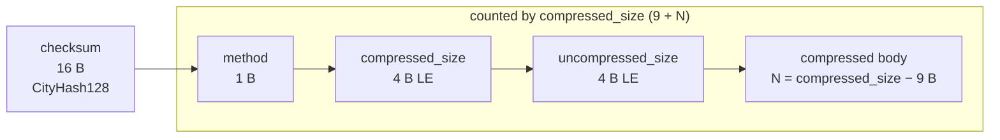

O formato Native é o formato colunar de wire que o ClickHouse usa para transportar dados tabulares. Ele aparece em vários lugares:

* no corpo dos pacotes `Data`, `Totals`, `Extremes`, `Log` e `ProfileEvents` no [protocolo TCP nativo](/pt-BR/reference/interfaces/specs/NativeProtocol) (o pacote `TableColumns` **não** é um bloco Native — ele carrega duas strings binárias, portanto seu layout pertence à [especificação do protocolo nativo](/pt-BR/reference/interfaces/specs/NativeProtocol));
* na saída de `SELECT ... FORMAT Native` via HTTP;
* em exportações para arquivo gravadas com `INTO OUTFILE ... FORMAT Native`;
* em payloads de replicação entre servidores.

Esta página descreve os bytes dentro de um Block — a payload colunar — e as codificações de tipo por coluna que o compõem. O enquadramento dos pacotes, o estado da conexão e a negociação de versão pertencem à [especificação do protocolo nativo](/pt-BR/reference/interfaces/specs/NativeProtocol).

Todos os campos inteiros com vários bytes usam little-endian. Inteiros com sinal usam complemento de dois.

<Tip>
  Para uma introdução ao formato `Native` voltada ao usuário (com exemplos de `curl`), consulte a [página do formato Native](/pt-BR/reference/formats/Native). Esta especificação é a referência de wire de nível mais baixo.
</Tip>

<div id="overview">
  ## Visão geral
</div>

Tudo o que transporta linhas no wire é um **Block**: um fragmento autoexplicativo de linhas armazenadas coluna por coluna. Todos os valores da coluna 1 vêm primeiro, depois todos os da coluna 2, e assim por diante. Um Block transporta apenas as colunas às quais a consulta faz referência, nunca a tabela inteira.

O `data` de uma coluna é organizado de acordo com a *família* à qual seu tipo pertence. As famílias, em ordem crescente de complexidade do decodificador, são:



* Tipos de **largura fixa** organizam `data` como `bytes_per_value × num_rows` bytes brutos, sem delimitação por linha.
* Tipos **compostos** (`Nullable`, `Array`, `Tuple`, `Map`, `Nested`) têm uma estrutura recursiva totalmente derivável da string do tipo, sem prefixo de versão e sem estado entre blocks.
* Tipos **versionados / com estado** (`LowCardinality`, `JSON`, `Variant`, `Dynamic`) iniciam cada block não vazio com um prefixo de versão/estado de serialização. No wire `Native`, esse prefixo e qualquer dicionário são **por block** — o format não carrega estado *entre* blocks (o componente de escrita cria um novo estado de serialização para cada block e define `low_cardinality_max_dictionary_size = 0`). O estado entre blocks é uma questão do MergeTree em disco, não do layout do wire Native.

<div id="wire-primitives">
  ## Primitivos wire
</div>

O formato Native se baseia em quatro codificações primitivas.

| Primitive       | Size                 | Description                                                |
| --------------- | -------------------- | ---------------------------------------------------------- |
| VarUInt         | 1–10 B               | inteiro sem sinal de comprimento variável em LEB-128       |
| largura fixa int | 1, 2, 4, 8, 16, 32 B | little-endian, complemento de dois para inteiros com sinal |
| String          | variable             | prefixo de comprimento VarUInt + bytes brutos              |
| Bool            | 1 B                  | `0x00` = false, diferente de zero = true                   |

<div id="varuint">
  ### VarUInt
</div>

Um inteiro sem sinal de comprimento variável com codificação LEB-128. Cada byte carrega 7 bits de dados nas posições 0–6 e 1 bit de continuação na posição 7. O bit de continuação é `1` quando há mais bytes a seguir e `0` no byte final.

| Faixa de valores       | Bytes  |
| ---------------------- | ------ |
| 0 – 127                | 1      |
| 128 – 16383            | 2      |
| 16384 – 2097151        | 3      |
| até o limite de UInt64 | até 10 |

Codificação do valor `300`:

```text
300 = 0b100101100

Byte 0: 0xAC = 0b10101100   (data: 0101100, continuation: 1)
Byte 1: 0x02 = 0b00000010   (data: 0000010, continuation: 0)
```

Decodificação dos bytes `0xAC 0x02`:

```text
Byte 0: data = 0x2C, continuation = 1 → accumulator = 0x2C, shift = 7
Byte 1: data = 0x02, continuation = 0 → accumulator = (0x02 << 7) | 0x2C = 300
```

<div id="fixed-width-integers">
  ### Inteiros de largura fixa
</div>

| Tipo    | Bytes | Codificação                                 |
| ------- | ----- | ------------------------------------------- |
| UInt8   | 1     | Byte bruto                                  |
| UInt16  | 2     | Little-endian                               |
| UInt32  | 4     | Little-endian                               |
| UInt64  | 8     | Little-endian                               |
| UInt128 | 16    | Little-endian                               |
| UInt256 | 32    | Little-endian                               |
| Int8    | 1     | Byte bruto, complemento de dois             |
| Int16   | 2     | Little-endian, complemento de dois          |
| Int32   | 4     | Little-endian, complemento de dois          |
| Int64   | 8     | Little-endian, complemento de dois          |
| Int128  | 16    | Little-endian, complemento de dois          |
| Int256  | 32    | Little-endian, complemento de dois          |
| Float32 | 4     | IEEE 754 de precisão simples, little-endian |
| Float64 | 8     | IEEE 754 de precisão dupla, little-endian   |

Por exemplo, o valor `1` do tipo UInt32 é codificado como `01 00 00 00`, e o valor `-1` do tipo Int32 como `FF FF FF FF`.

<div id="string">
  ### String
</div>

Uma sequência de bytes com prefixo de comprimento:

```text
[VarUInt: byte_length] [byte_length bytes: raw value]
```

A sequência de bytes não precisa ser UTF-8 válido. Uma string vazia é codificada como um único byte `0x00`, e strings podem conter qualquer valor de byte, incluindo NUL embutido. A string `"ab"` é codificada como `02 61 62`; para decodificar, leia o comprimento em VarUInt (`2`) e, em seguida, leia essa quantidade de bytes.

<div id="bool">
  ### Bool
</div>

Um único byte. `0x00` é false; qualquer valor diferente de zero é true (na forma canônica, `0x01`).

<div id="block-and-column-structure">
  ## Estrutura de Block e colunas
</div>

<div id="block-wire-layout">
  ### Layout em wire do Block
</div>

```text
[BlockInfo]               metadata (only on the TCP Data-packet path; see below)
[VarUInt: num_columns]    number of columns in this block
[VarUInt: num_rows]       number of rows in this block
[Column × num_columns]    column entries, omitted when num_columns = 0
```

A presença do prefixo `BlockInfo` depende do canal, porque o gravador é parametrizado por uma *revisão*:

* No **protocolo TCP nativo**, o servidor grava blocos na revisão negociada da conexão (um valor alto — `DBMS_TCP_PROTOCOL_VERSION` é `54485` neste lançamento). `BlockInfo` é gravado sempre que essa revisão é maior que zero, o que sempre acontece em uma conexão real. O byte `has_custom_serialization` em cada coluna (veja [wire layout da coluna](#column-wire-layout)) é gravado na revisão `54454` e acima.
* O *formato de saída* `Native` — `SELECT ... FORMAT Native` por HTTP, `INTO OUTFILE ... FORMAT Native` e o formato `Native` produzido por `clickhouse-client` — serializa na revisão `0` *por padrão*. Na revisão `0`, tanto o prefixo `BlockInfo` quanto o byte `has_custom_serialization` são omitidos, então um bloco é apenas `num_columns`, `num_rows` e as colunas.

  Em HTTP, essa revisão não é fixa: um cliente pode aumentá-la com o parâmetro de consulta `?client_protocol_version=<n>`, e o servidor usa esse valor como a revisão de serialização da resposta.

  Com um valor alto o bastante, a saída HTTP inclui o prefixo `BlockInfo` (gravado sempre que a revisão é maior que `0`) e o byte `has_custom_serialization` (gravado na revisão `54454` e acima), exatamente como no caminho TCP. Portanto, os clientes não devem presumir que todo payload HTTP `FORMAT Native` esteja na revisão `0`.

Em outras palavras, os exemplos de bytes nesta seção que começam com um prefixo `BlockInfo` descrevem o payload do pacote Data no TCP. A mesma consulta feita por `FORMAT Native` produz a forma mais curta mostrada ao lado deles.

<div id="blockinfo">
  ### BlockInfo
</div>

BlockInfo é uma sequência de campos, cada um precedido por um ID de campo VarUInt, terminada por um ID de campo `0`. O formato wire **não** é autodescritivo: um ID de campo não codifica o comprimento nem o tipo do seu valor, portanto o leitor já deve conhecer o tipo de cada ID de campo que possa encontrar. O próprio leitor do ClickHouse trata um ID de campo não reconhecido como corrupção e lança uma exceção (`UNKNOWN_BLOCK_INFO_FIELD`). A compatibilidade com versões futuras é tratada pela revisão do protocolo: o remetente só escreve um campo se a revisão negociada for pelo menos a revisão mínima desse campo, de modo que um receiver mais antigo nunca veja um campo que não conhece.

| ID do campo | Campo                            | Tipo           | Revisão mín. | Descrição                                                                                                                               |
| ----------- | -------------------------------- | -------------- | ------------ | --------------------------------------------------------------------------------------------------------------------------------------- |
| 1           | is&#95;overflows                 | UInt8          | 0            | Bloco de overflow de GROUP BY. `0` para blocos sem overflow.                                                                            |
| 2           | bucket&#95;number                | Int32          | 0            | Bucket de agregação. `-1` para blocos sem bucket.                                                                                       |
| 3           | out&#95;of&#95;order&#95;buckets | Lista de Int32 | 54480        | Buckets atrasados durante a agregação distribuída. Codificado como uma contagem VarUInt seguida por essa quantidade de valores `Int32`. |
| 0           | (terminador)                     | —              | —            | Fim de BlockInfo. Sempre obrigatório.                                                                                                   |

Os campos `1` e `2` têm revisão mínima `0`, portanto estão presentes sempre que um `BlockInfo` é escrito. O campo `3` é escrito apenas na revisão `54480` e posteriores. Layout wire para o caso comum (revisão abaixo de `54480`):

```text
[VarUInt: 1] [UInt8: is_overflows]
[VarUInt: 2] [Int32: bucket_number]
[VarUInt: 0]
```

<div id="column-wire-layout">
  ### Layout wire da coluna
</div>

Uma coluna aparece `num_columns` vezes dentro de um `Block`.

| # | Campo                            | Tipo                                    | Condição                                | Descrição                                                                                                                                                                                                                                                                                                                                            |
| - | -------------------------------- | --------------------------------------- | --------------------------------------- | ---------------------------------------------------------------------------------------------------------------------------------------------------------------------------------------------------------------------------------------------------------------------------------------------------------------------------------------------------- |
| 1 | name                             | String                                  | sempre                                  | Nome da coluna                                                                                                                                                                                                                                                                                                                                       |
| 2 | type                             | String *ou* codificação binária de tipo | sempre                                  | String de tipo do ClickHouse (por exemplo, `"UInt64"`, `"Array(String)"`) por padrão; uma codificação binária de tipo quando `output_format_native_encode_types_in_binary_format = 1` (veja a nota abaixo)                                                                                                                                           |
| 3 | has&#95;custom&#95;serialization | UInt8                                   | recurso `CUSTOM_SERIALIZATION` (v54454) | `0` = padrão, `1` = personalizado (`kind&#95;stack` vem em seguida)                                                                                                                                                                                                                                                                                  |
| 4 | kind&#95;stack                   | bytes                                   | quando o campo 3 = `1`                  | Um byte de enumeração UInt8 (veja abaixo) que descreve a serialização não padrão (esparsa etc.). Para o valor `COMBINATION`, ele é seguido por uma contagem VarUInt mais essa quantidade de bytes `kind` adicionais. Para um `Tuple` (e outros compostos com informações de serialização no nível do elemento), o payload é recursivo — veja abaixo. |
| 5 | data                             | bytes                                   | sempre                                  | Valores da coluna para todas as `num_rows` linhas. Layout por tipo — veja [tipos de dados](#data-types). Para colunas esparsas, veja abaixo.                                                                                                                                                                                                         |

Um decodificador decide com base na string `type`. As strings de tipo frequentemente trazem parâmetros entre parênteses; o decodificador remove o sufixo `(...)` para encontrar o tipo básico e, em seguida, analisa os parâmetros para decidir tamanho, escala ou tipo interno. Analisar uma lista de parâmetros com tipos aninhados (um `Tuple` dentro de um `Array`, por exemplo) exige um separador de vírgulas sensível à profundidade, que acompanhe o aninhamento de parênteses em vez de uma divisão ingênua em `,`.

<Info>
  **Codificação binária de tipo**

  O campo `type` é um `String` textual apenas no modo padrão. Quando a configuração da consulta `output_format_native_encode_types_in_binary_format = 1` está definida, esse campo passa a ser uma **codificação binária de tipo** — a mesma codificação baseada em tags documentada em [codificação binária de tipos de dados](/pt-BR/reference/data-types/data-types-binary-encoding) — e listas achatadas do tipo `Dynamic` usam a mesma codificação binária para seus nomes por tipo. Um decodificador que sempre ler o campo 2 como uma string prefixada por comprimento trataria a primeira tag binária de tipo como um comprimento de string e perderia a sincronização, portanto precisa saber qual modo o fluxo usa.
</Info>



<div id="kind-stack-and-sparse-encoding">
  #### kind_stack e codificação esparsa
</div>

O byte `kind_stack` enumera uma serialização não padrão por coluna:

| Byte   | Nome                         | Significado                                                                      | Impacto no wire de `data`                                                           |
| ------ | ---------------------------- | -------------------------------------------------------------------------------- | ----------------------------------------------------------------------------------- |
| `0x00` | DEFAULT                      | Serialização padrão                                                              | Idêntico a `has_custom = 0`                                                         |
| `0x01` | SPARSE                       | Serialização esparsa (v54465+)                                                   | Fluxo de offsets + valores não padrão; veja abaixo                                  |
| `0x02` | DETACHED                     | Coluna encapsulada em um `ColumnBLOB` por marshaling paralelo de block (v54478+) | Blob pré-marshaling: `VarUInt size` + essa quantidade de bytes; veja abaixo         |
| `0x03` | DETACHED&#95;OVER&#95;SPARSE | Uma coluna esparsa encapsulada em um `ColumnBLOB`                                | Mesmo payload de blob que `DETACHED`; veja abaixo                                   |
| `0x04` | REPLICATED                   | Forma de dicionário para valores repetidos (v54482+)                             | Fluxo de índices + valores densos dos elementos; veja abaixo                        |
| `0x05` | COMBINATION                  | Pilha de múltiplos tipos                                                         | Seguido por `VarUInt` `count` e por mais `count` bytes de tipo — veja a nota abaixo |

**O payload de `COMBINATION` usa um enum diferente.** As cinco linhas acima são códigos compactos de um byte. `COMBINATION` (`0x05`) é o escape geral para qualquer pilha não coberta por eles: ele é seguido por um `VarUInt` `count` e depois por `count` entradas de um byte. Essas entradas **não** são os códigos compactos da tabela — são os valores brutos de `ISerialization::Kind`:

| Byte   | `Kind` aninhado |
| ------ | --------------- |
| `0x00` | DEFAULT         |
| `0x01` | SPARSE          |
| `0x02` | DETACHED        |
| `0x03` | REPLICATED      |

Os valores de byte diferem dos códigos compactos: `REPLICATED` é `0x03` neste enum aninhado, mas `0x04` como código compacto, e não há entrada `DETACHED_OVER_SPARSE` — essa combinação aparece como duas entradas consecutivas, `SPARSE` e `DETACHED`. Um decodificador que continuar usando a tabela compacta para os bytes aninhados fará o mapeamento incorreto de `0x03`/`0x04` e perderá a sincronização.

O `count` é o comprimento total da pilha **incluindo a entrada `DEFAULT` inicial** que começa toda pilha. Os códigos compactos já cobrem toda pilha com uma ou duas entradas, portanto `COMBINATION` sempre tem `count` de pelo menos três.

**`kind_stack` recursivo para colunas `Tuple`.** O payload de `kind_stack` acima é o byte (ou a sequência `COMBINATION`) das informações de serialização da própria coluna. Um `Tuple` carrega um `SerializationInfoTuple`, que primeiro grava o payload da pilha de tipos do *próprio* tuple e depois grava um payload completo de pilha de tipos para *cada* elemento, em ordem; um decodificador lê de volta a mesma estrutura recursiva. Assim, para `Tuple(A, B, C)`, os bytes do campo 4 são `[tuple_kind][A_kind][B_kind][C_kind]`, e o payload de cada elemento é ele próprio recursivo se esse elemento também for composto. O byte `has_custom_serialization` (campo 3) é definido sempre que as informações do próprio tuple *ou de qualquer elemento* forem não padrão, de modo que um `Tuple` cujo único elemento especial seja esparso, replicado ou detached ainda aciona o payload de pilha de tipos. Um decodificador que ler apenas o único byte inicial do enum para um `Tuple` vai parar cedo demais e interpretar incorretamente os bytes restantes de tipo dos elementos como dados da coluna.

**Formato wire esparso.** Quando `kind_stack = 0x01`, o `data` da coluna é composto por dois fluxos gravados em sequência no único fluxo TCP compartilhado:

1. **Fluxo de offsets** — uma sequência de `VarUInt`s. Cada valor `v` é:
   * `v` com o bit mais alto na posição 62 desativado: `(v & 0x3FFFFFFFFFFFFFFF)` = o número de posições padrão antes do próximo valor explícito não padrão. Essa posição não padrão é `cursor + group_size`, em que `cursor` é a posição corrente; depois disso, `cursor` avança em `group_size + 1`.
   * `v` com o bit 62 ativado (`END_OF_GRANULE_FLAG`): o valor com a flag limpa = o número de posições padrão finais após o último valor não padrão. Isso marca o fim do fluxo de offsets para o block.
2. **Fluxo de valores** — `count` valores não padrão codificados densamente no tipo interno, em que `count` é o número de `VarUInt`s não EOG lidos acima.

Um decodificador reconstrói uma coluna densa com `num_rows` entradas, preenchendo cada posição não explícita com o valor padrão do tipo interno (`0` para inteiros e números de ponto flutuante, `""` para `String`, `0` dias para `Date` e assim por diante).

Uma coluna `Nullable(T)` esparsa é um caso especial, porque o valor padrão de `Nullable(T)` é **NULL**. A codificação esparsa elimina por completo o fluxo usual de mapa de nulos de `Nullable`: o fluxo de offset identifica as posições não padrão — isto é, não-NULL —, o fluxo de valores contém apenas esses valores não-NULL de forma densa em `T`, e cada posição não explícita é reconstruída como NULL. Portanto, um decodificador *não* deve procurar um mapa de nulos no fluxo de valores e *não* deve preencher as lacunas com um `0` presente; ele deve preenchê-las com NULL.

**Formato wire replicado.** Quando `kind_stack = 0x04`, a coluna `data` é um dicionário: uma lista de valores de elementos distintos mais um índice por linha nessa lista (a mesma estrutura de lookup de `LowCardinality`). Quando o tipo interno é, ele próprio, versionado — por exemplo, `LowCardinality(T)` —, seu prefixo de estado é escrito **primeiro**, antes do fluxo de índice: a serialização replicada delega a fase de prefixo ao tipo interno antes de escrever `num_rows`. Tipos internos com prefixo vazio (os tipos folha e os compostos simples) não acrescentam bytes aqui.

```text
[inner type's state prefix]              empty for leaf inners; e.g. LowCardinality version (Int64 = 1)
[VarUInt num_rows]
[UInt8  size_of_indexes_type]            width of each index: 1, 2, 4, or 8 bytes
[indexes: num_rows × size_of_indexes_type bytes]
[VarUInt num_elements]
[elements: num_elements dense inner-type values]
```

Um decodificador reconstrói uma coluna densa selecionando `elements[indexes[i]]` para cada linha de saída `i`. Tipos internos compostos são processados recursivamente: a lista de elementos é materializada no tipo interno e, em seguida, indexada. Os tipos internos compatíveis incluem os tipos folha, `Nullable(T)`, `Array(T)`, `Tuple(...)`, `Map(K, V)`, `Nested(...)` (cada campo expandido como um `Array`) e `LowCardinality(T)` (o Dicionário compartilhado é mantido; apenas as chaves de cada elemento são indexadas).

**Formato wire desanexado.** `DETACHED` (`0x02`) e `DETACHED_OVER_SPARSE` (`0x03`) *de fato* aparecem no wire — não são puramente internos. No caminho TCP, quando a compressão está habilitada e a revisão negociada é no mínimo `DBMS_MIN_REVISON_WITH_PARALLEL_BLOCK_MARSHALLING` (v54478), a coluna passa por três etapas:

1. Cada coluna elegível (não `const`, não `Tuple`, em um bloco com mais de uma linha) é encapsulada em um `ColumnBLOB` que armazena a coluna já serializada e comprimida fora da thread principal.
2. `DETACHED` é acrescentado à pilha de kind da coluna encapsulada.
3. O `data` da coluna é escrito como um tamanho de blob `VarUInt`, seguido por exatamente essa quantidade de bytes do blob.

Se a coluna encapsulada era esparsa, sua pilha é `{DEFAULT, SPARSE, DETACHED}`, que é serializada como `DETACHED_OVER_SPARSE`. Um cliente que decodifica essa coluna lê o comprimento e os bytes do blob e, em seguida, descomprime o blob para recuperar o payload da coluna interna (veja a [nota sobre `ColumnBLOB`](#compression-negotiation) na seção sobre compressão).

<div id="block-variants">
  ### Variantes de Block
</div>

Todos os pacotes da família Data compartilham o mesmo wire format de Block. As variantes diferem apenas no número de colunas e linhas:

| Variante           | num&#95;columns | num&#95;rows | Finalidade                                                                             |
| ------------------ | --------------- | ------------ | -------------------------------------------------------------------------------------- |
| Block de cabeçalho | N &gt; 0        | 0            | Anuncia o esquema do resultado (nomes de colunas + tipos).                             |
| Block de resultado | N &gt; 0        | M &gt; 0     | Linhas de resultado propriamente ditas.                                                |
| Block vazio        | 0               | 0            | Sentinela — fim da entrada no lado do cliente; marcador de limite no lado do servidor. |

<div id="byte-level-examples">
  ### Exemplos no nível de byte
</div>

Todos os exemplos desta seção foram extraídos do **caminho do pacote Data via TCP**, portanto incluem o prefixo `BlockInfo` e o byte `has_custom_serialization`. Em `FORMAT Native`, os mesmos blocos são mais curtos — a forma curta equivalente é mostrada quando isso for útil.

Um bloco vazio (com BlockInfo), 8 bytes no total:

```text
01 00                   BlockInfo: field_id=1, is_overflows=0
02 FF FF FF FF          BlockInfo: field_id=2, bucket_number=-1
00                      BlockInfo terminator
00                      num_columns = 0
00                      num_rows = 0
```

Um bloco de cabeçalho para `SELECT 1` indica uma coluna chamada `"1"` do tipo `UInt8`, com zero linhas. No protocolo ≥ 54454, o byte `has_custom_serialization` é incluído:

```text
01 00                   BlockInfo: is_overflows = 0
02 FF FF FF FF          BlockInfo: bucket_number = -1
00                      BlockInfo terminator
01                      num_columns = 1
00                      num_rows = 0
01 "1"                  Column[0].name = "1"
05 "UInt8"              Column[0].type = "UInt8"
00                      Column[0].has_custom_serialization = 0
                        Column[0].data: no bytes (num_rows = 0)
```

O bloco de resultado da mesma consulta, com uma linha:

```text
01 00                   BlockInfo: is_overflows = 0
02 FF FF FF FF          BlockInfo: bucket_number = -1
00                      BlockInfo terminator
01                      num_columns = 1
01                      num_rows = 1
01 "1"                  Column[0].name = "1"
05 "UInt8"              Column[0].type = "UInt8"
00                      Column[0].has_custom_serialization = 0
01                      Column[0].data: one UInt8 byte = 1
```

Por meio de `FORMAT Native` (revisão `0`), o mesmo bloco de resultado não contém `BlockInfo` nem o byte `has_custom_serialization` — `SELECT 1 FORMAT Native` tem 11 bytes:

```text
01                      num_columns = 1
01                      num_rows = 1
01 "1"                  Column[0].name = "1"
05 "UInt8"              Column[0].type = "UInt8"
01                      Column[0].data: one UInt8 byte = 1
```

(Um resultado com zero linhas, como um bloco apenas com cabeçalho, não produz nenhum byte em `FORMAT Native`: o formato de saída não emite blocos vazios.)

<div id="data-types">
  ## Tipos de dados
</div>

Esta seção documenta a codificação wire dos tipos que o formato Native pode transportar no `data` de uma coluna, agrupados em quatro famílias com complexidade de decodificação crescente. Dois tipos — `AggregateFunction(func, ...)` e `QBit(T, N)` — são tipos de coluna `Native` válidos, mas têm payloads específicos de função ou de tipo que estão fora do escopo aqui; eles são destacados abaixo onde, de outra forma, poderiam ser confundidos com aliases.

| Família                  | Seção                                                   | Fluxos por coluna | Estado entre blocos                                                        |
| ------------------------ | ------------------------------------------------------- | ------------------ | -------------------------------------------------------------------------- |
| Largura fixa             | [Tipos de largura fixa](#fixed-width-types)             | Um                 | Nenhum                                                                     |
| Comprimento variável     | [Tipos de comprimento variável](#variable-length-types) | Um                 | Nenhum                                                                     |
| Compostos (forma fixa)   | [Tipos compostos](#composite-types)                     | Múltiplos          | Nenhum                                                                     |
| Versionados / com estado | [Tipos versionados](#versioned-types)                   | Múltiplos          | Nenhum no wire Native — prefixo de estado por bloco, renovado a cada bloco |

<div id="fixed-width-types">
  ### Tipos de largura fixa
</div>

Cada valor ocupa um número constante de bytes. Uma coluna de `M` linhas ocupa exatamente `bytes_per_row × M` bytes no wire, concatenados sem separadores nem preenchimento.

| String do tipo      | Bytes por valor | Valor lógico                                                                                                   | Codificação no wire                                              |
| ------------------- | --------------- | -------------------------------------------------------------------------------------------------------------- | ---------------------------------------------------------------- |
| `UInt8`             | 1               | Inteiro sem sinal de 8 bits                                                                                    | Byte bruto                                                       |
| `UInt16`            | 2               | Inteiro sem sinal de 16 bits                                                                                   | Little-endian                                                    |
| `UInt32`            | 4               | Inteiro sem sinal de 32 bits                                                                                   | Little-endian                                                    |
| `UInt64`            | 8               | Inteiro sem sinal de 64 bits                                                                                   | Little-endian                                                    |
| `UInt128`           | 16              | Inteiro sem sinal de 128 bits                                                                                  | Little-endian                                                    |
| `UInt256`           | 32              | Inteiro sem sinal de 256 bits                                                                                  | Little-endian                                                    |
| `Int8`              | 1               | Inteiro com sinal de 8 bits, complemento de dois                                                               | Byte bruto                                                       |
| `Int16`             | 2               | Inteiro com sinal de 16 bits, complemento de dois                                                              | Little-endian                                                    |
| `Int32`             | 4               | Inteiro com sinal de 32 bits, complemento de dois                                                              | Little-endian                                                    |
| `Int64`             | 8               | Inteiro com sinal de 64 bits, complemento de dois                                                              | Little-endian                                                    |
| `Int128`            | 16              | Inteiro com sinal de 128 bits, complemento de dois                                                             | Little-endian                                                    |
| `Int256`            | 32              | Inteiro com sinal de 256 bits, complemento de dois                                                             | Little-endian                                                    |
| `Float32`           | 4               | IEEE 754 de precisão simples                                                                                   | Little-endian                                                    |
| `Float64`           | 8               | IEEE 754 de precisão dupla                                                                                     | Little-endian                                                    |
| `BFloat16`          | 2               | 16 bits mais significativos de um `Float32` IEEE 754                                                           | Little-endian                                                    |
| `Bool`              | 1               | `0x00` = false, `0x01` = true                                                                                  | Byte bruto                                                       |
| `Date`              | 2               | Dias desde `1970-01-01`                                                                                        | Little-endian UInt16                                             |
| `Date32`            | 4               | Dias desde `1970-01-01` (com sinal; pré-1970 é aceito)                                                         | Little-endian Int32                                              |
| `DateTime`          | 4               | Unix timestamp em segundos                                                                                     | Little-endian UInt32                                             |
| `DateTime(tz)`      | 4               | Igual a `DateTime`; o fuso horário é metadata                                                                  | Little-endian UInt32                                             |
| `DateTime64(s)`     | 8               | Ticks na escala `s` (10^-s segundos desde a epoch)                                                             | Little-endian Int64                                              |
| `DateTime64(s, tz)` | 8               | Igual a `DateTime64(s)`; o fuso horário é metadata                                                             | Little-endian Int64                                              |
| `Time`              | 4               | Duração de relógio com sinal, em segundos                                                                      | Little-endian Int32                                              |
| `Time64(s)`         | 8               | Duração de relógio com sinal, em ticks na escala `s`                                                           | Little-endian Int64                                              |
| `Interval<Unit>`    | 8               | Contagem com sinal; a unidade fica na string de tipo                                                           | Little-endian Int64                                              |
| `UUID`              | 16              | Identificador de 128 bits                                                                                      | Duas metades LE UInt64 com bytes invertidos (veja [UUID](#uuid)) |
| `IPv4`              | 4               | Endereço IPv4                                                                                                  | Little-endian UInt32                                             |
| `IPv6`              | 16              | Endereço IPv6                                                                                                  | Ordem de bytes de rede, sem swap                                 |
| `Enum8`             | 1               | Inteiro com sinal de 8 bits (índice da variante)                                                               | Byte bruto                                                       |
| `Enum16`            | 2               | Inteiro com sinal de 16 bits (índice da variante)                                                              | Little-endian                                                    |
| `Decimal(P, S)`     | 4 / 8 / 16 / 32 | `value × 10^S` como um inteiro com sinal; a largura depende de P (≤9 → 4 B, ≤18 → 8 B, ≤38 → 16 B, ≤76 → 32 B) | Inteiro com sinal little-endian                                  |

<div id="integer-types">
  #### Tipos inteiros
</div>

`UInt8`–`UInt256` e `Int8`–`Int256` são codificações binárias diretas de valores inteiros. Um decodificador lê `bytes_per_row × num_rows` bytes e os interpreta de acordo com o tipo.

Uma coluna `UInt32` contendo `[1, 256, 65536]`:

```text
01 00 00 00              row 0: 1
00 01 00 00              row 1: 256
00 00 01 00              row 2: 65536
```

Uma coluna `Int32` com `[-1, 42]`:

```text
FF FF FF FF              row 0: -1
2A 00 00 00              row 1: 42
```

<div id="float32-and-float64">
  #### Float32 e Float64
</div>

Números de ponto flutuante binários padrão IEEE 754: 4 bytes de precisão simples (`binary32`) e 8 bytes de precisão dupla (`binary64`), ambos em little-endian. NaN, ±Infinity, ±0.0 e subnormais preservam-se sem normalização na ida e volta.

Valor `Float32` `1.5` (`0x3FC00000`):

```text
00 00 C0 3F              little-endian IEEE 754
```

Valor `1.5` do tipo `Float64` (`0x3FF8000000000000`):

```text
00 00 00 00 00 00 F8 3F  little-endian IEEE 754
```

<div id="bfloat16">
  #### BFloat16
</div>

O formato de ponto flutuante brain-float: os 16 bits mais significativos de um IEEE 754 `Float32` — 1 bit de sinal, 8 bits de expoente, 7 bits de mantissa. Cada valor ocupa 2 bytes, em little-endian, armazenando o padrão bruto de 16 bits. Para recuperar o valor numérico, expanda-o novamente para `Float32`, colocando o padrão na metade alta e zerando a metade baixa (`bits << 16` reinterpretado como `Float32`); o valor expandido então usa a mesma formatação de texto de `Float32`.

Valor `BFloat16` `1.5` (padrão `0x3FC0`, a metade superior de `Float32` `0x3FC00000`):

```text
C0 3F                    little-endian, widens to Float32 1.5
```

<div id="bool-type">
  #### Bool
</div>

Compatível com `UInt8` no wire: 1 byte por linha, `0x00` = false, `0x01` = true. A string do tipo no wire é literalmente `Bool` (não `UInt8`), portanto um decodificador que faz o roteamento com base na string do tipo deve reconhecê-lo separadamente.

Uma coluna `Bool` `[true, false, true]`:

```text
01 00 01
```

<div id="date-and-date32">
  #### Date e Date32
</div>

Ambos codificam datas como contagens inteiras de dias em relação ao epoch Unix `1970-01-01`. Nenhum deles inclui um componente de tempo.

| Tipo     | Bytes | Codificação          | Intervalo                              |
| -------- | ----- | -------------------- | -------------------------------------- |
| `Date`   | 2     | UInt16 little-endian | `1970-01-01` a `2149-06-06`            |
| `Date32` | 4     | Int32 little-endian  | amplo intervalo com sinal, pré-1970 ok |

Valor `Date` `1970-01-02` (1 dia):

```text
01 00                    UInt16 LE = 1
```

`Date32` com valor `1900-01-01` (-25567 dias):

```text
21 9C FF FF              Int32 LE = -25567
```

<div id="datetime">
  #### DateTime
</div>

Compatível com `UInt32` no wire: um timestamp Unix em segundos, com 4 bytes em little-endian. O tipo pode aparecer como `DateTime` ou `DateTime('Timezone')`; o fuso horário afeta apenas a exibição e não faz parte do valor no wire. Duas colunas `DateTime` com parâmetros de fuso horário diferentes produzem bytes idênticos para o mesmo instante. Um decodificador remove o sufixo de parâmetro `(...)` e processa a coluna como `UInt32`.

Valor `DateTime('UTC')` `2024-03-15 14:30:00 UTC` (timestamp `1710513000`):

```text
68 5B F4 65              UInt32 LE = 1710513000
```

<div id="datetime64">
  #### DateTime64(scale[, timezone])
</div>

8 bytes, Int64 little-endian representando ticks na precisão de `10^-scale` segundos desde a epoch Unix. O parâmetro `scale` (0–9) fica na string do tipo e define a unidade de tempo:

| Escala | Tamanho do tick | Nome comum |
| ------ | --------------- | ---------- |
| 0      | 1 segundo       | segundos   |
| 3      | 1 milissegundo  | ms         |
| 6      | 1 microssegundo | µs         |
| 9      | 1 nanossegundo  | ns         |

O tipo aparece como `DateTime64(s)` (fuso horário padrão implícito do servidor) ou `DateTime64(s, 'TimezoneName')` (fuso horário explícito, apenas para exibição). Valores negativos representam ticks anteriores à epoch.

Valor `DateTime64(3, 'UTC')` `2024-01-15 12:30:45.123 UTC` (1705321845123 ms):

```text
83 51 1A 0D 8D 01 00 00  Int64 LE = 1705321845123
```

`DateTime64(0)` valor `2024-01-15 12:30:45 UTC` (1705321845 s):

```text
75 25 A5 65 00 00 00 00  Int64 LE = 1705321845
```

<div id="time-and-time64">
  #### Time e Time64(scale)
</div>

Uma duração de relógio, e não um ponto no tempo. `Time` é uma contagem de segundos com sinal, em Int32 little-endian de 4 bytes; `Time64(scale)` é uma contagem de ticks com sinal na escala decimal especificada (0–9), em Int64 little-endian de 8 bytes — a mesma forma wire de `DateTime64`.

A forma textual é `[-]HH:MM:SS[.fraction]`, mas, diferentemente de `DateTime`, o campo de hora **não** é ajustado para um dia de 24 horas: ele representa a contagem total de horas e pode exceder 23. A magnitude exibida é limitada a `999:59:59` (`3599999` segundos); uma magnitude maior é exibida nesse limite, com a fração zerada (`999:59:59.000`). `CAST` também restringe o valor armazenado a esse intervalo, embora operações aritméticas possam produzir valores fora dele, que são limitados apenas na exibição. Nada disso afeta os bytes wire, que são simplesmente o inteiro com sinal.

Valor `Time` `45296` (`12:34:56`):

```text
F0 B0 00 00              Int32 LE = 45296
```

`Time64(3)` com valor `45296789` ticks (`12:34:56.789`):

```text
95 2C B3 02 00 00 00 00  Int64 LE = 45296789
```

<Note>
  `Time` e `Time64` são experimentais e exigem `allow_experimental_time_time64_type = 1` no servidor.
</Note>

<div id="interval">
  #### Interval
</div>

`Interval<Unit>` — `IntervalSecond`, `IntervalMinute`, `IntervalHour`, `IntervalDay`, `IntervalWeek`, `IntervalMonth`, `IntervalQuarter`, `IntervalYear`, `IntervalNanosecond` e assim por diante. Todas as unidades compartilham uma única codificação wire: a contagem como um Int64 little-endian com sinal de 8 bytes. A unidade existe **apenas** na string do tipo — ela não altera nem os bytes wire nem a forma textual, que é o inteiro simples. Um único caminho de decodificação lida com todas as unidades.

Valor `5` de `IntervalDay`:

```text
05 00 00 00 00 00 00 00  Int64 LE = 5
```

<div id="uuid">
  #### UUID
</div>

16 bytes por valor. A codificação wire **não** corresponde aos 16 bytes canônicos em big-endian — cada metade de 8 bytes tem a ordem dos bytes invertida de forma independente.

O modelo lógico é um identificador de 128 bits na forma textual canônica `xxxxxxxx-xxxx-xxxx-xxxx-xxxxxxxxxxxx`, em que os bytes são convencionalmente escritos em big-endian. O modelo wire pega esses 16 bytes canônicos, divide-os em duas metades de 8 bytes e grava cada metade em little-endian:

* Bytes wire 0..7 = bytes canônicos 0..7 invertidos.
* Bytes wire 8..15 = bytes canônicos 8..15 invertidos.

UUID `550e8400-e29b-41d4-a716-446655440000`:

```text
Canonical bytes (16):    55 0E 84 00 E2 9B 41 D4  A7 16 44 66 55 44 00 00

Wire bytes:
D4 41 9B E2 00 84 0E 55  high half byte-reversed
00 00 44 55 66 44 16 A7  low half byte-reversed
```

O UUID nulo (todos os zeros) aparece de forma idêntica em ambas as representações.

<div id="ipv4-and-ipv6">
  #### IPv4 e IPv6
</div>

Dois tipos de endereço relacionados, mas codificados de maneiras diferentes.

`IPv4` tem 4 bytes, codificados como um UInt32 little-endian que armazena o endereço canônico de 32 bits (o valor `(a << 24) | (b << 16) | (c << 8) | d` de `a.b.c.d`). Os bytes na wire são os bytes em ordem de rede invertidos.

`192.168.1.10` (valor canônico de 32 bits `0xC0A8010A`):

```text
0A 01 A8 C0              Little-endian UInt32
```

`IPv6` tem 16 bytes, escritos **exatamente na ordem de bytes de rede**, sem troca de bytes — a mesma ordem de bytes de `inet_pton(AF_INET6, ...)`.

`2001:db8::1`:

```text
20 01 0D B8 00 00 00 00  network bytes 0..7
00 00 00 00 00 00 00 01  network bytes 8..15
```

A assimetria é deliberada: o IPv4 é armazenado como um `u32` para aritmética e consultas por intervalo mais compactas, enquanto o IPv6 mantém a estrutura em ordem de rede comum à maioria das APIs de rede.

<div id="enum8-and-enum16">
  #### Enum8 and Enum16
</div>

Compatível com `Int8` e `Int16` no wire, respectivamente: 1 ou 2 bytes por linha, em complemento de dois little-endian para a variante de 16 bits. O mapeamento completo da variante fica na string do tipo:

```text
Enum8('active' = 1, 'inactive' = 2, 'banned' = -1)
Enum16('a' = 1, 'b' = 30000)
```

Um decodificador pode remover o sufixo de parâmetro `(...)` e tratá-lo como `Int8` / `Int16` — os bytes no wire são apenas o índice inteiro. Um client que expõe o rótulo analisa o map `'name' = value` da string de tipo e o mantém junto com a coluna: o inteiro, por si só, não recupera o rótulo. A saída orientada a texto exibe o rótulo (`active`) em vez do índice, entre aspas simples (`'active'`) quando o enum está aninhado dentro de um tipo composto. Como o map não pode ser recuperado da coluna inteira, ele deve ser mantido para enums aninhados, como `Array(Enum8(...))` ou `Map(Enum16(...), V)`.

Uma coluna `Enum8('active' = 1, 'inactive' = 2)` `[active, inactive, active]`:

```text
01 02 01
```

Um valor `30000` de `Enum16(...)`:

```text
30 75                    Int16 LE = 30000
```

<div id="decimal">
  #### Decimal(P, S)
</div>

Um inteiro com sinal escalonado por uma potência de 10. A largura em bytes do inteiro é implícita pela **precisão** `P`; a **escala** `S` é o expoente negativo (o número de dígitos após o separador decimal). Ambos ficam na string do tipo.

| Precisão (P) | Inteiro subjacente | Bytes |
| ------------ | ------------------ | ----- |
| 1 ≤ P ≤ 9    | Int32              | 4     |
| 10 ≤ P ≤ 18  | Int64              | 8     |
| 19 ≤ P ≤ 38  | Int128             | 16    |
| 39 ≤ P ≤ 76  | Int256             | 32    |

A codificação wire é o inteiro subjacente em complemento de dois little-endian, e o valor decimal lógico é `wire_integer × 10^(-S)`.

O ClickHouse sempre emite `Decimal(P, S)`, independentemente de como o tipo foi declarado. `Decimal32(S)`, `Decimal64(S)` e assim por diante são todos normalizados para `Decimal(P, S)` no wire (com `P` definido como o máximo natural para a largura: 9, 18, 38, 76). Um decodificador que reconhece apenas `Decimal(P, S)` cobre todas as formas que o servidor emite.

Valor `123.4567` de `Decimal(9, 4)` → inteiro subjacente `1234567`:

```text
87 D6 12 00              Int32 LE = 1234567
```

`Decimal(18, 1)` valor `-1.5` → inteiro subjacente `-15`:

```text
F1 FF FF FF FF FF FF FF  Int64 LE = -15
```

`Decimal(38, 4)` com valor `123.4567` (16 bytes no total):

```text
87 D6 12 00 00 00 00 00 00 00 00 00 00 00 00 00
```

<div id="nothing">
  #### Nothing
</div>

O tipo `Nothing` não contém nenhum valor. Na prática, ele aparece apenas como o tipo interno de `Nullable(Nothing)` — o que o servidor retorna para uma expressão como `SELECT NULL`, cujo único valor válido é a ausência de valor. Conceitualmente, é um tipo unitário.

No wire, ele ocupa exatamente **um byte de placeholder por linha**. O servidor emite o caractere ASCII `'0'` (`0x30`), mas o desserializador ignora esses bytes — o conteúdo é indefinido, e os decodificadores não devem presumir nenhum valor específico. O número de bytes gravados é `num_rows × 1`, portanto o `num_rows` no cabeçalho da coluna determina completamente quanto deve ser consumido.

Esse byte por linha mantém intacta a invariante do Block: cada coluna tem um comprimento derivável de `num_rows`, de modo que os decodificadores avançam sem prefixos de comprimento por célula. O `Nullable` externo sempre informa todas as posições como NULL, portanto os placeholders nunca são inspecionados.

Uma coluna `Nullable(Nothing)` com 3 linhas (todas NULL):

```text
01 01 01                 null map: 1, 1, 1 (three NULLs)
30 30 30                 Nothing placeholder bytes (one per row)
```

O prefixo do mapa de nulos é a estrutura padrão de `Nullable` (consulte [Nullable](#nullable)); os três bytes internos são o payload `Nothing`, que o decodificador ignora.

<div id="variable-length-types">
  ### Tipos de comprimento variável
</div>

Cada valor inclui seu próprio comprimento na wire.

<div id="string-type">
  #### String
</div>

string de tipo: `String`. Uma coluna `String` é uma sequência de `num_rows` sequências de bytes com prefixo de comprimento:

```text
[VarUInt: byte_length] [byte_length bytes: raw value]
[VarUInt: byte_length] [byte_length bytes: raw value]
...
```

Não há separadores entre as linhas além dos prefixos de comprimento, nem estado em nível de linha. Uma string vazia é um único byte `0x00`. O `String` do ClickHouse é orientado a bytes, e não a texto: a validade de UTF-8 não é imposta, e um valor pode conter quaisquer bytes, inclusive NUL embutido. Um decodificador voltado para um tipo de string UTF-8 valida na leitura ou expõe bytes brutos ao chamador. O total de bytes consumidos pela coluna é `Σ (varuint_size(len_i) + len_i)` em todas as linhas.

Uma coluna com 3 strings `["ab", "", "c"]` (6 bytes no total):

```text
02 61 62                 row 0: length 2, "ab"
00                       row 1: length 0, empty
01 63                    row 2: length 1, "c"
```

<div id="fixedstring">
  #### FixedString(N)
</div>

String de tipo: `FixedString(N)`, em que `N` é um inteiro positivo (por exemplo, `FixedString(16)`). A coluna tem exatamente `N × num_rows` raw bytes, sem prefixos de comprimento nem separadores. Um decodificador analisa `N` a partir da string de tipo e consome essa quantidade de bytes por linha.

Quando o SQL insere um valor com menos de `N` bytes (por exemplo, `CAST('abc' AS FixedString(5))`), o servidor preenche à direita com bytes NUL (`0x00`) até o comprimento declarado. Esses bytes de preenchimento fazem parte do valor armazenado e são enviados no wire exatamente como estão; removê-los é uma questão do lado do cliente. Assim como `String`, `FixedString(N)` se parece mais com um array de bytes do que com texto — normalmente usado para identificadores de largura fixa, bytes de endereço ou digests de hash.

Dois valores `FixedString(3)` `["abc", "de\0"]` (6 bytes no total):

```text
61 62 63                 row 0: 3 bytes, "abc"
64 65 00                 row 1: 3 bytes, "de" + NUL padding
```

Os dois tipos de string comparados:

| Propriedade                      | `String`                      | `FixedString(N)`                   |
| -------------------------------- | ----------------------------- | ---------------------------------- |
| Prefixo de comprimento por linha | Sim (VarUInt)                 | Não                                |
| Tamanho da linha                 | Variável                      | Exatamente `N` bytes               |
| Total de bytes da coluna         | Variável                      | `N × num_rows`                     |
| Preenchimento com byte NUL       | n/a                           | Preenchido à direita pelo servidor |
| UTF-8 esperado                   | Normalmente (não obrigatório) | Não (tratado como bytes brutos)    |
| Parâmetro de tipo                | Nenhum                        | Inteiro `N` obrigatório            |

<div id="composite-types">
  ### Tipos compostos
</div>

Tipos compostos encapsulam um ou mais tipos internos e compartilham um modelo wire em comum: **múltiplos fluxos por coluna**. Uma única coluna lógica é codificada como duas ou mais sequências de bytes lidas de forma independente e concatenadas.

Eles compartilham três propriedades estruturais:

* **Forma fixa por schema.** A estrutura é determinada inteiramente pela string do tipo no momento da decodificação. `Array(UInt32)` sempre tem o mesmo layout de fluxos, de bloco para bloco.
* **Sem prefixo de versão próprio.** O encapsulamento composto em si não adiciona nenhum byte de versão; sua estrutura (offsets, null-map, fluxos de elementos) é estável entre lançamentos do ClickHouse. Isso se aplica apenas ao *wrapper* — veja a observação sobre a fase de prefixo abaixo para tipos internos versionados.
* **Sem estado entre blocos próprio.** A estrutura do wrapper é totalmente autodescritiva em cada bloco; qualquer preocupação com estado entre blocos vem de um tipo interno versionado, não do wrapper.

Compostos são recursivos — um tipo interno pode, ele próprio, ser um composto.

**Fase de prefixo antes dos fluxos de dados.** A leitura de uma coluna ocorre em duas fases, nesta ordem: uma **fase de prefixo de estado** e depois a **fase de fluxo de dados**. Um wrapper composto não tem bytes de prefixo próprios, mas *delega* a fase de prefixo à serialização interna antes de gravar qualquer um dos seus próprios fluxos de dados: `SerializationArray` executa a fase de prefixo do tipo interno antes de os offsets do array serem gravados, e `Tuple`, `Map`, `Nested` e `Nullable` fazem o mesmo por meio das serializações de seus elementos (`Nullable` executa o prefixo interno antes do seu mapa de nulos).

Assim, quando um composto encapsula um [tipo versionado/com estado](#versioned-types) (`LowCardinality`, `Variant`, `Dynamic`, `JSON`), o prefixo de versão/estado desse tipo interno é emitido *primeiro*, antes dos offsets do wrapper e do payload dos elementos. Por exemplo, `Array(LowCardinality(String))` é organizado como `[prefixo de estado de LowCardinality]` → `[offsets do array]` → `[payload achatado dos elementos de LowCardinality]`, e não com offsets primeiro.

Um decodificador que lê os offsets antes de executar a fase de prefixo interno ficará dessincronizado em qualquer composto que contenha `LowCardinality`, `Variant`, `Dynamic` ou `JSON`. Quando todo tipo interno é uma folha simples ou outro composto não versionado, a fase de prefixo não emite bytes, e a descrição com offsets primeiro abaixo se aplica literalmente.

<div id="nullable">
  #### Nullable(T)
</div>

String de tipo: `Nullable(InnerType)`. Exemplos: `Nullable(UInt32)`, `Nullable(String)`, `Nullable(FixedString(16))`, `Nullable(DateTime('UTC'))`.

Assim como os outros tipos compostos, `Nullable` delega a [fase de prefixo](#composite-types) à sua serialização interna antes de gravar o mapa de nulos: quando o tipo interno é versionado, o prefixo de estado do tipo interno é emitido **primeiro**. Portanto, `Nullable(Tuple(LowCardinality(String)))` começa com o prefixo de estado de `LowCardinality`, e não com o mapa de nulos. Quando o tipo interno é um tipo folha ou outro tipo não versionado, a fase de prefixo não emite nenhum byte.

O layout wire consiste na fase de prefixo interna (vazia, a menos que o tipo interno seja versionado), seguida de dois fluxos concatenados, com o mapa de nulos primeiro:

```text
[inner type's state prefix]   empty for leaf/non-versioned inners; emitted first when the inner is versioned
[null-map stream]             num_rows × UInt8
[values stream]               inner type's encoding for num_rows values
```

O mapa de nulos tem exatamente `num_rows` bytes, um por linha:

| Valor do byte                       | Significado                                                                      |
| ----------------------------------- | -------------------------------------------------------------------------------- |
| `0x00`                              | O valor está presente nesta linha.                                               |
| diferente de zero (canônico `0x01`) | O valor é NULL. Os bytes correspondentes no fluxo de valores são um placeholder. |

O fluxo de valores contém a codificação padrão do tipo interno para **todas** as `num_rows` linhas, incluindo as posições nulas. Um decodificador ainda precisa ler os bytes de placeholder nas posições nulas para avançar no fluxo, mas deve consultar o mapa de nulos antes de interpretar qualquer valor individual. Quem envia os dados pode gravar quaisquer bytes nas posições nulas, portanto os decodificadores não devem depender de um valor de placeholder específico.

Valores de placeholder por família de tipo interno:

| Família de tipo interno                          | Placeholder na posição nula                         |
| ------------------------------------------------ | --------------------------------------------------- |
| Largura fixa (UInt/Int/Float/DateTime/UUID/etc.) | Bytes inicializados com zero, com a largura do tipo |
| `String`                                         | String vazia — byte único `0x00`                    |
| `FixedString(N)`                                 | `N` bytes zero                                      |
| `Array(T)`                                       | Array vazio — os offsets avançam em zero            |
| `Tuple(T1, T2, ...)`                             | Cada elemento usa seu próprio placeholder           |

`Nullable(T)` pode aparecer dentro de `Array`, `Tuple`, `Map` e `Nested` — `Array(Nullable(T))` e `Tuple(Nullable(T1), T2)` são comuns. A nulabilidade não se compõe consigo mesma: `Nullable(Nullable(T))` é rejeitado pelo servidor.

Um `Nullable(UInt8)` com três linhas `[5, NULL, 9]` (6 bytes no total):

```text
00 01 00                 null-map: present, null, present
05 00 09                 values:   5, placeholder, 9
```

Um `Nullable(String)` com três linhas `["hello", NULL, "world"]` (15 bytes ao todo):

```text
00 01 00                 null-map
05 'h' 'e' 'l' 'l' 'o'   row 0: "hello"
00                       row 1: placeholder (empty string)
05 'w' 'o' 'r' 'l' 'd'   row 2: "world"
```

<div id="array">
  #### Array(T)
</div>

string de tipo: `Array(InnerType)`. Exemplos: `Array(UInt32)`, `Array(String)`, `Array(Nullable(UInt32))`, `Array(Array(UInt8))`.

O layout no wire consiste na [fase de prefixo](#composite-types) interna (vazia, a menos que o tipo interno tenha versionamento), seguida por dois fluxos concatenados, com os offsets primeiro:

```text
[inner type's state prefix]   empty for leaf/non-versioned inners; emitted first when the inner is versioned
[offsets stream]              num_rows × UInt64 LE
[values stream]               inner type's encoding for offsets[num_rows - 1] values
```

O fluxo de offsets consiste em exatamente `num_rows` valores UInt64 em `little-endian`, cada um representando a **posição final acumulada** no fluxo de valores após os elementos daquela linha:

* Índice inicial dos elementos da linha `N` = `offsets[N - 1]` (ou `0` quando `N == 0`).
* Índice final dos elementos (exclusivo) da linha `N` = `offsets[N]`.
* Quantidade de elementos da linha `N` = `offsets[N] - offsets[N - 1]`.

`offsets[num_rows - 1]` é, portanto, a quantidade total de elementos em todas as linhas, e o fluxo de valores contém essa mesma quantidade de valores internos concatenados em sequência.

Os offsets são **monotonicamente não decrescentes**; offsets consecutivos iguais indicam uma linha vazia, e um decodificador deve rejeitar offsets não monotônicos por indicar corrupção. Uma coluna vazia (`num_rows == 0`) grava zero bytes — sem fluxo de offsets e sem fluxo de valores. Os tipos internos podem ser de qualquer tipo, inclusive outros tipos compostos: `Array(Array(T))`, `Array(Tuple(...))` e `Array(Nullable(T))` são todos válidos.

`Array(UInt32)` com linhas `[[10, 20, 30], [], [40, 50]]` (44 bytes no total):

```text
Offsets (3 × UInt64 LE = 24 bytes):
03 00 00 00 00 00 00 00      offsets[0] = 3
03 00 00 00 00 00 00 00      offsets[1] = 3 (empty row)
05 00 00 00 00 00 00 00      offsets[2] = 5

Values (5 × UInt32 LE = 20 bytes):
0A 00 00 00                  10
14 00 00 00                  20
1E 00 00 00                  30
28 00 00 00                  40
32 00 00 00                  50
```

Cada offset marca o *fim* cumulativo da fatia de uma linha no fluxo compartilhado de valores; o início é o offset anterior (ou `0` para a linha 0). Offsets consecutivos iguais indicam uma linha vazia:



`Array(String)` com linhas `[["a", "bb"], []]` (20 bytes no total):

```text
Offsets (2 × UInt64 LE = 16 bytes):
02 00 00 00 00 00 00 00      offsets[0] = 2
02 00 00 00 00 00 00 00      offsets[1] = 2 (empty row)

Values (2 strings, 4 bytes total):
01 'a'                       row's first string: "a"
02 'b' 'b'                   row's second string: "bb"
```

`Array(Array(UInt32))` com linhas `[[[1,2]], [], [[3], [4,5]]]` aninha o mesmo formato:

* Offsets externos: `[1, 1, 3]` — a linha 0 tem 1 array interno, a linha 1 tem 0 e a linha 2 tem 2.
* O `Array(UInt32)` intermediário decodifica 3 linhas com offsets `[2, 3, 5]`.
* O `UInt32` mais interno decodifica 5 valores: `[1, 2, 3, 4, 5]`.

Isso totaliza 24 (offsets externos) + 24 (offsets do meio) + 20 (valores) = 68 bytes.

<div id="tuple">
  #### Tuple(T1, T2, ...)
</div>

string de tipo: `Tuple(T1, T2, ..., Tn)`. Exemplos: `Tuple(UInt32, String)`, `Tuple(Int32)`, `Tuple(Array(UInt32), String)`, `Tuple(UInt8, Tuple(Int32, String))`. O ClickHouse também oferece suporte a **tuplas nomeadas** por meio de `Tuple(a UInt32, b String)`; os nomes são apenas metadados e não afetam o formato wire.

O layout wire é a [fase de prefixo](#composite-types) dos elementos (cada elemento versionado contribui com seu prefixo de estado, na ordem de declaração; vazio para elementos não versionados), seguida por *N* fluxos concatenados, um por tipo de elemento, na ordem de declaração:

```text
[element state prefixes]   in declaration order; empty unless an element type is versioned
[stream for T1]    inner T1's encoding for num_rows values
[stream for T2]    inner T2's encoding for num_rows values
 ...
[stream for Tn]    inner Tn's encoding for num_rows values
```

Cada fluxo codifica exatamente `num_rows` valores. Não há prefixo de comprimento, fluxo de offsets nem separadores entre os fluxos. Uma coluna vazia (`num_rows == 0`) escreve zero bytes por fluxo. Os tipos de elemento podem ser quaisquer tipos, incluindo outros compostos — `Tuple(Tuple(...), ...)`, `Tuple(Array(...), ...)` e `Tuple(Nullable(T1), T2)` são todos válidos.

A tupla de zero elementos `Tuple()` também é válida — ela surge de expressões como `SELECT tuple()` ou `CAST(x AS Tuple())`. Como não tem fluxos de elementos, em vez disso ela é serializada como [Nothing](#nothing): **um byte placeholder (`0x30`, ASCII `'0'`) por linha**, que o desserializador descarta. A contagem de linhas vem do cabeçalho do bloco, exatamente como em `Nothing`.

`Tuple(UInt8, UInt8)` com 3 linhas `(1,4), (2,5), (3,6)`:

```text
Element 0 fluxo (3 × UInt8 = 3 bytes):
01 02 03

Element 1 fluxo (3 × UInt8 = 3 bytes):
04 05 06
```

A disposição **não** é row-major: ao ler os bytes brutos de volta, obtém-se `[1, 2, 3]` para o elemento 0 e `[4, 5, 6]` para o elemento 1.

`Tuple(UInt32, String)` com 2 linhas `(10, "a")`, `(20, "bb")` (13 bytes no total):

```text
Element 0 fluxo (2 × UInt32 LE = 8 bytes):
0A 00 00 00                  10
14 00 00 00                  20

Element 1 fluxo (2 strings, 5 bytes total):
01 'a'                       "a"
02 'b' 'b'                   "bb"
```

<div id="map">
  #### Map(K, V)
</div>

String de tipo: `Map(KeyType, ValueType)`. Exemplos: `Map(String, UInt32)`, `Map(String, Array(UInt32))`, `Map(UInt8, Tuple(Int32, String))`, `Map(Array(String), Int8)`. O formato wire não impõe restrições a nenhum dos tipos — tanto `K` quanto `V` podem ser qualquer tipo suportado, incluindo tipos compostos. (As regras do ClickHouse, em nível de SQL, sobre os tipos de chave aceitos variaram entre lançamentos; consulte a documentação SQL da versão do servidor desejada.)

O layout wire é idêntico, byte a byte, a `Array(Tuple(K, V))`; portanto, ele começa com a [fase de prefixo](#composite-types) interna (vazia, a menos que `K` ou `V` seja versionado):

```text
[K/V state prefixes]   from the inner Tuple's prefix phase; empty unless K or V is versioned
[offsets stream]    num_rows × UInt64 LE                   ← from Array
[keys stream]       K's encoding for total_pairs values    ┐ from Tuple's
[values stream]     V's encoding for total_pairs values    ┘ per-element streams
```

onde `total_pairs = offsets[num_rows - 1]` (ou `0` quando `num_rows == 0`). O fluxo de offsets tem a mesma semântica de [Array](#array). As chaves ficam alinhadas posicionalmente aos valores: o par `i` é `(keys[i], values[i])`.

A representação em memória, no ClickHouse, de uma coluna Map é um array de tuplas; o sistema de tipos o expõe como um tipo distinto por questões de ergonomia em SQL (`m['key']`, `mapKeys`, `mapValues`). O wire format é uma serialização direta desse armazenamento, portanto `Map` e `Array(Tuple(K, V))` são intercambiáveis byte a byte.

Os offsets são monotônicos não decrescentes, e os fluxos de chaves e de valores contêm exatamente `total_pairs` valores. Uma coluna vazia grava zero bytes. Em uma mesma linha, as chaves normalmente são únicas, mas isso é uma regra semântica, não algo imposto pelo wire: o wire format permite que chaves duplicadas façam round-trip, e a semântica do lado do servidor resolve duplicatas apenas quando uma função compatível com Map consome a linha.

`Map(UInt8, UInt8)` com 2 linhas `{1:10, 2:20}`, `{3:30}` (22 bytes no total):

```text
Offsets (2 × UInt64 LE = 16 bytes):
02 00 00 00 00 00 00 00      offsets[0] = 2
03 00 00 00 00 00 00 00      offsets[1] = 3

Keys (3 × UInt8 = 3 bytes):
01 02 03                     keys: 1, 2, 3

Values (3 × UInt8 = 3 bytes):
0A 14 1E                     values: 10, 20, 30
```

As chaves e os valores são armazenados em fluxos separados, não intercalados — o par `i` é reconstruído lendo `keys[i]` e `values[i]` em conjunto.

`Map(String, UInt32)` com 1 linha `{'a':1, 'b':2}` (20 bytes no total):

```text
Offsets (1 × UInt64 LE = 8 bytes):
02 00 00 00 00 00 00 00      offsets[0] = 2

Keys (2 strings, 4 bytes total):
01 'a'                       "a"
01 'b'                       "b"

Values (2 × UInt32 LE = 8 bytes):
01 00 00 00                  1
02 00 00 00                  2
```

<div id="nested">
  #### Nested(name1 T1, name2 T2, ...)
</div>

A representação wire de `Nested` depende da configuração `flatten_nested` no servidor, o que resulta em dois casos distintos.



**Caso A: `flatten_nested = 1` (padrão do servidor).** Quando a tabela é criada com as configurações padrão, `Nested` **não é um tipo wire**. O servidor armazena e apresenta a coluna como N colunas paralelas `Array(T_i)` com **nomes pontilhados** (`outer.field1`, `outer.field2` e assim por diante). Na camada de formato, não há nada de novo — cada coluna pontilhada é um [Array](#array) comum:

```text
DESCRIBE TABLE t   -- t has column n Nested(a UInt8, b String)
id     UInt8
n.a    Array(UInt8)
n.b    Array(String)
```

**Caso B: `flatten_nested = 0`.** Quando a tabela é criada com `flatten_nested = 0`, a coluna aparece no wire como uma única coluna com a string de tipo `Nested(name1 T1, name2 T2, ...)`, e seu layout após a string de tipo é **idêntico byte a byte a `Array(Tuple(T1, T2, ..., Tn))`** — incluindo a [fase de prefixo interna](#composite-types); portanto, qualquer campo versionado `T_i` emite primeiro seu prefixo de estado, antes dos offsets. O exemplo abaixo usa campos não versionados, então a fase de prefixo fica vazia:

```text
Nested(a UInt8, b String) bytes (after type string):
  02 00 00 00 00 00 00 00       offsets[0] = 2
  03 00 00 00 00 00 00 00       offsets[1] = 3
  0A 14 1E                       UInt8 fluxo
  01 'x' 01 'y' 01 'z'           String fluxo

Array(Tuple(a UInt8, b String)) bytes (after type string):
  02 00 00 00 00 00 00 00       offsets[0] = 2
  03 00 00 00 00 00 00 00       offsets[1] = 3
  0A 14 1E                       UInt8 fluxo
  01 'x' 01 'y' 01 'z'           String fluxo
```

A única diferença está no texto da string de tipo: `Nested` preserva os nomes dos campos (`a`, `b`), que `Array(Tuple)` não mantém como slots nomeados.

A string de tipo do Caso B é uma lista de pares (nome, tipo) separados por vírgulas. O primeiro espaço em branco separa um nome do seu tipo; o próprio tipo pode conter outros espaços em branco, vírgulas e parênteses, portanto o parsing precisa do mesmo separador sensível à profundidade usado para `Tuple`. O layout wire:

```text
[offsets stream]    num_rows × UInt64 LE                       ← from Array
[field1 stream]     T1's encoding for total_elements values    ┐ from Tuple's
[field2 stream]     T2's encoding for total_elements values    │ per-element
 ...                                                            │ streams
[fieldn stream]     Tn's encoding for total_elements values    ┘
```

onde `total_elements = offsets[num_rows - 1]` (ou `0` quando `num_rows == 0`). Os offsets são monotônicos não decrescentes, e cada fluxo de campo contém exatamente `total_elements` valores. O servidor garante, no momento do INSERT, que, dentro de uma única linha, todos os campos tenham o mesmo número de elementos. Uma coluna vazia grava zero bytes.

`Nested(a UInt8, b String)` com 2 linhas `[(10,'x'),(20,'y')]` e `[(30,'z')]` (25 bytes após a string de tipo):

```text
Offsets (2 × UInt64 LE = 16 bytes):
02 00 00 00 00 00 00 00      offsets[0] = 2
03 00 00 00 00 00 00 00      offsets[1] = 3

Field 'a' stream (3 × UInt8 = 3 bytes):
0A 14 1E                     10, 20, 30

Field 'b' stream (3 strings, 6 bytes):
01 'x' 01 'y' 01 'z'         "x", "y", "z"
```

<div id="type-aliases">
  ### Aliases de tipo
</div>

Vários tipos são aliases puros: o servidor envia o nome do alias no cabeçalho da coluna, mas os bytes que vêm em seguida são os de um tipo subjacente. Um decodificador mapeia o alias para esse tipo e reutiliza seu codec — nenhum novo formato wire está envolvido.

Os tipos geográficos são aliases de arrays e tuplas aninhados:

| String do tipo               | Tipo wire subjacente      |
| ---------------------------- | ------------------------- |
| `Point`                      | `Tuple(Float64, Float64)` |
| `Ring`, `LineString`         | `Array(Point)`            |
| `Polygon`, `MultiLineString` | `Array(Ring)`             |
| `MultiPolygon`               | `Array(Polygon)`          |

Assim, uma coluna `Point` é decodificada exatamente como `Tuple(Float64, Float64)` (apresentada como `(1,2)`), um `Ring` como `Array(Tuple(Float64, Float64))` (`[(0,0),(1,1)]`) e assim por diante ao longo da hierarquia.

`Geometry` também é um alias, mas de um [`Variant`](#variant) em vez de um array aninhado: seu payload é a variante dos seis tipos geo acima. O cabeçalho da coluna carrega apenas a string de tipo `Geometry` — ele **não** explicita a variante — portanto, um decodificador precisa expandi-la por conta própria. Como em qualquer `Variant`, os discriminadores seguem a ordem canônica dos aliases geo, ordenados por nome: `0` = `LineString`, `1` = `MultiLineString`, `2` = `MultiPolygon`, `3` = `Point`, `4` = `Polygon`, `5` = `Ring`. Cada valor selecionado é então decodificado por meio do alias geo correspondente acima (`NULL` usa o discriminador `NULL` `255` de `Variant`).

`SimpleAggregateFunction(func, T)` é um alias para seu tipo de valor `T`. Ele armazena um valor agregado já finalizado, portanto sua forma wire e sua representação são exatamente as de `T` (`SimpleAggregateFunction(sum, UInt64)` é decodificado como `UInt64`). Apenas a forma com um único tipo de valor é um alias dessa maneira; o tipo subjacente pode, por si só, ser composto.

<Note>
  Dois tipos relacionados **não** são aliases. Eles são tipos de coluna `Native` válidos — um cliente pode receber uma coluna `AggregateFunction` de um combinador `-State` ou de agregação distribuída, por exemplo — mas cada um carrega seu próprio payload especializado, que está fora do escopo desta página:

  * `AggregateFunction(func, ...)` contém um estado de agregação *intermediário* (não um valor finalizado); seu layout binário é específico da função de agregação e da versão.
  * `QBit(T, N)` armazena um vetor com seus bit planes transpostos para cargas de trabalho de busca vetorial.
</Note>

<div id="versioned-types">
  ### Tipos versionados
</div>

Tipos versionados incluem um prefixo de versão de serialização no wire que indica qual variante da codificação vem em seguida. Eles também podem usar múltiplos streams (como os compostos). No wire `Native`, o prefixo e qualquer Dicionário são por bloco — esses tipos não mantêm nenhum estado entre blocos (veja [a observação sobre prefixo por bloco](#serialization-version-concept) abaixo); o estado de serialização entre blocos existe apenas no stream em disco do MergeTree.

Esses tipos são consideravelmente mais complexos do que os compostos de estrutura fixa, e um cliente voltado para consultas analíticas simples pode deixar o suporte a eles para depois.

<div id="serialization-version-concept">
  #### Versão de serialização: conceito
</div>

Uma **versão de serialização** é um número de versão wire, por tipo e por coluna, que indica qual variante da codificação de um tipo o remetente está usando. Ela é o primeiro elemento no prefixo de estado da coluna, então o decodificador a lê e encaminha o restante da coluna para o parser correto.

Ela é diferente da versão do protocolo:

| Dimensão                 | Versão do protocolo                            | Versão de serialização (esta seção)      |
| ------------------------ | ---------------------------------------------- | ---------------------------------------- |
| Escopo                   | Em toda a conexão                              | Por tipo e por coluna                    |
| Negociada                | Sim, no handshake                              | Não — o remetente escreve, o receptor lê |
| Controla                 | Quais recursos no nível de pacote estão ativos | Qual variante wire de um tipo            |
| Obrigatória para leitura | Sim                                            | Sim, para cada coluna versionada         |

A maioria dos tipos versionados grava a versão como um UInt64 little-endian imediatamente antes de qualquer outro dado do prefixo de estado; alguns usam VarUInt ou UInt8. Um decodificador lê primeiro a versão e rejeita valores desconhecidos — uma versão mais alta implica um formato mais recente do remetente que o decodificador não entende, e interpretá-lo incorretamente corrompe todos os bytes subsequentes.

O prefixo de estado é emitido no início de **todo bloco cuja contagem de linhas seja maior que zero**, imediatamente antes do payload desse bloco.

O writer e o reader Native **não** mantêm o estado de serialização entre blocos: `NativeWriter` cria um novo estado de serialização e grava um prefixo de estado para cada bloco de coluna não vazio que escreve, e `NativeReader` cria um novo estado de desserialização e o lê para cada bloco não vazio que lê (ambos ignoram totalmente o prefixo quando `rows == 0`).

Blocos de cabeçalho (rows = 0) e blocos vazios, portanto, não emitem nada, e um decodificador deve ler novamente o prefixo de estado no início de cada bloco não vazio. Um decodificador que lê o prefixo apenas uma vez e trata os blocos posteriores como se contivessem apenas payload lerá o prefixo do próximo bloco como dados e perderá a sincronização:



<div id="serialization-version-reference">
  #### Referência da versão de serialização
</div>

| Tipo                                                                                          | Largura do campo | Valor | Nome                                   | Significado                                                                                                                      |
| --------------------------------------------------------------------------------------------- | ---------------- | ----- | -------------------------------------- | -------------------------------------------------------------------------------------------------------------------------------- |
| **Object** (base para JSON)                                                                   | UInt64 LE        | `0`   | `V1`                                   | Codificação original. Inclui o parâmetro `max_dynamic_paths` e uma lista de caminhos dinâmicos.                                  |
|                                                                                               |                  | `1`   | `STRING`                               | Modo de compatibilidade do formato nativo — Object transmitido como uma única coluna `String` contendo texto JSON.               |
|                                                                                               |                  | `2`   | `V2`                                   | Layout V1 sem o parâmetro `max_dynamic_paths`.                                                                                   |
|                                                                                               |                  | `3`   | `FLATTENED`                            | Modo de compatibilidade do formato nativo — representação de caminho achatado.                                                   |
|                                                                                               |                  | `4`   | `V3`                                   | V2 mais um subcampo de versão de serialização dos dados compartilhados e uma flag de estatísticas.                               |
| **Dados compartilhados de Object** (subfluxo usado em Object `V3`)                            | VarUInt          | `0`   | `MAP`                                  | Dados compartilhados codificados como `Map(String, String)`.                                                                     |
|                                                                                               |                  | `1`   | `MAP_WITH_BUCKETS`                     | Igual a `MAP`, mas dividido em N buckets para maior eficiência de varredura.                                                     |
|                                                                                               |                  | `2`   | `ADVANCED`                             | Formato de grânulo compacto com streams separados para caminhos / marcas / metadados.                                            |
| **Dynamic**                                                                                   | UInt64 LE        | `1`   | `V1`                                   | Codificação original. Inclui `max_dynamic_types` e uma lista de tipos Variant em tempo de execução.                              |
|                                                                                               |                  | `2`   | `V2`                                   | V1 sem o parâmetro `max_dynamic_types`.                                                                                          |
|                                                                                               |                  | `3`   | `FLATTENED`                            | Modo de compatibilidade do formato nativo.                                                                                       |
|                                                                                               |                  | `4`   | `V3`                                   | V2 mais nomes de tipos Variant codificados em binário e suporte a estatísticas vazias.                                           |
| **Variant** modo de discriminante                                                             | UInt64 LE        | `0`   | `BASIC`                                | O discriminante de cada linha é gravado literalmente.                                                                            |
|                                                                                               |                  | `1`   | `COMPACT`                              | Se todas as linhas em um grânulo compartilharem o mesmo discriminante, apenas um único valor + marcador de grânulo será gravado. |
| **Variant** formato de grânulo (quando o modo é `COMPACT`)                                    | UInt8            | `0`   | `PLAIN`                                | O grânulo tem discriminantes heterogêneos.                                                                                       |
|                                                                                               |                  | `1`   | `COMPACT`                              | O grânulo tem um discriminante para todas as linhas.                                                                             |
| **LowCardinality** serialização da chave                                                      | Int64            | `1`   | `sharedDictionariesWithAdditionalKeys` | Única versão definida atualmente.                                                                                                |
| **JSON-as-String** fallback (quando `output_format_native_write_json_as_string` está ativado) | UInt64 LE        | `1`   | `JSONStringSerializationVersion`       | A coluna JSON chega como uma coluna `String` precedida por este prefixo.                                                         |

Alguns pontos que vale a pena observar sobre a tabela:

* **Os valores não são contíguos.** `Dynamic` usa `1`, `2`, `3`, `4`, com `V3` em `4` e `FLATTENED` em `3`. Um número maior não é necessariamente mais recente.
* **Alguns valores são exclusivos do formato nativo.** `Object::STRING`, `Object::FLATTENED` e `Dynamic::FLATTENED` existem para compatibilidade com o protocolo nativo em clientes que não implementam Object/Dynamic completo. Eles não aparecem no armazenamento em disco do MergeTree.
* **`V3` é usado principalmente em disco.** Clientes que consomem o protocolo TCP nativo normalmente veem `FLATTENED` (valor `3`) em vez de `V3` (valor `4`).

<div id="lowcardinality">
  #### LowCardinality(T)
</div>

O tipo versionado mais simples. Ele substitui uma coluna de `N` valores internos por um pequeno Dicionário de valores únicos, além de `N` índices para esse dicionário.

String do tipo: `LowCardinality(InnerType)`. Exemplos: `LowCardinality(String)`, `LowCardinality(FixedString(4))`, `LowCardinality(Nullable(String))`.

```text
[per block with rows > 0]:
  [8 bytes:  Int64 LE state prefix = 1]             ← repeated at the start of every non-empty block
  [8 bytes:  UInt64 LE metadata]                    ← key type code (low byte) + flag bits
  [8 bytes:  UInt64 LE dict_size]                   ← number of dict entries (incl. placeholder slot)
  [N bytes:  dict values]                           ← inner type's encoding for dict_size values
  [8 bytes:  UInt64 LE keys_count]                  ← number of values at this recursive level (see below)
  [K bytes:  keys]                                  ← (1 << key_type_code) bytes per key
```

O prefixo de estado (Int64 LE = 1) é a única versão definida, `sharedDictionariesWithAdditionalKeys`; os demais valores são reservados.

Os metadados UInt64 por bloco são um campo de bits:

| Bit range    | Significado                                                                                                                                                                                                                                                                                                                                                           |
| ------------ | --------------------------------------------------------------------------------------------------------------------------------------------------------------------------------------------------------------------------------------------------------------------------------------------------------------------------------------------------------------------- |
| 0..7         | Código do tipo de chave: `0` = UInt8, `1` = UInt16, `2` = UInt32, `3` = UInt64. É escolhido o menor tipo capaz de indexar `dict_size` entradas.                                                                                                                                                                                                                       |
| 8 (`0x100`)  | `NeedGlobalDictionaryBit` — um único dicionário compartilhado entre blocos. **Nunca ativado no formato `Native`**: o gravador Native usa `low_cardinality_max_dictionary_size = 0`, e o leitor Native rejeita esse bit (`native_format` gera `INCORRECT_DATA` — &quot;cannot use global dictionary&quot;). Ele pertence ao stream em disco do MergeTree, não ao wire. |
| 9 (`0x200`)  | `HasAdditionalKeysBit` — ativado quando o bloco carrega chaves de dicionário adicionais (gravadas antes dos índices). Sempre ativado para um bloco `Native` não vazio.                                                                                                                                                                                                |
| 10 (`0x400`) | `NeedUpdateDictionary` — ativado quando o bloco carrega uma atualização do dicionário. Sempre ativado para um bloco `Native` não vazio, já que cada bloco envia seu próprio dicionário autocontido.                                                                                                                                                                   |

Em uma resposta de consulta típica com um único bloco de dados por coluna, os metadados são `0x600` (HasAdditionalKeys + NeedUpdateDictionary).

Os valores do dict são `dict_size` valores codificados usando o tipo interno T. O dicionário reserva slots iniciais para valores especiais: uma coluna não anulável reserva um (`dict[0]` contém o valor padrão do tipo interno, por exemplo `""` para `String`), e os valores distintos reais começam em `dict[1]`.

Para `LowCardinality(Nullable(T))`, o dict ainda é codificado como T puro (sem stream de mapa de nulos), mas **dois** slots são reservados: `dict[0]` é o marcador NULL e `dict[1]` é o valor padrão do tipo interno (por exemplo `""` para `String`); os valores distintos reais começam em `dict[2]`. A chave de uma linha NULL aponta para `dict[0]`, e esse slot é gravado no wire como os bytes padrão do tipo interno.

As chaves são índices no dict; cada índice ocupa `1 << key_type_code` bytes (1, 2, 4 ou 8), e o valor `N` é reconstruído como `dict[keys[N]]`.

`keys_count` é o número de valores `LowCardinality` no **nível recursivo atual**, não necessariamente a contagem de linhas do bloco. Para uma coluna `LowCardinality` de nível superior, os dois coincidem. Mas, quando `LowCardinality` está dentro de um tipo composto, a contagem é a quantidade de valores achatados que o tipo composto repassa: para `Array(LowCardinality(String))` com três linhas contendo cinco elementos no total, `keys_count` é `5`, não `3`; para `Map(K, LowCardinality(V))`, é a contagem total de pares, e assim por diante. Um decodificador deve obter `keys_count` desse campo, em vez de presumir a contagem de linhas do bloco. Quando essa contagem achatada é zero — por exemplo, em um bloco cujos arrays estão todos vazios — a fase de dados de `LowCardinality` não grava **absolutamente nada**: apenas o prefixo de estado (emitido na [fase de prefixo de tipos compostos](#composite-types)) está presente, sem metadados, dicionário nem `keys_count` em seguida.

O prefixo de estado é lido no início de cada bloco cuja contagem de linhas seja maior que zero — blocos de cabeçalho (rows = 0) e blocos vazios não emitem nada. Dentro de um bloco, `keys_count` é igual à contagem de linhas, `dict_size` é igual ao número de valores no fluxo do dicionário, e cada chave cabe em `1 << key_type_code` bytes.

<Note>
  No formato `Native`, cada bloco envia um **dicionário autocontido, local ao bloco** — não há estado de dicionário entre blocos. O writer do Native define `low_cardinality_max_dictionary_size = 0`, portanto `SerializationLowCardinality` nunca cria um dicionário compartilhado: cada bloco não vazio grava suas chaves como chaves adicionais locais ao bloco com `NeedGlobalDictionaryBit` desativado (metadados `0x600`), e o reader do Native rejeita `NeedGlobalDictionaryBit` quando `native_format` é true. Portanto, um decodificador deve redefinir o dicionário a cada bloco e ler as entradas `dict_size` presentes nele; carregar um dicionário de um bloco anterior faria com que as chaves do bloco seguinte fossem lidas incorretamente. (Persistir um dicionário LC entre blocos é uma questão de armazenamento em disco do MergeTree, não do layout Native no wire.)
</Note>

`LowCardinality(String)` com valores `['a', 'b', 'a', 'c', 'b']`:

```text
01 00 00 00 00 00 00 00      state prefix Int64 = 1
00 06 00 00 00 00 00 00      metadata UInt64 = 0x600
04 00 00 00 00 00 00 00      dict_size = 4
00                           dict[0] = "" (placeholder)
01 'a'                       dict[1] = "a"
01 'b'                       dict[2] = "b"
01 'c'                       dict[3] = "c"
05 00 00 00 00 00 00 00      keys_count = 5
01 02 01 03 02               keys (UInt8): 1, 2, 1, 3, 2
```

Reconstruído: `dict[1], dict[2], dict[1], dict[3], dict[2]` = `["a", "b", "a", "c", "b"]`.

`LowCardinality(Nullable(String))` com os valores `['a', NULL, '', 'b']` mostra ambos os slots reservados — `dict[0]` para NULL e `dict[1]` para o valor padrão de string vazia:

```text
01 00 00 00 00 00 00 00      state prefix Int64 = 1
00 06 00 00 00 00 00 00      metadata UInt64 = 0x600
04 00 00 00 00 00 00 00      dict_size = 4
00                           dict[0] = "" → NULL marker
00                           dict[1] = "" → inner default value
01 'a'                       dict[2] = "a"
01 'b'                       dict[3] = "b"
04 00 00 00 00 00 00 00      keys_count = 4
02 00 01 03                  keys (UInt8): 2, 0, 1, 3
```

Reconstruído: `dict[2]` = `"a"`, `dict[0]` = `NULL`, `dict[1]` = `""`, `dict[3]` = `"b"`, ou seja, `["a", NULL, "", "b"]`. Tanto `dict[0]` quanto `dict[1]` são bytes vazios no wire; o valor nulo vem da chave apontar para a posição `0`, não dos bytes.

<div id="json-tier-1-string-fallback">
  #### JSON (Tier 1: fallback String)
</div>

O tipo `JSON` do ClickHouse tem várias codificações wire (consulte [a referência da versão de serialização](#serialization-version-reference)). O Tier 1 é o mais simples: quando a configuração por consulta `output_format_native_write_json_as_string = 1` é definida, o servidor achata cada valor JSON em seu texto serializado e emite a coluna como uma `String` com um marcador com prefixo de estado.

string do tipo: `JSON`.

```text
[8 bytes:  Int64 LE state prefix = 1]        ← JSONStringSerializationVersion
[per block with rows > 0]:
  [N bytes: String column encoding for num_rows JSON text values]
```

O valor do prefixo de estado é `1` para este fallback String. Os outros valores indicam diferentes codificações de `JSON`/`Object`: `0` = V1, `2` = V2 (o padrão no protocolo TCP nativo), `3` = FLATTENED, `4` = V3 (consulte [a referência da versão de serialização](#serialization-version-reference)). Um decodificador que encontra aqui um valor diferente de `1` não está lendo o fallback String. O prefixo é lido no início de cada bloco com linhas &gt; 0, e o fluxo de valores é uma coluna [String](#string-type) padrão para `num_rows` linhas.

Valor `JSON` `'{"a":1}'` (uma linha):

```text
01 00 00 00 00 00 00 00      state prefix Int64 = 1
07 7B 22 61 22 3A 31 7D      String: 7 bytes {"a":1}
```

O valor é emitido como seu texto JSON compacto — `{"a":1}` —, com o inteiro mantido como inteiro. O texto é apenas um valor `String`, portanto o cliente recebe o JSON para transporte opaco, mas não recupera os caminhos individuais nem seus tipos no ClickHouse; a tipagem fiel por caminho exige a codificação de Nível 2 abaixo.

<div id="variant">
  #### Variant(T1, T2, ...)
</div>

Uma união discriminada: cada linha contém um valor de exatamente um dos tipos variantes, ou NULL. Cada linha carrega um **discriminante global** de um byte que seleciona seu tipo, e os valores de cada tipo são então armazenados de forma densa, em blocos contíguos, um por tipo variante.

String do tipo: `Variant(T1, T2, ...)`. O servidor canoniciza a ordem (os tipos variantes são ordenados por nome), portanto a string do tipo, como recebida, já lista os tipos na **ordem do discriminante global**: o discriminante `0` seleciona o primeiro tipo listado, `1` o segundo, e assim por diante. `255` (`NULL_DISCRIMINATOR`) significa que a linha é NULL. Elementos de `Variant` nunca são `Nullable` — o NULL é responsabilidade do discriminante. Exemplos: `Variant(String, UInt64)`, `Variant(Array(UInt8), String)`.

O prefixo de estado carrega um modo de discriminante `UInt64 LE`: `0` = BASIC (o discriminante de cada linha é gravado literalmente), `1` = COMPACT (codificação de grânulo com run-length). O servidor usa BASIC pelo protocolo nativo por padrão (`use_compact_variant_discriminators_serialization = false`); somente BASIC é especificado aqui.

```text
[per block with rows > 0]:
  [8 bytes:  UInt64 LE discriminators mode = 0]    ← state prefix, repeated at the start of every non-empty block;
                                                     followed by each variant element's own state prefix
                                                     (empty for leaf types)
  [num_rows bytes: UInt8 discriminators]           ← one global discriminator per row; 255 = NULL
  [for each variant type i, in declared order]:
    [values for the rows whose discriminator == i] ← dense encoding in type i; count = #rows selecting i
```

Para reconstruir, percorra os discriminadores da esquerda para a direita, mantendo um contador corrente para cada tipo. A linha `r` com discriminador `d` (≠ 255) recebe o valor no índice `counter[d]` da sequência de valores do tipo Variant `d`; em seguida, `counter[d]` é incrementado. As linhas com discriminador `255` são NULL e não consomem nenhum valor de nenhuma sequência, portanto a soma dos contadores por tipo é igual ao número de linhas não NULL.

O prefixo de estado (o modo `UInt64`) é lido no início de cada bloco com linhas &gt; 0; o cabeçalho e os blocos vazios não emitem nada. Cada discriminador não NULL é menor que o número de tipos Variant, e o tipo Variant `i` é decodificado para exatamente `count[i]` linhas.

<Note>
  Elementos de Variant que também são com estado (`LowCardinality`, `Variant`, `Dynamic`, `JSON`) emitem seu próprio prefixo de estado na fase de prefixo de estado por elemento, após o modo `UInt64`. Tipos folha e os compostos simples (`Array`, `Tuple`, `Map` de tipos folha) têm prefixos de estado vazios e podem ser compostos livremente.
</Note>

`Variant(String, UInt64)` com valores `[42, 'hi', NULL]` (a ordem canônica classifica `String` antes de `UInt64`, então discriminador 0 = String, 1 = UInt64):

```text
00 00 00 00 00 00 00 00      state prefix: UInt64 discriminators mode = 0 (BASIC)
01 00 FF                     discriminators (3 rows): 1 (UInt64), 0 (String), 255 (NULL)
02 68 69                     String run (1 value): len=2 "hi"
2A 00 00 00 00 00 00 00      UInt64 run (1 value): 42
```

Reconstruído: linha 0 = UInt64 run[0] = `42`; linha 1 = String run[0] = `"hi"`; linha 2 = NULL.

A sequência de discriminadores é o índice; cada discriminador não NULL extrai o próximo valor da sequência densa do seu tipo, enquanto `255` (NULL) não consome nada. Esse mesmo percurso reconstrói [Dynamic](#dynamic), que difere apenas na forma como NULL é codificado:



<div id="dynamic">
  #### Dynamic
</div>

Uma coluna cujo tipo de valor é descoberto em tempo de execução: cada linha contém um valor de um conjunto de tipos determinado em tempo de execução, ou NULL. Diferentemente de `Variant`, o conjunto de tipos **não** aparece na string de tipo da coluna — ele é armazenado no prefixo de estado.

string do tipo: `Dynamic` ou `Dynamic(max_types=N)`. O parâmetro `max_types` limita quantos tipos distintos a coluna rastreia, mas não afeta o wire format abaixo.

`Dynamic` tem quatro codificações — `V1 = 1`, `V2 = 2`, `FLATTENED = 3`, `V3 = 4`. Qual delas o servidor emite depende do canal e das configurações da consulta:

* Em `clickhouse-client` e HTTP `FORMAT Native`, a revisão do writer é `0` (a menos que seja aumentada com `client_protocol_version`), então o padrão é **V1**.
* No protocolo TCP nativo, na revisão negociada, o padrão é **V2**. O writer `Native` mantém as estatísticas desabilitadas, então um payload `V2` padrão não traz estatísticas por variante — após a lista de tipos, vêm diretamente o prefixo aninhado de `Variant` e os dados. (As estatísticas por variante são uma questão de armazenamento em disco do MergeTree, não fazem parte do wire Native.)
* A configuração da consulta `output_format_native_use_flattened_dynamic_and_json_serialization = 1` substitui ambas e emite **FLATTENED (versão 3)** independentemente da revisão.

<Info>
  **Escopo**

  Esta página especifica apenas o layout **`FLATTENED`**. Os layouts binários não achatados `V1`/`V2`/`V3` são a representação interna/em disco (listas de tipos codificadas em binário, estatísticas por variante) e **não** são especificados aqui. Um client que queira decodificar `Dynamic` usando esta página deve solicitar `FLATTENED` definindo `output_format_native_use_flattened_dynamic_and_json_serialization = 1`; o layout abaixo pressupõe essa configuração. Como o byte de versão inicia o prefixo, um decodificador pode detectar a codificação real recebida e rejeitar `V1`/`V2`/`V3` se implementar apenas `FLATTENED`.
</Info>

O layout **FLATTENED (versão 3)** selecionado por essa configuração:

```text
[per block with rows > 0]:
  [8 bytes:  UInt64 LE version = 3]                ← state prefix, repeated at the start of every non-empty block
  [VarUInt num_types]                              ← number of runtime types
  [num_types × type]                               ← type names, in wire order; each a String, or a binary
                                                     type encoding when output_format_native_encode_types_in_binary_format = 1
  [per type: its own state prefix]                 ← empty for leaf types; + indexes-type prefix (empty, integer)
  [num_rows × discriminator]                       ← width by num_types (UInt8 if ≤ 255, else UInt16/32/64);
                                                     NULL discriminator = num_types (one past the last type)
  [for each type i, in wire order]:
    [values for the rows whose discriminator == i] ← dense encoding in type i
```

A largura do discriminador é o menor inteiro sem sinal capaz de indexar `num_types` tipos mais o slot NULL — `UInt8` para `num_types ≤ 255`, depois `UInt16`, `UInt32`, `UInt64`. NULL é o próprio valor do discriminador `num_types`, o que difere de `Variant`, em que NULL é o valor fixo `255`. A reconstrução segue o mesmo percurso denso de `Variant`: mantenha um contador por tipo, e a linha `r` com discriminador `d` (≠ `num_types`) assume o valor `counter[d]` da sequência do tipo `d`.

O prefixo de estado (versão + lista de tipos) é lido no início de cada bloco com linhas &gt; 0; cabeçalho e blocos vazios não emitem nada.

<Note>
  Tipos de runtime cuja serialização tem estado (`LowCardinality`, `Variant`, `Dynamic`, `JSON`) carregam prefixos de estado aninhados após a lista de nomes dos tipos.
</Note>

A lista de tipos em tempo de execução normalmente segue a canonização de `Variant` — os slots regulares do variant são gravados na ordem de `DataTypeVariant` (nome do tipo), portanto a ordem no wire não segue a ordem de inserção. No entanto, ela **nem sempre** é ordenada globalmente: os tipos que tiveram overflow para o variant compartilhado (por exemplo, em `Dynamic(max_types=N)`) são acrescentados após os slots regulares na ordem em que apareceram pela primeira vez, de modo que o final da lista pode quebrar a ordem por nome de tipo. Portanto, um decodificador deve tratar a lista de tipos transmitida como a fonte autoritativa para a atribuição de discriminadores e não deve reordená-la por conta própria. Para as linhas `[42::UInt64, "hi", NULL]`, os dois tipos são `String` e `UInt64`, e `"String"` vem antes de `"UInt64"` na ordenação, portanto os discriminadores são `0` = String, `1` = UInt64, `2` = NULL:

```text
03 00 00 00 00 00 00 00      state prefix: UInt64 version = 3 (FLATTENED)
02                           VarUInt num_types = 2
06 53 74 72 69 6E 67         type[0] = "String"
06 55 49 6E 74 36 34         type[1] = "UInt64"
01 00 02                     discriminators (3 rows): 1 (UInt64), 0 (String), 2 (NULL)
02 68 69                     String run (type[0], 1 value): len=2 "hi"
2A 00 00 00 00 00 00 00      UInt64 run (type[1], 1 value): 42
```

Reconstruído: linha 0 = UInt64 run[0] = `42`; linha 1 = String run[0] = `"hi"`; linha 2 = NULL. Os runs por tipo seguem, no wire, a mesma ordem da lista de tipos (`String` antes de `UInt64`).

<div id="json-tier-2-flattened-object">
  #### JSON (Tier 2: FLATTENED Object)
</div>

A codificação JSON mais completa: em vez de achatar cada valor para texto (Tier 1), a coluna é dividida em uma subcoluna para cada JSON path. Ela é selecionada ao **não** solicitar o fallback do Tier 1 (`output_format_native_write_json_as_string = 0`) enquanto a flag de serialização flattened está ativada (`output_format_native_use_flattened_dynamic_and_json_serialization = 1`); o servidor então emite a **versão 3** da serialização.

Há dois tipos de caminho:

* **Caminhos tipados** são declarados na string de tipo, por exemplo `JSON(a UInt32, b String)`, e decodificados no tipo declarado. Um nome de caminho que contém pontos é colocado entre crases na string de tipo.
* **Caminhos dinâmicos** são descobertos em tempo de execução, e cada um é decodificado como uma coluna [Dynamic](#dynamic).

No modo FLATTENED, **não há coluna de dados compartilhados** (esse armazenamento de overflow pertence às codificações Object V2/V3 não flat). Cada caminho é uma coluna completa com valores `num_rows`.

```text
[per block with rows > 0]:
  -- prefix phase (repeated at the start of every non-empty block):
  [8 bytes:  UInt64 LE version = 3]                ← state prefix
  [VarUInt num_dynamic_paths]
  [num_dynamic_paths × String]                     ← dynamic path names, in wire order
  [per typed path: its column's state prefix]      ← empty for leaf types
  [per dynamic path: a Dynamic state prefix]       ← version + type list (see Dynamic)
  -- data phase:
  [for each typed path:   its column's data]       ← num_rows values in the declared type
  [for each dynamic path: its Dynamic data]        ← num_rows values (discriminators + runs)
```

Observe a estrutura em duas fases: **todos** os prefixos de estado dos caminhos vêm primeiro, depois **todos** os dados dos caminhos. Assim, o prefixo `Dynamic` de um caminho dinâmico (na fase de prefixo) fica separado de seus dados (na fase de dados). O prefixo de estado é lido no início de cada bloco com linhas &gt; 0, e cada coluna de caminho (tipada ou dinâmica) contém exatamente `num_rows` valores. O objeto da linha `r` é montado lendo o valor de cada caminho no índice `r`; um caminho dinâmico cujo discriminador `Dynamic` é NULL nessa linha não contribui com nenhuma chave.

Valor `JSON` `{"a": 42, "b": "hi"}` (uma linha, ambos os caminhos dinâmicos). Um inteiro em JSON é inferido como `Int64`:

```text
03 00 00 00 00 00 00 00      version = 3 (Object)
02                           num_dynamic_paths = 2
01 61                        path "a"
01 62                        path "b"
03 00 00 00 00 00 00 00 01 05 49 6E 74 36 34      "a" Dynamic prefix: version 3, 1 type, "Int64"
03 00 00 00 00 00 00 00 01 06 53 74 72 69 6E 67   "b" Dynamic prefix: version 3, 1 type, "String"
00 2A 00 00 00 00 00 00 00   "a" data: discriminator 0, Int64 42
00 02 68 69                  "b" data: discriminator 0, String "hi"
```

<div id="json-non-flat">
  #### JSON não achatado (V2/V3)
</div>

As codificações `Object` não achatadas (`V1`/`V2`/`V3`) são usadas pelo armazenamento em disco do MergeTree e são o que o servidor emite pelo wire quando a flag flattened está desativada — `V1` via `clickhouse-client` / HTTP `FORMAT Native` (revisão `0`), `V2` pelo protocolo TCP nativo. Elas carregam uma coluna de dados compartilhados e **não** são especificadas nesta página. Observe que elas **não** carregam estatísticas por path pelo wire Native: `NativeWriter` mantém as estatísticas desativadas, portanto o prefixo de estrutura de `Object` não tem seção de estatísticas, e os bytes após ele são diretamente os prefixos e dados tipados/dinâmicos/de dados compartilhados. As estatísticas aparecem apenas nos paths em disco do MergeTree que as habilitam. Para decodificar uma coluna `JSON` com esta página, um cliente deve selecionar um dos níveis documentados: defina `output_format_native_write_json_as_string = 1` para o [fallback String](#json-tier-1-string-fallback), ou `output_format_native_use_flattened_dynamic_and_json_serialization = 1` (com `output_format_native_write_json_as_string = 0`) para o layout [FLATTENED Object](#json-tier-2-flattened-object).

<div id="compression-frame">
  ## Frame de compressão
</div>

O ClickHouse pode comprimir os dados das colunas de um fluxo `Native` com um formato interno de frame. O [layout do frame](#frame-format) abaixo é **independente do transporte** — os mesmos frames aparecem tanto no protocolo TCP nativo quanto em HTTP —, mas a forma de solicitar a compressão e o que envolve os frames varia conforme o transporte.

* **Protocolo TCP nativo.** A compressão é opcional por consulta, por meio da flag `compression` no [pacote Query](/pt-BR/reference/interfaces/specs/NativeProtocol#query). Quando ativada, o corpo de cada pacote `Data`, `Totals`, `Extremes`, `Log` e `ProfileEvents` — os bytes após a string `table_name` — é encapsulado no formato de frame. O próprio envelope do pacote, o código do tipo de pacote e a string `table_name` **não** são comprimidos; o servidor os grava no fluxo bruto. Tudo o que o `NativeWriter` emite vai para o fluxo comprimido, portanto o prefixo `BlockInfo` é a primeira coisa dentro do frame, junto com as dimensões e colunas. Portanto, um cliente precisa descomprimir o frame antes de conseguir ler `BlockInfo`.
* **HTTP.** `SELECT ... FORMAT Native&compress=1` encapsula todo o fluxo de bytes de `FORMAT Native` nos mesmos frames (o servidor usa o mesmo `CompressedWriteBuffer` interno), e `?decompress=1` espera os mesmos frames em um corpo de *entrada* `Native`, decodificando-os por meio do `CompressedReadBuffer` correspondente. Não há tipo de pacote TCP, `table_name` nem envelope de pacote nesse caminho: toda a carga útil comprimida consiste apenas em blocos `Native` em frames (um prefixo `BlockInfo` está presente somente se a revisão negociada for maior que `0`, exatamente como no layout não comprimido acima). Esse encapsulamento interno de `compress`/`decompress` é diferente da compressão de transporte HTTP (`Content-Encoding: gzip`/`zstd`, habilitada por `enable_http_compression`), que encapsula a resposta na camada HTTP e não corresponde ao formato de frame abaixo.

Assim, um cliente que implementou apenas o layout não comprimido de `FORMAT Native` ainda precisa adicionar essa camada de frame para ler uma resposta HTTP `Native` comprimida ou para enviar um corpo da requisição `decompress=1`.

<div id="frame-format">
  ### Formato do frame
</div>

```text
[16 bytes: CityHash128 checksum over the 9-byte header + compressed body]
[1 byte:   method]                 ← 0x82 = LZ4, 0x90 = ZSTD, 0x02 = NONE
[4 bytes:  compressed_size LE u32] ← INCLUDES the 9-byte header, EXCLUDES the 16-byte checksum
[4 bytes:  uncompressed_size LE u32]
[N bytes:  compressed body]        ← N = compressed_size - 9
```

O tamanho total do frame é `16 + compressed_size` = `16 + 9 + body_size` = `25 + body_size`. Observe os dois alcances: o checksum cobre o cabeçalho de 9 bytes mais o corpo, enquanto `compressed_size` conta o cabeçalho mais o corpo, mas **não** o próprio checksum:



<div id="method-byte-values">
  ### Valores de byte do método
</div>

| Byte   | Método | Codificação do corpo                                                                                              |
| ------ | ------ | ----------------------------------------------------------------------------------------------------------------- |
| `0x02` | NONE   | O corpo consiste nos bytes brutos (sem compressão). O frame ainda é emitido; o lado receptor verifica o checksum. |
| `0x82` | LZ4    | O corpo está no **formato de bloco LZ4** — *não* no formato de frame LZ4. Sem número mágico.                      |
| `0x90` | ZSTD   | O corpo é um fluxo zstd bruto de frame único (o número mágico padrão do zstd faz parte do corpo).                 |

<div id="checksum">
  ### Checksum
</div>

O ClickHouse usa CityHash v1.0.2 (a variante histórica), **não** o CityHash moderno do Google; os dois produzem resultados diferentes.

O checksum é calculado sobre os 9 bytes do cabeçalho (`method` + `compressed_size` + `uncompressed_size`) mais os N bytes do corpo — tudo entre o checksum e o fim do frame. Os primeiros 8 bytes da saída de 16 bytes do CityHash128 correspondem à metade inferior (LE), e os 8 bytes seguintes, à metade superior (LE). Um decodificador recalcula o CityHash128 sobre o cabeçalho e o corpo recebidos e compara o resultado com os 16 bytes iniciais; se houver divergência, isso indica corrupção, e o decodificador falha.

<div id="per-block-boundaries">
  ### Limites por bloco
</div>

O payload comprimido de um Block é um **fluxo de um ou mais frames**, não necessariamente um único frame. O remetente grava o bloco serializado por meio de um `CompressedWriteBuffer`, que emite um frame sempre que seu buffer interno enche (≈1 MB, `DBMS_DEFAULT_BUFFER_SIZE`) e um frame final quando o bloco passa por flush. Assim, um bloco pequeno corresponde a um frame; um bloco grande, a vários frames consecutivos.

Essa invariável só vale em um sentido: como o remetente faz flush do buffer comprimido ao final de cada bloco, **todo fim de bloco coincide com um limite de frame** — mas o inverso não é verdadeiro. Um limite intermediário de frame, emitido quando o buffer enche no meio do bloco, cai no *meio* de um bloco e não é um limite de bloco. Portanto, um decodificador deve usar as dimensões do próprio bloco (`num_columns`/`num_rows`) para determinar onde ele termina; não deve presumir que cada frame seja um bloco completo.

Um receptor processa os frames em fluxo: lê 16 + 9 bytes, lê exatamente `compressed_size - 9` bytes de corpo, descomprime para exatamente `uncompressed_size` bytes e entrega esses bytes ao decodificador de blocos; quando o decodificador precisa de mais bytes do que o frame atual contém, ele lê o próximo frame. Como o remetente faz flush por bloco, depois que um bloco é totalmente decodificado o buffer de frames fica vazio, e o próximo bloco começa em um novo frame.

No protocolo TCP nativo, o envelope do pacote — o VarUInt do tipo de pacote e a string `table_name` — é gravado no fluxo **bruto**, fora do payload comprimido; apenas o corpo do bloco (BlockInfo + colunas) é dividido em frames. O caminho HTTP `compress`/`decompress` não tem esse envelope: todo o fluxo é composto por blocos em frames.

<div id="compression-negotiation">
  ### Negociação
</div>

No protocolo TCP nativo, a compressão é por consulta, não por conexão. O campo `compression: bool` do pacote Query a solicita para essa consulta específica. O servidor atende à solicitação e emite corpos `Data`/`Totals`/`Extremes`/`Log`/`ProfileEvents` comprimidos durante todo o ciclo de vida da consulta (`Log`/`ProfileEvents` apenas na v54481+). Ele também espera que os blocos `Data` *enviados* pelo cliente — tabelas externas, o marcador vazio de fim dos dados e linhas de INSERT — usem o mesmo enquadramento. Consultas subsequentes na mesma conexão podem ser diferentes.

Em HTTP, não há pacote Query: o parâmetro de consulta `compress=1` seleciona saída com enquadramento para essa requisição, e `decompress=1` indica que o corpo da requisição usa enquadramento. A saída de `compress=1` é gravada com o codec padrão do servidor (`LZ4`), em vez de `network_compression_method`; o leitor de `decompress=1` obtém o codec do byte de método de cada frame, portanto qualquer codec é aceito na entrada.

<Note>
  Com a compressão ativada, o servidor também pode encaminhar colunas pelo caminho paralelo de serialização de blocos / `ColumnBLOB` (`PARALLEL_BLOCK_MARSHALLING`, v54478) para blocos com mais de uma linha. Uma implementação que comprime dados de INSERT deve estar preparada para lidar com esse caminho (ou desativá-lo explicitamente) para evitar um fluxo desincronizado.
</Note>

<div id="glossary">
  ## Glossário
</div>

**Bloco** — a unidade de troca de dados no formato Native. Um fragmento autodescritivo de linhas armazenadas de forma colunar. Veja [estrutura de bloco e coluna](#block-and-column-structure).

**BlockInfo** — o cabeçalho de metadados que precede um Bloco no caminho do pacote Data sobre TCP (gravado sempre que a revisão da conexão for maior que zero). Uma sequência de campos controlados por revisão e marcados com IDs de campo. Omitido pelo formato de saída `Native`, que serializa na revisão `0`. Veja [BlockInfo](#blockinfo).

**Corpo da coluna** — os bytes de uma coluna que contêm os valores reais, após o cabeçalho da coluna (nome, tipo, byte has&#95;custom&#95;serialization). O layout depende do tipo. Veja [layout wire da coluna](#column-wire-layout).

**Tipo composto** — um tipo construído a partir de um ou mais tipos internos, codificado como vários streams por coluna. O wire format é estável e sem versionamento. Veja [tipos compostos](#composite-types).

**Dicionário (LowCardinality)** — o array de valores únicos ao qual uma coluna `LowCardinality(T)` faz referência por meio de índices inteiros. Veja [LowCardinality](#lowcardinality).

**Bloco vazio** — um Bloco com `num_columns = 0` e `num_rows = 0`. Usado como sentinela: um marcador de fim de entrada no lado do cliente e um marcador de limite de stream no lado do servidor. Veja [variantes de bloco](#block-variants).

**Bloco de cabeçalho** — um Bloco com `num_columns > 0` e `num_rows = 0`, enviado pelo servidor como o primeiro pacote Data de uma resposta de consulta. Anuncia o esquema do resultado. Veja [variantes de bloco](#block-variants).

**Tipo interno** — o tipo que um tipo composto encapsula. `Array(UInt32)` tem tipo interno `UInt32`; o tipo interno de `Nullable(T)` é `T`.

**Stream de offsets** — o array UInt64 de posições finais cumulativas que `Array`, `Map` e `Nested` usam para delimitar os limites dos elementos por linha. Veja [Array](#array).

**Valor placeholder** — os bytes gravados nas posições nulas no stream de valores de uma coluna `Nullable(T)`. O decodificador os lê para avançar o stream, mas ignora seu conteúdo. Veja [Nullable](#nullable).

**Bloco de resultado** — um Bloco com `num_rows > 0` que carrega as linhas reais do resultado da consulta. Veja [variantes de bloco](#block-variants).

**Bloco de esquema** — um sinônimo de bloco de cabeçalho, usado ao descrever a fase INSERT, em que o bloco de esquema informa ao cliente os formatos de coluna esperados.

**Versão de serialização** — um número de versão por tipo no wire que os tipos versionados usam para declarar qual variante da codificação vem em seguida. É diferente da versão do protocolo. Veja [versão de serialização: conceito](#serialization-version-concept).

**Prefixo de estado** — os bytes que precedem o payload por bloco de um tipo versionado. Carrega a versão de serialização e (para LowCardinality) os metadados de dicionário por bloco. É emitido no início de cada bloco com rows &gt; 0; não é mantido entre blocos.

**Stream** — uma sequência contínua de bytes dentro do corpo de uma coluna, codificando um subcomponente lógico (um mapa de nulos, um array de offsets, um stream de valores). Tipos com múltiplos streams concatenam dois ou mais streams por coluna.