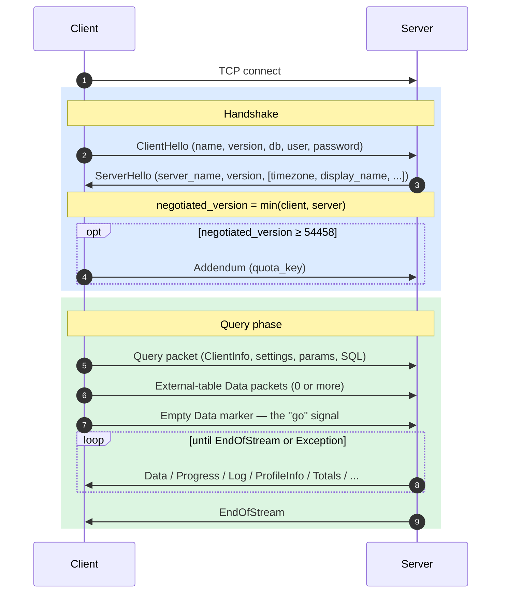
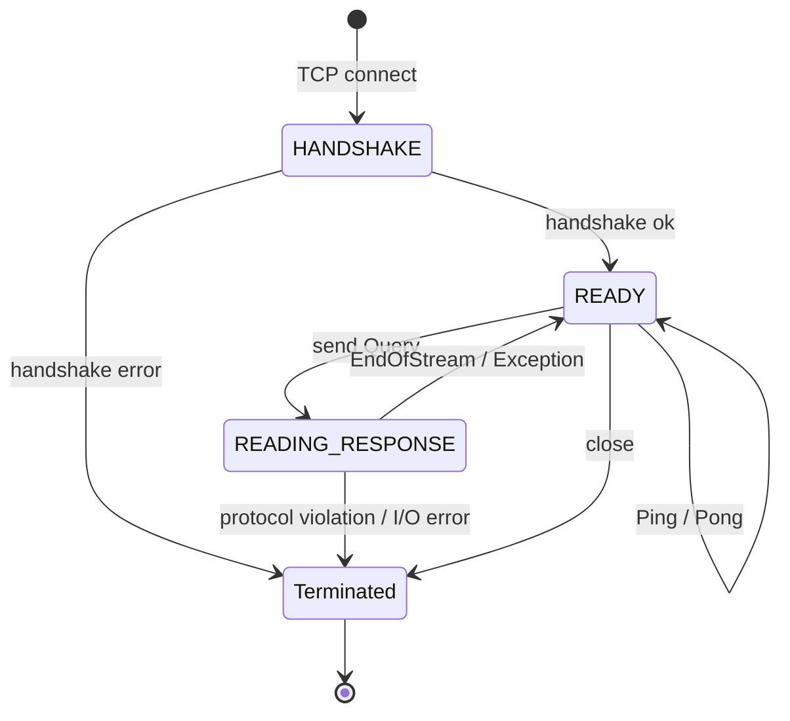
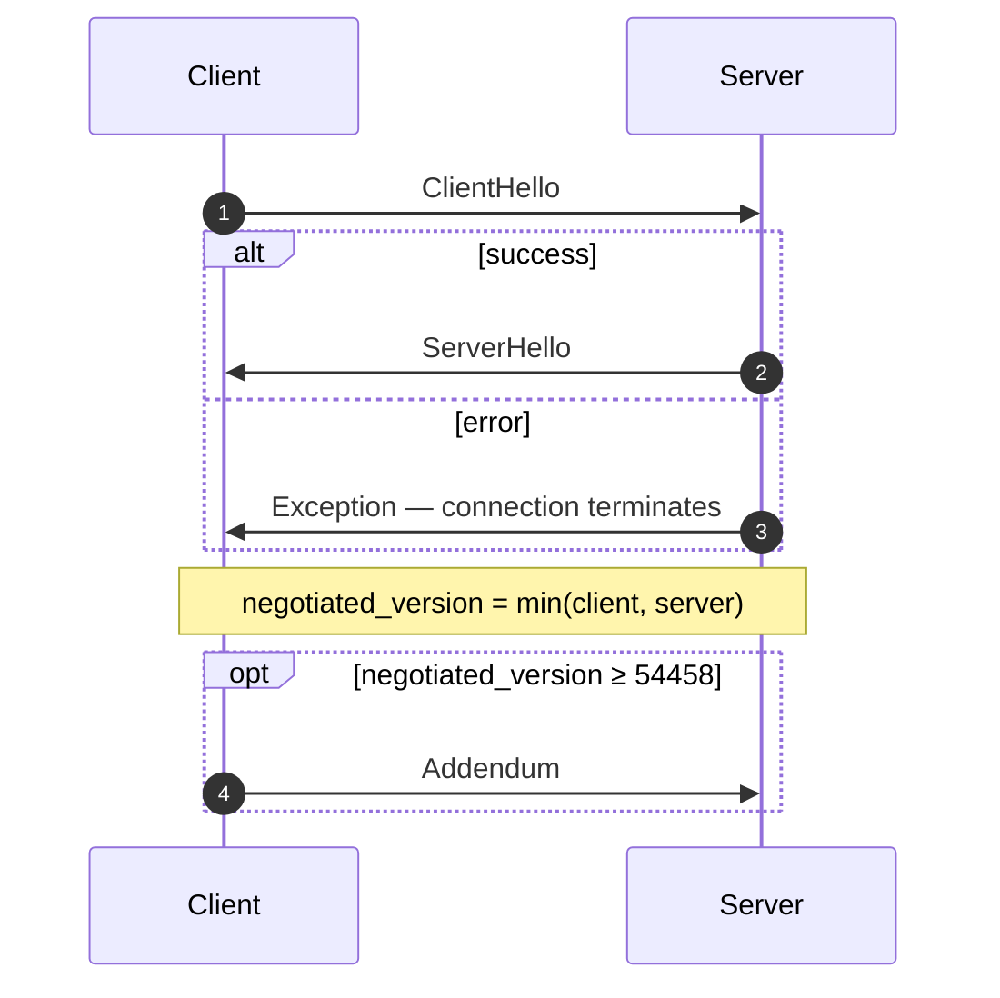
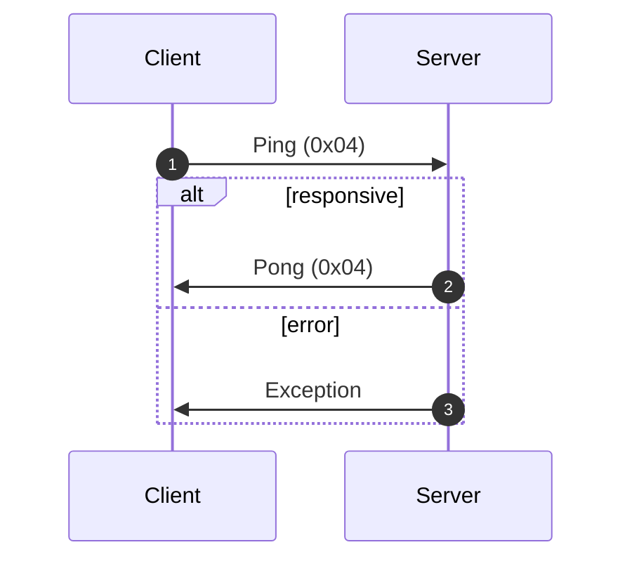
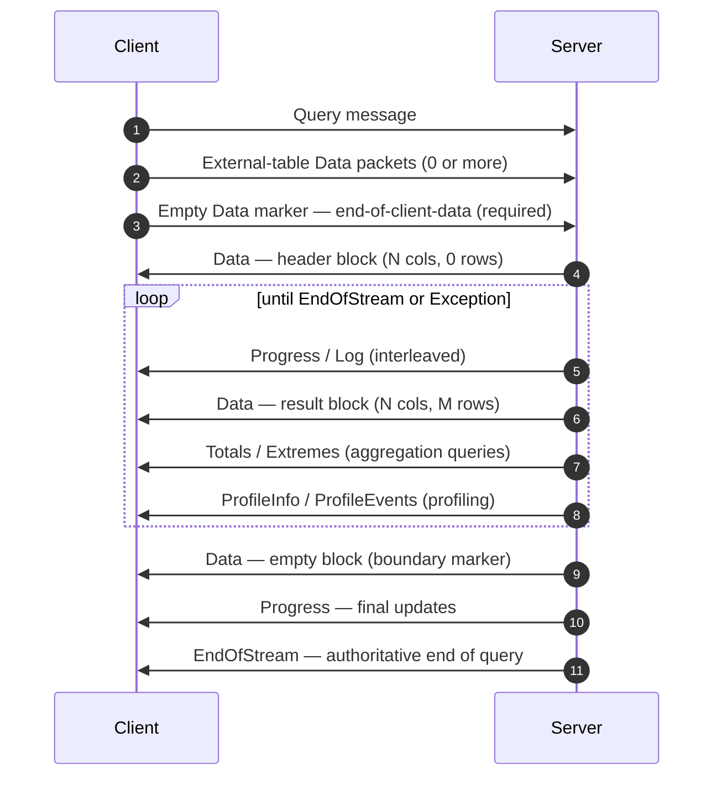
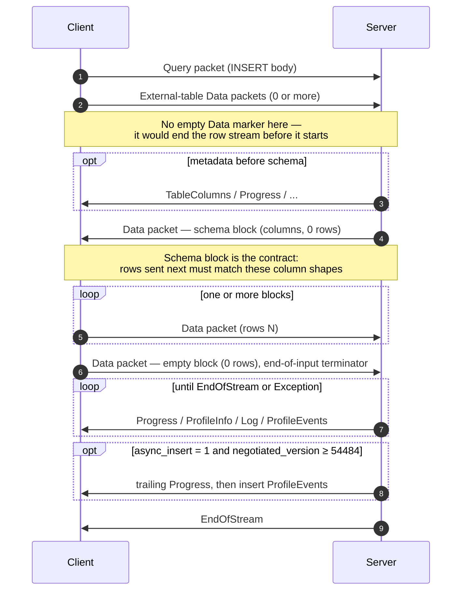
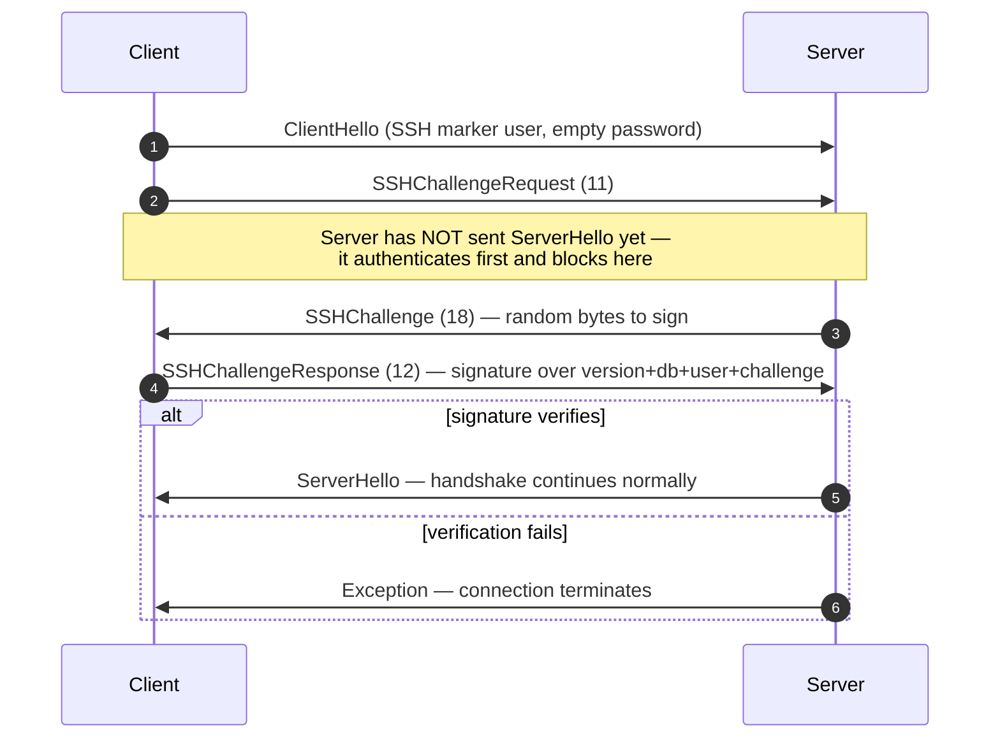

O protocolo nativo é o protocolo binário orientado à conexão com que clientes e servidores ClickHouse se comunicam via TCP. Ele transporta consultas SQL, dados de resultado, payloads de `INSERT`, telemetria de execução e sinais de erro. É o protocolo usado pelo cliente de linha de comando, pelo driver nativo em C++ e pela maioria dos drivers nativos de terceiros.

Esta página aborda o protocolo em si: estruturação de pacotes, a máquina de estados da conexão, negociação de versão e o corpo de todas as mensagens que não sejam `Block`. Os bytes dentro dos pacotes da família `Data` (o `Block`, suas colunas e as codificações por tipo) são um assunto à parte, documentado na especificação de [Formato Nativo](/pt-BR/reference/interfaces/specs/NativeFormat).

<Info>
  **Especificação complementar**

  Esta página faz par com a especificação complementar de [Formato Nativo](/pt-BR/reference/interfaces/specs/NativeFormat) e é publicada junto com ela. As duas especificações dividem o trabalho de forma clara: esta página cobre a camada de pacotes e transporte; a especificação de Formato Nativo cobre os bytes dentro dos pacotes da família `Data`.
</Info>

Algumas propriedades se mantêm ao longo de toda a especificação. O protocolo é binário e posicional: não há tags de campo, exceto dentro de `BlockInfo`, portanto um único byte fora do lugar dessincroniza tudo o que vem a seguir. Ele é com estado, e cada conexão TCP processa uma consulta por vez — não há multiplexação. Inteiros de largura fixa são codificados em little-endian.

<div id="overview">
  ## Visão geral
</div>

| Propriedade       | Valor                                                                                     |
| ----------------- | ----------------------------------------------------------------------------------------- |
| Transporte        | TCP, opcionalmente protegido por TLS                                                      |
| Ordem dos bytes   | little-endian para inteiros de largura fixa                                               |
| Codificação       | Binária e posicional (sem tags de campo, exceto em `BlockInfo`)                           |
| Modelo de conexão | Com estado, uma consulta por vez, sem multiplexação                                       |
| Versionamento     | Negociado no handshake; recursos individuais condicionados à versão                       |
| Formato de dados  | O [Formato Nativo](/pt-BR/reference/interfaces/specs/NativeFormat) para todos os dados tabulares |

Cada mensagem no wire começa com um código de tipo de pacote `VarUInt`, seguido de um corpo cuja estrutura depende desse código e da versão negociada do protocolo.

Uma conexão passa por três fases — um handshake único, depois qualquer número de trocas `Ping` ou `Query` e, por fim, o encerramento:



O protocolo TCP nativo sempre transporta dados tabulares no formato Native, independentemente de qualquer cláusula `FORMAT` no SQL. Reformatar para `RowBinary`, `CSV`, `JSON` e assim por diante é tarefa do cliente, feita depois que ele decodifica os blocos Native. (A interface HTTP segue um caminho de código diferente e *de fato* respeita a cláusula `FORMAT`; HTTP está fora do escopo aqui.)

<div id="security">
  ## Segurança
</div>

<div id="transport-security">
  ### Segurança de transporte (TLS)
</div>

O TLS opera na camada de transporte, abaixo do protocolo. Quando está habilitado, todo o tráfego TCP é criptografado, e as mensagens do protocolo permanecem idênticas byte a byte, com ou sem TLS.

<div id="authentication">
  ### Autenticação
</div>

A autenticação ocorre durante o handshake, na mensagem [`ClientHello`](#clienthello). Os campos `user` e `password` são transmitidos como strings em texto simples, portanto a criptografia na camada de transporte (TLS) é a responsável por proteger as credenciais em trânsito.

A autenticação SSH por challenge-response está disponível a partir da versão 54466 do protocolo — consulte [autenticação SSH por challenge-response](#ssh-authentication).

<div id="inter-server-secret">
  ### Segredo entre servidores
</div>

Na execução distribuída de consultas, os servidores se autenticam entre si ao comprovar que conhecem um segredo compartilhado — sem expor o segredo no wire. Cada consulta carrega um `auth_hash` SHA-256 de 32 bytes no campo 4 de [`Query`](#query), calculado a partir de um salt, um nonce, do segredo configurado e da consulta; o servidor receptor o recalcula e o compara. Isso é controlado pelo recurso `INTERSERVER_SECRET` (v54441). Clientes externos sempre enviam uma string vazia aqui. Consulte [Autenticação entre servidores](#inter-server-authentication).

<div id="versioning-and-feature-gates">
  ## Versionamento e feature gates
</div>

<div id="version-negotiation">
  ### Negociação de versão
</div>

Tanto o cliente quanto o servidor declaram a versão máxima do protocolo compatível durante o handshake. A **versão negociada** é a menor das duas:

```text
negotiated_version = min(client_version, server_version)
```

Cada mensagem após isso usa a versão negociada para determinar quais campos estão presentes no wire.

<div id="feature-gates">
  ### Feature gates
</div>

Uma funcionalidade é identificada pela versão do protocolo que a introduziu e fica **ativa** quando a versão negociada é maior ou igual a esse número.

<Warning>
  Quando uma funcionalidade está ativa, seus campos **devem** estar presentes no wire. O protocolo é estritamente posicional, portanto, omitir um campo sujeito a feature gate corrompe o fluxo de bytes de todos os campos seguintes.
</Warning>

<div id="feature-table">
  ### Tabela de funcionalidades
</div>

| Funcionalidade                                          | Versão | Afeta                            | Impacto no wire                                                                                                                                                                                                                                                                                                                                                                                                                                                                                                                                                                                                                                    |
| ------------------------------------------------------- | ------ | -------------------------------- | -------------------------------------------------------------------------------------------------------------------------------------------------------------------------------------------------------------------------------------------------------------------------------------------------------------------------------------------------------------------------------------------------------------------------------------------------------------------------------------------------------------------------------------------------------------------------------------------------------------------------------------------------- |
| BLOCK&#95;INFO                                          | all    | Block                            | Adiciona o prefixo BlockInfo (`is_overflows`, `bucket_number`) a cada Block.                                                                                                                                                                                                                                                                                                                                                                                                                                                                                                                                                                       |
| CLIENT&#95;INFO                                         | 54032  | Query                            | Adiciona o bloco ClientInfo ao corpo de Query.                                                                                                                                                                                                                                                                                                                                                                                                                                                                                                                                                                                                     |
| TIMEZONE                                                | 54058  | ServerHello                      | Adiciona o campo `timezone` a ServerHello.                                                                                                                                                                                                                                                                                                                                                                                                                                                                                                                                                                                                         |
| QUOTA&#95;KEY&#95;IN&#95;CLIENT&#95;INFO                | 54060  | ClientInfo                       | Adiciona o campo `quota_key` a ClientInfo.                                                                                                                                                                                                                                                                                                                                                                                                                                                                                                                                                                                                         |
| DISPLAY&#95;NAME                                        | 54372  | ServerHello                      | Adiciona o campo `display_name` a ServerHello.                                                                                                                                                                                                                                                                                                                                                                                                                                                                                                                                                                                                     |
| VERSION&#95;PATCH                                       | 54401  | ServerHello, ClientInfo          | Adiciona o campo `version_patch` a ambos.                                                                                                                                                                                                                                                                                                                                                                                                                                                                                                                                                                                                          |
| SERVER&#95;LOGS                                         | 54406  | Log                              | O servidor emite pacotes Log quando `send_logs_level` está definido.                                                                                                                                                                                                                                                                                                                                                                                                                                                                                                                                                                               |
| COLUMN&#95;DEFAULTS&#95;METADATA                        | 54410  | TableColumns                     | O servidor pode enviar o pacote [`TableColumns`](#tablecolumns) (tipo 11) com metadados de valores padrão das colunas antes do bloco de schema de INSERT/entrada. Enviado somente quando a versão negociada ≥ 54410 **e** `input_format_defaults_for_omitted_fields` estiver habilitado. Abaixo dessa versão, o pacote nunca é enviado; os clientes não devem aguardar por ele.                                                                                                                                                                                                                                                                    |
| WRITE&#95;CLIENT&#95;INFO                               | 54420  | Progress                         | Adiciona `wrote_rows` e `wrote_bytes` a Progress. (Apesar do nome, isso **não** controla o bloco ClientInfo — isso é feito por `CLIENT_INFO` (v54032).)                                                                                                                                                                                                                                                                                                                                                                                                                                                                                            |
| SETTINGS&#95;SERIALIZED&#95;AS&#95;STRINGS              | 54429  | Query (settings encoding)        | Altera **como** a lista de settings, sempre presente, é codificada; **não** controla se as settings são enviadas. v54429+ grava cada setting como `(name, flags, value-as-string)`; peers mais antigos gravam `(name, type-specific-binary-value)` sem flags. Veja [Setting](#setting).                                                                                                                                                                                                                                                                                                                                                            |
| INTERSERVER&#95;SECRET                                  | 54441  | Query                            | Adiciona o campo `auth_hash` entre servidores a Query — um SHA-256 com salt sobre o secret do cluster, não o secret bruto. Clientes externos enviam uma string vazia. Veja [Autenticação entre servidores](#inter-server-authentication).                                                                                                                                                                                                                                                                                                                                                                                                          |
| OPEN&#95;TELEMETRY                                      | 54442  | ClientInfo                       | Adiciona o contexto de rastreamento do OpenTelemetry a ClientInfo.                                                                                                                                                                                                                                                                                                                                                                                                                                                                                                                                                                                 |
| DISTRIBUTED&#95;DEPTH                                   | 54448  | ClientInfo                       | Adiciona o campo `distributed_depth` a ClientInfo.                                                                                                                                                                                                                                                                                                                                                                                                                                                                                                                                                                                                 |
| INITIAL&#95;QUERY&#95;START&#95;TIME                    | 54449  | ClientInfo                       | Adiciona o campo `initial_time` (Int64, largura fixa).                                                                                                                                                                                                                                                                                                                                                                                                                                                                                                                                                                                             |
| PROFILE&#95;EVENTS                                      | 54451  | ProfileEvents                    | O servidor emite pacotes ProfileEvents durante a execução da consulta.                                                                                                                                                                                                                                                                                                                                                                                                                                                                                                                                                                             |
| PARALLEL&#95;REPLICAS                                   | 54453  | ClientInfo                       | Adiciona campos de coordination de réplicas paralelas a ClientInfo.                                                                                                                                                                                                                                                                                                                                                                                                                                                                                                                                                                                |
| CUSTOM&#95;SERIALIZATION                                | 54454  | Block (Column)                   | Adiciona o byte `has_custom_serialization` após a string de tipo de cada coluna.                                                                                                                                                                                                                                                                                                                                                                                                                                                                                                                                                                   |
| ADDENDUM                                                | 54458  | Handshake                        | O cliente envia um addendum (`quota_key`) após a troca de handshake.                                                                                                                                                                                                                                                                                                                                                                                                                                                                                                                                                                               |
| PARAMETERS                                              | 54459  | Query                            | Adiciona a lista de parâmetros ao corpo de Query.                                                                                                                                                                                                                                                                                                                                                                                                                                                                                                                                                                                                  |
| SERVER&#95;QUERY&#95;TIME&#95;IN&#95;PROGRESS           | 54460  | Progress                         | Adiciona o campo `elapsed_ns` a Progress.                                                                                                                                                                                                                                                                                                                                                                                                                                                                                                                                                                                                          |
| PASSWORD&#95;COMPLEXITY&#95;RULES                       | 54461  | ServerHello                      | Adiciona a ServerHello uma lista de Patterns regex da política de senha e mensagens legíveis por humanos.                                                                                                                                                                                                                                                                                                                                                                                                                                                                                                                                          |
| INTERSERVER&#95;SECRET&#95;V2                           | 54462  | ServerHello                      | Adiciona um nonce `UInt64` de 8 bytes a ServerHello. Usado para assinatura de consultas entre servidores; clientes externos o decodificam e o ignoram.                                                                                                                                                                                                                                                                                                                                                                                                                                                                                             |
| TOTAL&#95;BYTES&#95;IN&#95;PROGRESS                     | 54463  | Progress                         | Adiciona o campo `total_bytes_to_read` (VarUInt) a Progress, entre `total_rows` e `wrote_rows`.                                                                                                                                                                                                                                                                                                                                                                                                                                                                                                                                                    |
| TIMEZONE&#95;UPDATES                                    | 54464  | TimezoneUpdate                   | Adiciona o pacote de servidor `TimezoneUpdate` (tipo 17). Corpo: um único `String` que carrega a session timezone. Enviado somente pelo inicializador da table function `input`, logo após o bloco de schema de entrada, para que o cliente faça parse das linhas que envia com a `session_timezone` do servidor. Veja [TimezoneUpdate](#timezoneupdate).                                                                                                                                                                                                                                                                                          |
| SPARSE&#95;SERIALIZATION                                | 54465  | Block (Column)                   | O servidor pode definir `has_custom_serialization = 1` e emitir uma coluna codificada de forma esparsa. Formato wire: kind de 1 byte (0x01 = SPARSE), seguido por um fluxo de offsets VarUInt terminado por EOG, depois os valores não padrão codificados densamente no tipo interno. Veja [kind&#95;stack and sparse encoding](/pt-BR/reference/interfaces/specs/NativeFormat#kind-stack-and-sparse-encoding).                                                                                                                                                                                                                                          |
| SSH&#95;AUTHENTICATION                                  | 54466  | Auth flow                        | Adiciona autenticação SSH por desafio-resposta. Opt-in: o cliente envia um `user` no formato `" SSH KEY AUTHENTICATION " + <real_user>` com senha vazia para acioná-la. Veja [Autenticação SSH por desafio-resposta](#ssh-authentication).                                                                                                                                                                                                                                                                                                                                                                                                         |
| TABLE&#95;READ&#95;ONLY&#95;CHECK                       | 54467  | TablesStatusResponse             | Adiciona um flag `is_readonly` à linha de cada tabela em TablesStatusResponse. Clientes externos que não emitem `TablesStatusRequest` não veem nenhuma mudança no wire.                                                                                                                                                                                                                                                                                                                                                                                                                                                                            |
| SYSTEM&#95;KEYWORDS&#95;TABLE                           | 54468  | system tables                    | O servidor popula `system.keywords` para que o `clickhouse-client` canônico possa autocompletar palavras-chave. Não há mudança no wire do protocolo nativo.                                                                                                                                                                                                                                                                                                                                                                                                                                                                                        |
| ROWS&#95;BEFORE&#95;AGGREGATION                         | 54469  | ProfileInfo                      | Adiciona `applied_aggregation` (Bool) e `rows_before_aggregation` (VarUInt) a ProfileInfo, nessa ordem, no final.                                                                                                                                                                                                                                                                                                                                                                                                                                                                                                                                  |
| CHUNKED&#95;PROTOCOL                                    | 54470  | Connection framing               | O enquadramento em fragmentos por pacote envolve cada packet body. Negociado em Addendum. ServerHello carrega a preferência do servidor para cada direção; Addendum carrega a escolha final do cliente. Veja [chunked framing](#chunked-framing).                                                                                                                                                                                                                                                                                                                                                                                                  |
| VERSIONED&#95;PARALLEL&#95;REPLICAS&#95;PROTOCOL        | 54471  | ServerHello, Addendum            | Ambos os lados trocam um `VarUInt` com a versão do protocolo de coordenação de réplicas paralelas. O campo de ServerHello fica **imediatamente após `protocol_version`** (antes de `timezone`). O campo de Addendum é anexado após as strings do protocolo em blocos. Valor atual: `7` (`DBMS_PARALLEL_REPLICAS_PROTOCOL_VERSION`).                                                                                                                                                                                                                                                                                                                |
| INTERSERVER&#95;EXTERNALLY&#95;GRANTED&#95;ROLES        | 54472  | Query                            | Adiciona um campo `String external_roles` ao corpo de Query, entre o terminador de settings e o hash do segredo interserver. Clientes externos enviam uma lista de roles vazia (um único byte `0x00`, ou seja, VarUInt 0 dentro de um envelope String).                                                                                                                                                                                                                                                                                                                                                                                            |
| V2&#95;DYNAMIC&#95;AND&#95;JSON&#95;SERIALIZATION       | 54473  | Column body                      | O servidor pode emitir serialização V2 para os tipos de coluna `Dynamic` e `JSON` — isso determina qual versão de `state_prefix` eles usam. Veja [tipos versionados](/pt-BR/reference/interfaces/specs/NativeFormat#versioned-types).                                                                                                                                                                                                                                                                                                                                                                                                                    |
| SERVER&#95;SETTINGS                                     | 54474  | ServerHello                      | O servidor transmite seus settings fora do padrão como uma lista no final de ServerHello, após `nonce`. Formato: triplas `(key, flags, value)` terminadas por uma key vazia — igual à lista de settings do pacote Query.                                                                                                                                                                                                                                                                                                                                                                                                                           |
| QUERY&#95;AND&#95;LINE&#95;NUMBERS                      | 54475  | ClientInfo                       | Adiciona `script_query_number` (VarUInt) e `script_line_number` (VarUInt) ao final de ClientInfo. Usado pelo clickhouse-client para atribuir erros em scripts com várias instruções; clientes externos enviam `0, 0`.                                                                                                                                                                                                                                                                                                                                                                                                                              |
| JWT&#95;IN&#95;INTERSERVER                              | 54476  | ClientInfo                       | Adiciona um UInt8 indicando a presença de JWT + um `String jwt` opcional ao final de ClientInfo. Clientes externos (sem JWT) enviam o byte `0x00`. (Escrito como `DBMS_MIN_REVISON_WITH_JWT_IN_INTERSERVER` em C++ — observe o erro de digitação no nome da constante.)                                                                                                                                                                                                                                                                                                                                                                            |
| QUERY&#95;PLAN&#95;SERIALIZATION                        | 54477  | ServerHello, QueryPlan packet    | ServerHello anexa `VarUInt query_plan_serialization_version` após os server settings. Também introduz `ClientPacket::QueryPlan` (código `13`) para entrega entre servidores de planos de consulta pré-construídos — clientes externos nunca enviam.                                                                                                                                                                                                                                                                                                                                                                                                |
| PARALLEL&#95;BLOCK&#95;MARSHALLING                      | 54478  | Block (Column)                   | O servidor pode encapsular colunas em `ColumnBLOB` (comprimido inline) para processamento paralelo. Isso é controlado por a consulta ter compressão habilitada AND `rows > 1`; caso contrário, aplica-se o formato wire normal da coluna. Clientes que nunca habilitam compressão em pacotes Query de saída não veem alteração no wire.                                                                                                                                                                                                                                                                                                            |
| VERSIONED&#95;CLUSTER&#95;FUNCTION&#95;PROTOCOL         | 54479  | ServerHello                      | Adiciona `VarUInt cluster_function_protocol_version` ao final de ServerHello. Usado para funções de tabela `*Cluster` (`s3Cluster`, etc.). Clientes externos decodificam e ignoram.                                                                                                                                                                                                                                                                                                                                                                                                                                                                |
| OUT&#95;OF&#95;ORDER&#95;BUCKETS&#95;IN&#95;AGGREGATION | 54480  | BlockInfo                        | Adiciona o campo 3 (`out_of_order_buckets: Vec<Int32>`) ao fluxo com tags de campo de BlockInfo. Decodificado como `[VarUInt count][Int32]*count`. Clientes externos não emitem isso por conta própria; o decodificador lê qualquer lista não vazia que o servidor enviar.                                                                                                                                                                                                                                                                                                                                                                         |
| COMPRESSED&#95;LOGS&#95;PROFILE&#95;EVENTS&#95;COLUMNS  | 54481  | Log, ProfileEvents, TableColumns | O servidor pode encapsular os corpos dos pacotes [`Log`](#log), [`ProfileEvents`](#profileevents) e [`TableColumns`](#tablecolumns) no [frame de compressão](/pt-BR/reference/interfaces/specs/NativeFormat#compression-frame). Nesta versão, os corpos dos três trafegam pelo mesmo caminho de saída opcionalmente comprimido, que se torna um frame de compressão real apenas quando a consulta tem `compression = true`. Clientes que nunca habilitam compressão em pacotes Query de saída não veem alteração no wire.                                                                                                                                |
| REPLICATED&#95;SERIALIZATION                            | 54482  | Block (Column)                   | O servidor pode emitir colunas com kind&#95;stack `0x04 = REPLICATED` — uma forma compacta no estilo Dicionário para valores repetidos — veja [kind&#95;stack e codificação esparsa](/pt-BR/reference/interfaces/specs/NativeFormat#kind-stack-and-sparse-encoding). Abaixo desta versão, o gravador expandia essas colunas antes de enviá-las. A decodificação é feita por busca de índice (`elements[indexes[i]]` por linha); há suporte a tipos folha e a tipos internos `Nullable`/`Array`/`Tuple`/`Map`/`Nested`/`LowCardinality`.                                                                                                                  |
| NULLABLE&#95;SPARSE&#95;SERIALIZATION                   | 54483  | Block (Column)                   | Combina serialização esparsa com `Nullable(T)`. Abaixo desta versão, o gravador expandia o formato esparso para colunas Nullable antes do envio; em v54483+, os dados no wire ficam em formato esparso sobre Nullable. Veja [kind&#95;stack e codificação esparsa](/pt-BR/reference/interfaces/specs/NativeFormat#kind-stack-and-sparse-encoding).                                                                                                                                                                                                                                                                                                       |
| PROGRESS&#95;IN&#95;ASYNC&#95;INSERT                    | 54484  | Progress (INSERT)                | Em um INSERT **assíncrono** (`async_insert = 1`), assim que o insert é descarregado, o servidor envia um pacote extra [`Progress`](#progress) e, em seguida, os `ProfileEvents` do insert, antes de `EndOfStream`. Isso é controlado pela versão *negociada* ≥ 54484; abaixo disso, o servidor omite esse Progress final. O formato wire de Progress não muda — apenas a emissão é nova. Na prática, o incremento carrega o tempo decorrido; os contadores de linhas gravadas são reportados pelos ProfileEvents correspondentes. Um cliente que já consome Progress intercalado não precisa de mudança de formato, apenas tolerar mais um pacote. |
| CLIENT&#95;AGENT&#95;IN&#95;CLIENT&#95;INFO             | 54485  | ClientInfo                       | Adiciona um `String` `client_agent` ao final de ClientInfo. O cliente canônico detecta automaticamente um identificador de agent a partir do ambiente (por exemplo, `claude-code`, `cursor`, `gemini-cli` ou o valor da variável `AGENT`); um cliente externo sem nada detectado envia uma string vazia. Obrigatório quando a versão negociada for ≥ 54485 — omiti-lo dessincroniza o restante do pacote Query.                                                                                                                                                                                                                                    |

<div id="packet-envelope">
  ## Encapsulamento do pacote
</div>

Toda mensagem no wire tem a mesma estrutura externa, em ambas as direções:

```text
[VarUInt: packet_type_code]    always encoded as VarUInt
[message body]                 format depends on packet_type_code
```

As tabelas completas dos tipos de pacote estão na [referência de tipos de pacote](#packet-type-reference).

O tipo de pacote é um `VarUInt`, não um byte de largura fixa. Para valores abaixo de 128, um `VarUInt` produz o mesmo único byte, mas as implementações devem usar a codificação `VarUInt` para permanecer compatíveis caso tipos de pacote futuros cheguem a 128 ou mais.

A [referência de mensagens](#message-reference) documenta apenas o **corpo** de cada pacote — os bytes após o código do tipo de pacote. A numeração dos campos começa em 1, com o primeiro campo do corpo.

<div id="chunked-framing">
  ### Enquadramento em fragmentos (v54470+)
</div>

Quando o recurso `CHUNKED_PROTOCOL` é **negociado** (consulte [o handshake](#handshake-phase)), cada pacote no wire é envolvido por um enquadramento em fragmentos. Esse encapsulamento é **por direção**: cliente→servidor e servidor→cliente são negociados separadamente e podem acabar em modos diferentes (em fragmentos versus sem enquadramento).

Layout no wire de cada pacote:

```text
<chunk>...   one or more chunks; their payloads concatenated form the whole packet
[u32 LE = 0] zero-size terminator marking end of packet
```

Layout wire por fragmento:

```text
[u32 LE: chunk_size]   chunk_size in [1, UINT32_MAX]
[chunk_size bytes]     packet bytes (see note below)
```

O tipo de pacote `VarUInt` está **dentro** do fluxo em fragmentos: ele é o primeiro byte do payload do pacote (o primeiro byte do primeiro fragmento), não um byte separado enviado antes do framing. O payload em fragmentos de cada pacote é o `[VarUInt packet_type_code][message body]` completo do [envelope do pacote](#packet-envelope). Um cliente que deixa o tipo de pacote fora do fluxo em fragmentos faz com que a outra ponta leia esse byte de tipo como o primeiro byte do tamanho do fragmento `u32`, dessincronizando a conexão.

Um único pacote pode ser dividido em vários fragmentos se o buffer do gravador encher no meio do pacote; uma divisão pode ocorrer em qualquer ponto, inclusive dentro do `VarUInt` do tipo de pacote. O leitor concatena os payloads dos fragmentos e trata o zero final de 4 bytes como um limite de pacote transparente — ele o consome, mas não o expõe ao que estiver lendo os corpos dos pacotes.

Pacotes sem corpo ainda são encapsulados: um pacote de um único byte, como `Ping` ou `Pong`, torna-se `[u32 size = 1][0x04][u32 0]` assim que o envio em fragmentos é negociado. Qualquer descrição de &quot;byte único no wire&quot; em outro ponto desta página se refere à forma anterior ao envio em fragmentos.

**Negociação.** ServerHello e Addendum carregam, cada um, dois campos `String`, um por direção, com valores de `{"chunked", "notchunked", "chunked_optional", "notchunked_optional"}`:

* `chunked` / `notchunked` são estritos: esse lado exige exatamente esse modo.
* As variantes `_optional` são flexíveis: aceitam qualquer modo que o outro lado escolher.

O valor acordado para cada direção é calculado em pares:

| Preferência do servidor   | Preferência do cliente    | Acordado                                             |
| ------------------------- | ------------------------- | ---------------------------------------------------- |
| `*_optional`              | qualquer valor            | seguir o CLIENT (seu `starts_with("chunked")`)       |
| qualquer valor            | `*_optional`              | seguir o SERVER                                      |
| `chunked` estrito         | `chunked` estrito         | `chunked`                                            |
| `notchunked` estrito      | `notchunked` estrito      | `notchunked`                                         |
| incompatibilidade estrita | incompatibilidade estrita | **erro de protocolo** — a conexão DEVE ser encerrada |

No lado do cliente, a preferência de ENVIO do cliente é negociada com a preferência de RECEBIMENTO do servidor, e vice-versa.

**Temporização.** As strings de negociação trafegam no wire sem framing: ClientHello → ServerHello (preferências do servidor) → Addendum (valores negociados do cliente). A mudança de framing se aplica a cada byte enviado *depois* que o Addendum é descarregado do buffer. O próprio Addendum, o ClientHello e o ServerHello nunca usam framing.

<div id="connection-lifecycle">
  ## Ciclo de vida da conexão
</div>

A qualquer momento, uma conexão está em exatamente um de quatro estados: `HANDSHAKE`, `READY`, `READING_RESPONSE` ou encerrada. Como o protocolo não oferece multiplexação, um cliente que envia uma nova solicitação antes de consumir totalmente a resposta anterior intercala bytes no wire e corrompe o fluxo.

<div id="states">
  ### Estados
</div>



O fluxo principal segue em linha reta — `HANDSHAKE → READY → READING_RESPONSE → READY` — com o loop de `Ping`/`Pong` e todas as transições de falha convergindo para o único sink `Terminated`.

| Estado             | Descrição                                                                                                                                                                                                                                   |
| ------------------ | ------------------------------------------------------------------------------------------------------------------------------------------------------------------------------------------------------------------------------------------- |
| `HANDSHAKE`        | Estado inicial após a abertura da conexão TCP. Somente mensagens de [handshake](#handshake-phase) são válidas. Faz a transição para `READY` em caso de sucesso ou é encerrado em caso de falha.                                             |
| `READY`            | Ocioso. O cliente pode enviar [Ping](#ping-phase), [consulta](#query-phase) ou fechar a conexão. A conexão pode permanecer em `READY` indefinidamente (sujeita a `idle_connection_timeout`, veja [limites de conexão](#connection-limits)). |
| `READING_RESPONSE` | É acessado quando o cliente envia uma consulta. O cliente deve consumir completamente o fluxo de resposta do servidor antes de retornar a `READY`. O único pacote cliente→servidor permitido aqui é Cancel (não especificado nesta página). |
| Terminated         | Não pode mais ser usado. O cliente deve abrir uma nova conexão TCP e reiniciar o handshake.                                                                                                                                                 |

<div id="handshake-phase">
  ### Fase de handshake
</div>

Autentica e negocia a versão do protocolo. Ocorre exatamente uma vez por conexão, antes de qualquer outra coisa.

A conexão TCP acabou de ser aberta e nenhuma mensagem foi trocada. O fluxo:



1. O cliente envia [`ClientHello`](#clienthello) com a versão máxima de protocolo compatível.

2. O cliente lê a resposta e a encaminha de acordo com o tipo de pacote:

   | Tipo de pacote  | Ação                                                                                                                           |
   | --------------- | ------------------------------------------------------------------------------------------------------------------------------ |
   | `Hello` (0)     | Decodifica [`ServerHello`](#serverhello). Calcula `negotiated_version = min(client_ver, server_ver)`. Prossiga para o passo 3. |
   | `Exception` (2) | Decodifica [`Exception`](#exception). Retorna como erro e encerra a conexão.                                                   |
   | qualquer outro  | Violação de protocolo. Encerra a conexão.                                                                                      |

3. Se `negotiated_version ≥ 54458` (o recurso `ADDENDUM`), o cliente envia um [`Addendum`](#addendum). Essa decisão se baseia na versão **negociada**, não na versão declarada pelo cliente.

Em caso de sucesso, a conexão passa para `READY`; em caso de erro, ela é encerrada.

<div id="ping-phase">
  ### Fase de Ping
</div>

Uma verificação de liveness em nível de aplicação, independente do keepalive do TCP. Uma troca de Ping/Pong bem-sucedida confirma que a conexão TCP está ativa em ambas as direções e que o servidor está respondendo. O Ping é sem estado e não está correlacionado a nenhuma consulta, portanto vários Pings sequenciais são independentes.

Partindo de `READY`, o fluxo é:



1. O cliente envia [`Ping`](#ping).
2. O cliente lê a resposta:

   | Tipo de pacote  | Ação                                                       |
   | --------------- | ---------------------------------------------------------- |
   | `Pong` (4)      | Disponibilidade confirmada. Retorne para `READY`.          |
   | `Exception` (2) | Decodifique [`Exception`](#exception) e retorne como erro. |
   | qualquer outro  | Violação de protocolo.                                     |

<div id="query-phase">
  ### Fase da consulta
</div>

O cliente envia uma instrução SQL; o servidor retorna, em fluxo contínuo, os blocos de resultados e a telemetria de execução. A resposta é uma sequência de pacotes terminada por exatamente um `EndOfStream` ou `Exception`.

Partindo de `READY`, o fluxo é:



Em caso de erro em qualquer ponto, o servidor envia uma `Exception` em vez de `EndOfStream`, o que encerra a consulta.

1. O cliente envia [`Query`](#query) com um `query_id` exclusivo (normalmente um UUID).
2. O cliente envia quaisquer tabelas externas e, em seguida, o marcador `Data` vazio. O pacote `Data` vazio tem `table_name = ""`, `num_columns = 0`, `num_rows = 0`. O servidor não começa a executar a consulta até receber esse marcador.
3. O cliente passa para `READING_RESPONSE` e faz flush do buffer de escrita.
4. O cliente lê os pacotes de resposta em loop, despachando por tipo:

   | Tipo de pacote       | Ação                                                                                                                                                                                                   |
   | -------------------- | ------------------------------------------------------------------------------------------------------------------------------------------------------------------------------------------------------ |
   | `Data` (1)           | Decodifique o bloco. O primeiro `Data` é o cabeçalho do esquema; os seguintes são blocos de resultado (acumule-os); um bloco vazio é um marcador de limite. `num_rows == 0` **não** é fim de consulta. |
   | `Progress` (3)       | Métricas de execução. Cada pacote é um **incremento** em relação ao anterior — acumule localmente.                                                                                                     |
   | `EndOfStream` (5)    | Consulta concluída. Saia do loop e retorne para `READY`.                                                                                                                                               |
   | `ProfileInfo` (6)    | Dados de profiling pós-execução.                                                                                                                                                                       |
   | `Totals` (7)         | Bloco de totais da agregação (mesmo wire format de `Data`).                                                                                                                                            |
   | `Extremes` (8)       | Bloco de valores mínimo/máximo (mesmo wire format de `Data`).                                                                                                                                          |
   | `Log` (10)           | Linha de log do servidor.                                                                                                                                                                              |
   | `TableColumns` (11)  | Metadados de valores padrão de coluna.                                                                                                                                                                 |
   | `ProfileEvents` (14) | Counters de desempenho.                                                                                                                                                                                |
   | `Exception` (2)      | Decodifique e retorne como erro. Saia do loop e retorne para `READY`.                                                                                                                                  |
   | qualquer outro       | Inesperado durante a fase da consulta. Encerre a conexão.                                                                                                                                              |

Em `EndOfStream` ou em uma `Exception` tratada, a conexão retorna para `READY`. Uma violação de protocolo ou erro de E/S a encerra.

<Note>
  O caso `num_rows == 0` costuma confundir novas implementações. Um bloco com zero linhas é um marcador de limite ou um cabeçalho de esquema, não um sinal de fim de stream. Somente `EndOfStream` ou `Exception` encerra a resposta.
</Note>

<div id="insert-phase">
  ### Fase INSERT
</div>

A fase INSERT é a [fase de consulta](#query-phase) com duas trocas adicionais. O cliente envia uma instrução `INSERT`; o servidor responde com um **bloco de esquema** que descreve a tabela de destino; o cliente transmite pacotes Data com as linhas e, em seguida, o marcador Data vazio; o servidor finaliza com `EndOfStream` ou `Exception`.

Partindo de `READY`, o SQL é um `INSERT` no formato `INSERT INTO <table> [(<cols>)] VALUES` — sem um literal `VALUES (...)` embutido, já que os dados das linhas fluem por meio de pacotes Data. O fluxo:



1. O cliente envia [`Query`](#query) com `body` definido como o SQL de INSERT.
2. O cliente envia quaisquer tabelas externas (raro em INSERT). Diferentemente da [fase de consulta](#query-phase), ele **não** envia aqui um marcador Data vazio. O pacote `Query` de `INSERT` é enviado com dados pendentes, portanto o bloco vazio de fim de dados é adiado para a etapa 5; enviá-lo antes do bloco de esquema faria o servidor interpretá-lo como o fim do stream de linhas, concluir o INSERT sem linhas e então analisar o primeiro pacote de linha real como um pacote avulso de nível superior.
3. O cliente drena os pacotes de metadados (TableColumns, Progress, ProfileInfo, Log, ProfileEvents) até ler o pacote Data de esquema — um Block com 0 linhas, mas com a estrutura completa das colunas (nomes e tipos). O bloco de esquema é o contrato: as linhas que o cliente envia em seguida devem corresponder a essas estruturas de coluna.
4. O cliente envia bloco(s) de dados. Para cada bloco, ele grava `VarUInt(ClientPacket::Data = 2)`, depois `String("")` para o nome vazio da tabela externa, e então o Block. Os tipos das colunas devem corresponder, por posição, às colunas do bloco de esquema.
5. O cliente envia o terminador de fim de entrada: um pacote Data com um Block vazio (0 colunas, 0 linhas).
6. O cliente drena o stream de resposta até `EndOfStream` (sucesso) ou `Exception` (falha).

**INSERT assíncrono (v54484+).** Quando a consulta inclui `async_insert = 1`, o servidor enfileira as linhas e faz o flush delas como parte de um batch. Na versão negociada ≥ 54484 (`PROGRESS_IN_ASYNC_INSERT`), assim que o flush é concluído, o servidor emite um pacote extra de [`Progress`](#progress), imediatamente seguido pelos `ProfileEvents` do insert e então por `EndOfStream`. Abaixo de 54484, o servidor omite esse Progress final. O pacote é um `Progress` comum; como o servidor redefine o pipeline da consulta antes de incorporar as contagens de escrita, na prática o incremento carrega apenas o tempo decorrido, e as estatísticas de linhas e bytes gravados chegam ao cliente por meio dos `ProfileEvents` correspondentes. Um cliente que já drena pacotes `Progress` intercalados na etapa 6 só precisa aceitar mais um pacote.

A conexão retorna para `READY` em `EndOfStream` ou em uma `Exception` tratada. Violações de protocolo e erros de E/S a encerram.

<div id="message-reference">
  ## Referência de mensagens
</div>

Os campos estão listados na ordem em que aparecem no wire. A coluna `Type` usa:

* `VarUInt` — inteiro sem sinal de comprimento variável (consulte [VarUInt](/pt-BR/reference/interfaces/specs/NativeFormat#varuint)).
* `String` — bytes com prefixo VarUInt (consulte [String](/pt-BR/reference/interfaces/specs/NativeFormat#string)).
* `UInt8`, `Int32` e assim por diante — inteiros little-endian de largura fixa.
* `Bool` — um único byte, `0x00` ou `0x01`.

A coluna `Role` indica quem usa cada campo:

* **client** — definido por clientes externos.
* **inter-server** — relevante apenas para a comunicação entre servidores; clientes externos gravam um valor padrão.
* **universal** — usado por ambos.

Estas tabelas documentam apenas o corpo de cada pacote, após o código do tipo de pacote.

<div id="clienthello">
  ### ClientHello (tipo de pacote 0)
</div>

Cliente → servidor. A primeira mensagem após o estabelecimento da conexão TCP.

| # | Campo                | Tipo    | Função    | Descrição                                                     |
| - | -------------------- | ------- | --------- | ------------------------------------------------------------- |
| 1 | client&#95;name      | String  | universal | Identificador do cliente (por exemplo, `"clickhouse-client"`) |
| 2 | version&#95;major    | VarUInt | universal | Versão principal do cliente                                   |
| 3 | version&#95;minor    | VarUInt | universal | Versão secundária do cliente                                  |
| 4 | protocol&#95;version | VarUInt | universal | Versão máxima do protocolo compatível com o cliente           |
| 5 | database             | String  | universal | nome do banco de dados padrão                                 |
| 6 | user                 | String  | universal | Nome de usuário para autenticação                             |
| 7 | password             | String  | universal | Senha (em texto simples)                                      |

<div id="serverhello">
  ### ServerHello (tipo de pacote 0)
</div>

Servidor → Cliente. A resposta a ClientHello em caso de autenticação bem-sucedida.

| #  | Campo                                          | Tipo      | Papel          | Condição                                                  | Descrição                                                                                                                                                                                                                                                                       |
| -- | ---------------------------------------------- | --------- | -------------- | --------------------------------------------------------- | ------------------------------------------------------------------------------------------------------------------------------------------------------------------------------------------------------------------------------------------------------------------------------- |
| 1  | server&#95;name                                | String    | universal      | sempre                                                    | Identificador do servidor                                                                                                                                                                                                                                                       |
| 2  | version&#95;major                              | VarUInt   | universal      | sempre                                                    | Versão principal do servidor                                                                                                                                                                                                                                                    |
| 3  | version&#95;minor                              | VarUInt   | universal      | sempre                                                    | Versão secundária do servidor                                                                                                                                                                                                                                                   |
| 4  | protocol&#95;version                           | VarUInt   | universal      | sempre                                                    | Versão do protocolo do servidor                                                                                                                                                                                                                                                 |
| 4a | parallel&#95;replicas&#95;protocol&#95;version | VarUInt   | universal      | VERSIONED&#95;PARALLEL&#95;REPLICAS&#95;PROTOCOL (v54471) | Versão do protocolo de coordination de réplicas paralelas do servidor. **Posição no wire: imediatamente após `protocol_version`**, antes de `timezone`. Atual: `7`.                                                                                                             |
| 5  | timezone                                       | String    | universal      | TIMEZONE (v54058)                                         | Fuso horário do servidor (por exemplo, `"UTC"`)                                                                                                                                                                                                                                 |
| 6  | display&#95;name                               | String    | universal      | DISPLAY&#95;NAME (v54372)                                 | Nome legível por humanos do servidor                                                                                                                                                                                                                                            |
| 7  | version&#95;patch                              | VarUInt   | universal      | VERSION&#95;PATCH (v54401)                                | Versão de patch do servidor                                                                                                                                                                                                                                                     |
| 8  | proto&#95;send&#95;chunked&#95;srv             | String    | universal      | CHUNKED&#95;PROTOCOL (v54470)                             | Fragmentação de saída preferida do servidor. Um de `"chunked"`, `"notchunked"`, `"chunked_optional"`, `"notchunked_optional"`. Consulte [enquadramento por fragmentos](#chunked-framing). **Fica ANTES de `password_complexity_rules` no wire, embora seu gate de versão seja mais alto.** |
| 9  | proto&#95;recv&#95;chunked&#95;srv             | String    | universal      | CHUNKED&#95;PROTOCOL (v54470)                             | Fragmentação de entrada preferida do servidor. Mesmo conjunto de valores do campo 8.                                                                                                                                                                                            |
| 10 | password&#95;complexity&#95;rules              | Rule[]    | universal      | PASSWORD&#95;COMPLEXITY&#95;RULES (v54461)                | Política de senhas do servidor. `VarUInt count` seguido de `count × Rule`. Veja abaixo.                                                                                                                                                                                         |
| 11 | nonce                                          | UInt64    | inter-servidor | INTERSERVER&#95;SECRET&#95;V2 (v54462)                    | Nonce aleatório LE de 8 bytes. O esquema de assinatura de consultas inter-servidor do servidor o utiliza. Clientes externos DEVEM decodificá-lo (para manter o fluxo alinhado) e DEVERIAM ignorar o valor.                                                                      |
| 12 | server&#95;settings                            | Setting[] | universal      | SERVER&#95;SETTINGS (v54474)                              | Broadcast das configurações não padrão do servidor. Formato: zero ou mais triplas `(String key, VarUInt flags, String value)`, terminadas por uma chave vazia. Igual à [lista de settings do pacote Query](#setting).                                                           |
| 13 | query&#95;plan&#95;serialization&#95;version   | VarUInt   | universal      | QUERY&#95;PLAN&#95;SERIALIZATION (v54477)                 | Versão de serialização do plano de consulta compatível com o servidor. Clientes externos decodificam e ignoram.                                                                                                                                                                 |
| 14 | cluster&#95;function&#95;protocol&#95;version  | VarUInt   | universal      | VERSIONED&#95;CLUSTER&#95;FUNCTION&#95;PROTOCOL (v54479)  | Versão do protocolo da table function `*Cluster` do servidor. Clientes externos decodificam e ignoram.                                                                                                                                                                          |

**Rule** — um elemento de `password_complexity_rules`:

| # | Campo   | Tipo   | Descrição                                                                  |
| - | ------- | ------ | -------------------------------------------------------------------------- |
| 1 | pattern | String | Expressão regular à qual uma senha compatível deve corresponder.           |
| 2 | message | String | Explicação legível por humanos exibida quando uma senha falha nesta regra. |

A lista reflete a configuração da política de senhas do operador do servidor e é puramente consultiva — o servidor não aplica essas regras durante o handshake. Um cliente que exponha funcionalidade de alteração/definição de senha pode usar as regras para sinalizar erros antes de fazer o round-trip de uma senha incompatível até o servidor.

<Note>
  Para limitar o uso de recursos diante de um servidor hostil ou mal configurado, limite o `count` decodificado a 256 entradas e cada String `pattern` e `message` a 4096 bytes. Um `count` de `0` (sem pares subsequentes) é o caso comum para servidores sem política de senhas configurada.
</Note>

<div id="addendum">
  ### Adendo (sem tipo de pacote)
</div>

Cliente → Servidor, condicionado a `ADDENDUM` (v54458). Enviado imediatamente após a conclusão da troca de handshake. Não é um tipo de pacote distinto — os campos vão pelo wire em bruto, sem prefixo de byte de tipo de pacote.

| # | Campo                                          | Tipo    | Função    | Condição                                                  | Descrição                                                                                                                                                                                                                                                                               |
| - | ---------------------------------------------- | ------- | --------- | --------------------------------------------------------- | --------------------------------------------------------------------------------------------------------------------------------------------------------------------------------------------------------------------------------------------------------------------------------------- |
| 1 | quota&#95;key                                  | String  | universal | sempre                                                    | Chave de quota de recurso para quotas com chave do lado do servidor. Clientes que não usam quota com chave enviam uma string vazia.                                                                                                                                                     |
| 2 | proto&#95;send&#95;chunked                     | String  | universal | CHUNKED&#95;PROTOCOL (v54470)                             | Fragmentação de saída negociada pelo cliente: `"chunked"` ou `"notchunked"`. Calculada com base em `proto_recv_chunked_srv` de ServerHello.                                                                                                                                             |
| 3 | proto&#95;recv&#95;chunked                     | String  | universal | CHUNKED&#95;PROTOCOL (v54470)                             | Fragmentação de entrada negociada pelo cliente. Calculada com base em `proto_send_chunked_srv`.                                                                                                                                                                                         |
| 4 | parallel&#95;replicas&#95;protocol&#95;version | VarUInt | universal | VERSIONED&#95;PARALLEL&#95;REPLICAS&#95;PROTOCOL (v54471) | Versão do protocolo de coordination de réplicas paralelas compatível com o cliente. Clientes externos que não participam de consultas distribuídas AINDA ASSIM DEVEM enviar uma versão válida (atualmente `7`) para que a verificação de compatibilidade do servidor seja bem-sucedida. |

A mudança para o enquadramento chunked se aplica *depois* que este Adendo é enviado — o próprio Adendo não tem enquadramento.

<div id="ping">
  ### Ping (tipo de pacote 4)
</div>

Cliente → servidor. Sem corpo — o pacote é um único byte `0x04` antes do enquadramento por fragmentos; quando o uso de fragmentos é negociado, o byte passa a ser o payload de um byte de um fragmento (consulte [enquadramento por fragmentos](#chunked-framing)).

<div id="pong">
  ### Pong (tipo de pacote 4)
</div>

Servidor → cliente. Sem corpo — o pacote é um único byte `0x04` antes do enquadramento por fragmentos; quando a fragmentação é negociada, o byte se torna o payload de um byte de um fragmento (consulte [enquadramento por fragmentos](#chunked-framing)).

<div id="exception">
  ### Exception (tipo de pacote 2)
</div>

Servidor → Cliente. Enviado quando o servidor encontra um erro durante qualquer fase.

| # | Campo                     | Tipo   | Papel     | Descrição                                                                   |
| - | ------------------------- | ------ | --------- | --------------------------------------------------------------------------- |
| 1 | code                      | Int32  | universal | Código de erro                                                              |
| 2 | name                      | String | universal | Classe da Exception (por exemplo, `"DB::Exception"`)                        |
| 3 | message                   | String | universal | Mensagem de erro legível para humanos                                       |
| 4 | stack&#95;trace           | String | universal | Stack trace no servidor                                                     |
| 5 | has&#95;nested (obsoleto) | Bool   | universal | Byte de compatibilidade obsoleto. Sempre gravado como `false` pelo servidor |

<div id="query">
  ### Consulta (tipo de pacote 1)
</div>

Cliente → servidor.

| #  | Campo              | Type        | Função       | Condição                                                  | Descrição                                                                                                                                                                                                                                                                                                                                                         |
| -- | ------------------ | ----------- | ------------ | --------------------------------------------------------- | ----------------------------------------------------------------------------------------------------------------------------------------------------------------------------------------------------------------------------------------------------------------------------------------------------------------------------------------------------------------- |
| 1  | query&#95;id       | String      | universal    | sempre                                                    | Identificador único da consulta (UUID)                                                                                                                                                                                                                                                                                                                            |
| 2  | client&#95;info    | ClientInfo  | universal    | CLIENT&#95;INFO (v54032)                                  | Veja [ClientInfo](#clientinfo)                                                                                                                                                                                                                                                                                                                                    |
| 3  | settings           | Setting[]   | universal    | sempre                                                    | Veja [Setting](#setting). **Sempre presente** (terminado por uma chave vazia); apenas a *codificação* de cada configuração depende da versão — veja a observação sobre codificação em [Setting](#setting). Um cliente não deve omitir este campo para versões negociadas abaixo de `54429`.                                                                       |
| 3a | external&#95;roles | String      | universal    | INTERSERVER&#95;EXTERNALLY&#95;GRANTED&#95;ROLES (v54472) | Lista serializada de nomes de roles concedidos externamente. Lista vazia = byte `0x00` (VarUInt 0) encapsulado em um envelope String (`[VarUInt 1][0x00]` no wire). Clientes externos sempre enviam uma lista vazia.                                                                                                                                              |
| 4  | auth&#95;hash      | String      | inter-server | INTERSERVER&#95;SECRET (v54441)                           | Hash de autenticação entre servidores — **não** o segredo bruto do cluster. Veja [Autenticação entre servidores](#inter-server-authentication) abaixo. Clientes externos (e qualquer `InitialQuery`) enviam uma string vazia.                                                                                                                                     |
| 5  | stage              | VarUInt     | universal    | sempre                                                    | Estágio de processamento da consulta. `0` = FetchColumns, `1` = WithMergeableState, `2` = Complete, `3` = WithMergeableStateAfterAggregation, `4` = WithMergeableStateAfterAggregationAndLimit, `7` = QueryPlan. Os valores `3`/`4` aparecem em consultas distribuídas; `7` acompanha um plano de consulta serializado. Clientes externos normalmente enviam `2`. |
| 6  | compression        | VarUInt     | universal    | sempre                                                    | 0 = desativado, 1 = ativado                                                                                                                                                                                                                                                                                                                                       |
| 7  | query&#95;body     | String      | universal    | sempre                                                    | Texto SQL                                                                                                                                                                                                                                                                                                                                                         |
| 8  | parameters         | Parameter[] | client       | PARAMETERS (v54459)                                       | Veja [Parameter](#parameter). Terminado por chave vazia.                                                                                                                                                                                                                                                                                                          |

<div id="clientinfo">
  ### ClientInfo (embutido em consulta)
</div>

Cliente → servidor, embutido no corpo da consulta (campo 2). Condicionado a `CLIENT_INFO` (v54032). (Alguns campos dentro de ClientInfo são condicionados a versões posteriores, como indicado abaixo em cada campo.)

| #  | Campo                                 | Tipo     | Papel        | Condição                                                  | Descrição                                                                                                                                                                                                                                                                                                                                                                                 |
| -- | ------------------------------------- | -------- | ------------ | --------------------------------------------------------- | ----------------------------------------------------------------------------------------------------------------------------------------------------------------------------------------------------------------------------------------------------------------------------------------------------------------------------------------------------------------------------------------- |
| 1  | query&#95;kind                        | UInt8    | universal    | sempre                                                    | 0 = NoQuery, 1 = InitialQuery, 2 = SecondaryQuery. Clientes externos enviam `1`.                                                                                                                                                                                                                                                                                                          |
| 2  | initial&#95;user                      | String   | universal    | sempre                                                    | Usuário que iniciou a consulta                                                                                                                                                                                                                                                                                                                                                            |
| 3  | initial&#95;query&#95;id              | String   | universal    | sempre                                                    | ID original da consulta                                                                                                                                                                                                                                                                                                                                                                   |
| 4  | initial&#95;address                   | String   | universal    | sempre                                                    | Endereço do socket do cliente de origem no formato `host:port`                                                                                                                                                                                                                                                                                                                            |
| 5  | initial&#95;time                      | Int64    | client       | INITIAL&#95;QUERY&#95;START&#95;TIME (v54449)             | Horário de início da consulta (microssegundos). Largura fixa de 8 bytes, não VarUInt                                                                                                                                                                                                                                                                                                      |
| 6  | query&#95;interface                   | UInt8    | universal    | sempre                                                    | 1 = TCP, 2 = HTTP                                                                                                                                                                                                                                                                                                                                                                         |
| 7  | os&#95;user                           | String   | client       | se interface = TCP                                        | Nome de usuário do sistema operacional                                                                                                                                                                                                                                                                                                                                                    |
| 8  | client&#95;hostname                   | String   | client       | se interface = TCP                                        | Nome do host da máquina cliente                                                                                                                                                                                                                                                                                                                                                           |
| 9  | client&#95;name                       | String   | client       | se interface = TCP                                        | Nome da aplicação cliente                                                                                                                                                                                                                                                                                                                                                                 |
| 10 | version&#95;major                     | VarUInt  | universal    | se interface = TCP                                        | Versão principal do cliente                                                                                                                                                                                                                                                                                                                                                               |
| 11 | version&#95;minor                     | VarUInt  | universal    | se interface = TCP                                        | Versão secundária do cliente                                                                                                                                                                                                                                                                                                                                                              |
| 12 | protocol&#95;version                  | VarUInt  | universal    | se interface = TCP                                        | A própria versão do protocolo TCP do cliente de origem (`DBMS_TCP_PROTOCOL_VERSION`), **não** a versão negociada. A revisão do peer apenas decide quais campos estão presentes; este valor é a versão compilada no iniciador, portanto, em um cliente mais novo se comunicando com um servidor mais antigo, ele pode ser maior que a revisão negociada/do servidor.                       |
| 13 | quota&#95;key                         | String   | universal    | QUOTA&#95;KEY&#95;IN&#95;CLIENT&#95;INFO (v54060)         | Chave de cota de recursos para cotas com chave no lado do servidor. Clientes que não usam uma cota com chave enviam uma string vazia.                                                                                                                                                                                                                                                     |
| 14 | distributed&#95;depth                 | VarUInt  | inter-server | DISTRIBUTED&#95;DEPTH (v54448)                            | Profundidade de aninhamento da consulta distribuída. Clientes externos enviam `0`.                                                                                                                                                                                                                                                                                                        |
| 15 | version&#95;patch                     | VarUInt  | universal    | VERSION&#95;PATCH (v54401), somente TCP                   | Versão de patch do cliente                                                                                                                                                                                                                                                                                                                                                                |
| 16 | open&#95;telemetry                    | (abaixo) | client       | OPEN&#95;TELEMETRY (v54442)                               | contexto de rastreamento. Clientes sem rastreamento enviam `0`.                                                                                                                                                                                                                                                                                                                           |
| 17 | collaborate&#95;with&#95;initiator    | VarUInt  | inter-server | PARALLEL&#95;REPLICAS (v54453)                            | Bool como VarUInt. Clientes externos enviam `0`.                                                                                                                                                                                                                                                                                                                                          |
| 18 | count&#95;participating&#95;replicas  | VarUInt  | inter-server | PARALLEL&#95;REPLICAS (v54453)                            | Clientes externos enviam `0`.                                                                                                                                                                                                                                                                                                                                                             |
| 19 | number&#95;of&#95;current&#95;replica | VarUInt  | inter-server | PARALLEL&#95;REPLICAS (v54453)                            | Clientes externos enviam `0`.                                                                                                                                                                                                                                                                                                                                                             |
| 20 | script&#95;query&#95;number           | VarUInt  | client       | QUERY&#95;AND&#95;LINE&#95;NUMBERS (v54475)               | Posição da instrução, com índice iniciado em 1, em um script com múltiplas instruções. Clientes externos enviam `0`.                                                                                                                                                                                                                                                                      |
| 21 | script&#95;line&#95;number            | VarUInt  | client       | QUERY&#95;AND&#95;LINE&#95;NUMBERS (v54475)               | Número da linha, com índice iniciado em 1, dentro do script de origem. Clientes externos enviam `0`.                                                                                                                                                                                                                                                                                      |
| 22 | jwt&#95;present                       | UInt8    | inter-server | JWT&#95;IN&#95;INTERSERVER (v54476)                       | `0` = sem JWT; `1` = JWT em seguida. Clientes externos sem autenticação JWT enviam `0`.                                                                                                                                                                                                                                                                                                   |
| 23 | jwt                                   | String   | inter-server | JWT&#95;IN&#95;INTERSERVER (v54476), se jwt&#95;present=1 | Bearer token JWT, presente somente quando o campo 22 = `1`.                                                                                                                                                                                                                                                                                                                               |
| 24 | client&#95;agent                      | String   | client       | CLIENT&#95;AGENT&#95;IN&#95;CLIENT&#95;INFO (v54485)      | Campo final. Identificador da ferramenta/agente cliente, detectado automaticamente a partir do ambiente (por exemplo, `claude-code`, `cursor`, `gemini-cli` ou a variável de ambiente `AGENT`). Clientes externos sem agente detectado enviam uma string vazia. Presente no caminho normal de Query quando a versão negociada é ≥ 54485 (enviado em todas as interfaces, não apenas TCP). |

<Info>
  **Layout dependente da interface (campos 7–12)**

  Os campos 7–12 acima correspondem ao ramo **TCP**. Quando `query_interface` (campo 6) **não** é TCP, esses campos são *substituídos* por um layout de wire diferente — não se trata apenas de omissões opcionais, portanto um decodificador deve seguir o ramo com base no campo 6.

  * `query_interface = 2` (**HTTP**): nesse caso, são gravadas as informações da requisição HTTP encaminhada pelo servidor — `http_method` (`UInt8`), `http_user_agent` (`String`), depois `forwarded_for` (`String`, condicionado a `X_FORWARDED_FOR_IN_CLIENT_INFO` v54443) e `http_referer` (`String`, condicionado a `REFERER_IN_CLIENT_INFO` v54447). Os campos `os_user`/`client_hostname`/`client_name`/`version_*`/`protocol_version` não estão presentes.
  * Qualquer outra interface: nenhum dos campos TCP (7–12) nem dos campos HTTP é gravado; o fluxo segue diretamente para `quota_key`.

  Após esse ramo, o layout volta a convergir: `quota_key` (campo 13) e `distributed_depth` (campo 14) vêm em seguida para todas as interfaces, e `version_patch` (campo 15) é gravado apenas para TCP.

  Esse ramo importa principalmente para o tráfego entre servidores, quando o servidor de origem encaminha uma consulta que chegou originalmente por HTTP. Um decodificador que sempre ler os campos TCP interpretará esses pacotes de forma incorreta — tratando `http_method` ou `http_user_agent` como `quota_key`.
</Info>

Codificação OpenTelemetry (campo 16):

```text
[UInt8: has_trace]              0 = no trace data follows, 1 = trace data follows
If has_trace == 1:
  [16 bytes: trace_id]          byte-swapped per-8-bytes
  [8 bytes:  span_id]           byte-swapped
  [String:   trace_state]       W3C trace state
  [UInt8:    trace_flags]       W3C trace flags
```

<div id="inter-server-authentication">
  ### Autenticação entre servidores
</div>

O campo 4 da consulta (`auth_hash`) **não** é o segredo compartilhado do cluster no wire. Enviar o segredo puro faria a autenticação falhar e ainda o exporia. Em vez disso, um servidor atuando como cliente interservidor prova que conhece o segredo com um hash SHA-256 com salt:

1. **Entre no modo interservidor.** O servidor que está se conectando sinaliza isso em `ClientHello`: o campo `user` é o marcador interservidor e `password` fica vazio. Em seguida, ele acrescenta mais duas strings — o nome do cluster e um `salt` de 32 bytes recém-gerado (`encodeSHA256` de um valor aleatório) — imediatamente após os campos `user`/`password`, como parte do mesmo pacote `ClientHello`. O servidor lê essas duas strings **antes** de enviar `ServerHello`, então o cliente precisa escrevê-las logo de saída; esperar primeiro por `ServerHello` causa deadlock, porque o servidor fica bloqueado tentando lê-las.
2. **Obtenha o nonce.** `ServerHello` traz um nonce `UInt64` de 8 bytes quando `INTERSERVER_SECRET_V2` (v54462) é negociado.
3. **Calcule o hash.** Para cada pacote de consulta que não seja `InitialQuery`, o cliente escreve `encodeSHA256(salt + nonce + cluster_secret + query + query_id + initial_user + external_roles)` no campo 4 — um digest de 32 bytes. (`nonce` usa sua forma de string decimal, presente somente quando negociado ≥ v54462; `external_roles` é acrescentado somente quando `INTERSERVER_EXTERNALLY_GRANTED_ROLES` (v54472) é negociado.) Para um `InitialQuery`, ou quando nenhum segredo de cluster está configurado, o cliente escreve uma string vazia.
4. **Verifique.** O servidor lê o campo 4 com um limite de 32 bytes e recompõe a mesma concatenação usando sua própria cópia do segredo do cluster; a conexão é rejeitada se os digests forem diferentes.

Clientes externos (não interservidor) nunca entram nesse modo e sempre enviam `auth_hash` vazio.

<div id="setting">
  ### SETTING
</div>

Codificada em linha na lista de configurações do corpo de consulta (o pacote [consulta](#query), campo 3). A lista **está sempre presente**, independentemente da versão negociada, e é terminada por uma SETTING com `key` vazia — um único `VarUInt 0`, sem `flags` nem `value` em seguida. Apenas a codificação de cada configuração depende da versão negociada, condicionada por `SETTINGS_SERIALIZED_AS_STRINGS` (v54429).

**v54429+ (`STRINGS_WITH_FLAGS`)** — cada configuração é a tripla mostrada aqui:

| # | Campo | Tipo    | Função    | Descrição                                   |
| - | ----- | ------- | --------- | ------------------------------------------- |
| 1 | key   | String  | universal | Nome da configuração. Vazio = fim da lista. |
| 2 | flags | VarUInt | universal | Flags de bits de metadados; veja abaixo.    |
| 3 | value | String  | universal | Valor da configuração como string           |

Os campos 2 e 3 ficam ausentes quando `key` está vazia.

**Pré-54429 (`BINARY`)** — cada configuração é `[String key][type-specific binary value]`: o campo `flags` **não** é gravado, e o valor é codificado na forma binária nativa da configuração (por exemplo, um inteiro de largura fixa ou uma string com prefixo de comprimento), em vez de como uma string decimal/textual. A lista continua sendo terminada por uma `key` vazia. Um cliente que tenha como alvo uma versão negociada inferior a `54429` deve ler e gravar essa forma binária, não a tripla acima. (As configurações personalizadas definidas pelo usuário são a exceção: elas sempre incluem `flags` e um valor em string, em ambas as codificações.)

O campo `flags` agrupa:

* `0x01` — **Important**: a configuração afeta os resultados da consulta e não deve ser ignorada silenciosamente por pares mais antigos.
* `0x02` — **Custom**: uma custom setting definida pelo usuário.
* `0x0c` — um campo de **tier de 2 bits**, não uma flag independente: `0x00` = Production, `0x04` = Obsolete, `0x08` = Experimental, `0x0c` = Beta. Leia os 2 bits completos (`flags & 0x0c`) — um teste ingênuo com `flags & 0x04` classificaria Beta (`0x0c`) incorretamente como Obsolete.
* `0x80` — **HotReload** (recarregamento de config sem reinicialização; definido no enum de flags, encontrado principalmente em configurações de coordination).

<div id="parameter">
  ### Parâmetro
</div>

Parâmetros de consulta, para consultas parametrizadas como `SELECT {x:UInt64}`. Codificados exatamente como uma [SETTING](#setting), com o sinalizador `Custom` (`0x02`) ativado, e encerrados da mesma forma, por uma chave vazia.

| # | Campo | Tipo    | Função  | Descrição                                                             |
| - | ----- | ------- | ------- | --------------------------------------------------------------------- |
| 1 | key   | String  | cliente | Nome do parâmetro. Vazio = fim da lista.                              |
| 2 | flags | VarUInt | cliente | Sempre `0x02` (Custom)                                                |
| 3 | value | String  | cliente | Valor do parâmetro como string. Veja a observação abaixo sobre aspas. |

<Note>
  O valor do parâmetro é a representação SQL do valor, não um literal bruto. Parâmetros do tipo string devem ser passados já entre aspas simples (por exemplo, o valor de `{name:String}` é `'Alice'`, não `Alice`); caso contrário, o analisador de valores do servidor os rejeitará.
</Note>

<div id="data">
  ### Data (tipo de pacote 1 servidor→cliente, tipo de pacote 2 cliente→servidor)
</div>

Em ambas as direções. Transporta blocos de resultado, dados de INSERT, tabelas externas e marcadores de fim dos dados.

O formato wire é simétrico — em ambas as direções, há um prefixo `table_name` antes do Block. Apenas o byte do tipo de pacote difere.

```text
[VarUInt: packet_type]     1 (server→client) or 2 (client→server)
[String:  table_name]      External table name; empty in most cases
[Block]                    See the Native Format spec for the Block layout
```

| Campo          | Tipo   | Função    | Descrição                                                                                                                                                                                                                                                                    |
| -------------- | ------ | --------- | ---------------------------------------------------------------------------------------------------------------------------------------------------------------------------------------------------------------------------------------------------------------------------- |
| table&#95;name | String | universal | Nome da tabela externa. Vazio (`""`) é o caso mais comum — para a tabela principal, os resultados da consulta e o fluxo de linhas de INSERT. `table_name` vazio, por si só, **não** é o marcador de fim de dados (pacotes normais de linhas de INSERT também carregam `""`). |
| Corpo do bloco | —      | —         | Consulte [Block &amp; column structure](/pt-BR/reference/interfaces/specs/NativeFormat#block-and-column-structure).                                                                                                                                                                |

O **marcador de fim de dados** é um pacote cujo Block está vazio — `0` colunas e `0` linhas — independentemente de `table_name`. O servidor trata um pacote `Data` do cliente como terminador apenas quando o bloco decodificado está vazio (`block.empty()`); um pacote com `table_name = ""` e um bloco não vazio é um pacote comum de linhas, não um terminador. Portanto, um fluxo de linhas de INSERT é uma sequência de blocos `Data` não vazios, seguida por um bloco `Data` vazio que o encerra.

As variantes de bloco e seus significados estão documentados em [Block variants](/pt-BR/reference/interfaces/specs/NativeFormat#block-variants).

<div id="progress">
  ### Progress (tipo de pacote 3)
</div>

Servidor → cliente. Enviado periodicamente durante a execução da consulta. Todos os campos são VarUInt, e cada pacote traz **incrementos desde o pacote `Progress` anterior**, não totais acumulados. Antes de enviar, o servidor lê seus contadores, reinicia-os atomicamente para zero e calcula `elapsed_ns` como o delta de tempo desde o último envio. Portanto, um cliente **deve acumular** os pacotes sucessivos localmente para obter totais correntes — tratar um pacote como um valor absoluto faz a exibição do progresso retroceder ou subestimar a contagem quando mais de um pacote chega.

| # | Field           | Type    | Role      | Condition                                              | Description                                                                                                   |
| - | --------------- | ------- | --------- | ------------------------------------------------------ | ------------------------------------------------------------------------------------------------------------- |
| 1 | rows            | VarUInt | universal | always                                                 | Linhas lidas desde o pacote anterior (adicione ao total corrente)                                             |
| 2 | bytes           | VarUInt | universal | always                                                 | Bytes lidos desde o pacote anterior (adicione ao total corrente)                                              |
| 3 | total&#95;rows  | VarUInt | universal | always                                                 | Incremento no total estimado de linhas a serem lidas; acumule (pode ser 0 em um determinado pacote)           |
| 4 | total&#95;bytes | VarUInt | universal | TOTAL&#95;BYTES&#95;IN&#95;PROGRESS (v54463)           | Incremento no total estimado de bytes a serem lidos; acumule. Fica ENTRE `total_rows` e `wrote_rows` no wire. |
| 5 | wrote&#95;rows  | VarUInt | universal | WRITE&#95;CLIENT&#95;INFO (v54420)                     | Linhas gravadas desde o pacote anterior (para INSERT); acumule                                                |
| 6 | wrote&#95;bytes | VarUInt | universal | WRITE&#95;CLIENT&#95;INFO (v54420)                     | Bytes gravados desde o pacote anterior (para INSERT); acumule                                                 |
| 7 | elapsed&#95;ns  | VarUInt | universal | SERVER&#95;QUERY&#95;TIME&#95;IN&#95;PROGRESS (v54460) | Nanosegundos decorridos desde o pacote anterior (um delta, não o tempo total da consulta); acumule            |

<div id="profileinfo">
  ### ProfileInfo (tipo de pacote 6)
</div>

Servidor → cliente. Enviado uma vez por consulta, próximo ao fim da execução.

| # | Campo                           | Tipo    | Função    | Condição                                 | Descrição                                                                                                                                                                                                                                                                               |
| - | ------------------------------- | ------- | --------- | ---------------------------------------- | --------------------------------------------------------------------------------------------------------------------------------------------------------------------------------------------------------------------------------------------------------------------------------------- |
| 1 | rows                            | VarUInt | universal | sempre                                   | Total de linhas processadas                                                                                                                                                                                                                                                             |
| 2 | blocks                          | VarUInt | universal | sempre                                   | Total de blocos processados                                                                                                                                                                                                                                                             |
| 3 | bytes                           | VarUInt | universal | sempre                                   | Total de bytes processados                                                                                                                                                                                                                                                              |
| 4 | applied&#95;limit               | Bool    | universal | sempre                                   | Indica se uma cláusula LIMIT foi aplicada                                                                                                                                                                                                                                               |
| 5 | rows&#95;before&#95;limit       | VarUInt | universal | sempre                                   | Número de linhas antes de LIMIT                                                                                                                                                                                                                                                         |
| 6 | *obsolete*                      | Bool    | universal | sempre                                   | Byte de compatibilidade obsoleto. O servidor sempre escreve `true` aqui, e o cliente o lê e descarta; **não** é um indicador de que &quot;`rows_before_limit` foi calculado&quot;. O estado de limite relevante é o campo 4 (`applied_limit`) em conjunto com o campo 5. Leia e ignore. |
| 7 | applied&#95;aggregation         | Bool    | universal | ROWS&#95;BEFORE&#95;AGGREGATION (v54469) | Indica se GROUP BY foi aplicado                                                                                                                                                                                                                                                         |
| 8 | rows&#95;before&#95;aggregation | VarUInt | universal | ROWS&#95;BEFORE&#95;AGGREGATION (v54469) | Número de linhas antes da agregação                                                                                                                                                                                                                                                     |

<div id="totals">
  ### Totais (tipo de pacote 7)
</div>

Servidor → Cliente. Enviado para consultas com `WITH TOTALS`. O formato wire é idêntico a [Data](#data): uma string `table_name` (sempre vazia), seguida por um Block. Apenas o byte do tipo de pacote difere.

```text
[VarUInt: 7]                packet type
[String:  table_name]       always empty
[Block]                     see the Native Format spec
```

<div id="extremes">
  ### Extremes (tipo de pacote 8)
</div>

Servidor → Client. Enviado quando a configuração `extremes` está ativada. O formato wire é idêntico a [Data](#data). O bloco tem exatamente 2 linhas: a linha 0 contém o mínimo de cada coluna, e a linha 1 contém o máximo.

```text
[VarUInt: 8]                packet type
[String:  table_name]       always empty
[Block]                     num_rows = 2
```

<div id="log">
  ### Log (tipo de pacote 10)
</div>

Servidor → Client. Enviado quando a consulta tem uma fila de logs ativa (a configuração `send_logs_level`; consulte [streaming de logs](#log-streaming)).

Mesmo formato de envelope e corpo que [Data](#data). O bloco tem `num_columns = 8` fixo e um esquema predefinido. Cada linha de log corresponde a uma linha nas 8 colunas, e um único pacote Log pode carregar muitas linhas.

```text
[VarUInt: 10]               packet type
[String:  table_name]       always empty
[Block]                     num_columns = 8, num_rows = number of log lines
```

As 8 colunas, nesta ordem exata:

| # | Nome                            | Tipo     | Descrição                                                 |
| - | ------------------------------- | -------- | --------------------------------------------------------- |
| 1 | event&#95;time                  | DateTime | Timestamp do evento (segundos desde a epoch)              |
| 2 | event&#95;time&#95;microseconds | UInt32   | Componente de microssegundos                              |
| 3 | host&#95;name                   | String   | Hostname do servidor que emite o log                      |
| 4 | query&#95;id                    | String   | ID da consulta à qual o log pertence                      |
| 5 | thread&#95;id                   | UInt64   | ID da thread do SO                                        |
| 6 | priority                        | Int8     | Nível de log (prioridade do Poco: 1 = Fatal, … 8 = Trace) |
| 7 | source                          | String   | Nome do logger                                            |
| 8 | text                            | String   | Texto da mensagem de log                                  |

<div id="profileevents">
  ### ProfileEvents (tipo de pacote 14)
</div>

Servidor → cliente. Carrega contadores de desempenho por consulta.

Mesmo formato de envelope e de corpo de [Data](#data). O bloco tem `num_columns = 6` fixo e um esquema predefinido. Cada evento corresponde a uma linha.

```text
[VarUInt: 14]               packet type
[String:  table_name]       always empty
[Block]                     num_columns = 6, num_rows = number of events
```

As 6 colunas:

| # | Nome             | Tipo     | Descrição                                                                                             |
| - | ---------------- | -------- | ----------------------------------------------------------------------------------------------------- |
| 1 | host&#95;name    | String   | Hostname do servidor                                                                                  |
| 2 | current&#95;time | DateTime | Timestamp do evento                                                                                   |
| 3 | thread&#95;id    | UInt64   | ID da thread                                                                                          |
| 4 | type             | Enum8    | Tipo de evento: 1 = Incremento (contador), 2 = Gauge. O armazenamento subjacente é um byte com sinal. |
| 5 | name             | String   | Nome do evento (por exemplo, `"Query"`, `"NetworkReceiveBytes"`)                                      |
| 6 | value            | Int64    | Valor do contador ou medição do gauge                                                                 |

<Note>
  O tipo de elemento da coluna `value` não é fixo de um pacote para outro — servidores mais antigos emitem `UInt64`, e os mais novos, `Int64`. Leia a string de tipo da coluna no cabeçalho do bloco, em vez de presumir um tamanho fixo.
</Note>

<div id="tablecolumns">
  ### TableColumns (tipo de pacote 11)
</div>

Servidor → Cliente, condicionado por `COLUMN_DEFAULTS_METADATA` (v54410). O servidor o envia antes do bloco de esquema do INSERT para carregar os metadados de valores padrão das colunas, mas apenas quando a versão negociada é ≥ 54410 **e** a configuração `input_format_defaults_for_omitted_fields` está habilitada. Abaixo de 54410, o pacote nunca é enviado, portanto um cliente mais antigo **não** deve esperar por ele — o bloco de esquema `Data` vem diretamente. Um cliente v54410+ deve estar preparado para qualquer uma das ordens: um `TableColumns` opcional, seguido pelo bloco de esquema.

| # | Field                   | Type   | Role      | Description                                                                                                                   |
| - | ----------------------- | ------ | --------- | ----------------------------------------------------------------------------------------------------------------------------- |
| 1 | external&#95;table      | String | universal | Nome da tabela externa. Vazio = tabela principal.                                                                             |
| 2 | columns&#95;description | String | universal | Definições textuais das colunas, por exemplo, `"id Int32, name String DEFAULT ''"`. Texto livre — interprete como uma string. |

<Info>
  **Corpo comprimido a partir da v54481**

  Na versão negociada ≥ 54481 (`COMPRESSED_LOGS_PROFILE_EVENTS_COLUMNS`), o servidor grava **ambos** os campos pelo mesmo caminho de saída opcionalmente comprimido; portanto, quando a consulta tem `compression = true`, todo o corpo de `TableColumns` (`external_table` + `columns_description`) fica dentro do [frame de compressão](/pt-BR/reference/interfaces/specs/NativeFormat#compression-frame), e o cliente o lê pelo fluxo descomprimido correspondente. Quando a consulta não tem compressão, o corpo vai pela wire sem compressão, exatamente como a tabela acima mostra. Isso é importante para respostas de esquema de `INSERT`: um cliente que altere o tratamento de compressão para `Log` e `ProfileEvents`, mas não para `TableColumns`, lerá a resposta incorretamente quando a compressão da consulta estiver habilitada.
</Info>

<div id="timezoneupdate">
  ### TimezoneUpdate (tipo de pacote 17)
</div>

Servidor → cliente, condicionado a `TIMEZONE_UPDATES` (v54464). Enviado em exatamente um lugar: no inicializador da table function `input` (uma consulta no formato `INSERT INTO <table> SELECT ... FROM input('<structure>')`, que transmite linhas do cliente). Logo após o servidor enviar o bloco `Data` do esquema de entrada (veja a [fase de INSERT](#insert-phase)), ele emite `TimezoneUpdate` com o `session_timezone` atual do contexto da consulta, para que o cliente analise as linhas que está prestes a enviar com o mesmo fuso horário. O servidor **não** emite esse pacote para alterações arbitrárias de `SET session_timezone` no meio da consulta, nem para informar ao cliente como formatar blocos de resultado posteriores.

| # | Field    | Type   | Role      | Description                                                                     |
| - | -------- | ------ | --------- | ------------------------------------------------------------------------------- |
| 1 | timezone | String | universal | O novo fuso horário padrão da sessão (por exemplo, `"UTC"`, `"Europe/Berlin"`). |

O pacote chega uma vez, imediatamente após o bloco de esquema de entrada e antes de o cliente começar a enviar blocos de linhas. Um decodificador que ignora `TimezoneUpdate` AINDA DEVE consumir a `String` final para manter o wire alinhado.

<div id="ssh-authentication">
  ### Autenticação SSH por desafio-resposta (tipos de pacote 11, 12, 18)
</div>

Condicionada a `SSH_AUTHENTICATION` (v54466) e habilitada apenas por ativação explícita. Uma conexão entra no fluxo SSH quando `ClientHello` envia `user = " SSH KEY AUTHENTICATION " + <real_user>` (com os espaços iniciais e finais) e `password = ""`. O servidor lê o prefixo, remove-o para recuperar o usuário real e passa para o modo desafio-resposta.

| Packet               | Code | Direction       | Body                                                                                                    |
| -------------------- | ---- | --------------- | ------------------------------------------------------------------------------------------------------- |
| SSHChallengeRequest  | 11   | Client → Server | (sem corpo)                                                                                             |
| SSHChallenge         | 18   | Server → Client | `String challenge` — bytes aleatórios; um dos componentes da string que é assinada (veja abaixo)        |
| SSHChallengeResponse | 12   | Client → Server | `String signature` — assinatura SSH sobre a concatenação definida abaixo, **não** sobre o desafio bruto |

O fluxo é executado no lugar da autenticação por senha, e a troca de desafio-resposta acontece **antes** de `ServerHello` — o servidor adia sua resposta `Hello` até que a autenticação seja concluída com sucesso:

1. O cliente envia `ClientHello` com o prefixo marcador SSH e uma senha vazia.

2. O cliente envia `SSHChallengeRequest` (pacote 11). O servidor **ainda não** enviou `ServerHello` — ele primeiro processa a autenticação e fica aguardando esse pacote.

3. O servidor responde com `SSHChallenge` trazendo bytes aleatórios (pacote 18).

4. O cliente monta a string a ser assinada e assina **essa string**, não o desafio bruto, depois envia `SSHChallengeResponse` (pacote 12) com a assinatura. A mensagem assinada é a concatenação byte a byte, sem separadores, de quatro partes nesta ordem exata:

   ```text
   to_sign = decimal(protocol_version) + default_database + user + challenge
   ```

   | Part                        | Source                                                                                                                                                                                                                                                                |
   | --------------------------- | --------------------------------------------------------------------------------------------------------------------------------------------------------------------------------------------------------------------------------------------------------------------- |
   | `decimal(protocol_version)` | A versão do protocolo do cliente como uma **string ASCII decimal** (por exemplo, `"54466"`) — o número da versão como string, não como `VarUInt` nem como inteiro de largura fixa. O servidor valida usando a mesma versão do protocolo que recebeu em `ClientHello`. |
   | `default_database`          | O campo `database` de `ClientHello` (string vazia se não houver).                                                                                                                                                                                                     |
   | `user`                      | O nome do usuário real **com o prefixo marcador `" SSH KEY AUTHENTICATION "` removido** — o mesmo nome que o servidor recupera após remover o prefixo.                                                                                                                |
   | `challenge`                 | Os bytes brutos de `challenge` do pacote `SSHChallenge`.                                                                                                                                                                                                              |

5. O servidor verifica a assinatura usando a chave pública registrada do usuário, reconstruindo a mesma string `decimal(protocol_version) + default_database + user + challenge`. Em caso de sucesso, ele envia `ServerHello` — a mesma resposta do fluxo por senha — e o handshake continua normalmente (Addendum etc.); em caso de falha, retorna uma `Exception` e encerra a conexão. Um cliente que assinar apenas os bytes brutos de `challenge` falhará na autenticação.



<Note>
  Isso é o inverso do handshake de senha, em que `ServerHello` vem imediatamente após `ClientHello`. Na autenticação SSH, `ServerHello` fica retido até que a assinatura seja verificada, de modo que o mecanismo de desafio-resposta do SSH é intercalado ao handshake antes que qualquer `ServerHello` apareça.
</Note>

Clientes externos que não usam autenticação SSH nunca veem os pacotes 11, 12 ou 18 — eles não aparecem no wire, a menos que o usuário opte explicitamente por isso por meio do prefixo do nome de usuário.

<div id="packet-type-reference">
  ## Referência de tipos de pacote
</div>

<div id="client-to-server">
  ### Cliente → Servidor
</div>

| Código | Nome                      | Formato do corpo                        | Descrição                                                                     |
| ------ | ------------------------- | --------------------------------------- | ----------------------------------------------------------------------------- |
| 0      | Hello                     | [ClientHello](#clienthello)             | Início do handshake                                                           |
| 1      | consulta                  | [consulta](#query)                      | Solicitação de execução de consulta                                           |
| 2      | Data                      | [Data](#data)                           | Bloco de dados (dados de INSERT, tabelas externas, marcador de fim dos dados) |
| 3      | Cancel                    | (sem corpo)                             | Cancelar consulta em execução                                                 |
| 4      | Ping                      | [Ping](#ping)                           | Verificação de disponibilidade                                                |
| 5      | TablesStatusRequest       | não especificado                        | Verificação de status das tabelas                                             |
| 6      | KeepAlive                 | não especificado                        | Manutenção da conexão ativa                                                   |
| 7      | Scalar                    | não especificado                        | Bloco de dados escalar                                                        |
| 8      | IgnoredPartUUIDs          | não especificado                        | Partes a serem excluídas da consulta                                          |
| 9      | ReadTaskResponse          | não especificado                        | Resposta de leitura do cluster S3                                             |
| 10     | MergeTreeReadTaskResponse | não especificado                        | Resposta da tarefa de leitura paralela                                        |
| 11     | SSHChallengeRequest       | [autenticação SSH](#ssh-authentication) | Solicitação de desafio de autenticação SSH                                    |
| 12     | SSHChallengeResponse      | [autenticação SSH](#ssh-authentication) | Resposta ao desafio de autenticação SSH                                       |
| 13     | QueryPlan                 | não especificado                        | Plano de consulta                                                             |

<div id="server-to-client">
  ### Servidor → Cliente
</div>

| Código | Nome                           | Formato do corpo                        | Descrição                                   |
| ------ | ------------------------------ | --------------------------------------- | ------------------------------------------- |
| 0      | Hello                          | [ServerHello](#serverhello)             | Resposta do handshake                       |
| 1      | Data                           | [Data](#data)                           | Bloco de dados do resultado                 |
| 2      | Exception                      | [Exception](#exception)                 | Erro                                        |
| 3      | Progress                       | [Progress](#progress)                   | Progresso da execução da consulta           |
| 4      | Pong                           | [Pong](#pong)                           | Resposta de liveness                        |
| 5      | EndOfStream                    | (sem corpo)                             | Consulta concluída                          |
| 6      | ProfileInfo                    | [ProfileInfo](#profileinfo)             | Dados de profiling após a execução          |
| 7      | Totals                         | [Totals](#totals)                       | Linha de GROUP BY WITH TOTALS               |
| 8      | Extremes                       | [Extremes](#extremes)                   | Valores mínimos/máximos (bloco de 2 linhas) |
| 9      | TablesStatusResponse           | não especificado                        | Resposta de status da tabela                |
| 10     | Log                            | [Log](#log)                             | Linhas de log da execução da consulta       |
| 11     | TableColumns                   | [TableColumns](#tablecolumns)           | Descrições de colunas para valores padrão   |
| 12     | PartUUIDs                      | não especificado                        | IDs únicos de partes                        |
| 13     | ReadTaskRequest                | não especificado                        | Solicitação de tarefa de leitura do cluster |
| 14     | ProfileEvents                  | [ProfileEvents](#profileevents)         | Contadores de desempenho                    |
| 15     | MergeTreeAllRangesAnnouncement | não especificado                        | Inicialização da leitura paralela           |
| 16     | MergeTreeReadTaskRequest       | não especificado                        | Atribuição de tarefa de leitura paralela    |
| 17     | TimezoneUpdate                 | [TimezoneUpdate](#timezoneupdate)       | Atualização do fuso horário do servidor     |
| 18     | SSHChallenge                   | [autenticação SSH](#ssh-authentication) | Desafio de autenticação SSH                 |

<div id="configuration">
  ## Configuração
</div>

Esta seção aborda os parâmetros ajustáveis que definem as conexões via protocolo nativo:

* [Configurações da camada de transporte](#transport-layer-settings) — opções de socket TCP e timeouts, que afetam o comportamento da própria conexão TCP.
* [Configurações da camada de aplicação](#application-layer-settings) — ajustes por consulta incluídos na [lista de configurações do pacote consulta](#setting), que afetam o que o servidor envia no wire ou como isso é estruturado.
* [Configurações fora do escopo](#settings-out-of-scope) — configurações frequentemente confundidas com configurações de protocolo, mas que na verdade controlam a execução de SQL ou o armazenamento.

Os valores padrão abaixo refletem um lançamento recente do servidor; podem variar entre versões e implantações.

<div id="transport-layer-settings">
  ### Configurações da camada de transporte
</div>

<div id="socket-options">
  #### Opções de socket
</div>

| Opção                     | Padrão                                     | Lado        | Descrição                                                                                                                                                |
| ------------------------- | ------------------------------------------ | ----------- | -------------------------------------------------------------------------------------------------------------------------------------------------------- |
| `TCP_NODELAY`             | ativado                                    | ambos       | Algoritmo de Nagle desativado. Pacotes pequenos são enviados imediatamente.                                                                              |
| `SO_KEEPALIVE`            | ativado (cliente), padrão do SO (servidor) | assimétrico | Sondagens de keepalive TCP no nível do kernel. O cliente ativa isso explicitamente quando `tcp_keep_alive_timeout > 0`. O servidor herda o padrão do SO. |
| `SO_RCVBUF` / `SO_SNDBUF` | padrões do SO                              | —           | Tamanhos de buffer do socket. Não são ajustados pelo protocolo.                                                                                          |

<div id="timeouts">
  #### Timeouts
</div>

| Setting                                   | Default | Unit          | Side   | Description                                                                          |
| ----------------------------------------- | ------- | ------------- | ------ | ------------------------------------------------------------------------------------ |
| `connect_timeout`                         | 10      | segundos      | client | Tempo limite para estabelecer a conexão TCP inicial.                                 |
| `handshake_timeout_ms`                    | 10000   | milissegundos | client | Tempo limite para receber o ServerHello durante o handshake.                         |
| `send_timeout`                            | 300     | segundos      | both   | Se nenhum byte puder ser enviado dentro deste intervalo, a conexão gera uma exceção. |
| `receive_timeout`                         | 300     | segundos      | both   | Se nenhum byte puder ser lido dentro deste intervalo, a conexão gera uma exceção.    |
| `tcp_keep_alive_timeout`                  | 290     | segundos      | client | Tempo de inatividade antes de o SO enviar a primeira sondagem de keepalive do TCP.   |
| `receive_data_timeout_ms`                 | 2000    | milissegundos | client | Tempo limite para receber o primeiro pacote Data de uma réplica.                     |
| `connect_timeout_with_failover_ms`        | 1000    | milissegundos | client | Tempo limite de conexão por tentativa ao percorrer as réplicas.                      |
| `connect_timeout_with_failover_secure_ms` | 1000    | milissegundos | client | Tempo limite de conexão por tentativa ao percorrer as réplicas por TLS.              |
| `hedged_connection_timeout_ms`            | 50      | milissegundos | client | Tempo limite de conexão por tentativa para requisições hedged.                       |
| `poll_interval`                           | 10      | segundos      | server | Granularidade do loop do servidor para verificar conexões ociosas e desligamento.    |

Os timeouts se encadeiam assim:

```text
tcp_keep_alive_timeout (290s)
      < receive_timeout (300s)
      < idle_connection_timeout (3600s)
      < tcp_close_connection_after_queries_seconds (0 = unlimited by default)
```

O keepalive do SO dispara primeiro e pode detectar peers mortos de forma transparente, no nível do kernel. O timeout de recebimento da aplicação é a próxima linha de defesa. O timeout de inatividade é o último recurso, que encerra conexões sem uso há muito tempo.

<div id="connection-limits">
  #### Limites de conexão
</div>

| Configuração                                 | Padrão        | Unidade    | Lado     | Descrição                                                                |
| -------------------------------------------- | ------------- | ---------- | -------- | ------------------------------------------------------------------------ |
| `max_connections`                            | 4096          | quantidade | servidor | Número máximo de conexões TCP simultâneas.                               |
| `idle_connection_timeout`                    | 3600          | segundos   | servidor | Tempo máximo que uma conexão ociosa pode permanecer aberta.              |
| `tcp_close_connection_after_queries_num`     | 0 (ilimitado) | quantidade | servidor | Número máximo de consultas por conexão antes de um encerramento forçado. |
| `tcp_close_connection_after_queries_seconds` | 0 (ilimitado) | segundos   | servidor | Ciclo de vida total máximo da conexão, independentemente da atividade.   |

Uma conexão que executa consultas regularmente pode permanecer ativa indefinidamente. Apenas conexões ociosas são encerradas após uma hora, e não há um ciclo de vida máximo padrão.

<div id="application-layer-settings">
  ### Configurações da camada de aplicação
</div>

Essas configurações são transmitidas com cada consulta na [lista de configurações do pacote de consulta](#setting). Elas alteram o que o servidor envia no wire ou como os dados são delimitados.

<div id="compression-settings">
  #### Compressão
</div>

| Configuração                     | Padrão  | Unidade | Descrição                                                                                                                                    |
| -------------------------------- | ------- | ------- | -------------------------------------------------------------------------------------------------------------------------------------------- |
| `network_compression_method`     | `"LZ4"` | string  | Codec de compressão usado quando o sinalizador `compression` do pacote consulta está definido. Valores: `"LZ4"`, `"LZ4HC"`, `"ZSTD"`, `"NONE"`. |
| `network_zstd_compression_level` | 1       | 1–15    | Nível de ZSTD quando `network_compression_method == "ZSTD"`.                                                                                 |

O sinalizador `compression` no [pacote consulta](#query) (campo 6) ativa e desativa a compressão; essas configurações definem qual codec é usado quando ele está ativado.

<div id="log-streaming">
  #### Streaming de logs
</div>

| Configuração              | Padrão    | Unidade | Descrição                                                                                                         |
| ------------------------- | --------- | ------- | ----------------------------------------------------------------------------------------------------------------- |
| `send_logs_level`         | `"fatal"` | string  | Nível mínimo de log. Valores: `"none"`, `"fatal"`, `"error"`, `"warning"`, `"information"`, `"debug"`, `"trace"`. |
| `send_logs_source_regexp` | `""`      | string  | Filtro Regex para a origem do logger. Vazio = todas as origens são aceitas.                                       |

Configurar `send_logs_level` com qualquer valor diferente de `"none"` faz com que o servidor emita pacotes de [Log](#log) durante a execução da consulta.

<div id="progress-reporting">
  #### Relatório de Progress
</div>

| Configuração        | Padrão | Unidade        | Descrição                                                      |
| ------------------- | ------ | -------------- | -------------------------------------------------------------- |
| `interactive_delay` | 100000 | microssegundos | Intervalo mínimo esperado entre pacotes Progress consecutivos. |

Este é um mínimo esperado, não um máximo rígido: o servidor pode enviar pacotes Progress com menos frequência quando a consulta não estiver gerando trabalho com rapidez suficiente.

<div id="result-envelope">
  #### Envelope do resultado
</div>

| Configuração           | Padrão        | Unidade               | Descrição                                                                                                           |
| ---------------------- | ------------- | --------------------- | ------------------------------------------------------------------------------------------------------------------- |
| `extremes`             | false         | bool                  | Quando definido como true, o servidor envia um pacote [Extremes](#extremes) com valores mínimos/máximos por coluna. |
| `max_result_rows`      | 0 (ilimitado) | contagem              | Limite de linhas transmitidas. O comportamento é controlado por `result_overflow_mode`.                             |
| `max_result_bytes`     | 0 (ilimitado) | bytes não comprimidos | Limite do volume de bytes não comprimidos. O comportamento é controlado por `result_overflow_mode`.                 |
| `result_overflow_mode` | `"throw"`     | string                | `"throw"` encerra o fluxo com Exception; `"break"` envia resultados parciais seguidos por EndOfStream.              |

<div id="async-insert">
  #### INSERT assíncrono
</div>

| Configuração                    | Padrão | Unidade  | Descrição                                                                                                                                       |
| ------------------------------- | ------ | -------- | ----------------------------------------------------------------------------------------------------------------------------------------------- |
| `async_insert`                  | true   | bool     | Quando true, os dados de INSERT são enfileirados no servidor e agrupados em lote.                                                               |
| `wait_for_async_insert`         | true   | bool     | Quando true (com `async_insert` ativado), o servidor mantém a resposta em espera até que os dados enfileirados sejam gravados no armazenamento. |
| `wait_for_async_insert_timeout` | 120    | segundos | Tempo máximo que o servidor espera por uma gravação no armazenamento antes de retornar.                                                         |

<div id="distributed-tracing">
  #### Rastreamento distribuído
</div>

| Configuração                            | Padrão | Unidade           | Descrição                                                                                     |
| --------------------------------------- | ------ | ----------------- | --------------------------------------------------------------------------------------------- |
| `opentelemetry_start_trace_probability` | 0.0    | probabilidade 0–1 | Probabilidade, no servidor, de associar o contexto do OpenTelemetry à telemetria de resposta. |

<div id="settings-out-of-scope">
  ### Configurações fora do escopo
</div>

Às vezes, essas configurações são confundidas com configurações no nível do protocolo, mas controlam a execução de SQL, o armazenamento ou o uso de CPU, e não o comportamento na wire. Uma implementação de protocolo não precisa tratá-las de forma especial.

* `max_threads` — paralelismo na execução da consulta.
* `max_memory_usage` — limite de memória por consulta.
* `max_block_size`, `preferred_block_size_bytes` — dimensionamento interno de blocos durante o processamento da consulta; os blocos wire são independentes dessas configurações.
* `compile_expressions` — compilação JIT; afeta apenas a CPU.
* `async_insert_max_data_size` — buffer da fila no servidor.
* Todas as configurações `input_format_*` e `output_format_*`, **exceto** a família `input_format_native_*` / `output_format_native_*` — as não-`native` selecionam ou ajustam outros formatos (por exemplo, via HTTP) e não alteram os blocos `Data` do protocolo nativo.

As configurações `*_native_*` são a exceção: elas alteram os bytes dentro dos blocos `Data` do native TCP, portanto uma implementação de protocolo deve levá-las em conta. `output_format_native_encode_types_in_binary_format` muda o campo `type` da coluna de uma string textual para uma codificação binária de tipo, `output_format_native_write_json_as_string` emite colunas `JSON` como `String`, e `output_format_native_use_flattened_dynamic_and_json_serialization` seleciona o layout FLATTENED de `Dynamic`/`JSON`. Como elas afetam o body do bloco, e não o envelope do pacote, elas são especificadas na especificação [Native Format](/pt-BR/reference/interfaces/specs/NativeFormat) — consulte [layout wire da coluna](/pt-BR/reference/interfaces/specs/NativeFormat#column-wire-layout) e [tipos versionados](/pt-BR/reference/interfaces/specs/NativeFormat#versioned-types).

<div id="glossary">
  ## Glossário
</div>

**Cancel** — um pacote iniciado pelo cliente (tipo 3) que aborta uma consulta em execução. Não é detalhado nesta página.

**Marcador de fim dos dados do cliente** — um pacote Data vazio (0 colunas, 0 linhas) que o cliente envia para encerrar um fluxo de entrada. Sua posição varia conforme o tipo de consulta:

* **Consulta normal (`SELECT`, etc.):** enviado após o pacote consulta e quaisquer pacotes Data de tabelas externas para sinalizar &quot;não há mais dados externos&quot;. O servidor então inicia a execução.
* **`INSERT`:** o cliente **não** envia um marcador antes do esquema. O servidor envia primeiro o bloco de esquema, o cliente transmite seus blocos Data de linhas e só então envia o pacote Data vazio para encerrar o fluxo de linhas. Enviar um marcador vazio antes do bloco de esquema seria interpretado como um fim imediato das linhas, e os dados seriam perdidos.

**Recurso** — uma mudança no formato wire introduzida em uma versão específica do protocolo. Fica ativo quando a versão negociada é igual ou superior à versão do recurso. Veja [versionamento e feature gates](#versioning-and-feature-gates).

**Entre servidores** — um rótulo de função para um campo que só faz sentido em consultas distribuídas de servidor para servidor. Clientes externos gravam um valor padrão (geralmente string vazia, 0 ou false).

**Versão negociada** — `min(client_version, server_version)`, calculada durante o handshake. Determina quais recursos ficam ativos durante o ciclo de vida da conexão.

**Pacote** — uma mensagem wire: um código de tipo de pacote VarUInt seguido por um body cujo formato depende do tipo. Veja [envelope do pacote](#packet-envelope).

**Código de tipo de pacote** — o VarUInt inicial de um pacote que identifica seu formato. Os valores de 0 a 18 estão atribuídos no momento. Veja a [referência de tipos de pacote](#packet-type-reference).

**Fluxo de resposta** — a sequência de pacotes que o servidor emite durante uma consulta. Seu comprimento é indefinido e ele é encerrado por exatamente um `EndOfStream` (sucesso) ou `Exception` (falha). Veja a [fase da consulta](#query-phase).

**Bloco de esquema** — o bloco de cabeçalho (um Block com colunas, mas 0 linhas) que o servidor envia durante a fase de INSERT para informar os formatos de coluna esperados antes de o cliente enviar os dados.

**Lista de configurações** — uma sequência de tuplas `(key, flags, value)` no body de consulta, terminada por uma chave vazia. Carrega a configuração por consulta na camada de aplicação. Veja [SETTING](#setting).

**Estágio** — um campo VarUInt no pacote [consulta](#query) (campo 5) que controla até onde o servidor executa a consulta. Clientes externos normalmente enviam `2` (Complete); consultas distribuídas e planos de consulta serializados usam os valores mais altos. Veja o campo 5 de [consulta](#query) para o conjunto completo de valores wire.

**Terminador** — um pacote que encerra um fluxo. A resposta de consulta termina em `EndOfStream` (sucesso) ou `Exception` (falha). O fluxo de entrada do cliente termina no marcador Data vazio.