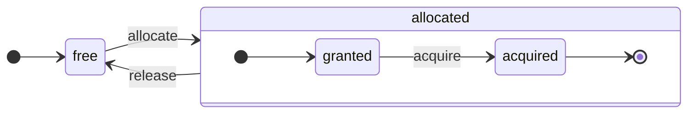

ClickHouse é um SGBD verdadeiramente orientado a colunas. Os dados são armazenados por colunas e, durante a execução, em arrays (vetores ou fragmentos de colunas).
Sempre que possível, as operações são executadas sobre arrays, em vez de valores individuais.
Isso é chamado de &quot;execução vetorizada de consultas&quot; e ajuda a reduzir o custo efetivo do processamento de dados.

Essa ideia não é nova.
Ela remonta ao `APL` (uma linguagem de programação, 1957) e a seus descendentes: `A +` (dialeto de APL), `J` (1990), `K` (1993) e `Q` (linguagem de programação da Kx Systems, 2003).
A programação com arrays é usada no processamento de dados científicos. Essa ideia também não é novidade em bancos de dados relacionais. Por exemplo, ela é usada no sistema `VectorWise` (também conhecido como Actian Vector Analytic Database, da Actian Corporation).

Há duas abordagens diferentes para acelerar o processamento de consultas: execução vetorizada de consultas e geração de código em tempo de execução. A segunda elimina toda a indireção e o despacho dinâmico. Nenhuma dessas abordagens é estritamente melhor que a outra. A geração de código em tempo de execução pode ser melhor quando combina muitas operações, aproveitando plenamente as unidades de execução da CPU e o pipeline. A execução vetorizada de consultas pode ser menos prática porque envolve vetores temporários que precisam ser gravados no cache e lidos de volta. Se os dados temporários não couberem no cache L2, isso se torna um problema. Mas a execução vetorizada de consultas aproveita com mais facilidade os recursos SIMD da CPU. Um [artigo de pesquisa](http://15721.courses.cs.cmu.edu/spring2016/papers/p5-sompolski.pdf) escrito por nossos colegas mostra que é melhor combinar as duas abordagens. O ClickHouse usa execução vetorizada de consultas e tem suporte inicial limitado para geração de código em tempo de execução.

  ## Colunas

A interface `IColumn` é usada para representar colunas na memória (na verdade, fragmentos de colunas). Essa interface fornece métodos auxiliares para implementar vários operadores relacionais. Quase todas as operações são imutáveis: não modificam a coluna original, mas criam uma nova coluna modificada. Por exemplo, o método `IColumn :: filter` aceita uma máscara de bytes para filtragem. Ele é usado pelos operadores relacionais `WHERE` e `HAVING`. Outros exemplos: o método `IColumn :: permute`, para dar suporte a `ORDER BY`, e o método `IColumn :: cut`, para dar suporte a `LIMIT`.

Várias implementações de `IColumn` (`ColumnUInt8`, `ColumnString` e assim por diante) são responsáveis pelo layout de memória das colunas. O layout de memória geralmente é um array contíguo. Para colunas do tipo inteiro, é apenas um array contíguo, como `std :: vector`. Para colunas `String` e `Array`, são dois vetores: um para todos os elementos do array, armazenados de forma contígua, e outro para os offsets até o início de cada array. Há também a `ColumnConst`, que armazena apenas um valor na memória, mas se comporta como uma coluna.

  ## Field

Ainda assim, também é possível trabalhar com valores individuais. Para representar um valor individual, usa-se `Field`. `Field` é simplesmente uma union discriminada de `UInt64`, `Int64`, `Float64`, `String` e `Array`. `IColumn` tem o método `operator []` para obter o n-ésimo valor como um `Field` e o método `insert` para acrescentar um `Field` ao final de uma coluna. Esses métodos não são muito eficientes, porque exigem lidar com objetos `Field` temporários que representam um valor individual. Há métodos mais eficientes, como `insertFrom`, `insertRangeFrom` e assim por diante.

`Field` não contém informações suficientes sobre um tipo de dado específico de uma tabela. Por exemplo, `UInt8`, `UInt16`, `UInt32` e `UInt64` são todos representados como `UInt64` em um `Field`.

  ## Abstrações com vazamento

`IColumn` tem métodos para transformações relacionais comuns de dados, mas eles não atendem a todas as necessidades. Por exemplo, `ColumnUInt64` não tem um método para calcular a soma de duas colunas, e `ColumnString` não tem um método para fazer uma busca por substring. Essas inúmeras rotinas são implementadas fora de `IColumn`.

Várias funções em colunas podem ser implementadas de forma genérica, porém ineficiente, usando métodos de `IColumn` para extrair valores de `Field`, ou de forma especializada, usando o conhecimento do layout interno de memória dos dados em uma implementação específica de `IColumn`. Isso é feito fazendo cast para um tipo específico de `IColumn` e lidando diretamente com a representação interna. Por exemplo, `ColumnUInt64` tem o método `getData`, que retorna uma referência a um array interno; depois, uma rotina separada lê ou preenche esse array diretamente. Temos &quot;abstrações com vazamento&quot; para permitir especializações eficientes de várias rotinas.

  ## Tipos de dados

`IDataType` é responsável pela serialização e desserialização: por ler e gravar fragmentos de colunas ou valores individuais em formato binário ou textual. `IDataType` corresponde diretamente aos tipos de dados nas tabelas. Por exemplo, existem `DataTypeUInt32`, `DataTypeDateTime`, `DataTypeString` e assim por diante.

`IDataType` e `IColumn` têm apenas uma relação frouxa entre si. Diferentes tipos de dados podem ser representados na memória pelas mesmas implementações de `IColumn`. Por exemplo, `DataTypeUInt32` e `DataTypeDateTime` são ambos representados por `ColumnUInt32` ou `ColumnConstUInt32`. Além disso, o mesmo tipo de dado pode ser representado por diferentes implementações de `IColumn`. Por exemplo, `DataTypeUInt8` pode ser representado por `ColumnUInt8` ou `ColumnConstUInt8`.

`IDataType` armazena apenas metadados. Por exemplo, `DataTypeUInt8` não armazena nada (exceto o ponteiro virtual `vptr`) e `DataTypeFixedString` armazena apenas `N` (o tamanho das strings de tamanho fixo).

`IDataType` tem métodos auxiliares para vários formatos de dados. Alguns exemplos são métodos para serializar um valor com possível uso de aspas, para serializar um valor em JSON e para serializar um valor como parte do formato XML. Não há correspondência direta com os formatos de dados. Por exemplo, os diferentes formatos de dados `Pretty` e `TabSeparated` podem usar o mesmo método auxiliar `serializeTextEscaped` da interface `IDataType`.

  ## Bloco

Um `Block` é um contêiner que representa um subconjunto (fragmento) de uma tabela na memória. É simplesmente um conjunto de triplas: `(IColumn, IDataType, column name)`. Durante a execução da consulta, os dados são processados em `Block`s. Se temos um `Block`, temos dados (no objeto `IColumn`), temos informações sobre seu tipo (em `IDataType`), que nos dizem como lidar com essa coluna, e temos o nome da coluna. Esse nome pode ser tanto o nome original da coluna da tabela quanto algum nome artificial atribuído para obter resultados temporários de cálculos.

Quando calculamos alguma função sobre colunas em um bloco, adicionamos outra coluna com o resultado ao bloco e não alteramos as colunas que são argumentos da função, porque as operações são imutáveis. Depois, colunas desnecessárias podem ser removidas do bloco, mas não modificadas. Isso é útil para a eliminação de subexpressões comuns.

Blocos são criados para cada fragmento de dados processado. Observe que, para o mesmo tipo de cálculo, os nomes e tipos das colunas permanecem os mesmos em blocos diferentes, e apenas os dados das colunas mudam. É melhor separar os dados do bloco do cabeçalho do bloco, porque blocos pequenos têm um custo adicional elevado com strings temporárias para copiar `shared_ptrs` e nomes de colunas.

  ## Processadores

Veja a descrição em [https://github.com/ClickHouse/ClickHouse/blob/master/src/Processors/IProcessor.h](https://github.com/ClickHouse/ClickHouse/blob/master/src/Processors/IProcessor.h).

  ## Formatos

Os formatos de dados são implementados por processadores.

  ## E/S

Para entrada/saída orientada a bytes, existem as classes abstratas `ReadBuffer` e `WriteBuffer`. Elas são usadas no lugar dos `iostream`s do C++. Não se preocupe: todo projeto C++ maduro usa algo diferente de `iostream`s por bons motivos.

`ReadBuffer` e `WriteBuffer` são apenas um buffer contíguo e um cursor apontando para uma posição nesse buffer. As implementações podem ou não ser donas da memória do buffer. Há um método virtual para preencher o buffer com os dados seguintes (no caso de `ReadBuffer`) ou para descarregar o buffer em algum destino (no caso de `WriteBuffer`). Os métodos virtuais raramente são chamados.

As implementações de `ReadBuffer`/`WriteBuffer` são usadas para trabalhar com arquivos, descritores de arquivo e sockets de rede, para implementar compressão (`CompressedWriteBuffer` é inicializado com outro WriteBuffer e realiza a compressão antes de gravar os dados nele) e para outros fins — os nomes `ConcatReadBuffer`, `LimitReadBuffer` e `HashingWriteBuffer` falam por si.

Read/WriteBuffers lidam apenas com bytes. Há funções nos arquivos de cabeçalho `ReadHelpers` e `WriteHelpers` para ajudar na formatação de entrada/saída. Por exemplo, há auxiliares para escrever um número em formato decimal.

Vamos examinar o que acontece quando você quer gravar um conjunto de resultados no formato `JSON` em stdout.
Você tem um conjunto de resultados pronto para ser obtido de um `QueryPipeline` de pull.
Primeiro, você cria um `WriteBufferFromFileDescriptor(STDOUT_FILENO)` para gravar bytes em stdout.
Em seguida, você conecta o resultado do pipeline da consulta a `JSONRowOutputFormat`, que é inicializado com esse `WriteBuffer`, para gravar linhas no formato `JSON` em stdout.
Isso pode ser feito por meio do método `complete`, que transforma um `QueryPipeline` de pull em um `QueryPipeline` completo.
Internamente, `JSONRowOutputFormat` gravará vários delimitadores JSON e chamará o método `IDataType::serializeTextJSON` com uma referência a `IColumn` e o número da linha como argumentos. Consequentemente, `IDataType::serializeTextJSON` chamará um método de `WriteHelpers.h`: por exemplo, `writeText` para tipos numéricos e `writeJSONString` para `DataTypeString`.

  ## Tabelas

A interface `IStorage` representa tabelas. Diferentes implementações dessa interface correspondem a diferentes motores de tabela. Alguns exemplos são `StorageMergeTree`, `StorageMemory` e assim por diante. As instâncias dessas classes são simplesmente tabelas.

Os principais métodos em `IStorage` são `read` e `write`, além de outros como `alter`, `rename` e `drop`. O método `read` aceita os seguintes argumentos: um conjunto de colunas para ler de uma tabela, a consulta `AST` a ser considerada e o número desejado de streams. Ele retorna um `Pipe`.

Na maioria dos casos, o método `read` é responsável apenas por ler as colunas especificadas de uma tabela, e não por qualquer processamento adicional dos dados.
Todo o processamento subsequente dos dados é tratado por outra parte do pipeline, que está fora da responsabilidade de `IStorage`.

Mas há exceções importantes:

* A consulta `AST` é passada ao método `read`, e o motor de tabela pode usá-la para determinar como usar índices e ler menos dados da tabela.
* Às vezes, o motor de tabela pode processar os próprios dados até um estágio específico. Por exemplo, `StorageDistributed` pode enviar uma consulta a servidores remotos, solicitar que eles processem os dados até um estágio em que os dados de diferentes servidores remotos possam ser mesclados e retornar esses dados pré-processados. O interpretador de consultas então conclui o processamento dos dados.

O método `read` da tabela pode retornar um `Pipe` composto por vários `Processors`. Esses `Processors` podem ler dados de uma tabela em paralelo.
Depois, você pode conectar esses processadores a várias outras transformações (como avaliação de expressões ou filtragem), que podem ser calculadas de forma independente.
Em seguida, crie um `QueryPipeline` sobre eles e execute-o por meio de `PipelineExecutor`.

Também existem `TableFunction`s. São funções que retornam um objeto temporário `IStorage` para uso na cláusula `FROM` de uma consulta.

Para ter uma ideia rápida de como implementar seu motor de tabela, veja algo simples, como `StorageMemory` ou `StorageTinyLog`.

> Como resultado do método `read`, `IStorage` retorna `QueryProcessingStage`: informações sobre quais partes da consulta já foram calculadas dentro do storage.

  ## Parsers

Um parser recursivo descendente implementado manualmente analisa uma consulta. Por exemplo, `ParserSelectQuery` apenas chama recursivamente os parsers correspondentes para várias partes da consulta. Os parsers criam uma `AST`. A `AST` é representada por nós, que são instâncias de `IAST`.

> Geradores de parser não são usados por motivos históricos.

  ## Interpretadores

Os interpretadores são responsáveis por criar o pipeline de execução da consulta a partir de uma AST. Há interpretadores simples, como `InterpreterExistsQuery` e `InterpreterDropQuery`, bem como o mais sofisticado `InterpreterSelectQuery`.

O pipeline de execução da consulta é uma combinação de processadores que podem consumir e produzir fragmentos (conjuntos de colunas com tipos específicos).
Um processador se comunica por meio de portas e pode ter várias portas de entrada e várias portas de saída.
Uma descrição mais detalhada pode ser encontrada em [src/Processors/IProcessor.h](https://github.com/ClickHouse/ClickHouse/blob/master/src/Processors/IProcessor.h).

Por exemplo, o resultado da interpretação da consulta `SELECT` é um `QueryPipeline` &quot;pulling&quot;, que tem uma porta de saída especial para ler o conjunto de resultados.
O resultado da consulta `INSERT` é um `QueryPipeline` &quot;pushing&quot;, com uma porta de entrada para gravar os dados a serem inseridos.
E o resultado da interpretação da consulta `INSERT SELECT` é um `QueryPipeline` &quot;completed&quot;, que não tem entradas nem saídas, mas copia dados de `SELECT` para `INSERT` simultaneamente.

O `InterpreterSelectQuery` usa o mecanismo `ExpressionAnalyzer` e `ExpressionActions` para análise e transformações da consulta. É aqui que a maioria das otimizações de consulta baseadas em regras é realizada. O `ExpressionAnalyzer` é bastante confuso e deveria ser reescrito: várias transformações e otimizações da consulta deveriam ser extraídas para classes separadas, para permitir transformações modulares da consulta.

Para resolver problemas existentes nos interpretadores, foi desenvolvido um novo `InterpreterSelectQueryAnalyzer`. Esta é uma nova versão do `InterpreterSelectQuery`, que não usa o `ExpressionAnalyzer` e introduz uma camada adicional de abstração entre `AST` e `QueryPipeline`, chamada `QueryTree`. Ele está totalmente pronto para uso em produção, mas, por precaução, pode ser desativado definindo o valor da configuração `enable_analyzer` como `false`.

  ## Funções

Há funções comuns e funções de agregação. Para funções de agregação, consulte a próxima seção.

As funções comuns não alteram o número de linhas — elas funcionam como se processassem cada linha de forma independente. Na verdade, as funções não são chamadas para linhas individuais, mas para `Block`s de dados, para implementar a execução vetorizada de consultas.

Há algumas funções diversas, como [blockSize](/pt-BR/reference/functions/regular-functions/other-functions#blockSize), [rowNumberInBlock](/pt-BR/reference/functions/regular-functions/other-functions#rowNumberInBlock) e [runningAccumulate](/pt-BR/reference/functions/regular-functions/other-functions#runningAccumulate), que exploram o processamento em bloco e violam a independência entre as linhas.

O ClickHouse tem tipagem forte, portanto não há conversão implícita de tipos. Se uma função não oferecer suporte a uma combinação específica de tipos, ela lança uma exceção. Mas as funções podem funcionar (ser sobrecarregadas) para muitas combinações diferentes de tipos. Por exemplo, a função `plus` (para implementar o operador `+`) funciona para qualquer combinação de tipos numéricos: `UInt8` + `Float32`, `UInt16` + `Int8` e assim por diante. Além disso, algumas funções variádicas podem aceitar qualquer número de argumentos, como a função `concat`.

Implementar uma função pode ser um pouco inconveniente, porque ela despacha explicitamente os tipos de dados compatíveis e as `IColumns` compatíveis. Por exemplo, a função `plus` tem código gerado pela instanciação de um template C++ para cada combinação de tipos numéricos, com argumentos à esquerda e à direita constantes ou não constantes.

Este é um excelente ponto para implementar geração de código em tempo de execução, a fim de evitar o inchaço do código de template. Além disso, isso permite adicionar funções combinadas, como fused multiply-add, ou fazer múltiplas comparações em uma única iteração do loop.

Devido à execução vetorizada de consultas, as funções não usam short-circuit. Por exemplo, se você escrever `WHERE f(x) AND g(y)`, ambos os lados serão calculados, mesmo nas linhas em que `f(x)` é zero (exceto quando `f(x)` é uma expressão constante igual a zero). Mas, se a seletividade da condição `f(x)` for alta e o cálculo de `f(x)` for muito mais barato do que o de `g(y)`, é melhor implementar um cálculo em múltiplas passagens. Primeiro, seria calculado `f(x)`; depois, as colunas seriam filtradas pelo resultado; em seguida, `g(y)` seria calculado apenas para fragmentos menores e filtrados de dados.

  ## Funções de agregação

Funções de agregação são funções com estado. Elas acumulam os valores recebidos em um estado e permitem obter resultados desse estado. São gerenciadas pela interface `IAggregateFunction`. Os estados podem ser bastante simples (o estado de `AggregateFunctionCount` é apenas um único valor `UInt64`) ou bastante complexos (o estado de `AggregateFunctionUniqCombined` é uma combinação de um array linear, uma tabela hash e uma estrutura de dados probabilística `HyperLogLog`).

Os estados são alocados em `Arena` (um pool de memória) para lidar com vários estados durante a execução de uma consulta `GROUP BY` de alta cardinalidade. Os estados podem ter construtor e destrutor não triviais: por exemplo, estados de agregação complexos podem alocar memória adicional por conta própria. Isso exige cuidado na criação e destruição desses estados, bem como na transferência correta de sua posse e na ordem de destruição.

Os estados de agregação podem ser serializados e desserializados para serem transmitidos pela rede durante a execução distribuída de consultas ou gravados em disco quando não houver RAM suficiente. Eles podem até ser armazenados em uma tabela com `DataTypeAggregateFunction` para permitir a agregação incremental de dados.

> No momento, o formato de dados serializados para estados de funções de agregação não é versionado. Isso é aceitável se os estados de agregação forem armazenados apenas temporariamente. Mas temos o mecanismo de tabela `AggregatingMergeTree` para agregação incremental, e ele já está sendo usado em produção. É por isso que a compatibilidade com versões anteriores é necessária ao alterar, no futuro, o formato serializado de qualquer função de agregação.

  ## Servidor

O servidor implementa várias interfaces diferentes:

* Uma interface HTTP para quaisquer clientes de terceiros.
* Uma interface TCP para o cliente nativo do ClickHouse e para a comunicação entre servidores durante a execução distribuída de consultas.
* Uma interface para transferir dados para replicação.

Internamente, ele é apenas um servidor multithread simples, sem corrotinas nem fibras. Como o servidor não foi projetado para processar uma alta taxa de consultas simples, mas sim uma taxa relativamente baixa de consultas complexas, cada uma delas pode processar um enorme volume de dados para análise.

O servidor inicializa a classe `Context` com o ambiente necessário para a execução de consultas: a lista de bancos de dados disponíveis, usuários e direitos de acesso, configurações, clusters, a lista de processos, o log de consultas e assim por diante. Os interpretadores usam esse ambiente.

Mantemos total retrocompatibilidade e compatibilidade futura para o protocolo TCP do servidor: clientes antigos podem se comunicar com servidores novos, e clientes novos podem se comunicar com servidores antigos. Mas não queremos manter isso para sempre, e removemos o suporte a versões antigas após cerca de um ano.

<Note>
  Para a maioria das aplicações externas, recomendamos usar a interface HTTP porque ela é simples e fácil de usar. O protocolo TCP está mais estreitamente ligado às estruturas internas de dados: ele usa um formato interno para transmitir blocos de dados e um encapsulamento personalizado para dados compactados.
</Note>

  ## Configuração

O servidor ClickHouse é baseado nas bibliotecas POCO C++ e usa `Poco::Util::AbstractConfiguration` para representar sua configuração. A configuração é mantida pela classe `Poco::Util::ServerApplication`, da qual a classe `DaemonBase` herda e que, por sua vez, é herdada pela classe `DB::Server`, que implementa o próprio clickhouse-server. Assim, a configuração pode ser acessada pelo método `ServerApplication::config()`.

A configuração é lida de vários arquivos (nos formatos XML ou YAML) e mesclada em uma única `AbstractConfiguration` pela classe `ConfigProcessor`. A configuração é carregada na inicialização do servidor e pode ser recarregada posteriormente se um dos arquivos de configuração for atualizado, removido ou adicionado. A classe `ConfigReloader` também é responsável pelo monitoramento periódico dessas alterações e pelo procedimento de recarga. A consulta `SYSTEM RELOAD CONFIG` também aciona o recarregamento da configuração.

Para consultas e subsistemas além de `Server`, a configuração pode ser acessada usando o método `Context::getConfigRef()`. Todo subsistema capaz de recarregar sua configuração sem reiniciar o servidor deve se registrar no callback de recarga no método `Server::main()`. Observe que, se a configuração mais recente contiver um erro, a maioria dos subsistemas ignorará a nova configuração, registrará mensagens de aviso no log e continuará funcionando com a configuração carregada anteriormente. Devido à natureza de `AbstractConfiguration`, não é possível passar uma referência para uma seção específica, portanto geralmente se usa `String config_prefix` no lugar disso.

  ### Context

O ClickHouse gerencia as configurações por meio de uma hierarquia de contextos:

* **Contexto global** - configurações de todo o servidor definidas por arquivos de configuração
* **Contexto de sessão** - configurações da sessão do usuário provenientes de perfis, da configuração do usuário e de comandos SET
* **Contexto da consulta** - configurações no nível da consulta definidas pela cláusula SETTINGS
* **Contexto em segundo plano** - configurações de todo o servidor para operações em segundo plano (Mutate, Merge) definidas pelo perfil &#39;background&#39;

Ao agendar uma operação (consultas, mutações etc.), o servidor constrói o contexto específico mesclando as configurações na seguinte ordem (as seções posteriores substituem as anteriores):

1. Valores padrão globais
2. Configuração global
3. Configurações de perfil (da seção `<profiles>`)
4. Configurações de usuário (da seção `<users>`)
5. Configurações de sessão (do comando SET)
6. Configurações de consulta (da cláusula SETTINGS)

<Note>
  As operações em segundo plano podem ser configuradas por meio de configurações globais e de configurações do perfil &#39;background&#39;; nesse caso, as configurações de sessão e de consulta não têm efeito. Se nenhuma configuração explícita for fornecida, ela herdará a configuração do contexto global. O nome de perfil padrão para essas operações é &#39;background&#39;, mas ele pode ser substituído pela configuração no nível do servidor `background_profile`.
</Note>

  ## Threads e jobs

Para executar consultas e realizar atividades auxiliares, o ClickHouse aloca threads de um dos pools de threads para evitar a criação e destruição frequentes de threads. Há alguns pools de threads, que são selecionados conforme a finalidade e a estrutura de um job:

* Pool do servidor para sessões de clientes de entrada.
* Pool global de threads para jobs de uso geral, atividades em segundo plano e threads independentes.
* Pool de threads de IO para jobs que, em sua maior parte, ficam bloqueados em alguma operação de IO e não exigem muito da CPU.
* Pools em segundo plano para tarefas periódicas.
* Pools para tarefas preemptáveis que podem ser divididas em passos.

O pool do servidor é uma instância da classe `Poco::ThreadPool` definida no método `Server::main()`. Ele pode ter no máximo `max_connection` threads. Cada thread é dedicada a uma única conexão ativa.

O pool global de threads é a classe singleton `GlobalThreadPool`. Para alocar uma thread a partir dele, usa-se `ThreadFromGlobalPool`. Ele tem uma interface semelhante à de `std::thread`, mas obtém uma thread do pool global e faz toda a inicialização necessária. Ele é configurado com as seguintes configurações:

* `max_thread_pool_size` - limite para o número de threads no pool.
* `max_thread_pool_free_size` - limite para o número de threads ociosas aguardando novos jobs.
* `thread_pool_queue_size` - limite para o número de jobs agendados.

O pool global é universal, e todos os pools descritos abaixo são implementados sobre ele. Isso pode ser visto como uma hierarquia de pools. Qualquer pool especializado obtém suas threads do pool global usando a classe `ThreadPool`. Portanto, o principal objetivo de qualquer pool especializado é aplicar um limite ao número de jobs simultâneos e fazer o agendamento de jobs. Se houver mais jobs agendados do que threads em um pool, `ThreadPool` acumula os jobs em uma fila com prioridades. Cada job tem uma prioridade inteira. A prioridade padrão é zero. Todos os jobs com valores de prioridade mais altos são iniciados antes de qualquer job com valor de prioridade mais baixo. Mas não há diferença entre jobs que já estão em execução, portanto a prioridade só importa quando o pool está sobrecarregado.

O pool de threads de IO é implementado como um `ThreadPool` simples acessível pelo método `IOThreadPool::get()`. Ele é configurado da mesma forma que o pool global com as configurações `max_io_thread_pool_size`, `max_io_thread_pool_free_size` e `io_thread_pool_queue_size`. O principal objetivo do pool de threads de IO é evitar o esgotamento do pool global por jobs de IO, o que poderia impedir que as consultas utilizem totalmente a CPU. O backup para S3 realiza uma quantidade significativa de operações de IO e, para evitar impacto nas consultas interativas, há um `BackupsIOThreadPool` separado configurado com as configurações `max_backups_io_thread_pool_size`, `max_backups_io_thread_pool_free_size` e `backups_io_thread_pool_queue_size`.

Para a execução de tarefas periódicas, existe a classe `BackgroundSchedulePool`. Você pode registrar tarefas usando objetos `BackgroundSchedulePool::TaskHolder`, e o pool garante que nenhuma tarefa execute dois jobs ao mesmo tempo. Ele também permite adiar a execução de uma tarefa para um instante específico no futuro ou desativar temporariamente a tarefa. O `Context` global fornece algumas instâncias dessa classe para diferentes finalidades. Para tarefas de uso geral, usa-se `Context::getSchedulePool()`.

Também há pools de threads especializados para tarefas preemptáveis. Uma tarefa `IExecutableTask` desse tipo pode ser dividida em uma sequência ordenada de jobs, chamados passos. Para agendar essas tarefas de forma a priorizar tarefas curtas em relação às longas, usa-se `MergeTreeBackgroundExecutor`. Como o nome sugere, ele é usado para operações em segundo plano relacionadas ao MergeTree, como merges, mutações, fetches e moves. As instâncias do pool estão disponíveis por meio de `Context::getCommonExecutor()` e outros métodos semelhantes.

Independentemente do pool usado para um job, no início é criada uma instância de `ThreadStatus` para esse job. Ela encapsula todas as informações por thread: id da thread, id da consulta, contadores de desempenho, consumo de recursos e muitos outros dados úteis. O job pode acessá-la por meio de um ponteiro local da thread com a chamada `CurrentThread::get()`, portanto não precisamos passá-la para cada função.

Se a thread estiver relacionada à execução de uma consulta, então o item mais importante associado a `ThreadStatus` é o contexto da consulta `ContextPtr`. Cada consulta tem sua thread mestre no pool do servidor. A thread mestre faz essa associação mantendo um objeto `ThreadStatus::QueryScope query_scope(query_context)`. A thread mestre também cria um grupo de threads representado pelo objeto `ThreadGroupStatus`. Cada thread adicional alocada durante a execução dessa consulta é associada ao seu grupo de threads por meio da chamada `CurrentThread::attachTo(thread_group)`. Os grupos de threads são usados para agregar contadores de eventos de perfil e rastrear o consumo de memória de todas as threads dedicadas a uma única tarefa (consulte as classes `MemoryTracker` e `ProfileEvents::Counters` para mais informações).

  ## Controle de concorrência

Uma consulta que pode ser paralelizada usa a configuração `max_threads` para limitar a si mesma. O valor padrão dessa configuração é definido de forma a permitir que uma única consulta utilize todos os núcleos da CPU da melhor maneira. Mas e se houver várias consultas concorrentes e cada uma delas usar o valor padrão da configuração `max_threads`? Nesse caso, as consultas compartilharão os recursos de CPU. O sistema operacional garantirá a equidade alternando constantemente entre threads, o que introduz alguma perda de desempenho. `ConcurrencyControl` ajuda a lidar com essa penalidade e a evitar a alocação de um grande número de threads. A configuração `concurrent_threads_soft_limit_num` é usada para limitar quantas threads concorrentes podem ser alocadas antes que algum tipo de pressão de CPU seja aplicado.

Introduz-se o conceito de `slot` de CPU. Um slot é uma unidade de concorrência: para executar uma thread, a consulta precisa adquirir um slot antecipadamente e liberá-lo quando a thread parar. O número de slots é limitado globalmente no servidor. Várias consultas concorrentes competem por slots de CPU se a demanda total exceder o número total de slots. `ConcurrencyControl` é responsável por resolver essa disputa fazendo o escalonamento de slots de CPU de forma justa.

Cada slot pode ser visto como uma máquina de estados independente com os seguintes estados:

* `free`: o slot está disponível para ser alocado por qualquer consulta.
* `granted`: o slot é `allocated` para uma consulta específica, mas ainda não foi adquirido por nenhuma thread.
* `acquired`: o slot é `allocated` para uma consulta específica e adquirido por uma thread.

Observe que um slot `allocated` pode estar em dois estados diferentes: `granted` e `acquired`. O primeiro é um estado transitório, que na prática deve ser curto (do instante em que um slot é alocado para uma consulta até o momento em que o procedimento de aumento de escala é executado por qualquer thread dessa consulta).

A API do `ConcurrencyControl` consiste nas seguintes funções:

1. Criar uma alocação de recursos para uma consulta: `auto slots = ConcurrencyControl::instance().allocate(1, max_threads);`. Isso alocará no mínimo 1 e no máximo `max_threads` slots. Observe que o primeiro slot é concedido imediatamente, mas os slots restantes podem ser concedidos depois. Assim, o limite é flexível, porque toda consulta obterá pelo menos uma thread.
2. Para cada thread, é preciso adquirir um slot de uma alocação: `while (auto slot = slots->tryAcquire()) spawnThread([slot = std::move(slot)] { ... });`.
3. Atualizar a quantidade total de slots: `ConcurrencyControl::setMaxConcurrency(concurrent_threads_soft_limit_num)`. Isso pode ser feito em runtime, sem reiniciar o servidor.

Essa API permite que as consultas sejam iniciadas com pelo menos uma thread (sob pressão de CPU) e depois escalem até `max_threads`.

  ## Execução distribuída de consultas

Os servidores em uma configuração de cluster são, em sua maioria, independentes. Você pode criar uma tabela `Distributed` em um ou em todos os servidores de um cluster. A tabela `Distributed` não armazena dados por conta própria — ela apenas fornece uma &quot;visão&quot; de todas as tabelas locais em vários nós de um cluster. Quando você executa um SELECT em uma tabela `Distributed`, ela reescreve essa consulta, escolhe nós remotos de acordo com as configurações de balanceamento de carga e envia a consulta para eles. A tabela `Distributed` solicita aos servidores remotos que processem uma consulta apenas até a etapa em que os resultados intermediários de diferentes servidores possam ser mesclados. Em seguida, ela recebe os resultados intermediários e os mescla. A tabela distribuída tenta distribuir o máximo de trabalho possível aos servidores remotos e não envia muitos dados intermediários pela rede.

As coisas ficam mais complicadas quando há subconsultas em cláusulas IN ou JOIN, e cada uma delas usa uma tabela `Distributed`. Temos estratégias diferentes para executar essas consultas.

Não existe um plano global de execução de consultas distribuídas. Cada nó tem seu plano de consulta local para a sua parte do trabalho. Temos apenas uma execução distribuída de consultas simples, em uma única passagem: enviamos consultas para nós remotos e depois mesclamos os resultados. Mas isso não é viável para consultas complexas com `GROUP BY` de alta cardinalidade ou com uma grande quantidade de dados temporários para JOIN. Nesses casos, precisamos &quot;redistribuir&quot; os dados entre os servidores, o que exige coordenação adicional. O ClickHouse não oferece suporte a esse tipo de execução de consultas, e precisamos trabalhar nisso.

  ## Merge tree

`MergeTree` é uma família de motores de armazenamento que oferece suporte à indexação por chave primária. A chave primária pode ser uma tupla arbitrária de colunas ou expressões. Os dados em uma tabela `MergeTree` são armazenados em &quot;partes&quot;. Cada parte armazena os dados na ordem da chave primária, de modo que os dados ficam ordenados lexicograficamente pela tupla da chave primária. Todas as colunas da tabela são armazenadas em arquivos `column.bin` separados nessas partes. Os arquivos consistem em blocos compactados. Cada bloco geralmente varia de 64 KB a 1 MB de dados descompactados, dependendo do tamanho médio dos valores. Os blocos consistem em valores de coluna armazenados de forma contígua, um após o outro. Os valores ficam na mesma ordem em cada coluna (a chave primária define a ordem), portanto, quando você percorre várias colunas, obtém os valores das linhas correspondentes.

A própria chave primária é &quot;esparsa&quot;. Ela não endereça cada linha individualmente, mas apenas alguns intervalos de dados. Um arquivo `primary.idx` separado contém o valor da chave primária para cada N-ésima linha, em que N é chamado de `index_granularity` (normalmente, N = 8192). Além disso, para cada coluna, temos arquivos `column.mrk` com &quot;marcas&quot;, que são offsets para cada N-ésima linha no arquivo de dados. Cada marca é um par: o offset no arquivo até o início do bloco compactado e o offset no bloco descompactado até o início dos dados. Normalmente, os blocos compactados são alinhados pelas marcas, e o offset no bloco descompactado é zero. Os dados de `primary.idx` sempre ficam na memória, e os dados dos arquivos `column.mrk` ficam em cache.

Quando vamos ler algo de uma parte no `MergeTree`, examinamos os dados de `primary.idx` e localizamos os intervalos que podem conter os dados solicitados; em seguida, examinamos os dados de `column.mrk` e calculamos os offsets de onde começar a ler esses intervalos. Por causa da esparsidade, dados em excesso podem ser lidos. O ClickHouse não é adequado para uma alta carga de consultas pontuais simples, porque todo o intervalo com `index_granularity` linhas precisa ser lido para cada chave, e todo o bloco compactado precisa ser descompactado para cada coluna. Tornamos o índice esparso porque precisamos conseguir manter trilhões de linhas em um único servidor sem consumo perceptível de memória para o índice. Além disso, como a chave primária é esparsa, ela não é única: não consegue verificar a existência da chave na tabela no momento do INSERT. Você pode ter muitas linhas com a mesma chave em uma tabela.

Quando você faz `INSERT` de um conjunto de dados no `MergeTree`, esse conjunto é ordenado pela chave primária e forma uma nova parte. Há threads em segundo plano que selecionam periodicamente algumas partes e as mesclam em uma única parte ordenada para manter o número de partes relativamente baixo. É por isso que ele se chama `MergeTree`. É claro que a mesclagem leva à &quot;amplificação de escrita&quot;. Todas as partes são imutáveis: elas apenas são criadas e excluídas, mas não modificadas. Quando SELECT é executado, ele mantém um snapshot da tabela (um conjunto de partes). Após a mesclagem, também mantemos as partes antigas por algum tempo para facilitar a recuperação após falhas, então, se percebermos que alguma parte mesclada provavelmente está corrompida, podemos substituí-la por suas partes de origem.

`MergeTree` não é uma árvore LSM porque não contém MEMTABLE nem LOG: os dados inseridos são gravados diretamente no filesystem. Esse comportamento torna o MergeTree muito mais adequado para inserir dados em batches. Portanto, inserir pequenas quantidades de linhas com frequência não é o ideal para o MergeTree. Por exemplo, algumas linhas por segundo é aceitável, mas fazer isso mil vezes por segundo não é o ideal para o MergeTree. No entanto, existe um modo de async insert para pequenas inserções a fim de contornar essa limitação. Fizemos dessa forma por uma questão de simplicidade e porque já inserimos dados em batches em nossas aplicações

Existem motores MergeTree que realizam trabalho adicional durante as mesclagens em segundo plano. Exemplos são `CollapsingMergeTree` e `AggregatingMergeTree`. Isso pode ser visto como um suporte especial para atualizações. Tenha em mente que essas não são atualizações reais, porque os usuários geralmente não têm controle sobre o momento em que as mesclagens em segundo plano são executadas, e os dados em uma tabela `MergeTree` quase sempre são armazenados em mais de uma parte, não de forma completamente mesclada.

  ## Replicação

A replicação no ClickHouse pode ser configurada por tabela. Você pode ter algumas tabelas replicadas e outras não replicadas no mesmo servidor. Também pode ter tabelas replicadas de maneiras diferentes, como uma tabela com replicação de fator 2 e outra com fator 3.

A replicação é implementada no mecanismo de armazenamento `ReplicatedMergeTree`. O caminho no `ZooKeeper` é especificado como um parâmetro do mecanismo de armazenamento. Todas as tabelas com o mesmo caminho no `ZooKeeper` tornam-se réplicas umas das outras: elas sincronizam seus dados e mantêm a consistência. As réplicas podem ser adicionadas e removidas dinamicamente simplesmente criando ou removendo uma tabela.

A replicação usa um esquema assíncrono multi-master. Você pode inserir dados em qualquer réplica que tenha uma sessão com o `ZooKeeper`, e os dados são replicados de forma assíncrona para todas as outras réplicas. Como o ClickHouse não oferece suporte a UPDATEs, a replicação é livre de conflitos. Como, por padrão, não há confirmação por quorum dos inserts, os dados recém-inseridos podem ser perdidos se um nó falhar. O quorum de insert pode ser habilitado usando a configuração `insert_quorum`.

Os metadados da replicação são armazenados no ZooKeeper. Há um log de replicação que lista quais ações devem ser executadas. As ações incluem: obter uma parte, mesclar partes, remover uma partição e assim por diante. Cada réplica copia o log de replicação para sua fila e, em seguida, executa as ações da fila. Por exemplo, durante uma inserção, a ação &quot;obter a parte&quot; é criada no log, e cada réplica faz o download dessa parte. As mesclagens são coordenadas entre as réplicas para obter resultados idênticos em bytes. Todas as partes são mescladas da mesma forma em todas as réplicas. Um dos líderes inicia primeiro uma nova mesclagem e grava ações de &quot;mesclar partes&quot; no log. Várias réplicas (ou até todas) podem ser líderes ao mesmo tempo. É possível impedir que uma réplica se torne líder usando a configuração `merge_tree` `replicated_can_become_leader`. Os líderes são responsáveis por agendar as mesclagens em segundo plano.

A replicação é física: apenas partes compactadas são transferidas entre os nós, não consultas. As mesclagens são processadas em cada réplica de forma independente na maioria dos casos para reduzir os custos de rede, evitando a amplificação de rede. Grandes partes mescladas são enviadas pela rede apenas em casos de atraso significativo na replicação.

Além disso, cada réplica armazena seu estado no ZooKeeper como o conjunto de partes e suas somas de verificação. Quando o estado no filesystem local diverge do estado de referência no ZooKeeper, a réplica restaura sua consistência baixando as partes ausentes e corrompidas de outras réplicas. Quando há dados inesperados ou corrompidos no filesystem local, o ClickHouse não os remove, mas os move para um diretório separado e os ignora.

<Note>
  O cluster do ClickHouse consiste em shards independentes, e cada shard consiste em réplicas. O cluster **não é elástico**, portanto, após adicionar um novo shard, os dados não são rebalanceados automaticamente entre os shards. Em vez disso, presume-se que a carga do cluster seja ajustada de forma desigual. Essa implementação oferece mais controle e é aceitável para clusters relativamente pequenos, como aqueles com dezenas de nós. Mas, para clusters com centenas de nós, como os que usamos em produção, essa abordagem se torna uma desvantagem significativa. Devemos implementar um mecanismo de tabela que se estenda por todo o cluster, com regiões replicadas dinamicamente que possam ser divididas e balanceadas automaticamente entre clusters.
</Note>