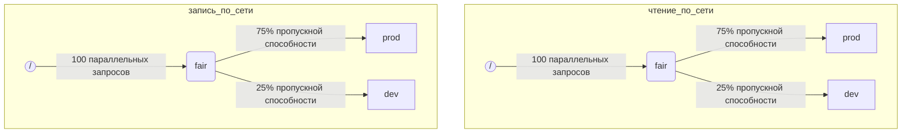

Когда ClickHouse выполняет несколько запросов одновременно, они могут использовать общие ресурсы (например, диски и ядра CPU). Чтобы регулировать использование и распределение ресурсов между разными рабочими нагрузками, можно применять ограничения и политики планирования. Для всех ресурсов можно настроить общую иерархию планирования. Корень иерархии представляет общие ресурсы, а листья — конкретные рабочие нагрузки, в которых накапливаются запросы, превышающие доступную емкость ресурсов.

<Note>
  В настоящее время этим способом можно планировать [ввод-вывод удаленных дисков](#disk_config) и [CPU](#cpu_scheduling). О гибких ограничениях памяти см. в разделе [Оверкоммит памяти](/ru/concepts/features/configuration/settings/memory-overcommit)
</Note>

<div id="disk_config">
  ## Настройка диска
</div>

Чтобы включить планирование ввода-вывода для конкретного диска, необходимо создать ресурсы на чтение и запись для доступа WRITE и READ:

```sql
CREATE RESOURCE resource_name (WRITE DISK disk_name, READ DISK disk_name)
-- или
CREATE RESOURCE read_resource_name (WRITE DISK write_disk_name)
CREATE RESOURCE write_resource_name (READ DISK read_disk_name)
```

Ресурс можно использовать для любого количества дисков — для READ, WRITE или одновременно для READ и WRITE. Есть синтаксис, позволяющий использовать ресурс для всех дисков:

```sql
CREATE RESOURCE all_io (READ ANY DISK, WRITE ANY DISK);
```

Альтернативный способ указать, какие диски использует ресурс, — это `storage_configuration` сервера:

<Warning>
  Планирование рабочих нагрузок с использованием конфигурации ClickHouse устарело. Вместо этого следует использовать синтаксис SQL.
</Warning>

Чтобы включить планирование ввода-вывода для конкретного диска, необходимо указать `read_resource` и/или `write_resource` в конфигурации хранилища. Так ClickHouse понимает, какой ресурс использовать для всех операций чтения и записи на данном диске. Ресурсы чтения и записи могут ссылаться на одно и то же имя ресурса, что полезно для локальных SSD или HDD. Несколько разных дисков также могут ссылаться на один и тот же ресурс, что полезно для удаленных дисков, если вы хотите обеспечить справедливое распределение пропускной способности сети, например между рабочими нагрузками &quot;production&quot; и &quot;development&quot;.

Пример:

```xml
<clickhouse>
    <storage_configuration>
        ...
        <disks>
            <s3>
                <type>s3</type>
                <endpoint>https://clickhouse-public-datasets.s3.amazonaws.com/my-bucket/root-path/</endpoint>
                <access_key_id>your_access_key_id</access_key_id>
                <secret_access_key>your_secret_access_key</secret_access_key>
                <read_resource>network_read</read_resource>
                <write_resource>network_write</write_resource>
            </s3>
        </disks>
        <policies>
            <s3_main>
                <volumes>
                    <main>
                        <disk>s3</disk>
                    </main>
                </volumes>
            </s3_main>
        </policies>
    </storage_configuration>
</clickhouse>
```

Обратите внимание, что параметры конфигурации сервера имеют приоритет над определением ресурсов через SQL.

<div id="workload_markup">
  ## Маркировка рабочих нагрузок
</div>

Запросы можно помечать с помощью настройки `workload`, чтобы различать разные рабочие нагрузки. Если `workload` не задана, используется значение &quot;default&quot;. Обратите внимание, что другое значение можно указать с помощью профилей настроек. Ограничения настроек можно использовать, чтобы сделать `workload` неизменяемой, если вы хотите, чтобы все запросы пользователя помечались фиксированным значением настройки `workload`.

Настройку `workload` можно также назначить для фоновых операций. Для слияний и мутаций используются настройки сервера `merge_workload` и `mutation_workload` соответственно. Эти значения также можно переопределить для конкретных таблиц с помощью настроек MergeTree `merge_workload` и `mutation_workload`

Рассмотрим пример системы с двумя разными рабочими нагрузками: &quot;production&quot; и &quot;development&quot;.

```sql
SELECT count() FROM my_table WHERE value = 42 SETTINGS workload = 'production'
SELECT count() FROM my_table WHERE value = 13 SETTINGS workload = 'development'
```

<div id="hierarchy">
  ## Иерархия планирования ресурсов
</div>

В подсистеме планирования ресурс представляет собой иерархию узлов планировщика.



<Warning>
  Планирование рабочих нагрузок с помощью конфигурации ClickHouse устарело. Вместо него следует использовать синтаксис SQL. Синтаксис SQL автоматически создает все необходимые узлы планировщика, а приведенное ниже описание узлов планировщика следует рассматривать как низкоуровневые подробности реализации, доступные через таблицу [system.scheduler](/ru/reference/system-tables/scheduler).
</Warning>

**Возможные типы узлов:**

* `inflight_limit` (ограничение) — блокирует, если либо число одновременно выполняющихся запросов превышает `max_requests`, либо их суммарная стоимость превышает `max_cost`; должен иметь единственный дочерний узел.
* `bandwidth_limit` (ограничение) — блокирует, если текущая пропускная способность превышает `max_speed` (0 означает отсутствие ограничений) или всплеск превышает `max_burst` (по умолчанию равно `max_speed`); должен иметь единственный дочерний узел.
* `fair` (политика) — выбирает следующий запрос для обслуживания из одного из дочерних узлов в соответствии с max-min fairness; дочерние узлы могут задавать `weight` (по умолчанию 1).
* `priority` (политика) — выбирает следующий запрос для обслуживания из одного из дочерних узлов в соответствии со статическими приоритетами (меньшее значение означает более высокий приоритет); дочерние узлы могут задавать `priority` (по умолчанию 0).
* `fifo` (очередь) — листовой узел иерархии, способный содержать запросы, превышающие доступную емкость ресурса.

Чтобы использовать всю доступную емкость базового ресурса, следует использовать `inflight_limit`. Обратите внимание, что небольшие значения `max_requests` или `max_cost` могут привести к неполному использованию ресурса, тогда как слишком большие значения могут привести к пустым очередям внутри планировщика, что, в свою очередь, приведет к игнорированию политик (нарушению справедливости или игнорированию приоритетов) в поддереве. С другой стороны, если вы хотите защитить ресурсы от слишком высокой нагрузки, следует использовать `bandwidth_limit`. Он ограничивает скорость, когда объем ресурса, потребленного за `duration` секунд, превышает `max_burst + max_speed * duration` байт. Два узла `bandwidth_limit` на одном и том же ресурсе можно использовать для ограничения пиковой пропускной способности на коротких интервалах и средней пропускной способности на более длинных.

Следующий пример показывает, как определить иерархии планирования ввода-вывода, показанные на рисунке:

```xml
<clickhouse>
    <resources>
        <network_read>
            <node path="/">
                <type>inflight_limit</type>
                <max_requests>100</max_requests>
            </node>
            <node path="/fair">
                <type>fair</type>
            </node>
            <node path="/fair/prod">
                <type>fifo</type>
                <weight>3</weight>
            </node>
            <node path="/fair/dev">
                <type>fifo</type>
            </node>
        </network_read>
        <network_write>
            <node path="/">
                <type>inflight_limit</type>
                <max_requests>100</max_requests>
            </node>
            <node path="/fair">
                <type>fair</type>
            </node>
            <node path="/fair/prod">
                <type>fifo</type>
                <weight>3</weight>
            </node>
            <node path="/fair/dev">
                <type>fifo</type>
            </node>
        </network_write>
    </resources>
</clickhouse>
```

<div id="workload_classifiers">
  ## Классификаторы рабочих нагрузок
</div>

<Warning>
  Планирование рабочих нагрузок с использованием конфигурации ClickHouse устарело. Вместо этого следует использовать синтаксис SQL. При использовании синтаксиса SQL классификаторы создаются автоматически.
</Warning>

Классификаторы рабочих нагрузок используются для сопоставления значения `workload`, указанного в запросе, с листовыми очередями, которые должны использоваться для определённых ресурсов. Сейчас классификация рабочих нагрузок проста: доступно только статическое сопоставление.

Пример:

```xml
<clickhouse>
    <workload_classifiers>
        <production>
            <network_read>/fair/prod</network_read>
            <network_write>/fair/prod</network_write>
        </production>
        <development>
            <network_read>/fair/dev</network_read>
            <network_write>/fair/dev</network_write>
        </development>
        <default>
            <network_read>/fair/dev</network_read>
            <network_write>/fair/dev</network_write>
        </default>
    </workload_classifiers>
</clickhouse>
```

<div id="workloads">
  ## Иерархия рабочих нагрузок
</div>

ClickHouse предоставляет удобный синтаксис SQL для задания иерархии планирования. Все ресурсы, созданные с помощью `CREATE RESOURCE`, имеют одинаковую иерархическую структуру, но в отдельных аспектах могут различаться. Для каждой рабочей нагрузки, созданной с помощью `CREATE WORKLOAD`, автоматически создаётся несколько узлов планировщика для каждого ресурса. Дочернюю рабочую нагрузку можно создать внутри другой, родительской рабочей нагрузки. Ниже приведён пример, который задаёт в точности ту же иерархию, что и XML-конфигурация выше:

```sql
CREATE RESOURCE network_write (WRITE DISK s3)
CREATE RESOURCE network_read (READ DISK s3)
CREATE WORKLOAD all SETTINGS max_io_requests = 100
CREATE WORKLOAD development IN all
CREATE WORKLOAD production IN all SETTINGS weight = 3
```

Имя листовой рабочей нагрузки без дочерних элементов можно использовать в настройках запроса: `SETTINGS workload = 'name'`.

Для настройки рабочей нагрузки можно использовать следующие настройки:

* `priority` - рабочие нагрузки одного уровня обслуживаются в соответствии со значениями статического приоритета (меньшее значение означает более высокий приоритет).
* `weight` - рабочие нагрузки одного уровня с одинаковым статическим приоритетом распределяют ресурсы в соответствии с весами.
* `max_io_requests` - ограничение на количество параллельных запросов ввода-вывода в этой рабочей нагрузке.
* `max_bytes_inflight` - ограничение на общий объём байтов, находящихся в обработке, для параллельных запросов в этой рабочей нагрузке.
* `max_bytes_per_second` - ограничение на скорость чтения или записи в байтах для этой рабочей нагрузки.
* `max_burst_bytes` - максимальное количество байтов, которое рабочая нагрузка может обработать без ограничения скорости (для каждого ресурса независимо).
* `max_concurrent_threads` - ограничение на количество потоков для запросов в этой рабочей нагрузке.
* `max_concurrent_threads_ratio_to_cores` - то же, что и `max_concurrent_threads`, но нормализованное по количеству доступных ядер CPU.
* `max_cpus` - ограничение на количество ядер CPU, используемых для обслуживания запросов в этой рабочей нагрузке.
* `max_cpu_share` - то же, что и `max_cpus`, но нормализованное по количеству доступных ядер CPU.
* `max_burst_cpu_seconds` - максимальное количество CPU-секунд, которое рабочая нагрузка может потребить без ограничения скорости из-за `max_cpus`.

Все ограничения, заданные через настройки рабочей нагрузки, независимы для каждого ресурса. Например, рабочая нагрузка с `max_bytes_per_second = 10485760` будет иметь ограничение пропускной способности 10 MB/s отдельно для каждого ресурса чтения и записи. Если требуется общее ограничение для чтения и записи, рассмотрите возможность использования одного и того же ресурса для доступа READ и WRITE.

Нельзя задать разные иерархии рабочих нагрузок для разных ресурсов. Однако можно задать разные значения настроек рабочей нагрузки для конкретного ресурса:

```sql
CREATE OR REPLACE WORKLOAD all SETTINGS max_io_requests = 100, max_bytes_per_second = 1000000 FOR network_read, max_bytes_per_second = 2000000 FOR network_write
```

Также обратите внимание, что рабочую нагрузку или ресурс нельзя удалить, если на них ссылается другая рабочая нагрузка. Чтобы обновить определение рабочей нагрузки, используйте запрос `CREATE OR REPLACE WORKLOAD`.

<Note>
  Настройки рабочей нагрузки преобразуются в соответствующий набор узлов планировщика. Подробности на более низком уровне см. в описании [типов и параметров узлов планировщика](#hierarchy).
</Note>

<div id="cpu_scheduling">
  ## Планирование CPU
</div>

Чтобы включить планирование CPU для рабочих нагрузок, создайте ресурс CPU и установите ограничение на количество одновременно выполняемых потоков:

```sql
CREATE RESOURCE cpu (MASTER THREAD, WORKER THREAD)
CREATE WORKLOAD all SETTINGS max_concurrent_threads = 100
```

Когда ClickHouse server выполняет много параллельных запросов с [несколькими потоками](/ru/reference/settings/session-settings#max_threads) и все слоты CPU заняты, система переходит в состояние перегрузки. В состоянии перегрузки каждый освобождённый слот CPU заново назначается соответствующей рабочей нагрузке в соответствии с политиками планирования. Для запросов, использующих одну и ту же рабочую нагрузку, слоты распределяются по алгоритму round robin. Для запросов из разных рабочих нагрузок слоты распределяются в соответствии с весами, приоритетами и лимитами, заданными для этих рабочих нагрузок.

Время CPU потребляется потоками, когда они не заблокированы и выполняют ресурсоёмкие задачи. Для целей планирования различают два типа потоков:

* Master thread — первый поток, который начинает выполнять запрос или фоновую операцию, такую как merge или mutation.
* Worker thread — дополнительные потоки, которые master может порождать для выполнения ресурсоёмких задач.

Может быть полезно использовать отдельные ресурсы для master- и worker-потоков, чтобы повысить отзывчивость. Большое количество worker-потоков может легко монополизировать ресурсы CPU при высоких значениях настройки запроса `max_threads`. В этом случае входящие запросы будут блокироваться и ждать слот CPU, чтобы их master-поток мог начать выполнение. Чтобы этого избежать, можно использовать следующую конфигурацию:

```sql
CREATE RESOURCE worker_cpu (WORKER THREAD)
CREATE RESOURCE master_cpu (MASTER THREAD)
CREATE WORKLOAD all SETTINGS max_concurrent_threads = 100 FOR worker_cpu, max_concurrent_threads = 1000 FOR master_cpu
```

Это создаст отдельные ограничения для master- и worker-потоков. Даже если все 100 worker-слотов CPU заняты, новые запросы не будут блокироваться, пока доступны master-слоты CPU. Они начнут выполняться в один поток. Позже, если worker-слоты CPU освободятся, такие запросы смогут масштабироваться и запускать свои worker-потоки. С другой стороны, такой подход не связывает общее число слотов с количеством CPU, и запуск слишком большого числа параллельных потоков скажется на производительности.

Ограничение параллелизма master-потоков не ограничивает число параллельных запросов. Слоты CPU могут освобождаться в середине выполнения запроса и затем выделяться другим потокам. Например, 4 параллельных запроса при ограничении в 2 параллельных master-потока могут все выполняться одновременно. В этом случае каждый запрос получит 50% процессорного времени CPU. Для ограничения числа параллельных запросов нужна отдельная логика, и в настоящее время для рабочих нагрузок она не поддерживается.

Для рабочих нагрузок можно использовать отдельные ограничения параллелизма потоков:

```sql
CREATE RESOURCE cpu (MASTER THREAD, WORKER THREAD)
CREATE WORKLOAD all
CREATE WORKLOAD admin IN all SETTINGS max_concurrent_threads = 10
CREATE WORKLOAD production IN all SETTINGS max_concurrent_threads = 100
CREATE WORKLOAD analytics IN production SETTINGS max_concurrent_threads = 60, weight = 9
CREATE WORKLOAD ingestion IN production
```

Этот пример конфигурации задаёт независимые пулы слотов CPU для административной и продакшен-нагрузки. Пул продакшена совместно используется аналитикой и ингестией. Кроме того, если пул продакшена перегружен, 9 из 10 освобождённых слотов при необходимости будут переназначаться аналитическим запросам. Запросы ингестии в периоды перегрузки будут получать только 1 из 10 слотов. Это может уменьшить задержку пользовательских запросов. У аналитики есть собственный лимит в 60 параллельных потоков, поэтому для поддержки ингестии всегда остаётся как минимум 40 потоков. Когда перегрузки нет, ингестия может использовать все 100 потоков.

Чтобы исключить запрос из планирования CPU, установите настройку запроса [use&#95;concurrency&#95;control](/ru/reference/settings/session-settings#use_concurrency_control) в 0.

Планирование CPU пока не поддерживается для слияний и мутаций.

Чтобы обеспечить справедливое распределение ресурсов между рабочими нагрузками, во время выполнения запроса необходимо выполнять вытеснение и динамическое уменьшение числа потоков. Вытеснение включается настройкой сервера `cpu_slot_preemption`. Если она включена, каждый поток периодически продлевает свой слот CPU (в соответствии с настройкой сервера `cpu_slot_quantum_ns`). Такое продление может блокировать выполнение, если CPU перегружен. Если выполнение блокируется на длительное время (см. настройку сервера `cpu_slot_preemption_timeout_ms`), запрос уменьшает масштаб, и число одновременно работающих потоков динамически снижается. Обратите внимание, что справедливое распределение времени CPU гарантируется между рабочими нагрузками, но между запросами внутри одной и той же рабочей нагрузки в некоторых редких случаях оно может нарушаться.

<Warning>
  Планирование слотов позволяет управлять [параллелизмом запросов](/ru/reference/settings/session-settings#max_threads), но не гарантирует справедливое распределение времени CPU, если настройка сервера `cpu_slot_preemption` не установлена в `true`; в противном случае справедливость обеспечивается на основе количества выделений слотов CPU между конкурирующими рабочими нагрузками. Это не означает равное количество секунд CPU, потому что без вытеснения слот CPU может удерживаться неограниченно долго. Поток получает слот в начале работы и освобождает его после её завершения.
</Warning>

<Note>
  При объявлении ресурса CPU настройки [`concurrent_threads_soft_limit_num`](/ru/reference/settings/server-settings/settings#concurrent_threads_soft_limit_num) и [`concurrent_threads_soft_limit_ratio_to_cores`](/ru/reference/settings/server-settings/settings#concurrent_threads_soft_limit_ratio_to_cores) перестают действовать. Вместо них для ограничения числа CPU, выделяемых для конкретной рабочей нагрузки, используется настройка рабочей нагрузки `max_concurrent_threads`. Чтобы добиться прежнего поведения, создайте только ресурс WORKER THREAD, задайте для рабочей нагрузки `all` настройку `max_concurrent_threads` равной `concurrent_threads_soft_limit_num` и используйте настройку запроса `workload = "all"`. Эта конфигурация соответствует значению &quot;fair&#95;round&#95;robin&quot; для настройки [`concurrent_threads_scheduler`](/ru/reference/settings/server-settings/settings#concurrent_threads_scheduler).
</Note>

<div id="threads_vs_cpus">
  ## Потоки и CPU
</div>

Есть два способа управлять потреблением CPU для рабочей нагрузки:

* Ограничение числа потоков: `max_concurrent_threads` и `max_concurrent_threads_ratio_to_cores`
* Троттлинг CPU: `max_cpus`, `max_cpu_share` и `max_burst_cpu_seconds`

Первый позволяет динамически управлять количеством потоков, создаваемых для запроса, в зависимости от текущей нагрузки на сервер. По сути, он снижает значение, задаваемое настройкой запроса `max_threads`. Второй ограничивает потребление CPU рабочей нагрузкой с помощью алгоритма token bucket. Он не влияет напрямую на число потоков, но ограничивает суммарное потребление CPU всеми потоками рабочей нагрузки.

Троттлинг token bucket с `max_cpus` и `max_burst_cpu_seconds` означает следующее. На любом интервале длиной `delta` секунд суммарное потребление CPU всеми запросами в рабочей нагрузке не должно превышать `max_cpus * delta + max_burst_cpu_seconds` секунд CPU. В долгосрочной перспективе это ограничивает среднее потребление значением `max_cpus`, однако кратковременно этот предел может быть превышен. Например, при `max_burst_cpu_seconds = 60` и `max_cpus=0.001` можно без троттлинга выполнять либо 1 поток в течение 60 секунд, либо 2 потока в течение 30 секунд, либо 60 потоков в течение 1 секунды. Значение по умолчанию для `max_burst_cpu_seconds` — 1 секунда. Меньшие значения могут приводить к недоиспользованию разрешенных ядер `max_cpus` при большом числе параллельных потоков.

<Warning>
  Настройки троттлинга CPU активны, только если включена настройка сервера `cpu_slot_preemption`; в противном случае они игнорируются.
</Warning>

Пока поток удерживает слот CPU, он может находиться в одном из трех основных состояний:

* **Running:** Фактически потребляет ресурсы CPU. Время, проведенное в этом состоянии, учитывается при троттлинге CPU.
* **Ready:** Ожидает, пока CPU станет доступен. Не учитывается при троттлинге CPU.
* **Blocked:** Выполняет операции ввода-вывода или другие блокирующие системные вызовы (например, ожидает mutex). Не учитывается при троттлинге CPU.

Рассмотрим пример конфигурации, которая сочетает троттлинг CPU и ограничения на число потоков:

```sql
CREATE RESOURCE cpu (MASTER THREAD, WORKER THREAD)
CREATE WORKLOAD all SETTINGS max_concurrent_threads_ratio_to_cores = 2
CREATE WORKLOAD admin IN all SETTINGS max_concurrent_threads = 2, priority = -1
CREATE WORKLOAD production IN all SETTINGS weight = 4
CREATE WORKLOAD analytics IN production SETTINGS max_cpu_share = 0.7, weight = 3
CREATE WORKLOAD ingestion IN production
CREATE WORKLOAD development IN all SETTINGS max_cpu_share = 0.3
```

Здесь мы ограничиваем общее число потоков для всех запросов до значения, в 2 раза превышающего число доступных CPU. Рабочая нагрузка Admin ограничена максимум двумя потоками, независимо от количества доступных CPU. У Admin приоритет -1 (ниже значения по умолчанию 0), и при необходимости она первой получает любой слот CPU. Когда Admin не выполняет запросы, ресурсы CPU распределяются между рабочими нагрузками production и development. Гарантированные доли процессорного времени задаются весами (4 к 1): не менее 80% получает production (если требуется), и не менее 20% — development (если требуется). Хотя веса задают гарантии, throttling CPU задаёт ограничения: production не ограничена и может потреблять 100%, тогда как для development установлен предел 30%, который действует даже при отсутствии запросов от других рабочих нагрузок. Рабочая нагрузка production не является листовой, поэтому её ресурсы распределяются между analytics и ingestion в соответствии с весами (3 к 1). Это означает, что для analytics гарантируется не менее 0.8 * 0.75 = 60%, а на основе `max_cpu_share` её предел составляет 70% от общих ресурсов CPU. В то же время для ingestion гарантируется не менее 0.8 * 0.25 = 20%, при этом верхнего предела у неё нет.

<Note>
  Если вы хотите максимально загрузить CPU на сервере ClickHouse, не используйте `max_cpus` и `max_cpu_share` для корневой рабочей нагрузки `all`. Вместо этого задайте более высокое значение `max_concurrent_threads`. Например, в системе с 8 CPU установите `max_concurrent_threads = 16`. Это позволит 8 потокам выполнять задачи CPU, а ещё 8 потокам — обрабатывать операции I/O. Дополнительные потоки создадут нагрузку на CPU, что обеспечит применение правил планирования. Напротив, значение `max_cpus = 8` никогда не создаст нагрузки на CPU, потому что сервер не сможет превысить 8 доступных CPU.
</Note>

<div id="query_scheduling">
  ## Планирование слотов для запросов
</div>

Чтобы включить планирование слотов для запросов для рабочих нагрузок, создайте ресурс QUERY и задайте ограничение на количество одновременных запросов или запросов в секунду:

```sql
CREATE RESOURCE query (QUERY)
CREATE WORKLOAD all SETTINGS max_concurrent_queries = 100, max_queries_per_second = 10, max_burst_queries = 20
```

Настройка рабочей нагрузки `max_concurrent_queries` ограничивает количество запросов, которые могут одновременно выполняться в рамках заданной рабочей нагрузки. Это аналог настройки запроса [`max_concurrent_queries_for_all_users`](/ru/reference/settings/session-settings#max_concurrent_queries_for_all_users) и настройки сервера [max&#95;concurrent&#95;queries](/ru/reference/settings/server-settings/settings#max_concurrent_queries). Запросы async insert и некоторые специальные запросы, такие как KILL, не учитываются в этом ограничении.

Настройки рабочей нагрузки `max_queries_per_second` и `max_burst_queries` ограничивают количество запросов для рабочей нагрузки с помощью throttler&#39;а token bucket. Это гарантирует, что за любой интервал времени `T` начнут выполняться не более `max_queries_per_second * T + max_burst_queries` новых запросов.

Настройка рабочей нагрузки `max_waiting_queries` ограничивает количество ожидающих запросов для рабочей нагрузки. Когда лимит достигнут, сервер возвращает ошибку `SERVER_OVERLOADED`.

<Note>
  Заблокированные запросы будут ждать неограниченно долго и не будут отображаться в `SHOW PROCESSLIST`, пока не будут выполнены все ограничения.
</Note>

<div id="workload_entity_storage">
  ## Хранение рабочих нагрузок и ресурсов
</div>

Определения всех рабочих нагрузок и ресурсов в форме запросов `CREATE WORKLOAD` и `CREATE RESOURCE` хранятся постоянно: либо на диске в `workload_path`, либо в ZooKeeper по пути `workload_zookeeper_path`. Для обеспечения согласованности между узлами рекомендуется использовать хранилище ZooKeeper. В качестве альтернативы при хранении на диске можно использовать предложение `ON CLUSTER`.

<div id="config_based_workloads">
  ## Рабочие нагрузки и ресурсы, задаваемые конфигурацией
</div>

Помимо определений на основе SQL, рабочие нагрузки и ресурсы можно заранее задать в файле конфигурации сервера. Это полезно в облачных средах, где часть ограничений диктуется инфраструктурой, а другие могут изменяться клиентами. Сущности, задаваемые конфигурацией, имеют приоритет над сущностями, определёнными через SQL, и не могут быть изменены или удалены с помощью SQL-команд.

<div id="config_based_workloads_format">
  ### Формат конфигурации
</div>

```xml
<clickhouse>
    <resources_and_workloads>
        CREATE RESOURCE s3disk_read (READ DISK s3);
        CREATE RESOURCE s3disk_write (WRITE DISK s3);
        CREATE WORKLOAD all SETTINGS max_io_requests = 500 FOR s3disk_read, max_io_requests = 1000 FOR s3disk_write, max_bytes_per_second = 1342177280 FOR s3disk_read, max_bytes_per_second = 3355443200 FOR s3disk_write;
        CREATE WORKLOAD production IN all SETTINGS weight = 3;
    </resources_and_workloads>
</clickhouse>
```

Конфигурация использует тот же синтаксис SQL, что и команды `CREATE WORKLOAD` и `CREATE RESOURCE`. Все запросы должны быть корректными.

<div id="config_based_workloads_usage_recommendations">
  ### Рекомендации по использованию
</div>

Для облачных сред типичная настройка может включать:

1. Определите корневую рабочую нагрузку и сетевые ресурсы ввода-вывода в конфигурации, чтобы задать ограничения инфраструктуры
2. Установите `throw_on_unknown_workload`, чтобы обеспечить соблюдение этих ограничений
3. Создайте `CREATE WORKLOAD default IN all`, чтобы автоматически применять ограничения ко всем запросам (поскольку значение по умолчанию для настройки запроса `workload` — &#39;default&#39;)
4. Разрешите пользователям создавать дополнительные рабочие нагрузки в пределах настроенной иерархии

Это гарантирует, что все фоновые процессы и запросы соблюдают ограничения инфраструктуры, сохраняя при этом гибкость для пользовательских политик планирования.

Другой вариант использования — разная конфигурация для разных узлов в неоднородном кластере.

<div id="strict_resource_access">
  ## Строгий доступ к ресурсам
</div>

Чтобы принудительно применять политики планирования ресурсов ко всем запросам, предусмотрена настройка сервера `throw_on_unknown_workload`. Если она установлена в `true`, для каждого запроса должна быть указана корректная настройка запроса `workload`, иначе генерируется исключение `RESOURCE_ACCESS_DENIED`. Если она установлена в `false`, такой запрос не использует планировщик ресурсов, то есть получает неограниченный доступ к любому `RESOURCE`. Настройка запроса `use_concurrency_control = 0` позволяет запросу обходить планировщик CPU и получать неограниченный доступ к CPU. Чтобы принудительно включить планирование CPU, создайте ограничение на настройку, чтобы зафиксировать `use_concurrency_control` как неизменяемое значение только для чтения.

<Note>
  Не устанавливайте `throw_on_unknown_workload` в `true`, пока не выполнен `CREATE WORKLOAD default`. Иначе это может привести к проблемам при запуске сервера, если во время старта будет выполнен запрос без явно заданной настройки `workload`.
</Note>

<div id="see-also">
  ## См. также
</div>

* [system.scheduler](/ru/reference/system-tables/scheduler)
* [system.workloads](/ru/reference/system-tables/workloads)
* [system.resources](/ru/reference/system-tables/resources)
* [merge&#95;workload](/ru/reference/settings/merge-tree-settings#merge_workload) настройка MergeTree
* [merge&#95;workload](/ru/reference/settings/server-settings/settings#merge_workload) глобальная настройка сервера
* [mutation&#95;workload](/ru/reference/settings/merge-tree-settings#mutation_workload) настройка MergeTree
* [mutation&#95;workload](/ru/reference/settings/server-settings/settings#mutation_workload) глобальная настройка сервера
* [workload&#95;path](/ru/reference/settings/server-settings/settings#workload_path) глобальная настройка сервера
* [workload&#95;zookeeper&#95;path](/ru/reference/settings/server-settings/settings#workload_zookeeper_path) глобальная настройка сервера
* [cpu&#95;slot&#95;preemption](/ru/reference/settings/server-settings/settings#cpu_slot_preemption) глобальная настройка сервера
* [cpu&#95;slot&#95;quantum&#95;ns](/ru/reference/settings/server-settings/settings#cpu_slot_quantum_ns) глобальная настройка сервера
* [cpu&#95;slot&#95;preemption&#95;timeout&#95;ms](/ru/reference/settings/server-settings/settings#cpu_slot_preemption_timeout_ms) глобальная настройка сервера