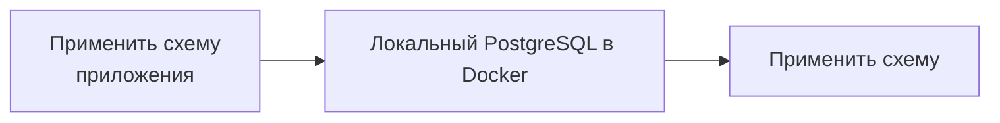

Managed Postgres построен на основе стандартного PostgreSQL и совместим с существующей экосистемой PostgreSQL. Для большинства задач разработки можно вести разработку и тестирование на локальном экземпляре PostgreSQL, запущенном в Docker, а не в облачном развертывании.

Такой подход ускоряет цикл обратной связи, упрощает онбординг, снижает зависимость от общей infrastructure и позволяет безопасно экспериментировать, не затрагивая продакшн-системы.

Цель не в том, чтобы в точности воспроизвести продакшн. Вместо этого создайте воспроизводимое локальное окружение, которое:

* Использует ту же мажорную версию PostgreSQL, что и в продакшне.
* Применяет те же определения схем, что и в продакшне.
* Содержит репрезентативные данные для разработки.
* Поддерживает стандартные рабочие процессы разработки и тестирования приложений.

Поскольку Managed Postgres — это стандартный PostgreSQL, существующие фреймворки миграции, инструменты управления схемой и подходы к начальному наполнению данными работают без изменений.

<div id="example-development-flow">
  ## Пример процесса локальной разработки
</div>

Типичный процесс локальной разработки выглядит так:




Managed Postgres органично вписывается в существующие процессы разработки с PostgreSQL. Разрабатывая и тестируя приложения на локальном экземпляре PostgreSQL, команды могут быстро вносить изменения, поддерживать воспроизводимость окружений и быть уверенными, что после развертывания в Managed Postgres приложения будут работать так же.

<div id="run-postgresql-locally-with-docker">
  ## Запустите PostgreSQL локально в Docker
</div>

Самый простой способ создать локальную среду для разработки — запустить PostgreSQL в Docker.

Выберите версию PostgreSQL, соответствующую вашей среде Managed Postgres:

```yaml title="docker-compose.yml"
services:
  postgres:
    image: postgres:18
    container_name: local-postgres
    restart: unless-stopped

    environment:
      POSTGRES_USER: postgres
      POSTGRES_PASSWORD: postgres
      POSTGRES_DB: app

    ports:
      - "15432:5432"

    volumes:
      - postgres_data:/var/lib/postgresql

volumes:
  postgres_data:
```

Запустите PostgreSQL:

```bash
docker compose up -d
```

Проверьте подключение:

```bash
psql -h localhost -U postgres -p 15432 -d app
```

На этом этапе PostgreSQL запущен локально, но в нём пока нет ни схемы приложения, ни каких-либо данных для разработки.

<div id="apply-the-application-schema">
  ## Примените схему приложения
</div>

Для создания схемы в локальной среде нет единого обязательного подхода. В большинстве организаций уже есть отлаженный процесс управления схемами, который можно использовать без изменений.

<div id="application-migrations">
  ### Миграции приложения
</div>

Многие команды используют один и тот же фреймворк миграций, который работает в staging- и продакшн-окружениях, — такие инструменты, как Flyway, Liquibase, Rails migrations, Django migrations, Prisma migrations или Alembic.

Применение миграций локально гарантирует, что изменения схемы постоянно проверяются в ходе обычной разработки:

```bash
./migrate up
# или
npm run migrate
# или
rails db:migrate
```

<div id="schema-only-postgresql-dumps">
  ### Дампы PostgreSQL только со схемой
</div>

Экспорт PostgreSQL только со схемой позволяет воссоздать структуру существующей базы данных. Это полезно для онбординга, анализа поведения схемы, проверки совместимости или быстрого начального развертывания сред разработки.

Экспортируйте схему:

```bash
pg_dump \
  --schema-only \
  --no-owner \
  --no-privileges \
  -h <host> \
  -U <user> \
  -d <database> \
  > schema.sql
```

Восстановить локально:

```bash
psql \
  -h localhost \
  -U postgres \
  -p 15432    \
  -d app \
  -f schema.sql
```

<div id="checked-in-sql-definitions">
  ### SQL-определения, хранящиеся в репозитории
</div>

Некоторые команды хранят определения схемы прямо в системе контроля версий в виде SQL-файлов. Их можно напрямую применить к локальному экземпляру PostgreSQL при настройке окружения.

Независимо от подхода, важно следующее: создание схемы должно быть автоматизированным, воспроизводимым и основанным на определениях, находящихся под контролем версий.

<div id="populate-representative-development-data">
  ## Заполните базу репрезентативными данными для разработки
</div>

Когда схема создана, заполните базу данных репрезентативными данными для разработки.

Для большинства сценариев разработки достаточно синтетических датасетов, сгенерированных с помощью seed-скриптов. Их легко воссоздавать, ими безопасно делиться, и они помогают избежать требований соответствия и вопросов безопасности, связанных с данными из продакшна.

Распространенный подход для SaaS-приложений — генерировать данные для небольшого числа тестовых тенантов и создавать реалистичные связи между пользователями, продуктами, заказами и другими бизнес-сущностями.

<div id="example-multi-tenant-schema">
  ### Пример схемы мультитенантного приложения
</div>

Ниже приведена схема упрощённого мультитенантного SaaS-приложения:

```sql
CREATE TABLE tenants (
    id UUID PRIMARY KEY,
    name TEXT NOT NULL
);

CREATE TABLE users (
    id UUID PRIMARY KEY,
    tenant_id UUID NOT NULL REFERENCES tenants(id),
    email TEXT NOT NULL,
    first_name TEXT,
    last_name TEXT,
    created_at TIMESTAMP DEFAULT now()
);

CREATE TABLE products (
    id UUID PRIMARY KEY,
    tenant_id UUID NOT NULL REFERENCES tenants(id),
    name TEXT NOT NULL,
    price NUMERIC(10,2)
);

CREATE TABLE orders (
    id UUID PRIMARY KEY,
    tenant_id UUID NOT NULL REFERENCES tenants(id),
    user_id UUID NOT NULL REFERENCES users(id),
    status TEXT,
    created_at TIMESTAMP DEFAULT now()
);

CREATE TABLE order_items (
    id UUID PRIMARY KEY,
    order_id UUID NOT NULL REFERENCES orders(id),
    product_id UUID NOT NULL REFERENCES products(id),
    quantity INTEGER
);

CREATE TABLE audit_logs (
    id UUID PRIMARY KEY,
    tenant_id UUID NOT NULL REFERENCES tenants(id),
    entity_type TEXT,
    entity_id UUID,
    action TEXT,
    created_at TIMESTAMP DEFAULT now()
);
```

<div id="generate-sample-data">
  ### Сгенерируйте тестовые данные
</div>

Установите зависимости:

```bash
pip install faker psycopg2-binary
```

Создайте файл `seed.py`:

```python title="seed.py"
import random
import uuid

import psycopg2
from faker import Faker

fake = Faker()

conn = psycopg2.connect(
    host="localhost",
    port=15432,
    dbname="app",
    user="postgres",
    password="postgres"
)

cur = conn.cursor()

tenant_ids = []

for tenant_name in [
    "Tenant A",
    "Tenant B",
    "Tenant C"
]:
    tenant_id = str(uuid.uuid4())
    tenant_ids.append(tenant_id)

    cur.execute(
        """
        INSERT INTO tenants(id, name)
        VALUES (%s, %s)
        """,
        (tenant_id, tenant_name)
    )

for tenant_id in tenant_ids:

    users = []
    products = []

    for _ in range(20):
        user_id = str(uuid.uuid4())
        users.append(user_id)

        cur.execute(
            """
            INSERT INTO users(
                id,
                tenant_id,
                email,
                first_name,
                last_name
            )
            VALUES (%s,%s,%s,%s,%s)
            """,
            (
                user_id,
                tenant_id,
                fake.email(),
                fake.first_name(),
                fake.last_name()
            )
        )

    for _ in range(15):
        product_id = str(uuid.uuid4())
        products.append(product_id)

        cur.execute(
            """
            INSERT INTO products(
                id,
                tenant_id,
                name,
                price
            )
            VALUES (%s,%s,%s,%s)
            """,
            (
                product_id,
                tenant_id,
                fake.word(),
                round(random.uniform(10, 500), 2)
            )
        )

    for _ in range(50):

        order_id = str(uuid.uuid4())

        cur.execute(
            """
            INSERT INTO orders(
                id,
                tenant_id,
                user_id,
                status
            )
            VALUES (%s,%s,%s,%s)
            """,
            (
                order_id,
                tenant_id,
                random.choice(users),
                random.choice([
                    "pending",
                    "completed",
                    "cancelled"
                ])
            )
        )

        for _ in range(random.randint(1, 5)):
            cur.execute(
                """
                INSERT INTO order_items(
                    id,
                    order_id,
                    product_id,
                    quantity
                )
                VALUES (%s,%s,%s,%s)
                """,
                (
                    str(uuid.uuid4()),
                    order_id,
                    random.choice(products),
                    random.randint(1, 10)
                )
            )

        cur.execute(
            """
            INSERT INTO audit_logs(
                id,
                tenant_id,
                entity_type,
                entity_id,
                action
            )
            VALUES (%s,%s,%s,%s,%s)
            """,
            (
                str(uuid.uuid4()),
                tenant_id,
                "order",
                order_id,
                "created"
            )
        )

conn.commit()
conn.close()
```

Запустите скрипт:

```bash
python seed.py
```

Полученный набор данных содержит:

| Таблица         | Записи |
| --------------- | ------ |
| tenants         | 3      |
| users           | 60     |
| products        | 45     |
| orders          | 150    |
| order&#95;items | 400+   |
| audit&#95;logs  | 150+   |

Этот набор данных достаточно большой, чтобы охватить типичные сценарии работы приложения, логику изоляции тенантов, отчётные запросы и проверки ссылочной целостности, и при этом остаётся достаточно лёгким для локальной разработки и тестирования.

<div id="postgresql-clickhouse-development-environment">
  ## Среда разработки PostgreSQL + ClickHouse
</div>

Приведённые выше примеры посвящены локальной разработке с PostgreSQL. Если вы хотите локально протестировать полную архитектуру PostgreSQL-to-ClickHouse, можно запустить стек PostgreSQL + ClickHouse с открытым исходным кодом.

Этот стек объединяет PostgreSQL для транзакционных нагрузок, ClickHouse для аналитики и PeerDB для нативной фиксации изменений данных (CDC). Он позволяет вести разработку с PostgreSQL и при этом непрерывно реплицировать данные в ClickHouse, чтобы тестировать операционную аналитику, сценарии отчётности и конвейеры данных в реальном времени прямо с ноутбука.

Стек запускается одной командой и включает все необходимые сервисы с предварительной настройкой:

```bash
git clone https://github.com/ClickHouse/postgres-clickhouse-stack.git
cd postgres-clickhouse-stack

./run.sh start
```

Стек включает:

* PostgreSQL
* ClickHouse
* PeerDB для CDC PostgreSQL
* Вспомогательные сервисы и примеры приложений

Инструкции по настройке, сведения об архитектуре и пошаговое руководство по всему стеку см. здесь:

* [Блог: PostgreSQL + ClickHouse OSS](https://clickhouse.com/blog/postgres-clickhouse-oss)
* [GitHub: postgres-clickhouse-stack](https://github.com/ClickHouse/postgres-clickhouse-stack)

Это полезный следующий шаг, когда ваше приложение уже локально работает с PostgreSQL и вы хотите проверить синхронизацию PostgreSQL с ClickHouse, Real-time аналитику и сквозную работу приложения.