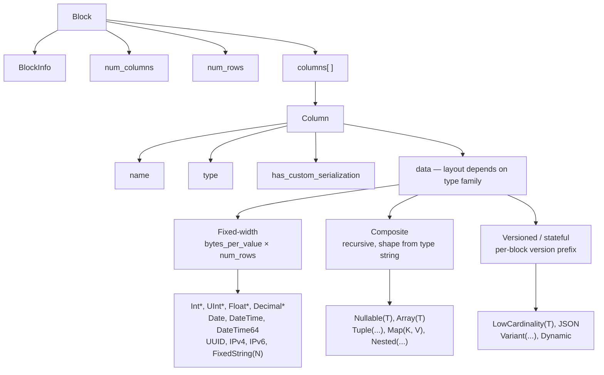
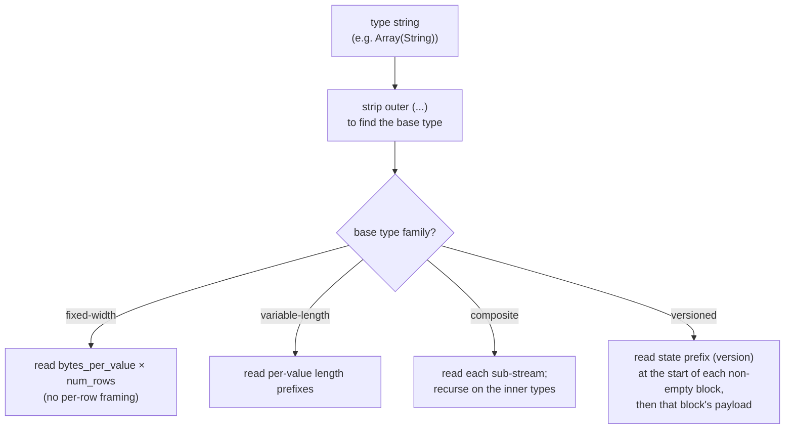
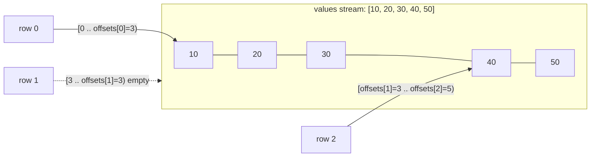
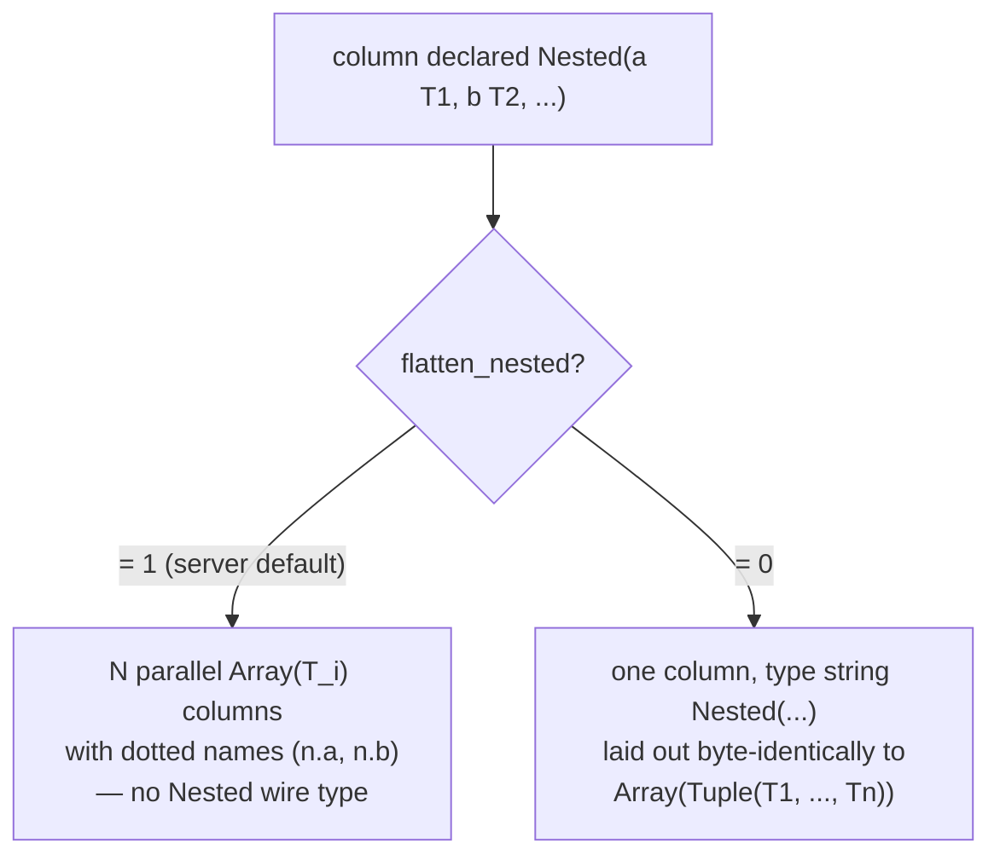
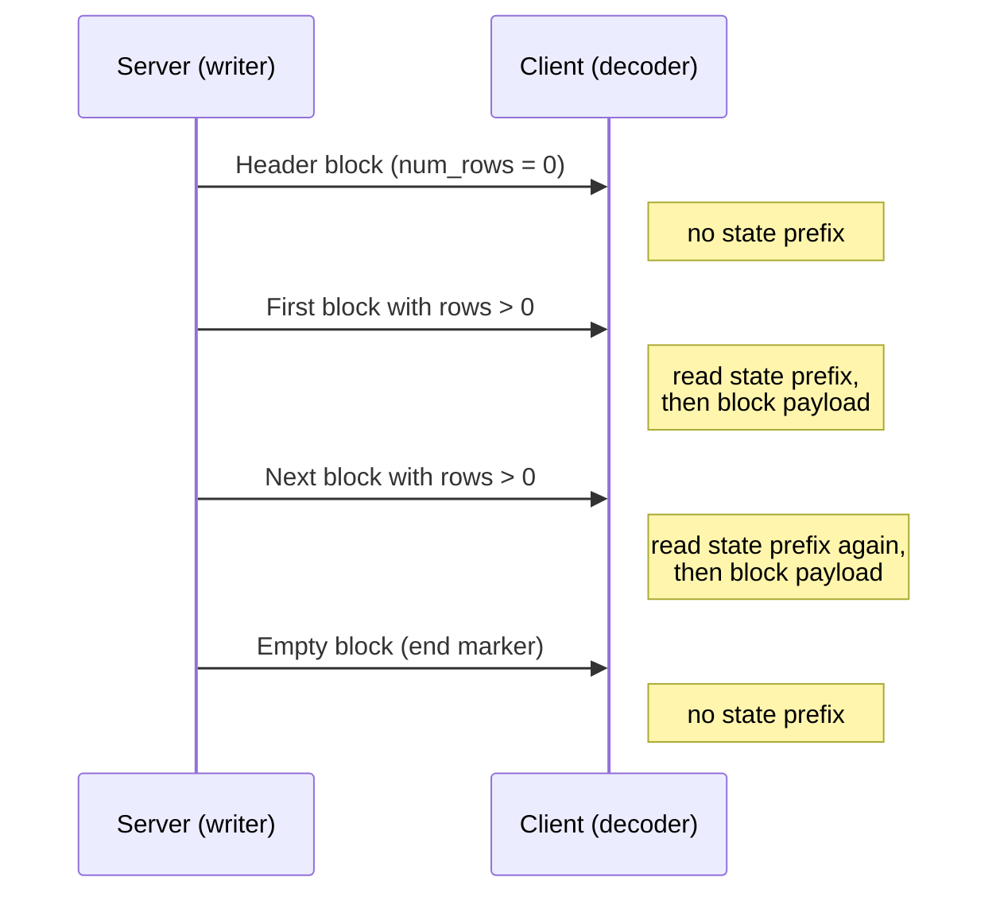
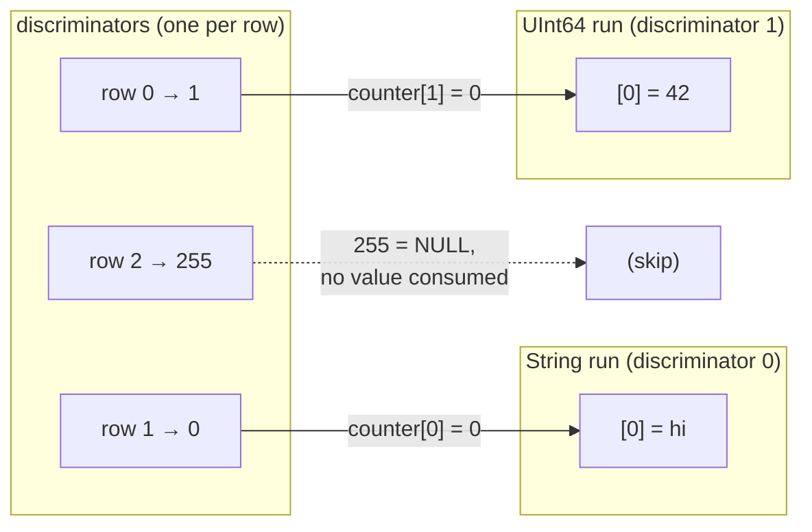
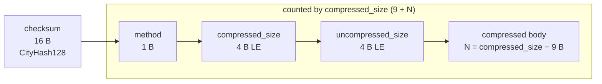

Формат Native — это столбцовый формат передачи данных, который ClickHouse использует для передачи табличных данных. Он встречается в нескольких местах:

* в теле пакетов `Data`, `Totals`, `Extremes`, `Log` и `ProfileEvents` в [собственном TCP-протоколе](/ru/reference/interfaces/specs/NativeProtocol) (пакет `TableColumns` **не** является блоком Native — он содержит две двоичные строки, поэтому его структура относится к [спецификации собственного протокола](/ru/reference/interfaces/specs/NativeProtocol));
* в выводе `SELECT ... FORMAT Native` по HTTP;
* в файлах, экспортируемых с помощью `INTO OUTFILE ... FORMAT Native`;
* в полезных нагрузках межсерверной репликации.

На этой странице описываются байты внутри Block — столбцовой полезной нагрузки — и кодирование типов отдельных столбцов, из которых он состоит. Формирование пакетов, состояние соединения и согласование версий относятся к [спецификации собственного протокола](/ru/reference/interfaces/specs/NativeProtocol).

Все целочисленные поля длиной более одного байта используют порядок little-endian. Знаковые целые числа используют дополнительный код.

<Tip>
  Чтобы ознакомиться с форматом `Native` с точки зрения пользователя (с примерами `curl`), см. страницу [Формат Native](/ru/reference/formats/Native). Эта спецификация представляет собой низкоуровневое справочное описание формата передачи данных.
</Tip>

<div id="overview">
  ## Обзор
</div>

Всё, что передаёт строки по сети, представляет собой **Block** — самоописывающийся фрагмент строк, хранящийся по столбцам. Сначала идут все значения столбца 1, затем все значения столбца 2 и так далее. Block содержит только те столбцы, к которым обращается запрос, а не всю таблицу.

`data` столбца организованы в соответствии с *семейством*, к которому относится его тип. Семейства в порядке возрастания сложности декодера:



* Типы **фиксированной ширины** представляют `data` как необработанные байты размером `bytes_per_value × num_rows`, без какого-либо построчного фреймирования.
* **Составные** типы (`Nullable`, `Array`, `Tuple`, `Map`, `Nested`) имеют рекурсивную структуру, полностью выводимую из строки типа, без префикса версии и без состояния, общего для разных блоков.
* **Версионируемые / с сохранением состояния** типы (`LowCardinality`, `JSON`, `Variant`, `Dynamic`) начинают каждый непустой block с префикса версии сериализации/состояния. В протоколе `Native` этот префикс и любой словарь являются **отдельными для каждого блока** — формат не хранит состояние *между* блоками (writer создает новое состояние сериализации для каждого блока и устанавливает `low_cardinality_max_dictionary_size = 0`). Состояние между блоками относится к хранению MergeTree на диске, а не к структуре протокола Native.

<div id="wire-primitives">
  ## Wire-примитивы
</div>

Формат Native основан на четырёх примитивных кодировках.

| Примитив                        | Размер               | Описание                                               |
| ------------------------------- | -------------------- | ------------------------------------------------------ |
| VarUInt                         | 1–10 B               | Беззнаковое целое переменной длины в кодировке LEB-128 |
| Целое фиксированной разрядности | 1, 2, 4, 8, 16, 32 B | little-endian, дополнительный код для знаковых чисел   |
| String                          | переменный           | префикс длины VarUInt + сырые байты                    |
| Bool                            | 1 B                  | `0x00` = ложь, ненулевое значение = истина             |

<div id="varuint">
  ### VarUInt
</div>

Беззнаковое целое переменной длины в кодировке LEB-128. Каждый байт содержит 7 бит данных в позициях 0–6 и 1 бит продолжения в позиции 7. Бит продолжения равен `1`, если за ним следуют дополнительные байты, и `0` в последнем байте.

| Диапазон значений | Байты |
| ----------------- | ----- |
| 0 – 127           | 1     |
| 128 – 16383       | 2     |
| 16384 – 2097151   | 3     |
| вплоть до UInt64  | до 10 |

Кодирование значения `300`:

```text
300 = 0b100101100

Byte 0: 0xAC = 0b10101100   (data: 0101100, continuation: 1)
Byte 1: 0x02 = 0b00000010   (data: 0000010, continuation: 0)
```

Декодирование байтов `0xAC 0x02`:

```text
Byte 0: data = 0x2C, continuation = 1 → accumulator = 0x2C, shift = 7
Byte 1: data = 0x02, continuation = 0 → accumulator = (0x02 << 7) | 0x2C = 300
```

<div id="fixed-width-integers">
  ### Целые числа фиксированной разрядности
</div>

| Тип     | Байты | Кодирование                                 |
| ------- | ----- | ------------------------------------------- |
| UInt8   | 1     | Сырой байт                                  |
| UInt16  | 2     | Little-endian                               |
| UInt32  | 4     | Little-endian                               |
| UInt64  | 8     | Little-endian                               |
| UInt128 | 16    | Little-endian                               |
| UInt256 | 32    | Little-endian                               |
| Int8    | 1     | Сырой байт, дополнительный код              |
| Int16   | 2     | Little-endian, дополнительный код           |
| Int32   | 4     | Little-endian, дополнительный код           |
| Int64   | 8     | Little-endian, дополнительный код           |
| Int128  | 16    | Little-endian, дополнительный код           |
| Int256  | 32    | Little-endian, дополнительный код           |
| Float32 | 4     | IEEE 754, одинарная точность, little-endian |
| Float64 | 8     | IEEE 754, двойная точность, little-endian   |

Например, значение UInt32 `1` кодируется как `01 00 00 00`, а значение Int32 `-1` — как `FF FF FF FF`.

<div id="string">
  ### String
</div>

Байтовая последовательность с префиксом длины:

```text
[VarUInt: byte_length] [byte_length bytes: raw value]
```

Последовательность байтов не обязательно должна быть корректной UTF-8. Пустая строка кодируется одним байтом `0x00`, а строки могут содержать любые значения байтов, включая встроенный NUL. Строка `"ab"` кодируется как `02 61 62`; чтобы декодировать её, сначала прочитайте длину VarUInt (`2`), затем — указанное число байтов.

<div id="bool">
  ### Bool
</div>

Один байт. `0x00` означает false; любое ненулевое значение — true (канонически `0x01`).

<div id="block-and-column-structure">
  ## Структура блока и столбцов
</div>

<div id="block-wire-layout">
  ### Структура блока в формате передачи данных
</div>

```text
[BlockInfo]               metadata (only on the TCP Data-packet path; see below)
[VarUInt: num_columns]    number of columns in this block
[VarUInt: num_rows]       number of rows in this block
[Column × num_columns]    column entries, omitted when num_columns = 0
```

Наличие префикса `BlockInfo` зависит от канала, поскольку модуль записи параметризуется значением *ревизии*:

* В **собственном TCP-протоколе** сервер записывает блоки с ревизией, согласованной для соединения (это большое значение — в этом release `DBMS_TCP_PROTOCOL_VERSION` равен `54485`). `BlockInfo` записывается всегда, когда это значение ревизии больше нуля, а для реального соединения это верно всегда. Байт `has_custom_serialization` в каждом столбце (см. [структуру столбца в формате передачи данных](#column-wire-layout)) записывается начиная с ревизии `54454`.
* `Native` *output format* — `SELECT ... FORMAT Native` по HTTP, `INTO OUTFILE ... FORMAT Native` и формат `Native`, создаваемый `clickhouse-client`, — *по умолчанию* сериализуется с ревизией `0`. При ревизии `0` и префикс `BlockInfo`, и байт `has_custom_serialization` отсутствуют, поэтому блок состоит только из `num_columns`, `num_rows` и столбцов.

  Для HTTP это значение ревизии не фиксировано: клиент может увеличить его с помощью параметра запроса `?client_protocol_version=<n>`, и сервер использует это значение как ревизию сериализации для ответа.

  При достаточно большом значении HTTP-вывод включает префикс `BlockInfo` (он записывается всегда, когда ревизия больше `0`) и байт `has_custom_serialization` (записывается начиная с ревизии `54454`) — точно так же, как и при передаче по TCP. Поэтому клиенты не должны предполагать, что любая полезная нагрузка HTTP `FORMAT Native` имеет ревизию `0`.

Иными словами, примеры байтов в этом разделе, начинающиеся с префикса `BlockInfo`, описывают полезную нагрузку TCP-пакета Data. Тот же запрос, выполненный через `FORMAT Native`, даёт более короткую форму, показанную рядом.

<div id="blockinfo">
  ### BlockInfo
</div>

BlockInfo — это последовательность полей, каждому из которых предшествует VarUInt с ID поля, а заканчивается она ID поля `0`. Формат передачи данных **не** является самоописывающимся: ID поля не содержит информации о длине или типе его значения, поэтому считыватель должен заранее знать тип каждого ID поля, который может встретиться. Собственный считыватель ClickHouse считает нераспознанный ID поля повреждением данных и выдаёт Исключение (`UNKNOWN_BLOCK_INFO_FIELD`). Прямая совместимость обеспечивается не этим, а ревизией протокола: отправитель записывает поле, только если согласованная ревизия не ниже минимальной ревизии этого поля, поэтому более старый приёмник никогда не увидит незнакомое ему поле.

| ID поля | Поле                             | Тип           | Мин. ревизия | Описание                                                                                                                                        |
| ------- | -------------------------------- | ------------- | ------------ | ----------------------------------------------------------------------------------------------------------------------------------------------- |
| 1       | is&#95;overflows                 | UInt8         | 0            | Блок переполнения из GROUP BY. `0` — для блоков без переполнения.                                                                               |
| 2       | bucket&#95;number                | Int32         | 0            | Бакет агрегации. `-1` — для блоков без разбиения по бакетам.                                                                                    |
| 3       | out&#95;of&#95;order&#95;buckets | List of Int32 | 54480        | Бакеты, задержанные при распределённой агрегации. Кодируется как число VarUInt, за которым следует соответствующее количество значений `Int32`. |
| 0       | (терминатор)                     | —             | —            | Конец BlockInfo. Всегда обязателен.                                                                                                             |

Поля `1` и `2` имеют минимальную ревизию `0`, поэтому присутствуют всегда, если `BlockInfo` вообще записывается. Поле `3` записывается только начиная с ревизии `54480`. Структура формата передачи данных для типичного случая (ревизия ниже `54480`):

```text
[VarUInt: 1] [UInt8: is_overflows]
[VarUInt: 2] [Int32: bucket_number]
[VarUInt: 0]
```

<div id="column-wire-layout">
  ### Структура столбца в формате передачи данных
</div>

Столбец встречается `num_columns` раз внутри Block.

| # | Поле                             | Тип                                    | Условие                                     | Описание                                                                                                                                                                                                                                                                                                                                       |
| - | -------------------------------- | -------------------------------------- | ------------------------------------------- | ---------------------------------------------------------------------------------------------------------------------------------------------------------------------------------------------------------------------------------------------------------------------------------------------------------------------------------------------- |
| 1 | name                             | String                                 | всегда                                      | Имя столбца                                                                                                                                                                                                                                                                                                                                    |
| 2 | type                             | String *или* двоичное кодирование типа | всегда                                      | По умолчанию — строка типа ClickHouse (например, `"UInt64"`, `"Array(String)"`); при `output_format_native_encode_types_in_binary_format = 1` — двоичное кодирование типа (см. примечание ниже)                                                                                                                                                |
| 3 | has&#95;custom&#95;serialization | UInt8                                  | возможность `CUSTOM_SERIALIZATION` (v54454) | `0` = по умолчанию, `1` = пользовательская (далее идёт kind&#95;stack)                                                                                                                                                                                                                                                                         |
| 4 | kind&#95;stack                   | байты                                  | когда поле 3 = `1`                          | Один байт enum `UInt8` (см. ниже), описывающий нестандартную сериализацию (sparse и т. п.). Для значения `COMBINATION` далее следуют счётчик VarUInt и указанное в нём количество дополнительных байтов kind. Для `Tuple` (и других составных типов с информацией о сериализации на уровне элементов) полезная нагрузка рекурсивна — см. ниже. |
| 5 | data                             | байты                                  | всегда                                      | Значения столбца для всех `num_rows` строк. Структура зависит от типа — см. [типы данных](#data-types). Для sparse-столбцов см. ниже.                                                                                                                                                                                                          |

Декодер выбирает способ обработки по строке `type`. Строки типов часто содержат параметры в скобках; декодер убирает суффикс `(...)`, чтобы определить базовый тип, а затем разбирает параметры, чтобы определить размер, scale или внутренний тип. Разбор списка параметров со вложенными типами (например, `Tuple` внутри `Array`) требует разделения по запятым с учётом глубины вложенности скобок, а не простого разбиения по `,`.

<Info>
  **Двоичное кодирование типа**

  Поле `type` является текстовым `String` только в режиме по умолчанию. Если установлена настройка запроса `output_format_native_encode_types_in_binary_format = 1`, это поле вместо текста содержит **двоичное кодирование типа** — то же кодирование на основе тегов, которое описано в [двоичном кодировании типов данных](/ru/reference/data-types/data-types-binary-encoding), — а списки сглаженных типов `Dynamic` также используют это двоичное кодирование для имён отдельных типов. Декодер, который всегда читает поле 2 как строку с префиксом длины, примет первый двоичный тег типа за длину строки и потеряет синхронизацию, поэтому он должен знать, в каком режиме передаётся поток.
</Info>



<div id="kind-stack-and-sparse-encoding">
  #### kind_stack и разреженное кодирование
</div>

Байт `kind_stack` перечисляет нестандартную сериализацию для каждого столбца:

| Byte   | Name                         | Meaning                                                                       | Влияние на `data` при передаче                                                         |
| ------ | ---------------------------- | ----------------------------------------------------------------------------- | -------------------------------------------------------------------------------------- |
| `0x00` | DEFAULT                      | Сериализация по умолчанию                                                     | Идентично `has_custom = 0`                                                             |
| `0x01` | SPARSE                       | Разреженная сериализация (v54465+)                                            | Поток смещений + значения, отличные от значений по умолчанию; см. ниже                 |
| `0x02` | DETACHED                     | Столбец, обёрнутый в `ColumnBLOB` при параллельном маршалинге блока (v54478+) | Предварительно маршализованный blob: `VarUInt size` + указанное число байтов; см. ниже |
| `0x03` | DETACHED&#95;OVER&#95;SPARSE | Разреженный столбец, обёрнутый в `ColumnBLOB`                                 | Та же blob-полезная нагрузка, что и у `DETACHED`; см. ниже                             |
| `0x04` | REPLICATED                   | Форма словаря для повторяющихся значений (v54482+)                            | Поток индексов + плотные значения элементов; см. ниже                                  |
| `0x05` | COMBINATION                  | Многокомпонентный стек kind                                                   | Далее следуют VarUInt `count` и ещё `count` байтов kind — см. примечание ниже          |

**Для полезной нагрузки `COMBINATION` используется другое перечисление.** Пять строк выше — это *компактные* однобайтовые коды. `COMBINATION` (`0x05`) — это общий escape-код для любого стека, не покрытого ими: после него идут `VarUInt` `count`, а затем `count` однобайтовых записей. Эти записи — **не** компактные коды из таблицы, а исходные значения `ISerialization::Kind`:

| Byte   | Вложенный `Kind` |
| ------ | ---------------- |
| `0x00` | DEFAULT          |
| `0x01` | SPARSE           |
| `0x02` | DETACHED         |
| `0x03` | REPLICATED       |

Значения байтов отличаются от компактных кодов: `REPLICATED` в этом вложенном перечислении имеет значение `0x03`, а в виде компактного кода — `0x04`, и записи `DETACHED_OVER_SPARSE` нет — эта комбинация представляется двумя последовательными записями `SPARSE`, `DETACHED`. Декодер, который продолжит использовать таблицу компактных кодов для вложенных байтов, неверно сопоставит `0x03`/`0x04` и потеряет синхронизацию.

`count` — это полная длина стека **включая начальную запись `DEFAULT`**, с которой начинается каждый стек. Компактные коды уже покрывают все стеки из одной и двух записей, поэтому у `COMBINATION` значение `count` всегда не меньше трёх.

**Рекурсивный `kind_stack` для столбцов `Tuple`.** Полезная нагрузка `kind_stack`, описанная выше, — это байт (или последовательность `COMBINATION`) с информацией о сериализации самого столбца. `Tuple` содержит `SerializationInfoTuple`, который сначала записывает полезную нагрузку kind-stack *самого* tuple, а затем — по одной полной полезной нагрузке kind-stack для *каждого* элемента по порядку; декодер считывает ту же рекурсивную структуру в обратном порядке. Поэтому для `Tuple(A, B, C)` байты поля 4 имеют вид `[tuple_kind][A_kind][B_kind][C_kind]`, и полезная нагрузка каждого элемента сама по себе рекурсивна, если этот элемент тоже составной. Байт `has_custom_serialization` (поле 3) устанавливается всегда, когда информация самого tuple *или любого элемента* отличается от значения по умолчанию, поэтому `Tuple`, у которого единственный специальный элемент является sparse, replicated или detached, всё равно приводит к передаче полезной нагрузки kind-stack. Декодер, который для `Tuple` считывает только один начальный байт перечисления, остановится слишком рано и ошибочно воспримет оставшиеся байты kind элементов как данные столбца.

**Разреженный формат передачи данных.** Когда `kind_stack = 0x01`, `data` столбца представляют собой два потока, записанных подряд в одном общем TCP-потоке:

1. **Поток смещений** — последовательность `VarUInt`. Каждое значение `v` — это либо:
   * `v`, у которого старший бит в позиции 62 не установлен: `(v & 0x3FFFFFFFFFFFFFFF)` = число позиций со значением по умолчанию перед следующим явно заданным значением, отличным от значения по умолчанию. Позиция этого значения — `cursor + group_size`, где `cursor` — текущая позиция; после этого `cursor` увеличивается на `group_size + 1`.
   * `v` с установленным битом 62 (`END_OF_GRANULE_FLAG`): значение со снятым флагом = число завершающих позиций со значением по умолчанию после последнего нестандартного значения. Это отмечает конец потока смещений для блока.
2. **Поток значений** — `count` значений, отличных от значений по умолчанию, плотно закодированных во внутреннем типе, где `count` — число считанных выше VarUInt без EOG.

Декодер восстанавливает плотный столбец из `num_rows` записей, заполняя каждую позицию, не указанную явно, значением по умолчанию внутреннего типа (`0` для целых чисел и чисел с плавающей точкой, `""` для `String`, `0` дней для `Date` и так далее).

Разреженный столбец `Nullable(T)` — особый случай, поскольку значением по умолчанию для `Nullable(T)` является **NULL**. Разреженное кодирование полностью убирает обычный поток null-map для `Nullable`: поток смещений указывает позиции со значениями, отличными от значения по умолчанию, то есть не-NULL; поток значений плотно хранит только эти не-NULL значения в `T`, а каждая позиция, не указанная явно, восстанавливается как NULL. Поэтому декодер *не должен* искать null map в потоке значений и *не должен* заполнять пропуски присутствующим `0`; вместо этого он заполняет их значением NULL.

**Формат передачи данных Replicated.** Когда `kind_stack = 0x04`, столбец `data` представляет собой словарь: список различных значений элементов и индекс для каждой строки в этом списке (та же схема, что и у `LowCardinality`). Если внутренний тип сам является версионируемым — например, `LowCardinality(T)` — его префикс состояния записывается **сначала**, перед потоком индексов: сериализация Replicated делегирует этап записи префикса внутреннему типу перед записью `num_rows`. Внутренние типы с пустым префиксом (листовые типы и обычные составные типы) не добавляют здесь никаких байтов.

```text
[inner type's state prefix]              empty for leaf inners; e.g. LowCardinality version (Int64 = 1)
[VarUInt num_rows]
[UInt8  size_of_indexes_type]            width of each index: 1, 2, 4, or 8 bytes
[indexes: num_rows × size_of_indexes_type bytes]
[VarUInt num_elements]
[elements: num_elements dense inner-type values]
```

Декодер восстанавливает плотный столбец, выбирая `elements[indexes[i]]` для каждой выходной строки `i`. Для составных внутренних типов это делается рекурсивно: список элементов материализуется во внутреннем типе, а затем индексируется. Поддерживаются следующие внутренние типы: листовые типы, `Nullable(T)`, `Array(T)`, `Tuple(...)`, `Map(K, V)`, `Nested(...)` (каждое поле разворачивается как `Array`) и `LowCardinality(T)` (общий словарь сохраняется; индексируются только ключи отдельных элементов).

**Отсоединённый формат передачи данных.** `DETACHED` (`0x02`) и `DETACHED_OVER_SPARSE` (`0x03`) *действительно* передаются в формате передачи данных — это не только внутренние представления. В TCP-пути, когда включено сжатие и согласованная ревизия не ниже `DBMS_MIN_REVISON_WITH_PARALLEL_BLOCK_MARSHALLING` (v54478), столбец проходит три этапа:

1. Каждый подходящий столбец (не `const`, не `Tuple`, в блоке более чем с одной строкой) оборачивается в `ColumnBLOB`, который содержит столбец, уже маршалированный и сжатый вне основного потока.
2. `DETACHED` добавляется в стек kind обёрнутого столбца.
3. `data` столбца записываются как размер blob в формате `VarUInt`, за которым следуют ровно столько байтов blob.

Если обёрнутый столбец был разреженным, его стек имеет вид `{DEFAULT, SPARSE, DETACHED}`, что сериализуется как `DETACHED_OVER_SPARSE`. Клиент, декодирующий такой столбец, считывает длину blob и сами байты, затем распаковывает blob, чтобы восстановить полезную нагрузку внутреннего столбца (см. [примечание о `ColumnBLOB`](#compression-negotiation) в разделе о сжатии).

<div id="block-variants">
  ### Варианты блока
</div>

Во всех пакетах семейства Data используется один и тот же формат передачи данных Block. Варианты различаются только количеством столбцов и строк:

| Вариант         | num&#95;columns | num&#95;rows | Назначение                                                                                     |
| --------------- | --------------- | ------------ | ---------------------------------------------------------------------------------------------- |
| Блок заголовка  | N &gt; 0        | 0            | Объявляет схему результата (имена столбцов + типы).                                            |
| Блок результата | N &gt; 0        | M &gt; 0     | Фактические строки результата.                                                                 |
| Пустой блок     | 0               | 0            | Служебный маркер — конец входных данных на стороне клиента; маркер границы на стороне сервера. |

<div id="byte-level-examples">
  ### Примеры на уровне байт
</div>

Все примеры в этом разделе взяты из **пути Data-пакета TCP**, поэтому они включают префикс `BlockInfo` и байт `has_custom_serialization`. В `FORMAT Native` те же блоки короче — там, где это уместно, приведена эквивалентная короткая форма.

Пустой блок (с `BlockInfo`), всего 8 байт:

```text
01 00                   BlockInfo: field_id=1, is_overflows=0
02 FF FF FF FF          BlockInfo: field_id=2, bucket_number=-1
00                      BlockInfo terminator
00                      num_columns = 0
00                      num_rows = 0
```

Блок заголовка для `SELECT 1` объявляет один столбец с именем `"1"` типа `UInt8` и нулевое число строк. В протоколе ≥ 54454 включается байт `has_custom_serialization`:

```text
01 00                   BlockInfo: is_overflows = 0
02 FF FF FF FF          BlockInfo: bucket_number = -1
00                      BlockInfo terminator
01                      num_columns = 1
00                      num_rows = 0
01 "1"                  Column[0].name = "1"
05 "UInt8"              Column[0].type = "UInt8"
00                      Column[0].has_custom_serialization = 0
                        Column[0].data: no bytes (num_rows = 0)
```

Результирующий блок для того же запроса с одной строкой:

```text
01 00                   BlockInfo: is_overflows = 0
02 FF FF FF FF          BlockInfo: bucket_number = -1
00                      BlockInfo terminator
01                      num_columns = 1
01                      num_rows = 1
01 "1"                  Column[0].name = "1"
05 "UInt8"              Column[0].type = "UInt8"
00                      Column[0].has_custom_serialization = 0
01                      Column[0].data: one UInt8 byte = 1
```

В формате `FORMAT Native` (ревизия `0`) у того же блока результата нет ни `BlockInfo`, ни байта `has_custom_serialization` — `SELECT 1 FORMAT Native` занимает 11 байт:

```text
01                      num_columns = 1
01                      num_rows = 1
01 "1"                  Column[0].name = "1"
05 "UInt8"              Column[0].type = "UInt8"
01                      Column[0].data: one UInt8 byte = 1
```

(Результат с нулевым числом строк, например блок, содержащий только заголовок, вообще не выдаёт байтов в `FORMAT Native`: формат вывода не выводит пустые блоки.)

<div id="data-types">
  ## Типы данных
</div>

В этом разделе описывается представление в протоколе для типов, которые формат Native может передавать в `data` столбца; они сгруппированы в четыре семейства по возрастанию сложности декодирования. Два типа — `AggregateFunction(func, ...)` и `QBit(T, N)` — являются допустимыми типами столбцов `Native`, но имеют полезную нагрузку, зависящую от функции или типа, и здесь не рассматриваются; ниже они отдельно отмечены там, где их иначе можно было бы принять за псевдонимы.

| Family                                   | Section                                         | Streams per column | Cross-block state                                                                    |
| ---------------------------------------- | ----------------------------------------------- | ------------------ | ------------------------------------------------------------------------------------ |
| Фиксированная ширина                     | [Типы фиксированной ширины](#fixed-width-types) | Один               | Нет                                                                                  |
| Переменная длина                         | [Типы переменной длины](#variable-length-types) | Один               | Нет                                                                                  |
| Составные (фиксированная форма)          | [Составные типы](#composite-types)              | Несколько          | Нет                                                                                  |
| Версионируемые / с сохранением состояния | [Версионируемые типы](#versioned-types)         | Несколько          | Нет в протоколе Native — префикс состояния на уровне блока, заново для каждого блока |

<div id="fixed-width-types">
  ### Типы фиксированной ширины
</div>

Каждое значение занимает фиксированное число байтов. столбец из `M` строк занимает в wire-формате ровно `bytes_per_row × M` байт; данные идут подряд, без разделителей и заполнения.

| Строка типа         | Байт на значение | Логическое значение                                                                                  | Кодирование в wire-формате                                        |
| ------------------- | ---------------- | ---------------------------------------------------------------------------------------------------- | ----------------------------------------------------------------- |
| `UInt8`             | 1                | Беззнаковое 8-битное целое                                                                           | Сырые байты                                                       |
| `UInt16`            | 2                | Беззнаковое 16-битное целое                                                                          | little-endian                                                     |
| `UInt32`            | 4                | Беззнаковое 32-битное целое                                                                          | little-endian                                                     |
| `UInt64`            | 8                | Беззнаковое 64-битное целое                                                                          | little-endian                                                     |
| `UInt128`           | 16               | Беззнаковое 128-битное целое                                                                         | little-endian                                                     |
| `UInt256`           | 32               | Беззнаковое 256-битное целое                                                                         | little-endian                                                     |
| `Int8`              | 1                | Знаковое 8-битное целое, дополнительный код                                                          | Сырые байты                                                       |
| `Int16`             | 2                | Знаковое 16-битное целое, дополнительный код                                                         | little-endian                                                     |
| `Int32`             | 4                | Знаковое 32-битное целое, дополнительный код                                                         | little-endian                                                     |
| `Int64`             | 8                | Знаковое 64-битное целое, дополнительный код                                                         | little-endian                                                     |
| `Int128`            | 16               | Знаковое 128-битное целое, дополнительный код                                                        | little-endian                                                     |
| `Int256`            | 32               | Знаковое 256-битное целое, дополнительный код                                                        | little-endian                                                     |
| `Float32`           | 4                | IEEE 754 одинарной точности                                                                          | little-endian                                                     |
| `Float64`           | 8                | IEEE 754 двойной точности                                                                            | little-endian                                                     |
| `BFloat16`          | 2                | Старшие 16 бит IEEE 754 `Float32`                                                                    | little-endian                                                     |
| `Bool`              | 1                | `0x00` = false, `0x01` = true                                                                        | Сырые байты                                                       |
| `Date`              | 2                | Дни с `1970-01-01`                                                                                   | little-endian UInt16                                              |
| `Date32`            | 4                | Дни с `1970-01-01` (знаковое; даты до 1970 допустимы)                                                | little-endian Int32                                               |
| `DateTime`          | 4                | Unix-временная метка в секундах                                                                      | little-endian UInt32                                              |
| `DateTime(tz)`      | 4                | То же, что `DateTime`; timezone — metadata                                                           | little-endian UInt32                                              |
| `DateTime64(s)`     | 8                | Тики с масштабом `s` (10^-s секунд с эпохи Unix)                                                     | little-endian Int64                                               |
| `DateTime64(s, tz)` | 8                | То же, что `DateTime64(s)`; timezone — metadata                                                      | little-endian Int64                                               |
| `Time`              | 4                | Знаковая длительность в секундах                                                                     | little-endian Int32                                               |
| `Time64(s)`         | 8                | Знаковая длительность в тиках с масштабом `s`                                                        | little-endian Int64                                               |
| `Interval<Unit>`    | 8                | Знаковое количество; единица задаётся в строке типа                                                  | little-endian Int64                                               |
| `UUID`              | 16               | 128-битный идентификатор                                                                             | Две половины LE UInt64 с перестановкой байтов (см. [UUID](#uuid)) |
| `IPv4`              | 4                | IPv4-адрес                                                                                           | little-endian UInt32                                              |
| `IPv6`              | 16               | IPv6-адрес                                                                                           | Сетевой порядок байтов, без перестановки                          |
| `Enum8`             | 1                | Знаковое 8-битное целое (индекс variant)                                                             | Сырые байты                                                       |
| `Enum16`            | 2                | Знаковое 16-битное целое (индекс variant)                                                            | little-endian                                                     |
| `Decimal(P, S)`     | 4 / 8 / 16 / 32  | `value × 10^S` как знаковое целое; ширина зависит от P (≤9 → 4 B, ≤18 → 8 B, ≤38 → 16 B, ≤76 → 32 B) | little-endian знаковое целое                                      |

<div id="integer-types">
  #### Целочисленные типы
</div>

`UInt8`–`UInt256` и `Int8`–`Int256` — это прямое двоичное кодирование целочисленных значений. Декодер считывает `bytes_per_row × num_rows` байт и интерпретирует их в соответствии с типом.

Столбец `UInt32`, содержащий `[1, 256, 65536]`:

```text
01 00 00 00              row 0: 1
00 01 00 00              row 1: 256
00 00 01 00              row 2: 65536
```

Столбец `Int32` со значениями `[-1, 42]`:

```text
FF FF FF FF              row 0: -1
2A 00 00 00              row 1: 42
```

<div id="float32-and-float64">
  #### Float32 и Float64
</div>

Стандартные двоичные числа с плавающей точкой IEEE 754: 4-байтовые одинарной точности (`binary32`) и 8-байтовые двойной точности (`binary64`), оба в порядке little-endian. NaN, ±Infinity, ±0.0 и субнормальные числа сохраняются без нормализации при преобразовании туда и обратно.

Значение `1.5` типа `Float32` (`0x3FC00000`):

```text
00 00 C0 3F              little-endian IEEE 754
```

`Float64`, значение `1.5` (`0x3FF8000000000000`):

```text
00 00 00 00 00 00 F8 3F  little-endian IEEE 754
```

<div id="bfloat16">
  #### BFloat16
</div>

Формат brain floating point: старшие 16 бит числа IEEE 754 `Float32` — 1 бит знака, 8 бит экспоненты, 7 бит мантиссы. Каждое значение занимает 2 байта, хранится в порядке little-endian и содержит сырое 16-битное представление. Чтобы восстановить числовое значение, его нужно снова расширить до `Float32`, поместив этот шаблон в старшую половину и обнулив младшую (`bits << 16`, переинтерпретированное как `Float32`); после этого расширенное значение использует то же текстовое форматирование, что и `Float32`.

Значение `BFloat16` `1.5` (шаблон `0x3FC0`, верхняя половина `Float32` `0x3FC00000`):

```text
C0 3F                    little-endian, widens to Float32 1.5
```

<div id="bool-type">
  #### Bool
</div>

Совместим с `UInt8` на уровне двоичного представления: 1 байт на строку, `0x00` = false, `0x01` = true. Строка типа в двоичном формате буквально имеет вид `Bool` (а не `UInt8`), поэтому декодер, который определяет тип по этой строке, должен распознавать его отдельно.

Столбец `Bool` `[true, false, true]`:

```text
01 00 01
```

<div id="date-and-date32">
  #### Date и Date32
</div>

Оба типа кодируют даты как целочисленное число дней относительно эпохи Unix `1970-01-01`. Ни один из них не содержит временной составляющей.

| Type     | Bytes | Encoding                       | Range                                                                |
| -------- | ----- | ------------------------------ | -------------------------------------------------------------------- |
| `Date`   | 2     | UInt16 в формате little-endian | `1970-01-01`–`2149-06-06`                                            |
| `Date32` | 4     | Int32 в формате little-endian  | широкий диапазон знаковых значений, даты до 1970 года поддерживаются |

Значение `Date` `1970-01-02` (1 день):

```text
01 00                    UInt16 LE = 1
```

Значение `1900-01-01` типа `Date32` (-25567 дней):

```text
21 9C FF FF              Int32 LE = -25567
```

<div id="datetime">
  #### DateTime
</div>

Совместим с `UInt32` на уровне двоичного представления: Unix-временная метка в секундах, 4 байта, порядок байтов little-endian. Тип может быть представлен как `DateTime` или `DateTime('Timezone')`; часовой пояс влияет только на отображение и не входит в двоичное значение. Два столбца `DateTime` с разными параметрами часового пояса дают одинаковые байты для одного и того же момента времени. Декодер удаляет суффикс параметра `(...)` и обрабатывает столбец как `UInt32`.

Значение `DateTime('UTC')` `2024-03-15 14:30:00 UTC` (временная метка `1710513000`):

```text
68 5B F4 65              UInt32 LE = 1710513000
```

<div id="datetime64">
  #### DateTime64(scale[, timezone])
</div>

8 байт, `Int64` в формате little-endian, представляющий тики с шагом `10^-scale` секунды, отсчитываемые от Unix-эпохи. Параметр `scale` (0–9) указывается в строке типа и задаёт единицу времени:

| Масштаб | Размер тика    | Распространённое название |
| ------- | -------------- | ------------------------- |
| 0       | 1 секунда      | секунды                   |
| 3       | 1 миллисекунда | мс                        |
| 6       | 1 микросекунда | мкс                       |
| 9       | 1 наносекунда  | нс                        |

Тип записывается как `DateTime64(s)` (неявный часовой пояс сервера по умолчанию) или `DateTime64(s, 'TimezoneName')` (явный часовой пояс, только для отображения). Отрицательные значения представляют тики до эпохи.

Значение `DateTime64(3, 'UTC')` `2024-01-15 12:30:45.123 UTC` (1705321845123 мс):

```text
83 51 1A 0D 8D 01 00 00  Int64 LE = 1705321845123
```

Значение `DateTime64(0)` `2024-01-15 12:30:45 UTC` (1705321845 s):

```text
75 25 A5 65 00 00 00 00  Int64 LE = 1705321845
```

<div id="time-and-time64">
  #### Time и Time64(scale)
</div>

Это длительность, а не момент времени. `Time` — это знаковое число секунд, 4-байтовый `Int32` в формате little-endian; `Time64(scale)` — знаковое число тиков с указанным десятичным масштабом (0–9), 8-байтовый `Int64` в формате little-endian — то же wire-представление, что и у `DateTime64`.

Текстовая форма имеет вид `[-]HH:MM:SS[.fraction]`, но, в отличие от `DateTime`, поле часов **не** приводится к 24-часовым суткам: это общее число часов, и оно может быть больше 23. Отображаемая величина ограничена значением `999:59:59` (`3599999` секунд); если величина больше, отображается это предельное значение с обнулённой дробной частью (`999:59:59.000`). `CAST` также ограничивает сохраняемое значение этим диапазоном, хотя арифметические операции могут давать значения вне диапазона, которые ограничиваются только при отображении. Всё это не влияет на wire-байты, которые представляют собой обычное знаковое целое число.

Значение `Time` `45296` (`12:34:56`):

```text
F0 B0 00 00              Int32 LE = 45296
```

Значение `Time64(3)` `45296789` тиков (`12:34:56.789`):

```text
95 2C B3 02 00 00 00 00  Int64 LE = 45296789
```

<Note>
  `Time` и `Time64` являются экспериментальными и требуют включения `allow_experimental_time_time64_type = 1` на сервере.
</Note>

<div id="interval">
  #### Interval
</div>

`Interval<Unit>` — `IntervalSecond`, `IntervalMinute`, `IntervalHour`, `IntervalDay`, `IntervalWeek`, `IntervalMonth`, `IntervalQuarter`, `IntervalYear`, `IntervalNanosecond` и так далее. Для всех единиц используется одно и то же wire-кодирование: значение хранится как знаковый 8-байтовый Int64 в формате little-endian. Единица указана **только** в строке типа — она не влияет ни на байты wire-представления, ни на текстовую форму, которая представляет собой просто целое число. Для всех единиц используется один и тот же путь декодирования.

Значение `IntervalDay` `5`:

```text
05 00 00 00 00 00 00 00  Int64 LE = 5
```

<div id="uuid">
  #### UUID
</div>

16 байт на значение. Представление **не** соответствует каноническим 16 байтам в порядке big-endian — каждая 8-байтная половина записывается с независимым обращением порядка байтов.

Логическая модель — это 128-битный идентификатор в канонической текстовой форме `xxxxxxxx-xxxx-xxxx-xxxx-xxxxxxxxxxxx`, где байты по соглашению записываются в порядке big-endian. В представлении по wire эти 16 канонических байтов делятся на две 8-байтные половины, и каждая половина записывается в порядке little-endian:

* Байты wire 0..7 = канонические байты 0..7 в обратном порядке.
* Байты wire 8..15 = канонические байты 8..15 в обратном порядке.

UUID `550e8400-e29b-41d4-a716-446655440000`:

```text
Canonical bytes (16):    55 0E 84 00 E2 9B 41 D4  A7 16 44 66 55 44 00 00

Wire bytes:
D4 41 9B E2 00 84 0E 55  high half byte-reversed
00 00 44 55 66 44 16 A7  low half byte-reversed
```

UUID со значением nil (все нули) выглядит одинаково в обоих представлениях.

<div id="ipv4-and-ipv6">
  #### IPv4 и IPv6
</div>

Два связанных типа адресов, которые различаются способом кодирования.

`IPv4` занимает 4 байта и кодируется как UInt32 в формате little-endian, содержащий канонический 32-битный адрес (значение `(a << 24) | (b << 16) | (c << 8) | d` из `a.b.c.d`). Байты на wire — это байты в сетевом порядке, записанные в обратном порядке.

`192.168.1.10` (каноническое 32-битное значение `0xC0A8010A`):

```text
0A 01 A8 C0              Little-endian UInt32
```

`IPv6` — 16 байт, записывается **как есть в сетевом порядке байтов**, без swap — в том же порядке байтов, что и `inet_pton(AF_INET6, ...)`.

`2001:db8::1`:

```text
20 01 0D B8 00 00 00 00  network bytes 0..7
00 00 00 00 00 00 00 01  network bytes 8..15
```

Эта асимметрия сделана намеренно: IPv4 хранится как `u32` для арифметических операций и компактных запросов по диапазонам, тогда как IPv6 сохраняет структуру в сетевом порядке байтов, характерную для большинства сетевых API.

<div id="enum8-and-enum16">
  #### Enum8 and Enum16
</div>

Совместимы на уровне двоичного представления с `Int8` и `Int16` соответственно: 1 или 2 байта на строку, для 16-битного варианта — дополнительный код в порядке little-endian. Полное сопоставление вариантов содержится в строке типа:

```text
Enum8('active' = 1, 'inactive' = 2, 'banned' = -1)
Enum16('a' = 1, 'b' = 30000)
```

Декодер может отбросить суффикс параметров `(...)` и обрабатывать тип как `Int8` / `Int16` — в wire-представлении передаются просто байты целочисленного индекса. Клиент, который показывает метку, разбирает отображение `'name' = value` из строки типа и хранит его вместе со столбцом: само по себе целое число не позволяет восстановить метку. В текстовом выводе отображается метка (`active`), а не индекс; если enum вложен в составной тип, она заключается в одинарные кавычки (`'active'`). Поскольку это отображение нельзя восстановить по целочисленному столбцу, его нужно сохранять для вложенных enum, таких как `Array(Enum8(...))` или `Map(Enum16(...), V)`.

Столбец `Enum8('active' = 1, 'inactive' = 2)` со значениями `[active, inactive, active]`:

```text
01 02 01
```

Значение `30000` типа `Enum16(...)`:

```text
30 75                    Int16 LE = 30000
```

<div id="decimal">
  #### Decimal(P, S)
</div>

Знаковое целое число, масштабированное на степень 10. Байтовая ширина целого числа определяется **precision** `P`; **scale** `S` — это отрицательная степень (количество цифр после десятичной точки). Оба параметра указываются в строке типа.

| Precision (P) | Backing integer | Bytes |
| ------------- | --------------- | ----- |
| 1 ≤ P ≤ 9     | Int32           | 4     |
| 10 ≤ P ≤ 18   | Int64           | 8     |
| 19 ≤ P ≤ 38   | Int128          | 16    |
| 39 ≤ P ≤ 76   | Int256          | 32    |

Кодирование на wire — это базовое целое число в формате little-endian с дополнительным кодом, а логическое десятичное значение равно `wire_integer × 10^(-S)`.

ClickHouse всегда выводит `Decimal(P, S)` независимо от того, как был объявлен тип. `Decimal32(S)`, `Decimal64(S)` и так далее на wire всегда приводятся к `Decimal(P, S)` (при этом `P` устанавливается в естественный максимум для данной ширины: 9, 18, 38, 76). Декодер, распознающий только `Decimal(P, S)`, охватывает все варианты записи, которые выводит server.

Значение `123.4567` типа `Decimal(9, 4)` → базовое целое число `1234567`:

```text
87 D6 12 00              Int32 LE = 1234567
```

`Decimal(18, 1)` со значением `-1.5` → базовое целое число `-15`:

```text
F1 FF FF FF FF FF FF FF  Int64 LE = -15
```

`Decimal(38, 4)`, значение `123.4567` (всего 16 байт):

```text
87 D6 12 00 00 00 00 00 00 00 00 00 00 00 00 00
```

<div id="nothing">
  #### Nothing
</div>

Тип `Nothing` не содержит значений. На практике он встречается только как внутренний тип `Nullable(Nothing)` — именно его сервер возвращает для выражения вроде `SELECT NULL`, где единственно допустимое значение — отсутствие значения. Концептуально это единичный тип.

В бинарном представлении он занимает ровно **один байт-плейсхолдер на строку**. Сервер записывает ASCII-символ `'0'` (`0x30`), но десериализатор игнорирует эти байты — их содержимое не определено, и декодеры не должны полагаться на какое-либо конкретное значение. Количество записываемых байтов равно `num_rows × 1`, поэтому `num_rows` в заголовке столбца полностью определяет, сколько данных нужно прочитать.

Один байт на строку сохраняет инвариант Block: для каждого столбца длина выводится из `num_rows`, поэтому декодеры могут продвигаться вперёд без префиксов длины для каждой ячейки. Внешний `Nullable` всегда помечает каждую позицию как NULL, поэтому плейсхолдеры никогда не проверяются.

Столбец `Nullable(Nothing)` с 3 строками (все NULL):

```text
01 01 01                 null map: 1, 1, 1 (three NULLs)
30 30 30                 Nothing placeholder bytes (one per row)
```

Префикс null-map — это стандартный формат `Nullable` (см. [Nullable](#nullable)); три внутренних байта — это полезная нагрузка `Nothing`, которую декодер пропускает.

<div id="variable-length-types">
  ### Типы переменной длины
</div>

Каждое значение содержит информацию о собственной длине в сериализованном представлении.

<div id="string-type">
  #### String
</div>

Строковый тип: `String`. Столбец `String` представляет собой последовательность из `num_rows` байтовых последовательностей с префиксом длины:

```text
[VarUInt: byte_length] [byte_length bytes: raw value]
[VarUInt: byte_length] [byte_length bytes: raw value]
...
```

Между строками нет разделителей, кроме префиксов длины, и состояние на уровне строки отсутствует. Пустая строка — это один байт `0x00`. В ClickHouse `String` ориентирован на байты, а не на текст: корректность UTF-8 не проверяется, и значение может содержать любые байты, включая встроенный NUL. Декодер, рассчитанный на строковый тип UTF-8, либо проверяет данные при чтении, либо возвращает вызывающей стороне raw bytes. Общее количество байтов, занимаемых столбцом, равно `Σ (varuint_size(len_i) + len_i)` по всем строкам.

Столбец из 3 строк `["ab", "", "c"]` (всего 6 байт):

```text
02 61 62                 row 0: length 2, "ab"
00                       row 1: length 0, empty
01 63                    row 2: length 1, "c"
```

<div id="fixedstring">
  #### FixedString(N)
</div>

Строковое представление типа: `FixedString(N)`, где `N` — положительное целое число (например, `FixedString(16)`). Столбец содержит ровно `N × num_rows` байтов в исходном виде, без префиксов длины и разделителей. Декодер извлекает `N` из строки типа и считывает по столько байтов на строку.

Когда SQL вставляет значение короче `N` байтов (например, `CAST('abc' AS FixedString(5))`), сервер дополняет его справа байтами NUL (`0x00`) до объявленной длины. Эти байты заполнения являются частью сохранённого значения и передаются по wire как есть; их обрезка выполняется на стороне клиента. Подобно `String`, `FixedString(N)` больше похож на массив байтов, чем на текст, и обычно используется для идентификаторов фиксированной длины, байтов адресов или хеш-дайджестов.

Два значения `FixedString(3)` `["abc", "de\0"]` (всего 6 байтов):

```text
61 62 63                 row 0: 3 bytes, "abc"
64 65 00                 row 1: 3 bytes, "de" + NUL padding
```

Сравнение двух строковых типов:

| Свойство                     | `String`                   | `FixedString(N)`                              |
| ---------------------------- | -------------------------- | --------------------------------------------- |
| Префикс длины для строки     | Да (VarUInt)               | Нет                                           |
| Размер строки                | Переменный                 | Ровно `N` байт                                |
| Общий объём столбца в байтах | Переменный                 | `N × num_rows`                                |
| Заполнение NUL-байтами       | н/д                        | Сервер дополняет справа                       |
| Ожидается UTF-8              | Обычно да (не проверяется) | Нет (обрабатывается как необработанные байты) |
| Параметр типа                | Нет                        | Требуется целое число `N`                     |

<div id="composite-types">
  ### Составные типы
</div>

Составные типы оборачивают один или несколько внутренних типов и используют общую wire-модель: **несколько потоков на столбец**. Один логический столбец кодируется как две или более независимо читаемые последовательности байтов, соединённые друг с другом.

Для них характерны три структурных свойства:

* **Фиксированная форма для каждой схемы.** Структура полностью определяется строкой типа на этапе декодирования. `Array(UInt32)` всегда имеет одну и ту же структуру потоков от block к block.
* **Нет собственного префикса версии.** Сама составная обёртка не добавляет байт версии; её фрейминг (`offsets`, `null-map`, потоки элементов) остаётся стабильным между релизами ClickHouse. Это относится только к самой *обёртке* — о внутренних типах с версиями см. примечание о фазе префикса ниже.
* **Нет собственного состояния между block.** Фрейминг обёртки полностью самоописывающийся в пределах каждого block; любые вопросы, связанные с состоянием между block, относятся к внутреннему типу с версией, а не к обёртке.

Составные типы рекурсивны — внутренний тип сам может быть составным.

**Фаза префикса перед потоками данных.** Чтение столбца состоит из двух фаз в таком порядке: **фаза префикса состояния**, а затем **фаза потоков данных**. У составной обёртки нет собственных байтов префикса, но она *делегирует* фазу префикса своей внутренней сериализации до записи любых собственных потоков данных: `SerializationArray` выполняет фазу префикса внутреннего типа до записи смещений массива, а `Tuple`, `Map`, `Nested` и `Nullable` делают то же самое через сериализации своих элементов (`Nullable` выполняет внутренний префикс перед своей null map).

Поэтому, когда составной тип оборачивает [тип с версией/с сохранением состояния](#versioned-types) (`LowCardinality`, `Variant`, `Dynamic`, `JSON`), префикс версии/состояния этого внутреннего типа записывается *первым*, перед смещениями обёртки и полезной нагрузкой элементов. Например, `Array(LowCardinality(String))` имеет структуру `[префикс состояния LowCardinality]` → `[смещения массива]` → `[выпрямленная полезная нагрузка элементов LowCardinality]`, а не сначала смещения.

Декодер, который читает смещения до выполнения фазы внутреннего префикса, рассинхронизируется на любом составном типе, содержащем `LowCardinality`, `Variant`, `Dynamic` или `JSON`. Если каждый внутренний тип — это простой листовой тип или другой составной тип без версии, фаза префикса не выводит никаких байтов, и приведённое ниже описание со смещениями вначале применимо дословно.

<div id="nullable">
  #### Nullable(T)
</div>

Строковое представление типа: `Nullable(InnerType)`. Примеры: `Nullable(UInt32)`, `Nullable(String)`, `Nullable(FixedString(16))`, `Nullable(DateTime('UTC'))`.

Как и другие составные типы, `Nullable` передаёт [фазу префикса](#composite-types) своей внутренней сериализации, прежде чем записывать null-map: если внутренний тип версионируемый, **сначала** записывается префикс состояния внутреннего типа. Поэтому `Nullable(Tuple(LowCardinality(String)))` начинается с префикса состояния `LowCardinality`, а не с null-map. Если внутренний тип — листовой или другой неверсионируемый тип, на фазе префикса байты не записываются.

Структура в формате передачи данных — это внутренняя фаза префикса (пустая, если внутренний тип не версионируемый), за которой следуют два объединённых потока, причём сначала идёт null-map:

```text
[inner type's state prefix]   empty for leaf/non-versioned inners; emitted first when the inner is versioned
[null-map stream]             num_rows × UInt8
[values stream]               inner type's encoding for num_rows values
```

Null-map имеет размер ровно `num_rows` байт, по одному на строку:

| Значение байта                  | Смысл                                                                             |
| ------------------------------- | --------------------------------------------------------------------------------- |
| `0x00`                          | В этой строке значение присутствует.                                              |
| ненулевое (каноническое `0x01`) | Значение равно NULL. Соответствующие байты в потоке значений служат заполнителем. |

Поток значений содержит стандартное кодирование внутреннего типа для **всех** `num_rows` строк, включая позиции с NULL. Декодер всё равно должен считывать байты-заполнители в позициях с NULL, чтобы продвигаться по потоку, но перед интерпретацией каждого отдельного значения он должен сверяться с null-map. Отправители могут записывать в позициях с NULL любые байты, поэтому декодеры не должны полагаться на какое-либо конкретное значение заполнителя.

Значения-заполнители по семействам внутренних типов:

| Семейство внутреннего типа                               | Заполнитель в позиции с NULL                       |
| -------------------------------------------------------- | -------------------------------------------------- |
| Фиксированной ширины (UInt/Int/Float/DateTime/UUID/etc.) | Обнулённые байты шириной с тип                     |
| `String`                                                 | Пустая строка — один байт `0x00`                   |
| `FixedString(N)`                                         | `N` нулевых байт                                   |
| `Array(T)`                                               | Пустой массив — offsets не увеличиваются           |
| `Tuple(T1, T2, ...)`                                     | Для каждого элемента используется свой заполнитель |

`Nullable(T)` может находиться внутри `Array`, `Tuple`, `Map` и `Nested` — часто встречаются `Array(Nullable(T))` и `Tuple(Nullable(T1), T2)`. Nullable не может вкладываться само в себя: `Nullable(Nullable(T))` отклоняется сервером.

`Nullable(UInt8)` с тремя строками `[5, NULL, 9]` (всего 6 байт):

```text
00 01 00                 null-map: present, null, present
05 00 09                 values:   5, placeholder, 9
```

`Nullable(String)` из трёх строк `["hello", NULL, "world"]` (всего 15 байт):

```text
00 01 00                 null-map
05 'h' 'e' 'l' 'l' 'o'   row 0: "hello"
00                       row 1: placeholder (empty string)
05 'w' 'o' 'r' 'l' 'd'   row 2: "world"
```

<div id="array">
  #### Array(T)
</div>

Строка типа: `Array(InnerType)`. Примеры: `Array(UInt32)`, `Array(String)`, `Array(Nullable(UInt32))`, `Array(Array(UInt8))`.

Структура в формате передачи данных состоит из внутренней [фазы префикса](#composite-types) (пустой, если только внутренний тип не является версионируемым), за которым следуют два объединённых потока, сначала смещения:

```text
[inner type's state prefix]   empty for leaf/non-versioned inners; emitted first when the inner is versioned
[offsets stream]              num_rows × UInt64 LE
[values stream]               inner type's encoding for offsets[num_rows - 1] values
```

Поток смещений состоит ровно из `num_rows` значений UInt64 в формате little-endian, каждое из которых задаёт **накопленную конечную позицию** в потоке значений после элементов соответствующей строки:

* Начальный индекс элемента для строки `N` = `offsets[N - 1]` (или `0`, если `N == 0`).
* Конечный индекс элемента (исключая его) для строки `N` = `offsets[N]`.
* Количество элементов в строке `N` = `offsets[N] - offsets[N - 1]`.

Таким образом, `offsets[num_rows - 1]` — это общее количество элементов во всех строках, а поток значений содержит именно столько внутренних значений, записанных подряд.

Смещения **монотонно не убывают**; одинаковые соседние смещения означают пустую строку, а декодер должен отклонять немонотонные смещения как повреждённые данные. Пустой столбец (`num_rows == 0`) занимает ноль байт — нет ни потока смещений, ни потока значений. Внутренние типы могут быть любыми, включая другие составные типы: `Array(Array(T))`, `Array(Tuple(...))` и `Array(Nullable(T))` — все они допустимы.

`Array(UInt32)` со строками `[[10, 20, 30], [], [40, 50]]` (всего 44 байта):

```text
Offsets (3 × UInt64 LE = 24 bytes):
03 00 00 00 00 00 00 00      offsets[0] = 3
03 00 00 00 00 00 00 00      offsets[1] = 3 (empty row)
05 00 00 00 00 00 00 00      offsets[2] = 5

Values (5 × UInt32 LE = 20 bytes):
0A 00 00 00                  10
14 00 00 00                  20
1E 00 00 00                  30
28 00 00 00                  40
32 00 00 00                  50
```

Каждое смещение — это накопленная позиция *конца* фрагмента строки в общем потоке значений; начало — предыдущее смещение (или `0` для строки 0). Одинаковые последовательные смещения обозначают пустую строку:



`Array(String)` со строками `[["a", "bb"], []]` (всего 20 байт):

```text
Offsets (2 × UInt64 LE = 16 bytes):
02 00 00 00 00 00 00 00      offsets[0] = 2
02 00 00 00 00 00 00 00      offsets[1] = 2 (empty row)

Values (2 strings, 4 bytes total):
01 'a'                       row's first string: "a"
02 'b' 'b'                   row's second string: "bb"
```

`Array(Array(UInt32))` со строками `[[[1,2]], [], [[3], [4,5]]]` имеет такую же вложенную структуру:

* Внешние смещения: `[1, 1, 3]` — в строке 0 находится 1 внутренний массив, в строке 1 — 0, в строке 2 — 2.
* Средний `Array(UInt32)` декодирует 3 строки со смещениями `[2, 3, 5]`.
* Самый внутренний `UInt32` декодирует 5 значений: `[1, 2, 3, 4, 5]`.

Итого: 24 (внешние смещения) + 24 (внутренние смещения) + 20 (значения) = 68 байт.

<div id="tuple">
  #### Tuple(T1, T2, ...)
</div>

Строка типа: `Tuple(T1, T2, ..., Tn)`. Примеры: `Tuple(UInt32, String)`, `Tuple(Int32)`, `Tuple(Array(UInt32), String)`, `Tuple(UInt8, Tuple(Int32, String))`. ClickHouse также поддерживает **именованные Tuple** через `Tuple(a UInt32, b String)`; имена служат только метаданными и не влияют на формат передачи данных.

Структура в формате передачи данных состоит из [фазы префикса](#composite-types) элементов (каждый версионируемый элемент добавляет свой префикс состояния в порядке объявления; для неверсионируемых элементов он пуст) и затем *N* объединённых потоков — по одному для каждого типа элемента, в порядке объявления:

```text
[element state prefixes]   in declaration order; empty unless an element type is versioned
[stream for T1]    inner T1's encoding for num_rows values
[stream for T2]    inner T2's encoding for num_rows values
 ...
[stream for Tn]    inner Tn's encoding for num_rows values
```

Каждый поток кодирует ровно `num_rows` значений. Здесь нет префикса длины, потока смещений и разделителей между потоками. Пустой столбец (`num_rows == 0`) записывает ноль байт на поток. Типы элементов могут быть любыми, включая другие составные типы — `Tuple(Tuple(...), ...)`, `Tuple(Array(...), ...)` и `Tuple(Nullable(T1), T2)` допустимы.

Кортеж из нуля элементов `Tuple()` тоже допустим — он возникает из выражений вроде `SELECT tuple()` или `CAST(x AS Tuple())`. Поскольку у него нет потоков элементов, он сериализуется как [Nothing](#nothing): **один байт-заполнитель (`0x30`, ASCII `'0'`) на строку**, который десериализатор отбрасывает. Число строк берётся из заголовка блока, в точности как для `Nothing`.

`Tuple(UInt8, UInt8)` с 3 строками `(1,4), (2,5), (3,6)`:

```text
Element 0 stream (3 × UInt8 = 3 bytes):
01 02 03

Element 1 stream (3 × UInt8 = 3 bytes):
04 05 06
```

Структура **не** является построчной: при чтении необработанных байтов обратно получаются `[1, 2, 3]` для элемента 0 и `[4, 5, 6]` для элемента 1.

`Tuple(UInt32, String)` с 2 строками `(10, "a")`, `(20, "bb")` (всего 13 байт):

```text
Element 0 stream (2 × UInt32 LE = 8 bytes):
0A 00 00 00                  10
14 00 00 00                  20

Element 1 stream (2 strings, 5 bytes total):
01 'a'                       "a"
02 'b' 'b'                   "bb"
```

<div id="map">
  #### Map(K, V)
</div>

Строка типа: `Map(KeyType, ValueType)`. Примеры: `Map(String, UInt32)`, `Map(String, Array(UInt32))`, `Map(UInt8, Tuple(Int32, String))`, `Map(Array(String), Int8)`. Формат передачи данных не накладывает ограничений ни на один из типов — и `K`, и `V` могут быть любыми поддерживаемыми типами, включая составные. (Правила SQL в ClickHouse относительно допустимых типов ключей различались между релизами; см. SQL-документацию для целевой версии сервера.)

Структура в формате передачи данных побайтно идентична `Array(Tuple(K, V))`, поэтому начинается с внутренней [фазы префикса](#composite-types) (пустой, если ни `K`, ни `V` не являются версионируемыми типами):

```text
[K/V state prefixes]   from the inner Tuple's prefix phase; empty unless K or V is versioned
[offsets stream]    num_rows × UInt64 LE                   ← from Array
[keys stream]       K's encoding for total_pairs values    ┐ from Tuple's
[values stream]     V's encoding for total_pairs values    ┘ per-element streams
```

где `total_pairs = offsets[num_rows - 1]` (или `0`, если `num_rows == 0`). Поток offsets имеет ту же семантику, что и [Array](#array). Ключи позиционно соответствуют значениям: пара `i` — это `(keys[i], values[i])`.

В памяти ClickHouse столбец Map представлен как массив кортежей; в системе типов он выделен в отдельный тип для удобства работы с SQL (`m['key']`, `mapKeys`, `mapValues`). Формат передачи данных — это прямая сериализация этого представления, поэтому `Map` и `Array(Tuple(K, V))` взаимозаменяемы байт в байт.

Offsets монотонно не убывают, а потоки ключей и значений содержат ровно `total_pairs` значений. Пустой столбец записывает ноль байт. В пределах одной строки ключи обычно уникальны, но это семантическое правило, а не ограничение, накладываемое форматом передачи данных: формат передачи данных допускает повторяющиеся ключи без потерь, а семантика на стороне сервера разрешает дубликаты только тогда, когда строку обрабатывает функция, работающая с Map.

`Map(UInt8, UInt8)` с 2 строками `{1:10, 2:20}`, `{3:30}` (всего 22 байта):

```text
Offsets (2 × UInt64 LE = 16 bytes):
02 00 00 00 00 00 00 00      offsets[0] = 2
03 00 00 00 00 00 00 00      offsets[1] = 3

Keys (3 × UInt8 = 3 bytes):
01 02 03                     keys: 1, 2, 3

Values (3 × UInt8 = 3 bytes):
0A 14 1E                     values: 10, 20, 30
```

Ключи и значения хранятся в отдельных потоках, а не вперемешку — пара `i` восстанавливается при одновременном чтении `keys[i]` и `values[i]`.

`Map(String, UInt32)` с 1 строкой `{'a':1, 'b':2}` (всего 20 байт):

```text
Offsets (1 × UInt64 LE = 8 bytes):
02 00 00 00 00 00 00 00      offsets[0] = 2

Keys (2 strings, 4 bytes total):
01 'a'                       "a"
01 'b'                       "b"

Values (2 × UInt32 LE = 8 bytes):
01 00 00 00                  1
02 00 00 00                  2
```

<div id="nested">
  #### Nested(name1 T1, name2 T2, ...)
</div>

Представление `Nested` при передаче зависит от настройки `flatten_nested` на стороне сервера, поэтому возможны два различных случая.



**Случай A: `flatten_nested = 1` (значение сервера по умолчанию).** Если таблица создана с настройками по умолчанию, `Nested` **не является wire-типом**. Сервер хранит и представляет столбец как N параллельных столбцов `Array(T_i)` с **именами через точку** (`outer.field1`, `outer.field2` и так далее). На уровне формата здесь нет ничего нового — каждый столбец с именем через точку является обычным [Array](#array):

```text
DESCRIBE TABLE t   -- t has column n Nested(a UInt8, b String)
id     UInt8
n.a    Array(UInt8)
n.b    Array(String)
```

**Случай B: `flatten_nested = 0`.** Если таблица была создана с `flatten_nested = 0`, столбец передаётся по wire как один столбец со строкой типа `Nested(name1 T1, name2 T2, ...)`, а его структура после строки типа **побайтово идентична `Array(Tuple(T1, T2, ..., Tn))`** — включая внутреннюю [фазу префикса](#composite-types), поэтому любое версионируемое поле `T_i` сначала записывает свой префикс состояния, перед смещениями. В примере ниже используются неверсируемые поля, поэтому фаза префикса пуста:

```text
Nested(a UInt8, b String) bytes (after type string):
  02 00 00 00 00 00 00 00       offsets[0] = 2
  03 00 00 00 00 00 00 00       offsets[1] = 3
  0A 14 1E                       UInt8 stream
  01 'x' 01 'y' 01 'z'           String stream

Array(Tuple(a UInt8, b String)) bytes (after type string):
  02 00 00 00 00 00 00 00       offsets[0] = 2
  03 00 00 00 00 00 00 00       offsets[1] = 3
  0A 14 1E                       UInt8 stream
  01 'x' 01 'y' 01 'z'           String stream
```

Единственное отличие — в тексте строки типа: `Nested` сохраняет имена полей (`a`, `b`), тогда как `Array(Tuple)` не сохраняет их в виде именованных слотов.

Строка типа в случае B — это список пар (имя, тип), разделённых запятыми. Первый пробел отделяет имя от типа; сам тип может содержать дополнительные пробелы, запятые и скобки, поэтому для разбора нужен тот же разделитель с учётом глубины вложенности, что и для `Tuple`. Структура в формате передачи данных:

```text
[offsets stream]    num_rows × UInt64 LE                       ← from Array
[field1 stream]     T1's encoding for total_elements values    ┐ from Tuple's
[field2 stream]     T2's encoding for total_elements values    │ per-element
 ...                                                            │ streams
[fieldn stream]     Tn's encoding for total_elements values    ┘
```

где `total_elements = offsets[num_rows - 1]` (или `0`, если `num_rows == 0`). Смещения монотонно не убывают, и поток каждого поля содержит ровно `total_elements` значений. Сервер во время INSERT проверяет, что в пределах одной строки все поля содержат одинаковое количество элементов. Для пустого столбца записывается ноль байт.

`Nested(a UInt8, b String)` с 2 строками `[(10,'x'),(20,'y')]` и `[(30,'z')]` (25 байт после строки типа):

```text
Offsets (2 × UInt64 LE = 16 bytes):
02 00 00 00 00 00 00 00      offsets[0] = 2
03 00 00 00 00 00 00 00      offsets[1] = 3

Field 'a' stream (3 × UInt8 = 3 bytes):
0A 14 1E                     10, 20, 30

Field 'b' stream (3 strings, 6 bytes):
01 'x' 01 'y' 01 'z'         "x", "y", "z"
```

<div id="type-aliases">
  ### Псевдонимы типов
</div>

Некоторые типы — это просто псевдонимы: сервер отправляет имя псевдонима в заголовке столбца, но следующие за ним байты относятся к базовому типу. Декодер сопоставляет псевдоним с этим типом и повторно использует его кодек — никакой новый формат передачи данных при этом не задействуется.

Географические типы являются псевдонимами для вложенных массивов и кортежей:

| Строка типа                  | Базовый тип в формате передачи данных |
| ---------------------------- | ------------------------------------- |
| `Point`                      | `Tuple(Float64, Float64)`             |
| `Ring`, `LineString`         | `Array(Point)`                        |
| `Polygon`, `MultiLineString` | `Array(Ring)`                         |
| `MultiPolygon`               | `Array(Polygon)`                      |

Поэтому столбец `Point` декодируется точно так же, как `Tuple(Float64, Float64)` (отображается как `(1,2)`), `Ring` — как `Array(Tuple(Float64, Float64))` (`[(0,0),(1,1)]`) и так далее по иерархии.

`Geometry` тоже является псевдонимом, но для [`Variant`](#variant), а не для вложенного массива: его полезная нагрузка представляет собой `Variant` из шести перечисленных выше гео-типов. Заголовок столбца содержит только строку типа `Geometry` — он **не** раскрывает `Variant` явно, — поэтому декодер должен развернуть его самостоятельно. Как и у любого `Variant`, дискриминаторы идут в каноническом порядке гео-псевдонимов, отсортированных по имени: `0` = `LineString`, `1` = `MultiLineString`, `2` = `MultiPolygon`, `3` = `Point`, `4` = `Polygon`, `5` = `Ring`. Затем каждое выбранное значение декодируется через соответствующий гео-псевдоним выше (`NULL` использует дискриминатор `NULL` типа `Variant` со значением `255`).

`SimpleAggregateFunction(func, T)` — это псевдоним для типа значения `T`. Он хранит уже финализированное агрегированное значение, поэтому его форма в формате передачи данных и отображение в точности совпадают с `T` (`SimpleAggregateFunction(sum, UInt64)` декодируется как `UInt64`). Псевдонимом в этом смысле является только форма с одним типом значения; сам базовый тип при этом может быть составным.

<Note>
  Два связанных типа **не** являются псевдонимами. Это корректные типы столбцов `Native` — например, клиент может получить столбец `AggregateFunction` от комбинатора `-State` или при распределённой агрегации, — но каждый из них содержит собственную специализированную полезную нагрузку, которая выходит за рамки этой страницы:

  * `AggregateFunction(func, ...)` содержит *промежуточное* состояние агрегации (а не финализированное значение); его двоичная структура зависит от агрегатной функции и версии.
  * `QBit(T, N)` хранит вектор, у которого битовые плоскости транспонированы для рабочих нагрузок векторного поиска.
</Note>

<div id="versioned-types">
  ### Версионируемые типы
</div>

Версионируемые типы содержат префикс версии сериализации в wire-представлении, который указывает, какой вариант кодирования следует далее. Они также могут использовать несколько потоков (как и составные типы). В wire-представлении `Native` префикс и словарь задаются для каждого блока отдельно — эти типы не хранят состояние между блоками (см. [примечание о префиксе для каждого блока](#serialization-version-concept) ниже); межблочное состояние сериализации существует только в дисковом потоке MergeTree.

Эти типы существенно сложнее, чем составные типы с фиксированной структурой, поэтому клиенту, ориентированному на простые аналитические запросы, их поддержку можно отложить.

<div id="serialization-version-concept">
  #### Версия сериализации: концепция
</div>

**Версия сериализации** — это номер версии представления в передаваемом формате для каждого типа и каждого столбца, который указывает, какой вариант кодирования типа использует отправитель. Это первое значение в префиксе состояния столбца, поэтому декодер сначала считывает его, а затем выбирает подходящий парсер для остальной части столбца.

Она отличается от версии протокола:

| Dimension              | Protocol version                            | Serialization version (this section)                 |
| ---------------------- | ------------------------------------------- | ---------------------------------------------------- |
| Область действия       | Для всего соединения                        | Для каждого типа и каждого столбца                   |
| Согласовывается        | Да, при рукопожатии                         | Нет — отправитель записывает, приёмник читает        |
| Определяет             | Какие возможности на уровне пакетов активны | Какой вариант представления одного типа используется |
| Обязательно для чтения | Да                                          | Да, для каждого столбца с версией                    |

Большинство типов с версией записывают её как UInt64 в формате little-endian непосредственно перед любыми другими данными префикса состояния; некоторые используют VarUInt или UInt8. Декодер сначала считывает версию и отклоняет неизвестные значения — более высокая версия означает более новый формат отправителя, который декодер не понимает, а неправильный разбор повреждает каждый последующий байт.

Префикс состояния выводится в начале **каждого блока, количество строк в котором больше нуля**, непосредственно перед полезной нагрузкой этого блока.

Средства записи и чтения Native **не** сохраняют состояние сериализации между блоками: `NativeWriter` создаёт новое состояние serialize и записывает префикс состояния для каждого записываемого непустого блока столбца, а `NativeReader` создаёт новое состояние deserialize и считывает его для каждого читаемого непустого блока (оба полностью пропускают префикс, когда `rows == 0`).

Поэтому блоки заголовка (rows = 0) и пустые блоки ничего не выводят, и декодер должен заново считывать префикс состояния в начале каждого непустого блока. Если декодер считывает префикс только один раз и считает последующие блоки содержащими только полезную нагрузку, он прочитает префикс следующего блока как данные и потеряет синхронизацию:



<div id="serialization-version-reference">
  #### Справочник версий сериализации
</div>

| Тип                                                                                            | Размер поля | Значение | Имя                                    | Описание                                                                                                         |
| ---------------------------------------------------------------------------------------------- | ----------- | -------- | -------------------------------------- | ---------------------------------------------------------------------------------------------------------------- |
| **Object** (базовый для JSON)                                                                  | UInt64 LE   | `0`      | `V1`                                   | Исходная кодировка. Включает параметр `max_dynamic_paths` и список динамических путей.                           |
|                                                                                                |             | `1`      | `STRING`                               | Режим совместимости нативного формата — Object передаётся как один столбец `String`, содержащий JSON-текст.      |
|                                                                                                |             | `2`      | `V2`                                   | Структура V1 без параметра `max_dynamic_paths`.                                                                  |
|                                                                                                |             | `3`      | `FLATTENED`                            | Режим совместимости нативного формата — представление с плоскими путями.                                         |
|                                                                                                |             | `4`      | `V3`                                   | V2 плюс подполе версии сериализации общих данных и флаг статистики.                                              |
| **Object shared data** (подпоток, используемый в Object `V3`)                                  | VarUInt     | `0`      | `MAP`                                  | Общие данные кодируются как `Map(String, String)`.                                                               |
|                                                                                                |             | `1`      | `MAP_WITH_BUCKETS`                     | То же, что и `MAP`, но с разбиением на N бакетов для более эффективного сканирования.                            |
|                                                                                                |             | `2`      | `ADVANCED`                             | Компактный формат гранул с отдельными потоками для paths / marks / metadata.                                     |
| **Dynamic**                                                                                    | UInt64 LE   | `1`      | `V1`                                   | Исходная кодировка. Включает `max_dynamic_types` и список типов вариантов во время выполнения.                   |
|                                                                                                |             | `2`      | `V2`                                   | V1 без параметра `max_dynamic_types`.                                                                            |
|                                                                                                |             | `3`      | `FLATTENED`                            | Режим совместимости нативного формата.                                                                           |
|                                                                                                |             | `4`      | `V3`                                   | V2 плюс имена типов вариантов в бинарной кодировке и поддержку пустой статистики.                                |
| **Variant** discriminators mode                                                                | UInt64 LE   | `0`      | `BASIC`                                | Дискриминатор каждой строки записывается буквально.                                                              |
|                                                                                                |             | `1`      | `COMPACT`                              | Если все строки в грануле имеют один и тот же дискриминатор, записывается только одно значение + маркер гранулы. |
| **Variant** формат гранулы (когда режим — `COMPACT`)                                           | UInt8       | `0`      | `PLAIN`                                | Гранула содержит неоднородные дискриминаторы.                                                                    |
|                                                                                                |             | `1`      | `COMPACT`                              | У гранулы один дискриминатор для всех строк.                                                                     |
| **LowCardinality** сериализация ключей                                                         | Int64       | `1`      | `sharedDictionariesWithAdditionalKeys` | Единственная версия, определённая на данный момент.                                                              |
| **JSON-as-String** резервный режим (когда включён `output_format_native_write_json_as_string`) | UInt64 LE   | `1`      | `JSONStringSerializationVersion`       | JSON-столбец поступает как столбец `String`, перед которым записывается этот префикс.                            |

Несколько моментов, на которые стоит обратить внимание в таблице:

* **Значения не идут подряд.** `Dynamic` использует `1`, `2`, `3`, `4`, где `V3` имеет значение `4`, а `FLATTENED` — `3`. Большее число не обязательно означает более новую версию.
* **Некоторые значения существуют только для нативного формата.** `Object::STRING`, `Object::FLATTENED` и `Dynamic::FLATTENED` нужны для совместимости нативного протокола с клиентами, которые не реализуют полную поддержку Object/Dynamic. В дисковом хранилище MergeTree они не встречаются.
* **`V3` в основном используется на диске.** Клиенты, работающие по нативному TCP-протоколу, обычно видят `FLATTENED` (значение `3`), а не `V3` (значение `4`).

<div id="lowcardinality">
  #### LowCardinality(T)
</div>

Наиболее простой версионный тип. Он заменяет столбец из `N` внутренних значений компактным словарём уникальных значений и `N` индексами в этом словаре.

Строка типа: `LowCardinality(InnerType)`. Примеры: `LowCardinality(String)`, `LowCardinality(FixedString(4))`, `LowCardinality(Nullable(String))`.

```text
[per block with rows > 0]:
  [8 bytes:  Int64 LE state prefix = 1]             ← repeated at the start of every non-empty block
  [8 bytes:  UInt64 LE metadata]                    ← key type code (low byte) + flag bits
  [8 bytes:  UInt64 LE dict_size]                   ← number of dict entries (incl. placeholder slot)
  [N bytes:  dict values]                           ← inner type's encoding for dict_size values
  [8 bytes:  UInt64 LE keys_count]                  ← number of values at this recursive level (see below)
  [K bytes:  keys]                                  ← (1 << key_type_code) bytes per key
```

Префикс состояния (Int64 LE = 1) — единственная определённая version, `sharedDictionariesWithAdditionalKeys`; остальные значения зарезервированы.

Метаданные UInt64 для каждого блока представляют собой битовое поле:

| Диапазон бит | Значение                                                                                                                                                                                                                                                                                                                                                                                             |
| ------------ | ---------------------------------------------------------------------------------------------------------------------------------------------------------------------------------------------------------------------------------------------------------------------------------------------------------------------------------------------------------------------------------------------------- |
| 0..7         | Код типа ключа: `0` = UInt8, `1` = UInt16, `2` = UInt32, `3` = UInt64. Выбирается наименьший тип, которым можно индексировать `dict_size` записей.                                                                                                                                                                                                                                                   |
| 8 (`0x100`)  | `NeedGlobalDictionaryBit` — один общий словарь для всех блоков. **Никогда не устанавливается в формате `Native`**: writer формата Native использует `low_cardinality_max_dictionary_size = 0`, а reader формата Native отклоняет этот бит (`native_format` выдаёт `INCORRECT_DATA` — &quot;cannot use global dictionary&quot;). Он относится к потоку MergeTree на диске, а не к wire-представлению. |
| 9 (`0x200`)  | `HasAdditionalKeysBit` — устанавливается, если блок содержит дополнительные ключи словаря (они записываются перед индексами). Для непустого блока `Native` этот бит устанавливается всегда.                                                                                                                                                                                                          |
| 10 (`0x400`) | `NeedUpdateDictionary` — устанавливается, если блок содержит обновление словаря. Для непустого блока `Native` этот бит устанавливается всегда, поскольку каждый блок передаёт собственный самодостаточный словарь.                                                                                                                                                                                   |

Для типичного ответа на запрос с одним data block на столбец метаданные равны `0x600` (HasAdditionalKeys + NeedUpdateDictionary).

Значения dict — это `dict_size` значений, закодированных с использованием внутреннего типа T. В словаре начальные слоты зарезервированы под специальные значения: для столбца без Nullable резервируется один слот (`dict[0]` содержит значение по умолчанию внутреннего типа, например `""` для `String`), а реальные уникальные значения начинаются с `dict[1]`.

Для `LowCardinality(Nullable(T))` dict по-прежнему кодируется как обычный T (без потока null-map), но резервируются **два** слота: `dict[0]` — это маркер NULL, а `dict[1]` — значение по умолчанию внутреннего типа (например, `""` для `String`); реальные уникальные значения начинаются с `dict[2]`. Ключ строки со значением NULL указывает на `dict[0]`, и этот слот записывается в wire-представлении как байты значения по умолчанию внутреннего типа.

Ключи — это индексы в dict; каждый индекс занимает `1 << key_type_code` байт (1, 2, 4 или 8), а значение `N` восстанавливается как `dict[keys[N]]`.

`keys_count` — это число значений `LowCardinality` на **текущем рекурсивном уровне**, а не обязательно количество строк в блоке. Для столбца `LowCardinality` верхнего уровня эти величины совпадают. Но если `LowCardinality` находится внутри составного типа, это число соответствует количеству значений в развёрнутом виде, которое составной тип передаёт ниже: для `Array(LowCardinality(String))` с тремя строками и пятью элементами в сумме `keys_count` равно `5`, а не `3`; для `Map(K, LowCardinality(V))` это общее количество пар и так далее. Декодер должен брать `keys_count` из этого поля, а не считать, что это количество строк в блоке. Когда это развёрнутое количество равно нулю — например, в блоке, где все массивы пусты, — фаза данных `LowCardinality` вообще **ничего не записывает**: присутствует только префикс состояния (выводимый в [фазе префикса составных типов](#composite-types)), без каких-либо последующих метаданных, словаря или `keys_count`.

Префикс состояния считывается в начале каждого блока, в котором число строк больше нуля — заголовочные блоки (`rows = 0`) и пустые блоки ничего не выводят. Внутри блока `keys_count` равен числу строк, `dict_size` — числу значений в потоке словаря, а каждый ключ помещается в `1 << key_type_code` байт.

<Note>
  В формате `Native` каждый блок передаёт **самодостаточный словарь, локальный для этого блока** — общего состояния словаря между блоками нет. Средство записи Native устанавливает `low_cardinality_max_dictionary_size = 0`, поэтому `SerializationLowCardinality` никогда не строит общий словарь: каждый непустой блок записывает свои ключи как дополнительные ключи, локальные для блока, с неустановленным `NeedGlobalDictionaryBit` (метаданные `0x600`), а средство чтения Native отклоняет `NeedGlobalDictionaryBit`, когда `native_format` имеет значение true. Поэтому декодер должен сбрасывать словарь для каждого блока и считывать `dict_size` записей, присутствующих в этом блоке; если переносить словарь из предыдущего блока, ключи следующего блока будут прочитаны неверно. (Сохранение словаря LC между блоками — это особенность хранения MergeTree на диске, а не часть Native-представления данных на wire.)
</Note>

`LowCardinality(String)` со значениями `['a', 'b', 'a', 'c', 'b']`:

```text
01 00 00 00 00 00 00 00      state prefix Int64 = 1
00 06 00 00 00 00 00 00      metadata UInt64 = 0x600
04 00 00 00 00 00 00 00      dict_size = 4
00                           dict[0] = "" (placeholder)
01 'a'                       dict[1] = "a"
01 'b'                       dict[2] = "b"
01 'c'                       dict[3] = "c"
05 00 00 00 00 00 00 00      keys_count = 5
01 02 01 03 02               keys (UInt8): 1, 2, 1, 3, 2
```

Восстановленный результат: `dict[1], dict[2], dict[1], dict[3], dict[2]` = `["a", "b", "a", "c", "b"]`.

`LowCardinality(Nullable(String))` со значениями `['a', NULL, '', 'b']` показывает оба зарезервированных слота — `dict[0]` для NULL и `dict[1]` для пустой строки по умолчанию:

```text
01 00 00 00 00 00 00 00      state prefix Int64 = 1
00 06 00 00 00 00 00 00      metadata UInt64 = 0x600
04 00 00 00 00 00 00 00      dict_size = 4
00                           dict[0] = "" → NULL marker
00                           dict[1] = "" → inner default value
01 'a'                       dict[2] = "a"
01 'b'                       dict[3] = "b"
04 00 00 00 00 00 00 00      keys_count = 4
02 00 01 03                  keys (UInt8): 2, 0, 1, 3
```

Восстановлено: `dict[2]` = `"a"`, `dict[0]` = `NULL`, `dict[1]` = `""`, `dict[3]` = `"b"`, то есть `["a", NULL, "", "b"]`. И `dict[0]`, и `dict[1]` в wire-представлении — это пустые байты; признак `NULL` возникает из-за того, что ключ указывает на слот `0`, а не из-за самих байтов.

<div id="json-tier-1-string-fallback">
  #### JSON (уровень 1: резервный вариант String)
</div>

Тип `JSON` в ClickHouse поддерживает несколько вариантов кодирования на wire-уровне (см. [справочник по версиям сериализации](#serialization-version-reference)). Уровень 1 — самый простой: когда включена настройка запроса `output_format_native_write_json_as_string = 1`, сервер преобразует каждое значение JSON в сериализованный текст и выводит столбец как `String` с префиксным маркером состояния.

Строка типа: `JSON`.

```text
[8 bytes:  Int64 LE state prefix = 1]        ← JSONStringSerializationVersion
[per block with rows > 0]:
  [N bytes: String column encoding for num_rows JSON text values]
```

Значение префикса состояния равно `1` для этого резервного варианта String. Другие значения обозначают разные кодировки `JSON`/`Object`: `0` = V1, `2` = V2 (по умолчанию в нативном TCP-протоколе), `3` = FLATTENED, `4` = V3 (см. [справочник по версии сериализации](#serialization-version-reference)). Декодер, который видит здесь значение, отличное от `1`, имеет дело не с резервным вариантом String. Префикс считывается в начале каждого блока с числом строк &gt; 0, а поток значений представляет собой стандартный столбец [String](#string-type) для `num_rows` строк.

`JSON`-значение `'{\"a\":1}'` (одна строка):

```text
01 00 00 00 00 00 00 00      state prefix Int64 = 1
07 7B 22 61 22 3A 31 7D      String: 7 bytes {\"a\":1}
```

Значение выводится как компактный текст JSON — `'{\"a\":1}'`, при этом целое число остаётся целым числом. Текст — это просто значение `String`, поэтому клиент получает JSON для непрозрачной передачи, но не восстанавливает отдельные пути и их типы ClickHouse; для точной типизации по каждому пути требуется кодирование уровня 2, описанное ниже.

<div id="variant">
  #### Variant(T1, T2, ...)
</div>

Дискриминируемое объединение: каждая строка содержит значение ровно одного из типов варианта или NULL. Каждая строка несёт однобайтовый **глобальный дискриминатор**, который определяет её тип, а значения для каждого типа затем хранятся плотно, одним непрерывным блоком для каждого типа варианта.

Строка типа: `Variant(T1, T2, ...)`. Сервер канонизирует порядок (типы варианта сортируются по имени), поэтому полученная строка типа уже перечисляет типы в **порядке глобального дискриминатора**: дискриминатор `0` выбирает первый указанный тип, `1` — второй и так далее. `255` (`NULL_DISCRIMINATOR`) означает, что строка имеет значение NULL. Элементы Variant никогда не бывают `Nullable` — за NULL отвечает дискриминатор. Примеры: `Variant(String, UInt64)`, `Variant(Array(UInt8), String)`.

Префикс состояния содержит режим дискриминаторов `UInt64 LE`: `0` = BASIC (дискриминатор каждой строки записывается в явном виде), `1` = COMPACT (кодирование granule по длинам серий). По умолчанию сервер использует BASIC через собственный протокол (`use_compact_variant_discriminators_serialization = false`); здесь определён только BASIC.

```text
[per block with rows > 0]:
  [8 bytes:  UInt64 LE discriminators mode = 0]    ← state prefix, repeated at the start of every non-empty block;
                                                     followed by each variant element's own state prefix
                                                     (empty for leaf types)
  [num_rows bytes: UInt8 discriminators]           ← one global discriminator per row; 255 = NULL
  [for each variant type i, in declared order]:
    [values for the rows whose discriminator == i] ← dense encoding in type i; count = #rows selecting i
```

Чтобы реконструировать данные, проходите по дискриминаторам слева направо, ведя отдельный нарастающий счетчик для каждого типа. Строка `r` с дискриминатором `d` (≠ 255) получает значение по индексу `counter[d]` из последовательности значений типа варианта `d`, после чего `counter[d]` увеличивается. Строки с дискриминатором `255` имеют значение NULL и не берут значение ни из одной последовательности, поэтому сумма счетчиков по типам равна числу строк, отличных от NULL.

Префикс состояния (режим `UInt64`) считывается в начале каждого блока с rows &gt; 0; заголовок и пустые блоки ничего не выводят. Каждый дискриминатор, отличный от NULL, меньше числа типов варианта, а тип варианта `i` декодируется ровно для `count[i]` строк.

<Note>
  Элементы Variant, которые сами являются типами с сохранением состояния (`LowCardinality`, `Variant`, `Dynamic`, `JSON`), выводят собственный префикс состояния на фазе префикса состояния для каждого элемента, после режима `UInt64`. Листовые типы и простые составные типы (`Array`, `Tuple`, `Map` из листовых типов) имеют пустые префиксы состояния и свободно комбинируются.
</Note>

`Variant(String, UInt64)` со значениями `[42, 'hi', NULL]` (канонический порядок помещает `String` перед `UInt64`, поэтому дискриминатор 0 = String, 1 = UInt64):

```text
00 00 00 00 00 00 00 00      state prefix: UInt64 discriminators mode = 0 (BASIC)
01 00 FF                     discriminators (3 rows): 1 (UInt64), 0 (String), 255 (NULL)
02 68 69                     String run (1 value): len=2 "hi"
2A 00 00 00 00 00 00 00      UInt64 run (1 value): 42
```

Восстановлено: строка 0 = UInt64 run[0] = `42`; строка 1 = String run[0] = `"hi"`; строка 2 = NULL.

Поток дискриминаторов служит индексом; каждый дискриминатор, отличный от NULL, берёт следующее значение из плотной последовательности своего типа, тогда как `255` (NULL) ничего не потребляет. Этот же проход восстанавливает [Dynamic](#dynamic), который отличается только способом кодирования NULL:



<div id="dynamic">
  #### Dynamic
</div>

Столбец, тип значения в котором определяется во время выполнения: каждая строка содержит значение одного из типов, определяемых во время выполнения, либо `NULL`. В отличие от `Variant`, набор типов **не** указывается в строковом представлении типа столбца — он хранится в префиксе состояния.

Строка типа: `Dynamic` или `Dynamic(max_types=N)`. Параметр `max_types` ограничивает количество различных типов, которые отслеживает столбец, но не влияет на описанный ниже формат передачи данных.

У `Dynamic` есть четыре кодировки — `V1 = 1`, `V2 = 2`, `FLATTENED = 3`, `V3 = 4`. Какую из них отправляет сервер, зависит от канала и настроек запроса:

* В `clickhouse-client` и HTTP `FORMAT Native` ревизия средства записи равна `0` (если не повышена через `client_protocol_version`), поэтому по умолчанию используется **V1**.
* В нативном TCP-протоколе при согласованной ревизии по умолчанию используется **V2**. Средство записи `Native` оставляет статистику отключённой, поэтому полезная нагрузка `V2` по умолчанию не содержит статистики по отдельным вариантам — после списка типов сразу идут вложенный префикс `Variant` и данные. (Статистика по отдельным вариантам относится к on-disk-представлению MergeTree, а не к нативному формату передачи данных.)
* Настройка запроса `output_format_native_use_flattened_dynamic_and_json_serialization = 1` переопределяет оба варианта и выводит **FLATTENED (version 3)** независимо от ревизии.

<Info>
  **Область применения**

  На этой странице описывается только структура **`FLATTENED`**. Неплоские бинарные структуры `V1`/`V2`/`V3` являются внутренним/on-disk-представлением (списки типов в бинарной кодировке, статистика по отдельным вариантам) и **не** специфицируются здесь. Клиент, который хочет декодировать `Dynamic` по этой странице, должен запросить `FLATTENED`, установив `output_format_native_use_flattened_dynamic_and_json_serialization = 1`; приведённая ниже структура предполагает эту настройку. Поскольку байт версии стоит в начале префикса, декодер может определить фактически полученную кодировку и отклонить `V1`/`V2`/`V3`, если поддерживает только `FLATTENED`.
</Info>

Структура **FLATTENED (version 3)**, выбираемая этой настройкой:

```text
[per block with rows > 0]:
  [8 bytes:  UInt64 LE version = 3]                ← state prefix, repeated at the start of every non-empty block
  [VarUInt num_types]                              ← number of runtime types
  [num_types × type]                               ← type names, in wire order; each a String, or a binary
                                                     type encoding when output_format_native_encode_types_in_binary_format = 1
  [per type: its own state prefix]                 ← empty for leaf types; + indexes-type prefix (empty, integer)
  [num_rows × discriminator]                       ← width by num_types (UInt8 if ≤ 255, else UInt16/32/64);
                                                     NULL discriminator = num_types (one past the last type)
  [for each type i, in wire order]:
    [values for the rows whose discriminator == i] ← dense encoding in type i
```

Ширина дискриминатора — это наименьшее беззнаковое целое число, которого достаточно для индексации `num_types` типов и слота NULL: `UInt8` для `num_types ≤ 255`, затем `UInt16`, `UInt32`, `UInt64`. NULL соответствует значению дискриминатора `num_types`, в отличие от `Variant`, где NULL имеет фиксированное значение `255`. Восстановление выполняется тем же плотным проходом, что и для `Variant`: для каждого типа ведётся отдельный счётчик, и строка `r` с дискриминатором `d` (≠ `num_types`) берёт значение `counter[d]` из последовательности типа `d`.

Префикс состояния (версия + список типов) считывается в начале каждого блока, содержащего строки (&gt; 0); заголовок и пустые блоки ничего не выводят.

<Note>
  Типы времени выполнения, сериализация которых выполняется с сохранением состояния (`LowCardinality`, `Variant`, `Dynamic`, `JSON`), содержат вложенные префиксы состояния после списка имён типов.
</Note>

Список типов во время выполнения обычно следует канонизации `Variant` — обычные слоты variant записываются в порядке `DataTypeVariant` (имён типов), поэтому порядок в wire не соответствует порядку вставки. Однако он **не всегда** глобально отсортирован: типы, которые переполнились в общий variant (например, при `Dynamic(max_types=N)`), добавляются после обычных слотов в порядке первого появления, поэтому хвост списка может нарушать порядок по имени типа. Поэтому декодер должен считать переданный список типов авторитетным при назначении дискриминаторов и не должен самостоятельно пересортировывать его. Для строк `[42::UInt64, "hi", NULL]` есть два типа: `String` и `UInt64`, а `"String"` сортируется перед `"UInt64"`, поэтому дискриминаторы будут такими: `0` = String, `1` = UInt64, `2` = NULL:

```text
03 00 00 00 00 00 00 00      state prefix: UInt64 version = 3 (FLATTENED)
02                           VarUInt num_types = 2
06 53 74 72 69 6E 67         type[0] = "String"
06 55 49 6E 74 36 34         type[1] = "UInt64"
01 00 02                     discriminators (3 rows): 1 (UInt64), 0 (String), 2 (NULL)
02 68 69                     String run (type[0], 1 value): len=2 "hi"
2A 00 00 00 00 00 00 00      UInt64 run (type[1], 1 value): 42
```

Реконструировано: строка 0 = UInt64 run[0] = `42`; строка 1 = String run[0] = `"hi"`; строка 2 = NULL. Последовательности для каждого типа следуют тому же порядку в wire-представлении, что и список типов (`String` перед `UInt64`).

<div id="json-tier-2-flattened-object">
  #### JSON (уровень 2: FLATTENED Object)
</div>

Более богатое кодирование JSON: вместо преобразования каждого значения в текст (уровень 1) столбец разбивается на один подстолбец для каждого JSON-пути. Этот вариант выбирается, если **не** запрашивать резервный вариант уровня 1 (`output_format_native_write_json_as_string = 0`) при включённом флаге flattened-сериализации (`output_format_native_use_flattened_dynamic_and_json_serialization = 1`); в этом случае сервер выдаёт **версию 3** сериализации.

Есть два вида путей:

* **Типизированные пути** объявляются в строке типа, например `JSON(a UInt32, b String)`, и декодируются в объявленный для них тип. Имя пути, содержащее точки, в строке типа заключается в обратные кавычки.
* **Динамические пути** определяются во время выполнения, и каждый из них декодируется как столбец [Dynamic](#dynamic).

В режиме FLATTENED **нет общего столбца данных** (это хранилище переполнения относится к неуплощённым кодировкам Object V2/V3). Каждый путь представляет собой полный столбец из `num_rows` значений.

```text
[per block with rows > 0]:
  -- prefix phase (repeated at the start of every non-empty block):
  [8 bytes:  UInt64 LE version = 3]                ← state prefix
  [VarUInt num_dynamic_paths]
  [num_dynamic_paths × String]                     ← dynamic path names, in wire order
  [per typed path: its column's state prefix]      ← empty for leaf types
  [per dynamic path: a Dynamic state prefix]       ← version + type list (see Dynamic)
  -- data phase:
  [for each typed path:   its column's data]       ← num_rows values in the declared type
  [for each dynamic path: its Dynamic data]        ← num_rows values (discriminators + runs)
```

Обратите внимание на двухфазную структуру: сначала идут **все** префиксы состояния путей, затем — **все** данные путей. Поэтому префикс `Dynamic` динамического пути (в фазе префиксов) отделён от его данных (в фазе данных). Префикс состояния считывается в начале каждого блока, где число строк &gt; 0, и каждый столбец пути (типизированный или динамический) содержит ровно `num_rows` значений. Объект строки `r` собирается чтением значения каждого пути по индексу `r`; динамический путь, у которого дискриминатор `Dynamic` для этой строки равен NULL, не добавляет ключ.

Значение `JSON` `{"a": 42, "b": "hi"}` (одна строка, оба пути динамические). Целое число в JSON автоматически выводится как `Int64`:

```text
03 00 00 00 00 00 00 00      version = 3 (Object)
02                           num_dynamic_paths = 2
01 61                        path "a"
01 62                        path "b"
03 00 00 00 00 00 00 00 01 05 49 6E 74 36 34      "a" Dynamic prefix: version 3, 1 type, "Int64"
03 00 00 00 00 00 00 00 01 06 53 74 72 69 6E 67   "b" Dynamic prefix: version 3, 1 type, "String"
00 2A 00 00 00 00 00 00 00   "a" data: discriminator 0, Int64 42
00 02 68 69                  "b" data: discriminator 0, String "hi"
```

<div id="json-non-flat">
  #### JSON в неуплощённом виде (V2/V3)
</div>

Кодировки `Object` в неуплощённом виде (`V1`/`V2`/`V3`) используются в дисковом хранилище MergeTree и именно их сервер передаёт по сети, когда флаг flattened отключён: `V1` — через `clickhouse-client` / HTTP `FORMAT Native` (ревизия `0`), `V2` — через нативный TCP-протокол. Они содержат столбец shared-data и **не** описаны на этой странице. Обратите внимание, что по каналу Native они **не** передают статистику для отдельных путей: `NativeWriter` оставляет статистику отключённой, поэтому у префикса структуры `Object` нет секции статистики, а следующие за ним байты — это сразу префиксы typed/dynamic/shared-data и сами данные. Статистика появляется только в тех дисковых путях MergeTree, где она включена. Чтобы декодировать столбец `JSON` с помощью этой страницы, клиент должен выбрать один из описанных уровней: установить `output_format_native_write_json_as_string = 1` для [резервного варианта String](#json-tier-1-string-fallback) или `output_format_native_use_flattened_dynamic_and_json_serialization = 1` (с `output_format_native_write_json_as_string = 0`) для структуры [FLATTENED Object](#json-tier-2-flattened-object).

<div id="compression-frame">
  ## Фрейм сжатия
</div>

ClickHouse может сжимать данные столбцов потока `Native`, используя внутренний формат фреймов. Приведенная ниже [структура фрейма](#frame-format) **не зависит от транспорта** — одни и те же фреймы используются как в нативном TCP-протоколе, так и поверх HTTP, — однако способ запроса сжатия и то, что окружает фреймы, зависит от транспорта.

* **Нативный TCP-протокол.** Сжатие включается отдельно для каждого запроса через флаг `compression` в [пакете Query](/ru/reference/interfaces/specs/NativeProtocol#query). Когда оно активно, тело каждого пакета `Data`, `Totals`, `Extremes`, `Log` и `ProfileEvents` — байты после строки `table_name` — оборачивается в этот формат фреймов. Сама оболочка пакета, код типа пакета и строка `table_name` **не** сжимаются; сервер записывает их в сырой поток. Всё, что выводит `NativeWriter`, попадает в сжатый поток, поэтому префикс `BlockInfo` идет первым внутри фрейма, вместе с размерностями и столбцами. Поэтому клиент должен сначала распаковать фрейм, прежде чем сможет прочитать `BlockInfo`.
* **HTTP.** `SELECT ... FORMAT Native&compress=1` оборачивает весь байтовый поток `FORMAT Native` в те же фреймы (сервер использует тот же внутренний `CompressedWriteBuffer`), а `?decompress=1` ожидает такие же фреймы во *входном* теле `Native`, декодируя их через соответствующий `CompressedReadBuffer`. На этом пути нет ни типа TCP-пакета, ни `table_name`, ни оболочки пакета: вся сжатая полезная нагрузка представляет собой просто блоки `Native`, упакованные во фреймы (префикс `BlockInfo` присутствует только в том случае, если согласованная ревизия больше `0`, точно так же, как и в несжатой структуре выше). Это внутреннее фреймирование `compress`/`decompress` отличается от HTTP-сжатия на транспортном уровне (`Content-Encoding: gzip`/`zstd`, включаемого через `enable_http_compression`), которое оборачивает ответ на уровне HTTP и не является форматом фреймов, описанным ниже.

Таким образом, клиент, реализовавший только несжатую структуру `FORMAT Native`, всё равно должен добавить этот слой фреймирования, чтобы читать сжатый HTTP-ответ `Native` или отправлять тело запроса `decompress=1`.

<div id="frame-format">
  ### Формат фрейма
</div>

```text
[16 bytes: CityHash128 checksum over the 9-byte header + compressed body]
[1 byte:   method]                 ← 0x82 = LZ4, 0x90 = ZSTD, 0x02 = NONE
[4 bytes:  compressed_size LE u32] ← INCLUDES the 9-byte header, EXCLUDES the 16-byte checksum
[4 bytes:  uncompressed_size LE u32]
[N bytes:  compressed body]        ← N = compressed_size - 9
```

Общий размер фрейма составляет `16 + compressed_size` = `16 + 9 + body_size` = `25 + body_size`. Обратите внимание на два диапазона: контрольная сумма охватывает 9-байтный заголовок и тело, тогда как `compressed_size` включает заголовок и тело, но **не** саму контрольную сумму:



<div id="method-byte-values">
  ### Байтовые значения метода
</div>

| Byte   | Метод | Кодирование тела                                                                                         |
| ------ | ----- | -------------------------------------------------------------------------------------------------------- |
| `0x02` | NONE  | Тело — это сырые байты (без сжатия). Фрейм всё равно передаётся; приёмник проверяет контрольную сумму.   |
| `0x82` | LZ4   | Тело имеет **формат блока LZ4** — *не* формат фрейма LZ4. Магическое число отсутствует.                  |
| `0x90` | ZSTD  | Тело представляет собой сырой однокадровый поток zstd (стандартное магическое число zstd входит в тело). |

<div id="checksum">
  ### Контрольная сумма
</div>

ClickHouse использует CityHash v1.0.2 (историческую версию), **не** современный Google CityHash; они дают разные результаты.

Контрольная сумма вычисляется по 9 байтам заголовка (method + compressed&#95;size + uncompressed&#95;size) и N байтам тела — то есть по всем данным между самой контрольной суммой и концом фрейма. Первые 8 байт 16-байтного вывода CityHash128 — это младшая половина (LE), следующие 8 байт — старшая половина (LE). Декодер заново вычисляет CityHash128 по полученным заголовку и телу и сравнивает результат с начальными 16 байтами; несовпадение означает повреждение данных, и декодер завершает работу с ошибкой.

<div id="per-block-boundaries">
  ### Границы отдельных блоков
</div>

Сжатая полезная нагрузка Block — это **поток из одного или нескольких фреймов**, а не обязательно один фрейм. Отправитель записывает сериализованный блок через `CompressedWriteBuffer`, который выдаёт фрейм каждый раз, когда заполняется его внутренний буфер (≈1 MB, `DBMS_DEFAULT_BUFFER_SIZE`), и ещё один, завершающий фрейм, когда выполняется сброс блока. Поэтому небольшой блок занимает один фрейм, а большой — несколько последовательных фреймов.

Этот инвариант работает только в одну сторону: поскольку отправитель сбрасывает сжатый буфер в конце каждого блока, **каждое окончание блока совпадает с границей фрейма** — но обратное неверно. Промежуточная граница фрейма, возникающая, когда буфер заполняется в середине блока, находится *внутри* блока и не является его границей. Поэтому декодер должен использовать собственные параметры блока (`num_columns`/`num_rows`), чтобы определить, где он заканчивается; нельзя считать, что каждый фрейм представляет собой один полный блок.

Получатель обрабатывает фреймы как поток: считайте 16 + 9 байт, затем считайте ровно `compressed_size - 9` байт тела, распакуйте их ровно в `uncompressed_size` байт и передайте эти байты декодеру блока; когда декодеру требуется больше данных, чем содержит текущий фрейм, подгрузите следующий фрейм. Поскольку отправитель выполняет сброс для каждого блока, после полного декодирования блока буфер фрейма пуст, и следующий блок начинается с нового фрейма.

В протоколе нативный TCP внешняя часть пакета — VarUInt с типом пакета и строка `table_name` — записывается в **raw**-поток, вне сжатой полезной нагрузки; фреймируется только тело блока (BlockInfo + столбцы). В HTTP-пути `compress`/`decompress` такой внешней части нет: весь поток состоит из фреймированных блоков.

<div id="compression-negotiation">
  ### Согласование
</div>

В нативном TCP-протоколе сжатие задаётся для каждого запроса, а не для соединения в целом. Поле `compression: bool` пакета Query запрашивает его для одного конкретного запроса. Сервер учитывает этот запрос и отправляет сжатые тела `Data`/`Totals`/`Extremes`/`Log`/`ProfileEvents` на протяжении всего времени выполнения запроса (`Log`/`ProfileEvents` — только начиная с v54481+). Он также ожидает, что *исходящие* data block клиента — внешние таблицы, пустой маркер конца данных и строки INSERT — будут оформлены таким же образом. Последующие запросы в рамках того же соединения могут отличаться.

В HTTP пакета Query нет: query parameter `compress=1` выбирает фреймированный вывод для этого запроса, а `decompress=1` указывает, что body запроса тоже фреймировано. Вывод с `compress=1` записывается с кодеком сервера по умолчанию (`LZ4`), а не `network_compression_method`; обработчик `decompress=1` берёт кодек из байта метода в каждом фрейме, поэтому на входе принимается любой кодек.

<Note>
  При включённом сжатии сервер также может направлять столбцы через параллельный путь маршалинга блоков / `ColumnBLOB` (`PARALLEL_BLOCK_MARSHALLING`, v54478) для блоков, содержащих более одной строки. Реализация, которая сжимает данные INSERT, должна быть готова обработать этот путь (или явно отказаться от него), чтобы избежать рассинхронизации потока.
</Note>

<div id="glossary">
  ## Глоссарий
</div>

**Block** — единица обмена данными в формате Native. Самоописывающийся фрагмент строк, хранящийся в столбцовом формате. См. [структура block и столбца](#block-and-column-structure).

**BlockInfo** — заголовок метаданных, предшествующий Block в TCP-пакете Data (записывается всегда, если revision соединения больше нуля). Последовательность полей с идентификаторами полей, наличие которых зависит от revision. Отсутствует в выходном формате `Native`, который сериализуется с revision `0`. См. [BlockInfo](#blockinfo).

**Column body** — байты столбца, содержащие фактические значения после заголовка столбца (name, type, байт has&#95;custom&#95;serialization). Структура зависит от типа. См. [структура столбца в формате передачи данных](#column-wire-layout).

**Composite type** — тип, построенный из одного или нескольких внутренних типов и кодируемый как несколько потоков на столбец. Формат передачи данных стабилен и не версионируется. См. [составные типы](#composite-types).

**Dictionary (LowCardinality)** — массив уникальных значений, на который столбец `LowCardinality(T)` ссылается через целочисленные индексы. См. [LowCardinality](#lowcardinality).

**Empty block** — Block с `num_columns = 0` и `num_rows = 0`. Используется как сигнальный маркер: маркер конца входных данных на стороне клиента и маркер границы потока на стороне сервера. См. [варианты block](#block-variants).

**Header block** — Block с `num_columns > 0` и `num_rows = 0`, отправляемый сервером как первый пакет Data в ответе на запрос. Объявляет схему результата. См. [варианты block](#block-variants).

**Inner type** — тип, который оборачивает составной тип. `Array(UInt32)` имеет внутренний тип `UInt32`; для `Nullable(T)` внутренним типом является `T`.

**Offsets stream** — массив UInt64 с накопленными конечными позициями, который `Array`, `Map` и `Nested` используют для задания границ элементов в каждой строке. См. [Array](#array).

**Placeholder value** — байты, записываемые в позициях null в потоке значений столбца `Nullable(T)`. Декодер считывает их, чтобы продвинуться по потоку, но игнорирует их содержимое. См. [Nullable](#nullable).

**Result block** — Block с `num_rows > 0`, содержащий фактические строки результата запроса. См. [варианты block](#block-variants).

**Schema block** — синоним header block, используемый при описании фазы INSERT, где schema block сообщает клиенту ожидаемую структуру столбцов.

**Serialization version** — номер on-wire-версии для каждого типа, который версионируемые типы используют, чтобы указать, какой вариант кодирования следует далее. Отличается от версии протокола. См. [версия сериализации: понятие](#serialization-version-concept).

**State prefix** — байты, предшествующие полезной нагрузке версионируемого типа в пределах блока. Содержат версию сериализации и (для LowCardinality) метаданные словаря на уровне блока. Записываются в начале каждого блока, где `rows > 0`; не сохраняются между блоками.

**Stream** — непрерывная последовательность байтов внутри тела столбца, кодирующая один логический подкомпонент (null-map, массив offsets, поток значений). Типы с несколькими потоками объединяют два или более потока на столбец.