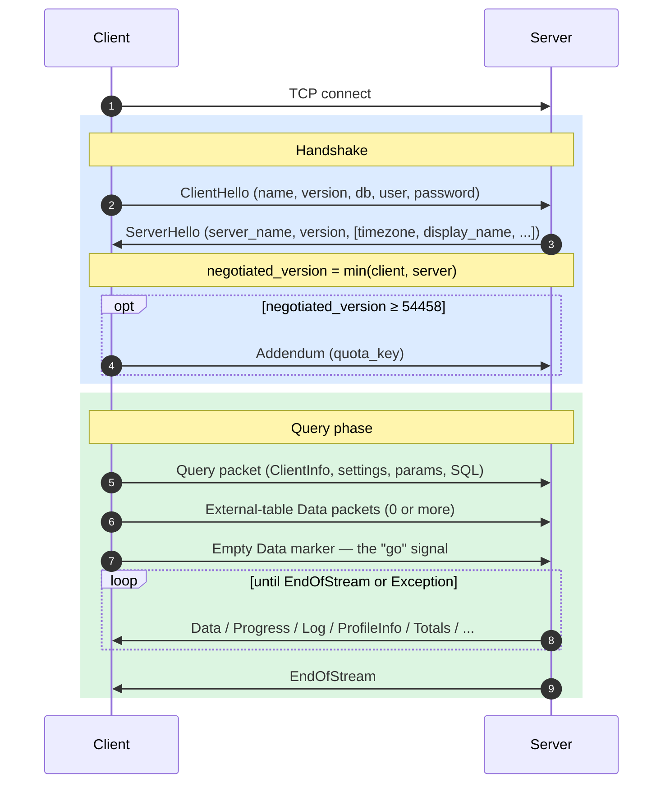
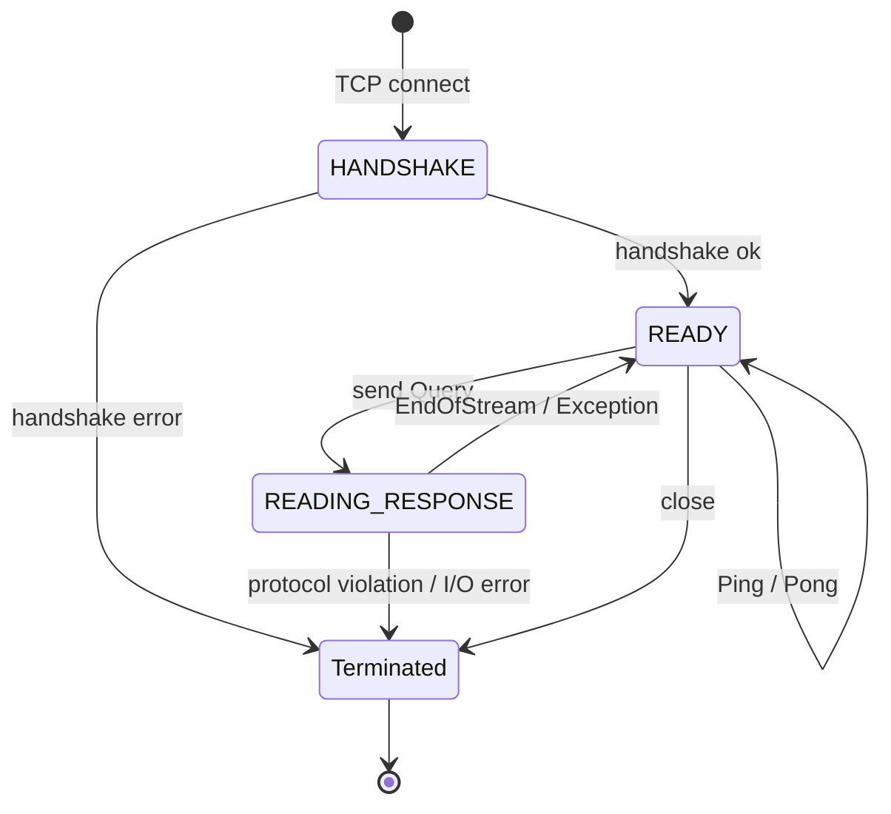
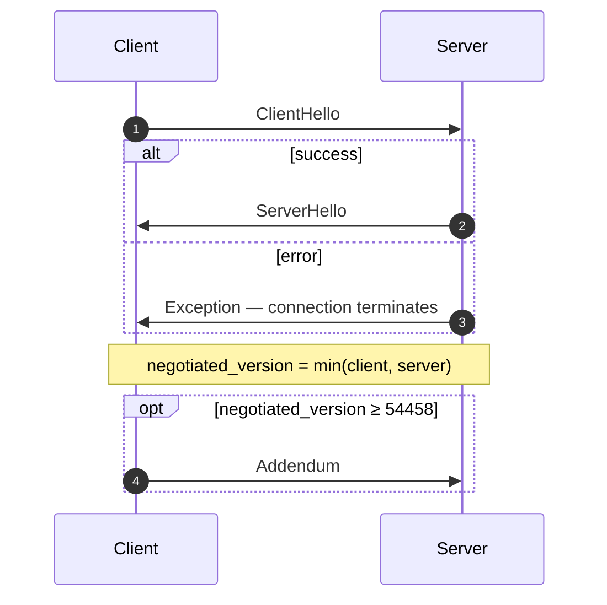
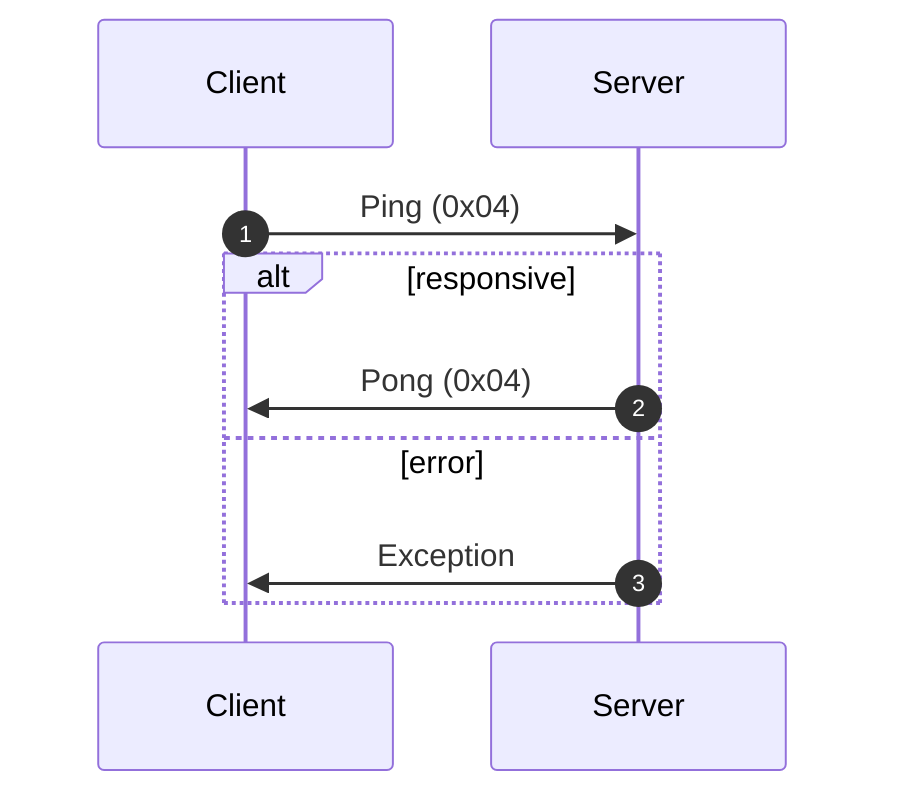
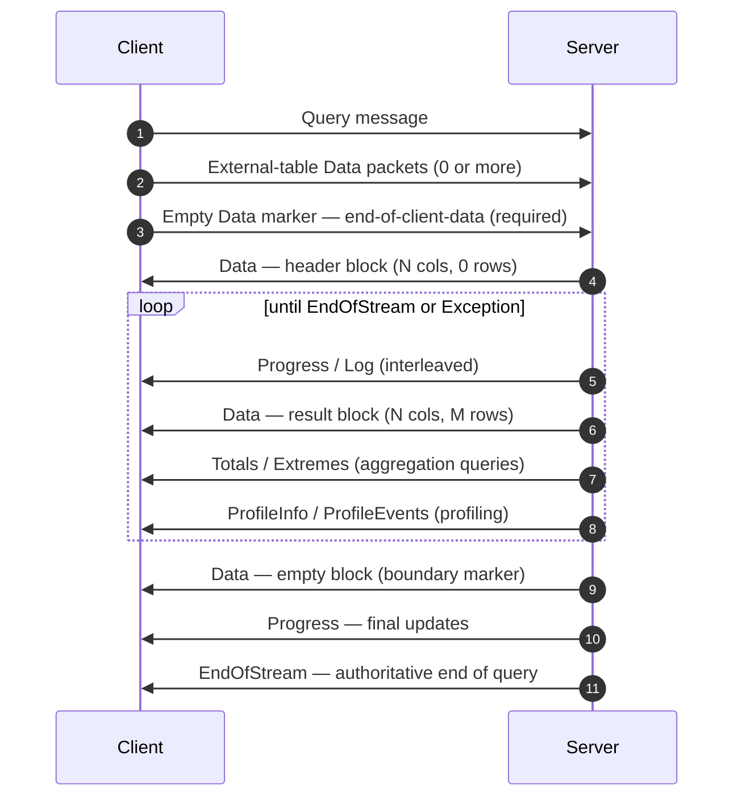
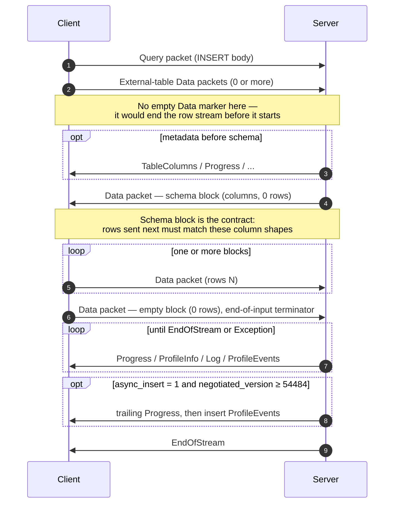
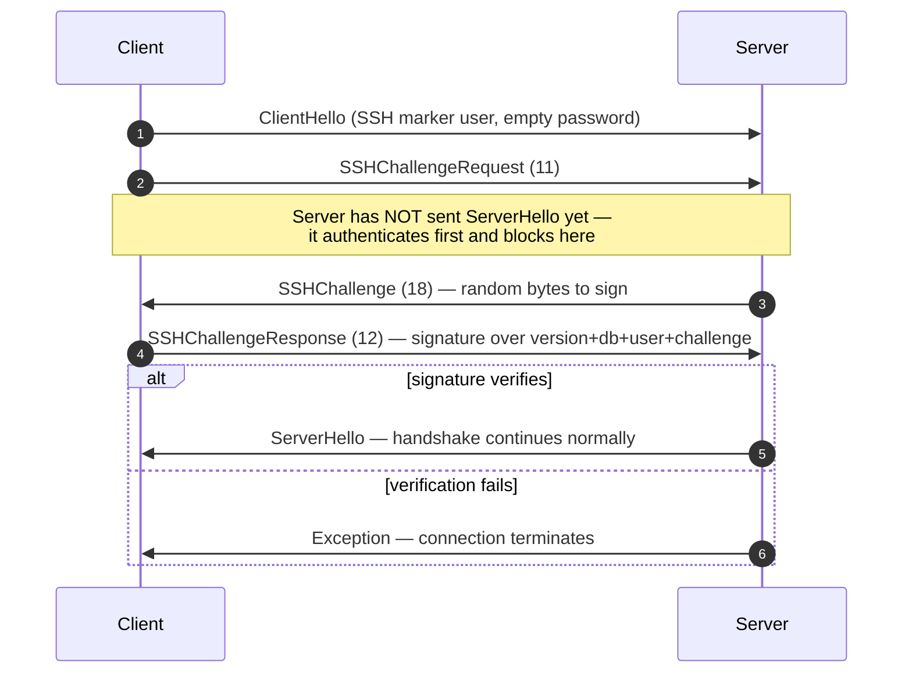

Собственный протокол — это бинарный протокол с установлением соединения, по которому клиенты и серверы ClickHouse взаимодействуют по TCP. Он передаёт SQL-запросы, данные результатов, полезную нагрузку `INSERT`, телеметрию выполнения и сообщения об ошибках. Именно этот протокол используется клиентом командной строки, C++ и большинством сторонних нативных драйверов.

На этой странице рассматривается сам протокол: кадрирование пакетов, машина состояний соединения, согласование версий и тело каждого сообщения, кроме `Block`. Байты внутри пакетов семейства `Data` (то есть `Block`, его столбцы и кодировки отдельных типов) — отдельная тема, описанная в спецификации [Native Format](/ru/reference/interfaces/specs/NativeFormat).

<Info>
  **Сопутствующая спецификация**

  Эта страница — одна из двух частей пары и публикуется вместе с сопутствующей спецификацией [Native Format](/ru/reference/interfaces/specs/NativeFormat). Эти две спецификации чётко разделяют задачи: эта страница описывает пакетный и транспортный уровни, а спецификация Native Format — байты внутри пакетов семейства `Data`.
</Info>

Для всего протокола справедливы несколько свойств. Протокол бинарный и позиционный: тегов полей нет, кроме `BlockInfo`, поэтому один смещённый байт нарушает синхронизацию всего, что идёт дальше. Он работает с сохранением состояния, и каждое TCP-соединение обрабатывает только один запрос за раз — мультиплексирования нет. Для целых чисел фиксированной ширины используется порядок байтов little-endian.

<div id="overview">
  ## Обзор
</div>

| Свойство          | Значение                                                                            |
| ----------------- | ----------------------------------------------------------------------------------- |
| Транспорт         | TCP, при необходимости с TLS                                                        |
| Порядок байтов    | Little-endian для целых чисел фиксированной ширины                                  |
| Кодирование       | Бинарное и позиционное (без тегов полей, кроме `BlockInfo`)                         |
| Модель соединения | С сохранением состояния, по одному запросу за раз, без мультиплексирования          |
| Версионирование   | Согласуется при рукопожатии; отдельные возможности зависят от версии                |
| Формат данных     | [Native Format](/ru/reference/interfaces/specs/NativeFormat) для всех табличных данных |

Каждое передаваемое по сети сообщение начинается с кода типа пакета `VarUInt`, за которым следует тело, структура которого зависит от этого кода и согласованной версии протокола.

Соединение проходит через три фазы — однократное рукопожатие, затем любое количество обменов `Ping` или `Query`, после чего соединение закрывается:



Протокол нативного TCP всегда передаёт табличные данные в формате Native, независимо от наличия предложения `FORMAT` в SQL. Повторное форматирование в `RowBinary`, `CSV`, `JSON` и так далее — задача клиента; оно выполняется после декодирования блоков Native. (HTTP-интерфейс использует другой кодовый путь и *действительно* учитывает предложение `FORMAT`; HTTP здесь не рассматривается.)

<div id="security">
  ## Безопасность
</div>

<div id="transport-security">
  ### Защита транспортного уровня (TLS)
</div>

TLS работает на транспортном уровне, ниже протокола. Когда TLS включён, шифруется весь TCP-трафик, а сообщения протокола остаются побайтно идентичными независимо от того, используется TLS или нет.

<div id="authentication">
  ### Аутентификация
</div>

Аутентификация происходит во время рукопожатия, в сообщении [`ClientHello`](#clienthello). Поля `user` и `password` передаются как строки в открытом виде, поэтому учетные данные при передаче защищаются шифрованием на транспортном уровне (TLS).

Аутентификация SSH по схеме challenge-response доступна начиная с версии протокола 54466 — см. [Аутентификация SSH по схеме challenge-response](#ssh-authentication).

<div id="inter-server-secret">
  ### Межсерверный секрет
</div>

Для выполнения распределённого запроса серверы аутентифицируют друг друга, подтверждая знание общего секрета, — без передачи самого секрета по сети. Каждый Query содержит 32-байтный SHA-256 `auth_hash` в поле 4 [`Query`](#query), вычисленный на основе salt, nonce, настроенного секрета и запроса; принимающий сервер вычисляет его заново и сравнивает. Это контролируется возможностью `INTERSERVER_SECRET` (v54441). Внешние клиенты всегда отправляют здесь пустую строку. См. [Межсерверная аутентификация](#inter-server-authentication).

<div id="versioning-and-feature-gates">
  ## Версионирование и флаги возможностей
</div>

<div id="version-negotiation">
  ### Согласование версии
</div>

И клиент, и сервер сообщают максимальную поддерживаемую версию протокола при рукопожатии. **Согласованная версия** — меньшая из двух:

```text
negotiated_version = min(client_version, server_version)
```

Каждое последующее сообщение использует согласованную версию, чтобы определить, какие поля присутствуют в двоичном представлении.

<div id="feature-gates">
  ### Флаги возможностей
</div>

Возможность определяется версией протокола, в которой она появилась, и считается **активной**, если согласованная версия больше или равна этому номеру.

<Warning>
  Когда возможность активна, её поля **обязательно** должны присутствовать в бинарном представлении данных. Протокол строго позиционный, поэтому пропуск поля, управляемого флагом возможности, нарушает поток байтов для всех последующих полей.
</Warning>

<div id="feature-table">
  ### Таблица возможностей
</div>

| Возможность                                             | Версия | Влияет на                        | Влияние на бинарный формат                                                                                                                                                                                                                                                                                                                                                                                                                                                                                                                                                                                                                        |
| ------------------------------------------------------- | ------ | -------------------------------- | ------------------------------------------------------------------------------------------------------------------------------------------------------------------------------------------------------------------------------------------------------------------------------------------------------------------------------------------------------------------------------------------------------------------------------------------------------------------------------------------------------------------------------------------------------------------------------------------------------------------------------------------------- |
| BLOCK&#95;INFO                                          | all    | Block                            | Добавляет префикс BlockInfo (`is_overflows`, `bucket_number`) к каждому Block.                                                                                                                                                                                                                                                                                                                                                                                                                                                                                                                                                                    |
| CLIENT&#95;INFO                                         | 54032  | Query                            | Добавляет блок ClientInfo в тело Query.                                                                                                                                                                                                                                                                                                                                                                                                                                                                                                                                                                                                           |
| TIMEZONE                                                | 54058  | ServerHello                      | Добавляет поле `timezone` в ServerHello.                                                                                                                                                                                                                                                                                                                                                                                                                                                                                                                                                                                                          |
| QUOTA&#95;KEY&#95;IN&#95;CLIENT&#95;INFO                | 54060  | ClientInfo                       | Добавляет поле `quota_key` в ClientInfo.                                                                                                                                                                                                                                                                                                                                                                                                                                                                                                                                                                                                          |
| DISPLAY&#95;NAME                                        | 54372  | ServerHello                      | Добавляет поле `display_name` в ServerHello.                                                                                                                                                                                                                                                                                                                                                                                                                                                                                                                                                                                                      |
| VERSION&#95;PATCH                                       | 54401  | ServerHello, ClientInfo          | Добавляет поле `version_patch` в оба пакета.                                                                                                                                                                                                                                                                                                                                                                                                                                                                                                                                                                                                      |
| SERVER&#95;LOGS                                         | 54406  | Log                              | Сервер отправляет пакеты Log, если задан `send_logs_level`.                                                                                                                                                                                                                                                                                                                                                                                                                                                                                                                                                                                       |
| COLUMN&#95;DEFAULTS&#95;METADATA                        | 54410  | TableColumns                     | Сервер может отправить пакет [`TableColumns`](#tablecolumns) (тип 11) с метаданными значений столбцов по умолчанию перед блоком схемы INSERT/входных данных. Отправляется только если согласованная версия ≥ 54410 **и** включён `input_format_defaults_for_omitted_fields`. Для более ранних версий пакет никогда не отправляется; клиенты не должны его ожидать.                                                                                                                                                                                                                                                                                |
| WRITE&#95;CLIENT&#95;INFO                               | 54420  | Progress                         | Добавляет `wrote_rows` и `wrote_bytes` в Progress. (Несмотря на название, это **не** управляет блоком ClientInfo — за него отвечает `CLIENT_INFO` (v54032).)                                                                                                                                                                                                                                                                                                                                                                                                                                                                                      |
| SETTINGS&#95;SERIALIZED&#95;AS&#95;STRINGS              | 54429  | Query (кодирование settings)     | Меняет **способ** кодирования всегда присутствующего списка settings; **не** определяет, будут ли settings отправлены. В v54429+ каждый setting записывается как `(name, flags, value-as-string)`; более старые узлы записывают `(name, type-specific-binary-value)` без flags. См. [Setting](#setting).                                                                                                                                                                                                                                                                                                                                          |
| INTERSERVER&#95;SECRET                                  | 54441  | Query                            | Добавляет в Query межсерверное поле `auth_hash` — salted SHA-256 от секрета кластера, а не сам секрет. Внешние клиенты отправляют пустую строку. См. [Inter-server authentication](#inter-server-authentication).                                                                                                                                                                                                                                                                                                                                                                                                                                 |
| OPEN&#95;TELEMETRY                                      | 54442  | ClientInfo                       | Добавляет trace context OpenTelemetry в ClientInfo.                                                                                                                                                                                                                                                                                                                                                                                                                                                                                                                                                                                               |
| DISTRIBUTED&#95;DEPTH                                   | 54448  | ClientInfo                       | Добавляет поле `distributed_depth` в ClientInfo.                                                                                                                                                                                                                                                                                                                                                                                                                                                                                                                                                                                                  |
| INITIAL&#95;QUERY&#95;START&#95;TIME                    | 54449  | ClientInfo                       | Добавляет поле `initial_time` (Int64, фиксированной ширины).                                                                                                                                                                                                                                                                                                                                                                                                                                                                                                                                                                                      |
| PROFILE&#95;EVENTS                                      | 54451  | ProfileEvents                    | Сервер отправляет пакеты ProfileEvents во время выполнения запроса.                                                                                                                                                                                                                                                                                                                                                                                                                                                                                                                                                                               |
| PARALLEL&#95;REPLICAS                                   | 54453  | ClientInfo                       | Добавляет в ClientInfo поля координации параллельных реплик.                                                                                                                                                                                                                                                                                                                                                                                                                                                                                                                                                                                      |
| CUSTOM&#95;SERIALIZATION                                | 54454  | Block (Column)                   | Добавляет байт `has_custom_serialization` после строки типа каждого столбца.                                                                                                                                                                                                                                                                                                                                                                                                                                                                                                                                                                      |
| ADDENDUM                                                | 54458  | Handshake                        | Клиент отправляет addendum (`quota_key`) после обмена рукопожатием.                                                                                                                                                                                                                                                                                                                                                                                                                                                                                                                                                                               |
| PARAMETERS                                              | 54459  | Query                            | Добавляет список параметров в тело Query.                                                                                                                                                                                                                                                                                                                                                                                                                                                                                                                                                                                                         |
| SERVER&#95;QUERY&#95;TIME&#95;IN&#95;PROGRESS           | 54460  | Progress                         | Добавляет поле `elapsed_ns` в Progress.                                                                                                                                                                                                                                                                                                                                                                                                                                                                                                                                                                                                           |
| PASSWORD&#95;COMPLEXITY&#95;RULES                       | 54461  | ServerHello                      | Добавляет в ServerHello список regex-шаблонов политики паролей и человекочитаемых сообщений.                                                                                                                                                                                                                                                                                                                                                                                                                                                                                                                                                      |
| INTERSERVER&#95;SECRET&#95;V2                           | 54462  | ServerHello                      | Добавляет в ServerHello 8-байтовый `UInt64` nonce. Используется для подписи межсерверных запросов; внешние клиенты декодируют его и игнорируют.                                                                                                                                                                                                                                                                                                                                                                                                                                                                                                   |
| TOTAL&#95;BYTES&#95;IN&#95;PROGRESS                     | 54463  | Progress                         | Добавляет поле `total_bytes_to_read` (VarUInt) в Progress, между `total_rows` и `wrote_rows`.                                                                                                                                                                                                                                                                                                                                                                                                                                                                                                                                                     |
| TIMEZONE&#95;UPDATES                                    | 54464  | TimezoneUpdate                   | Добавляет серверный пакет `TimezoneUpdate` (тип 17). Тело: один `String`, содержащий часовой пояс сеанса. Отправляется только инициализатором table function `input`, сразу после блока входной схемы, чтобы клиент разбирал отправляемые строки с `session_timezone` сервера. См. [TimezoneUpdate](#timezoneupdate).                                                                                                                                                                                                                                                                                                                             |
| SPARSE&#95;SERIALIZATION                                | 54465  | Block (Column)                   | Сервер может установить `has_custom_serialization = 1` и отправить столбец в разреженном кодировании. Формат передачи данных: 1-байтовый kind (0x01 = SPARSE), затем поток смещений VarUInt, завершённый EOG, затем не-default значения, плотно закодированные во внутреннем типе. См. [kind&#95;stack and sparse encoding](/ru/reference/interfaces/specs/NativeFormat#kind-stack-and-sparse-encoding).                                                                                                                                                                                                                                             |
| SSH&#95;AUTHENTICATION                                  | 54466  | Auth flow                        | Добавляет SSH challenge-response authentication. Включается явно: клиент отправляет `user` в виде `" SSH KEY AUTHENTICATION " + <real_user>` с пустым паролем, чтобы активировать её. См. [SSH challenge-response authentication](#ssh-authentication).                                                                                                                                                                                                                                                                                                                                                                                           |
| TABLE&#95;READ&#95;ONLY&#95;CHECK                       | 54467  | TablesStatusResponse             | Добавляет флаг `is_readonly` в строку каждой таблицы в TablesStatusResponse. Внешние клиенты, которые не отправляют `TablesStatusRequest`, не увидят изменений в формате передачи данных.                                                                                                                                                                                                                                                                                                                                                                                                                                                         |
| SYSTEM&#95;KEYWORDS&#95;TABLE                           | 54468  | system tables                    | Сервер заполняет `system.keywords`, чтобы стандартный `clickhouse-client` мог автодополнять ключевые слова. В native protocol изменений формата передачи данных нет.                                                                                                                                                                                                                                                                                                                                                                                                                                                                              |
| ROWS&#95;BEFORE&#95;AGGREGATION                         | 54469  | ProfileInfo                      | Добавляет в ProfileInfo `applied_aggregation` (Bool) и `rows_before_aggregation` (VarUInt) именно в таком порядке, в конце.                                                                                                                                                                                                                                                                                                                                                                                                                                                                                                                       |
| CHUNKED&#95;PROTOCOL                                    | 54470  | Фрейминг соединения              | Пофрагментный фрейминг пакетов оборачивает каждое тело пакета. Согласуется в Addendum. ServerHello содержит предпочтение сервера для каждого направления; Addendum содержит окончательный выбор клиента. См. [chunked framing](#chunked-framing).                                                                                                                                                                                                                                                                                                                                                                                                 |
| VERSIONED&#95;PARALLEL&#95;REPLICAS&#95;PROTOCOL        | 54471  | ServerHello, Addendum            | Обе стороны обмениваются версией протокола координации parallel-replicas в виде `VarUInt`. Поле в ServerHello располагается **сразу после `protocol_version`** (перед `timezone`). Поле в Addendum добавляется после строк chunked-protocol. Текущее значение: `7` (`DBMS_PARALLEL_REPLICAS_PROTOCOL_VERSION`).                                                                                                                                                                                                                                                                                                                                   |
| INTERSERVER&#95;EXTERNALLY&#95;GRANTED&#95;ROLES        | 54472  | Query                            | Добавляет поле `String external_roles` в тело Query, между терминатором settings и хешем interserver-secret. Внешние клиенты отправляют пустой список ролей (один байт `0x00`, то есть VarUInt 0 внутри оболочки String).                                                                                                                                                                                                                                                                                                                                                                                                                         |
| V2&#95;DYNAMIC&#95;AND&#95;JSON&#95;SERIALIZATION       | 54473  | Column body                      | Server может использовать сериализацию V2 для типов столбцов `Dynamic` и `JSON` — это определяет, какую версию `state_prefix` они используют. См. [versioned types](/ru/reference/interfaces/specs/NativeFormat#versioned-types).                                                                                                                                                                                                                                                                                                                                                                                                                    |
| SERVER&#95;SETTINGS                                     | 54474  | ServerHello                      | Server передаёт свои настройки сервера, отличающиеся от значений по умолчанию, в виде списка в конце ServerHello, после `nonce`. Формат: тройки `(key, flags, value)`, завершаемые пустым key — так же, как список settings в пакете Query.                                                                                                                                                                                                                                                                                                                                                                                                       |
| QUERY&#95;AND&#95;LINE&#95;NUMBERS                      | 54475  | ClientInfo                       | Добавляет `script_query_number` (VarUInt) и `script_line_number` (VarUInt) в конец ClientInfo. Используется clickhouse-client для привязки ошибок в многооператорных скриптах; внешние клиенты отправляют `0, 0`.                                                                                                                                                                                                                                                                                                                                                                                                                                 |
| JWT&#95;IN&#95;INTERSERVER                              | 54476  | ClientInfo                       | Добавляет признак наличия JWT типа UInt8 и необязательный `String jwt` в конец ClientInfo. Внешние клиенты (без JWT) отправляют байт `0x00`. (В C++ записано как `DBMS_MIN_REVISON_WITH_JWT_IN_INTERSERVER` — обратите внимание на опечатку в имени константы.)                                                                                                                                                                                                                                                                                                                                                                                   |
| QUERY&#95;PLAN&#95;SERIALIZATION                        | 54477  | ServerHello, QueryPlan packet    | ServerHello добавляет `VarUInt query_plan_serialization_version` после настроек сервера. Также вводится `ClientPacket::QueryPlan` (код `13`) для межсерверной передачи pre-built query plans — внешние клиенты его никогда не отправляют.                                                                                                                                                                                                                                                                                                                                                                                                         |
| PARALLEL&#95;BLOCK&#95;MARSHALLING                      | 54478  | Block (Column)                   | Server может оборачивать столбцы в `ColumnBLOB` (со встроенным сжатием) для параллельной обработки. Используется только если для запроса включено сжатие и `rows > 1`; в противном случае применяется обычный формат передачи данных столбцов. Клиенты, которые никогда не включают сжатие для исходящих пакетов Query, не увидят изменений в формате передачи данных.                                                                                                                                                                                                                                                                            |
| VERSIONED&#95;CLUSTER&#95;FUNCTION&#95;PROTOCOL         | 54479  | ServerHello                      | Добавляет `VarUInt cluster_function_protocol_version` в конец ServerHello. Используется для table function `*Cluster` (`s3Cluster` и т. д.). Внешние клиенты декодируют и игнорируют его.                                                                                                                                                                                                                                                                                                                                                                                                                                                         |
| OUT&#95;OF&#95;ORDER&#95;BUCKETS&#95;IN&#95;AGGREGATION | 54480  | BlockInfo                        | Добавляет поле 3 (`out_of_order_buckets: Vec<Int32>`) в поток BlockInfo с тегами полей. Декодируется как `[VarUInt count][Int32]*count`. Внешние клиенты сами это не отправляют; декодер читает любой непустой список, который отправляет Server.                                                                                                                                                                                                                                                                                                                                                                                                 |
| COMPRESSED&#95;LOGS&#95;PROFILE&#95;EVENTS&#95;COLUMNS  | 54481  | Log, ProfileEvents, TableColumns | Server может оборачивать тела пакетов [`Log`](#log), [`ProfileEvents`](#profileevents) и [`TableColumns`](#tablecolumns) в [compression frame](/ru/reference/interfaces/specs/NativeFormat#compression-frame). В этой версии все три тела передаются по одному и тому же выходному пути с необязательным сжатием, которое становится полноценным compression frame только при `compression = true` в запросе. Клиенты, которые никогда не включают сжатие для исходящих пакетов Query, не увидят изменений в формате передачи данных.                                                                                                                |
| REPLICATED&#95;SERIALIZATION                            | 54482  | Block (Column)                   | Server может выдавать столбцы с kind&#95;stack `0x04 = REPLICATED` — компактной формой в стиле словаря для повторяющихся значений — см. [kind&#95;stack and sparse encoding](/ru/reference/interfaces/specs/NativeFormat#kind-stack-and-sparse-encoding). Ниже этой версии writer разворачивал такие столбцы перед отправкой. Декодирование выполняется через поиск по индексу (`elements[indexes[i]]` для каждой строки); поддерживаются leaf types, а также внутренние типы `Nullable`/`Array`/`Tuple`/`Map`/`Nested`/`LowCardinality`.                                                                                                            |
| NULLABLE&#95;SPARSE&#95;SERIALIZATION                   | 54483  | Block (Column)                   | Комбинирует разреженную сериализацию с `Nullable(T)`. Ниже этой версии writer разворачивал sparse для столбцов с типом Nullable перед отправкой; начиная с v54483+ данные в формате передачи данных представлены как sparse-over-Nullable. См. [kind&#95;stack and sparse encoding](/ru/reference/interfaces/specs/NativeFormat#kind-stack-and-sparse-encoding).                                                                                                                                                                                                                                                                                     |
| PROGRESS&#95;IN&#95;ASYNC&#95;INSERT                    | 54484  | Progress (INSERT)                | При **асинхронной** вставке INSERT (`async_insert = 1`) после сброса вставки Server отправляет дополнительный пакет [`Progress`](#progress), затем `ProfileEvents` этой вставки, перед `EndOfStream`. Используется только при *согласованной* версии ≥ 54484; ниже неё Server не отправляет этот завершающий Progress. Формат передачи данных Progress не меняется — новшество только в самой отправке. На практике приращение содержит прошедшее время; счётчики записанных строк передаются через сопутствующий ProfileEvents. Клиенту, который уже читает чередующиеся Progress, не нужно менять формат — достаточно допустить ещё один пакет. |
| CLIENT&#95;AGENT&#95;IN&#95;CLIENT&#95;INFO             | 54485  | ClientInfo                       | Добавляет в конец ClientInfo поле `String` `client_agent`. Канонический клиент автоматически определяет идентификатор agent из окружения (например, `claude-code`, `cursor`, `gemini-cli` или значение переменной `AGENT`); внешний клиент, если ничего не обнаружено, отправляет пустую строку. Обязательно при согласованной версии ≥ 54485 — если его опустить, оставшаяся часть пакета Query будет десинхронизирована.                                                                                                                                                                                                                        |

<div id="packet-envelope">
  ## Оболочка пакета
</div>

Каждое сообщение в передаваемом двоичном формате имеет одинаковую внешнюю структуру в обоих направлениях:

```text
[VarUInt: packet_type_code]    always encoded as VarUInt
[message body]                 format depends on packet_type_code
```

Полные таблицы типов пакетов приведены в [справочнике по типам пакетов](#packet-type-reference).

Тип пакета — это `VarUInt`, а не байт фиксированной длины. Для значений меньше 128 `VarUInt` даёт тот же однобайтный результат, но реализации должны использовать кодирование `VarUInt`, чтобы сохранить совместимость, если в будущем появятся типы пакетов со значением 128 и выше.

В [справочнике по сообщениям](#message-reference) описывается только **тело** каждого пакета — байты после кода типа пакета. Нумерация полей начинается с 1, где первое поле — это первое поле тела.

<div id="chunked-framing">
  ### Фрагментное кадрирование (v54470+)
</div>

Когда возможность `CHUNKED_PROTOCOL` **согласована** (см. [этап рукопожатия](#handshake-phase)), каждый пакет при передаче оборачивается во фрагментное кадрирование. Такое оборачивание выполняется **отдельно для каждого направления**: client→server и server→client согласуются независимо и в итоге могут работать в разных режимах (с фрагментным кадрированием или без него).

Структура данных в канале для каждого пакета:

```text
<chunk>...   one or more chunks; their payloads concatenated form the whole packet
[u32 LE = 0] zero-size terminator marking end of packet
```

Структура данных в wire-формате для каждого фрагмента:

```text
[u32 LE: chunk_size]   chunk_size in [1, UINT32_MAX]
[chunk_size bytes]     packet bytes (see note below)
```

Тип пакета `VarUInt` находится **внутри** потока, разбитого на фрагменты: это первый байт полезной нагрузки пакета (первый байт первого фрагмента), а не отдельный байт, отправляемый перед кадрированием. Полезная нагрузка фрагментов каждого пакета представляет собой полный `[VarUInt packet_type_code][message body]` из [конверта пакета](#packet-envelope). Если клиент оставляет тип пакета вне потока, разбитого на фрагменты, другая сторона считывает этот байт типа как первый байт размера фрагмента `u32`, что приводит к рассинхронизации соединения.

Один пакет может быть разделен на несколько фрагментов, если буфер пишущей стороны заполняется посреди пакета; разбиение может произойти в любом месте, в том числе внутри `VarUInt` типа пакета. Читатель объединяет полезные нагрузки фрагментов и рассматривает завершающий 4-байтовый ноль как прозрачную границу пакета — он считывает его, но не передает тому, что читает тела пакетов.

Пакеты без тела все равно оборачиваются: однобайтовый пакет, такой как `Ping` или `Pong`, после согласования разбиения на фрагменты становится `[u32 size = 1][0x04][u32 0]`. Любое описание «один байт в байтовом потоке» в других местах этой страницы относится к форме до разбиения на фрагменты.

**Согласование.** `ServerHello` и `Addendum` содержат по два поля `String`, по одному для каждого направления, со значениями из `{"chunked", "notchunked", "chunked_optional", "notchunked_optional"}`:

* `chunked` / `notchunked` — строгие: эта сторона требует именно этот режим.
* Варианты `_optional` — гибкие: они принимают любой режим, который выберет другая сторона.

Согласованное значение для каждого направления вычисляется попарно:

| Предпочтение сервера | Предпочтение клиента | Согласованное значение                               |
| -------------------- | -------------------- | ---------------------------------------------------- |
| `*_optional`         | что угодно           | следовать CLIENT (его `starts_with("chunked")`)      |
| что угодно           | `*_optional`         | следовать SERVER                                     |
| `chunked` strict     | `chunked` strict     | `chunked`                                            |
| `notchunked` strict  | `notchunked` strict  | `notchunked`                                         |
| несовпадение strict  | несовпадение strict  | **ошибка протокола** — соединение НЕОБХОДИМО закрыть |

На стороне клиента предпочтение SEND клиента согласуется с предпочтением RECV сервера, и наоборот.

**Время применения.** Строки согласования передаются без кадрирования: ClientHello → ServerHello (предпочтения сервера) → Addendum (согласованные значения клиента). Переключение на кадрирование применяется ко всем байтам, отправленным *после* того, как `Addendum` сброшен на диск. Сам `Addendum`, `ClientHello` и `ServerHello` всегда передаются без кадрирования.

<div id="connection-lifecycle">
  ## Жизненный цикл соединения
</div>

В любой момент соединение находится ровно в одном из четырёх состояний: `HANDSHAKE`, `READY`, `READING_RESPONSE` или завершено. Поскольку протокол не поддерживает мультиплексирование, клиент, который отправляет новый запрос, не дочитав предыдущий ответ до конца, перемешивает байты в потоке передачи данных и повреждает поток.

<div id="states">
  ### Состояния
</div>



Штатный сценарий идёт прямо вниз — `HANDSHAKE → READY → READING_RESPONSE → READY` — с самопетлёй `Ping`/`Pong`, а все ветви сбоев сходятся в единственное конечное состояние `Terminated`.

| State              | Description                                                                                                                                                                                                                                               |
| ------------------ | --------------------------------------------------------------------------------------------------------------------------------------------------------------------------------------------------------------------------------------------------------- |
| `HANDSHAKE`        | Начальное состояние после открытия TCP-соединения. Допустимы только сообщения [рукопожатия](#handshake-phase). При успехе выполняется переход в `READY`, при сбое соединение завершается.                                                                 |
| `READY`            | Бездействует. Клиент может отправить [Ping](#ping-phase), [запрос](#query-phase) или закрыть соединение. Соединение может оставаться в `READY` сколь угодно долго (с учётом `idle_connection_timeout`, см. [ограничения соединения](#connection-limits)). |
| `READING_RESPONSE` | В это состояние клиент переходит после отправки запроса. Клиент должен полностью вычитать поток ответа сервера, прежде чем вернуться в `READY`. Единственный допустимый здесь пакет client→server — Cancel (на этой странице не описан).                  |
| Terminated         | Больше не используется. Клиент должен открыть новое TCP-соединение и заново выполнить рукопожатие.                                                                                                                                                        |

<div id="handshake-phase">
  ### Фаза рукопожатия
</div>

На этом этапе выполняются аутентификация и согласование версии протокола. Это происходит ровно один раз для каждого соединения — прежде всего остального.

TCP-соединение только что установлено, и никакими сообщениями стороны ещё не обменивались. Последовательность:



1. Клиент отправляет [`ClientHello`](#clienthello), указав максимальную поддерживаемую версию протокола.

2. Клиент читает ответ и обрабатывает его в зависимости от типа пакета:

   | Тип пакета      | Действие                                                                                                                    |
   | --------------- | --------------------------------------------------------------------------------------------------------------------------- |
   | `Hello` (0)     | Декодировать [`ServerHello`](#serverhello). Вычислить `negotiated_version = min(client_ver, server_ver)`. Перейти к шагу 3. |
   | `Exception` (2) | Декодировать [`Exception`](#exception). Вернуть ошибку и завершить соединение.                                              |
   | anything else   | Нарушение протокола. Завершить соединение.                                                                                  |

3. Если `negotiated_version ≥ 54458` (возможность `ADDENDUM`), клиент отправляет [`Addendum`](#addendum). Это решение принимается на основе **согласованной** версии, а не версии, объявленной клиентом.

В случае успеха соединение переходит в состояние `READY`; при любой ошибке оно завершается.

<div id="ping-phase">
  ### Фаза Ping
</div>

Проверка работоспособности на уровне приложения, не зависящая от TCP keepalive. Успешный обмен Ping/Pong подтверждает, что TCP-соединение активно в обоих направлениях и сервер отвечает. Ping не хранит состояние и не связан ни с каким `запросом`, поэтому несколько последовательных Ping независимы.

Начиная с `READY`, последовательность такова:



1. Клиент отправляет [`Ping`](#ping).
2. Клиент читает ответ:

   | Тип пакета      | Действие                                                     |
   | --------------- | ------------------------------------------------------------ |
   | `Pong` (4)      | Работоспособность подтверждена. Возврат в `READY`.           |
   | `Exception` (2) | Декодировать [`Exception`](#exception) и вернуть как ошибку. |
   | любой другой    | Нарушение протокола.                                         |

<div id="query-phase">
  ### Фаза запроса
</div>

Клиент отправляет SQL-оператор; сервер потоково возвращает блоки результатов и телеметрию выполнения. Ответ представляет собой последовательность пакетов, которая завершается ровно одним `EndOfStream` или `Exception`.

Начиная с `READY`, последовательность выглядит так:



При ошибке на любом этапе сервер отправляет `Exception` вместо `EndOfStream`, что приводит к завершению запроса.

1. Клиент отправляет [`Query`](#query) с уникальным `query_id` (обычно UUID).
2. Клиент отправляет все внешние таблицы, затем пустой маркер `Data`. У пустого пакета `Data`: `table_name = ""`, `num_columns = 0`, `num_rows = 0`. Сервер не начинает выполнять запрос, пока не получит этот маркер.
3. Клиент переходит в `READING_RESPONSE` и сбрасывает буфер записи.
4. Клиент в цикле читает пакеты ответа и обрабатывает их по типу:

   | Тип пакета           | Действие                                                                                                                                                                                      |
   | -------------------- | --------------------------------------------------------------------------------------------------------------------------------------------------------------------------------------------- |
   | `Data` (1)           | Декодировать block. Первый `Data` — это заголовок схемы; последующие — блоки результата (их нужно накапливать); пустой block — маркер границы. `num_rows == 0` **не** означает конец запроса. |
   | `Progress` (3)       | Метрики выполнения. Каждый пакет — **приращение** относительно предыдущего, поэтому их нужно накапливать локально.                                                                            |
   | `EndOfStream` (5)    | Запрос завершён. Выйти из цикла и вернуться в `READY`.                                                                                                                                        |
   | `ProfileInfo` (6)    | Данные профилирования после выполнения.                                                                                                                                                       |
   | `Totals` (7)         | Блок итогов агрегации (тот же формат передачи данных, что и у `Data`).                                                                                                                        |
   | `Extremes` (8)       | Блок минимальных/максимальных значений (тот же формат передачи данных, что и у `Data`).                                                                                                       |
   | `Log` (10)           | Строка server log.                                                                                                                                                                            |
   | `TableColumns` (11)  | Метаданные значений по умолчанию для столбцов.                                                                                                                                                |
   | `ProfileEvents` (14) | Счётчики производительности.                                                                                                                                                                  |
   | `Exception` (2)      | Декодировать и вернуть как ошибку. Выйти из цикла и вернуться в `READY`.                                                                                                                      |
   | anything else        | Неожиданное состояние на этапе запроса. Завершить connection.                                                                                                                                 |

При `EndOfStream` или обработанном `Exception` connection возвращается в `READY`. Нарушение protocol или ошибка I/O приводит к её завершению.

<Note>
  Случай `num_rows == 0` часто вызывает путаницу в новых реализациях. Block с нулём строк — это маркер границы или заголовок схемы, а не признак конца потока. Ответ завершается только при `EndOfStream` или `Exception`.
</Note>

<div id="insert-phase">
  ### Фаза INSERT
</div>

Фаза INSERT — это [фаза запроса](#query-phase) с двумя дополнительными обменами. Клиент отправляет оператор `INSERT`; сервер отвечает **блоком схемы**, описывающим целевую таблицу; клиент потоково передаёт пакеты Data со строками, а затем пустой маркер Data; сервер завершает обмен сообщением `EndOfStream` или `Exception`.

Начиная с `READY`, SQL-запрос имеет вид `INSERT INTO <table> [(<cols>)] VALUES` — без встроенного литерала `VALUES (...)`, поскольку данные строк передаются через пакеты Data. Поток:



1. Клиент отправляет [`Query`](#query), где в `body` указан SQL-запрос `INSERT`.
2. Клиент отправляет все внешние таблицы (для `INSERT` это редкость). В отличие от [фазы запроса](#query-phase), здесь он **не** отправляет пустой маркер `Data`. Пакет `INSERT` `Query` отправляется вместе с ожидающими данными, поэтому пустой завершающий блок данных откладывается до шага 5; если отправить его до блока схемы, сервер воспримет его как конец потока строк, завершит `INSERT` без строк, а затем разберёт первый реальный пакет строк как лишний пакет верхнего уровня.
3. Клиент считывает пакеты метаданных (TableColumns, Progress, ProfileInfo, Log, ProfileEvents), пока не получит пакет `Data` со схемой — `Block` с 0 строк, но с полной структурой столбцов (имена и типы). Блок схемы — это контракт: строки, которые клиент отправит дальше, должны соответствовать этим структурам столбцов.
4. Клиент отправляет блоки данных. Для каждого блока он записывает `VarUInt(ClientPacket::Data = 2)`, затем `String("")` для пустого имени внешней таблицы, а затем сам `Block`. Типы столбцов должны соответствовать столбцам блока схемы по позиции.
5. Клиент отправляет завершающий маркер конца ввода: пакет `Data` с пустым `Block` (0 столбцов, 0 строк).
6. Клиент считывает поток ответа до `EndOfStream` (успех) или `Exception` (ошибка).

**Асинхронный `INSERT` (v54484+).** Когда запрос содержит `async_insert = 1`, сервер ставит строки в очередь и сбрасывает их в хранилище как часть батча. При согласованной версии ≥ 54484 (`PROGRESS_IN_ASYNC_INSERT`) после завершения сброса сервер отправляет дополнительный пакет [`Progress`](#progress), сразу после которого идут `ProfileEvents` этой вставки, а затем `EndOfStream`. Ниже 54484 сервер пропускает этот завершающий `Progress`. Это обычный пакет `Progress`; поскольку сервер сбрасывает конвейер запроса перед добавлением счётчиков записи, на практике это приращение содержит только затраченное время, а статистика по записанным строкам и байтам поступает клиенту через сопутствующие `ProfileEvents`. Клиенту, который уже считывает чередующиеся пакеты `Progress` на шаге 6, достаточно просто принять ещё один пакет.

Соединение возвращается в состояние `READY` при `EndOfStream` или обработанном `Exception`. Нарушения протокола и ошибки ввода-вывода приводят к его завершению.

<div id="message-reference">
  ## Справочник сообщений
</div>

Поля перечислены в порядке следования в wire-формате. В столбце `Type` используются:

* `VarUInt` — беззнаковое целое число переменной длины (см. [VarUInt](/ru/reference/interfaces/specs/NativeFormat#varuint)).
* `String` — байты с префиксом `VarUInt` (см. [String](/ru/reference/interfaces/specs/NativeFormat#string)).
* `UInt8`, `Int32` и так далее — целые числа фиксированной длины в little-endian формате.
* `Bool` — один байт, `0x00` или `0x01`.

Столбец `Role` показывает, кто использует каждое поле:

* **client** — задаётся внешними клиентами.
* **inter-server** — имеет значение только при обмене между серверами; внешние клиенты записывают значение по умолчанию.
* **universal** — используется в обоих случаях.

В этих таблицах описано только тело каждого пакета, после кода типа пакета.

<div id="clienthello">
  ### ClientHello (тип пакета 0)
</div>

Клиент → Сервер. Первое сообщение после установления TCP-соединения.

| # | Поле                 | Тип     | Роль      | Описание                                                |
| - | -------------------- | ------- | --------- | ------------------------------------------------------- |
| 1 | client&#95;name      | String  | universal | Идентификатор клиента (например, `"clickhouse-client"`) |
| 2 | version&#95;major    | VarUInt | universal | Мажорная версия клиента                                 |
| 3 | version&#95;minor    | VarUInt | universal | Минорная версия клиента                                 |
| 4 | protocol&#95;version | VarUInt | universal | Максимальная версия протокола, поддерживаемая клиентом  |
| 5 | database             | String  | universal | Имя базы данных по умолчанию                            |
| 6 | user                 | String  | universal | Имя пользователя для аутентификации                     |
| 7 | password             | String  | universal | Пароль (в открытом виде)                                |

<div id="serverhello">
  ### ServerHello (тип пакета 0)
</div>

Server → Client. Ответ на ClientHello при успешной аутентификации.

| #  | Field                                          | Type      | Role         | Condition                                                 | Description                                                                                                                                                                                                                                                                                                                     |
| -- | ---------------------------------------------- | --------- | ------------ | --------------------------------------------------------- | ------------------------------------------------------------------------------------------------------------------------------------------------------------------------------------------------------------------------------------------------------------------------------------------------------------------------------- |
| 1  | server&#95;name                                | String    | universal    | always                                                    | Идентификатор сервера                                                                                                                                                                                                                                                                                                           |
| 2  | version&#95;major                              | VarUInt   | universal    | always                                                    | Основная версия сервера                                                                                                                                                                                                                                                                                                         |
| 3  | version&#95;minor                              | VarUInt   | universal    | always                                                    | Минорная версия сервера                                                                                                                                                                                                                                                                                                         |
| 4  | protocol&#95;version                           | VarUInt   | universal    | always                                                    | Версия протокола сервера                                                                                                                                                                                                                                                                                                        |
| 4a | parallel&#95;replicas&#95;protocol&#95;version | VarUInt   | universal    | VERSIONED&#95;PARALLEL&#95;REPLICAS&#95;PROTOCOL (v54471) | Версия протокола координации параллельных реплик сервера. **Позиция в wire-представлении: сразу после `protocol_version`**, перед `timezone`. Текущее значение: `7`.                                                                                                                                                            |
| 5  | timezone                                       | String    | universal    | TIMEZONE (v54058)                                         | Часовой пояс сервера (например, `"UTC"`)                                                                                                                                                                                                                                                                                        |
| 6  | display&#95;name                               | String    | universal    | DISPLAY&#95;NAME (v54372)                                 | Человекочитаемое имя сервера                                                                                                                                                                                                                                                                                                    |
| 7  | version&#95;patch                              | VarUInt   | universal    | VERSION&#95;PATCH (v54401)                                | Патч-версия сервера                                                                                                                                                                                                                                                                                                             |
| 8  | proto&#95;send&#95;chunked&#95;srv             | String    | universal    | CHUNKED&#95;PROTOCOL (v54470)                             | Предпочтительный исходящий режим разбиения на фрагменты на стороне сервера. Одно из значений: `"chunked"`, `"notchunked"`, `"chunked_optional"`, `"notchunked_optional"`. См. [кадрирование с фрагментацией](#chunked-framing). **В wire-представлении находится ПЕРЕД `password_complexity_rules`, хотя его version gate выше.** |
| 9  | proto&#95;recv&#95;chunked&#95;srv             | String    | universal    | CHUNKED&#95;PROTOCOL (v54470)                             | Предпочтительный входящий режим разбиения на фрагменты на стороне сервера. Тот же набор значений, что и у поля 8.                                                                                                                                                                                                               |
| 10 | password&#95;complexity&#95;rules              | Rule[]    | universal    | PASSWORD&#95;COMPLEXITY&#95;RULES (v54461)                | Политика сложности паролей на сервере. `VarUInt count`, затем `count × Rule`. См. ниже.                                                                                                                                                                                                                                         |
| 11 | nonce                                          | UInt64    | inter-server | INTERSERVER&#95;SECRET&#95;V2 (v54462)                    | 8-байтовый случайный `nonce` в формате LE. Он используется в межсерверной схеме подписи запросов. Внешние клиенты ОБЯЗАНЫ декодировать его (чтобы сохранить выравнивание потока) и ДОЛЖНЫ игнорировать его значение.                                                                                                            |
| 12 | server&#95;settings                            | Setting[] | universal    | SERVER&#95;SETTINGS (v54474)                              | Передаваемые сервером настройки, отличающиеся от значений по умолчанию. Формат: ноль или более троек `(String key, VarUInt flags, String value)`, завершённых пустым ключом. То же, что и [список настроек в пакете Query](#setting).                                                                                           |
| 13 | query&#95;plan&#95;serialization&#95;version   | VarUInt   | universal    | QUERY&#95;PLAN&#95;SERIALIZATION (v54477)                 | Поддерживаемая сервером версия сериализации плана запроса. Внешние клиенты декодируют и игнорируют.                                                                                                                                                                                                                             |
| 14 | cluster&#95;function&#95;protocol&#95;version  | VarUInt   | universal    | VERSIONED&#95;CLUSTER&#95;FUNCTION&#95;PROTOCOL (v54479)  | Версия протокола табличной функции `*Cluster` на сервере. Внешние клиенты декодируют и игнорируют.                                                                                                                                                                                                                              |

**Rule** — элемент `password_complexity_rules`:

| # | Field   | Type   | Description                                                                    |
| - | ------- | ------ | ------------------------------------------------------------------------------ |
| 1 | pattern | String | Шаблон регулярного выражения, которому должен соответствовать пароль.          |
| 2 | message | String | Человекочитаемое пояснение, показываемое, если пароль не проходит это правило. |

Этот список отражает конфигурацию политики паролей, заданную оператором сервера, и носит исключительно рекомендательный характер — сервер не применяет эти правила во время рукопожатия. Клиент, предоставляющий возможность смены или установки пароля, может использовать эти правила, чтобы выявлять ошибки до отправки на сервер пароля, не соответствующего требованиям.

<Note>
  Чтобы ограничить использование ресурсов при работе с враждебным или неверно настроенным сервером, ограничьте декодированное значение `count` 256 элементами, а каждую строку `pattern` и `message` — 4096 байтами. Значение `count`, равное `0` (без последующих пар), — обычный случай для серверов, у которых политика паролей не настроена.
</Note>

<div id="addendum">
  ### Дополнение (без типа пакета)
</div>

Client → Server, доступно при `ADDENDUM` (v54458). Отправляется сразу после завершения обмена рукопожатия. Это не отдельный тип пакета — поля передаются в wire в сыром виде, без байтового префикса типа пакета.

| # | Field                                          | Type    | Role      | Condition                                                 | Description                                                                                                                                                                                                                                                         |
| - | ---------------------------------------------- | ------- | --------- | --------------------------------------------------------- | ------------------------------------------------------------------------------------------------------------------------------------------------------------------------------------------------------------------------------------------------------------------- |
| 1 | quota&#95;key                                  | String  | universal | always                                                    | Ключ ресурсной квоты для серверных квот с ключом. Клиенты, не использующие квоту с ключом, отправляют пустую строку.                                                                                                                                                |
| 2 | proto&#95;send&#95;chunked                     | String  | universal | CHUNKED&#95;PROTOCOL (v54470)                             | Согласованный исходящий режим разбиения на фрагменты на стороне клиента: `"chunked"` или `"notchunked"`. Вычисляется на основе `proto_recv_chunked_srv` из ServerHello.                                                                                               |
| 3 | proto&#95;recv&#95;chunked                     | String  | universal | CHUNKED&#95;PROTOCOL (v54470)                             | Согласованный входящий режим разбиения на фрагменты на стороне клиента. Вычисляется на основе `proto_send_chunked_srv`.                                                                                                                                               |
| 4 | parallel&#95;replicas&#95;protocol&#95;version | VarUInt | universal | VERSIONED&#95;PARALLEL&#95;REPLICAS&#95;PROTOCOL (v54471) | Поддерживаемая клиентом версия протокола координации параллельных реплик. Внешние клиенты, не участвующие в распределённых запросах, всё равно должны отправлять допустимую версию (сейчас `7`), чтобы проверка совместимости на стороне сервера проходила успешно. |

Переключение на фрагментированное кадрирование вступает в силу *после* сброса этого Дополнения на диск — само Дополнение передаётся без кадрирования.

<div id="ping">
  ### Ping (тип пакета 4)
</div>

Клиент → сервер. Без тела — до разбиения на фрагменты пакет представляет собой один байт `0x04`; при согласованном разбиении на фрагменты этот байт становится однобайтовой полезной нагрузкой фрагмента (см. [кадрирование с фрагментацией](#chunked-framing)).

<div id="pong">
  ### Pong (тип пакета 4)
</div>

Сервер → Клиент. Без тела — пакет представляет собой один байт `0x04` до кадрирования с фрагментацией; если согласована фрагментация, этот байт становится однобайтной полезной нагрузкой фрагмента (см. [кадрирование с фрагментацией](#chunked-framing)).

<div id="exception">
  ### Исключение (тип пакета 2)
</div>

Сервер → Клиент. Отправляется при возникновении ошибки на любом этапе.

| # | Поле                      | Тип    | Роль      | Описание                                                        |
| - | ------------------------- | ------ | --------- | --------------------------------------------------------------- |
| 1 | code                      | Int32  | universal | Код ошибки                                                      |
| 2 | name                      | String | universal | Класс исключения (например, `"DB::Exception"`)                  |
| 3 | message                   | String | universal | Читаемое человеком сообщение об ошибке                          |
| 4 | stack&#95;trace           | String | universal | Трассировка стека на стороне сервера                            |
| 5 | has&#95;nested (устарело) | Bool   | universal | Устаревший байт совместимости. Сервер всегда записывает `false` |

<div id="query">
  ### Query (тип пакета 1)
</div>

Клиент → Сервер.

| #  | Поле               | Тип         | Роль          | Условие                                                   | Описание                                                                                                                                                                                                                                                                                                                                         |
| -- | ------------------ | ----------- | ------------- | --------------------------------------------------------- | ------------------------------------------------------------------------------------------------------------------------------------------------------------------------------------------------------------------------------------------------------------------------------------------------------------------------------------------------ |
| 1  | query&#95;id       | String      | универсальная | всегда                                                    | Уникальный идентификатор запроса (UUID)                                                                                                                                                                                                                                                                                                          |
| 2  | client&#95;info    | ClientInfo  | универсальная | CLIENT&#95;INFO (v54032)                                  | См. [ClientInfo](#clientinfo)                                                                                                                                                                                                                                                                                                                    |
| 3  | settings           | Setting[]   | универсальная | всегда                                                    | См. [Setting](#setting). **Присутствует всегда** (завершается пустым ключом); по версии ограничено только *кодирование* отдельных настроек — см. примечание о кодировании в [Setting](#setting). Клиент не должен опускать это поле для согласованных версий ниже `54429`.                                                                       |
| 3a | external&#95;roles | String      | универсальная | INTERSERVER&#95;EXTERNALLY&#95;GRANTED&#95;ROLES (v54472) | Сериализованный список имён ролей, выданных извне. Пустой список = байт `0x00` (VarUInt 0), обёрнутый в String (`[VarUInt 1][0x00]` в wire-формате). Внешние клиенты всегда отправляют пустое значение.                                                                                                                                          |
| 4  | auth&#95;hash      | String      | межсерверная  | INTERSERVER&#95;SECRET (v54441)                           | Хеш межсерверной аутентификации — **не** исходный секрет кластера. См. [Inter-server authentication](#inter-server-authentication) ниже. Внешние клиенты (и любой `InitialQuery`) отправляют пустую строку.                                                                                                                                      |
| 5  | stage              | VarUInt     | универсальная | всегда                                                    | Этап обработки запроса. `0` = FetchColumns, `1` = WithMergeableState, `2` = Complete, `3` = WithMergeableStateAfterAggregation, `4` = WithMergeableStateAfterAggregationAndLimit, `7` = QueryPlan. Значения `3`/`4` встречаются в распределённых запросах; `7` сопровождает сериализованный план запроса. Внешние клиенты обычно отправляют `2`. |
| 6  | compression        | VarUInt     | универсальная | всегда                                                    | 0 = отключено, 1 = включено                                                                                                                                                                                                                                                                                                                      |
| 7  | query&#95;body     | String      | универсальная | всегда                                                    | Текст SQL                                                                                                                                                                                                                                                                                                                                        |
| 8  | parameters         | Parameter[] | клиентская    | PARAMETERS (v54459)                                       | См. [Parameter](#parameter). Завершается пустым ключом.                                                                                                                                                                                                                                                                                          |

<div id="clientinfo">
  ### ClientInfo (встроено в Query)
</div>

Клиент → Сервер, встроено в тело Query (поле 2). Поддерживается начиная с `CLIENT_INFO` (v54032). (Некоторые поля внутри ClientInfo поддерживаются только в более поздних версиях — это указано ниже для каждого поля.)

| #  | Поле                                  | Тип     | Роль         | Условие                                                   | Описание                                                                                                                                                                                                                                                                                                                                                                                         |
| -- | ------------------------------------- | ------- | ------------ | --------------------------------------------------------- | ------------------------------------------------------------------------------------------------------------------------------------------------------------------------------------------------------------------------------------------------------------------------------------------------------------------------------------------------------------------------------------------------ |
| 1  | query&#95;kind                        | UInt8   | universal    | always                                                    | 0 = NoQuery, 1 = InitialQuery, 2 = SecondaryQuery. Внешние клиенты отправляют `1`.                                                                                                                                                                                                                                                                                                               |
| 2  | initial&#95;user                      | String  | universal    | always                                                    | Пользователь, инициировавший запрос                                                                                                                                                                                                                                                                                                                                                              |
| 3  | initial&#95;query&#95;id              | String  | universal    | always                                                    | Исходный ID запроса                                                                                                                                                                                                                                                                                                                                                                              |
| 4  | initial&#95;address                   | String  | universal    | always                                                    | Адрес сокета исходного клиента в формате `host:port`                                                                                                                                                                                                                                                                                                                                             |
| 5  | initial&#95;time                      | Int64   | client       | INITIAL&#95;QUERY&#95;START&#95;TIME (v54449)             | Время начала запроса (в микросекундах). Фиксированная длина — 8 байт, не VarUInt                                                                                                                                                                                                                                                                                                                 |
| 6  | query&#95;interface                   | UInt8   | universal    | always                                                    | 1 = TCP, 2 = HTTP                                                                                                                                                                                                                                                                                                                                                                                |
| 7  | os&#95;user                           | String  | client       | if interface = TCP                                        | Имя пользователя ОС                                                                                                                                                                                                                                                                                                                                                                              |
| 8  | client&#95;hostname                   | String  | client       | if interface = TCP                                        | Имя хоста клиентской машины                                                                                                                                                                                                                                                                                                                                                                      |
| 9  | client&#95;name                       | String  | client       | if interface = TCP                                        | Имя клиентского приложения                                                                                                                                                                                                                                                                                                                                                                       |
| 10 | version&#95;major                     | VarUInt | universal    | if interface = TCP                                        | Мажорная версия клиента                                                                                                                                                                                                                                                                                                                                                                          |
| 11 | version&#95;minor                     | VarUInt | universal    | if interface = TCP                                        | Минорная версия клиента                                                                                                                                                                                                                                                                                                                                                                          |
| 12 | protocol&#95;version                  | VarUInt | universal    | if interface = TCP                                        | Собственная версия TCP-протокола исходного клиента (`DBMS_TCP_PROTOCOL_VERSION`), **не** согласованная версия. Ревизия другой стороны определяет только то, какие поля присутствуют; это значение — версия, встроенная у инициатора при компиляции, поэтому у более нового клиента, подключающегося к более старому серверу, оно может быть выше, чем согласованная ревизия или ревизия сервера. |
| 13 | quota&#95;key                         | String  | universal    | QUOTA&#95;KEY&#95;IN&#95;CLIENT&#95;INFO (v54060)         | Ключ квоты ресурсов для квот с ключом на стороне сервера. Клиенты, не использующие квоту с ключом, отправляют пустую строку.                                                                                                                                                                                                                                                                     |
| 14 | distributed&#95;depth                 | VarUInt | inter-server | DISTRIBUTED&#95;DEPTH (v54448)                            | Глубина вложенности Distributed-запроса. Внешние клиенты отправляют `0`.                                                                                                                                                                                                                                                                                                                         |
| 15 | version&#95;patch                     | VarUInt | universal    | VERSION&#95;PATCH (v54401), TCP only                      | Патч-версия клиента                                                                                                                                                                                                                                                                                                                                                                              |
| 16 | open&#95;telemetry                    | (below) | client       | OPEN&#95;TELEMETRY (v54442)                               | Контекст трассировки. Клиенты без трассировки отправляют `0`.                                                                                                                                                                                                                                                                                                                                    |
| 17 | collaborate&#95;with&#95;initiator    | VarUInt | inter-server | PARALLEL&#95;REPLICAS (v54453)                            | Bool в виде VarUInt. Внешние клиенты отправляют `0`.                                                                                                                                                                                                                                                                                                                                             |
| 18 | count&#95;participating&#95;replicas  | VarUInt | inter-server | PARALLEL&#95;REPLICAS (v54453)                            | Внешние клиенты отправляют `0`.                                                                                                                                                                                                                                                                                                                                                                  |
| 19 | number&#95;of&#95;current&#95;replica | VarUInt | inter-server | PARALLEL&#95;REPLICAS (v54453)                            | Внешние клиенты отправляют `0`.                                                                                                                                                                                                                                                                                                                                                                  |
| 20 | script&#95;query&#95;number           | VarUInt | client       | QUERY&#95;AND&#95;LINE&#95;NUMBERS (v54475)               | Позиция оператора в скрипте из нескольких операторов, начиная с 1. Внешние клиенты отправляют `0`.                                                                                                                                                                                                                                                                                               |
| 21 | script&#95;line&#95;number            | VarUInt | client       | QUERY&#95;AND&#95;LINE&#95;NUMBERS (v54475)               | Номер строки в исходном скрипте, начиная с 1. Внешние клиенты отправляют `0`.                                                                                                                                                                                                                                                                                                                    |
| 22 | jwt&#95;present                       | UInt8   | inter-server | JWT&#95;IN&#95;INTERSERVER (v54476)                       | `0` = JWT отсутствует; `1` = далее следует JWT. Внешние клиенты без JWT-аутентификации отправляют `0`.                                                                                                                                                                                                                                                                                           |
| 23 | jwt                                   | String  | inter-server | JWT&#95;IN&#95;INTERSERVER (v54476), if jwt&#95;present=1 | JWT Bearer-токен; присутствует только если поле 22 = `1`.                                                                                                                                                                                                                                                                                                                                        |
| 24 | client&#95;agent                      | String  | client       | CLIENT&#95;AGENT&#95;IN&#95;CLIENT&#95;INFO (v54485)      | Завершающее поле. Идентификатор клиентского инструмента/агента, автоматически определяемый из окружения (например, `claude-code`, `cursor`, `gemini-cli` или переменной окружения `AGENT`). Внешние клиенты без обнаруженного агента отправляют пустую строку. Присутствует в обычном пути Query, если согласованная версия ≥ 54485 (отправляется через все интерфейсы, не только TCP).          |

<Info>
  **Структура, зависящая от интерфейса (поля 7–12)**

  Поля 7–12 выше относятся к ветке **TCP**. Когда `query_interface` (поле 6) **не** TCP, эти поля *заменяются* другой структурой в wire-формате — это не просто необязательные пропуски, поэтому декодер должен выполнять ветвление по полю 6.

  * `query_interface = 2` (**HTTP**): вместо них записывается информация о HTTP-запросе, пересланном сервером, — `http_method` (`UInt8`), `http_user_agent` (`String`), затем `forwarded_for` (`String`, при наличии `X_FORWARDED_FOR_IN_CLIENT_INFO` v54443) и `http_referer` (`String`, при наличии `REFERER_IN_CLIENT_INFO` v54447). Поля `os_user`/`client_hostname`/`client_name`/`version_*`/`protocol_version` отсутствуют.
  * Любой другой интерфейс: ни поля TCP (7–12), ни поля HTTP не записываются; поток сразу продолжается с `quota_key`.

  После этой ветки структура снова сходится: `quota_key` (поле 13) и `distributed_depth` (поле 14) следуют для всех интерфейсов, затем `version_patch` (поле 15) записывается только для TCP.

  Эта ветка важна главным образом для межсерверного трафика, когда инициирующий сервер пересылает запрос, который изначально пришел по HTTP. Декодер, который всегда читает поля TCP, будет неверно интерпретировать такие пакеты — принимая `http_method` или `http_user_agent` за `quota_key`.
</Info>

Кодирование OpenTelemetry (поле 16):

```text
[UInt8: has_trace]              0 = no trace data follows, 1 = trace data follows
If has_trace == 1:
  [16 bytes: trace_id]          byte-swapped per-8-bytes
  [8 bytes:  span_id]           byte-swapped
  [String:   trace_state]       W3C trace state
  [UInt8:    trace_flags]       W3C trace flags
```

<div id="inter-server-authentication">
  ### Межсерверная аутентификация
</div>

Поле 4 в Query (`auth_hash`) **не** является общим секретом кластера в передаваемом по сети виде. Отправка самого секрета и не пройдет аутентификацию, и раскроет его. Вместо этого сервер, выступающий как межсерверный клиент, доказывает знание секрета с помощью SHA-256-хеша с salt:

1. **Войдите в межсерверный режим.** Подключающийся сервер сигнализирует об этом в `ClientHello`: поле `user` служит маркером межсерверного режима, а `password` пусто. Затем он добавляет еще две строки — имя кластера и заново сгенерированный 32-байтный `salt` (`encodeSHA256` от случайного значения) — сразу после полей `user`/`password`, как часть того же пакета `ClientHello`. Сервер читает эти две строки **до** отправки `ServerHello`, поэтому клиент должен записать их сразу; если сначала ждать `ServerHello`, возникнет взаимная блокировка, потому что сервер будет заблокирован на их чтении.
2. **Получите nonce.** `ServerHello` содержит 8-байтный `UInt64` nonce, когда согласован `INTERSERVER_SECRET_V2` (v54462).
3. **Вычислите hash.** Для каждого пакета Query, кроме `InitialQuery`, клиент записывает `encodeSHA256(salt + nonce + cluster_secret + query + query_id + initial_user + external_roles)` в поле 4 — 32-байтный дайджест. (`nonce` — это его десятичное строковое представление, присутствующее только при согласовании ≥ v54462; `external_roles` добавляется только при согласовании `INTERSERVER_EXTERNALLY_GRANTED_ROLES` (v54472).) Для `InitialQuery`, а также если секрет кластера не настроен, клиент вместо этого записывает пустую строку.
4. **Проверьте.** Сервер читает поле 4 с ограничением в 32 байта и заново вычисляет ту же конкатенацию, используя свою собственную копию секрета кластера; соединение отклоняется, если дайджесты не совпадают.

Внешние (не межсерверные) клиенты никогда не входят в этот режим и всегда отправляют пустой `auth_hash`.

<div id="setting">
  ### Параметр
</div>

Кодируется прямо в списке settings в теле Query (пакет [Query](#query), поле 3). Список **всегда присутствует** независимо от согласованной версии и завершается элементом Setting с пустым `key` — одним `VarUInt 0`, без последующих `flags` или `value`. Только кодирование каждого отдельного параметра зависит от согласованной версии и определяется `SETTINGS_SERIALIZED_AS_STRINGS` (v54429).

**v54429+ (`STRINGS_WITH_FLAGS`)** — каждый параметр представляет собой тройку, показанную ниже:

| # | Поле  | Тип     | Роль          | Описание                                       |
| - | ----- | ------- | ------------- | ---------------------------------------------- |
| 1 | key   | String  | универсальная | Имя параметра. Пустое значение = конец списка. |
| 2 | flags | VarUInt | универсальная | Битовые флаги метаданных; см. ниже.            |
| 3 | value | String  | универсальная | Значение параметра в виде строки               |

Поля 2 и 3 отсутствуют, если `key` пуст.

**До 54429 (`BINARY`)** — каждый параметр имеет вид `[String key][type-specific binary value]`: поле `flags` **не** записывается, а значение кодируется в собственном бинарном формате параметра (например, как целое фиксированной ширины или строка с префиксом длины), а не как десятичная или текстовая строка. Список по-прежнему завершается пустым `key`. Клиент, работающий с согласованной версией ниже `54429`, должен читать и записывать именно эту бинарную форму, а не тройку выше. (Исключение — пользовательские custom settings: в обоих форматах кодирования они всегда содержат `flags` и строковое значение.)

Поле `flags` включает:

* `0x01` — **Important**: параметр влияет на результаты запроса и не должен молча игнорироваться более старыми peer.
* `0x02` — **Custom**: пользовательская custom setting.
* `0x0c` — **2-битное поле уровня**, а не отдельный флаг: `0x00` = продакшн, `0x04` = устаревший, `0x08` = экспериментальный, `0x0c` = бета. Считывайте все 2 бита (`flags & 0x0c`) — простая проверка `flags & 0x04` ошибочно классифицирует Beta (`0x0c`) как Obsolete.
* `0x80` — **HotReload** (перезагрузка config без рестарта; определён в enum флагов, в основном встречается для настроек coordination).

<div id="setting">
  ### Параметр
</div>

Параметры запроса для параметризованных запросов, таких как `SELECT {x:UInt64}`. Кодируются так же, как [настройка](#setting) с установленным флагом `Custom` (`0x02`), и таким же образом завершаются пустым ключом.

| # | Поле  | Тип     | Роль   | Описание                                                             |
| - | ----- | ------- | ------ | -------------------------------------------------------------------- |
| 1 | key   | String  | client | Имя параметра. Пустое значение = конец списка.                       |
| 2 | flags | VarUInt | client | Всегда `0x02` (`Custom`)                                             |
| 3 | value | String  | client | Значение параметра в строковом виде. См. примечание ниже о кавычках. |

<Note>
  Значение параметра — это SQL-представление значения, а не сырой литерал. Параметры строкового типа должны передаваться уже заключёнными в одинарные кавычки (например, значение для `{name:String}` — `'Alice'`, а не `Alice`); в противном случае парсер значений на стороне сервера их отклонит.
</Note>

<div id="data">
  ### Данные (пакет типа 1 server→client, пакет типа 2 client→server)
</div>

В обоих направлениях. Содержит блоки результатов, данные для INSERT, внешние таблицы и маркеры окончания данных.

Формат передачи данных симметричен — в обоих направлениях перед Block идёт префикс `table_name`. Отличается только байт типа пакета.

```text
[VarUInt: packet_type]     1 (server→client) or 2 (client→server)
[String:  table_name]      External table name; empty in most cases
[Block]                    See the Native Format spec for the Block layout
```

| Поле           | Type   | Role      | Описание                                                                                                                                                                                                                                               |
| -------------- | ------ | --------- | ------------------------------------------------------------------------------------------------------------------------------------------------------------------------------------------------------------------------------------------------------ |
| table&#95;name | String | universal | Имя внешней таблицы. Пустое значение (`""`) — обычный случай для основной таблицы, результатов запроса и потока строк INSERT. Само по себе пустое `table_name` **не** является маркером конца данных (обычные пакеты строк INSERT тоже содержат `""`). |
| Тело блока     | —      | —         | См. [Структура блока и столбца](/ru/reference/interfaces/specs/NativeFormat#block-and-column-structure).                                                                                                                                                  |

**Маркер конца данных** — это пакет, у которого Block пуст: `0` столбцов и `0` строк, независимо от `table_name`. Сервер считает клиентский пакет `Data` терминатором только тогда, когда декодированный блок пуст (`block.empty()`); пакет с `table_name = ""` и непустым блоком — это обычный пакет строк, а не терминатор. Таким образом, поток строк INSERT — это последовательность непустых блоков `Data`, за которой следует один пустой блок `Data`, завершающий поток.

Варианты блоков и их значение описаны в разделе [Варианты блоков](/ru/reference/interfaces/specs/NativeFormat#block-variants).

<div id="progress">
  ### Прогресс (тип пакета 3)
</div>

Сервер → клиент. Отправляется периодически во время выполнения запроса. Все поля имеют тип VarUInt, и каждый пакет содержит **приращения относительно предыдущего пакета `Progress`**, а не накопленные итоги. Перед отправкой сервер считывает свои счётчики и атомарно сбрасывает их в ноль, а `elapsed_ns` вычисляет как разницу во времени с момента предыдущей отправки. Поэтому клиент **должен накапливать** последовательные пакеты локально, чтобы получить накопленные итоги — если трактовать пакет как абсолютное значение, отображение прогресса начнёт откатываться назад или занижать значения, как только придёт более одного пакета.

| # | Поле            | Тип     | Роль      | Условие                                                | Описание                                                                                                                      |
| - | --------------- | ------- | --------- | ------------------------------------------------------ | ----------------------------------------------------------------------------------------------------------------------------- |
| 1 | rows            | VarUInt | universal | always                                                 | Строки, прочитанные с момента предыдущего пакета (добавляйте к накопленному итогу)                                            |
| 2 | bytes           | VarUInt | universal | always                                                 | Байты, прочитанные с момента предыдущего пакета (добавляйте к накопленному итогу)                                             |
| 3 | total&#95;rows  | VarUInt | universal | always                                                 | Приращение к оценке общего числа строк для чтения; накапливайте (в конкретном пакете может быть 0)                            |
| 4 | total&#95;bytes | VarUInt | universal | TOTAL&#95;BYTES&#95;IN&#95;PROGRESS (v54463)           | Приращение к оценке общего числа байтов для чтения; накапливайте. В wire-формате находится МЕЖДУ `total_rows` и `wrote_rows`. |
| 5 | wrote&#95;rows  | VarUInt | universal | WRITE&#95;CLIENT&#95;INFO (v54420)                     | Строки, записанные с момента предыдущего пакета (для INSERT); накапливайте                                                    |
| 6 | wrote&#95;bytes | VarUInt | universal | WRITE&#95;CLIENT&#95;INFO (v54420)                     | Байты, записанные с момента предыдущего пакета (для INSERT); накапливайте                                                     |
| 7 | elapsed&#95;ns  | VarUInt | universal | SERVER&#95;QUERY&#95;TIME&#95;IN&#95;PROGRESS (v54460) | Наносекунды, прошедшие с момента предыдущего пакета (дельта, а не общее время запроса); накапливайте                          |

<div id="profileinfo">
  ### ProfileInfo (тип пакета 6)
</div>

Сервер → Клиент. Отправляется один раз для каждого запроса, ближе к завершению выполнения.

| # | Поле                            | Тип     | Роль      | Условие                                  | Описание                                                                                                                                                                                                                                                                    |
| - | ------------------------------- | ------- | --------- | ---------------------------------------- | --------------------------------------------------------------------------------------------------------------------------------------------------------------------------------------------------------------------------------------------------------------------------- |
| 1 | rows                            | VarUInt | universal | always                                   | Общее число обработанных строк                                                                                                                                                                                                                                              |
| 2 | blocks                          | VarUInt | universal | always                                   | Общее число обработанных блоков                                                                                                                                                                                                                                             |
| 3 | bytes                           | VarUInt | universal | always                                   | Общее число обработанных байт                                                                                                                                                                                                                                               |
| 4 | applied&#95;limit               | Bool    | universal | always                                   | Был ли применён LIMIT                                                                                                                                                                                                                                                       |
| 5 | rows&#95;before&#95;limit       | VarUInt | universal | always                                   | Число строк до LIMIT                                                                                                                                                                                                                                                        |
| 6 | *obsolete*                      | Bool    | universal | always                                   | Устаревший байт совместимости. Сервер всегда записывает здесь `true`, а клиент отбрасывает его при чтении; это **не** флаг «`rows_before_limit` был вычислен». Фактическое состояние LIMIT определяется полем 4 (`applied_limit`) вместе с полем 5. Считайте и игнорируйте. |
| 7 | applied&#95;aggregation         | Bool    | universal | ROWS&#95;BEFORE&#95;AGGREGATION (v54469) | Был ли применён GROUP BY                                                                                                                                                                                                                                                    |
| 8 | rows&#95;before&#95;aggregation | VarUInt | universal | ROWS&#95;BEFORE&#95;AGGREGATION (v54469) | Число строк до агрегации                                                                                                                                                                                                                                                    |

<div id="totals">
  ### Итоги (тип пакета 7)
</div>

Сервер → клиент. Отправляется для запросов с `WITH TOTALS`. Формат передачи данных идентичен [данным](#data): строка `table_name` (всегда пустая), за которой следует блок. Отличается только байт типа пакета.

```text
[VarUInt: 7]                packet type
[String:  table_name]       always empty
[Block]                     see the Native Format spec
```

<div id="extremes">
  ### Extremes (тип пакета 8)
</div>

Сервер → Клиент. Отправляется, когда включён параметр `extremes`. Формат передачи данных идентичен [данным](#data). Блок содержит ровно 2 строки: строка 0 содержит минимум по каждому столбцу, строка 1 — максимум.

```text
[VarUInt: 8]                packet type
[String:  table_name]       always empty
[Block]                     num_rows = 2
```

<div id="log">
  ### Log (тип пакета 10)
</div>

Сервер → клиент. Отправляется, когда у запроса есть активная очередь логов (параметр `send_logs_level`; см. [потоковую передачу логов](#log-streaming)).

Формат обёртки и тела такой же, как у [данных](#data). Блок имеет фиксированное значение `num_columns = 8` и предопределённую схему. Каждая строка лога соответствует одной строке по всем 8 столбцам, и один пакет Log может содержать много строк.

```text
[VarUInt: 10]               packet type
[String:  table_name]       always empty
[Block]                     num_columns = 8, num_rows = number of log lines
```

8 столбцов в этом точном порядке:

| # | Name                            | Type     | Description                                                  |
| - | ------------------------------- | -------- | ------------------------------------------------------------ |
| 1 | event&#95;time                  | DateTime | Временная метка события (секунды с начала эпохи)             |
| 2 | event&#95;time&#95;microseconds | UInt32   | Микросекундная составляющая                                  |
| 3 | host&#95;name                   | String   | Имя хоста сервера, записывающего лог                         |
| 4 | query&#95;id                    | String   | Query ID, к которому относится лог                           |
| 5 | thread&#95;id                   | UInt64   | Идентификатор потока ОС                                      |
| 6 | priority                        | Int8     | Уровень логирования (приоритет Poco: 1 = Fatal, … 8 = Trace) |
| 7 | source                          | String   | Имя логгера                                                  |
| 8 | text                            | String   | Текст сообщения лога                                         |

<div id="profileevents">
  ### ProfileEvents (тип пакета 14)
</div>

Сервер → клиент. Передаёт счётчики производительности для каждого запроса.

Тот же формат оболочки и тела, что и у [данных](#data). Блок имеет фиксированное значение `num_columns = 6` и предопределённую схему. Каждое событие соответствует одной строке.

```text
[VarUInt: 14]               packet type
[String:  table_name]       always empty
[Block]                     num_columns = 6, num_rows = number of events
```

6 столбцов:

| # | Имя              | Тип      | Описание                                                                                                  |
| - | ---------------- | -------- | --------------------------------------------------------------------------------------------------------- |
| 1 | host&#95;name    | String   | Имя хоста сервера                                                                                         |
| 2 | current&#95;time | DateTime | Временная метка события                                                                                   |
| 3 | thread&#95;id    | UInt64   | Идентификатор потока                                                                                      |
| 4 | type             | Enum8    | Тип события: 1 = Increment (counter), 2 = Gauge. В нижележащем хранилище используется один знаковый байт. |
| 5 | name             | String   | Имя события (например, `"Query"`, `"NetworkReceiveBytes"`)                                                |
| 6 | value            | Int64    | Значение Counter или значение Gauge                                                                       |

<Note>
  Тип элемента столбца `value` различается между пакетами: старые серверы выдают `UInt64`, новые — `Int64`. Считывайте строку типа столбца из заголовка блока, а не предполагая фиксированную разрядность.
</Note>

<div id="tablecolumns">
  ### TableColumns (тип пакета 11)
</div>

Сервер → клиент, доступно при `COLUMN_DEFAULTS_METADATA` (v54410). Сервер отправляет этот пакет перед блоком схемы `INSERT`, чтобы передать метаданные значений по умолчанию для столбцов, но только если согласованная версия ≥ 54410 **и** включена настройка `input_format_defaults_for_omitted_fields`. Для версий ниже 54410 пакет не отправляется никогда, поэтому более старый клиент **не должен** его ожидать — блок схемы `Data` приходит сразу. Клиент v54410+ должен быть готов к одному из двух вариантов: либо необязательный `TableColumns`, затем блок схемы, либо сразу блок схемы.

| # | Field                   | Type   | Role      | Description                                                                                                                |
| - | ----------------------- | ------ | --------- | -------------------------------------------------------------------------------------------------------------------------- |
| 1 | external&#95;table      | String | universal | Имя внешней таблицы. Пустое значение = основная таблица.                                                                   |
| 2 | columns&#95;description | String | universal | Текстовые определения столбцов, например `"id Int32, name String DEFAULT ''"`. Произвольный текст — разбирайте как строку. |

<Info>
  **Сжатое тело в v54481+**

  При согласованной версии ≥ 54481 (`COMPRESSED_LOGS_PROFILE_EVENTS_COLUMNS`) сервер записывает **оба** поля через один и тот же выходной поток с необязательным сжатием, поэтому, если у запроса `compression = true`, всё тело `TableColumns` (`external_table` + `columns_description`) находится внутри [фрейма сжатия](/ru/reference/interfaces/specs/NativeFormat#compression-frame); клиент считывает его через соответствующий распакованный поток. Если для запроса сжатие не используется, тело передаётся несжатым ровно в том виде, как показано в таблице выше. Это важно для ответов со схемой `INSERT`: клиент, который переключает обработку сжатия для `Log` и `ProfileEvents`, но не для `TableColumns`, будет неверно читать ответ, если для запроса включено сжатие.
</Info>

<div id="timezoneupdate">
  ### TimezoneUpdate (пакет типа 17)
</div>

Server → Client, используется при `TIMEZONE_UPDATES` (v54464). Отправляется ровно в одном месте: при инициализации табличной функции `input` (запрос вида `INSERT INTO <table> SELECT ... FROM input('<structure>')`, который потоково передаёт строки от клиента). Сразу после того, как сервер отправляет `Data`-блок входной схемы (см. [фазу INSERT](#insert-phase)), он отправляет `TimezoneUpdate` с текущим значением `session_timezone` из контекста запроса, чтобы клиент разбирал строки, которые собирается отправить, в том же часовом поясе. Сервер **не** отправляет этот пакет при произвольных изменениях `SET session_timezone` посреди запроса и не использует его, чтобы сообщить клиенту, как форматировать последующие блоки результатов.

| # | Поле     | Тип    | Роль      | Описание                                                                       |
| - | -------- | ------ | --------- | ------------------------------------------------------------------------------ |
| 1 | timezone | String | universal | Новый часовой пояс сеанса по умолчанию (например, `"UTC"`, `"Europe/Berlin"`). |

Пакет приходит один раз: сразу после блока входной схемы и до того, как клиент начнёт отправлять блоки строк. Декодер, который игнорирует `TimezoneUpdate`, ВСЁ РАВНО ДОЛЖЕН прочитать завершающий `String`, чтобы сохранить выравнивание в потоке.

<div id="ssh-authentication">
  ### Аутентификация SSH по схеме челлендж-ответ (типы пакетов 11, 12, 18)
</div>

Управляется флагом `SSH_AUTHENTICATION` (v54466) и включается только явным образом. Соединение переходит в SSH-сценарий, когда ClientHello отправляет `user = " SSH KEY AUTHENTICATION " + <real_user>` (с пробелами в начале и конце) и `password = ""`. Сервер считывает префикс, удаляет его, чтобы восстановить реальное имя пользователя, и переключается на схему челлендж-ответ.

| Packet               | Code | Direction       | Body                                                                                               |
| -------------------- | ---- | --------------- | -------------------------------------------------------------------------------------------------- |
| SSHChallengeRequest  | 11   | Client → Server | (без тела)                                                                                         |
| SSHChallenge         | 18   | Server → Client | `String challenge` — случайные байты; один из компонентов строки, которая подписывается (см. ниже) |
| SSHChallengeResponse | 12   | Client → Server | `String signature` — SSH-подпись от конкатенации, определённой ниже, а **не** от сырого челленджа  |

Этот сценарий используется вместо аутентификации по паролю, а обмен по схеме челлендж-ответ происходит **до** ServerHello — сервер откладывает ответ Hello, пока аутентификация не завершится успешно:

1. Клиент отправляет ClientHello с SSH-префиксом-маркером и пустым паролем.

2. Клиент отправляет `SSHChallengeRequest` (пакет 11). Сервер **ещё не** отправил ServerHello — он сначала обрабатывает аутентификацию и останавливается здесь в ожидании этого пакета.

3. Сервер отвечает пакетом `SSHChallenge` со случайными байтами (пакет 18).

4. Клиент формирует строку для подписи и подписывает **её**, а не сырой челлендж, затем отправляет `SSHChallengeResponse` (пакет 12) с подписью. Подписываемое сообщение — это побайтовая конкатенация без разделителей четырёх частей в следующем точном порядке:

   ```text
   to_sign = decimal(protocol_version) + default_database + user + challenge
   ```

   | Part                        | Source                                                                                                                                                                                                                                                                  |
   | --------------------------- | ----------------------------------------------------------------------------------------------------------------------------------------------------------------------------------------------------------------------------------------------------------------------- |
   | `decimal(protocol_version)` | Версия протокола клиента в виде **десятичной ASCII-строки** (например, `"54466"`) — номер версии именно как строка, а не как VarUInt или целое число фиксированной ширины. Сервер проверяет подпись, используя ту же версию протокола, которую получил в `ClientHello`. |
   | `default_database`          | Поле `database` из `ClientHello` (пустая строка, если не указано).                                                                                                                                                                                                      |
   | `user`                      | Реальное имя пользователя **без префикса-маркера `" SSH KEY AUTHENTICATION "`** — то же имя, которое сервер восстанавливает после удаления префикса.                                                                                                                    |
   | `challenge`                 | Сырые байты `challenge` из пакета `SSHChallenge`.                                                                                                                                                                                                                       |

5. Сервер проверяет подпись по зарегистрированному открытому ключу пользователя, восстанавливая ту же строку `decimal(protocol_version) + default_database + user + challenge`. В случае успеха он отправляет `ServerHello` — тот же ответ, что и при аутентификации по паролю, — и рукопожатие продолжается в обычном режиме (Addendum и т. д.); в случае неудачи сервер возвращает `Исключение` и завершает соединение. Клиент, который подписывает только сырые байты челленджа, не пройдёт аутентификацию.



<Note>
  Это обратный вариант рукопожатия с паролем, при котором сразу после ClientHello следует ServerHello. При SSH-аутентификации ServerHello задерживается до проверки подписи, поэтому механизм SSH challenge-response встраивается в рукопожатие до появления какого-либо ServerHello.
</Note>

Внешние клиенты, не использующие SSH-аутентификацию, никогда не видят пакеты 11, 12 или 18 — они не передаются по сети, если только пользователь явно не включит их через префикс имени пользователя.

<div id="packet-type-reference">
  ## Справочник по типам пакетов
</div>

<div id="client-to-server">
  ### Клиент → Сервер
</div>

| Код | Имя                       | Формат тела                               | Описание                                                          |
| --- | ------------------------- | ----------------------------------------- | ----------------------------------------------------------------- |
| 0   | Hello                     | [ClientHello](#clienthello)               | Инициация рукопожатия                                             |
| 1   | Query                     | [Query](#query)                           | Запрос на выполнение                                              |
| 2   | данные                    | [данные](#data)                           | Блок данных (данные INSERT, внешние таблицы, маркер конца данных) |
| 3   | Cancel                    | (без тела)                                | Отмена выполняющегося запроса                                     |
| 4   | Ping                      | [Ping](#ping)                             | Проверка работоспособности                                        |
| 5   | TablesStatusRequest       | не указано                                | Проверка состояния таблиц                                         |
| 6   | KeepAlive                 | не указано                                | Поддержание соединения                                            |
| 7   | Scalar                    | не указано                                | Скалярный блок данных                                             |
| 8   | IgnoredPartUUIDs          | не указано                                | Части, исключаемые из запроса                                     |
| 9   | ReadTaskResponse          | не указано                                | Ответ на чтение из кластера S3                                    |
| 10  | MergeTreeReadTaskResponse | не указано                                | Ответ на задачу параллельного чтения                              |
| 11  | SSHChallengeRequest       | [SSH-аутентификация](#ssh-authentication) | Запрос челленджа SSH-аутентификации                               |
| 12  | SSHChallengeResponse      | [SSH-аутентификация](#ssh-authentication) | Ответ на челлендж SSH-аутентификации                              |
| 13  | QueryPlan                 | не указано                                | План запроса                                                      |

<div id="server-to-client">
  ### Сервер → Клиент
</div>

| Код | Имя                            | Формат тела                               | Описание                                            |
| --- | ------------------------------ | ----------------------------------------- | --------------------------------------------------- |
| 0   | Hello                          | [ServerHello](#serverhello)               | Ответ на рукопожатие                                |
| 1   | данные                         | [данные](#data)                           | Блок данных результата                              |
| 2   | Исключение                     | [Исключение](#exception)                  | Ошибка                                              |
| 3   | Прогресс                       | [Прогресс](#progress)                     | Прогресс выполнения запроса                         |
| 4   | Pong                           | [Pong](#pong)                             | Ответ на проверку работоспособности                 |
| 5   | EndOfStream                    | (без тела)                                | Запрос завершён                                     |
| 6   | ProfileInfo                    | [ProfileInfo](#profileinfo)               | Данные профилирования после выполнения              |
| 7   | Totals                         | [Totals](#totals)                         | Строка GROUP BY WITH TOTALS                         |
| 8   | Extremes                       | [Extremes](#extremes)                     | Минимальные/максимальные значения (блок из 2 строк) |
| 9   | TablesStatusResponse           | не указано                                | Ответ со статусом таблиц                            |
| 10  | Log                            | [Log](#log)                               | Строки журнала выполнения запроса                   |
| 11  | TableColumns                   | [TableColumns](#tablecolumns)             | Описания столбцов для значений по умолчанию         |
| 12  | PartUUIDs                      | не указано                                | Уникальные идентификаторы частей                    |
| 13  | ReadTaskRequest                | не указано                                | Запрос задания на чтение в кластере                 |
| 14  | ProfileEvents                  | [ProfileEvents](#profileevents)           | Счётчики производительности                         |
| 15  | MergeTreeAllRangesAnnouncement | не указано                                | Инициализация параллельного чтения                  |
| 16  | MergeTreeReadTaskRequest       | не указано                                | Назначение задания параллельного чтения             |
| 17  | TimezoneUpdate                 | [TimezoneUpdate](#timezoneupdate)         | Обновление часового пояса сервера                   |
| 18  | SSHChallenge                   | [SSH-аутентификация](#ssh-authentication) | Челлендж SSH-аутентификации                         |

<div id="configuration">
  ## Конфигурация
</div>

В этом разделе рассматриваются параметры, определяющие работу соединений по собственному протоколу:

* [Настройки транспортного уровня](#transport-layer-settings) — параметры TCP-сокета и тайм-ауты, влияющие на поведение самого TCP-соединения.
* [Настройки прикладного уровня](#application-layer-settings) — параметры на уровне запроса, передаваемые в [списке настроек пакета Query](#setting), которые влияют на то, что сервер отправляет по сети и как эти данные структурируются.
* [Настройки вне области рассмотрения](#settings-out-of-scope) — настройки, которые часто путают с настройками протокола, но которые на самом деле управляют выполнением SQL или хранилищем.

Приведённые ниже значения по умолчанию соответствуют одному из недавних выпусков сервера; они могут различаться в разных версиях и развертываниях.

<div id="transport-layer-settings">
  ### Настройки транспортного уровня
</div>

<div id="socket-options">
  #### Параметры сокета
</div>

| Параметр                  | По умолчанию                            | Сторона      | Описание                                                                                                                                                     |
| ------------------------- | --------------------------------------- | ------------ | ------------------------------------------------------------------------------------------------------------------------------------------------------------ |
| `TCP_NODELAY`             | on                                      | обе          | Алгоритм Нейгла отключён. Небольшие пакеты отправляются немедленно.                                                                                          |
| `SO_KEEPALIVE`            | on (client), по умолчанию в ОС (server) | асимметрично | Проверки TCP keepalive на уровне ядра. Клиент явно включает этот параметр, когда `tcp_keep_alive_timeout > 0`. Сервер наследует значение по умолчанию из ОС. |
| `SO_RCVBUF` / `SO_SNDBUF` | значения ОС по умолчанию                | —            | Размеры буферов сокета. Протокол их не настраивает.                                                                                                          |

<div id="timeouts">
  #### Тайм-ауты
</div>

| Параметр                                  | По умолчанию | Единица      | Сторона | Описание                                                                                               |
| ----------------------------------------- | ------------ | ------------ | ------- | ------------------------------------------------------------------------------------------------------ |
| `connect_timeout`                         | 10           | секунды      | клиент  | Тайм-аут установки исходного TCP-соединения.                                                           |
| `handshake_timeout_ms`                    | 10000        | миллисекунды | клиент  | Тайм-аут получения ServerHello во время рукопожатия.                                                   |
| `send_timeout`                            | 300          | секунды      | обе     | Если в течение этого интервала не удаётся записать ни одного байта, соединение генерирует исключение.  |
| `receive_timeout`                         | 300          | секунды      | обе     | Если в течение этого интервала не удаётся прочитать ни одного байта, соединение генерирует исключение. |
| `tcp_keep_alive_timeout`                  | 290          | секунды      | клиент  | Время бездействия до отправки ОС первого TCP keepalive-зонда.                                          |
| `receive_data_timeout_ms`                 | 2000         | миллисекунды | клиент  | Тайм-аут получения первого пакета Data от реплики.                                                     |
| `connect_timeout_with_failover_ms`        | 1000         | миллисекунды | клиент  | Тайм-аут подключения на одну попытку при переборе реплик.                                              |
| `connect_timeout_with_failover_secure_ms` | 1000         | миллисекунды | клиент  | Тайм-аут подключения на одну попытку при переборе реплик по TLS.                                       |
| `hedged_connection_timeout_ms`            | 50           | миллисекунды | клиент  | Тайм-аут подключения на одну попытку для hedged-запросов.                                              |
| `poll_interval`                           | 10           | секунды      | сервер  | Интервал цикла проверки бездействующих соединений и завершения работы сервера.                         |

Эти тайм-ауты вложены следующим образом:

```text
tcp_keep_alive_timeout (290s)
      < receive_timeout (300s)
      < idle_connection_timeout (3600s)
      < tcp_close_connection_after_queries_seconds (0 = unlimited by default)
```

Сначала срабатывает механизм keepalive ОС и может незаметно для приложения обнаружить недоступные узлы на уровне ядра. Следующий рубеж защиты — тайм-аут на получение данных приложением. Тайм-аут бездействия — крайняя мера, закрывающая соединения, которые долго не использовались.

<div id="connection-limits">
  #### Ограничения соединений
</div>

| Параметр                                     | По умолчанию        | Единица | Сторона | Описание                                                                                    |
| -------------------------------------------- | ------------------- | ------- | ------- | ------------------------------------------------------------------------------------------- |
| `max_connections`                            | 4096                | count   | server  | Максимальное количество одновременных TCP-соединений.                                       |
| `idle_connection_timeout`                    | 3600                | seconds | server  | Максимальное время, в течение которого бездействующее соединение может оставаться открытым. |
| `tcp_close_connection_after_queries_num`     | 0 (без ограничений) | count   | server  | Максимальное количество запросов на одно соединение до принудительного закрытия.            |
| `tcp_close_connection_after_queries_seconds` | 0 (без ограничений) | seconds | server  | Максимальное общее время жизни соединения независимо от активности.                         |

Соединение, которое регулярно выполняет запросы, может существовать неограниченно долго. Через час закрываются только бездействующие соединения, а максимальное время жизни по умолчанию не ограничено.

<div id="application-layer-settings">
  ### Настройки прикладного уровня
</div>

Эти настройки передаются с каждым запросом в [списке настроек пакета запроса](#setting). Они влияют на то, какие данные сервер отправляет по сети и как они разбиваются на кадры.

<div id="compression-settings">
  #### Сжатие
</div>

| Настройка                        | По умолчанию | Единица | Описание                                                                                                                        |
| -------------------------------- | ------------ | ------- | ------------------------------------------------------------------------------------------------------------------------------- |
| `network_compression_method`     | `"LZ4"`      | строка  | Кодек сжатия, используемый, когда установлен флаг `compression` пакета Query. Значения: `"LZ4"`, `"LZ4HC"`, `"ZSTD"`, `"NONE"`. |
| `network_zstd_compression_level` | 1            | 1–15    | Уровень ZSTD, если `network_compression_method == "ZSTD"`.                                                                      |

Флаг `compression` в [пакете Query](#query) (поле 6) включает и отключает сжатие; эти настройки определяют, какой кодек используется, когда сжатие включено.

<div id="log-streaming">
  #### Потоковая передача журналов
</div>

| Настройка                 | По умолчанию | Единица | Описание                                                                                                                          |
| ------------------------- | ------------ | ------- | --------------------------------------------------------------------------------------------------------------------------------- |
| `send_logs_level`         | `"fatal"`    | string  | Минимальный уровень журналирования. Значения: `"none"`, `"fatal"`, `"error"`, `"warning"`, `"information"`, `"debug"`, `"trace"`. |
| `send_logs_source_regexp` | `""`         | string  | Regex-фильтр по источнику логгера. Пустое значение = проходят все источники.                                                      |

Если задать для `send_logs_level` любое значение, кроме `"none"`, сервер будет отправлять пакеты [Log](#log) во время выполнения запроса.

<div id="progress-reporting">
  #### Отчёт о прогрессе
</div>

| Параметр            | По умолчанию | Единица      | Описание                                                                |
| ------------------- | ------------ | ------------ | ----------------------------------------------------------------------- |
| `interactive_delay` | 100000       | микросекунды | Целевой минимальный интервал между последовательными пакетами Прогресс. |

Это целевой минимум, а не жёсткий максимум: сервер может отправлять пакеты Прогресс реже, если запрос выполняется недостаточно быстро.

<div id="result-envelope">
  #### Оболочка результата
</div>

| Параметр               | По умолчанию        | Единица измерения  | Описание                                                                                                              |
| ---------------------- | ------------------- | ------------------ | --------------------------------------------------------------------------------------------------------------------- |
| `extremes`             | false               | bool               | Если true, сервер отправляет пакет [Extremes](#extremes) с минимальным и максимальным значениями для каждого столбца. |
| `max_result_rows`      | 0 (без ограничений) | count              | Ограничение на количество передаваемых строк. Поведение задаётся параметром `result_overflow_mode`.                   |
| `max_result_bytes`     | 0 (без ограничений) | uncompressed bytes | Ограничение на объём передаваемых несжатых данных в байтах. Поведение задаётся параметром `result_overflow_mode`.     |
| `result_overflow_mode` | `"throw"`           | string             | `"throw"` завершает поток с Исключением; `"break"` отправляет частичный результат, после чего следует EndOfStream.     |

<div id="async-insert">
  #### Асинхронная вставка
</div>

| Параметр                        | По умолчанию | Единица | Описание                                                                                                                              |
| ------------------------------- | ------------ | ------- | ------------------------------------------------------------------------------------------------------------------------------------- |
| `async_insert`                  | true         | bool    | Если задано значение true, данные INSERT ставятся в очередь на стороне сервера и обрабатываются батчами.                              |
| `wait_for_async_insert`         | true         | bool    | Если задано значение true (при включённом `async_insert`), сервер удерживает ответ, пока данные из очереди не будут сброшены на диск. |
| `wait_for_async_insert_timeout` | 120          | секунды | Максимальное время, в течение которого сервер ждёт сброса на диск перед возвратом ответа.                                             |

<div id="distributed-tracing">
  #### Распределённая трассировка
</div>

| Параметр                                | По умолчанию | Единица измерения | Описание                                                                              |
| --------------------------------------- | ------------ | ----------------- | ------------------------------------------------------------------------------------- |
| `opentelemetry_start_trace_probability` | 0.0          | вероятность 0–1   | Вероятность на стороне сервера прикрепить контекст OpenTelemetry к телеметрии ответа. |

<div id="settings-out-of-scope">
  ### Настройки вне области рассмотрения
</div>

Эти настройки иногда ошибочно принимают за настройки уровня протокола, но на самом деле они управляют выполнением SQL, хранилищем или использованием CPU, а не поведением данных при передаче. Реализации протокола не требуется обрабатывать их как-то особенно.

* `max_threads` — параллелизм при выполнении запроса.
* `max_memory_usage` — ограничение памяти на запрос.
* `max_block_size`, `preferred_block_size_bytes` — внутренний сайзинг блоков при обработке запроса; блоки на уровне передачи от них не зависят.
* `compile_expressions` — JIT-компиляция; влияет только на CPU.
* `async_insert_max_data_size` — буфер очереди на стороне сервера.
* Все настройки `input_format_*` и `output_format_*`, **кроме** семейства `input_format_native_*` / `output_format_native_*`, — варианты, отличные от `native`, выбирают или настраивают другие форматы (например, по HTTP) и не изменяют блоки `Data` собственного протокола.

Настройки `*_native_*` — исключение: они меняют байты внутри блоков `Data` нативного TCP, поэтому реализация протокола должна это учитывать. `output_format_native_encode_types_in_binary_format` переключает поле `type` столбца с текстовой строки на двоичное кодирование типа, `output_format_native_write_json_as_string` выводит столбцы `JSON` как `String`, а `output_format_native_use_flattened_dynamic_and_json_serialization` выбирает FLATTENED-структуру `Dynamic`/`JSON`. Поскольку они влияют на тело блока, а не на оболочку пакета, они описаны в спецификации [Native Format](/ru/reference/interfaces/specs/NativeFormat) — см. [структуру столбца в передаваемых данных](/ru/reference/interfaces/specs/NativeFormat#column-wire-layout) и [версируемые типы](/ru/reference/interfaces/specs/NativeFormat#versioned-types).

<div id="glossary">
  ## Глоссарий
</div>

**Cancel** — пакет (type 3), инициируемый клиентом и прерывающий выполняющийся запрос. Подробно на этой странице не описан.

**Маркер конца клиентских данных** — пустой пакет данных (0 столбцов, 0 строк), который клиент отправляет, чтобы закрыть входной поток. Его положение зависит от типа запроса:

* **Обычный запрос (`SELECT` и т. п.):** отправляется после пакета Query и всех пакетов данных внешних таблиц, чтобы сообщить: «внешних данных больше нет». После этого server начинает выполнение.
* **`INSERT`:** клиент **не** отправляет маркер до схемы. Сначала server отправляет блок схемы, затем клиент передаёт свои блоки данных со строками и только после этого отправляет пустой пакет данных, чтобы завершить поток строк. Если отправить пустой маркер до блока схемы, он будет прочитан как немедленное завершение строк, и данные будут потеряны.

**Возможность** — изменение формата wire, добавленное в определённой версии protocol. Активна, если согласованная version равна версии этой возможности или выше. См. [versioning and feature gates](#versioning-and-feature-gates).

**Inter-server** — метка роли для поля, которое имеет смысл только в server-to-server distributed queries. Внешние клиенты записывают значение по умолчанию (обычно пустую строку, 0 или false).

**Согласованная version** — `min(client_version, server_version)`, вычисляется во время рукопожатия. Определяет, какие возможности активны на всём протяжении lifetime connection.

**Пакет** — wire-сообщение: код типа пакета VarUInt, за которым следует body, формат которого зависит от типа. См. [packet envelope](#packet-envelope).

**Код типа пакета** — начальный VarUInt пакета, который определяет его формат. В настоящее время назначены значения 0–18. См. [packet type reference](#packet-type-reference).

**Поток ответов** — последовательность пакетов, которые server отправляет во время выполнения запроса. Имеет произвольную длину и завершается ровно одним `EndOfStream` (успех) или `Исключение` (ошибка). См. [query phase](#query-phase).

**Блок схемы** — заголовочный блок (Block со столбцами, но 0 строк), который server отправляет во время фазы INSERT, чтобы объявить ожидаемую структуру столбцов до того, как клиент отправит данные.

**Список Settings** — последовательность Tuple `(key, flags, value)` в body Query, завершающаяся пустым key. Содержит конфигурацию прикладного уровня для конкретного запроса. См. [Setting](#setting).

**Stage** — поле VarUInt в пакете [Query](#query) (field 5), управляющее тем, насколько далеко server выполняет запрос. Внешние клиенты обычно отправляют `2` (Complete); distributed queries и сериализованные query plan используют более высокие значения. Полный набор значений wire см. в field 5 [Query](#query).

**Терминатор** — пакет, который завершает поток. Ответ на Query завершается пакетом `EndOfStream` (успех) или `Исключение` (ошибка). Входной поток клиента завершается пустым маркером данных.