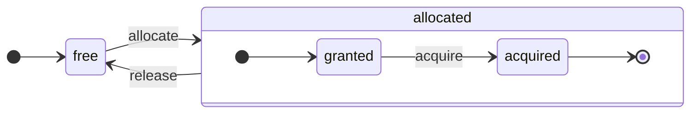

ClickHouse — это настоящая столбцово-ориентированная СУБД. Данные хранятся по столбцам, а при выполнении запросов обрабатываются массивами (векторами или фрагментами столбцов).
Когда это возможно, операции выполняются над массивами, а не над отдельными значениями.
Это называется «векторизованным выполнением запросов» и помогает снизить затраты на непосредственную обработку данных.

Эта идея не нова.
Она восходит к `APL` (язык программирования, 1957) и его потомкам: `A +` (диалект APL), `J` (1990), `K` (1993) и `Q` (язык программирования от Kx Systems, 2003).
Программирование массивов используется при обработке научных данных. Для реляционных баз данных эта идея тоже не нова. Например, она используется в системе `VectorWise` (также известной как Actian Vector Analytic Database от Actian Corporation).

Существует два разных подхода к ускорению обработки запросов: векторизованное выполнение запросов и генерация кода во время выполнения. Последний устраняет все уровни косвенности и динамическую диспетчеризацию. Ни один из этих подходов не является безусловно лучшим. Генерация кода во время выполнения может быть эффективнее, когда она объединяет множество операций, за счёт чего полностью задействуются исполнительные блоки CPU и конвейер. Векторизованное выполнение запросов может быть менее практичным, поскольку требует временных векторов, которые нужно записывать в кэш и затем считывать обратно. Если временные данные не помещаются в кэш L2, это становится проблемой. Но векторизованное выполнение запросов легче использует SIMD-возможности CPU. [Научная статья](http://15721.courses.cs.cmu.edu/spring2016/papers/p5-sompolski.pdf), написанная нашими друзьями, показывает, что лучше сочетать оба подхода. ClickHouse использует векторизованное выполнение запросов и имеет ограниченную начальную поддержку генерации кода во время выполнения.

  ## Столбцы

Интерфейс `IColumn` используется для представления столбцов в памяти (точнее, фрагментов столбцов). Этот интерфейс предоставляет вспомогательные методы для реализации различных реляционных операторов. Почти все операции иммутабельны: они не изменяют исходный столбец, а создают новый, изменённый. Например, метод `IColumn :: filter` принимает байтовую маску фильтра. Он используется для реляционных операторов `WHERE` и `HAVING`. Другие примеры: метод `IColumn :: permute` для поддержки `ORDER BY` и метод `IColumn :: cut` для поддержки `LIMIT`.

Различные реализации `IColumn` (`ColumnUInt8`, `ColumnString` и так далее) отвечают за структуру столбцов в памяти. Обычно эта структура представляет собой непрерывный массив. Для столбцов целочисленного типа это просто один непрерывный массив, как `std :: vector`. Для столбцов `String` и `Array` это два вектора: один — для всех элементов массива, расположенных подряд, и второй — для смещений до начала каждого массива. Также существует `ColumnConst`, который хранит в памяти только одно значение, но выглядит как столбец.

  ## Field

Тем не менее, можно работать и с отдельными значениями. Для представления отдельного значения используется `Field`. `Field` — это просто размеченное объединение типов `UInt64`, `Int64`, `Float64`, `String` и `Array`. У `IColumn` есть метод `operator []`, чтобы получить n-е значение в виде `Field`, а также метод `insert`, чтобы добавить `Field` в конец столбца. Эти методы не слишком эффективны, поскольку требуют работы с временными объектами `Field`, представляющими отдельное значение. Есть и более эффективные методы, такие как `insertFrom`, `insertRangeFrom` и так далее.

`Field` не содержит достаточно информации о конкретном типе данных в таблице. Например, `UInt8`, `UInt16`, `UInt32` и `UInt64` в `Field` все представлены как `UInt64`.

  ## Протекающие абстракции

`IColumn` содержит методы для типичных реляционных преобразований данных, но они не покрывают всех потребностей. Например, у `ColumnUInt64` нет метода для вычисления суммы двух столбцов, а у `ColumnString` — метода для поиска подстроки. Множество таких процедур реализуется вне `IColumn`.

Различные функции для столбцов можно реализовать универсальным, но неэффективным способом, используя методы `IColumn` для извлечения значений `Field`, либо специализированным способом — опираясь на знание внутренней структуры памяти данных в конкретной реализации `IColumn`. Для этого выполняют приведение к конкретному типу `IColumn` и напрямую работают с внутренним представлением. Например, у `ColumnUInt64` есть метод `getData`, который возвращает ссылку на внутренний массив, после чего отдельная процедура читает или заполняет этот массив напрямую. Мы используем «протекающие абстракции», чтобы обеспечить эффективные специализации различных процедур.

  ## Типы данных

`IDataType` отвечает за сериализацию и десериализацию: чтение и запись фрагментов столбцов или отдельных значений в бинарной или текстовой форме. `IDataType` напрямую соответствует типам данных в таблицах. Например, существуют `DataTypeUInt32`, `DataTypeDateTime`, `DataTypeString` и так далее.

`IDataType` и `IColumn` лишь слабо связаны между собой. Разные типы данных могут быть представлены в памяти одними и теми же реализациями `IColumn`. Например, и `DataTypeUInt32`, и `DataTypeDateTime` представлены как `ColumnUInt32` или `ColumnConstUInt32`. Кроме того, один и тот же тип данных может быть представлен разными реализациями `IColumn`. Например, `DataTypeUInt8` может быть представлен как `ColumnUInt8` или `ColumnConstUInt8`.

`IDataType` хранит только метаданные. Например, `DataTypeUInt8` вообще ничего не хранит (кроме виртуального указателя `vptr`), а `DataTypeFixedString` хранит только `N` (размер строк фиксированной длины).

У `IDataType` есть вспомогательные методы для различных форматов данных. Например, методы для сериализации значения с возможным заключением в кавычки, для сериализации значения в JSON и для сериализации значения как части формата XML. Прямого соответствия форматам данных здесь нет. Например, разные форматы данных `Pretty` и `TabSeparated` могут использовать один и тот же вспомогательный метод `serializeTextEscaped` из интерфейса `IDataType`.

  ## Block

`Block` — это контейнер, представляющий подмножество (фрагмент) таблицы в памяти. По сути, это набор троек: `(IColumn, IDataType, column name)`. Во время выполнения запроса данные обрабатываются в `Block`. Если у нас есть `Block`, значит, у нас есть данные (в объекте `IColumn`), информация об их типе (в `IDataType`), которая определяет, как работать с этим столбцом, и имя столбца. Это может быть как исходное имя столбца из таблицы, так и некоторое искусственное имя, присвоенное для получения временных результатов вычислений.

Когда мы вычисляем какую-либо функцию над столбцами в блоке, мы добавляем в блок ещё один столбец с результатом и не затрагиваем столбцы, которые выступают аргументами функции, поскольку операции неизменяемы. Позже ненужные столбцы можно удалить из блока, но не изменить. Это удобно для устранения общих подвыражений.

Блоки создаются для каждого обрабатываемого фрагмента данных. Обратите внимание, что для одного и того же типа вычислений имена и типы столбцов остаются одинаковыми в разных блоках, а меняются только данные столбцов. Данные блока лучше отделять от заголовка блока, потому что при небольшом размере блоков возникают значительные накладные расходы из-за временных строк при копировании `shared_ptr` и имён столбцов.

  ## Процессоры

См. описание в [https://github.com/ClickHouse/ClickHouse/blob/master/src/Processors/IProcessor.h](https://github.com/ClickHouse/ClickHouse/blob/master/src/Processors/IProcessor.h).

  ## Форматы

Форматы данных реализованы через процессоры.

  ## Ввод/вывод

Для побайтового ввода/вывода существуют абстрактные классы `ReadBuffer` и `WriteBuffer`. Они используются вместо C++ `iostream`. Не беспокойтесь: в любом зрелом C++-проекте по веским причинам используют что-то другое, а не `iostream`.

`ReadBuffer` и `WriteBuffer` — это просто непрерывный буфер и курсор, указывающий на позицию в этом буфере. Реализации могут как владеть памятью буфера, так и не владеть ею. Есть виртуальный метод для заполнения буфера следующей порцией данных (для `ReadBuffer`) или для сброса буфера куда-либо (для `WriteBuffer`). Эти виртуальные методы вызываются редко.

Реализации `ReadBuffer`/`WriteBuffer` используются для работы с файлами, файловыми дескрипторами и сетевыми сокетами, для реализации сжатия (`CompressedWriteBuffer` инициализируется другим `WriteBuffer` и выполняет сжатие перед записью данных в него), а также для других целей — названия `ConcatReadBuffer`, `LimitReadBuffer` и `HashingWriteBuffer` говорят сами за себя.

`ReadBuffer`/`WriteBuffer` работают только с байтами. В заголовочных файлах `ReadHelpers` и `WriteHelpers` есть функции, помогающие с форматированием ввода/вывода. Например, есть вспомогательные функции для записи числа в десятичном формате.

Рассмотрим, что происходит, когда вы хотите записать результирующий набор в формате `JSON` в stdout.
У вас уже есть результирующий набор, готовый к извлечению из pull-`QueryPipeline`.
Сначала вы создаёте `WriteBufferFromFileDescriptor(STDOUT_FILENO)`, чтобы записывать байты в stdout.
Затем вы подключаете результат из конвейера запроса к `JSONRowOutputFormat`, который инициализируется этим `WriteBuffer`, чтобы записывать строки в формате `JSON` в stdout.
Это можно сделать с помощью метода `complete`, который превращает pull-`QueryPipeline` в завершённый `QueryPipeline`.
Внутри `JSONRowOutputFormat` записывает различные JSON-разделители и вызывает метод `IDataType::serializeTextJSON`, передавая ссылку на `IColumn` и номер строки в качестве аргументов. В свою очередь, `IDataType::serializeTextJSON` вызывает метод из `WriteHelpers.h`: например, `writeText` для числовых типов и `writeJSONString` для `DataTypeString`.

  ## Таблицы

Интерфейс `IStorage` представляет таблицы. Разные реализации этого интерфейса соответствуют разным движкам таблиц. Например, `StorageMergeTree`, `StorageMemory` и так далее. Экземпляры этих классов — это и есть таблицы.

Ключевые методы в `IStorage` — `read` и `write`, а также другие, такие как `alter`, `rename` и `drop`. Метод `read` принимает следующие аргументы: набор столбцов для чтения из таблицы, `AST` запроса, который нужно учитывать, и требуемое количество потоков. Он возвращает `Pipe`.

В большинстве случаев метод `read` отвечает только за чтение указанных столбцов из таблицы, а не за какую-либо дальнейшую обработку данных.
Вся последующая обработка данных выполняется другой частью конвейера и не входит в зону ответственности `IStorage`.

Но есть важные исключения:

* `AST` запроса передается в метод `read`, и движок таблицы может использовать его, чтобы определить, как использовать индексы, и считать из таблицы меньше данных.
* Иногда движок таблицы может сам обработать данные до определенной стадии. Например, `StorageDistributed` может отправить запрос на удаленные серверы, поручить им обработать данные до стадии, на которой данные с разных удаленных серверов можно объединить, и вернуть эти предварительно обработанные данные. Затем интерпретатор запроса завершает обработку данных.

Метод `read` таблицы может возвращать `Pipe`, состоящий из нескольких `Processors`. Эти `Processors` могут читать из таблицы параллельно.
Затем вы можете соединить эти процессоры с различными другими преобразованиями (например, вычислением выражений или фильтрацией), которые можно выполнять независимо.
А затем создать поверх них `QueryPipeline` и выполнить его через `PipelineExecutor`.

Также существуют `TableFunction`s. Это функции, которые возвращают временный объект `IStorage` для использования в предложении `FROM` запроса.

Чтобы быстро понять, как реализовать собственный движок таблицы, посмотрите на что-нибудь простое, например `StorageMemory` или `StorageTinyLog`.

> В результате выполнения метода `read` `IStorage` возвращает `QueryProcessingStage` — информацию о том, какие части запроса уже были вычислены внутри хранилища.

  ## Парсеры

Рукописный рекурсивный нисходящий парсер разбирает запрос. Например, `ParserSelectQuery` просто рекурсивно вызывает базовые парсеры для различных частей запроса. Парсеры создают `AST`. `AST` представляется узлами, которые являются экземплярами `IAST`.

> Генераторы парсеров не используются по историческим причинам.

  ## Интерпретаторы

Интерпретаторы отвечают за построение конвейера выполнения запроса из AST. Есть простые интерпретаторы, такие как `InterpreterExistsQuery` и `InterpreterDropQuery`, а также более сложный `InterpreterSelectQuery`.

Конвейер выполнения запроса — это совокупность процессоров, которые могут принимать и выдавать фрагменты (наборы столбцов с определёнными типами).
Процессор взаимодействует через порты и может иметь несколько входных и несколько выходных портов.
Более подробное описание можно найти в [src/Processors/IProcessor.h](https://github.com/ClickHouse/ClickHouse/blob/master/src/Processors/IProcessor.h).

Например, результатом интерпретации запроса `SELECT` является &quot;pulling&quot; `QueryPipeline`, у которого есть специальный выходной порт для чтения результирующего набора.
Результатом запроса `INSERT` является &quot;pushing&quot; `QueryPipeline` со входным портом для записи данных на вставку.
А результатом интерпретации запроса `INSERT SELECT` является &quot;completed&quot; `QueryPipeline`, у которого нет ни входов, ни выходов, но который одновременно копирует данные из `SELECT` в `INSERT`.

`InterpreterSelectQuery` использует механизмы `ExpressionAnalyzer` и `ExpressionActions` для анализа и преобразования запросов. Именно здесь выполняется большая часть оптимизаций запросов на основе правил. `ExpressionAnalyzer` довольно запутан и должен быть переписан: различные преобразования и оптимизации запросов следует вынести в отдельные классы, чтобы обеспечить модульное преобразование запросов.

Для решения существующих в интерпретаторах проблем был разработан новый `InterpreterSelectQueryAnalyzer`. Это новая версия `InterpreterSelectQuery`, которая не использует `ExpressionAnalyzer` и вводит дополнительный уровень абстракции между `AST` и `QueryPipeline`, называемый `QueryTree`. Она полностью готова к использованию в продукционной среде, но на всякий случай её можно отключить, установив значение настройки `enable_analyzer` в `false`.

  ## Функции

Существуют обычные и агрегатные функции. Об агрегатных функциях см. в следующем разделе.

Обычные функции не изменяют количество строк — они работают так, как если бы обрабатывали каждую строку независимо. На самом деле функции вызываются не для отдельных строк, а для блоков данных `Block`, чтобы реализовать векторизованное выполнение запросов.

Есть несколько специальных функций, таких как [blockSize](/ru/reference/functions/regular-functions/other-functions#blockSize), [rowNumberInBlock](/ru/reference/functions/regular-functions/other-functions#rowNumberInBlock) и [runningAccumulate](/ru/reference/functions/regular-functions/other-functions#runningAccumulate), которые используют обработку блоков и нарушают независимость строк.

В ClickHouse строгая типизация, поэтому неявного преобразования типов нет. Если функция не поддерживает конкретную комбинацию типов, она генерирует исключение. Но функции могут работать (иметь перегрузки) для множества разных комбинаций типов. Например, функция `plus` (реализующая оператор `+`) работает с любой комбинацией числовых типов: `UInt8` + `Float32`, `UInt16` + `Int8` и так далее. Кроме того, некоторые вариативные функции могут принимать любое количество аргументов, например `concat`.

Реализация функции может быть несколько неудобной, потому что функция явно выполняет диспетчеризацию по поддерживаемым типам данных и поддерживаемым `IColumns`. Например, для функции `plus` код генерируется инстанцированием шаблона C++ для каждой комбинации числовых типов, а также для константных и неконстантных левых и правых аргументов.

Это отличное место для реализации генерации кода во время выполнения, чтобы избежать разрастания шаблонного кода. Кроме того, это позволяет добавлять составные функции, такие как fused multiply-add, или выполнять несколько сравнений за одну итерацию цикла.

Из-за векторизованного выполнения запросов функции не используют короткое замыкание. Например, если вы пишете `WHERE f(x) AND g(y)`, вычисляются обе части, даже для строк, где `f(x)` равно нулю (кроме случая, когда `f(x)` — константное выражение, равное нулю). Но если селективность условия `f(x)` высока, а вычисление `f(x)` значительно дешевле, чем `g(y)`, лучше реализовать вычисление в несколько проходов. Сначала вычисляется `f(x)`, затем столбцы фильтруются по результату, и только после этого `g(y)` вычисляется лишь для меньших, отфильтрованных фрагментов данных.

  ## Агрегатные функции

Агрегатные функции — это функции с сохранением состояния. Они накапливают переданные значения в некотором состоянии и позволяют получать из него результаты. Работа с ними осуществляется через интерфейс `IAggregateFunction`. Состояния могут быть довольно простыми (состояние `AggregateFunctionCount` — это всего лишь одно значение `UInt64`) или весьма сложными (состояние `AggregateFunctionUniqCombined` представляет собой комбинацию линейного массива, хеш-таблицы и вероятностной структуры данных `HyperLogLog`).

Состояния выделяются в `Arena` (пуле памяти), чтобы можно было работать с множеством состояний при выполнении запроса `GROUP BY` с высокой мощностью. У состояний могут быть нетривиальные конструктор и деструктор: например, сложные состояния агрегации могут сами выделять дополнительную память. Поэтому нужно внимательно относиться к созданию и уничтожению состояний, а также к корректной передаче владения ими и порядку их уничтожения.

Состояния агрегации можно сериализовать и десериализовать для передачи по сети во время выполнения распределённого запроса или для записи на диск, когда оперативной памяти недостаточно. Их даже можно хранить в таблице с `DataTypeAggregateFunction`, чтобы обеспечить инкрементальную агрегацию данных.

> Формат сериализованных данных для состояний агрегатных функций сейчас не версионируется. Это нормально, если состояния агрегатных функций хранятся только временно. Но у нас есть движок таблицы `AggregatingMergeTree` для инкрементальной агрегации, и его уже используют в продакшене. Поэтому при любых будущих изменениях сериализованного формата любой агрегатной функции необходимо обеспечивать обратную совместимость.

  ## Сервер

Сервер реализует несколько различных интерфейсов:

* HTTP-интерфейс для любых сторонних клиентов.
* TCP-интерфейс для нативного клиента ClickHouse и межсерверного взаимодействия при выполнении распределённого запроса.
* Интерфейс для передачи данных при репликации.

По своей сути это просто примитивный многопоточный сервер без сопрограмм и файберов. Сервер рассчитан не на обработку большого потока простых запросов, а на обработку сравнительно небольшого числа сложных запросов, каждый из которых может обрабатывать огромный объём данных для аналитики.

Сервер инициализирует класс `Context`, предоставляя необходимое окружение для выполнения запроса: список доступных баз данных, пользователей и прав доступа, настройки, кластеры, список процессов, журнал запросов и так далее. Интерпретаторы используют это окружение.

Мы поддерживаем полную обратную и прямую совместимость TCP-протокола сервера: старые клиенты могут работать с новыми серверами, а новые клиенты — со старыми серверами. Но мы не хотим поддерживать её вечно и прекращаем поддержку старых версий примерно через год.

<Note>
  Для большинства внешних приложений мы рекомендуем использовать HTTP-интерфейс, потому что он прост и удобен. TCP-протокол теснее связан с внутренними структурами данных: он использует внутренний формат для передачи блоков данных и собственный механизм кадрирования для сжатых данных.
</Note>

  ## Конфигурация

ClickHouse Server основан на библиотеках POCO C++ и использует `Poco::Util::AbstractConfiguration` для представления своей конфигурации. Конфигурация хранится в классе `Poco::Util::ServerApplication`, от которого наследуется класс `DaemonBase`, а от него, в свою очередь, — класс `DB::Server`, реализующий сам `clickhouse-server`. Поэтому доступ к конфигурации можно получить через метод `ServerApplication::config()`.

Конфигурация считывается из нескольких файлов (в формате XML или YAML) и объединяется в единый объект `AbstractConfiguration` классом `ConfigProcessor`. Конфигурация загружается при запуске сервера и впоследствии может быть перезагружена, если один из файлов конфигурации был обновлён, удалён или добавлен. Класс `ConfigReloader` отвечает как за периодическое отслеживание этих изменений, так и за саму процедуру перезагрузки. Запрос `SYSTEM RELOAD CONFIG` также запускает перезагрузку конфигурации.

Для запросов и подсистем, отличных от `Server`, конфигурация доступна через метод `Context::getConfigRef()`. Каждая подсистема, способная перезагружать свою конфигурацию без перезапуска сервера, должна зарегистрироваться в callback перезагрузки в методе `Server::main()`. Обратите внимание: если в новой конфигурации есть ошибка, большинство подсистем проигнорируют её, запишут предупреждение в лог и продолжат работать с ранее загруженной конфигурацией. Из-за особенностей `AbstractConfiguration` невозможно передать ссылку на конкретный раздел, поэтому вместо этого обычно используется `String config_prefix`.

  ### Контекст

ClickHouse управляет настройками через иерархию контекстов:

* **Глобальный контекст** - общесерверные настройки, заданные в файлах конфигурации
* **Контекст сеанса** - настройки пользовательского сеанса из профилей, конфигурации пользователя и команд SET
* **Контекст запроса** - настройки на уровне запроса из предложения SETTINGS
* **Фоновый контекст** - общесерверные настройки для фоновых операций (Mutate, Merge), заданные через профиль &#39;background&#39;

При планировании операции (запроса, мутации и т. д.) сервер формирует соответствующий контекст, объединяя настройки в следующем порядке (последующие разделы переопределяют предыдущие):

1. Глобальные значения по умолчанию
2. Глобальная конфигурация
3. Настройки профиля (из раздела `<profiles>`)
4. Настройки пользователя (из раздела `<users>`)
5. Настройки сеанса (из команды SET)
6. Настройки запроса (из предложения SETTINGS)

<Note>
  Фоновые операции можно настраивать через глобальные настройки и настройки профиля &#39;background&#39;; настройки сеанса и запроса в этом случае не применяются. Если явная конфигурация не задана, она наследуется из глобального контекста. Имя профиля по умолчанию для таких операций — &#39;background&#39;; его можно переопределить с помощью настройки сервера `background_profile`.
</Note>

  ## Потоки и задания

Для выполнения запросов и побочных операций ClickHouse выделяет потоки из одного из пулов потоков, чтобы избежать частого создания и уничтожения потоков. Существует несколько пулов потоков, которые выбираются в зависимости от назначения и структуры задания:

* Серверный пул для входящих клиентских сеансов.
* Глобальный пул потоков для заданий общего назначения, фоновых операций и автономных потоков.
* Пул потоков IO для заданий, которые в основном блокируются на операциях IO и не создают высокой нагрузки на CPU.
* Фоновые пулы для периодических задач.
* Пулы для вытесняемых задач, которые можно разбить на шаги.

Серверный пул — это экземпляр класса `Poco::ThreadPool`, определённый в методе `Server::main()`. Он может содержать не более `max_connection` потоков. Каждый поток закрепляется за одним активным соединением.

Глобальный пул потоков — это singleton-класс `GlobalThreadPool`. Для выделения потока из него используется `ThreadFromGlobalPool`. У него интерфейс, похожий на `std::thread`, но он берёт поток из глобального пула и выполняет всю необходимую инициализацию. Он настраивается следующими параметрами:

* `max_thread_pool_size` - ограничение на количество потоков в пуле.
* `max_thread_pool_free_size` - ограничение на количество бездействующих потоков, ожидающих новые задания.
* `thread_pool_queue_size` - ограничение на количество запланированных заданий.

Глобальный пул универсален, и все описанные ниже пулы реализованы поверх него. Это можно представить как иерархию пулов. Любой специализированный пул берёт свои потоки из глобального пула с помощью класса `ThreadPool`. Поэтому основная задача любого специализированного пула — ограничивать количество одновременно выполняемых заданий и планировать их выполнение. Если запланировано больше заданий, чем потоков в пуле, `ThreadPool` накапливает задания в очереди с приоритетами. Каждое задание имеет целочисленный приоритет. Приоритет по умолчанию — ноль. Все задания с более высоким приоритетом запускаются раньше любых заданий с более низким приоритетом. Но между уже выполняющимися заданиями различий нет, поэтому приоритет важен только тогда, когда пул перегружен.

Пул потоков IO реализован как обычный `ThreadPool`, доступный через метод `IOThreadPool::get()`. Он настраивается так же, как и глобальный пул, с помощью параметров `max_io_thread_pool_size`, `max_io_thread_pool_free_size` и `io_thread_pool_queue_size`. Основное назначение пула потоков IO — не допустить исчерпания глобального пула заданиями IO, что могло бы помешать запросам полностью использовать CPU. Backup в S3 выполняет значительный объём операций IO, и, чтобы избежать влияния на интерактивные запросы, существует отдельный `BackupsIOThreadPool`, настраиваемый параметрами `max_backups_io_thread_pool_size`, `max_backups_io_thread_pool_free_size` и `backups_io_thread_pool_queue_size`.

Для выполнения периодических задач существует класс `BackgroundSchedulePool`. Вы можете регистрировать задачи с помощью объектов `BackgroundSchedulePool::TaskHolder`, и пул гарантирует, что для одной задачи не будут одновременно выполняться два задания. Он также позволяет отложить выполнение задачи до определённого момента в будущем или временно деактивировать задачу. Глобальный `Context` предоставляет несколько экземпляров этого класса для разных целей. Для задач общего назначения используется `Context::getSchedulePool()`.

Существуют также специализированные пулы потоков для вытесняемых задач. Такую задачу `IExecutableTask` можно разбить на упорядоченную последовательность заданий, называемых шагами. Для планирования этих задач так, чтобы короткие задачи получали приоритет перед длинными, используется `MergeTreeBackgroundExecutor`. Как следует из названия, он используется для фоновых операций, связанных с MergeTree, таких как слияния, Мутации, загрузка и перемещения. Экземпляры пула доступны через `Context::getCommonExecutor()` и другие аналогичные методы.

Независимо от того, какой пул используется для задания, при запуске для него создаётся экземпляр `ThreadStatus`. Он инкапсулирует всю информацию, относящуюся к потоку: идентификатор потока, идентификатор запроса, счётчики производительности, потребление ресурсов и многие другие полезные данные. Задание может получить к нему доступ через локальный для потока указатель с помощью вызова `CurrentThread::get()`, поэтому его не нужно передавать в каждую функцию.

Если поток связан с выполнением запроса, то самым важным объектом, привязанным к `ThreadStatus`, является контекст запроса `ContextPtr`. У каждого запроса есть свой мастер-поток в серверном пуле. Мастер-поток выполняет эту привязку, удерживая объект `ThreadStatus::QueryScope query_scope(query_context)`. Мастер-поток также создаёт группу потоков, представленную объектом `ThreadGroupStatus`. Каждый дополнительный поток, выделенный во время выполнения этого запроса, присоединяется к своей группе потоков вызовом `CurrentThread::attachTo(thread_group)`. Группы потоков используются для агрегирования счётчиков событий профиля и отслеживания потребления памяти всеми потоками, выделенными для одной задачи (см. классы `MemoryTracker` и `ProfileEvents::Counters` для получения дополнительной информации).

  ## Контроль параллелизма

Запрос, который можно распараллелить, использует настройку `max_threads`, чтобы ограничить количество используемых потоков. Значение по умолчанию для этой настройки подбирается так, чтобы один запрос мог максимально эффективно задействовать все ядра CPU. Но что, если одновременно выполняется несколько запросов и каждый из них использует значение `max_threads` по умолчанию? Тогда запросы будут делить между собой ресурсы CPU. ОС будет обеспечивать справедливое распределение, постоянно переключая потоки, что приводит к некоторым потерям производительности. `ConcurrencyControl` помогает уменьшить эти потери и избежать выделения слишком большого числа потоков. Параметр конфигурации `concurrent_threads_soft_limit_num` используется для ограничения количества параллельных потоков, которое может быть выделено до применения некоторого давления на CPU.

Вводится понятие CPU `slot`. Слот — это единица параллелизма: чтобы запустить поток, запрос должен заранее получить слот и освободить его, когда поток завершится. Количество слотов глобально ограничено на сервере. Несколько одновременно выполняющихся запросов конкурируют за слоты CPU, если суммарная потребность превышает общее число слотов. `ConcurrencyControl` отвечает за разрешение этой конкуренции, справедливо планируя слоты CPU.

Каждый слот можно рассматривать как независимый конечный автомат со следующими состояниями:

* `free`: слот доступен для выделения любому запросу.
* `granted`: слот `allocated` для конкретного запроса, но еще не захвачен ни одним потоком.
* `acquired`: слот `allocated` для конкретного запроса и уже захвачен потоком.

Обратите внимание, что слот `allocated` может находиться в двух разных состояниях: `granted` и `acquired`. Первое — это переходное состояние, которое в норме должно быть коротким (с момента выделения слота запросу до момента, когда любой поток этого запроса запускает процедуру масштабирования вверх).

API `ConcurrencyControl` состоит из следующих функций:

1. Создать выделение ресурсов для запроса: `auto slots = ConcurrencyControl::instance().allocate(1, max_threads);`. Будет выделен как минимум 1 и как максимум `max_threads` слот. Обратите внимание, что первый слот предоставляется сразу, а остальные слоты могут быть предоставлены позже. Таким образом, это мягкое ограничение, поскольку каждый запрос получит как минимум один поток.
2. Для каждого потока необходимо получить слот из выделения: `while (auto slot = slots->tryAcquire()) spawnThread([slot = std::move(slot)] { ... });`.
3. Обновить общее количество слотов: `ConcurrencyControl::setMaxConcurrency(concurrent_threads_soft_limit_num)`. Это можно сделать во время работы, без перезапуска сервера.

Этот API позволяет запросам запускаться как минимум с одним потоком (при высокой нагрузке на CPU), а затем масштабироваться до `max_threads`.

  ## Выполнение распределённого запроса

Серверы в кластерной конфигурации в основном независимы друг от друга. Вы можете создать `Distributed` таблицу на одном или на всех серверах кластера. `Distributed` таблица сама не хранит данные — она лишь предоставляет «представление» всех локальных таблиц на нескольких узлах кластера. Когда вы выполняете SELECT из `Distributed` таблицы, она преобразует запрос, выбирает удалённые узлы в соответствии с настройками балансировки нагрузки и отправляет им запрос. `Distributed` таблица запрашивает у удалённых серверов обработку запроса только до стадии, на которой промежуточные результаты с разных серверов можно объединить. Затем она получает эти промежуточные результаты и объединяет их. `Distributed` таблица старается перенести на удалённые серверы как можно больше работы и не передавать по сети большие объёмы промежуточных данных.

Всё становится сложнее, когда в секциях IN или JOIN есть подзапросы, и каждый из них использует `Distributed` таблицу. Для выполнения таких запросов есть разные стратегии.

Глобального плана запроса для выполнения распределённого запроса не существует. У каждого узла есть свой локальный план запроса для своей части задачи. Сейчас доступно только простое одноэтапное выполнение распределённого запроса: мы отправляем запросы на удалённые узлы, а затем объединяем результаты. Но такой подход неприменим для сложных запросов с `GROUP BY` высокой мощности или с большим объёмом временных данных для JOIN. В таких случаях нужно «перетасовывать» данные между серверами, а это требует дополнительной координации. ClickHouse не поддерживает такой тип выполнения запросов, и нам ещё предстоит поработать над этим.

  ## Merge tree

`MergeTree` — это семейство движков хранения, поддерживающее индексирование по первичному ключу. Первичный ключ может представлять собой произвольный кортеж столбцов или выражений. Данные в таблице `MergeTree` хранятся в &quot;частях&quot;. Каждая часть хранит данные в порядке первичного ключа, поэтому данные упорядочены лексикографически по кортежу первичного ключа. Все столбцы таблицы хранятся в отдельных файлах `column.bin` внутри этих частей. Файлы состоят из сжатых блоков. Каждый блок обычно содержит от 64 КБ до 1 МБ несжатых данных, в зависимости от среднего размера значения. Блоки состоят из значений столбца, расположенных подряд. Значения в каждом столбце идут в одном и том же порядке (его задаёт первичный ключ), поэтому при проходе по нескольким столбцам вы получаете значения соответствующих строк.

Сам первичный ключ является &quot;разреженным&quot;. Он адресует не каждую отдельную строку, а только некоторые диапазоны данных. В отдельном файле `primary.idx` хранится значение первичного ключа для каждой N-й строки, где N называется `index_granularity` (обычно N = 8192). Кроме того, для каждого столбца есть файлы `column.mrk` с &quot;метками&quot;, которые представляют собой смещения до каждой N-й строки в файле данных. Каждая метка — это пара: смещение в файле до начала сжатого блока и смещение в распакованном блоке до начала данных. Обычно сжатые блоки выровнены по меткам, и смещение в распакованном блоке равно нулю. Данные для `primary.idx` всегда находятся в памяти, а данные из файлов `column.mrk` кэшируются.

Когда нужно что-то прочитать из части в `MergeTree`, мы смотрим на данные `primary.idx` и определяем диапазоны, которые могут содержать запрошенные данные, затем смотрим на данные `column.mrk` и вычисляем смещения, с которых нужно начинать чтение этих диапазонов. Из-за разреженности могут считываться лишние данные. ClickHouse не подходит для высокой нагрузки простыми точечными запросами, потому что для каждого ключа нужно прочитать весь диапазон из `index_granularity` строк, а для каждого столбца — распаковать весь сжатый блок. Мы сделали индекс разреженным, потому что должны иметь возможность поддерживать триллионы строк на одном сервере без заметного расхода памяти на индекс. Кроме того, поскольку первичный ключ разреженный, он не является уникальным: по нему нельзя проверить наличие ключа в таблице во время INSERT. В таблице может быть много строк с одним и тем же ключом.

Когда вы выполняете `INSERT` набора данных в `MergeTree`, этот набор сортируется по первичному ключу и образует новую часть. Фоновые потоки периодически выбирают несколько частей и сливают их в одну отсортированную часть, чтобы число частей оставалось относительно небольшим. Именно поэтому это называется `MergeTree`. Разумеется, слияние приводит к &quot;усилению записи&quot;. Все части неизменяемы: они только создаются и удаляются, но не изменяются. Когда выполняется SELECT, он удерживает снимок таблицы (набор частей). После слияния мы также некоторое время храним старые части, чтобы упростить восстановление после сбоя, поэтому, если мы видим, что какая-то слитая часть, вероятно, повреждена, мы можем заменить её исходными частями.

`MergeTree` — это не LSM-дерево, потому что оно не содержит MEMTABLE и LOG: вставленные данные записываются напрямую в файловую систему. Такое поведение делает MergeTree гораздо более подходящим для вставки данных батчами. Поэтому частая вставка небольшого количества строк для MergeTree неидеальна. Например, пара строк в секунду — это нормально, но делать это тысячу раз в секунду для MergeTree не оптимально. Однако для небольших вставок существует режим async insert, позволяющий обойти это ограничение. Мы сделали именно так ради простоты, а также потому, что в наших приложениях мы и так уже вставляем данные батчами

Существуют движки MergeTree, которые выполняют дополнительную работу во время фоновых слияний. Примеры — `CollapsingMergeTree` и `AggregatingMergeTree`. Это можно рассматривать как особую поддержку обновлений. Имейте в виду, что это не настоящие обновления, потому что пользователи обычно не контролируют время выполнения фоновых слияний, а данные в таблице `MergeTree` почти всегда хранятся более чем в одной части, а не в полностью слитом виде.

  ## Репликация

Репликацию в ClickHouse можно настраивать для каждой таблицы отдельно. На одном и том же сервере могут быть как реплицируемые, так и нереплицируемые таблицы. Таблицы также могут реплицироваться по-разному: например, одна таблица — с двукратной репликацией, а другая — с трехкратной.

Репликация реализована в движке `ReplicatedMergeTree`. Путь в `ZooKeeper` указывается как параметр этого движка. Все таблицы с одинаковым путем в `ZooKeeper` становятся репликами друг друга: они синхронизируют данные и поддерживают согласованность. Реплики можно динамически добавлять и удалять, просто создавая или удаляя таблицу.

Репликация использует асинхронную мультимастерную схему. Вы можете вставлять данные в любую реплику, у которой есть сеанс с `ZooKeeper`, и данные будут асинхронно реплицироваться на все остальные реплики. Поскольку ClickHouse не поддерживает UPDATE, репликация не создает конфликтов. Так как по умолчанию подтверждение вставок по кворуму отсутствует, только что вставленные данные могут быть потеряны при отказе одного из узлов. Кворум для вставки можно включить с помощью настройки `insert_quorum`.

Метаданные репликации хранятся в ZooKeeper. В журнале репликации перечислены действия, которые нужно выполнить. Это могут быть, например: получить часть, слить части, удалить партицию и так далее. Каждая реплика копирует журнал репликации в свою очередь, а затем выполняет действия из очереди. Например, при вставке в журнале создается действие «получить часть», и каждая реплика загружает эту часть. Слияния координируются между репликами, чтобы результаты были побайтно идентичными. На всех репликах все части сливаются одинаковым образом. Один из лидеров первым инициирует новое слияние и записывает в журнал действия «слить части». Несколько реплик (или даже все) могут одновременно быть лидерами. Можно запретить реплике становиться лидером с помощью настройки `merge_tree` `replicated_can_become_leader`. Лидеры отвечают за планирование фоновых слияний.

Репликация является физической: между узлами передаются только сжатые части, а не запросы. В большинстве случаев слияния выполняются на каждой реплике независимо, чтобы снизить сетевые затраты и избежать избыточного сетевого трафика. Крупные слитые части передаются по сети только при значительной задержке репликации.

Кроме того, каждая реплика хранит свое состояние в ZooKeeper в виде набора частей и их контрольных сумм. Когда состояние в локальной файловой системе расходится с эталонным состоянием в ZooKeeper, реплика восстанавливает согласованность, загружая отсутствующие и поврежденные части с других реплик. Если в локальной файловой системе есть какие-либо неожиданные или поврежденные данные, ClickHouse не удаляет их, а перемещает в отдельный каталог и перестает учитывать.

<Note>
  Кластер ClickHouse состоит из независимых сегментов, а каждый сегмент — из реплик. Кластер **не является эластичным**, поэтому после добавления нового сегмента данные не перебалансируются между сегментами автоматически. Вместо этого предполагается, что нагрузка в кластере будет распределена неравномерно. Такая реализация дает больше контроля и подходит для относительно небольших кластеров, например из нескольких десятков узлов. Но для кластеров из сотен узлов, которые мы используем в production, такой подход становится существенным недостатком. Нам следует реализовать движок таблицы, охватывающий весь кластер, с динамически реплицируемыми регионами, которые можно было бы автоматически разделять и балансировать между кластерами.
</Note>