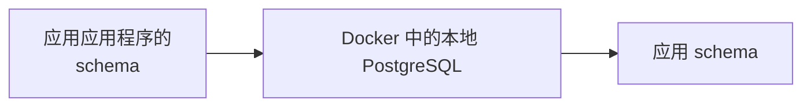

Managed Postgres 基于标准 PostgreSQL 构建，可与现有的 PostgreSQL 生态系统兼容。对于大多数开发任务，你可以直接基于在 Docker 中运行的本地 PostgreSQL 实例进行开发和测试，而无需使用云端部署。

这种方法能提供更快的反馈回路，简化 onboarding，减少对共享基础设施的依赖，并让你能够在不影响生产系统的情况下安全地进行试验。

目标并不是完全复制生产环境。相反，你应创建一个可复现的本地环境，并满足以下条件：

* 使用与生产环境相同的 PostgreSQL 主版本。
* 应用与生产环境相同的 schema 定义。
* 包含有代表性的开发数据。
* 支持常规的应用开发和测试工作流。

由于 Managed Postgres 是标准 PostgreSQL，现有的迁移框架、schema 管理工具以及数据填充方式都可以直接使用，无需修改。

<div id="example-development-flow">
  ## 开发流程示例
</div>

典型的本地开发流程如下：




Managed Postgres 可无缝融入现有的 PostgreSQL 开发工作流。针对本地 PostgreSQL 实例进行开发，团队可以快速迭代、保持环境可复现，并确保应用部署到 Managed Postgres 后也能保持一致的行为表现。

<div id="run-postgresql-locally-with-docker">
  ## 使用 Docker 在本地运行 PostgreSQL
</div>

创建本地开发环境最简单的方法，是在 Docker 中运行 PostgreSQL。

选择与您的 Managed Postgres 部署相对应的 PostgreSQL 版本：

```yaml title="docker-compose.yml"
services:
  postgres:
    image: postgres:18
    container_name: local-postgres
    restart: unless-stopped

    environment:
      POSTGRES_USER: postgres
      POSTGRES_PASSWORD: postgres
      POSTGRES_DB: app

    ports:
      - "15432:5432"

    volumes:
      - postgres_data:/var/lib/postgresql

volumes:
  postgres_data:
```

启动 PostgreSQL：

```bash
docker compose up -d
```

验证连接性：

```bash
psql -h localhost -U postgres -p 15432 -d app
```

此时，PostgreSQL 已在本地运行，但其中还没有应用程序 schema，也没有任何开发用数据。

<div id="apply-the-application-schema">
  ## 应用应用程序的 schema
</div>

在本地环境中创建 schema 并没有唯一的固定方法。大多数组织都已有成熟的 schema 管理工作流，可直接沿用。

<div id="application-migrations">
  ### 应用迁移
</div>

许多团队会在预发环境和生产环境中使用同一套迁移框架——例如 Flyway、Liquibase、Rails migrations、Django migrations、Prisma migrations 或 Alembic。

在本地执行迁移，可确保 schema 的演进作为日常开发的一部分持续得到测试：

```bash
./migrate up
# 或
npm run migrate
# 或
rails db:migrate
```

<div id="schema-only-postgresql-dumps">
  ### 仅包含 schema 的 PostgreSQL 转储
</div>

仅包含 schema 的 PostgreSQL 导出可以重现现有数据库的结构。这对于环境引导、研究 schema 的行为、验证兼容性，或快速搭建开发环境都很有用。

导出 schema：

```bash
pg_dump \
  --schema-only \
  --no-owner \
  --no-privileges \
  -h <host> \
  -U <user> \
  -d <database> \
  > schema.sql
```

本地恢复：

```bash
psql \
  -h localhost \
  -U postgres \
  -p 15432    \
  -d app \
  -f schema.sql
```

<div id="checked-in-sql-definitions">
  ### 已提交到版本库的 SQL 定义
</div>

有些团队会将 schema 定义直接作为 SQL 文件维护在源代码版本库中。这些定义可以在环境搭建期间直接应用到本地 PostgreSQL 实例。

无论采用哪种方式，关键结果都是：schema 的创建实现了自动化、可复现，并且基于版本控制中的定义。

<div id="populate-representative-development-data">
  ## 填充具有代表性的开发数据
</div>

schema 创建完成后，使用具有代表性的开发数据填充数据库。

对于大多数开发工作流，通过种子脚本生成的合成数据集已经足够。它们易于重新生成、可安全分发，并且能避免使用生产数据时涉及的合规与安全问题。

对于 SaaS 应用，一种常见做法是为少量样本租户生成数据，并在用户、产品、订单及其他业务实体之间构建逼真的关联关系。

<div id="example-multi-tenant-schema">
  ### 多租户 schema 示例
</div>

以下 schema 展示了一个简化的多租户 SaaS 应用：

```sql
CREATE TABLE tenants (
    id UUID PRIMARY KEY,
    name TEXT NOT NULL
);

CREATE TABLE users (
    id UUID PRIMARY KEY,
    tenant_id UUID NOT NULL REFERENCES tenants(id),
    email TEXT NOT NULL,
    first_name TEXT,
    last_name TEXT,
    created_at TIMESTAMP DEFAULT now()
);

CREATE TABLE products (
    id UUID PRIMARY KEY,
    tenant_id UUID NOT NULL REFERENCES tenants(id),
    name TEXT NOT NULL,
    price NUMERIC(10,2)
);

CREATE TABLE orders (
    id UUID PRIMARY KEY,
    tenant_id UUID NOT NULL REFERENCES tenants(id),
    user_id UUID NOT NULL REFERENCES users(id),
    status TEXT,
    created_at TIMESTAMP DEFAULT now()
);

CREATE TABLE order_items (
    id UUID PRIMARY KEY,
    order_id UUID NOT NULL REFERENCES orders(id),
    product_id UUID NOT NULL REFERENCES products(id),
    quantity INTEGER
);

CREATE TABLE audit_logs (
    id UUID PRIMARY KEY,
    tenant_id UUID NOT NULL REFERENCES tenants(id),
    entity_type TEXT,
    entity_id UUID,
    action TEXT,
    created_at TIMESTAMP DEFAULT now()
);
```

<div id="generate-sample-data">
  ### 生成样本数据
</div>

安装依赖：

```bash
pip install faker psycopg2-binary
```

创建一个名为 `seed.py` 的文件：

```python title="seed.py"
import random
import uuid

import psycopg2
from faker import Faker

fake = Faker()

conn = psycopg2.connect(
    host="localhost",
    port=15432,
    dbname="app",
    user="postgres",
    password="postgres"
)

cur = conn.cursor()

tenant_ids = []

for tenant_name in [
    "Tenant A",
    "Tenant B",
    "Tenant C"
]:
    tenant_id = str(uuid.uuid4())
    tenant_ids.append(tenant_id)

    cur.execute(
        """
        INSERT INTO tenants(id, name)
        VALUES (%s, %s)
        """,
        (tenant_id, tenant_name)
    )

for tenant_id in tenant_ids:

    users = []
    products = []

    for _ in range(20):
        user_id = str(uuid.uuid4())
        users.append(user_id)

        cur.execute(
            """
            INSERT INTO users(
                id,
                tenant_id,
                email,
                first_name,
                last_name
            )
            VALUES (%s,%s,%s,%s,%s)
            """,
            (
                user_id,
                tenant_id,
                fake.email(),
                fake.first_name(),
                fake.last_name()
            )
        )

    for _ in range(15):
        product_id = str(uuid.uuid4())
        products.append(product_id)

        cur.execute(
            """
            INSERT INTO products(
                id,
                tenant_id,
                name,
                price
            )
            VALUES (%s,%s,%s,%s)
            """,
            (
                product_id,
                tenant_id,
                fake.word(),
                round(random.uniform(10, 500), 2)
            )
        )

    for _ in range(50):

        order_id = str(uuid.uuid4())

        cur.execute(
            """
            INSERT INTO orders(
                id,
                tenant_id,
                user_id,
                status
            )
            VALUES (%s,%s,%s,%s)
            """,
            (
                order_id,
                tenant_id,
                random.choice(users),
                random.choice([
                    "pending",
                    "completed",
                    "cancelled"
                ])
            )
        )

        for _ in range(random.randint(1, 5)):
            cur.execute(
                """
                INSERT INTO order_items(
                    id,
                    order_id,
                    product_id,
                    quantity
                )
                VALUES (%s,%s,%s,%s)
                """,
                (
                    str(uuid.uuid4()),
                    order_id,
                    random.choice(products),
                    random.randint(1, 10)
                )
            )

        cur.execute(
            """
            INSERT INTO audit_logs(
                id,
                tenant_id,
                entity_type,
                entity_id,
                action
            )
            VALUES (%s,%s,%s,%s,%s)
            """,
            (
                str(uuid.uuid4()),
                tenant_id,
                "order",
                order_id,
                "created"
            )
        )

conn.commit()
conn.close()
```

运行脚本：

```bash
python seed.py
```

生成的数据集包含：

| Table           | Records |
| --------------- | ------- |
| tenants         | 3       |
| users           | 60      |
| products        | 45      |
| orders          | 150     |
| order&#95;items | 400+    |
| audit&#95;logs  | 150+    |

这个数据集的规模既足以演练常见的应用工作流、租户隔离逻辑、报表查询和关系完整性检查，又足够轻量，适合本地开发和测试。

<div id="postgresql-clickhouse-development-environment">
  ## PostgreSQL + ClickHouse 开发环境
</div>

以上示例主要聚焦于本地 PostgreSQL 开发。如果你想在本地测试完整的 PostgreSQL 到 ClickHouse 架构，可以运行开源的 PostgreSQL + ClickHouse 技术栈。

该技术栈将 PostgreSQL 用于事务型工作负载，将 ClickHouse 用于分析，并使用 PeerDB 进行原生 CDC (变更数据捕获) 。它让你能够基于 PostgreSQL 进行开发，同时持续将数据复制到 ClickHouse——从而可以直接在你的笔记本电脑上测试操作分析、报表工作负载和实时数据管道。

只需一条命令即可启动该技术栈，其中已预先配置好所有必需的服务：

```bash
git clone https://github.com/ClickHouse/postgres-clickhouse-stack.git
cd postgres-clickhouse-stack

./run.sh start
```

该技术栈包括：

* PostgreSQL
* ClickHouse
* 用于 PostgreSQL CDC (变更数据捕获) 的 PeerDB
* 配套服务和示例应用程序

有关设置说明、架构细节以及完整技术栈的演练，请参阅：

* [博客：PostgreSQL + ClickHouse OSS](https://clickhouse.com/blog/postgres-clickhouse-oss)
* [GitHub：postgres-clickhouse-stack](https://github.com/ClickHouse/postgres-clickhouse-stack)

当你的应用程序已在本地连接 PostgreSQL 运行，并且你希望验证 PostgreSQL 到 ClickHouse 的同步、实时分析能力以及端到端应用行为时，这会是很合适的下一步。