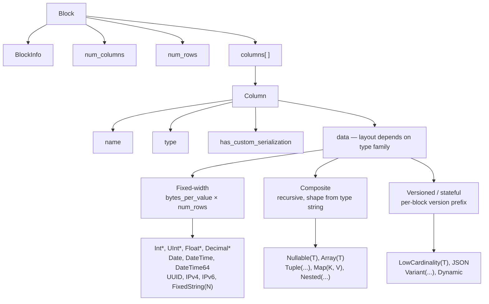
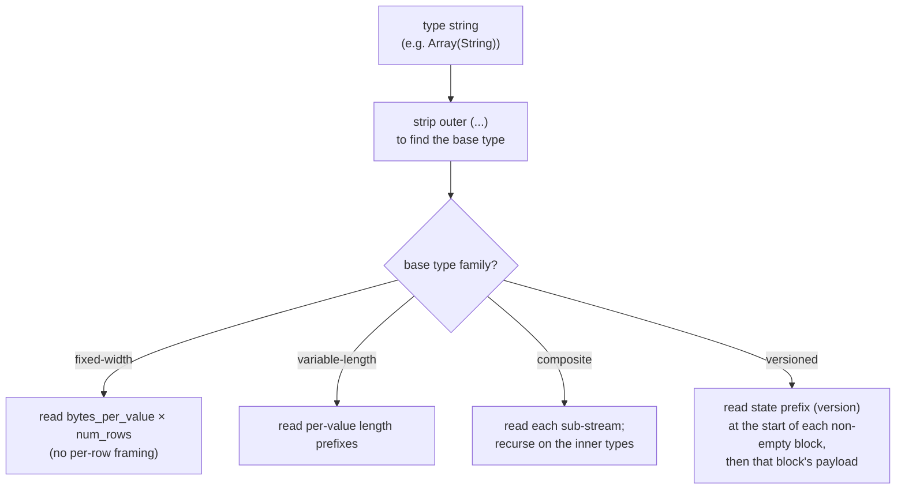
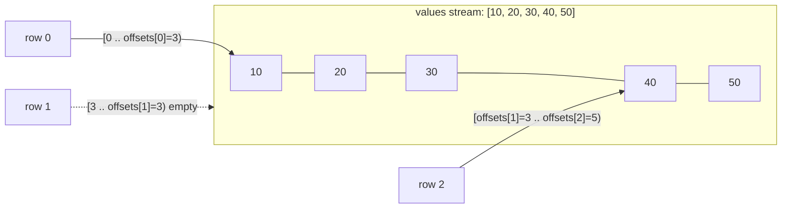
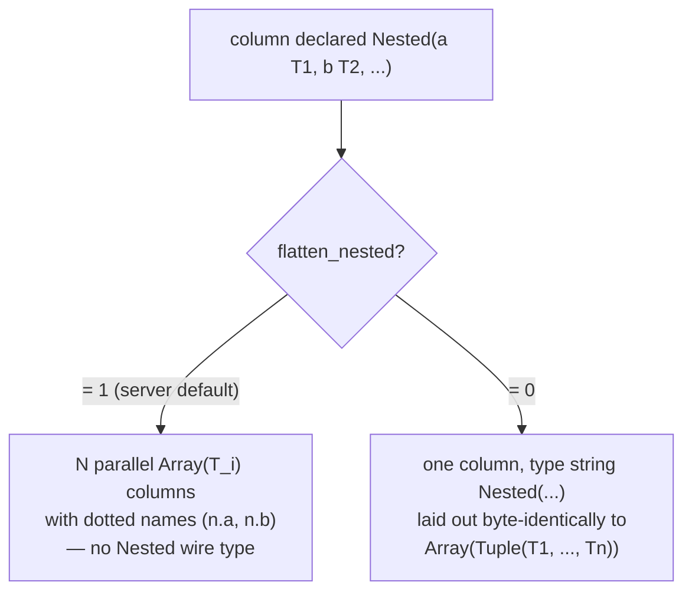
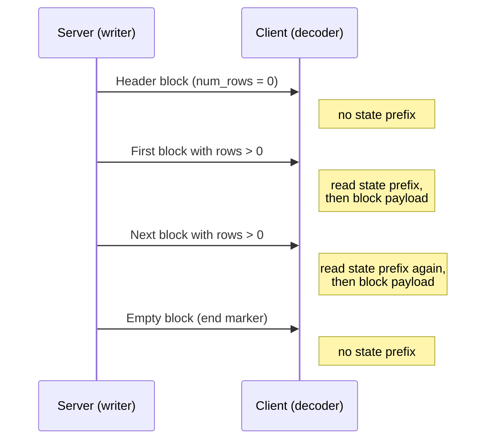
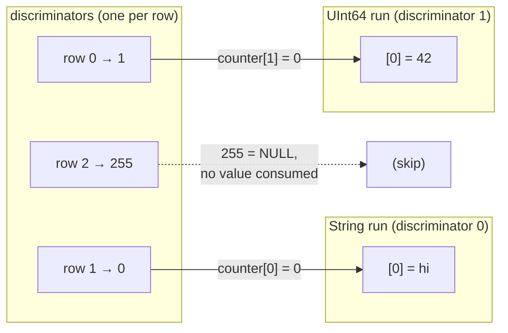
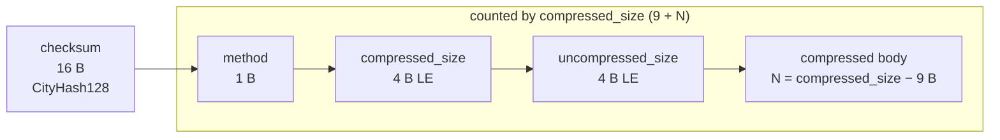

Native 格式是 ClickHouse 用于传输表格数据的列式传输格式。它会出现在以下几种场景中：

* [native TCP protocol](/zh/reference/interfaces/specs/NativeProtocol) 中 `Data`、`Totals`、`Extremes`、`Log` 和 `ProfileEvents` 数据包的 body (`TableColumns` 数据包**不是** Native 块——它承载的是两个二进制字符串，因此其布局应归入 [native protocol spec](/zh/reference/interfaces/specs/NativeProtocol)) ；
* 通过 HTTP 执行 `SELECT ... FORMAT Native` 时的输出；
* 使用 `INTO OUTFILE ... FORMAT Native` 写出的文件导出内容；
* 服务器间复制载荷。

本页介绍块内部的字节布局——也就是列式载荷——以及构成它的各列类型编码。数据包分帧、连接状态和版本协商则属于 [native protocol specification](/zh/reference/interfaces/specs/NativeProtocol) 的内容。

所有多字节整数字段均采用小端字节序。带符号整数使用二进制补码。

<Tip>
  如需查看面向用户的 `Native` 格式介绍 (包含 `curl` 示例) ，请参阅 [Native format page](/zh/reference/formats/Native)。本规范是更底层的传输参考。
</Tip>

<div id="overview">
  ## 概述
</div>

凡是在传输过程中承载行数据的，都是一个 **块**：即一个按列存储的、自描述的行数据块。列 1 的所有值先出现，然后是列 2 的所有值，依此类推。一个块只携带查询引用的列，绝不会携带整张表。

列的 `data` 布局取决于其类型所属的 *家族*。这些家族按解码复杂度从低到高依次为：



* **固定宽度**类型将 `data` 排布为 `bytes_per_value × num_rows` 个原始字节，不带任何按行分帧。
* **复合**类型 (`Nullable`、`Array`、`Tuple`、`Map`、`Nested`) 具有一种可由类型字符串完全递归推导出的结构形态，没有版本前缀，也不存在跨块状态。
* **带版本 / 有状态**类型 (`LowCardinality`、`JSON`、`Variant`、`Dynamic`) 会在每个非空块开头带有序列化版本/状态前缀。在 `Native` 传输格式中，这个前缀以及任何字典都**仅限于当前块**——该格式不会携带*跨*块状态 (写入器会为每个块创建全新的序列化状态，并将 `low_cardinality_max_dictionary_size = 0`) 。跨块状态是 MergeTree 磁盘存储层面的问题，不属于 Native 传输布局。

<div id="wire-primitives">
  ## 线传输基本类型
</div>

Native 格式建立在四种基本编码之上。

| 基本类型            | 大小              | 说明                       |
| --------------- | --------------- | ------------------------ |
| VarUInt         | 1–10 B          | LEB-128 可变长度无符号整数        |
| Fixed-width int | 1、2、4、8、16、32 B | 小端字节序，有符号数使用二进制补码          |
| String          | 可变              | VarUInt 长度前缀 + 原始字节      |
| Bool            | 1 B             | `0x00` = false，非零 = true |

<div id="varuint">
  ### VarUInt
</div>

一种采用 LEB-128 编码的变长无符号整数。每个字节在第 0–6 位包含 7 个数据位，在第 7 位包含 1 个续位。如果后面还有更多字节，续位为 `1`；最后一个字节的续位为 `0`。

| 值范围             | 字节数   |
| --------------- | ----- |
| 0 – 127         | 1     |
| 128 – 16383     | 2     |
| 16384 – 2097151 | 3     |
| 最大可达完整 UInt64   | 最多 10 |

对值 `300` 进行编码：

```text
300 = 0b100101100

Byte 0: 0xAC = 0b10101100   (data: 0101100, continuation: 1)
Byte 1: 0x02 = 0b00000010   (data: 0000010, continuation: 0)
```

对字节 `0xAC 0x02` 进行解码：

```text
Byte 0: data = 0x2C, continuation = 1 → accumulator = 0x2C, shift = 7
Byte 1: data = 0x02, continuation = 0 → accumulator = (0x02 << 7) | 0x2C = 300
```

<div id="fixed-width-integers">
  ### 定宽整数
</div>

| 类型      | 字节 | 编码                 |
| ------- | -- | ------------------ |
| UInt8   | 1  | 原始字节               |
| UInt16  | 2  | 小端字节序              |
| UInt32  | 4  | 小端字节序              |
| UInt64  | 8  | 小端字节序              |
| UInt128 | 16 | 小端字节序              |
| UInt256 | 32 | 小端字节序              |
| Int8    | 1  | 原始字节，采用补码表示        |
| Int16   | 2  | 小端字节序，采用补码表示       |
| Int32   | 4  | 小端字节序，采用补码表示       |
| Int64   | 8  | 小端字节序，采用补码表示       |
| Int128  | 16 | 小端字节序，采用补码表示       |
| Int256  | 32 | 小端字节序，采用补码表示       |
| Float32 | 4  | IEEE 754 单精度，小端字节序 |
| Float64 | 8  | IEEE 754 双精度，小端字节序 |

例如，UInt32 类型的值 `1` 编码为 `01 00 00 00`，Int32 类型的值 `-1` 编码为 `FF FF FF FF`。

<div id="string">
  ### String
</div>

一种带长度前缀的字节序列：

```text
[VarUInt: byte_length] [byte_length bytes: raw value]
```

该字节序列不一定是有效的 UTF-8。空字符串编码为单个 `0x00` 字节，字符串也可以包含任意字节值，包括嵌入的 NUL。字符串 `"ab"` 编码为 `02 61 62`；解码时，先读取 VarUInt 长度 (`2`) ，再读取对应数量的字节。

<div id="bool">
  ### Bool
</div>

单个字节。`0x00` 表示 false；任何非零值均表示 true (标准形式为 `0x01`) 。

<div id="block-and-column-structure">
  ## 块和列的结构
</div>

<div id="block-wire-layout">
  ### 块的线传输布局
</div>

```text
[BlockInfo]               metadata (only on the TCP Data-packet path; see below)
[VarUInt: num_columns]    number of columns in this block
[VarUInt: num_rows]       number of rows in this block
[Column × num_columns]    column entries, omitted when num_columns = 0
```

`BlockInfo` 前缀是否存在取决于通道，因为写入器是按 *修订版本* 参数化的：

* 在 **native TCP protocol** 上，server 会按 connection 协商出的 修订版本 写入块 (这是一个较大的值——在此 release 中，`DBMS_TCP_PROTOCOL_VERSION` 为 `54485`) 。只要该 修订版本 大于零，就会写入 `BlockInfo`；而对于真实 connection，这一条件始终成立。每一列中的 `has_custom_serialization` 字节 (参见[列 wire 布局](#column-wire-layout)) 会在 修订版本 为 `54454` 及以上时写入。
* `Native` *output format*——即通过 HTTP 执行的 `SELECT ... FORMAT Native`、`INTO OUTFILE ... FORMAT Native`，以及 `clickhouse-client` 生成的 `Native` format——*默认*按 修订版本 `0` 进行序列化。在 修订版本 `0` 下，`BlockInfo` 前缀和 `has_custom_serialization` 字节都会被省略，因此一个块只包含 `num_columns`、`num_rows` 和各列。

  对于 HTTP，这个 修订版本 不是固定的：client 可以通过 `?client_protocol_version=<n>` 查询参数提高它，而 server 会将该值作为响应的序列化 修订版本。

  当该值足够高时，HTTP 输出也会包含 `BlockInfo` 前缀 (只要 修订版本 大于 `0` 就会写入) 以及 `has_custom_serialization` 字节 (在 修订版本 `54454` 及以上时写入) ，与 TCP 路径上的情况完全一致。因此，client 不应假定每个 HTTP `FORMAT Native` 载荷都是 修订版本 `0`。

换句话说，本节中以 `BlockInfo` 前缀开头的字节示例描述的是 TCP Data-packet 载荷。同一个查询若通过 `FORMAT Native` 输出，则会生成旁边所示的较短形式。

<div id="blockinfo">
  ### BlockInfo
</div>

BlockInfo 是一组字段序列：每个字段前都有一个 VarUInt 类型的字段 ID，并以字段 ID `0` 结束。其传输格式**不是**自描述的：字段 ID 本身不编码其值的长度或类型，因此读取方必须预先知道它可能遇到的每个字段 ID 对应的类型。ClickHouse 自身的读取器会将无法识别的字段 ID 视为数据损坏，并抛出异常 (`UNKNOWN_BLOCK_INFO_FIELD`) 。前向兼容性则通过协议修订版本实现：只有在协商出的修订版本不低于某个字段的最小修订版本时，发送方才会写入该字段，因此旧版接收器不会看到它不认识的字段。

| 字段 ID | 字段                               | 类型            | 最低修订版本 | 描述                                                      |
| ----- | -------------------------------- | ------------- | ------ | ------------------------------------------------------- |
| 1     | is&#95;overflows                 | UInt8         | 0      | 来自 GROUP BY 的溢出块。非溢出块时为 `0`。                            |
| 2     | bucket&#95;number                | Int32         | 0      | 聚合桶。非分桶块时为 `-1`。                                        |
| 3     | out&#95;of&#95;order&#95;buckets | List of Int32 | 54480  | 分布式聚合期间被延后的桶。编码方式为先写入一个 VarUInt 计数值，再跟随对应数量的 `Int32` 值。 |
| 0     |  (终止符)                           | —             | —      | BlockInfo 结束。始终必需。                                      |

字段 `1` 和 `2` 的最小修订版本为 `0`，因此只要写入了 `BlockInfo`，它们就一定会出现。字段 `3` 仅在修订版本为 `54480` 及以上时写入。常见情况 (修订版本低于 `54480`) 下的传输布局如下：

```text
[VarUInt: 1] [UInt8: is_overflows]
[VarUInt: 2] [Int32: bucket_number]
[VarUInt: 0]
```

<div id="column-wire-layout">
  ### 列的线协议布局
</div>

在一个 Block 中，Column 会出现 `num_columns` 次。

| # | Field                            | Type               | Condition                              | Description                                                                                                                                      |
| - | -------------------------------- | ------------------ | -------------------------------------- | ------------------------------------------------------------------------------------------------------------------------------------------------ |
| 1 | name                             | String             | 始终                                     | 列名                                                                                                                                               |
| 2 | type                             | String *或* 二进制类型编码 | 始终                                     | 默认情况下为 ClickHouse 类型字符串 (例如 `"UInt64"`、`"Array(String)"`) ；当 `output_format_native_encode_types_in_binary_format = 1` 时，则为二进制类型编码 (见下方说明)        |
| 3 | has&#95;custom&#95;serialization | UInt8              | 启用 `CUSTOM_SERIALIZATION` 特性时 (v54454) | `0` = 默认，`1` = 自定义 (后跟 kind&#95;stack)                                                                                                           |
| 4 | kind&#95;stack                   | bytes              | 当字段 3 = `1` 时                          | 一个 UInt8 枚举字节 (见下文) ，用于描述非默认序列化方式 (如稀疏等) 。对于 `COMBINATION` 值，后面跟一个 VarUInt 计数以及对应数量的额外 kind 字节。对于 `Tuple` (以及其他带有元素级序列化信息的复合类型) ，其载荷采用递归结构——见下文。 |
| 5 | data                             | bytes              | 始终                                     | 所有 `num_rows` 行的列值。其布局取决于类型——参见[数据类型](#data-types)。对于稀疏列，见下文。                                                                                    |

解码器会根据 `type` 字符串分派处理逻辑。类型字符串通常带有括号参数；解码器会去掉 `(...)` 后缀以找到基本类型，然后再解析这些参数，以确定大小、标度或内部类型。解析包含嵌套类型的参数列表时 (例如 `Array` 中嵌套一个 `Tuple`) ，需要使用能感知嵌套深度的逗号分割逻辑，跟踪括号嵌套层级，而不是简单地按 `,` 拆分。

<Info>
  **二进制类型编码**

  `type` 字段仅在默认模式下是文本 `String`。当查询设置 `output_format_native_encode_types_in_binary_format = 1` 时，该字段会改为**二进制类型编码**——也就是[数据类型二进制编码](/zh/reference/data-types/data-types-binary-encoding)文档中说明的同一种基于标签的编码——而扁平化后的 `Dynamic` 类型列表也会对各个类型名称使用相同的二进制编码。如果解码器始终将字段 2 读取为带长度前缀的字符串，就会把第一个二进制类型标签误当作字符串长度，从而失去同步，因此它必须知道该数据流使用的是哪种模式。
</Info>



<div id="kind-stack-and-sparse-encoding">
  #### kind_stack 和稀疏编码
</div>

`kind_stack` 字节用于枚举每列的非默认序列化方式：

| Byte   | Name                         | Meaning                                | Wire impact on `data`                              |
| ------ | ---------------------------- | -------------------------------------- | -------------------------------------------------- |
| `0x00` | DEFAULT                      | 默认序列化                                  | 与 `has_custom = 0` 完全一致                            |
| `0x01` | SPARSE                       | 稀疏序列化 (v54465+)                        | 偏移流 + 非默认值；见下文                                     |
| `0x02` | DETACHED                     | 通过并行块编组 (v54478+) 封装在 `ColumnBLOB` 中的列 | 预编组 blob：`VarUInt size` + 对应数量的字节；见下文              |
| `0x03` | DETACHED&#95;OVER&#95;SPARSE | 封装在 `ColumnBLOB` 中的稀疏列                 | 与 `DETACHED` 相同的 blob 载荷；见下文                       |
| `0x04` | REPLICATED                   | 用于重复值的字典形式 (v54482+)                   | 索引流 + 稠密元素值；见下文                                    |
| `0x05` | COMBINATION                  | 多 kind 栈                               | 后跟 `VarUInt` `count`，以及另外 `count` 个 kind 字节——见下方说明 |

**`COMBINATION` 载荷使用的是另一套枚举。** 上面的五行是*紧凑*的单字节编码。`COMBINATION` (`0x05`) 是适用于任何未被其覆盖的栈的通用转义形式：其后跟一个 `VarUInt` `count`，然后是 `count` 个单字节条目。这些条目**不是**表中的紧凑编码——它们是原始的 `ISerialization::Kind` 值：

| Byte   | Nested `Kind` |
| ------ | ------------- |
| `0x00` | DEFAULT       |
| `0x01` | SPARSE        |
| `0x02` | DETACHED      |
| `0x03` | REPLICATED    |

这些字节值与紧凑编码不同：`REPLICATED` 在这套嵌套枚举中是 `0x03`，但作为紧凑编码时是 `0x04`；并且没有 `DETACHED_OVER_SPARSE` 条目——该组合会表现为两个连续条目 `SPARSE`、`DETACHED`。如果解码器仍然对这些嵌套字节使用紧凑表，就会把 `0x03`/`0x04` 错误映射，并导致失步。

`count` 是完整的栈长度，**包括每个栈开头的 `DEFAULT` 前导条目**。紧凑编码已经覆盖了所有一项和两项的栈，因此 `COMBINATION` 的 `count` 始终至少为三。

**`Tuple` 列的递归 `kind_stack`。** 上述 `kind_stack` 载荷是某一列自身序列化信息对应的字节 (或 `COMBINATION` 序列) 。`Tuple` 携带一个 `SerializationInfoTuple`，它会先写入 tuple *自身* 的 kind-stack 载荷，然后按顺序为*每个*元素写入一个完整的 kind-stack 载荷；解码器也会按相同的递归结构读回。因此，对于 `Tuple(A, B, C)`，field-4 的字节为 `[tuple_kind][A_kind][B_kind][C_kind]`；如果某个元素本身还是复合类型，则该元素载荷本身也会递归。只要 tuple 自身的信息*或任一元素*的信息为非默认，`has_custom_serialization` 字节 (field 3) 就会被设置，因此即使一个 `Tuple` 唯一的特殊元素只是 sparse、replicated 或 detached，也仍会触发 kind-stack 载荷。如果解码器对 `Tuple` 只读取单个前导枚举字节，就会过早停止，并把剩余的元素 kind 字节误读为列数据。

**稀疏传输格式。** 当 `kind_stack = 0x01` 时，列 `data` 由两个流组成，它们在同一个共享 TCP 流中背靠背写入：

1. **偏移流** —— 一串 `VarUInt`。每个值 `v` 都属于以下两种情况之一：
   * 如果 `v` 在位置 62 的高位未置位：`(v & 0x3FFFFFFFFFFFFFFF)` = 下一个显式非默认值之前的默认位置数。该非默认位置为 `cursor + group_size`，其中 `cursor` 是当前游标位置；之后 `cursor` 前进 `group_size + 1`。
   * 如果 `v` 的第 62 位被置位 (`END_OF_GRANULE_FLAG`) ：清除该标志后的值 = 最后一个非默认值之后尾随的默认位置数。这标志着该块的偏移流结束。
2. **值流** —— 使用内部类型对 `count` 个非默认值进行稠密编码，其中 `count` 是上面读取到的非 EOG `VarUInt` 数量。

解码器通过将每个未显式指定的位置填充为内部类型的默认值，来重建一个包含 `num_rows` 个条目的稠密列 (整数和浮点数为 `0`，`String` 为 `""`，`Date` 为 `0` 天，等等) 。

稀疏 `Nullable(T)` 列是一个特殊情况，因为 `Nullable(T)` 的默认值是 **NULL**。稀疏编码会完全省略常规的 `Nullable` null-map stream：offset stream 用于标识非默认值——也就是非 NULL——的位置，values stream 仅以稠密形式保存这些非 NULL 值 (类型为 `T`) ，而每个未显式指定的位置都会重建为 NULL。因此，解码器*不应*在 values stream 中查找 null map，也*不应*用有效的 `0` 来填充空缺；而应将其填充为 NULL。

**Replicated 传输格式。** 当 `kind_stack = 0x04` 时，列 `data` 是一个字典：由一组不同元素值的列表，以及每一行指向该列表的索引组成 (其 lookup 形态与 `LowCardinality` 相同) 。当内部类型本身也带有版本信息——例如 `LowCardinality(T)`——其状态前缀会**先**写入，即先于索引 stream：Replicated 序列化会先将前缀阶段委托给内部类型，再写入 `num_rows`。前缀为空的内部类型 (叶子类型和普通复合类型) 在这里不会写入任何字节。

```text
[inner type's state prefix]              empty for leaf inners; e.g. LowCardinality version (Int64 = 1)
[VarUInt num_rows]
[UInt8  size_of_indexes_type]            width of each index: 1, 2, 4, or 8 bytes
[indexes: num_rows × size_of_indexes_type bytes]
[VarUInt num_elements]
[elements: num_elements dense inner-type values]
```

解码器通过为每个输出行 `i` 选取 `elements[indexes[i]]` 来重建稠密列。复合内部类型会递归处理：元素列表先在内部类型中物化，再进行索引。支持的内部类型包括叶子类型、`Nullable(T)`、`Array(T)`、`Tuple(...)`、`Map(K, V)`、`Nested(...)` (其中每个字段都像 `Array` 一样展开) ，以及 `LowCardinality(T)` (共享字典会被保留；只有每个元素的 key 会被索引) 。

**分离传输格式。** `DETACHED` (`0x02`) 和 `DETACHED_OVER_SPARSE` (`0x03`) *确实* 会出现在传输中——它们并不只是内部表示。在 TCP 路径上，当启用压缩且协商后的修订版本至少为 `DBMS_MIN_REVISON_WITH_PARALLEL_BLOCK_MARSHALLING` (v54478) 时，列会经过以下三个步骤：

1. 每个符合条件的列 (非 `const`、非 `Tuple`，且所在块包含多于一行) 都会被包装为一个 `ColumnBLOB`，其中保存了已在主线程之外完成编组和压缩的列。
2. `DETACHED` 会被追加到该包装列的 kind 栈中。
3. 列 `data` 会被写为一个 `VarUInt` blob 大小，后面紧跟恰好这么多的 blob 字节。

如果被包装的列是稀疏的，那么它的栈就是 `{DEFAULT, SPARSE, DETACHED}`，序列化后即为 `DETACHED_OVER_SPARSE`。客户端在解码这类列时，会先读取 blob 的长度和字节，然后对 blob 解压，以恢复内部列的载荷 (参见压缩部分下的 [`ColumnBLOB` 说明](#compression-negotiation)) 。

<div id="block-variants">
  ### 块变体
</div>

Data 家族的所有数据包都共享相同的 Block 传输格式。各个变体仅在列数和行数上有所不同：

| 变体  | num&#95;columns | num&#95;rows | 用途                         |
| --- | --------------- | ------------ | -------------------------- |
| 头部块 | N &gt; 0        | 0            | 用于声明结果 schema (列名 + 类型) 。  |
| 结果块 | N &gt; 0        | M &gt; 0     | 实际结果行。                     |
| 空块  | 0               | 0            | 哨兵——客户端侧表示输入结束；服务端侧表示边界标记。 |

<div id="byte-level-examples">
  ### 字节级示例
</div>

本节中的所有示例均取自 **TCP Data-packet path**，因此都包含 `BlockInfo` 前缀和 `has_custom_serialization` 字节。使用 `FORMAT Native` 时，相同的块会更短——如有必要，会给出其对应的简短形式。

一个空块 (包含 BlockInfo) ，总计 8 字节：

```text
01 00                   BlockInfo: field_id=1, is_overflows=0
02 FF FF FF FF          BlockInfo: field_id=2, bucket_number=-1
00                      BlockInfo terminator
00                      num_columns = 0
00                      num_rows = 0
```

`SELECT 1` 的头部块会声明一个名为 `"1"`、类型为 `UInt8` 且包含零行的列。在协议版本 ≥ 54454 时，还会包含 `has_custom_serialization` 字节：

```text
01 00                   BlockInfo: is_overflows = 0
02 FF FF FF FF          BlockInfo: bucket_number = -1
00                      BlockInfo terminator
01                      num_columns = 1
00                      num_rows = 0
01 "1"                  Column[0].name = "1"
05 "UInt8"              Column[0].type = "UInt8"
00                      Column[0].has_custom_serialization = 0
                        Column[0].data: no bytes (num_rows = 0)
```

同一查询返回的结果块，包含一行：

```text
01 00                   BlockInfo: is_overflows = 0
02 FF FF FF FF          BlockInfo: bucket_number = -1
00                      BlockInfo terminator
01                      num_columns = 1
01                      num_rows = 1
01 "1"                  Column[0].name = "1"
05 "UInt8"              Column[0].type = "UInt8"
00                      Column[0].has_custom_serialization = 0
01                      Column[0].data: one UInt8 byte = 1
```

通过 `FORMAT Native` (修订版本 `0`) 时，相同的结果块不包含 `BlockInfo`，也没有 `has_custom_serialization` 字节——`SELECT 1 FORMAT Native` 的大小为 11 字节：

```text
01                      num_columns = 1
01                      num_rows = 1
01 "1"                  Column[0].name = "1"
05 "UInt8"              Column[0].type = "UInt8"
01                      Column[0].data: one UInt8 byte = 1
```

(零行结果 (例如仅含头部信息的块) 通过 `FORMAT Native` 完全不会产生任何字节：该输出格式不会输出空块。)

<div id="data-types">
  ## 数据类型
</div>

本节介绍 Native 格式可在列的 `data` 中承载的各类类型在 wire 上的编码方式，并按解码器复杂度递增归为四个家族。有两种类型——`AggregateFunction(func, ...)` 和 `QBit(T, N)`——虽然是有效的 `Native` 列类型，但其载荷依赖具体函数或类型，不在本文讨论范围内；下文会在原本可能被误认为别名的地方专门说明它们。

| 家族         | 章节                             | 每列的流数量 | 跨块状态                                 |
| ---------- | ------------------------------ | ------ | ------------------------------------ |
| 定宽         | [定宽类型](#fixed-width-types)     | 一个     | 无                                    |
| 变长         | [变长类型](#variable-length-types) | 一个     | 无                                    |
| 复合 (固定形态)  | [复合类型](#composite-types)       | 多个     | 无                                    |
| 版本化 / 有状态  | [版本化类型](#versioned-types)      | 多个     | Native wire 上无——每个块都有独立的状态前缀，且每块重新开始 |

<div id="fixed-width-types">
  ### 定宽类型
</div>

每个值都占用固定数量的字节。一个包含 `M` 行的列在传输时恰好占用 `bytes_per_row × M` 字节，连续拼接，中间没有分隔符或填充。

| 类型字符串               | 每个值的字节数         | 逻辑值                                                                            | 传输编码                                       |
| ------------------- | --------------- | ------------------------------------------------------------------------------ | ------------------------------------------ |
| `UInt8`             | 1               | 无符号 8 位整数                                                                      | 原始字节                                       |
| `UInt16`            | 2               | 无符号 16 位整数                                                                     | 小端序                                        |
| `UInt32`            | 4               | 无符号 32 位整数                                                                     | 小端序                                        |
| `UInt64`            | 8               | 无符号 64 位整数                                                                     | 小端序                                        |
| `UInt128`           | 16              | 无符号 128 位整数                                                                    | 小端序                                        |
| `UInt256`           | 32              | 无符号 256 位整数                                                                    | 小端序                                        |
| `Int8`              | 1               | 有符号 8 位整数，采用补码表示                                                               | 原始字节                                       |
| `Int16`             | 2               | 有符号 16 位整数，采用补码表示                                                              | 小端序                                        |
| `Int32`             | 4               | 有符号 32 位整数，采用补码表示                                                              | 小端序                                        |
| `Int64`             | 8               | 有符号 64 位整数，采用补码表示                                                              | 小端序                                        |
| `Int128`            | 16              | 有符号 128 位整数，采用补码表示                                                             | 小端序                                        |
| `Int256`            | 32              | 有符号 256 位整数，采用补码表示                                                             | 小端序                                        |
| `Float32`           | 4               | IEEE 754 单精度                                                                   | 小端序                                        |
| `Float64`           | 8               | IEEE 754 双精度                                                                   | 小端序                                        |
| `BFloat16`          | 2               | IEEE 754 `Float32` 的高 16 位                                                     | 小端序                                        |
| `Bool`              | 1               | `0x00` = false，`0x01` = true                                                   | 原始字节                                       |
| `Date`              | 2               | 自 `1970-01-01` 起的天数                                                            | 小端序 UInt16                                 |
| `Date32`            | 4               | 自 `1970-01-01` 起的天数 (有符号；支持 1970 年前)                                           | 小端序 Int32                                  |
| `DateTime`          | 4               | 以秒为单位的 Unix 时间戳                                                                | 小端序 UInt32                                 |
| `DateTime(tz)`      | 4               | 与 `DateTime` 相同；时区属于 metadata                                                  | 小端序 UInt32                                 |
| `DateTime64(s)`     | 8               | 标度为 `s` 的 tick (自纪元以来的 10^-s 秒)                                                | 小端序 Int64                                  |
| `DateTime64(s, tz)` | 8               | 与 `DateTime64(s)` 相同；时区属于 metadata                                             | 小端序 Int64                                  |
| `Time`              | 4               | 以秒为单位的有符号时长                                                                    | 小端序 Int32                                  |
| `Time64(s)`         | 8               | 按标度 `s` 的 tick 表示的有符号时长                                                        | 小端序 Int64                                  |
| `Interval<Unit>`    | 8               | 有符号计数；单位包含在类型字符串中                                                              | 小端序 Int64                                  |
| `UUID`              | 16              | 128 位标识符                                                                       | 两个经过字节交换的小端序 UInt64 半部分 (见 [UUID](#uuid))  |
| `IPv4`              | 4               | IPv4 地址                                                                        | 小端序 UInt32                                 |
| `IPv6`              | 16              | IPv6 地址                                                                        | 网络字节序，不交换                     |
| `Enum8`             | 1               | 有符号 8 位 (变体索引)                                                                 | 原始字节                                       |
| `Enum16`            | 2               | 有符号 16 位 (变体索引)                                                                | 小端序                                        |
| `Decimal(P, S)`     | 4 / 8 / 16 / 32 | 以有符号整数形式存储的 `value × 10^S`；宽度取决于 P (≤9 → 4 B，≤18 → 8 B，≤38 → 16 B，≤76 → 32 B)  | 小端序有符号整数                                   |

<div id="integer-types">
  #### 整数类型
</div>

`UInt8`–`UInt256` 和 `Int8`–`Int256` 都是整数值的直接二进制编码。解码器会读取 `bytes_per_row × num_rows` 个字节，并按该类型对其进行解析。

一个包含 `[1, 256, 65536]` 的 `UInt32` 列：

```text
01 00 00 00              row 0: 1
00 01 00 00              row 1: 256
00 00 01 00              row 2: 65536
```

一个包含 `[-1, 42]` 的 `Int32` 列：

```text
FF FF FF FF              row 0: -1
2A 00 00 00              row 1: 42
```

<div id="float32-and-float64">
  #### Float32 和 Float64
</div>

标准 IEEE 754 二进制浮点数：4 字节单精度 (`binary32`) 和 8 字节双精度 (`binary64`) ，均采用小端序。NaN、±Infinity、±0.0 和次正规数在往返转换后都能保持原样，无需规范化。

`Float32` 值 `1.5` (`0x3FC00000`) ：

```text
00 00 C0 3F              little-endian IEEE 754
```

`Float64` 值 `1.5` (`0x3FF8000000000000`) ：

```text
00 00 00 00 00 00 F8 3F  little-endian IEEE 754
```

<div id="bfloat16">
  #### BFloat16
</div>

brain-float 格式：IEEE 754 `Float32` 的高 16 位——1 个符号位、8 个指数位、7 个尾数位。每个值占 2 字节，采用小端序，保存原始的 16 位模式。要还原其数值，可将该模式放入高 16 位、将低 16 位清零 (把 `bits << 16` 重新解释为 `Float32`) ，从而扩展回 `Float32`；扩展后的值也沿用 `Float32` 的文本格式。

`BFloat16` 值 `1.5` (模式为 `0x3FC0`，即 `Float32` `0x3FC00000` 的高半部分) ：

```text
C0 3F                    little-endian, widens to Float32 1.5
```

<div id="bool-type">
  #### Bool
</div>

与 `UInt8` 在线路格式上兼容：每行 1 字节，`0x00` = false，`0x01` = true。在线路协议中，类型字符串就是 `Bool` (而不是 `UInt8`) ，因此按类型字符串进行分派的解码器必须将其单独识别。

一个 `Bool` 列 `[true, false, true]`：

```text
01 00 01
```

<div id="date-and-date32">
  #### Date 和 Date32
</div>

两者都将日期编码为相对于 Unix 纪元 `1970-01-01` 的整数天数。两者都不包含时间部分。

| 类型       | 字节 | 编码         | 范围                          |
| -------- | -- | ---------- | --------------------------- |
| `Date`   | 2  | 小端序 UInt16 | `1970-01-01` 到 `2149-06-06` |
| `Date32` | 4  | 小端序 Int32  | 较宽的有符号范围，支持 1970 年之前的日期     |

`Date` 值 `1970-01-02` (1 天) ：

```text
01 00                    UInt16 LE = 1
```

`Date32` 值 `1900-01-01` (-25567 天) ：

```text
21 9C FF FF              Int32 LE = -25567
```

<div id="datetime">
  #### DateTime
</div>

与 `UInt32` 在线路格式上兼容：表示一个以秒为单位的 Unix 时间戳，占 4 字节，采用小端序。该类型可能显示为 `DateTime` 或 `DateTime('Timezone')`；时区仅影响显示，不属于线路值的一部分。对于同一时刻，两个带有不同 `timezone` 参数的 `DateTime` 列会生成完全相同的字节。解码器会去掉 `(...)` 参数后缀，并将该列按 `UInt32` 处理。

`DateTime('UTC')` 的值 `2024-03-15 14:30:00 UTC` (时间戳 `1710513000`) ：

```text
68 5B F4 65              UInt32 LE = 1710513000
```

<div id="datetime64">
  #### DateTime64(scale[, timezone])
</div>

8 字节，小端序 Int64，表示自 Unix 纪元以来、按 `10^-scale` 秒计的 tick。`标度` 参数 (0–9) 写在类型字符串中，用于设置时间单位：

| 标度 | Tick size | Common name |
| ----- | --------- | ----------- |
| 0     | 1 秒       | 秒           |
| 3     | 1 毫秒      | ms          |
| 6     | 1 微秒      | µs          |
| 9     | 1 纳秒      | ns          |

该类型可写作 `DateTime64(s)` (隐式使用 server 默认时区) 或 `DateTime64(s, 'TimezoneName')` (显式指定时区，仅影响显示) 。负值表示纪元之前的 tick。

`DateTime64(3, 'UTC')` 的值 `2024-01-15 12:30:45.123 UTC` (1705321845123 ms) ：

```text
83 51 1A 0D 8D 01 00 00  Int64 LE = 1705321845123
```

`DateTime64(0)` 值 `2024-01-15 12:30:45 UTC` (1705321845 秒) :

```text
75 25 A5 65 00 00 00 00  Int64 LE = 1705321845
```

<div id="time-and-time64">
  #### `Time` 和 `Time64(scale)`
</div>

表示时钟时长，而不是时间点。`Time` 是有符号的秒计数，使用 4 字节小端序 Int32；`Time64(scale)` 是在给定十进制标度 (0–9) 下的有符号 tick 计数，使用 8 字节小端序 Int64——其 wire 形态与 `DateTime64` 相同。

其文本形式为 `[-]HH:MM:SS[.fraction]`，但与 `DateTime` 不同，小时字段**不会**按 24 小时制折返：它表示的是总小时数，因此可能超过 23。显示值的上限为 `999:59:59` (`3599999` 秒) ；更大的值会按该上限显示，且小数部分清零 (`999:59:59.000`) 。`CAST` 也会将存储值限制在这个范围内，不过算术运算可能产生超出范围的值，而这类值仅在显示时才会被限制。这些都不会影响 wire 字节，因为它们本质上就是普通的有符号整数。

`Time` 值 `45296` (`12:34:56`) ：

```text
F0 B0 00 00              Int32 LE = 45296
```

`Time64(3)` 值 `45296789` 刻度 (`12:34:56.789`) ：

```text
95 2C B3 02 00 00 00 00  Int64 LE = 45296789
```

<Note>
  `Time` 和 `Time64` 属于 Experimental 功能，且需要在 server 上设置 `allow_experimental_time_time64_type = 1`。
</Note>

<div id="interval">
  #### Interval
</div>

`Interval<Unit>` — `IntervalSecond`、`IntervalMinute`、`IntervalHour`、`IntervalDay`、`IntervalWeek`、`IntervalMonth`、`IntervalQuarter`、`IntervalYear`、`IntervalNanosecond` 等。所有单位都使用同一种 wire 编码：将计数存储为有符号的 8 字节小端序 Int64。单位**仅**体现在类型字符串中——它既不会改变 wire 字节，也不会改变文本表示形式，后者就是裸整数。所有单位都由同一套解码逻辑处理。

`IntervalDay` 的值 `5`：

```text
05 00 00 00 00 00 00 00  Int64 LE = 5
```

<div id="uuid">
  #### UUID
</div>

每个值占 16 个字节。其线上传输编码**并非**规范的 16 个大端序字节——而是将两个 8 字节的半段分别做字节反转。

逻辑模型是一个 128 位标识符，采用规范文本格式 `xxxxxxxx-xxxx-xxxx-xxxx-xxxxxxxxxxxx`，其中字节通常按大端序书写。线上传输模型会取这 16 个规范字节，将其拆分为两个 8 字节半段，并将每个半段按小端序写入：

* 线上的字节 0..7 = 规范字节 0..7 反转后。
* 线上的字节 8..15 = 规范字节 8..15 反转后。

UUID `550e8400-e29b-41d4-a716-446655440000`：

```text
Canonical bytes (16):    55 0E 84 00 E2 9B 41 D4  A7 16 44 66 55 44 00 00

Wire bytes:
D4 41 9B E2 00 84 0E 55  high half byte-reversed
00 00 44 55 66 44 16 A7  low half byte-reversed
```

nil UUID (全为零) 在两种表示形式中完全一致。

<div id="ipv4-and-ipv6">
  #### IPv4 和 IPv6
</div>

两种相关但编码方式不同的地址类型。

`IPv4` 占 4 字节，编码为一个小端序 UInt32，用于存储规范的 32 位地址 (即由 `a.b.c.d` 得到的值 `(a << 24) | (b << 16) | (c << 8) | d`) 。在线路上传输时，字节序列是将网络字节序的字节反转后得到的。

`192.168.1.10` (规范 32 位值为 `0xC0A8010A`) ：

```text
0A 01 A8 C0              Little-endian UInt32
```

`IPv6` 长度为 16 字节，**按网络字节序原样写入**，不做 swap——其字节序与 `inet_pton(AF_INET6, ...)` 相同。

`2001:db8::1`:

```text
20 01 0D B8 00 00 00 00  network bytes 0..7
00 00 00 00 00 00 00 01  network bytes 8..15
```

这种不对称性是有意设计的：IPv4 以 `u32` 形式存储，便于进行算术运算和紧凑的范围查询；而 IPv6 则保留了大多数网络 API 常用的网络字节序布局。

<div id="enum8-and-enum16">
  #### Enum8 and Enum16
</div>

分别与 `Int8` 和 `Int16` 在线路格式上兼容：每行占 1 或 2 个字节，其中 16 位变体采用二进制补码小端序。完整的变体映射位于类型字符串中：

```text
Enum8('active' = 1, 'inactive' = 2, 'banned' = -1)
Enum16('a' = 1, 'b' = 30000)
```

解码器可能会去掉 `(...)` 参数后缀，并按 `Int8` / `Int16` 处理——在线上传输的字节其实只是整数索引。会暴露标签的客户端会从类型字符串中解析出 `'name' = value` 映射，并将其与该列一同保留：仅凭整数本身无法还原标签。面向文本的输出显示的是标签 (`active`) 而不是索引；当枚举嵌套在复合类型中时，则会使用单引号 (`'active'`) 。由于无法从整数列中恢复该映射，因此对于 `Array(Enum8(...))` 或 `Map(Enum16(...), V)` 这类嵌套枚举，必须保留该映射。

一个 `Enum8('active' = 1, 'inactive' = 2)` 列 `[active, inactive, active]`：

```text
01 02 01
```

`Enum16(...)` 的一个值 `30000`：

```text
30 75                    Int16 LE = 30000
```

<div id="decimal">
  #### Decimal(P, S)
</div>

按 10 的幂进行缩放的有符号整数。该整数的字节宽度由 **精度** `P` 决定；**标度** `S` 是负指数 (即小数点后的位数) 。这两个参数都包含在类型字符串中。

| Precision (P) | Backing integer | Bytes |
| ------------- | --------------- | ----- |
| 1 ≤ P ≤ 9     | Int32           | 4     |
| 10 ≤ P ≤ 18   | Int64           | 8     |
| 19 ≤ P ≤ 38   | Int128          | 16    |
| 39 ≤ P ≤ 76   | Int256          | 32    |

线上的编码是采用小端序二进制补码表示的底层整数，逻辑上的十进制值则为 `wire_integer × 10^(-S)`。

无论类型最初是如何声明的，ClickHouse 始终都会输出 `Decimal(P, S)`。`Decimal32(S)`、`Decimal64(S)` 等写法在线上传输时都会规范化为 `Decimal(P, S)` (其中 `P` 会设置为该宽度下的自然最大值：9、18、38、76) 。因此，只要解码器能识别 `Decimal(P, S)`，就能覆盖服务器输出的所有写法。

`Decimal(9, 4)` 的值 `123.4567` → 底层整数 `1234567`：

```text
87 D6 12 00              Int32 LE = 1234567
```

`Decimal(18, 1)` 值 `-1.5` → 底层整数 `-15`：

```text
F1 FF FF FF FF FF FF FF  Int64 LE = -15
```

`Decimal(38, 4)` 值 `123.4567` (总计 16 字节) ：

```text
87 D6 12 00 00 00 00 00 00 00 00 00 00 00 00 00
```

<div id="nothing">
  #### Nothing
</div>

`Nothing` 类型不包含任何值。实际中，它只会作为 `Nullable(Nothing)` 的内部类型出现——也就是服务器对 `SELECT NULL` 这类表达式返回的类型，其唯一可能的有效值就是“不存在值”。从概念上说，它是一种 unit type。

在线路格式中，它**每行恰好占用一个占位字节**。服务器会输出 ASCII 字符 `'0'` (`0x30`) ，但反序列化器会忽略这些字节——其内容未定义，解码器不得依赖任何特定值。写入的字节数为 `num_rows × 1`，因此列头中的 `num_rows` 就完全决定了需要读取多少内容。

这种每行一个字节的设计保持了 Block 不变式：每一列都占据一个可由 `num_rows` 推导出的长度，因此解码器可以向前扫描，而不需要每个单元的长度前缀。外层的 `Nullable` 始终将每个位置都标记为 NULL，因此这些占位符永远不会被检查。

一个包含 3 行的 `Nullable(Nothing)` 列 (全部为 NULL) ：

```text
01 01 01                 null map: 1, 1, 1 (three NULLs)
30 30 30                 Nothing placeholder bytes (one per row)
```

null-map 前缀采用标准的 `Nullable` 封装格式 (参见 [Nullable](#nullable)) ；内部的三个字节是 `Nothing` 载荷，解码器会跳过它。

<div id="variable-length-types">
  ### 变长类型
</div>

每个值在传输时都会携带其自身的长度。

<div id="string-type">
  #### String
</div>

String 类型：`String`。`String` 列由 `num_rows` 个带长度前缀的字节序列构成：

```text
[VarUInt: byte_length] [byte_length bytes: raw value]
[VarUInt: byte_length] [byte_length bytes: raw value]
...
```

除长度前缀外，行与行之间没有其他分隔符，也没有行级状态。空字符串占用单个 `0x00` 字节。ClickHouse `String` 面向字节而非文本：不会强制验证 UTF-8 的有效性，而且一个值可以包含任意字节，包括嵌入的 NUL。面向 UTF-8 字符串类型的解码器，要么在读取时进行校验，要么向调用方暴露原始字节。该列占用的总字节数为所有行的 `Σ (varuint_size(len_i) + len_i)`。

包含 3 个字符串 `["ab", "", "c"]` 的一列 (总计 6 字节) ：

```text
02 61 62                 row 0: length 2, "ab"
00                       row 1: length 0, empty
01 63                    row 2: length 1, "c"
```

<div id="fixedstring">
  #### FixedString(N)
</div>

类型字符串：`FixedString(N)`，其中 `N` 为正整数 (例如 `FixedString(16)`) 。该列恰好包含 `N × num_rows` 个原始字节，没有长度前缀，也没有分隔符。解码器从类型字符串中解析出 `N`，并为每一行读取对应数量的字节。

当 SQL 插入的值短于 `N` 字节时 (例如 `CAST('abc' AS FixedString(5))`) ，server 会在右侧用 NUL 字节 (`0x00`) 填充到声明的长度。这些填充字节属于存储值本身的一部分，并会按原样通过 wire 发送；是否去除这些字节由 client 端处理。与 `String` 类似，`FixedString(N)` 更接近字节数组而非文本——通常用于定宽标识符、地址字节或哈希摘要。

两个 `FixedString(3)` 值 `["abc", "de\0"]` (共 6 字节) ：

```text
61 62 63                 row 0: 3 bytes, "abc"
64 65 00                 row 1: 3 bytes, "de" + NUL padding
```

对比这两种字符串类型：

| 属性        | `String`     | `FixedString(N)` |
| --------- | ------------ | ---------------- |
| 每行长度前缀    | 是 (VarUInt)  | 否                |
| 行大小       | 可变           | 恰好为 `N` 字节       |
| 列总字节数     | 可变           | `N × num_rows`   |
| NUL 字节填充  | 不适用          | 由服务器在右侧填充        |
| 预期为 UTF-8 | 通常如此 (不强制)   | 否 (按原始字节处理)      |
| 类型参数      | None         | 必需的整数 `N`        |

<div id="composite-types">
  ### 复合类型
</div>

复合类型会封装一个或多个内部类型，并共享一种通用的 wire 模型：**每列对应多个流**。单个逻辑列会被编码为两个或多个可独立读取的字节序列，并将其拼接在一起。

它们具有三个共同的结构特性：

* **每个 schema 的形态固定。** 结构在解码时完全由类型字符串决定。`Array(UInt32)` 的 stream 布局始终一致，不会因块而异。
* **自身没有版本前缀。** 复合包装器本身不会添加版本字节；它的帧结构 (offsets、null-map、元素流) 在各个 ClickHouse 发行版之间保持稳定。这只适用于 *wrapper* 本身——内部带版本的类型请参见下文的前缀阶段说明。
* **自身没有跨块状态。** 包装器的帧结构在每个块中都是完全自描述的；任何跨块状态相关的问题都来自内部带版本的类型，而不是包装器本身。

复合类型是递归的——内部类型本身也可以是复合类型。

**数据流之前的前缀阶段。** 读取一列分为两个阶段，顺序如下：先是**状态前缀阶段**，然后是**数据流阶段**。复合包装器自身没有前缀字节，但在写入自身任何数据流之前，它会将前缀阶段*委托*给内部序列化来执行：`SerializationArray` 会在写入数组 offsets 之前运行其内部类型的前缀阶段，`Tuple`、`Map`、`Nested` 和 `Nullable` 也会通过各自的元素序列化执行相同操作 (`Nullable` 会在其 null map 之前运行内部前缀) 。

因此，当复合类型封装了[带版本/有状态类型](#versioned-types) (`LowCardinality`、`Variant`、`Dynamic`、`JSON`) 时，该内部类型的版本/状态前缀会*最先*写出，位于包装器的 offsets 和元素载荷之前。例如，`Array(LowCardinality(String))` 的布局是 `[LowCardinality state prefix]` → `[array offsets]` → `[flattened LowCardinality element payload]`，而不是先写 offsets。

如果解码器在执行内部前缀阶段之前就先读取 offsets，那么在处理任何包含 `LowCardinality`、`Variant`、`Dynamic` 或 `JSON` 的复合类型时都会失步。当所有内部类型都是普通叶子类型或其他不带版本的复合类型时，前缀阶段不会输出任何字节，此时下文关于“先 offsets”的描述可原样适用。

<div id="nullable">
  #### Nullable(T)
</div>

类型字符串：`Nullable(InnerType)`。示例：`Nullable(UInt32)`、`Nullable(String)`、`Nullable(FixedString(16))`、`Nullable(DateTime('UTC'))`。

与其他复合类型一样，`Nullable` 会先将[前缀阶段](#composite-types)委托给其内部序列化处理，然后再写入 null map：当内部类型带版本时，会**先**输出内部的状态前缀。因此，`Nullable(Tuple(LowCardinality(String)))` 会以 `LowCardinality` 的状态前缀开头，而不是 null map。当内部类型是叶子类型或其他不带版本的类型时，前缀阶段不会输出任何字节。

传输布局由内部前缀阶段 (除非内部类型带版本，否则为空) 以及随后拼接的两个流组成，其中 null-map 在前：

```text
[inner type's state prefix]   empty for leaf/non-versioned inners; emitted first when the inner is versioned
[null-map stream]             num_rows × UInt8
[values stream]               inner type's encoding for num_rows values
```

空值映射的大小恰好为 `num_rows` 字节，每行一个字节：

| 字节值                 | 含义                                |
| ------------------- | --------------------------------- |
| `0x00`              | 该行有值。                             |
| 非零值 (规范形式为 `0x01`)  | 值为 NULL。values stream 中对应的字节是占位符。 |

values stream 包含内部类型对**全部** `num_rows` 行的标准编码，包括 NULL 所在位置。解码器仍必须读取 NULL 位置处的占位符字节以推进 stream，但在解释任何单个值之前，必须先检查空值映射。发送方可以在 NULL 位置写入任意字节，因此解码器不能依赖某个特定的占位符值。

按内部类型家族划分的占位符值：

| 内部类型家族                                          | NULL 位置处的占位符       |
| ----------------------------------------------- | ------------------ |
| Fixed-width (UInt/Int/Float/DateTime/UUID/etc.) | 该类型固定宽度的全零初始化字节    |
| `String`                                        | 空字符串——单个 `0x00` 字节 |
| `FixedString(N)`                                | `N` 个零字节           |
| `Array(T)`                                      | 空数组——offsets 增加 0  |
| `Tuple(T1, T2, ...)`                            | 每个元素使用各自的占位符       |

`Nullable(T)` 可以出现在 `Array`、`Tuple`、`Map` 和 `Nested` 内部——`Array(Nullable(T))` 和 `Tuple(Nullable(T1), T2)` 很常见。可空性不能自行嵌套：`Nullable(Nullable(T))` 会被 server 拒绝。

一个有三行 `[5, NULL, 9]` 的 `Nullable(UInt8)` (总共 6 字节) ：

```text
00 01 00                 null-map: present, null, present
05 00 09                 values:   5, placeholder, 9
```

一个具有三行 `["hello", NULL, "world"]` 的 `Nullable(String)` (共 15 字节) ：

```text
00 01 00                 null-map
05 'h' 'e' 'l' 'l' 'o'   row 0: "hello"
00                       row 1: placeholder (empty string)
05 'w' 'o' 'r' 'l' 'd'   row 2: "world"
```

<div id="array">
  #### Array(T)
</div>

类型字符串：`Array(InnerType)`。示例：`Array(UInt32)`、`Array(String)`、`Array(Nullable(UInt32))`、`Array(Array(UInt8))`。

传输布局由内部 [prefix 阶段](#composite-types) (除非内部类型带版本信息，否则为空) 以及随后拼接在一起的两个流组成，其中 offsets 在前：

```text
[inner type's state prefix]   empty for leaf/non-versioned inners; emitted first when the inner is versioned
[offsets stream]              num_rows × UInt64 LE
[values stream]               inner type's encoding for offsets[num_rows - 1] values
```

`offsets` stream 恰好由 `num_rows` 个小端序 UInt64 值组成，每个值都是该行元素之后 values stream 中的**累计结束位置**：

* 行 `N` 的元素起始索引 = `offsets[N - 1]` (或在 `N == 0` 时为 `0`) 。
* 行 `N` 的元素结束索引 (exclusive) = `offsets[N]`。
* 行 `N` 的元素个数 = `offsets[N] - offsets[N - 1]`。

因此，`offsets[num_rows - 1]` 就是所有行的元素总数，而 values stream 则按顺序首尾相接地存放这么多个内部值。

Offsets **单调非递减**；连续相等的 offsets 表示空行，解码器应将非单调的 offsets 视为损坏并拒绝。空列 (`num_rows == 0`) 会写入零字节——既没有 offsets stream，也没有 values stream。内部类型可以是任意类型，包括其他复合类型：`Array(Array(T))`、`Array(Tuple(...))` 和 `Array(Nullable(T))` 都是合法的。

行值为 `[[10, 20, 30], [], [40, 50]]` 的 `Array(UInt32)` (总计 44 字节) ：

```text
Offsets (3 × UInt64 LE = 24 bytes):
03 00 00 00 00 00 00 00      offsets[0] = 3
03 00 00 00 00 00 00 00      offsets[1] = 3 (empty row)
05 00 00 00 00 00 00 00      offsets[2] = 5

Values (5 × UInt32 LE = 20 bytes):
0A 00 00 00                  10
14 00 00 00                  20
1E 00 00 00                  30
28 00 00 00                  40
32 00 00 00                  50
```

每个偏移量都是共享 values 流中某一行切片的累计*结束位置*；其起始位置是前一个偏移量 (第 0 行则为 `0`) 。连续相等的偏移量表示空行：



`Array(String)`，对应的行 `[["a", "bb"], []]` (共 20 字节) ：

```text
Offsets (2 × UInt64 LE = 16 bytes):
02 00 00 00 00 00 00 00      offsets[0] = 2
02 00 00 00 00 00 00 00      offsets[1] = 2 (empty row)

Values (2 strings, 4 bytes total):
01 'a'                       row's first string: "a"
02 'b' 'b'                   row's second string: "bb"
```

具有行 `[[[1,2]], [], [[3], [4,5]]]` 的 `Array(Array(UInt32))` 按相同的形态嵌套：

* 外层偏移量：`[1, 1, 3]` — 第 0 行有 1 个内部数组，第 1 行有 0 个，第 2 行有 2 个。
* 中间层 `Array(UInt32)` 解码为 3 行，偏移量为 `[2, 3, 5]`。
* 最内层 `UInt32` 解码为 5 个值：`[1, 2, 3, 4, 5]`。

总共是 24 (外层偏移量) + 24 (中间偏移量) + 20 (值) = 68 字节。

<div id="tuple">
  #### Tuple(T1, T2, ...)
</div>

类型字符串：`Tuple(T1, T2, ..., Tn)`。示例：`Tuple(UInt32, String)`、`Tuple(Int32)`、`Tuple(Array(UInt32), String)`、`Tuple(UInt8, Tuple(Int32, String))`。ClickHouse 还支持通过 `Tuple(a UInt32, b String)` 定义**命名元组**；这些名称仅作为元数据，不会影响传输格式。

其传输布局为：先是各元素的[前缀阶段](#composite-types) (每个带版本的元素都会按声明顺序贡献其状态前缀；非版本化元素则为空) ，随后是按声明顺序拼接的 *N* 个流，每种元素类型对应一个：

```text
[element state prefixes]   in declaration order; empty unless an element type is versioned
[stream for T1]    inner T1's encoding for num_rows values
[stream for T2]    inner T2's encoding for num_rows values
 ...
[stream for Tn]    inner Tn's encoding for num_rows values
```

每个流恰好编码 `num_rows` 个值。没有长度前缀，没有 offsets 流，流与流之间也没有分隔符。空列 (`num_rows == 0`) 在每个流中写入零字节。元素类型可以是任意类型，包括其他复合类型——`Tuple(Tuple(...), ...)`、`Tuple(Array(...), ...)` 和 `Tuple(Nullable(T1), T2)` 都是合法的。

零元素元组 `Tuple()` 也是合法的——它会由 `SELECT tuple()` 或 `CAST(x AS Tuple())` 这类表达式产生。由于没有元素流，它会像 [Nothing](#nothing) 一样被序列化：**每行一个占位字节 (`0x30`，ASCII `'0'`)&#x20;**，反序列化器会将其丢弃。行数来自块头，与 `Nothing` 完全相同。

具有 3 行 `(1,4)、(2,5)、(3,6)` 的 `Tuple(UInt8, UInt8)`：

```text
Element 0 stream (3 × UInt8 = 3 bytes):
01 02 03

Element 1 stream (3 × UInt8 = 3 bytes):
04 05 06
```

其布局**不是**按行主序排列：将原始字节读回后，元素 0 得到 `[1, 2, 3]`，元素 1 得到 `[4, 5, 6]`。

包含 2 行 `(10, "a")`、`(20, "bb")` 的 `Tuple(UInt32, String)` (总计 13 字节) ：

```text
Element 0 stream (2 × UInt32 LE = 8 bytes):
0A 00 00 00                  10
14 00 00 00                  20

Element 1 stream (2 strings, 5 bytes total):
01 'a'                       "a"
02 'b' 'b'                   "bb"
```

<div id="map">
  #### Map(K, V)
</div>

类型字符串：`Map(KeyType, ValueType)`。示例：`Map(String, UInt32)`、`Map(String, Array(UInt32))`、`Map(UInt8, Tuple(Int32, String))`、`Map(Array(String), Int8)`。传输格式对这两种类型均不作限制——`K` 和 `V` 都可以是任何受支持的类型，包括复合类型。 (ClickHouse 在 SQL 层面对可接受的键类型所设的规则在不同发行版之间有所变化；请查阅目标服务器版本对应的 SQL 文档。)

其传输布局与 `Array(Tuple(K, V))` 在字节级别完全相同，因此开头是内部的[前缀阶段](#composite-types) (除非 `K` 或 `V` 带有版本信息，否则为空) ：

```text
[K/V state prefixes]   from the inner Tuple's prefix phase; empty unless K or V is versioned
[offsets stream]    num_rows × UInt64 LE                   ← from Array
[keys stream]       K's encoding for total_pairs values    ┐ from Tuple's
[values stream]     V's encoding for total_pairs values    ┘ per-element streams
```

其中 `total_pairs = offsets[num_rows - 1]` (当 `num_rows == 0` 时则为 `0`) 。offsets 流的语义与 [Array](#array) 相同。键和值按位置一一对应：第 `i` 对为 `(keys[i], values[i])`。

ClickHouse 中 Map 列的内存表示是元组数组；类型系统将其作为一种独立类型暴露出来，以便更方便地在 SQL 中使用 (`m['key']`, `mapKeys`, `mapValues`) 。传输格式就是这种存储形式的直接序列化，因此 `Map` 和 `Array(Tuple(K, V))` 在字节级别完全可以互换。

offsets 单调不减，并且 keys 流和值流都恰好包含 `total_pairs` 个值。空列会写入 0 字节。在同一行内，键通常是唯一的，但这是一条语义规则，而不是传输格式强制规定的：传输格式允许重复键被原样往返保留，而 server-side 语义只有在某个支持 Map 的函数消费该行时才会处理重复键。

`Map(UInt8, UInt8)` 包含 2 行 `{1:10, 2:20}`、`{3:30}` (总计 22 字节) ：

```text
Offsets (2 × UInt64 LE = 16 bytes):
02 00 00 00 00 00 00 00      offsets[0] = 2
03 00 00 00 00 00 00 00      offsets[1] = 3

Keys (3 × UInt8 = 3 bytes):
01 02 03                     keys: 1, 2, 3

Values (3 × UInt8 = 3 bytes):
0A 14 1E                     values: 10, 20, 30
```

键和值分别存储在不同的流中，而不是交错存储——通过同时读取 `keys[i]` 和 `values[i]`，即可重建第 `i` 个键值对。

含 1 行 `{'a':1, 'b':2}` 的 `Map(String, UInt32)` (共 20 字节) ：

```text
Offsets (1 × UInt64 LE = 8 bytes):
02 00 00 00 00 00 00 00      offsets[0] = 2

Keys (2 strings, 4 bytes total):
01 'a'                       "a"
01 'b'                       "b"

Values (2 × UInt32 LE = 8 bytes):
01 00 00 00                  1
02 00 00 00                  2
```

<div id="nested">
  #### Nested(name1 T1, name2 T2, ...)
</div>

`Nested` 在线上传输中的表示形式取决于服务端的 `flatten_nested` 设置，因此分为两种情况。



**情况 A：`flatten_nested = 1` (server 默认值) 。** 当表在默认设置下创建时，`Nested` **不是一种 wire 类型**。server 会将该列存储并显示为 N 个并行的 `Array(T_i)` 列，并使用**点分名称** (`outer.field1`、`outer.field2` 等) 。对于 format 层来说，这里没有任何变化——每个点分列都只是一个普通的 [Array](#array)：

```text
DESCRIBE TABLE t   -- t has column n Nested(a UInt8, b String)
id     UInt8
n.a    Array(UInt8)
n.b    Array(String)
```

**情况 B：`flatten_nested = 0`。** 当表以 `flatten_nested = 0` 创建时，该列在线上传输中表现为单个列，类型字符串为 `Nested(name1 T1, name2 T2, ...)`；而在类型字符串之后，其布局与 **`Array(Tuple(T1, T2, ..., Tn))` 在字节级别完全一致**——包括内部的[前缀阶段](#composite-types)。因此，任何带版本的字段 `T_i` 都会先输出其状态前缀，然后才是偏移量。下面的示例使用的是非版本化字段，因此前缀阶段为空：

```text
Nested(a UInt8, b String) bytes (after type string):
  02 00 00 00 00 00 00 00       offsets[0] = 2
  03 00 00 00 00 00 00 00       offsets[1] = 3
  0A 14 1E                       UInt8 stream
  01 'x' 01 'y' 01 'z'           String stream

Array(Tuple(a UInt8, b String)) bytes (after type string):
  02 00 00 00 00 00 00 00       offsets[0] = 2
  03 00 00 00 00 00 00 00       offsets[1] = 3
  0A 14 1E                       UInt8 stream
  01 'x' 01 'y' 01 'z'           String stream
```

唯一的区别在于类型字符串：`Nested` 会保留字段名 (`a`、`b`) ，而 `Array(Tuple)` 不会将其作为具名槽位保留。

Case B 的类型字符串是由逗号分隔的 (name, type) 对列表。第一个空白字符用于分隔名称和类型；类型本身还可能包含更多空白、逗号和括号，因此解析时需要使用与 `Tuple` 相同的、能够感知嵌套深度的分割器。其 wire 布局如下：

```text
[offsets stream]    num_rows × UInt64 LE                       ← from Array
[field1 stream]     T1's encoding for total_elements values    ┐ from Tuple's
[field2 stream]     T2's encoding for total_elements values    │ per-element
 ...                                                            │ streams
[fieldn stream]     Tn's encoding for total_elements values    ┘
```

其中 `total_elements = offsets[num_rows - 1]` (当 `num_rows == 0` 时则为 `0`) 。偏移量单调不减，并且每个字段流都恰好包含 `total_elements` 个值。server 会在 `INSERT` 时强制确保：在同一行内，所有字段包含的元素数量都相同。空列会写入零字节。

`Nested(a UInt8, b String)` 包含 2 行 `[(10,'x'),(20,'y')]` 和 `[(30,'z')]` (类型字符串之后有 25 个字节) ：

```text
Offsets (2 × UInt64 LE = 16 bytes):
02 00 00 00 00 00 00 00      offsets[0] = 2
03 00 00 00 00 00 00 00      offsets[1] = 3

Field 'a' stream (3 × UInt8 = 3 bytes):
0A 14 1E                     10, 20, 30

Field 'b' stream (3 strings, 6 bytes):
01 'x' 01 'y' 01 'z'         "x", "y", "z"
```

<div id="type-aliases">
  ### 类型别名
</div>

有些类型只是纯别名：服务器会在列头中发送别名名称，但后续字节仍是其底层类型的字节。解码器会将别名映射到底层类型，并复用其 codec——不会引入新的传输格式。

地理类型实际上是对嵌套数组和 Tuple 的别名：

| 类型字符串                        | 底层传输类型                    |
| ---------------------------- | ------------------------- |
| `Point`                      | `Tuple(Float64, Float64)` |
| `Ring`, `LineString`         | `Array(Point)`            |
| `Polygon`, `MultiLineString` | `Array(Ring)`             |
| `MultiPolygon`               | `Array(Polygon)`          |

因此，`Point` 列的解码方式与 `Tuple(Float64, Float64)` 完全相同 (显示为 `(1,2)`) ，`Ring` 则与 `Array(Tuple(Float64, Float64))` 完全相同 (`[(0,0),(1,1)]`) ，更高层级的类型也以此类推。

`Geometry` 也是别名，但它别名到的不是嵌套数组，而是 [`Variant`](#variant)：它的载荷是上述六种地理类型组成的 Variant。列头只携带类型字符串 `Geometry`——**不会**显式展开为该 Variant——因此解码器必须自行展开。与任何 `Variant` 一样，判别值遵循这些地理别名按规范名称排序后的顺序：`0` = `LineString`，`1` = `MultiLineString`，`2` = `MultiPolygon`，`3` = `Point`，`4` = `Polygon`，`5` = `Ring`。随后，每个选中的值都会按其对应的地理别名进行解码 (`NULL` 使用 `Variant` 的 `NULL` 判别值 `255`) 。

`SimpleAggregateFunction(func, T)` 是其值类型 `T` 的别名。它存储的是已完成最终计算的聚合值，因此其传输形式和显示结果与 `T` 完全一致 (`SimpleAggregateFunction(sum, UInt64)` 会按 `UInt64` 解码) 。只有这种单值类型形式才是以这种方式实现的别名；其底层类型本身也可以是复合类型。

<Note>
  有两种相关类型**不是**别名。它们都是有效的 `Native` 列类型——例如，客户端可以从 `-State` 组合器或分布式聚合中接收到 `AggregateFunction` 列——但它们各自都带有专用载荷，不在本页讨论范围内：

  * `AggregateFunction(func, ...)` 保存的是*中间*聚合状态 (而非最终值) ；其二进制布局取决于具体聚合函数和版本。
  * `QBit(T, N)` 存储的是一个向量，其 bit planes 经过转置，用于向量搜索 workload。
</Note>

<div id="versioned-types">
  ### 版本化类型
</div>

版本化类型会携带一个在线上传输中的序列化版本前缀，用于声明后续采用的是哪一种编码 Variant。它们也可能使用多个流 (类似复合类型) 。在 `Native` 线格式中，前缀和任何字典都按块划分——这些类型不维护跨块状态 (见下文的[按块前缀说明](#serialization-version-concept)) ；跨块序列化状态只存在于 MergeTree 的磁盘流中。

与固定形态的复合类型相比，这些类型复杂得多，因此面向简单分析查询的客户端可以暂不处理它们。

<div id="serialization-version-concept">
  #### 序列化版本：概念
</div>

**序列化版本**是按类型、按列划分的线上传输版本号，用于声明发送方当前使用的是某种类型编码的哪个 Variant。它位于该列状态前缀的最前面，因此解码器会先读取它，再据此选择合适的解析器来解析该列的其余内容。

它不同于协议版本：

| Dimension         | Protocol version | Serialization version (this section) |
| ----------------- | ---------------- | ------------------------------------ |
| Scope             | 整个连接范围           | 按类型、按列                               |
| Negotiated        | 是，在握手时协商         | 否——发送方写入，接收方读取                       |
| Controls          | 哪些包级功能处于启用状态     | 单个类型使用哪种线上传输 Variant                 |
| Mandatory to read | 是                | 是，每个带版本的列都必须读取                       |

大多数带版本的类型都会在任何其他状态前缀数据之前，先将该版本写为小端序 UInt64；少数则使用 VarUInt 或 UInt8。解码器会先读取版本，并拒绝未知值——更高的版本意味着发送方使用了更新的格式，而解码器并不理解；如果误解析它，后续的每一个字节都会被破坏。

状态前缀会在**每个行数大于零的块**开头输出，紧接在该块的载荷之前。

Native 写入器和读取器**不会**在块之间保留序列化状态：`NativeWriter` 会为其写入的每个非空列块创建一个新的 serialize state，并写入状态前缀；`NativeReader` 会为其读取的每个非空块创建一个新的 deserialize state，并读取它 (当 `rows == 0` 时，两者都会完全跳过此前缀) 。

因此，头部块 (rows = 0) 和空块都不会输出任何内容，解码器必须在每个非空块开头重新读取状态前缀。如果解码器只读取一次前缀，并把后续块都当作仅包含载荷，那么它会把下一个块的前缀当作数据读取，从而导致失步：



<div id="serialization-version-reference">
  #### 序列化版本参考
</div>

| 类型                                                                          | 字段宽度      | 值   | 名称                                     | 含义                                               |
| --------------------------------------------------------------------------- | --------- | --- | -------------------------------------- | ------------------------------------------------ |
| **Object** (JSON 的基础类型)                                                     | UInt64 LE | `0` | `V1`                                   | 原始编码。包含 `max_dynamic_paths` 参数和动态路径列表。           |
|                                                                             |           | `1` | `STRING`                               | 原生格式兼容模式——将 Object 作为单个包含 JSON 文本的 `String` 列传输。 |
|                                                                             |           | `2` | `V2`                                   | V1 布局，但去掉了 `max_dynamic_paths` 参数。               |
|                                                                             |           | `3` | `FLATTENED`                            | 原生格式兼容模式——扁平化路径表示。                               |
|                                                                             |           | `4` | `V3`                                   | 在 V2 的基础上增加了共享数据序列化版本子字段和统计标志。                   |
| **Object 共享数据** (Object `V3` 使用的子流)                                         | VarUInt   | `0` | `MAP`                                  | 共享数据编码为 `Map(String, String)`。                   |
|                                                                             |           | `1` | `MAP_WITH_BUCKETS`                     | 与 `MAP` 相同，但会拆分为 N 个桶以提高扫描效率。                    |
|                                                                             |           | `2` | `ADVANCED`                             | 紧凑粒度格式，为路径 / 标记 / 元数据使用独立流。                      |
| **Dynamic**                                                                 | UInt64 LE | `1` | `V1`                                   | 原始编码。包含 `max_dynamic_types` 和运行时 Variant 类型列表。   |
|                                                                             |           | `2` | `V2`                                   | V1 但去掉了 `max_dynamic_types` 参数。                  |
|                                                                             |           | `3` | `FLATTENED`                            | 原生格式兼容模式。                                        |
|                                                                             |           | `4` | `V3`                                   | 在 V2 的基础上增加了二进制编码的 Variant 类型名称和空统计信息支持。         |
| **Variant** 判别值模式                                                           | UInt64 LE | `0` | `BASIC`                                | 每一行的判别值都会按原样写入。                                  |
|                                                                             |           | `1` | `COMPACT`                              | 如果一个粒度中的所有行共用同一个判别值，则只写入单个值 + 粒度标记。              |
| **Variant** 粒度格式 (当模式为 `COMPACT` 时)                                         | UInt8     | `0` | `PLAIN`                                | 粒度中的判别值是异构的。                                     |
|                                                                             |           | `1` | `COMPACT`                              | 粒度中的所有行都使用同一个判别值。                                |
| **LowCardinality** 键序列化                                                     | Int64     | `1` | `sharedDictionariesWithAdditionalKeys` | 目前唯一已定义的版本。                                      |
| **JSON-as-String** 回退机制 (启用 `output_format_native_write_json_as_string` 时)  | UInt64 LE | `1` | `JSONStringSerializationVersion`       | JSON 列会作为一个 `String` 列传入，并以此前缀开头。                |

关于这张表，有几点值得注意：

* **这些值并不是连续的。** `Dynamic` 使用 `1`、`2`、`3`、`4`，其中 `V3` 是 `4`，`FLATTENED` 是 `3`。数值更大并不一定表示版本更新。
* **某些值仅用于原生格式。** `Object::STRING`、`Object::FLATTENED` 和 `Dynamic::FLATTENED` 的存在，是为了与未实现完整 Object/Dynamic 的客户端保持原生协议兼容。它们不会出现在 MergeTree 的磁盘存储中。
* **`V3` 主要用于磁盘存储。** 使用原生 TCP 协议的客户端通常看到的是 `FLATTENED` (值为 `3`) ，而不是 `V3` (值为 `4`) 。

<div id="lowcardinality">
  #### LowCardinality(T)
</div>

最简单的版本化类型。它会将一列包含 `N` 个内部值的数据替换为一个仅含唯一值的小型字典，以及 `N` 个指向该字典的索引。

类型字符串：`LowCardinality(InnerType)`。示例：`LowCardinality(String)`、`LowCardinality(FixedString(4))`、`LowCardinality(Nullable(String))`。

```text
[per block with rows > 0]:
  [8 bytes:  Int64 LE state prefix = 1]             ← repeated at the start of every non-empty block
  [8 bytes:  UInt64 LE metadata]                    ← key type code (low byte) + flag bits
  [8 bytes:  UInt64 LE dict_size]                   ← number of dict entries (incl. placeholder slot)
  [N bytes:  dict values]                           ← inner type's encoding for dict_size values
  [8 bytes:  UInt64 LE keys_count]                  ← number of values at this recursive level (see below)
  [K bytes:  keys]                                  ← (1 << key_type_code) bytes per key
```

状态前缀 (Int64 LE = 1) 是唯一已定义的版本，即 `sharedDictionariesWithAdditionalKeys`；其他值均为保留值。

每个块的元数据 UInt64 是一个位字段：

| Bit range    | Meaning                                                                                                                                                                                                                                                                 |
| ------------ | ----------------------------------------------------------------------------------------------------------------------------------------------------------------------------------------------------------------------------------------------------------------------- |
| 0..7         | 键类型代码：`0` = UInt8，`1` = UInt16，`2` = UInt32，`3` = UInt64。会选择能够为 `dict_size` 个条目建立索引的最小类型。                                                                                                                                                                               |
| 8 (`0x100`)  | `NeedGlobalDictionaryBit` —— 一个在多个块之间共享的字典。**在 `Native` format 中绝不能设置**：Native 写入器使用 `low_cardinality_max_dictionary_size = 0`，而 Native 读取器会拒绝此位 (`native_format` 会抛出 `INCORRECT_DATA` —— &quot;cannot use global dictionary&quot;) 。它属于 MergeTree 的磁盘 stream，而不是 wire。 |
| 9 (`0x200`)  | `HasAdditionalKeysBit` —— 当块携带额外的字典键时设置 (写在索引之前) 。对于非空的 `Native` 块，此位始终会设置。                                                                                                                                                                                             |
| 10 (`0x400`) | `NeedUpdateDictionary` —— 当块携带字典更新时设置。对于非空的 `Native` 块，此位始终会设置，因为每个块都会携带自己完整且自包含的字典。                                                                                                                                                                                    |

对于典型的查询响应，如果每列只有一个数据块，则元数据为 `0x600` (HasAdditionalKeys + NeedUpdateDictionary) 。

dict values 是用内部类型 T 编码的 `dict_size` 个值。字典会为特殊值预留前面的槽位：非 Nullable 列会保留一个 (`dict[0]` 保存内部类型的默认值，例如 `String` 的 `""`) ，真正的不同值从 `dict[1]` 开始。

对于 `LowCardinality(Nullable(T))`，dict 仍按普通 T 编码 (没有 null-map stream) ，但会预留**两个**槽位：`dict[0]` 是 NULL 标记，`dict[1]` 是内部类型的默认值 (例如 `String` 的 `""`) ；真正的不同值从 `dict[2]` 开始。NULL 行的键会指向 `dict[0]`，而该槽位在 wire 上写出的则是内部类型默认值的字节表示。

这些键是 dict 的索引；每个索引占 `1 << key_type_code` 字节 (1、2、4 或 8) ，值 `N` 会重建为 `dict[keys[N]]`。

`keys_count` 是**当前递归层级**中 `LowCardinality` 值的数量，不一定等于块的行数。对于顶层 `LowCardinality` 列，两者是一致的。但当 `LowCardinality` 位于复合类型内部时，这个计数就是该复合类型向下传递的扁平化值数量：对于 `Array(LowCardinality(String))`，如果三行总共包含五个元素，则 `keys_count` 是 `5`，而不是 `3`；对于 `Map(K, LowCardinality(V))`，它是键值对总数，依此类推。解码器必须从这个字段读取 `keys_count`，而不能假定它等于块的行数。当这个扁平化计数为零时——例如某个块中的数组全部为空——`LowCardinality` 数据阶段将**完全不会写入任何内容**：只会有状态前缀 (在 [composite prefix phase](#composite-types) 中输出) ，后面不会再跟随元数据、字典或 `keys_count`。

状态前缀会在每个行数大于零的块开头读取——头部块 (rows = 0) 和空块都不会输出任何内容。在一个块内，`keys_count` 等于行数，`dict_size` 等于 dict stream 中的值数量，并且每个键都占用 `1 << key_type_code` 字节。

<Note>
  在 `Native` format 中，每个块都会携带一个**自包含的块内局部字典**——不存在跨块的字典状态。Native writer 会将 `low_cardinality_max_dictionary_size = 0`，因此 `SerializationLowCardinality` 永远不会构建共享字典：每个非空块都会把它的键作为块内局部附加键写出，且 `NeedGlobalDictionaryBit` 不会被设置 (metadata `0x600`) ；而当 `native_format` 为 true 时，Native reader 会拒绝 `NeedGlobalDictionaryBit`。因此，解码器必须在每个块开始时重置字典，并读取该块中存在的 `dict_size` 个条目；如果沿用前一个块的字典，就会误读下一个块的键。 (跨块持久化 LC 字典是 MergeTree 的磁盘存储问题，不属于 Native wire layout。)
</Note>

值为 `['a', 'b', 'a', 'c', 'b']` 的 `LowCardinality(String)`：

```text
01 00 00 00 00 00 00 00      state prefix Int64 = 1
00 06 00 00 00 00 00 00      metadata UInt64 = 0x600
04 00 00 00 00 00 00 00      dict_size = 4
00                           dict[0] = "" (placeholder)
01 'a'                       dict[1] = "a"
01 'b'                       dict[2] = "b"
01 'c'                       dict[3] = "c"
05 00 00 00 00 00 00 00      keys_count = 5
01 02 01 03 02               keys (UInt8): 1, 2, 1, 3, 2
```

重建后：`dict[1], dict[2], dict[1], dict[3], dict[2]` = `["a", "b", "a", "c", "b"]`。

取值为 `['a', NULL, '', 'b']` 的 `LowCardinality(Nullable(String))` 会显示两个保留槽位——`dict[0]` 用于 NULL，`dict[1]` 用于空字符串默认值：

```text
01 00 00 00 00 00 00 00      state prefix Int64 = 1
00 06 00 00 00 00 00 00      metadata UInt64 = 0x600
04 00 00 00 00 00 00 00      dict_size = 4
00                           dict[0] = "" → NULL marker
00                           dict[1] = "" → inner default value
01 'a'                       dict[2] = "a"
01 'b'                       dict[3] = "b"
04 00 00 00 00 00 00 00      keys_count = 4
02 00 01 03                  keys (UInt8): 2, 0, 1, 3
```

重建后：`dict[2]` = `"a"`、`dict[0]` = `NULL`、`dict[1]` = `""`、`dict[3]` = `"b"`，即 `["a", NULL, "", "b"]`。`dict[0]` 和 `dict[1]` 在线路表示中都是空字节；是否为 `NULL` 取决于键是否指向槽位 `0`，而不是这些字节本身。

<div id="json-tier-1-string-fallback">
  #### JSON (Tier 1：String 回退)
</div>

ClickHouse 的 `JSON` 类型有多种线传输编码 (请参阅[序列化版本参考](#serialization-version-reference)) 。Tier 1 是最简单的一种：当为每个查询设置 `output_format_native_write_json_as_string = 1` 时，服务器会将每个 JSON 值展平为其序列化后的文本，并将该列作为带有状态前缀标记的 `String` 输出。

类型字符串：`JSON`。

```text
[8 bytes:  Int64 LE state prefix = 1]        ← JSONStringSerializationVersion
[per block with rows > 0]:
  [N bytes: String column encoding for num_rows JSON text values]
```

对于这种 String fallback，状态前缀值为 `1`。其他值表示不同的 `JSON`/`Object` 编码：`0` = V1，`2` = V2 (native TCP protocol 上的默认值) ，`3` = FLATTENED，`4` = V3 (参见[serialization version reference](#serialization-version-reference)) 。如果解码器在这里看到的值不是 `1`，说明它看到的不是 String fallback。此前缀会在每个行数 &gt; 0 的块开头读取，而 values stream 则是一个包含 `num_rows` 行的标准 [String](#string-type) 列。

`JSON` 值 `'{"a":1}'` (一行) ：

```text
01 00 00 00 00 00 00 00      state prefix Int64 = 1
07 7B 22 61 22 3A 31 7D      String: 7 bytes {"a":1}
```

该值会以紧凑的 JSON 文本形式输出——`{"a":1}`，其中整数仍保留为整数。该文本只是一个 `String` 值，因此客户端接收到的只是用于不透明传输的 JSON，不会还原各个路径及其 ClickHouse 类型；若要实现忠实的按路径类型化，则需要使用下文的第 2 层编码。

<div id="variant">
  #### Variant(T1, T2, ...)
</div>

一种带判别值的联合类型：每一行恰好保存某一种 Variant 类型的值，或者为 NULL。每一行都带有一个 1 字节的**全局判别值**来指示其类型，随后各类型的值会以紧凑方式存储，每种 Variant 类型各自对应一段连续区域。

类型字符串：`Variant(T1, T2, ...)`。服务器会将顺序规范化 (Variant 类型按名称排序) ，因此接收到的类型字符串已经按**全局判别值顺序**列出各类型：判别值 `0` 选择列出的第一个类型，`1` 选择第二个，以此类推。`255` (`NULL_DISCRIMINATOR`) 表示该行为 NULL。Variant 元素永远不会是 `Nullable`——NULL 由判别值表示。示例：`Variant(String, UInt64)`、`Variant(Array(UInt8), String)`。

状态前缀携带一个 `UInt64 LE` 判别值模式：`0` = BASIC (直接写出每一行的判别值) ，`1` = COMPACT (按游程长度进行粒度编码) 。默认情况下，服务器通过 native protocol 使用 BASIC (`use_compact_variant_discriminators_serialization = false`) ；这里只规定 BASIC。

```text
[per block with rows > 0]:
  [8 bytes:  UInt64 LE discriminators mode = 0]    ← state prefix, repeated at the start of every non-empty block;
                                                     followed by each variant element's own state prefix
                                                     (empty for leaf types)
  [num_rows bytes: UInt8 discriminators]           ← one global discriminator per row; 255 = NULL
  [for each variant type i, in declared order]:
    [values for the rows whose discriminator == i] ← dense encoding in type i; count = #rows selecting i
```

要重建数据，需要从左到右遍历判别值，并为每种类型维护一个各自递增的计数器。判别值为 `d` (≠ 255) 的行 `r`，会从 Variant 类型 `d` 的值序列中取出索引为 `counter[d]` 的值，然后将 `counter[d]` 加 1。判别值为 `255` 的行是 NULL，不会从任何值序列中取值，因此各类型计数器之和等于非 NULL 行的数量。

状态前缀 (即模式 `UInt64`) 会在每个行数 &gt; 0 的块开头读取；块头和空块都不会输出任何内容。每个非 NULL 判别值都小于 Variant 类型的数量，并且 Variant 类型 `i` 会恰好为 `count[i]` 行解码。

<Note>
  如果 Variant 元素本身也是有状态的 (`LowCardinality`、`Variant`、`Dynamic`、`JSON`) ，则会在按元素的状态前缀阶段输出各自的状态前缀，该阶段位于模式 `UInt64` 之后。叶子类型以及简单复合类型 (由叶子类型组成的 `Array`、`Tuple`、`Map`) 的状态前缀为空，因此可以自由组合。
</Note>

`Variant(String, UInt64)` 的值为 `[42, 'hi', NULL]` (规范顺序会将 `String` 排在 `UInt64` 前面，因此判别值 0 = String，1 = UInt64) ：

```text
00 00 00 00 00 00 00 00      state prefix: UInt64 discriminators mode = 0 (BASIC)
01 00 FF                     discriminators (3 rows): 1 (UInt64), 0 (String), 255 (NULL)
02 68 69                     String run (1 value): len=2 "hi"
2A 00 00 00 00 00 00 00      UInt64 run (1 value): 42
```

重建结果：行 0 = UInt64 run[0] = `42`；行 1 = String run[0] = `"hi"`；行 2 = NULL。

判别值流就是索引；每个非 NULL 判别值都会从其类型对应的稠密 run 中取出下一个值，而 `255` (NULL) 则不消耗任何值。沿用同样的遍历过程也可以重建 [Dynamic](#dynamic)，二者唯一的区别只在于 NULL 的编码方式：



<div id="dynamic">
  #### Dynamic
</div>

一种值类型在运行时确定的列：每一行保存的值要么属于某个运行时确定的类型集合中的一种类型，要么为 NULL。与 `Variant` 不同，类型集合**不**会出现在列的类型字符串中——它保存在状态前缀里。

类型字符串：`Dynamic` 或 `Dynamic(max_types=N)`。`max_types` 参数限制该列可跟踪的不同类型数量，但不会影响下方的传输格式。

`Dynamic` 有四种编码——`V1 = 1`、`V2 = 2`、`FLATTENED = 3`、`V3 = 4`。server 输出哪一种取决于通道和查询设置：

* 通过 `clickhouse-client` 和 HTTP `FORMAT Native` 时，writer 的 revision 为 `0` (除非通过 `client_protocol_version` 提高) ，因此默认是 **V1**。
* 通过 native TCP protocol 使用协商后的 revision 时，默认是 **V2**。`Native` writer 会保持 statistics 禁用，因此默认的 `V2` 载荷不包含按 variant 划分的 statistics——类型列表之后直接就是嵌套的 `Variant` 前缀和数据。 (按 variant 划分的 statistics 属于 MergeTree 磁盘存储层面的内容，不属于 Native 传输格式的一部分。)
* 查询设置 `output_format_native_use_flattened_dynamic_and_json_serialization = 1` 会覆盖前两者，无论 revision 如何都输出 **FLATTENED (version 3)&#x20;**。

<Info>
  **范围**

  本页仅规定 **`FLATTENED`** 布局。非扁平的 `V1`/`V2`/`V3` 二进制布局属于内部/磁盘表示形式 (二进制编码的类型列表、按 variant 划分的 statistics) ，此处**不**作说明。想要根据本页解码 `Dynamic` 的 client，必须通过设置 `output_format_native_use_flattened_dynamic_and_json_serialization = 1` 来请求 `FLATTENED`；下方布局以该设置为前提。由于 version 字节位于前缀开头，解码器可以检测实际收到的编码；如果它只实现了 `FLATTENED`，则可拒绝 `V1`/`V2`/`V3`。
</Info>

该设置选用的 **FLATTENED (version 3)&#x20;**&#x20;布局如下：

```text
[per block with rows > 0]:
  [8 bytes:  UInt64 LE version = 3]                ← state prefix, repeated at the start of every non-empty block
  [VarUInt num_types]                              ← number of runtime types
  [num_types × type]                               ← type names, in wire order; each a String, or a binary
                                                     type encoding when output_format_native_encode_types_in_binary_format = 1
  [per type: its own state prefix]                 ← empty for leaf types; + indexes-type prefix (empty, integer)
  [num_rows × discriminator]                       ← width by num_types (UInt8 if ≤ 255, else UInt16/32/64);
                                                     NULL discriminator = num_types (one past the last type)
  [for each type i, in wire order]:
    [values for the rows whose discriminator == i] ← dense encoding in type i
```

判别值宽度是能为 `num_types` 个类型再加上 NULL 槽建立索引的最小无符号整数：当 `num_types ≤ 255` 时为 `UInt8`，之后依次为 `UInt16`、`UInt32`、`UInt64`。NULL 对应的判别值值就是 `num_types` 本身，这与 `Variant` 不同；在 `Variant` 中，NULL 的固定值是 `255`。重建过程与 `Variant` 相同，都是采用同样的稠密遍历：为每种类型维护一个计数器，第 `r` 行的判别值为 `d` (≠ `num_types`) 时，其值取自类型 `d` 的序列中的 `counter[d]`。

对于每个行数 &gt; 0 的块，都会在开头读取状态前缀 (版本 + 类型列表) ；头块和空块不会输出任何内容。

<Note>
  序列化为有状态的运行时类型 (`LowCardinality`、`Variant`、`Dynamic`、`JSON`) 会在类型名称列表后携带嵌套的状态前缀。
</Note>

运行时类型列表通常遵循 `Variant` 的规范化形式——常规 variant slot 按 `DataTypeVariant` (类型名称) 顺序写入，因此 wire 顺序并不遵循插入顺序。不过，它**并不总是**全局有序的：溢出到共享 variant 中的类型 (例如在 `Dynamic(max_types=N)` 下) 会按首次出现的顺序追加在常规 slot 之后，因此列表尾部可能会打破按类型名称排序的顺序。因此，解码器必须将传输的类型列表视为分配判别值的权威依据，不得自行重新排序。对于行 `[42::UInt64, "hi", NULL]`，两种类型是 `String` 和 `UInt64`，而且 `"String"` 排在 `"UInt64"` 之前，因此判别值分别为 `0` = String、`1` = UInt64、`2` = NULL：

```text
03 00 00 00 00 00 00 00      state prefix: UInt64 version = 3 (FLATTENED)
02                           VarUInt num_types = 2
06 53 74 72 69 6E 67         type[0] = "String"
06 55 49 6E 74 36 34         type[1] = "UInt64"
01 00 02                     discriminators (3 rows): 1 (UInt64), 0 (String), 2 (NULL)
02 68 69                     String run (type[0], 1 value): len=2 "hi"
2A 00 00 00 00 00 00 00      UInt64 run (type[1], 1 value): 42
```

重建后：行 0 = UInt64 run[0] = `42`；行 1 = String run[0] = `"hi"`；行 2 = NULL。各类型的 run 在 wire 中的顺序与类型列表中的顺序相同 (`String` 在 `UInt64` 之前) 。

<div id="json-tier-2-flattened-object">
  #### JSON (层级 2：FLATTENED Object)
</div>

这种 JSON 编码更丰富：它不像 Tier 1 那样将每个值都扁平化为文本，而是针对每个 JSON 路径将该列拆分为一个子列。要选择这种编码，需要在启用 flattened-serialization 标志 (`output_format_native_use_flattened_dynamic_and_json_serialization = 1`) 的同时，**不**请求 Tier 1 回退 (`output_format_native_write_json_as_string = 0`) ；随后服务器会输出序列化**版本 3**。

路径分为两种：

* **类型化路径**在类型字符串中声明，例如 `JSON(a UInt32, b String)`，并按声明的类型解码。如果路径名称中包含点号，则会在类型字符串中用反引号括起。
* **动态路径**在运行时发现，并且每个都会被解码为一列 [Dynamic](#dynamic)。

在 FLATTENED 模式下，**没有共享数据列** (该溢出存储属于非扁平的 V2/V3 Object 编码) 。每条路径都是一个包含 `num_rows` 个值的普通列。

```text
[per block with rows > 0]:
  -- prefix phase (repeated at the start of every non-empty block):
  [8 bytes:  UInt64 LE version = 3]                ← state prefix
  [VarUInt num_dynamic_paths]
  [num_dynamic_paths × String]                     ← dynamic path names, in wire order
  [per typed path: its column's state prefix]      ← empty for leaf types
  [per dynamic path: a Dynamic state prefix]       ← version + type list (see Dynamic)
  -- data phase:
  [for each typed path:   its column's data]       ← num_rows values in the declared type
  [for each dynamic path: its Dynamic data]        ← num_rows values (discriminators + runs)
```

请注意这种两阶段形态：**所有**路径状态前缀都会先出现，然后才是**所有**路径数据。因此，动态路径的 `Dynamic` 前缀 (在前缀阶段) 会与其数据 (在数据阶段) 分开。状态前缀会在每个行数 &gt; 0 的块开头读取，而每个路径列 (无论是类型化还是动态) 都恰好包含 `num_rows` 个值。行 `r` 的对象是通过读取每个路径中索引 `r` 处的值来组装的；如果某个动态路径在该行的 `Dynamic` 判别值为 NULL，则它不会提供任何键。

`JSON` 值 `{"a": 42, "b": "hi"}` (一行，两个路径都是动态的) 。JSON 整数会被推断为 `Int64`：

```text
03 00 00 00 00 00 00 00      version = 3 (Object)
02                           num_dynamic_paths = 2
01 61                        path "a"
01 62                        path "b"
03 00 00 00 00 00 00 00 01 05 49 6E 74 36 34      "a" Dynamic prefix: version 3, 1 type, "Int64"
03 00 00 00 00 00 00 00 01 06 53 74 72 69 6E 67   "b" Dynamic prefix: version 3, 1 type, "String"
00 2A 00 00 00 00 00 00 00   "a" data: discriminator 0, Int64 42
00 02 68 69                  "b" data: discriminator 0, String "hi"
```

<div id="json-non-flat">
  #### JSON 非扁平化 (V2/V3)
</div>

非扁平化的 `Object` 编码 (`V1`/`V2`/`V3`) 用于 MergeTree 的磁盘存储；当 flattened 标志关闭时，这也是服务器在线上传输时输出的格式——`clickhouse-client` / HTTP `FORMAT Native` (修订版 `0`) 使用 `V1`，原生 TCP 协议使用 `V2`。它们都带有一个 `shared-data` 列，但**不**在本页的说明范围内。请注意，它们**不会**通过 Native 传输携带按路径划分的统计信息：`NativeWriter` 会保持 statistics 关闭，因此 `Object` 结构前缀中没有 statistics 部分，其后的字节直接就是 typed/dynamic/shared-data 的前缀和数据。Statistics 仅出现在启用了该功能的 MergeTree 磁盘路径上。若要使用本页内容解码 `JSON` 列，客户端必须选择本文档中说明的某个层级：将 `output_format_native_write_json_as_string = 1` 用于 [String 回退](#json-tier-1-string-fallback)，或将 `output_format_native_use_flattened_dynamic_and_json_serialization = 1` (同时将 `output_format_native_write_json_as_string = 0`) 用于 [FLATTENED Object](#json-tier-2-flattened-object) 布局。

<div id="compression-frame">
  ## 压缩帧
</div>

ClickHouse 可以使用内部帧格式压缩 `Native` stream 中的列数据。下面的[帧布局](#frame-format)与**传输方式无关**——无论是 native TCP protocol 还是 HTTP，使用的都是相同的帧——但压缩的请求方式以及帧外层的封装内容会因传输方式而异。

* **Native TCP protocol。** 可通过 [Query packet](/zh/reference/interfaces/specs/NativeProtocol#query) 中的 `compression` flag 按查询选择是否启用压缩。启用后，每个 `Data`、`Totals`、`Extremes`、`Log` 和 `ProfileEvents` packet 的 body——即 `table_name` string 之后的字节——都会封装为这种帧格式。packet envelope 本身、packet-type code 以及 `table_name` string **不会**被压缩；server 会将它们直接写入原始 stream。`NativeWriter` 输出的所有内容都会进入压缩 stream，因此 `BlockInfo` 前缀会成为帧内的第一个内容，并与 dimensions 和 columns 一同包含在内。因此，client 必须先解压该帧，才能读取 `BlockInfo`。
* **HTTP。** `SELECT ... FORMAT Native&compress=1` 会将整个 `FORMAT Native` 字节流封装到相同的帧中 (server 使用同一个内部 `CompressedWriteBuffer`) ；而 `?decompress=1` 则要求 `Native` *input* body 使用相同的帧，并通过对应的 `CompressedReadBuffer` 进行解码。在这一路径上，没有 TCP packet type、`table_name` 或 packet envelope：整个压缩载荷只是带帧的 `Native` 块 (只有在协商的 revision 大于 `0` 时，才会包含 `BlockInfo` 前缀，这一点与上文未压缩布局中的情况完全一致) 。这种内部 `compress`/`decompress` 帧机制不同于 HTTP 传输压缩 (`Content-Encoding: gzip`/`zstd`，由 `enable_http_compression` 启用) ；后者是在 HTTP 层对响应进行封装，并不是下文所述的帧格式。

因此，仅实现了未压缩 `FORMAT Native` 布局的 client，如要读取压缩后的 HTTP `Native` 响应，或发送 `decompress=1` request body，仍然必须增加这一帧层。

<div id="frame-format">
  ### 帧格式
</div>

```text
[16 bytes: CityHash128 checksum over the 9-byte header + compressed body]
[1 byte:   method]                 ← 0x82 = LZ4, 0x90 = ZSTD, 0x02 = NONE
[4 bytes:  compressed_size LE u32] ← INCLUDES the 9-byte header, EXCLUDES the 16-byte checksum
[4 bytes:  uncompressed_size LE u32]
[N bytes:  compressed body]        ← N = compressed_size - 9
```

总帧大小为 `16 + compressed_size` = `16 + 9 + body_size` = `25 + body_size`。注意这里涉及两个范围：校验和覆盖 9 字节的头部加上数据体，而 `compressed_size` 计算的是头部加数据体，但**不**包括校验和本身：



<div id="method-byte-values">
  ### 方法字节值
</div>

| 字节     | 方法   | 消息体编码                                        |
| ------ | ---- | -------------------------------------------- |
| `0x02` | NONE | 消息体为原始字节 (无压缩) 。仍会发送该帧；接收端会校验校验和。            |
| `0x82` | LZ4  | 消息体采用 **LZ4 块格式** —— *不是* LZ4 帧格式。没有魔数。      |
| `0x90` | ZSTD | 消息体是原始 zstd 单帧 stream (标准 zstd 魔数是消息体的一部分) 。 |

<div id="checksum">
  ### 校验和
</div>

ClickHouse 使用 CityHash v1.0.2 (历史版本) ，**而不是**现代的 Google CityHash；两者产生的输出不同。

校验和是对 9 个头部字节 (method + compressed&#95;size + uncompressed&#95;size) 以及 N 个数据体字节计算得出的——也就是校验和之后直到帧末尾之间的全部内容。16 字节的 CityHash128 输出中，前 8 个字节为低半部分 (LE) ，接下来的 8 个字节为高半部分 (LE) 。解码器会根据接收到的头部和数据体重新计算 CityHash128，并与开头的 16 个字节进行比对；如果不匹配，则说明数据已损坏，解码器会报错。

<div id="per-block-boundaries">
  ### 按块划分的边界
</div>

一个 Block 的压缩载荷是**由一个或多个帧组成的流**，不一定只有一个帧。发送方通过 `CompressedWriteBuffer` 写入序列化后的块；每当其内部缓冲区写满 (约 1 MB，即 `DBMS_DEFAULT_BUFFER_SIZE`) 时，就会输出一个帧，并在块刷写时输出最后一个帧。因此，小块对应一个帧；大块则对应多个连续帧。

这个不变式只单向成立：因为发送方会在每个块结束时刷写压缩缓冲区，**所以每个块的结束都恰好落在某个帧边界上**——但反过来并不成立。缓冲区如果在块的中间写满，产生的中间帧边界就位于块的*中间*，并不是块边界。因此，解码器必须使用块自身的维度 (`num_columns`/`num_rows`) 来判断块在哪里结束；不能假定每个帧都是一个完整的块。

接收方会以流式方式处理这些帧：先读取 16 + 9 字节，再精确读取 `compressed_size - 9` 字节的 body，将其解压为精确的 `uncompressed_size` 字节，并将这些字节交给块解码器；当解码器需要的数据超出当前帧所包含的内容时，再读取下一个帧。由于发送方是按块刷写的，因此一个块完全解码后，帧缓冲区就是空的，下一个块会从一个新的帧开始。

在原生 TCP protocol 中，数据包封套——packet-type VarUInt 和 `table_name` 字符串——写入的是**原始**流，位于压缩载荷之外；只有块体 (BlockInfo + 列) 会被分帧。HTTP `compress`/`decompress` 路径则没有这种封套：整个流都由分帧的块组成。

<div id="compression-negotiation">
  ### 协商
</div>

在原生 TCP 协议中，压缩是按查询生效的，而不是按连接生效。Query 数据包中的 `compression: bool` 字段用于为该次查询请求压缩。服务器会遵从该请求，并在该查询的整个生命周期内输出经过压缩的 `Data`/`Totals`/`Extremes`/`Log`/`ProfileEvents` 主体 (`Log`/`ProfileEvents` 仅在 v54481+ 中支持) 。它还要求客户端的*出站* Data 块——外部表、表示数据结束的空标记以及 INSERT 行——也采用相同的分帧方式。同一连接上的后续查询可以不同。

在 HTTP 中，没有 Query 数据包：`compress=1` 查询参数为该请求选择分帧输出，而 `decompress=1` 则声明请求体采用分帧格式。`compress=1` 的输出使用服务器默认的 codec (`LZ4`) 写入，而不是使用 `network_compression_method`；`decompress=1` 读取器会从每个帧的 method 字节中获取 codec，因此输入时接受任意 codec。

<Note>
  启用压缩后，对于包含多于一行的块，服务器还可能通过并行块编组 / `ColumnBLOB` 路径 (`PARALLEL_BLOCK_MARSHALLING`，v54478) 处理列。对 INSERT 数据进行压缩的实现必须能够处理该路径 (或显式选择不使用该路径) ，以避免流不同步。
</Note>

<div id="glossary">
  ## 术语表
</div>

**Block** — Native format 中的数据交换单位。它是一个自描述的行块，采用列式存储。参见 [块和列结构](#block-and-column-structure)。

**BlockInfo** — 在 TCP Data-packet 路径上位于 Block 之前的元数据头 (当 connection revision 大于 0 时写入) 。它是一组受 revision 控制、带有 field ID 标签的字段序列。`Native` output format 会省略它，因为该格式按 revision `0` 序列化。参见 [BlockInfo](#blockinfo)。

**Column body** — Column 中承载实际值的字节部分，位于列头 (name、type、has&#95;custom&#95;serialization 字节) 之后。其布局因类型而异。参见 [列传输布局](#column-wire-layout)。

**Composite type** — 由一个或多个内部类型构成的类型，每列编码为多个流。其传输格式稳定且无版本区分。参见 [复合类型](#composite-types)。

**Dictionary (LowCardinality)** — `LowCardinality(T)` 列通过整数索引引用的唯一值数组。参见 [LowCardinality](#lowcardinality)。

**Empty block** — `num_columns = 0` 且 `num_rows = 0` 的 Block。它用作哨兵：既是客户端的输入结束标记，也是服务端的流边界标记。参见 [块变体](#block-variants)。

**Header block** — `num_columns > 0` 且 `num_rows = 0` 的 Block，由服务端作为查询响应的第一个 Data packet 发送，用于声明结果 schema。参见 [块变体](#block-variants)。

**Inner type** — 复合类型所包装的类型。`Array(UInt32)` 的内部类型是 `UInt32`；`Nullable(T)` 的内部类型是 `T`。

**Offsets stream** — `Array`、`Map` 和 `Nested` 用于界定每行元素边界的累计结束位置 UInt64 数组。参见 [Array](#array)。

**Placeholder value** — 在 `Nullable(T)` 列的 values 流中，写入空值位置的字节。解码器会读取这些字节以推进流，但会忽略其内容。参见 [Nullable](#nullable)。

**Result block** — `num_rows > 0`、承载实际查询结果行的 Block。参见 [块变体](#block-variants)。

**Schema block** — header block 的同义词，用于描述 INSERT 阶段，此时 schema block 会告知客户端预期的列形态。

**Serialization version** — 版本化类型使用的按类型区分的传输版本号，用于声明后续编码采用哪种变体。它不同于协议版本。参见 [序列化版本：概念](#serialization-version-concept)。

**State prefix** — 位于版本化类型每个块载荷之前的字节。它携带 serialization version，以及 (对于 LowCardinality) 每个块的字典元数据。在每个 `rows > 0` 的块开头输出；不会跨块保留。

**Stream** — 列体中的一段连续字节，用于编码一个逻辑子组件 (null-map、offsets 数组、values 流) 。多流类型会在每列中串联两个或多个流。