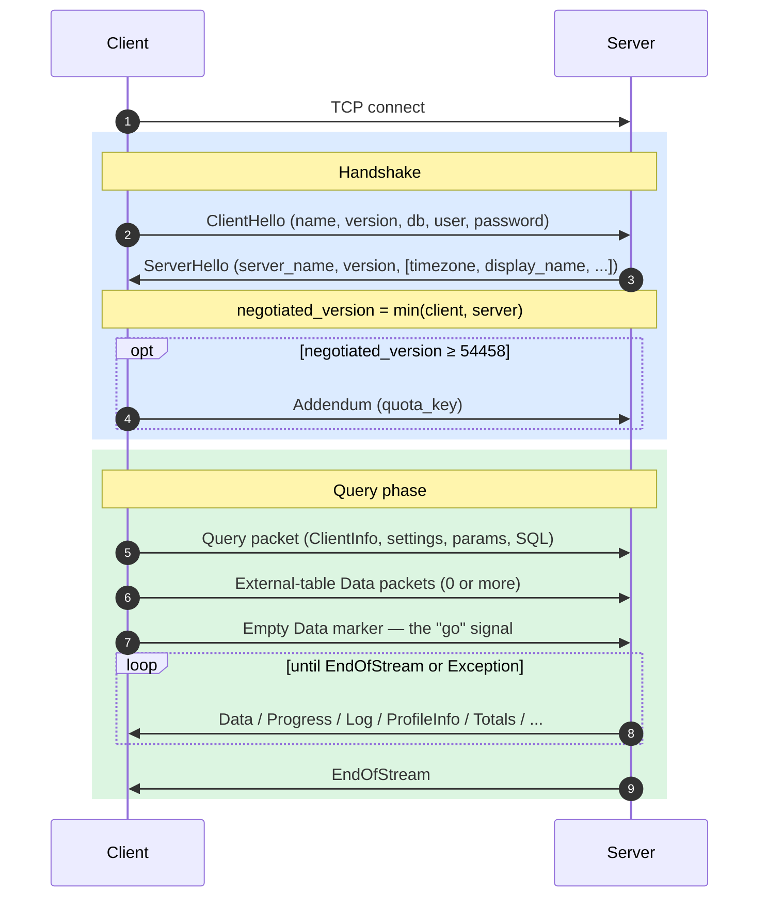
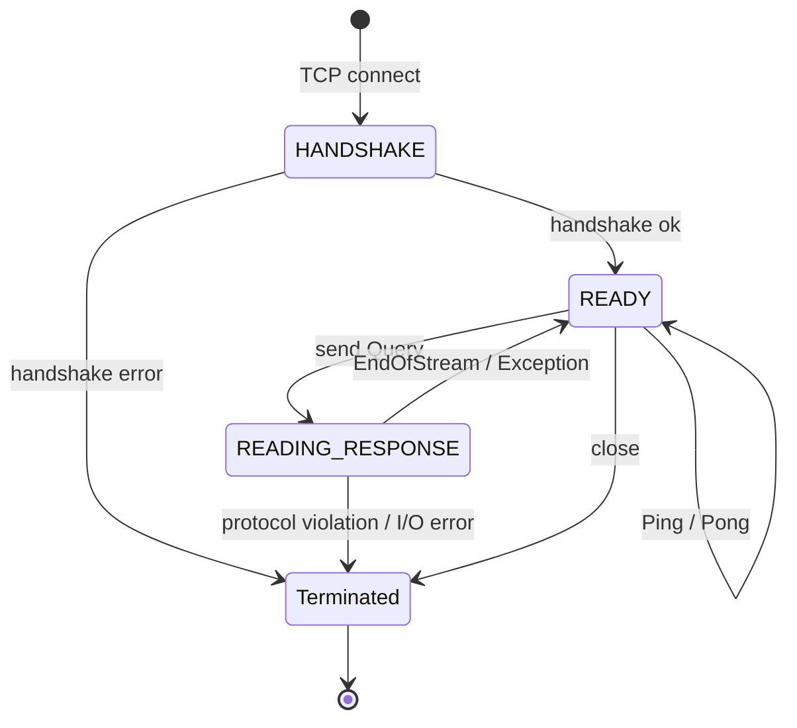
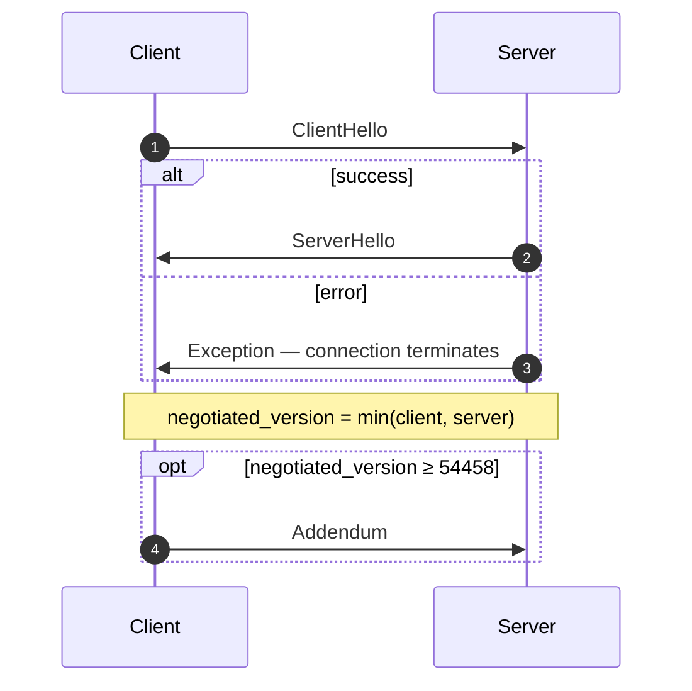
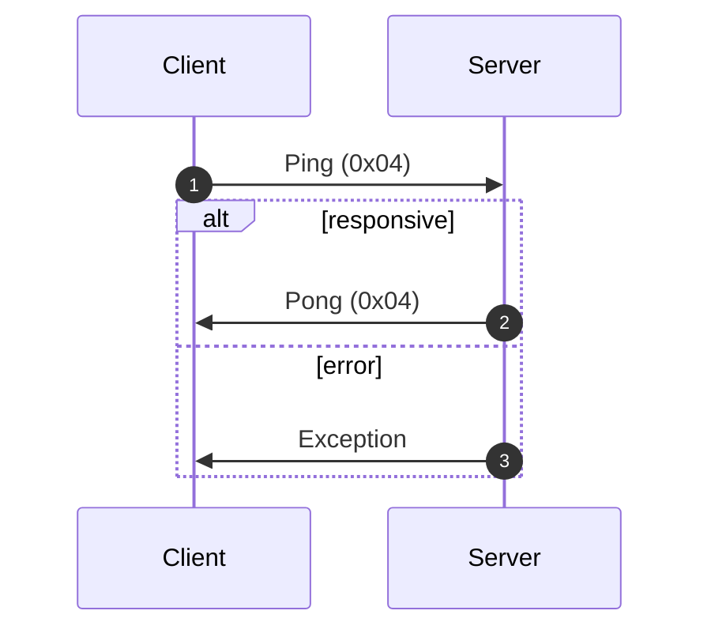
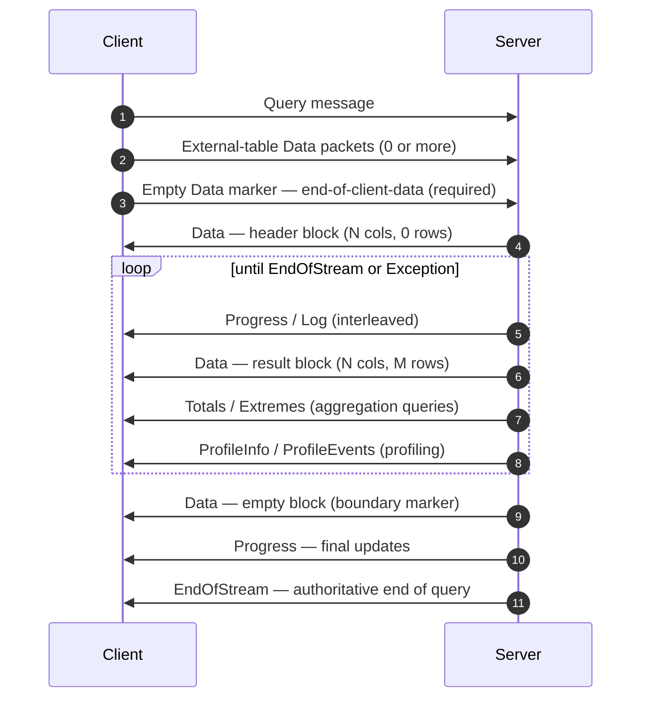
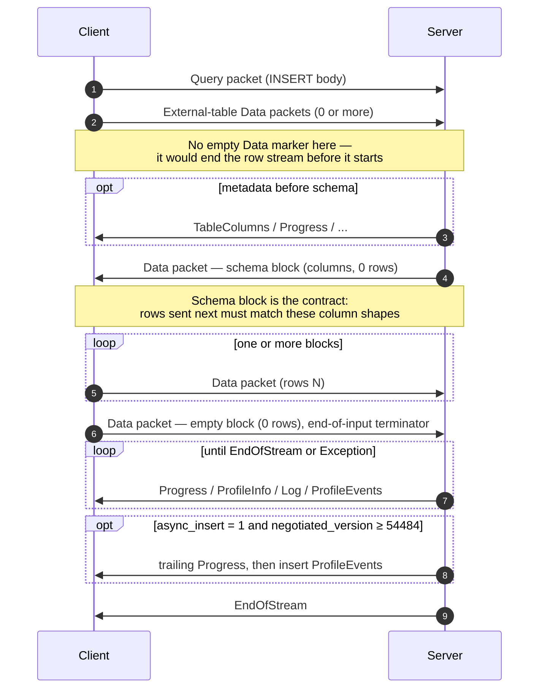
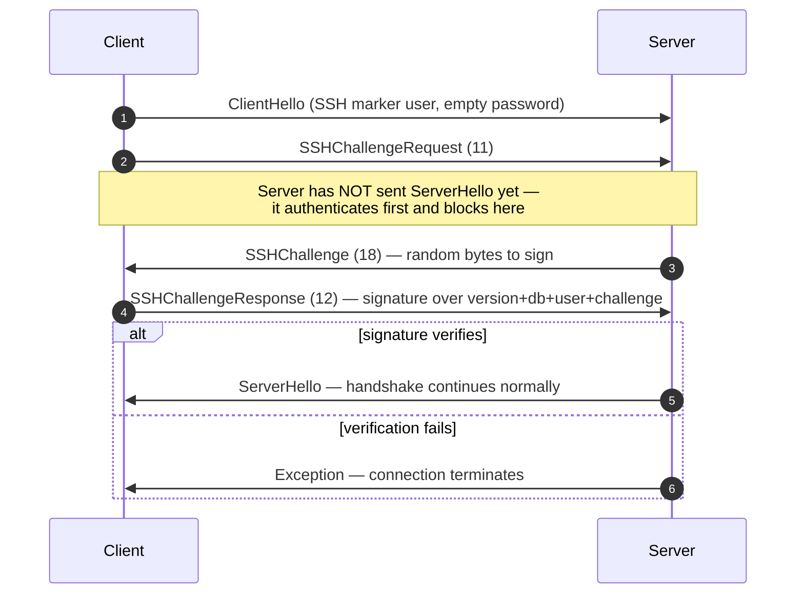

原生协议是 ClickHouse 客户端和服务器通过 TCP 进行通信时使用的二进制、面向连接的协议。它承载 SQL 查询、结果数据、`INSERT` 载荷、执行遥测以及错误信号。它也是命令行客户端、C++ 以及大多数第三方原生驱动所使用的底层协议。

本页介绍协议本身：数据包分帧、连接状态机、版本协商，以及每一种非 `Block` 消息的消息体。`Data` 家族数据包中的字节 (即 `Block`、其列以及各类型的编码) 属于另一部分内容，记录在 [Native Format](/zh/reference/interfaces/specs/NativeFormat) 规范中。

<Info>
  **配套规范**

  本页是这组成对规范中的一部分，与配套的 [Native Format](/zh/reference/interfaces/specs/NativeFormat) 规范一同发布。两份规范分工明确：本页负责数据包和传输层；Native Format 规范负责 `Data` 家族数据包内部的字节。
</Info>

该协议始终具有以下几个特性：它是二进制的，并且按位置解析；除 `BlockInfo` 内部外，没有字段标签，因此只要有一个字节错位，后续所有内容都会失去同步。它是有状态的，并且每个 TCP 连接一次只处理一个查询——不存在多路复用。定长整数采用小端序。

<div id="overview">
  ## 概览
</div>

| 属性   | 值                                                                   |
| ---- | ------------------------------------------------------------------- |
| 传输   | TCP，可选择使用 TLS 封装                                                    |
| 字节序  | 定长整数采用小端序                                                           |
| 编码   | 二进制和位置编码 (`BlockInfo` 除外，不含字段标签)                                    |
| 连接模型 | 有状态，一次只处理一个查询，不支持多路复用                                               |
| 版本机制 | 在握手期间协商；各项功能是否可用由版本决定                                               |
| 数据格式 | 所有表格数据均使用 [Native Format](/zh/reference/interfaces/specs/NativeFormat) |

在线上传输的每条消息都以一个 `VarUInt` 数据包类型编码开头，后面跟着一个消息体，其形态取决于该编码以及协商出的协议版本。

一个连接会经历三个阶段——先进行一次性握手，然后进行任意次数的 `Ping` 或 `Query` 交换，最后关闭：



原生 TCP 协议始终以 Native 格式传输表格数据，而不会理会 SQL 中任何 `FORMAT` 子句。重新格式化为 `RowBinary`、`CSV`、`JSON` 等格式是客户端的工作，这一步会在其解码 Native 块之后完成。 (`HTTP interface` 则是另一条代码路径，*确实*会遵循 `FORMAT` 子句；这里不作讨论。)

<div id="security">
  ## 安全
</div>

<div id="transport-security">
  ### 传输安全 (TLS)
</div>

TLS 位于传输层，处于协议层之下。启用后，整个 TCP 数据流都会被加密；而无论是否使用 TLS，协议消息在字节级别上都完全一致。

<div id="authentication">
  ### 身份验证
</div>

身份验证在握手阶段进行，也就是在 [`ClientHello`](#clienthello) 消息中完成。`user` 和 `password` 字段会以明文字符串形式传输，因此需要依靠传输层加密 (TLS) 来保护传输中的凭据。

从协议版本 54466 开始，支持 SSH 质询-响应身份验证——请参阅 [SSH 质询-响应身份验证](#ssh-authentication)。

<div id="inter-server-secret">
  ### 服务器间密钥
</div>

对于分布式查询执行，服务器之间会通过证明自己知晓某个共享密钥来相互进行身份验证，而无需在传输过程中直接发送该密钥。每个 Query 都会在 [`Query`](#query) 的字段 4 中携带一个 32 字节的 SHA-256 `auth_hash`，它根据 salt、nonce、已配置的密钥以及查询内容计算得出，接收服务器会重新计算并进行比对。此功能受 `INTERSERVER_SECRET` 功能开关 (v54441) 控制。外部客户端在此处始终发送空字符串。请参阅[服务器间身份验证](#inter-server-authentication)。

<div id="versioning-and-feature-gates">
  ## 版本控制与功能开关
</div>

<div id="version-negotiation">
  ### 版本协商
</div>

客户端和服务端都会在握手期间声明其支持的最高协议版本。**协商后的版本**取两者中较小者：

```text
negotiated_version = min(client_version, server_version)
```

此后的每条消息都会使用协商出的版本来决定传输时包含哪些字段。

<div id="feature-gates">
  ### 功能开关
</div>

每项功能都以引入它的协议版本作为标识；当协商出的版本大于或等于该版本号时，该功能即处于**生效**状态。

<Warning>
  当某项功能处于生效状态时，其字段**必须**出现在传输数据中。该协议严格按位置解析，因此如果省略受功能开关控制的字段，就会破坏其后每个字段对应的字节流。
</Warning>

<div id="feature-table">
  ### 功能列表
</div>

| 特性                                                      | 版本    | 影响                              | 线协议影响                                                                                                                                                                                                                                                                                                                                          |
| ------------------------------------------------------- | ----- | ------------------------------- | ---------------------------------------------------------------------------------------------------------------------------------------------------------------------------------------------------------------------------------------------------------------------------------------------------------------------------------------------- |
| BLOCK&#95;INFO                                          | all   | Block                           | 为每个 Block 添加 BlockInfo 前缀 (`is_overflows`、`bucket_number`) 。                                                                                                                                                                                                                                                                                   |
| CLIENT&#95;INFO                                         | 54032 | Query                           | 将 ClientInfo 块添加到 Query 数据包主体中。                                                                                                                                                                                                                                                                                                                |
| TIMEZONE                                                | 54058 | ServerHello                     | 在 ServerHello 中添加 `timezone` 字段。                                                                                                                                                                                                                                                                                                               |
| QUOTA&#95;KEY&#95;IN&#95;CLIENT&#95;INFO                | 54060 | ClientInfo                      | 在 ClientInfo 中添加 `quota_key` 字段。                                                                                                                                                                                                                                                                                                               |
| DISPLAY&#95;NAME                                        | 54372 | ServerHello                     | 在 ServerHello 中添加 `display_name` 字段。                                                                                                                                                                                                                                                                                                           |
| VERSION&#95;PATCH                                       | 54401 | ServerHello, ClientInfo         | 在两者中都添加 `version_patch` 字段。                                                                                                                                                                                                                                                                                                                    |
| SERVER&#95;LOGS                                         | 54406 | Log                             | 设置 `send_logs_level` 后，server 会发送日志数据包。                                                                                                                                                                                                                                                                                                        |
| COLUMN&#95;DEFAULTS&#95;METADATA                        | 54410 | TableColumns                    | server 可能会在 INSERT/输入 schema 块之前发送 [`TableColumns`](#tablecolumns) 数据包 (类型 11) ，其中包含列默认值元数据。仅当协商版本 ≥ 54410 **且** 启用了 `input_format_defaults_for_omitted_fields` 时才会发送。低于此版本时，该数据包绝不会发送；client 不得等待它。                                                                                                                                           |
| WRITE&#95;CLIENT&#95;INFO                               | 54420 | Progress                        | 在 Progress 中添加 `wrote_rows` 和 `wrote_bytes`。 (尽管名字如此，这**不会**控制 ClientInfo 块——控制它的是 `CLIENT_INFO` (v54032) 。)                                                                                                                                                                                                                                   |
| SETTINGS&#95;SERIALIZED&#95;AS&#95;STRINGS              | 54429 | Query (settings encoding)       | 更改始终存在的 settings 列表的编码**方式**；**不会**控制是否发送 settings。v54429+ 会将每个 setting 编码为 `(name, flags, value-as-string)`；旧版本对端则编码为 `(name, type-specific-binary-value)`，且不包含 flags。参见 [Setting](#setting)。                                                                                                                                                 |
| INTERSERVER&#95;SECRET                                  | 54441 | Query                           | 在 Query 中添加 inter-server `auth_hash` 字段——它是对集群 secret 加盐后的 SHA-256，而不是原始 secret。外部 client 会发送空字符串。参见 [Inter-server authentication](#inter-server-authentication)。                                                                                                                                                                              |
| OPEN&#95;TELEMETRY                                      | 54442 | ClientInfo                      | 在 ClientInfo 中添加 OpenTelemetry trace context。                                                                                                                                                                                                                                                                                                  |
| DISTRIBUTED&#95;DEPTH                                   | 54448 | ClientInfo                      | 在 ClientInfo 中添加 `distributed_depth` 字段。                                                                                                                                                                                                                                                                                                       |
| INITIAL&#95;QUERY&#95;START&#95;TIME                    | 54449 | ClientInfo                      | 添加 `initial_time` 字段 (Int64，固定宽度) 。                                                                                                                                                                                                                                                                                                            |
| PROFILE&#95;EVENTS                                      | 54451 | ProfileEvents                   | server 会在查询执行期间发送 ProfileEvents 数据包。                                                                                                                                                                                                                                                                                                           |
| PARALLEL&#95;REPLICAS                                   | 54453 | ClientInfo                      | 在 ClientInfo 中添加并行副本协调字段。                                                                                                                                                                                                                                                                                                                      |
| CUSTOM&#95;SERIALIZATION                                | 54454 | Block (Column)                  | 在每列的类型字符串后添加 `has_custom_serialization` 字节。                                                                                                                                                                                                                                                                                                    |
| ADDENDUM                                                | 54458 | Handshake                       | client 会在握手交换后发送附加信息 (`quota_key`) 。                                                                                                                                                                                                                                                                                                           |
| PARAMETERS                                              | 54459 | Query                           | 将参数列表添加到 Query 数据包主体中。                                                                                                                                                                                                                                                                                                                         |
| SERVER&#95;QUERY&#95;TIME&#95;IN&#95;PROGRESS           | 54460 | Progress                        | 在 Progress 中添加 `elapsed_ns` 字段。                                                                                                                                                                                                                                                                                                                |
| PASSWORD&#95;COMPLEXITY&#95;RULES                       | 54461 | ServerHello                     | 在 ServerHello 中添加密码策略正则模式列表和人类可读消息。                                                                                                                                                                                                                                                                                                            |
| INTERSERVER&#95;SECRET&#95;V2                           | 54462 | ServerHello                     | 在 ServerHello 中添加一个 8 字节的 `UInt64` nonce。用于 inter-server 查询签名；外部 client 会解码并忽略它。                                                                                                                                                                                                                                                               |
| TOTAL&#95;BYTES&#95;IN&#95;PROGRESS                     | 54463 | Progress                        | 在 Progress 中添加 `total_bytes_to_read` (VarUInt) 字段，位置在 `total_rows` 与 `wrote_rows` 之间。                                                                                                                                                                                                                                                          |
| TIMEZONE&#95;UPDATES                                    | 54464 | TimezoneUpdate                  | 添加 `TimezoneUpdate` server 数据包 (类型 17) 。主体：单个 `String`，携带会话时区。仅由 `input` table function 初始化器发送，紧跟在输入 schema 块之后，以便 client 使用 server 的 `session_timezone` 解析其发送的行。参见 [TimezoneUpdate](#timezoneupdate)。                                                                                                                                         |
| SPARSE&#95;SERIALIZATION                                | 54465 | Block (Column)                  | server 可将 `has_custom_serialization` 设为 1，并发送稀疏编码列。传输格式：1 字节 kind (0x01 = SPARSE) ，然后是以 EOG 结束的 VarUInt 偏移流，接着是按内部类型密集编码的非默认值。参见 [kind&#95;stack and sparse encoding](/zh/reference/interfaces/specs/NativeFormat#kind-stack-and-sparse-encoding)。                                                                                                |
| SSH&#95;AUTHENTICATION                                  | 54466 | Auth flow                       | 添加 SSH 质询-响应身份验证。可选启用：client 发送形如 `" SSH KEY AUTHENTICATION " + <real_user>` 的 `user`，并使用空密码触发该流程。参见 [SSH challenge-response authentication](#ssh-authentication)。                                                                                                                                                                             |
| TABLE&#95;READ&#95;ONLY&#95;CHECK                       | 54467 | TablesStatusResponse            | 在 TablesStatusResponse 中为每个表对应的行添加 `is_readonly` flag。不会发出 `TablesStatusRequest` 的外部 client 不会看到任何传输格式变化。                                                                                                                                                                                                                                      |
| SYSTEM&#95;KEYWORDS&#95;TABLE                           | 54468 | system tables                   | server 会填充 `system.keywords`，以便规范的 `clickhouse-client` 可以自动补全关键字。native-protocol 线协议没有变化。                                                                                                                                                                                                                                                      |
| ROWS&#95;BEFORE&#95;AGGREGATION                         | 54469 | ProfileInfo                     | 按此顺序在 ProfileInfo 末尾添加 `applied_aggregation` (Bool) 和 `rows_before_aggregation` (VarUInt) 。                                                                                                                                                                                                                                                    |
| CHUNKED&#95;PROTOCOL                                    | 54470 | Connection framing              | 按数据包分块的分帧机制会包装每个数据包主体。在 Addendum 中协商。ServerHello 携带 server 对每个方向的偏好；Addendum 携带 client 的最终选择。参见 [chunked framing](#chunked-framing)。                                                                                                                                                                                                           |
| VERSIONED&#95;PARALLEL&#95;REPLICAS&#95;PROTOCOL        | 54471 | ServerHello, Addendum           | 双方会交换一个 `VarUInt` 并行副本协调协议版本。ServerHello 中该字段位于 **紧接 `protocol_version` 之后** (在 `timezone` 之前) 。Addendum 中该字段追加在分块协议字符串之后。当前值：`7` (`DBMS_PARALLEL_REPLICAS_PROTOCOL_VERSION`) 。                                                                                                                                                                |
| INTERSERVER&#95;EXTERNALLY&#95;GRANTED&#95;ROLES        | 54472 | 查询                              | 在 Query body 中，于 settings 终止符和 interserver-secret 哈希之间新增一个 `String external_roles` 字段。外部 client 发送空角色列表 (单个字节 `0x00`，即 String 封装中的 VarUInt 0) 。                                                                                                                                                                                                |
| V2&#95;DYNAMIC&#95;AND&#95;JSON&#95;SERIALIZATION       | 54473 | 列 body                          | server 可能会对 `Dynamic` 和 `JSON` 列类型输出 V2 serialization——这决定了它们使用哪个 `state_prefix` version。参见[版本化类型](/zh/reference/interfaces/specs/NativeFormat#versioned-types)。                                                                                                                                                                                  |
| SERVER&#95;SETTINGS                                     | 54474 | ServerHello                     | server 会在 ServerHello 尾部的 `nonce` 之后，以列表形式广播其非默认 settings。格式为以空 key 结尾的 `(key, flags, value)` 三元组——与 Query packet 的 settings 列表相同。                                                                                                                                                                                                             |
| QUERY&#95;AND&#95;LINE&#95;NUMBERS                      | 54475 | ClientInfo                      | 在 ClientInfo 尾部新增 `script_query_number` (VarUInt) 和 `script_line_number` (VarUInt) 。由 clickhouse-client 用于多 statement 脚本的错误定位；外部 client 发送 `0, 0`。                                                                                                                                                                                             |
| JWT&#95;IN&#95;INTERSERVER                              | 54476 | ClientInfo                      | 在 ClientInfo 尾部新增一个表示 JWT 是否存在的 UInt8，以及可选的 `String jwt`。外部 client (无 JWT) 发送字节 `0x00`。 (在 C++ 中拼写为 `DBMS_MIN_REVISON_WITH_JWT_IN_INTERSERVER`——注意该常量名中的拼写错误。)                                                                                                                                                                                 |
| QUERY&#95;PLAN&#95;SERIALIZATION                        | 54477 | ServerHello, QueryPlan packet   | ServerHello 会在 server settings 之后追加 `VarUInt query_plan_serialization_version`。同时引入 `ClientPacket::QueryPlan` (代码 `13`) ，用于 server 间传递预构建的查询计划——外部 client 不会发送。                                                                                                                                                                                |
| PARALLEL&#95;BLOCK&#95;MARSHALLING                      | 54478 | 块 (列)                           | server 可能会将列包装在 `ColumnBLOB` (内联压缩) 中进行并行处理。其启用条件是查询启用了 compression 且 `rows > 1`；否则仍使用常规的列传输格式。对于从不在传出 Query packet 上启用 compression 的 client，不会看到传输格式变化。                                                                                                                                                                                       |
| VERSIONED&#95;CLUSTER&#95;FUNCTION&#95;PROTOCOL         | 54479 | ServerHello                     | 在 ServerHello 尾部新增 `VarUInt cluster_function_protocol_version`。用于 `*Cluster` table function (`s3Cluster` 等) 。外部 client 会解码后忽略。                                                                                                                                                                                                                 |
| OUT&#95;OF&#95;ORDER&#95;BUCKETS&#95;IN&#95;AGGREGATION | 54480 | BlockInfo                       | 在 BlockInfo 的带字段标签 stream 中新增字段 3 (`out_of_order_buckets: Vec<Int32>`) 。解码方式为 `[VarUInt count][Int32]*count`。外部 client 自身不会发出该字段；解码器会读取 server 发送的任何非空列表。                                                                                                                                                                                      |
| COMPRESSED&#95;LOGS&#95;PROFILE&#95;EVENTS&#95;COLUMNS  | 54481 | 日志, ProfileEvents, TableColumns | server 可能会将 [`Log`](#log)、[`ProfileEvents`](#profileevents) 和 [`TableColumns`](#tablecolumns) packet body 包装在[压缩帧](/zh/reference/interfaces/specs/NativeFormat#compression-frame)中。在此版本中，这三种 body 都通过同一条可选压缩的输出路径传输，且只有当查询设置了 `compression = true` 时，才会真正使用压缩帧。对于从不在传出 Query packet 上启用 compression 的 client，不会看到传输格式变化。                          |
| REPLICATED&#95;SERIALIZATION                            | 54482 | 块 (列)                           | server 可能会输出 kind&#95;stack 为 `0x04 = REPLICATED` 的列——这是一种针对重复值的字典式紧凑表示——参见[kind&#95;stack 与稀疏编码](/zh/reference/interfaces/specs/NativeFormat#kind-stack-and-sparse-encoding)。低于此版本时，写入器会在发送前展开这类列。通过索引查找解码 (每行 `elements[indexes[i]]`) ；支持叶子类型以及 `Nullable`/`Array`/`Tuple`/`Map`/`Nested`/`LowCardinality` 内部类型。                                |
| NULLABLE&#95;SPARSE&#95;SERIALIZATION                   | 54483 | 块 (列)                           | 将稀疏 serialization 与 `Nullable(T)` 组合使用。低于此版本时，写入器会在发送前为 Nullable 列展开稀疏表示；在 v54483+ 中，传输数据为 sparse-over-Nullable。参见[kind&#95;stack 与稀疏编码](/zh/reference/interfaces/specs/NativeFormat#kind-stack-and-sparse-encoding)。                                                                                                                             |
| PROGRESS&#95;IN&#95;ASYNC&#95;INSERT                    | 54484 | Progress (INSERT)               | 对于**异步** INSERT (`async_insert = 1`) ，一旦 insert 被刷新，server 会在 `EndOfStream` 之前额外发送一个 [`Progress`](#progress) packet，然后发送该 insert 的 `ProfileEvents`。其启用条件是*协商后的* version ≥ 54484；低于该版本时，server 会省略这个尾随的 Progress。Progress 的传输格式本身没有变化——新增的只是发送行为。实际中，该增量承载的是耗时；写入行计数器则通过随附的 ProfileEvents 报告。已经能够处理交错 Progress 的 client 无需修改格式，只需容忍多出一个 packet。 |
| CLIENT&#95;AGENT&#95;IN&#95;CLIENT&#95;INFO             | 54485 | ClientInfo                      | 在 ClientInfo 尾部新增一个 `client_agent` `String`。规范 client 会自动从其环境中检测 agent 标识符 (例如 `claude-code`、`cursor`、`gemini-cli`，或 `AGENT` 变量的值) ；如果外部 client 未检测到任何值，则发送空字符串。一旦协商 version ≥ 54485，该字段就是必需的——省略它会导致 Query packet 其余部分失去同步。                                                                                                                   |

<div id="packet-envelope">
  ## 数据包封装
</div>

在线上传输的每条消息，无论哪个方向，其外层结构都相同：

```text
[VarUInt: packet_type_code]    always encoded as VarUInt
[message body]                 format depends on packet_type_code
```

完整的数据包类型表见[数据包类型参考](#packet-type-reference)。

数据包类型是 `VarUInt`，而不是定宽字节。对于小于 128 的值，`VarUInt` 产生的仍然是相同的单个字节，但实现必须使用 `VarUInt` 编码，以确保当未来的数据包类型达到 128 或更大时仍能保持兼容。

[消息参考](#message-reference)仅说明每个数据包的 **包体** —— 即位于数据包类型代码之后的字节。字段编号从 1 开始，包体中的第一个字段编号为 1。

<div id="chunked-framing">
  ### 分块帧封装 (v54470+)
</div>

当 `CHUNKED_PROTOCOL` 功能**协商完成**后 (参见[握手](#handshake-phase)) ，线路上传输的每个数据包都会使用分块帧进行封装。这种封装是**按方向分别进行**的：client→server 和 server→client 会分别协商，最终可能采用不同的模式 (分块或无帧封装) 。

每个数据包在线路上的布局：

```text
<chunk>...   one or more chunks; their payloads concatenated form the whole packet
[u32 LE = 0] zero-size terminator marking end of packet
```

每个 chunk 的线格式：

```text
[u32 LE: chunk_size]   chunk_size in [1, UINT32_MAX]
[chunk_size bytes]     packet bytes (see note below)
```

`VarUInt` 数据包类型位于分块流 **内部**：它是数据包载荷的第一个字节 (即第一个 chunk 的第一个字节) ，而不是在分帧之前单独提前发送的一个字节。每个数据包的 chunk 载荷都是来自[数据包封装](#packet-envelope)的完整 `[VarUInt packet_type_code][message body]`。如果客户端把数据包类型放在分块流之外，对端就会把这个类型字节当作 `u32` chunk 大小的第一个字节来读取，导致连接失去同步。

如果写入端的缓冲区在数据包中途写满，单个数据包可以拆分到多个 chunk 中；拆分点可以出现在任何位置，包括数据包类型的 `VarUInt` 内部。读取端会拼接各个 chunk 载荷，并将末尾的 4 字节零值视为透明的数据包边界——它会将其消费掉，但不会把它暴露给负责读取数据包消息体的逻辑。

没有消息体的数据包仍然会被封装：像 `Ping` 或 `Pong` 这样的单字节数据包，在协商启用分块后会变成 `[u32 size = 1][0x04][u32 0]`。本页其他地方任何“在线路上是单字节”的描述，指的都是分块前的形式。

**协商。** ServerHello 和 Addendum 各自携带两个 `String` 字段，每个方向一个，取值来自 `{"chunked", "notchunked", "chunked_optional", "notchunked_optional"}`：

* `chunked` / `notchunked` 是严格模式：该方向要求必须精确使用该模式。
* `_optional` 变体是灵活的：它们接受对端选择的任意模式。

每个方向的最终协商值按双方成对计算：

| Server pref         | Client pref         | Agreed                                   |
| ------------------- | ------------------- | ---------------------------------------- |
| `*_optional`        | anything            | 跟随 CLIENT (即其 `starts_with("chunked")`)  |
| anything            | `*_optional`        | 跟随 SERVER                                |
| `chunked` strict    | `chunked` strict    | `chunked`                                |
| `notchunked` strict | `notchunked` strict | `notchunked`                             |
| strict mismatch     | strict mismatch     | **协议错误** —— 该连接 MUST 被断开                 |

在客户端一侧，客户端的 SEND 偏好会与服务端的 RECV 偏好协商，反之亦然。

**时序。** 这些协商字符串通过未分帧的线路传输：ClientHello → ServerHello (服务端偏好) → Addendum (客户端的协商结果值) 。分帧模式切换适用于 Addendum 被刷出 *之后* 发送的每一个字节。Addendum 本身、ClientHello 和 ServerHello 始终不分帧。

<div id="connection-lifecycle">
  ## 连接生命周期
</div>

在任何时刻，连接都只会处于以下四种状态之一：`HANDSHAKE`、`READY`、`READING_RESPONSE`，或已终止。由于该协议不支持多路复用，如果客户端在尚未读取完上一个响应之前就发送新请求，就会导致传输中的字节交错，从而破坏数据流。

<div id="states">
  ### 状态
</div>



顺畅路径沿直线向下推进——`HANDSHAKE → READY → READING_RESPONSE → READY`——其中 `Ping`/`Pong` 会形成自循环，而所有失败分支最终都会汇入唯一的 `Terminated` 终态。

| State              | Description                                                                                                                                       |
| ------------------ | ------------------------------------------------------------------------------------------------------------------------------------------------- |
| `HANDSHAKE`        | TCP connection 打开后的初始状态。只有[握手](#handshake-phase)消息是有效的。成功时转换到 `READY`，失败时则终止。                                                                     |
| `READY`            | 空闲。客户端可以发送 [Ping](#ping-phase)、[Query](#query-phase)，或关闭连接。该连接可以无限期停留在 `READY` 状态 (受 `idle_connection_timeout` 限制，参见[连接限制](#connection-limits)) 。 |
| `READING_RESPONSE` | 当客户端发送 Query 时进入此状态。客户端必须先完整读取服务器的响应 stream，才能返回 `READY`。此时唯一允许的 client→server 数据包是 Cancel (本页未说明) 。                                              |
| Terminated         | 不再可用。客户端必须打开新的 TCP connection 并重新开始握手。                                                                                                            |

<div id="handshake-phase">
  ### 握手阶段
</div>

进行身份验证并协商协议版本。每个连接只会发生一次，并且先于任何其他操作。

TCP 连接刚刚建立，双方尚未交换任何消息。流程如下：



1. 客户端发送 [`ClientHello`](#clienthello)，其中包含其支持的最高协议版本。

2. 客户端读取响应，并根据数据包类型进行分发处理：

   | 数据包类型           | 操作                                                                                               |
   | --------------- | ------------------------------------------------------------------------------------------------ |
   | `Hello` (0)     | 解码 [`ServerHello`](#serverhello)。计算 `negotiated_version = min(client_ver, server_ver)`。继续执行步骤 3。 |
   | `Exception` (2) | 解码 [`Exception`](#exception)。将其作为错误返回，并终止连接。                                                     |
   | anything else   | 违反协议。终止连接。                                                                                       |

3. 如果 `negotiated_version ≥ 54458` (`ADDENDUM` 功能) ，客户端会发送一个 [`Addendum`](#addendum)。这一决定基于**协商后的**版本，而不是客户端声明的版本。

成功时，连接会进入 `READY`；发生任何错误时，连接都会终止。

<div id="ping-phase">
  ### Ping 阶段
</div>

一种应用层的存活检查，独立于 TCP keepalive。成功完成一次 Ping/Pong 往返即可确认 TCP 连接在两个方向上都保持存活，并且服务器能够正常响应。Ping 是无状态的，与任何查询都不关联，因此多个连续的 Ping 彼此独立。

从 `READY` 开始，流程如下：



1. 客户端发送 [`Ping`](#ping)。
2. 客户端读取响应：

   | 数据包类型           | 操作                                      |
   | --------------- | --------------------------------------- |
   | `Pong` (4)      | 确认存活，返回到 `READY`。                       |
   | `Exception` (2) | 解码 [`Exception`](#exception)，并将其作为错误返回。 |
   | 其他任何类型          | 协议违规。                                   |

<div id="query-phase">
  ### 查询阶段
</div>

客户端提交一条 SQL 语句；服务器以流式方式返回结果块和执行遥测信息。响应由一系列数据包组成，并且恰好以一个 `EndOfStream` 或 `Exception` 结束。

从 `READY` 开始，流程如下：



如果在任意阶段发生错误，服务端会发送 `Exception` 而不是 `EndOfStream`，从而终止查询。

1. 客户端发送带有唯一 `query_id` (通常为 UUID) 的 [`Query`](#query)。
2. 客户端发送所有外部表，然后发送空的 Data 标记。空 Data 数据包的字段为 `table_name = ""`、`num_columns = 0`、`num_rows = 0`。服务端在收到此标记之前不会开始执行查询。
3. 客户端进入 `READING_RESPONSE`，并刷写其写入缓冲区。
4. 客户端在循环中读取响应数据包，并按类型分发处理：

   | 数据包类型          | Action                                                                      |
   | -------------------- | --------------------------------------------------------------------------- |
   | `Data` (1)           | 解码该块。第一个 Data 是 schema 头；后续的是结果块 (累积) ；空块是边界标记。`num_rows == 0` **不是** 查询结束。 |
   | `Progress` (3)       | 执行指标。每个数据包都是相对于前一个数据包的**增量**——在本地累积。                                        |
   | `EndOfStream` (5)    | 查询完成。退出循环并返回 `READY`。                                                       |
   | `ProfileInfo` (6)    | 执行后的 profiling 数据。                                                          |
   | `Totals` (7)         | aggregation totals 块 (与 Data 相同的传输格式) 。                                     |
   | `Extremes` (8)       | 最小/最大值块 (与 Data 相同的传输格式) 。                                                  |
   | `Log` (10)           | 服务端日志行。                                                                     |
   | `TableColumns` (11)  | 列默认值 metadata。                                                              |
   | `ProfileEvents` (14) | 性能计数器。                                                                      |
   | `Exception` (2)      | 解码后作为错误返回。退出循环并返回 `READY`。                                                  |
   | anything else        | 在查询阶段属于异常情况。终止连接。                                                           |

收到 `EndOfStream` 或已处理的 `Exception` 后，连接会返回 `READY`。如果发生协议违规或 I/O 错误，连接会被终止。

<Note>
  `num_rows == 0` 这种情况很容易让新实现踩坑。零行块是边界标记或 schema 头，而不是流结束信号。只有 `EndOfStream` 或 `Exception` 才会结束响应。
</Note>

<div id="insert-phase">
  ### INSERT 阶段
</div>

INSERT 阶段是在[查询阶段](#query-phase)的基础上增加了两次额外的交互。客户端提交一条 `INSERT` 语句；服务器返回一个描述目标表的 **schema 块**；客户端随后以流式方式发送包含这些行的 Data packets，再发送空的 Data 标记；最后，服务器以 `EndOfStream` 或 `Exception` 结束。

从 `READY` 状态开始，SQL 采用如下形式的 `INSERT`：`INSERT INTO <table> [(<cols>)] VALUES` —— 不包含内联的 `VALUES (...)` 字面量，因为行数据是通过 Data packets 传输的。流程如下：



1. 客户端发送 [`查询`](#query)，并将 `body` 设为 INSERT SQL。
2. 客户端发送所有外部表 (这种情况在 INSERT 中较少见) 。与 [查询 phase](#query-phase) 不同，这里**不会**发送空的 Data 标记。`INSERT` 的 `查询` 数据包会连同待发送的数据一起发出，因此表示数据结束的空数据块会推迟到步骤 5；如果在 schema 块之前发送它，服务器会将其视为行流结束，从而以 0 行完成 INSERT，随后再把第一个真实的行数据包解析为一个游离的顶层数据包。
3. 客户端持续读取元数据包 (TableColumns、Progress、ProfileInfo、Log、ProfileEvents) ，直到读到 schema Data 数据包——这是一个 0 行但包含完整列结构 (名称和类型) 的 Block。schema 块就是约定：客户端接下来发送的行必须符合这些列的形态。
4. 客户端发送一个或多个数据块。对于每个块，它都会先写入 `VarUInt(ClientPacket::Data = 2)`，然后写入表示空外部表名称的 `String("")`，接着写入 Block。列类型必须按位置与 schema 块中的列对齐。
5. 客户端发送输入结束标记：一个带空 Block (0 列、0 行) 的 Data 数据包。
6. 客户端持续读取响应流，直到 `EndOfStream` (成功) 或 `Exception` (失败) 。

**异步 INSERT (v54484+) 。** 当查询带有 `async_insert = 1` 时，服务器会将这些行放入队列，并作为某个批次的一部分进行刷写。在协商版本 ≥ 54484 (`PROGRESS_IN_ASYNC_INSERT`) 时，一旦刷写完成，服务器会额外发出一个 [`Progress`](#progress) 数据包，紧接着发送该次 insert 的 `ProfileEvents`，然后是 `EndOfStream`。在 54484 以下，服务器会跳过这个尾部的 Progress。该数据包是一个普通的 `Progress`；由于服务器在合并写入计数前会重置查询管道，因此其中的增量实际上只包含已用时间，而写入行数和字节统计则通过随附的 `ProfileEvents` 传递给客户端。对于已经在步骤 6 中处理交错 Progress 的客户端，只需再接受一个额外的数据包即可。

连接在收到 `EndOfStream` 或已处理的 `Exception` 后会返回 `READY`。协议违规和 I/O 错误会终止连接。

<div id="message-reference">
  ## 消息参考
</div>

各字段按 wire 顺序列出。`Type` 列使用：

* `VarUInt` — 可变长度无符号整数 (参见 [VarUInt](/zh/reference/interfaces/specs/NativeFormat#varuint)) 。
* `String` — 以 VarUInt 为前缀的字节序列 (参见 [String](/zh/reference/interfaces/specs/NativeFormat#string)) 。
* `UInt8`、`Int32` 等 — 固定宽度的小端序整数。
* `Bool` — 单个字节，`0x00` 或 `0x01`。

`Role` 列说明每个字段由谁使用：

* **client** — 由外部客户端设置。
* **inter-server** — 仅对服务器之间的通信有意义；外部客户端写入默认值。
* **universal** — 两者都会使用。

这些表仅记录每个数据包的包体，即位于数据包类型代码之后的部分。

<div id="clienthello">
  ### ClientHello (数据包类型 0)
</div>

客户端 → 服务端。TCP 连接建立后发送的第一条消息。

| # | 字段                   | 类型      | 角色 | 描述                                 |
| - | -------------------- | ------- | -- | ---------------------------------- |
| 1 | client&#95;name      | String  | 通用 | 客户端标识符 (例如 `"clickhouse-client"`)  |
| 2 | version&#95;major    | VarUInt | 通用 | 客户端主版本号                            |
| 3 | version&#95;minor    | VarUInt | 通用 | 客户端次版本号                            |
| 4 | protocol&#95;version | VarUInt | 通用 | 客户端支持的最高协议版本                       |
| 5 | database             | String  | 通用 | 默认数据库名称                            |
| 6 | user                 | String  | 通用 | 用于身份验证的用户名                         |
| 7 | password             | String  | 通用 | 密码 (明文)                            |

<div id="serverhello">
  ### ServerHello (packet type 0)
</div>

Server → Client。对 ClientHello 在身份验证成功后的响应。

| #  | Field                                          | Type      | Role         | Condition                                                 | Description                                                                                                                                                                                |
| -- | ---------------------------------------------- | --------- | ------------ | --------------------------------------------------------- | ------------------------------------------------------------------------------------------------------------------------------------------------------------------------------------------ |
| 1  | server&#95;name                                | String    | universal    | always                                                    | Server 标识符                                                                                                                                                                                 |
| 2  | version&#95;major                              | VarUInt   | universal    | always                                                    | Server 主版本号                                                                                                                                                                                |
| 3  | version&#95;minor                              | VarUInt   | universal    | always                                                    | Server 次版本号                                                                                                                                                                                |
| 4  | protocol&#95;version                           | VarUInt   | universal    | always                                                    | Server 的协议版本                                                                                                                                                                               |
| 4a | parallel&#95;replicas&#95;protocol&#95;version | VarUInt   | universal    | VERSIONED&#95;PARALLEL&#95;REPLICAS&#95;PROTOCOL (v54471) | Server 的并行副本协调协议版本。**Wire 位置：紧接在 `protocol_version` 之后**，位于 `timezone` 之前。当前值：`7`。                                                                                                         |
| 5  | timezone                                       | String    | universal    | TIMEZONE (v54058)                                         | 服务器时区 (例如 `"UTC"`)                                                                                                                                                                         |
| 6  | display&#95;name                               | String    | universal    | DISPLAY&#95;NAME (v54372)                                 | 便于人类阅读的 Server 名称                                                                                                                                                                          |
| 7  | version&#95;patch                              | VarUInt   | universal    | VERSION&#95;PATCH (v54401)                                | Server 补丁版本号                                                                                                                                                                               |
| 8  | proto&#95;send&#95;chunked&#95;srv             | String    | universal    | CHUNKED&#95;PROTOCOL (v54470)                             | Server 首选的 Outbound 分块方式。可取值为 `"chunked"`、`"notchunked"`、`"chunked_optional"`、`"notchunked_optional"`。参见[分块成帧](#chunked-framing)。**尽管它的版本门槛更高，但在 wire 上位于 `password_complexity_rules` 之前。** |
| 9  | proto&#95;recv&#95;chunked&#95;srv             | String    | universal    | CHUNKED&#95;PROTOCOL (v54470)                             | Server 首选的 Inbound 分块方式。取值与字段 8 相同。                                                                                                                                                        |
| 10 | password&#95;complexity&#95;rules              | Rule[]    | universal    | PASSWORD&#95;COMPLEXITY&#95;RULES (v54461)                | Server 的密码策略。格式为 `VarUInt count`，后跟 `count × Rule`。见下文。                                                                                                                                    |
| 11 | nonce                                          | UInt64    | inter-server | INTERSERVER&#95;SECRET&#95;V2 (v54462)                    | 8 字节 LE 随机 nonce。Server 的 inter-server 查询签名方案会使用它。外部客户端 MUST 对其进行解码 (以保持 stream 对齐) ，并且 SHOULD 忽略该值。                                                                                       |
| 12 | server&#95;settings                            | Setting[] | universal    | SERVER&#95;SETTINGS (v54474)                              | Server 广播的非默认 Settings。格式：零个或多个 `(String key, VarUInt flags, String value)` 三元组，以空 key 结束。与 [Query packet 的 settings 列表](#setting)相同。                                                      |
| 13 | query&#95;plan&#95;serialization&#95;version   | VarUInt   | universal    | QUERY&#95;PLAN&#95;SERIALIZATION (v54477)                 | Server 支持的 query plan serialization version。外部客户端解码后忽略即可。                                                                                                                                  |
| 14 | cluster&#95;function&#95;protocol&#95;version  | VarUInt   | universal    | VERSIONED&#95;CLUSTER&#95;FUNCTION&#95;PROTOCOL (v54479)  | Server 的 `*Cluster` 表函数协议版本。外部客户端解码后忽略即可。                                                                                                                                                  |

**Rule** — `password_complexity_rules` 中的一个元素：

| # | Field   | Type   | Description             |
| - | ------- | ------ | ----------------------- |
| 1 | pattern | String | 合规密码必须匹配的正则表达式 pattern。 |
| 2 | message | String | 密码不符合此规则时显示的便于人类阅读的说明。  |

该列表反映 server operator 配置的密码策略，仅起提示作用——server 不会在握手期间强制执行这些规则。提供密码修改/设置功能的客户端可利用这些规则，在将不合规密码发送给 server 之前先提示错误。

<Note>
  为限制恶意或配置错误的 server 导致的 resource 消耗，请将解码后的 `count` 上限设为 256 个 entries，并将每个 `pattern` 和 `message` String 的上限设为 4096 字节。对于未配置密码策略的 server，`count` 为 `0` (后面没有任何成对项) 是常见情况。
</Note>

<div id="addendum">
  ### 附加信息 (无数据包类型)
</div>

客户端 → 服务器，受 `ADDENDUM` (v54458) 控制。在握手交换完成后立即发送。它不是一种独立的数据包类型——这些字段会以原始形式直接在传输中发送，前面不带数据包类型字节前缀。

| # | Field                                          | Type    | Role      | Condition                                                 | Description                                                                                 |
| - | ---------------------------------------------- | ------- | --------- | --------------------------------------------------------- | ------------------------------------------------------------------------------------------- |
| 1 | quota&#95;key                                  | String  | universal | always                                                    | 用于服务器端按配额键区分的资源配额。未使用键控配额的客户端会发送空字符串。                                                       |
| 2 | proto&#95;send&#95;chunked                     | String  | universal | CHUNKED&#95;PROTOCOL (v54470)                             | 客户端协商出的出站分块方式：`"chunked"` 或 `"notchunked"`。根据 ServerHello 中的 `proto_recv_chunked_srv` 计算得出。 |
| 3 | proto&#95;recv&#95;chunked                     | String  | universal | CHUNKED&#95;PROTOCOL (v54470)                             | 客户端协商出的入站分块方式。根据 `proto_send_chunked_srv` 计算得出。                                             |
| 4 | parallel&#95;replicas&#95;protocol&#95;version | VarUInt | universal | VERSIONED&#95;PARALLEL&#95;REPLICAS&#95;PROTOCOL (v54471) | 客户端支持的并行副本协调协议版本。不参与分布式查询的外部客户端仍应发送一个有效版本 (当前为 `7`) ，以便通过服务器的兼容性检查。                         |

分块帧格式的切换会在此附加信息写出后*才*生效——附加信息本身不带帧封装。

<div id="ping">
  ### Ping (数据包类型 4)
</div>

客户端 → 服务器。无消息体——在分块成帧之前，该数据包仅为单个字节 `0x04`；协商启用分块后，该字节会成为一个块的单字节载荷 (参见 [分块成帧](#chunked-framing)) 。

<div id="pong">
  ### Pong (数据包类型 4)
</div>

服务器 → 客户端。无消息体——在采用分块帧之前，该数据包仅为单个字节 `0x04`；协商启用分块传输后，该字节会作为某个分块的单字节载荷 (参见[分块成帧](#chunked-framing)) 。

<div id="exception">
  ### Exception (数据包类型 2)
</div>

服务器 → 客户端。当服务器在任意阶段发生错误时发送。

| # | 字段                   | 类型     | 角色        | 描述                                  |
| - | -------------------- | ------ | --------- | ----------------------------------- |
| 1 | code                 | Int32  | universal | 错误代码                                |
| 2 | name                 | String | universal | Exception 类 (例如：`"DB::Exception"`)  |
| 3 | message              | String | universal | 人类可读的错误消息                           |
| 4 | stack&#95;trace      | String | universal | 服务器端堆栈跟踪                            |
| 5 | has&#95;nested (已废弃) | Bool   | universal | 已废弃的兼容性字节。服务器始终将其写为 `false`         |

<div id="query">
  ### 查询 (数据包类型 1)
</div>

客户端 → 服务器。

| #  | Field              | Type        | Role         | Condition                                                 | Description                                                                                                                                                                                                                        |
| -- | ------------------ | ----------- | ------------ | --------------------------------------------------------- | ---------------------------------------------------------------------------------------------------------------------------------------------------------------------------------------------------------------------------------- |
| 1  | query&#95;id       | String      | universal    | always                                                    | 唯一查询标识符 (UUID)                                                                                                                                                                                                                     |
| 2  | client&#95;info    | ClientInfo  | universal    | CLIENT&#95;INFO (v54032)                                  | 参见 [ClientInfo](#clientinfo)                                                                                                                                                                                                       |
| 3  | settings           | Setting[]   | universal    | always                                                    | 参见 [Setting](#setting)。**始终存在** (以空键结束) ；只有每个 setting 的*编码方式*受版本限制——参见 [Setting](#setting) 中关于编码的说明。对于协商版本低于 `54429` 的情况，客户端不得省略此字段。                                                                                               |
| 3a | external&#95;roles | String      | universal    | INTERSERVER&#95;EXTERNALLY&#95;GRANTED&#95;ROLES (v54472) | 外部授予角色名称列表的序列化结果。空列表 = 字节 `0x00` (VarUInt 0) ，并封装在 String 中 (在线路上传输时为 `[VarUInt 1][0x00]`) 。外部客户端始终发送空列表。                                                                                                                          |
| 4  | auth&#95;hash      | String      | inter-server | INTERSERVER&#95;SECRET (v54441)                           | 服务器间身份验证哈希——**不是**原始集群 secret。参见下方的 [Inter-server authentication](#inter-server-authentication)。外部客户端 (以及任何 `InitialQuery`) 都会发送空字符串。                                                                                              |
| 5  | stage              | VarUInt     | universal    | always                                                    | 查询处理阶段。`0` = FetchColumns，`1` = WithMergeableState，`2` = Complete，`3` = WithMergeableStateAfterAggregation，`4` = WithMergeableStateAfterAggregationAndLimit，`7` = QueryPlan。值 `3`/`4` 出现在分布式查询中；`7` 表示附带一个已序列化的查询计划。外部客户端通常发送 `2`。 |
| 6  | compression        | VarUInt     | universal    | always                                                    | 0 = 已禁用，1 = 已启用                                                                                                                                                                                                                    |
| 7  | query&#95;body     | String      | universal    | always                                                    | SQL 文本                                                                                                                                                                                                                             |
| 8  | parameters         | Parameter[] | client       | PARAMETERS (v54459)                                       | 参见 [Parameter](#parameter)。以空键结束。                                                                                                                                                                                                  |

<div id="clientinfo">
  ### ClientInfo (嵌入在 查询 中)
</div>

客户端 → 服务器，嵌入在 查询 体 (字段 2) 中。受 `CLIENT_INFO` (v54032) 控制。 (ClientInfo 中的某些字段受更高版本控制，详见下方各字段说明。)

| #  | Field                                 | Type    | Role         | Condition                                                 | Description                                                                                                                                                                          |
| -- | ------------------------------------- | ------- | ------------ | --------------------------------------------------------- | ------------------------------------------------------------------------------------------------------------------------------------------------------------------------------------ |
| 1  | query&#95;kind                        | UInt8   | universal    | always                                                    | 0 = NoQuery，1 = InitialQuery，2 = SecondaryQuery。外部客户端发送 `1`。                                                                                                                         |
| 2  | initial&#95;user                      | String  | universal    | always                                                    | 发起查询的用户                                                                                                                                                                              |
| 3  | initial&#95;query&#95;id              | String  | universal    | always                                                    | 原始查询 ID                                                                                                                                                                              |
| 4  | initial&#95;address                   | String  | universal    | always                                                    | 发起端客户端的套接字地址，格式为 `host:port`                                                                                                                                                         |
| 5  | initial&#95;time                      | Int64   | client       | INITIAL&#95;QUERY&#95;START&#95;TIME (v54449)             | 查询开始时间 (微秒) 。固定宽度 8 字节，不是 VarUInt                                                                                                                                                    |
| 6  | query&#95;interface                   | UInt8   | universal    | always                                                    | 1 = TCP，2 = HTTP                                                                                                                                                                     |
| 7  | os&#95;user                           | String  | client       | if interface = TCP                                        | 操作系统用户名                                                                                                                                                                              |
| 8  | client&#95;hostname                   | String  | client       | if interface = TCP                                        | 客户端机器的 hostname                                                                                                                                                                      |
| 9  | client&#95;name                       | String  | client       | if interface = TCP                                        | 客户端应用程序名称                                                                                                                                                                            |
| 10 | version&#95;major                     | VarUInt | universal    | if interface = TCP                                        | 客户端主版本号                                                                                                                                                                              |
| 11 | version&#95;minor                     | VarUInt | universal    | if interface = TCP                                        | 客户端次版本号                                                                                                                                                                              |
| 12 | protocol&#95;version                  | VarUInt | universal    | if interface = TCP                                        | 发起端客户端自身的 TCP 协议版本 (`DBMS_TCP_PROTOCOL_VERSION`) ，**不是**协商后的版本。对端 revision 仅决定有哪些字段存在；该值是 initiator 在编译时内置的版本，因此当较新的客户端与较旧的 server 通信时，它可能高于协商后的版本或 server revision。                 |
| 13 | quota&#95;key                         | String  | universal    | QUOTA&#95;KEY&#95;IN&#95;CLIENT&#95;INFO (v54060)         | 用于服务器端键控配额的资源配额键。不使用键控配额的客户端会发送空字符串。                                                                                                                                        |
| 14 | distributed&#95;depth                 | VarUInt | inter-server | DISTRIBUTED&#95;DEPTH (v54448)                            | Distributed 查询的嵌套深度。外部客户端发送 `0`。                                                                                                                                                     |
| 15 | version&#95;patch                     | VarUInt | universal    | VERSION&#95;PATCH (v54401), TCP only                      | 客户端补丁版本号                                                                                                                                                                             |
| 16 | open&#95;telemetry                    | (below) | client       | OPEN&#95;TELEMETRY (v54442)                               | trace context。未启用 tracing 的客户端发送 `0`。                                                                                                                                                |
| 17 | collaborate&#95;with&#95;initiator    | VarUInt | inter-server | PARALLEL&#95;REPLICAS (v54453)                            | 以 VarUInt 表示的 Bool。外部客户端发送 `0`。                                                                                                                                                      |
| 18 | count&#95;participating&#95;replicas  | VarUInt | inter-server | PARALLEL&#95;REPLICAS (v54453)                            | 外部客户端发送 `0`。                                                                                                                                                                         |
| 19 | number&#95;of&#95;current&#95;replica | VarUInt | inter-server | PARALLEL&#95;REPLICAS (v54453)                            | 外部客户端发送 `0`。                                                                                                                                                                         |
| 20 | script&#95;query&#95;number           | VarUInt | client       | QUERY&#95;AND&#95;LINE&#95;NUMBERS (v54475)               | 多 statement 脚本中从 1 开始计数的 statement 位置。外部客户端发送 `0`。                                                                                                                                   |
| 21 | script&#95;line&#95;number            | VarUInt | client       | QUERY&#95;AND&#95;LINE&#95;NUMBERS (v54475)               | 源脚本中从 1 开始计数的行号。外部客户端发送 `0`。                                                                                                                                                         |
| 22 | jwt&#95;present                       | UInt8   | inter-server | JWT&#95;IN&#95;INTERSERVER (v54476)                       | `0` = 无 JWT；`1` = 后续跟随 JWT。未使用 JWT 认证的外部客户端发送 `0`。                                                                                                                                   |
| 23 | jwt                                   | String  | inter-server | JWT&#95;IN&#95;INTERSERVER (v54476), if jwt&#95;present=1 | JWT Bearer 令牌，仅在字段 22 = `1` 时存在。                                                                                                                                                     |
| 24 | client&#95;agent                      | String  | client       | CLIENT&#95;AGENT&#95;IN&#95;CLIENT&#95;INFO (v54485)      | 尾部字段。客户端工具/agent 的标识符，会从环境中自动检测 (例如 `claude-code`、`cursor`、`gemini-cli`，或 `AGENT` 环境变量) 。外部客户端如果未检测到 agent，则发送空字符串。一旦协商版本 ≥ 54485，它就会出现在常规 Query 路径中 (在所有 interface 上发送，而不仅限于 TCP) 。 |

<Info>
  **依赖 interface 的布局 (字段 7–12)&#x20;**

  上面的字段 7–12 属于 **TCP** 分支。当 `query_interface` (字段 6) **不是** TCP 时，这些字段会被*替换*为另一种 wire 布局——并不只是可选省略，因此解码器必须根据字段 6 进行分支处理。

  * `query_interface = 2` (**HTTP**) ：此时写入的是由 server 转发的 HTTP request 信息——`http_method` (`UInt8`) 、`http_user_agent` (`String`) ，然后是 `forwarded_for` (`String`，受 `X_FORWARDED_FOR_IN_CLIENT_INFO` v54443 控制) 和 `http_referer` (`String`，受 `REFERER_IN_CLIENT_INFO` v54447 控制) 。此时不存在 `os_user`/`client_hostname`/`client_name`/`version_*`/`protocol_version` 这些字段。
  * 任何其他 interface：既不写入任何 TCP 字段 (7–12) ，也不写入任何 HTTP 字段；stream 会直接继续写入 `quota_key`。

  经过这个分支后，布局会重新合流：对所有 interface，后面都会跟着 `quota_key` (字段 13) 和 `distributed_depth` (字段 14) ；随后仅对 TCP 写入 `version_patch` (字段 15) 。

  这个分支主要影响 inter-server 流量，即发起方 server 转发原本通过 HTTP 到达的查询时。如果解码器始终按 TCP 字段读取，就会误读这类数据包——把 `http_method` 或 `http_user_agent` 当作 `quota_key`。
</Info>

OpenTelemetry 编码 (字段 16) ：

```text
[UInt8: has_trace]              0 = no trace data follows, 1 = trace data follows
If has_trace == 1:
  [16 bytes: trace_id]          byte-swapped per-8-bytes
  [8 bytes:  span_id]           byte-swapped
  [String:   trace_state]       W3C trace state
  [UInt8:    trace_flags]       W3C trace flags
```

<div id="inter-server-authentication">
  ### 服务器间身份验证
</div>

Query 的第 4 个字段 (`auth_hash`) **不是**在线路上传输的共享集群密钥。发送原始密钥不仅会导致身份验证失败，还会泄露密钥。相反，作为服务器间客户端的服务端会使用加盐的 SHA-256 哈希来证明自己知道该密钥：

1. **进入服务器间模式。** 发起连接的服务端会在 `ClientHello` 中表明这一点：`user` 字段是服务器间标记，`password` 为空。然后，它会在同一个 `ClientHello` 数据包中，紧接 `user`/`password` 字段之后再附加两个字符串——cluster 名称，以及一个新生成的 32 字节 `salt` (随机值的 `encodeSHA256`) 。服务端会在发送 `ServerHello` **之前**读取这两个字符串，因此客户端必须预先写入它们；如果先等待 `ServerHello`，就会发生死锁，因为服务端会阻塞并等待读取这两个字符串。
2. **获取 nonce。** 当协商了 `INTERSERVER_SECRET_V2` (v54462) 时，`ServerHello` 会携带一个 8 字节的 `UInt64` nonce。
3. **计算哈希。** 对于每个非 `InitialQuery` 的 Query 数据包，客户端会将 `encodeSHA256(salt + nonce + cluster_secret + query + query_id + initial_user + external_roles)` 写入第 4 个字段——即一个 32 字节摘要。 (`nonce` 是其十进制字符串形式，仅在协商版本 ≥ v54462 时存在；`external_roles` 仅在协商了 `INTERSERVER_EXTERNALLY_GRANTED_ROLES` (v54472) 时附加。) 对于 `InitialQuery`，或者在未配置集群密钥时，客户端则会写入空字符串。
4. **验证。** 服务端会以 32 字节上限读取第 4 个字段，并使用自己持有的集群密钥副本重新计算相同的拼接内容；如果摘要不同，则会拒绝该连接。

外部 (非服务器间) 客户端永远不会进入此模式，并且始终发送空的 `auth_hash`。

<div id="setting">
  ### 设置
</div>

以内联方式编码在 Query `body` 的 settings 列表中 ([Query](#query) 数据包的第 3 个字段) 。无论协商出的版本是什么，该列表都**始终存在**，并以一个 `key` 为空的 Setting 结尾——即单个 `VarUInt 0`，后面不再跟任何 flags 或 value。只有单个 setting 的编码方式取决于协商版本，并受 `SETTINGS_SERIALIZED_AS_STRINGS` (v54429) 控制。

**v54429+ (`STRINGS_WITH_FLAGS`)** — 每个 setting 都是如下所示的三元组：

| # | Field | Type    | Role | Description          |
| - | ----- | ------- | ---- | -------------------- |
| 1 | key   | String  | 通用   | Setting 名称。为空表示列表结束。 |
| 2 | flags | VarUInt | 通用   | 元数据位 flags；见下文。      |
| 3 | value | String  | 通用   | 以字符串形式表示的 setting 值  |

当 `key` 为空时，字段 2 和 3 不存在。

**Pre-54429 (`BINARY`)** — 每个 setting 的编码形式为 `[String key][特定类型的二进制值]`：**不会**写入 `flags` 字段，value 也会按该 setting 的原生二进制形式编码 (例如定宽整数或带长度前缀的字符串) ，而不是编码为十进制/文本字符串。该列表仍以空 `key` 结尾。以低于 `54429` 的协商版本为目标的 client，必须读写这种二进制形式，而不是上面的三元组。 (自定义 setting 属于例外：无论哪种编码，它们始终都带有 `flags` 和字符串 value。)

`flags` 字段包含：

* `0x01` — **Important**：该 setting 会影响查询结果，旧版 peer 不得静默忽略它。
* `0x02` — **Custom**：用户定义的自定义 setting。
* `0x0c` — 一个 **2 位层级** 字段，而非独立 flag：`0x00` = Production，`0x04` = Obsolete，`0x08` = Experimental，`0x0c` = Beta。应读取完整 2 位 (`flags & 0x0c`) ——如果简单测试 `flags & 0x04`，会把 Beta (`0x0c`) 误判为 Obsolete。
* `0x80` — **HotReload** (无需重启即可重载 config；在 flags 枚举中定义，主要见于协调 settings) 。

<div id="parameter">
  ### 参数
</div>

查询参数，用于参数化查询，例如 `SELECT {x:UInt64}`。其编码方式与设置了 `Custom` 标志 (`0x02`) 的 [Setting](#setting) 完全相同，并同样以空 key 作为结束标记。

| # | 字段    | 类型      | 角色  | 描述                         |
| - | ----- | ------- | --- | -------------------------- |
| 1 | key   | String  | 客户端 | 参数名称。空值 = 列表结束。            |
| 2 | flags | VarUInt | 客户端 | 始终为 `0x02` (Custom)        |
| 3 | value | String  | 客户端 | 以字符串形式表示的参数值。请参见下文关于引号的说明。 |

<Note>
  参数值应是该值的 SQL 表示形式，而不是原始字面量。String 类型的参数在传递时必须预先用单引号括起来 (例如，`{name:String}` 的值应为 `'Alice'`，而不是 `Alice`) ；否则服务器的值解析器会将其拒绝。
</Note>

<div id="data">
  ### Data (数据包类型 1 server→client，数据包类型 2 client→server)
</div>

两个方向均使用此类型。它承载结果块、INSERT 数据、外部表以及数据结束标记。

传输格式是对称的——两个方向都会在块前包含一个 `table_name` 前缀。只有数据包类型字节不同。

```text
[VarUInt: packet_type]     1 (server→client) or 2 (client→server)
[String:  table_name]      External table name; empty in most cases
[Block]                    See the Native Format spec for the Block layout
```

| 字段             | 类型     | 作用 | 描述                                                                                                         |
| -------------- | ------ | -- | ---------------------------------------------------------------------------------------------------------- |
| table&#95;name | String | 通用 | 外部表名称。空值 (`""`) 是最常见的情况——用于主表、查询结果以及 INSERT 行流。仅 `table_name` 为空 **并不**表示数据结束 (普通的 INSERT 行数据包也会携带 `""`) 。 |
| Block body     | —      | —  | 请参见 [块和列结构](/zh/reference/interfaces/specs/NativeFormat#block-and-column-structure)。                          |

**数据结束标记**是指 Block 为空的数据包——即 `0` 列和 `0` 行——与 `table_name` 的值无关。只有当解码后的块为空 (`block.empty()`) 时，服务器才会将客户端的 `Data` 数据包视为终止符；带有 `table_name = ""` 且块非空的数据包只是普通的行数据包，并非终止符。因此，INSERT 行流由一系列非空 `Data` 块组成，最后以一个空的 `Data` 块结束。

有关块的各种变体及其含义，请参见 [块变体](/zh/reference/interfaces/specs/NativeFormat#block-variants)。

<div id="progress">
  ### Progress (数据包类型 3)
</div>

服务器 → 客户端。在查询执行期间定期发送。所有字段均为 VarUInt，并且每个数据包携带的都是**自上一个 `Progress` 数据包以来的增量**，而非累计总数。发送前，服务器会读取其计数器，并以原子方式将其重置为零，同时将 `elapsed_ns` 计算为自上次发送以来的时间差。因此，客户端**必须在本地累加**后续收到的数据包，才能得到持续更新的总数——如果把某个数据包当作绝对值，一旦收到多个数据包，进度显示就会回跳或少计。

| # | 字段              | 类型      | 作用 | 条件                                                     | 描述                                                         |
| - | --------------- | ------- | -- | ------------------------------------------------------ | ---------------------------------------------------------- |
| 1 | rows            | VarUInt | 通用 | 始终                                                     | 自上一个数据包以来读取的行数 (加到累计总数中)                                   |
| 2 | bytes           | VarUInt | 通用 | 始终                                                     | 自上一个数据包以来读取的字节数 (加到累计总数中)                                  |
| 3 | total&#95;rows  | VarUInt | 通用 | 始终                                                     | 预计待读取总行数的增量；需要累加 (在某个数据包中可能为 0)                            |
| 4 | total&#95;bytes | VarUInt | 通用 | TOTAL&#95;BYTES&#95;IN&#95;PROGRESS (v54463)           | 预计待读取总字节数的增量；需要累加。在线路格式中位于 `total_rows` 和 `wrote_rows` 之间。 |
| 5 | wrote&#95;rows  | VarUInt | 通用 | WRITE&#95;CLIENT&#95;INFO (v54420)                     | 自上一个数据包以来写入的行数 (用于 INSERT) ；需要累加                           |
| 6 | wrote&#95;bytes | VarUInt | 通用 | WRITE&#95;CLIENT&#95;INFO (v54420)                     | 自上一个数据包以来写入的字节数 (用于 INSERT) ；需要累加                          |
| 7 | elapsed&#95;ns  | VarUInt | 通用 | SERVER&#95;QUERY&#95;TIME&#95;IN&#95;PROGRESS (v54460) | 自上一个数据包以来经过的纳秒数 (是增量，不是查询总耗时) ；需要累加                        |

<div id="profileinfo">
  ### ProfileInfo (数据包类型 6)
</div>

服务器 → 客户端。每个查询发送一次，通常在执行接近结束时发送。

| # | Field                           | Type    | Role | Condition                                | Description                                                                                                                             |
| - | ------------------------------- | ------- | ---- | ---------------------------------------- | --------------------------------------------------------------------------------------------------------------------------------------- |
| 1 | rows                            | VarUInt | 通用   | 始终                                       | 已处理的总行数                                                                                                                                 |
| 2 | blocks                          | VarUInt | 通用   | 始终                                       | 已处理的总块数                                                                                                                                 |
| 3 | bytes                           | VarUInt | 通用   | 始终                                       | 已处理的总字节数                                                                                                                                |
| 4 | applied&#95;limit               | Bool    | 通用   | 始终                                       | 是否应用了 LIMIT 子句                                                                                                                          |
| 5 | rows&#95;before&#95;limit       | VarUInt | 通用   | 始终                                       | LIMIT 之前的行数                                                                                                                             |
| 6 | *obsolete*                      | Bool    | 通用   | 始终                                       | 已废弃的兼容性字节。服务器始终在此处写入 `true`，而客户端在读取时会将其丢弃；它**不是**“已计算 `rows_before_limit`”标志。真正有意义的 limit 状态由字段 4 (`applied_limit`) 和字段 5 共同表示。读取后忽略即可。 |
| 7 | applied&#95;aggregation         | Bool    | 通用   | ROWS&#95;BEFORE&#95;AGGREGATION (v54469) | 是否应用了 GROUP BY                                                                                                                          |
| 8 | rows&#95;before&#95;aggregation | VarUInt | 通用   | ROWS&#95;BEFORE&#95;AGGREGATION (v54469) | 聚合之前的行数                                                                                                                                 |

<div id="totals">
  ### Totals (数据包类型 7)
</div>

服务器 → 客户端。对于包含 `WITH TOTALS` 的查询，会发送此数据包。其传输格式与 [Data](#data) 完全一致：一个 `table_name` 字符串 (始终为空) ，后面跟着一个块。不同之处仅在于数据包类型字节。

```text
[VarUInt: 7]                packet type
[String:  table_name]       always empty
[Block]                     see the Native Format spec
```

<div id="extremes">
  ### 极值 (数据包类型 8)
</div>

服务器 → 客户端。在启用 `extremes` 设置时发送。传输格式与 [Data](#data) 完全相同。该块恰好包含 2 行：第 0 行保存每一列的最小值，第 1 行保存每一列的最大值。

```text
[VarUInt: 8]                packet type
[String:  table_name]       always empty
[Block]                     num_rows = 2
```

<div id="log">
  ### 日志 (数据包类型 10)
</div>

服务器 → 客户端。当查询存在活动的日志队列时，会发送此数据包 (由 `send_logs_level` 设置控制；参见[日志流式传输](#log-streaming)) 。

其封装和消息体格式与 [Data](#data) 相同。该块的 `num_columns = 8` 为固定值，并具有预定义的 schema。每条日志记录对应一行，分布在全部 8 列中；单个日志数据包可携带多行。

```text
[VarUInt: 10]               packet type
[String:  table_name]       always empty
[Block]                     num_columns = 8, num_rows = number of log lines
```

这 8 列的顺序必须严格如下：

| # | Name                            | Type   | Description                            |
| - | ------------------------------- | ------ | -------------------------------------- |
| 1 | event&#95;time                  | 日期时间   | 事件时间戳 (自纪元以来的秒数)                       |
| 2 | event&#95;time&#95;microseconds | UInt32 | 微秒部分                                   |
| 3 | host&#95;name                   | String | 产生日志的服务器主机名                            |
| 4 | query&#95;id                    | String | 该日志所属的查询 ID                            |
| 5 | thread&#95;id                   | UInt64 | 操作系统线程 ID                              |
| 6 | priority                        | Int8   | 日志级别 (Poco 优先级：1 = Fatal，… 8 = Trace)  |
| 7 | source                          | String | 日志记录器名称                                |
| 8 | text                            | String | 日志消息内容                                 |

<div id="profileevents">
  ### ProfileEvents (数据包类型 14)
</div>

Server → Client。携带每个查询的性能计数器。

其封套和 body 格式与 [Data](#data) 相同。该块的 `num_columns = 6` 为固定值，并具有预定义的 schema。每个事件对应一行。

```text
[VarUInt: 14]               packet type
[String:  table_name]       always empty
[Block]                     num_columns = 6, num_rows = number of events
```

这 6 列：

| # | 名称               | 类型       | 描述                                                 |
| - | ---------------- | -------- | -------------------------------------------------- |
| 1 | host&#95;name    | String   | 服务器主机名                                             |
| 2 | current&#95;time | DateTime | 事件时间戳                                              |
| 3 | thread&#95;id    | UInt64   | 线程 ID                                              |
| 4 | type             | Enum8    | 事件类型：1 = Increment (计数器) ，2 = Gauge。底层存储使用一个有符号字节。 |
| 5 | name             | String   | 事件名称 (例如：`"Query"`、`"NetworkReceiveBytes"`)        |
| 6 | value            | Int64    | 计数器值或 Gauge 值                                      |

<Note>
  `value` 列的元素类型在不同数据包之间并不是固定的——旧版服务器会输出 `UInt64`，新版则会输出 `Int64`。应从块头读取该列的类型字符串，而不要假定其位宽固定不变。
</Note>

<div id="tablecolumns">
  ### TableColumns (数据包类型 11)
</div>

Server → Client，由 `COLUMN_DEFAULTS_METADATA` (v54410) 控制。server 会在 INSERT schema 块之前发送该数据包，用于携带列默认值元数据，但仅当协商版本 ≥ 54410 **且** 启用了 `input_format_defaults_for_omitted_fields` setting 时才会发送。低于 54410 时，该数据包绝不会发送，因此较旧的 client **不得** 等待它——schema `Data` 块会直接到来。v54410+ 的 client 应准备好处理任意一种顺序：先收到可选的 `TableColumns`，然后是 schema 块。

| # | Field                   | Type   | Role      | Description                                                             |
| - | ----------------------- | ------ | --------- | ----------------------------------------------------------------------- |
| 1 | external&#95;table      | String | universal | 外部表名称。空值 = 主表。                                                          |
| 2 | columns&#95;description | String | universal | 文本形式的列定义，例如 `"id Int32, name String DEFAULT ''"`。这是自由格式文本——应按字符串 parse。 |

<Info>
  **v54481+ 中的压缩 body**

  当协商版本 ≥ 54481 (`COMPRESSED_LOGS_PROFILE_EVENTS_COLUMNS`) 时，server 会通过同一条可选压缩的输出路径写入**这两个**字段，因此当查询设置了 `compression = true` 时，整个 `TableColumns` body (`external_table` + `columns_description`) 都位于 [compression frame](/zh/reference/interfaces/specs/NativeFormat#compression-frame) 内；client 会通过对应的解压流读取它。当查询未启用压缩时，body 会完全按上表所示，以未压缩形式直接在 wire 上传输。这一点对 `INSERT` schema 响应尤为重要：如果 client 仅对 `Log` 和 `ProfileEvents` 切换压缩处理，而未对 `TableColumns` 做同样处理，那么在启用查询压缩时就会误读响应。
</Info>

<div id="timezoneupdate">
  ### TimezoneUpdate (数据包类型 17)
</div>

Server → Client，由 `TIMEZONE_UPDATES` (v54464) 控制。它只在一个地方发送：`input` 表函数的初始化器中 (即形如 `INSERT INTO <table> SELECT ... FROM input('<structure>')` 的查询，会从客户端流式传输行) 。服务器发送输入 schema 的 `Data` 块后 (见[INSERT 阶段](#insert-phase)) ，会立即发出 `TimezoneUpdate`，携带查询上下文当前的 `session_timezone`，以便客户端用相同的时区解析接下来要发送的行。对于查询执行过程中任意的 `SET session_timezone` 变更，服务器**不会**发送此数据包；它也不会用这个数据包告诉客户端如何格式化后续返回的结果块。

| # | 字段       | 类型     | 作用 | 描述                                        |
| - | -------- | ------ | -- | ----------------------------------------- |
| 1 | timezone | String | 通用 | 新的会话默认时区 (例如 `"UTC"`、`"Europe/Berlin"`) 。 |

该数据包只会到达一次：紧接在输入 schema 块之后，且在客户端开始发送行块之前。即使解码器忽略 `TimezoneUpdate`，也**必须**继续读取后面的 `String`，以保持线协议对齐。

<div id="ssh-authentication">
  ### SSH 质询-响应身份验证 (packet types 11, 12, 18)
</div>

受 `SSH_AUTHENTICATION` (v54466) 控制，且默认不启用，需显式选择启用。当 ClientHello 发送 `user = " SSH KEY AUTHENTICATION " + <real_user>` (包含前导和尾随空格) 以及 `password = ""` 时，连接会进入 SSH 流程。服务器会读取此前缀，将其剥离以还原真实用户名，然后切换到质询-响应模式。

| Packet               | Code | Direction       | Body                                                              |
| -------------------- | ---- | --------------- | ----------------------------------------------------------------- |
| SSHChallengeRequest  | 11   | Client → Server |  (无 body)                                                         |
| SSHChallenge         | 18   | Server → Client | `String challenge` — 随机字节；构成待签名字符串的一个组成部分 (见下文)                   |
| SSHChallengeResponse | 12   | Client → Server | `String signature` — 对下文定义的拼接结果进行的 SSH 签名，**不是**对原始 challenge 的签名 |

此流程会替代密码身份验证，并且质询-响应交换发生在 **ServerHello 之前**——服务器会推迟发送 Hello 回复，直到身份验证成功：

1. 客户端发送带有 SSH 标记前缀且密码为空的 ClientHello。

2. 客户端发送 `SSHChallengeRequest` (packet 11) 。此时服务器 **尚未**发送 ServerHello——它会先处理身份验证，并在此阻塞等待该 packet。

3. 服务器回复 `SSHChallenge`，携带随机字节 (packet 18) 。

4. 客户端构建待签名字符串，并对**该字符串**进行签名，而不是对原始 challenge 进行签名，然后发送携带签名的 `SSHChallengeResponse` (packet 12) 。签名消息是以下四个部分按字节拼接的结果，不带任何分隔符，并且严格按以下顺序排列：

   ```text
   to_sign = decimal(protocol_version) + default_database + user + challenge
   ```

   | Part                        | Source                                                                                                            |
   | --------------------------- | ----------------------------------------------------------------------------------------------------------------- |
   | `decimal(protocol_version)` | 客户端的协议版本，以**十进制 ASCII 字符串**表示 (例如 `"54466"`) ——版本号是字符串形式，而不是 VarUInt 或定宽整数。服务器会使用其在 `ClientHello` 中收到的同一协议版本进行校验。 |
   | `default_database`          | `ClientHello` 中的 `database` field (如果没有则为空字符串) 。                                                                  |
   | `user`                      | **剥离 `" SSH KEY AUTHENTICATION "` 标记前缀后**的真实用户名——也就是服务器在去掉此前缀后还原出的同一个名称。                                          |
   | `challenge`                 | 来自 `SSHChallenge` packet 的原始 `challenge` 字节。                                                                      |

5. 服务器使用该用户已注册的 public key 验证签名，并重建相同的 `decimal(protocol_version) + default_database + user + challenge` 字符串。成功后，它会发送 `ServerHello`——与密码流程中的回复相同——随后 handshake 将正常继续 (Addendum 等) ；失败时，它会返回 `Exception` 并终止连接。仅对原始 challenge 字节签名的客户端将无法通过身份验证。



<Note>
  这与密码握手的顺序相反：这里是 ServerHello 紧接在 ClientHello 之后。在 SSH 认证下，ServerHello 会在签名验证完成前暂不发送，因此在看到任何 ServerHello 之前，SSH 质询-响应会先交错插入握手过程。
</Note>

不使用 SSH 认证的外部客户端永远不会看到数据包 11、12 或 18——除非用户通过用户名此前缀显式选择启用，否则这些数据包不会在线路上传输。

<div id="packet-type-reference">
  ## 数据包类型参考
</div>

<div id="client-to-server">
  ### 客户端 → 服务器
</div>

| 代码 | 名称                        | 消息体格式                           | 描述                          |
| -- | ------------------------- | ------------------------------- | --------------------------- |
| 0  | Hello                     | [ClientHello](#clienthello)     | 握手发起                        |
| 1  | Query                     | [Query](#query)                 | 查询执行请求                      |
| 2  | Data                      | [Data](#data)                   | 数据块 (INSERT 数据、外部表、数据结束标记)  |
| 3  | Cancel                    |  (无消息体)                         | 取消正在运行的查询                   |
| 4  | Ping                      | [Ping](#ping)                   | 存活性检查                       |
| 5  | TablesStatusRequest       | 未指定                             | 表状态检查                       |
| 6  | KeepAlive                 | 未指定                             | 连接保活                        |
| 7  | Scalar                    | 未指定                             | 标量数据块                       |
| 8  | IgnoredPartUUIDs          | 未指定                             | 查询中要排除的 parts               |
| 9  | ReadTaskResponse          | 未指定                             | S3 集群读取响应                   |
| 10 | MergeTreeReadTaskResponse | 未指定                             | 并行读取任务响应                    |
| 11 | SSHChallengeRequest       | [SSH 身份验证](#ssh-authentication) | SSH 身份验证质询请求                |
| 12 | SSHChallengeResponse      | [SSH 身份验证](#ssh-authentication) | SSH 身份验证质询响应                |
| 13 | QueryPlan                 | 未指定                             | 查询计划                        |

<div id="server-to-client">
  ### 服务器 → 客户端
</div>

| 代码 | 名称                             | 消息体格式                             | 描述                     |
| -- | ------------------------------ | --------------------------------- | ---------------------- |
| 0  | Hello                          | [ServerHello](#serverhello)       | 握手响应                   |
| 1  | Data                           | [Data](#data)                     | 结果数据块                  |
| 2  | Exception                      | [Exception](#exception)           | 错误                     |
| 3  | Progress                       | [Progress](#progress)             | 查询执行进度                 |
| 4  | Pong                           | [Pong](#pong)                     | 存活检查响应                 |
| 5  | EndOfStream                    | (无消息体)                            | 查询完成                   |
| 6  | ProfileInfo                    | [ProfileInfo](#profileinfo)       | 执行后的 profiling 数据      |
| 7  | Totals                         | [Totals](#totals)                 | GROUP BY WITH TOTALS 行 |
| 8  | 极值                             | [极值](#extremes)             | 最小/最大值 (2 行数据块)        |
| 9  | TablesStatusResponse           | 未指定                               | 表状态响应                  |
| 10 | 日志                            | [日志](#log)                       | 查询执行日志行                |
| 11 | TableColumns                   | [TableColumns](#tablecolumns)     | 默认值的列描述                |
| 12 | PartUUIDs                      | 未指定                               | 唯一 part ID             |
| 13 | ReadTaskRequest                | 未指定                               | 集群读取任务请求               |
| 14 | ProfileEvents                  | [ProfileEvents](#profileevents)   | 性能计数器                  |
| 15 | MergeTreeAllRangesAnnouncement | 未指定                               | 并行读取初始化                |
| 16 | MergeTreeReadTaskRequest       | 未指定                               | 并行读取任务分配               |
| 17 | TimezoneUpdate                 | [TimezoneUpdate](#timezoneupdate) | 服务器时区更新                |
| 18 | SSHChallenge                   | [SSH auth](#ssh-authentication)   | SSH 身份验证质询             |

<div id="configuration">
  ## 配置
</div>

本节介绍会影响原生协议连接形态的可调参数：

* [传输层设置](#transport-layer-settings) — TCP 套接字选项和超时，它们会影响 TCP 连接本身的行为。
* [应用层设置](#application-layer-settings) — 按查询配置的可调参数，这些参数包含在 [Query packet 的 settings 列表](#setting) 中，会影响服务器在线路上传输的内容或其分帧方式。
* [不在此范围内的设置](#settings-out-of-scope) — 这些设置常被误认为是协议设置，但实际上控制的是 SQL 执行或存储。

下方的默认值反映的是较新的服务器版本；它们可能因版本和部署而异。

<div id="transport-layer-settings">
  ### 传输层设置
</div>

<div id="socket-options">
  #### 套接字选项
</div>

| 选项                        | 默认值                      | 端   | 说明                                                                             |
| ------------------------- | ------------------------ | --- | ------------------------------------------------------------------------------ |
| `TCP_NODELAY`             | 开启                       | 两端  | 已禁用 Nagle 算法。小数据包会立即发送。                                                        |
| `SO_KEEPALIVE`            | 开启 (客户端) ，操作系统默认值 (服务端)  | 非对称 | 内核级 TCP keepalive 探测。当 `tcp_keep_alive_timeout > 0` 时，客户端会显式启用此项。服务端继承操作系统默认值。 |
| `SO_RCVBUF` / `SO_SNDBUF` | 操作系统默认值                  | —   | 套接字缓冲区大小。协议不会对其进行调优。                                                           |

<div id="timeouts">
  #### 超时
</div>

| Setting                                   | Default | Unit | Side | Description                         |
| ----------------------------------------- | ------- | ---- | ---- | ----------------------------------- |
| `connect_timeout`                         | 10      | 秒    | 客户端  | 建立初始 TCP 连接的超时时间。                   |
| `handshake_timeout_ms`                    | 10000   | 毫秒   | 客户端  | 握手期间接收 ServerHello 的超时时间。           |
| `send_timeout`                            | 300     | 秒    | 双方   | 如果在此时间间隔内无法写入任何字节，连接将抛出异常。          |
| `receive_timeout`                         | 300     | 秒    | 双方   | 如果在此时间间隔内无法读取任何字节，连接将抛出异常。          |
| `tcp_keep_alive_timeout`                  | 290     | 秒    | 客户端  | 在 OS 发送第一个 TCP keepalive 探测包前的空闲时长。 |
| `receive_data_timeout_ms`                 | 2000    | 毫秒   | 客户端  | 从副本接收第一个 Data 包的超时时间。               |
| `connect_timeout_with_failover_ms`        | 1000    | 毫秒   | 客户端  | 遍历各副本时，每次连接尝试的超时时间。                 |
| `connect_timeout_with_failover_secure_ms` | 1000    | 毫秒   | 客户端  | 通过 TLS 遍历各副本时，每次连接尝试的超时时间。          |
| `hedged_connection_timeout_ms`            | 50      | 毫秒   | 客户端  | 对冲请求中每次连接尝试的超时时间。                   |
| `poll_interval`                           | 10      | 秒    | 服务端  | 服务端空闲连接和关闭检查循环的粒度。                  |

这些超时的嵌套关系如下：

```text
tcp_keep_alive_timeout (290s)
      < receive_timeout (300s)
      < idle_connection_timeout (3600s)
      < tcp_close_connection_after_queries_seconds (0 = unlimited by default)
```

操作系统的 keepalive 会最先生效，并且可能在内核层静默检测到失效的对端。应用程序的接收超时是下一道防线。空闲超时则是最后一道手段，用于回收长时间未使用的连接。

<div id="connection-limits">
  #### 连接限制
</div>

| Setting                                      | Default  | Unit | Side | Description           |
| -------------------------------------------- | -------- | ---- | ---- | --------------------- |
| `max_connections`                            | 4096     | 计数   | 服务器  | 最大并发 TCP 连接数。         |
| `idle_connection_timeout`                    | 3600     | 秒    | 服务器  | 空闲连接可保持打开状态的最长时间。     |
| `tcp_close_connection_after_queries_num`     | 0 (无限制)  | 计数   | 服务器  | 连接在被强制关闭前允许执行的最大查询数。  |
| `tcp_close_connection_after_queries_seconds` | 0 (无限制)  | 秒    | 服务器  | 无论是否有活动，连接总生命周期的最长时长。 |

只要连接持续定期发出查询，就可以无限期保持存活。只有空闲连接会在一小时后被回收，且默认不设最大生命周期限制。

<div id="application-layer-settings">
  ### 应用层设置
</div>

这些设置会随每个查询一起，通过[Query 数据包的 settings 列表](#setting)传递。它们会改变服务器在线上传输的数据内容，或其分帧方式。

<div id="compression-settings">
  #### 压缩
</div>

| 设置                               | 默认值     | 单位     | 描述                                                                                   |
| -------------------------------- | ------- | ------ | ------------------------------------------------------------------------------------ |
| `network_compression_method`     | `"LZ4"` | String | 当 Query 数据包的 `compression` 标志位被设置时，使用的压缩编解码器。取值：`"LZ4"`、`"LZ4HC"`、`"ZSTD"`、`"NONE"`。 |
| `network_zstd_compression_level` | 1       | 1–15   | 当 `network_compression_method == "ZSTD"` 时的 ZSTD 级别。                                 |

[Query 数据包](#query) (字段 6) 中的 `compression` 标志位用于开启或关闭压缩；这些设置用于选择开启压缩时使用的编解码器。

<div id="log-streaming">
  #### 日志流
</div>

| Setting                   | Default   | Unit   | Description                                                                             |
| ------------------------- | --------- | ------ | --------------------------------------------------------------------------------------- |
| `send_logs_level`         | `"fatal"` | string | 最低日志级别。取值：`"none"`、`"fatal"`、`"error"`、`"warning"`、`"information"`、`"debug"`、`"trace"`。 |
| `send_logs_source_regexp` | `""`      | string | 对日志记录器来源应用的 Regex 过滤器。为空表示所有来源都会通过。                                                     |

将 `send_logs_level` 设为除 `"none"` 之外的任意值时，服务器会在查询执行期间发送 [日志](#log) 数据包。

<div id="progress-reporting">
  #### 进度报告
</div>

| 设置                  | 默认值    | 单位 | 描述                          |
| ------------------- | ------ | -- | --------------------------- |
| `interactive_delay` | 100000 | 微秒 | 连续两个 Progress 数据包之间的目标最小间隔。 |

这是目标最小值，而非严格的最大值：如果查询生成工作的速度不够快，服务器发送 Progress 数据包的频率可能会更低。

<div id="result-envelope">
  #### 结果封装
</div>

| 设置                     | 默认值       | 单位                 | 说明                                                              |
| ---------------------- | --------- | ------------------ | --------------------------------------------------------------- |
| `extremes`             | false     | bool               | 为 true 时，服务器会发送一个 [极值](#extremes) 数据包，其中包含每列的最小值/最大值。     |
| `max_result_rows`      | 0 (无限制)   | count              | 传输行数上限。其行为由 `result_overflow_mode` 控制。                          |
| `max_result_bytes`     | 0 (无限制)   | uncompressed bytes | 未压缩字节量上限。其行为由 `result_overflow_mode` 控制。                        |
| `result_overflow_mode` | `"throw"` | string             | `"throw"` 会以 Exception 结束该流；`"break"` 会发送部分结果，随后发送 EndOfStream。 |

<div id="async-insert">
  #### 异步 INSERT
</div>

| 设置                              | 默认值  | 单位   | 描述                                                      |
| ------------------------------- | ---- | ---- | ------------------------------------------------------- |
| `async_insert`                  | true | bool | 为 true 时，INSERT 数据会在服务器端排队并进行批处理。                       |
| `wait_for_async_insert`         | true | bool | 为 true 时 (且启用 `async_insert`) ，服务器会暂不返回响应，直到队列中的数据刷写完成。 |
| `wait_for_async_insert_timeout` | 120  | 秒    | 服务器在返回前等待刷写完成的最长时间。                                     |

<div id="distributed-tracing">
  #### 分布式链路追踪
</div>

| 设置                                      | 默认值 | 单位     | 描述                                    |
| --------------------------------------- | --- | ------ | ------------------------------------- |
| `opentelemetry_start_trace_probability` | 0.0 | 0–1 概率 | 在服务器端将 OpenTelemetry 上下文附加到响应遥测数据的概率。 |

<div id="settings-out-of-scope">
  ### 不在此范围内的设置
</div>

这些设置有时会被误认为是协议级设置，但它们控制的是 SQL 执行、存储或 CPU 使用，而不是线上传输行为。协议实现不需要对它们做特殊处理。

* `max_threads` — 查询执行期间的并行度。
* `max_memory_usage` — 单个查询的内存上限。
* `max_block_size`, `preferred_block_size_bytes` — 查询处理期间的内部块大小；线上传输的块不受这些设置影响。
* `compile_expressions` — JIT 编译；仅影响 CPU。
* `async_insert_max_data_size` — 服务端队列缓冲区。
* 所有 `input_format_*` 和 `output_format_*` 设置，**除了** `input_format_native_*` / `output_format_native_*` 家族 —— 非 `native` 设置用于选择或调整其他格式 (例如通过 HTTP) ，不会改变原生协议的 `Data` 块。

`*_native_*` 设置是个例外：它们会改变原生 TCP `Data` 块中的字节，因此协议实现必须将其考虑在内。`output_format_native_encode_types_in_binary_format` 会将列的 `type` 字段从文本字符串切换为二进制类型编码，`output_format_native_write_json_as_string` 会将 `JSON` 列输出为 `String`，而 `output_format_native_use_flattened_dynamic_and_json_serialization` 则会选择 FLATTENED `Dynamic`/`JSON` 布局。由于这些设置影响的是块体而非数据包封装，因此它们在 [Native Format](/zh/reference/interfaces/specs/NativeFormat) 规范中定义——请参见[列在线路上的布局](/zh/reference/interfaces/specs/NativeFormat#column-wire-layout)和[带版本的类型](/zh/reference/interfaces/specs/NativeFormat#versioned-types)。

<div id="glossary">
  ## 术语表
</div>

**Cancel** — 由客户端发起的数据包 (类型 3) ，用于中止正在运行的查询。本页未对此作详细说明。

**客户端数据结束标记** — 客户端发送的空 Data 数据包 (0 列、0 行) ，用于关闭输入流。其所在位置因查询类型而异：

* **普通查询 (`SELECT` 等) ：** 在 Query 数据包以及所有外部表 Data 数据包之后发送，用于表示“没有更多外部数据”。随后服务器开始执行。
* **`INSERT`：** 客户端**不会**发送 schema 之前的标记。服务器会先发送 schema 块，客户端再流式传输其行 Data 块，最后才发送空 Data 数据包来终止行流。如果在 schema 块之前发送空标记，服务器会将其视为行已立即结束，从而导致数据丢失。

**特性** — 在特定协议版本中引入的一项线格式变更。当协商后的版本大于或等于该特性对应的版本时生效。参见[版本控制与特性门控](#versioning-and-feature-gates)。

**Inter-server** — 某个字段的角色标签，仅在服务器到服务器的分布式查询中有意义。外部客户端会写入默认值 (通常为空字符串、0 或 false) 。

**协商版本** — `min(client_version, server_version)`，在握手期间计算得出。它决定了在连接的整个生命周期内哪些特性处于激活状态。

**数据包** — 一条线上传输消息：以 VarUInt 数据包类型代码开头，后接一个 body，其格式取决于类型。参见[数据包封装](#packet-envelope)。

**数据包类型代码** — 数据包开头的 VarUInt，用于标识其格式。目前 0–18 的值已分配。参见[数据包类型参考](#packet-type-reference)。

**响应流** — 服务器在查询期间发出的数据包序列。其长度不定，并且恰好以一个 `EndOfStream` (成功) 或 `Exception` (失败) 结束。参见[查询阶段](#query-phase)。

**Schema 块** — INSERT 阶段中服务器发送的头部块 (即一个有列但 0 行的 Block) ，用于在客户端发送数据前声明预期的列形态。

**Settings 列表** — Query body 中由 `(key, flags, value)` 元组组成的序列，以空 key 终止。它承载每个查询的应用层配置。参见 [Setting](#setting)。

**Stage** — [Query](#query) 数据包中的一个 VarUInt 字段 (字段 5) ，用于控制服务器将查询执行到什么程度。外部客户端通常发送 `2` (Complete) ；分布式查询和序列化查询计划会使用更高的值。完整的线传输取值请参见 [Query](#query) 的字段 5。

**终止符** — 用于结束流的数据包。Query 响应以 `EndOfStream` (成功) 或 `Exception` (失败) 结束。客户端的输入流则以空 Data 标记结束。