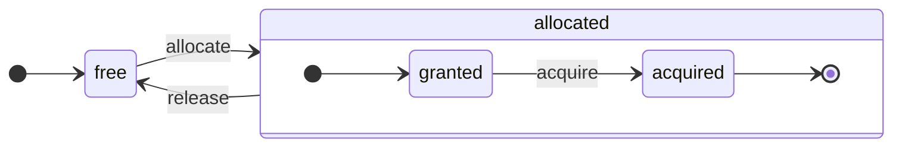

ClickHouse 是一个真正的面向列 DBMS。数据按列存储，并在执行过程中以数组 (向量或数据块) 的形式处理。
只要有可能，操作都会在数组上分派，而不是针对单个值。
这被称为“向量化查询执行”，有助于降低实际数据处理的成本。

这一思想并不新鲜。
它可以追溯到 `APL` (一种编程语言，1957 年) 及其后继者：`A +` (APL 方言) 、`J` (1990 年) 、`K` (1993 年) 以及 `Q` (Kx Systems 于 2003 年推出的编程语言) 。
数组编程被用于科学数据处理。在关系型数据库中，这一思想也不新鲜。例如，`VectorWise` 系统 (也称为 Actian Corporation 的 Actian Vector Analytic Database) 就采用了这种方法。

加速查询处理主要有两种不同的方法：向量化查询执行和运行时代码生成。后者会消除所有间接层和动态分派。这两种方法并没有绝对的优劣之分。运行时代码生成在融合多个操作时可能表现更好，因此能够充分利用 CPU 执行单元和管道。向量化查询执行的实用性可能略逊一筹，因为它涉及必须写入缓存再读回的临时向量。如果临时数据无法放入 L2 缓存，这就会成为问题。但向量化查询执行更容易利用 CPU 的 SIMD 能力。我们的一位朋友撰写的[研究论文](http://15721.courses.cs.cmu.edu/spring2016/papers/p5-sompolski.pdf)表明，最好将这两种方法结合起来。ClickHouse 使用向量化查询执行，并对运行时代码生成提供了有限的初步支持。

  ## 列

`IColumn` 接口用于在内存中表示列 (准确地说，是列的数据块) 。该接口为实现各种关系运算符提供辅助方法。几乎所有操作都是不可变的：它们不会修改原始列，而是创建一个修改后的新列。例如，`IColumn :: filter` 方法接受一个过滤字节掩码，用于 `WHERE` 和 `HAVING` 关系运算符。其他示例包括：用于支持 `ORDER BY` 的 `IColumn :: permute` 方法，以及用于支持 `LIMIT` 的 `IColumn :: cut` 方法。

各种 `IColumn` 实现 (`ColumnUInt8`、`ColumnString` 等) 负责列的内存布局。内存布局通常是连续数组。对于整数类型的列，它就是一个连续数组，类似 `std :: vector`。对于 `String` 和 `Array` 列，则由两个向量组成：一个用于存放连续排列的所有数组元素，另一个用于存放每个数组起始位置的偏移量。还有 `ColumnConst`，它在内存中只存储一个值，但看起来像一列。

  ## Field

不过，也可以处理单个值。要表示单个值，可以使用 `Field`。`Field` 只是 `UInt64`、`Int64`、`Float64`、`String` 和 `Array` 组成的一个可辨识联合。`IColumn` 提供了 `operator []` 方法，可将第 n 个值作为 `Field` 获取；还提供了 `insert` 方法，可将一个 `Field` 追加到列末尾。这些方法的效率都不高，因为它们需要处理表示单个值的临时 `Field` 对象。还有更高效的方法，例如 `insertFrom`、`insertRangeFrom` 等。

`Field` 不包含足以表示表中特定数据类型的信息。例如，`UInt8`、`UInt16`、`UInt32` 和 `UInt64` 在 `Field` 中都表示为 `UInt64`。

  ## 抽象泄漏

`IColumn` 提供了一些常见关系型数据转换的方法，但还不足以覆盖所有需求。例如，`ColumnUInt64` 没有用于计算两列之和的方法，`ColumnString` 也没有用于执行子串搜索的方法。这些大量的例程都在 `IColumn` 之外实现。

针对列的各种函数，既可以通过使用 `IColumn` 的方法提取 `Field` 值，以一种通用但效率不高的方式来实现；也可以利用特定 `IColumn` 实现中数据的内部内存布局知识，以专门优化的方式来实现。具体做法是将函数转换到特定的 `IColumn` 类型，并直接处理其内部表示。例如，`ColumnUInt64` 有一个 `getData` 方法，会返回内部数组的引用，然后由单独的例程直接读取或填充该数组。我们引入“抽象泄漏”，是为了支持对各种例程进行高效的专门化实现。

  ## 数据类型

`IDataType` 负责序列化和反序列化，即以二进制或文本形式读取和写入列数据块或单个值。`IDataType` 与表中的数据类型直接对应。例如，有 `DataTypeUInt32`、`DataTypeDateTime`、`DataTypeString` 等。

`IDataType` 和 `IColumn` 之间只是松散关联。不同的数据类型在内存中可以由相同的 `IColumn` 实现表示。例如，`DataTypeUInt32` 和 `DataTypeDateTime` 都可以表示为 `ColumnUInt32` 或 `ColumnConstUInt32`。此外，同一种数据类型也可以由不同的 `IColumn` 实现表示。例如，`DataTypeUInt8` 可以表示为 `ColumnUInt8` 或 `ColumnConstUInt8`。

`IDataType` 只存储元数据。例如，`DataTypeUInt8` 本身完全不存储任何内容 (除了虚指针 `vptr`) ，而 `DataTypeFixedString` 只存储 `N` (即定长字符串的长度) 。

`IDataType` 为各种数据格式提供辅助方法。例如，包括在可能需要加引号时序列化某个值、为 JSON 序列化某个值，以及将某个值序列化为 XML 格式的一部分等方法。它与数据格式并不存在直接的一一对应关系。例如，不同的数据格式 `Pretty` 和 `TabSeparated` 可以共用 `IDataType` 接口中的同一个 `serializeTextEscaped` 辅助方法。

  ## Block

`Block` 是一种容器，用于表示内存中表的一个子集 (数据块) 。它本质上就是一组三元组：`(IColumn, IDataType, column name)`。在执行查询时，数据是以 `Block` 为单位处理的。只要有一个 `Block`，我们就有数据 (存放在 `IColumn` 对象中) 、类型信息 (存放在 `IDataType` 中，它决定了如何处理该列) ，以及列名。这个列名既可以是表中的原始列名，也可以是为获取临时计算结果而指定的人工名称。

当我们对一个块中的列计算某个函数时，会将结果作为新的一列添加到该块中，而不会改动作为函数参数的那些列，因为这些操作是不可变的。之后，可以从块中移除不再需要的列，但不能修改已有列。这一点很有利于消除公共子表达式。

每个处理中的数据块都会创建一个对应的块。需要注意的是，对于同一类计算，不同块的列名和类型保持不变，变化的只有列数据。最好将块数据与块头分离，因为块较小时，复制 shared&#95;ptr 和列名所产生的临时字符串会带来较高的额外开销。

  ## 处理器

请参见 [https://github.com/ClickHouse/ClickHouse/blob/master/src/Processors/IProcessor.h](https://github.com/ClickHouse/ClickHouse/blob/master/src/Processors/IProcessor.h) 中的说明。

  ## 格式

数据格式由处理器实现。

  ## I/O

对于面向字节的输入/输出，有 `ReadBuffer` 和 `WriteBuffer` 两个抽象类。它们用来代替 C++ 的 `iostream`。不用担心：任何成熟的 C++ 项目出于充分的理由，都会使用 `iostream` 之外的方案。

`ReadBuffer` 和 `WriteBuffer` 本质上都只是一个连续缓冲区，以及一个指向该缓冲区内某个位置的游标。具体实现可以拥有这块缓冲区内存，也可以不拥有。有一个虚方法用于用后续数据填充缓冲区 (对 `ReadBuffer` 而言) ，或者将缓冲区中的数据刷出到某处 (对 `WriteBuffer` 而言) 。这些虚方法很少会被调用。

`ReadBuffer`/`WriteBuffer` 的各种实现可用于处理文件、文件描述符和网络套接字，也可用于实现压缩 (`CompressedWriteBuffer` 用另一个 WriteBuffer 初始化，并在将数据写入其中之前先进行压缩) ，以及其他用途——像 `ConcatReadBuffer`、`LimitReadBuffer` 和 `HashingWriteBuffer` 这样的名称已经足够说明它们的作用。

Read/WriteBuffer 只处理字节。`ReadHelpers` 和 `WriteHelpers` 头文件中提供了一些函数，用于辅助格式化输入/输出。例如，有一些辅助函数可以按十进制格式写入数值。

下面来看一下，当你想把 `JSON` 格式的结果集写到 stdout 时，会发生什么。
你已经有一个可从拉取式 `QueryPipeline` 中取出的结果集。
首先，你创建一个 `WriteBufferFromFileDescriptor(STDOUT_FILENO)`，用于将字节写入 stdout。
接下来，你将查询管道的结果连接到 `JSONRowOutputFormat`，并用该 `WriteBuffer` 对其进行初始化，以便将 `JSON` 格式的行写入 stdout。
这可以通过 `complete` 方法完成，它会把一个拉取式 `QueryPipeline` 转换成一个已完成的 `QueryPipeline`。
在内部，`JSONRowOutputFormat` 会写入各种 JSON 分隔符，并调用 `IDataType::serializeTextJSON` 方法，将 `IColumn` 的引用和行号作为参数传入。因此，`IDataType::serializeTextJSON` 会调用 `WriteHelpers.h` 中的方法：例如，数值类型使用 `writeText`，而 `DataTypeString` 使用 `writeJSONString`。

  ## 表

`IStorage` 接口表示表。该接口的不同实现对应不同的表引擎。例如 `StorageMergeTree`、`StorageMemory` 等。这些类的实例本身就是表。

`IStorage` 中的关键方法是 `read` 和 `write`，以及 `alter`、`rename`、`drop` 等其他方法。`read` 方法接受以下参数：要从表中读取的一组列、需要参考的 `AST` 查询，以及期望的流数量。它返回一个 `Pipe`。

在大多数情况下，`read` 方法只负责从表中读取指定的列，而不负责任何后续的数据处理。
后续所有数据处理都由管道的另一部分完成，不属于 `IStorage` 的职责范围。

但也有一些值得注意的例外：

* `AST` 查询会传递给 `read` 方法，表引擎可以利用它判断如何使用索引，并从表中读取更少的数据。
* 有时表引擎本身可以将数据处理到某个特定阶段。例如，`StorageDistributed` 可以将查询发送到远程服务器，要求它们先将数据处理到能够合并来自不同远程服务器的数据的阶段，然后返回这些预处理后的数据。之后，查询解释器会完成剩余的数据处理。

表的 `read` 方法可以返回一个由多个 `Processors` 组成的 `Pipe`。这些 `Processors` 可以并行地从表中读取数据。
然后，你可以将这些处理器与各种其他转换操作 (例如表达式求值或过滤) 连接起来，这些操作都可以独立计算。
接着，在其上创建一个 `QueryPipeline`，并通过 `PipelineExecutor` 执行它。

还有一些 `TableFunction`。这些函数会返回一个临时的 `IStorage` 对象，用于在查询的 `FROM` clause 中使用。

如果你想快速了解如何实现自己的表引擎，可以先看看一些简单的示例，比如 `StorageMemory` 或 `StorageTinyLog`。

> `IStorage` 还会通过 `read` 方法返回 `QueryProcessingStage`，用于说明查询的哪些部分已经在存储内部完成计算。

  ## 解析器

查询由手写的递归下降解析器进行解析。例如，`ParserSelectQuery` 只是递归调用底层解析器来解析查询的各个部分。解析器会生成 `AST`。`AST` 由节点构成，这些节点都是 `IAST` 的实例。

> 由于历史原因，这里没有使用解析器生成器。

  ## 解释器

解释器负责根据 AST 创建查询执行流水线。解释器有简单的，例如 `InterpreterExistsQuery` 和 `InterpreterDropQuery`；也有更复杂的，例如 `InterpreterSelectQuery`。

查询执行流水线由能够消费和生成数据块 (即具有特定类型的一组列) 的处理器组合而成。
处理器通过端口通信，并且可以有多个输入端口和多个输出端口。
更详细的说明可参见 [src/Processors/IProcessor.h](https://github.com/ClickHouse/ClickHouse/blob/master/src/Processors/IProcessor.h)。

例如，解释 `SELECT` 查询后得到的是一个“pulling” `QueryPipeline`，它带有一个特殊的输出端口，可用于读取结果集。
解释 `INSERT` 查询后得到的是一个“pushing” `QueryPipeline`，它带有一个输入端口，可用于写入待插入的数据。
而解释 `INSERT SELECT` 查询后得到的是一个“completed” `QueryPipeline`，它既没有输入也没有输出，但会同时将数据从 `SELECT` 复制到 `INSERT`。

`InterpreterSelectQuery` 使用 `ExpressionAnalyzer` 和 `ExpressionActions` 机制进行查询分析和转换。大多数基于规则的查询优化都在这里完成。`ExpressionAnalyzer` 相当混乱，应该重写：应将各种查询转换和优化提取到单独的类中，以支持对查询进行模块化转换。

为了解决解释器中现有的问题，开发了新的 `InterpreterSelectQueryAnalyzer`。这是 `InterpreterSelectQuery` 的新版本，不使用 `ExpressionAnalyzer`，并在 `AST` 和 `QueryPipeline` 之间引入了一个名为 `QueryTree` 的额外抽象层。它已经完全可以用于生产环境；不过为稳妥起见，也可以将 `enable_analyzer` 设置为 `false` 来关闭它。

  ## 函数

函数分为普通函数和聚合函数。有关聚合函数，请参见下一节。

普通函数不会改变行数——它们的工作方式就像每一行都是独立处理的。实际上，函数并不是针对单独的行调用的，而是针对数据 `Block` 调用，以实现向量化查询执行。

还有一些杂项函数，例如 [blockSize](/zh/reference/functions/regular-functions/other-functions#blockSize)、[rowNumberInBlock](/zh/reference/functions/regular-functions/other-functions#rowNumberInBlock) 和 [runningAccumulate](/zh/reference/functions/regular-functions/other-functions#runningAccumulate)，它们利用块处理，因此打破了各行之间的独立性。

ClickHouse 采用强类型，因此不存在隐式类型转换。如果某个函数不支持特定的类型组合，就会抛出异常。不过，函数可以适用于许多不同的类型组合 (即支持重载) 。例如，`plus` 函数 (用于实现 `+` 运算符) 适用于任意数值类型组合：`UInt8` + `Float32`、`UInt16` + `Int8`，等等。此外，一些可变参数函数可以接受任意数量的参数，例如 `concat` 函数。

实现函数可能会稍微有些麻烦，因为函数需要显式分派所支持的数据类型和 `IColumns`。例如，`plus` 函数的代码是通过为每种数值类型组合，以及左右参数为常量或非常量的情况实例化 C++ 模板生成的。

这里非常适合实现运行时代码生成，以避免模板代码膨胀。此外，这也使得添加融合函数 (如 fused multiply-add) 成为可能，或者在一次循环迭代中执行多个比较。

由于采用向量化查询执行，函数不会进行短路求值。例如，如果你写 `WHERE f(x) AND g(y)`，那么两边都会被计算，即使对于 `f(x)` 为零的行也是如此 (除非 `f(x)` 是值为零的常量表达式) 。但如果 `f(x)` 条件的选择性很高，并且计算 `f(x)` 的开销远小于 `g(y)`，那么最好实现多遍计算。它会先计算 `f(x)`，然后根据结果过滤列，接着仅对更小、经过过滤的数据块计算 `g(y)`。

  ## 聚合函数

聚合函数是有状态的函数。它们会将传入的值累积到某种状态中，并允许你从该状态中获取结果。它们由 `IAggregateFunction` interface 管理。状态可以非常简单 (`AggregateFunctionCount` 的状态只是一个 `UInt64` 值) ，也可以相当复杂 (`AggregateFunctionUniqCombined` 的状态由线性数组、哈希表以及 `HyperLogLog` 概率数据结构组合而成) 。

状态分配在 `Arena` (内存池) 中，以便在执行高基数 `GROUP BY` 查询时处理多个状态。状态的构造函数和析构函数可能并不简单：例如，复杂的聚合状态本身可能还会分配额外的内存。因此，需要特别注意状态的创建和销毁，以及正确处理其所有权传递和销毁顺序。

聚合状态可以序列化和反序列化，以便在分布式查询执行期间通过网络传输，或者在 RAM 不足时写入磁盘。它们甚至可以通过 `DataTypeAggregateFunction` 存储在表中，从而支持数据的增量聚合。

> 聚合函数状态的序列化数据格式目前还没有版本控制。如果聚合状态只是临时存储，这没有问题。但我们有用于增量聚合的 `AggregatingMergeTree` 表引擎，而且它已经被用于生产环境。这就是为什么今后更改任何聚合函数的序列化格式时，都必须保证向后兼容。

  ## 服务器

服务器实现了几种不同的接口：

* 面向各种外部客户端的 HTTP 接口。
* 面向原生 ClickHouse 客户端，以及在分布式查询执行期间用于服务器间通信的 TCP 接口。
* 用于复制过程中传输数据的接口。

在内部，它本质上只是一个简单的多线程服务器，没有协程或纤程。由于服务器并不是为高频率处理简单查询而设计的，而是为以相对较低的频率处理复杂查询而设计的，因此每个查询都可以处理海量数据用于分析。

服务器会用查询执行所需的环境初始化 `Context` 类：可用数据库列表、用户和访问权限、设置、集群、进程列表、查询日志等。解释器 会使用这一环境。

我们对服务器 TCP 协议保持完整的向后和向前兼容性：旧客户端可以与新服务器通信，新客户端也可以与旧服务器通信。但我们并不打算永远维持这种兼容性，因此大约一年后就会移除对旧版本的支持。

<Note>
  对于大多数外部应用程序，我们建议使用 HTTP 接口，因为它简单且易于使用。TCP 协议与内部数据结构耦合得更紧密：它使用内部格式传递数据块，并使用自定义帧格式处理压缩数据。
</Note>

  ## 配置

ClickHouse Server 基于 POCO C++ Libraries，并使用 `Poco::Util::AbstractConfiguration` 表示其配置。配置由 `Poco::Util::ServerApplication` 类持有；`DaemonBase` 类继承自该类，而 `DB::Server` 类又继承自 `DaemonBase`，并实现了 clickhouse-server 本身。因此，可通过 `ServerApplication::config()` 方法访问配置。

配置会从多个文件 (XML 或 YAML 格式) 中读取，并由 `ConfigProcessor` 类合并为一个 `AbstractConfiguration`。配置在服务器启动时加载；如果某个配置文件被更新、删除或新增，之后也可以重新加载。`ConfigReloader` 类还负责定期监测这些变更并执行重新加载流程。`SYSTEM RELOAD CONFIG` 查询也会触发配置重新加载。

对于 `Server` 之外的查询和子系统，可通过 `Context::getConfigRef()` 方法访问配置。每个能够在不重启服务器的情况下重新加载其配置的子系统，都应在 `Server::main()` 方法的 reload callback 中注册自己。请注意，如果新配置存在错误，大多数子系统会忽略该新配置、记录警告消息，并继续使用之前已加载的配置。由于 `AbstractConfiguration` 的特性，无法传递对特定节的引用，因此通常改用 `String config_prefix`。

  ### 上下文

ClickHouse 通过上下文层级来管理设置：

* **全局上下文** - 通过配置文件定义的服务器级设置
* **会话上下文** - 来自 profile、用户配置和 SET 命令的用户会话设置
* **查询上下文** - 来自 SETTINGS 子句的查询级设置
* **后台上下文** - 通过 &#39;background&#39; profile 定义的、用于后台操作 (变更、合并) 的服务器级设置

在调度某项操作 (查询、变更等) 时，server 会按以下顺序合并设置，构建对应的上下文 (后面的部分会覆盖前面的部分) ：

1. 全局默认值
2. 全局配置
3. profile 设置 (来自 `<profiles>` 部分)
4. 用户设置 (来自 `<users>` 部分)
5. 会话设置 (来自 SET 命令)
6. 查询设置 (来自 SETTINGS 子句)

<Note>
  后台操作可通过全局设置和 &#39;background&#39; profile 设置进行配置；在这种情况下，会话设置和查询设置不会生效。如果未提供显式配置，则会继承全局上下文中的配置。此类操作的默认 profile 名称为 &#39;background&#39;，可通过 `background_profile` 服务器级设置覆盖。
</Note>

  ## 线程与作业

为了执行查询和处理一些附带活动，ClickHouse 会从某个线程池中分配线程，以避免频繁创建和销毁线程。系统中有几个线程池，会根据作业的用途和结构来选择：

* 用于传入客户端会话的 server 池。
* 用于通用作业、后台活动和独立线程的全局线程池。
* 用于主要被某些 IO 阻塞且并非 CPU 密集型的作业的 IO 线程池。
* 用于周期性任务的后台池。
* 用于可抢占任务的池，这类任务可以拆分为多个步骤。

Server pool 是在 `Server::main()` 方法中定义的 `Poco::ThreadPool` 类实例。它最多可拥有 `max_connection` 个线程。每个线程专用于一个活动连接。

全局线程池是 `GlobalThreadPool` 单例类。要从中分配线程，使用的是 `ThreadFromGlobalPool`。它的接口与 `std::thread` 类似，但会从全局线程池中获取线程，并完成所有必要的初始化。它通过以下设置进行配置：

* `max_thread_pool_size` - 线程池中线程数量的上限。
* `max_thread_pool_free_size` - 等待新作业的空闲线程数量上限。
* `thread_pool_queue_size` - 已调度作业数量的上限。

全局池是通用的，下面描述的所有池都构建在它之上。可以将其视为一个线程池层级结构。任何专用池都会通过 `ThreadPool` 类从全局池获取线程。因此，任何专用池的主要目的都是限制同时运行的作业数量，并对作业进行调度。如果已调度的作业数量多于池中的线程数，`ThreadPool` 就会按照优先级将作业积压在队列中。每个作业都有一个整数优先级，默认优先级为 0。优先级值更高的作业会先于任何优先级更低的作业启动。但对于已经在执行的作业则没有区别，因此优先级只有在线程池过载时才会起作用。

IO 线程池实现为一个普通的 `ThreadPool`，可通过 `IOThreadPool::get()` 方法访问。它的配置方式与全局池相同，使用 `max_io_thread_pool_size`、`max_io_thread_pool_free_size` 和 `io_thread_pool_queue_size` 设置。IO 线程池的主要目的是避免 IO 作业耗尽全局池，否则可能导致查询无法充分利用 CPU。备份到 S3 会执行大量 IO 操作。为了避免影响交互式查询，这里还提供了一个单独的 `BackupsIOThreadPool`，通过 `max_backups_io_thread_pool_size`、`max_backups_io_thread_pool_free_size` 和 `backups_io_thread_pool_queue_size` 设置进行配置。

对于周期性任务的执行，有一个 `BackgroundSchedulePool` 类。你可以使用 `BackgroundSchedulePool::TaskHolder` 对象注册任务，线程池会确保同一个任务不会同时运行两个作业。它还允许你将任务执行推迟到未来某个特定时刻，或暂时停用任务。全局 `Context` 会针对不同用途提供该类的几个实例。对于通用任务，使用 `Context::getSchedulePool()`。

另外还有一些用于可抢占任务的专用线程池。这类 `IExecutableTask` 任务可以拆分为按顺序排列的一系列作业，称为步骤。为了以一种让短任务优先于长任务的方式调度这些任务，会使用 `MergeTreeBackgroundExecutor`。顾名思义，它用于 MergeTree 相关的后台操作，例如 merges、mutations、fetches 和 moves。池实例可通过 `Context::getCommonExecutor()` 及其他类似方法获取。

无论作业使用哪个池，在启动时都会为该作业创建一个 `ThreadStatus` 实例。它封装了所有线程级信息：线程 id、查询 id、性能计数器、资源消耗以及许多其他有用数据。作业可以通过调用 `CurrentThread::get()`，借助线程局部指针访问它，因此不需要将它传递给每个函数。

如果线程与查询执行相关，那么附加到 `ThreadStatus` 上最重要的内容就是查询上下文 `ContextPtr`。每个查询在 server 池中都有自己的主线程。主线程通过持有一个 `ThreadStatus::QueryScope query_scope(query_context)` 对象来完成附加。主线程还会创建一个由 `ThreadGroupStatus` 对象表示的线程组。在该查询执行期间分配的每个额外线程，都会通过调用 `CurrentThread::attachTo(thread_group)` 附加到其线程组。线程组用于聚合 profile event 计数器，并跟踪专用于单个任务的所有线程的内存消耗 (更多信息请参见 `MemoryTracker` 和 `ProfileEvents::Counters` 类) 。

  ## 并发控制

可并行化的查询会使用 `max_threads` 设置来限制自身。这个设置的默认值经过专门设计，使单个查询能够尽可能高效地利用所有 CPU 核心。但如果同时有多个并发查询，并且它们都使用默认的 `max_threads` 值，会发生什么呢？这时，这些查询就会共享 CPU 资源。操作系统会通过不断切换线程来保证公平性，但这会带来一定的性能损耗。`ConcurrencyControl` 有助于应对这种损耗，并避免分配过多线程。配置项 `concurrent_threads_soft_limit_num` 用于限制在开始施加某种 CPU 压力之前，可分配的并发线程数量。

这里引入了 CPU `slot` 的概念。插槽是并发单位：线程要运行，必须先获取一个插槽，并在线程停止时释放它。服务器中的插槽总数在全局范围内受到限制。如果总需求超过插槽总数，多个并发查询就会竞争 CPU 插槽。`ConcurrencyControl` 负责以公平的方式进行 CPU 插槽调度，从而解决这种竞争。

每个插槽都可以看作一个独立的状态机，具有以下状态：

* `free`：插槽可供任何查询分配。
* `granted`：插槽已由特定查询 `allocated`，但尚未被任何线程获取。
* `acquired`：插槽已由特定查询 `allocated`，并且已被某个线程获取。

请注意，`allocated` 的插槽可以处于两种不同状态：`granted` 和 `acquired`。前者是一个过渡状态，实际持续时间应当很短 (从插槽分配给某个查询的那一刻起，到该查询中的任意线程执行扩容流程为止) 。

`ConcurrencyControl` 的 API 包含以下函数：

1. 为查询创建资源分配：`auto slots = ConcurrencyControl::instance().allocate(1, max_threads);`。它会至少分配 1 个、最多分配 `max_threads` 个插槽。请注意，第一个插槽会立即授予，但其余插槽可能会稍后授予。因此这是一个软限制，因为每个查询至少都会获得一个线程。
2. 对于每个线程，都必须从分配中获取一个插槽：`while (auto slot = slots->tryAcquire()) spawnThread([slot = std::move(slot)] { ... });`。
3. 更新插槽总数：`ConcurrencyControl::setMaxConcurrency(concurrent_threads_soft_limit_num)`。可在运行时完成，无需重启服务器。

该 API 允许查询至少以一个线程启动 (在 CPU 压力较大时) ，并在之后扩展到 `max_threads`。

  ## 分布式查询执行

集群中的服务器大多彼此独立。你可以在集群中的一台或全部服务器上创建 `Distributed` 表。`Distributed` 表本身不存储数据——它只是为集群中多个节点上的所有本地表提供一个“视图”。当你从 `Distributed` 表执行 SELECT 时，它会重写该查询，根据负载均衡设置选择远程节点，并将查询发送到这些节点。`Distributed` 表会请求远程服务器将查询处理到一个阶段，使来自不同服务器的中间结果能够合并。然后，它再接收这些中间结果并将其合并。分布式表会尽可能把更多工作分配给远程服务器，从而减少通过网络传输的中间数据量。

当 IN 或 JOIN 子句中包含子查询，且每个子查询都使用 `Distributed` 表时，情况就会更复杂。对于这类查询的执行，我们有不同的策略。

分布式查询执行没有全局查询计划。每个节点都只有负责自身那部分任务的本地查询计划。我们目前只有简单的单遍分布式查询执行：向远程节点发送查询，然后合并结果。但对于包含高基数 `GROUP BY`，或需要为 JOIN 维护大量临时数据的复杂查询，这种方式并不可行。在这种情况下，我们需要在服务器之间“重新分发”数据，这就需要额外的协调。ClickHouse 目前不支持这种查询执行方式，我们还需要继续改进这方面的能力。

  ## Merge tree

`MergeTree` 是一个支持按主键建立索引的存储引擎家族。主键可以是由列或表达式组成的任意元组。`MergeTree` 表中的数据以 &quot;parts&quot; 的形式存储。每个 part 都按主键顺序存储数据，因此数据会按照主键元组的字典序排列。表中的所有列都分别存储在这些 part 内独立的 `column.bin` 文件中。文件由压缩后的块组成。每个块通常包含 64 KB 到 1 MB 的未压缩数据，具体取决于平均值大小。块中的列值是连续存放的。每一列中的值顺序都相同 (顺序由主键定义) ，因此当你遍历多列时，就能得到对应行的值。

主键本身是“稀疏”的。它不会定位到每一行，而只会定位到某些数据范围。单独的 `primary.idx` 文件会保存每第 N 行的主键值，其中 N 称为 `index_granularity` (通常 N = 8192) 。此外，对于每一列，都有 `column.mrk` 文件，其中包含 &quot;marks&quot;，也就是数据文件中每第 N 行对应的偏移量。每个 mark 都是一对值：压缩块在文件中起始位置的偏移量，以及数据在解压后块中起始位置的偏移量。通常压缩块会按 marks 对齐，因此解压后块中的偏移量为零。`primary.idx` 的数据始终驻留在内存中，而 `column.mrk` 文件的数据会被缓存。

当我们要从 `MergeTree` 的某个 part 中读取内容时，会先查看 `primary.idx` 数据，定位可能包含所请求数据的范围，再查看 `column.mrk` 数据，计算这些范围应从何处开始读取。由于索引是稀疏的，读取时可能会带出额外数据。ClickHouse 并不适合高负载的简单点查询，因为对每个键，都必须读取包含 `index_granularity` 行的整个范围，并且每一列都要解压整个压缩块。我们将索引设计为稀疏，是因为必须能够在单台服务器上维护万亿级行数，同时又不让索引占用显著的内存。另外，由于主键是稀疏的，它不是唯一的：无法在 INSERT 时检查表中是否已存在该键。也就是说，一张表中可以有多行拥有相同的键。

当你向 `MergeTree` `INSERT` 一批数据时，这批数据会先按主键顺序排序，然后形成一个新的 part。后台线程会定期挑选一些 parts，并将它们合并成一个有序的 part，以便将 parts 的数量维持在相对较低的水平。这也正是它被称为 `MergeTree` 的原因。当然，合并会带来“写放大”。所有 part 都是不可变的：它们只会被创建和删除，不会被修改。执行 SELECT 时，会持有表的一个快照 (即一组 parts) 。合并后，我们还会保留旧的 parts 一段时间，以便在发生故障时更容易恢复；因此，如果发现某个合并后的 part 可能已损坏，就可以用它的源 parts 替换它。

`MergeTree` 不是 LSM tree，因为它不包含 MEMTABLE 和 LOG：写入的数据会直接写入 filesystem。这种行为使 MergeTree 更适合按批次写入数据。因此，频繁插入少量行并不适合 MergeTree。例如，每秒插入几行没有问题，但每秒执行一千次插入对 MergeTree 来说并不理想。不过，针对小规模写入，也有一种 async insert 模式可以克服这一限制。我们之所以这样设计，是为了简化实现，也因为我们的应用本身就已经在按批次写入数据

有一些 MergeTree 引擎会在后台合并期间执行额外工作。示例包括 `CollapsingMergeTree` 和 `AggregatingMergeTree`。这可以看作是对更新操作的一种特殊支持。请记住，这些并不是真正的更新，因为用户通常无法控制后台合并何时执行，而且 `MergeTree` 表中的数据几乎总是以多个 part 的形式存储，而不是处于完全合并后的状态。

  ## 复制

ClickHouse 中的复制可以按表配置。你可以在同一台服务器上同时拥有一些复制表和一些非复制表。你也可以对不同的表采用不同的复制方式，例如一张表使用双副本复制，另一张表使用三副本复制。

复制由 `ReplicatedMergeTree` 存储引擎实现。`ZooKeeper` 中的路径作为该存储引擎的参数指定。凡是在 `ZooKeeper` 中使用相同路径的表，都会互为副本：它们会同步数据并保持一致性。只需创建或删除表，即可动态添加和移除副本。

复制采用异步多主方案。你可以向任何与 `ZooKeeper` 建立了会话的副本插入数据，数据会异步复制到其他所有副本。由于 ClickHouse 不支持 UPDATE，因此复制不存在冲突。由于默认情况下插入不进行 quorum 确认，如果某个节点发生故障，刚插入的数据可能会丢失。可以使用 `insert_quorum` 设置启用插入 quorum。

复制的元数据存储在 ZooKeeper 中。其中有一份复制日志，列出了需要执行的操作。操作包括：获取 part、合并 parts、删除一个分区，等等。每个副本都会将复制日志拷贝到自己的队列中，然后执行队列里的操作。例如，在插入时，日志中会创建“获取该 part”的操作，而每个副本都会下载该 part。副本之间会协调 merges，以获得字节级完全一致的结果。所有 parts 都会在所有副本上以相同方式合并。某个 leader 会首先发起新的 merge，并将“合并 parts”的操作写入日志。多个副本 (甚至全部) 可以同时充当 leader。可以使用 `merge_tree` 设置中的 `replicated_can_become_leader` 来阻止某个副本成为 leader。leaders 负责调度后台 merges。

复制是物理层面的：节点之间传输的只有压缩后的 parts，而不是 queries。在大多数情况下，为了避免网络放大、降低网络成本，merges 都会在每个副本上独立处理。只有在复制延迟显著时，大的已合并 parts 才会通过网络传输。

此外，每个副本还会将自身状态存储在 ZooKeeper 中，内容包括其 parts 集合及其校验和。当本地 filesystem 上的状态与 ZooKeeper 中的参考状态出现偏差时，副本会通过从其他副本下载缺失或损坏的 parts 来恢复一致性。当本地 filesystem 中存在某些意外或损坏的数据时，ClickHouse 不会将其删除，而是会将其移动到单独的 directory 中，并不再管理它。

<Note>
  ClickHouse 集群由彼此独立的 shards 组成，而每个 shard 又由多个副本组成。该集群**不是弹性的**，因此添加新的 shard 后，数据不会在 shards 之间自动重新平衡。相反，通常需要接受集群负载是不均衡的。这种实现让你拥有更高的控制力，对于相对较小的集群 (例如几十个节点) 来说是可以接受的。但对于我们在生产环境中使用的、拥有数百个节点的集群，这种方式就会成为一个明显的缺点。我们应当实现一种能够跨整个集群的表引擎，并使用可动态复制的区域，使其能够在集群之间自动拆分并实现平衡。
</Note>